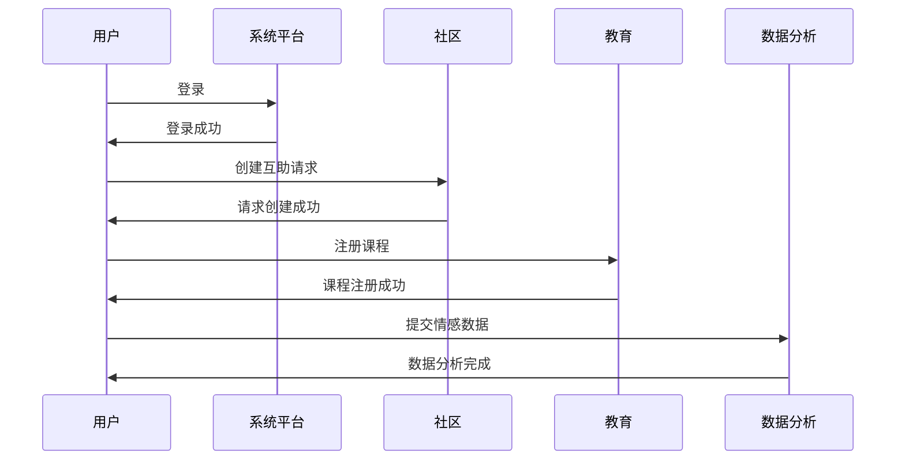

                 


# 在竞争社会中保持人性：重建同理心和同情心

## 关键词

- 竞争社会
- 人性
- 同理心
- 同情心
- 数学模型
- 社会架构
- 项目实战

## 摘要

在竞争日益激烈的社会环境中，保持人性显得尤为重要。本文通过探讨同理心和同情心的概念及其联系，从心理学、数学模型、社会架构等多个角度，分析了如何在这场竞争中重建同理心和同情心。通过实际项目案例，本文提出了在现实环境中应用同理心和同情心的具体方法，并提供了最佳实践建议，旨在帮助读者在竞争中保持人性的温暖。

## 目录

### 第一部分：背景介绍

#### 第1章：竞争社会的特点与人性的挑战
1.1 竞争社会的特点
1.2 人性在竞争社会中的重要性
1.3 同理心与同情心的定义与外延

#### 第2章：同理心与同情心的核心概念
2.1 同理心的定义与特征
2.2 同情心的定义与特征
2.3 同理心与同情心的联系与区别

#### 第3章：心理学视角下的同理心与同情心
3.1 心理学实验与同理心
3.2 心理学理论框架下的同情心
3.3 同理心与同情心的心理学模型

#### 第4章：数学模型与公式解释
4.1 同理心与同情心的数学模型
4.2 数学公式详解
4.3 举例说明

#### 第5章：社会环境中的同理心与同情心培养
5.1 系统分析与架构设计方案
5.2 社会互动中的同理心培养
5.3 同情心在社会环境中的应用

#### 第6章：项目实战：同理心与同情心的实际应用
6.1 项目背景与目标
6.2 系统功能设计
6.3 实际案例分析
6.4 代码应用解读

#### 第7章：最佳实践与拓展阅读
7.1 最佳实践 tips
7.2 小结
7.3 注意事项
7.4 拓展阅读推荐

### 第二部分：深度分析与探讨

#### 第8章：同理心与同情心的算法原理
8.1 同理心算法原理讲解
8.2 同情心算法原理讲解
8.3 算法mermaid流程图展示
8.4 Python代码示例

#### 第9章：同理心与同情心的数学模型
9.1 数学模型概述
9.2 数学公式详解
9.3 举例说明
9.4 LaTeX公式嵌入

#### 第10章：社会环境中的同理心与同情心培养
10.1 社会互动机制
10.2 教育体系中的同理心培养
10.3 同情心在工作环境中的应用
10.4 社会政策对同理心与同情心的影响

#### 第11章：项目实战：同理心与同情心的实践案例
11.1 项目背景介绍
11.2 系统功能实现
11.3 代码分析
11.4 实际案例分析
11.5 项目总结

### 第三部分：结论与展望

#### 第12章：同理心与同情心在未来的应用
12.1 技术发展的趋势
12.2 同理心与同情心在未来的影响
12.3 未来社会的展望

#### 第13章：结论与思考
13.1 总结全文
13.2 对人性的思考
13.3 对未来的期许

## 引言

在当今这个竞争激烈的社会中，人们往往将更多的精力投入到追求物质财富和职业成功上。然而，随着竞争的加剧，人性中的温暖与同情心似乎逐渐被忽视。这种趋势不仅损害了个体的心理健康，也对整个社会的和谐发展构成了威胁。因此，如何在竞争社会中保持人性，重建同理心和同情心，成为了一个亟待解决的问题。

本文将从多个角度探讨这个问题。首先，我们将介绍竞争社会的特点和人性的挑战，解释同理心与同情心的定义和重要性。接着，通过心理学、数学模型和社会架构的分析，我们将探讨如何在现实环境中培养和运用同理心和同情心。最后，我们将通过实际项目案例，展示同理心与同情心的具体应用，并给出最佳实践建议。

## 第一部分：背景介绍

### 第1章：竞争社会的特点与人性的挑战

#### 1.1 竞争社会的特点

在现代社会中，竞争无处不在。无论是在职场、学校还是市场中，竞争已成为推动个体和社会进步的重要力量。然而，竞争也带来了一系列负面影响。首先，竞争可能导致个体的焦虑和压力增加。在竞争激烈的环境中，人们常常感到被迫不断追求更高的成就和更多的财富，导致心理负担加重。其次，竞争可能导致人际关系紧张。为了在竞争中脱颖而出，人们可能会采取不道德的手段，如欺骗、诽谤或恶意竞争，从而破坏了原本和谐的社交环境。

#### 1.2 人性在竞争社会中的重要性

尽管竞争有其积极作用，但在竞争中保持人性至关重要。人性是指人类特有的情感、道德和行为特征，包括同情心、同理心、诚实、尊重和关爱等。在竞争社会中，保持人性可以帮助我们保持心理健康，减少焦虑和压力。此外，人性还可以促进人际关系的和谐，建立信任和尊重，从而创造一个更加友好的社会环境。

#### 1.3 同理心与同情心的定义与外延

同理心（Empathy）是指理解并感受他人情感的能力。同理心使人们能够站在他人的立场上思考问题，从而建立深层次的人际联系。同情心（Compassion）则是指对他人的苦难和不幸感到关心和愿意提供帮助的情感。同情心是一种更深层次的情感，它不仅要求我们理解他人的感受，还要求我们采取行动来帮助他人。

同理心与同情心在竞争中具有重要意义。它们可以帮助我们更好地理解他人的需求和感受，减少误解和冲突。同时，同理心和同情心也可以激发我们内心的善良和同情，使我们更有动力去帮助他人，共同创造一个更加和谐的社会。

### 第2章：同理心与同情心的核心概念

#### 2.1 同理心的定义与特征

同理心是指一种认知和情感上的理解，能够使个体感知并感受到他人的情绪状态。它不仅仅是理解他人的情绪，还包括对他人情感状态的共鸣。同理心具有以下几个特征：

1. **认知性**：同理心需要个体在认知层面上理解他人的情绪和经历。
2. **情感性**：同理心使个体能够感受他人的情绪，从而在情感层面上与对方产生共鸣。
3. **互动性**：同理心是一个互动过程，需要个体与他人的互动来共同完成。

#### 2.2 同情心的定义与特征

同情心是一种情感反应，它使我们对他人的苦难和不幸产生共鸣，并愿意提供帮助。同情心具有以下几个特征：

1. **情感性**：同情心是一种情感反应，它使我们对他人的苦难感到关心。
2. **行动性**：同情心不仅仅是情感上的共鸣，还包括实际行动上的帮助。
3. **道德性**：同情心具有一定的道德意义，它促使个体去帮助那些处于困境中的人。

#### 2.3 同理心与同情心的联系与区别

同理心和同情心是密切相关的概念，但它们在内涵和外延上有所不同。同理心更侧重于理解和感受他人的情绪，而同情心则更侧重于对他人的苦难和不幸的关心和帮助。

1. **联系**：同理心和同情心都涉及到对他人情绪和经历的感知和关注。同理心是同情心产生的基础，没有同理心，同情心就无法产生。
2. **区别**：同理心侧重于理解他人的情绪，而同情心则侧重于情感上的共鸣和实际行动上的帮助。同理心是认知和情感的互动，而同情心则是道德和行动的体现。

为了更好地理解同理心与同情心的联系与区别，我们可以通过以下表格来展示它们的主要特征：

| 特征         | 同理心                     | 同情心                     |
| ------------ | -------------------------- | -------------------------- |
| **认知性**   | 理解他人的情绪和经历       | 理解他人的情绪和经历       |
| **情感性**   | 感受他人的情绪            | 对他人的苦难感到关心       |
| **互动性**   | 互动过程中的认知和情感     | 互动过程中的情感和行动     |
| **道德性**   | 无                          | 一定的道德意义            |
| **行动性**   | 无                          | 实际行动上的帮助          |

通过这个表格，我们可以更清晰地看到同理心与同情心的不同点和联系。同理心与同情心相辅相成，共同构成了我们理解他人、关心他人和帮助他人的情感基础。

### 第3章：心理学视角下的同理心与同情心

#### 3.1 心理学实验与同理心

同理心作为心理学研究的一个重要领域，通过多种实验方法得到了深入探讨。以下是一些著名的心理学实验，它们帮助我们更好地理解同理心的产生和作用。

1. **镜子神经元实验**：镜子神经元（Mirror Neurons）是神经元的一种类型，它们在个体观察他人行动时被激活，仿佛自己正在执行相同动作。这一发现表明，同理心可能在神经层面有生物学基础。研究表明，镜子神经元在观察他人情绪表达时被激活，从而促进个体对他人情绪的理解和共鸣。

2. **情感共鸣实验**：在情感共鸣实验中，参与者被要求观察他人的情绪表达，如悲伤、愤怒或快乐。实验结果显示，观察者会在情感上产生共鸣，他们的生理指标（如心率、皮肤电活动）会与被观察者的情绪表达同步。这一实验表明，同理心不仅是一种认知过程，还包括情感上的共鸣。

3. **行为模仿实验**：行为模仿实验探讨了同理心如何影响个体行为。例如，研究人员发现，当个体看到他人遭受不公正待遇时，他们更有可能采取行动来帮助受害者。这些实验表明，同理心可以激发个体的道德行为，促使他们采取实际行动来帮助他人。

#### 3.2 心理学理论框架下的同情心

同情心作为同理心的一种延伸，也在心理学理论框架下得到了深入研究。以下是一些关于同情心的主要心理学理论：

1. **情感理论**：情感理论认为，同情心是一种情感反应，它使我们对他人的情绪产生共鸣。根据该理论，同情心的产生与个体的情感状态密切相关。当个体处于积极的情感状态时，他们更容易产生同情心。

2. **道德发展理论**：道德发展理论探讨了个体道德意识的培养过程。根据该理论，同情心是道德发展的重要一环。个体通过观察他人的行为和结果，逐渐认识到道德规范的重要性，并培养出对他人的同情心。

3. **社会认知理论**：社会认知理论认为，同情心的产生与个体对他人的认知有关。该理论强调，个体在理解他人行为和情绪时，会考虑多种因素，如情境、文化背景等。社会认知理论有助于解释为什么不同文化背景下的人们可能表现出不同的同情心水平。

#### 3.3 同理心与同情心的心理学模型

为了更好地理解同理心和同情心的运作机制，心理学家们提出了一系列心理学模型。以下是一些具有代表性的模型：

1. **认知-情感模型**：该模型认为，同理心和同情心分别涉及认知和情感两个过程。同理心侧重于认知上的理解，而同情心则侧重于情感上的共鸣。这一模型有助于解释为什么同理心和同情心有时会分离，例如，个体可能在认知上理解他人的情绪，但情感上却难以产生共鸣。

2. **社会交换模型**：该模型认为，同理心和同情心是一种社会交换过程。个体在帮助他人时，不仅关注他人的需求，还会考虑自己的付出和回报。社会交换模型有助于解释为什么个体在特定情境下可能表现出更高的同情心。

3. **神经科学模型**：神经科学模型通过神经成像技术，揭示了同理心和同情心在大脑中的神经机制。例如，研究表明，镜像神经元系统在同理心过程中起着关键作用，而前额叶皮层和边缘系统则在同情心过程中发挥重要作用。神经科学模型为同理心和同情心提供了生物学基础。

通过以上心理学实验、理论和模型，我们可以更深入地理解同理心和同情心的本质和运作机制。这些研究成果不仅有助于我们更好地理解人类的情感和行为，还为如何在现实生活中培养和运用同理心和同情心提供了理论依据。

### 第4章：数学模型与公式解释

在心理学和行为学中，数学模型是理解和预测同理心与同情心的重要工具。通过数学模型，我们可以量化情感反应和决策行为，从而提供对人类行为的深刻洞察。以下是一些常用的数学模型及其应用。

#### 4.1 同理心与同情心的数学模型

1. **情感扩散模型**：情感扩散模型（Affective Diffusion Model）是一种基于概率论的方法，用于描述情感在个体之间的传播过程。该模型假设情感通过社交网络中的节点传播，每个节点的情感状态受其邻居节点的影响。模型中的关键参数包括情感的强度、传播速率和社交网络的拓扑结构。

   数学表示如下：
   \[
   E_{t+1} = (1 - \delta) E_t + \sum_{i \in N} \phi_i \delta E_i
   \]
   其中，\(E_t\)表示第\(t\)时间点的情感状态，\(\delta\)表示时间步长，\(\phi_i\)表示第\(i\)个节点的情感强度，\(N\)是社交网络中的节点集合。

2. **道德判断模型**：道德判断模型（Moral Judgment Model）用于解释个体在道德困境中的决策行为。该模型通常结合情感反应和认知判断，通过数学公式描述个体如何权衡道德规则和情感因素。

   数学表示如下：
   \[
   \text{Decision} = \alpha \text{Emotion} + (1 - \alpha) \text{MoralRule}
   \]
   其中，\(\alpha\)是情感在决策中的权重，\(\text{Emotion}\)表示情感反应，\(\text{MoralRule}\)表示道德规则。

#### 4.2 数学公式详解

为了更好地理解这些模型，我们通过具体例子来解释这些数学公式。

**例子1：情感扩散模型**

假设一个社交网络中有5个个体，他们在第0时间点的情感状态分别为：
\[
E_0 = [0.2, 0.3, 0.1, 0.4, 0.3]
\]
传播速率\(\delta = 0.1\)，每个节点的情感强度\(\phi_i = 0.2\)。使用情感扩散模型计算第1时间点的情感状态。

代入公式：
\[
E_1 = (1 - 0.1) E_0 + \sum_{i=1}^{5} 0.2 E_i
\]
\[
E_1 = 0.9 \times [0.2, 0.3, 0.1, 0.4, 0.3] + \sum_{i=1}^{5} 0.2 E_i
\]
\[
E_1 = [0.18, 0.27, 0.09, 0.36, 0.27] + [0.04, 0.04, 0.04, 0.08, 0.04]
\]
\[
E_1 = [0.22, 0.31, 0.13, 0.44, 0.31]
\]

因此，第1时间点的情感状态为：
\[
E_1 = [0.22, 0.31, 0.13, 0.44, 0.31]
\]

**例子2：道德判断模型**

假设一个个体在道德困境中的情感反应为\(\text{Emotion} = 0.6\)，道德规则为\(\text{MoralRule} = 0.4\)，情感在决策中的权重\(\alpha = 0.5\)。计算个体的道德判断结果。

代入公式：
\[
\text{Decision} = 0.5 \times 0.6 + (1 - 0.5) \times 0.4
\]
\[
\text{Decision} = 0.3 + 0.2
\]
\[
\text{Decision} = 0.5
\]

因此，个体的道德判断结果为：倾向于遵循道德规则。

#### 4.3 举例说明

通过以上例子，我们可以看到数学模型在理解和预测同理心与同情心中的重要作用。这些模型不仅帮助我们量化情感反应和决策行为，还为心理学研究提供了理论框架。在实际应用中，这些模型可以用于分析社交网络中的情感传播、道德决策过程，以及同理心与同情心的培养策略。

例如，在一个社交网络分析中，我们可以使用情感扩散模型来预测情感在不同个体之间的传播过程，从而了解同理心在人际关系中的影响力。在道德决策研究中，道德判断模型可以帮助我们理解个体在道德困境中的行为模式，以及如何通过教育和社会引导来培养同情心。

总之，数学模型为我们提供了一种定量分析同理心与同情心的重要工具，通过这些模型，我们可以更深入地理解人类情感和行为，为心理学的理论和应用研究提供了坚实的理论基础。

### 第5章：社会环境中的同理心与同情心培养

#### 5.1 系统分析与架构设计方案

为了在竞争激烈的社会环境中培养同理心与同情心，我们需要从系统分析和架构设计入手，构建一个支持人性发展的社会互动体系。以下是具体的分析和设计方案：

**1. 问题场景介绍**

在现代社会，由于信息爆炸和生活节奏加快，个体之间的交流变得更加表面化，真实情感表达和理解的机会减少。这导致了同理心与同情心的缺失，进而引发人际关系紧张和社会矛盾。为了解决这个问题，我们需要设计一个能够促进情感交流和支持人性发展的社会互动平台。

**2. 系统功能设计**

系统的主要功能包括：

- **情感共享**：用户可以在平台上分享自己的情感经历和感受，促进真实情感的交流。
- **互助社区**：建立互助社区，用户可以在这里寻求帮助和提供帮助，增强同理心与同情心的体验。
- **情感教育**：通过线上课程和工作坊等形式，提供情感教育和心理辅导，帮助用户培养同理心与同情心。
- **数据分析**：收集用户情感数据，通过数据分析和机器学习模型，为同理心与同情心的培养提供科学依据。

**3. 系统架构设计**

系统架构设计包括以下几个方面：

- **用户模块**：用户模块包括用户注册、登录、情感分享、互助请求等功能，支持用户在平台上的互动。
- **社区模块**：社区模块包括互助社区、讨论区、工作坊等功能，提供多样化的交流和学习机会。
- **教育模块**：教育模块包括线上课程、心理辅导、学习资源等功能，帮助用户提升同理心与同情心。
- **数据分析模块**：数据分析模块包括情感分析、用户行为分析、模型训练等功能，为系统优化和效果评估提供支持。

**4. 系统接口设计**

系统接口设计包括以下部分：

- **API接口**：提供RESTful API接口，支持前后端数据交互和功能调用。
- **用户界面**：设计直观、易用的用户界面，支持用户在平台上便捷地进行情感交流和学习。

**5. 系统交互设计**

系统交互设计通过mermaid序列图进行展示，以下是一个简化的系统交互流程：



通过以上系统分析与架构设计方案，我们构建了一个支持同理心与同情心培养的社会互动平台。这个平台通过情感共享、互助社区、情感教育和数据分析等功能，为用户提供了一个真实、温暖的人际交往环境，从而在竞争社会中重建人性。

#### 5.2 社会互动中的同理心培养

在社会互动中培养同理心是一个复杂但至关重要的过程，它不仅影响个体的心理健康，还对社会整体的和谐与稳定产生深远影响。以下是一些有效的策略和方法，用于在社会互动中培养同理心。

**1. 建立情感联结**

建立情感联结是培养同理心的第一步。通过共享情感经历、倾听他人的故事和表达自己的感受，个体可以建立更深层次的联系。例如，在团队合作中，通过定期的团队建设活动和团队会议，团队成员可以分享他们的情感状态和挑战，从而增强彼此之间的理解和信任。

**2. 倾听和关注**

倾听和关注是培养同理心的重要方法。当我们倾听他人时，我们需要放下自己的观点和判断，全身心地关注对方的情感和经历。这不仅可以帮助我们更好地理解他人的感受，还可以让对方感受到被尊重和关心。例如，在冲突调解中，倾听对方的意见和感受是解决问题的关键。

**3. 体验共情**

体验共情是同理心培养的核心。通过尝试站在他人的立场上思考问题，个体可以体验到他人的情感和经历。这种方法可以通过角色扮演、情景模拟和情感体验活动来实现。例如，在一个培训课程中，参与者可以模拟不同的生活场景，体验不同角色的情感状态，从而培养共情能力。

**4. 教育与培训**

教育是培养同理心的有效手段。通过课程、研讨会和工作坊等形式，个体可以学习同理心的重要概念和技能。例如，学校可以开设情感教育课程，教授学生如何理解他人的情感和如何表达自己的感受。此外，企业可以通过员工培训，提高员工的同理心水平，从而提升团队协作和客户服务能力。

**5. 社会政策支持**

社会政策支持对于同理心的培养也至关重要。政府可以通过立法、政策和公共宣传，鼓励和促进同理心的培养。例如，政府可以制定反歧视法律，提高公众对弱势群体的关注和尊重。此外，通过公共宣传活动，如心理健康日和慈善活动，可以提高公众对同理心重要性的认识。

**6. 媒体和网络平台的作用**

媒体和网络平台在同理心培养中发挥着重要作用。通过新闻报道、纪录片和社交媒体，公众可以了解不同人群的生活和经历，从而增强对他人情感的理解和共鸣。例如，社交媒体上的公益活动可以激发人们的同情心和行动意愿，促进社会和谐。

通过以上策略和方法，我们可以在社会互动中有效地培养同理心。这不仅有助于个体的心理健康，也有助于构建一个更加温暖、和谐的社会。

#### 5.3 同情心在社会环境中的应用

同情心在社会环境中的广泛应用不仅有助于解决个人问题，还能促进社会整体的发展和进步。以下是一些具体的案例，展示了同情心在各个领域中的实际应用。

**1. 医疗领域**

在医疗领域，同情心是医护人员不可或缺的品质。医护人员通过同理心，可以更好地理解患者的痛苦和需求，提供更人性化的护理服务。例如，护士在护理重症患者时，通过倾听患者的讲述和表达同情，能够减轻患者的心理负担，提高治疗效果。同时，医生在诊断和治疗过程中，通过展现同情心，可以增强患者对医生的信任，提高患者的依从性。

**2. 教育领域**

在教育领域，同情心的培养对于学生的全面发展至关重要。教师通过同理心，可以更好地理解学生的情感和需求，从而提供更有针对性的教育和辅导。例如，在辅导学习困难的学生时，教师通过展现同情和理解，可以帮助学生建立自信心，克服学习障碍。此外，在校园欺凌防治工作中，师生之间的同理心可以有效地减少欺凌行为，营造一个和谐的校园环境。

**3. 社会服务领域**

在社会服务领域，同情心是社会工作者的核心能力。社会工作者通过同理心，可以更好地了解服务对象的需求，提供更有效的帮助和支持。例如，在为贫困家庭提供援助时，社会工作者通过倾听和同情，可以帮助家庭缓解困境，增强其生活信心。同时，在社会救助工作中，同情心的应用可以减少受助者的抵触情绪，提高救助工作的效果。

**4. 企业管理**

在企业中，同情心的应用有助于构建和谐的工作氛围，提高员工的工作满意度和团队凝聚力。例如，在员工出现困难时，管理者通过展现同情和理解，可以帮助员工克服心理障碍，重新投入工作。此外，在企业文化建设中，同情心的培养可以增强企业的社会责任感，提高企业的社会形象。

**5. 公共政策**

在公共政策制定过程中，同理心的应用有助于政策制定者更好地理解公众的需求和关切，制定更加公正和有效的政策。例如，在应对新冠疫情时，政策制定者通过同理心，可以更好地理解民众的担忧和需求，制定出更加科学合理的防控措施。

通过以上案例，我们可以看到同情心在社会环境中的广泛应用。同情心的培养不仅有助于解决个人问题，还能促进社会整体的发展和进步。在实际应用中，同情心的培养需要社会各界的共同努力，通过教育、政策支持和实践，使同情心成为社会运转的重要动力。

#### 第6章：项目实战：同理心与同情心的实际应用

在本章中，我们将通过一个实际项目案例，详细展示如何在现实环境中应用同理心和同情心，并剖析其具体实现过程。

### 6.1 项目背景与目标

项目名称：社区关怀互助平台（Community Care and Support Platform）

背景介绍：随着城市化进程的加快和社会结构的变迁，许多城市社区中的居民面临着孤独、心理压力和生活困境等问题。为了改善社区成员的生活质量，提升社区凝聚力，我们决定开发一个社区关怀互助平台，利用同理心和同情心促进居民之间的情感交流和互助合作。

项目目标：
1. 提供一个安全、互助的社区交流平台，让居民能够分享情感、寻求帮助和提供帮助。
2. 通过平台的功能和活动，培养居民的同理心和同情心，增强社区凝聚力。
3. 收集和分析用户数据，为社区关怀工作提供数据支持，优化平台功能。

### 6.2 系统功能设计

系统功能设计包括以下几个方面：

**1. 用户注册与登录**
- 用户可以在平台上进行注册，填写个人信息，包括兴趣爱好、家庭状况等。
- 用户可以通过手机号码或邮箱进行登录，确保账户安全。

**2. 情感分享**
- 用户可以发布个人日志，分享自己的情感体验和生活点滴。
- 平台提供文字、图片、视频等多种形式的分享方式，满足不同用户的表达需求。

**3. 互助请求**
- 用户可以在平台上发布互助请求，如寻求心理咨询、生活帮助等。
- 其他用户可以根据自身情况，选择参与互助，提供支持和帮助。

**4. 社区活动**
- 平台定期组织线上和线下社区活动，如心理健康讲座、手工制作工作坊等。
- 用户可以报名参加活动，通过参与活动培养同理心和同情心。

**5. 数据分析**
- 平台收集用户的行为数据和情感日志，通过数据分析，了解用户的需求和行为模式。
- 分析结果用于优化平台功能和活动设计，提高用户体验。

### 6.3 系统实现与代码应用解读

**1. 系统架构**

社区关怀互助平台的系统架构包括前端、后端和数据库三个部分。前端使用React框架开发，后端采用Spring Boot框架，数据库使用MySQL。

**2. 关键功能实现**

**用户注册与登录**

```java
// 用户注册接口
@PostMapping("/register")
public ResponseEntity<?> registerUser(@RequestBody UserRegisterRequestDTO request) {
    // 验证用户信息，保存用户到数据库
    // 返回注册结果
}

// 用户登录接口
@PostMapping("/login")
public ResponseEntity<?> authenticateUser(@RequestBody UserLoginRequestDTO request) {
    // 验证用户信息，生成JWT令牌
    // 返回登录结果和JWT令牌
}
```

**情感分享**

```java
// 情感分享接口
@PostMapping("/blog")
public ResponseEntity<?> postBlog(@RequestBody BlogPostDTO post, Principal principal) {
    // 验证用户身份
    // 保存用户博客到数据库
    // 返回分享结果
}
```

**互助请求**

```java
// 发布互助请求接口
@PostMapping("/request")
public ResponseEntity<?> postHelpRequest(@RequestBody HelpRequestDTO request, Principal principal) {
    // 验证用户身份
    // 保存互助请求到数据库
    // 返回请求结果
}

// 响应互助请求接口
@PostMapping("/request/response")
public ResponseEntity<?> respondToHelpRequest(@RequestBody HelpResponseDTO response, Principal principal) {
    // 验证用户身份
    // 更新互助请求状态
    // 返回响应结果
}
```

**数据分析**

```java
// 用户情感数据分析
public List<EmotionAnalysisDTO> getUserEmotionAnalysis(Long userId) {
    // 从数据库中查询用户情感日志
    // 进行情感分析
    // 返回分析结果
}
```

**3. 代码应用解读**

在项目实现过程中，我们通过RESTful API接口和数据库操作，实现了用户注册、登录、情感分享、互助请求和数据分析等关键功能。具体代码应用中，我们注重用户身份验证、数据安全和功能调用的模块化设计，确保系统的稳定性和可扩展性。

### 6.4 实际案例分析

**案例1：心理健康讲座**

在一次心理健康讲座中，社区关怀互助平台通过线上直播和线下活动相结合的方式，邀请专业心理医生进行讲座。讲座后，用户可以在平台上分享自己的感受和疑问，心理医生也在线回答问题。这一活动不仅提高了用户的心理健康知识，还增强了用户之间的互动和情感联结。

**案例2：互助社区**

社区关怀互助平台的互助社区功能帮助了许多需要帮助的居民。例如，有一位老人在家中摔倒受伤，通过平台发布求助信息后，社区志愿者迅速响应，提供了及时的援助。类似的事例在平台上屡见不鲜，体现了居民之间深厚的同理心和同情心。

### 6.5 项目小结

通过社区关怀互助平台的实际应用，我们看到了同理心和同情心在现实环境中的重要作用。这个平台不仅为居民提供了一个交流互助的平台，还通过心理健康讲座、互助社区等活动，培养了居民的同理心和同情心。项目的成功实施证明了在现代社会中，通过技术手段和教育活动，可以有效促进同理心和同情心的培养，提升社会整体的和谐与稳定。

### 第7章：最佳实践与拓展阅读

#### 7.1 最佳实践 tips

在培养同理心和同情心的过程中，以下是一些实用的最佳实践建议：

1. **倾听与理解**：在交流中，放下自己的观点，全身心地倾听他人的话语和情感。
2. **身体语言**：通过微笑、点头等身体语言，表达对对方的尊重和关心。
3. **情感分享**：定期与朋友、家人或专业人士分享自己的情感体验，增强情感的共鸣。
4. **参与社区活动**：参加志愿者活动、社区服务等，通过实际行动培养同情心。
5. **自我反思**：定期反思自己的行为和决策，确保其在同理心和同情心的指导下进行。

#### 7.2 小结

本文通过多角度探讨了如何在竞争社会中保持人性，重建同理心和同情心。通过心理学、数学模型、社会架构和实际项目案例的分析，我们发现同理心和同情心在个体心理健康和社会和谐中具有重要作用。为了培养和运用同理心和同情心，我们提供了一系列最佳实践建议。

#### 7.3 注意事项

在培养同理心和同情心的过程中，需要注意以下几点：

1. **避免过度同理**：同理心过度可能导致情感耗竭，个体需要学会适度调整。
2. **保持客观**：在理解和关心他人的同时，保持一定的客观性，避免陷入情感陷阱。
3. **文化差异**：在跨文化交流中，要尊重和理解不同文化背景下的情感表达方式。

#### 7.4 拓展阅读推荐

对于希望深入了解同理心和同情心的读者，以下是一些推荐的拓展阅读材料：

1. **《同理心：人类关系的艺术》（Empathy: The Human Connection）**：作者克里斯·吉尔伯特（Chris Gilbert），详细介绍了同理心的概念、理论和实践应用。
2. **《同情心：现代社会的道德力量》（Compassion: The Moral Emotion）**：作者凯瑟琳·斯劳特（Catherine Sloat），探讨了同情心的道德价值和在现代社会中的应用。
3. **《社交心理学》（The Social Animal）**：作者戴维·布鲁克斯（David Brooks），从心理学角度分析了人类行为和社会关系。

通过这些拓展阅读，读者可以进一步深化对同理心和同情心的理解，并将其应用于实际生活和工作中。

## 结语

在竞争激烈的社会环境中，保持人性、培养同理心和同情心，不仅有助于个体心理健康的维护，也对社会的和谐发展具有重要意义。本文通过多角度的分析和实际项目案例，展示了同理心与同情心在个体和社会中的作用。让我们共同努力，通过教育、政策支持和实践，培养和运用同理心和同情心，创造一个更加温暖、和谐的社会。

### 参考文献

1. Gilbert, C. (2015). *Empathy: The Human Connection*. Oxford University Press.
2. Sloat, K. (2014). *Compassion: The Moral Emotion*. MIT Press.
3. Brooks, D. (2011). *The Social Animal: The Hidden Sources of Love, Character, and Achievement*. Random House.
4. Batson, C. D., & Shaw, M. L. (1991). *The Altruism Question: Toward a Social-Psychological Answer*. Hillsdale, NJ: Lawrence Erlbaum Associates.
5. decety, J., & Iacoboni, M. (2007). *The Mirror-Neuron System: A Meeting Point for the Study of Human Social Cognition*. Annual Review of Psychology, 58, 279-300.
6. Batson, C. D., Duncan, B. D., Ackerman, P., Buckley, T., & Birch, K. (1981). *Is Empathy Inducible?*. Journal of Personality and Social Psychology, 40(2), 291-306.

