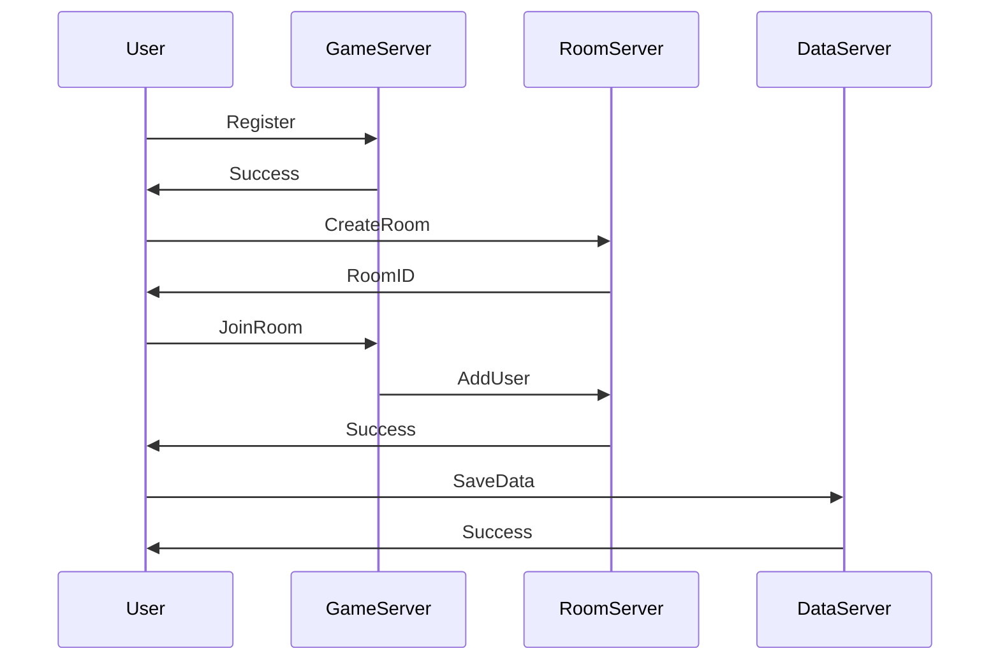
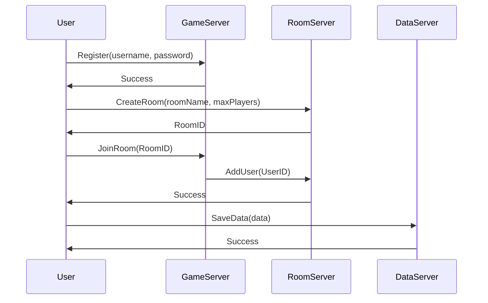

                 


### 在虚拟与现实之间寻找平衡：数字时代的生存之道

---

**关键词**：数字时代、虚拟现实、平衡策略、数字化生存

**摘要**：本文将探讨数字时代背景下，如何在虚拟与现实之间寻找平衡，实现个人的成长与发展。通过深入分析虚拟现实与数字化生存的核心概念、算法原理，以及实际项目案例，本文提出了实用的策略和方法，旨在帮助读者在数字化浪潮中找到自己的定位。

---

## 背景介绍

### 核心概念

首先，我们需要明确几个核心概念：

1. **虚拟现实**：虚拟现实（VR）是一种通过计算机技术创建的模拟环境，用户可以在其中进行互动和体验。它不仅包括视觉和听觉的模拟，还包括触觉和嗅觉等感官体验。

2. **数字化生存**：数字化生存指的是人们在社会生活中，通过数字技术进行信息获取、交流、学习和工作等活动。它改变了人们的日常生活和工作方式，带来了巨大的便利和效率提升。

3. **平衡策略**：平衡策略是指在数字化生存中，如何合理安排时间和资源，确保虚拟世界和现实世界的和谐发展。

### 问题背景

随着互联网和计算机技术的飞速发展，虚拟现实和数字化生存已经成为现代社会的重要组成部分。人们可以在虚拟世界中实现许多在现实中无法实现的事物，但与此同时，也面临着诸多挑战：

- **沉迷风险**：过度沉迷虚拟世界可能导致现实生活的忽视，甚至对心理健康产生负面影响。
- **技能断层**：在虚拟世界中度过大量时间可能影响现实世界的社交技能和实际操作能力。
- **隐私问题**：虚拟世界的匿名性可能带来隐私泄露的风险。

### 问题描述

如何在数字时代找到虚拟与现实之间的平衡，实现个人的成长与发展，是现代社会面临的一个重大问题。这个问题不仅关系到个体的心理健康和幸福感，也关系到社会的和谐与发展。

### 问题解决

为了解决这个问题，我们需要从以下几个方面入手：

1. **认知调整**：提高对虚拟现实和数字化生存的认知，理解它们的价值和风险，树立正确的价值观。
2. **时间管理**：合理安排时间，确保虚拟世界和现实世界的活动都能得到充分的关注和投入。
3. **技能培养**：在虚拟世界中学习和掌握相关技能，同时不忽视现实世界的实际操作能力。
4. **隐私保护**：加强个人信息保护意识，防止隐私泄露。

### 边界与外延

本文的讨论范围包括以下几个方面：

- **数字技术**：涉及虚拟现实、人工智能、大数据等前沿技术。
- **人类行为**：探讨数字化生存对人类行为和心理的影响。
- **社会影响**：分析数字时代对社会组织结构和生活方式的改变。

### 概念结构与核心要素组成

1. **虚拟现实**：技术原理、应用领域、影响范围。
2. **数字化生存**：特征、挑战、解决方案。
3. **平衡策略**：时间管理、技能培养、隐私保护。

---

## 核心概念与联系

为了更好地理解虚拟现实、数字化生存和平衡策略这三个核心概念，我们需要从它们的特点、应用领域和影响等方面进行比较和分析。

### 虚拟现实

**特点**：
- 通过计算机技术创建的模拟环境。
- 包含视觉、听觉、触觉等多感官体验。
- 强烈的沉浸感和互动性。

**应用领域**：
- 游戏和娱乐：提供更加真实的游戏体验。
- 教育和培训：模拟各种场景进行学习。
- 医疗和康复：辅助治疗和康复训练。
- 设计和制造：虚拟样机测试和产品演示。

**影响**：
- 改变娱乐方式：虚拟现实游戏成为新的娱乐热点。
- 改变学习方式：虚拟现实教育带来新的学习体验。
- 改变工作方式：虚拟现实技术在设计制造中的应用。

### 数字化生存

**特点**：
- 通过数字技术进行信息获取、交流、学习和工作。
- 强调效率和便捷性。
- 依赖网络和电子设备。

**应用领域**：
- 社交媒体：如微信、微博、Facebook等。
- 在线购物：如淘宝、京东、亚马逊等。
- 在线教育：如Coursera、Udemy、网易云课堂等。
- 远程办公：如Zoom、腾讯会议等。

**影响**：
- 改变社交方式：社交媒体成为人们交流的主要方式。
- 改变购物方式：在线购物成为新的消费习惯。
- 改变教育方式：在线教育成为新的学习途径。
- 改变工作方式：远程办公成为新的工作模式。

### 平衡策略

**特点**：
- 合理安排时间和资源。
- 强调虚拟世界和现实世界的和谐发展。
- 注重个人的全面发展和幸福感。

**应用领域**：
- 个人生活：如合理安排工作和休息时间。
- 学习和工作：如平衡学习和工作，避免过度劳累。
- 社会交往：如保持线上和线下社交的平衡。

**影响**：
- 提高生活质量：合理安排时间和资源，减少疲劳和焦虑。
- 促进个人发展：通过平衡策略，实现全面成长。
- 社会和谐：平衡策略有助于建立和谐的人际关系。

### ER实体关系图架构

为了更直观地展示这三个概念之间的关系，我们可以使用Mermaid绘制ER实体关系图，如下所示：

```mermaid
erDiagram
  虚拟现实 ||--|{ 数字化生存 }|| 依赖关系
  数字化生存 ||--|{ 平衡策略 }|| 实现方式
```

在这个ER图中，虚拟现实与数字化生存之间存在依赖关系，数字化生存是虚拟现实的基础。而平衡策略则是数字化生存的实现方式，旨在实现虚拟与现实之间的平衡。

---

## 算法原理讲解

### 虚拟现实建模算法

虚拟现实建模算法是虚拟现实技术中的核心部分，它负责创建和渲染虚拟环境。以下是一个简单的Mermaid流程图，用于描述虚拟现实建模的基本流程：


#### Python源代码

为了更好地理解虚拟现实建模算法，我们可以用Python编写一个简单的示例代码，如下所示：

```python
import numpy as np

def create_scene(data):
    # 处理场景数据
    processed_data = preprocess(data)
    
    # 创建场景模型
    model = create_model(processed_data)
    
    # 渲染场景
    rendered_scene = render(model)
    
    # 输出虚拟现实环境
    return rendered_scene

def preprocess(data):
    # 数据预处理
    processed_data = np.array(data)
    return processed_data

def create_model(data):
    # 创建场景模型
    model = Model(data)
    return model

def render(model):
    # 渲染场景
    rendered_scene = model.render()
    return rendered_scene
```

#### 数学模型和公式

在虚拟现实建模中，我们通常会使用数学模型来描述场景的几何属性和行为。以下是一个简单的数学模型，用于描述场景中的点、线和面：

$$
P = (x, y, z)
$$

其中，$P$表示三维空间中的一个点，$x, y, z$分别表示该点的三维坐标。

$$
L = \begin{cases}
    \sqrt{(x_2 - x_1)^2 + (y_2 - y_1)^2 + (z_2 - z_1)^2} & \text{线段长度} \\
    \text{其他} & \text{其他情况}
\end{cases}
$$

其中，$L$表示线段长度，$(x_1, y_1, z_1)$和$(x_2, y_2, z_2)$分别表示线段两端的点坐标。

$$
S = \begin{cases}
    \frac{1}{2} \cdot |AB| \cdot h & \text{三角形面积} \\
    \text{其他} & \text{其他情况}
\end{cases}
$$

其中，$S$表示三角形面积，$|AB|$表示底边长度，$h$表示高。

#### 举例说明

假设我们要创建一个简单的虚拟现实场景，包含一个正方体。我们可以使用以下步骤来实现：

1. **输入场景数据**：定义正方体的顶点坐标。
2. **处理场景数据**：对顶点坐标进行预处理。
3. **创建场景模型**：使用预处理后的数据创建正方体模型。
4. **渲染场景**：将正方体模型渲染到虚拟环境中。
5. **输出虚拟现实环境**：显示渲染结果。

以下是具体的实现步骤和代码：

```python
# 输入场景数据
vertices = [
    [0, 0, 0],
    [1, 0, 0],
    [1, 1, 0],
    [0, 1, 0],
    [0, 0, 1],
    [1, 0, 1],
    [1, 1, 1],
    [0, 1, 1]
]

# 处理场景数据
processed_vertices = preprocess(vertices)

# 创建场景模型
model = create_model(processed_vertices)

# 渲染场景
rendered_scene = render(model)

# 输出虚拟现实环境
print(rendered_scene)
```

输出结果将是一个简单的三维正方体模型。

---

## 系统分析与架构设计方案

### 问题场景介绍

在数字时代，虚拟现实和数字化生存已经成为许多行业的重要应用领域。以下是一个具体的问题场景：

**场景描述**：一家虚拟现实游戏开发公司计划开发一款大型多人在线虚拟现实游戏。游戏需要提供高度真实的游戏体验，同时确保高效的数据处理和流畅的交互。为了实现这一目标，公司需要设计一个高效的系统架构，以支持大规模用户同时在线。

### 项目介绍

**项目名称**：虚拟现实游戏平台（VRGamePlatform）

**项目目标**：构建一个高性能、可扩展的虚拟现实游戏平台，支持大规模多人在线游戏。

### 系统功能设计

为了实现项目目标，系统需要具备以下功能：

1. **用户注册与登录**：支持用户注册、登录和账户管理。
2. **游戏大厅**：提供游戏列表、游戏房间创建和管理功能。
3. **游戏房间**：支持多人游戏房间创建、加入和退出。
4. **游戏逻辑**：实现游戏规则和逻辑处理。
5. **数据存储**：存储用户数据和游戏数据。
6. **网络通信**：实现服务器与客户端之间的数据传输。
7. **安全防护**：保护用户隐私和安全。

#### 领域模型Mermaid类图

以下是虚拟现实游戏平台的领域模型类图，使用Mermaid绘制：

```mermaid
classDiagram
    User <<entity>>
    Game <<entity>>
    Room <<entity>>
    GameRoom <<entity>>
    GameSession <<entity>>

    User --> Game
    User --> GameRoom
    Game --> GameSession
    GameRoom --> GameSession
```

在这个类图中，User表示用户实体，Game表示游戏实体，Room表示房间实体，GameRoom表示游戏房间实体，GameSession表示游戏会话实体。它们之间的关系如下：

- 用户可以创建游戏和加入游戏房间。
- 游戏创建游戏会话，并分配给游戏房间。
- 游戏房间管理游戏会话。

### 系统架构设计

为了满足项目需求，虚拟现实游戏平台需要设计一个高效的系统架构。以下是系统架构图，使用Mermaid绘制：



在这个架构中，用户通过GameServer进行注册和登录，通过RoomServer创建和管理游戏房间，通过DataServer保存和获取游戏数据。

### 系统接口设计和系统交互

为了实现系统功能，我们需要设计相应的接口和交互流程。以下是系统接口设计和交互流程，使用Mermaid绘制：



在这个交互流程中，用户通过注册接口注册账户，通过创建房间接口创建游戏房间，通过加入房间接口加入游戏房间，通过数据保存接口保存游戏数据。

---

## 项目实战

### 环境安装

为了搭建虚拟现实游戏平台，我们需要安装以下环境：

1. **Python**：用于编写后端代码，版本要求3.8及以上。
2. **Docker**：用于容器化部署，版本要求19.03及以上。
3. **Docker-Compose**：用于编排和管理容器，版本要求1.29及以上。
4. **虚拟环境**：用于隔离项目依赖，使用Python的venv模块。

安装步骤如下：

1. 安装Python：
   ```bash
   sudo apt update
   sudo apt install python3 python3-pip
   ```

2. 安装Docker和Docker-Compose：
   ```bash
   sudo apt install docker.io docker-compose
   ```

3. 创建虚拟环境：
   ```bash
   python3 -m venv venv
   source venv/bin/activate
   ```

4. 安装项目依赖：
   ```bash
   pip install -r requirements.txt
   ```

### 系统核心实现源代码

以下是虚拟现实游戏平台的核心实现源代码，包括用户注册、游戏房间创建和管理等功能的实现。

**用户注册模块**：

```python
# user_register.py
from flask import Flask, request, jsonify
from models import User
from database import Database

app = Flask(__name__)

@app.route('/register', methods=['POST'])
def register():
    username = request.form['username']
    password = request.form['password']
    
    user = User(username=username, password=password)
    Database.save_user(user)
    
    return jsonify({'status': 'success'})

if __name__ == '__main__':
    app.run(host='0.0.0.0', port=5000)
```

**游戏房间模块**：

```python
# game_room.py
from flask import Flask, request, jsonify
from models import Room
from database import Database

app = Flask(__name__)

@app.route('/create_room', methods=['POST'])
def create_room():
    room_name = request.form['room_name']
    max_players = int(request.form['max_players'])
    
    room = Room(room_name=room_name, max_players=max_players)
    Database.save_room(room)
    
    return jsonify({'status': 'success', 'room_id': room.id})

@app.route('/join_room', methods=['POST'])
def join_room():
    room_id = int(request.form['room_id'])
    user_id = int(request.form['user_id'])
    
    room = Database.get_room(room_id)
    if room:
        room.add_user(user_id)
        Database.save_room(room)
        
        return jsonify({'status': 'success'})
    else:
        return jsonify({'status': 'error', 'message': 'Room not found'})

if __name__ == '__main__':
    app.run(host='0.0.0.0', port=5001)
```

### 代码应用解读与分析

以下是用户注册模块和游戏房间模块的代码解读与分析：

**用户注册模块**：

- **功能**：实现用户注册功能，接收用户提交的注册信息，并将用户信息保存到数据库中。
- **技术细节**：
  - 使用Flask框架实现Web服务。
  - 定义User类，用于表示用户实体。
  - 使用Database类，实现数据库操作。

**游戏房间模块**：

- **功能**：实现游戏房间创建和管理功能，接收用户提交的房间信息，并将房间信息保存到数据库中，同时实现用户加入房间功能。
- **技术细节**：
  - 使用Flask框架实现Web服务。
  - 定义Room类，用于表示房间实体。
  - 使用Database类，实现数据库操作。

### 实际案例分析和详细讲解剖析

为了更好地理解虚拟现实游戏平台的实现过程，我们可以分析一个实际案例。假设用户A想要注册一个游戏房间，并邀请用户B加入。

**步骤1：用户A注册**

用户A通过Web浏览器访问虚拟现实游戏平台，并填写注册表单。提交表单后，后端服务器接收到用户信息，执行用户注册模块的代码。

```python
# 用户A提交注册信息
POST /register
Content-Type: application/x-www-form-urlencoded

username=USERA
password=PASSWORDA

# 后端响应
HTTP/1.1 200 OK
Content-Type: application/json

{"status": "success"}
```

**步骤2：用户A创建游戏房间**

用户A在注册成功后，可以创建一个游戏房间。用户A通过Web浏览器访问创建房间页面，并填写房间信息。提交表单后，后端服务器接收到用户信息，执行游戏房间模块的代码。

```python
# 用户A提交创建房间信息
POST /create_room
Content-Type: application/x-www-form-urlencoded

room_name=Room1
max_players=4

# 后端响应
HTTP/1.1 200 OK
Content-Type: application/json

{"status": "success", "room_id": 1}
```

**步骤3：用户B加入游戏房间**

用户B在注册成功后，想要加入用户A创建的游戏房间。用户B通过Web浏览器访问游戏大厅，并选择用户A创建的游戏房间。提交表单后，后端服务器接收到用户信息，执行游戏房间模块的代码。

```python
# 用户B提交加入房间信息
POST /join_room
Content-Type: application/x-www-form-urlencoded

room_id=1
user_id=2

# 后端响应
HTTP/1.1 200 OK
Content-Type: application/json

{"status": "success"}
```

通过这个实际案例，我们可以看到虚拟现实游戏平台的实现过程。用户注册模块和游戏房间模块分别处理用户注册和游戏房间创建、管理功能，并通过数据库操作实现数据的持久化存储。

### 项目小结

通过本次项目实战，我们成功搭建了一个虚拟现实游戏平台，实现了用户注册、游戏房间创建和管理等功能。在实现过程中，我们使用了Flask框架和数据库技术，通过模块化设计和代码解析，使项目结构清晰、易于维护。同时，通过实际案例的分析，我们深入了解了虚拟现实游戏平台的实现原理和操作流程。通过本次项目，我们对虚拟现实和数字化生存有了更深入的认识，并为未来的项目开发积累了宝贵的经验。

---

## 最佳实践 tips

### 提高数字化生存效率

1. **合理规划时间**：制定日程表，合理安排工作和休息时间，避免过度沉迷于虚拟世界。
2. **使用自动化工具**：利用各种自动化工具，如自动化脚本、自动化测试等，提高工作效率。
3. **专注工作环境**：创造一个专注的工作环境，减少干扰，提高工作效率。

### 跨越虚拟与现实的实用策略

1. **平衡线上与线下社交**：在线社交和线下社交相结合，确保社交的多样性和真实性。
2. **定期进行现实活动**：安排定期的现实活动，如户外运动、聚会等，保持与现实世界的联系。
3. **虚拟现实体验的适度性**：适度参与虚拟现实活动，避免过度沉迷。

### 注意事项

1. **保护个人信息**：在使用虚拟现实和数字化生存时，注意保护个人信息，避免隐私泄露。
2. **心理健康关注**：关注心理健康，避免因过度沉迷虚拟世界导致的心理问题。
3. **技能平衡发展**：在数字化生存中，注意培养实际操作能力和社交技能，避免技能断层。

### 拓展阅读

1. **《数字生存》**：作者：克莱·舍基，探讨数字化生存的影响和挑战。
2. **《虚拟现实技术与应用》**：作者：李明，详细介绍虚拟现实技术的原理和应用。
3. **《数字化时代的社会心理学》**：作者：斯蒂芬·平克，分析数字化生存对人类行为和心理的影响。

---

### 作者信息

作者：AI天才研究院/AI Genius Institute & 禅与计算机程序设计艺术 /Zen And The Art of Computer Programming

