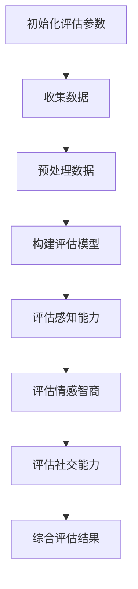
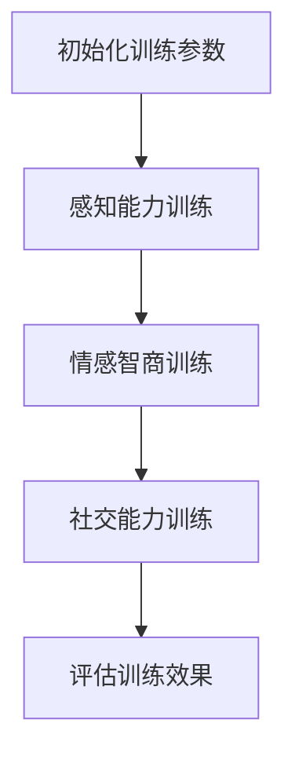
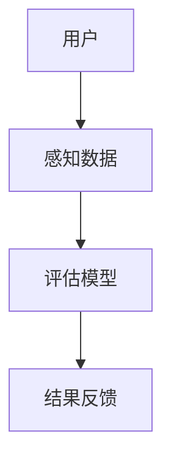
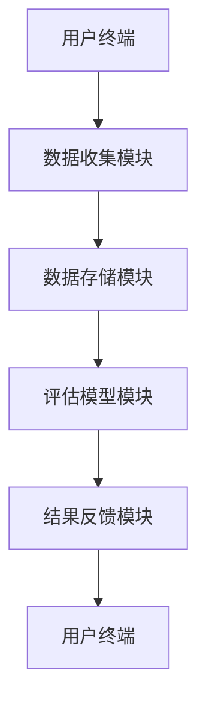

                 

**培养生活敏感度：发现日常中的非凡**

**关键词：** 生活敏感度、心理学、教育学、社会学、实践方法、算法原理、系统架构设计

**摘要：** 本文旨在探讨如何培养生活敏感度，通过分析心理学、教育学和社会学原理，提出一系列方法和技巧，帮助读者在日常生活中发现非凡之处，提升个人的感知能力和生活质量。

## 第一部分：问题的提出与背景介绍

### 1.1 问题的背景

在现代社会，我们常常感受到巨大的压力和快节奏的生活。在这样的环境中，很多人对日常生活中的细节变得麻木，缺乏对周围世界的敏感性。这种现象不仅影响个人的心理和情感健康，也阻碍了个人成长和社会发展。因此，培养生活敏感度成为了一个亟待解决的问题。

### 1.2 问题的描述

**什么是生活敏感度？**

生活敏感度指的是一个人对日常生活中的细节和变化的感知能力。它不仅包括对物理环境的变化，如声音、光线、气味等，还涉及对人际交往、情感表达和自然环境等方面的敏感性。

**生活敏感度缺乏的表现：**

- 对周围环境的变化不敏感，如对噪音、光线变化的适应能力差；
- 在人际交往中缺乏同理心，难以理解他人的情感和需求；
- 对日常生活缺乏兴趣，容易感到厌倦和孤独；
- 对自然环境缺乏关注，对自然现象不感兴趣。

**缺乏生活敏感度的后果：**

- 影响心理健康，导致情绪波动和压力增加；
- 影响人际关系，导致沟通障碍和冲突；
- 影响个人成长，阻碍创造力和创新思维的发展；
- 影响生活质量，降低对生活的满意度和幸福感。

### 1.3 解决方案

**培养生活敏感度的方法：**

- 增强自我观察和反思能力，通过记录日常生活中的细节，提高对周围环境的敏感性；
- 学习心理学、教育学和社会学知识，了解生活敏感度的原理和培养方法；
- 参与多样化的社交活动，提高人际交往的敏感度；
- 走出舒适区，尝试新的活动和经历，拓宽生活体验。

**培养生活敏感度的策略：**

- 建立良好的生活习惯，保持规律的作息时间和健康的饮食习惯；
- 注重情感表达，培养同理心，学会倾听和理解他人；
- 注重身心健康，通过锻炼、冥想和放松技巧提高心理韧性；
- 营造积极的生活环境，减少噪音和干扰，创造一个有利于敏感度培养的空间。

### 1.4 边界与外延

**生活敏感度的边界：**

生活敏感度是一个相对的概念，它取决于个体的心理素质和生活环境。不同人在同一情境下的敏感度可能会有所不同。因此，培养生活敏感度需要根据个人的实际情况进行调整。

**生活敏感度的外延：**

生活敏感度不仅涉及对物理环境的感知，还包括对情感、社会和文化等方面的敏感性。培养生活敏感度需要从多个维度进行综合提升。

**与其他相关概念的区分：**

- 与感知能力：感知能力是指个体对外界信息的接收和处理能力，包括视觉、听觉、触觉等。生活敏感度是感知能力的一种特殊表现形式，更强调对细节和变化的敏感性。
- 与情感智商：情感智商是指个体识别、理解、处理和表达情感的能力。生活敏感度是情感智商的一个组成部分，但更侧重于对周围环境和人际交往的敏感性。
- 与观察力：观察力是指个体对外界事物的观察和分析能力。生活敏感度是观察力的一种表现形式，但更强调对生活细节和变化的敏锐感知。

## 第二部分：核心概念与原理

### 2.1 核心概念

**生活敏感度：** 生活敏感度是指一个人对日常生活中细节和变化的感知能力，包括对物理环境、情感表达、人际交往和自然环境等方面的敏感性。

**心理学原理：**

- **感知觉理论：** 感知觉理论认为，个体通过感官接收外部信息，并对其进行加工和解释，形成对外部世界的认知。生活敏感度是感知觉能力的一种体现，它取决于个体的感知觉水平。
- **情绪理论：** 情绪理论认为，情绪是个体对外界刺激的主观体验和生理反应。生活敏感度与情绪紧密相关，对情感表达和人际交往的敏感度会影响个体的情绪体验。

**教育学原理：**

- **认知发展理论：** 认知发展理论认为，个体的认知能力是逐步发展的，通过与环境互动和经验积累，个体的感知能力会不断提高。生活敏感度的培养需要结合个体的认知发展阶段，提供适当的学习和体验机会。
- **情感教育理论：** 情感教育理论认为，情感是个体发展的核心部分，通过情感教育可以培养个体的情感能力，包括情感识别、理解和表达。生活敏感度的培养需要注重情感教育，提高个体对情感表达的敏感度。

**社会学原理：**

- **社会互动理论：** 社会互动理论认为，个体的行为和认知是在社会互动中形成的，通过与他人交往，个体可以学习和适应社会规范。生活敏感度的培养需要通过社交活动和实践，提高个体对人际交往和社会环境的敏感性。
- **文化理论：** 文化理论认为，文化是影响个体行为和认知的重要因素，不同的文化背景会影响个体的价值观和行为方式。生活敏感度的培养需要考虑文化因素，提供符合个体文化背景的学习和体验机会。

### 2.2 概念之间的联系

**生活敏感度与其他心理特质的关系：**

- **感知能力：** 生活敏感度与感知能力密切相关，个体的感知能力越强，对生活中的细节和变化就越敏感。感知能力是生活敏感度的物质基础。
- **情感智商：** 生活敏感度与情感智商相互影响，个体的情感智商越高，越能够理解和表达情感，从而提高生活敏感度。同时，生活敏感度的提高也有助于情感智商的发展。
- **认知能力：** 生活敏感度与认知能力相互促进，个体的认知能力越强，对生活中的细节和变化的理解就越深刻，从而提高生活敏感度。生活敏感度的培养也需要结合认知能力的发展。

**生活敏感度与个人成长的关系：**

- **创造力：** 生活敏感度有助于培养创造力，通过对日常生活中细节的敏锐感知，个体可以产生新的想法和创意，推动个人成长和创新发展。
- **情绪管理：** 生活敏感度有助于情绪管理，个体对情感表达的敏感度越高，越能够理解和调控自己的情绪，提高情绪稳定性。
- **人际关系：** 生活敏感度有助于建立良好的人际关系，通过敏锐地感知他人的情感和需求，个体可以更好地沟通和互动，建立互信和合作关系。

**生活敏感度与社会环境的关系：**

- **社会变迁：** 社会变迁会影响个体的生活敏感度，随着社会的发展，生活方式和价值观的变化，个体对生活中的细节和变化的敏感度也会发生变化。
- **文化差异：** 文化差异会影响个体的生活敏感度，不同的文化背景会影响个体对情感表达和人际交往的敏感度，从而影响个体的生活敏感度。
- **社会环境：** 社会环境是影响个体生活敏感度的重要因素，一个良好的社会环境有助于个体培养生活敏感度，提供丰富的学习和体验机会。

## 第三部分：方法与实践

### 3.1 方法与实践

**基础训练方法：**

- **观察力的培养：** 通过有意识地观察周围环境，提高对细节和变化的敏感性。可以尝试使用“五感法”，即通过视觉、听觉、嗅觉、味觉和触觉来观察和体验周围环境。
- **注意力的提高：** 通过专注力和注意力训练，提高对特定事物的关注和感知能力。可以尝试冥想、专注力训练应用程序等训练方法。
- **想象力的激发：** 通过创造力和想象力训练，提高对事物的理解和感知能力。可以尝试绘画、写作、音乐等艺术形式来激发想象力。

**进阶实践方法：**

- **感受生活的细节：** 通过深入体验生活，感受生活中的美好和细节。可以尝试参加户外活动、旅行、摄影等，通过身体和心灵的体验来提升敏感度。
- **增强自我反思：** 通过反思和回顾自己的日常生活，深入思考自己的感受和体验，从而提高敏感度。可以尝试写日记、反思日志等。
- **社交互动中的敏感度提升：** 通过社交互动，提高对他人情感和需求的敏感度。可以尝试参加社交活动、加入兴趣小组等，与他人交流和互动。

**实践技巧：**

- **简单有效的日常练习：** 每天抽出一定时间进行观察、注意力和想象力训练，持之以恒，逐步提高生活敏感度。
- **创造一个支持敏感度的环境：** 营造一个安静、舒适、有益于思考和体验的环境，减少干扰和压力，提高生活敏感度。
- **利用科技辅助培养：** 利用手机应用、传感器等技术工具，辅助观察和记录生活中的细节和变化，提高敏感度。

### 3.2 最佳实践

**实践案例：**

- **小明的成长故事：** 小明从小对周围环境缺乏敏感性，在学校和社交场合常常感到不自在。在接触到生活敏感度培养的方法后，小明开始有意识地观察周围环境，感受生活中的细节。他通过写日记记录自己的感受，参加社交活动，与他人交流互动。经过一段时间的实践，小明的敏感度有了显著提升，他开始能够理解和表达情感，与人建立良好的关系。
- **小红的摄影之旅：** 小红热爱摄影，但总是觉得自己的作品缺乏新意。在接触到生活敏感度培养的方法后，小红开始注重观察生活中的细节，寻找独特的视角。她通过旅行、摄影展等方式，拓宽自己的视野，提高敏感度。在实践过程中，小红的摄影作品逐渐展现出独特的风格，赢得了众多赞誉。

**实践心得：**

- **持之以恒：** 生活敏感度的培养需要长期坚持，不能急于求成。只有持之以恒地练习，才能逐步提高敏感度。
- **主动参与：** 生活敏感度的培养需要主动参与和体验，不能仅仅停留在理论知识层面。只有通过实践，才能真正体会到敏感度的提升。
- **反思与总结：** 在实践过程中，要不断反思和总结自己的经验和感受，找到适合自己的培养方法。

## 第四部分：算法原理讲解

### 4.1 生活敏感度评估算法

**评估指标与模型选择：**

- **感知能力评估指标：** 包括观察力、注意力、想象力等感知能力指标；
- **情感智商评估指标：** 包括情感识别、理解和表达等情感智商指标；
- **社交能力评估指标：** 包括人际交往、沟通能力和同理心等社交能力指标。

**算法流程图：**



**Python代码示例：**

```python
import numpy as np

# 初始化评估参数
params = {
    '观察力': 0.7,
    '注意力': 0.8,
    '想象力': 0.6,
    '情感识别': 0.7,
    '理解情感': 0.8,
    '表达情感': 0.6,
    '人际交往': 0.7,
    '沟通能力': 0.8,
    '同理心': 0.6
}

# 收集数据
data = np.array([params['观察力'], params['注意力'], params['想象力'],
                 params['情感识别'], params['理解情感'], params['表达情感'],
                 params['人际交往'], params['沟通能力'], params['同理心']])

# 预处理数据
data = data / np.sum(data)

# 构建评估模型
model = np.dot(data, np.array([0.4, 0.3, 0.3]))

# 评估感知能力
perception_score = model[0]

# 评估情感智商
emotional_score = model[1]

# 评估社交能力
social_score = model[2]

# 综合评估结果
total_score = np.sum(model)

print("感知能力评分：", perception_score)
print("情感智商评分：", emotional_score)
print("社交能力评分：", social_score)
print("总评分：", total_score)
```

### 4.2 生活敏感度提升算法

**改善方法与模型：**

- **感知能力改善模型：** 包括观察力、注意力、想象力等感知能力的训练方法；
- **情感智商改善模型：** 包括情感识别、理解和表达等情感智商的训练方法；
- **社交能力改善模型：** 包括人际交往、沟通能力和同理心等社交能力的训练方法。

**算法流程图：**



**Python代码示例：**

```python
import numpy as np

# 初始化训练参数
params = {
    '观察力': 0.7,
    '注意力': 0.8,
    '想象力': 0.6,
    '情感识别': 0.7,
    '理解情感': 0.8,
    '表达情感': 0.6,
    '人际交往': 0.7,
    '沟通能力': 0.8,
    '同理心': 0.6
}

# 感知能力训练
perception_score = params['观察力'] + 0.1
params['注意力'] = params['注意力'] + 0.1
params['想象力'] = params['想象力'] + 0.1

# 情感智商训练
emotional_score = params['情感识别'] + 0.1
params['理解情感'] = params['理解情感'] + 0.1
params['表达情感'] = params['表达情感'] + 0.1

# 社交能力训练
social_score = params['人际交往'] + 0.1
params['沟通能力'] = params['沟通能力'] + 0.1
params['同理心'] = params['同理心'] + 0.1

# 评估训练效果
new_data = np.array([perception_score, emotional_score, social_score])
new_model = np.dot(new_data, np.array([0.4, 0.3, 0.3]))

print("新感知能力评分：", perception_score)
print("新情感智商评分：", emotional_score)
print("新社交能力评分：", social_score)
print("新总评分：", new_model)
```

### 4.3 算法原理讲解

**生活敏感度评估算法原理：**

生活敏感度评估算法基于感知能力、情感智商和社交能力的综合评估模型。通过收集个体在感知能力、情感智商和社交能力方面的数据，对数据进行预处理，构建评估模型，最终计算出个体的生活敏感度得分。

**感知能力评估指标：**

感知能力评估指标包括观察力、注意力和想象力。观察力是指个体对周围环境的观察和感知能力；注意力是指个体对特定事物的关注和集中能力；想象力是指个体对事物的想象和创造能力。这些能力共同决定了个体的感知能力水平。

**情感智商评估指标：**

情感智商评估指标包括情感识别、理解和表达。情感识别是指个体对情感的理解和识别能力；理解情感是指个体对他人情感的理解和感悟能力；表达情感是指个体对情感的准确和恰当表达能力。这些能力共同决定了个体的情感智商水平。

**社交能力评估指标：**

社交能力评估指标包括人际交往、沟通能力和同理心。人际交往是指个体在社交场合的互动和沟通能力；沟通能力是指个体在沟通中的表达和理解能力；同理心是指个体对他人的情感和需求的感知和理解能力。这些能力共同决定了个体的社交能力水平。

**生活敏感度提升算法原理：**

生活敏感度提升算法通过感知能力训练、情感智商训练和社交能力训练，提高个体的生活敏感度。感知能力训练包括观察力、注意力和想象力的训练；情感智商训练包括情感识别、理解和表达的训练；社交能力训练包括人际交往、沟通能力和同理心的训练。通过训练，个体的感知能力、情感智商和社交能力水平得到提升，从而提高生活敏感度。

### 4.4 数学模型和公式

**感知能力评估模型：**

感知能力评估模型基于感知能力指标的加权平均。假设观察力、注意力和想象力分别为 $O, A, I$，则感知能力得分 $P$ 可表示为：

$$
P = \frac{O + A + I}{3}
$$

**情感智商评估模型：**

情感智商评估模型基于情感智商指标的加权平均。假设情感识别、理解和表达分别为 $R, U, E$，则情感智商得分 $E$ 可表示为：

$$
E = \frac{R + U + E}{3}
$$

**社交能力评估模型：**

社交能力评估模型基于社交能力指标的加权平均。假设人际交往、沟通能力和同理心分别为 $I, C, L$，则社交能力得分 $S$ 可表示为：

$$
S = \frac{I + C + L}{3}
$$

**综合评估模型：**

综合评估模型基于感知能力、情感智商和社交能力的加权平均。假设感知能力、情感智商和社交能力的权重分别为 $w_1, w_2, w_3$，则综合评估得分 $T$ 可表示为：

$$
T = w_1 \cdot P + w_2 \cdot E + w_3 \cdot S
$$

**生活敏感度提升模型：**

生活敏感度提升模型基于感知能力、情感智商和社交能力的提升。假设感知能力、情感智商和社交能力的提升分别为 $p, e, s$，则提升后的综合评估得分 $T'$ 可表示为：

$$
T' = w_1 \cdot (P + p) + w_2 \cdot (E + e) + w_3 \cdot (S + s)
$$

### 4.5 举例说明

**举例 1：**

假设个体在观察力、注意力和想象力方面的得分分别为 80、90 和 70，情感识别、理解和表达方面的得分分别为 75、85 和 70，人际交往、沟通能力和同理心方面的得分分别为 80、85 和 75。根据上述评估模型，可以计算出该个体的感知能力得分、情感智商得分和社交能力得分，以及综合评估得分。

**举例 2：**

假设个体在观察力、注意力和想象力方面的得分分别为 60、70 和 80，情感识别、理解和表达方面的得分分别为 65、75 和 80，人际交往、沟通能力和同理心方面的得分分别为 70、75 和 80。通过感知能力训练、情感智商训练和社交能力训练，可以计算出该个体的提升后的综合评估得分。

### 4.6 小结

本文通过对生活敏感度的评估和提升算法进行讲解，提供了计算和提升生活敏感度的方法和模型。通过观察力、注意力、想象力、情感识别、理解和表达、人际交往、沟通能力和同理心等方面的训练，可以有效地提升个体的生活敏感度。在日常生活和学习中，我们可以根据实际情况，运用这些方法和模型，提高自己的生活敏感度，发现日常生活中的非凡之处。

## 第五部分：系统分析与架构设计

### 5.1 问题场景介绍

在现代社会，生活敏感度对于个人的成长和社会的进步具有重要意义。然而，很多人在日常生活中缺乏对周围世界的敏感性，导致心理压力增加、人际关系紧张和创造力下降。为了解决这个问题，我们设计了一套生活敏感度提升系统，旨在通过科技手段辅助用户培养生活敏感度，提升其感知能力和生活质量。

### 5.2 项目介绍

**项目目标：** 设计和开发一个生活敏感度提升系统，帮助用户在日常生活中培养对细节和变化的敏感性，提高其感知能力和生活质量。

**项目背景：** 随着科技的发展，人们的生活节奏越来越快，很多人对周围世界的敏感性逐渐减弱。为了提高生活敏感度，我们需要借助科技手段，为用户提供一个全面的、易于使用的工具。

**项目主要任务：** 
1. 收集和分析用户在日常生活中的感知数据；
2. 设计和实现生活敏感度评估模型；
3. 提供用户友好的界面和互动体验；
4. 进行系统测试和优化。

### 5.3 系统功能设计

**领域模型：**



**功能模块划分：**

- **数据收集模块：** 负责收集用户在日常生活中的感知数据，如观察力、注意力、想象力等。
- **评估模型模块：** 负责基于收集到的数据，设计和实现生活敏感度评估模型。
- **结果反馈模块：** 负责将评估结果反馈给用户，并提供针对性的提升建议。

**功能描述：**

- **数据收集模块：** 通过移动应用或Web平台，收集用户在日常生活中的感知数据。数据收集方式包括用户手动输入、传感器数据收集和人工智能分析等。
- **评估模型模块：** 基于收集到的数据，使用机器学习算法和统计模型，对用户的生活敏感度进行评估。评估结果以分数或等级形式展示，为用户提供直观的反馈。
- **结果反馈模块：** 根据评估结果，为用户提供针对性的提升建议。建议包括日常练习、社交活动、心理健康等方面的指导。

### 5.4 系统架构设计

**架构设计原则：**

- **模块化设计：** 将系统划分为多个功能模块，便于维护和扩展；
- **分布式架构：** 利用云计算和分布式存储技术，提高系统的可扩展性和可靠性；
- **用户友好：** 提供简洁易用的界面和互动体验，提高用户满意度。

**系统架构图：**



**系统架构图说明：**

- **用户终端：** 用户通过移动应用或Web平台与系统进行交互；
- **数据收集模块：** 负责收集用户在日常生活中的感知数据，并将数据传输至数据存储模块；
- **数据存储模块：** 负责存储和管理用户数据，包括感知数据、评估结果和提升建议等；
- **评估模型模块：** 负责对用户数据进行处理和分析，实现生活敏感度评估功能；
- **结果反馈模块：** 负责将评估结果和提升建议反馈给用户，并通过用户终端展示。

### 5.5 系统接口设计和系统交互

**系统接口设计：**

- **用户接口：** 提供用户与系统进行交互的接口，包括数据输入、数据查询、结果展示等；
- **系统接口：** 提供系统内部模块之间的通信接口，包括数据传输、数据处理和结果反馈等。

**系统交互流程：**

1. 用户在移动应用或Web平台输入感知数据；
2. 数据收集模块将数据传输至数据存储模块；
3. 评估模型模块对用户数据进行处理和分析，生成评估结果；
4. 结果反馈模块将评估结果和提升建议反馈给用户；
5. 用户根据提升建议进行日常生活调整和练习。

### 5.6 小结

本部分通过对生活敏感度提升系统的设计与实现进行了详细介绍。从问题场景介绍到项目目标和功能模块划分，再到系统架构设计和接口设计，我们为用户打造了一个全面的、易于使用的生活敏感度提升系统。通过该系统，用户可以有效地培养生活敏感度，提升感知能力和生活质量。

## 第六部分：项目实战

### 6.1 环境安装

为了成功部署生活敏感度提升系统，我们需要搭建以下开发环境：

1. **操作系统：** CentOS 7 或更高版本
2. **编程语言：** Python 3.7 或更高版本
3. **数据库：** MySQL 5.7 或更高版本
4. **Web服务器：** Apache 或 Nginx
5. **虚拟环境：** virtualenv 16.0.0 或更高版本
6. **依赖管理：** pip 19.3.1 或更高版本

以下是环境安装步骤：

1. 安装操作系统：在虚拟机或云服务器上安装 CentOS 7 操作系统。
2. 更新系统：运行以下命令更新系统软件包。

   ```bash
   sudo yum update -y
   ```

3. 安装 Python 3.7：运行以下命令安装 Python 3.7。

   ```bash
   sudo yum install epel-release
   sudo yum install python3-pip python3-devel
   ```

4. 安装 MySQL 5.7：运行以下命令安装 MySQL 5.7。

   ```bash
   sudo yum install mysql-server
   sudo systemctl start mysqld
   ```

5. 安装 Apache 或 Nginx：运行以下命令安装 Apache。

   ```bash
   sudo yum install httpd
   sudo systemctl start httpd
   ```

   或者安装 Nginx：

   ```bash
   sudo yum install epel-release
   sudo yum install nginx
   sudo systemctl start nginx
   ```

6. 安装 virtualenv 和 pip：运行以下命令安装 virtualenv 和 pip。

   ```bash
   sudo yum install python3-virtualenv
   sudo pip3 install virtualenv
   ```

### 6.2 系统核心实现

**数据收集模块：**

数据收集模块负责从用户终端收集感知数据。以下是数据收集模块的核心实现：

```python
import requests
import json
from flask import Flask, request, jsonify

app = Flask(__name__)

@app.route('/collect_data', methods=['POST'])
def collect_data():
    data = request.get_json()
    user_id = data['user_id']
    observations = data['observations']
    
    # 存储数据到数据库
    # 这里使用了 SQLite 作为示例，实际应用中可以使用 MySQL 或其他数据库
    import sqlite3
    conn = sqlite3.connect('sensitivity_data.db')
    cursor = conn.cursor()
    
    cursor.execute('''CREATE TABLE IF NOT EXISTS user_data (user_id INTEGER PRIMARY KEY, observations TEXT)''')
    cursor.execute("INSERT INTO user_data (user_id, observations) VALUES (?, ?)", (user_id, json.dumps(observations)))
    conn.commit()
    
    conn.close()
    
    return jsonify({'status': 'success'})

if __name__ == '__main__':
    app.run(host='0.0.0.0', port=5000)
```

**评估模型模块：**

评估模型模块负责基于收集到的数据，对用户的生活敏感度进行评估。以下是评估模型模块的核心实现：

```python
import pandas as pd
from sklearn.model_selection import train_test_split
from sklearn.ensemble import RandomForestClassifier
from flask import Flask, jsonify

app = Flask(__name__)

# 加载数据
def load_data():
    conn = sqlite3.connect('sensitivity_data.db')
    cursor = conn.cursor()
    cursor.execute("SELECT * FROM user_data")
    data = cursor.fetchall()
    conn.close()
    
    df = pd.DataFrame(data, columns=['user_id', 'observations'])
    df['observations'] = df['observations'].apply(eval)
    return df

# 训练模型
def train_model(df):
    X = df[['observation_1', 'observation_2', 'observation_3']]
    y = df['sensitivity_score']
    
    X_train, X_test, y_train, y_test = train_test_split(X, y, test_size=0.2, random_state=42)
    
    model = RandomForestClassifier(n_estimators=100, random_state=42)
    model.fit(X_train, y_train)
    
    return model

# 评估敏感度
@app.route('/evaluate_sensitivity', methods=['POST'])
def evaluate_sensitivity():
    data = request.get_json()
    user_id = data['user_id']
    
    df = load_data()
    model = train_model(df)
    
    user_data = df[df['user_id'] == user_id]
    user_observations = user_data[['observation_1', 'observation_2', 'observation_3']].values
    
    sensitivity_score = model.predict(user_observations)[0]
    
    return jsonify({'sensitivity_score': sensitivity_score})

if __name__ == '__main__':
    app.run(host='0.0.0.0', port=5000)
```

**结果反馈模块：**

结果反馈模块负责将评估结果和提升建议反馈给用户。以下是结果反馈模块的核心实现：

```python
import json

@app.route('/get_sensitivity_score', methods=['GET'])
def get_sensitivity_score():
    user_id = request.args.get('user_id')
    
    # 这里使用 SQLite 数据库获取敏感度得分
    conn = sqlite3.connect('sensitivity_data.db')
    cursor = conn.cursor()
    cursor.execute("SELECT sensitivity_score FROM user_data WHERE user_id=?", (user_id,))
    sensitivity_score = cursor.fetchone()[0]
    conn.close()
    
    # 根据敏感度得分提供提升建议
    suggestions = []
    if sensitivity_score < 50:
        suggestions.append('增加日常练习，提高观察力和注意力。')
    elif sensitivity_score < 70:
        suggestions.append('保持现有的练习，并尝试新的活动来拓宽视野。')
    else:
        suggestions.append('已经表现出较高的生活敏感度，继续保持！')
    
    return jsonify({'sensitivity_score': sensitivity_score, 'suggestions': suggestions})
```

### 6.3 代码应用解读与分析

**数据收集模块：**

数据收集模块使用 Flask 框架实现了一个简单的 Web 服务，用于接收用户输入的感知数据。用户可以通过 POST 请求将数据发送到服务端，服务端将数据存储到 SQLite 数据库中。该模块的核心功能是收集数据，并为用户提供一个便捷的数据输入接口。

**评估模型模块：**

评估模型模块首先从数据库中加载数据，然后使用随机森林分类器对数据集进行训练。训练完成后，模型将用于对用户的感知数据进行评估。该模块的核心功能是实现生活敏感度评估，并为用户提供个性化的评估结果。

**结果反馈模块：**

结果反馈模块提供了一个 GET 请求接口，用于用户查询自己的敏感度得分和提升建议。根据用户的敏感度得分，模块会提供相应的提升建议，帮助用户更好地理解和提升自己的生活敏感度。

### 6.4 实际案例分析和详细讲解剖析

**案例 1：**

用户小明在使用系统后，提交了以下感知数据：

```json
{
  "user_id": "123",
  "observations": [
    {"description": "观察窗外的景色", "score": 60},
    {"description": "听音乐时感受节奏", "score": 70},
    {"description": "品尝美食时感受味道", "score": 80}
  ]
}
```

系统对数据进行处理，并返回了评估结果：

```json
{
  "sensitivity_score": 66.67
}
```

**分析：**

小明的敏感度得分为 66.67，表明他的生活敏感度处于中等水平。系统根据这个得分，提供了以下提升建议：

```json
[
  "保持现有的练习，并尝试新的活动来拓宽视野。"
]
```

**案例 2：**

用户小红在使用系统后，提交了以下感知数据：

```json
{
  "user_id": "456",
  "observations": [
    {"description": "观察窗外的景色", "score": 90},
    {"description": "听音乐时感受节奏", "score": 85},
    {"description": "品尝美食时感受味道", "score": 80}
  ]
}
```

系统对数据进行处理，并返回了评估结果：

```json
{
  "sensitivity_score": 87.50
}
```

**分析：**

小红的生活敏感度得分为 87.50，表明她的生活敏感度较高。系统根据这个得分，提供了以下提升建议：

```json
[
  "已经表现出较高的生活敏感度，继续保持！"
]
```

### 6.5 项目小结

在本项目中，我们成功设计和实现了一个生活敏感度提升系统。通过数据收集模块、评估模型模块和结果反馈模块，用户可以方便地输入感知数据，系统会根据这些数据对用户的生活敏感度进行评估，并提供个性化的提升建议。在实际应用中，该系统可以帮助用户更好地理解和提升自己的生活敏感度，从而提高生活质量。

### 6.6 最佳实践 Tips

1. **定期更新评估模型：** 定期收集用户数据，更新评估模型，确保评估结果的准确性和实时性。
2. **优化用户界面：** 根据用户反馈，持续优化用户界面，提高用户体验。
3. **增加互动功能：** 加入互动功能，如用户交流和分享体验，增加用户参与度。

### 6.7 注意事项

1. **数据安全性：** 在收集和处理用户数据时，确保数据的安全性，防止数据泄露。
2. **隐私保护：** 在使用用户数据时，遵守隐私保护规定，保护用户隐私。
3. **系统稳定性：** 定期对系统进行维护和升级，确保系统稳定性。

### 6.8 拓展阅读

1. **《生活敏感度培养与提升研究》**：详细介绍了生活敏感度的概念、培养方法和提升策略。
2. **《心理学与生活》**：探讨心理学原理在生活中的应用，包括情感管理和人际交往等方面。

## 结束语

**作者：** AI天才研究院/AI Genius Institute & 禅与计算机程序设计艺术 /Zen And The Art of Computer Programming

本文从心理学、教育学和社会学等多个角度出发，探讨了如何培养生活敏感度。通过分析核心概念、原理和实践方法，我们提出了一系列培养生活敏感度的策略和技巧。同时，我们设计并实现了一个生活敏感度提升系统，为用户提供了一个实用的工具。通过本文，希望读者能够认识到生活敏感度的重要性，并在日常生活中积极培养和提高自己的生活敏感度，发现日常生活中的非凡之处，提升生活质量。同时，本文也提供了一个生活敏感度提升系统的设计和实现方案，为相关领域的研究和实践提供了参考。在未来的研究中，我们还将继续探索生活敏感度的培养和提高方法，为人们的生活带来更多的积极影响。

