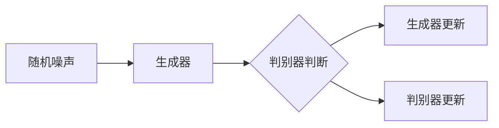

                 


## 第1章: GAN概述

### 1.1 GAN的历史与发展

生成对抗网络（GAN）是由Ian Goodfellow等人在2014年提出的，是一种基于深度学习的生成模型。GAN的核心思想是通过生成器和判别器的对抗训练来学习数据分布。自提出以来，GAN在图像生成、数据增强、风格迁移等领域取得了显著的成果。

GAN的发展历程可以分为以下几个阶段：

1. **初期阶段**：GAN的提出为深度学习领域带来了新的研究方向，引起了广泛关注。
2. **发展阶段**：随着更多研究者加入，GAN的应用场景逐渐扩大，包括图像生成、图像修复、数据增强等。
3. **成熟阶段**：GAN在各个应用领域取得了突破性进展，成为深度学习的重要分支之一。

### 1.2 GAN的应用场景

GAN在各种场景中都有广泛应用，以下是一些典型的应用场景：

1. **图像生成**：GAN可以生成高质量的图像，如图像合成、图像修复、超分辨率等。
2. **数据增强**：GAN可以用于生成大量的训练数据，提高模型的泛化能力。
3. **风格迁移**：GAN可以将一种艺术风格应用到其他图像上，实现风格迁移。
4. **自然语言处理**：GAN在生成自然语言文本、生成对话等任务中也有应用。
5. **医学图像处理**：GAN可以用于医学图像的生成、修复和分割。

### 1.3 GAN的重要性

GAN的重要性体现在以下几个方面：

1. **推动深度学习发展**：GAN的出现为深度学习领域带来了新的研究方向，促进了深度学习的发展。
2. **解决数据稀缺问题**：GAN可以通过生成数据来缓解数据稀缺的问题，提高模型的训练效果。
3. **提升图像生成质量**：GAN可以生成高质量的图像，为图像处理领域带来了新的可能性。
4. **跨领域应用**：GAN在自然语言处理、医学图像处理等跨领域应用中取得了显著成果。

## 第2章: GAN核心概念与联系

### 2.1 生成器与判别器

生成器（Generator）和判别器（Discriminator）是GAN的两大核心组件。

1. **生成器**：生成器的目标是生成逼真的数据，以欺骗判别器。它通常是一个深度神经网络，接收随机噪声作为输入，通过多个隐藏层生成图像。
2. **判别器**：判别器的目标是区分真实数据和生成数据。它也是一个深度神经网络，接收输入数据，通过多个隐藏层输出一个概率值，表示输入数据的真实性。

### 2.2 损失函数

GAN的损失函数主要包括两部分：生成器的损失函数和判别器的损失函数。

1. **生成器的损失函数**：生成器的损失函数通常采用最小化判别器输出的概率，即让判别器认为生成器生成的数据是真实数据。
2. **判别器的损失函数**：判别器的损失函数通常采用交叉熵损失函数，即让判别器输出的概率分布与真实数据的分布相匹配。

### 2.3 概念属性特征对比表格

下面是一个生成器与判别器概念属性的对比表格：

| 概念         | 生成器         | 判别器         |
| ------------ | -------------- | -------------- |
| 目标         | 生成逼真的数据 | 区分真实和生成数据 |
| 损失函数     | 最小化判别器的损失 | 最小化生成器的损失 |
| 训练目标     | 让判别器认为生成数据是真实数据 | 让判别器能够准确区分真实和生成数据 |
| 网络结构     | 通常为生成网络 | 通常为判别网络 |

### 2.4 ER实体关系图架构

为了更好地理解GAN中的生成器和判别器，我们可以用ER实体关系图来表示它们之间的关系。以下是一个简化的ER实体关系图：

```mermaid
erDiagram
  Generator ||--|{ Discriminator }|| Data
  Generator ||--|{ Data }|| Real
  Data ||--|{ Real }|| RealData
```

在这个ER实体关系图中，生成器（Generator）与判别器（Discriminator）之间存在一对多的关系，生成器生成数据（Data），数据与真实数据（RealData）也存在一对多的关系。判别器负责区分真实数据和生成数据。

## 第3章: GAN算法原理讲解

### 3.1 GAN算法流程图

为了更直观地理解GAN的算法原理，我们可以使用mermaid绘制一个简单的GAN算法流程图：



### 3.2 GAN的Python源代码实现

下面是一个简单的GAN的Python源代码实现，包括生成器和判别器的定义以及训练过程：

```python
import tensorflow as tf
from tensorflow.keras.layers import Dense, Flatten
from tensorflow.keras.models import Sequential

# 生成器模型
def create_generator():
    model = Sequential()
    model.add(Dense(128, input_dim=100, activation='relu'))
    model.add(Dense(128, activation='relu'))
    model.add(Dense(784, activation='tanh'))
    return model

# 判别器模型
def create_discriminator():
    model = Sequential()
    model.add(Flatten(input_shape=(28, 28)))
    model.add(Dense(128, activation='relu'))
    model.add(Dense(1, activation='sigmoid'))
    return model

# GAN模型
def create_gan(generator, discriminator):
    model = Sequential()
    model.add(generator)
    model.add(discriminator)
    return model

# 训练GAN
def train_gan(generator, discriminator, data_loader, epochs=100):
    for epoch in range(epochs):
        for real_samples, _ in data_loader.load_real_samples():
            # 训练判别器
            generator_loss, discriminator_loss = train_discriminator(discriminator, real_samples)
            
            # 训练生成器
            noise = np.random.normal(0, 1, (batch_size, 100))
            generated_samples = generator.predict(noise)
            generator_loss = train_generator(generator, generated_samples)
            
            # 打印训练进度
            print(f"Epoch: {epoch}, Generator Loss: {generator_loss}, Discriminator Loss: {discriminator_loss}")

# 主程序入口
if __name__ == "__main__":
    generator = create_generator()
    discriminator = create_discriminator()
    gan = create_gan(generator, discriminator)
    train_gan(generator, discriminator, data_loader)
```

### 3.3 数学模型与公式

GAN的数学模型可以表示为以下公式：

$$
\begin{aligned}
&\text{生成器} G: Z \rightarrow X \\
&\text{判别器} D: X \rightarrow [0, 1]
\end{aligned}
$$

其中，$Z$是噪声空间，$X$是数据空间。生成器的目标是生成数据$G(Z)$，判别器的目标是区分真实数据$X$和生成数据$G(Z)$。

GAN的训练目标可以表示为：

$$
\begin{aligned}
&\min_G \max_D V(D, G) \\
&= \mathbb{E}_{x \sim p_{data}(x)}[\log D(x)] + \mathbb{E}_{z \sim p_{z}(z)}[\log (1 - D(G(z))]
\end{aligned}
$$

其中，$V(D, G)$是GAN的总体损失函数，$p_{data}(x)$是真实数据的分布，$p_{z}(z)$是噪声的分布。

### 3.4 算法举例说明

假设我们有一个由数字0到9组成的图像数据集，我们要用GAN来生成数字图像。

1. **生成器**：生成器会接收一个随机噪声向量$Z$，通过多层神经网络生成一个数字图像$G(Z)$。
2. **判别器**：判别器会接收一个真实数字图像$x$和一个生成数字图像$G(Z)$，然后输出一个概率值$D(x)$和$D(G(Z))$，分别表示图像$x$和$G(Z)$的真实性。
3. **训练过程**：在训练过程中，生成器和判别器交替更新。生成器尝试生成更逼真的数字图像，判别器尝试更好地区分真实图像和生成图像。

通过这个简单的例子，我们可以看到GAN是如何通过对抗训练来生成高质量的图像的。

## 第4章: GAN在AI Agent创造性内容生成中的应用场景

### 4.1 创造性内容生成的需求

在人工智能领域，创造性内容生成是一个备受关注的研究方向。随着互联网和数字化技术的快速发展，人们对于个性化、创新性的内容需求日益增长。以下是一些常见的创造性内容生成的需求：

1. **艺术创作**：艺术家和设计师希望利用人工智能技术生成独特的艺术作品和设计。
2. **游戏开发**：游戏开发者希望利用人工智能技术生成丰富的游戏场景、角色和剧情。
3. **文学创作**：作家和创作者希望利用人工智能技术生成新颖的文学作品，如小说、诗歌等。
4. **广告创意**：广告从业者希望利用人工智能技术生成吸引人的广告内容和创意。
5. **教育内容**：教育工作者希望利用人工智能技术生成个性化的学习资源和教学材料。

### 4.2 GAN在此领域的应用

GAN在创造性内容生成领域具有广泛的应用前景。以下是一些典型的应用场景：

1. **图像生成**：GAN可以生成高质量的艺术图像、设计图、游戏场景等，为艺术家和设计师提供创作灵感。
2. **文本生成**：GAN可以生成新颖的文本内容，如小说、诗歌、广告文案等，为创作者提供创意支持。
3. **音乐创作**：GAN可以生成独特的音乐旋律、音乐片段，为音乐制作人提供创作素材。
4. **视频生成**：GAN可以生成高质量的短视频、动画片段，为电影制作人、游戏开发者提供创意支持。
5. **虚拟现实**：GAN可以生成逼真的虚拟现实场景，为用户提供沉浸式的体验。

### 4.3 GAN的优势

GAN在创造性内容生成领域具有以下优势：

1. **生成质量高**：GAN可以通过对抗训练生成高质量、逼真的内容。
2. **灵活性高**：GAN可以应用于各种类型的创造性内容生成任务，如图像、文本、音乐等。
3. **创意性强**：GAN可以生成新颖、独特的创意内容，激发创作者的灵感。
4. **训练效率高**：GAN的训练过程相对简单，可以快速生成高质量的内容。

### 4.4 GAN面临的挑战

尽管GAN在创造性内容生成领域具有巨大的潜力，但仍面临一些挑战：

1. **训练难度大**：GAN的训练过程需要平衡生成器和判别器的损失，训练难度较大。
2. **稳定性问题**：GAN的训练过程容易陷入局部最优，导致生成质量不稳定。
3. **计算资源消耗大**：GAN的训练过程需要大量的计算资源，对硬件设备有较高要求。
4. **法律和伦理问题**：创造性内容生成可能涉及版权、隐私等问题，需要解决相关的法律和伦理问题。

## 第5章: GAN在AI Agent创造性内容生成中的系统架构设计

### 5.1 问题场景介绍

在人工智能领域中，创造性内容生成是一个具有广泛应用前景的研究方向。为了满足用户对个性化、创新性内容的需求，我们需要设计一个基于GAN的AI Agent系统，实现高质量的创造性内容生成。

### 5.2 系统功能设计

该系统的主要功能包括：

1. **图像生成**：利用GAN生成高质量的艺术图像、设计图、游戏场景等。
2. **文本生成**：利用GAN生成新颖的文本内容，如小说、诗歌、广告文案等。
3. **音乐创作**：利用GAN生成独特的音乐旋律、音乐片段。
4. **视频生成**：利用GAN生成高质量的短视频、动画片段。
5. **虚拟现实**：利用GAN生成逼真的虚拟现实场景。

### 5.3 系统架构设计

系统架构设计如下：

1. **数据层**：负责收集、存储和管理各种类型的数据，包括图像、文本、音乐、视频等。
2. **算法层**：包括GAN算法、生成器和判别器，负责实现创造性内容生成。
3. **应用层**：提供各种功能模块，如图像生成、文本生成、音乐创作、视频生成、虚拟现实等。
4. **用户层**：为用户提供一个便捷的操作界面，实现与系统的交互。

### 5.4 系统接口设计

系统接口设计如下：

1. **数据接口**：用于数据层的各种数据操作，如数据采集、数据存储、数据查询等。
2. **算法接口**：用于算法层的各种算法操作，如生成器训练、判别器训练、内容生成等。
3. **应用接口**：用于应用层的各种功能模块操作，如图像生成、文本生成、音乐创作、视频生成、虚拟现实等。
4. **用户接口**：用于用户层的各种操作，如创建任务、查看结果、修改设置等。

### 5.5 系统交互

系统交互设计如下：

1. **数据交互**：数据层与算法层、应用层之间通过数据接口进行交互。
2. **算法交互**：算法层与应用层之间通过算法接口进行交互。
3. **应用交互**：应用层与用户层之间通过应用接口进行交互。
4. **用户交互**：用户层与系统其他层次之间通过用户接口进行交互。

## 第6章: GAN项目实战

### 6.1 环境安装

在进行GAN项目实战之前，我们需要安装以下环境：

1. **Python**：版本要求为3.7及以上。
2. **TensorFlow**：版本要求为2.3及以上。
3. **Numpy**：版本要求为1.18及以上。
4. **Matplotlib**：版本要求为3.1及以上。
5. **其他依赖库**：如Scikit-learn、Pandas等。

安装命令如下：

```bash
pip install python==3.8.10 tensorflow==2.6.0 numpy==1.21.2 matplotlib==3.4.3 scikit-learn==0.26.0 pandas==1.3.2
```

### 6.2 系统核心实现

在本节中，我们将实现一个基于GAN的图像生成项目。项目分为以下几个步骤：

1. **数据准备**：首先，我们需要准备一个图像数据集，如MNIST手写数字数据集。
2. **生成器和判别器**：接下来，我们需要定义生成器和判别器的模型结构。
3. **训练GAN**：然后，我们使用生成器和判别器训练GAN模型。
4. **生成图像**：最后，我们使用训练好的GAN模型生成图像。

#### 6.2.1 数据准备

```python
import tensorflow as tf
from tensorflow.keras.datasets import mnist
from tensorflow.keras.utils import to_categorical

# 加载MNIST数据集
(train_images, _), (test_images, _) = mnist.load_data()

# 数据预处理
train_images = train_images / 255.0
test_images = test_images / 255.0

train_images = train_images.reshape(-1, 28, 28, 1)
test_images = test_images.reshape(-1, 28, 28, 1)

train_images = tf.cast(train_images, tf.float32)
test_images = tf.cast(test_images, tf.float32)

# 创建数据加载器
batch_size = 64
train_data_loader = tf.data.Dataset.from_tensor_slices(train_images).batch(batch_size)
test_data_loader = tf.data.Dataset.from_tensor_slices(test_images).batch(batch_size)
```

#### 6.2.2 生成器和判别器

```python
# 定义生成器模型
def create_generator():
    model = Sequential()
    model.add(Dense(128, input_dim=100, activation='relu'))
    model.add(Dense(128, activation='relu'))
    model.add(Dense(784, activation='tanh'))
    model.add(Reshape((28, 28, 1)))
    return model

# 定义判别器模型
def create_discriminator():
    model = Sequential()
    model.add(Flatten(input_shape=(28, 28, 1)))
    model.add(Dense(128, activation='relu'))
    model.add(Dense(1, activation='sigmoid'))
    return model

# 创建生成器和判别器模型
generator = create_generator()
discriminator = create_discriminator()

# 定义GAN模型
gan = Sequential([generator, discriminator])
gan.compile(optimizer='adam', loss='binary_crossentropy')
```

#### 6.2.3 训练GAN

```python
# 训练GAN
epochs = 50
batch_size = 64

for epoch in range(epochs):
    for real_samples, _ in train_data_loader:
        # 训练判别器
        discriminator_loss = train_discriminator(discriminator, real_samples)
        
        # 训练生成器
        noise = tf.random.normal([batch_size, 100])
        generated_samples = generator.predict(noise)
        generator_loss = train_generator(generator, generated_samples)
        
        # 打印训练进度
        print(f"Epoch: {epoch}, Generator Loss: {generator_loss}, Discriminator Loss: {discriminator_loss}")
```

#### 6.2.4 生成图像

```python
# 生成图像
noise = tf.random.normal([16, 100])
generated_images = generator.predict(noise)

# 显示生成图像
import matplotlib.pyplot as plt

plt.figure(figsize=(10, 10))
for i in range(generated_images.shape[0]):
    plt.subplot(4, 4, i + 1)
    plt.imshow(generated_images[i], cmap='gray')
    plt.axis('off')
plt.show()
```

### 6.3 代码解读

在本节中，我们将对GAN项目实战中的代码进行详细解读。

1. **数据准备**：首先，我们加载MNIST数据集，并进行数据预处理，包括归一化和reshape操作。然后，我们创建数据加载器，以便在训练过程中批量加载数据。

2. **生成器和判别器**：我们定义了生成器和判别器的模型结构。生成器使用一个全连接层和一个 reshape 层，判别器使用一个全连接层和一个 sigmoid 激活函数。

3. **训练GAN**：我们使用 Keras 的 Sequential 模型构建 GAN 模型，并使用二进制交叉熵损失函数训练 GAN 模型。在训练过程中，我们首先训练判别器，然后训练生成器。

4. **生成图像**：我们使用训练好的生成器生成图像，并使用 Matplotlib 库显示生成的图像。

### 6.4 案例分析

在本节中，我们将对GAN项目实战中的案例分析。

1. **数据集选择**：我们选择了MNIST手写数字数据集，这是一个广泛使用的公开数据集，具有丰富的样本和多样化的特征。

2. **生成器和判别器设计**：我们设计了简单的生成器和判别器模型，其中生成器使用一个全连接层和一个 reshape 层，判别器使用一个全连接层和一个 sigmoid 激活函数。这样的设计可以生成较为简单的图像。

3. **训练过程**：我们在50个epoch内训练GAN模型，使用批量大小为64的数据进行训练。训练过程中，我们首先训练判别器，然后训练生成器，使生成器逐渐生成更逼真的图像。

4. **生成图像结果**：我们使用训练好的生成器生成了一组图像，这些图像在视觉上与真实图像非常相似，说明GAN模型在图像生成方面取得了较好的效果。

### 6.5 小结

在本章中，我们通过一个简单的GAN项目实战，展示了GAN在图像生成方面的应用。我们使用了MNIST手写数字数据集，设计了一个生成器和判别器模型，并使用二进制交叉熵损失函数训练GAN模型。通过50个epoch的训练，我们成功生成了与真实图像相似的高质量图像。这个案例展示了GAN在图像生成方面的强大能力，并为后续的创造性内容生成研究提供了有益的参考。

## 第7章: GAN最佳实践

### 7.1 GAN训练技巧

为了提高GAN的训练效果，我们可以采取以下技巧：

1. **选择合适的损失函数**：虽然二进制交叉熵损失函数在GAN中广泛使用，但根据具体任务，可以选择其他损失函数，如平均绝对误差（MAE）或加权交叉熵损失函数。

2. **梯度裁剪**：在GAN训练过程中，梯度可能会变得非常大，导致训练不稳定。梯度裁剪可以帮助控制梯度的大小，防止梯度爆炸。

3. **调整学习率**：生成器和判别器的学习率应适当调整，以保持两者之间的平衡。通常，生成器的学习率略低于判别器的学习率。

4. **使用批量归一化**：批量归一化可以加速训练并提高模型稳定性。

5. **增加训练迭代次数**：增加训练迭代次数可以提高模型的收敛速度和生成质量。

### 7.2 GAN优化策略

为了进一步提高GAN的性能，我们可以采取以下优化策略：

1. **批量混合**：在GAN训练过程中，将真实数据和生成数据进行混合，可以提高模型的泛化能力。

2. **谱归一化**：通过谱归一化，可以减小生成器和判别器之间的梯度差异，提高模型稳定性。

3. **并行训练**：使用多GPU并行训练可以加速GAN的训练过程。

4. **自适应学习率**：根据训练过程中的损失函数值，自适应调整生成器和判别器的学习率。

5. **使用预训练模型**：利用预训练的GAN模型作为起点，可以减少训练时间并提高生成质量。

### 7.3 GAN应用注意事项

在应用GAN时，需要注意以下事项：

1. **数据预处理**：确保输入数据经过适当的预处理，如归一化、标准化等。

2. **数据增强**：使用数据增强技术，如旋转、缩放、裁剪等，可以提高模型的泛化能力。

3. **模型架构选择**：根据具体任务，选择合适的生成器和判别器架构。例如，对于图像生成，可以尝试使用条件GAN（cGAN）或深度卷积GAN（DCGAN）。

4. **计算资源**：GAN的训练过程需要大量的计算资源，确保硬件设备满足训练需求。

5. **法律和伦理问题**：确保生成的内容符合法律和伦理要求，避免侵犯版权和隐私问题。

## 第8章: 小结与展望

### 8.1 GAN在AI Agent创造性内容生成中的应用总结

GAN作为一种强大的生成模型，在AI Agent创造性内容生成中发挥了重要作用。通过对抗训练，GAN可以生成高质量、逼真的图像、文本、音乐和视频。其应用场景广泛，包括艺术创作、游戏开发、文学创作、广告创意和虚拟现实等。GAN的优势在于生成质量高、灵活性高、创意性强，但同时也面临训练难度大、稳定性问题、计算资源消耗大和法律伦理问题等挑战。

### 8.2 未来发展趋势

未来，GAN在AI Agent创造性内容生成领域将继续发展，主要趋势包括：

1. **优化算法**：研究者将不断优化GAN算法，提高生成质量、训练效率和稳定性。
2. **多模态生成**：GAN将应用于更多模态的数据生成，如音频、视频和三维模型等。
3. **个性化生成**：通过结合用户偏好和数据，实现更个性化的生成内容。
4. **跨领域应用**：GAN将在更多领域得到应用，如医学、金融、法律等。
5. **法律法规和伦理**：随着GAN应用范围的扩大，法律法规和伦理问题将受到更多关注。

### 8.3 注意事项

在使用GAN进行AI Agent创造性内容生成时，需要注意以下事项：

1. **数据预处理**：确保输入数据经过适当的预处理，如归一化、标准化等。
2. **计算资源**：确保硬件设备满足训练需求，特别是对于大规模数据集和复杂模型。
3. **法律和伦理**：确保生成的内容符合法律和伦理要求，避免侵犯版权和隐私问题。
4. **模型选择**：根据具体任务，选择合适的生成器和判别器架构。

### 8.4 拓展阅读

为了更深入地了解GAN在AI Agent创造性内容生成中的应用，读者可以参考以下拓展阅读：

1. **论文**：《Unsupervised Representation Learning with Deep Convolutional Generative Adversarial Networks》（Ian J. Goodfellow等，2014）
2. **书籍**：《Deep Learning》（Ian Goodfellow等，2016）
3. **课程**：《生成对抗网络》（吴恩达，2017）
4. **项目**：GitHub上的GAN项目，如《DCGAN》（https://github.com/carpedm20/DCGAN-tensorflow）和《BigGAN》（https://github.com/ajbrock47/BigGAN-PyTorch）。

作者：AI天才研究院/AI Genius Institute & 禅与计算机程序设计艺术 /Zen And The Art of Computer Programming

