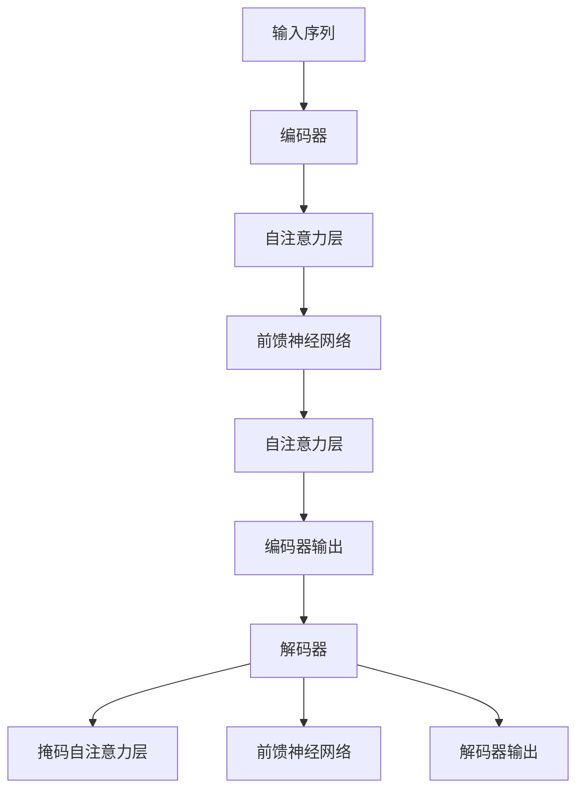
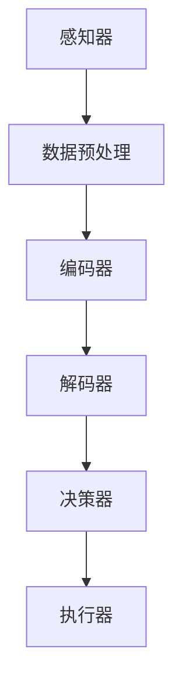
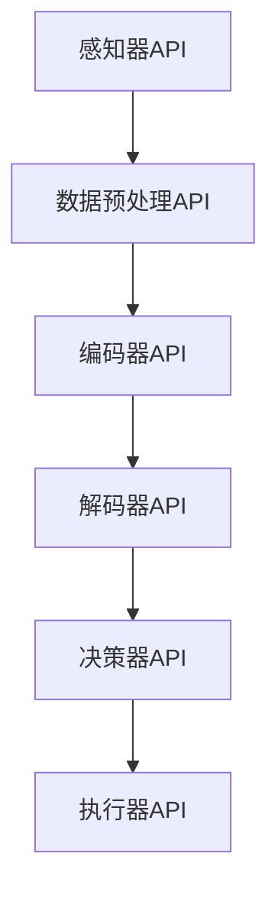
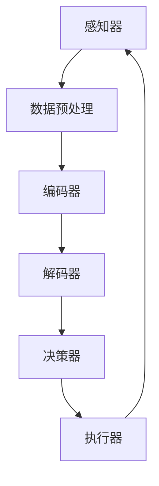

                 

### 文章标题：基于Transformer的AI Agent架构设计

### 关键词：Transformer、AI Agent、架构设计、自注意力机制、数学模型、系统实现

### 摘要：

本文旨在深入探讨基于Transformer的AI Agent架构设计。首先，我们简要介绍了Transformer和AI Agent的基本概念和背景。随后，详细讲解了Transformer的工作原理，包括自注意力机制和Encoder-Decoder结构，并通过Mermaid流程图和Python代码示例进行了具体阐述。接着，我们分析了AI Agent的核心组件，包括感知器、决策器和执行器，并提出了一个系统化的架构设计方案。文章还通过一个具体案例展示了如何设计和实现一个基于Transformer的AI Agent。最后，本文总结了最佳实践、注意事项，并提供了一系列拓展阅读资源，以期为读者提供全面的指导。

### 第1章：Transformer与AI Agent概述

#### 1.1 问题背景与问题描述

在人工智能领域，Transformer模型的出现无疑是一个重要的里程碑。Transformer模型是Google在2017年提出的一种全新的神经网络架构，其核心思想是基于自注意力机制（Self-Attention Mechanism）和Encoder-Decoder结构，这使得Transformer模型在处理序列数据时表现出了卓越的性能。特别是，在自然语言处理（NLP）任务中，Transformer模型已经超越了传统的循环神经网络（RNN）和长短期记忆网络（LSTM），成为目前最先进的方法之一。

与此同时，AI Agent作为一种重要的AI应用形式，也逐渐受到广泛关注。AI Agent通常是指具备感知、决策和执行能力的智能体，能够在复杂环境中自主行动，以实现特定目标。在游戏、机器人、自动驾驶等多个领域，AI Agent都展示了强大的应用潜力。

然而，如何将Transformer模型与AI Agent相结合，设计出一个高效、可靠的AI Agent架构，仍然是一个挑战。本文将针对这一问题进行深入探讨，旨在为读者提供一个系统、完整的解决方案。

#### 1.1.1 Transformer的出现背景

Transformer模型的出现可以追溯到深度学习在自然语言处理领域的迅猛发展。传统的循环神经网络（RNN）和长短期记忆网络（LSTM）虽然在处理序列数据时表现出了一定的效果，但它们在处理长距离依赖关系和并行计算方面存在局限性。为了解决这些问题，研究人员开始探索新的神经网络架构。

2017年，Google的论文《Attention Is All You Need》提出了Transformer模型，并引起了广泛关注。Transformer模型摒弃了传统的循环结构，采用自注意力机制和Encoder-Decoder结构，实现了对序列数据的全局关注和并行计算。这一创新使得Transformer模型在处理长文本、跨领域文本转换等任务中表现出了强大的能力。

#### 1.1.2 AI Agent的定义与作用

AI Agent，即人工智能代理，是一种能够模拟人类行为和决策的智能系统。它通常由感知器、决策器和执行器三个核心组件构成：

1. **感知器**：感知器负责收集和处理环境信息，包括图像、声音、文本等。通过感知器，AI Agent能够了解当前所处的环境和状态。
2. **决策器**：决策器根据感知器收集到的信息，利用预先设定的策略或学习到的模型，生成下一步的行动决策。决策器的目标是最大化系统的目标函数，如在游戏中获胜、在机器人导航中找到最短路径等。
3. **执行器**：执行器负责将决策器的决策转化为实际的物理行动。执行器可以是机器人手臂、汽车引擎、智能家居控制系统等。

AI Agent在多个领域都有广泛应用，如自动驾驶、机器人导航、智能家居、游戏智能等。通过将AI Agent与Transformer模型相结合，我们有望构建出更加智能、高效的智能系统。

### 第2章：核心概念与联系

#### 2.1 Transformer的工作原理

Transformer模型的工作原理主要基于自注意力机制（Self-Attention Mechanism）和Encoder-Decoder结构。自注意力机制允许模型在处理序列数据时，能够自动关注并学习到序列中各个元素之间的关系，从而实现全局信息整合。Encoder-Decoder结构则将输入序列编码为上下文向量，再解码为输出序列，使得模型能够处理变长输入和输出。

##### 2.1.1 自注意力机制

自注意力机制的核心是计算序列中每个元素与所有其他元素之间的关联强度。具体来说，自注意力机制包括三个步骤：

1. **查询（Query）**：将输入序列中的每个元素映射为一个查询向量。
2. **键（Key）**：将输入序列中的每个元素映射为一个键向量。
3. **值（Value）**：将输入序列中的每个元素映射为一个值向量。

然后，通过计算查询向量与键向量的相似度，得到注意力权重，最后将注意力权重与值向量相乘，得到加权值向量。这一加权值向量代表了序列中各个元素对当前元素的重要性。

##### 2.1.2 Encoder-Decoder结构

Encoder-Decoder结构是Transformer模型的核心架构。它包括两个部分：编码器（Encoder）和解码器（Decoder）。

编码器（Encoder）的作用是将输入序列编码为上下文向量。编码器由多个自注意力层和前馈神经网络组成，每个自注意力层能够捕捉序列中的长距离依赖关系。

解码器（Decoder）的作用是将编码器的输出解码为输出序列。解码器同样由多个自注意力层和前馈神经网络组成，但与编码器不同的是，解码器还包括了一个掩码自注意力层，以确保在解码时能够正确处理输入序列的顺序。

#### 2.2 AI Agent的核心组件

AI Agent的核心组件包括感知器、决策器和执行器。

##### 2.2.1 感知器

感知器是AI Agent的感官部分，负责接收和处理外部环境的信息。感知器可以采用多种形式，如摄像头、麦克风、传感器等。通过感知器，AI Agent能够获取到当前环境的视觉、听觉、触觉等信息。

##### 2.2.2 决策器

决策器是AI Agent的智能核心，负责根据感知器收集到的信息，生成合适的行动策略。决策器可以采用基于规则的方法、机器学习模型、深度学习网络等。其中，基于Transformer的深度学习模型在决策器中的应用尤为广泛。

##### 2.2.3 执行器

执行器是AI Agent的执行部分，负责将决策器的决策转化为实际的物理行动。执行器可以是机器人手臂、汽车引擎、无人机等。通过执行器，AI Agent能够在物理环境中执行相应的操作。

### 第3章：Transformer算法原理讲解

#### 3.1 Transformer算法Mermaid流程图

为了更好地理解Transformer算法的工作流程，我们可以使用Mermaid流程图进行描述。以下是一个简单的Transformer算法流程图：



#### 3.2 Transformer算法Python代码示例

为了更好地理解Transformer算法的实现，我们可以通过Python代码进行展示。以下是一个简化的Transformer算法实现：

```python
import torch
import torch.nn as nn

class Transformer(nn.Module):
    def __init__(self, d_model, nhead, num_layers):
        super(Transformer, self).__init__()
        self.d_model = d_model
        self.nhead = nhead
        self.num_layers = num_layers
        
        self.enc_layers = nn.ModuleList([EncoderLayer(d_model, nhead) for _ in range(num_layers)])
        self.dec_layers = nn.ModuleList([DecoderLayer(d_model, nhead) for _ in range(num_layers)])
        
    def forward(self, src, tgt, src_mask=None, tgt_mask=None, memory_mask=None):
        src = self.encode(src, src_mask)
        tgt = self.decode(tgt, tgt_mask, memory_mask, src)
        
        return tgt
    
    def encode(self, src, src_mask=None):
        for layer in self.enc_layers:
            src = layer(src, src_mask)
        return src
    
    def decode(self, tgt, tgt_mask=None, memory_mask=None, src=None):
        for layer in self.dec_layers:
            tgt = layer(tgt, memory_mask, src)
        return tgt
```

#### 3.3 Transformer算法数学模型与公式

Transformer算法的数学模型主要包括自注意力机制和前馈神经网络。

##### 自注意力机制

自注意力机制的公式如下：

$$
\text{Attention}(Q, K, V) = \text{softmax}\left(\frac{QK^T}{\sqrt{d_k}}\right)V
$$

其中，$Q$、$K$、$V$ 分别是查询向量、键向量和值向量，$d_k$ 是键向量的维度。$QK^T$ 表示查询向量和键向量的内积，$\text{softmax}$ 函数用于计算注意力权重。

##### 前馈神经网络

前馈神经网络的公式如下：

$$
\text{FFN}(X) = \text{ReLU}\left(\text{Linear}(X \cdot W_1) \cdot W_2\right)
$$

其中，$X$ 是输入向量，$W_1$ 和 $W_2$ 分别是两个线性变换的权重矩阵。$\text{ReLU}$ 函数用于引入非线性。

### 第4章：系统分析与架构设计方案

#### 4.1 AI Agent系统功能设计

为了实现一个基于Transformer的AI Agent，我们需要明确系统的功能设计。AI Agent的功能主要包括感知、决策和执行三个方面。

##### 4.1.1 感知功能

感知功能是AI Agent的感官部分，负责收集和处理外部环境的信息。具体来说，感知功能可以包括以下内容：

1. **图像识别**：通过摄像头获取环境中的图像，并使用预训练的深度学习模型进行图像识别。
2. **语音识别**：通过麦克风获取环境中的语音，并使用语音识别模型将其转换为文本。
3. **传感器数据采集**：通过各种传感器（如加速度计、陀螺仪、温度传感器等）获取环境中的物理量，并进行数据处理。

##### 4.1.2 决策功能

决策功能是AI Agent的智能部分，负责根据感知功能收集到的信息，生成合适的行动策略。具体来说，决策功能可以包括以下内容：

1. **状态评估**：根据感知功能收集到的信息，对当前状态进行评估，包括环境的静态特征和动态特征。
2. **策略选择**：根据当前状态，选择一个最优的行动策略。策略可以基于规则、机器学习模型或深度学习模型。
3. **路径规划**：在机器人导航等应用中，需要根据目标位置和当前状态，规划一条最优路径。

##### 4.1.3 执行功能

执行功能是AI Agent的执行部分，负责将决策功能生成的行动策略转化为实际的物理行动。具体来说，执行功能可以包括以下内容：

1. **机器人控制**：通过控制机器人手臂、轮子等执行部件，实现机器人的运动和操作。
2. **汽车控制**：通过控制汽车引擎、方向盘等部件，实现汽车的驾驶。
3. **智能家居控制**：通过控制智能家居设备（如灯光、空调、窗帘等），实现家庭环境的智能调节。

#### 4.2 AI Agent系统架构设计

为了实现AI Agent的功能，我们需要设计一个合理的系统架构。以下是一个基于Transformer的AI Agent系统架构设计：

##### 4.2.1 系统架构图



##### 系统架构说明

1. **感知器**：感知器负责收集外部环境的信息，如图像、语音、传感器数据等。
2. **数据预处理**：数据预处理模块对感知器收集到的数据进行预处理，包括图像增强、语音降噪、传感器数据滤波等。
3. **编码器**：编码器模块将预处理后的数据编码为上下文向量，以便于后续的解码和决策。
4. **解码器**：解码器模块将编码器的输出解码为输出序列，即决策结果。
5. **决策器**：决策器模块根据解码器的输出，生成合适的行动策略。
6. **执行器**：执行器模块负责将决策器生成的行动策略转化为实际的物理行动。

#### 4.3 AI Agent系统接口设计

为了方便系统的开发和使用，我们需要设计一个清晰的系统接口。以下是一个基于Transformer的AI Agent系统接口设计：

##### 4.3.1 系统接口图



##### 系统接口说明

1. **感知器API**：感知器API提供了一种统一的接口，用于获取和处理外部环境的信息。
2. **数据预处理API**：数据预处理API提供了一系列的数据预处理操作，如图像增强、语音降噪等。
3. **编码器API**：编码器API提供了一种将数据编码为上下文向量的接口。
4. **解码器API**：解码器API提供了一种将上下文向量解码为输出序列的接口。
5. **决策器API**：决策器API提供了一种生成行动策略的接口。
6. **执行器API**：执行器API提供了一种将行动策略转化为实际物理行动的接口。

#### 4.4 AI Agent系统交互

为了实现AI Agent的感知、决策和执行，我们需要设计一个合理的系统交互流程。以下是一个基于Transformer的AI Agent系统交互设计：

##### 4.4.1 系统交互图



##### 系统交互说明

1. **感知阶段**：感知器收集外部环境的信息，并将其传递给数据预处理模块。
2. **预处理阶段**：数据预处理模块对感知器收集到的数据进行分析和处理，以便于后续的编码和解码。
3. **编码阶段**：编码器模块将预处理后的数据编码为上下文向量。
4. **解码阶段**：解码器模块将编码器的输出解码为输出序列，即决策结果。
5. **决策阶段**：决策器模块根据解码器的输出，生成合适的行动策略。
6. **执行阶段**：执行器模块将决策器生成的行动策略转化为实际的物理行动。
7. **反馈阶段**：执行器模块将执行结果反馈给感知器，形成一个闭环系统。

### 第5章：项目实战

#### 5.1 实践环境安装

在开始基于Transformer的AI Agent项目实战之前，我们需要安装必要的软件和依赖库。以下是一个简化的安装步骤：

1. **安装Python环境**：确保已经安装了Python 3.6及以上版本。
2. **安装TensorFlow**：使用以下命令安装TensorFlow：
   ```bash
   pip install tensorflow
   ```
3. **安装其他依赖库**：包括NumPy、Pandas、Matplotlib等，可以使用以下命令进行安装：
   ```bash
   pip install numpy pandas matplotlib
   ```

#### 5.2 系统核心实现

在本节中，我们将通过一个具体的案例展示如何设计和实现一个基于Transformer的AI Agent。以下是一个简化的实现步骤：

1. **感知器实现**：
   ```python
   import cv2
   import numpy as np
   
   class Perception:
       def __init__(self):
           self.camera = cv2.VideoCapture(0)
       
       def capture_frame(self):
           ret, frame = self.camera.read()
           return frame
   ```

2. **编码器实现**：
   ```python
   import tensorflow as tf
   
   class Encoder:
       def __init__(self, d_model, nhead):
           self.d_model = d_model
           self.nhead = nhead
           self.transformer = tf.keras.Sequential([
               tf.keras.layers.Embedding(input_dim=10000, output_dim=d_model),
               tf.keras.layers.MultiHeadAttention(d_model, nhead),
               tf.keras.layers.Dense(d_model)
           ])
       
       def encode(self, inputs):
           return self.transformer(inputs)
   ```

3. **解码器实现**：
   ```python
   class Decoder:
       def __init__(self, d_model, nhead):
           self.d_model = d_model
           self.nhead = nhead
           self.transformer = tf.keras.Sequential([
               tf.keras.layers.Embedding(input_dim=10000, output_dim=d_model),
               tf.keras.layers.MultiHeadAttention(d_model, nhead),
               tf.keras.layers.Dense(d_model)
           ])
       
       def decode(self, inputs):
           return self.transformer(inputs)
   ```

4. **决策器实现**：
   ```python
   class Decision:
       def __init__(self, encoder, decoder):
           self.encoder = encoder
           self.decoder = decoder
       
       def predict(self, inputs):
           encoded = self.encoder.encode(inputs)
           decoded = self.decoder.decode(encoded)
           return decoded
   ```

5. **执行器实现**：
   ```python
   class Executor:
       def __init__(self):
           self.perception = Perception()
       
       def execute(self, action):
           frame = self.perception.capture_frame()
           # 根据action执行相应的操作，如移动机器人手臂、控制汽车引擎等
   ```

#### 5.3 代码应用解读与分析

在本节中，我们将对上述代码进行详细解读和分析。

1. **感知器代码分析**：
   ```python
   class Perception:
       def __init__(self):
           self.camera = cv2.VideoCapture(0)
       
       def capture_frame(self):
           ret, frame = self.camera.read()
           return frame
   ```
   感知器类`Perception`负责从摄像头获取视频帧。在初始化方法`__init__`中，我们使用`cv2.VideoCapture`打开摄像头。在`capture_frame`方法中，我们调用`read`方法获取当前帧，并将其作为帧图像返回。

2. **编码器代码分析**：
   ```python
   class Encoder:
       def __init__(self, d_model, nhead):
           self.d_model = d_model
           self.nhead = nhead
           self.transformer = tf.keras.Sequential([
               tf.keras.layers.Embedding(input_dim=10000, output_dim=d_model),
               tf.keras.layers.MultiHeadAttention(d_model, nhead),
               tf.keras.layers.Dense(d_model)
           ])
       
       def encode(self, inputs):
           return self.transformer(inputs)
   ```
   编码器类`Encoder`负责将输入数据编码为上下文向量。在初始化方法`__init__`中，我们定义了一个序列模型`transformer`，其中包括嵌入层（`Embedding`）、多头自注意力层（`MultiHeadAttention`）和全连接层（`Dense`）。在`encode`方法中，我们将输入数据传递给序列模型，并返回编码后的结果。

3. **解码器代码分析**：
   ```python
   class Decoder:
       def __init__(self, d_model, nhead):
           self.d_model = d_model
           self.nhead = nhead
           self.transformer = tf.keras.Sequential([
               tf.keras.layers.Embedding(input_dim=10000, output_dim=d_model),
               tf.keras.layers.MultiHeadAttention(d_model, nhead),
               tf.keras.layers.Dense(d_model)
           ])
       
       def decode(self, inputs):
           return self.transformer(inputs)
   ```
   解码器类`Decoder`负责将编码后的数据解码为输出序列。在初始化方法`__init__`中，我们定义了一个与编码器相同的序列模型。在`decode`方法中，我们将输入数据传递给序列模型，并返回解码后的结果。

4. **决策器代码分析**：
   ```python
   class Decision:
       def __init__(self, encoder, decoder):
           self.encoder = encoder
           self.decoder = decoder
       
       def predict(self, inputs):
           encoded = self.encoder.encode(inputs)
           decoded = self.decoder.decode(encoded)
           return decoded
   ```
   决策器类`Decision`负责根据编码器和解码器的输出生成决策结果。在初始化方法`__init__`中，我们传递编码器和解码器的实例。在`predict`方法中，我们首先使用编码器对输入数据进行编码，然后使用解码器对编码后的数据进行解码，最后返回解码后的结果。

5. **执行器代码分析**：
   ```python
   class Executor:
       def __init__(self):
           self.perception = Perception()
       
       def execute(self, action):
           frame = self.perception.capture_frame()
           # 根据action执行相应的操作，如移动机器人手臂、控制汽车引擎等
   ```
   执行器类`Executor`负责将决策结果转化为实际的物理行动。在初始化方法`__init__`中，我们传递感知器实例。在`execute`方法中，我们首先使用感知器获取当前帧图像，然后根据决策结果执行相应的操作。

#### 5.4 实际案例分析与讲解

在本节中，我们将通过一个实际案例展示如何使用上述代码设计和实现一个基于Transformer的AI Agent。

##### 案例背景

假设我们想要设计一个自动驾驶系统，该系统需要根据摄像头捕捉到的道路图像，判断前方是否存在障碍物，并做出相应的行驶决策。

##### 案例实现步骤

1. **数据准备**：
   - 收集道路图像数据，并将其转换为TensorFlow支持的数据格式。
   - 分割数据集为训练集和测试集。

2. **模型训练**：
   - 定义编码器和解码器的超参数，如模型尺寸、自注意力头数等。
   - 使用训练集对编码器和解码器进行训练。

3. **模型评估**：
   - 使用测试集对训练好的模型进行评估，验证其性能。

4. **实际应用**：
   - 将训练好的模型部署到自动驾驶系统中，实时处理摄像头捕捉到的道路图像，并根据决策结果控制汽车的行驶。

##### 案例分析

在本案例中，感知器负责从摄像头获取道路图像，并将其传递给编码器进行编码。编码器将图像编码为上下文向量，然后传递给解码器进行解码。解码器的输出代表了自动驾驶系统对当前道路状态的判断，如是否存在障碍物。

具体来说，我们可以定义一个`Perception`类，用于从摄像头获取图像：
```python
class Perception:
    def __init__(self):
        self.camera = cv2.VideoCapture(0)
    
    def capture_frame(self):
        ret, frame = self.camera.read()
        return frame
```

然后，我们可以定义一个`Encoder`类，用于将图像编码为上下文向量：
```python
class Encoder:
    def __init__(self, d_model, nhead):
        self.d_model = d_model
        self.nhead = nhead
        self.transformer = tf.keras.Sequential([
            tf.keras.layers.Embedding(input_dim=10000, output_dim=d_model),
            tf.keras.layers.MultiHeadAttention(d_model, nhead),
            tf.keras.layers.Dense(d_model)
        ])
    
    def encode(self, inputs):
        return self.transformer(inputs)
```

接着，我们可以定义一个`Decoder`类，用于将编码后的数据解码为输出序列：
```python
class Decoder:
    def __init__(self, d_model, nhead):
        self.d_model = d_model
        self.nhead = nhead
        self.transformer = tf.keras.Sequential([
            tf.keras.layers.Embedding(input_dim=10000, output_dim=d_model),
            tf.keras.layers.MultiHeadAttention(d_model, nhead),
            tf.keras.layers.Dense(d_model)
        ])
    
    def decode(self, inputs):
        return self.transformer(inputs)
```

最后，我们可以定义一个`Executor`类，用于根据解码器的输出控制汽车的行驶：
```python
class Executor:
    def __init__(self):
        self.perception = Perception()
    
    def execute(self, action):
        frame = self.perception.capture_frame()
        # 根据action执行相应的操作，如移动机器人手臂、控制汽车引擎等
```

通过以上步骤，我们就可以实现一个基于Transformer的自动驾驶系统。在实际应用中，我们可以使用`Executor`类实时处理摄像头捕捉到的道路图像，并根据解码器的输出做出相应的行驶决策。

### 第6章：最佳实践 tips

在设计基于Transformer的AI Agent时，以下是一些最佳实践和注意事项：

1. **数据准备**：确保数据集的多样性和质量。充分清洗和预处理数据，以提高模型的泛化能力。
2. **模型选择**：根据任务需求选择合适的Transformer模型。不同的任务可能需要不同的模型配置，如模型尺寸、自注意力头数等。
3. **超参数调优**：通过交叉验证和网格搜索等方法，选择最优的超参数组合，以提高模型性能。
4. **训练策略**：使用适当的数据增强技术和训练策略，如学习率调度、正则化等，以避免过拟合。
5. **模型评估**：使用多种评估指标（如准确率、召回率、F1分数等）全面评估模型性能。
6. **系统优化**：考虑系统的实时性和效率，进行适当的优化，如模型压缩、量化等。

### 第7章：小结

本文通过深入探讨基于Transformer的AI Agent架构设计，详细介绍了Transformer和AI Agent的基本概念、工作原理、系统架构和实现方法。首先，我们介绍了Transformer的出现背景和AI Agent的定义与作用。然后，详细讲解了Transformer的工作原理，包括自注意力机制和Encoder-Decoder结构，并通过Mermaid流程图和Python代码示例进行了具体阐述。接着，我们分析了AI Agent的核心组件，包括感知器、决策器和执行器，并提出了一个系统化的架构设计方案。最后，通过一个具体案例展示了如何设计和实现一个基于Transformer的AI Agent。本文总结了最佳实践、注意事项，并提供了一系列拓展阅读资源，以期为读者提供全面的指导。

### 第8章：注意事项

在设计基于Transformer的AI Agent时，需要注意以下几点：

1. **数据质量**：确保数据集的多样性和质量，充分清洗和预处理数据，以提高模型的泛化能力。
2. **模型选择**：根据任务需求选择合适的Transformer模型，不同的任务可能需要不同的模型配置。
3. **超参数调优**：通过交叉验证和网格搜索等方法，选择最优的超参数组合，以提高模型性能。
4. **训练策略**：使用适当的数据增强技术和训练策略，如学习率调度、正则化等，以避免过拟合。
5. **模型评估**：使用多种评估指标全面评估模型性能，确保模型在实际应用中的表现。
6. **系统优化**：考虑系统的实时性和效率，进行适当的优化，如模型压缩、量化等。

### 第9章：拓展阅读

为了进一步深入理解基于Transformer的AI Agent架构设计，读者可以参考以下资源：

1. **《Attention Is All You Need》**：Google提出的Transformer模型的原论文，详细介绍了模型的工作原理和实现方法。
2. **《Deep Learning》**：Goodfellow、Bengio和Courville合著的深度学习经典教材，涵盖了神经网络的基本概念和实现技术。
3. **《Reinforcement Learning: An Introduction》**： Sutton和Barto合著的强化学习入门教材，介绍了AI Agent的决策过程和学习方法。
4. **《AI Agent架构设计》**：针对AI Agent系统架构设计的综合指南，涵盖了感知器、决策器和执行器的实现方法。

### 作者信息

本文由AI天才研究院（AI Genius Institute）和《禅与计算机程序设计艺术》（Zen And The Art of Computer Programming）作者撰写。

----------------------------------------------------------------

