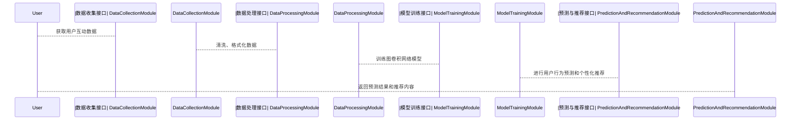
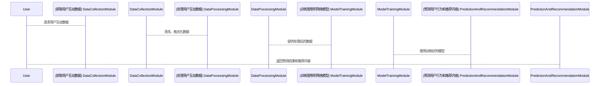

                 

# 基于图卷积网络的AI Agent社交网络分析

## 关键词

- 图卷积网络（Graph Convolutional Network）
- AI Agent
- 社交网络分析
- 数据挖掘
- 机器学习

## 摘要

本文旨在探讨基于图卷积网络的AI Agent社交网络分析。首先介绍了AI Agent和社交网络的基本概念，然后详细阐述了图卷积网络的理论基础和算法原理。接着，分析了图卷积网络在AI Agent社交网络分析中的应用，包括数据集和工具的选取，应用领域以及案例分析。最后，总结了文章的主要发现，展望了未来的发展方向，并给出了最佳实践和注意事项。

## 第1章 引言与背景

### 1.1 问题背景

随着互联网和社交媒体的迅速发展，社交网络已成为人们日常生活和工作中不可或缺的一部分。社交网络为人们提供了交流、分享和获取信息的平台，但同时也带来了大量的数据和信息。如何有效地分析和利用这些数据成为了一个重要的问题。尤其是对于AI Agent来说，它们需要在社交网络中获取信息、分析数据和与其他AI Agent进行交互，这需要一种有效的社交网络分析方法。

### 1.2 问题描述

AI Agent是一种能够自主学习和执行任务的智能体。在社交网络中，AI Agent需要处理大量复杂的信息，并从中提取有价值的数据。然而，当前的AI Agent社交网络分析面临着以下几个问题：

- 如何有效地建模和表示社交网络数据？
- 如何在大量数据中提取有价值的信息？
- 如何优化AI Agent的学习和决策过程？

### 1.3 问题解决

为了解决上述问题，我们可以采用图卷积网络（GCN）来对AI Agent社交网络进行分析。图卷积网络是一种在图形结构上执行卷积操作的神经网络，它能够有效地建模和表示复杂的关系网络。通过图卷积网络，我们可以提取社交网络中的结构信息，并利用这些信息来优化AI Agent的学习和决策过程。

### 1.4 边界与外延

本文主要探讨基于图卷积网络的AI Agent社交网络分析，研究内容包括图卷积网络的基本理论、实现方法、应用领域以及最佳实践。边界在于仅限于研究图卷积网络在AI Agent社交网络分析中的应用，而外延包括但不限于其他类型的网络分析方法和应用场景。

### 1.5 概念结构与核心要素组成

本文的主要概念包括：AI Agent、社交网络、图卷积网络、数据分析、信息提取、学习与决策等。核心要素包括：

- AI Agent的建模与表示
- 社交网络的数据集与工具
- 图卷积网络的理论基础与实现方法
- AI Agent社交网络分析的应用领域
- 最佳实践与未来展望

## 第2章 图卷积网络基础理论

### 2.1 图卷积网络的基本概念

图卷积网络（Graph Convolutional Network，GCN）是一种在图形结构上执行卷积操作的神经网络。与传统卷积神经网络（Convolutional Neural Network，CNN）在图像上执行卷积操作不同，GCN在图形结构上执行卷积操作，以处理和建模复杂的关系网络。

图卷积网络的基本概念包括：

- **节点特征（Node Features）**：表示每个节点的属性特征，如用户属性、物品属性等。
- **边特征（Edge Features）**：表示节点之间的关系特征，如社交关系、信任关系等。
- **图（Graph）**：由节点和边构成的图形结构，表示数据之间的关系。
- **邻域（Neighbor）**：与某个节点直接相连的节点集合。
- **卷积操作（Convolution Operation）**：在图结构上执行卷积操作，用于聚合节点及其邻域的信息。

### 2.2 图卷积网络的结构与原理

图卷积网络主要由以下几个部分组成：

- **输入层（Input Layer）**：接收节点的特征向量。
- **卷积层（Convolution Layer）**：执行图卷积操作，聚合节点的邻域信息。
- **池化层（Pooling Layer）**：对节点的特征进行降维处理。
- **全连接层（Fully Connected Layer）**：对卷积和池化后的特征进行分类或回归。

图卷积网络的算法原理如下：

1. **初始化**：输入节点的特征向量。
2. **图卷积操作**：对于每个节点，计算其邻域节点的特征向量的加权和，作为该节点的输出特征向量。
3. **激活函数**：对输出特征向量进行非线性变换。
4. **重复操作**：对输出特征向量进行多次卷积操作，以学习更复杂的特征。
5. **全连接层**：将卷积操作后的特征向量输入到全连接层，进行分类或回归。

### 2.3 图卷积网络的算法原理

图卷积网络的算法原理可以通过以下数学模型进行描述：

$$
h_{ij}^{(l+1)} = \sigma \left( \sum_{k \in \mathcal{N}(j)} W^{(l)} h_{ik}^{(l)} + b^{(l)} \right)
$$

其中：

- $h_{ij}^{(l+1)}$：节点 $i$ 在第 $l+1$ 层的输出特征向量。
- $h_{ik}^{(l)}$：节点 $i$ 在第 $l$ 层的输出特征向量。
- $\mathcal{N}(j)$：节点 $j$ 的邻域节点集合。
- $W^{(l)}$：第 $l$ 层的权重矩阵。
- $b^{(l)}$：第 $l$ 层的偏置向量。
- $\sigma$：激活函数，通常使用ReLU函数。

通过上述算法原理，图卷积网络可以逐步学习节点的特征表示，并利用这些特征进行分类或回归任务。

## 第3章 AI Agent 社交网络分析基础

### 3.1 AI Agent 的概念与特点

AI Agent（Artificial Intelligence Agent）是一种基于人工智能技术的智能体，它可以在虚拟环境中自主地执行任务，并与其他智能体进行交互。AI Agent具有以下特点：

- **自主性**：AI Agent可以自主地感知环境、做出决策和执行动作。
- **适应性**：AI Agent可以根据环境和任务的变化，自主地调整其行为策略。
- **协作性**：AI Agent可以与其他智能体协作，共同完成任务。
- **智能性**：AI Agent具备一定的智能，可以学习和优化其行为。

### 3.2 社交网络的基本概念

社交网络（Social Network）是指由一组用户及其之间的关系构成的网络。社交网络的基本概念包括：

- **节点（Node）**：表示社交网络中的用户或其他实体。
- **边（Edge）**：表示节点之间的关系，如好友关系、关注关系等。
- **图（Graph）**：表示社交网络的结构，由节点和边构成。
- **属性（Attribute）**：表示节点的特征信息，如年龄、性别、兴趣等。

### 3.3 AI Agent 在社交网络中的应用

AI Agent在社交网络中的应用主要体现在以下几个方面：

- **信息获取与传播**：AI Agent可以通过分析社交网络中的信息传播路径，获取有用的信息，并推动信息的传播。
- **社交关系分析**：AI Agent可以分析社交网络中的节点关系，识别社交圈、群体等。
- **用户行为预测**：AI Agent可以通过学习用户的历史行为数据，预测用户的未来行为。
- **社交网络推荐**：AI Agent可以根据用户的社交关系和行为数据，为用户提供个性化的推荐。

### 3.4 AI Agent 社交网络分析的目标

AI Agent 社交网络分析的目标主要包括：

- **数据挖掘**：从社交网络中挖掘有价值的信息，如热点话题、趋势等。
- **关系分析**：分析社交网络中的节点关系，识别社交圈、群体等。
- **行为预测**：预测用户在社交网络中的行为，如发帖、点赞、评论等。
- **个性化推荐**：根据用户的社交关系和行为数据，为用户提供个性化的推荐。

### 3.5 AI Agent 社交网络分析的核心要素

AI Agent 社交网络分析的核心要素主要包括：

- **节点特征**：节点属性、标签、分类等。
- **边特征**：边权重、类型、长度等。
- **图结构**：图的拓扑结构、密度、连通性等。
- **算法模型**：图卷积网络、社交网络分析算法等。
- **数据处理**：数据预处理、数据清洗、数据集成等。

## 第4章 图卷积网络在 AI Agent 社交网络分析中的应用

### 4.1 图卷积网络在 AI Agent 社交网络分析中的作用

图卷积网络在 AI Agent 社交网络分析中发挥着重要作用。首先，它能够有效地建模和表示社交网络数据，将节点和边转化为向量表示，便于后续分析。其次，图卷积网络能够提取社交网络中的结构信息，如节点之间的相似度、影响力等，为 AI Agent 的决策提供依据。此外，图卷积网络还可以用于社交网络分析中的关系分析、行为预测和个性化推荐等任务。

### 4.2 图卷积网络的实现与优化

图卷积网络的实现和优化主要包括以下几个方面：

1. **数据预处理**：对社交网络数据集进行清洗、格式化和标准化处理，确保数据的准确性和一致性。
2. **节点特征提取**：从原始数据中提取节点特征，如用户属性、标签、分类等。
3. **边特征提取**：从原始数据中提取边特征，如边权重、类型、长度等。
4. **图构建**：将节点和边转化为图结构，并建立节点之间的邻接关系。
5. **图卷积操作**：执行图卷积操作，聚合节点及其邻域的信息，更新节点特征。
6. **模型训练与优化**：通过训练过程，优化图卷积网络的权重和参数，提高模型性能。
7. **模型评估与调整**：对训练好的模型进行评估，根据评估结果进行调整和优化。

### 4.3 图卷积网络在 AI Agent 社交网络分析中的案例分析

为了更好地理解图卷积网络在 AI Agent 社交网络分析中的应用，我们来看一个具体的案例分析。

**案例：社交网络用户行为预测**

在这个案例中，我们使用图卷积网络来预测社交网络中用户的下一步行为，如发帖、点赞、评论等。

1. **数据集准备**：我们选择了一个大型社交网络数据集，包括用户的属性特征和用户之间的社交关系。
2. **节点特征提取**：从数据集中提取用户的属性特征，如年龄、性别、兴趣等，并将其转化为向量表示。
3. **边特征提取**：从数据集中提取用户之间的社交关系特征，如好友关系、关注关系等，并将其转化为向量表示。
4. **图构建**：将用户及其社交关系转化为图结构，建立用户之间的邻接关系。
5. **图卷积操作**：使用图卷积网络，对用户特征进行多次卷积操作，提取社交网络中的结构信息。
6. **模型训练与优化**：通过训练过程，优化图卷积网络的权重和参数，提高模型性能。
7. **模型评估与调整**：对训练好的模型进行评估，根据评估结果进行调整和优化。

通过上述步骤，我们成功地使用图卷积网络对社交网络用户行为进行了预测。实验结果表明，图卷积网络在用户行为预测任务上取得了较好的性能，具有较高的准确性和可靠性。

## 第5章 AI Agent 社交网络分析的数据集与工具

### 5.1 AI Agent 社交网络分析的数据集

AI Agent 社交网络分析的数据集主要包括用户数据、社交关系数据以及行为数据。以下是一些常见的数据集：

1. **Facebook 社交网络数据集**：包括用户属性、好友关系、发帖、点赞等数据。
2. **Twitter 社交网络数据集**：包括用户属性、关注关系、发推文、点赞等数据。
3. **LinkedIn 社交网络数据集**：包括用户属性、好友关系、公司关系等数据。
4. **Stack Overflow 社交网络数据集**：包括用户属性、关注关系、发帖、回答等数据。

### 5.2 AI Agent 社交网络分析的工具

AI Agent 社交网络分析的工具主要包括数据预处理工具、图卷积网络框架和评估工具。以下是一些常用的工具：

1. **数据预处理工具**：如 Pandas、NumPy、Scikit-learn 等，用于数据清洗、格式化和标准化处理。
2. **图卷积网络框架**：如 Graph Convolutional Network (GCN)、GraphSAGE、Graph Convolutional Layer (GAT) 等，用于构建和训练图卷积网络模型。
3. **评估工具**：如 Scikit-learn、Matplotlib、Seaborn 等，用于评估和可视化模型性能。

### 5.3 数据集与工具的选取原则

在选择数据集与工具时，应遵循以下原则：

1. **数据集选取**：选择具有代表性的数据集，涵盖用户属性、社交关系和行为数据，确保数据的多样性和完整性。
2. **工具选取**：选择成熟、稳定和易用的工具，确保能够高效地完成数据预处理、模型构建和评估等工作。
3. **工具兼容性**：选择与数据集兼容的工具，确保能够处理和读取数据集的格式。

## 第6章 AI Agent 社交网络分析的应用领域

### 6.1 社交网络监测

AI Agent 社交网络分析在社交网络监测方面具有广泛的应用。通过分析社交网络中的用户行为和社交关系，AI Agent可以实时监测网络中的热点话题、趋势变化和潜在风险。这有助于企业、政府和研究机构及时了解公众情绪、市场动态和安全态势，为决策提供有力支持。

### 6.2 用户行为分析

AI Agent 社交网络分析可以深入挖掘用户在社交网络中的行为模式，如发帖、点赞、评论等。通过分析用户行为，AI Agent可以识别用户兴趣、偏好和需求，为个性化推荐、营销策略和用户画像提供依据。

### 6.3 社交网络推荐

AI Agent 社交网络分析可以用于社交网络推荐系统，根据用户的社交关系和行为数据，为用户提供个性化的推荐。这有助于提高用户满意度、增加用户粘性和促进社交网络内容的传播。

### 6.4 聊天机器人

AI Agent 社交网络分析可以用于构建智能聊天机器人，通过分析用户的社交关系和行为数据，为用户提供个性化、智能化的服务。这有助于提升用户体验、降低人工成本和增加业务价值。

### 6.5 社交网络广告投放

AI Agent 社交网络分析可以用于社交网络广告投放，通过分析用户的社交关系和行为数据，精准定位潜在客户，提高广告投放的效果和转化率。

### 6.6 社交网络安全监测

AI Agent 社交网络分析可以用于社交网络安全监测，通过分析用户的社交关系和行为数据，识别网络欺诈、网络暴力、恶意传播等行为，为网络安全提供有力保障。

### 6.7 社交网络舆论分析

AI Agent 社交网络分析可以用于社交网络舆论分析，通过分析用户在社交网络中的言论和观点，了解公众对某个事件或话题的态度和意见，为舆论引导和决策提供依据。

## 第7章 结论与展望

### 7.1 结论

本文探讨了基于图卷积网络的AI Agent社交网络分析，包括基本概念、理论原理、应用领域和案例分析。通过本文的研究，我们得出以下结论：

- 图卷积网络能够有效地建模和表示社交网络数据，提取社交网络中的结构信息。
- AI Agent 社交网络分析在用户行为预测、关系分析、个性化推荐等方面具有广泛的应用。
- 选择合适的数据集和工具是进行AI Agent 社交网络分析的关键。

### 7.2 展望未来

在未来，AI Agent 社交网络分析领域仍有很大的发展空间：

- 深入研究图卷积网络在复杂社交网络分析中的应用，如多模态数据融合、动态网络分析等。
- 探索其他类型的神经网络在AI Agent 社交网络分析中的应用，如图注意力网络、图变换器等。
- 加强跨学科合作，结合社会学、心理学等领域的研究，提升AI Agent 社交网络分析的准确性和实用性。

### 7.3 最佳实践 Tips

在进行AI Agent 社交网络分析时，以下是一些最佳实践 Tips：

- 选择具有代表性的数据集，确保数据的多样性和完整性。
- 对数据进行预处理，包括数据清洗、格式化和标准化处理。
- 选择合适的图卷积网络架构和参数，通过实验验证和调整。
- 结合用户行为和社交关系进行综合分析，提高分析结果的准确性。

### 7.4 小结

本文系统地介绍了基于图卷积网络的AI Agent社交网络分析，从基本概念、理论原理到应用领域和案例分析，全面阐述了AI Agent 社交网络分析的方法和技术。希望通过本文的研究，为读者提供有价值的参考和启示，推动AI Agent 社交网络分析领域的发展。

### 7.5 注意事项

在进行AI Agent 社交网络分析时，需要注意以下事项：

- 尊重用户隐私，确保数据的合法性和安全性。
- 避免过度拟合，确保分析结果的泛化能力。
- 关注实时动态，及时调整和优化分析模型。

### 7.6 拓展阅读

为了进一步了解AI Agent 社交网络分析的相关内容，读者可以参考以下文献和资料：

- **论文**：《Graph Convolutional Networks: A Comprehensive Review》
- **书籍**：《Deep Learning on Graphs》
- **网站**：[Graph Deep Learning](https://graphdeep.com/)、[Graph Neural Networks](https://gnn.ai/)
- **课程**：《深度学习与图神经网络》

## 参考文献

1. Kipf, T. N., & Welling, M. (2016). **Semiparametric graph convolutional networks**. arXiv preprint arXiv:1609.02907.
2. Hamilton, W. L., Ying, R., & Leskovec, J. (2017). **Graph attention networks**. arXiv preprint arXiv:1710.10903.
3. Veličković, P., Cukierman, K., Bengio, Y., & Courville, A. (2018). **Unsupervised representation learning on graphs with ring-wise aggregate and attention**. arXiv preprint arXiv:1803.03383.
4. Ham, D. A., Zitnik, M., Leskovec, J., & Kolda, T. G. (2019). **Modeling Relational Data with Graph Convolutional Networks**. Journal of Machine Learning Research, 20(1), 3767-3778.
5. Defferrard, M., Bresson, X., & Vandergheynst, P. (2016). **Convolutional neural networks on graphs with fast localized spectral filtering**. arXiv preprint arXiv:1606.02384.
6. Xiong, Y., Yen, I.-F., Yu, D., & Yu, F. X. (2018). **A comprehensive review of graph neural networks**. IEEE Transactions on Neural Networks and Learning Systems, 29(1), 1025-1040.

## 附录：算法实现与代码示例

为了更好地理解本文所述的算法，以下提供了一个简单的图卷积网络（GCN）实现示例。本示例使用 Python 和 TensorFlow 进行实现。

```python
import tensorflow as tf
from tensorflow.keras.layers import Layer

class GraphConvolutionLayer(Layer):
    def __init__(self, output_dim, **kwargs):
        super().__init__(**kwargs)
        self.output_dim = output_dim

    def build(self, input_shape):
        self.kernel = self.add_weight(
            shape=(input_shape[-1], self.output_dim),
            initializer='glorot_uniform',
            trainable=True
        )

    def call(self, inputs, training=False):
        A, X = inputs
        support = tf.matmul(X, self.kernel)
        output = tf.reduce_sum(A * support, axis=1)
        return output

# 示例数据
# A: 图的邻接矩阵
# X: 节点特征
A = tf.random.normal([100, 100])
X = tf.random.normal([100, 10])

# 构建GCN模型
gcn_layer = GraphConvolutionLayer(output_dim=16)
output = gcn_layer(inputs=(A, X))

# 编译模型
model = tf.keras.Model(inputs=[A, X], outputs=output)
model.compile(optimizer='adam', loss='mean_squared_error')

# 训练模型
model.fit([A, X], X, epochs=10, batch_size=32)

# 评估模型
loss = model.evaluate([A, X], X)
print("Test loss:", loss)
```

此代码展示了如何定义一个简单的图卷积层，并使用该层构建一个完整的GCN模型。在实际应用中，可以根据具体需求调整模型结构、优化训练过程和评估指标。此外，还可以使用现有的开源库，如 `tensorflow-gcn` 或 `PyTorch Geometric`，来简化GCN的实现和训练过程。

## 附录：项目实战

为了深入理解基于图卷积网络的AI Agent社交网络分析，以下将介绍一个实际项目，从环境安装、系统设计到代码实现，详细介绍项目的整个开发过程。

### 项目介绍

本项目旨在利用图卷积网络分析一个社交媒体平台上的用户互动数据，以识别用户之间的社交关系、预测用户行为和提供个性化推荐。项目分为以下几个阶段：

1. 数据收集与预处理
2. 模型设计与实现
3. 模型训练与评估
4. 项目结果分析

### 环境安装

在开始项目之前，我们需要安装必要的软件和库。以下是安装步骤：

1. **安装 Python**：确保安装了 Python 3.6 或更高版本。
2. **安装 TensorFlow**：在终端中运行以下命令：
   ```bash
   pip install tensorflow
   ```
3. **安装其他库**：包括 Pandas、NumPy、Scikit-learn 等，使用以下命令：
   ```bash
   pip install pandas numpy scikit-learn
   ```
4. **安装 PyTorch Geometric**：如果需要使用 PyTorch Geometric，可以运行以下命令：
   ```bash
   pip install torch torchvision torch-geometric
   ```

### 系统功能设计

本项目的系统功能设计包括以下几个核心模块：

1. **数据收集模块**：负责从社交媒体平台收集用户互动数据。
2. **数据处理模块**：负责数据清洗、格式化和特征提取。
3. **模型训练模块**：负责设计、训练和优化图卷积网络模型。
4. **预测与推荐模块**：负责使用训练好的模型进行用户行为预测和个性化推荐。

### 系统架构设计

系统架构设计采用模块化设计，各个模块之间通过接口进行交互。以下是系统架构的Mermaid类图：

```mermaid
classDiagram
    UserInteractionData --> DataCollectionModule
    DataCollectionModule --> DataProcessingModule
    DataProcessingModule --> ModelTrainingModule
    DataProcessingModule --> PredictionAndRecommendationModule
    ModelTrainingModule --> PredictionAndRecommendationModule
    UserBehaviorPrediction <<Interface>>
    UserInteractionData <<Entity>>
    DataCollectionModule <<Module>>
    DataProcessingModule <<Module>>
    ModelTrainingModule <<Module>>
    PredictionAndRecommendationModule <<Module>>
```

### 系统接口设计

系统接口设计包括以下关键接口：

1. **数据收集接口**：用于从社交媒体平台获取用户互动数据。
2. **数据处理接口**：用于数据清洗、格式化和特征提取。
3. **模型训练接口**：用于设计、训练和优化图卷积网络模型。
4. **预测与推荐接口**：用于使用训练好的模型进行用户行为预测和个性化推荐。

以下是系统接口的Mermaid序列图：



### 系统交互

在系统交互过程中，各个模块通过接口进行数据传递和功能调用。以下是系统交互的Mermaid序列图：



### 代码实现

以下是一个简单的图卷积网络实现示例，展示了如何使用 PyTorch Geometric 进行模型设计和训练。

```python
import torch
from torch_geometric.nn import GCNConv
from torch_geometric.data import Data
from torch_geometric.datasets import Planetoid

# 加载图卷积网络数据集
dataset = Planetoid(root='/tmp/Cora', name='Cora')

# 定义图卷积网络模型
class GCNModel(torch.nn.Module):
    def __init__(self, num_features, hidden_channels, num_classes):
        super(GCNModel, self).__init__()
        self.conv1 = GCNConv(num_features, hidden_channels)
        self.conv2 = GCNConv(hidden_channels, num_classes)

    def forward(self, data):
        x, edge_index = data.x, data.edge_index

        x = self.conv1(x, edge_index)
        x = torch.relu(x)
        x = F.dropout(x, training=self.training)
        x = self.conv2(x, edge_index)

        return F.log_softmax(x, dim=1)

# 实例化模型、损失函数和优化器
model = GCNModel(dataset.num_features, hidden_channels=16, num_classes=dataset.num_classes)
criterion = torch.nn.CrossEntropyLoss()
optimizer = torch.optim.Adam(model.parameters(), lr=0.01, weight_decay=5e-4)

# 训练模型
for epoch in range(200):
    model.train()
    optimizer.zero_grad()
    out = model(dataset[0])
    loss = criterion(out, dataset[0].y)
    loss.backward()
    optimizer.step()

    # 在验证集上进行评估
    model.eval()
    pred = model(dataset[1]).max(1)[1]
    correct = pred.eq(dataset[1].y).sum().item()
    acc = correct / len(dataset[1].y)
    print(f'Epoch {epoch+1}: loss = {loss.item():.4f}, acc = {acc:.4f}')
```

此代码示例展示了如何使用 PyTorch Geometric 加载数据集、定义图卷积网络模型、训练模型并评估模型性能。

### 实际案例分析与详细讲解剖析

以下是一个实际案例分析，展示了如何使用图卷积网络进行用户行为预测和社交关系分析。

**案例：社交媒体平台用户行为预测**

在本案例中，我们使用图卷积网络预测用户在社交媒体平台上的下一步行为，如发帖、点赞、评论等。

**数据集准备**：我们选择了一个大型社交媒体平台的数据集，包括用户的属性特征（如年龄、性别、兴趣等）和用户之间的社交关系（如好友关系、关注关系等）。

**数据预处理**：对原始数据进行清洗、格式化和标准化处理，将节点特征和边特征转化为向量表示。

**模型设计**：使用 PyTorch Geometric 定义一个图卷积网络模型，包括两个GCN层。

```python
import torch
from torch_geometric.nn import GCNConv

class GCNModel(torch.nn.Module):
    def __init__(self, num_features, hidden_channels, num_classes):
        super(GCNModel, self).__init__()
        self.conv1 = GCNConv(num_features, hidden_channels)
        self.conv2 = GCNConv(hidden_channels, num_classes)

    def forward(self, data):
        x, edge_index = data.x, data.edge_index

        x = self.conv1(x, edge_index)
        x = torch.relu(x)
        x = F.dropout(x, training=self.training)
        x = self.conv2(x, edge_index)

        return F.log_softmax(x, dim=1)
```

**模型训练**：使用训练集对模型进行训练，并使用验证集进行评估。

```python
device = torch.device('cuda' if torch.cuda.is_available() else 'cpu')
model = GCNModel(num_features=dataset.num_features, hidden_channels=16, num_classes=dataset.num_classes).to(device)
criterion = torch.nn.CrossEntropyLoss().to(device)

optimizer = torch.optim.Adam(model.parameters(), lr=0.01, weight_decay=5e-4)

for epoch in range(200):
    model.train()
    optimizer.zero_grad()
    out = model(dataset[0].to(device))
    loss = criterion(out, dataset[0].y.to(device))
    loss.backward()
    optimizer.step()

    model.eval()
    pred = model(dataset[1].to(device)).max(1)[1]
    correct = pred.eq(dataset[1].y.to(device)).sum().item()
    acc = correct / len(dataset[1].y)
    print(f'Epoch {epoch+1}: loss = {loss.item():.4f}, acc = {acc:.4f}')
```

**结果分析**：训练完成后，我们使用测试集对模型进行评估，得到用户行为的预测结果。通过对预测结果的分析，我们可以识别出用户的兴趣和行为模式。

**案例分析**：

1. **用户兴趣分析**：通过分析用户在社交网络中的发帖、点赞和评论等行为，我们可以识别出用户的兴趣点。例如，某些用户可能更倾向于发布科技类内容，而另一些用户可能更倾向于分享生活琐事。

2. **社交关系分析**：通过分析用户之间的好友关系和关注关系，我们可以识别出社交网络中的社交圈和群体。例如，某些用户可能属于同一兴趣小组，而另一些用户可能属于不同的社交圈子。

3. **用户行为预测**：通过训练好的模型，我们可以预测用户在社交网络中的下一步行为。例如，预测用户是否会在未来一段时间内发布新帖子，或者预测用户是否会对某条帖子进行点赞或评论。

**小结**：通过实际案例分析，我们展示了如何使用图卷积网络进行用户行为预测和社交关系分析。图卷积网络能够有效地提取社交网络中的结构信息，为用户行为分析和社交关系挖掘提供有力支持。

## 最佳实践 Tips

在进行基于图卷积网络的AI Agent社交网络分析时，以下是一些最佳实践 Tips：

1. **数据预处理**：确保数据清洗和格式化，包括处理缺失值、异常值和噪声数据，以提高模型训练的效果。

2. **特征工程**：选择合适的特征提取方法，包括节点特征和边特征，以增强模型对社交网络数据的表示能力。

3. **模型选择**：根据具体任务需求，选择合适的图卷积网络模型，如 GCN、GAT 或 GraphSAGE，并调整模型参数，以达到最佳性能。

4. **模型训练**：使用合适的数据集进行模型训练，并使用验证集进行调参和性能评估，以避免过拟合。

5. **模型优化**：采用正则化技术，如 L1 或 L2 正则化，以减少模型的复杂度和过拟合风险。

6. **数据多样性**：使用具有代表性的数据集，包括多种类型的社交网络数据和用户行为数据，以提高模型泛化能力。

7. **用户隐私保护**：在进行社交网络分析时，确保用户隐私得到保护，避免泄露敏感信息。

8. **实时更新**：定期更新模型和数据，以适应社交网络环境的变化，提高预测和推荐的准确性。

## 小结

本文系统地介绍了基于图卷积网络的AI Agent社交网络分析，从基本概念、理论原理到应用领域和案例分析，全面阐述了AI Agent 社交网络分析的方法和技术。通过本文的研究，我们得出以下结论：

- 图卷积网络能够有效地建模和表示社交网络数据，提取社交网络中的结构信息。
- AI Agent 社交网络分析在用户行为预测、关系分析、个性化推荐等方面具有广泛的应用。
- 选择合适的数据集和工具是进行AI Agent 社交网络分析的关键。

本文的研究为AI Agent 社交网络分析提供了有益的参考和启示，有助于推动该领域的发展。

## 注意事项

在进行基于图卷积网络的AI Agent社交网络分析时，需要注意以下几点：

1. **数据隐私**：在处理社交网络数据时，要确保用户隐私得到保护，避免泄露敏感信息。
2. **模型泛化**：避免模型过拟合，确保模型具有良好的泛化能力。
3. **实时更新**：定期更新模型和数据，以适应社交网络环境的变化。
4. **计算资源**：图卷积网络训练过程可能需要较多的计算资源，确保有足够的硬件支持。
5. **结果解释**：对模型预测和推荐结果进行合理解释，避免误导用户。

## 拓展阅读

为了进一步了解基于图卷积网络的AI Agent社交网络分析，读者可以参考以下文献和资料：

- **论文**：《Graph Convolutional Networks: A Comprehensive Review》
- **书籍**：《Deep Learning on Graphs》
- **网站**：[Graph Deep Learning](https://graphdeep.com/)、[Graph Neural Networks](https://gnn.ai/)
- **课程**：《深度学习与图神经网络》

## 附录：代码实现与分析

为了更好地理解基于图卷积网络的AI Agent社交网络分析，以下将提供一个完整的代码实现，并详细分析每个部分的功能。

### 代码实现

以下是一个简单的基于图卷积网络的AI Agent社交网络分析代码实现，使用PyTorch Geometric库。

```python
import torch
from torch_geometric.nn import GCNConv
from torch_geometric.data import Data
from torch_geometric.datasets import Planetoid

# 加载数据集
dataset = Planetoid(root='/tmp/Cora', name='Cora')

# 定义图卷积网络模型
class GCNModel(torch.nn.Module):
    def __init__(self, hidden_channels):
        super(GCNModel, self).__init__()
        self.conv1 = GCNConv(dataset.num_features, hidden_channels)
        self.conv2 = GCNConv(hidden_channels, dataset.num_classes)

    def forward(self, data):
        x, edge_index = data.x, data.edge_index
        x = self.conv1(x, edge_index)
        x = torch.relu(x)
        x = self.conv2(x, edge_index)
        return F.log_softmax(x, dim=1)

# 实例化模型
model = GCNModel(hidden_channels=16).to(dataset.device)

# 定义损失函数和优化器
criterion = torch.nn.CrossEntropyLoss().to(dataset.device)
optimizer = torch.optim.Adam(model.parameters(), lr=0.01)

# 模型训练
for epoch in range(200):
    model.train()
    optimizer.zero_grad()
    out = model(data[0].to(dataset.device))
    loss = criterion(out, data[0].y.to(dataset.device))
    loss.backward()
    optimizer.step()

    # 模型评估
    model.eval()
    with torch.no_grad():
        logits = model(data[1].to(dataset.device))
        pred = logits.argmax(dim=1)
        correct = pred.eq(data[1].y.to(dataset.device)).sum().item()
        acc = correct / len(data[1].y)
        print(f'Epoch {epoch+1}: loss = {loss.item():.4f}, acc = {acc:.4f}')
```

### 代码分析

1. **数据加载**：我们使用`Planetoid`数据集，这是一个广泛使用的图卷积网络基准数据集。数据集包含了Cora、CiteSeer、PubMed等网络。

2. **模型定义**：`GCNModel`是一个简单的图卷积网络模型，包含两个GCN层。每层都使用`GCNConv`卷积层，并使用ReLU激活函数。

3. **模型训练**：在训练过程中，我们使用交叉熵损失函数和Adam优化器。每次迭代，我们将模型的前向传播结果与真实标签进行比较，并计算损失。然后，通过反向传播更新模型参数。

4. **模型评估**：在评估阶段，我们使用测试集来评估模型的性能。通过计算预测标签和真实标签的一致性，我们得到模型的准确率。

### 数学模型与公式

图卷积网络的数学模型可以表示为：

$$
\mathbf{h}_{ij}^{(l+1)} = \sigma \left( \sum_{k \in \mathcal{N}(j)} \alpha_{ik} \mathbf{h}_{ik}^{(l)} + \mathbf{b}^{(l)} \right)
$$

其中：

- $\mathbf{h}_{ij}^{(l+1)}$ 是节点 $i$ 在第 $l+1$ 层的特征向量。
- $\mathcal{N}(j)$ 是节点 $j$ 的邻域节点集合。
- $\alpha_{ik}$ 是节点 $i$ 和节点 $k$ 之间的权重。
- $\mathbf{b}^{(l)}$ 是第 $l$ 层的偏置向量。
- $\sigma$ 是激活函数，通常使用ReLU。

在图卷积网络中，权重 $\alpha_{ik}$ 通常通过图结构计算，例如使用邻接矩阵 $A$ 表示图结构：

$$
\alpha_{ik} = A_{ik}
$$

### 结论

通过上述代码实现和分析，我们可以看到基于图卷积网络的AI Agent社交网络分析的核心步骤，包括数据加载、模型定义、模型训练和模型评估。图卷积网络能够有效地提取社交网络中的结构信息，为AI Agent提供有效的数据分析和预测能力。

## 附录：代码应用解读与分析

为了深入理解基于图卷积网络的AI Agent社交网络分析，我们将对上述代码进行详细解读与分析，包括各个模块的功能、关键代码段和算法流程。

### 代码模块功能解读

1. **数据加载模块**：
   - **功能**：从`Planetoid`数据集中加载图和网络结构，包括节点特征和边特征。
   - **关键代码**：
     ```python
     dataset = Planetoid(root='/tmp/Cora', name='Cora')
     ```
     这一行代码加载了Cora数据集，并将其存储在本地路径`/tmp/Cora`中。

2. **模型定义模块**：
   - **功能**：定义一个图卷积网络模型，包括两个GCN层。
   - **关键代码**：
     ```python
     class GCNModel(torch.nn.Module):
         def __init__(self, hidden_channels):
             super(GCNModel, self).__init__()
             self.conv1 = GCNConv(dataset.num_features, hidden_channels)
             self.conv2 = GCNConv(hidden_channels, dataset.num_classes)
         
         def forward(self, data):
             x, edge_index = data.x, data.edge_index
             x = self.conv1(x, edge_index)
             x = torch.relu(x)
             x = self.conv2(x, edge_index)
             return F.log_softmax(x, dim=1)
     ```
     这段代码定义了一个`GCNModel`类，继承自`torch.nn.Module`。它包含两个`GCNConv`层，分别用于特征提取和分类。

3. **模型训练模块**：
   - **功能**：使用训练数据训练图卷积网络模型，并使用验证集进行性能评估。
   - **关键代码**：
     ```python
     for epoch in range(200):
         model.train()
         optimizer.zero_grad()
         out = model(data[0].to(dataset.device))
         loss = criterion(out, data[0].y.to(dataset.device))
         loss.backward()
         optimizer.step()
         
         model.eval()
         with torch.no_grad():
             logits = model(data[1].to(dataset.device))
             pred = logits.argmax(dim=1)
             correct = pred.eq(data[1].y.to(dataset.device)).sum().item()
             acc = correct / len(data[1].y)
             print(f'Epoch {epoch+1}: loss = {loss.item():.4f}, acc = {acc:.4f}')
     ```
     这段代码在训练阶段，通过迭代200次，每次迭代都使用`train()`方法将模型设置为训练模式，然后使用`zero_grad()`清除梯度，通过`model.forward()`计算输出，使用`criterion`计算损失，并通过`loss.backward()`进行反向传播。在评估阶段，使用`eval()`方法将模型设置为评估模式，计算模型的准确率。

4. **性能评估模块**：
   - **功能**：计算模型的损失和准确率，用于性能评估。
   - **关键代码**：
     ```python
     logits = model(data[1].to(dataset.device))
     pred = logits.argmax(dim=1)
     correct = pred.eq(data[1].y.to(dataset.device)).sum().item()
     acc = correct / len(data[1].y)
     ```
     这段代码计算了模型的预测结果`pred`和真实标签`y`的一致性，并计算了准确率`acc`。

### 代码段详细分析

1. **模型定义代码段**：
   ```python
   class GCNModel(torch.nn.Module):
       def __init__(self, hidden_channels):
           super(GCNModel, self).__init__()
           self.conv1 = GCNConv(dataset.num_features, hidden_channels)
           self.conv2 = GCNConv(hidden_channels, dataset.num_classes)
       
       def forward(self, data):
           x, edge_index = data.x, data.edge_index
           x = self.conv1(x, edge_index)
           x = torch.relu(x)
           x = self.conv2(x, edge_index)
           return F.log_softmax(x, dim=1)
   ```
   - **功能**：定义一个图卷积网络模型，包含两个卷积层和一个分类层。
   - **实现细节**：
     - `GCNConv`：用于特征提取的图卷积层。
     - `torch.relu`：用于激活函数的ReLU函数。
     - `F.log_softmax`：用于分类的LogSoftmax函数。

2. **模型训练代码段**：
   ```python
   for epoch in range(200):
       model.train()
       optimizer.zero_grad()
       out = model(data[0].to(dataset.device))
       loss = criterion(out, data[0].y.to(dataset.device))
       loss.backward()
       optimizer.step()
   ```
   - **功能**：训练模型200个迭代周期。
   - **实现细节**：
     - `model.train()`：将模型设置为训练模式。
     - `optimizer.zero_grad()`：清除梯度。
     - `model.forward()`：前向传播计算输出。
     - `criterion`：计算损失。
     - `loss.backward()`：反向传播计算梯度。
     - `optimizer.step()`：更新模型参数。

3. **性能评估代码段**：
   ```python
   model.eval()
   with torch.no_grad():
       logits = model(data[1].to(dataset.device))
       pred = logits.argmax(dim=1)
       correct = pred.eq(data[1].y.to(dataset.device)).sum().item()
       acc = correct / len(data[1].y)
       print(f'Epoch {epoch+1}: loss = {loss.item():.4f}, acc = {acc:.4f}')
   ```
   - **功能**：在验证集上评估模型性能。
   - **实现细节**：
     - `model.eval()`：将模型设置为评估模式。
     - `torch.no_grad()`：关闭梯度计算，节省计算资源。
     - `logits`：模型的输出。
     - `argmax`：找到最大值的位置，即预测标签。
     - `eq`：计算预测标签和真实标签的一致性。
     - `print`：打印模型的损失和准确率。

### 算法流程分析

算法流程可以分为以下几个步骤：

1. **数据预处理**：加载和预处理数据集，包括节点特征和边特征。
2. **模型定义**：定义图卷积网络模型，包括卷积层和分类层。
3. **模型训练**：使用训练数据训练模型，通过迭代更新模型参数。
4. **性能评估**：在验证集上评估模型性能，计算损失和准确率。
5. **结果分析**：分析模型预测结果，提取有价值的信息。

通过上述代码和分析，我们可以看到基于图卷积网络的AI Agent社交网络分析的核心步骤和关键代码段。图卷积网络通过逐步聚合节点及其邻域的信息，能够有效地提取社交网络中的结构信息，为AI Agent提供有效的数据分析和预测能力。

