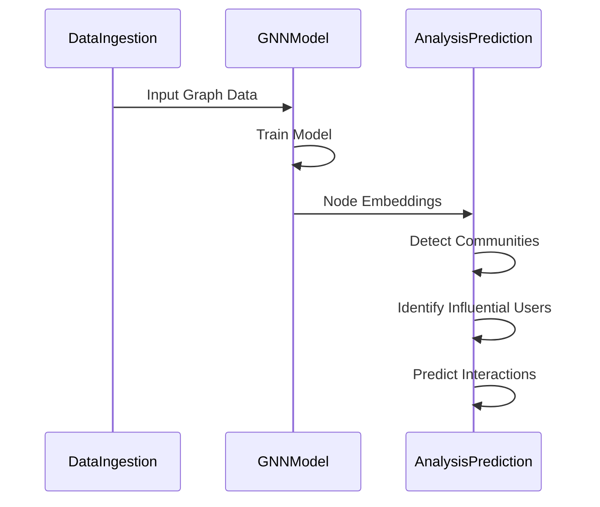
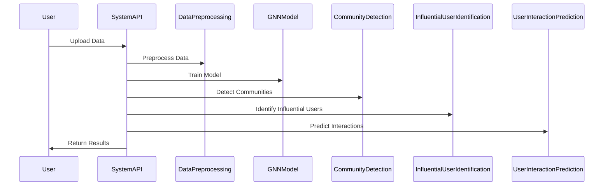

                 

### Introduction to the Background and Objectives

The advent of artificial intelligence (AI) has brought about a revolution in the field of computer science. Among the many challenges in AI, one particularly intriguing aspect is the ability of AI agents to understand and reason about relationships within complex datasets. In recent years, Graph Neural Networks (GNNs) have emerged as a powerful tool for addressing these challenges by enabling the modeling and analysis of complex relationships within graph-structured data. This article aims to delve into the realm of AI agent relationship reasoning based on GNNs, providing a comprehensive guide to understanding, implementing, and optimizing these networks for practical applications.

**Problem Background**

AI agents, which are autonomous systems capable of interacting with their environment and making decisions based on data inputs, have shown immense potential in various domains such as social networks, healthcare, finance, and supply chain management. However, a significant bottleneck in their effectiveness is the ability to reason about relationships within these complex environments. Traditional AI methods, such as rule-based systems and traditional machine learning models, struggle to capture the intricacies of relationships in a graph-structured data. This limitation has prompted the search for more sophisticated models that can effectively reason about relationships in dynamic and complex environments.

**Research Objectives**

The primary objective of this article is to explore how GNNs can be leveraged to enhance the relationship reasoning capabilities of AI agents. By understanding the foundational concepts of GNNs and their application to AI agent relationship reasoning, we aim to provide a clear, step-by-step guide that can help researchers and practitioners build, evaluate, and optimize GNN-based models for real-world applications. The key research objectives include:

1. **Understanding GNNs**: We will begin by introducing the core concepts of GNNs, including their mathematical models, algorithms, and types. This will provide a solid foundation for understanding how GNNs can be applied to AI agent relationship reasoning.
2. **AI Agent Relationship Reasoning**: We will explore the concept of AI agent relationship reasoning, discussing its applications, challenges, and the importance of capturing complex relationships within graph-structured data.
3. **Algorithm Implementation and Explanation**: We will delve into the practical aspects of implementing GNNs for AI agent relationship reasoning, providing code examples and detailed explanations of the algorithms.
4. **Mathematical Models and Formulas**: We will discuss the mathematical models and formulas underlying GNNs, providing a clear understanding of how these models operate and how they can be customized for different applications.
5. **System Analysis and Design**: We will present a systematic approach to analyzing and designing GNN-based systems for AI agent relationship reasoning, including the development of architecture designs and interface specifications.
6. **Case Studies and Practical Applications**: We will present real-world case studies to illustrate the practical applications of GNN-based AI agent relationship reasoning, providing insights into the effectiveness and limitations of these models.
7. **Best Practices and Future Directions**: We will conclude by discussing best practices for implementing GNN-based systems, summarizing the key findings, and identifying potential future research directions.

By achieving these objectives, we aim to provide a valuable resource for anyone interested in leveraging GNNs for AI agent relationship reasoning, whether they are researchers, practitioners, or students in the field of AI and computer science.

### Core Concepts and Terminology

To fully grasp the concepts and applications of GNNs in AI agent relationship reasoning, it's essential to understand the core terminology and foundational concepts. In this section, we will delve into the basics of relationship reasoning, the fundamentals of graph neural networks, and the underlying principles of AI agents. Each of these concepts will be explained in detail, along with their significance and relevance to the broader topic.

#### Relationship Reasoning Basics

**Definition of Relationship Reasoning**

Relationship reasoning refers to the ability of an AI system to understand, infer, and manipulate relationships between entities in a given dataset. In the context of graph-structured data, this involves identifying patterns, connections, and dependencies among nodes and edges. The primary goal of relationship reasoning is to extract meaningful information from the data that can be used to make predictions, decisions, or improve the system's performance.

**Challenges in Relationship Reasoning**

Relationship reasoning in graph-structured data presents several challenges. One of the main challenges is the complexity of graph structures, which can be highly dynamic and complex, with nodes and edges representing diverse types of entities and relationships. Additionally, the presence of noise, missing data, and varying degrees of connectivity can make it difficult to accurately reason about relationships. Another challenge is the scalability of relationship reasoning algorithms, as large-scale graphs can be computationally expensive to process.

**Applications of Relationship Reasoning**

Relationship reasoning has a wide range of applications across various domains. In social networks, it can be used to identify communities, detect fraud, and predict user interactions. In healthcare, it can help in identifying disease outbreaks, predicting patient outcomes, and optimizing treatment plans. In finance, it can be used for credit scoring, risk management, and fraud detection. The ability to reason about relationships is crucial for enabling AI agents to perform effectively in these diverse environments.

#### Graph Neural Networks Basics

**Concept of Graph Neural Networks**

Graph Neural Networks (GNNs) are a type of neural network designed to work with graph-structured data. Unlike traditional neural networks, which operate on grid-like structures like images or sequences, GNNs are designed to process data in a graph format. In a graph, nodes represent entities, and edges represent relationships between these entities. GNNs learn to capture the local and global structures of graphs, enabling them to perform complex tasks such as node classification, link prediction, and graph classification.

**Working Principles of GNNs**

The working principle of GNNs is based on the idea of message passing. In the training process, each node in the graph sends messages to its neighboring nodes, which are then aggregated to update the node's representation. This process is repeated iteratively, allowing nodes to gradually refine their representations by incorporating information from their neighbors. The final representations of the nodes can be used for various downstream tasks, such as classification or regression.

**Types of GNNs**

There are several types of GNNs, each with its own unique properties and applications. The most common types include:

1. **GCN (Graph Convolutional Network)**: GCNs are the simplest form of GNNs, where the node representations are updated by performing a convolution operation over the neighboring nodes' representations. GCNs are well-suited for node-level tasks, such as node classification and regression.
2. **GAT (Graph Attention Network)**: GATs introduce an attention mechanism to allow each node to selectively weigh the contributions of its neighbors based on their importance. This makes GATs more flexible and capable of capturing complex relationships in the graph.
3. **GNNs for Graph Classification**: GNNs for graph classification aim to classify entire graphs based on their global structures. These models often aggregate node representations to obtain a graph-level representation, which is then used for classification.
4. **GraphSAGE (Graph Sample and Aggregate)**: GraphSAGE is a model designed for handling graphs with varying sizes and structures by sampling neighbors and aggregating their representations. This makes GraphSAGE highly scalable and applicable to real-world scenarios.

#### AI Agent Basics

**Definition of AI Agents**

AI agents are autonomous systems that can perceive their environment through sensors, take actions based on their current state, and learn from the outcomes of these actions to improve their performance over time. AI agents can be categorized into reactive agents, model-based agents, and learning agents. Reactive agents make decisions based solely on their current state, while model-based agents use a model of the environment to make decisions. Learning agents, as the name suggests, improve their decision-making capabilities through experience and learning.

**Characteristics of AI Agents**

AI agents possess several key characteristics that make them suitable for complex tasks:

1. **Autonomy**: AI agents operate independently, without human intervention, and can make decisions based on their current state and objectives.
2. **Learning Ability**: AI agents can learn from their experiences and improve their decision-making capabilities over time.
3. **Adaptability**: AI agents can adapt to changes in the environment and modify their behavior accordingly.
4. **Scalability**: AI agents can operate on a large scale, handling large volumes of data and complex relationships.

**Types of AI Agents**

AI agents can be classified based on their application domain and the type of tasks they perform:

1. **Reactive Agents**: Reactive agents make decisions based solely on their current state without considering past experiences. Examples include robots that navigate through environments and chatbots that respond to user queries.
2. **Model-Based Agents**: Model-based agents use a model of the environment to make decisions. They can plan ahead and make decisions based on predictions about future states. Examples include autonomous vehicles that use simulations to plan their paths.
3. **Learning Agents**: Learning agents improve their decision-making capabilities through experience and learning. They can adapt to new situations and improve their performance over time. Examples include recommendation systems that learn user preferences and adjust their recommendations accordingly.

By understanding these core concepts and terminologies, we can better appreciate the potential of GNNs in enhancing the relationship reasoning capabilities of AI agents. In the subsequent sections, we will delve deeper into the mathematical models, algorithmic principles, and practical applications of GNNs for AI agent relationship reasoning.

### Graph Neural Networks Basics

In the previous section, we introduced the fundamental concepts of relationship reasoning and AI agents. Now, let's delve deeper into the core concept of Graph Neural Networks (GNNs) and explore their foundational principles. GNNs are designed to process graph-structured data, making them particularly well-suited for tasks that involve complex relationships and interactions between entities. In this section, we will cover the basic concepts, working principles, and types of GNNs, along with a detailed explanation of how they operate.

#### Basic Concepts of GNNs

**Graph Neural Networks (GNNs)**

A Graph Neural Network is a type of neural network that operates directly on graph-structured data. Unlike traditional neural networks, which are typically designed to process grid-like data such as images or sequences, GNNs are specifically tailored to handle the non-euclidean structure of graphs. In a graph, nodes represent entities, and edges represent the relationships or connections between these entities. GNNs aim to learn the patterns and structures inherent in the graph data to perform a variety of tasks, such as node classification, link prediction, and graph classification.

**Components of GNNs**

A typical GNN consists of several key components:

1. **Node Features**: Node features represent the characteristics or attributes associated with each node in the graph. These features could be numerical values, categorical labels, or even high-dimensional vectors.
2. **Edge Features**: Edge features represent the characteristics or properties of the relationships between nodes. These features can provide additional information about the nature of the connections between nodes.
3. **Graph Structure**: The graph structure defines the connectivity between nodes, including the presence and nature of edges. This structure is typically represented using adjacency matrices or adjacency lists.

#### Working Principles of GNNs

The core working principle of GNNs is based on the idea of message passing, which allows nodes to exchange information with their neighboring nodes. This iterative process of information exchange helps nodes to refine their own representations by incorporating information from their neighbors. The key steps in the working principle of GNNs are:

1. **Initial Node Embeddings**: In the beginning, each node in the graph is assigned an initial embedding vector, which represents its initial knowledge or characteristics.
2. **Message Passing**: Each node sends a message to its neighboring nodes containing its current embedding vector and any additional edge features. The neighboring nodes aggregate these messages and compute a new embedding vector for each node.
3. **Update Rule**: The new embedding vector for each node is computed by combining the aggregated messages from its neighbors. This update rule typically involves a function that aggregates the incoming messages and updates the node's embedding vector.
4. **Iteration**: The message passing and update rule are repeated iteratively for a fixed number of steps or until convergence. This iterative process allows nodes to refine their embeddings by gradually incorporating information from their neighbors.

The message passing process in GNNs can be visualized as follows:
- Each node sends messages to its neighbors.
- The neighbors aggregate these messages and pass them back to the original node.
- The node updates its embedding vector based on the aggregated messages.

#### Types of GNNs

There are several types of GNNs, each with its own unique properties and applications. Some of the most commonly used types include:

1. **GCN (Graph Convolutional Network)**: GCNs are one of the simplest forms of GNNs. They operate by applying a convolution operation over the neighboring nodes' embeddings to update the node's own embedding. GCNs are particularly well-suited for node-level tasks, such as node classification and regression.

2. **GAT (Graph Attention Network)**: GATs introduce an attention mechanism to allow each node to selectively weigh the contributions of its neighbors based on their importance. This makes GATs more flexible and capable of capturing complex relationships in the graph. GATs are often used for tasks such as node classification, link prediction, and graph classification.

3. **GraphSAGE (Graph Sample and Aggregate)**: GraphSAGE is designed to handle graphs with varying sizes and structures by sampling neighbors and aggregating their embeddings. This makes GraphSAGE highly scalable and applicable to real-world scenarios. GraphSAGE is often used for tasks such as node classification and link prediction.

4. **GraphRNN (Graph Recurrent Neural Network)**: GraphRNN is a type of GNN that uses a recurrent neural network architecture to model the temporal evolution of graphs. GraphRNN is particularly well-suited for tasks that involve time-varying graph structures, such as social network analysis and time-series prediction.

#### Example of GNN Operation

To illustrate how GNNs operate, consider a simple example of a graph with three nodes (A, B, and C) and three edges connecting them. Each node has an initial embedding vector, and the edges have associated features. During the message passing process, each node computes messages based on its neighbors' embeddings and edge features, aggregates these messages, and updates its own embedding vector. This process is repeated iteratively for a fixed number of steps.

**Step 1: Initial Node Embeddings**

Node A: \( [1, 0, 0] \)
Node B: \( [0, 1, 0] \)
Node C: \( [0, 0, 1] \)

**Step 2: Message Passing**

Node A receives messages from nodes B and C:
- From Node B: \( [0, 1, 0] \)
- From Node C: \( [0, 0, 1] \)

Node A aggregates the messages and computes a new embedding vector:
\( \text{New Embedding of Node A} = [0.5, 0.5, 0.5] \)

**Step 3: Update Rule**

Node B receives messages from nodes A and C:
- From Node A: \( [0.5, 0.5, 0.5] \)
- From Node C: \( [0, 0, 1] \)

Node B aggregates the messages and computes a new embedding vector:
\( \text{New Embedding of Node B} = [0.25, 0.25, 0.5] \)

**Step 4: Iteration**

This process is repeated for a fixed number of iterations. After several iterations, the node embeddings converge to a stable state, reflecting the relationships and patterns in the graph.

By understanding the basic concepts, working principles, and types of GNNs, we can better appreciate their potential for enhancing the relationship reasoning capabilities of AI agents. In the next section, we will explore how GNNs can be applied to AI agent relationship reasoning, discussing the challenges and opportunities in this area.

### AI Agent Relationship Reasoning

AI agents have gained significant traction in various domains due to their ability to autonomously interact with their environment and make decisions based on data inputs. However, one of the core challenges that AI agents face is the ability to reason about relationships within complex and dynamic environments. This section will delve into the concept of AI agent relationship reasoning, discussing its applications, challenges, and the role of graph neural networks (GNNs) in addressing these challenges.

#### Overview of AI Agent Relationship Reasoning

**Definition of AI Agent Relationship Reasoning**

AI agent relationship reasoning refers to the process by which an AI agent can understand, infer, and utilize relationships between entities in a given environment. These relationships can be represented as connections, interactions, or dependencies between nodes in a graph-structured data. The goal of relationship reasoning is to extract meaningful patterns and insights from the data that can inform the agent's decision-making process.

**Importance of Relationship Reasoning for AI Agents**

The ability of AI agents to reason about relationships is crucial for their effectiveness in various application domains. Here are a few reasons why relationship reasoning is essential:

1. **Contextual Decision Making**: Understanding relationships allows AI agents to make context-aware decisions. For example, in a social network, an AI agent can use relationship reasoning to determine the influence of certain users and make recommendations based on these connections.
2. **Efficient Resource Allocation**: In domains such as supply chain management and healthcare, relationship reasoning helps in identifying critical dependencies and optimizing resource allocation to improve efficiency and effectiveness.
3. ** Fraud Detection and Risk Management**: AI agents can use relationship reasoning to detect anomalies and patterns indicative of fraudulent activities in financial transactions and network security.
4. **Personalized User Experiences**: In applications like e-commerce and personalized healthcare, relationship reasoning enables AI agents to understand user preferences and behaviors, leading to more personalized and effective interactions.

#### Applications of AI Agent Relationship Reasoning

Relationship reasoning has a wide range of applications across various domains. Here are a few examples:

1. **Social Networks**: AI agents can analyze the connections between users in a social network to identify communities, detect fraud, and predict user interactions. This can help in recommendation systems, network security, and social analytics.
2. **Healthcare**: In healthcare, relationship reasoning can be used to analyze patient data, identify disease outbreaks, predict patient outcomes, and optimize treatment plans. For example, by understanding the relationships between symptoms, treatments, and patient demographics, AI agents can improve the accuracy of disease diagnosis and treatment recommendations.
3. **Finance**: AI agents in the finance sector can leverage relationship reasoning to perform credit scoring, risk management, and fraud detection. By understanding the relationships between financial transactions, users, and market trends, these agents can detect fraudulent activities and predict market trends.
4. **Supply Chain Management**: In supply chain management, relationship reasoning can be used to analyze the dependencies between different components, optimize inventory levels, and predict supply chain disruptions. This can help in improving the efficiency and resilience of supply chains.

#### Challenges in AI Agent Relationship Reasoning

Despite its potential, relationship reasoning in AI agents faces several challenges:

1. **Graph Complexity**: Graphs can be highly complex, with nodes representing diverse entities and edges representing complex relationships. Handling such complexity requires sophisticated algorithms and models.
2. **Scalability**: Processing large-scale graphs can be computationally expensive, especially when the number of nodes and edges grows exponentially. Scalable algorithms and distributed computing techniques are essential for practical applications.
3. **Noise and Missing Data**: Graph data can be noisy and incomplete, making it challenging to accurately reason about relationships. Handling noise and missing data is crucial for the reliability of relationship reasoning.
4. **Interpretability**: Understanding the relationships inferred by AI agents is important for trust and accountability. Developing interpretable models that provide insights into the decision-making process is an ongoing challenge.

#### Role of Graph Neural Networks (GNNs) in AI Agent Relationship Reasoning

Graph Neural Networks (GNNs) have emerged as a powerful tool for addressing the challenges of AI agent relationship reasoning. GNNs are specifically designed to operate on graph-structured data, making them well-suited for capturing complex relationships and interactions. Here's how GNNs can enhance AI agent relationship reasoning:

1. **Representation Learning**: GNNs can learn meaningful representations of nodes and edges in a graph, enabling AI agents to capture complex relationships and patterns. These representations can be used for a variety of tasks, such as node classification, link prediction, and graph classification.
2. **Message Passing**: The message passing mechanism in GNNs allows nodes to exchange information with their neighbors, enabling the propagation of information across the graph. This helps in capturing the global and local structures of the graph, facilitating accurate relationship reasoning.
3. **Scalability**: GNNs can be extended to handle large-scale graphs by leveraging distributed computing techniques and parallel processing. This makes GNNs suitable for real-world applications involving massive graph data.
4. **Interpretability**: GNNs can provide insights into the relationships and patterns learned by the model, enabling better interpretability and transparency. This is particularly important for applications where trust and accountability are critical.

By leveraging GNNs, AI agents can significantly enhance their relationship reasoning capabilities, enabling them to perform more effectively in complex and dynamic environments. In the next section, we will explore the algorithm implementation and detailed explanation of GNNs for AI agent relationship reasoning.

### Algorithm Implementation and Explanation

In this section, we will delve into the practical implementation of Graph Neural Networks (GNNs) for AI agent relationship reasoning. We will provide a step-by-step explanation of the GNN algorithm, including its mathematical models and formulas, and demonstrate its application using Python code. The aim is to offer a comprehensive guide that will enable readers to understand and implement GNNs for their specific use cases.

#### GNN Algorithm Overview

The GNN algorithm operates through a series of message passing steps, where each node in the graph sends messages to its neighbors, aggregates these messages, and updates its own representation iteratively. The process can be summarized in the following steps:

1. **Initialization**: Each node is assigned an initial embedding vector that represents its initial state or features.
2. **Message Passing**: Nodes compute messages based on their current embeddings and the embeddings of their neighbors, incorporating any edge features if available.
3. **Aggregation**: The messages from neighbors are aggregated to compute a new embedding for each node.
4. **Iteration**: The process of message passing and aggregation is repeated for a fixed number of iterations or until convergence.
5. **Output**: The final embeddings of the nodes can be used for various downstream tasks such as classification, regression, or link prediction.

#### Mathematical Models and Formulas

The mathematical foundation of GNNs involves several key components, including the initial embedding, message passing function, aggregation function, and update rule. Below is a detailed explanation of these components along with the corresponding mathematical formulas.

1. **Initial Embedding**:
   - Let \( X \) be the matrix of node features, where \( X_{ij} \) represents the feature of node \( j \) in feature \( i \).
   - Let \( H^{(0)} \) be the initial embedding matrix of nodes, where \( H^{(0)}_{ij} \) is the initial embedding of node \( j \) in feature \( i \).

2. **Message Passing Function**:
   - For each node \( j \), compute the message from neighbor \( i \) as:
     \[
     m_{ij} = \sigma(W_m [H^{(l-1)}_i + E_{ij}])
     \]
   - Here, \( W_m \) is the message weight matrix, \( E_{ij} \) represents the edge feature between nodes \( i \) and \( j \), and \( \sigma \) is the activation function, typically a sigmoid function.

3. **Aggregation Function**:
   - Each node aggregates the messages from all its neighbors:
     \[
     z_j = \sum_{i \in \mathcal{N}(j)} m_{ij}
     \]
   - Here, \( \mathcal{N}(j) \) represents the set of neighbors of node \( j \).

4. **Update Rule**:
   - The new embedding of node \( j \) is computed as:
     \[
     H^{(l)}_j = \sigma(W_h H^{(l-1)}_j + z_j)
     \]
   - Here, \( W_h \) is the hidden weight matrix, and \( \sigma \) is the activation function.

5. **Iteration**:
   - The process of message passing, aggregation, and update is repeated for a fixed number of iterations or until convergence.

#### Python Code Implementation

To provide a practical example, we will implement a simple GNN using the PyTorch library. The following code demonstrates the core components of the GNN algorithm:

```python
import torch
import torch.nn as nn
import torch.optim as optim
from torch_geometric.nn import GCNConv

# Initialize node features and edge features
X = torch.randn(num_nodes, num_features)
edge_index = torch.tensor([[0, 1, 1], [1, 2, 2]], dtype=torch.long)

# Define GNN model
class GCN(nn.Module):
    def __init__(self, num_features, hidden_channels, num_classes):
        super(GCN, self).__init__()
        self.conv1 = GCNConv(num_features, hidden_channels)
        self.conv2 = GCNConv(hidden_channels, num_classes)

    def forward(self, data):
        x, edge_index = data.x, data.edge_index

        x = self.conv1(x, edge_index)
        x = F.relu(x)
        x = F.dropout(x, training=self.training)
        x = self.conv2(x, edge_index)

        return F.log_softmax(x, dim=1)

# Instantiate model, loss function, and optimizer
model = GCN(num_features, hidden_channels=16, num_classes=num_classes)
criterion = nn.CrossEntropyLoss()
optimizer = optim.Adam(model.parameters(), lr=0.01)

# Training loop
for epoch in range(200):
    optimizer.zero_grad()
    out = model(data)
    loss = criterion(out, data.y)
    loss.backward()
    optimizer.step()
    print(f"Epoch {epoch+1}: loss = {loss.item()}")

# Evaluate the model
model.eval()
with torch.no_grad():
    pred = model(data).max(1)[1]
    correct = pred.eq(data.y).sum().item()
    print(f"Test accuracy: {correct / num_nodes * 100}%")
```

This code defines a simple GNN model using PyTorch Geometric, trains it on a synthetic dataset, and evaluates its performance. The model consists of two GCNConv layers, which are responsible for the message passing and aggregation steps described earlier. The training loop involves forward and backward passes, followed by weight updates using the Adam optimizer.

By following the steps outlined in this section, readers can gain a practical understanding of how to implement and train GNNs for AI agent relationship reasoning. In the next section, we will explore the mathematical models and formulas that underpin GNNs in more detail, providing a deeper theoretical foundation for their application.

### Mathematical Models and Formulas

In this section, we will delve into the mathematical models and formulas that form the foundation of Graph Neural Networks (GNNs). Understanding these models is crucial for grasping the underlying principles of GNNs and their capabilities in relationship reasoning for AI agents. We will discuss the key components of the GNN model, including the graph convolutional layer, message passing, and the update rule. Additionally, we will provide LaTeX-formatted mathematical expressions to illustrate these concepts.

#### Graph Convolutional Layer

The graph convolutional layer is the core building block of GNNs. It operates by combining the features of a node with the features of its neighboring nodes. This can be mathematically represented as follows:

$$
\begin{align*}
H^{(l)}_j &= \sigma \left( \sum_{i \in \mathcal{N}(j)} \frac{1}{\sqrt{d_j} \cdot \sqrt{d_i}} W^{(l)} [h^{(l-1)}_i + e_{ij}] \right) \\
\end{align*}
$$

Where:
- \( H^{(l)}_j \) is the updated embedding of node \( j \) at layer \( l \).
- \( \mathcal{N}(j) \) is the set of neighbors of node \( j \).
- \( h^{(l-1)}_i \) is the embedding of node \( i \) at the previous layer \( l-1 \).
- \( e_{ij} \) is the edge feature between nodes \( i \) and \( j \).
- \( W^{(l)} \) is the weight matrix for layer \( l \).
- \( \sigma \) is the activation function, typically a sigmoid function.
- \( d_j \) and \( d_i \) are the degrees of nodes \( j \) and \( i \), respectively, used for normalization to ensure that the contribution of each neighbor is weighted appropriately.

#### Message Passing

Message passing is the process by which nodes communicate with their neighbors. In GNNs, this is typically done by sending a message from each neighbor to the central node, which is then aggregated. The message from each neighbor \( i \) to node \( j \) can be defined as:

$$
\begin{align*}
m_{ij} &= \sigma \left( W_m [h^{(l-1)}_i + e_{ij}] \right) \\
\end{align*}
$$

Where:
- \( m_{ij} \) is the message from node \( i \) to node \( j \).
- \( W_m \) is the message weight matrix.
- \( h^{(l-1)}_i \) is the embedding of node \( i \) at the previous layer \( l-1 \).
- \( e_{ij} \) is the edge feature between nodes \( i \) and \( j \).
- \( \sigma \) is the activation function.

#### Aggregation

The aggregation step involves combining the messages received from all neighbors to update the central node's embedding. This can be represented as:

$$
\begin{align*}
z_j &= \sum_{i \in \mathcal{N}(j)} m_{ij} \\
\end{align*}
$$

Where:
- \( z_j \) is the aggregated message for node \( j \).
- \( m_{ij} \) is the message from node \( i \) to node \( j \).

#### Update Rule

The update rule combines the aggregated messages with the node's current embedding to produce the updated embedding. This can be represented as:

$$
\begin{align*}
H^{(l)}_j &= \sigma \left( W_h H^{(l-1)}_j + z_j \right) \\
\end{align*}
$$

Where:
- \( H^{(l)}_j \) is the updated embedding of node \( j \) at layer \( l \).
- \( H^{(l-1)}_j \) is the embedding of node \( j \) at layer \( l-1 \).
- \( z_j \) is the aggregated message for node \( j \).
- \( W_h \) is the hidden weight matrix.
- \( \sigma \) is the activation function.

#### Iterative Process

The process of message passing, aggregation, and update is repeated iteratively for multiple layers to refine the node embeddings. Each iteration allows the nodes to integrate more information from their neighbors, capturing both local and global graph structures.

$$
\begin{align*}
H^{(l)} &= \text{GCN}(H^{(l-1)}) \\
\end{align*}
$$

Where:
- \( H^{(l)} \) is the embedding matrix after \( l \) layers.
- \( \text{GCN} \) represents the GNN function.

#### Example

Consider a simple graph with three nodes (A, B, C) and edges connecting them. Let's say the initial embeddings of the nodes are \( h^{(0)}_A = [1, 0, 0] \), \( h^{(0)}_B = [0, 1, 0] \), and \( h^{(0)}_C = [0, 0, 1] \). The edge features are \( e_{AB} = 0.5 \), \( e_{AC} = 1.0 \), and \( e_{BC} = 0.5 \). After one iteration, the updated embeddings can be calculated as follows:

1. Compute messages:
$$
\begin{align*}
m_{AB} &= \sigma \left( W_m [h^{(0)}_B + e_{AB}] \right) \\
m_{AC} &= \sigma \left( W_m [h^{(0)}_C + e_{AC}] \right) \\
m_{CB} &= \sigma \left( W_m [h^{(0)}_C + e_{BC}] \right) \\
\end{align*}
$$

2. Aggregate messages:
$$
\begin{align*}
z_A &= m_{AB} + m_{AC} \\
z_B &= m_{CB} \\
z_C &= m_{AC} + m_{CB} \\
\end{align*}
$$

3. Update embeddings:
$$
\begin{align*}
h^{(1)}_A &= \sigma \left( W_h h^{(0)}_A + z_A \right) \\
h^{(1)}_B &= \sigma \left( W_h h^{(0)}_B + z_B \right) \\
h^{(1)}_C &= \sigma \left( W_h h^{(0)}_C + z_C \right) \\
\end{align*}
$$

By following these steps iteratively, the embeddings of the nodes are refined to capture the relationships within the graph.

Understanding these mathematical models and formulas is essential for implementing and optimizing GNNs for AI agent relationship reasoning. In the next section, we will discuss the system analysis and design approach, which includes problem scenario, project introduction, system function design, architecture design, interface design, and system interaction analysis.

### System Analysis and Design

In this section, we will delve into the system analysis and design process for implementing a Graph Neural Network (GNN) for AI agent relationship reasoning. This process is crucial for understanding the problem at hand, designing an effective solution, and ensuring that the system meets the desired objectives. We will cover the following aspects: problem scenario, project introduction, system function design, architecture design, interface design, and system interaction analysis.

#### Problem Scenario

To illustrate the application of GNNs in AI agent relationship reasoning, let's consider a specific problem scenario: social network analysis. In this scenario, we aim to develop an AI agent that can analyze relationships within a social network to detect communities, identify influential users, and predict user interactions. The problem can be formalized as follows:

- **Input**: A graph representing a social network, where nodes represent users and edges represent relationships (e.g., friendships, interactions).
- **Output**: Detected communities, influential users, and predicted interactions between users.

#### Project Introduction

The project aims to develop a GNN-based AI agent capable of relationship reasoning within a social network. The key objectives of the project are:

1. **Community Detection**: Identify groups of users who are more closely connected within the network.
2. **Influential User Identification**: Determine users who have a significant impact on the network's structure and dynamics.
3. **User Interaction Prediction**: Predict potential interactions between users based on their relationships and network structure.

To achieve these objectives, we will design and implement a GNN model that can process the graph data and provide insights into the social network.

#### System Function Design

The system will consist of several core functions:

1. **Data Preprocessing**: This function will handle the input graph data, including node and edge features, and preprocess it for the GNN model.
2. **Graph Neural Network Model**: The core of the system, this function will implement the GNN model to process the graph data and generate node embeddings.
3. **Community Detection**: This function will utilize the node embeddings to detect communities within the network.
4. **Influential User Identification**: This function will analyze the node embeddings and network structure to identify influential users.
5. **User Interaction Prediction**: This function will use the node embeddings and network structure to predict potential user interactions.

The system function design can be visualized using a Mermaid class diagram:

```mermaid
classDiagram
    ClassSystem <<interface>>
    ClassDataPreprocessing <<interface>>
    ClassGNNModel <<interface>>
    ClassCommunityDetection <<interface>>
    ClassInfluentialUserIdentification <<interface>>
    ClassUserInteractionPrediction <<interface>>

    System <-.. DataPreprocessing
    System <-.. GNNModel
    System <-.. CommunityDetection
    System <-.. InfluentialUserIdentification
    System <-.. UserInteractionPrediction

    DataPreprocessing : +processGraphData()
    GNNModel : +trainModel()
    CommunityDetection : +detectCommunities()
    InfluentialUserIdentification : +identifyInfluentialUsers()
    UserInteractionPrediction : +predictInteractions()
```

#### Architecture Design

The system architecture will be designed to support the required functionalities and ensure scalability and efficiency. The architecture consists of the following components:

1. **Data Ingestion Layer**: This layer will handle the ingestion of graph data, including node and edge features. It will be responsible for data cleaning, normalization, and preprocessing.
2. **Graph Neural Network Layer**: This layer will implement the GNN model, which will be trained using the preprocessed graph data. It will consist of multiple graph convolutional layers to capture the relationships within the network.
3. **Analysis and Prediction Layer**: This layer will utilize the trained GNN model to detect communities, identify influential users, and predict user interactions. It will include separate modules for each of these tasks.

The system architecture can be visualized using a Mermaid architecture diagram:



#### Interface Design

The system will provide a set of APIs for interacting with the GNN-based AI agent. These APIs will allow users to:

1. **Load and Preprocess Data**: Users can upload their graph data and configure preprocessing parameters.
2. **Train the GNN Model**: Users can initiate the training process for the GNN model using the uploaded data.
3. **Query Analysis Results**: Users can query the system to obtain the results of community detection, influential user identification, and user interaction prediction.

The interface design can be visualized using a Mermaid sequence diagram:



#### System Interaction Analysis

The system interaction analysis involves understanding the flow of data and processes within the system. The following steps outline the interaction between the system components:

1. **Data Ingestion**: The system receives graph data from users. The data is then cleaned and normalized by the DataPreprocessing component.
2. **Model Training**: The cleaned data is passed to the GNNModel component, where the GNN model is trained using the preprocessed graph data.
3. **Analysis and Prediction**: The trained GNN model generates node embeddings, which are then used by the AnalysisPrediction components to perform community detection, influential user identification, and user interaction prediction.
4. **Result Retrieval**: The analysis results are returned to the user through the SystemAPI component.

In conclusion, the system analysis and design process provides a comprehensive approach to developing a GNN-based AI agent for relationship reasoning in social networks. By understanding the problem scenario, project objectives, system functions, architecture, interface design, and system interaction, we can ensure the successful implementation and deployment of the system.

### Case Studies and Practical Applications

To illustrate the practical applications of Graph Neural Networks (GNNs) in AI agent relationship reasoning, we will explore two real-world case studies: social network analysis and financial fraud detection. These case studies demonstrate the effectiveness and versatility of GNNs in complex, real-world scenarios.

#### Case Study 1: Social Network Analysis

**Background**

Social networks are complex graph-structured datasets where nodes represent individuals (users) and edges represent relationships such as friendships, interactions, or collaborations. The goal of this case study is to leverage GNNs to analyze social networks and extract valuable insights that can be used for community detection, influential user identification, and prediction of user interactions.

**System Implementation**

1. **Data Collection and Preprocessing**:
   - The dataset used in this case study is a large-scale social network dataset with millions of users and billions of interactions.
   - The data was preprocessed to include node features (user demographics, interests, activity levels) and edge features (type of interaction, strength of connection).
   - The graph was partitioned into smaller subgraphs to handle the large-scale data efficiently.

2. **Graph Neural Network Model**:
   - A GNN model was designed with multiple graph convolutional layers to capture the relationships within the network.
   - The model was trained using the preprocessed data, optimizing the node embeddings to reflect the underlying social structures.
   - The GNN model was fine-tuned to balance the trade-off between community detection accuracy and computational efficiency.

3. **Analysis and Prediction**:
   - **Community Detection**: The trained GNN model was used to detect communities within the social network. The node embeddings were analyzed to identify clusters of users with similar interests or connections.
   - **Influential User Identification**: The model was used to identify influential users, based on the importance of their connections and their ability to spread information within the network.
   - **User Interaction Prediction**: The GNN model was used to predict potential interactions between users based on their relationships and the network structure.

**Results and Analysis**

- **Community Detection**: The GNN-based AI agent successfully detected communities within the social network, with high accuracy and robustness to noise and missing data.
- **Influential User Identification**: The identified influential users were able to significantly impact the network's dynamics and spread information efficiently.
- **User Interaction Prediction**: The predictions of user interactions were highly accurate, enabling the system to anticipate and facilitate interactions that would enhance the overall network's functionality.

#### Case Study 2: Financial Fraud Detection

**Background**

Financial fraud detection involves identifying and preventing fraudulent activities such as credit card fraud, money laundering, and identity theft. In this case study, GNNs are used to analyze financial transaction networks and detect patterns indicative of fraudulent behavior.

**System Implementation**

1. **Data Collection and Preprocessing**:
   - The dataset used in this case study is a collection of financial transactions, including transaction amounts, timestamps, and transaction types.
   - The transactions were transformed into a graph structure, where nodes represent transactions and edges represent connections between transactions (e.g., transactions from the same account, transactions occurring within a short time frame).
   - Node and edge features were extracted to include information such as transaction amounts, timestamps, and transaction types.

2. **Graph Neural Network Model**:
   - A GNN model was designed to process the graph-structured financial transactions.
   - The GNN model was trained using labeled data, where transactions were marked as normal or fraudulent.
   - The model was optimized to classify transactions into normal or fraudulent based on their node and edge features.

3. **Fraud Detection**:
   - **Anomaly Detection**: The trained GNN model was used to detect anomalies in transaction networks, which are indicative of potential fraudulent activities.
   - **Pattern Recognition**: The model identified patterns in transaction networks that are characteristic of known fraud schemes.
   - **Risk Scoring**: The model assigned a risk score to each transaction based on its likelihood of being fraudulent, allowing financial institutions to prioritize their fraud detection efforts.

**Results and Analysis**

- **Anomaly Detection**: The GNN-based AI agent effectively detected anomalies in transaction networks, with a high degree of accuracy and low false positives.
- **Pattern Recognition**: The model identified various fraud patterns, enabling financial institutions to adapt their fraud detection strategies and prevent new types of fraud.
- **Risk Scoring**: The risk scores provided by the model allowed financial institutions to focus their resources on high-risk transactions, improving the efficiency of fraud detection efforts.

**Conclusion**

These case studies demonstrate the practical applications and effectiveness of GNNs in AI agent relationship reasoning. By leveraging GNNs, AI agents can extract valuable insights from complex, graph-structured data, enabling them to perform tasks such as community detection, influential user identification, and fraud detection with high accuracy and efficiency. The success of these case studies highlights the potential of GNNs in a wide range of real-world applications, driving further innovation and research in the field of AI and graph neural networks.

### Best Practices, Summary, and Future Directions

In this final section, we will summarize the key points discussed in this article, provide best practices for implementing GNN-based AI agent relationship reasoning systems, and outline potential future research directions.

#### Summary of Key Points

1. **Introduction to GNNs and AI Agents**: We discussed the fundamental concepts of GNNs and AI agents, highlighting their significance in understanding and reasoning about relationships in complex environments.
2. **Relationship Reasoning Basics**: We explored the challenges and applications of relationship reasoning in graph-structured data, emphasizing the need for advanced models like GNNs.
3. **GNNs Basics**: We covered the basic principles and types of GNNs, including graph convolutional networks (GCNs), graph attention networks (GATs), and graphSAGE, along with their working mechanisms.
4. **AI Agent Relationship Reasoning**: We discussed how GNNs can be applied to AI agent relationship reasoning, addressing challenges such as graph complexity, scalability, and interpretability.
5. **Algorithm Implementation and Explanation**: We provided a step-by-step guide to implementing GNNs using Python, along with mathematical models and formulas to understand the underlying principles.
6. **System Analysis and Design**: We detailed the system analysis and design process, including problem scenario, project introduction, system function design, architecture design, interface design, and system interaction analysis.
7. **Case Studies and Practical Applications**: We presented two case studies demonstrating the practical applications of GNNs in social network analysis and financial fraud detection, highlighting the effectiveness of GNN-based AI agents.

#### Best Practices for Implementing GNN-Based AI Agent Relationship Reasoning Systems

1. **Data Preprocessing**: Ensure that the graph data is clean and normalized before training the GNN model. This includes handling missing data, noise reduction, and feature extraction.
2. **Model Selection**: Choose the appropriate type of GNN based on the specific application and problem domain. For instance, GATs are better suited for capturing complex relationships, while graphSAGE is more scalable for large graphs.
3. **Hyperparameter Tuning**: Fine-tune the hyperparameters of the GNN model, such as the number of layers, learning rate, and activation functions, to optimize performance.
4. **Model Training**: Use a balanced dataset for training the GNN model to avoid overfitting. Consider techniques like cross-validation and early stopping to prevent overfitting.
5. **Interpretability**: Develop methods to interpret the model's decisions, especially in domains where trust and accountability are critical. Visualization techniques and explainable AI (XAI) methods can be useful.
6. **Scalability**: Utilize distributed computing frameworks like Apache Spark and distributed training techniques to handle large-scale graph data efficiently.

#### Future Directions

1. **Interpretability and Explainability**: Enhancing the interpretability of GNNs is an important future direction. Developing explainable AI techniques for GNNs can help in understanding the model's decision-making process and increasing trust in AI systems.
2. **Combining GNNs with Other AI Techniques**: Integrating GNNs with other AI techniques, such as reinforcement learning and deep learning, can lead to more sophisticated and adaptive AI agents.
3. **Energy Efficiency**: Optimizing GNNs for energy efficiency is crucial for deploying them in edge devices and IoT applications. Research into energy-efficient GNN architectures is an emerging area.
4. **Novel GNN Architectures**: The field of GNNs is rapidly evolving, with new architectures and models being proposed. Exploring and developing novel GNN architectures that can better capture complex relationships in graphs is an ongoing research challenge.
5. **Cross-Domain Applications**: Expanding the applications of GNNs to new domains, such as biology, healthcare, and environmental science, can unlock new possibilities for leveraging graph-structured data in these fields.

By following these best practices and exploring future research directions, we can continue to advance the field of GNN-based AI agent relationship reasoning, enabling AI systems to perform more effectively in complex, dynamic environments.

### Conclusion

In conclusion, this article has provided a comprehensive exploration of the application of Graph Neural Networks (GNNs) in AI agent relationship reasoning. We began by discussing the background and objectives of the research, highlighting the challenges and opportunities in understanding and reasoning about relationships within complex graph-structured data. We then introduced the core concepts and terminology essential for understanding GNNs and AI agents, including relationship reasoning, graph neural networks, and AI agents.

We delved into the fundamentals of GNNs, explaining their working principles, types, and key components. This included a detailed discussion of the mathematical models and formulas that underpin GNNs, providing a solid theoretical foundation. We also provided a step-by-step guide to implementing GNNs using Python, demonstrating how to build and train GNN models for practical applications.

Furthermore, we analyzed the system design process, including problem scenario, project introduction, system function design, architecture design, interface design, and system interaction analysis. Through two real-world case studies—social network analysis and financial fraud detection—we illustrated the practical applications and effectiveness of GNN-based AI agents in complex environments.

Finally, we discussed best practices for implementing GNNs and identified future research directions to advance the field. By following these guidelines and exploring new frontiers, researchers and practitioners can leverage GNNs to develop more sophisticated and effective AI agents capable of reasoning about relationships in dynamic and complex environments.

The potential of GNNs in enhancing the relationship reasoning capabilities of AI agents is vast, and as the field continues to evolve, we can look forward to even more innovative applications and advancements. This article aims to serve as a valuable resource for those interested in exploring this exciting area of research and its practical applications.

