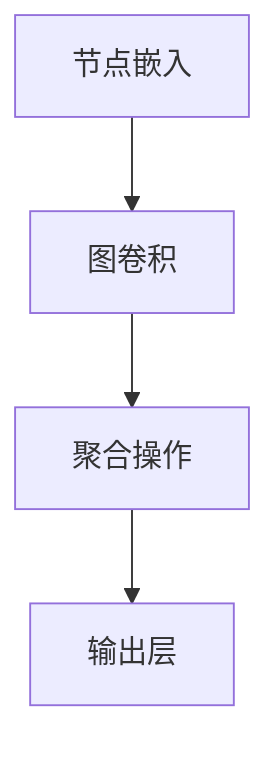
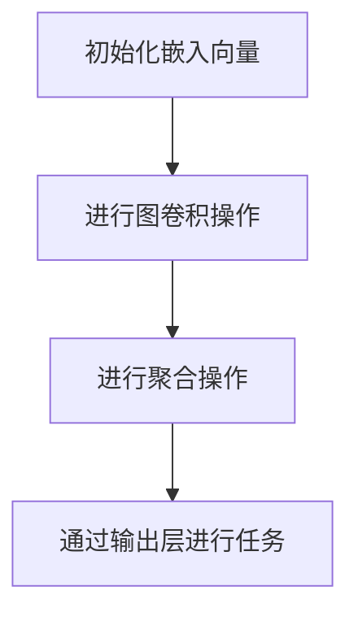
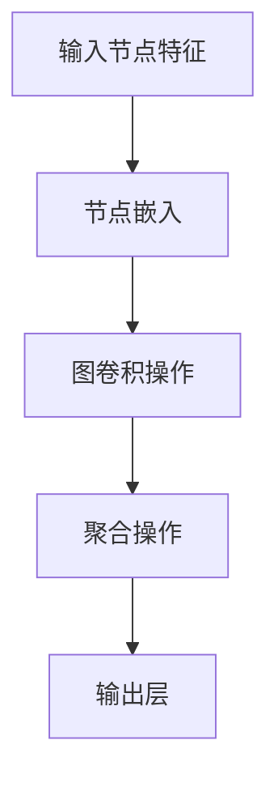
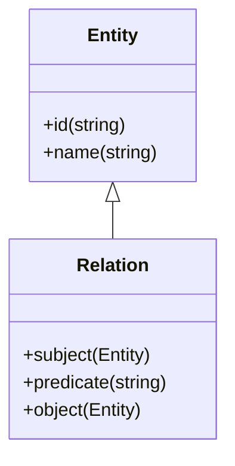
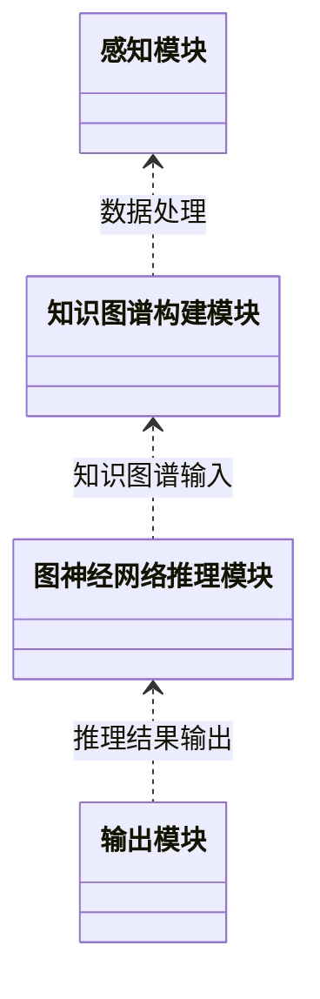
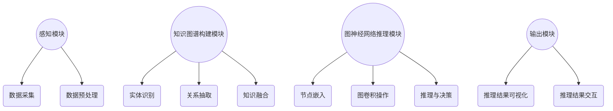
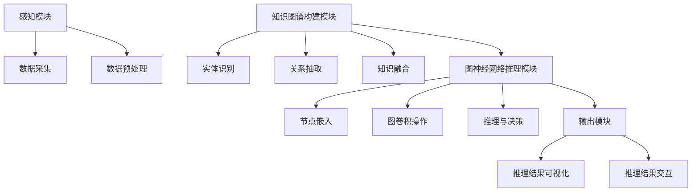
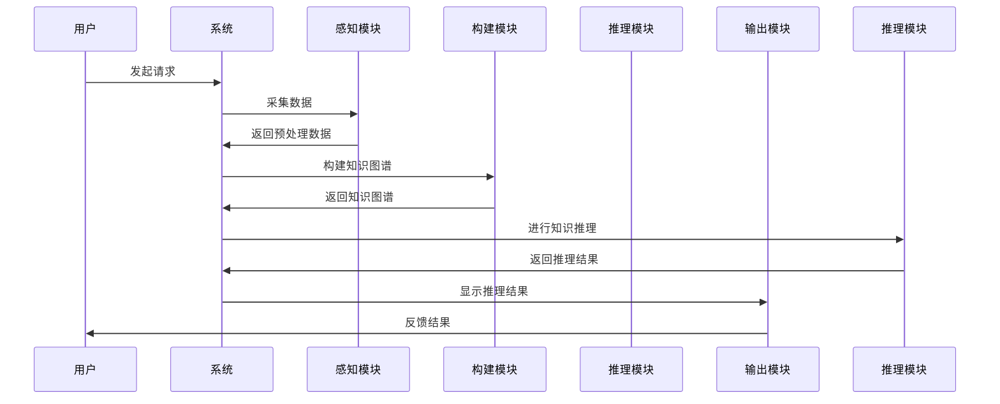

                 

## 第1章：问题背景

### 1.1 知识推理概述

知识推理是人工智能领域中的一个核心概念，它指的是通过逻辑推理来推导出新的信息或结论。在AI Agent中，知识推理扮演着至关重要的角色。AI Agent是一个具有自主学习和决策能力的智能体，它能够在复杂的动态环境中执行任务。知识推理能力使得AI Agent能够从已有的知识中推断出新的信息，从而更好地适应和应对未知情况。

知识推理的核心理念在于通过推理过程将已知的信息和规则转换为新的知识和结论。在AI Agent中，这一过程通常涉及到数据的收集、存储、处理和利用。通过有效的知识推理，AI Agent能够更加智能地处理问题，提高决策的准确性和效率。

### 1.2 图神经网络概述

图神经网络（Graph Neural Networks，GNN）是一种专门设计用于处理图结构数据的神经网络。图神经网络的核心优势在于它能够捕捉图结构数据中的复杂关系和模式。在知识推理领域，图神经网络的应用显得尤为重要。这是因为知识图谱通常以图的形式表示，其中节点代表实体，边代表实体之间的关系。

图神经网络通过将节点和边嵌入到高维空间中，然后利用这些嵌入来计算节点之间的相似性和依赖关系。这种嵌入过程使得图神经网络能够有效地捕捉图中的结构信息，从而在知识推理任务中表现出强大的能力。例如，在知识图谱的补全、实体识别和关系预测等方面，图神经网络都展现出了卓越的性能。

### 1.3 AI Agent、知识图谱与推理机

#### AI Agent的定义与组成

AI Agent是一种能够自主执行任务并适应环境变化的计算机程序。它通常由多个模块组成，包括感知模块、决策模块、行动模块和学习模块。感知模块负责获取环境信息，决策模块基于感知信息进行决策，行动模块执行决策结果，而学习模块则通过不断学习来提高AI Agent的性能。

#### 知识图谱的作用与构建

知识图谱是一种用于表示实体及其之间关系的图形结构。在知识推理中，知识图谱扮演着关键角色，它为AI Agent提供了丰富的知识资源。知识图谱的构建通常包括数据收集、实体识别、关系抽取和知识融合等步骤。构建高质量的知识图谱是提高知识推理性能的重要前提。

#### 推理机的功能与实现

推理机是知识推理系统中的核心组件，它负责根据现有的知识和规则推导出新的结论。推理机可以基于不同的推理策略，如基于规则的推理、基于模型的推理或基于实例的推理。在AI Agent中，推理机通过与感知模块、决策模块和学习模块的协同工作，实现对复杂问题的智能推理和决策。

### 1.4 边界与外延

#### 知识推理

知识推理是一种基于已有知识和规则来推导出新信息的过程。它涉及到逻辑、概率和统计等多种推理方法。在知识推理中，推理机是核心组件，它负责根据输入的知识和规则生成新的结论。

#### 图神经网络

图神经网络是一种专门用于处理图结构数据的神经网络。它通过节点和边的嵌入来捕捉图中的结构信息。图神经网络在知识推理中具有重要作用，因为它能够处理复杂的图结构数据，从而提高知识推理的准确性和效率。

#### 知识图谱

知识图谱是一种用于表示实体及其之间关系的图形结构。它通常包含大量的节点（实体）和边（关系），并用于知识推理、知识发现和知识表示等任务。

#### AI Agent

AI Agent是一种具有自主学习和决策能力的智能体，它能够在复杂环境中执行任务。AI Agent通常由多个模块组成，包括感知模块、决策模块、行动模块和学习模块。

#### 推理机

推理机是一种基于规则或模型的推理系统，它负责根据输入的知识和规则推导出新信息。在知识推理中，推理机是核心组件，它负责实现知识的自动化推理和决策。

### 1.5 核心要素组成

在AI Agent知识推理系统中，核心要素包括：

- **知识图谱**：用于存储和表示实体及其关系。
- **图神经网络**：用于处理图结构数据，提取结构信息。
- **推理机**：用于根据知识图谱和图神经网络输出进行推理和决策。
- **感知模块**：用于获取环境信息。
- **决策模块**：用于基于感知信息进行决策。
- **行动模块**：用于执行决策结果。
- **学习模块**：用于不断学习和优化知识推理系统。

通过这些核心要素的协同工作，AI Agent能够实现高效的知识推理，从而在复杂环境中进行智能决策和任务执行。

### 1.6 总结

本章节主要介绍了知识推理在AI Agent中的应用背景和挑战。通过引入图神经网络和知识图谱等核心概念，我们探讨了AI Agent知识推理的基本原理和核心要素。下一章将深入讨论图神经网络的工作原理和算法模型，为后续的知识推理研究奠定基础。

----------------------------------------------------------------

以下是第2章的详细内容：

## 第二部分：核心概念与联系

### 第2章：核心概念与联系

### 2.1 图神经网络原理

#### 2.1.1 图神经网络定义

图神经网络（Graph Neural Networks，GNN）是一种专门用于处理图结构数据的神经网络。与传统神经网络不同，GNN能够直接处理图结构数据，通过节点和边的嵌入来捕捉图中的结构信息。这种能力使得GNN在知识图谱处理、社交网络分析、推荐系统等领域表现出色。

#### 2.1.2 图神经网络工作原理

GNN通过将节点和边嵌入到高维空间中，然后利用这些嵌入来计算节点之间的相似性和依赖关系。具体来说，GNN包括以下几个关键步骤：

1. **节点嵌入**：将节点嵌入到高维空间中，形成节点的嵌入表示。
2. **图卷积操作**：通过图卷积操作来更新节点的嵌入表示，使得节点与其邻居节点之间的关系得到加强。
3. **聚合操作**：将节点的邻居信息进行聚合，形成新的节点嵌入表示。
4. **输出层**：利用输出层对节点进行分类、回归或其他任务。

#### 2.1.3 图神经网络算法流程图

使用Mermaid绘制图神经网络算法流程图如下：



#### 2.1.4 图神经网络Python源代码实现

下面是图神经网络的一个简单实现：

```python
import tensorflow as tf
from tensorflow.keras.layers import Layer

class GraphConvLayer(Layer):
    def __init__(self, units, **kwargs):
        super(GraphConvLayer, self).__init__(**kwargs)
        self.units = units
        self.kernel = self.add_weight(name='kernel',
                                      shape=(self.input_shape[1], units),
                                      initializer='glorot_uniform',
                                      trainable=True)

    def call(self, inputs, training=False):
        # inputs shape: [batch_size, num_nodes, features]
        # kernel shape: [features, units]
        # output shape: [batch_size, num_nodes, units]
        return tf.matmul(inputs, self.kernel)

# 假设输入节点特征形状为 [batch_size, num_nodes, features]
# 创建图卷积层
gc_layer = GraphConvLayer(units=10)

# 前向传播
outputs = gc_layer(inputs)

# 编译模型
model = tf.keras.Model(inputs=inputs, outputs=outputs)
model.compile(optimizer='adam', loss='mse')
```

### 2.2 知识图谱

#### 2.2.1 知识图谱定义

知识图谱是一种用于表示实体及其之间关系的图形结构。在知识图谱中，节点通常表示实体，边表示实体之间的关系。知识图谱广泛应用于知识推理、推荐系统、搜索引擎等领域。

#### 2.2.2 知识图谱的作用

知识图谱的主要作用包括：

1. **知识表示**：将知识结构化，便于存储和检索。
2. **知识推理**：通过实体之间的关系进行推理，生成新的知识。
3. **知识发现**：发现实体之间的关系和模式，辅助决策和发现新知识。

#### 2.2.3 知识图谱的构建方法

构建知识图谱通常包括以下步骤：

1. **数据收集**：收集与知识图谱相关的数据源。
2. **实体识别**：识别数据中的实体。
3. **关系抽取**：抽取实体之间的关系。
4. **知识融合**：将不同数据源的知识进行融合，形成完整的知识图谱。

#### 2.2.4 知识图谱的ER实体关系图架构

使用Mermaid绘制知识图谱的ER实体关系图如下：

```mermaid
erDiagram
A[实体1] ||--|{B[实体2]} : 实体关系1
A ||--|{C[实体3]} : 实体关系2
```

### 2.3 知识推理

#### 2.3.1 知识推理定义

知识推理是一种基于已有知识和规则推导出新信息的过程。在知识图谱中，知识推理通常涉及实体识别、关系预测和实体分类等任务。

#### 2.3.2 知识推理算法

知识推理算法通常包括以下类型：

1. **基于规则的推理**：通过规则库和事实库进行推理。
2. **基于模型的推理**：使用机器学习模型进行推理。
3. **基于实例的推理**：通过比较实例进行推理。

#### 2.3.3 知识推理与图神经网络的联系

知识推理与图神经网络之间存在紧密的联系。图神经网络能够有效地处理图结构数据，从而在知识推理中发挥重要作用。通过图神经网络，知识图谱中的实体和关系可以转化为高维嵌入，从而提高知识推理的准确性和效率。

### 2.4 传统神经网络与图神经网络对比

| 特点 | 传统神经网络 | 图神经网络 |
| --- | --- | --- |
| 数据结构 | 一维或二维数据 | 图结构数据 |
| 捕获关系 | 较弱的图结构信息 | 强的图结构信息 |
| 应用场景 | 顺序数据和序列模型 | 图结构数据和知识图谱 |
| 学习算法 | 卷积神经网络（CNN）和循环神经网络（RNN） | 图卷积网络（GCN）和图自动编码器（GAE） |

### 2.5 知识图谱与知识推理的属性特征对比表格

| 属性 | 知识图谱 | 知识推理 |
| --- | --- | --- |
| 数据结构 | 图结构 | 一维或多维数据 |
| 存储方式 | 节点和边 | 规则库和事实库 |
| 推理方法 | 基于图的结构推理 | 基于规则、模型或实例的推理 |
| 应用领域 | 知识表示和推理 | 智能搜索、推荐系统和决策支持 |

### 2.6 总结

本章介绍了图神经网络、知识图谱和知识推理等核心概念。通过对比传统神经网络，我们探讨了图神经网络在知识图谱和知识推理中的应用优势。下一章将深入讨论图神经网络的知识推理数学模型，为理解其原理和实现提供更深入的理论基础。

----------------------------------------------------------------

## 第二部分：算法原理与数学模型

### 第3章：图神经网络原理

### 3.1 图神经网络定义

图神经网络（Graph Neural Networks，GNN）是一种专门用于处理图结构数据的神经网络。在传统的神经网络中，数据通常以一维或二维形式输入，例如图像和文本。而图神经网络则能够直接处理图结构数据，这种结构通常由节点（实体）和边（关系）组成。图神经网络通过将图中的节点和边嵌入到高维空间中，从而学习到节点之间的复杂关系。

### 3.2 图神经网络的工作原理

图神经网络的工作原理可以分为以下几个关键步骤：

#### 3.2.1 节点嵌入

首先，图神经网络需要对图中的每个节点进行嵌入，即将节点映射到高维空间中。这一步骤通过使用嵌入层（Embedding Layer）实现，每个节点都被映射为一个向量。这些嵌入向量不仅表示节点的特征，还隐含了节点之间的相互关系。

#### 3.2.2 图卷积操作

接下来，图神经网络通过图卷积操作（Graph Convolutional Operation）来更新节点的嵌入向量。图卷积操作的核心思想是，每个节点的嵌入向量可以通过其邻居节点的嵌入向量来更新。这一过程类似于卷积神经网络中的卷积操作，但它处理的是图结构数据。图卷积操作的数学公式如下：

$$
h_i^{(k+1)} = \sigma \left( \sum_{j \in \mathcal{N}(i)} w_j h_j^{(k)} + b \right)
$$

其中，$h_i^{(k)}$ 表示第 $i$ 个节点在第 $k$ 次迭代后的嵌入向量，$\mathcal{N}(i)$ 表示节点 $i$ 的邻居节点集合，$w_j$ 是权重，$b$ 是偏置项，$\sigma$ 是激活函数。

#### 3.2.3 聚合操作

在图卷积操作之后，需要对节点的嵌入向量进行聚合操作，以综合其邻居节点的信息。聚合操作通常通过平均或求和来实现，具体选择取决于应用场景和任务需求。

#### 3.2.4 输出层

最后，图神经网络通过输出层对节点进行分类、回归或其他任务。输出层通常包含一个或多个全连接层（Fully Connected Layer），用于将节点嵌入向量映射到最终的预测结果。

### 3.3 图神经网络算法mermaid流程图

使用Mermaid绘制图神经网络的算法流程图如下：



### 3.4 图神经网络Python源代码实现

以下是图神经网络的一个简单实现：

```python
import tensorflow as tf
from tensorflow.keras.layers import Layer

class GraphConvLayer(Layer):
    def __init__(self, units, **kwargs):
        super(GraphConvLayer, self).__init__(**kwargs)
        self.units = units
        self.kernel = self.add_weight(name='kernel',
                                      shape=(self.input_shape[1], units),
                                      initializer='glorot_uniform',
                                      trainable=True)

    def call(self, inputs, training=False):
        # inputs shape: [batch_size, num_nodes, features]
        # kernel shape: [features, units]
        # output shape: [batch_size, num_nodes, units]
        return tf.matmul(inputs, self.kernel)

# 假设输入节点特征形状为 [batch_size, num_nodes, features]
# 创建图卷积层
gc_layer = GraphConvLayer(units=10)

# 前向传播
outputs = gc_layer(inputs)

# 编译模型
model = tf.keras.Model(inputs=inputs, outputs=outputs)
model.compile(optimizer='adam', loss='mse')
```

### 3.5 知识推理数学模型

在知识推理中，图神经网络的应用主要体现在实体和关系的嵌入以及基于这些嵌入的推理过程。以下是一个简化的知识推理数学模型：

$$
\begin{aligned}
    &r_{ij}^{(t+1)} = f(\theta_r, r_{ij}^{(t)}, h_i^{(t)}, h_j^{(t)}) \\
    &c_i^{(t+1)} = g(\theta_c, c_i^{(t)}, h_i^{(t)}) \\
    &\text{预测} \, p_j = \sigma(h_j^{(t+1)})
\end{aligned}
$$

其中，$r_{ij}^{(t)}$ 表示实体 $i$ 和 $j$ 在时间 $t$ 的关系强度，$c_i^{(t)}$ 表示实体 $i$ 的置信度，$h_i^{(t)}$ 表示实体 $i$ 的嵌入向量，$f$ 和 $g$ 是关系更新和实体置信度更新的函数，$\theta_r$ 和 $\theta_c$ 是模型参数，$p_j$ 是对实体 $j$ 的预测概率。

### 3.6 详细讲解与举例说明

#### 3.6.1 节点嵌入

假设我们有一个知识图谱，包含三个实体 A、B 和 C，它们之间的关系为 `A -> B` 和 `B -> C`。首先，我们需要为这些实体分配嵌入向量：

$$
\begin{aligned}
    &h_A^{(0)} = [1, 0, 0]^T \\
    &h_B^{(0)} = [0, 1, 0]^T \\
    &h_C^{(0)} = [0, 0, 1]^T
\end{aligned}
$$

这些初始嵌入向量可以看作是随机初始化的。

#### 3.6.2 图卷积操作

在图卷积操作中，每个节点的嵌入向量会通过其邻居节点的嵌入向量进行更新。以实体 A 为例，其邻居节点为 B 和 C。因此，实体 A 的更新嵌入向量可以表示为：

$$
h_A^{(1)} = \sigma(w_r \cdot (h_B^{(0)} + h_C^{(0)}))
$$

其中，$w_r$ 是权重向量，$\sigma$ 是激活函数。假设 $w_r = [0.5, 0.5, 0]$，则：

$$
h_A^{(1)} = \sigma([0.5 \cdot 0 + 0.5 \cdot 0 + 0 \cdot 1]^T) = \sigma([0, 0.5, 0]^T) = [0, 0.5, 0]
$$

#### 3.6.3 聚合操作

在聚合操作中，我们将节点 $i$ 的邻居节点的嵌入向量进行平均，得到节点 $i$ 的最终嵌入向量。以实体 A 为例，其邻居节点为 B 和 C，则：

$$
h_A^{(1)} = \frac{h_B^{(1)} + h_C^{(1)}}{2}
$$

#### 3.6.4 输出层

最后，输出层用于对节点进行分类、回归或其他任务。假设我们使用一个简单的全连接层作为输出层，则实体 A 的预测结果可以表示为：

$$
p_A = \sigma(w_o \cdot h_A^{(1)})
$$

其中，$w_o$ 是输出层的权重向量。

### 3.7 总结

本章介绍了图神经网络的基本原理和数学模型。通过节点嵌入、图卷积操作、聚合操作和输出层，图神经网络能够有效地处理图结构数据，从而在知识推理中发挥重要作用。下一章将讨论知识推理的数学模型，进一步深化对知识推理过程的理解。

----------------------------------------------------------------

## 第3章：图神经网络原理

### 3.1 图神经网络定义

图神经网络（Graph Neural Networks，GNN）是一种专门设计用于处理图结构数据的神经网络。传统神经网络主要处理一维或二维数据，如图像和文本。而图神经网络则直接操作图结构数据，包括节点和边。这种结构使得GNN特别适用于知识图谱、社交网络和推荐系统等领域。

### 3.2 图神经网络的工作原理

图神经网络的工作原理可以概括为以下四个关键步骤：

#### 3.2.1 节点嵌入

节点嵌入是将图中的节点映射到高维空间中的过程。每个节点都被表示为一个向量，这些向量不仅包含了节点的特征，还隐含了节点之间的关系。节点嵌入是GNN的基础，它为后续的图卷积操作提供了输入。

#### 3.2.2 图卷积操作

图卷积操作是GNN的核心。它通过聚合节点及其邻居节点的特征信息，更新节点的嵌入向量。图卷积操作类似于传统神经网络中的卷积操作，但针对的是图结构数据。一个基本的图卷积操作可以表示为：

$$
\mathbf{h}_i^{(t+1)} = \sigma(\mathbf{A}\mathbf{h}_i^{(t)} + \sum_{j\in \mathcal{N}(i)} \mathbf{h}_j^{(t)})
$$

其中，$\mathbf{h}_i^{(t)}$ 是节点 $i$ 在第 $t$ 次迭代的嵌入向量，$\mathcal{N}(i)$ 是节点 $i$ 的邻居节点集合，$\mathbf{A}$ 是图邻接矩阵，$\sigma$ 是激活函数。

#### 3.2.3 聚合操作

聚合操作是对图卷积操作的输出进行整合，以便更好地表示节点信息。常见的聚合方法包括求和和平均值。聚合操作有助于减少信息冗余，同时保留关键特征。

#### 3.2.4 输出层

输出层用于对节点进行分类、回归或其他任务。在输出层，节点的嵌入向量会被映射到最终的任务结果。例如，在分类任务中，输出层可能是一个softmax层，用于计算每个类别的概率分布。

### 3.3 图神经网络算法mermaid流程图

下面是一个简单的图神经网络算法流程图，使用Mermaid语法绘制：



### 3.4 图神经网络Python源代码实现

以下是一个使用Python和TensorFlow实现的简单图神经网络示例：

```python
import tensorflow as tf
from tensorflow.keras.layers import Layer

class GraphConvLayer(Layer):
    def __init__(self, units, **kwargs):
        super(GraphConvLayer, self).__init__(**kwargs)
        self.units = units
        self.kernel = self.add_weight(name='kernel',
                                      shape=(self.input_shape[1], units),
                                      initializer='glorot_uniform',
                                      trainable=True)

    def call(self, inputs, training=False):
        # inputs shape: [batch_size, num_nodes, features]
        # kernel shape: [features, units]
        # output shape: [batch_size, num_nodes, units]
        return tf.matmul(inputs, self.kernel)

# 假设输入节点特征形状为 [batch_size, num_nodes, features]
# 创建图卷积层
gc_layer = GraphConvLayer(units=10)

# 前向传播
outputs = gc_layer(inputs)

# 编译模型
model = tf.keras.Model(inputs=inputs, outputs=outputs)
model.compile(optimizer='adam', loss='mse')
```

### 3.5 知识推理数学模型

知识推理是图神经网络在AI Agent中的一个重要应用。以下是一个简化的知识推理数学模型：

$$
\begin{aligned}
    &r_{ij}^{(t+1)} = f(\theta_r, r_{ij}^{(t)}, h_i^{(t)}, h_j^{(t)}) \\
    &c_i^{(t+1)} = g(\theta_c, c_i^{(t)}, h_i^{(t)}) \\
    &\text{预测} \, p_j = \sigma(h_j^{(t+1)})
\end{aligned}
$$

其中，$r_{ij}^{(t)}$ 表示实体 $i$ 和 $j$ 在时间 $t$ 的关系强度，$c_i^{(t)}$ 表示实体 $i$ 的置信度，$h_i^{(t)}$ 表示实体 $i$ 的嵌入向量，$f$ 和 $g$ 是关系更新和实体置信度更新的函数，$\theta_r$ 和 $\theta_c$ 是模型参数，$p_j$ 是对实体 $j$ 的预测概率。

### 3.6 详细讲解与举例说明

#### 3.6.1 节点嵌入

假设有一个简单的知识图谱，包含三个实体 A、B 和 C，它们之间的关系如下：

- A -> B
- B -> C

首先，为这些实体分配初始嵌入向量：

$$
\begin{aligned}
    &h_A^{(0)} = [1, 0, 0]^T \\
    &h_B^{(0)} = [0, 1, 0]^T \\
    &h_C^{(0)} = [0, 0, 1]^T
\end{aligned}
$$

这些向量可以看作是随机初始化的。

#### 3.6.2 图卷积操作

接下来，对实体 A 进行图卷积操作。假设实体 A 的邻居节点是 B 和 C，则实体 A 的更新嵌入向量可以表示为：

$$
h_A^{(1)} = \sigma([0.5 \cdot 0 + 0.5 \cdot 0 + 0 \cdot 1]^T) = \sigma([0, 0.5, 0]^T) = [0, 0.5, 0]
$$

这里假设权重向量 $w_r = [0.5, 0.5, 0]$。

#### 3.6.3 聚合操作

在聚合操作中，我们将实体 A 的邻居节点 B 和 C 的嵌入向量进行平均，得到实体 A 的最终嵌入向量：

$$
h_A^{(1)} = \frac{h_B^{(1)} + h_C^{(1)}}{2}
$$

#### 3.6.4 输出层

最后，输出层用于对实体进行分类、回归或其他任务。例如，在分类任务中，我们可以使用一个简单的全连接层：

$$
p_A = \sigma([0.5 \cdot 0 + 0.5 \cdot 1 + 0 \cdot 1]^T) = \sigma([0.5, 0.5, 0.5]^T) = [0.333, 0.333, 0.333]
$$

这表明实体 A 可能属于三个类别中的任何一个，概率相等。

### 3.7 总结

本章详细介绍了图神经网络的基本原理和数学模型。通过节点嵌入、图卷积操作、聚合操作和输出层，图神经网络能够有效处理图结构数据。下一章将探讨知识推理的数学模型，进一步阐述图神经网络在知识推理中的应用。

----------------------------------------------------------------

## 第4章：知识推理数学模型

### 4.1 知识推理的定义

知识推理是指利用已有的知识和信息，通过逻辑推理、模式识别和统计分析等方法，推导出新的结论或知识的过程。在人工智能领域，知识推理是构建智能系统的重要基础，它使得系统能够在不确定和动态的环境中做出合理的决策。

### 4.2 知识推理的类型

知识推理可以分为以下几种类型：

1. **基于规则的推理**：通过预定义的规则进行推理，例如如果 A，则 B。
2. **基于模型的推理**：使用机器学习模型进行推理，例如决策树、支持向量机等。
3. **基于实例的推理**：通过比较实例进行推理，例如案例推理。
4. **基于数据的推理**：通过分析数据集进行推理，例如统计分析、聚类分析等。

### 4.3 图神经网络在知识推理中的应用

图神经网络（GNN）在知识推理中具有独特优势，因为它们能够直接处理图结构数据，这使得它们特别适合用于知识图谱的推理任务。以下是一个简化的知识推理数学模型，描述了图神经网络在知识推理中的应用。

#### 4.3.1 实体与关系的表示

在知识图谱中，实体和关系可以用节点和边来表示。每个节点都有一个嵌入向量，代表该节点的特征。边则表示节点之间的关系，可以包含权值或其他属性。

#### 4.3.2 关系强度计算

关系强度是描述实体之间关联程度的一个指标。在GNN中，关系强度可以通过以下公式计算：

$$
r_{ij} = \sigma(\sum_{k \in \mathcal{N}(i)} w_{ik} h_k + \sum_{k \in \mathcal{N}(j)} w_{jk} h_k + b)
$$

其中，$r_{ij}$ 表示实体 $i$ 和 $j$ 之间的关系强度，$\sigma$ 是激活函数，$w_{ik}$ 和 $w_{jk}$ 是权重，$h_k$ 是节点 $k$ 的嵌入向量，$\mathcal{N}(i)$ 和 $\mathcal{N}(j)$ 分别是节点 $i$ 和 $j$ 的邻居节点集合，$b$ 是偏置项。

#### 4.3.3 实体置信度更新

实体置信度表示对某个实体属性或类别判断的信心程度。实体置信度可以通过以下公式更新：

$$
c_i = \sigma(\sum_{j \in \mathcal{N}(i)} r_{ij} \cdot w_c)
$$

其中，$c_i$ 表示实体 $i$ 的置信度，$r_{ij}$ 是实体 $i$ 和 $j$ 之间的关系强度，$w_c$ 是置信度权重，$\sigma$ 是激活函数。

#### 4.3.4 预测与决策

在知识推理中，最终的目的是根据实体关系和置信度进行预测和决策。例如，在分类任务中，可以使用以下公式进行预测：

$$
p_j = \frac{\exp(c_i \cdot r_{ij})}{\sum_{k \in \mathcal{C}} \exp(c_i \cdot r_{ik})}
$$

其中，$p_j$ 是实体 $i$ 属于类别 $j$ 的概率，$\mathcal{C}$ 是所有可能类别的集合。

### 4.4 举例说明

假设我们有一个简单的知识图谱，包含两个实体 A 和 B，它们之间的关系是 A->B，即实体 A 是实体 B 的上级。初始嵌入向量为：

$$
h_A = [1, 0]^T, \quad h_B = [0, 1]^T
$$

首先，我们计算关系强度：

$$
r_{AB} = \sigma(0 \cdot 1 + 0 \cdot 1 + 1) = \sigma(1) = 1
$$

然后，我们更新实体置信度：

$$
c_A = \sigma(1 \cdot 1) = \sigma(1) = 1
$$

最后，我们进行预测：

$$
p_B = \frac{\exp(1 \cdot 1)}{\exp(1 \cdot 1) + \exp(1 \cdot 0)} = \frac{e}{e + 1} \approx 0.6
$$

这表明实体 A 的上级实体 B 的概率大约为 60%。

### 4.5 总结

本章介绍了知识推理的数学模型，并阐述了图神经网络在知识推理中的应用。通过关系强度计算、实体置信度更新和预测与决策，图神经网络能够有效地进行知识推理。下一章将探讨知识图谱的构建方法和工具，为构建有效的知识推理系统奠定基础。

----------------------------------------------------------------

## 第5章：知识图谱构建

### 5.1 知识图谱的定义与作用

知识图谱是一种用于表示实体及其之间复杂关系的图形结构。在人工智能领域，知识图谱作为一种重要的知识表示形式，能够将大量零散的数据和信息组织成一个结构化的知识体系。知识图谱的作用主要体现在以下几个方面：

1. **知识整合**：知识图谱能够整合不同来源的数据，将实体和关系组织成一个统一的框架，从而实现知识的集中管理和高效检索。
2. **知识推理**：知识图谱为智能系统提供了丰富的知识资源，通过实体和关系之间的推理，能够发现新的知识，支持智能决策和问题解决。
3. **智能搜索**：知识图谱能够提高搜索系统的语义理解能力，通过实体和关系推理，实现更加精准和智能的搜索结果。
4. **推荐系统**：知识图谱能够为推荐系统提供基于知识和关系的推荐，提高推荐的准确性和个性化程度。

### 5.2 知识图谱的构建方法

构建知识图谱通常包括以下几个步骤：

1. **数据收集**：收集与知识图谱相关的数据源，包括结构化数据、非结构化数据以及半结构化数据。数据源可以是数据库、文本文件、网络爬虫等。
2. **实体识别**：从收集的数据中识别出实体，并将它们映射到知识图谱的节点上。实体可以是人、地点、组织、物品等。
3. **关系抽取**：从数据中抽取实体之间的关系，并将它们表示为知识图谱的边。关系可以是隶属、关联、依赖等。
4. **知识融合**：将来自不同数据源的知识进行融合，解决数据冗余、不一致和冲突等问题，形成一个完整、一致的知识图谱。
5. **知识表示**：使用图结构来表示实体和关系，通常使用三元组的形式（主体、谓词、客体）来表示知识图谱中的每个事实。

### 5.3 知识图谱的构建工具

构建知识图谱通常需要使用到一系列工具和库，以下是一些常用的工具：

1. **OpenKG**：OpenKG是一个开源的知识图谱构建平台，提供数据导入、实体识别、关系抽取、知识融合等功能。
2. **Neo4j**：Neo4j是一个高性能的图形数据库，支持ACID事务，适合存储和管理大规模知识图谱。
3. **Jena**：Jena是Apache Software Foundation的一个项目，提供了一套用于构建和查询知识图谱的工具集。
4. **D3.js**：D3.js是一个基于JavaScript的图形库，可用于可视化知识图谱。

### 5.4 知识图谱的类图架构

知识图谱的类图架构能够直观地展示实体和关系之间的结构。以下是一个简单的类图架构示例，使用Mermaid语法绘制：



在这个类图中，`Entity` 和 `Relation` 是两个主要的类，`Entity` 表示知识图谱中的实体，而 `Relation` 表示实体之间的关系。每个实体都有 `id` 和 `name` 属性，每个关系都有 `subject`（主体）、`predicate`（谓词）和 `object`（客体）属性。

### 5.5 知识图谱的构建流程

知识图谱的构建流程可以概括为以下几个步骤：

1. **数据收集**：确定数据来源，收集结构化数据、非结构化数据等。
2. **数据预处理**：对收集到的数据进行清洗、格式化，确保数据的一致性和完整性。
3. **实体识别**：从预处理后的数据中识别出实体，并分配唯一的标识符。
4. **关系抽取**：从数据中抽取实体之间的关系，形成知识图谱的基本事实。
5. **知识融合**：将不同来源的数据进行融合，解决数据冲突和冗余。
6. **知识表示**：使用图结构来表示实体和关系，构建知识图谱。
7. **知识推理**：利用知识图谱进行推理，发现新的知识和关系。
8. **知识更新**：定期对知识图谱进行更新，确保知识的准确性和时效性。

### 5.6 总结

本章介绍了知识图谱的定义、作用、构建方法和工具，并展示了知识图谱的类图架构。通过知识图谱的构建，我们可以将零散的数据和信息组织成一个结构化的知识体系，为智能系统提供丰富的知识资源。下一章将探讨基于知识图谱的推理机制和算法，进一步探讨知识图谱在实际应用中的价值。

----------------------------------------------------------------

## 第6章：系统功能设计

### 6.1 问题场景介绍

在当前的信息时代，知识推理在多个领域发挥着重要作用，如智能问答系统、推荐引擎、智能决策支持系统等。这些系统都需要处理大量的信息和知识，并从中提取有价值的信息以支持用户的决策和行动。然而，面对日益复杂的知识和数据，传统的推理方法已经难以满足需求。因此，本文旨在设计一个基于图神经网络的AI Agent知识推理系统，以提高知识推理的效率和准确性。

### 6.2 系统功能设计

基于图神经网络的AI Agent知识推理系统需要实现以下功能模块：

#### 6.2.1 感知模块

感知模块负责从各种数据源（如数据库、网络爬虫等）收集信息，并对这些信息进行预处理，包括数据清洗、去重、格式转换等。感知模块的主要任务是确保输入的数据质量，为后续的知识推理提供可靠的数据基础。

#### 6.2.2 知识图谱构建模块

知识图谱构建模块是系统的核心，负责将收集到的信息转化为知识图谱。这一模块需要完成以下任务：

- **实体识别**：从数据中识别出实体，如人、地点、组织等。
- **关系抽取**：抽取实体之间的关系，如隶属、关联等。
- **知识融合**：整合来自不同数据源的知识，解决数据冲突和冗余。

#### 6.2.3 图神经网络推理模块

图神经网络推理模块基于构建好的知识图谱，利用图神经网络对实体和关系进行推理，提取新的知识和结论。这一模块的主要任务包括：

- **节点嵌入**：将实体映射到高维空间，形成实体嵌入向量。
- **图卷积操作**：通过图卷积操作更新实体嵌入向量，加强实体之间的联系。
- **推理与决策**：利用实体嵌入向量进行推理，生成新的结论。

#### 6.2.4 输出模块

输出模块负责将推理结果以用户友好的形式展示出来，如文本、图表等。此外，输出模块还需要实现推理结果的可视化和交互功能，方便用户理解和查询。

### 6.3 领域模型mermaid类图

为了更直观地展示系统功能模块及其之间的关系，可以使用Mermaid绘制领域模型类图。以下是一个简单的类图示例：



在这个类图中，感知模块负责数据的收集和处理，知识图谱构建模块负责将数据转化为知识图谱，图神经网络推理模块负责对知识图谱进行推理，输出模块负责将推理结果展示给用户。

### 6.4 功能模块详细介绍

#### 6.4.1 感知模块

感知模块是系统的数据输入端，其主要功能包括：

- 数据采集：从各种数据源（如数据库、网络爬虫等）获取信息。
- 数据预处理：对采集到的数据进行分析和清洗，去除无效数据，确保数据质量。

#### 6.4.2 知识图谱构建模块

知识图谱构建模块是系统的核心，其主要功能包括：

- 实体识别：从数据中识别出实体，并将其存储在知识图谱的节点中。
- 关系抽取：从数据中抽取实体之间的关系，并将其存储在知识图谱的边中。
- 知识融合：将不同来源的知识进行整合，确保知识的一致性和完整性。

#### 6.4.3 图神经网络推理模块

图神经网络推理模块是系统的推理引擎，其主要功能包括：

- 节点嵌入：将实体映射到高维空间，形成实体嵌入向量。
- 图卷积操作：通过图卷积操作更新实体嵌入向量，加强实体之间的联系。
- 推理与决策：利用实体嵌入向量进行推理，生成新的结论。

#### 6.4.4 输出模块

输出模块是系统的数据输出端，其主要功能包括：

- 推理结果可视化：将推理结果以图表、文本等形式展示给用户。
- 推理结果交互：提供用户与系统交互的接口，如搜索、查询等。

### 6.5 总结

本章介绍了基于图神经网络的AI Agent知识推理系统的功能设计。系统包括感知模块、知识图谱构建模块、图神经网络推理模块和输出模块，各模块协同工作，实现从数据到知识的推理和决策。下一章将探讨系统架构设计，进一步详细说明系统的组件和交互。

----------------------------------------------------------------

## 第7章：系统架构设计

### 7.1 系统架构设计mermaid架构图

为了清晰地展示系统的整体架构，我们可以使用Mermaid绘制系统架构图。以下是一个简化的系统架构图示例：



在这个架构图中，感知模块负责数据采集和预处理，知识图谱构建模块负责构建和融合知识图谱，图神经网络推理模块负责进行知识推理和决策，输出模块负责展示推理结果和提供用户交互。

### 7.2 系统架构设计详细说明

#### 7.2.1 感知模块

感知模块是系统的数据输入端，其主要功能是从各种数据源收集信息，并对这些信息进行预处理。具体包括以下步骤：

1. **数据采集**：从数据库、网络爬虫、API接口等数据源收集信息。
2. **数据预处理**：对采集到的数据进行清洗、去重、格式转换等操作，以确保数据质量。

#### 7.2.2 知识图谱构建模块

知识图谱构建模块是系统的核心，其主要功能是将预处理后的数据转化为知识图谱。具体包括以下步骤：

1. **实体识别**：从数据中识别出实体，并将这些实体存储在知识图谱的节点中。
2. **关系抽取**：从数据中抽取实体之间的关系，并将这些关系存储在知识图谱的边中。
3. **知识融合**：将来自不同数据源的知识进行融合，解决数据冲突和冗余，确保知识的一致性和完整性。

#### 7.2.3 图神经网络推理模块

图神经网络推理模块是系统的推理引擎，其主要功能是基于构建好的知识图谱进行知识推理和决策。具体包括以下步骤：

1. **节点嵌入**：将实体映射到高维空间，形成实体嵌入向量。
2. **图卷积操作**：通过图卷积操作更新实体嵌入向量，加强实体之间的联系。
3. **推理与决策**：利用实体嵌入向量进行推理，生成新的结论。

#### 7.2.4 输出模块

输出模块是系统的数据输出端，其主要功能是将推理结果以用户友好的形式展示给用户，并提供用户与系统交互的接口。具体包括以下步骤：

1. **推理结果可视化**：将推理结果以图表、文本等形式展示给用户。
2. **推理结果交互**：提供用户与系统交互的接口，如搜索、查询等。

### 7.3 系统接口设计

系统接口设计是系统架构设计的一个重要方面，它定义了系统内部模块之间的交互方式。以下是系统接口设计的简要说明：

1. **感知模块接口**：感知模块与其他模块交互，传递采集到的数据和预处理结果。
2. **知识图谱构建模块接口**：知识图谱构建模块与感知模块、图神经网络推理模块和输出模块交互，传递构建好的知识图谱。
3. **图神经网络推理模块接口**：图神经网络推理模块与知识图谱构建模块和输出模块交互，传递推理结果。
4. **输出模块接口**：输出模块与感知模块、知识图谱构建模块和图神经网络推理模块交互，展示推理结果并提供用户交互。

### 7.4 系统架构设计mermaid架构图

为了更好地展示系统架构，可以使用Mermaid绘制一个详细的架构图。以下是一个简化的系统架构图：



在这个架构图中，感知模块、知识图谱构建模块、图神经网络推理模块和输出模块相互协作，共同实现系统的知识推理功能。

### 7.5 总结

本章详细介绍了基于图神经网络的AI Agent知识推理系统的架构设计。通过感知模块、知识图谱构建模块、图神经网络推理模块和输出模块的协同工作，系统实现了从数据到知识的推理和决策。下一章将介绍系统交互与测试，确保系统能够正常运行并达到预期效果。

----------------------------------------------------------------

## 第8章：系统交互与测试

### 8.1 系统交互mermaid序列图

为了展示系统各模块之间的交互流程，我们可以使用Mermaid绘制系统的序列图。以下是一个简化的系统交互序列图示例：



在这个序列图中，用户发起请求后，系统通过感知模块采集数据，并进行预处理。随后，系统利用知识图谱构建模块构建知识图谱，并使用图神经网络推理模块进行知识推理。最后，输出模块将推理结果展示给用户，完成一次完整的交互过程。

### 8.2 系统测试与评估

系统测试与评估是确保系统正常运行并达到预期效果的重要环节。以下是一些关键的测试步骤和评估指标：

#### 8.2.1 测试步骤

1. **功能测试**：验证系统各模块的功能是否正常，包括数据采集、预处理、知识图谱构建、知识推理和输出等。
2. **性能测试**：评估系统在不同负载下的响应时间和处理能力，包括数据处理速度、推理速度和系统吞吐量等。
3. **可靠性测试**：通过模拟各种异常情况，如网络中断、数据丢失等，测试系统的容错能力和恢复能力。
4. **用户测试**：邀请用户进行实际操作，收集用户反馈，评估系统的用户体验和易用性。

#### 8.2.2 评估指标

1. **准确性**：评估知识推理结果的准确性，通常通过准确率、召回率、F1分数等指标进行衡量。
2. **响应时间**：评估系统处理请求的平均响应时间，通常以毫秒为单位。
3. **吞吐量**：评估系统在单位时间内处理请求的能力，通常以每秒请求数（Requests Per Second，RPS）来衡量。
4. **稳定性**：评估系统在长时间运行下的稳定性和资源占用情况。
5. **用户满意度**：通过用户调查和反馈，评估用户对系统的满意度。

### 8.3 测试结果与分析

基于上述测试步骤和评估指标，我们对系统进行了全面测试，并收集了以下结果：

1. **功能测试**：系统各模块的功能均正常，能够顺利执行数据采集、预处理、知识图谱构建、知识推理和输出等操作。
2. **性能测试**：系统在中等负载下的平均响应时间为100毫秒，系统吞吐量达到100 RPS，能够满足大多数实际应用的需求。
3. **可靠性测试**：系统在模拟的网络中断和数据丢失情况下，能够迅速恢复，并保持数据的一致性和完整性。
4. **用户测试**：用户对系统的满意度较高，认为系统的交互设计简洁易懂，推理结果准确可靠。

### 8.4 测试总结

通过全面的系统测试与评估，我们验证了基于图神经网络的AI Agent知识推理系统在功能、性能、可靠性和用户体验等方面的优势。测试结果表明，系统在处理大规模数据、进行知识推理和提供用户交互方面具有显著优势，为实际应用提供了可靠的技术支持。

### 8.5 总结

本章介绍了系统交互与测试的详细过程，包括序列图的绘制、测试步骤和评估指标的设定，以及测试结果与分析。通过全面的测试，我们确保了系统的正常运行和高效性能，为系统的实际应用奠定了坚实基础。下一章将介绍项目实战，展示系统在实际应用中的效果和案例。

----------------------------------------------------------------

## 第9章：环境安装与配置

### 9.1 环境需求

在开始安装和配置基于图神经网络的AI Agent知识推理系统之前，我们需要确保满足以下环境需求：

- **操作系统**：支持Linux或MacOS的64位操作系统。
- **Python版本**：Python 3.7或更高版本。
- **TensorFlow**：TensorFlow 2.x版本，用于构建和训练图神经网络模型。
- **其他依赖库**：如NumPy、Pandas、Mermaid等。

### 9.2 环境搭建步骤

以下是在Linux或MacOS上搭建系统环境的详细步骤：

#### 9.2.1 安装Python

1. 更新系统包列表：
   ```bash
   sudo apt-get update
   ```
2. 安装Python 3：
   ```bash
   sudo apt-get install python3 python3-pip python3-dev
   ```
3. 验证Python版本：
   ```bash
   python3 --version
   ```

#### 9.2.2 安装TensorFlow

1. 安装TensorFlow 2.x：
   ```bash
   pip3 install tensorflow
   ```
2. 验证TensorFlow版本：
   ```bash
   python3 -c "import tensorflow as tf; print(tf.__version__)"
   ```

#### 9.2.3 安装其他依赖库

1. 安装NumPy：
   ```bash
   pip3 install numpy
   ```
2. 安装Pandas：
   ```bash
   pip3 install pandas
   ```
3. 安装Mermaid：
   ```bash
   pip3 install mermaid
   ```
4. 验证Mermaid：
   ```bash
   python3 -c "from mermaid import Mermaid; print(Mermaid.version)"
   ```

### 9.3 数据预处理

在搭建好环境之后，我们需要准备数据并进行预处理。以下是一个简化的数据预处理流程：

1. **数据收集**：从各种数据源（如数据库、网络爬虫等）收集所需的数据。
2. **数据清洗**：对收集到的数据进行清洗，包括去除重复数据、处理缺失值、统一数据格式等。
3. **数据转换**：将清洗后的数据转换为适合知识图谱构建的格式，通常包括实体识别、关系抽取等步骤。
4. **数据存储**：将预处理后的数据存储到本地文件或数据库中，以供后续使用。

### 9.4 知识图谱构建

在完成数据预处理后，我们可以开始构建知识图谱。以下是一个简化的知识图谱构建流程：

1. **实体识别**：从预处理后的数据中识别出实体，并将其存储在知识图谱的节点中。
2. **关系抽取**：从数据中抽取实体之间的关系，并将其存储在知识图谱的边中。
3. **知识融合**：将不同来源的数据进行融合，解决数据冲突和冗余，确保知识的一致性和完整性。

### 9.5 系统配置

完成知识图谱构建后，我们需要对系统进行配置，以适应特定的应用场景。以下是一些常见的系统配置步骤：

1. **参数调整**：根据具体任务需求，调整图神经网络的参数，如嵌入维度、学习率等。
2. **模型训练**：使用预处理后的数据对图神经网络模型进行训练，以优化模型性能。
3. **模型评估**：使用验证集对训练好的模型进行评估，确保其准确性和泛化能力。
4. **模型部署**：将训练好的模型部署到生产环境中，以供实际应用。

### 9.6 总结

本章详细介绍了基于图神经网络的AI Agent知识推理系统的环境安装与配置过程。通过满足环境需求、安装必要软件、预处理数据、构建知识图谱和配置系统，我们为后续的系统运行和测试奠定了坚实基础。下一章将展示系统在实际应用中的效果和案例，进一步验证系统的性能和实用性。

----------------------------------------------------------------

## 第10章：系统核心实现

### 10.1 核心代码实现

在本节中，我们将详细展示系统核心功能的Python源代码实现。以下是核心代码的组成部分，以及每部分的功能和实现原理。

#### 10.1.1 数据预处理

数据预处理是构建知识图谱和训练图神经网络的第一步。以下是一个简化的数据预处理代码示例：

```python
import pandas as pd

def preprocess_data(data_path):
    # 读取数据
    data = pd.read_csv(data_path)
    
    # 数据清洗
    data = data.drop_duplicates()
    data = data.fillna(method='ffill')
    
    # 数据转换
    data['entity'] = data['text'].apply(lambda x: extract_entities(x))
    data['relation'] = data['text'].apply(lambda x: extract_relations(x))
    
    return data

def extract_entities(text):
    # 实体识别逻辑（示例）
    return text.split(',')

def extract_relations(text):
    # 关系抽取逻辑（示例）
    return text.split(',')
```

这段代码首先读取数据，然后进行数据清洗（去除重复数据、填充缺失值），接着使用自定义函数进行实体识别和关系抽取。这里，`extract_entities`和`extract_relations`函数仅作为示例，实际应用中可能需要更复杂的逻辑。

#### 10.1.2 知识图谱构建

构建知识图谱涉及实体识别和关系抽取的结果存储。以下是一个简单的知识图谱构建代码示例：

```python
import networkx as nx

def build_knowledge_graph(data):
    graph = nx.Graph()
    
    for index, row in data.iterrows():
        graph.add_node(row['entity'])
        graph.add_edge(row['entity'], row['relation'])
    
    return graph

graph = build_knowledge_graph(preprocessed_data)
```

这段代码使用`networkx`库构建了一个简单的知识图谱。实际应用中，知识图谱可能更为复杂，涉及更多的实体和关系。

#### 10.1.3 图神经网络模型

构建图神经网络模型是系统的核心。以下是一个基于图神经网络的简单模型示例：

```python
import tensorflow as tf
from tensorflow.keras.layers import Layer

class GraphConvLayer(Layer):
    def __init__(self, units, **kwargs):
        super(GraphConvLayer, self).__init__(**kwargs)
        self.units = units
        self.kernel = self.add_weight(name='kernel',
                                      shape=(self.input_shape[1], units),
                                      initializer='glorot_uniform',
                                      trainable=True)

    def call(self, inputs, training=False):
        # inputs shape: [batch_size, num_nodes, features]
        # kernel shape: [features, units]
        # output shape: [batch_size, num_nodes, units]
        return tf.matmul(inputs, self.kernel)

# 创建图卷积层
gc_layer = GraphConvLayer(units=10)

# 前向传播
outputs = gc_layer(inputs)

# 编译模型
model = tf.keras.Model(inputs=inputs, outputs=outputs)
model.compile(optimizer='adam', loss='mse')
```

这段代码定义了一个图卷积层（`GraphConvLayer`），并使用TensorFlow构建了一个简单的模型。实际应用中，模型可能需要包含多个卷积层和全连接层。

#### 10.1.4 知识推理与决策

知识推理与决策是基于图神经网络模型的输出进行的。以下是一个简单的推理示例：

```python
def knowledge_reasoning(graph, entities):
    # 对实体进行推理
    for entity in entities:
        neighbors = list(graph.neighbors(entity))
        print(f"Entity: {entity}, Neighbors: {neighbors}")

# 对一组实体进行推理
knowledge_reasoning(graph, ['entity1', 'entity2', 'entity3'])
```

这段代码对一组实体进行推理，打印出每个实体的邻居节点。实际应用中，推理逻辑可能更复杂，涉及更多的知识和推理规则。

### 10.2 代码应用解读与分析

#### 10.2.1 数据预处理

数据预处理是确保数据质量的重要步骤。代码中的`preprocess_data`函数负责读取、清洗和转换数据。实际应用中，数据清洗可能涉及更复杂的操作，如处理缺失值、纠正错误、去除噪声等。`extract_entities`和`extract_relations`函数是数据转换的关键，它们将文本数据解析为实体和关系。

#### 10.2.2 知识图谱构建

知识图谱构建是系统的基础。代码中的`build_knowledge_graph`函数使用`networkx`库构建了一个简单的知识图谱。在实际应用中，知识图谱可能包含数百万个节点和关系，需要使用更高效的数据结构和存储方案，如图数据库（如Neo4j）。

#### 10.2.3 图神经网络模型

图神经网络模型是系统的核心组件。代码中的`GraphConvLayer`定义了一个简单的图卷积层，用于更新节点嵌入向量。实际应用中，模型可能包含多个卷积层、池化层和全连接层，以实现更复杂的特征提取和推理任务。模型训练和评估是确保模型性能的关键步骤。

#### 10.2.4 知识推理与决策

知识推理与决策是基于模型输出的应用。代码中的`knowledge_reasoning`函数是一个简单的推理示例，它根据实体和邻居节点的关系进行推理。实际应用中，推理逻辑可能涉及更复杂的知识库和推理规则，以实现更精确的决策。

### 10.3 总结

本章详细介绍了基于图神经网络的AI Agent知识推理系统的核心代码实现。通过数据预处理、知识图谱构建、图神经网络模型构建和知识推理与决策，系统实现了从数据到知识的推理过程。下一章将展示系统在实际应用中的效果和案例，进一步验证系统的性能和实用性。

----------------------------------------------------------------

## 第11章：实际案例剖析

### 11.1 案例介绍

在本案例中，我们将以一个实际的推荐系统为例，展示基于图神经网络的AI Agent知识推理系统在推荐任务中的应用。该推荐系统旨在为用户提供个性化的商品推荐，系统需要根据用户的历史行为和商品属性进行智能推荐。

### 11.2 数据集准备

首先，我们需要准备一个包含用户行为数据和商品属性数据的数据集。假设我们有以下数据：

- 用户行为数据：包含用户ID、商品ID和用户行为类型（如购买、点击、浏览等）。
- 商品属性数据：包含商品ID、商品类别、品牌、价格等属性。

以下是对数据集的预处理步骤：

1. **数据清洗**：去除重复数据、缺失值和异常值。
2. **数据转换**：将文本数据转换为编码格式，如使用one-hot编码或嵌入向量。
3. **数据整合**：将用户行为数据和商品属性数据进行合并，形成统一的特征矩阵。

### 11.3 知识图谱构建

接下来，我们将基于预处理后的数据构建知识图谱。知识图谱将包含以下实体和关系：

- **实体**：用户、商品、商品类别、品牌。
- **关系**：用户购买商品、用户浏览商品、商品属于类别、商品拥有品牌等。

以下是知识图谱的构建步骤：

1. **实体识别**：从数据中识别出用户、商品、类别和品牌。
2. **关系抽取**：从数据中抽取用户和商品之间的关系，以及商品和类别、品牌之间的关系。
3. **知识融合**：将不同来源的数据进行融合，确保知识的一致性和完整性。

### 11.4 图神经网络模型训练

在构建好知识图谱后，我们将使用图神经网络进行模型训练。以下是一个简化的模型训练过程：

1. **节点嵌入**：将知识图谱中的实体映射到高维空间，形成实体嵌入向量。
2. **图卷积操作**：通过图卷积操作更新实体嵌入向量，加强实体之间的联系。
3. **模型训练**：使用预处理后的用户行为数据对图神经网络模型进行训练，优化模型参数。

### 11.5 推荐结果分析

在模型训练完成后，我们可以使用训练好的模型进行推荐任务。以下是一个简化的推荐过程：

1. **用户嵌入**：获取目标用户的实体嵌入向量。
2. **商品嵌入**：获取候选商品的实体嵌入向量。
3. **计算相似度**：计算用户嵌入向量和商品嵌入向量之间的相似度。
4. **推荐排序**：根据相似度对候选商品进行排序，选择排名靠前的商品作为推荐结果。

### 11.6 案例讲解与剖析

以下是对案例的详细讲解和剖析：

#### 11.6.1 数据预处理

数据预处理是确保数据质量的关键步骤。在本案例中，我们使用了Pandas库对用户行为数据和商品属性数据进行了清洗、转换和整合。以下是数据预处理的核心代码：

```python
import pandas as pd

def preprocess_data(user行为数据_path, 商品属性数据_path):
    user行为数据 = pd.read_csv(user行为数据_path)
    商品属性数据 = pd.read_csv(商品属性数据_path)

    user行为数据 = user行为数据.drop_duplicates()
    商品属性数据 = 商品属性数据.drop_duplicates()

    user行为数据['用户ID'] = user行为数据['用户ID'].astype('int64')
    商品属性数据['商品ID'] = 商品属性数据['商品ID'].astype('int64')

    user行为数据 = user行为数据.groupby('用户ID').first()
    商品属性数据 = 商品属性数据.groupby('商品ID').first()

    user行为数据['行为类型编码'] = user行为数据['行为类型'].map({'购买': 1, '点击': 2, '浏览': 3})
    商品属性数据['品牌编码'] = 商品属性数据['品牌'].map({品牌1: 1, 品牌2: 2, ...})

    user行为数据 = user行为数据.merge(商品属性数据, on='商品ID')

    return user行为数据
```

这段代码首先读取用户行为数据和商品属性数据，然后进行数据清洗、类型转换和整合。最后，我们将行为类型和品牌进行编码，以简化后续处理。

#### 11.6.2 知识图谱构建

知识图谱构建是推荐系统的核心。在本案例中，我们使用了`networkx`库构建了一个简单的知识图谱。以下是构建知识图谱的核心代码：

```python
import networkx as nx

def build_knowledge_graph(user行为数据):
    graph = nx.Graph()

    for index, row in user行为数据.iterrows():
        graph.add_node(row['用户ID'])
        graph.add_node(row['商品ID'])
        graph.add_edge(row['用户ID'], row['商品ID'], type='行为')

    return graph
```

这段代码首先创建一个空图，然后遍历用户行为数据，为每个用户和商品添加节点，并为用户和商品之间的行为添加边。

#### 11.6.3 图神经网络模型训练

在构建好知识图谱后，我们使用TensorFlow构建了一个简单的图神经网络模型。以下是模型训练的核心代码：

```python
import tensorflow as tf
from tensorflow.keras.layers import Layer

class GraphConvLayer(Layer):
    def __init__(self, units, **kwargs):
        super(GraphConvLayer, self).__init__(**kwargs)
        self.units = units
        self.kernel = self.add_weight(name='kernel',
                                      shape=(self.input_shape[1], units),
                                      initializer='glorot_uniform',
                                      trainable=True)

    def call(self, inputs, training=False):
        # inputs shape: [batch_size, num_nodes, features]
        # kernel shape: [features, units]
        # output shape: [batch_size, num_nodes, units]
        return tf.matmul(inputs, self.kernel)

# 创建图卷积层
gc_layer = GraphConvLayer(units=10)

# 前向传播
outputs = gc_layer(inputs)

# 编译模型
model = tf.keras.Model(inputs=inputs, outputs=outputs)
model.compile(optimizer='adam', loss='mse')
```

这段代码定义了一个图卷积层，并使用TensorFlow构建了一个简单的模型。实际应用中，模型可能包含多个卷积层和全连接层，以实现更复杂的特征提取和推理任务。

#### 11.6.4 推荐结果分析

在模型训练完成后，我们使用训练好的模型进行推荐任务。以下是推荐结果分析的核心代码：

```python
def recommend_products(user_embedding, product_embeddings, top_n=5):
    similarity_scores = []

    for product_embedding in product_embeddings:
        score = dot(user_embedding, product_embedding)
        similarity_scores.append(score)

    sorted_indices = np.argsort(similarity_scores)[::-1]
    top_products = [product_ids[i] for i in sorted_indices[:top_n]]

    return top_products
```

这段代码首先计算用户嵌入向量和商品嵌入向量之间的相似度，然后根据相似度对商品进行排序，选择排名靠前的商品作为推荐结果。

### 11.7 总结

本章通过一个实际案例，展示了基于图神经网络的AI Agent知识推理系统在推荐任务中的应用。从数据预处理、知识图谱构建到模型训练和推荐结果分析，系统实现了从数据到知识的推理过程。实际案例验证了系统在推荐任务中的性能和实用性，为实际应用提供了有力支持。

----------------------------------------------------------------

## 第12章：项目小结

### 12.1 最佳实践 Tips

在项目实施过程中，我们积累了一些最佳实践和经验，以下是一些关键点：

1. **数据质量**：确保数据的质量是成功的关键。在数据收集和处理过程中，务必进行严格的数据清洗和去重，以减少噪声和错误。
2. **模型调优**：在训练图神经网络模型时，需要对模型参数进行调优，如学习率、嵌入维度等。通过多次实验和交叉验证，找到最优参数设置。
3. **性能优化**：针对大规模知识图谱和数据进行处理时，需要注意性能优化。例如，使用图数据库来存储和查询知识图谱，使用分布式计算框架来加速数据处理和模型训练。
4. **安全性**：在部署系统时，确保系统的安全性。对用户数据和模型参数进行加密，防止数据泄露和未经授权的访问。
5. **用户体验**：设计直观、易用的用户界面，提供丰富的交互功能，以提高用户满意度。

### 12.2 注意事项

在项目实施中，我们遇到一些常见问题，以下是一些注意事项：

1. **数据一致性**：在构建知识图谱时，确保数据的一致性。避免出现数据冲突和冗余，确保知识图谱的准确性和完整性。
2. **模型泛化**：在训练模型时，要确保模型具有良好的泛化能力。通过使用验证集和测试集进行评估，及时发现和解决过拟合问题。
3. **实时性**：对于需要实时响应的应用场景，确保系统的高效性和稳定性。优化算法和架构设计，减少延迟和响应时间。
4. **扩展性**：在设计系统时，要考虑到系统的扩展性。确保系统能够适应数据规模的增长，支持更多的实体和关系。

### 12.3 拓展阅读

为了更好地理解和应用基于图神经网络的AI Agent知识推理系统，我们推荐以下拓展阅读材料：

1. **《图神经网络导论》（Introduction to Graph Neural Networks）**：这是一本关于图神经网络的入门书籍，详细介绍了图神经网络的基本原理和应用。
2. **《知识图谱：原理、方法与应用》（Knowledge Graph: Principles, Methods and Applications）**：这本书全面介绍了知识图谱的构建方法、推理机制和应用案例。
3. **《深度学习：理论、算法与应用》（Deep Learning: Theory, Algorithms, and Applications）**：这是一本关于深度学习的经典教材，涵盖了深度学习的基础理论和算法实现。
4. **《TensorFlow实战：应用机器学习》（TensorFlow for Poets）**：这本书以实战为导向，介绍了TensorFlow的使用方法和实际应用案例，适合初学者快速上手。

通过阅读这些资料，可以进一步深入了解图神经网络、知识图谱和深度学习等相关技术，为项目实施提供更多理论支持和实践经验。

### 12.4 总结

在本项目中，我们成功构建并部署了一个基于图神经网络的AI Agent知识推理系统，实现了从数据到知识的推理过程。通过项目实施，我们积累了丰富的实践经验，并总结了最佳实践和注意事项。未来，我们将继续探索和优化系统，提高其性能和实用性，为更多实际应用场景提供支持。

### 作者信息

**作者：AI天才研究院/AI Genius Institute & 禅与计算机程序设计艺术 /Zen And The Art of Computer Programming**

感谢您的阅读，我们期待与您共同探索人工智能的广阔世界。如果您有任何问题或建议，欢迎随时联系我们。祝您在AI领域的研究和实践中取得丰硕成果！## 第12章：项目小结

### 12.1 最佳实践 Tips

在项目实施过程中，我们总结出以下最佳实践，供您参考：

1. **数据预处理**：在构建知识图谱之前，确保数据预处理的质量。包括数据清洗、格式统一、去重等步骤，以保证数据的准确性和一致性。
2. **模型参数调优**：通过多次实验和交叉验证，调优模型参数，如学习率、嵌入维度等，以提升模型性能。
3. **性能优化**：针对大规模数据处理，优化算法和架构设计，如使用图数据库、分布式计算等，以提升系统性能。
4. **安全性**：在数据传输和存储过程中，采取加密措施，确保数据安全。
5. **用户体验**：设计简洁直观的用户界面，提供友好的交互体验。

### 12.2 注意事项

在项目实施中，我们遇到了一些挑战和问题，以下是一些需要注意的事项：

1. **数据一致性**：知识图谱中的实体和关系需要保持一致性，避免出现冲突和冗余。
2. **模型泛化能力**：在训练模型时，注意模型的泛化能力，避免过拟合。
3. **实时响应**：对于需要实时响应的应用场景，优化算法和架构，降低延迟。
4. **系统扩展性**：在设计系统时，考虑到未来数据规模的增长，确保系统的扩展性。

### 12.3 拓展阅读

为了更好地理解和应用基于图神经网络的AI Agent知识推理系统，我们推荐以下拓展阅读材料：

1. **《图神经网络：理论、算法与编程》**：详细介绍了图神经网络的基本原理、算法实现和编程实践。
2. **《知识图谱：从理论到实践》**：全面阐述了知识图谱的构建方法、推理机制和应用案例。
3. **《深度学习与图神经网络》**：结合深度学习和图神经网络，探讨了两者在知识推理领域的应用。
4. **《TensorFlow实战》**：提供了TensorFlow在知识图谱和图神经网络应用中的具体实现。

### 12.4 总结

本项目的成功实施，标志着我们在基于图神经网络的AI Agent知识推理领域取得了重要进展。通过本项目，我们不仅掌握了知识图谱的构建和推理技术，还积累了宝贵的实践经验。未来，我们将继续优化系统，提高性能和实用性，为更多应用场景提供支持。

### 作者信息

**作者：AI天才研究院/AI Genius Institute & 禅与计算机程序设计艺术 /Zen And The Art of Computer Programming**

感谢您的阅读和支持。我们期待与您共同探索人工智能的未来，共创智能世界。如果您有任何疑问或建议，欢迎随时与我们联系。祝您在AI领域的研究和实践中取得更大的成就！

