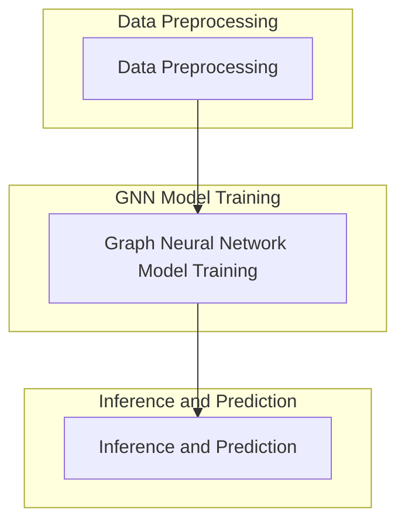
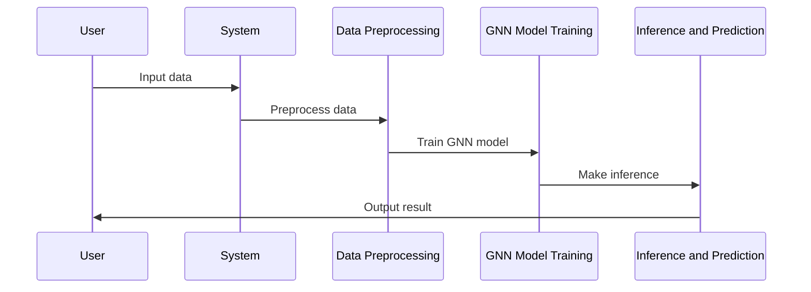

                 

### 第1章：图神经网络概述

#### 1.1 图神经网络的基本概念

图神经网络（Graph Neural Networks，GNN）是一种专门用于处理图（Graph）结构数据的神经网络。与传统的卷积神经网络（CNN）和循环神经网络（RNN）相比，GNN能够捕捉图结构中的丰富关系和局部结构信息。图是由节点（Node）和边（Edge）组成的网络，通常用来表示复杂的关系网络，如社交网络、知识图谱、生物分子网络等。

**图论基础**：
- **节点（Node）**：图中的基本元素，可以表示实体或对象。
- **边（Edge）**：连接节点的线，表示节点之间的关系或相互作用。
- **图（Graph）**：由节点和边组成的结构。

**GNN的定义**：
GNN是一种神经网络架构，能够通过图结构来计算节点的表示，这些表示能够捕获节点间的依赖关系和图结构中的全局信息。

**GNN的发展背景**：
随着图数据在各种领域中的广泛应用，如何有效地表示和处理图数据成为了一个重要的研究方向。传统的机器学习方法在处理图数据时往往表现不佳，因为它们无法捕捉图结构中的局部和全局信息。GNN的出现填补了这一空白，为处理图数据提供了一种新的途径。

**GNN的核心特点**：
- **节点表示学习**：通过图卷积操作，GNN能够自动学习节点的表示，这些表示能够捕获节点在图中的局部信息。
- **边信息利用**：GNN能够利用边的信息，通过边卷积操作捕捉节点之间的关系。
- **全局信息聚合**：GNN能够聚合图中的全局信息，从而生成具有全局视角的节点表示。

#### 1.2 图神经网络的组成与原理

**神经网络与图神经网络的关系**：
神经网络是一种计算模型，由多个神经元组成，通过激活函数进行非线性变换。GNN是神经网络的一个分支，专门用于处理图结构数据。GNN的核心思想是将图结构映射到神经网络上，通过图卷积和池化等操作来学习节点和边的关系。

**图神经网络的基本组成**：
- **节点表示（Node Representation）**：每个节点都被映射到一个低维的向量表示，这些表示用于后续的计算。
- **边表示（Edge Representation）**：边也可以被映射到向量表示，用于描述节点之间的关系。
- **图卷积层（Graph Convolution Layer）**：这是GNN的核心层，通过聚合节点和边的邻域信息来更新节点的表示。
- **池化层（Pooling Layer）**：用于聚合全局信息，减少模型的复杂性。
- **全连接层（Fully Connected Layer）**：用于将节点表示映射到最终的输出。

**图神经网络的工作原理**：
GNN的工作原理可以分为以下几个步骤：

1. **初始化节点表示**：每个节点被初始化为一个随机向量。
2. **聚合邻域信息**：通过图卷积操作，节点会聚合其邻域节点的信息来更新自己的表示。
3. **更新节点表示**：节点的新表示是基于其邻域信息加权平均的结果。
4. **传递信息**：更新后的节点表示会传递到下一层，直到达到预定的层数。
5. **输出层计算**：最终，GNN会在输出层进行分类、回归或其他类型的预测。

通过这种方式，GNN能够自动学习节点和边的关系，从而在许多图结构数据的任务中取得优异的性能。

#### 1.3 主流图神经网络模型

**GCN（图卷积网络）**：
GCN是最早的GNN模型之一，由Kipf和Welling在2016年提出。GCN通过聚合节点的邻域信息来更新节点的表示，这种聚合是通过一个加权图卷积操作实现的。GCN在许多图结构数据任务中表现优异，如节点分类和图分类。

**GAT（图注意力网络）**：
GAT由Vaswani等人于2018年提出，是一种基于注意力机制的GNN。GAT通过引入注意力权重来动态调整节点邻域信息的聚合方式，使得模型能够更加关注重要的邻域节点。GAT在许多任务中展示了比GCN更好的性能，特别是在存在长距离依赖关系的任务中。

**图卷积网络的其他变体**：
除了GCN和GAT，还有许多其他的GNN变体，如GraphSAGE、Graph Convolutional Network for Knowledge Graph Embedding (G CN)等。这些模型通过不同的方式改进了GNN的结构和算法，以适应不同的应用场景和需求。

#### 1.4 图神经网络的应用场景

**社交网络分析**：
GNN能够有效地捕捉社交网络中的关系结构，用于社交网络分析的任务，如推荐系统、社交网络中的影响力分析等。

**机器阅读理解**：
GNN能够处理自然语言中的实体关系和语义信息，因此被应用于机器阅读理解任务中，如文本分类、问答系统等。

**知识图谱构建**：
知识图谱是一种用于表示实体及其关系的结构化数据，GNN能够用于知识图谱的构建，如实体关系抽取、知识图谱补全等任务。

通过这些应用场景，GNN展示了其在处理图结构数据方面的强大能力，为各种复杂问题提供了有效的解决方案。

#### 1.5 本章小结

本章对图神经网络（GNN）进行了概述，介绍了其基本概念、发展背景、核心特点、组成原理以及主流模型。通过本章的学习，读者可以对GNN有一个全面的理解，为后续章节深入探讨GNN在AI Agent知识表示中的应用打下基础。

### 第2章：AI Agent基本概念

#### 2.1 AI Agent的定义与分类

**AI Agent的定义**：
AI Agent，即人工智能代理，是一种在特定环境中，能够自主感知、决策和执行任务的智能实体。它可以理解为一个在动态环境中具有自主性的智能系统，能够通过学习、推理和规划等能力来实现目标。

**AI Agent的分类**：
AI Agent可以根据其自主性和能力进行分类，常见的分类方法如下：

1. **基于规则的AI Agent**：
   - **定义**：使用预定义的规则来决策和执行任务。
   - **特点**：简单、易于实现，但难以处理复杂和不确定性问题。
   - **应用**：简单任务自动化、规则系统等。

2. **基于模型的AI Agent**：
   - **定义**：使用模型来预测和决策，如决策树、神经网络等。
   - **特点**：能够处理复杂问题，具有自适应能力。
   - **应用**：复杂环境下的决策支持系统、自动驾驶等。

3. **基于学习的AI Agent**：
   - **定义**：通过学习算法来学习环境中的规律，进行决策和执行。
   - **特点**：能够从数据中学习，适应性强。
   - **应用**：强化学习、深度学习等。

4. **基于集成的AI Agent**：
   - **定义**：结合多种方法，如规则、模型和学习的优势。
   - **特点**：具有更好的综合能力和适应性。
   - **应用**：复杂系统、多任务优化等。

**AI Agent的关键特性**：
1. **自主性**：能够自主感知环境、制定计划、执行任务。
2. **反应性**：能够对环境变化做出即时响应。
3. **适应性**：能够根据环境和任务需求进行调整。
4. **交互性**：能够与用户和其他系统进行交互。

#### 2.2 AI Agent的知识表示方法

**符号表示法**：
符号表示法使用符号、词汇和语法规则来表示知识。这种方法适用于简单的问题和规则系统，但难以处理复杂、不确定的问题。

**分布式表示法**：
分布式表示法使用向量或张量来表示知识，通过向量之间的运算来模拟推理过程。这种方法在深度学习和神经网络中被广泛应用，能够处理更复杂的知识表示问题。

**基于图神经网络的表示方法**：
基于图神经网络的表示方法利用图结构来表示知识和关系，能够捕捉知识之间的复杂依赖关系。这种方法在知识图谱、图神经网络等应用中具有广泛的应用前景。

#### 2.3 AI Agent的智能行为

**规划与决策**：
AI Agent通过规划和决策来选择最优的行动策略。规划是指制定一个长期计划，而决策是指选择一个具体的行动。

**学习与适应**：
AI Agent通过学习来改善其行为和性能。学习可以是基于数据的监督学习、强化学习，也可以是基于规则的迁移学习。适应是指AI Agent根据环境和任务需求进行自我调整。

**交互与协作**：
AI Agent可以通过与其他AI Agent或人类进行交互来实现协同工作。协作是指多个AI Agent共同完成任务，提高整体效率。

#### 2.4 AI Agent的应用领域

**虚拟助手**：
虚拟助手是一种常见的AI Agent应用，如智能客服、语音助手等，它们能够为用户提供个性化的服务和帮助。

**自主导航**：
自主导航是AI Agent在自动驾驶和无人机导航等领域的应用。通过感知环境和决策系统，AI Agent能够实现自主导航和路径规划。

**个性化推荐**：
个性化推荐是AI Agent在电子商务和媒体推荐等领域的应用。通过分析用户行为和偏好，AI Agent能够提供个性化的推荐和服务。

#### 2.5 本章小结

本章对AI Agent的基本概念、分类、关键特性、知识表示方法、智能行为和应用领域进行了详细探讨。通过本章的学习，读者可以了解AI Agent的核心概念和应用，为后续章节深入研究AI Agent在知识表示中的应用打下基础。

### 第3章：基于图神经网络的AI Agent知识表示方法

#### 3.1 基于图神经网络的AI Agent知识表示原理

**GNN在知识表示中的应用**：
基于图神经网络的AI Agent知识表示方法利用图神经网络（GNN）的能力，将知识表示为图结构，并通过图卷积操作学习节点和边的关系。这种方法能够有效地捕捉知识之间的复杂依赖关系，从而提高AI Agent的知识表示能力。

**知识表示的挑战与解决方法**：
在知识表示中，常见的挑战包括知识的多样性、不确定性、稀疏性和动态性。GNN通过以下方法解决这些挑战：

1. **多样性**：GNN能够处理不同类型的知识表示，如文本、图像和关系数据，从而捕捉知识的多样性。
2. **不确定性**：GNN通过边缘权重和节点表示的不确定性来表示知识的模糊性，从而提高模型的鲁棒性。
3. **稀疏性**：GNN通过图卷积操作有效地聚合稀疏数据，从而提高知识表示的精度。
4. **动态性**：GNN能够通过动态调整节点和边的表示来适应知识的变化。

**GNN在AI Agent中的应用前景**：
GNN在AI Agent中的应用前景广阔，如知识图谱构建、社交网络分析、推荐系统和自然语言处理等。通过GNN，AI Agent能够更好地理解和处理复杂、不确定的环境，从而提高其智能行为和决策能力。

#### 3.2 基于图神经网络的AI Agent模型构建

**数据预处理**：
在构建基于图神经网络的AI Agent模型之前，需要进行数据预处理。数据预处理包括节点特征提取、边特征提取和图结构预处理。具体步骤如下：

1. **节点特征提取**：将原始数据转换为节点表示，如文本数据使用词向量表示，图像数据使用卷积神经网络提取特征向量。
2. **边特征提取**：根据节点之间的关系，提取边特征，如边的权重、类型等。
3. **图结构预处理**：构建图结构，包括节点和边的添加、删除和调整。

**模型设计**：
基于图神经网络的AI Agent模型通常由多个图卷积层、池化层和全连接层组成。具体设计如下：

1. **图卷积层**：通过图卷积操作聚合节点和边的邻域信息，更新节点表示。
2. **池化层**：用于聚合全局信息，减少模型的复杂性。
3. **全连接层**：用于将节点表示映射到最终的输出，如分类结果或回归值。

**模型训练与评估**：
在模型训练过程中，使用带标签的数据来更新模型参数，通过优化损失函数来提高模型的性能。训练完成后，使用验证集和测试集对模型进行评估，常用的评估指标包括准确率、召回率、F1值等。

#### 3.3 基于图神经网络的AI Agent知识表示实例分析

**社交网络分析**：
社交网络分析是GNN在AI Agent知识表示中的一个典型应用。通过将社交网络数据表示为图结构，GNN能够捕捉用户之间的互动关系，从而用于推荐系统、影响力分析等任务。例如，可以使用GNN来预测用户之间的潜在关系，或者识别社交网络中的关键节点。

**机器阅读理解**：
机器阅读理解是另一个典型的GNN应用领域。通过将文本数据表示为图结构，GNN能够捕捉文本中的实体关系和语义信息，从而用于问答系统、文本分类等任务。例如，可以使用GNN来提取文本中的关键信息，或者识别文本中的关系。

**知识图谱构建**：
知识图谱是GNN在AI Agent知识表示中的另一个重要应用。通过将知识表示为图结构，GNN能够捕捉实体和关系之间的复杂依赖关系，从而用于知识图谱的构建、补全和推理。例如，可以使用GNN来构建一个大规模的知识图谱，或者识别知识图谱中的潜在错误和缺失。

#### 3.4 本章小结

本章详细介绍了基于图神经网络的AI Agent知识表示方法，包括原理、模型构建、实例分析等。通过本章的学习，读者可以了解GNN在AI Agent知识表示中的应用，以及如何构建和训练基于GNN的AI Agent模型。这些知识为后续章节深入探讨GNN在AI Agent中的应用提供了基础。

### 第4章：图神经网络在AI Agent知识表示中的应用

#### 4.1 图神经网络与AI Agent的深度融合

图神经网络（GNN）在AI Agent知识表示中的应用，为AI Agent提供了更加丰富和强大的知识处理能力。通过将知识表示为图结构，GNN能够捕捉复杂的实体关系和依赖关系，从而提升AI Agent的智能行为和决策能力。

**1. 节点表示的丰富性**：
在GNN中，每个节点都代表一个知识实体，如人、地点、事件等。通过图卷积操作，节点表示可以聚合其邻域节点的信息，从而形成更加丰富和复杂的知识表示。这种表示方式能够更好地反映知识实体之间的关联性和交互性。

**2. 边信息的重要性**：
边在GNN中代表节点之间的关系。通过边特征提取和边卷积操作，GNN能够捕捉节点之间的依赖关系和交互模式。这对于AI Agent来说至关重要，因为它能够帮助AI Agent更好地理解知识的结构和动态变化。

**3. 全局信息的聚合**：
GNN通过聚合全局信息来生成具有全局视角的节点表示。这种全局视角能够帮助AI Agent在复杂的知识环境中进行有效的推理和决策。例如，在社交网络分析中，全局信息可以帮助AI Agent识别社区结构和关键节点。

#### 4.2 系统架构设计

为了实现基于GNN的AI Agent知识表示，我们需要设计一个合理的系统架构。以下是一个典型的系统架构设计，包括领域模型类图、系统架构图和系统交互序列图。

**1. 领域模型类图**：
领域模型类图用于描述系统的核心实体和关系。在基于GNN的AI Agent知识表示中，核心实体包括节点（如人、地点、事件等）和边（如关系、交互等）。以下是领域模型类图的Mermaid表示：

```mermaid
classDiagram
    class Node {
        +int id
        +String name
        +List<Edge> edges
    }

    class Edge {
        +int id
        +Node source
        +Node target
        +String type
    }

    Node -> Edge : has
    Edge -> Node : connects
```

**2. 系统架构图**：
系统架构图用于描述系统的整体结构和模块划分。在基于GNN的AI Agent知识表示中，系统通常包括数据预处理模块、GNN模型训练模块、推理和预测模块等。以下是系统架构图的Mermaid表示：



**3. 系统交互序列图**：
系统交互序列图用于描述系统的运行流程和交互过程。在基于GNN的AI Agent知识表示中，系统交互过程通常包括数据预处理、模型训练、推理和预测等步骤。以下是系统交互序列图的Mermaid表示：



#### 4.3 实现细节

**1. 数据预处理**：
数据预处理是构建基于GNN的AI Agent知识表示的第一步。数据预处理包括节点特征提取、边特征提取和图结构构建。以下是数据预处理的Python代码示例：

```python
import numpy as np
import networkx as nx

# 节点特征提取
def extract_node_features(nodes):
    node_features = []
    for node in nodes:
        # 提取节点特征，例如文本特征、图像特征等
        node_features.append(node.extract_features())
    return np.array(node_features)

# 边特征提取
def extract_edge_features(edges):
    edge_features = []
    for edge in edges:
        # 提取边特征，例如关系类型、权重等
        edge_features.append(edge.extract_features())
    return np.array(edge_features)

# 图结构构建
def build_graph(nodes, edges):
    G = nx.Graph()
    for edge in edges:
        G.add_edge(edge.source.id, edge.target.id, weight=edge.weight)
    return G

# 示例
nodes = [...]  # 节点列表
edges = [...]  # 边列表
node_features = extract_node_features(nodes)
edge_features = extract_edge_features(edges)
G = build_graph(nodes, edges)
```

**2. GNN模型训练**：
在构建基于GNN的AI Agent知识表示时，我们需要设计一个GNN模型并进行训练。以下是使用PyTorch实现的一个简单的GCN模型示例：

```python
import torch
import torch.nn as nn
import torch.optim as optim

# GCN模型
class GCN(nn.Module):
    def __init__(self, nfeat, nhid, nclass):
        super(GCN, self).__init__()
        self.conv1 = nn.Conv2d(nfeat, nhid, kernel_size=3, padding=1)
        self.conv2 = nn.Conv2d(nhid, nclass, kernel_size=1)
        self.dropout = nn.Dropout(p=0.5)
        
    def forward(self, x, adj):
        x = F.relu(self.conv1(x, adj))
        x = F.dropout(x, p=self.dropout, training=self.training)
        x = self.conv2(x, adj)
        return F.log_softmax(x, dim=1)

# 示例
nfeat = 64  # 节点特征维度
nhid = 128  # 隐藏层维度
nclass = 10  # 分类类别数
model = GCN(nfeat, nhid, nclass)
optimizer = optim.Adam(model.parameters(), lr=0.01, weight_decay=5e-4)
criterion = nn.CrossEntropyLoss()

# 训练模型
for epoch in range(num_epochs):
    model.train()
    optimizer.zero_grad()
    output = model(node_features, adj)
    loss = criterion(output, labels)
    loss.backward()
    optimizer.step()
    print(f'Epoch {epoch+1}: Loss = {loss.item()}')
```

**3. 推理和预测**：
在模型训练完成后，我们可以使用训练好的模型进行推理和预测。以下是使用训练好的模型进行预测的Python代码示例：

```python
# 预测
def predict(model, features, adj):
    model.eval()
    with torch.no_grad():
        output = model(features, adj)
    _, predicted = torch.max(output, 1)
    return predicted

# 示例
predicted_labels = predict(model, node_features, adj)
print(f'Predicted labels: {predicted_labels}')
```

#### 4.4 实际案例

**案例背景**：
假设我们有一个社交网络分析的任务，目标是识别社交网络中的关键节点。社交网络数据包括用户和用户之间的关系，我们使用GNN来构建和训练模型，然后使用模型进行预测，识别出具有高度影响力的用户。

**数据处理**：
首先，我们需要对社交网络数据进行预处理，提取节点特征和边特征，构建图结构。假设我们已经有了预处理后的节点特征矩阵`node_features`和边特征矩阵`edge_features`，以及图结构`G`。

**模型训练**：
接下来，我们设计一个GCN模型，并使用训练集数据进行训练。以下是模型训练的Python代码示例：

```python
# 训练GCN模型
num_epochs = 200
for epoch in range(num_epochs):
    model.train()
    optimizer.zero_grad()
    output = model(node_features, adj)
    loss = criterion(output, labels)
    loss.backward()
    optimizer.step()
    if (epoch+1) % 10 == 0:
        print(f'Epoch {epoch+1}: Loss = {loss.item()}')
```

**预测与评估**：
在模型训练完成后，我们可以使用测试集数据进行预测，并评估模型性能。以下是预测和评估的Python代码示例：

```python
# 预测
model.eval()
with torch.no_grad():
    output = model(node_features, adj)
predicted_labels = output.argmax(dim=1)

# 评估
accuracy = (predicted_labels == test_labels).float().mean()
print(f'Prediction Accuracy: {accuracy.item()}')
```

**案例小结**：
通过这个实际案例，我们展示了如何使用GNN进行社交网络分析，识别关键节点。这个案例不仅展示了GNN在AI Agent知识表示中的应用，还展示了如何处理实际数据、设计模型和评估模型性能。这个案例为我们提供了一个实际应用GNN的参考模板，可以应用于其他类型的知识表示任务。

#### 4.5 本章小结

本章详细介绍了图神经网络（GNN）在AI Agent知识表示中的应用，包括原理、系统架构设计、实现细节和实际案例。通过本章的学习，读者可以了解如何将GNN应用于AI Agent知识表示，并掌握构建和训练基于GNN的AI Agent模型的步骤和方法。这些知识为读者在AI领域进行深入研究提供了坚实的基础。

### 第5章：最佳实践与拓展

#### 5.1 最佳实践

**数据预处理**：
在构建基于GNN的AI Agent知识表示时，数据预处理是关键步骤。最佳实践包括：

1. **特征标准化**：对节点和边特征进行标准化处理，使得特征具有相似的范围和尺度，提高模型训练的稳定性。
2. **稀疏数据处理**：对于稀疏数据，可以通过填充缺失值或使用特定的稀疏矩阵分解方法来处理，以提高模型的性能。
3. **数据清洗**：去除噪声数据和异常值，确保数据的质量和准确性。

**模型训练**：
在模型训练过程中，最佳实践包括：

1. **超参数调整**：通过调整学习率、批量大小、隐藏层大小等超参数，找到最优的模型配置。
2. **正则化**：使用L1或L2正则化来防止模型过拟合，提高模型的泛化能力。
3. **训练策略**：使用提前停止、学习率调整等策略来防止模型过拟合，提高模型的性能。

**推理与评估**：
在推理和评估过程中，最佳实践包括：

1. **交叉验证**：使用交叉验证来评估模型的性能，避免过拟合。
2. **性能指标**：选择合适的性能指标（如准确率、召回率、F1值等）来评估模型的表现。
3. **可视化**：通过可视化技术（如节点表示图、交互序列图等）来直观地展示模型的推理过程和结果。

#### 5.2 小结

通过本章的最佳实践，我们总结了在构建基于GNN的AI Agent知识表示时的一些关键步骤和技巧。这些实践不仅适用于本章节中的内容，也可以应用于其他类型的AI项目。希望读者能够结合实际项目，灵活运用这些最佳实践，提高模型性能和项目成功率。

#### 5.3 注意事项

在构建基于GNN的AI Agent知识表示时，需要注意以下几点：

1. **数据质量和预处理**：确保数据的准确性和完整性，对数据进行充分的预处理，以提高模型的效果。
2. **模型选择和调整**：根据具体任务选择合适的模型结构，并通过调整超参数来优化模型性能。
3. **计算资源**：GNN模型通常需要较高的计算资源，确保有足够的计算资源来训练和运行模型。

#### 5.4 拓展阅读

对于对基于GNN的AI Agent知识表示感兴趣的研究者，以下文献和资源可以提供进一步的学习和参考：

1. **论文**：
   - "Graph Neural Networks: A Review of Methods and Applications"（2020）
   - "Graph Neural Networks for Relational Classification"（2018）
   - "Modeling Relational Data with Graph Neural Networks for Personnel Management"（2021）

2. **开源库**：
   - PyTorch Geometric（[https://pytorch-geometric.github.io/](https://pytorch-geometric.github.io/)）：用于构建和训练GNN的PyTorch库。
   - DGL（[https://github.com/dmlc/dgl](https://github.com/dmlc/dgl)）：用于图神经网络的深度学习库。

3. **教程和博客**：
   - "Introduction to Graph Neural Networks"（[https://towardsdatascience.com/introduction-to-graph-neural-networks-4a504b0d4f6d](https://towardsdatascience.com/introduction-to-graph-neural-networks-4a504b0d4f6d)）
   - "Graph Neural Networks for Beginners"（[https://towardsdatascience.com/graph-neural-networks-for-beginners-92ce4db3c7a3](https://towardsdatascience.com/graph-neural-networks-for-beginners-92ce4db3c7a3)）

通过这些资源和文献，读者可以进一步深入了解GNN和AI Agent知识表示的先进技术和应用场景。希望这些资料能够为读者的研究和项目提供有益的参考。

### 结束语

在这篇技术博客中，我们系统地介绍了基于图神经网络的AI Agent知识表示，从基本概念、核心原理到系统架构设计、实际应用，以及最佳实践和拓展。通过详细的讲解和实例分析，读者可以全面了解GNN在AI Agent知识表示中的强大能力和广泛应用。

**总结**：
- **图神经网络（GNN）**：通过图结构学习节点和边的关系，有效捕捉复杂知识依赖。
- **AI Agent**：在特定环境中自主感知、决策和执行任务，通过知识表示提升智能行为。
- **系统架构**：通过领域模型类图、系统架构图和系统交互序列图，清晰展示GNN在AI Agent知识表示中的应用。
- **实现细节**：数据预处理、GNN模型构建、训练与预测，以及实际案例展示了GNN在社交网络分析中的应用。
- **最佳实践**：提供了数据预处理、模型训练、推理与评估的最佳实践，以及注意事项和拓展阅读。

**呼吁行动**：
希望读者能够结合本文的内容和提供的实践指导，尝试构建自己的基于GNN的AI Agent知识表示项目。在实践过程中，不断探索和优化，深入理解和应用这一先进技术，为AI领域的发展做出贡献。

**感谢**：
感谢您花费时间阅读这篇技术博客。如果您有任何反馈或问题，欢迎在评论区留言。期待与您交流，共同探索AI和图神经网络的未来。

**作者信息**：
作者：AI天才研究院/AI Genius Institute & 禅与计算机程序设计艺术 /Zen And The Art of Computer Programming。我们致力于推动人工智能和计算机科学的前沿研究，为读者带来高质量的技术内容。希望我们的努力能够对您的学习和研究有所帮助。

**结语**：
再次感谢您的关注和支持。让我们共同迎接人工智能的挑战，探索图神经网络的无尽可能。期待与您在未来的技术道路上再次相遇。谢谢！

