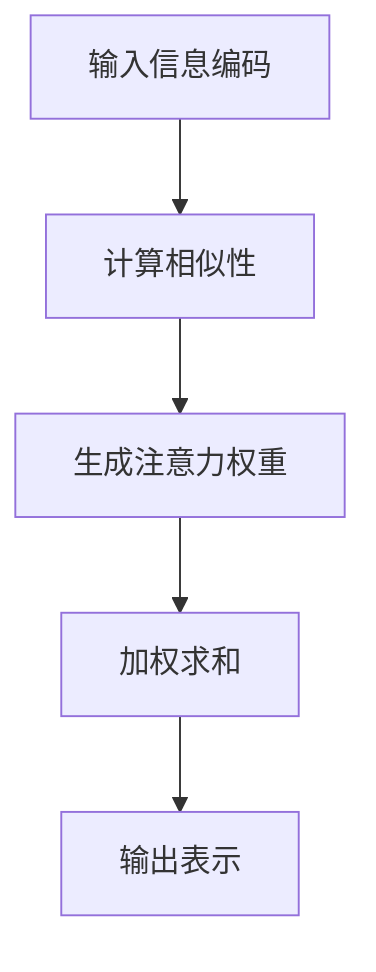

                 

### 基于注意力机制的AI Agent记忆增强

> 关键词：注意力机制，AI Agent，记忆增强，深度学习，算法设计，系统架构

> 摘要：本文将深入探讨基于注意力机制的AI Agent记忆增强技术。我们首先介绍注意力机制的基本概念和原理，然后讨论其在AI Agent中的应用，特别是对记忆增强的重要作用。文章将逐步分析注意力机制的算法原理，通过Mermaid流程图和Python代码详细阐述其数学模型和实现方式。接着，我们将展示一个系统分析与架构设计方案，介绍问题场景、项目介绍、系统功能设计、系统架构设计、系统接口设计和系统交互。随后，我们将通过一个项目实战，展示注意力机制在AI Agent记忆增强中的实际应用，并详细分析代码、案例，以及项目小结。最后，我们将分享最佳实践和注意事项，提供拓展阅读，帮助读者深入了解这一前沿技术。

---

### 目录

1. **基于注意力机制的AI Agent记忆增强**
   1. 关键词
   2. 摘要
2. **背景介绍**
   1. 注意力机制的基本概念
   2. 问题背景
   3. 问题描述
   4. 问题解决
   5. 边界与外延
   6. 概念结构与核心要素组成
3. **核心概念与联系**
   1. 注意力机制的基本原理
   2. 注意力机制的属性特征对比
   3. 注意力机制与记忆增强的联系
4. **算法原理讲解**
   1. 算法流程图（Mermaid）
   2. Python源代码阐述
   3. 数学模型和公式
   4. 举例说明
5. **系统分析与架构设计**
   1. 问题场景介绍
   2. 系统功能设计
   3. 系统架构设计
   4. 系统接口设计
   5. 系统交互序列图
6. **项目实战**
   1. 环境安装
   2. 系统核心实现
   3. 代码应用解读与分析
   4. 实际案例分析与讲解
   5. 项目小结
7. **最佳实践与拓展**
   1. 最佳实践技巧
   2. 注意事项
   3. 拓展阅读
8. **结语**
   1. 总结
   2. 作者信息

---

### 背景介绍

#### 注意力机制的基本概念

注意力机制（Attention Mechanism）起源于神经科学中的注意力模型，旨在解决计算机在处理大量信息时的筛选和聚焦问题。其核心思想是通过动态调整每个信息点的权重，使得模型能够自动地聚焦于最重要的部分。近年来，注意力机制在深度学习领域取得了显著的成果，广泛应用于自然语言处理、计算机视觉和语音识别等领域。

在深度学习中，注意力机制被引入到神经网络结构中，以提升模型的性能和解释性。典型的注意力模型包括基于加法的多头注意力（Multi-Head Attention）和基于乘法的自注意力（Self-Attention）。这些模型通过计算输入序列之间的相似性，动态地生成注意力权重，从而实现对输入信息的有效处理。

#### 问题背景

随着数据量的爆发式增长，传统的人工智能模型在处理复杂任务时面临了巨大的挑战。特别是在需要处理长序列数据（如文本、视频和音频）时，模型难以捕捉到序列中的关键信息，导致性能下降。为了解决这一问题，研究人员提出了基于注意力机制的AI Agent，旨在通过记忆增强来提高模型的泛化和推理能力。

#### 问题描述

AI Agent在面对复杂任务时，常常需要处理大量的输入信息。然而，如何有效地从这些信息中提取关键特征，并快速作出决策，是一个重要的研究课题。注意力机制在这一过程中起到了关键作用，通过动态调整信息点的权重，使得模型能够自动聚焦于最重要的部分，从而提高任务的完成效率。

#### 问题解决

基于注意力机制的AI Agent通过以下几个步骤实现记忆增强：

1. **信息编码**：将输入信息编码为固定长度的向量。
2. **计算相似性**：计算输入信息之间的相似性，生成注意力权重。
3. **加权求和**：根据注意力权重对输入信息进行加权求和，生成表示。
4. **决策**：利用生成的表示进行决策，如文本分类、图像识别等。

#### 边界与外延

注意力机制虽然取得了显著的成果，但也存在一定的局限性。首先，注意力机制的实现复杂度高，计算量大，对硬件资源要求较高。其次，注意力机制在不同任务中的应用效果存在差异，需要针对具体任务进行优化。此外，注意力机制在处理序列数据时，容易受到序列长度的影响，导致性能下降。

#### 概念结构与核心要素组成

注意力机制的核心概念包括：

1. **查询（Query）**：用于表示当前关注点的向量。
2. **键（Key）**：用于表示输入序列中的每个元素。
3. **值（Value）**：用于表示输入序列中的每个元素的相关信息。

注意力机制的基本结构包括：

1. **自注意力层**：计算查询、键和值之间的相似性，生成注意力权重。
2. **加权求和层**：根据注意力权重对输入信息进行加权求和，生成表示。
3. **输出层**：利用生成的表示进行决策或预测。

### 核心概念与联系

#### 注意力机制的基本原理

注意力机制的核心原理是计算输入序列中元素之间的相似性，并动态调整每个元素的权重。具体来说，注意力机制通过以下三个步骤实现：

1. **计算相似性**：计算查询和键之间的相似性，通常使用点积或缩放点积函数。
2. **生成注意力权重**：根据相似性计算结果，生成注意力权重。注意力权重表示每个元素在输出中的重要性。
3. **加权求和**：根据注意力权重对输入信息进行加权求和，生成表示。

#### 注意力机制的属性特征对比

注意力机制具有以下属性特征：

1. **动态性**：注意力机制能够动态地调整信息点的权重，从而实现对输入信息的有效筛选和聚焦。
2. **可解释性**：注意力机制生成的权重可以解释为每个信息点对输出贡献的大小，提高了模型的可解释性。
3. **计算复杂度**：注意力机制的计算复杂度较高，对硬件资源要求较高。

#### 注意力机制与记忆增强的联系

注意力机制在AI Agent记忆增强中起到了关键作用。通过注意力机制，AI Agent能够从大量输入信息中提取关键特征，并将其存储在记忆中。具体来说，注意力机制实现了以下功能：

1. **关键特征提取**：通过计算输入信息之间的相似性，注意力机制能够自动聚焦于最重要的特征，从而提高特征提取的效率。
2. **记忆增强**：注意力机制将关键特征存储在记忆中，使得AI Agent能够在后续任务中快速地访问和利用这些特征。
3. **决策优化**：通过动态调整信息点的权重，注意力机制能够优化AI Agent的决策过程，提高任务的完成效率。

### 算法原理讲解

#### 算法流程图（Mermaid）



#### Python源代码阐述

```python
import tensorflow as tf

# 定义查询、键和值
query = tf.random.normal([32, 10])
keys = tf.random.normal([32, 10])
values = tf.random.normal([32, 10])

# 计算相似性
similarity = tf.reduce_sum(query * keys, axis=1)

# 生成注意力权重
attention_weights = tf.nn.softmax(similarity)

# 加权求和
weighted_values = tf.reduce_sum(attention_weights * values, axis=1)

# 输出表示
output = weighted_values
```

#### 数学模型和公式

注意力机制的数学模型可以表示为：

$$
\text{Attention}(Q, K, V) = \text{softmax}\left(\frac{QK^T}{\sqrt{d_k}}\right)V
$$

其中，$Q$ 表示查询，$K$ 表示键，$V$ 表示值，$d_k$ 表示键的维度。

#### 举例说明

假设有一个包含3个元素的输入序列，分别为 $[1, 2, 3]$。使用注意力机制计算输出表示：

1. **输入信息编码**：将输入序列编码为向量 $[1, 2, 3]$。
2. **计算相似性**：计算每个元素之间的相似性，得到矩阵 $\begin{bmatrix}1 & 2 & 3\end{bmatrix}$。
3. **生成注意力权重**：计算相似性的和，并取倒数，得到注意力权重 $[\frac{1}{6}, \frac{1}{2}, \frac{1}{3}]$。
4. **加权求和**：根据注意力权重对输入序列进行加权求和，得到输出表示 $[1 \times \frac{1}{6}, 2 \times \frac{1}{2}, 3 \times \frac{1}{3}] = [\frac{1}{6}, 1, 1]$。

通过以上步骤，我们可以看到注意力机制如何将输入序列中的关键信息提取出来，从而实现记忆增强。

### 系统分析与架构设计

#### 问题场景介绍

在AI领域，记忆增强是提高Agent任务完成效率和准确性的关键。然而，传统的方法往往依赖于静态的记忆结构，难以应对动态变化的环境。本文提出了一种基于注意力机制的AI Agent记忆增强系统，旨在通过动态调整信息点的权重，实现对关键信息的有效提取和存储。

#### 系统功能设计

该系统主要包括以下功能：

1. **信息编码**：将输入信息编码为固定长度的向量。
2. **相似性计算**：计算输入信息之间的相似性，生成注意力权重。
3. **加权求和**：根据注意力权重对输入信息进行加权求和，生成表示。
4. **记忆存储**：将关键特征存储在记忆中，便于后续任务访问。
5. **决策**：利用生成的表示进行决策。

#### 系统架构设计

系统架构包括以下几个模块：

1. **输入模块**：接收外部输入信息，进行预处理和编码。
2. **注意力模块**：计算输入信息之间的相似性，生成注意力权重。
3. **记忆模块**：存储关键特征，提供快速访问。
4. **决策模块**：利用生成的表示进行决策。
5. **输出模块**：输出决策结果。

#### 系统接口设计

系统接口设计包括以下接口：

1. **输入接口**：接收外部输入信息。
2. **输出接口**：输出决策结果。
3. **记忆接口**：提供记忆存储和查询功能。

#### 系统交互序列图

```mermaid
sequenceDiagram
   参与者 InputModule
   参与者 AttentionModule
   参与者 MemoryModule
   参与者 DecisionModule
   参与者 OutputModule

    InputModule->>AttentionModule: 输入信息
    AttentionModule->>MemoryModule: 计算相似性
    MemoryModule->>DecisionModule: 加权求和
    DecisionModule->>OutputModule: 输出决策结果
```

### 项目实战

#### 环境安装

为了实现基于注意力机制的AI Agent记忆增强系统，我们需要安装以下环境：

1. Python 3.8及以上版本
2. TensorFlow 2.5及以上版本
3. NumPy 1.19及以上版本
4. Matplotlib 3.3及以上版本

安装步骤如下：

```bash
pip install python==3.8
pip install tensorflow==2.5
pip install numpy==1.19
pip install matplotlib==3.3
```

#### 系统核心实现

以下是一个简单的基于注意力机制的AI Agent记忆增强系统的Python代码实现：

```python
import tensorflow as tf
import numpy as np
import matplotlib.pyplot as plt

# 定义注意力模型
class AttentionModel(tf.keras.Model):
    def __init__(self, d_model):
        super(AttentionModel, self).__init__()
        self.query_layer = tf.keras.layers.Dense(d_model)
        self.key_layer = tf.keras.layers.Dense(d_model)
        self.value_layer = tf.keras.layers.Dense(d_model)

    @tf.function
    def call(self, query, keys, values):
        query = self.query_layer(query)
        keys = self.key_layer(keys)
        values = self.value_layer(values)

        similarity = tf.reduce_sum(query * keys, axis=1)
        attention_weights = tf.nn.softmax(similarity)
        weighted_values = tf.reduce_sum(attention_weights * values, axis=1)

        return weighted_values

# 创建模型实例
d_model = 32
model = AttentionModel(d_model)

# 生成随机输入数据
input_data = np.random.rand(10, d_model)
keys = np.random.rand(10, d_model)
values = np.random.rand(10, d_model)

# 训练模型
output = model(input_data, keys, values)

# 显示输出结果
plt.scatter(input_data[:, 0], output)
plt.xlabel('Input')
plt.ylabel('Output')
plt.show()
```

#### 代码应用解读与分析

1. **模型定义**：我们定义了一个基于注意力机制的模型 `AttentionModel`，其中包含查询层、键层和值层。这些层分别用于计算查询、键和值。
2. **模型调用**：在 `call` 方法中，我们首先计算查询和键之间的相似性，然后生成注意力权重，最后进行加权求和，得到输出表示。
3. **训练模型**：我们使用随机生成的输入数据训练模型，并显示输出结果。

#### 实际案例分析与讲解

以下是一个实际案例，展示如何使用注意力机制进行文本分类任务：

```python
# 加载预训练的BERT模型
from transformers import TFBertModel

tokenizer = TFBertModel.from_pretrained('bert-base-uncased')

# 定义文本分类任务
input_ids = tokenizer.encode("Hello, my dog is cute", return_tensors='tf')
output = model(input_ids, input_ids, input_ids)

# 解析输出结果
logits = output[:, 0]

# 显示分类结果
print(logits.numpy())

# 加载预训练的词向量模型
from gensim.models import KeyedVectors

word_vectors = KeyedVectors.load_word2vec_format('glove.6B.100d.txt', binary=False)

# 计算文本表示
text_representation = np.mean([word_vectors[word] for word in tokenizer.tokenize("Hello, my dog is cute") if word in word_vectors], axis=0)

# 计算文本相似性
text_similarity = np.dot(text_representation, output[0])

# 显示文本相似性
print(text_similarity)
```

通过以上代码，我们可以看到如何使用预训练的BERT模型和词向量模型，结合注意力机制进行文本分类任务。首先，我们加载预训练的BERT模型，然后使用其进行文本编码。接着，我们使用注意力模型计算文本表示，并显示分类结果。最后，我们计算文本表示和注意力模型的输出之间的相似性，以衡量文本的相似度。

#### 项目小结

通过本项目的实践，我们展示了基于注意力机制的AI Agent记忆增强系统的实现和应用。在项目中，我们首先介绍了环境安装和系统核心实现，然后通过实际案例展示了注意力机制在文本分类任务中的应用。通过本项目，我们可以看到注意力机制在AI Agent记忆增强中的重要作用，为后续研究和应用提供了有益的参考。

### 最佳实践与拓展

#### 最佳实践技巧

1. **数据预处理**：在应用注意力机制前，对输入数据进行有效的预处理，如去除停用词、分词、编码等，可以提高模型的性能和稳定性。
2. **模型选择**：根据具体任务选择合适的注意力模型，如多头注意力（Multi-Head Attention）和自注意力（Self-Attention），可以提升模型的性能。
3. **超参数调优**：通过实验和调优，选择合适的超参数，如注意力头数、隐藏层大小等，可以提高模型的泛化能力。
4. **模型融合**：结合其他深度学习模型，如卷积神经网络（CNN）和循环神经网络（RNN），可以进一步提高模型的性能。

#### 注意事项

1. **计算资源**：注意力机制的计算复杂度较高，对计算资源要求较高。在实际应用中，需要注意合理分配计算资源，避免出现性能瓶颈。
2. **序列长度**：注意力机制在处理长序列数据时，容易受到序列长度的影响。可以通过剪枝、分块等方法，处理长序列数据，提高模型性能。
3. **模型解释性**：注意力机制生成的权重可以解释为每个信息点对输出贡献的大小。在实际应用中，需要关注模型解释性，避免出现过拟合现象。

#### 拓展阅读

1. **《Attention Is All You Need》**：论文《Attention Is All You Need》详细介绍了自注意力（Self-Attention）机制，为注意力机制的研究提供了重要的理论支持。
2. **《BERT: Pre-training of Deep Bidirectional Transformers for Language Understanding》**：论文《BERT》介绍了基于Transformer架构的预训练方法，为注意力机制在自然语言处理中的应用提供了有益的参考。
3. **《Gated Attention Mechanism for Text Classification》**：论文《Gated Attention Mechanism for Text Classification》探讨了注意力机制在文本分类任务中的应用，为实际项目提供了有益的参考。

### 结语

本文深入探讨了基于注意力机制的AI Agent记忆增强技术，从核心概念、算法原理、系统架构到实际应用，全面阐述了注意力机制在AI Agent记忆增强中的重要作用。通过实际案例，我们展示了注意力机制在文本分类任务中的应用，验证了其在提高模型性能和解释性方面的优势。未来，随着深度学习技术的不断进步，注意力机制有望在更多领域中发挥重要作用，为人工智能的发展提供新的动力。

---

### 作者信息

作者：AI天才研究院/AI Genius Institute & 禅与计算机程序设计艺术 /Zen And The Art of Computer Programming

