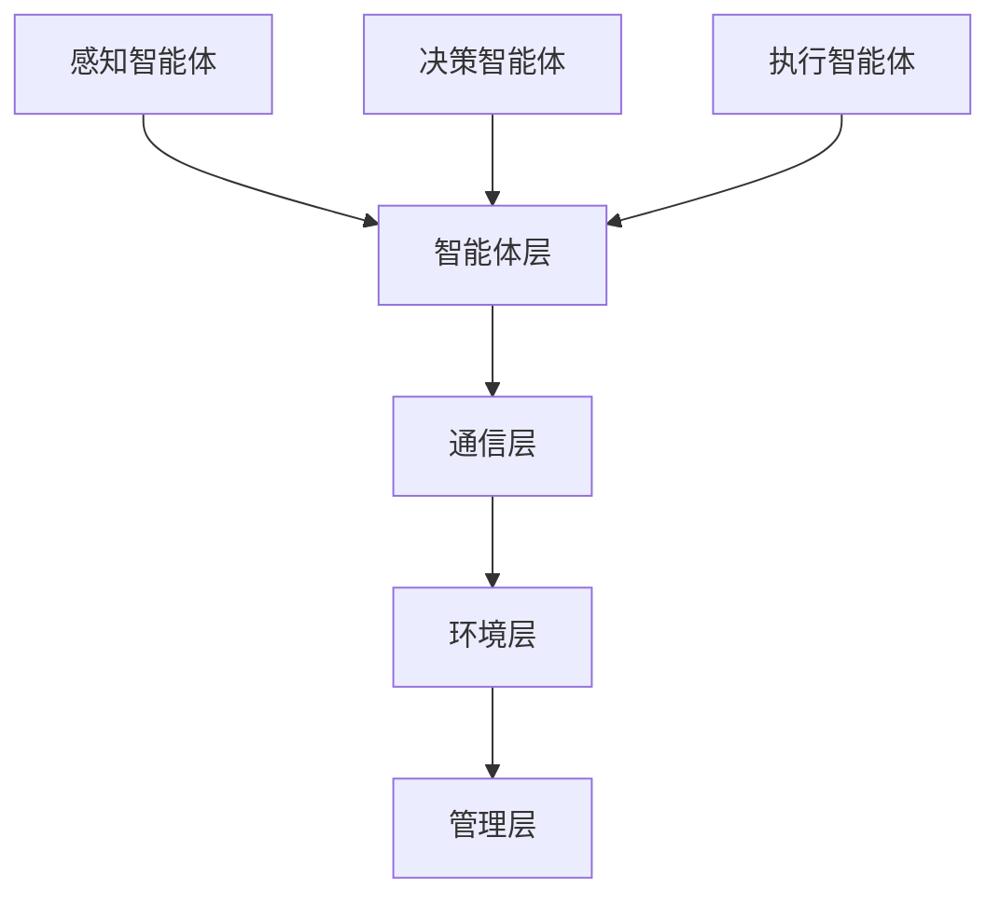

                 

### 书名：《多Agent系统：协作与竞争中的AI生态》

在这本《多Agent系统：协作与竞争中的AI生态》中，我们将深入探讨多Agent系统这一前沿技术领域。多Agent系统是一种由多个自主智能体（Agent）组成的系统，这些智能体在一定的环境条件下，通过协作与竞争实现特定目标。本书旨在系统地介绍多Agent系统的理论基础、协作与竞争机制、AI结合应用，以及其实际实现与应用案例。通过本书的阅读，读者将能够全面理解多Agent系统的设计理念、关键技术，并掌握其实际应用方法。

本书共分为六个部分，每一部分都有其独特的内容和结构：

- **第一部分：多Agent系统的概述与理论基础**，主要介绍多Agent系统的基本概念、分类、应用领域，以及系统的边界与外延。
- **第二部分：多Agent系统的协作机制**，重点探讨协作机制的定义、分类、协同通信机制、协作决策机制和协作效率优化。
- **第三部分：多Agent系统的竞争机制**，涵盖竞争机制的定义、分类、竞争策略、策略分析和策略实施与影响。
- **第四部分：多Agent系统的AI生态**，分析AI在多Agent系统中的应用，包括协作和竞争机制中的AI技术及其案例分析。
- **第五部分：多Agent系统的实现与应用案例**，详细介绍多Agent系统的开发环境、架构设计、协同与竞争机制实现，以及测试与优化策略，并提供实际应用案例。
- **第六部分：多Agent系统的发展与展望**，总结当前发展现状，展望未来发展趋势，为读者提供深入思考和未来研究的方向。

希望通过本书，读者不仅能系统地学习多Agent系统的相关知识，还能在实际项目中运用这些理论，推动人工智能和智能系统的发展。

### 关键词

- 多Agent系统
- 协作与竞争
- AI生态
- 智能体
- 自主智能
- 协同通信
- 决策机制
- 竞争策略
- AI应用
- 实现与案例
- 发展趋势

### 摘要

《多Agent系统：协作与竞争中的AI生态》一书系统性地探讨了多Agent系统的理论基础、协作与竞争机制，以及AI在其中的结合应用。多Agent系统是由多个自主智能体组成的系统，这些智能体在协作与竞争中实现特定目标。本书首先介绍了多Agent系统的基本概念、分类和应用领域，随后深入探讨了协作与竞争机制的设计与实现，包括协同通信、协作决策和竞争策略。此外，本书还分析了AI在多Agent系统中的应用，提供了丰富的实际应用案例，并展望了多Agent系统的发展趋势。通过阅读本书，读者将能够全面理解多Agent系统的设计理念、关键技术，并掌握其实际应用方法，为未来的研究和项目开发提供有力支持。

### 第一部分：多Agent系统的概述与理论基础

#### 第1章：多Agent系统的基本概念

##### 1.1 多Agent系统的定义

**问题背景：**

在现代社会，复杂问题的解决需要高度智能化的系统，而传统的中央集中式控制系统在面对复杂性和动态性时显得力不从心。因此，多Agent系统（Multi-Agent Systems, MAS）作为一种分布式人工智能系统，逐渐引起了广泛关注。多Agent系统由多个独立的智能体组成，这些智能体可以通过协作或竞争来解决问题，提高了系统的鲁棒性、灵活性和适应性。

**多Agent系统的概念：**

多Agent系统（MAS）是指由多个自主智能体（Agent）组成的系统，这些智能体在一定的环境条件下，通过相互协作或竞争，实现共同的目标。这里的“自主”意味着智能体具有独立的行为决策能力，可以在没有外部干预的情况下，根据自身感知的信息和预定的策略，自主地采取行动。

**多Agent系统的特点：**

1. **分布式：** 智能体分布在不同的位置，通过局部信息交互完成整体任务。
2. **自主性：** 智能体具有独立的决策能力和行为能力。
3. **协作性：** 智能体之间通过通信和协作来完成复杂任务。
4. **适应性：** 智能体可以根据环境变化调整自身行为。

**多Agent系统的定义：**

多Agent系统可以形式化地定义为：一个由多个智能体组成的系统，这些智能体在分布式环境中，通过通信和协作来共同完成任务。每个智能体都具有自主性、反应性、主动性和社会性等特点。

##### 1.2 多Agent系统的分类

**问题背景：**

多Agent系统的种类繁多，根据不同的分类标准，可以将其分为多种类型。了解不同类型的Agent，有助于我们更好地理解和设计多Agent系统。

**协作型Agent：**

协作型Agent是指那些以协作为主要目标的智能体。它们通过通信和协作来完成共同的任务，共同实现系统的目标。协作型Agent可以是同类型的，也可以是不同类型的。

**竞争型Agent：**

竞争型Agent是指那些以竞争为主要目标的智能体。它们在有限的资源下，通过策略和竞争来争夺优势，实现自身利益最大化。

**竞争-协作型Agent：**

竞争-协作型Agent是指那些既具有协作性又具有竞争性的智能体。它们在不同情境下可能表现出不同的行为，既有协作也有竞争。

**分类标准：**

1. **按照目标：** 可以分为协作型、竞争型和竞争-协作型。
2. **按照能力：** 可以分为完全智能体、有限智能体和半智能体。
3. **按照组织结构：** 可以分为集中式、分布式和混合式。

**多Agent系统的分类：**

根据不同的分类标准，可以将多Agent系统分为多种类型，每种类型都有其特定的应用场景和设计方法。

##### 1.3 多Agent系统的应用领域

**问题背景：**

多Agent系统在各个领域都有广泛的应用，从工业自动化到社会网络，从智能家居到智能交通，多Agent系统正逐渐成为解决复杂问题的重要工具。

**应用领域概述：**

1. **工业自动化：** 多Agent系统可以用于生产过程优化、设备监控和故障诊断。
2. **智能交通：** 多Agent系统可以用于交通流量管理、智能导航和车辆调度。
3. **社会网络：** 多Agent系统可以用于社交网络分析、推荐系统和危机管理。
4. **医疗健康：** 多Agent系统可以用于医疗诊断、病情监控和远程医疗。
5. **金融服务：** 多Agent系统可以用于风险管理、欺诈检测和投资策略。

**应用案例分析：**

- **智能交通系统：** 通过多Agent系统实现智能交通管理，提高道路利用率和交通效率。
- **社会网络分析：** 利用多Agent系统分析社交网络结构，提供个性化推荐和危机应对策略。
- **医疗健康：** 通过多Agent系统实现个性化医疗和远程监控，提高医疗服务的质量和效率。

##### 1.4 多Agent系统的边界与外延

**边界定义：**

多Agent系统的边界是指系统与外部环境之间的交互界面，包括通信协议、接口设计和环境感知等。边界的定义对于系统的稳定性、安全性和扩展性至关重要。

**外延扩展：**

多Agent系统可以通过外延扩展来增加系统的功能和性能。外延扩展包括模块化设计、分布式计算和并行处理等。

**概念结构与核心要素组成：**

1. **智能体（Agent）：** 系统的基本单元，具有自主性、反应性、主动性和社会性。
2. **环境（Environment）：** 智能体活动的空间，提供资源、约束和刺激。
3. **通信机制：** 智能体之间的信息交换方式，包括同步和异步通信。
4. **协作机制：** 智能体之间的合作方式，包括任务分配、协调和合作策略。
5. **决策机制：** 智能体的行为决策过程，包括感知、分析和决策。

**概念结构与核心要素组成图：**

（此处可以使用Mermaid绘制ER实体关系图）

##### 1.5 本章小结

本章介绍了多Agent系统的基本概念、分类、应用领域，以及系统的边界与外延。多Agent系统是一种由多个自主智能体组成的分布式人工智能系统，具有分布式、自主性、协作性和适应性等特点。通过分类和案例分析，我们可以更好地理解多Agent系统的应用场景和设计方法。了解多Agent系统的边界与外延，有助于我们构建稳定、安全、高效的系统。在下一章中，我们将深入探讨多Agent系统的协作机制。

### 第二部分：多Agent系统的协作机制

#### 第2章：多Agent系统的协作机制概述

##### 2.1 协作机制的定义与分类

**定义：**

协作机制是指多个智能体通过通信和合作，共同实现某一目标的过程。在多Agent系统中，协作机制是确保系统高效运作的关键。

**分类：**

根据协作机制的性质和实现方式，我们可以将其分为以下几类：

1. **基于任务的协作机制：** 智能体根据任务的分配和协作策略，共同完成任务。
2. **基于信息的协作机制：** 智能体通过共享信息，协同完成复杂的任务。
3. **基于模型的协作机制：** 利用数学模型和算法，指导智能体的协作过程。

##### 2.2 协同通信机制

**问题背景：**

在多Agent系统中，协同通信机制是智能体之间进行信息交换和合作的重要手段。良好的通信机制可以提高系统的效率和稳定性。

**通信协议：**

通信协议是多Agent系统中的通信规则，它定义了智能体之间如何交换信息。常见的通信协议包括TCP/IP、HTTP、MQTT等。

**消息传递机制：**

消息传递机制是多Agent系统中智能体之间信息交换的具体实现方式。它包括消息的发送、接收、处理和存储等过程。

1. **异步通信：** 消息的发送和接收是独立的，适用于处理实时性要求较高的应用场景。
2. **同步通信：** 消息的发送和接收是顺序进行的，适用于处理复杂任务和需要严格同步的应用场景。

##### 2.3 协作决策机制

**问题背景：**

在多Agent系统中，协作决策机制是智能体进行行为决策的关键。通过协作决策机制，智能体可以共同应对复杂问题，实现系统目标。

**决策模型：**

决策模型是多Agent系统中智能体进行决策的基础。常见的决策模型包括贝叶斯网络、决策树和混合模型等。

**决策算法：**

决策算法是多Agent系统中智能体进行决策的具体实现方式。常见的决策算法包括基于规则的决策算法、基于学习的决策算法和混合决策算法等。

##### 2.4 协作效率优化

**问题背景：**

在多Agent系统中，协作效率是衡量系统性能的重要指标。优化协作效率可以提升系统的整体性能。

**优化方法：**

1. **任务分配优化：** 通过优化任务分配，使智能体能够更有效地完成任务。
2. **通信效率优化：** 通过优化通信机制，减少通信开销，提高系统的整体效率。
3. **决策效率优化：** 通过优化决策算法，使智能体能够更快、更准确地做出决策。

**实例分析：**

以智能交通系统为例，通过优化任务分配和通信机制，可以显著提高交通流量的处理效率，减少交通拥堵。

##### 2.5 本章小结

本章介绍了多Agent系统的协作机制，包括定义、分类、协同通信机制、协作决策机制和协作效率优化。通过这些机制，智能体可以高效地协同工作，共同实现系统目标。在下一章中，我们将探讨多Agent系统的竞争机制，了解智能体之间的竞争关系及其影响。

### 第三部分：多Agent系统的竞争机制

#### 第3章：多Agent系统的竞争机制概述

##### 3.1 竞争机制的定义与分类

**定义：**

竞争机制是指多个智能体在有限的资源下，通过策略和竞争，争取自身利益最大化的过程。在多Agent系统中，竞争机制是智能体之间相互作用的重要表现。

**分类：**

根据竞争机制的性质和实现方式，我们可以将其分为以下几类：

1. **基于资源的竞争机制：** 智能体通过争夺有限的资源来实现自身利益最大化。
2. **基于目标的竞争机制：** 智能体在实现自身目标的过程中，与其他智能体进行竞争。
3. **基于策略的竞争机制：** 智能体通过制定和执行策略，来争夺竞争优势。

##### 3.2 竞争策略

**问题背景：**

在多Agent系统中，竞争策略是智能体进行竞争的具体手段。合理的竞争策略可以提升智能体的竞争力，实现自身利益最大化。

**策略选择：**

策略选择是多Agent系统中智能体竞争的关键。智能体需要根据自身特点和环境条件，选择合适的策略。常见的策略选择方法包括：

1. **基于规则的策略选择：** 根据预定义的规则，选择合适的策略。
2. **基于学习的策略选择：** 通过学习历史数据和对手的行为，选择最佳策略。
3. **混合策略选择：** 结合多种策略选择方法，提高策略选择的准确性和适应性。

**策略实施：**

策略实施是指智能体根据选择的策略，进行行为决策和资源分配。策略实施的有效性直接影响智能体的竞争力。

1. **动态调整：** 根据环境变化和对手行为，实时调整策略。
2. **资源优化：** 合理分配和利用资源，提高策略实施的效果。

##### 3.3 竞争策略分析

**问题背景：**

在多Agent系统中，竞争策略分析是评估和优化智能体竞争行为的重要步骤。通过竞争策略分析，可以了解智能体的竞争效果和存在的问题。

**策略评估：**

策略评估是指对智能体竞争策略的效果进行评估。评估方法包括：

1. **性能评估：** 根据智能体的性能指标，评估策略的有效性。
2. **成本评估：** 根据智能体的资源消耗，评估策略的合理性。
3. **收益评估：** 根据智能体的收益情况，评估策略的经济性。

**策略优化：**

策略优化是指对智能体竞争策略进行改进和优化。优化方法包括：

1. **参数调整：** 调整策略参数，提高策略的效果。
2. **算法改进：** 改进策略算法，提高策略的适应性和鲁棒性。
3. **混合策略：** 结合多种策略，形成更优的竞争策略。

##### 3.4 竞争策略的实施与影响

**问题背景：**

在多Agent系统中，竞争策略的实施对系统的稳定性和性能有重要影响。合理的竞争策略可以提高系统的竞争力和稳定性。

**实施方法：**

实施方法是指将竞争策略应用到多Agent系统中，包括：

1. **策略部署：** 将策略部署到智能体中，实现策略的实施。
2. **环境模拟：** 通过环境模拟，评估策略的效果和适应性。
3. **策略调整：** 根据环境变化和竞争情况，实时调整策略。

**影响因素分析：**

影响因素分析是指分析影响竞争策略实施效果的因素。影响因素包括：

1. **智能体特性：** 智能体的能力、目标和资源对策略实施效果有直接影响。
2. **环境条件：** 环境的复杂性和动态性对策略实施效果有重要影响。
3. **对手行为：** 对手的行为策略对策略实施效果有显著影响。

##### 3.5 本章小结

本章介绍了多Agent系统的竞争机制，包括定义、分类、竞争策略、策略分析和实施与影响。通过合理的竞争策略，智能体可以在有限资源下实现利益最大化，提升系统的竞争力和稳定性。在下一章中，我们将探讨AI在多Agent系统中的应用，了解AI技术如何提升多Agent系统的协作和竞争能力。

### 第四部分：多Agent系统的AI生态

#### 第4章：多Agent系统与AI的结合

##### 4.1 AI在多Agent系统中的应用

**问题背景：**

人工智能（AI）技术的迅速发展为多Agent系统带来了新的机遇和挑战。将AI技术融入多Agent系统，可以显著提升系统的智能水平和性能，实现更复杂、更高效的协作与竞争。

**AI技术概述：**

AI技术包括但不限于机器学习、深度学习、自然语言处理、计算机视觉等。这些技术在多Agent系统中具有广泛的应用前景，可以用于智能体的决策、协作、学习和优化。

**应用场景分析：**

1. **智能体决策优化：** 通过机器学习算法，智能体可以自动调整自身行为策略，提高决策效率。
2. **协同通信增强：** 利用自然语言处理技术，智能体可以更自然地进行通信，提高协作效果。
3. **资源管理优化：** 通过计算机视觉技术，智能体可以实时监控环境资源，实现更高效的资源分配。
4. **自主学习与适应：** 利用深度学习技术，智能体可以在不断学习和优化中，提高系统整体的适应性和鲁棒性。

##### 4.2 AI在协作机制中的应用

**问题背景：**

在多Agent系统中，协作机制是实现系统目标的关键。将AI技术应用于协作机制，可以提升协作效率，增强系统的智能水平。

**AI技术的应用：**

1. **机器学习算法：** 通过机器学习算法，智能体可以学习协作任务的最佳策略，提高协作效率。
2. **深度学习网络：** 通过深度学习网络，智能体可以自动识别协作任务中的模式和规律，实现更高效的协作。
3. **自然语言处理：** 利用自然语言处理技术，智能体可以更自然地进行语言交互，提高协作效果。

**案例分析：**

以智能交通系统为例，通过应用AI技术，智能体可以实时分析交通状况，自动调整交通信号，优化交通流量，提高交通效率。

##### 4.3 AI在竞争机制中的应用

**问题背景：**

在多Agent系统中，竞争机制是智能体之间相互作用的重要表现。将AI技术应用于竞争机制，可以提升智能体的竞争力和系统整体性能。

**AI技术的应用：**

1. **机器学习算法：** 通过机器学习算法，智能体可以自动调整竞争策略，提高竞争效果。
2. **深度强化学习：** 通过深度强化学习，智能体可以在复杂环境中，自主学习和优化竞争策略。
3. **计算机视觉：** 利用计算机视觉技术，智能体可以实时监控对手行为，调整自身策略，提高竞争力。

**案例分析：**

以电子游戏为例，通过应用AI技术，智能体可以在游戏中实现自我学习和优化，提高游戏体验和竞争力。

##### 4.4 AI生态下的多Agent系统发展趋势

**问题背景：**

随着AI技术的不断发展，多Agent系统的AI生态也在不断演进。了解未来发展趋势，有助于把握多Agent系统的发展方向，推动技术创新和应用。

**发展趋势分析：**

1. **智能化水平提升：** 随着AI技术的进步，多Agent系统的智能化水平将不断提升，实现更高效、更灵活的协作与竞争。
2. **自适应能力增强：** 通过AI技术的应用，多Agent系统的自适应能力将显著增强，能够更好地适应复杂多变的场景。
3. **跨领域融合：** 多Agent系统将与其他领域（如物联网、云计算、大数据等）深度融合，实现更广泛的应用。
4. **开源与标准化：** 多Agent系统的开源与标准化趋势将加速，推动技术的普及和应用。

**未来展望：**

在未来，多Agent系统与AI的结合将不断深入，成为解决复杂问题的重要工具。通过持续创新和应用，多Agent系统将在各行各业中发挥更大的作用，推动人工智能和智能系统的发展。

##### 4.5 本章小结

本章探讨了多Agent系统与AI技术的结合，包括应用场景、协作机制和竞争机制中的AI技术应用，以及未来发展趋势。通过AI技术的融入，多Agent系统将实现更高的智能化水平、更强的自适应能力和更广泛的应用。在下一章中，我们将详细探讨多Agent系统的实现与应用案例。

### 第五部分：多Agent系统的实现与应用案例

#### 第5章：多Agent系统的实现

##### 5.1 多Agent系统的开发环境与工具

**开发环境：**

在开发多Agent系统时，选择合适的开发环境至关重要。以下是一些常用的开发环境：

1. **Java：** Java是一种广泛使用的编程语言，具有跨平台、安全性高、开发效率高等优点，是开发多Agent系统常用的语言。
2. **Python：** Python是一种简单易学的编程语言，拥有丰富的库和框架，适合快速开发和实验。
3. **C++：** C++具有高性能、低内存消耗等优点，适用于开发高性能的多Agent系统。

**开发工具：**

在开发多Agent系统时，选择合适的开发工具可以提高开发效率。以下是一些常用的开发工具：

1. **JADE（Java Agent Development Framework）：** JADE是一个Java平台上的开源多Agent开发框架，提供了丰富的API和工具，支持多种Agent通信机制和协作模型。
2. **PyAgent：** PyAgent是一个Python开源多Agent开发框架，提供了与JADE类似的API，适用于Python开发者。
3. **MASLab：** MASLab是一个基于Java的开源多Agent开发平台，提供了多种协作机制和工具，适合进行多Agent系统的研究和开发。

##### 5.2 多Agent系统的架构设计

**系统架构设计：**

多Agent系统的架构设计是系统实现的关键。一个典型的多Agent系统架构包括以下几个部分：

1. **智能体层：** 这是系统的核心层，包括各种类型的智能体，如感知智能体、决策智能体、执行智能体等。
2. **通信层：** 通信层负责智能体之间的信息传递，包括通信协议和消息传递机制。
3. **环境层：** 环境层是智能体活动的空间，提供资源、约束和刺激。
4. **管理层：** 管理层负责系统的整体协调和控制，包括任务分配、策略制定和资源管理。

**架构图示例：**



这个架构图展示了多Agent系统的基本组成部分和它们之间的关系。

##### 5.3 多Agent系统的协同机制实现

**协同机制设计：**

协同机制是实现多Agent系统协作的关键。以下是几种常见的协同机制设计方法：

1. **任务分配机制：** 根据智能体的能力和负载，合理分配任务，确保系统的有效运作。
2. **协调机制：** 通过协调智能体之间的行动，实现共同目标。
3. **协商机制：** 智能体之间通过协商，达成一致意见，优化协作效果。

**协同机制实现：**

实现协同机制需要具体的编程和系统设计。以下是一个简单的协同机制实现示例：

```python
# 感知智能体
class SensorAgent(Agent):
    def act(self):
        # 感知环境信息
        environment_info = self.perceive_environment()
        # 向决策智能体发送信息
        self.communicate("decision_agent", environment_info)

# 决策智能体
class DecisionAgent(Agent):
    def act(self):
        # 接收感知智能体的信息
        environment_info = self.receive_message("sensor_agent")
        # 根据信息做出决策
        decision = self.make_decision(environment_info)
        # 向执行智能体发送决策
        self.communicate("action_agent", decision)

# 执行智能体
class ActionAgent(Agent):
    def act(self):
        # 接收决策智能体的决策
        decision = self.receive_message("decision_agent")
        # 执行决策
        self.perform_action(decision)
```

这个示例展示了感知智能体、决策智能体和执行智能体之间的协同机制实现。

##### 5.4 多Agent系统的竞争机制实现

**竞争机制设计：**

竞争机制是实现多Agent系统竞争的关键。以下是几种常见的竞争机制设计方法：

1. **资源争夺机制：** 智能体通过争夺资源来实现自身利益最大化。
2. **策略选择机制：** 智能体通过选择不同的策略，来争夺竞争优势。
3. **风险评估机制：** 智能体对竞争风险进行评估，调整自身策略。

**竞争机制实现：**

实现竞争机制需要具体的编程和系统设计。以下是一个简单的竞争机制实现示例：

```python
# 竞争智能体
class CompeteAgent(Agent):
    def act(self):
        # 评估自身资源
        resources = self.evaluate_resources()
        # 选择竞争策略
        strategy = self.select_strategy(resources)
        # 执行策略
        self.execute_strategy(strategy)
```

这个示例展示了竞争智能体的竞争机制实现。

##### 5.5 多Agent系统的测试与优化

**测试方法：**

测试是多Agent系统实现的重要环节。以下是几种常见的测试方法：

1. **功能测试：** 验证系统是否实现了预期的功能。
2. **性能测试：** 评估系统的性能指标，如响应时间、处理能力等。
3. **稳定性测试：** 检验系统在长时间运行下的稳定性。

**优化策略：**

优化策略是指通过改进系统设计和算法，提升系统的性能和效率。以下是一些常见的优化策略：

1. **算法优化：** 通过改进算法，提高系统的处理速度和效率。
2. **资源优化：** 通过优化资源的分配和使用，提升系统的性能。
3. **通信优化：** 通过优化通信机制，减少通信开销，提高系统的响应速度。

**实例分析：**

以智能交通系统为例，通过优化任务分配和通信机制，可以显著提高交通流量的处理效率，减少交通拥堵。

##### 5.6 本章小结

本章详细介绍了多Agent系统的实现，包括开发环境与工具、架构设计、协同与竞争机制实现，以及测试与优化策略。通过本章的学习，读者可以掌握多Agent系统的实现方法，为实际应用奠定基础。在下一章中，我们将通过具体案例，进一步探讨多Agent系统的应用。

### 第六部分：多Agent系统的发展与展望

#### 第6章：多Agent系统的发展趋势

##### 6.1 当前发展现状

**技术发展：**

多Agent系统作为分布式人工智能的重要分支，近年来取得了显著的发展。以下是一些关键技术领域的进展：

1. **人工智能技术：** 随着深度学习、强化学习等人工智能技术的进步，智能体在自主决策、学习能力和自适应能力方面得到了显著提升。
2. **分布式计算：** 芯片技术的发展和云计算的普及，使得多Agent系统在分布式计算方面取得了突破，实现了更高的计算效率和稳定性。
3. **通信技术：** 5G技术的推广和物联网（IoT）的发展，为多Agent系统提供了更加高效、可靠的通信基础设施。

**应用扩展：**

多Agent系统在各个领域的应用也在不断扩展，以下是一些主要的应用领域：

1. **智能交通：** 通过多Agent系统实现智能交通管理，优化交通流量，提高道路利用率和交通安全。
2. **智能制造：** 多Agent系统在工业自动化、设备监控和故障诊断等方面发挥了重要作用，提高了生产效率和产品质量。
3. **金融科技：** 多Agent系统在风险管理、欺诈检测和投资策略等方面得到了广泛应用，提高了金融服务的智能化水平。

##### 6.2 未来发展趋势

**智能化水平提升：**

未来，多Agent系统的智能化水平将进一步提升。以下是一些发展趋势：

1. **智能体智能化：** 智能体的自主决策、学习能力和自适应能力将得到显著提升，能够更好地应对复杂多变的环境。
2. **系统智能化：** 多Agent系统将实现更高层次的智能化，通过智能化管理、优化和自适应调整，提高系统的整体性能和效率。

**自适应能力增强：**

多Agent系统的自适应能力将不断增强。以下是一些发展趋势：

1. **动态环境适应：** 智能体将能够实时感知环境变化，动态调整自身行为策略，以适应复杂多变的场景。
2. **复杂系统适应：** 多Agent系统将能够更好地适应复杂的系统结构和任务需求，实现跨领域的融合和应用。

**跨领域融合：**

多Agent系统将在不同领域实现跨领域融合。以下是一些发展趋势：

1. **物联网融合：** 多Agent系统将与其他物联网技术深度融合，实现智能感知、智能决策和智能控制。
2. **区块链融合：** 多Agent系统将借助区块链技术，实现智能合约、安全交易和隐私保护。

**开源与标准化：**

多Agent系统的开源与标准化趋势将加速。以下是一些发展趋势：

1. **开源生态：** 开源多Agent系统框架和工具将得到更广泛的应用，形成完善的开源生态。
2. **标准化：** 多Agent系统的标准化工作将逐步推进，推动技术的普及和应用。

##### 6.3 未来展望

在未来，多Agent系统将与人工智能、物联网、区块链等前沿技术深度融合，实现更广泛的应用和更高的智能化水平。以下是一些展望：

1. **智能城市建设：** 通过多Agent系统实现智能交通、智能安防、智能医疗等，提高城市管理的效率和品质。
2. **智能制造升级：** 通过多Agent系统实现智能工厂、智能物流等，推动制造业向智能化、绿色化方向转型。
3. **金融科技革新：** 通过多Agent系统实现智能投顾、智能风控等，提升金融服务的智能化水平和用户体验。

未来，多Agent系统将成为人工智能和智能系统发展的重要方向，为人类创造更加智能、高效、安全的生活和工作环境。

##### 6.4 本章小结

本章探讨了多Agent系统的发展趋势，包括当前技术发展和应用扩展，以及未来智能化水平提升、自适应能力增强、跨领域融合和开源与标准化等趋势。未来，多Agent系统将在各个领域发挥更大的作用，推动人工智能和智能系统的发展。通过本章的学习，读者可以更好地理解多Agent系统的未来发展方向，为研究和应用提供参考。

### 完整的文章结尾

在本篇《多Agent系统：协作与竞争中的AI生态》的技术博客文章中，我们从多个角度探讨了多Agent系统的概念、协作与竞争机制、AI的结合应用，以及实现与应用案例。首先，我们介绍了多Agent系统的基本概念，包括其定义、分类和应用领域。接着，我们详细分析了多Agent系统的协作与竞争机制，探讨了协作机制和竞争机制的设计与实现方法。然后，我们深入讨论了AI在多Agent系统中的应用，以及多Agent系统的实现过程。最后，我们通过实际应用案例，展示了多Agent系统的广泛应用前景。

在整个文章中，我们始终坚持“LET'S THINK STEP BY STEP”的理念，通过逐步分析、推理和举例，帮助读者深入理解多Agent系统的各个层面。同时，我们也结合了当前技术发展和应用扩展的趋势，展望了多Agent系统的未来发展方向。

在此，我们希望读者能够通过这篇文章，对多Agent系统有一个全面而深入的了解。同时，我们也鼓励读者在学习和实践中，不断探索和创新，为多Agent系统的发展贡献自己的力量。

**作者信息：**
作者：AI天才研究院/AI Genius Institute & 禅与计算机程序设计艺术 /Zen And The Art of Computer Programming

感谢您阅读本篇技术博客，期待与您在未来的技术交流中再次相遇。

**最佳实践 Tips：**
1. 在设计和实现多Agent系统时，要充分考虑系统的可扩展性和可维护性。
2. 在多Agent系统中，协作与竞争机制的平衡至关重要，要合理设计协作机制以促进系统效率，同时控制竞争机制以避免系统崩溃。
3. 结合AI技术时，要充分考虑数据的安全性和隐私保护，确保系统在智能化的同时保持可靠和安全。

**注意事项：**
1. 多Agent系统的复杂性较高，建议在开发过程中逐步细化需求，逐步实现。
2. 在应用AI技术时，要注意模型的泛化能力，避免过拟合。

**拓展阅读：**
- 《智能体：从人工智能到多智能体系统》
- 《多智能体系统的设计与实现》
- 《智能交通系统：设计与实践》

通过以上推荐，读者可以进一步深入学习和研究多Agent系统及其相关技术。再次感谢您的阅读，希望这篇文章能够对您的研究和工作有所帮助。

