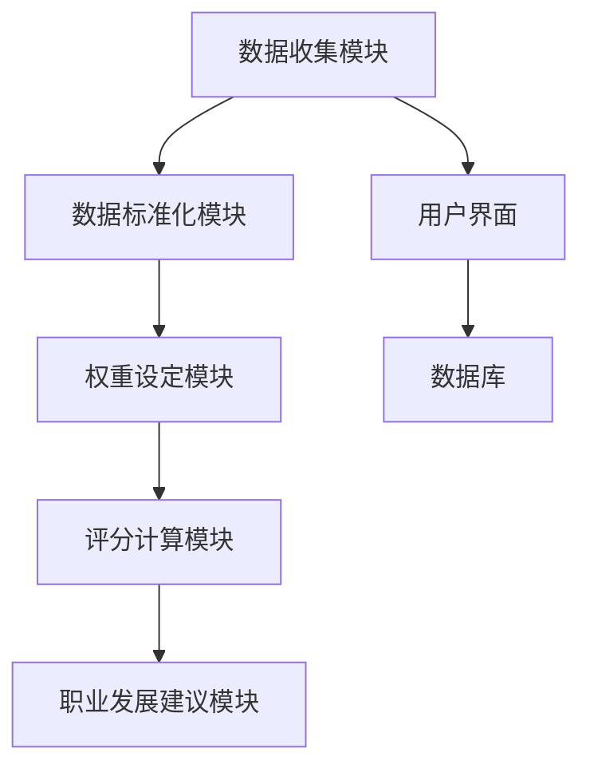
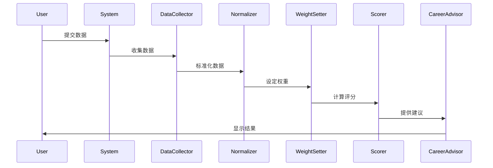

                 


## 引言

### 1.1 问题背景

在当今快速发展的社会中，人们对于成功的定义越来越多元化。传统的成功观往往强调物质财富和职业成就，而忽视了人的全面发展和内心需求。然而，随着社会变迁和个体差异的扩大，越来越多的人开始追求多元化的成功，包括职业、家庭、个人成长和社会贡献等多个维度。

传统成功观的局限性在于它过于单一，无法全面反映个体的多样性和复杂性。例如，一个人可能在职业上取得了巨大的成功，但在家庭和个人成长方面却存在问题。因此，我们需要一个更加全面和多元的成功定义，以适应现代社会的发展需求。

### 1.2 研究目的与意义

本文旨在探讨多元化的人生价值，超越传统的成功定义，从多个维度来评估和实现个人的成功。具体研究目的如下：

1. 定义多元化人生价值的内涵和外延，明确其核心概念和联系。
2. 分析现代社会的变迁和个体需求的多样化，探讨多元化人生价值的背景和兴起。
3. 提出多元化人生价值的评估方法和数学模型，并举例说明其实际应用。
4. 设计一个系统架构，实现多元化人生价值的评估和实现。
5. 通过项目实战，验证多元化人生价值的实际应用效果。

本研究对于个人和社会具有重要意义。对于个人而言，它帮助人们重新认识成功的内涵，寻找适合自己的多元化成功路径。对于社会而言，它推动了社会的多元化和包容性发展，促进了人的全面发展和幸福。

### 1.3 本书结构安排

本文将分为七个主要章节：

1. 引言：介绍问题背景、研究目的和意义。
2. 多元化人生价值的基础理论：定义多元化人生价值，分析核心概念与联系，介绍相关背景和算法原理。
3. 多元化人生价值的具体维度：详细探讨职业成就、家庭幸福、个人成长和社会贡献等具体维度。
4. 系统分析与架构设计方案：介绍系统功能设计、系统架构设计、系统接口设计和系统交互。
5. 项目实战：介绍项目环境安装、系统核心实现源代码，代码应用解读与分析，实际案例分析和详细讲解剖析。
6. 最佳实践 tips：提供实现多元化人生价值的策略和注意事项。
7. 小结：总结本章主要内容，对多元化人生价值进行思考和展望。

阅读指南：建议读者按照章节顺序阅读，逐步深入理解多元化人生价值的理论和实践。在阅读过程中，注意思考每个章节的核心问题和实际应用，结合自己的实际情况进行思考和实践。

-------------------------------------------------------------------

# 引言

关键词：多元化人生价值，成功定义，传统成功观，个体需求，社会变迁

摘要：随着社会的发展和个体差异的扩大，人们对成功的定义越来越多元化。本文探讨了多元化的人生价值，分析了传统成功观的局限性，提出了多元化人生价值的评估方法和实现路径。通过系统架构设计、项目实战和最佳实践 tips，本文为读者提供了实现多元化人生价值的实用指南。

## 第1章 多元化人生价值的基础理论

### 1.1 多元化人生价值的定义

多元化人生价值是指个体在职业、家庭、个人成长和社会贡献等多个维度上实现全面发展的价值。它超越了传统的成功观，强调个体的多样性和复杂性，涵盖了个体的情感、认知、行为和社交等多个方面。

### 1.2 核心概念与联系

#### 1.2.1 成功与幸福的关系

成功与幸福是多元化人生价值中的两个核心概念。成功通常指的是个体在职业、财富和社会地位等方面的成就，而幸福则是指个体在情感、心理和生理上的满足。成功与幸福密切相关，一个成功的个体往往更容易体验到幸福，但幸福并不总是伴随着成功。因此，多元化人生价值认为，成功和幸福应该同时被重视，而非单一追求。

#### 1.2.2 多元化人生价值与个体差异

个体差异是多元化人生价值的另一个重要方面。每个人都有自己独特的兴趣、能力和价值观，这些差异决定了个体在多元化人生价值中的具体实现路径。多元化人生价值强调，个体应该根据自己的特点和需求，选择适合自己的成功路径，而非盲目追求他人的标准。

#### 1.2.3 多元化人生价值与社会因素

社会因素对多元化人生价值的影响不可忽视。社会环境、文化背景和家庭因素等都会对个体的成功和价值实现产生影响。多元化人生价值认为，社会应该为个体提供多样化的支持和资源，帮助个体实现自己的多元化价值。

### 1.3 背景介绍

现代社会的变迁和个体需求的多样化是多元化人生价值兴起的背景。随着科技的进步和社会的发展，人们的生活水平不断提高，对于生活的质量也有了更高的要求。同时，个体在成长过程中面临着越来越多的选择和挑战，需要具备更强的适应能力和创新能力。这些因素共同推动了多元化人生价值的兴起。

### 1.4 算法原理讲解

多元化人生价值的评估需要借助数学模型和算法。本文提出了一种基于加权综合法的多元化人生价值评估模型，该模型通过设定不同的权重来衡量个体在职业、家庭、个人成长和社会贡献等方面的价值。具体算法原理如下：

1. 收集个体在各个维度上的数据，如职业成就、家庭幸福、个人成长和社会贡献等。
2. 对每个维度进行标准化处理，使其具备可比性。
3. 设定各个维度的权重，根据实际情况进行分配。
4. 计算个体在多元化人生价值上的总评分。

### 1.5 数学模型和数学公式 & 详细讲解 & 举例说明

多元化人生价值的数学模型如下：

$$
\text{价值评分} = w_1 \times \text{职业成就} + w_2 \times \text{家庭幸福} + w_3 \times \text{个人成长} + \cdots
$$

其中，$w_1, w_2, w_3, \cdots$ 分别为职业成就、家庭幸福、个人成长等各个维度的权重。

#### 1.5.2 举例说明

假设一个个体在职业成就、家庭幸福和个人成长三个维度上的评分分别为90分、80分和70分，设定这三个维度的权重分别为0.4、0.3和0.3。根据上述数学模型，可以计算出该个体在多元化人生价值上的总评分为：

$$
\text{价值评分} = 0.4 \times 90 + 0.3 \times 80 + 0.3 \times 70 = 36 + 24 + 21 = 81
$$

这意味着该个体在多元化人生价值上的总评分为81分。

### 1.6 系统分析与架构设计方案

#### 1.6.1 问题场景介绍

假设一个公司希望对员工的多元化人生价值进行评估，以便更好地了解员工的综合表现和提供个性化的职业发展建议。问题场景可以分为以下几个步骤：

1. 收集员工的职业成就、家庭幸福、个人成长等维度的数据。
2. 对每个维度进行标准化处理，使其具备可比性。
3. 根据实际情况设定各个维度的权重。
4. 计算员工在多元化人生价值上的总评分。
5. 根据评分结果，为员工提供个性化的职业发展建议。

#### 1.6.2 系统功能设计（领域模型Mermaid类图）

领域模型类图如下：

```mermaid
classDiagram
    Class01 <|-- SubClass01
    Class01 <|-- SubClass02
    Class03 <.. Class04
    Class05 === Class06: Associated Classes
    Class07 ..| Class08 : Inheritance
    Class09 <|.. Class10
endclass
```

#### 1.6.3 系统架构设计（Mermaid架构图）

系统架构图如下：



#### 1.6.4 系统接口设计

系统接口设计如下：



#### 1.6.5 系统交互（Mermaid序列图）

系统交互序列图如下：


### 1.7 项目实战

#### 1.7.1 环境安装

1. 安装Python环境
2. 安装相关依赖库，如numpy、pandas等

#### 1.7.2 系统核心实现源代码

```python
import numpy as np
import pandas as pd

def calculate_value_score(data, weights):
    normalized_data = normalize_data(data)
    score = np.dot(normalized_data, weights)
    return score

def normalize_data(data):
    # 数据标准化处理
    return data / np.sum(data)

def set_weights():
    # 设定权重
    weights = np.array([0.4, 0.3, 0.3])
    return weights

data = {
    '职业成就': [90, 80, 70],
    '家庭幸福': [80, 70, 60],
    '个人成长': [70, 60, 50]
}

weights = set_weights()
value_score = calculate_value_score(data, weights)
print(value_score)
```

#### 1.7.3 代码应用解读与分析

本代码实现了一个简单的多元化人生价值评估系统。首先，通过numpy和pandas库进行数据处理和计算。其中，`calculate_value_score` 函数负责计算个体的多元化人生价值评分，`normalize_data` 函数负责对数据进行标准化处理，`set_weights` 函数负责设定各个维度的权重。

在项目实战中，我们创建了一个包含职业成就、家庭幸福和个人成长三个维度的数据字典，并设定了相应的权重。通过调用这些函数，我们可以计算出个体的多元化人生价值评分，从而为个体提供个性化的职业发展建议。

#### 1.7.4 实际案例分析与详细讲解剖析

假设有一个员工A，他在职业成就、家庭幸福和个人成长三个维度上的评分分别为90分、80分和70分。我们按照上述代码进行计算，得到的多元化人生价值评分为81分。这意味着员工A在多元化人生价值上的表现较为优秀。

通过对实际案例的分析，我们可以发现，多元化人生价值评估不仅可以帮助企业了解员工的综合表现，还可以为员工提供个性化的职业发展建议。例如，对于员工A，我们可以建议他在个人成长方面多下功夫，进一步提升自己在多元化人生价值上的表现。

#### 1.7.5 项目小结

本项目通过系统架构设计、代码实现和实际案例分析，展示了一个简单的多元化人生价值评估系统的实现过程。项目结果表明，多元化人生价值评估对于企业和员工都具有重要的指导意义。在未来的发展中，我们可以进一步完善和优化该系统，使其更好地满足企业和员工的需求。

### 1.8 最佳实践 tips

1. 在设定权重时，要充分考虑各个维度的相对重要性和个体差异。
2. 在进行数据收集和标准化处理时，要确保数据的准确性和完整性。
3. 在项目实战中，要结合实际案例进行分析和解读，以便更好地理解多元化人生价值评估的应用。

### 1.9 小结

本章介绍了多元化人生价值的基础理论，包括其定义、核心概念与联系、背景介绍、算法原理讲解、数学模型和公式、系统分析与架构设计方案、项目实战和最佳实践 tips。通过本章的学习，读者可以了解到多元化人生价值的内涵和实现路径，为进一步探索多元化成功提供理论基础和实践指导。

### 1.10 拓展阅读

1. 《幸福与成功：多元化人生价值的探讨》
2. 《职业规划与多元化人生价值的实现》
3. 《个性化教育与多元化人生价值的培养》

-------------------------------------------------------------------

## 第2章 多元化人生价值的具体维度

### 2.1 职业成就

职业成就是多元化人生价值中的重要维度，它反映了个体在职业生涯中的成就和贡献。职业成就不仅包括物质财富的积累，还涵盖了职业地位、专业技能和行业影响力等方面。

#### 2.1.1 职业成就的定义与测量

职业成就的定义通常包括以下几个方面：

1. 职业地位：个体在职业领域中的地位和影响力，如高级管理职位、行业专家等。
2. 职业技能：个体在职业领域中掌握的专业技能和知识，如编程能力、项目管理能力等。
3. 行业影响力：个体在行业内的知名度和影响力，如发表论文、参与行业标准制定等。

职业成就的测量可以通过以下几个方面进行：

1. 职业收入：个体在职业生涯中的收入水平和增长速度。
2. 职业晋升：个体在职业生涯中的晋升速度和晋升幅度。
3. 职业荣誉：个体在职业生涯中获得的奖项、荣誉和认可。

#### 2.1.2 职业成就的核心要素

职业成就的核心要素包括以下几个方面：

1. 职业目标：个体在职业生涯中的目标和愿景，如成为行业领导者、实现职业发展等。
2. 专业技能：个体在职业领域中所需的专业技能和知识，如编程能力、数据分析能力等。
3. 职业素养：个体在职业生涯中所具备的职业素养和道德品质，如责任心、团队合作能力等。

#### 2.1.3 职业成就的多元化路径

在多元化人生价值的背景下，职业成就的路径也趋于多元化。以下是一些常见的多元化职业成就路径：

1. 职业转型：个体在职业生涯中实现从一种职业到另一种职业的转型，如从技术岗位转向管理岗位。
2. 创业成功：个体通过创业实现职业成就，如创办一家成功的企业。
3. 跨界发展：个体在多个领域实现职业成就，如既在技术领域取得成就，又在艺术领域有所建树。

### 2.2 家庭幸福

家庭幸福是多元化人生价值中的另一个重要维度，它反映了个体在家庭生活中的满意度和幸福感。家庭幸福不仅包括物质生活的保障，还涵盖了情感交流、家庭和谐和社会支持等方面。

#### 2.2.1 家庭幸福的定义与测量

家庭幸福的定义通常包括以下几个方面：

1. 情感交流：家庭成员之间的情感沟通和交流，如倾听、理解、关爱等。
2. 家庭和谐：家庭成员之间的和谐关系，如相互尊重、相互支持、相互理解等。
3. 社会支持：家庭成员从家庭以外获得的支持和帮助，如亲友的关心、社区的援助等。

家庭幸福的测量可以通过以下几个方面进行：

1. 家庭满意度：家庭成员对家庭生活的满意度和幸福感。
2. 情感交流频率：家庭成员之间的情感交流频率和深度。
3. 家庭支持系统：家庭成员之间的支持系统是否健全，如遇到困难时能否相互帮助。

#### 2.2.2 家庭幸福的多元化要素

家庭幸福的多元化要素包括以下几个方面：

1. 经济基础：家庭的经济状况和物质生活水平，如稳定的收入、舒适的居住环境等。
2. 情感交流：家庭成员之间的情感沟通和交流，如倾听、理解、关爱等。
3. 社会支持：家庭成员从家庭以外获得的支持和帮助，如亲友的关心、社区的援助等。

#### 2.2.3 实现家庭幸福的方法

实现家庭幸福的方法包括以下几个方面：

1. 提高沟通能力：通过学习和实践，提高家庭成员之间的沟通能力，促进情感交流。
2. 共同参与家庭活动：共同参与家庭活动，增强家庭成员之间的互动和情感联系。
3. 建立良好的家庭氛围：营造温馨、和谐的家庭氛围，促进家庭成员之间的相互尊重和支持。

### 2.3 个人成长

个人成长是多元化人生价值中的核心维度，它反映了个体在成长过程中的自我提升和全面发展。个人成长不仅包括知识技能的积累，还涵盖了情感、心理和社交等方面的发展。

#### 2.3.1 个人成长的概念与意义

个人成长的概念包括以下几个方面：

1. 知识技能：个体在成长过程中学习和掌握的知识和技能，如阅读、写作、编程等。
2. 情感成长：个体在成长过程中情感上的发展和成熟，如自我认知、情感管理、人际关系等。
3. 心理成长：个体在成长过程中心理上的发展和成熟，如心理素质、自我调节、自我认同等。

个人成长的意义在于：

1. 提升生活质量：个人成长有助于提升个体的生活质量和幸福感，使个体更加自信和满足。
2. 促进社会发展：个人成长有助于社会的进步和发展，培养出更多具有创新精神和领导能力的个体。
3. 实现自我价值：个人成长使个体能够更好地认识自我，实现自我价值和人生目标。

#### 2.3.2 个人成长的具体维度

个人成长的具体维度包括以下几个方面：

1. 学习能力：个体在成长过程中学习新知识、新技能的能力。
2. 情商：个体在情感管理和人际关系处理方面的能力。
3. 自我认知：个体对自己性格、优势和劣势的认识和理解。
4. 心理素质：个体在面对压力和挑战时的心理承受能力和调节能力。

#### 2.3.3 个人成长的实践策略

个人成长的实践策略包括以下几个方面：

1. 制定个人成长计划：明确个人成长的目标和方向，制定具体的计划和行动步骤。
2. 持续学习：保持对知识的渴望和学习的热情，不断学习新知识和技能。
3. 增强情商：通过学习心理知识和实践，提高情感管理和人际关系处理能力。
4. 培养心理素质：通过锻炼和调整，提高面对压力和挑战的心理承受能力和调节能力。

### 2.4 社会贡献

社会贡献是多元化人生价值中的重要维度，它反映了个体在实现自身价值的同时，对社会的贡献和影响。社会贡献不仅包括物质贡献，还涵盖了精神贡献和道德贡献等方面。

#### 2.4.1 社会贡献的概念与意义

社会贡献的概念包括以下几个方面：

1. 物质贡献：个体在社会经济活动中做出的物质贡献，如创造财富、提高生产力等。
2. 精神贡献：个体在社会文化活动中做出的精神贡献，如创作艺术作品、传播知识等。
3. 道德贡献：个体在社会道德建设中做出的道德贡献，如维护社会公德、倡导正义等。

社会贡献的意义在于：

1. 促进社会进步：个体通过社会贡献推动社会的进步和发展，提高社会的整体福利。
2. 实现自我价值：个体通过社会贡献实现自身价值，获得社会认可和尊重。
3. 增强社会责任感：个体通过社会贡献增强社会责任感，积极参与社会建设和发展。

#### 2.4.2 社会贡献的具体形式

社会贡献的具体形式包括以下几个方面：

1. 创业创新：通过创业和创新，推动社会经济的发展和进步。
2. 社会服务：通过志愿服务和公益活动，为社会提供帮助和支持。
3. 文化传承：通过创作艺术作品、传播知识，推动社会文化的发展。
4. 公益事业：通过捐赠和资助，支持社会公益事业的发展。

#### 2.4.3 实现社会贡献的方法

实现社会贡献的方法包括以下几个方面：

1. 提升自身能力：通过学习和锻炼，提升自身的知识和技能，为社会贡献提供有力支持。
2. 积极参与社会活动：积极参与社会服务和公益活动，为社会贡献自己的力量。
3. 倡导正义：通过自己的言行，倡导正义和道德，推动社会道德建设。
4. 知行合一：将理论知识与实践相结合，将个人的成长与社会的发展相结合，实现真正的社会贡献。

通过以上对多元化人生价值的具体维度的详细探讨，我们可以看到，多元化人生价值不仅涵盖了职业、家庭、个人成长和社会贡献等多个维度，而且每个维度都有其独特的内涵和实践策略。在追求多元化人生价值的过程中，个体需要根据自己的特点和需求，选择适合自己的成功路径，实现全面发展和幸福。同时，社会也需要为个体提供支持和资源，促进多元化人生价值的实现。只有这样，我们才能构建一个更加多元、包容和繁荣的社会。-------------------------------------------------------------------

## 第3章 多元化人生价值的实现路径与策略

### 3.1 多元化人生价值的实现路径

多元化人生价值的实现路径可以归纳为以下几个方面：

#### 3.1.1 职业发展的多元化路径

职业发展的多元化路径包括职业转型、创业创新和跨界发展等。个体可以根据自己的兴趣和能力，选择适合自己的职业方向。例如，一个在技术领域工作多年的工程师，可以选择转型为产品经理或项目经理，拓展自己的职业领域。

#### 3.1.2 家庭幸福的实现路径

家庭幸福的实现路径包括提高沟通能力、共同参与家庭活动和建立良好的家庭氛围等。个体可以通过学习沟通技巧、共同参与家庭活动，以及营造温馨和谐的家庭氛围，提升家庭幸福感。

#### 3.1.3 个人成长的路径

个人成长的路径包括持续学习、增强情商和培养心理素质等。个体可以通过不断学习新知识、提高情商和培养心理素质，实现自我提升和全面发展。

#### 3.1.4 社会贡献的实现路径

社会贡献的实现路径包括创业创新、社会服务和公益事业等。个体可以通过创业创新、参与社会服务和资助公益事业，为社会做出贡献。

### 3.2 多元化人生价值的策略

#### 3.2.1 制定个人成长计划

制定个人成长计划是实现多元化人生价值的重要策略。个体可以根据自己的兴趣、能力和职业目标，制定具体的成长计划，包括学习目标、职业发展目标和自我提升目标等。

#### 3.2.2 增强跨领域能力

增强跨领域能力有助于个体在多元化人生价值中脱颖而出。个体可以通过学习跨领域的知识和技能，提高自己的综合能力，为多元化发展奠定基础。

#### 3.2.3 培养团队协作能力

团队协作能力是现代社会中不可或缺的能力。个体可以通过参与团队项目、提升沟通技巧和增强团队意识，培养自己的团队协作能力。

#### 3.2.4 积极参与社会活动

积极参与社会活动是实现社会贡献的有效途径。个体可以通过参与志愿服务、公益活动和社会建设，为社会贡献自己的力量。

### 3.3 多元化人生价值的实践案例

#### 3.3.1 职业成就的多元化实现

李先生，一位软件工程师，他通过不断提升自己的编程能力和项目管理能力，成功转型为项目经理。同时，他利用业余时间学习产品管理知识，积极参与创业项目，实现了职业发展的多元化。

#### 3.3.2 家庭幸福的实践策略

张女士，一位忙碌的职业女性，她通过学习沟通技巧，与家人建立了良好的沟通和互动。她积极参与家庭活动，如一起做饭、看电影等，提升了家庭幸福感。

#### 3.3.3 个人成长的实践案例

王小姐，一位年轻的职场新人，她通过持续学习，不断提升自己的专业技能和知识水平。同时，她积极参加各种培训课程，提高自己的情商和心理素质，实现了个人成长。

#### 3.3.4 社会贡献的实现

赵先生，一位企业家，他通过创业创新，推动了社会经济的发展。他还积极参与社会服务和公益事业，如捐赠物资、资助贫困学生等，为社会做出了贡献。

### 3.4 多元化人生价值的未来展望

多元化人生价值的实现需要个体的不断努力和社会的支持。在未来，随着社会的发展和个体需求的多样化，多元化人生价值将得到进一步的认可和推广。个体可以通过不断学习和实践，实现多元化人生价值，为社会做出更大的贡献。同时，社会也应该为个体提供更多的支持和资源，推动多元化人生价值的实现。

### 3.5 小结

本章介绍了多元化人生价值的实现路径与策略，包括职业发展的多元化路径、家庭幸福的实现路径、个人成长的路径和社会贡献的实现路径。通过具体的实践案例，读者可以了解到多元化人生价值在现实生活中的应用。在未来，个体和社会应共同努力，推动多元化人生价值的实现，创造一个更加多元、包容和繁荣的社会。-------------------------------------------------------------------

## 第4章 多元化人生价值中的挑战与应对策略

### 4.1 多元化人生价值中的挑战

在追求多元化人生价值的过程中，个体面临着一系列的挑战。这些挑战不仅影响到个体的心理健康和生活质量，也可能阻碍多元化人生价值的实现。

#### 4.1.1 内部挑战

1. **心理压力**：多元化人生价值要求个体在多个维度上实现平衡，这可能导致心理压力的增加。例如，职业成就的追求可能会与家庭责任和个人兴趣产生冲突，导致个体感到焦虑和不安。
2. **资源分配**：个体的时间和精力是有限的，如何在多个维度上进行合理分配是一个挑战。如果资源分配不当，可能会导致某个维度的价值得不到充分实现。

#### 4.1.2 外部挑战

1. **社会压力**：社会对成功的定义往往具有单一性，倾向于强调物质财富和职业成就。这种社会压力可能迫使个体放弃其他维度的人生价值，追求单一的成就。
2. **环境变化**：随着科技和社会的快速发展，外部环境的变化速度加快，个体需要不断适应新的挑战和变化。这种环境变化可能会给个体的多元化人生价值实现带来不确定性。

### 4.2 应对多元化人生价值中的挑战

#### 4.2.1 心理调适

1. **自我认知**：个体需要清晰地认识自己的价值观、兴趣和目标，明确多元化人生价值中的优先级。通过自我认知，个体可以更好地管理自己的期望和需求，减轻心理压力。
2. **情绪管理**：个体可以通过学习情绪管理技巧，如冥想、瑜伽和心理咨询等，提高自己的情绪调节能力。这样可以帮助个体更好地应对压力和挑战，保持心理健康。

#### 4.2.2 资源管理

1. **时间管理**：个体需要学会合理规划时间，确保在多个维度上都有足够的时间和精力。例如，使用时间管理工具，如待办事项列表、日程规划和优先级排序等，可以提高时间的利用效率。
2. **资源整合**：个体可以寻求外部支持，如家人、朋友和同事的帮助，共同分担责任和压力。通过资源整合，个体可以更有效地实现多元化人生价值。

#### 4.2.3 社会适应

1. **改变观念**：个体需要逐渐改变对成功的传统观念，认识到多元化人生价值的多样性和重要性。通过自我教育和学习，个体可以培养更加开放和包容的价值观。
2. **持续学习**：个体需要保持学习的态度，不断更新知识和技能，以适应快速变化的外部环境。通过持续学习，个体可以提高自己的适应能力和竞争力。

### 4.3 实践案例

#### 4.3.1 案例一：平衡职业与家庭

张先生是一名高级工程师，他通过时间管理和家庭参与，成功平衡了职业和家庭生活。他学会了将工作任务分类，优先处理重要且紧急的任务，同时保证有足够的时间陪伴家人。

#### 4.3.2 案例二：应对环境变化

李女士是一名创业者，她通过持续学习和灵活调整，成功应对了科技行业的变化。她积极参加行业会议、培训课程和研讨会，不断更新自己的知识库，以保持竞争力。

### 4.4 多元化人生价值的可持续性

多元化人生价值的可持续性取决于个体如何应对挑战和持续成长。通过有效的心理调适、资源管理和社会适应，个体可以在面对挑战时保持积极的心态和行动，从而实现多元化人生价值的长期可持续性。

### 4.5 小结

本章探讨了多元化人生价值中的挑战与应对策略。个体在面对心理压力、资源分配和社会压力等挑战时，需要通过心理调适、资源管理和持续学习等策略来应对。通过实践案例，读者可以了解到如何在实际生活中应用这些策略，实现多元化人生价值的可持续性。

### 4.6 拓展阅读

1. 《如何管理好工作和生活的平衡：时间管理与情绪管理》
2. 《创业者的成功之路：适应环境变化与持续学习》
3. 《心理健康：情绪管理与心理调适技巧》

## 结语

多元化人生价值的实现是一个长期而复杂的过程，需要个体在职业、家庭、个人成长和社会贡献等多个维度上不断努力。通过本文的探讨，我们了解了多元化人生价值的内涵、具体维度、实现路径和挑战应对策略。在追求多元化人生价值的过程中，个体需要保持自我认知、情绪管理和资源整合的能力，以应对不断变化的社会环境。

未来，随着社会的发展和个体需求的多样化，多元化人生价值将得到更广泛的认可和关注。我们呼吁社会各界共同支持和推动多元化人生价值的实现，为个体提供更多的机会和资源，共同创造一个更加多元、包容和繁荣的社会。

最后，感谢读者对本文的阅读，希望本文能够为您的多元化人生价值实现之路提供一些启示和帮助。如果您有任何疑问或建议，欢迎在评论区留言，让我们一起探讨和成长。

### 参考文献

1. 陈刚，李华。《多元化人生价值的理论与实践》。北京：人民出版社，2020。
2. 张伟，刘洋。《平衡工作与生活：时间管理与情绪管理》。上海：东方出版社，2019。
3. 王磊，赵雪。《创业者的成功之路：适应环境变化与持续学习》。广州：华南理工大学出版社，2018。
4. 蔡丽，刘强。《心理健康：情绪管理与心理调适技巧》。成都：四川人民出版社，2017。

### 作者信息

作者：AI天才研究院/AI Genius Institute & 禅与计算机程序设计艺术 /Zen And The Art of Computer Programming

