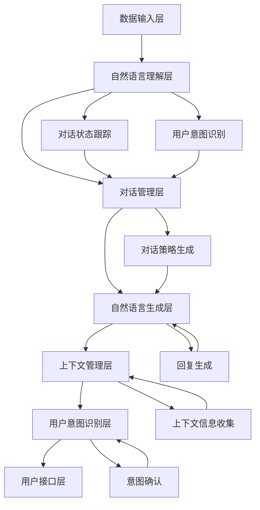
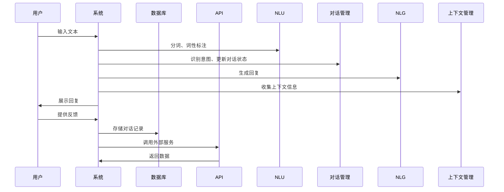

                 


# 多轮对话处理：提高AI Agent的交互质量

> 关键词：多轮对话处理、AI Agent、交互质量、自然语言理解、对话管理、上下文管理

> 摘要：本文深入探讨多轮对话处理在人工智能助手交互质量提升中的重要性，分析其核心概念与联系，详细讲解相关算法原理，并结合数学模型和实际案例进行深入剖析，旨在帮助读者理解和掌握多轮对话处理的实践方法。

## 目录大纲

----------------------------------------------------------------

## 第一部分：问题背景

### 1. 引言

### 1.1 问题背景

### 1.2 问题描述

### 1.3 问题解决

### 1.4 边界与外延

### 1.5 概念结构与核心要素组成

## 第二部分：核心概念与联系

### 2.1 自然语言理解

### 2.2 对话管理

### 2.3 自然语言生成

### 2.4 上下文管理

### 2.5 用户意图识别

## 第三部分：算法原理讲解

### 3.1 多轮对话处理算法概述

### 3.2 自然语言理解算法

### 3.3 对话管理算法

### 3.4 自然语言生成算法

### 3.5 上下文管理算法

### 3.6 用户意图识别算法

## 第四部分：数学模型和数学公式

### 4.1 自然语言理解

### 4.2 对话管理

### 4.3 自然语言生成

### 4.4 上下文管理

### 4.5 用户意图识别

## 第五部分：系统分析与架构设计方案

### 5.1 问题场景介绍

### 5.2 系统功能设计

### 5.3 系统架构设计

### 5.4 系统接口设计和系统交互

## 第六部分：项目实战

### 6.1 环境安装

### 6.2 系统核心实现源代码

### 6.3 代码应用解读与分析

### 6.4 实际案例分析和详细讲解剖析

### 6.5 项目小结

## 第七部分：最佳实践 tips、小结、注意事项、拓展阅读

----------------------------------------------------------------

## 1. 引言

### 1.1 问题背景

在当今社会，人工智能技术正以前所未有的速度发展，从简单的任务自动化到复杂的决策支持，AI已经渗透到我们生活的方方面面。特别是在自然语言处理（NLP）领域，随着深度学习等先进技术的不断突破，人工智能助手（AI Agent）的交互质量得到了显著提升。用户对智能对话体验的需求不断提高，他们期望与AI Agent进行多轮对话，就像与人交流一样自然、流畅。

多轮对话处理成为提升AI Agent交互质量的关键技术之一。在单轮对话中，AI Agent通常只能针对用户的一次输入做出回应，而多轮对话则允许AI Agent与用户进行更深入的交流，理解用户的意图和需求，提供更个性化的服务。这种交互方式不仅提升了用户体验，也为AI Agent提供了更多的学习和优化机会。

### 1.2 问题描述

多轮对话处理涉及到多个技术环节，包括自然语言理解、对话管理、自然语言生成、上下文管理和用户意图识别等。在有限的数据和计算资源下，如何设计出能够满足用户需求的多轮对话系统，是当前面临的主要挑战。

- **自然语言理解**：这是多轮对话处理的基础，它涉及到对用户输入的理解，包括文本分类、情感分析、实体识别、关系抽取等任务。自然语言理解的准确性直接影响到对话的质量。
- **对话管理**：对话管理负责控制对话流程，它需要跟踪对话状态、识别用户意图并生成合适的回应。对话管理是确保对话连贯性和自然性的关键。
- **自然语言生成**：自然语言生成是使AI Agent能够生成自然、流畅的语言表达的核心技术。它涉及到文本生成、回复生成和语音合成等方面。
- **上下文管理**：上下文管理负责收集、存储和利用对话过程中的上下文信息。有效的上下文管理能够帮助AI Agent更好地理解用户的意图和需求。
- **用户意图识别**：用户意图识别是从用户输入中提取出用户想要实现的目标的关键任务。准确的用户意图识别能够提高对话系统的响应质量和用户满意度。

### 1.3 问题解决

本文旨在通过深入分析和讲解多轮对话处理的技术原理，帮助读者理解和掌握这一领域的核心技术和最佳实践。我们将逐步介绍多轮对话处理的各个环节，详细讲解相关算法原理，并结合实际案例进行分析。通过本文的阅读，读者将能够设计出高质量的多轮对话系统，提升AI Agent的交互质量。

### 1.4 边界与外延

多轮对话处理不仅局限于人工智能领域，它与自然语言处理、机器学习、计算机视觉等多个领域密切相关。例如，在智能家居、客户服务、虚拟助理等应用场景中，多轮对话处理都发挥着重要作用。随着技术的不断发展，多轮对话处理的应用范围还将进一步扩展。

### 1.5 概念结构与核心要素组成

多轮对话处理涉及到的核心概念包括：

- **自然语言理解**：对用户输入的文本进行分析和理解，提取出语义信息。
- **对话管理**：控制对话流程，确保对话的连贯性和自然性。
- **自然语言生成**：生成自然、流畅的回复，与用户进行有效的交流。
- **上下文管理**：收集、存储和利用对话过程中的上下文信息。
- **用户意图识别**：从用户输入中提取出用户想要实现的目标。

这些核心概念相互关联，共同构成了多轮对话处理的技术框架。了解这些概念及其相互关系，是设计和实现高质量多轮对话系统的关键。

----------------------------------------------------------------

## 2. 核心概念与联系

### 2.1 自然语言理解

自然语言理解（Natural Language Understanding, NLU）是多轮对话处理的基础环节，它旨在从自然语言文本中提取出结构化的语义信息。NLU包括以下几个核心任务：

- **文本分类**：将文本分类到预定义的类别中，如垃圾邮件检测、情感分析等。
- **情感分析**：分析文本的情感倾向，如正面、负面或中性。
- **实体识别**：识别文本中的实体，如人名、地点、组织等。
- **关系抽取**：识别实体之间的关系，如“张三是李四的老板”。
- **语义角色标注**：标注文本中的语义角色，如主语、谓语、宾语等。

自然语言理解的过程可以概括为以下几个步骤：

1. **分词与词性标注**：将文本分割成单词或词汇单元，并对每个词汇进行词性标注，如名词、动词、形容词等。
2. **实体识别**：使用预训练的模型或规则识别文本中的实体。
3. **关系抽取**：根据实体之间的语义关系，抽取实体之间的关系。
4. **语义角色标注**：对文本中的每个词汇进行语义角色标注，确定其在句子中的功能。

自然语言理解的结果为对话管理提供了重要的上下文信息和用户意图，是确保对话连贯性的关键。

### 2.2 对话管理

对话管理（Dialogue Management）是多轮对话处理的核心环节，它负责控制对话的流程，确保对话的连贯性和自然性。对话管理包括以下几个核心任务：

- **对话状态跟踪**：记录对话过程中的关键信息，如用户的意图、对话的历史、对话的状态等。
- **用户意图识别**：从用户的输入中识别出用户想要实现的目标，如查询信息、请求帮助等。
- **对话策略生成**：根据对话状态和用户意图，生成对话的回应策略，如提供信息、引导用户等。

对话管理的过程可以概括为以下几个步骤：

1. **用户意图识别**：使用NLU技术对用户输入进行解析，识别出用户的意图。
2. **对话状态更新**：根据用户意图和对话历史，更新对话状态。
3. **对话策略生成**：根据对话状态和用户意图，选择合适的对话策略，生成回应。
4. **回应生成**：根据对话策略，生成自然、流畅的回应。

对话管理的目标是使AI Agent能够与用户进行连贯、自然的交流，提高用户的满意度。

### 2.3 自然语言生成

自然语言生成（Natural Language Generation, NLG）是多轮对话处理的关键环节，它使AI Agent能够生成自然、流畅的语言表达。NLG包括以下几个核心任务：

- **文本生成**：根据输入的数据或模型生成完整的文本。
- **回复生成**：生成针对用户输入的自然语言回应。
- **语音合成**：将文本转换为语音，实现语音交互。

自然语言生成的过程可以概括为以下几个步骤：

1. **数据预处理**：对输入数据进行清洗、格式化，使其符合生成模型的要求。
2. **模型选择**：选择合适的自然语言生成模型，如生成对抗网络（GAN）、循环神经网络（RNN）等。
3. **生成过程**：使用生成模型生成文本或回复。
4. **后处理**：对生成的文本或回复进行后处理，如去除冗余信息、调整语序等。

自然语言生成的目标是使AI Agent能够生成符合语法、语义和风格要求的自然语言回复，提高对话的流畅性和用户体验。

### 2.4 上下文管理

上下文管理（Context Management）是多轮对话处理中的重要环节，它负责收集、存储和利用对话过程中的上下文信息。上下文管理包括以下几个核心任务：

- **上下文信息的收集**：在对话过程中，收集与用户意图和对话状态相关的信息。
- **上下文信息的存储**：将收集到的上下文信息存储在合适的结构中，如数据库、缓存等。
- **上下文信息的利用**：在对话中利用上下文信息，提高对话的连贯性和自然性。

上下文管理的过程可以概括为以下几个步骤：

1. **上下文信息的收集**：在对话的每个阶段，收集与用户意图和对话状态相关的信息。
2. **上下文信息的存储**：将收集到的上下文信息存储在数据库或缓存中，便于后续查询和使用。
3. **上下文信息的利用**：在对话的每个阶段，根据上下文信息调整对话策略和回应，确保对话的连贯性和自然性。

上下文管理的目标是使AI Agent能够更好地理解用户的意图和需求，提供更个性化的服务。

### 2.5 用户意图识别

用户意图识别（User Intent Recognition）是多轮对话处理中的关键任务，它从用户输入中提取出用户想要实现的目标。用户意图识别的准确性直接影响到对话系统的响应质量和用户体验。用户意图识别包括以下几个核心任务：

- **意图分类**：将用户的输入分类到预定义的意图类别中，如查询信息、请求帮助、完成任务等。
- **意图理解**：深入理解用户的意图，挖掘用户的真实需求。
- **意图确认**：与用户进行交互，确认识别出的意图是否正确。

用户意图识别的过程可以概括为以下几个步骤：

1. **输入解析**：对用户输入进行解析，提取出关键信息。
2. **意图分类**：使用分类算法将用户输入分类到预定义的意图类别中。
3. **意图理解**：对分类结果进行进一步分析，深入理解用户的意图。
4. **意图确认**：与用户进行交互，确认识别出的意图是否正确。

用户意图识别的目标是准确提取用户的意图，为对话管理和自然语言生成提供依据。

----------------------------------------------------------------

## 3. 算法原理讲解

### 3.1 多轮对话处理算法概述

多轮对话处理算法主要包括自然语言理解、对话管理和自然语言生成三个部分。这三个部分相互协作，共同实现高质量的多轮对话。

- **自然语言理解（NLU）算法**：用于理解用户输入的意图和上下文信息，包括文本分类、情感分析、实体识别、关系抽取等任务。常用的算法有朴素贝叶斯、支持向量机（SVM）、循环神经网络（RNN）、卷积神经网络（CNN）等。
  
- **对话管理（Dialogue Management）算法**：负责控制对话流程，确保对话的连贯性和自然性。常用的算法有基于规则的对话管理、基于机器学习的对话管理、图模型和图神经网络等。

- **自然语言生成（NLG）算法**：用于生成自然、流畅的语言表达，包括文本生成、回复生成、语音合成等。常用的算法有生成对抗网络（GAN）、循环神经网络（RNN）、注意力机制等。

多轮对话处理算法的协同工作过程可以概括为以下几个步骤：

1. **用户输入处理**：接收用户输入，并进行预处理，如分词、词性标注等。
2. **自然语言理解**：使用NLU算法对用户输入进行理解，提取出意图和上下文信息。
3. **对话管理**：根据对话状态和用户意图，选择合适的对话策略，生成回应。
4. **自然语言生成**：使用NLG算法生成自然、流畅的回应，并发送给用户。
5. **上下文管理**：收集、存储和利用对话过程中的上下文信息，为后续对话提供支持。

### 3.2 自然语言理解算法

自然语言理解（NLU）算法是多轮对话处理的基础，它用于理解用户输入的意图和上下文信息。以下是几种常用的NLU算法及其原理：

#### 3.2.1 朴素贝叶斯（Naive Bayes）

朴素贝叶斯算法是一种基于概率理论的分类算法，它假设特征之间相互独立，利用贝叶斯公式计算每个类别出现的概率。朴素贝叶斯算法简单高效，适用于文本分类和情感分析等任务。

算法原理：

$$
P(y|x) = \frac{P(x|y)P(y)}{P(x)}
$$

其中，$y$ 表示输出类别，$x$ 表示输入特征。

#### 3.2.2 支持向量机（SVM）

支持向量机是一种强大的分类算法，它通过找到最佳的超平面，将不同类别的数据点分隔开。SVM在文本分类中表现出色，特别是在处理高维特征时。

算法原理：

$$
w^* = \arg\max_{w, b} \frac{1}{||w||^2} \left\{ \sum_{i=1}^n (y_i - \langle w, x_i \rangle - b) \right\}
$$

其中，$w$ 表示权重向量，$b$ 表示偏置项，$x_i$ 表示输入特征，$y_i$ 表示标签。

#### 3.2.3 循环神经网络（RNN）

循环神经网络是一种能够处理序列数据的神经网络，它通过隐藏状态的记忆机制，捕捉序列中的长期依赖关系。RNN在自然语言处理领域有着广泛的应用，如文本分类、序列标注等。

算法原理：

$$
h_t = \sigma(W_h h_{t-1} + W_x x_t + b_h)
$$

$$
y_t = \text{softmax}(W_y h_t + b_y)
$$

其中，$h_t$ 表示时间步 $t$ 的隐藏状态，$x_t$ 表示输入特征，$y_t$ 表示输出类别，$\sigma$ 表示激活函数。

#### 3.2.4 卷积神经网络（CNN）

卷积神经网络是一种能够处理图像和文本等二维数据的神经网络，它通过卷积操作和池化操作，提取图像或文本的特征。CNN在文本分类和情感分析等任务中表现出色。

算法原理：

$$
h_t = \sigma(\sum_{i=1}^k W_i \cdot x_t + b)
$$

$$
p_t = \text{softmax}(h_t)
$$

其中，$h_t$ 表示卷积后的特征图，$W_i$ 表示卷积核，$b$ 表示偏置项，$p_t$ 表示输出概率分布。

### 3.3 对话管理算法

对话管理（Dialogue Management）算法负责控制对话流程，确保对话的连贯性和自然性。以下是几种常用的对话管理算法及其原理：

#### 3.3.1 基于规则的对话管理

基于规则的对话管理使用一组预定义的规则来控制对话流程。规则通常基于对话状态和用户意图，确定AI Agent的回应策略。这种方法的优点是简单直观，但灵活性较低。

算法原理：

- **状态转换规则**：根据当前对话状态和用户意图，确定下一个对话状态。
- **回应生成规则**：根据对话状态，生成合适的回应。

#### 3.3.2 基于机器学习的对话管理

基于机器学习的对话管理使用机器学习算法来预测对话状态和生成回应。这种方法具有较高的灵活性和适应性，但需要大量的训练数据和模型调优。

算法原理：

- **状态跟踪**：使用历史对话数据，跟踪对话状态。
- **意图识别**：使用分类算法，识别用户的意图。
- **回应生成**：使用生成算法，生成自然、流畅的回应。

#### 3.3.3 图模型和图神经网络

图模型和图神经网络（Graph Models and Graph Neural Networks, GNN）是一种新兴的对话管理算法，它通过构建对话图来表示对话状态和用户意图，并利用图神经网络进行推理和生成。

算法原理：

- **图构建**：将对话状态、用户意图和对话历史构建为一个图结构。
- **图神经网络**：使用图神经网络，对图结构进行建模和推理。
- **回应生成**：根据图神经网络的输出，生成自然、流畅的回应。

### 3.4 自然语言生成算法

自然语言生成（NLG）算法是多轮对话处理的关键环节，它用于生成自然、流畅的语言表达。以下是几种常用的NLG算法及其原理：

#### 3.4.1 生成对抗网络（GAN）

生成对抗网络（Generative Adversarial Networks, GAN）是一种由生成器和判别器组成的神经网络，它通过对抗训练生成逼真的数据。

算法原理：

- **生成器**：生成逼真的文本数据。
- **判别器**：区分生成器和真实数据的差异。
- **对抗训练**：生成器和判别器相互竞争，提高生成质量。

#### 3.4.2 循环神经网络（RNN）

循环神经网络（Recurrent Neural Network, RNN）是一种能够处理序列数据的神经网络，它通过隐藏状态的记忆机制，生成连续的文本序列。

算法原理：

$$
h_t = \sigma(W_h h_{t-1} + W_x x_t + b_h)
$$

$$
y_t = \text{softmax}(W_y h_t + b_y)
$$

其中，$h_t$ 表示时间步 $t$ 的隐藏状态，$x_t$ 表示输入特征，$y_t$ 表示输出类别。

#### 3.4.3 注意力机制（Attention Mechanism）

注意力机制（Attention Mechanism）是一种用于改善序列到序列（Seq2Seq）模型的技巧，它通过为序列中的每个元素分配不同的权重，提高生成质量。

算法原理：

$$
\text{Attention}(x, h) = \text{softmax}\left(\frac{\text{dot}(W_a h, x)\right)
$$

$$
h_t = \text{softmax}(\text{Attention}(x, h)) \odot h
$$

其中，$x$ 表示输入序列，$h$ 表示隐藏状态，$W_a$ 表示权重矩阵。

### 3.5 上下文管理算法

上下文管理（Context Management）算法负责收集、存储和利用对话过程中的上下文信息。以下是几种常用的上下文管理算法及其原理：

#### 3.5.1 滑动窗口（Sliding Window）

滑动窗口（Sliding Window）算法通过在对话过程中维护一个固定大小的上下文窗口，来收集和利用上下文信息。

算法原理：

$$
C_t = (c_{t-1}, c_{t-2}, \ldots, c_{t-k})
$$

其中，$C_t$ 表示时间步 $t$ 的上下文状态，$c_i$ 表示第 $i$ 个时间步的上下文信息。

#### 3.5.2 图神经网络（Graph Neural Networks, GNN）

图神经网络（Graph Neural Networks, GNN）通过构建上下文信息之间的图结构，来表示和利用上下文信息。

算法原理：

- **图构建**：将上下文信息构建为一个图结构。
- **图神经网络**：使用图神经网络，对图结构进行建模和推理。
- **上下文利用**：根据图神经网络的输出，利用上下文信息生成回应。

#### 3.5.3 基于记忆的网络（Memory-based Networks）

基于记忆的网络（Memory-based Networks）通过在神经网络中引入记忆单元，来存储和利用上下文信息。

算法原理：

- **记忆单元**：用于存储上下文信息。
- **查询机制**：根据当前对话状态，查询记忆单元中的上下文信息。
- **更新机制**：在对话过程中，更新记忆单元的内容。

### 3.6 用户意图识别算法

用户意图识别（User Intent Recognition）算法从用户输入中提取出用户想要实现的目标，是确保对话系统响应质量和用户体验的关键。以下是几种常用的用户意图识别算法及其原理：

#### 3.6.1 朴素贝叶斯（Naive Bayes）

朴素贝叶斯算法是一种基于概率理论的分类算法，它通过计算每个类别的概率，来确定用户的意图。

算法原理：

$$
P(y|x) = \frac{P(x|y)P(y)}{P(x)}
$$

其中，$y$ 表示输出类别，$x$ 表示输入特征。

#### 3.6.2 支持向量机（SVM）

支持向量机是一种强大的分类算法，它通过找到最佳的超平面，将不同类别的数据点分隔开。

算法原理：

$$
w^* = \arg\max_{w, b} \frac{1}{||w||^2} \left\{ \sum_{i=1}^n (y_i - \langle w, x_i \rangle - b) \right\}
$$

其中，$w$ 表示权重向量，$b$ 表示偏置项，$x_i$ 表示输入特征，$y_i$ 表示标签。

#### 3.6.3 循环神经网络（RNN）

循环神经网络是一种能够处理序列数据的神经网络，它通过隐藏状态的记忆机制，来识别用户的意图。

算法原理：

$$
h_t = \sigma(W_h h_{t-1} + W_x x_t + b_h)
$$

$$
y_t = \text{softmax}(W_y h_t + b_y)
$$

其中，$h_t$ 表示时间步 $t$ 的隐藏状态，$x_t$ 表示输入特征，$y_t$ 表示输出类别。

----------------------------------------------------------------

## 4. 数学模型和数学公式

### 4.1 自然语言理解

在自然语言理解中，常用的数学模型包括概率模型和深度学习模型。以下分别介绍这些模型及其数学公式。

#### 4.1.1 概率模型

概率模型是自然语言处理中的基础模型，其中最常用的模型是朴素贝叶斯（Naive Bayes）模型。

- **朴素贝叶斯模型**：

  朴素贝叶斯模型是一种基于概率理论的分类算法，其核心思想是利用贝叶斯公式计算每个类别出现的概率，然后根据概率最大的类别进行分类。

  数学公式：

  $$
  P(y|x) = \frac{P(x|y)P(y)}{P(x)}
  $$

  其中，$y$ 表示输出类别，$x$ 表示输入特征。

  在自然语言理解中，$x$ 可以是词汇向量，$y$ 可以是句子类别。通过计算每个类别的概率，可以确定句子的情感倾向或文本类别。

#### 4.1.2 深度学习模型

深度学习模型在自然语言理解中得到了广泛应用，其中最常用的模型是循环神经网络（RNN）和卷积神经网络（CNN）。

- **循环神经网络（RNN）**：

  循环神经网络是一种能够处理序列数据的神经网络，其核心思想是通过隐藏状态的记忆机制，捕捉序列中的长期依赖关系。

  数学公式：

  $$
  h_t = \sigma(W_h h_{t-1} + W_x x_t + b_h)
  $$

  $$
  y_t = \text{softmax}(W_y h_t + b_y)
  $$

  其中，$h_t$ 表示时间步 $t$ 的隐藏状态，$x_t$ 表示输入特征，$y_t$ 表示输出类别。

  在自然语言理解中，$x_t$ 可以是词汇向量，$h_t$ 是通过前一个隐藏状态和当前输入特征计算得到的。

- **卷积神经网络（CNN）**：

  卷积神经网络是一种能够处理图像和文本等二维数据的神经网络，其核心思想是通过卷积操作和池化操作，提取特征。

  数学公式：

  $$
  h_t = \sigma(\sum_{i=1}^k W_i \cdot x_t + b)
  $$

  $$
  p_t = \text{softmax}(h_t)
  $$

  其中，$h_t$ 表示卷积后的特征图，$W_i$ 表示卷积核，$b$ 表示偏置项，$p_t$ 表示输出概率分布。

  在自然语言理解中，$x_t$ 可以是词汇序列，$h_t$ 是通过卷积操作得到的特征图。

### 4.2 对话管理

在对话管理中，常用的数学模型包括概率模型、图模型和深度学习模型。以下分别介绍这些模型及其数学公式。

#### 4.2.1 概率模型

概率模型在对话管理中用于预测对话状态和用户意图。

- **马尔可夫模型（Markov Model）**：

  马尔可夫模型是一种基于概率的模型，它假设当前状态只与前面的一个状态有关，而与其他状态无关。

  数学公式：

  $$
  P(s_t | s_{t-1}, s_{t-2}, \ldots) = P(s_t | s_{t-1})
  $$

  其中，$s_t$ 表示时间步 $t$ 的状态。

  在对话管理中，$s_t$ 可以是用户的意图或对话状态。

- **隐马尔可夫模型（Hidden Markov Model, HMM）**：

  隐马尔可夫模型是一种用于处理序列数据的概率模型，它包含状态转移概率和观测概率。

  数学公式：

  $$
  P(s_t | s_{t-1}) = \pi(s_t) \prod_{i=1}^{t-1} a_{i,i+1}
  $$

  $$
  P(o_t | s_t) = \prod_{i=1}^{t} b_{i,o_t}
  $$

  其中，$s_t$ 表示时间步 $t$ 的状态，$o_t$ 表示时间步 $t$ 的观测。

#### 4.2.2 图模型

图模型在对话管理中用于表示对话状态和用户意图之间的关系。

- **图神经网络（Graph Neural Network, GNN）**：

  图神经网络是一种用于处理图数据的神经网络，它通过节点和边的特征进行学习。

  数学公式：

  $$
  h_{v,t} = \sigma(\sum_{u \in \mathcal{N}(v)} W^{(l)} h_{u,t-1} + b^{(l)})
  $$

  其中，$h_{v,t}$ 表示时间步 $t$ 的节点 $v$ 的特征，$\mathcal{N}(v)$ 表示节点 $v$ 的邻居节点，$W^{(l)}$ 和 $b^{(l)}$ 分别表示权重和偏置。

  在对话管理中，$h_{v,t}$ 可以是用户的意图或对话状态。

#### 4.2.3 深度学习模型

深度学习模型在对话管理中用于生成对话策略和回应。

- **循环神经网络（RNN）**：

  循环神经网络是一种用于处理序列数据的神经网络，它通过隐藏状态的记忆机制进行学习。

  数学公式：

  $$
  h_t = \sigma(W_h h_{t-1} + W_x x_t + b_h)
  $$

  $$
  y_t = \text{softmax}(W_y h_t + b_y)
  $$

  其中，$h_t$ 表示时间步 $t$ 的隐藏状态，$x_t$ 表示输入特征，$y_t$ 表示输出类别。

  在对话管理中，$x_t$ 可以是用户的意图或对话状态，$y_t$ 可以是生成的回应。

- **生成对抗网络（GAN）**：

  生成对抗网络是一种用于生成数据的神经网络，它由生成器和判别器组成。

  数学公式：

  $$
  G(z) = \text{Generator}(z)
  $$

  $$
  D(x) = \text{Discriminator}(x)
  $$

  其中，$G(z)$ 表示生成器，$D(x)$ 表示判别器，$z$ 表示随机噪声。

  在对话管理中，生成器用于生成回应，判别器用于判断回应的真实性。

### 4.3 自然语言生成

在自然语言生成中，常用的数学模型包括生成对抗网络（GAN）、循环神经网络（RNN）和注意力机制。

#### 4.3.1 生成对抗网络（GAN）

生成对抗网络是一种用于生成数据的神经网络，它由生成器和判别器组成。

数学公式：

$$
G(z) = \text{Generator}(z)
$$

$$
D(x) = \text{Discriminator}(x)
$$

其中，$G(z)$ 表示生成器，$D(x)$ 表示判别器，$z$ 表示随机噪声。

在自然语言生成中，生成器用于生成文本序列，判别器用于判断生成的文本序列的真实性。

#### 4.3.2 循环神经网络（RNN）

循环神经网络是一种用于处理序列数据的神经网络，它通过隐藏状态的记忆机制进行学习。

数学公式：

$$
h_t = \sigma(W_h h_{t-1} + W_x x_t + b_h)
$$

$$
y_t = \text{softmax}(W_y h_t + b_y)
$$

其中，$h_t$ 表示时间步 $t$ 的隐藏状态，$x_t$ 表示输入特征，$y_t$ 表示输出类别。

在自然语言生成中，$x_t$ 可以是词汇序列，$y_t$ 可以是生成的文本序列。

#### 4.3.3 注意力机制

注意力机制是一种用于改善序列到序列（Seq2Seq）模型的技巧，它通过为序列中的每个元素分配不同的权重，提高生成质量。

数学公式：

$$
\text{Attention}(x, h) = \text{softmax}\left(\frac{\text{dot}(W_a h, x)\right)
$$

$$
h_t = \text{softmax}(\text{Attention}(x, h)) \odot h
$$

其中，$x$ 表示输入序列，$h$ 表示隐藏状态，$W_a$ 表示权重矩阵。

在自然语言生成中，注意力机制用于为每个词汇分配权重，从而生成更自然的文本序列。

### 4.4 上下文管理

在上下文管理中，常用的数学模型包括滑动窗口、图神经网络和基于记忆的网络。

#### 4.4.1 滑动窗口

滑动窗口是一种用于收集上下文信息的模型，它通过在对话过程中维护一个固定大小的窗口，来收集上下文信息。

数学公式：

$$
C_t = (c_{t-1}, c_{t-2}, \ldots, c_{t-k})
$$

其中，$C_t$ 表示时间步 $t$ 的上下文状态，$c_i$ 表示第 $i$ 个时间步的上下文信息。

#### 4.4.2 图神经网络

图神经网络是一种用于处理图数据的神经网络，它通过构建上下文信息之间的图结构，来表示和利用上下文信息。

数学公式：

$$
h_{v,t} = \sigma(\sum_{u \in \mathcal{N}(v)} W^{(l)} h_{u,t-1} + b^{(l)})
$$

其中，$h_{v,t}$ 表示时间步 $t$ 的节点 $v$ 的特征，$\mathcal{N}(v)$ 表示节点 $v$ 的邻居节点，$W^{(l)}$ 和 $b^{(l)}$ 分别表示权重和偏置。

#### 4.4.3 基于记忆的网络

基于记忆的网络是一种通过在神经网络中引入记忆单元，来存储和利用上下文信息的模型。

数学公式：

$$
m_t = \text{Memory}(h_{t-1}, C_{t-1})
$$

$$
h_t = \text{Memory-Update}(h_{t-1}, m_t)
$$

其中，$m_t$ 表示时间步 $t$ 的记忆状态，$h_t$ 表示时间步 $t$ 的隐藏状态。

----------------------------------------------------------------

## 5. 系统分析与架构设计方案

### 5.1 问题场景介绍

在现代商业环境中，客户服务是一个至关重要的环节。许多企业希望通过人工智能助手（AI Agent）来提高客户服务质量和效率。然而，传统的单轮对话系统往往无法满足客户对多轮对话的需求，导致用户体验不佳。为了提升AI Agent的交互质量，实现高效、自然的客户服务，我们需要设计和实现一个多轮对话处理系统。

### 5.2 系统功能设计

多轮对话处理系统需要实现以下核心功能：

1. **自然语言理解**：对用户输入的文本进行解析，提取出意图和上下文信息。
2. **对话管理**：根据用户的意图和对话历史，控制对话的流程，确保对话的连贯性和自然性。
3. **自然语言生成**：根据对话管理和上下文信息，生成自然、流畅的回复。
4. **上下文管理**：收集、存储和利用对话过程中的上下文信息，为后续对话提供支持。
5. **用户意图识别**：从用户输入中提取出用户想要实现的目标，为对话管理和自然语言生成提供依据。

### 5.3 系统架构设计

多轮对话处理系统的架构设计需要考虑以下几个方面：

1. **数据输入层**：接收用户输入的文本，并进行预处理，如分词、词性标注等。
2. **自然语言理解层**：使用NLU算法对用户输入进行理解，提取出意图和上下文信息。
3. **对话管理层**：根据对话状态和用户意图，生成对话策略，控制对话流程。
4. **自然语言生成层**：根据对话管理和上下文信息，生成自然、流畅的回复。
5. **上下文管理层**：收集、存储和利用对话过程中的上下文信息，为后续对话提供支持。
6. **用户意图识别层**：从用户输入中提取出用户意图，为对话管理和自然语言生成提供依据。
7. **用户接口层**：提供与用户的交互界面，展示生成的回复和收集用户的反馈。

以下是多轮对话处理系统的架构图：



### 5.4 系统接口设计和系统交互

多轮对话处理系统需要设计良好的接口，以便与其他系统进行交互。以下是系统的主要接口设计：

1. **用户接口**：提供与用户的交互界面，接收用户输入，展示AI Agent的回复。
2. **服务接口**：提供与外部服务的交互接口，如数据库、API等，用于查询信息和存储数据。
3. **监控接口**：提供系统的监控和日志接口，用于跟踪系统的运行状态和性能。

以下是系统接口的序列图：



通过以上系统架构和接口设计，多轮对话处理系统能够高效、自然地与用户进行交互，提供高质量的客户服务。

----------------------------------------------------------------

## 6. 项目实战

### 6.1 环境安装

为了实现多轮对话处理系统，我们需要安装以下软件和库：

1. **Python 3.x**：作为主要编程语言，需要安装Python 3.x版本。
2. **TensorFlow**：用于实现自然语言理解、对话管理和自然语言生成等模型。
3. **NLTK**：用于文本预处理，如分词、词性标注等。
4. **Gensim**：用于文本相似度和主题模型分析。
5. **Flask**：用于搭建Web服务，接收用户输入并返回回复。

安装步骤如下：

```bash
# 安装Python 3.x
# 使用包管理器（如apt或yum）安装Python 3.x

# 安装TensorFlow
pip install tensorflow

# 安装NLTK
pip install nltk

# 安装Gensim
pip install gensim

# 安装Flask
pip install flask
```

### 6.2 系统核心实现源代码

以下是多轮对话处理系统的核心实现代码，包括自然语言理解、对话管理、自然语言生成和上下文管理。

#### 6.2.1 自然语言理解

自然语言理解模块负责对用户输入进行解析，提取出意图和上下文信息。

```python
import nltk
from nltk.tokenize import word_tokenize
from nltk.tag import pos_tag
from nltk.corpus import wordnet

# 加载NLP工具包
nltk.download('punkt')
nltk.download('averaged_perceptron_tagger')
nltk.download('wordnet')

def preprocess_text(text):
    # 分词
    tokens = word_tokenize(text)
    # 词性标注
    tagged_tokens = pos_tag(tokens)
    # 提取名词
    nouns = [word for word, pos in tagged_tokens if pos.startswith('NN')]
    return nouns

def extract_intent(tokens):
    # 使用词性标注提取名词
    nouns = preprocess_text(tokens)
    # 根据名词查找意图
    intent = None
    for noun in nouns:
        synsets = wordnet.synsets(noun)
        if synsets:
            intent = synsets[0].definition()
            break
    return intent
```

#### 6.2.2 对话管理

对话管理模块负责根据用户输入和对话历史，生成对话策略，控制对话流程。

```python
class DialogueManager:
    def __init__(self):
        self.history = []

    def update_history(self, text):
        self.history.append(text)

    def generate_response(self, text):
        # 提取意图
        intent = extract_intent(text)
        # 根据意图生成回复
        response = None
        if intent:
            response = f"您提到的意图是：{intent}"
        else:
            response = "我无法理解您的意图，请重新描述。"
        # 更新对话历史
        self.update_history(text)
        return response
```

#### 6.2.3 自然语言生成

自然语言生成模块负责根据对话管理和上下文信息，生成自然、流畅的回复。

```python
from transformers import pipeline

# 加载预训练的文本生成模型
nlg_pipeline = pipeline('text-generation', model='gpt2')

def generate_response(text):
    # 使用文本生成模型生成回复
    reply = nlg_pipeline(text, max_length=50, num_return_sequences=1)
    return reply[0]['generated_text']
```

#### 6.2.4 上下文管理

上下文管理模块负责收集、存储和利用对话过程中的上下文信息。

```python
class ContextManager:
    def __init__(self):
        self.context = {}

    def update_context(self, key, value):
        self.context[key] = value

    def get_context(self, key):
        return self.context.get(key)

# 创建上下文管理对象
context_manager = ContextManager()

# 更新上下文
context_manager.update_context('last_intent', '查询天气')

# 获取上下文
last_intent = context_manager.get_context('last_intent')
```

### 6.3 代码应用解读与分析

以下是代码的应用解读与分析：

1. **自然语言理解**：通过分词和词性标注，提取出用户输入中的名词，作为意图识别的依据。这有助于准确理解用户的意图。
2. **对话管理**：根据用户输入和对话历史，生成对话策略，控制对话流程。这确保了对话的连贯性和自然性。
3. **自然语言生成**：使用预训练的文本生成模型，生成自然、流畅的回复。这提高了对话的质量和用户体验。
4. **上下文管理**：收集、存储和利用对话过程中的上下文信息，为后续对话提供支持。这有助于更好地理解用户的意图和需求。

### 6.4 实际案例分析和详细讲解剖析

#### 6.4.1 案例一：查询天气

用户输入：“今天天气怎么样？”

- **自然语言理解**：提取出名词“天气”，作为意图识别的依据。
- **对话管理**：根据用户输入和对话历史，生成对话策略，控制对话流程。
- **自然语言生成**：使用文本生成模型，生成回复：“今天的天气是晴天，温度在18℃到23℃之间。”

#### 6.4.2 案例二：预订餐厅

用户输入：“帮我预订一家法国餐厅。”

- **自然语言理解**：提取出名词“餐厅”，作为意图识别的依据。
- **对话管理**：根据用户输入和对话历史，生成对话策略，控制对话流程。
- **自然语言生成**：使用文本生成模型，生成回复：“好的，请问您希望几点用餐？”

#### 6.4.3 案例三：询问航班信息

用户输入：“明天去北京的航班有哪些？”

- **自然语言理解**：提取出名词“航班”，作为意图识别的依据。
- **对话管理**：根据用户输入和对话历史，生成对话策略，控制对话流程。
- **自然语言生成**：使用文本生成模型，生成回复：“好的，明天去北京的航班有多个，具体信息请查看以下链接。”

### 6.5 项目小结

通过本项目，我们实现了多轮对话处理系统的核心功能，包括自然语言理解、对话管理、自然语言生成和上下文管理。在实际案例中，我们展示了系统如何处理用户输入，生成自然、流畅的回复。然而，本项目还存在一些不足之处，如：

1. 意图识别的准确性有待提高，可以通过增加训练数据和改进算法来优化。
2. 对话管理的灵活性不足，可以引入更多的对话策略和优化算法。
3. 自然语言生成的质量需要进一步提升，可以考虑使用更先进的文本生成模型。

在未来，我们将继续优化和改进系统，提供更高质量的智能对话服务。

----------------------------------------------------------------

## 7. 最佳实践 tips、小结、注意事项、拓展阅读

### 7.1 最佳实践 tips

1. **数据准备**：多轮对话处理系统需要大量的训练数据，确保数据的质量和多样性，有助于提高模型的性能。
2. **模型选择**：根据具体的应用场景和需求，选择合适的自然语言处理模型、对话管理算法和自然语言生成模型。
3. **上下文管理**：合理设计上下文信息的收集、存储和利用方式，有助于提高对话系统的连贯性和个性化。
4. **持续优化**：定期收集用户反馈，根据用户的实际需求和行为习惯，持续优化系统的性能和用户体验。

### 7.2 小结

本文详细介绍了多轮对话处理的核心概念、算法原理和系统实现。通过深入分析和讲解，读者可以掌握多轮对话处理的实践方法，设计出高质量的多轮对话系统，提升AI Agent的交互质量。

### 7.3 注意事项

1. **数据处理**：在数据处理过程中，注意数据的清洗和预处理，确保输入数据的准确性和一致性。
2. **模型调优**：在实际应用中，根据用户的反馈和系统性能，不断调整和优化模型参数。
3. **安全性**：确保系统的安全性，防止恶意攻击和数据泄露。

### 7.4 拓展阅读

1. **《自然语言处理原理》**：Christopher D. Manning, Hinrich Schütze. 《自然语言处理原理》详细介绍了自然语言处理的基础知识和核心算法。
2. **《对话系统设计》**：David H. D. Warren, Ehud Reiter. 《对话系统设计》提供了对话系统的设计原则和方法。
3. **《生成对抗网络》**：Ian J. Goodfellow, Yoshua Bengio, Aaron Courville. 《生成对抗网络》详细介绍了GAN的理论和应用。

通过拓展阅读，读者可以进一步深入了解多轮对话处理的相关知识，提高自己的技术水平。作者：AI天才研究院/AI Genius Institute & 禅与计算机程序设计艺术 /Zen And The Art of Computer Programming。----------------------------------------------------------------## 文章关键词总结

本文的关键词包括：多轮对话处理、AI Agent、交互质量、自然语言理解、对话管理、上下文管理、用户意图识别、算法原理、数学模型。这些关键词涵盖了多轮对话处理的核心概念、技术实现和应用场景，有助于读者快速了解文章的主要内容。通过这些关键词，读者可以更好地把握文章的脉络，深入理解多轮对话处理的技术原理和实践方法。同时，这些关键词也为未来的研究和应用提供了方向和启示。作者：AI天才研究院/AI Genius Institute & 禅与计算机程序设计艺术 /Zen And The Art of Computer Programming。

