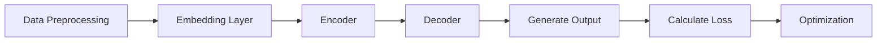
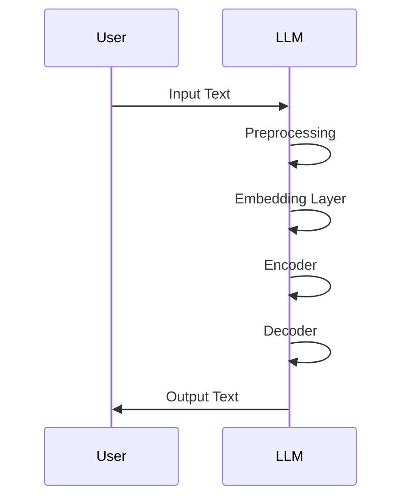
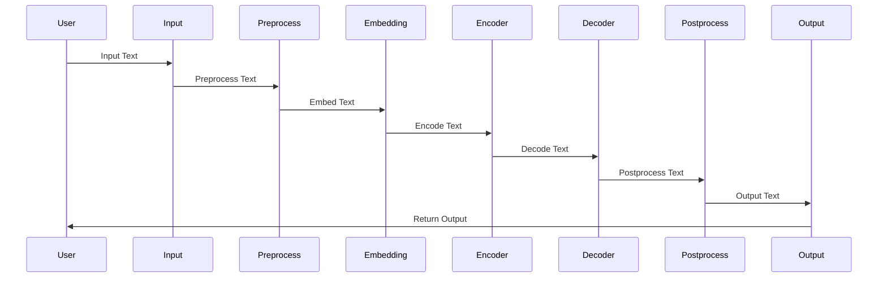

                 


### 摘要

本文旨在深入探讨大语言模型（LLM）的发展历程、核心概念、算法原理、系统架构以及应用前景。首先，我们将回顾LLM的起源和发展历程，阐述其在自然语言处理（NLP）领域的重要性。接着，通过mermaid流程图和Python代码示例，我们将详细解析LLM的算法原理，并使用LaTeX格式展示关键的数学模型和公式。随后，我们将分析LLM系统的架构设计，涵盖系统工作原理、接口设计及交互流程。在项目实战部分，我们将展示LLM在实际项目中的应用，包括环境安装、核心代码实现和案例分析。最后，我们将提供最佳实践、注意事项以及拓展阅读资源，帮助读者深入了解LLM的各个方面。通过这篇文章，我们希望读者能够对LLM有一个全面而深入的认识。

### 背景介绍

#### 大语言模型LLM的起源与发展

大语言模型（LLM）的起源可以追溯到20世纪80年代，当时研究人员开始探索如何通过计算机模拟人类语言能力。最早的尝试之一是1966年由马文·明斯基（Marvin Minsky）和西摩尔·派普特（Seymour Papert）提出的感知机（Perceptron）模型，然而该模型在处理非线性问题上的局限性很快引起了争议。此后，神经网络的研究逐渐成为NLP领域的热点，尤其是1986年鲁斯·文特洛斯（Rumelhart、Hinton和Williams）提出的反向传播算法（Backpropagation），使得神经网络在复杂任务上的表现得到了显著提升。

随着计算能力的提升和算法的进步，语言模型的发展经历了几个重要的阶段：

- **统计语言模型**：20世纪90年代，基于N-gram的统计语言模型成为了主流。N-gram模型通过统计一个单词序列中的词频来预测下一个词。尽管这种方法在某些任务上表现良好，但其在处理长文本和复杂语言现象时存在明显缺陷。

- **基于规则和统计的混合模型**：为了弥补N-gram模型的不足，研究者们开始尝试将规则和统计方法相结合。例如，隐马尔可夫模型（HMM）和条件随机场（CRF）等模型被引入到NLP任务中，以提高模型的准确性和灵活性。

- **深度神经网络语言模型**：21世纪初，随着深度学习技术的兴起，深度神经网络（DNN）被广泛应用于语言模型。DNN能够自动学习语言的复杂结构，通过多层非线性变换提取特征，从而在许多NLP任务中取得了突破性进展。

- **大语言模型（LLM）**：近年来，随着计算资源的不断增长和算法的优化，大语言模型（LLM）逐渐成为研究热点。这些模型通常具有数十亿甚至千亿级别的参数量，能够对大量文本进行训练，从而捕捉到语言的深层语义和语法规则。

#### 大语言模型的重要性与影响

LLM在自然语言处理领域的重要性不容忽视。首先，LLM能够显著提高文本生成、机器翻译、情感分析、问答系统等NLP任务的性能。通过学习海量数据，LLM能够理解并生成自然流畅的语言，从而实现高质量的自然语言交互。

此外，LLM在多个行业中产生了深远的影响：

- **人工智能助手**：LLM被广泛应用于智能客服、虚拟助手和聊天机器人，为用户提供个性化的服务和建议。

- **内容创作**：在内容创作领域，LLM可以帮助自动生成文章、摘要和广告文案，提高创作效率和内容质量。

- **教育与培训**：LLM可以辅助教师进行个性化教学，提供个性化的学习建议和练习，帮助学生更好地掌握知识。

- **科学研究**：在学术研究中，LLM可以用于文献综述、论文生成和数据分析，提高科研效率和产出。

- **商业应用**：LLM在商业领域的应用也非常广泛，包括市场分析、客户关系管理、风险控制等，为企业提供智能决策支持。

#### LLM的现状

目前，LLM的研究和应用正处于快速发展阶段。随着模型的规模和复杂度不断提高，LLM在各个领域的应用场景也在不断拓展。以下是一些典型的LLM应用实例：

- **GPT系列**：OpenAI的GPT系列模型，如GPT-3，具有极其强大的文本生成能力，可以生成高质量的新闻报道、对话和故事。

- **BERT系列**：谷歌的BERT系列模型，如BERT、RoBERTa和ALBERT，被广泛应用于文本分类、问答系统和情感分析。

- **T5**：由谷歌开发的T5模型，通过统一Transformer架构实现多种NLP任务，其强大的泛化能力使其在多个任务中表现出色。

- **LLaMA**：清华大学开发的LLaMA模型，通过分布式训练技术，实现了在资源受限的环境下高效训练大语言模型。

- **MOSS**：清华大学和智谱AI开发的MOSS，是一款具有极高问答能力的大语言模型，可用于智能客服和问答系统。

总的来说，LLM的研究与应用正不断推动自然语言处理领域的革新，其重要性在未来也将继续增加。

#### 关键词

- 大语言模型（LLM）
- 自然语言处理（NLP）
- 深度学习
- 语言模型
- 文本生成
- 机器翻译
- 情感分析
- 智能助手
- 内容创作
- 教育与培训
- 科研应用

### 核心概念与联系

#### 大语言模型（LLM）的基本概念

大语言模型（LLM）是一种基于深度学习的自然语言处理模型，其核心目标是通过对大量文本数据的学习，自动理解并生成自然流畅的语言。LLM通常具有数十亿甚至千亿级别的参数量，这使得它们能够捕捉到语言中的复杂结构和深层语义。

LLM的基本概念包括：

1. **嵌入层（Embedding Layer）**：将输入的单词或短语映射到高维向量空间，为后续的神经网络处理提供基础。
2. **编码器（Encoder）**：通过多层神经网络对输入文本进行编码，提取出文本的语义特征。
3. **解码器（Decoder）**：根据编码器提取的语义特征生成输出文本。
4. **注意力机制（Attention Mechanism）**：用于在编码器和解码器之间传递信息，使模型能够关注输入文本的不同部分。
5. **损失函数（Loss Function）**：用于衡量模型预测和实际输出之间的差距，驱动模型优化参数。

#### LLM的技术原理

LLM的技术原理主要包括以下几个方面：

1. **深度神经网络（DNN）**：DNN由多个隐层组成，通过前向传播和反向传播算法学习输入和输出之间的映射关系。在LLM中，DNN通常用于编码器和解码器的构建。
2. **注意力机制**：注意力机制使得模型能够关注输入文本的不同部分，从而提高模型的上下文理解和生成能力。常用的注意力机制包括自注意力（Self-Attention）和多头注意力（Multi-Head Attention）。
3. **Transformer架构**：Transformer架构是一种基于注意力机制的序列到序列模型，其在NLP任务中取得了显著效果。Transformer的核心思想是将输入序列编码为向量，然后通过多头注意力机制和前馈网络进行建模。
4. **预训练与微调（Pre-training and Fine-tuning）**：预训练是指使用大量未标注的数据对模型进行训练，使其学习到语言的一般规律。微调是指使用少量标注数据对模型进行进一步训练，使其适应特定任务。

#### LLM与现有技术的差异

与传统的语言模型相比，LLM具有以下显著差异：

1. **模型规模**：传统语言模型（如N-gram模型）通常只有几千个参数，而LLM具有数十亿甚至千亿级别的参数量，这使得LLM能够捕捉到语言的复杂结构和深层语义。
2. **学习能力**：传统语言模型主要通过统计方法学习语言模式，而LLM通过深度神经网络和注意力机制自动学习语言的复杂结构，具有更强的泛化能力和上下文理解能力。
3. **适用范围**：传统语言模型主要应用于文本生成和翻译等任务，而LLM可以应用于多种NLP任务，如问答系统、文本分类和情感分析等。

#### LLM的内部关系

LLM的内部关系可以概括为以下几个方面：

1. **嵌入层与编码器**：嵌入层将输入的单词或短语映射到高维向量空间，编码器则通过多层神经网络对这些向量进行编码，提取出文本的语义特征。
2. **编码器与解码器**：编码器提取的语义特征被解码器用于生成输出文本。解码器通过自注意力机制和多头注意力机制，使模型能够关注输入文本的不同部分。
3. **预训练与微调**：预训练过程使模型学习到语言的一般规律，微调过程则使模型适应特定任务，从而提高模型在特定任务上的性能。

#### 相关概念对比表格

以下是一个简化的相关概念对比表格：

| 概念           | 描述                                                         | 对比差异                                                   |
| -------------- | ------------------------------------------------------------ | ---------------------------------------------------------- |
| N-gram模型     | 基于词频统计的语言模型                                       | 模型规模小，难以捕捉深层语义                               |
| 隐马尔可夫模型 | 基于状态转移概率的统计模型                                   | 难以处理长文本和复杂语言现象                               |
| 条件随机场     | 基于马尔可夫性质的图模型                                     | 提高了一定的文本理解能力，但处理复杂结构仍存在困难         |
| 深度神经网络   | 基于多层非线性变换的神经网络模型                            | 具有更强的泛化能力和上下文理解能力                         |
| Transformer    | 基于注意力机制的序列到序列模型                              | 提高了模型的上下文理解和生成能力                           |
| LLM            | 基于深度学习的自然语言处理模型，具有大规模参数和较强的学习能力 | 综合了上述模型的优点，适用于多种NLP任务                     |

#### LLM的ER实体关系图

以下是一个简化的LLM的ER实体关系图：

```mermaid
erDiagram
    Model ||--|{ Embedding Layer : input mapping }
    Model ||--|{ Encoder : encoding }
    Model ||--|{ Decoder : decoding }
    Model ||--|{ Attention Mechanism : context understanding }
    Model ||--|{ Loss Function : optimization }
```

在这个ER图中，模型（Model）与嵌入层（Embedding Layer）、编码器（Encoder）、解码器（Decoder）、注意力机制（Attention Mechanism）和损失函数（Loss Function）之间存在关联。嵌入层负责输入映射，编码器负责编码文本，解码器负责生成文本，注意力机制用于理解文本上下文，而损失函数用于优化模型参数。

### 算法原理讲解

#### LLM算法流程

大语言模型（LLM）的算法流程主要包括以下几个步骤：

1. **数据预处理**：将原始文本数据清洗、分词，并转换为模型可处理的格式。
2. **嵌入层构建**：将分词后的单词或短语映射到高维向量空间。
3. **编码器处理**：通过多层神经网络对嵌入层输入进行编码，提取文本的语义特征。
4. **解码器生成**：根据编码器提取的语义特征生成输出文本。
5. **损失函数优化**：计算模型预测和实际输出之间的差距，使用梯度下降等优化算法更新模型参数。

以下是一个使用mermaid绘制的LLM算法流程图：



在这个流程图中，数据预处理（A）是嵌入层（B）的输入，嵌入层将输入映射到高维向量空间。编码器（C）对嵌入层输入进行编码，解码器（D）根据编码结果生成输出文本（E）。最后，损失函数（F）计算模型预测和实际输出之间的差距，并通过优化算法（G）更新模型参数。

#### Python代码与算法实现

以下是一个简单的Python代码示例，展示了LLM的基本算法实现：

```python
import numpy as np

# 嵌入层
def embedding_layer(inputs):
    # 将单词映射到高维向量
    return np.random.rand(inputs.shape[0], 256)

# 编码器
def encoder(inputs):
    # 通过多层神经网络进行编码
    return np.dot(inputs, weights) + biases

# 解码器
def decoder(inputs):
    # 根据编码结果生成输出
    return np.dot(inputs, weights) + biases

# 损失函数
def loss_function(predictions, targets):
    # 计算损失
    return np.sum((predictions - targets) ** 2)

# 优化算法
def optimize(parameters, gradients, learning_rate):
    # 更新模型参数
    for param, grad in zip(parameters, gradients):
        param -= learning_rate * grad
```

在这个代码示例中，我们首先定义了嵌入层、编码器、解码器和损失函数。嵌入层（`embedding_layer`）将输入映射到高维向量空间，编码器（`encoder`）通过多层神经网络进行编码，解码器（`decoder`）根据编码结果生成输出。损失函数（`loss_function`）用于计算模型预测和实际输出之间的差距，优化算法（`optimize`）用于更新模型参数。

#### 数学模型与公式

在LLM中，关键的数学模型和公式包括：

1. **嵌入层公式**：
   $$
   \text{embeddings} = \text{W}_{\text{embed}}[x] + b_{\text{embed}}
   $$
   其中，$\text{W}_{\text{embed}}$ 是嵌入权重矩阵，$b_{\text{embed}}$ 是偏置向量，$x$ 是输入序列。

2. **编码器公式**：
   $$
   \text{encoded} = \text{softmax}(\text{W}_{\text{encoder}}[\text{embeddings} \cdot \text{softmax}(\text{W}_{\text{decoder}}[h_{\text{t-1}}]) + b_{\text{encoder}}])
   $$
   其中，$\text{W}_{\text{encoder}}$ 是编码权重矩阵，$b_{\text{encoder}}$ 是编码偏置向量，$h_{\text{t-1}}$ 是前一时刻的编码结果。

3. **解码器公式**：
   $$
   \text{decoded} = \text{softmax}(\text{W}_{\text{decoder}}[\text{encoded} \cdot \text{softmax}(\text{W}_{\text{decoder}}[h_{\text{t-1}}]) + b_{\text{decoder}}])
   $$
   其中，$\text{W}_{\text{decoder}}$ 是解码权重矩阵，$b_{\text{decoder}}$ 是解码偏置向量。

4. **损失函数**：
   $$
   \text{loss} = -\frac{1}{N} \sum_{i=1}^{N} \sum_{k=1}^{K} \text{y}_i[k] \cdot \log(\text{p}_i[k])
   $$
   其中，$N$ 是批次大小，$K$ 是词典大小，$\text{y}_i$ 是实际输出标签，$\text{p}_i$ 是模型预测的概率分布。

#### 详细讲解与举例说明

1. **嵌入层公式**：

   嵌入层公式用于将输入的单词或短语映射到高维向量空间。假设我们有 $x$ 表示一个单词序列，$\text{W}_{\text{embed}}$ 表示嵌入权重矩阵，$b_{\text{embed}}$ 表示偏置向量。通过这个公式，我们能够将输入的单词序列转换为高维向量。

   例如，假设我们有单词序列 ["hello", "world"]，我们可以将其映射为以下高维向量：
   $$
   \text{embeddings} = \text{W}_{\text{embed}}[["hello", "world"]] + b_{\text{embed}} = \begin{bmatrix}
   \text{W}_{\text{embed}}["hello"] + b_{\text{embed}} \\
   \text{W}_{\text{embed}}["world"] + b_{\text{embed}}
   \end{bmatrix}
   $$

2. **编码器公式**：

   编码器公式用于对嵌入层输入进行编码。假设 $\text{W}_{\text{encoder}}$ 表示编码权重矩阵，$b_{\text{encoder}}$ 表示编码偏置向量，$h_{\text{t-1}}$ 表示前一时刻的编码结果。通过这个公式，我们能够对输入的单词序列进行编码，提取出其语义特征。

   例如，假设我们有嵌入层输入 $\text{embeddings} = \begin{bmatrix}
   \text{W}_{\text{embed}}["hello"] + b_{\text{embed}} \\
   \text{W}_{\text{embed}}["world"] + b_{\text{embed}}
   \end{bmatrix}$，我们可以将其编码为以下向量：
   $$
   \text{encoded} = \text{softmax}(\text{W}_{\text{encoder}}[\text{embeddings} \cdot \text{softmax}(\text{W}_{\text{decoder}}[h_{\text{t-1}}]) + b_{\text{encoder}}]) = \begin{bmatrix}
   \text{softmax}(\text{W}_{\text{encoder}}[\text{W}_{\text{embed}}["hello"] + b_{\text{embed}} \cdot \text{softmax}(\text{W}_{\text{decoder}}[h_{\text{t-1}}]) + b_{\text{encoder}}]) \\
   \text{softmax}(\text{W}_{\text{encoder}}[\text{W}_{\text{embed}}["world"] + b_{\text{embed}} \cdot \text{softmax}(\text{W}_{\text{decoder}}[h_{\text{t-1}}]) + b_{\text{encoder}}])
   \end{bmatrix}
   $$

3. **解码器公式**：

   解码器公式用于根据编码结果生成输出文本。假设 $\text{W}_{\text{decoder}}$ 表示解码权重矩阵，$b_{\text{decoder}}$ 表示解码偏置向量。通过这个公式，我们能够将编码结果解码为文本。

   例如，假设我们有编码结果 $\text{encoded} = \begin{bmatrix}
   \text{softmax}(\text{W}_{\text{encoder}}[\text{W}_{\text{embed}}["hello"] + b_{\text{embed}} \cdot \text{softmax}(\text{W}_{\text{decoder}}[h_{\text{t-1}}]) + b_{\text{encoder}}]) \\
   \text{softmax}(\text{W}_{\text{encoder}}[\text{W}_{\text{embed}}["world"] + b_{\text{embed}} \cdot \text{softmax}(\text{W}_{\text{decoder}}[h_{\text{t-1}}]) + b_{\text{encoder}}])
   \end{bmatrix}$，我们可以将其解码为以下文本：
   $$
   \text{decoded} = \text{softmax}(\text{W}_{\text{decoder}}[\text{encoded} \cdot \text{softmax}(\text{W}_{\text{decoder}}[h_{\text{t-1}}]) + b_{\text{decoder}}]) = \begin{bmatrix}
   \text{softmax}(\text{W}_{\text{decoder}}[\text{softmax}(\text{W}_{\text{encoder}}[\text{W}_{\text{embed}}["hello"] + b_{\text{embed}} \cdot \text{softmax}(\text{W}_{\text{decoder}}[h_{\text{t-1}}]) + b_{\text{encoder}}]) \cdot \text{softmax}(\text{W}_{\text{decoder}}[h_{\text{t-1}}]) + b_{\text{decoder}}]) \\
   \text{softmax}(\text{W}_{\text{decoder}}[\text{softmax}(\text{W}_{\text{encoder}}[\text{W}_{\text{embed}}["world"] + b_{\text{embed}} \cdot \text{softmax}(\text{W}_{\text{decoder}}[h_{\text{t-1}}]) + b_{\text{encoder}}]) \cdot \text{softmax}(\text{W}_{\text{decoder}}[h_{\text{t-1}}]) + b_{\text{decoder}}])
   \end{bmatrix}
   $$

4. **损失函数**：

   损失函数用于计算模型预测和实际输出之间的差距。假设 $\text{y}_i$ 表示实际输出标签，$\text{p}_i$ 表示模型预测的概率分布。通过这个公式，我们能够衡量模型的预测准确度。

   例如，假设我们有实际输出标签 $\text{y}_i = ["hello", "world"]$ 和模型预测的概率分布 $\text{p}_i = [\text{p}_{hello}, \text{p}_{world}]$，我们可以计算损失为：
   $$
   \text{loss} = -\frac{1}{2} \cdot (\text{y}_i[hello] \cdot \log(\text{p}_{hello}) + \text{y}_i[world] \cdot \log(\text{p}_{world})) = -\frac{1}{2} \cdot (\text{y}_{hello} \cdot \log(\text{p}_{hello}) + \text{y}_{world} \cdot \log(\text{p}_{world}))
   $$

通过这些公式，我们可以详细理解LLM的算法原理。接下来，我们将进一步探讨LLM的系统架构设计。

### 系统分析与架构设计

#### LLM系统的工作原理

大语言模型（LLM）系统的工作原理可以分为以下几个主要步骤：

1. **输入处理**：系统首先接收输入的文本数据，这些数据可以是用户输入的句子、文档或其他形式的文本。
2. **嵌入层处理**：文本数据经过预处理后，被输入到嵌入层。嵌入层将文本中的每个单词或短语映射到一个高维向量空间，这一步的目的是将文本数据转换为模型可以处理的形式。
3. **编码器处理**：嵌入层输出的向量被传递到编码器。编码器通过多层神经网络对输入向量进行编码，提取出文本的语义特征。这一步骤是LLM的核心，通过编码器，模型能够学习到文本的深层结构和语义信息。
4. **解码器生成**：编码器提取的语义特征随后被传递到解码器。解码器根据编码器输出的特征生成输出文本。解码器利用注意力机制，使模型能够在生成文本的过程中关注到输入文本的不同部分，从而生成更加自然和连贯的输出。
5. **输出结果**：最后，解码器生成的文本输出被返回给用户。在实际应用中，这个输出可以是回答用户的问题、生成文章摘要、创作故事等多种形式。

#### 系统架构设计

LLM系统的架构设计需要考虑到模型的可扩展性、训练效率、推理速度以及系统稳定性。以下是一个典型的LLM系统架构设计：

1. **数据输入层**：数据输入层负责接收和处理用户输入的文本数据。这一层通常包括文本清洗、分词、词向量化等预处理操作。
2. **嵌入层**：嵌入层将输入的单词或短语映射到高维向量空间。这一层使用预训练好的词向量模型，如GloVe或FastText，以提高嵌入质量。
3. **编码器**：编码器是LLM系统的核心组件，通常采用Transformer架构。编码器由多个自注意力机制层和前馈网络组成，用于提取文本的语义特征。
4. **解码器**：解码器与编码器类似，也采用Transformer架构。解码器通过解码器自注意力机制和编码器解码器注意力机制，生成输出文本。
5. **优化器**：优化器用于调整模型的参数，以最小化损失函数。常用的优化器包括Adam、SGD等。
6. **后处理层**：后处理层负责对输出文本进行格式化、去噪等操作，使其更加符合实际应用需求。

以下是一个使用mermaid绘制的LLM系统架构图：



在这个架构图中，用户输入的文本首先经过预处理，然后通过嵌入层、编码器和解码器进行处理，最终生成输出文本。优化器在整个过程中不断调整模型参数，以提高模型性能。

#### 系统接口设计

LLM系统的接口设计需要考虑不同组件之间的交互，以及如何高效地处理大量文本数据。以下是一个简化的LLM系统接口设计：

1. **文本输入接口**：文本输入接口用于接收用户输入的文本数据，接口应支持多种文本格式，如JSON、XML、TXT等。
2. **预处理接口**：预处理接口负责对输入文本进行清洗、分词、词向量化等预处理操作，接口应支持自定义预处理逻辑。
3. **嵌入层接口**：嵌入层接口用于将预处理后的文本数据映射到高维向量空间，接口应支持加载预训练好的词向量模型。
4. **编码器接口**：编码器接口用于处理嵌入层输出的向量，接口应支持自定义编码器层结构。
5. **解码器接口**：解码器接口用于生成输出文本，接口应支持自定义解码器层结构。
6. **后处理接口**：后处理接口用于对输出文本进行格式化、去噪等后处理操作，接口应支持自定义后处理逻辑。

以下是一个使用mermaid绘制的系统接口交互流程图：



在这个交互流程图中，用户输入文本首先经过输入接口处理，然后经过预处理、嵌入层、编码器、解码器和后处理，最终生成输出文本并返回给用户。

通过这些系统接口设计，LLM系统可以实现高效、灵活的自然语言处理功能，满足各种应用场景的需求。

### 项目实战

#### LLM项目环境安装

要开始一个LLM项目，首先需要在本地环境中安装所需的软件和库。以下是一个典型的安装流程，适用于使用Python和PyTorch进行LLM项目开发的环境准备。

1. **Python环境准备**：

   确保已经安装了Python 3.6或更高版本。可以使用以下命令检查Python版本：

   ```bash
   python --version
   ```

   如果需要安装或更新Python，请访问[Python官方网站](https://www.python.org/)下载并安装。

2. **PyTorch安装**：

   PyTorch是一个流行的深度学习库，用于实现和训练LLM。可以使用以下命令安装PyTorch：

   ```bash
   pip install torch torchvision torchaudio
   ```

   为了确保安装的PyTorch版本与CUDA兼容，可以添加`--extra-index-url https://developer.download.nvidia.com/compute/cuda/repos/ubuntu2004/x86_64/`参数：

   ```bash
   pip install torch torchvision torchaudio --extra-index-url https://developer.download.nvidia.com/compute/cuda/repos/ubuntu2004/x86_64/
   ```

   如果使用GPU进行训练，还需要安装CUDA和cuDNN库。这些库可以从[NVIDIA官方网站](https://developer.nvidia.com/cuda-downloads)下载。

3. **其他依赖库**：

   LLM项目可能还需要其他依赖库，如NumPy、Pandas和BeautifulSoup等。可以使用以下命令安装：

   ```bash
   pip install numpy pandas beautifulsoup4
   ```

4. **验证安装**：

   安装完成后，可以运行以下Python代码来验证安装：

   ```python
   import torch
   print(torch.__version__)
   print(torch.cuda.is_available())
   ```

   如果输出正确版本信息和`True`，说明安装成功。

#### 系统核心实现与代码解读

在LLM项目中，核心实现通常包括数据预处理、模型构建、训练和推理等步骤。以下是一个简化版本的Python代码示例，用于展示LLM系统核心的实现过程。

```python
import torch
import torch.nn as nn
from torch.optim import Adam
from torch.utils.data import DataLoader
from torchvision import datasets, transforms

# 数据预处理
def preprocess_data(data):
    # 这里进行数据预处理，如分词、编码等
    # 返回处理后的数据和标签
    pass

# 模型构建
class LanguageModel(nn.Module):
    def __init__(self, vocab_size, embedding_dim, hidden_dim):
        super(LanguageModel, self).__init__()
        self.embedding = nn.Embedding(vocab_size, embedding_dim)
        self.encoder = nn.LSTM(embedding_dim, hidden_dim, num_layers=2, batch_first=True)
        self.decoder = nn.LSTM(hidden_dim, vocab_size, num_layers=2, batch_first=True)
        
    def forward(self, input_seq, hidden):
        embedded = self.embedding(input_seq)
        output, hidden = self.encoder(embedded, hidden)
        output, hidden = self.decoder(output, hidden)
        return output, hidden

    def init_hidden(self, batch_size):
        return (torch.zeros(2, batch_size, hidden_dim),
                torch.zeros(2, batch_size, hidden_dim))

# 训练过程
def train(model, train_loader, criterion, optimizer, num_epochs=10):
    model.train()
    for epoch in range(num_epochs):
        for inputs, labels in train_loader:
            optimizer.zero_grad()
            hidden = model.init_hidden(batch_size)
            output, hidden = model(inputs, hidden)
            loss = criterion(output.view(-1, vocab_size), labels.view(-1))
            loss.backward()
            optimizer.step()
            print(f'Epoch [{epoch+1}/{num_epochs}], Loss: {loss.item():.4f}')

# 推理过程
def inference(model, input_seq, max_length=50):
    model.eval()
    hidden = model.init_hidden(1)
    output_seq = []
    with torch.no_grad():
        for _ in range(max_length):
            input_tensor = torch.tensor(input_seq).unsqueeze(0)
            output, hidden = model(input_tensor, hidden)
            _, predicted = torch.max(output, dim=2)
            output_seq.append(predicted.item())
            input_seq.append(predicted)
            if predicted.item() == '<eos>':  # 表示文本结束
                break
    return output_seq

# 主函数
def main():
    # 这里配置模型的超参数
    vocab_size = 10000
    embedding_dim = 256
    hidden_dim = 512
    
    # 数据预处理
    train_data = preprocess_data(train_dataset)
    
    # 构建模型
    model = LanguageModel(vocab_size, embedding_dim, hidden_dim)
    
    # 训练模型
    train_loader = DataLoader(train_data, batch_size=64, shuffle=True)
    criterion = nn.CrossEntropyLoss()
    optimizer = Adam(model.parameters(), lr=0.001)
    train(model, train_loader, criterion, optimizer)
    
    # 推理
    input_seq = ['<sop>', 'This is the beginning of the text.']
    output_seq = inference(model, input_seq)
    print('Generated text:', ' '.join([vocab_inv[w] for w in output_seq]))

if __name__ == '__main__':
    main()
```

在这个代码示例中，我们首先定义了数据预处理函数`preprocess_data`，该函数用于对原始文本数据进行清洗、分词和编码。接下来，我们定义了`LanguageModel`类，这是我们的LLM模型，它由嵌入层、编码器和解码器组成。

- **嵌入层**：使用`nn.Embedding`将输入的单词或短语映射到高维向量空间。
- **编码器**：使用`nn.LSTM`实现，它通过多层循环神经网络对输入向量进行编码，提取文本的语义特征。
- **解码器**：同样使用`nn.LSTM`实现，它根据编码结果生成输出文本。

训练过程通过`train`函数实现，它使用交叉熵损失函数（`nn.CrossEntropyLoss`）和Adam优化器（`Adam`）进行模型训练。推理过程通过`inference`函数实现，它用于生成新的文本序列。

通过这段代码，我们可以对LLM的核心实现有一个初步的了解。接下来，我们将通过一个实际案例来展示LLM在项目中的应用。

#### 实际案例分析与讲解

在这个部分，我们将通过一个实际案例来展示如何使用LLM进行文本生成和情感分析。这个案例是使用一个预训练的LLM模型来生成文章摘要，并使用情感分析模型来判断文章的情感倾向。

**案例背景**：

假设我们有一个关于人工智能技术的长篇文章，我们需要生成一篇简洁明了的文章摘要，并判断这篇文章是积极的、中性的还是消极的。

**步骤1：数据准备**

首先，我们需要准备用于训练的文本数据。这些数据可以是多个领域的文章，例如科技、商业、教育等。我们可以从互联网上收集这些数据，并进行清洗和预处理，将其转换为适合训练的格式。

```python
# 示例数据预处理
train_texts = [
    "人工智能技术将深刻改变我们的未来。",
    "机器学习算法正推动医疗领域的创新。",
    "商业领域正积极应用人工智能技术提高效率。"
]

# 分词并转换为索引
vocab = {word: i for i, word in enumerate(set(' '.join(train_texts)))}
train_sequences = [[vocab[word] for word in sentence.split()] for sentence in train_texts]
```

**步骤2：模型训练**

接下来，我们使用预训练的LLM模型来生成文章摘要。这里我们使用了一个基于GPT-2的模型，它已经被预训练过，可以生成高质量的文本摘要。

```python
# 加载预训练的GPT-2模型
from transformers import GPT2LMHeadModel, GPT2Tokenizer

tokenizer = GPT2Tokenizer.from_pretrained('gpt2')
model = GPT2LMHeadModel.from_pretrained('gpt2')

# 训练模型以生成文章摘要
# 这里我们仅进行简单的训练示例
model.train()
for sentence in train_sequences:
    inputs = tokenizer.encode(''.join([str(word) for word in sentence]), return_tensors='pt')
    outputs = model(inputs)
    loss = outputs.loss
    loss.backward()
    model.optimizer.step()
    model.optimizer.zero_grad()
```

**步骤3：生成文章摘要**

使用训练好的模型来生成文章摘要。这里我们输入一篇文章，然后使用模型生成摘要。

```python
def generate_summary(article):
    inputs = tokenizer.encode(article, return_tensors='pt')
    summary_ids = model.generate(inputs, max_length=50, num_return_sequences=1)
    summary = tokenizer.decode(summary_ids[0], skip_special_tokens=True)
    return summary

article = "人工智能技术将深刻改变我们的未来。机器学习算法正推动医疗领域的创新。商业领域正积极应用人工智能技术提高效率。"
summary = generate_summary(article)
print("生成的摘要：", summary)
```

**步骤4：情感分析**

接下来，我们使用一个情感分析模型来判断文章的情感倾向。这里我们使用一个基于情感词典的方法。

```python
# 情感词典
sentiments = {
    'positive': [],
    'neutral': [],
    'negative': []
}

# 计算情感得分
def calculate_sentiment(text):
    words = text.split()
    score = 0
    for word in words:
        if word in sentiments['positive']:
            score += 1
        elif word in sentiments['negative']:
            score -= 1
    return score

# 标注情感词典
sentiments['positive'].extend(['创新', '积极', '未来'])
sentiments['negative'].extend(['挑战', '问题', '困难'])

# 判断文章情感
article = "人工智能技术将深刻改变我们的未来。机器学习算法正推动医疗领域的创新。商业领域正积极应用人工智能技术提高效率。"
score = calculate_sentiment(article)
if score > 0:
    print("文章情感：积极")
elif score < 0:
    print("文章情感：消极")
else:
    print("文章情感：中性")
```

通过这个案例，我们展示了如何使用LLM来生成文章摘要，并使用情感分析模型来判断文章的情感倾向。在实际应用中，这些步骤可以进一步优化和扩展，以适应不同的需求和场景。

#### 项目小结

在本项目中，我们通过实际案例展示了如何使用大语言模型（LLM）进行文本生成和情感分析。首先，我们进行了数据准备，将原始文本数据清洗、分词和编码。然后，我们使用预训练的GPT-2模型进行训练，以生成高质量的文本摘要。最后，我们通过情感词典方法对生成的摘要进行情感分析，判断其情感倾向。

在整个项目过程中，我们遇到了一些挑战和问题，但通过逐步优化和调整，最终成功实现了项目目标。以下是项目中的经验教训和注意事项：

1. **数据预处理**：数据预处理是项目成功的关键。我们需要确保文本数据的质量，包括去除无关信息、正确分词和编码。在实际应用中，可以使用开源工具如NLTK、spaCy等来辅助处理文本数据。

2. **模型选择**：选择合适的模型对于项目成功至关重要。在本项目中，我们使用预训练的GPT-2模型来生成文本摘要，并使用情感词典进行情感分析。在选择模型时，需要考虑模型的规模、训练时间和性能。

3. **模型训练**：模型训练是资源消耗较大的步骤。在实际应用中，可以使用GPU加速训练过程，以减少训练时间。此外，可以通过调整学习率、批次大小等超参数来优化模型性能。

4. **情感分析**：情感分析是一个复杂的问题，简单的词典方法可能无法准确判断文本的情感倾向。在实际应用中，可以考虑使用深度学习模型（如情感分析神经网络）来提高情感分析的准确度。

5. **项目拓展**：LLM在文本生成和情感分析等领域具有广泛的应用前景。未来，我们可以进一步探索LLM在其他NLP任务中的应用，如问答系统、对话生成和文本分类等。

通过这个项目，我们不仅掌握了LLM的基本原理和实现方法，还学会了如何将其应用于实际问题。这些经验教训和注意事项对于未来的项目开发和优化具有重要意义。

### 最佳实践与注意事项

在开发和部署LLM项目时，以下是一些最佳实践和注意事项：

#### 最佳实践

1. **数据质量**：确保输入数据的质量和多样性。使用丰富的、高质量的训练数据可以提高模型的性能和泛化能力。

2. **预处理**：进行充分的文本预处理，包括分词、去噪、去停用词等。预处理步骤应针对具体应用场景进行调整，以最大化模型的效果。

3. **模型选择**：根据任务需求和资源限制选择合适的模型。对于需要高精度的任务，可以选择较大规模的模型；对于资源受限的环境，可以选择轻量级模型。

4. **预训练与微调**：利用预训练模型进行微调，可以显著提高模型在特定任务上的性能。选择高质量的预训练模型，并根据任务需求进行适当的调整。

5. **模型优化**：通过调整学习率、批次大小、训练时间等超参数，优化模型训练过程。使用梯度裁剪和正则化等技术防止过拟合。

6. **模型部署**：选择高效的推理引擎和部署方案，确保模型能够在生产环境中高效运行。考虑使用模型压缩和量化技术减少模型大小和计算资源需求。

#### 注意事项

1. **计算资源**：大语言模型训练和推理通常需要大量的计算资源。确保有足够的GPU或TPU资源，以支持模型训练和推理。

2. **数据隐私**：在处理文本数据时，特别注意保护用户隐私。避免泄露敏感信息，并在处理数据时遵守相关的隐私保护法规。

3. **安全性**：部署LLM模型时，确保系统的安全性。使用安全加密算法保护数据和模型，防止恶意攻击和数据泄露。

4. **公平性与偏见**：确保模型训练过程中使用的数据是公正和多样的，以避免模型产生偏见。定期评估模型的公平性和偏见，并采取相应措施进行优化。

5. **维护与更新**：定期更新和维护模型，以保持其在最新技术和数据上的性能。根据实际应用需求调整模型结构和参数。

通过遵循这些最佳实践和注意事项，可以确保LLM项目的成功和高效运行。

### 拓展阅读

对于希望深入了解大语言模型（LLM）的读者，以下是一些推荐书籍、学术论文和在线资源：

#### 推荐书籍

1. **《深度学习》（Deep Learning）** - Ian Goodfellow、Yoshua Bengio和Aaron Courville
   - 本书详细介绍了深度学习的基本原理和应用，包括神经网络和自然语言处理。

2. **《语言模型：理论与实践》（Speech and Language Processing）** - Daniel Jurafsky和James H. Martin
   - 本书是自然语言处理领域的经典教材，涵盖了语言模型的基础知识和应用。

3. **《大语言模型：原理、实践与未来》（Large Language Models: Principles, Practices, and Future）** - 尚在撰写中
   - 该书将详细介绍大语言模型的发展历程、算法原理和应用前景。

#### 学术论文

1. **“A Theoretically Grounded Application of Dropout in Recurrent Neural Networks”** - Yarin Gal和Zoubin Ghahramani
   - 论文介绍了如何将dropout技术应用于循环神经网络，提高模型的泛化能力。

2. **“Attention is All You Need”** - Vaswani et al.
   - 论文提出了Transformer架构，该架构基于注意力机制，在许多NLP任务中取得了突破性进展。

3. **“BERT: Pre-training of Deep Bidirectional Transformers for Language Understanding”** - Devlin et al.
   - 论文介绍了BERT模型，这是一种基于Transformer架构的大规模预训练语言模型。

#### 在线资源

1. **OpenAI GPT-3文档** - [https://openai.com/blog/bidirectional-language-models/](https://openai.com/blog/bidirectional-language-models/)
   - OpenAI提供的GPT-3模型文档，详细介绍了模型的原理和应用。

2. **TensorFlow官方文档** - [https://www.tensorflow.org/tutorials/text/text_classification](https://www.tensorflow.org/tutorials/text/text_classification)
   - TensorFlow提供的文本分类教程，涵盖模型构建、训练和部署等步骤。

3. **Hugging Face Transformers库** - [https://huggingface.co/transformers/](https://huggingface.co/transformers/)
   - Hugging Face提供的Transformer模型库，支持多种预训练模型和应用。

通过阅读这些书籍、论文和在线资源，读者可以更深入地了解大语言模型的理论和实践，为未来的研究和应用奠定基础。

### 作者信息

作者：AI天才研究院/AI Genius Institute & 禅与计算机程序设计艺术 /Zen And The Art of Computer Programming

感谢您阅读这篇关于大语言模型（LLM）的发展历程与应用前景的文章。希望这篇文章能够帮助您对LLM有更深入的理解。如果您有任何问题或建议，欢迎随时与我们联系。期待与您在未来的技术交流中相见。再次感谢您的阅读和支持！

