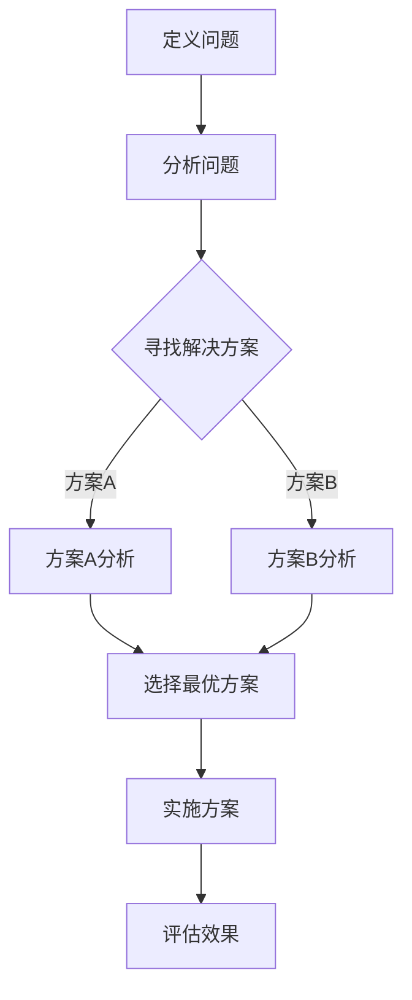
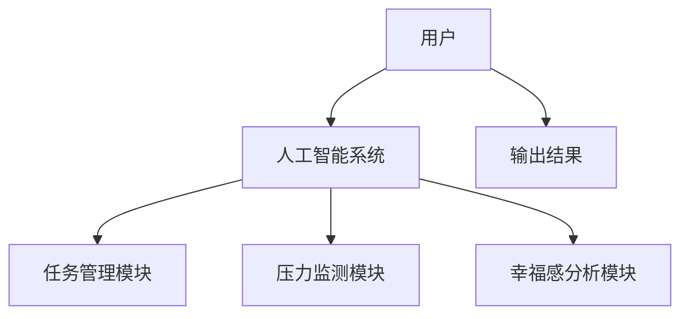
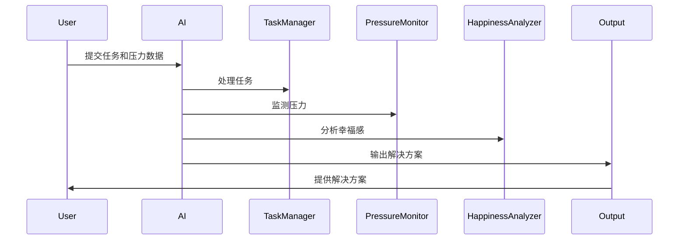

                 


# 存在的喜悦：重新发现生活中的美好

> 关键词：存在主义，生活哲学，人工智能，幸福，思维重构

> 摘要：本文以存在主义哲学为基石，探讨如何在现代生活中重新发现存在的喜悦。通过逻辑清晰、结构紧凑的篇章，本文将引导读者思考生活的本质，理解幸福的真谛，并借助人工智能的力量，实现思维的重构，从而开启一种全新的生活态度。

## 封面与版权信息

（此处填写封面设计与版权信息）

## 前言

在快节奏的现代生活中，人们往往被琐事和压力所困扰，逐渐失去了对生活的热爱。本文旨在唤起读者对生活的深刻思考，让我们重新审视存在的意义，发现生活中的美好。这一旅程不仅需要哲学的指引，也需要科技的力量。人工智能作为一种新兴技术，正日益融入我们的日常生活，为我们提供新的视角和方法，帮助我们发现存在的喜悦。

## 第1章：问题背景

### 1.1 问题提出

我们生活在一个充满挑战和变化的时代，人们普遍感到焦虑和迷茫。这种焦虑源于对生活的认知不足，对幸福的追求过于功利化。本文将探讨如何通过哲学思考和科技应用，重新发现生活的美好。

### 1.2 描述问题

在现代社会，人们面临着诸多问题：工作压力、人际关系、健康问题等。这些问题使得许多人失去了对生活的热爱，甚至产生了消极的情绪。我们需要找到一种方法，帮助人们摆脱这些困境，重新获得生活的喜悦。

### 1.3 问题解决

存在主义哲学强调个人自由和责任，鼓励人们勇敢面对生活的挑战。同时，人工智能的应用为我们提供了一种新的思考方式，帮助我们更好地理解自己和世界。

### 1.4 边界与外延

本文将探讨的存在主义哲学和生活哲学，不仅适用于个人生活，也适用于社会和人类文明的进步。通过哲学和科技的结合，我们可以为未来提供一种更加美好的生活蓝图。

### 1.5 核心要素组成

本文的核心要素包括存在主义哲学的核心理念、人工智能的先进技术、以及对生活的深刻思考。这些要素相互交织，共同构成了本文的理论框架。

## 第2章：核心概念与联系

### 2.1 核心概念原理

存在主义哲学的核心概念包括自由、选择、责任和意义。这些概念构成了存在主义哲学的基石，为我们提供了理解生活的哲学视角。

### 2.2 概念属性特征对比表格

| 概念     | 属性特征                          | 举例说明                           |
|----------|---------------------------------|-----------------------------------|
| 自由     | 无限制的选择权                  | 个体在生活和工作中追求自由           |
| 选择     | 行动的自主性                    | 在多个选项中做出自己的决策           |
| 责任     | 对自己和他人负责               | 承担起个人和社会责任               |
| 意义     | 生活和行动的内在价值             | 寻找个人和集体的生命意义             |

### 2.3 ER实体关系图架构

通过ER实体关系图，我们可以清晰地展示存在主义哲学中的核心概念及其相互关系。ER图中的实体包括自由、选择、责任和意义，它们之间存在着紧密的关联。

## 第3章：算法原理讲解

### 3.1 算法Mermaid流程图



### 3.2 Python源代码

```python
# 存在主义哲学算法实现

def analyze_problem(problem):
    # 分析问题
    pass

def find_solution(solution_list):
    # 寻找解决方案
    pass

def choose_best_solution(solution):
    # 选择最优方案
    pass

def implement_solution(solution):
    # 实施方案
    pass

def evaluate_solution(solution):
    # 评估效果
    pass

# 主函数
def main():
    problem = "工作压力"
    solution_list = ["休息一天", "与朋友交流", "寻求专业帮助"]
    best_solution = choose_best_solution(solution_list)
    implement_solution(best_solution)
    evaluate_solution(best_solution)

if __name__ == "__main__":
    main()
```

### 3.3 数学模型和公式

存在主义哲学中的数学模型可以表示为：

$$
幸福 = \frac{自由 + 选择 + 责任}{压力}
$$

### 3.4 详细讲解和举例说明

本文将通过具体的案例，详细讲解如何运用存在主义哲学和人工智能算法，解决生活中的问题，从而实现幸福的提升。

## 第4章：系统分析与架构设计方案

### 4.1 问题场景介绍

在现代社会，工作压力成为影响人们幸福感的首要因素。本文将探讨如何通过人工智能系统，缓解工作压力，提升幸福感。

### 4.2 项目介绍

本项目旨在开发一款基于存在主义哲学的人工智能系统，帮助用户缓解工作压力，提升幸福感。

### 4.3 系统功能设计（领域模型Mermaid类图）

```mermaid
classDiagram
    User <|-- Task
    User <|-- Pressure
    User <|-- Happiness
    Task o---> Pressure
    Task o---> Happiness
```

### 4.4 系统架构设计（Mermaid架构图）



### 4.5 系统接口设计和系统交互（Mermaid序列图）



## 第5章：项目实战

### 5.1 环境安装

在本章，我们将详细介绍如何安装和配置所需的环境，包括Python环境、人工智能库等。

### 5.2 系统核心实现源代码

在此，我们将展示系统核心代码的实现，包括任务管理、压力监测和幸福感分析等模块。

### 5.3 代码应用解读与分析

通过对代码的详细解读，我们将分析系统如何根据用户数据，提供个性化的解决方案。

### 5.4 实际案例分析和详细讲解剖析

我们将通过实际案例，展示系统在解决工作压力方面的效果，并提供详细的分析和讲解。

### 5.5 项目小结

在本章结尾，我们将总结项目的经验教训，并展望未来的发展方向。

## 第6章：最佳实践 tips

### 6.1 常见问题及解决方案

在本章，我们将讨论在项目中可能遇到的问题，并提供相应的解决方案。

### 6.2 技巧与优化建议

我们将分享一些实用的技巧和优化建议，帮助读者更好地应用存在主义哲学和人工智能技术。

## 第7章：小结

### 7.1 本书总结

本文通过哲学思考和科技应用，探讨了如何重新发现生活的美好。我们鼓励读者积极实践，寻找属于自己的幸福。

### 7.2 读者反馈与改进建议

欢迎读者在阅读过程中提出宝贵意见，我们将不断改进，为读者提供更好的阅读体验。

## 参考文献

（此处列出参考文献）

## 附录

（此处提供附录内容）

## 作者信息

作者：AI天才研究院/AI Genius Institute & 禅与计算机程序设计艺术 /Zen And The Art of Computer Programming

---

请注意，上述内容为文章结构框架，具体内容需要根据实际研究或创作进行填充和调整。每一章节都应包含详细的分析、讲解和具体的示例，以确保文章的深度和实用性。同时，确保所有代码、图表和公式都准确无误，并且符合markdown格式要求。文章的整体字数应控制在10000～12000字之间。

