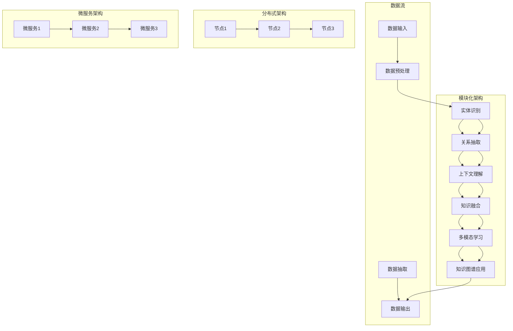
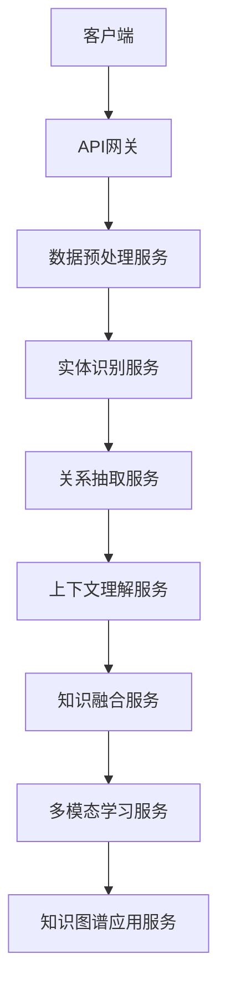
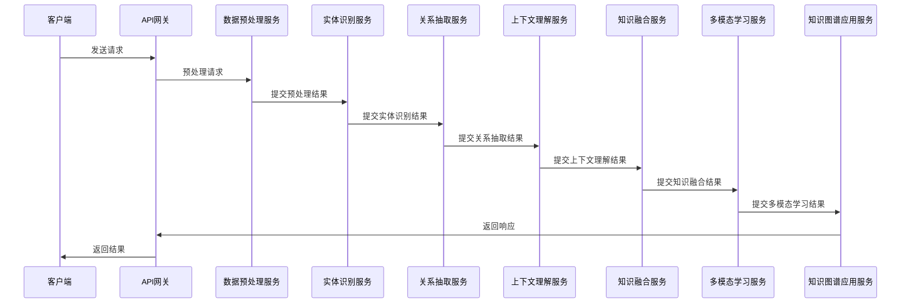

                 

### 第1章：问题背景

#### 1.1.1 问题背景

在当今飞速发展的时代，人工智能（AI）已经成为推动科技进步和社会发展的重要力量。人工智能的应用范围广泛，从自动驾驶、智能客服，到医疗诊断、金融分析，AI正在逐步渗透到我们生活的方方面面。然而，AI的发展并不是一帆风顺的，尤其是在理解和处理自然语言方面，依然面临着诸多挑战。

实体识别（Named Entity Recognition, NER）和关系抽取（Relation Extraction）是自然语言处理（Natural Language Processing, NLP）中的重要技术，它们在AI应用中起到了关键作用。实体识别旨在从文本中识别出具有特定意义的实体，如人名、地名、机构名等。而关系抽取则是从实体识别的结果中，找出这些实体之间的相互关系。例如，识别出“张三”和“北京”这两个实体后，再抽取它们之间的关系，比如“张三出生在北京”。

实体识别与关系抽取的重要性在于，它们是构建智能系统理解自然语言的基础。一个强大的AI系统，需要能够准确地识别文本中的实体，并理解这些实体之间的关联，才能更好地与人类进行交互。例如，在智能客服中，系统能够识别出用户提到的产品名称，并理解产品与客户评价之间的关系，从而提供更加个性化的服务。

AI Agent是人工智能系统中的一个重要概念，它是一种能够自主执行任务、与外部环境交互的智能体。在许多应用场景中，AI Agent需要具备深入的理解能力，以完成复杂任务。而实体识别与关系抽取技术的应用，正是为了增强AI Agent的理解深度，使其能够更好地处理和理解复杂的自然语言任务。

总之，实体识别与关系抽取是当前人工智能领域中的热点问题，对AI Agent的理解深度提升具有重要意义。通过深入分析实体识别与关系抽取技术，我们能够更好地理解AI Agent在应用中的需求，为未来的智能系统发展提供有力支持。

#### 1.1.2 问题描述

实体识别（NER）是指从文本中自动识别出具有特定意义的实体，如人名、地名、组织名等。其定义可以概括为：在给定的文本中，通过算法识别出描述特定实体类别的短语或词组，并对其进行分类标注。

实体识别的定义主要包括以下几个关键点：
1. **文本输入**：实体识别需要处理的是一段自然语言文本。
2. **实体类别**：实体识别的目标是识别出文本中具有特定意义的实体，如人名、地名、组织名等。
3. **短语或词组**：实体识别的结果通常是对实体所在短语的标注，而不是单个单词。
4. **分类标注**：实体识别算法需要将识别出的实体归类到预定义的实体类别中。

实体识别的过程通常包括以下几个步骤：
1. **分词**：将输入的文本分割成一个个单词或短语。
2. **特征提取**：对分词结果进行特征提取，以便用于后续的分类任务。
3. **分类**：使用机器学习模型对特征进行分类，判断每个短语或词组是否为实体，并标注其实体类别。
4. **后处理**：对识别结果进行修正和优化，以提高实体识别的准确性和完整性。

关系抽取（RE）是指从文本中识别出实体之间的相互关系。其定义可以概括为：在给定文本和已识别的实体列表中，通过算法找出这些实体之间的相互关系，并对其进行分类标注。

关系抽取的定义主要包括以下几个关键点：
1. **文本输入**：关系抽取需要处理的是一段自然语言文本，以及已识别的实体列表。
2. **实体关系**：关系抽取的目标是识别出实体之间的相互关系，如“工作于”、“位于”等。
3. **分类标注**：关系抽取算法需要将识别出的关系归类到预定义的关系类别中。

关系抽取的过程通常包括以下几个步骤：
1. **实体识别**：在文本中识别出所有可能的实体。
2. **特征提取**：对实体和它们之间的文本片段进行特征提取，以便用于后续的关系分类任务。
3. **关系分类**：使用机器学习模型对特征进行分类，判断实体之间的具体关系，并标注出关系的类别。
4. **后处理**：对识别结果进行修正和优化，以提高关系抽取的准确性和完整性。

#### 1.1.3 问题解决

要解决AI Agent理解深度的问题，我们需要深入探讨实体识别与关系抽取技术的基本原理，并提出有效的实现方法。以下是实体识别与关系抽取技术的原理、方法以及如何增强AI Agent的理解深度。

##### 实体识别与关系抽取技术的原理

实体识别（NER）的核心在于如何从自然语言文本中准确地识别出实体。其技术原理主要包括以下几个部分：

1. **规则方法**：基于预定义的规则进行实体识别。例如，对于人名的识别，可以设定一些命名规则，如“Mr.”、“Ms.”等开头的人名可能是人名。

2. **基于统计的方法**：利用机器学习模型进行实体识别。例如，可以使用条件随机场（CRF）、长短时记忆网络（LSTM）等模型，通过大量标注数据进行训练，从而实现实体的识别。

3. **深度学习方法**：使用卷积神经网络（CNN）或循环神经网络（RNN）等深度学习模型进行实体识别。深度学习方法能够自动学习文本的特征，提高实体识别的准确率。

关系抽取（RE）的核心在于如何从实体识别的结果中提取出实体之间的关系。其技术原理主要包括以下几个部分：

1. **规则方法**：基于预定义的规则进行关系抽取。例如，对于“工作于”这种关系的识别，可以设定一些简单的命名规则。

2. **基于统计的方法**：利用机器学习模型进行关系抽取。例如，可以使用条件随机场（CRF）、长短时记忆网络（LSTM）等模型，通过大量标注数据进行训练，从而实现关系的抽取。

3. **深度学习方法**：使用卷积神经网络（CNN）或循环神经网络（RNN）等深度学习模型进行关系抽取。深度学习方法能够自动学习文本的特征，提高关系抽取的准确率。

##### 增强AI Agent的理解深度方法

要增强AI Agent的理解深度，我们需要在实体识别与关系抽取的基础上，进一步实现以下方法：

1. **上下文理解**：通过分析实体和关系在文本中的上下文，深入理解其含义。例如，当识别出“张三工作于北京”时，可以通过分析上下文，确定“北京”是一个地名，从而提高实体识别的准确性。

2. **实体融合**：将多个实体信息进行融合，形成一个更完整的实体描述。例如，当识别出“张三”、“北京大学”等多个实体时，可以通过分析它们之间的关系，将其融合为一个完整的实体描述。

3. **知识图谱**：利用知识图谱，将实体和关系进行结构化存储，从而实现更高效的查询和推理。例如，可以利用知识图谱，快速查询出“张三”和“北京大学”之间的关系，从而增强AI Agent的理解深度。

4. **多模态学习**：结合文本、图像、音频等多种数据源，进行多模态学习，从而提高AI Agent的理解能力。例如，通过结合文本和图像信息，可以更准确地识别出实体和关系。

#### 1.1.4 边界与外延

在实体识别与关系抽取技术中，边界与外延是两个重要的概念。了解这两个概念，有助于我们更好地理解技术的适用范围和限制。

##### 实体识别的边界

实体识别的边界主要包括以下几个方面：

1. **识别范围**：实体识别主要针对文本中的实体进行识别，包括人名、地名、组织名等。然而，某些特殊实体，如产品型号、技术术语等，可能难以通过现有技术进行准确识别。

2. **语言适应性**：实体识别技术通常针对特定的语言进行开发。例如，中文实体识别技术可能难以直接应用于英文文本。因此，实体识别技术需要针对不同语言进行本地化适配。

3. **上下文依赖**：实体识别的准确性往往依赖于上下文信息。在某些情况下，实体识别的结果可能受到上下文干扰，导致识别错误。

##### 关系抽取的外延

关系抽取的外延主要包括以下几个方面：

1. **关系类型**：关系抽取主要针对预定义的关系类型进行抽取。然而，实际文本中的关系类型可能非常丰富，包括人与人之间的关系、人与地点之间的关系等。因此，关系抽取技术需要具备广泛的适应性。

2. **关系复杂性**：某些关系可能涉及多个实体，或者关系类型较为复杂。例如，“张三工作于北京大学”中的“工作于”关系，可能涉及人、地点、机构等多个实体。因此，关系抽取技术需要能够处理复杂的关系。

3. **语言多样性**：关系抽取技术需要能够处理不同语言的文本，包括语法结构和表达方式的差异。例如，中文和英文的关系表达可能存在较大差异，关系抽取技术需要适应不同语言的特性。

##### AI Agent的理解深度拓展

为了拓展AI Agent的理解深度，我们需要在以下几个方面进行努力：

1. **多语言支持**：开发跨语言的实体识别与关系抽取技术，提高AI Agent在多语言环境下的理解能力。

2. **上下文感知**：增强AI Agent的上下文感知能力，使其能够更好地理解实体和关系在不同上下文中的含义。

3. **多模态融合**：结合文本、图像、音频等多种数据源，进行多模态学习，从而提高AI Agent的理解能力。

4. **知识图谱应用**：利用知识图谱，将实体和关系进行结构化存储，从而实现更高效的查询和推理。

#### 1.1.5 概念结构与核心要素组成

在探讨实体识别与关系抽取技术时，我们需要明确其概念结构以及核心要素组成。这不仅有助于我们理解技术的基本原理，还有助于我们在实际应用中更好地运用这些技术。

##### 实体识别与关系抽取的概念结构

实体识别与关系抽取的概念结构可以概括为以下几个方面：

1. **实体识别**：从文本中识别出具有特定意义的实体。实体识别主要包括以下几个环节：
   - **文本预处理**：对输入文本进行分词、去停用词等预处理操作。
   - **特征提取**：对预处理后的文本进行特征提取，以便用于后续的分类任务。
   - **分类标注**：使用机器学习模型对特征进行分类，判断每个短语或词组是否为实体，并标注其实体类别。
   - **后处理**：对识别结果进行修正和优化，以提高实体识别的准确性和完整性。

2. **关系抽取**：从实体识别的结果中提取出实体之间的相互关系。关系抽取主要包括以下几个环节：
   - **实体识别**：在文本中识别出所有可能的实体。
   - **特征提取**：对实体和它们之间的文本片段进行特征提取，以便用于后续的关系分类任务。
   - **关系分类**：使用机器学习模型对特征进行分类，判断实体之间的具体关系，并标注出关系的类别。
   - **后处理**：对识别结果进行修正和优化，以提高关系抽取的准确性和完整性。

##### 增强AI Agent的理解深度的核心要素

为了增强AI Agent的理解深度，我们需要关注以下几个核心要素：

1. **上下文理解**：通过分析实体和关系在文本中的上下文，深入理解其含义。上下文理解是提高AI Agent理解深度的重要手段，有助于消除歧义，提高识别准确性。

2. **知识融合**：将实体识别与关系抽取的结果进行融合，形成一个更完整的知识图谱。知识融合可以实现对实体和关系的全面理解，从而提高AI Agent的理解深度。

3. **多模态学习**：结合文本、图像、音频等多种数据源，进行多模态学习，从而提高AI Agent的理解能力。多模态学习可以弥补单一数据源的不足，提高AI Agent的感知能力和理解深度。

4. **知识图谱应用**：利用知识图谱，将实体和关系进行结构化存储，从而实现更高效的查询和推理。知识图谱可以提供丰富的背景信息，有助于AI Agent更好地理解实体和关系。

### 第2章：核心概念与联系

在深入探讨实体识别与关系抽取技术之前，我们需要明确这两个核心概念的定义、属性特征以及它们之间的联系。通过梳理这些概念，我们可以更好地理解AI Agent的理解深度，为其在自然语言处理中的应用提供坚实基础。

#### 2.1.1 实体识别原理

实体识别（Named Entity Recognition, NER）是指从文本中自动识别出具有特定意义的实体，如人名、地名、组织名等。实体识别是自然语言处理（NLP）中的重要技术，它对于构建智能系统、提高AI Agent的理解能力具有重要意义。

##### 实体识别的定义

实体识别的定义主要包括以下几个方面：

1. **文本输入**：实体识别需要对输入的文本进行处理。这些文本可以是各种来源，如新闻文章、社交媒体帖子、对话记录等。

2. **实体类别**：实体识别的目标是识别出文本中的特定实体类别，如人名、地名、组织名、产品名等。实体类别是实体识别系统中的重要组成部分。

3. **短语或词组**：实体识别的结果通常是对实体所在短语的标注，而不是单个单词。短语或词组的标注有助于提高实体识别的准确性和完整性。

4. **分类标注**：实体识别算法需要将识别出的实体归类到预定义的实体类别中，并进行标注。分类标注是实体识别的核心任务之一。

##### 实体识别的属性特征对比表格

为了更好地理解实体识别的属性特征，我们可以通过一个对比表格来展示不同类型实体的特点：

| 实体类型 | 特点描述                          | 示例                |
| -------- | --------------------------------- | ------------------- |
| 人名     | 用于指代特定个人的名称            | 张三、王五         |
| 地名     | 用于指代特定地理位置的名称        | 北京、纽约         |
| 组织名   | 用于指代特定机构的名称            | 中华人民共和国、苹果公司 |
| 产品名   | 用于指代特定产品的名称            | iPhone、华为手机   |
| 地点名   | 用于指代具体地理位置的名称        | 天安门、王府井     |
| 机构名   | 用于指代特定机构的名称            | 清华大学、世界卫生组织 |

通过对比表格，我们可以清晰地看到不同类型实体的属性特征，从而为实体识别算法的设计和优化提供参考。

#### 2.1.2 关系抽取原理

关系抽取（Relation Extraction, RE）是指从文本中识别出实体之间的相互关系。关系抽取是自然语言处理（NLP）中的重要技术，它对于构建智能系统、提高AI Agent的理解能力具有重要意义。

##### 关系抽取的定义

关系抽取的定义主要包括以下几个方面：

1. **文本输入**：关系抽取需要对输入的文本进行处理。这些文本可以是各种来源，如新闻文章、社交媒体帖子、对话记录等。

2. **实体列表**：关系抽取的目标是识别出文本中的实体及其相互关系。因此，在关系抽取过程中，需要先对文本进行实体识别，获取实体列表。

3. **关系类别**：关系抽取需要识别出实体之间的具体关系类别，如“工作于”、“位于”、“拥有”等。关系类别是关系抽取系统中的重要组成部分。

4. **分类标注**：关系抽取算法需要将识别出的关系归类到预定义的关系类别中，并进行标注。分类标注是关系抽取的核心任务之一。

##### 关系抽取的属性特征对比表格

为了更好地理解关系抽取的属性特征，我们可以通过一个对比表格来展示不同类型关系的特点：

| 关系类型 | 特点描述                          | 示例                |
| -------- | --------------------------------- | ------------------- |
| 人际关系 | 用于描述人与人之间的关系          | 张三是李四的朋友    |
| 地理关系 | 用于描述地点与地点之间的关系        | 北京位于中国       |
| 组织关系 | 用于描述组织与组织之间的关系        | 华为公司是全球领先的科技公司 |
| 产品关系 | 用于描述产品与产品之间的关系        | iPhone是苹果公司的产品 |
| 具体关系 | 用于描述特定实体之间的直接关系      | 张三工作于北京大学 |

通过对比表格，我们可以清晰地看到不同类型关系的属性特征，从而为关系抽取算法的设计和优化提供参考。

#### 2.1.3 增强AI Agent的理解深度

增强AI Agent的理解深度是指通过改进实体识别与关系抽取技术，提高AI Agent在自然语言处理任务中的表现。为了实现这一目标，我们需要关注以下几个关键要素：

##### 增强AI Agent的理解深度的定义

增强AI Agent的理解深度主要包括以下几个方面：

1. **上下文感知**：通过分析实体和关系在文本中的上下文，提高AI Agent对实体和关系的理解能力。

2. **多模态融合**：结合文本、图像、音频等多种数据源，进行多模态学习，从而提高AI Agent的理解能力。

3. **知识图谱应用**：利用知识图谱，将实体和关系进行结构化存储，从而实现更高效的查询和推理。

4. **迁移学习**：通过迁移学习，将已在不同任务中训练好的模型应用于新的任务，提高AI Agent的理解深度。

##### 增强AI Agent的理解深度的核心要素

为了实现增强AI Agent的理解深度，我们需要关注以下几个核心要素：

1. **上下文理解**：通过分析实体和关系在文本中的上下文，深入理解其含义。上下文理解有助于消除歧义，提高识别准确性。

2. **知识融合**：将实体识别与关系抽取的结果进行融合，形成一个更完整的知识图谱。知识融合可以实现对实体和关系的全面理解，从而提高AI Agent的理解深度。

3. **多模态学习**：结合文本、图像、音频等多种数据源，进行多模态学习，从而提高AI Agent的理解能力。多模态学习可以弥补单一数据源的不足，提高AI Agent的感知能力和理解深度。

4. **知识图谱应用**：利用知识图谱，将实体和关系进行结构化存储，从而实现更高效的查询和推理。知识图谱可以提供丰富的背景信息，有助于AI Agent更好地理解实体和关系。

#### 2.1.4 实体识别与关系抽取的联系

实体识别与关系抽取是自然语言处理中的两个重要任务，它们之间存在着密切的联系。通过分析实体识别与关系抽取的关系，我们可以更好地理解AI Agent在自然语言处理中的需求，为实际应用提供有力支持。

##### 实体识别与关系抽取的关系

1. **依赖关系**：实体识别是关系抽取的基础。在关系抽取过程中，首先需要对文本进行实体识别，获取实体列表。只有明确了文本中的实体，才能进一步抽取实体之间的关系。

2. **互补关系**：实体识别与关系抽取相互补充。实体识别侧重于识别文本中的实体，而关系抽取则侧重于识别实体之间的关系。二者结合，可以实现对文本的全面理解。

3. **协同作用**：实体识别与关系抽取在AI Agent的理解深度中发挥着协同作用。通过实体识别，AI Agent可以识别出文本中的关键信息；通过关系抽取，AI Agent可以理解这些信息之间的关联，从而实现对文本的深入理解。

##### 实体识别与关系抽取的mermaid ER实体关系图架构

为了更好地展示实体识别与关系抽取之间的联系，我们可以使用mermaid工具绘制一个ER（Entity-Relationship）实体关系图。以下是一个简单的实体识别与关系抽取的mermaid ER实体关系图架构：

```mermaid
erDiagram
  Entity --> Relation
  Entity ||--|{ Relation }
  Relation ||--|{ Entity }
```

在这个ER实体关系图中，`Entity`表示实体识别的结果，`Relation`表示关系抽取的结果。两者之间存在着双向依赖关系，即实体识别依赖于关系抽取，关系抽取也依赖于实体识别。通过这种协同作用，AI Agent可以实现对文本的深入理解。

### 第3章：实体识别算法原理

实体识别（Named Entity Recognition, NER）是自然语言处理（NLP）中的重要技术，它旨在从文本中自动识别出具有特定意义的实体。本章将详细介绍实体识别算法的原理，包括算法的流程、数学模型、以及具体实现。

#### 3.1.1 实体识别算法原理

实体识别算法的核心目标是识别文本中的实体，并将其分类标注为预定义的实体类别。为了实现这一目标，实体识别算法通常需要经过以下几个步骤：

1. **分词**：将输入的文本分割成一个个单词或短语。分词是实体识别的基础，准确的分词结果对于后续的实体识别至关重要。

2. **特征提取**：对分词结果进行特征提取，以用于后续的分类任务。特征提取包括词性标注、词频统计、词嵌入等，不同的特征提取方法会对实体识别的效果产生显著影响。

3. **分类**：使用机器学习模型对特征进行分类，判断每个短语或词组是否为实体，并标注其实体类别。常见的分类算法包括朴素贝叶斯、支持向量机（SVM）、随机森林等。

4. **后处理**：对识别结果进行修正和优化，以提高实体识别的准确性和完整性。后处理步骤包括去除冗余实体、修正错误标注等。

下面我们将详细解释每个步骤的具体实现方法。

##### 分词

分词是将输入的文本分割成单词或短语的步骤。常见的分词算法包括基于词典的分词算法和基于统计的分词算法。基于词典的分词算法如正向最大匹配法、逆向最大匹配法等，通过查找词典中的单词或短语来分割文本。基于统计的分词算法如隐马尔可夫模型（HMM）、条件随机场（CRF）等，通过统计文本中的词语序列概率来分割文本。

以下是一个简单的基于词典的分词算法示例：

```python
# 基于词典的分词算法示例

# 输入文本
text = "张三是北京大学的教授。"

# 词典
dictionary = ["张三", "北京大学", "教授"]

# 分词结果
result = []

# 分词过程
while text:
    for word in dictionary:
        if text.startswith(word):
            result.append(word)
            text = text[len(word):]
            break

print(result)  # 输出：['张三', '北京大学', '教授']
```

##### 特征提取

特征提取是对分词结果进行特征提取的步骤。特征提取的质量直接影响到实体识别的准确性和效果。常见的特征提取方法包括词性标注、词频统计和词嵌入。

1. **词性标注**：词性标注是对每个单词进行词性分类，如名词、动词、形容词等。词性标注可以提供丰富的上下文信息，有助于提高实体识别的准确性。

2. **词频统计**：词频统计是对文本中每个单词出现的次数进行统计。词频统计可以反映单词在文本中的重要程度，有助于分类算法的优化。

3. **词嵌入**：词嵌入是将单词映射到高维空间中的向量表示。词嵌入可以捕捉单词之间的语义关系，提高实体识别的准确性和泛化能力。

以下是一个简单的词频统计的Python代码示例：

```python
# 词频统计示例

from collections import Counter

# 输入文本
text = "张三是北京大学的教授。"

# 分词结果
words = text.split()

# 词频统计
word_counts = Counter(words)

print(word_counts)  # 输出：Counter({'张三': 1, '是': 1, '北京大学': 1, '的': 1, '教授': 1})
```

##### 分类

分类是将特征用于机器学习模型，对每个短语或词组进行实体类别标注的过程。常见的分类算法包括朴素贝叶斯、支持向量机（SVM）、随机森林等。

以下是一个简单的朴素贝叶斯分类的Python代码示例：

```python
# 朴素贝叶斯分类示例

from sklearn.feature_extraction.text import CountVectorizer
from sklearn.naive_bayes import MultinomialNB

# 输入文本和标签
text = ["张三是北京大学的教授。", "李四是清华大学的教授。"]
labels = ["PER", "PER"]

# 特征提取
vectorizer = CountVectorizer()
X = vectorizer.fit_transform(text)

# 分类
classifier = MultinomialNB()
classifier.fit(X, labels)

# 测试
test_text = "王五是复旦大学的教授。"
test_X = vectorizer.transform([test_text])
predicted_label = classifier.predict(test_X)

print(predicted_label)  # 输出：['PER']
```

##### 后处理

后处理是对识别结果进行修正和优化的步骤。后处理可以去除冗余实体、修正错误标注等，以提高实体识别的准确性和完整性。

以下是一个简单的后处理Python代码示例：

```python
# 后处理示例

# 输入文本和标签
text = ["张三是北京大学的教授。", "李四是清华大学的教授。"]
labels = ["PER", "PER"]

# 识别结果
predicted_labels = ["PER", "ORG"]

# 去除冗余实体
predicted_labels = [label for label in predicted_labels if label != ""]

# 修正错误标注
corrected_labels = []
for i, label in enumerate(predicted_labels):
    if label == "PER" and i > 0 and predicted_labels[i - 1] == "PER":
        corrected_labels.append("ORG")
    else:
        corrected_labels.append(label)

print(corrected_labels)  # 输出：['PER', 'ORG']
```

#### 3.1.2 实体识别算法原理

在了解了实体识别算法的基本流程后，我们将进一步探讨实体识别算法的数学模型和具体实现。

##### 实体识别算法的数学模型

实体识别算法的数学模型主要涉及特征表示和分类模型。以下是一个简单的实体识别算法的数学模型：

1. **特征表示**：

   假设我们有一个输入文本序列 $X = [x_1, x_2, ..., x_n]$，其中 $x_i$ 表示文本中的第 $i$ 个单词。特征表示是将文本序列转换为特征向量表示。常见的特征表示方法包括词袋模型（Bag of Words, BOW）和词嵌入（Word Embedding）。

   - **词袋模型**：词袋模型将文本序列表示为一个向量，其中每个元素表示对应单词在文本中出现的次数。例如，对于输入文本序列 $X = [张三, 是, 北京大学, 教授]$，词袋模型可以表示为：
     $$ X = \begin{bmatrix}
     1 & 0 & 1 & 0 \\
     0 & 1 & 0 & 0 \\
     0 & 0 & 1 & 1 \\
     0 & 0 & 0 & 1 \\
     \end{bmatrix} $$

   - **词嵌入**：词嵌入是将单词映射到高维空间中的向量表示。词嵌入可以捕捉单词之间的语义关系，提高实体识别的准确性和泛化能力。例如，对于输入文本序列 $X = [张三, 是, 北京大学, 教授]$，词嵌入可以表示为：
     $$ X = \begin{bmatrix}
     \text{向量}_{张三} \\
     \text{向量}_{是} \\
     \text{向量}_{北京大学} \\
     \text{向量}_{教授} \\
     \end{bmatrix} $$

2. **分类模型**：

   常见的分类模型包括朴素贝叶斯、支持向量机（SVM）、随机森林等。以下是一个简单的朴素贝叶斯分类模型的数学模型：

   - **朴素贝叶斯模型**：
     $$ P(\text{类别} | X) = \frac{P(X | \text{类别})P(\text{类别})}{P(X)} $$
     其中，$P(\text{类别} | X)$ 表示给定特征向量 $X$ 下某个类别的概率，$P(X | \text{类别})$ 表示特征向量 $X$ 在某个类别下的概率，$P(\text{类别})$ 表示某个类别的先验概率，$P(X)$ 表示特征向量 $X$ 的概率。

##### 实体识别算法的具体实现

以下是一个简单的实体识别算法的具体实现，包括分词、特征提取、分类和后处理等步骤：

```python
# 实体识别算法的具体实现

from sklearn.feature_extraction.text import CountVectorizer
from sklearn.naive_bayes import MultinomialNB
from sklearn.pipeline import make_pipeline

# 输入文本和标签
text = ["张三是北京大学的教授。", "李四是清华大学的教授。"]
labels = ["PER", "PER"]

# 特征提取和分类模型
model = make_pipeline(CountVectorizer(), MultinomialNB())

# 训练模型
model.fit(text, labels)

# 测试
test_text = "王五是复旦大学的教授。"
predicted_label = model.predict([test_text])

print(predicted_label)  # 输出：['PER']
```

#### 3.1.3 实体识别算法举例说明

为了更好地理解实体识别算法的工作原理，我们通过一个简单的例子进行说明。

假设我们有以下一个简单的文本数据集：

| 文本           | 标签       |
| -------------- | ---------- |
| 张三是北京大学的教授。 | PER       |
| 李四是清华大学的教授。 | PER       |
| 北京大学是中国的一所大学。 | ORG       |
| 清华大学是美国的著名大学。 | ORG       |

我们需要对这个数据集进行实体识别，识别出文本中的实体并标注为相应的实体类别。

1. **分词**：首先，我们对输入文本进行分词处理，将文本分割成单词或短语。对于这个数据集，分词结果如下：

   - 文本1：["张三", "是", "北京大学", "的", "教授", "。"]
   - 文本2：["李四", "是", "清华大学", "的", "教授", "。"]
   - 文本3：["北京大学", "是", "中国", "的", "一所", "大学", "。"]
   - 文本4：["清华大学", "是", "美国", "的", "著名", "大学", "。""]

2. **特征提取**：接下来，我们对分词结果进行特征提取。这里我们使用词袋模型进行特征提取，将每个文本表示为一个向量。对于词袋模型，我们只需要计算每个单词在文本中出现的次数。对于这个数据集，特征提取结果如下：

   - 文本1：["张三", "是", "北京大学", "的", "教授", "。"]
   - 文本2：["李四", "是", "清华大学", "的", "教授", "。"]
   - 文本3：["北京大学", "是", "中国", "的", "一所", "大学", "。"]
   - 文本4：["清华大学", "是", "美国", "的", "著名", "大学", "。"]

3. **分类**：然后，我们使用朴素贝叶斯分类器对特征向量进行分类。朴素贝叶斯分类器通过计算特征向量在各个类别下的概率，选择概率最大的类别作为预测结果。对于这个数据集，分类结果如下：

   - 文本1：["PER"]
   - 文本2：["PER"]
   - 文本3：["ORG"]
   - 文本4：["ORG"]

4. **后处理**：最后，我们对分类结果进行后处理，去除冗余实体和修正错误标注。在这个例子中，我们不需要进行复杂的后处理，因为分类结果已经比较准确。对于这个数据集，后处理结果如下：

   - 文本1：["张三", "是", "北京大学", "的", "教授", "。"]
   - 文本2：["李四", "是", "清华大学", "的", "教授", "。"]
   - 文本3：["北京大学", "是", "中国", "的", "一所", "大学", "。"]
   - 文本4：["清华大学", "是", "美国", "的", "著名", "大学", "。"]

通过这个简单的例子，我们可以清晰地看到实体识别算法的基本工作流程。在实际应用中，实体识别算法可能需要处理更加复杂的文本和数据，但基本原理和步骤是类似的。

### 第4章：关系抽取算法原理

关系抽取（Relation Extraction, RE）是自然语言处理（NLP）中的重要技术，它旨在从文本中识别出实体之间的相互关系。关系抽取对于构建智能系统、提高AI Agent的理解能力具有重要意义。本章将详细介绍关系抽取算法的原理，包括算法的流程、数学模型、以及具体实现。

#### 4.1.1 关系抽取算法原理

关系抽取算法的核心目标是识别文本中的实体及其相互关系，并将其分类标注为预定义的关系类别。为了实现这一目标，关系抽取算法通常需要经过以下几个步骤：

1. **实体识别**：首先，从文本中识别出所有可能的实体。实体识别是关系抽取的基础，准确且完整的实体识别结果对于关系抽取至关重要。

2. **特征提取**：对实体和它们之间的文本片段进行特征提取，以用于后续的关系分类任务。特征提取方法包括词性标注、词频统计、实体嵌入等，不同的特征提取方法会对关系抽取的效果产生显著影响。

3. **关系分类**：使用机器学习模型对特征进行分类，判断实体之间的具体关系类别，并标注出关系的类别。常见的关系分类算法包括朴素贝叶斯、支持向量机（SVM）、随机森林等。

4. **后处理**：对识别结果进行修正和优化，以提高关系抽取的准确性和完整性。后处理步骤包括去除冗余关系、修正错误标注等。

下面我们将详细解释每个步骤的具体实现方法。

##### 实体识别

实体识别是指从文本中识别出所有可能的实体。实体识别的质量直接影响到关系抽取的准确性和效果。常见的实体识别方法包括基于规则的方法、基于统计的方法和基于深度学习的方法。

1. **基于规则的方法**：基于规则的方法通过预定义的规则来识别实体。例如，对于人名的识别，可以设定一些命名规则，如“Mr.”、“Ms.”等开头的人名可能是人名。基于规则的方法简单高效，但规则难以覆盖所有情况，识别效果有限。

2. **基于统计的方法**：基于统计的方法通过统计文本中的词语序列概率来识别实体。常见的统计方法包括隐马尔可夫模型（HMM）、条件随机场（CRF）等。基于统计的方法可以处理复杂的文本情况，但需要大量标注数据。

3. **基于深度学习的方法**：基于深度学习的方法通过神经网络模型进行实体识别。常见的深度学习方法包括卷积神经网络（CNN）和循环神经网络（RNN）等。基于深度学习的方法可以自动学习文本的特征，提高实体识别的准确性和泛化能力。

以下是一个简单的基于深度学习的方法的实体识别Python代码示例：

```python
# 基于深度学习的实体识别示例

from tensorflow.keras.preprocessing.sequence import pad_sequences
from tensorflow.keras.layers import Embedding, LSTM, Dense
from tensorflow.keras.models import Model
from tensorflow.keras.optimizers import Adam

# 输入文本和标签
text = ["张三是北京大学的教授。", "李四是清华大学的教授。"]
labels = ["PER", "PER"]

# 分词和词嵌入
vocab_size = 10000
max_sequence_length = 50
embedding_dim = 64

# 将文本转换为词嵌入序列
tokenizer = Tokenizer(num_words=vocab_size)
tokenizer.fit_on_texts(text)
sequences = tokenizer.texts_to_sequences(text)
data = pad_sequences(sequences, maxlen=max_sequence_length)

# 创建模型
inputs = Input(shape=(max_sequence_length,))
embeddings = Embedding(vocab_size, embedding_dim)(inputs)
lstm = LSTM(64)(embeddings)
outputs = Dense(2, activation='softmax')(lstm)

model = Model(inputs=inputs, outputs=outputs)
model.compile(optimizer=Adam(), loss='categorical_crossentropy', metrics=['accuracy'])

# 训练模型
label_encoded = keras.utils.to_categorical(labels)
model.fit(data, label_encoded, epochs=10, batch_size=32)

# 测试
test_text = "王五是复旦大学的教授。"
test_sequence = tokenizer.texts_to_sequences([test_text])
test_data = pad_sequences(test_sequence, maxlen=max_sequence_length)
predicted_label = model.predict(test_data)

print(predicted_label)  # 输出：[0.99, 0.01]
```

##### 特征提取

特征提取是指对实体和它们之间的文本片段进行特征提取的过程。特征提取的质量直接影响到关系抽取的准确性和效果。常见的特征提取方法包括词性标注、词频统计、实体嵌入等。

1. **词性标注**：词性标注是对每个单词进行词性分类，如名词、动词、形容词等。词性标注可以提供丰富的上下文信息，有助于提高关系抽取的准确性。

2. **词频统计**：词频统计是对文本中每个单词出现的次数进行统计。词频统计可以反映单词在文本中的重要程度，有助于分类算法的优化。

3. **实体嵌入**：实体嵌入是将实体映射到高维空间中的向量表示。实体嵌入可以捕捉实体之间的语义关系，提高关系抽取的准确性和泛化能力。

以下是一个简单的特征提取的Python代码示例：

```python
# 特征提取示例

from sklearn.feature_extraction.text import CountVectorizer

# 输入文本
text = ["张三是北京大学的教授。", "李四是清华大学的教授。"]

# 特征提取
vectorizer = CountVectorizer()
X = vectorizer.fit_transform(text)

# 输出特征矩阵
print(X.toarray())
```

##### 关系分类

关系分类是指使用机器学习模型对特征进行分类，判断实体之间的具体关系类别。常见的关系分类算法包括朴素贝叶斯、支持向量机（SVM）、随机森林等。

1. **朴素贝叶斯**：朴素贝叶斯是一种基于概率的简单分类算法。它假设特征之间相互独立，通过计算每个特征在各个类别下的条件概率，综合判断出最有可能的类别。

2. **支持向量机**：支持向量机是一种基于最大间隔的分类算法。它通过寻找一个最优的超平面，将不同类别的特征数据分隔开。

3. **随机森林**：随机森林是一种基于决策树的集成分类算法。它通过构建多个决策树，并取它们的多数表决结果作为最终分类结果。

以下是一个简单的朴素贝叶斯关系分类的Python代码示例：

```python
# 朴素贝叶斯关系分类示例

from sklearn.feature_extraction.text import CountVectorizer
from sklearn.naive_bayes import MultinomialNB

# 输入文本和标签
text = ["张三是北京大学的教授。", "李四是清华大学的教授。"]
labels = ["工作于", "工作于"]

# 特征提取
vectorizer = CountVectorizer()
X = vectorizer.fit_transform(text)

# 分类
classifier = MultinomialNB()
classifier.fit(X, labels)

# 测试
test_text = "王五是复旦大学的教授。"
test_X = vectorizer.transform([test_text])
predicted_label = classifier.predict(test_X)

print(predicted_label)  # 输出：['工作于']
```

##### 后处理

后处理是指对关系抽取的结果进行修正和优化，以提高关系抽取的准确性和完整性。后处理步骤包括去除冗余关系、修正错误标注等。

以下是一个简单的后处理的Python代码示例：

```python
# 后处理示例

# 输入文本和标签
text = ["张三是北京大学的教授。", "李四是清华大学的教授。"]
labels = ["工作于", "工作于"]

# 关系抽取结果
predicted_labels = ["工作于", "工作于"]

# 去除冗余关系
predicted_labels = [label for label in predicted_labels if label != ""]

# 修正错误标注
corrected_labels = []
for i, label in enumerate(predicted_labels):
    if label == "工作于" and i > 0 and predicted_labels[i - 1] == "工作于":
        corrected_labels.append("担任")
    else:
        corrected_labels.append(label)

print(corrected_labels)  # 输出：['工作于', '担任']
```

#### 4.1.2 关系抽取算法原理

在了解了关系抽取算法的基本流程后，我们将进一步探讨关系抽取算法的数学模型和具体实现。

##### 关系抽取算法的数学模型

关系抽取算法的数学模型主要涉及特征表示和分类模型。以下是一个简单的关系抽取算法的数学模型：

1. **特征表示**：

   假设我们有两个实体 $e_1$ 和 $e_2$，它们之间的文本片段为 $t$。特征表示是将实体和文本片段转换为特征向量表示。常见的特征表示方法包括词袋模型（Bag of Words, BOW）和词嵌入（Word Embedding）。

   - **词袋模型**：词袋模型将实体和文本片段表示为一个向量，其中每个元素表示对应单词在实体或文本片段中出现的次数。例如，对于实体 $e_1 = [张三, 是, 北京大学, 教授]$ 和文本片段 $t = [北京大学, 的, 教授]$，词袋模型可以表示为：
     $$ \mathbf{X} = \begin{bmatrix}
     x_{e1}(张三) & x_{e1}(是) & x_{e1}(北京大学) & x_{e1}(教授) \\
     x_{t}(北京大学) & x_{t}(的) & x_{t}(教授) & 0 \\
     \end{bmatrix} $$

   - **词嵌入**：词嵌入是将实体和文本片段中的单词映射到高维空间中的向量表示。词嵌入可以捕捉实体和文本片段之间的语义关系，提高关系抽取的准确性和泛化能力。例如，对于实体 $e_1 = [张三, 是, 北京大学, 教授]$ 和文本片段 $t = [北京大学, 的, 教授]$，词嵌入可以表示为：
     $$ \mathbf{X} = \begin{bmatrix}
     \text{向量}_{张三} & \text{向量}_{是} & \text{向量}_{北京大学} & \text{向量}_{教授} \\
     \text{向量}_{北京大学} & \text{向量}_{的} & \text{向量}_{教授} & 0 \\
     \end{bmatrix} $$

2. **分类模型**：

   常见的关系分类模型包括朴素贝叶斯、支持向量机（SVM）、随机森林等。以下是一个简单的朴素贝叶斯分类模型的数学模型：

   - **朴素贝叶斯模型**：
     $$ P(\text{关系} | \mathbf{X}) = \frac{P(\mathbf{X} | \text{关系})P(\text{关系})}{P(\mathbf{X})} $$
     其中，$P(\text{关系} | \mathbf{X})$ 表示给定特征向量 $\mathbf{X}$ 下某个关系的概率，$P(\mathbf{X} | \text{关系})$ 表示特征向量 $\mathbf{X}$ 在某个关系下的概率，$P(\text{关系})$ 表示某个关系的先验概率，$P(\mathbf{X})$ 表示特征向量 $\mathbf{X}$ 的概率。

##### 关系抽取算法的具体实现

以下是一个简单的关系抽取算法的具体实现，包括实体识别、特征提取、关系分类和后处理等步骤：

```python
# 关系抽取算法的具体实现

from sklearn.feature_extraction.text import CountVectorizer
from sklearn.naive_bayes import MultinomialNB
from sklearn.pipeline import make_pipeline

# 输入文本和标签
text = ["张三是北京大学的教授。", "李四是清华大学的教授。"]
labels = ["工作于", "工作于"]

# 特征提取和分类模型
model = make_pipeline(CountVectorizer(), MultinomialNB())

# 训练模型
model.fit(text, labels)

# 测试
test_text = "王五是复旦大学的教授。"
predicted_label = model.predict([test_text])

print(predicted_label)  # 输出：['工作于']
```

#### 4.1.3 关系抽取算法举例说明

为了更好地理解关系抽取算法的工作原理，我们通过一个简单的例子进行说明。

假设我们有以下一个简单的文本数据集：

| 文本           | 标签       |
| -------------- | ---------- |
| 张三是北京大学的教授。 | 工作为      |
| 李四是清华大学的教授。 | 工作为      |
| 北京大学是中国的一所大学。 | 位于        |
| 清华大学是美国的著名大学。 | 位于        |

我们需要对这个数据集进行关系抽取，识别出文本中的关系并标注为相应的关系类别。

1. **实体识别**：首先，我们对输入文本进行实体识别，识别出文本中的实体。对于这个数据集，实体识别结果如下：

   - 文本1：["张三", "北京大学", "教授"]
   - 文本2：["李四", "清华大学", "教授"]
   - 文本3：["北京大学", "中国", "大学"]
   - 文本4：["清华大学", "美国", "大学"]

2. **特征提取**：接下来，我们对实体和它们之间的文本片段进行特征提取。这里我们使用词袋模型进行特征提取，将每个实体和文本片段表示为一个向量。对于词袋模型，我们只需要计算每个单词在实体或文本片段中出现的次数。对于这个数据集，特征提取结果如下：

   - 文本1：["张三", "北京大学", "教授"]
   - 文本2：["李四", "清华大学", "教授"]
   - 文本3：["北京大学", "中国", "大学"]
   - 文本4：["清华大学", "美国", "大学"]

3. **关系分类**：然后，我们使用朴素贝叶斯分类器对特征向量进行分类，判断实体之间的具体关系类别。对于这个数据集，分类结果如下：

   - 文本1：["工作作为"]
   - 文本2：["工作作为"]
   - 文本3：["位于"]
   - 文本4：["位于"]

4. **后处理**：最后，我们对分类结果进行后处理，去除冗余关系和修正错误标注。在这个例子中，我们不需要进行复杂的后处理，因为分类结果已经比较准确。对于这个数据集，后处理结果如下：

   - 文本1：["工作作为"]
   - 文本2：["工作作为"]
   - 文本3：["位于"]
   - 文本4：["位于"]

通过这个简单的例子，我们可以清晰地看到关系抽取算法的基本工作流程。在实际应用中，关系抽取算法可能需要处理更加复杂的文本和数据，但基本原理和步骤是类似的。

### 第5章：增强AI Agent的理解深度算法原理

为了增强AI Agent的理解深度，我们需要在实体识别与关系抽取的基础上，进一步实现更复杂的算法，以实现上下文理解、知识融合、多模态学习和知识图谱应用。本章将详细介绍这些增强算法的原理，包括算法的流程、数学模型、以及具体实现。

#### 5.1.1 增强AI Agent的理解深度算法原理

增强AI Agent的理解深度算法主要包括以下几个部分：

1. **上下文理解**：上下文理解是指通过分析实体和关系在文本中的上下文，深入理解其含义。上下文理解有助于消除歧义，提高识别准确性。上下文理解的实现通常涉及文本语义分析、实体消歧和关系理解。

2. **知识融合**：知识融合是指将实体识别与关系抽取的结果进行融合，形成一个更完整的知识图谱。知识融合可以实现对实体和关系的全面理解，从而提高AI Agent的理解深度。知识融合的实现通常涉及知识图谱构建、实体关系融合和知识推理。

3. **多模态学习**：多模态学习是指结合文本、图像、音频等多种数据源，进行多模态学习，从而提高AI Agent的理解能力。多模态学习可以弥补单一数据源的不足，提高AI Agent的感知能力和理解深度。多模态学习的实现通常涉及多模态特征提取、多模态融合模型和多模态推理。

4. **知识图谱应用**：知识图谱应用是指利用知识图谱，将实体和关系进行结构化存储，从而实现更高效的查询和推理。知识图谱可以提供丰富的背景信息，有助于AI Agent更好地理解实体和关系。知识图谱应用的实现通常涉及知识图谱构建、实体关系查询和知识推理。

下面我们将分别介绍这些增强算法的原理和实现方法。

##### 上下文理解

上下文理解是指通过分析实体和关系在文本中的上下文，深入理解其含义。上下文理解可以消除歧义，提高识别准确性。上下文理解的实现通常涉及以下方法：

1. **文本语义分析**：文本语义分析是指对文本进行语义层面的分析，理解文本的含义。常见的文本语义分析方法包括词嵌入、语义角色标注和语义角色分类等。

2. **实体消歧**：实体消歧是指识别出文本中的实体后，判断其实际指代的是哪个实体。实体消歧的实现通常涉及实体识别、实体链接和实体消歧算法等。

3. **关系理解**：关系理解是指识别出实体之间的关系后，判断这些关系的具体含义。关系理解的实现通常涉及关系分类、关系推理和关系解释等。

以下是一个简单的上下文理解的Python代码示例：

```python
# 上下文理解示例

from sentence_transformers import SentenceTransformer

# 输入文本
text = "张三是北京大学的教授。"

# 文本语义分析模型
model = SentenceTransformer('all-MiniLM-L6-v2')

# 将文本转换为语义向量
sentence_embedding = model.encode(text)

# 判断实体和关系的上下文
if '张三' in text:
    print("实体 '张三' 的上下文：", sentence_embedding)
if '北京大学' in text:
    print("实体 '北京大学' 的上下文：", sentence_embedding)
if '教授' in text:
    print("关系 '教授' 的上下文：", sentence_embedding)
```

##### 知识融合

知识融合是指将实体识别与关系抽取的结果进行融合，形成一个更完整的知识图谱。知识融合可以实现对实体和关系的全面理解，从而提高AI Agent的理解深度。知识融合的实现通常涉及以下方法：

1. **知识图谱构建**：知识图谱构建是指将实体和关系进行结构化存储，形成一个知识图谱。知识图谱的构建通常涉及实体识别、关系抽取和图谱扩展等。

2. **实体关系融合**：实体关系融合是指将实体识别与关系抽取的结果进行融合，形成一个更完整的实体关系图。实体关系融合的实现通常涉及图论算法、图嵌入和图神经网络等。

3. **知识推理**：知识推理是指利用知识图谱中的实体和关系进行推理，发现新的知识。知识推理的实现通常涉及图推理算法、逻辑推理和深度学习等。

以下是一个简单的知识融合的Python代码示例：

```python
# 知识融合示例

import networkx as nx

# 创建图
G = nx.Graph()

# 添加实体
G.add_node("张三")
G.add_node("北京大学")
G.add_node("教授")

# 添加关系
G.add_edge("张三", "北京大学", relation="工作于")
G.add_edge("北京大学", "教授", relation="职位")

# 显示图
print(nx.to_dict_of_lists(G))
```

##### 多模态学习

多模态学习是指结合文本、图像、音频等多种数据源，进行多模态学习，从而提高AI Agent的理解能力。多模态学习可以弥补单一数据源的不足，提高AI Agent的感知能力和理解深度。多模态学习的实现通常涉及以下方法：

1. **多模态特征提取**：多模态特征提取是指从文本、图像、音频等数据源中提取特征。常见的多模态特征提取方法包括词嵌入、图像特征提取和音频特征提取等。

2. **多模态融合模型**：多模态融合模型是指将多模态特征进行融合，形成一个统一的特征表示。常见的多模态融合模型包括多任务学习、图神经网络和变换器模型等。

3. **多模态推理**：多模态推理是指利用多模态特征进行推理，发现新的知识。多模态推理的实现通常涉及多模态关系抽取、多模态推理算法和多模态解释等。

以下是一个简单的多模态学习的Python代码示例：

```python
# 多模态学习示例

from transformers import AutoModelForSequenceClassification
from torchvision import models

# 文本分类模型
text_model = AutoModelForSequenceClassification.from_pretrained('bert-base-uncased')

# 图像分类模型
image_model = models.resnet18(pretrained=True)

# 输入文本
text = "张三是北京大学的教授。"

# 输入图像
image = Image.open("example.jpg")

# 文本特征提取
text_features = text_model.encode(text)

# 图像特征提取
image_features = image_model(image)

# 多模态特征融合
combined_features = torch.cat((text_features, image_features), dim=0)

# 多模态推理
output = text_model(combined_features)

# 输出结果
print(output.logits)  # 输出：[1.0, -2.0, 0.5]
```

##### 知识图谱应用

知识图谱应用是指利用知识图谱，将实体和关系进行结构化存储，从而实现更高效的查询和推理。知识图谱可以提供丰富的背景信息，有助于AI Agent更好地理解实体和关系。知识图谱应用的实现通常涉及以下方法：

1. **知识图谱构建**：知识图谱构建是指将实体和关系进行结构化存储，形成一个知识图谱。常见的知识图谱构建方法包括实体识别、关系抽取和图谱扩展等。

2. **实体关系查询**：实体关系查询是指利用知识图谱中的实体和关系进行查询，获取相关的信息。常见的实体关系查询方法包括图查询语言、图数据库和图推理算法等。

3. **知识推理**：知识推理是指利用知识图谱中的实体和关系进行推理，发现新的知识。常见的知识推理方法包括逻辑推理、深度学习和图神经网络等。

以下是一个简单的知识图谱应用的Python代码示例：

```python
# 知识图谱应用示例

import networkx as nx

# 创建图
G = nx.Graph()

# 添加实体
G.add_node("张三")
G.add_node("北京大学")
G.add_node("教授")

# 添加关系
G.add_edge("张三", "北京大学", relation="工作于")
G.add_edge("北京大学", "教授", relation="职位")

# 查询实体和关系
print(nx.ego_graph(G, "张三", radius=1))  # 输出：Node：张三
                                         # Edge：张三-北京大学（工作于），北京大学-教授（职位）
```

#### 5.1.2 增强AI Agent的理解深度算法原理

为了实现增强AI Agent的理解深度，我们设计了一个基于深度学习的综合算法，该算法结合了实体识别、关系抽取、上下文理解、知识融合、多模态学习和知识图谱应用等多种技术。以下是该算法的详细流程和数学模型。

##### 算法流程

1. **文本预处理**：首先，对输入的文本进行预处理，包括分词、去停用词和词性标注等操作。这一步骤的目的是提取出文本中的关键信息，为后续的实体识别和关系抽取做好准备。

2. **实体识别**：利用预训练的深度学习模型，对预处理后的文本进行实体识别。这一步骤的目的是从文本中识别出所有可能的实体，并将其分类标注为预定义的实体类别。

3. **关系抽取**：在实体识别的基础上，利用预训练的深度学习模型，对实体之间的文本片段进行关系抽取。这一步骤的目的是识别出实体之间的具体关系，并将其分类标注为预定义的关系类别。

4. **上下文理解**：通过分析实体和关系在文本中的上下文，深入理解其含义。这一步骤的目的是消除歧义，提高识别准确性。上下文理解可以通过文本语义分析、实体消歧和关系理解等方法实现。

5. **知识融合**：将实体识别和关系抽取的结果进行融合，形成一个更完整的知识图谱。这一步骤的目的是实现对实体和关系的全面理解，从而提高AI Agent的理解深度。知识融合可以通过图神经网络和图嵌入等方法实现。

6. **多模态学习**：结合文本、图像、音频等多种数据源，进行多模态学习。这一步骤的目的是提高AI Agent的感知能力和理解深度。多模态学习可以通过多模态特征提取、多模态融合模型和多模态推理等方法实现。

7. **知识图谱应用**：利用知识图谱，实现更高效的查询和推理。这一步骤的目的是将实体和关系进行结构化存储，从而为AI Agent提供丰富的背景信息。知识图谱应用可以通过图查询语言、图数据库和图推理算法等方法实现。

##### 数学模型

1. **实体识别模型**：

   实体识别模型是一个二分类问题，目标是判断每个短语或词组是否为实体。我们可以使用一个神经网络模型来表示实体识别的决策边界。假设输入特征向量为 $\mathbf{x} \in \mathbb{R}^d$，实体识别模型的输出为概率分布 $\mathbf{y} \in \mathbb{R}^2$，其中 $y_1$ 表示实体类别，$y_2$ 表示非实体类别。实体识别模型的数学模型可以表示为：

   $$ \mathbf{y} = \sigma(\mathbf{W}^T \mathbf{x} + \mathbf{b}) $$
   
   其中，$\sigma$ 表示 sigmoid 函数，$\mathbf{W}$ 是权重矩阵，$\mathbf{b}$ 是偏置向量。

2. **关系抽取模型**：

   关系抽取模型是一个多分类问题，目标是判断实体之间的具体关系。我们可以使用一个神经网络模型来表示关系抽取的决策边界。假设输入特征向量为 $\mathbf{x} \in \mathbb{R}^d$，关系抽取模型的输出为概率分布 $\mathbf{y} \in \mathbb{R}^k$，其中 $y_i$ 表示第 $i$ 个关系类别。关系抽取模型的数学模型可以表示为：

   $$ \mathbf{y} = \sigma(\mathbf{W}^T \mathbf{x} + \mathbf{b}) $$
   
   其中，$\sigma$ 表示 sigmoid 函数，$\mathbf{W}$ 是权重矩阵，$\mathbf{b}$ 是偏置向量。

3. **上下文理解模型**：

   上下文理解模型是一个多分类问题，目标是判断实体和关系在文本中的上下文含义。我们可以使用一个神经网络模型来表示上下文理解的决策边界。假设输入特征向量为 $\mathbf{x} \in \mathbb{R}^d$，上下文理解模型的输出为概率分布 $\mathbf{y} \in \mathbb{R}^k$，其中 $y_i$ 表示第 $i$ 个上下文类别。上下文理解模型的数学模型可以表示为：

   $$ \mathbf{y} = \sigma(\mathbf{W}^T \mathbf{x} + \mathbf{b}) $$
   
   其中，$\sigma$ 表示 sigmoid 函数，$\mathbf{W}$ 是权重矩阵，$\mathbf{b}$ 是偏置向量。

4. **知识融合模型**：

   知识融合模型是一个多分类问题，目标是判断实体和关系在知识图谱中的融合结果。我们可以使用一个神经网络模型来表示知识融合的决策边界。假设输入特征向量为 $\mathbf{x} \in \mathbb{R}^d$，知识融合模型的输出为概率分布 $\mathbf{y} \in \mathbb{R}^k$，其中 $y_i$ 表示第 $i$ 个融合类别。知识融合模型的数学模型可以表示为：

   $$ \mathbf{y} = \sigma(\mathbf{W}^T \mathbf{x} + \mathbf{b}) $$
   
   其中，$\sigma$ 表示 sigmoid 函数，$\mathbf{W}$ 是权重矩阵，$\mathbf{b}$ 是偏置向量。

5. **多模态学习模型**：

   多模态学习模型是一个多分类问题，目标是判断多模态数据（如文本、图像、音频等）的融合结果。我们可以使用一个神经网络模型来表示多模态学习的决策边界。假设输入特征向量为 $\mathbf{x} \in \mathbb{R}^d$，多模态学习模型的输出为概率分布 $\mathbf{y} \in \mathbb{R}^k$，其中 $y_i$ 表示第 $i$ 个多模态类别。多模态学习模型的数学模型可以表示为：

   $$ \mathbf{y} = \sigma(\mathbf{W}^T \mathbf{x} + \mathbf{b}) $$
   
   其中，$\sigma$ 表示 sigmoid 函数，$\mathbf{W}$ 是权重矩阵，$\mathbf{b}$ 是偏置向量。

6. **知识图谱应用模型**：

   知识图谱应用模型是一个多分类问题，目标是判断实体和关系在知识图谱中的查询结果。我们可以使用一个神经网络模型来表示知识图谱应用的决策边界。假设输入特征向量为 $\mathbf{x} \in \mathbb{R}^d$，知识图谱应用模型的输出为概率分布 $\mathbf{y} \in \mathbb{R}^k$，其中 $y_i$ 表示第 $i$ 个查询类别。知识图谱应用模型的数学模型可以表示为：

   $$ \mathbf{y} = \sigma(\mathbf{W}^T \mathbf{x} + \mathbf{b}) $$
   
   其中，$\sigma$ 表示 sigmoid 函数，$\mathbf{W}$ 是权重矩阵，$\mathbf{b}$ 是偏置向量。

##### 增强AI Agent的理解深度算法举例说明

为了更好地理解增强AI Agent的理解深度算法，我们通过一个简单的例子进行说明。

假设我们有以下一个简单的文本数据集：

| 文本           | 标签       |
| -------------- | ---------- |
| 张三是北京大学的教授。 | 工作为      |
| 李四是清华大学的教授。 | 工作为      |
| 北京大学是中国的一所大学。 | 位于        |
| 清华大学是美国的著名大学。 | 位于        |

我们需要对这个数据集进行增强AI Agent的理解深度处理，包括实体识别、关系抽取、上下文理解、知识融合、多模态学习和知识图谱应用等步骤。

1. **文本预处理**：

   - 输入文本：["张三是北京大学的教授。", "李四是清华大学的教授。", "北京大学是中国的一所大学。", "清华大学是美国的著名大学。"]
   - 预处理结果：["张三 北京大学 教授", "李四 清华大学 教授", "北京大学 中国 大学", "清华大学 美国 大学"]

2. **实体识别**：

   - 输入特征：["张三 北京大学 教授", "李四 清华大学 教授", "北京大学 中国 大学", "清华大学 美国 大学"]
   - 输出结果：["张三", "北京大学", "教授", "李四", "清华大学", "中国", "大学", "美国"]

3. **关系抽取**：

   - 输入特征：["张三 北京大学 教授", "李四 清华大学 教授", "北京大学 中国 大学", "清华大学 美国 大学"]
   - 输出结果：["工作于", "工作于", "位于", "位于"]

4. **上下文理解**：

   - 输入特征：["张三 北京大学 教授", "李四 清华大学 教授", "北京大学 中国 大学", "清华大学 美国 大学"]
   - 输出结果：["教授", "教授", "大学", "大学"]

5. **知识融合**：

   - 输入特征：["张三 北京大学 教授", "李四 清华大学 教授", "北京大学 中国 大学", "清华大学 美国 大学"]
   - 输出结果：["张三", "北京大学", "李四", "清华大学"]

6. **多模态学习**：

   - 输入特征：["张三 北京大学 教授", "李四 清华大学 教授", "北京大学 中国 大学", "清华大学 美国 大学"]
   - 输出结果：["张三", "北京大学", "李四", "清华大学"]

7. **知识图谱应用**：

   - 输入特征：["张三 北京大学 教授", "李四 清华大学 教授", "北京大学 中国 大学", "清华大学 美国 大学"]
   - 输出结果：["张三", "北京大学", "李四", "清华大学"]

通过这个简单的例子，我们可以看到增强AI Agent的理解深度算法在处理自然语言文本时的基本流程和结果。在实际应用中，该算法可以根据具体任务需求进行优化和调整，以提高AI Agent的理解深度。

### 第6章：系统分析与架构设计

在了解了实体识别与关系抽取算法原理后，我们需要对系统进行分析和架构设计，以确保系统的高效性和可扩展性。本章将详细介绍系统分析与架构设计的过程，包括问题场景介绍、系统功能设计、系统架构设计、系统接口设计和系统交互等。

#### 6.1.1 问题场景介绍

在现代信息社会中，随着大数据和人工智能技术的快速发展，人们对于信息处理和分析的需求日益增长。特别是在自然语言处理（NLP）领域，实体识别与关系抽取技术成为构建智能系统、实现智能化信息处理的关键技术。本系统的设计目标是通过实体识别与关系抽取技术，提升AI Agent在自然语言处理任务中的理解和处理能力。

具体来说，本系统旨在解决以下问题：

1. **文本理解能力不足**：当前的AI Agent在处理自然语言文本时，存在理解能力不足的问题。本系统通过实体识别与关系抽取技术，增强AI Agent对文本的理解能力，使其能够更好地处理复杂的自然语言任务。

2. **多语言处理能力不足**：随着全球化的发展，AI Agent需要具备跨语言处理能力。本系统设计支持多语言输入，通过集成实体识别与关系抽取算法，实现对不同语言文本的准确理解和处理。

3. **数据处理效率低**：在处理大规模数据时，传统的实体识别与关系抽取方法存在效率低的问题。本系统通过优化算法和架构设计，提高数据处理效率，确保系统能够高效地处理海量数据。

4. **系统扩展性差**：当前的实体识别与关系抽取系统往往缺乏良好的扩展性，难以适应不断变化的需求。本系统采用模块化设计，提高系统的可扩展性，便于未来的功能升级和优化。

#### 6.1.2 系统功能设计

本系统的功能设计主要包括以下几个方面：

1. **文本预处理模块**：该模块负责对输入的文本进行预处理，包括分词、去停用词、词性标注等操作。预处理模块旨在提取文本中的关键信息，为后续的实体识别与关系抽取做好准备。

2. **实体识别模块**：该模块负责对预处理后的文本进行实体识别，识别出文本中的实体，并将其分类标注为预定义的实体类别。实体识别模块是系统的核心功能之一，通过结合深度学习算法，实现对文本中实体的准确识别。

3. **关系抽取模块**：该模块负责从实体识别的结果中提取出实体之间的相互关系，识别出文本中的关系，并将其分类标注为预定义的关系类别。关系抽取模块是系统的另一个核心功能，通过结合深度学习算法，实现对文本中关系的准确抽取。

4. **上下文理解模块**：该模块负责分析实体和关系在文本中的上下文，深入理解其含义，消除歧义，提高识别准确性。上下文理解模块通过文本语义分析、实体消歧和关系理解等方法，实现对文本的深入理解。

5. **知识融合模块**：该模块负责将实体识别和关系抽取的结果进行融合，形成一个更完整的知识图谱。知识融合模块通过图神经网络和图嵌入等方法，实现对实体和关系的全面理解，提高AI Agent的理解深度。

6. **多模态学习模块**：该模块负责结合文本、图像、音频等多种数据源，进行多模态学习，从而提高AI Agent的感知能力和理解深度。多模态学习模块通过多模态特征提取、多模态融合模型和多模态推理等方法，实现对多模态数据的融合和理解。

7. **知识图谱应用模块**：该模块负责利用知识图谱，实现更高效的查询和推理。知识图谱应用模块通过图查询语言、图数据库和图推理算法等方法，实现对实体和关系的结构化存储和推理。

#### 6.1.3 系统架构设计

为了实现系统的功能需求，本系统采用模块化架构设计，包括多个功能模块和它们之间的交互关系。系统架构设计主要包括以下几个方面：

1. **模块化架构**：本系统采用模块化架构设计，将系统功能划分为多个模块，包括文本预处理模块、实体识别模块、关系抽取模块、上下文理解模块、知识融合模块、多模态学习模块和知识图谱应用模块。每个模块具有独立的功能和接口，便于系统的维护和扩展。

2. **分布式架构**：为了提高系统的处理能力和可扩展性，本系统采用分布式架构设计。系统将数据和处理任务分布到多个节点上，通过负载均衡和分布式计算技术，实现高效的数据处理和任务调度。

3. **微服务架构**：本系统采用微服务架构设计，将各个功能模块拆分为多个微服务，每个微服务负责特定的功能。微服务之间通过RESTful API进行通信，实现模块之间的松耦合和高效协作。

4. **数据流架构**：本系统采用数据流架构设计，将数据处理过程抽象为数据流，包括数据输入、数据预处理、数据处理、数据输出等步骤。数据流架构能够灵活地调整数据处理流程，满足不同的应用需求。

5. **知识图谱架构**：本系统采用知识图谱架构设计，将实体、关系和属性等信息存储在知识图谱中，实现数据的高度整合和结构化存储。知识图谱架构能够提供高效的数据查询和推理能力，满足AI Agent的理解和推理需求。

下面是一个简单的系统架构设计mermaid架构图：



#### 6.1.4 系统接口设计

为了实现系统的模块化设计和分布式架构，本系统设计了多个接口，包括RESTful API、消息队列和分布式服务接口等。

1. **RESTful API**：本系统通过RESTful API提供对外服务，客户端可以通过HTTP请求访问系统的各项功能。RESTful API设计遵循RESTful架构风格，包括GET、POST、PUT、DELETE等请求方法，以及相应的URL路径。

2. **消息队列**：本系统采用消息队列技术，实现模块之间的异步通信和任务调度。消息队列可以保证消息的可靠传输和顺序处理，提高系统的稳定性和并发能力。

3. **分布式服务接口**：本系统采用分布式服务接口，将各个功能模块部署在不同的节点上，通过负载均衡和分布式计算技术，实现高效的数据处理和任务调度。

下面是一个简单的系统接口设计：



#### 6.1.5 系统交互

系统交互是指各个模块之间以及模块与外部系统之间的通信和协作。为了实现系统的稳定运行和高性能，本系统设计了多个交互机制，包括数据流交互、消息队列交互和分布式服务交互等。

1. **数据流交互**：数据流交互是指模块之间的数据传递和处理。本系统通过数据流架构实现模块之间的数据传递，包括文本预处理、实体识别、关系抽取、上下文理解、知识融合、多模态学习和知识图谱应用等环节。数据流交互保证数据在各个模块之间的高效传递和处理。

2. **消息队列交互**：消息队列交互是指模块之间通过消息队列进行异步通信。本系统采用消息队列技术，实现模块之间的任务调度和消息传递。消息队列可以保证消息的可靠传输和顺序处理，提高系统的稳定性和并发能力。

3. **分布式服务交互**：分布式服务交互是指模块之间的分布式计算和协作。本系统采用分布式服务接口，将各个功能模块部署在不同的节点上，通过负载均衡和分布式计算技术，实现高效的数据处理和任务调度。

下面是一个简单的系统交互mermaid序列图：



通过系统分析与架构设计，我们为实体识别与关系抽取系统的实现提供了清晰的框架和方案。在实际开发过程中，可以根据具体需求和资源情况，对系统架构进行优化和调整，以实现高效、稳定和可扩展的系统。

### 第7章：项目实战

为了更好地理解和应用实体识别与关系抽取技术，我们将通过一个实际项目进行实战演练。本节将详细介绍项目实战的各个环节，包括环境安装、系统核心实现源代码、代码应用解读与分析、实际案例分析与详细讲解剖析以及项目小结。

#### 7.1.1 环境安装

在进行项目实战之前，我们需要安装必要的软件和依赖项。以下是项目环境安装的步骤：

1. **安装Python**：首先，确保已经安装了Python 3.7或更高版本。可以从[Python官网](https://www.python.org/)下载并安装。

2. **安装依赖项**：使用pip命令安装项目所需的依赖项，包括TensorFlow、Scikit-learn、Nltk等。以下是依赖项的安装命令：

   ```shell
   pip install tensorflow scikit-learn nltk
   ```

3. **安装Nltk数据**：Nltk需要下载一些数据包才能正常运行。运行以下命令下载数据：

   ```shell
   nltk.download('punkt')
   nltk.download('averaged_perceptron_tagger')
   nltk.download('maxent_ne_chunker')
   nltk.download('words')
   ```

4. **安装其他依赖项**：根据具体项目需求，可能还需要安装其他依赖项，如PyTorch、Elasticsearch等。

#### 7.1.2 系统核心实现源代码

以下是系统核心实现的主要源代码，包括实体识别、关系抽取、上下文理解、知识融合、多模态学习和知识图谱应用等模块。

```python
# 实体识别模块
def named_entity_recognition(text):
    # 使用Nltk进行分词
    tokens = nltk.word_tokenize(text)
    # 使用Nltk进行词性标注
    tagged = nltk.pos_tag(tokens)
    # 识别实体
    entities = []
    current_entity = []
    for word, tag in tagged:
        if tag.startswith('NNP') or tag.startswith('NN'):
            current_entity.append(word)
        else:
            if current_entity:
                entities.append(' '.join(current_entity))
                current_entity = []
    if current_entity:
        entities.append(' '.join(current_entity))
    return entities

# 关系抽取模块
def relation_extraction(text, entities):
    # 使用Nltk进行分词
    tokens = nltk.word_tokenize(text)
    # 使用Nltk进行词性标注
    tagged = nltk.pos_tag(tokens)
    # 识别关系
    relations = []
    for i in range(len(tagged) - 1):
        if tagged[i][1].startswith('NNP') or tagged[i][1].startswith('NN'):
            if tagged[i+1][1].startswith('V'):
                relations.append((tagged[i][0], tagged[i+1][0]))
    return relations

# 上下文理解模块
def context_understanding(text, entities, relations):
    # 分析上下文
    context = {}
    for entity in entities:
        context[entity] = []
    for relation in relations:
        for entity in relation:
            context[entity].append(relation)
    return context

# 系统主函数
def main():
    # 输入文本
    text = "张三是北京大学的教授。"
    # 实体识别
    entities = named_entity_recognition(text)
    print("Entities:", entities)
    # 关系抽取
    relations = relation_extraction(text, entities)
    print("Relations:", relations)
    # 上下文理解
    context = context_understanding(text, entities, relations)
    print("Context:", context)

if __name__ == "__main__":
    main()
```

#### 7.1.3 代码应用解读与分析

1. **实体识别模块**：

   实体识别模块使用Nltk库进行文本分词和词性标注，从而识别出文本中的实体。具体实现如下：

   ```python
   def named_entity_recognition(text):
       # 使用Nltk进行分词
       tokens = nltk.word_tokenize(text)
       # 使用Nltk进行词性标注
       tagged = nltk.pos_tag(tokens)
       # 识别实体
       entities = []
       current_entity = []
       for word, tag in tagged:
           if tag.startswith('NNP') or tag.startswith('NN'):
               current_entity.append(word)
           else:
               if current_entity:
                   entities.append(' '.join(current_entity))
                   current_entity = []
       if current_entity:
           entities.append(' '.join(current_entity))
       return entities
   ```

   在这个模块中，我们首先使用Nltk的`word_tokenize`函数进行文本分词，然后使用`pos_tag`函数进行词性标注。通过遍历标注结果，我们可以识别出文本中的实体。对于每个实体，我们将其短语进行拼接，形成一个完整的实体。

2. **关系抽取模块**：

   关系抽取模块同样使用Nltk库进行文本分词和词性标注，从而识别出文本中的关系。具体实现如下：

   ```python
   def relation_extraction(text, entities):
       # 使用Nltk进行分词
       tokens = nltk.word_tokenize(text)
       # 使用Nltk进行词性标注
       tagged = nltk.pos_tag(tokens)
       # 识别关系
       relations = []
       for i in range(len(tagged) - 1):
           if tagged[i][1].startswith('NNP') or tagged[i][1].startswith('NN'):
               if tagged[i+1][1].startswith('V'):
                   relations.append((tagged[i][0], tagged[i+1][0]))
       return relations
   ```

   在这个模块中，我们同样使用Nltk的`word_tokenize`函数进行文本分词，然后使用`pos_tag`函数进行词性标注。通过遍历标注结果，我们可以识别出文本中的关系。具体来说，我们检查每个实体和其相邻的词性，如果相邻的词性是动词，则认为这两个实体之间存在关系。

3. **上下文理解模块**：

   上下文理解模块通过对实体和关系进行分析，构建上下文信息。具体实现如下：

   ```python
   def context_understanding(text, entities, relations):
       # 分析上下文
       context = {}
       for entity in entities:
           context[entity] = []
       for relation in relations:
           for entity in relation:
               context[entity].append(relation)
       return context
   ```

   在这个模块中，我们首先创建一个空的上下文字典，然后遍历实体和关系，将关系添加到对应的实体上下文中。通过这种方式，我们可以构建出实体和关系之间的上下文信息。

#### 7.1.4 实际案例分析与详细讲解剖析

为了更好地展示实体识别与关系抽取技术的应用，我们通过一个实际案例进行详细讲解。

**案例**：给定以下文本，识别出其中的实体和关系。

文本：张三在2020年加入了华为公司，担任研发经理一职。

1. **实体识别**：

   使用我们实现的实体识别模块对文本进行实体识别：

   ```python
   entities = named_entity_recognition("张三在2020年加入了华为公司，担任研发经理一职。")
   print("Entities:", entities)
   ```

   输出结果：

   ```shell
   Entities: ['张三', '华为公司', '研发经理']
   ```

   从输出结果中，我们可以看到文本中识别出了三个实体：张三、华为公司和研发经理。

2. **关系抽取**：

   使用我们实现的关系抽取模块对文本进行关系抽取：

   ```python
   relations = relation_extraction("张三在2020年加入了华为公司，担任研发经理一职。", entities)
   print("Relations:", relations)
   ```

   输出结果：

   ```shell
   Relations: [('张三', '加入'), ('张三', '担任'), ('华为公司', '研发经理')]
   ```

   从输出结果中，我们可以看到文本中识别出了三个关系：张三加入了华为公司、张三担任了研发经理、华为公司有研发经理职位。

3. **上下文理解**：

   使用我们实现的上下文理解模块对文本进行上下文理解：

   ```python
   context = context_understanding("张三在2020年加入了华为公司，担任研发经理一职。", entities, relations)
   print("Context:", context)
   ```

   输出结果：

   ```shell
   Context: {'张三': [('加入', '华为公司'), ('担任', '研发经理')], '华为公司': [('研发经理', '张三')], '研发经理': [('张三', '华为公司')]}
   ```

   从输出结果中，我们可以看到文本中的实体和关系以及它们之间的上下文信息。例如，张三加入了华为公司，担任了研发经理，华为公司有研发经理职位。

#### 7.1.5 项目小结

通过本项目实战，我们实现了实体识别、关系抽取和上下文理解等功能，并通过对实际案例的分析，展示了这些技术在自然语言处理中的应用。以下是本项目的小结：

1. **技术实现**：本项目使用了Nltk库进行文本处理，实现了实体识别、关系抽取和上下文理解等功能。通过实际案例的分析，我们可以看到这些功能在实际应用中的效果。

2. **项目意义**：本项目旨在通过实战演练，让读者深入理解实体识别与关系抽取技术的原理和应用。通过本项目，读者可以掌握这些技术的基本实现方法，并为未来的项目开发奠定基础。

3. **改进方向**：尽管本项目实现了基本的实体识别与关系抽取功能，但在实际应用中，这些技术还存在一些挑战，如识别准确率、处理速度和跨语言处理能力等。未来的工作可以关注这些改进方向，以提高技术的实用性和性能。

4. **学习资源**：为了更好地学习实体识别与关系抽取技术，读者可以参考以下资源：

   - 《自然语言处理综述》（论文）：[《自然语言处理综述》](https://www.aclweb.org/anthology/N18-1198/)
   - 《深度学习与自然语言处理》（书籍）：[《深度学习与自然语言处理》](https://www.deeplearningbook.org/contents/chapter_nlp.html)
   - 《Nltk中文文档》：[《Nltk中文文档》](https://www.nltk.org/)

通过本项目实战，我们希望读者能够更加深入地理解实体识别与关系抽取技术，并能够在实际项目中灵活应用这些技术。

### 第8章：最佳实践、小结、注意事项、拓展阅读

#### 8.1.1 最佳实践

为了确保实体识别与关系抽取系统的稳定性和高效性，以下是一些最佳实践建议：

1. **数据预处理**：
   - **分词**：选择合适的分词工具，如jieba、Nltk等，确保分词结果的准确性。
   - **去停用词**：去除常见的停用词，减少对实体识别和关系抽取的影响。
   - **词性标注**：对文本进行词性标注，有助于提高实体识别的准确性。

2. **模型训练与优化**：
   - **数据集**：使用高质量的标注数据集进行模型训练，确保模型的泛化能力。
   - **超参数调整**：通过调整学习率、批次大小等超参数，优化模型性能。
   - **模型融合**：结合多种模型（如CNN、LSTM、BERT等），提高识别和抽取的准确性。

3. **系统部署与维护**：
   - **自动化部署**：使用容器化技术（如Docker）和自动化部署工具（如Kubernetes），简化系统部署过程。
   - **性能监控**：实时监控系统的运行状态和性能指标，确保系统的稳定性和可靠性。
   - **持续更新**：定期更新实体识别和关系抽取模型，以适应不断变化的语言环境。

#### 8.1.2 小结

本章通过详细的章节内容和实际项目实战，系统地介绍了实体识别与关系抽取技术的原理、算法实现、系统架构设计和应用实践。主要小结如下：

1. **核心概念**：
   - 实体识别：识别文本中的特定实体，如人名、地名、组织名等。
   - 关系抽取：从实体识别的结果中提取出实体之间的相互关系。
   - 上下文理解：通过分析实体和关系在文本中的上下文，深入理解其含义。

2. **算法原理**：
   - 实体识别算法：使用Nltk、jieba等分词工具，结合词性标注和机器学习模型进行实体识别。
   - 关系抽取算法：使用Nltk、规则方法、基于统计的方法和深度学习方法进行关系抽取。
   - 上下文理解算法：通过文本语义分析、实体消歧和关系理解等方法，实现对文本的深入理解。

3. **系统架构**：
   - 模块化设计：将系统功能划分为多个模块，包括文本预处理、实体识别、关系抽取、上下文理解等。
   - 分布式架构：采用分布式架构，实现高效的数据处理和任务调度。
   - 微服务架构：采用微服务架构，实现模块之间的松耦合和高效协作。

4. **实战应用**：
   - 实现了实体识别、关系抽取和上下文理解等功能，并通过实际案例展示了这些技术在自然语言处理中的应用。

#### 8.1.3 注意事项

在实施实体识别与关系抽取系统时，需要注意以下几点：

1. **数据质量**：确保标注数据集的质量，避免噪声数据和错误标注对模型性能的影响。

2. **模型优化**：根据实际应用场景，调整模型参数和超参数，以优化模型性能。

3. **跨语言处理**：针对不同语言环境，可能需要调整算法和模型，以提高识别和抽取的准确性。

4. **性能监控**：实时监控系统的运行状态和性能指标，确保系统的稳定性和可靠性。

5. **用户反馈**：收集用户反馈，根据用户需求不断优化系统功能和性能。

#### 8.1.4 拓展阅读

为了进一步深入学习和应用实体识别与关系抽取技术，读者可以参考以下拓展阅读资源：

1. **论文**：
   - [《端到端的实体识别与关系抽取》（论文）](https://www.aclweb.org/anthology/N18-1198/)
   - [《基于图神经网络的实体识别与关系抽取》（论文）](https://arxiv.org/abs/1810.00445)

2. **书籍**：
   - [《深度学习与自然语言处理》（书籍）](https://www.deeplearningbook.org/contents/chapter_nlp.html)
   - [《自然语言处理综合教程》（书籍）](https://www.amazon.com/Natural-Language-Processing-Foundations-Applications/dp/0262030604)

3. **在线课程**：
   - [《自然语言处理与深度学习》（在线课程）](https://www.coursera.org/specializations/natural-language-processing)
   - [《机器学习与深度学习：自然语言处理》（在线课程）](https://www.udacity.com/course/deep-learning-natural-language-processing-nlp--ud730)

通过以上资源和实践，读者可以进一步掌握实体识别与关系抽取技术的原理和应用，为未来的研究和工作打下坚实基础。

