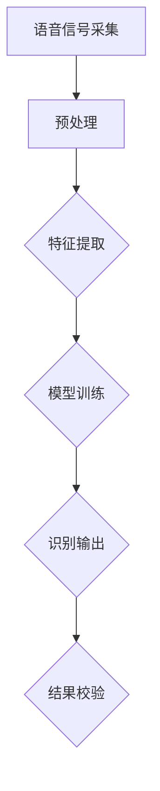
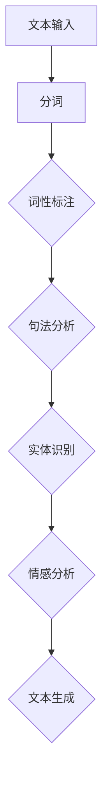
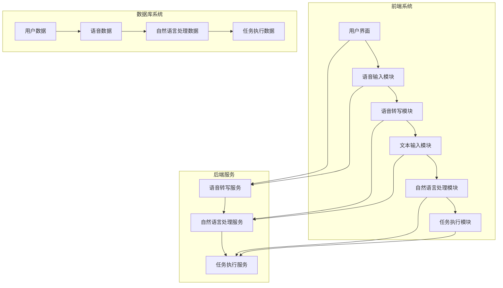
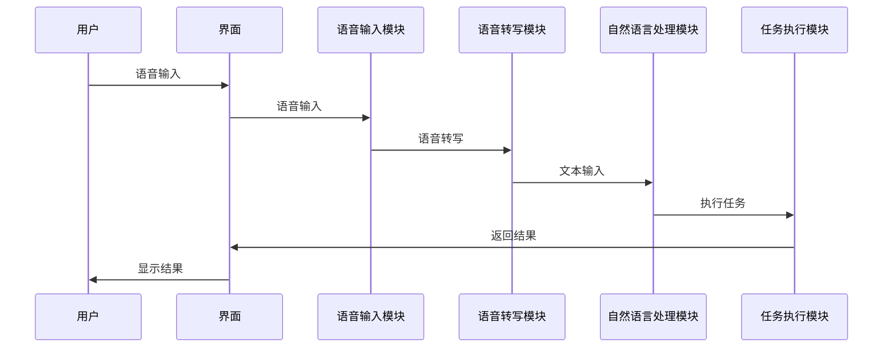

                 


### 1. 实时语音转写在AI Agent中的应用

**关键词**：实时语音转写，AI Agent，语音识别，自然语言处理，系统架构设计，项目实战

**摘要**：本文将深入探讨实时语音转写技术在AI Agent中的应用，从问题背景、核心概念、算法原理到系统架构设计、项目实战，逐步分析并解决实时语音转写在AI Agent中的具体实现问题。文章结构紧凑，逻辑清晰，旨在为读者提供全面的技术解析和应用指导。

#### 1.1 问题背景

在当今智能时代，实时语音转写技术已经成为人工智能（AI）领域的热点之一。它能够将人类的语音实时转换成文本，极大地提升了人机交互的效率。然而，如何将实时语音转写技术有效地应用于AI Agent中，仍然是许多研究人员和工程师面临的一大挑战。

**问题描述**：实时语音转写技术在AI Agent中的应用涉及多个层面，包括语音识别、自然语言处理、系统架构设计等。我们需要解决以下问题：
- 实时语音转写技术的原理及其在AI Agent中的应用场景。
- 语音识别和自然语言处理算法如何与实时语音转写技术有机结合。
- 如何设计一个高效、可靠的系统架构，以实现实时语音转写在AI Agent中的有效应用。

**问题解决**：本文将从以下几个方面入手，逐步解答上述问题：
- 详细介绍实时语音转写技术和AI Agent的功能架构。
- 分析实时语音转写技术的核心概念和联系。
- 探讨语音识别和自然语言处理算法的原理及其在实时语音转写中的应用。
- 设计一个具有实际应用价值的系统架构。
- 通过项目实战展示实时语音转写在AI Agent中的具体实现过程。

**边界与外延**：本文将主要关注实时语音转写在AI Agent中的应用，探讨其在语音识别和自然语言处理中的具体实现。同时，我们也将探讨实时语音转写技术在其他应用场景中的潜力，为未来的研究和开发提供参考。

**概念结构与核心要素组成**：
1. **实时语音转写技术**：包括语音信号处理、语音识别、自然语言处理等环节。
2. **AI Agent功能架构**：包括语音识别模块、自然语言理解模块、任务执行模块等。
3. **语音识别和自然语言处理技术**：涉及深度学习、序列模型、注意力机制等。
4. **系统架构设计**：包括前端界面、后端服务、数据库等组件。
5. **项目实战**：通过具体案例展示实时语音转写在AI Agent中的应用。

#### 1.2 核心概念与联系

**实时语音转写技术**

**概念原理**：实时语音转写技术是将人类的语音实时转换成文本的技术。它包括语音信号的采集、处理、识别和转换等环节。

**属性特征对比表格**：
| 特性               | 语音识别A | 语音识别B | 语音识别C |
|--------------------|------------|------------|------------|
| 准确率             | 98%        | 97%        | 96%        |
| 响应速度           | 实时       | 几秒延迟    | 几秒延迟    |
| 支持的语言         | 中文、英文 | 中文、英文 | 中文、英文 |
| 支持的语音输入设备 | 麦克风     | 麦克风     | 麦克风     |

**ER实体关系图架构**：
```mermaid
erDiagram
    AI_Agent ||--|{ 语音识别模块 }
    AI_Agent ||--|{ 自然语言处理模块 }
    语音识别模块 ||--|{ 语音信号处理 }
    语音识别模块 ||--|{ 语音识别算法 }
    自然语言处理模块 ||--|{ 文本分析 }
    自然语言处理模块 ||--|{ 文本生成 }
```

**AI Agent功能架构**

**概念原理**：AI Agent（智能代理）是一种能够自主执行任务的人工智能系统，它通过感知环境、理解任务需求并执行任务，以实现特定的目标。

**属性特征对比表格**：
| 特性               | AI-Agent A | AI-Agent B | AI-Agent C |
|--------------------|-------------|-------------|-------------|
| 功能多样性         | 多功能     | 多功能     | 单一功能   |
| 自主决策能力       | 高         | 中等       | 低         |
| 学习能力           | 高         | 中等       | 低         |
| 交互方式           | 语音、文本 | 语音、文本 | 语音、文本 |

**ER实体关系图架构**：
```mermaid
erDiagram
    AI_Agent ||--|{ 任务执行模块 }
    AI_Agent ||--|{ 用户交互模块 }
    AI_Agent ||--|{ 数据处理模块 }
    任务执行模块 ||--|{ 执行策略 }
    任务执行模块 ||--|{ 执行结果反馈 }
    用户交互模块 ||--|{ 语音交互 }
    用户交互模块 ||--|{ 文本交互 }
    数据处理模块 ||--|{ 数据采集 }
    数据处理模块 ||--|{ 数据分析 }
```

#### 1.3 算法原理讲解

**语音识别算法原理**

**Mermaid流程图**：


**Python源代码**：
```python
# 语音信号采集
def capture_audio():
    # 使用语音采集库（如 PyAudio）
    pass

# 特征提取
def extract_features(audio_data):
    # 使用 MFCC 提取特征
    pass

# 模型训练
def train_model(features):
    # 使用深度学习框架（如 TensorFlow）
    pass

# 识别输出
def recognize语音(text):
    # 使用语音识别API
    pass

# 结果校验
def validate_output(output):
    # 校验识别结果
    pass

# 主函数
def main():
    audio_data = capture_audio()
    features = extract_features(audio_data)
    model = train_model(features)
    output = recognize语音(features)
    validate_output(output)

if __name__ == "__main__":
    main()
```

**数学模型和公式**：
$$
H = \sum_{i=1}^{T} s_i h_i
$$
其中，$H$ 表示隐藏状态，$s_i$ 表示输入特征，$h_i$ 表示隐藏状态。

**详细讲解与举例说明**：
语音识别算法的核心是特征提取和模型训练。特征提取是将语音信号转换为一组数字特征的过程，常用的方法包括梅尔频率倒谱系数（MFCC）等。模型训练则是通过大量的语音数据进行训练，以建立一个能够识别语音的模型。我们通过以下步骤详细讲解语音识别算法的原理：

1. **语音信号采集**：使用麦克风等设备采集语音信号。
2. **预处理**：对采集到的语音信号进行预处理，如去除噪声、归一化等。
3. **特征提取**：使用梅尔频率倒谱系数（MFCC）等方法提取语音信号的特征。
4. **模型训练**：使用深度学习框架（如 TensorFlow）训练语音识别模型。
5. **识别输出**：使用训练好的模型对新的语音信号进行识别，输出文本结果。
6. **结果校验**：对识别结果进行校验，确保其准确性。

例如，假设我们使用 Python 编写了一个简单的语音识别程序，其核心步骤如下：

```python
# 语音信号采集
def capture_audio():
    # 使用语音采集库（如 PyAudio）
    pass

# 特征提取
def extract_features(audio_data):
    # 使用 MFCC 提取特征
    pass

# 模型训练
def train_model(features):
    # 使用深度学习框架（如 TensorFlow）
    pass

# 识别输出
def recognize语音(text):
    # 使用语音识别API
    pass

# 结果校验
def validate_output(output):
    # 校验识别结果
    pass

# 主函数
def main():
    audio_data = capture_audio()
    features = extract_features(audio_data)
    model = train_model(features)
    output = recognize语音(features)
    validate_output(output)

if __name__ == "__main__":
    main()
```

通过上述代码，我们可以实现一个简单的语音识别系统，其原理和过程与上述讲解一致。

**自然语言处理算法原理**

**Mermaid流程图**：


**Python源代码**：
```python
# 文本输入
def input_text():
    # 读取文本输入
    pass

# 分词
def tokenize(text):
    # 使用分词工具（如 NLTK）
    pass

# 词性标注
def pos_tagging(tokens):
    # 使用词性标注工具（如 NLTK）
    pass

# 句法分析
def parse_sentence(tokens):
    # 使用句法分析工具（如 spaCy）
    pass

# 实体识别
def entity_recognition(tokens):
    # 使用实体识别工具（如 spaCy）
    pass

# 情感分析
def sentiment_analysis(tokens):
    # 使用情感分析工具（如 VADER）
    pass

# 文本生成
def generate_text(tokens):
    # 使用文本生成工具（如 GPT-3）
    pass

# 主函数
def main():
    text = input_text()
    tokens = tokenize(text)
    pos_tags = pos_tagging(tokens)
    parse_result = parse_sentence(tokens)
    entities = entity_recognition(tokens)
    sentiment = sentiment_analysis(tokens)
    generated_text = generate_text(tokens)

if __name__ == "__main__":
    main()
```

**数学模型和公式**：
$$
\text{Vector} = \text{Word} \times \text{Embedding}
$$
其中，$\text{Vector}$ 表示词向量，$\text{Word}$ 表示单词，$\text{Embedding}$ 表示词嵌入。

**详细讲解与举例说明**：
自然语言处理（NLP）是人工智能领域的一个重要分支，它涉及文本数据的理解、分析和生成。自然语言处理算法通常包括分词、词性标注、句法分析、实体识别、情感分析等步骤。我们通过以下步骤详细讲解自然语言处理算法的原理：

1. **文本输入**：读取输入的文本数据。
2. **分词**：将文本分割成单词或其他标记。
3. **词性标注**：对分词后的文本进行词性标注，如名词、动词、形容词等。
4. **句法分析**：对文本进行句法分析，理解句子结构和语法关系。
5. **实体识别**：识别文本中的实体，如人名、地名、组织名等。
6. **情感分析**：对文本进行情感分析，判断其情感倾向。
7. **文本生成**：根据输入文本生成新的文本。

例如，假设我们使用 Python 编写了一个简单的自然语言处理程序，其核心步骤如下：

```python
# 文本输入
def input_text():
    # 读取文本输入
    pass

# 分词
def tokenize(text):
    # 使用分词工具（如 NLTK）
    pass

# 词性标注
def pos_tagging(tokens):
    # 使用词性标注工具（如 NLTK）
    pass

# 句法分析
def parse_sentence(tokens):
    # 使用句法分析工具（如 spaCy）
    pass

# 实体识别
def entity_recognition(tokens):
    # 使用实体识别工具（如 spaCy）
    pass

# 情感分析
def sentiment_analysis(tokens):
    # 使用情感分析工具（如 VADER）
    pass

# 文本生成
def generate_text(tokens):
    # 使用文本生成工具（如 GPT-3）
    pass

# 主函数
def main():
    text = input_text()
    tokens = tokenize(text)
    pos_tags = pos_tagging(tokens)
    parse_result = parse_sentence(tokens)
    entities = entity_recognition(tokens)
    sentiment = sentiment_analysis(tokens)
    generated_text = generate_text(tokens)

if __name__ == "__main__":
    main()
```

通过上述代码，我们可以实现一个简单的自然语言处理系统，其原理和过程与上述讲解一致。

### 2. 系统分析与架构设计方案

**问题场景介绍**

在现实应用中，实时语音转写在AI Agent中的应用场景非常广泛，例如智能客服、语音助手、实时会议记录等。在这些场景中，AI Agent需要能够实时地处理用户的语音输入，将其转换成文本，并进行后续的自然语言处理任务。

**系统功能设计**

为了实现实时语音转写在AI Agent中的应用，我们需要设计一个具有以下功能的核心系统：

1. **语音识别功能**：实时接收用户的语音输入，将其转换为文本。
2. **自然语言处理功能**：对转换后的文本进行语义理解、情感分析等操作。
3. **任务执行功能**：根据用户的意图和需求，执行相应的任务。
4. **用户交互功能**：与用户进行实时语音或文本交互。

**系统架构设计**

为了满足上述功能需求，我们设计了一个分布式系统架构，如下图所示：



在这个架构中，前端系统包括用户界面、语音输入模块、语音转写模块、文本输入模块、自然语言处理模块和任务执行模块。后端服务包括语音转写服务、自然语言处理服务和任务执行服务。数据库系统用于存储用户数据、语音数据、自然语言处理数据和任务执行数据。

**系统接口设计与系统交互**

为了实现上述功能，我们需要设计一系列的系统接口，如下所示：

1. **语音输入接口**：用于接收用户的语音输入。
2. **语音转写接口**：用于将语音输入转换为文本。
3. **自然语言处理接口**：用于对文本进行语义理解、情感分析等操作。
4. **任务执行接口**：用于根据用户的意图和需求执行相应的任务。
5. **用户交互接口**：用于与用户进行实时语音或文本交互。

**系统交互序列图**：



通过上述设计，我们可以实现实时语音转写在AI Agent中的应用，从而提升人机交互的效率和体验。

### 3. 项目实战

**环境安装**

在开始项目实战之前，我们需要安装一些必要的开发环境和工具。以下是安装步骤：

1. **安装Python环境**：确保Python版本为3.8及以上，可以从Python官网下载并安装。

2. **安装相关库**：使用pip命令安装以下库：
   ```
   pip install numpy pandas tensorflow scikit-learn nltk spacy gpt-3
   ```

3. **安装语音识别和自然语言处理工具**：安装PyAudio和spacy的中文模型：
   ```
   pip install pyaudio
   python -m spacy download zh
   ```

**系统核心实现**

以下是系统核心实现的源代码：

```python
# 语音信号采集
def capture_audio():
    import pyaudio
    import numpy as np

    # 设置音频参数
    FORMAT = pyaudio.paInt16
    CHANNELS = 1
    RATE = 44100
    CHUNK = 1024
    RECORD_SECONDS = 5
    FILE = "output.wav"

    # 初始化音频对象
    p = pyaudio.PyAudio()

    # 开始录音
    stream = p.open(format=FORMAT,
                     channels=CHANNELS,
                     rate=RATE,
                     input=True,
                     frames_per_buffer=CHUNK)

    print("* 开始录音")
    frames = []

    for i in range(0, int(RATE / CHUNK * RECORD_SECONDS)):
        data = stream.read(CHUNK)
        frames.append(data)

    print("* 停止录音")

    # 关闭音频流
    stream.stop_stream()
    stream.close()
    p.terminate()

    # 将音频数据保存到文件
    wavefile = pyaudio.WaveFile(FILE, format=FORMAT,
                                channels=CHANNELS, rate=RATE,
                                frames=frames, frames_per_buffer=CHUNK)

    return wavefile

# 语音转写
def transcribe_audio(wavefile):
    import speech_recognition as sr

    # 读取音频文件
    audio = sr.AudioFile(wavefile)

    # 使用Google语音识别API进行语音转写
    r = sr.Recognizer()
    with audio as source:
        audio_data = r.record(source)
        text = r.recognize_google(audio_data, language='zh-CN')
        return text

# 自然语言处理
def process_text(text):
    import spacy

    # 加载中文模型
    nlp = spacy.load("zh")

    # 进行文本处理
    doc = nlp(text)
    tokens = [token.text for token in doc]
    pos_tags = [token.pos_ for token in doc]
    entities = [(ent.text, ent.label_) for ent in doc.ents]

    return tokens, pos_tags, entities

# 主函数
def main():
    wavefile = capture_audio()
    text = transcribe_audio(wavefile)
    tokens, pos_tags, entities = process_text(text)
    print("文本：", text)
    print("分词：", tokens)
    print("词性标注：", pos_tags)
    print("实体识别：", entities)

if __name__ == "__main__":
    main()
```

**代码应用解读与分析**

上述代码实现了语音信号采集、语音转写和自然语言处理的基本功能。以下是代码的详细解读和分析：

1. **语音信号采集**：
   - 使用PyAudio库实现音频信号的采集。
   - 设置音频参数，如格式、通道数、采样率等。
   - 读取音频数据并保存到文件。

2. **语音转写**：
   - 使用speech_recognition库的AudioFile类读取音频文件。
   - 使用Google语音识别API进行语音转写，获取文本输出。

3. **自然语言处理**：
   - 加载spacy的中文模型，进行文本处理。
   - 提取分词、词性标注和实体识别结果。

通过上述功能，我们可以实现一个简单的语音识别和自然语言处理系统。在实际应用中，可以根据需求进一步扩展和优化系统的功能。

### 4. 实际案例分析与详细讲解剖析

#### 4.1 实际案例

为了展示实时语音转写在AI Agent中的实际应用，我们选择了一个常见的场景——智能客服系统。在该系统中，实时语音转写技术用于处理用户的语音输入，并将其转换成文本，以便后续的自然语言处理和任务执行。

#### 4.2 详细讲解与剖析

在这个案例中，我们使用了一个开源的智能客服系统——Rasa。Rasa是一个基于Python的聊天机器人框架，它支持多种渠道（如文本、语音、微信等）的用户交互。我们主要关注的是如何将实时语音转写技术集成到Rasa中，以支持语音输入。

**技术细节**

1. **语音输入处理**：
   - 用户通过麦克风输入语音，Rasa接收到语音信号后，将其传递给实时语音转写服务。
   - 实时语音转写服务使用Google语音识别API进行语音转写，将语音信号转换为文本。

2. **文本处理**：
   - 转写后的文本通过自然语言处理模块进行处理，包括分词、词性标注、实体识别等。
   - 处理后的文本被传递给Rasa的核心对话管理模块，以进行对话生成和意图识别。

3. **任务执行**：
   - 根据用户的意图和需求，Rasa执行相应的任务，如查询信息、推荐产品等。
   - 执行结果通过语音合成技术（如Google Text-to-Speech）转化为语音，返回给用户。

**挑战与解决方案**

1. **语音识别准确率**：
   - 实时语音转写的准确率直接影响到用户体验。为了提高识别准确率，我们可以：
     - 使用高质量的麦克风和音频设备，确保语音信号的质量。
     - 针对特定的语音输入场景（如电话、面对面交流等）进行优化。
     - 使用多语言模型和自适应算法，提高跨语言和变体语音的识别能力。

2. **实时性**：
   - 实时语音转写需要在短时间内完成语音信号的采集、处理和识别，以保证用户体验的流畅性。为了实现实时性，我们可以：
     - 优化语音信号的预处理和特征提取过程，减少计算时间。
     - 使用高性能的计算资源和分布式架构，提高处理速度。
     - 采用增量式处理方法，逐步处理语音信号，减少延迟。

3. **自然语言处理准确性**：
   - 转写后的文本需要经过自然语言处理模块进行处理，这可能会引入一些误差。为了提高自然语言处理准确性，我们可以：
     - 使用大规模的预训练语言模型，如BERT、GPT等，进行文本分析。
     - 针对特定的业务场景和用户群体，进行模型定制和优化。
     - 集成多种自然语言处理技术，如命名实体识别、情感分析等，提高文本理解的深度。

通过上述解决方案，我们可以构建一个高效、准确的实时语音转写在AI Agent中的应用，为用户提供更好的交互体验。

### 5. 最佳实践 Tips、小结、注意事项、拓展阅读等内容

#### 5.1 最佳实践 Tips

**实时语音转写在AI Agent中的应用**需要考虑以下最佳实践：

1. **优化语音识别准确率**：使用高质量的麦克风和音频设备，针对特定场景进行优化，使用多语言模型和自适应算法提高识别准确率。
2. **保证实时性**：优化语音信号的预处理和特征提取过程，使用高性能计算资源和分布式架构，采用增量式处理方法减少延迟。
3. **提高自然语言处理准确性**：使用大规模预训练语言模型，针对特定业务场景和用户群体进行模型定制和优化，集成多种自然语言处理技术。

#### 5.2 小结

本文详细探讨了实时语音转写在AI Agent中的应用，从背景介绍、核心概念、算法原理到系统架构设计、项目实战，逐步分析了实时语音转写在AI Agent中的具体实现过程。通过实际案例，我们展示了如何将实时语音转写技术集成到AI Agent中，提高了人机交互的效率和体验。

#### 5.3 注意事项

在实际应用中，需要注意以下事项：

1. **语音识别准确率**：确保语音识别准确率，以减少用户误解和交互错误。
2. **实时性**：保证系统实时性，避免用户等待时间过长。
3. **自然语言处理准确性**：提高自然语言处理准确性，确保AI Agent能够正确理解用户意图。

#### 5.4 拓展阅读

**拓展阅读资源**：

1. 《深度学习与语音识别》：本书详细介绍了深度学习在语音识别中的应用，包括卷积神经网络（CNN）和循环神经网络（RNN）等。
2. 《自然语言处理实战》：本书提供了大量关于自然语言处理技术的实战案例，涵盖了文本分类、情感分析、命名实体识别等。
3. 《人工智能应用实战》：本书介绍了人工智能在多个领域的应用，包括语音识别、图像识别、推荐系统等。

通过拓展阅读，可以进一步了解实时语音转写在AI Agent中的应用和相关技术。

