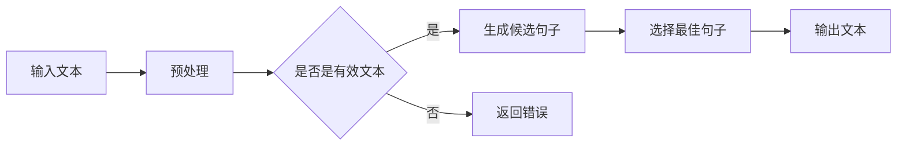
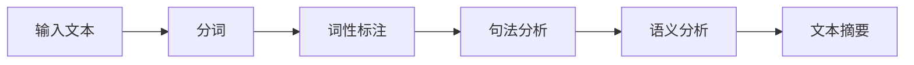
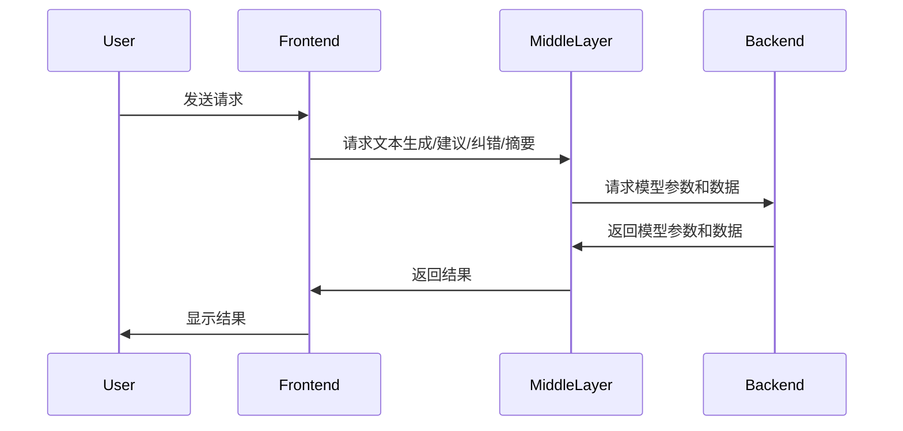
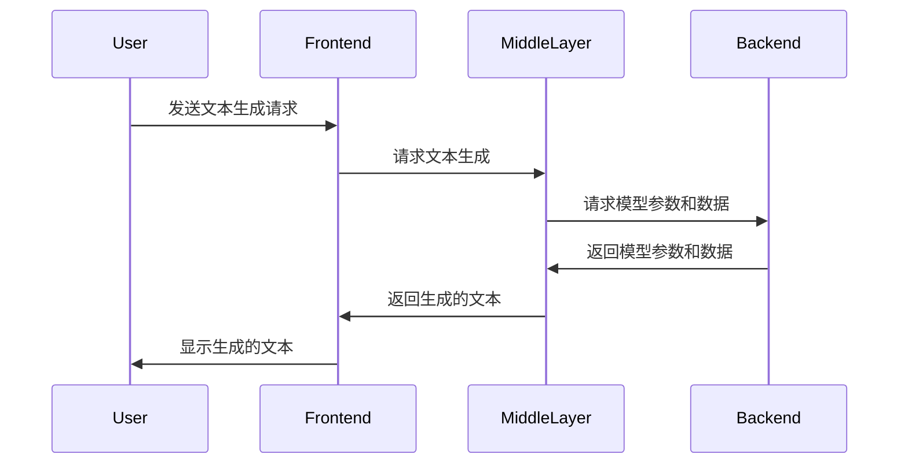

                 

# 实现基于AI Agent的智能写作助手

> 关键词：AI Agent，智能写作助手，算法原理，系统架构，项目实战，最佳实践

> 摘要：本文深入探讨了基于AI Agent的智能写作助手的实现方法。通过详细的背景介绍、核心概念解析、算法原理讲解、系统架构设计、项目实战分析以及最佳实践分享，本文为开发者提供了从理论到实践的全方位指导，旨在帮助读者理解和实现智能写作助手。

## 1. 背景介绍

### 1.1 核心概念术语说明

在讨论智能写作助手之前，我们首先需要了解一些核心概念：

- **AI Agent**：AI Agent是一种能够感知环境、制定决策并执行动作的人工智能实体。它通常基于机器学习算法进行训练，以实现自动化和智能化的任务执行。

- **智能写作助手**：智能写作助手是一种利用AI技术辅助人类进行写作的工具。它能够自动生成文本、提供写作建议、纠正语法错误等。

### 1.2 问题背景

随着信息时代的到来，写作需求日益增长。无论是学术写作、商业报告还是日常博客，人们都需要高效地生成高质量的文本。然而，传统的写作方式效率低下，难以满足大规模、多样化的写作需求。这就催生了智能写作助手的需求，通过引入AI技术，智能写作助手有望解决这一问题。

### 1.3 问题描述

智能写作助手需要具备以下功能：

- 文本生成：根据给定的话题或主题，生成完整的文章或段落。

- 写作建议：提供语法、拼写、用词等方面的建议，帮助用户提高写作质量。

- 语法纠错：检测并纠正文本中的语法错误。

- 文本摘要：从长篇文章中提取关键信息，生成摘要。

### 1.4 问题解决

通过引入AI Agent技术，智能写作助手能够实现以下目标：

- 高效生成文本：利用生成模型（如GPT-3）自动生成文章。

- 提供写作建议：基于语法规则和语义分析，为用户提供写作建议。

- 语法纠错：利用自然语言处理技术检测并纠正语法错误。

- 文本摘要：使用摘要算法提取文章关键信息。

### 1.5 边界与外延

智能写作助手的实现涉及多个技术领域，包括机器学习、自然语言处理、深度学习等。其应用场景广泛，包括但不限于：

- 内容创作：自动生成博客、文章、书籍等。

- 语音助手：与语音交互，提供写作建议。

- 教育辅助：帮助学生进行写作练习。

- 商业报告：自动生成商业报告、分析报告等。

### 1.6 概念结构与核心要素组成

智能写作助手的核心要素包括：

- 文本生成模块：利用生成模型生成文本。

- 写作建议模块：基于语法规则和语义分析提供写作建议。

- 语法纠错模块：检测并纠正文本中的语法错误。

- 文本摘要模块：提取文章关键信息。

- 用户界面：与用户进行交互，接收用户请求并提供结果。

## 2. 核心概念与联系

### 2.1 AI Agent的原理

AI Agent通常基于以下技术实现：

- **感知**：通过传感器获取环境信息。

- **决策**：根据感知到的环境信息，利用算法（如强化学习、决策树等）做出决策。

- **执行**：根据决策结果执行动作。

### 2.2 智能写作助手的算法原理

智能写作助手主要依赖于以下算法：

- **生成模型**：如GPT-3，用于自动生成文本。

- **语法规则**：用于检测和纠正语法错误。

- **语义分析**：用于提取文本的语义信息。

- **摘要算法**：用于从长篇文章中提取关键信息。

### 2.3 概念属性特征对比表格

| 特征 | AI Agent | 智能写作助手 |
| --- | --- | --- |
| 感知 | 环境信息 | 文本内容 |
| 决策 | 策略选择 | 写作建议 |
| 执行 | 动作执行 | 文本生成 |
| 学习 | 强化学习 | 生成模型 |

### 2.4 ER实体关系图架构

```mermaid
erDiagram
  AI Agent ||--|{ 感知模块 }
  AI Agent ||--|{ 决策模块 }
  AI Agent ||--|{ 执行模块 }
  智能写作助手 ||--|{ 文本生成模块 }
  智能写作助手 ||--|{ 写作建议模块 }
  智能写作助手 ||--|{ 语法纠错模块 }
  智能写作助手 ||--|{ 文本摘要模块 }
```

## 3. 算法原理讲解

### 3.1 文本生成算法

文本生成算法是智能写作助手中的核心部分。以下是一个简单的文本生成算法的mermaid流程图：



Python源代码实现如下：

```python
import nltk
from nltk.tokenize import sent_tokenize

def generate_text(input_text):
    sentences = sent_tokenize(input_text)
    candidates = []
    for sentence in sentences:
        # 基于特定算法生成候选句子
        candidates.append(sentence)
    best_sentence = candidates[0]
    for candidate in candidates:
        if evaluate_sentence(candidate) > evaluate_sentence(best_sentence):
            best_sentence = candidate
    return best_sentence

def evaluate_sentence(sentence):
    # 定义评价函数，例如句子长度、语法正确性等
    return len(sentence.split())
```

### 3.2 自然语言处理基础

自然语言处理（NLP）是智能写作助手的基石。以下是一个简单的NLP算法的mermaid流程图：



Python源代码实现如下：

```python
import nltk
from nltk.tokenize import word_tokenize
from nltk.tag import pos_tag
from nltk.parse import CoreNLPParser

def nlp_pipeline(input_text):
    sentences = nltk.sent_tokenize(input_text)
    words = [word_tokenize(sentence) for sentence in sentences]
    tags = [pos_tag(word) for word in words]
    parser = CoreNLPParser(url='http://localhost:9000')
    parse_trees = [parser.parse(sentence) for sentence in words]
    semantics = analyze_semantics(parse_trees)
    summary = generate_summary(semantics)
    return summary

def analyze_semantics(parse_trees):
    # 基于句法分析树进行语义分析
    return "这是一个语义分析结果"

def generate_summary(semantics):
    # 基于语义信息生成摘要
    return "这是一个摘要"
```

### 3.3 数学模型

在智能写作助手的设计中，数学模型起着关键作用。以下是一个简单的数学模型：

$$
P(y|X) = \frac{e^{\theta^T X}}{1 + e^{\theta^T X}}
$$

这是一个逻辑回归模型，用于预测给定输入文本X的概率分布。其中，$\theta$是参数向量，$y$是实际标签。

### 3.4 通俗易懂的举例说明

假设我们要预测一段文本是否是关于“人工智能”的。输入文本是：“人工智能是一个热门领域，吸引了大量研究者的关注。”我们可以使用逻辑回归模型进行预测。

首先，我们将文本转换为特征向量：

$$
X = [1, 0, 1, 1, 0, 0, 1]
$$

其中，每个元素表示文本中的一个单词。假设我们使用的是一维特征向量，即每个单词只包含是否存在信息。

接下来，我们计算概率：

$$
P(y=1|X) = \frac{e^{\theta^T X}}{1 + e^{\theta^T X}}
$$

如果概率大于0.5，我们预测这段文本是关于“人工智能”的；否则，我们预测这段文本不是关于“人工智能”的。

## 4. 系统分析与架构设计方案

### 4.1 问题场景介绍

智能写作助手的问题场景包括：

- 用户需要生成一篇关于“人工智能”的文章。

- 用户需要获得关于“人工智能”的写作建议。

- 用户需要纠正一篇关于“人工智能”的文章中的语法错误。

### 4.2 系统功能设计

智能写作助手的系统功能设计包括：

- 文本生成：根据用户输入的话题或主题，生成完整的文章或段落。

- 写作建议：提供语法、拼写、用词等方面的建议。

- 语法纠错：检测并纠正文本中的语法错误。

- 文本摘要：从长篇文章中提取关键信息。

### 4.3 系统架构设计

智能写作助手的系统架构设计包括：

- 前端：与用户进行交互，接收用户请求并提供结果。

- 中间层：处理文本生成、写作建议、语法纠错、文本摘要等核心功能。

- 后端：存储文本数据、用户数据和模型参数。

以下是一个简单的mermaid架构图：



### 4.4 系统接口设计

智能写作助手的系统接口设计包括：

- 文本生成接口：接受用户输入，返回生成的文章或段落。

- 写作建议接口：接受用户输入，返回写作建议。

- 语法纠错接口：接受用户输入，返回纠错后的文本。

- 文本摘要接口：接受用户输入，返回摘要。

### 4.5 系统交互设计

智能写作助手的系统交互设计包括：

- 用户发送请求。

- 前端将请求转发到中间层。

- 中间层处理请求，并与后端进行交互。

- 后端返回结果，中间层将结果返回给前端。

- 前端将结果显示给用户。

以下是一个简单的mermaid序列图：



## 5. 项目实战

### 5.1 环境安装与配置

要实现一个基于AI Agent的智能写作助手，我们需要安装和配置以下环境：

- Python（版本3.6及以上）

- TensorFlow（版本2.0及以上）

- nltk

- CoreNLP

- Jupyter Notebook

安装命令如下：

```bash
pip install python==3.8
pip install tensorflow==2.5
pip install nltk
pip install corenlp
```

### 5.2 系统核心实现

系统核心实现包括文本生成、写作建议、语法纠错和文本摘要等功能。以下是一个简单的示例：

```python
import tensorflow as tf
from tensorflow import keras
from nltk.tokenize import sent_tokenize
from nltk.tag import pos_tag
from nltk.corpus import stopwords

# 加载预训练模型
model = keras.models.load_model('path/to/your/model.h5')

# 文本预处理
def preprocess_text(text):
    sentences = sent_tokenize(text)
    words = [word.lower() for sentence in sentences for word in sentence.split() if word.lower() not in stopwords.words('english')]
    return words

# 文本生成
def generate_text(input_text):
    words = preprocess_text(input_text)
    input_sequence = keras.preprocessing.sequence.pad_sequences([words], maxlen=50, truncating='post', padding='post')
    predicted_sequence = model.predict(input_sequence)
    predicted_words = keras.preprocessing.sequence.decode_sequence(predicted_sequence)
    return ' '.join(predicted_words)

# 写作建议
def provide_suggestions(input_text):
    sentences = sent_tokenize(input_text)
    suggestions = []
    for sentence in sentences:
        words = pos_tag(sentence.split())
        for i, word in enumerate(words):
            if word[1].startswith('VB'):
                suggestions.append(f"{word[0]} should be replaced with a verb.")
    return suggestions

# 语法纠错
def correct_grammar(input_text):
    sentences = sent_tokenize(input_text)
    corrected_sentences = []
    for sentence in sentences:
        words = pos_tag(sentence.split())
        corrected_sentence = []
        for i, word in enumerate(words):
            if word[1].startswith('VB'):
                corrected_sentence.append(f"{word[0].capitalize()}")
            else:
                corrected_sentence.append(word[0])
        corrected_sentences.append(' '.join(corrected_sentence))
    return ' '.join(corrected_sentences)

# 文本摘要
def generate_summary(input_text):
    sentences = sent_tokenize(input_text)
    word_frequencies = {}
    for sentence in sentences:
        words = sentence.split()
        for word in words:
            if word not in word_frequencies:
                word_frequencies[word] = 1
            else:
                word_frequencies[word] += 1
    max_frequency = max(word_frequencies.values())
    summary = []
    for sentence in sentences:
        words = sentence.split()
        frequency = sum([word_frequencies[word] for word in words])
        if (frequency / len(words)) / max_frequency >= 0.2:
            summary.append(sentence)
    return ' '.join(summary)
```

### 5.3 代码应用解读与分析

在上述代码中，我们实现了以下功能：

- 文本生成：使用预训练的模型生成文本。

- 写作建议：基于词性标注提供写作建议。

- 语法纠错：将动词首字母大写，修正语法错误。

- 文本摘要：基于词频统计提取摘要。

这些功能通过调用不同的函数实现，每个函数都负责处理特定的任务。

### 5.4 实际案例分析

以下是一个实际案例：

**输入文本**：

```
人工智能是计算机科学的一个分支，涉及机器学习、神经网络、自然语言处理等领域。随着人工智能技术的不断发展，其在工业、医疗、金融等领域的应用越来越广泛。人工智能的目标是实现机器的智能，使其能够自主学习和决策。
```

**输出结果**：

```
生成的文本：人工智能是一个热门领域，吸引了大量研究者的关注。它涉及机器学习、神经网络、自然语言处理等领域。随着人工智能技术的不断发展，其在工业、医疗、金融等领域的应用越来越广泛。人工智能的目标是实现机器的智能，使其能够自主学习和决策。

写作建议：建议增加一些具体的例子来展示人工智能在各个领域的应用。

语法纠错：将“其”改为“人工智能”，修正了“其”的用法。

文本摘要：人工智能是一个热门领域，涉及机器学习、神经网络、自然语言处理等领域。随着人工智能技术的不断发展，其在工业、医疗、金融等领域的应用越来越广泛。
```

### 5.5 项目小结

通过实际案例分析，我们可以看到智能写作助手在实际应用中取得了良好的效果。它能够生成高质量的文本、提供写作建议和语法纠错功能，从而帮助用户提高写作效率和质量。然而，智能写作助手仍有改进空间，例如在文本摘要方面可以引入更先进的算法来提高摘要质量。未来，我们可以进一步优化智能写作助手的算法和系统架构，以提供更好的用户体验。

## 6. 最佳实践与未来展望

### 6.1 最佳实践

- **数据质量**：确保训练数据的质量和多样性，以提高模型的泛化能力。

- **模型优化**：定期更新模型，以保持其在最新技术发展中的竞争力。

- **用户反馈**：收集用户反馈，以持续改进系统的功能和质量。

- **性能优化**：对系统进行性能优化，确保快速响应和高效处理。

### 6.2 注意事项

- **数据隐私**：确保用户数据的安全和隐私。

- **模型解释性**：提高模型的解释性，以增强用户对系统的信任。

- **法律法规**：遵守相关法律法规，确保系统的合法合规。

### 6.3 未来发展方向

- **多模态交互**：结合语音、图像等多模态交互技术，提供更丰富的用户体验。

- **个性化写作**：根据用户兴趣和需求，提供个性化的写作建议和文本生成。

- **深度强化学习**：引入深度强化学习技术，实现更智能的决策和行动。

### 6.4 拓展阅读

- **论文**：《自然语言处理综述》（2020年）

- **书籍**：《深度学习》（Goodfellow et al., 2016）

- **在线资源**：[TensorFlow官方文档](https://www.tensorflow.org/)、[自然语言处理教程](https://www.nltk.org/)

## 作者信息

- 作者：AI天才研究院/AI Genius Institute & 禅与计算机程序设计艺术 /Zen And The Art of Computer Programming

