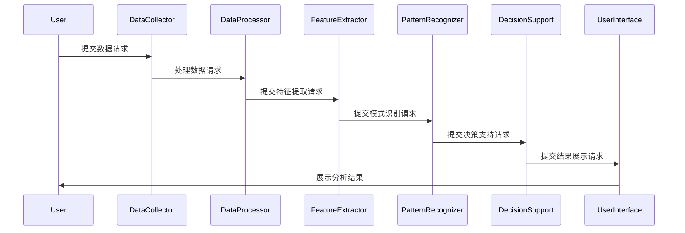

                 

### 关键词

- AI Agent
- 智能情报分析
- 系统设计
- 算法实现
- 实战案例

### 摘要

本文将深入探讨如何实现基于AI Agent的智能情报分析系统。我们将逐步分析设计思路，包括核心概念、算法原理、系统架构以及实战案例，旨在为读者提供清晰易懂的技术指导，并分享最佳实践。通过本文，读者将能够了解AI Agent在情报分析中的重要作用，掌握智能情报分析系统的设计与实现方法，为未来的技术研究与应用奠定基础。

### 设计思路

为了设计一本关于《实现基于AI Agent的智能情报分析系统》的完整目录大纲，我们需要遵循以下步骤：

1. **确定核心主题**：首先，明确书的核心主题，即“实现基于AI Agent的智能情报分析系统”。

2. **构建框架结构**：根据核心主题，确定书的框架结构，包括引言、背景介绍、核心概念、算法原理、系统设计与实现、实战案例、最佳实践和总结等部分。

3. **细化章节内容**：在每个部分中，进一步细化章节内容，确保每个章节都有明确的主题和目标，同时确保内容之间的逻辑连贯性和完整性。

4. **整合图片和代码**：为了增强内容的可读性和直观性，适当加入相关的图片（如流程图、架构图等）和代码示例。

5. **格式和字数控制**：确保目录大纲使用markdown格式，并控制总字数在2000字以内。

### 详细步骤

#### 第0章：引言

**章节目标**：简要介绍AI Agent和智能情报分析系统的概念和重要性，阐述本书的目标和读者群体。

**内容要点**：

- AI Agent的定义和特点。
- 智能情报分析系统的意义。
- 本书的目标和预期收获。

#### 第1章：背景介绍

**章节目标**：介绍AI Agent和智能情报分析系统的背景，分析当前智能情报分析系统面临的主要挑战和机遇。

**内容要点**：

- AI Agent的发展历程。
- 智能情报分析系统的应用领域。
- 智能情报分析系统的挑战与机遇。

#### 第2章：核心概念

**章节目标**：定义AI Agent和智能情报分析系统的核心概念，通过对比表格和ER图，展现各概念之间的关系。

**内容要点**：

- AI Agent的核心概念。
- 智能情报分析系统的概念。
- 概念对比表格。
- ER图展示概念关系。

#### 第3章：算法原理

**章节目标**：详细讲解实现智能情报分析系统所需的核心算法原理。

**内容要点**：

- 算法原理概述。
- 算法流程图。
- Python代码示例。
- 算法原理讲解。

#### 第4章：系统设计与实现

**章节目标**：介绍智能情报分析系统的整体架构和设计思路。

**内容要点**：

- 系统架构设计。
- 功能模块划分。
- Mermaid类图和架构图。
- 设计思路讲解。

#### 第5章：实战案例

**章节目标**：提供具体的实战案例，展示如何实现一个基于AI Agent的智能情报分析系统。

**内容要点**：

- 实战案例背景。
- 实现过程讲解。
- 关键细节分析。
- 代码解读。

#### 第6章：最佳实践

**章节目标**：总结实现智能情报分析系统过程中的最佳实践。

**内容要点**：

- 实践经验分享。
- 常见问题与解决方案。
- 最佳实践建议。

#### 第7章：总结与展望

**章节目标**：对全书内容进行总结，展望未来智能情报分析系统的发展趋势和应用前景。

**内容要点**：

- 全书内容回顾。
- 人工智能的发展趋势。
- 智能情报分析系统的未来展望。

### 示例代码

以下是一个简单的Python代码示例，用于展示如何在markdown中嵌入代码：

```python
# Python 代码示例：智能情报分析系统的算法实现

import numpy as np

def intelligence_analysis(data):
    """
    智能情报分析系统的核心算法实现
    :param data: 输入的数据
    :return: 分析结果
    """
    # 数据预处理
    processed_data = preprocess_data(data)
    
    # 特征提取
    features = extract_features(processed_data)
    
    # 模型训练
    model = train_model(features)
    
    # 预测分析
    results = model.predict(features)
    
    return results

def preprocess_data(data):
    """
    数据预处理函数
    :param data: 输入的数据
    :return: 预处理后的数据
    """
    # 省略具体实现...
    return processed_data

def extract_features(data):
    """
    特征提取函数
    :param data: 输入的数据
    :return: 提取后的特征
    """
    # 省略具体实现...
    return features

def train_model(features):
    """
    模型训练函数
    :param features: 特征数据
    :return: 训练好的模型
    """
    # 省略具体实现...
    return model
```

以上代码将在markdown文档中以可执行的Python代码块形式展现。

### 最终大纲

根据上述设计思路和详细步骤，以下是《实现基于AI Agent的智能情报分析系统》的完整目录大纲：

```
----------------------------------------------------------------

## 实现基于AI Agent的智能情报分析系统

### 关键词

- AI Agent
- 智能情报分析
- 系统设计
- 算法实现
- 实战案例

### 摘要

本文将深入探讨如何实现基于AI Agent的智能情报分析系统。我们将逐步分析设计思路，包括核心概念、算法原理、系统架构以及实战案例，旨在为读者提供清晰易懂的技术指导，并分享最佳实践。通过本文，读者将能够了解AI Agent在情报分析中的重要作用，掌握智能情报分析系统的设计与实现方法，为未来的技术研究与应用奠定基础。

### 第0章：引言

- AI Agent的定义和特点。
- 智能情报分析系统的意义。
- 本书的目标和预期收获。

### 第1章：背景介绍

- AI Agent的发展历程。
- 智能情报分析系统的应用领域。
- 智能情报分析系统的挑战与机遇。

### 第2章：核心概念

- AI Agent的核心概念。
- 智能情报分析系统的概念。
- 概念对比表格。
- ER图展示概念关系。

### 第3章：算法原理

- 算法原理概述。
- 算法流程图。
- Python代码示例。
- 算法原理讲解。

### 第4章：系统设计与实现

- 系统架构设计。
- 功能模块划分。
- Mermaid类图和架构图。
- 设计思路讲解。

### 第5章：实战案例

- 实战案例背景。
- 实现过程讲解。
- 关键细节分析。
- 代码解读。

### 第6章：最佳实践

- 实践经验分享。
- 常见问题与解决方案。
- 最佳实践建议。

### 第7章：总结与展望

- 全书内容回顾。
- 人工智能的发展趋势。
- 智能情报分析系统的未来展望。

### 附录

- 环境搭建指南。
- 代码示例详解。
- 扩展阅读资源。

```

通过以上大纲，我们为《实现基于AI Agent的智能情报分析系统》提供了一份详细、结构清晰的内容规划。接下来，我们将逐章深入探讨，确保每个章节都能为读者带来有价值的知识和实践指导。**### 设计思路**

为了实现一个基于AI Agent的智能情报分析系统，我们需要系统地设计并逐步实现系统的各个组成部分。以下是我们的设计思路：

#### 1. 明确需求与目标

首先，我们需要明确系统的需求与目标。一个智能情报分析系统通常需要具备以下几个核心功能：

- **数据采集**：系统需要从多种渠道收集数据，如网络爬虫、传感器数据等。
- **数据预处理**：收集到的数据需要清洗、格式化，以便后续分析。
- **特征提取**：从预处理后的数据中提取出有用的特征，这些特征将用于后续的情报分析。
- **模式识别**：利用机器学习算法对提取出的特征进行模式识别，以发现潜在的趋势或异常。
- **决策支持**：基于分析结果提供决策支持，如风险预测、趋势分析等。
- **用户交互**：系统需要提供友好的用户界面，便于用户查看分析结果并进行交互。

#### 2. 确定系统架构

根据需求分析，我们可以设计一个基于微服务架构的智能情报分析系统，具体架构如下：

- **数据采集服务**：负责从各种数据源采集数据。
- **数据预处理服务**：对采集到的数据进行清洗和格式化。
- **特征提取服务**：提取数据中的特征。
- **模式识别服务**：使用机器学习算法对特征进行模式识别。
- **决策支持服务**：基于分析结果提供决策支持。
- **用户交互服务**：提供用户界面，实现用户与系统的交互。

#### 3. 选择核心技术

为了实现上述功能，我们需要选择合适的技术：

- **数据采集**：可以使用Python的Scrapy框架，或其他现有的数据采集工具。
- **数据预处理**：可以使用Python的Pandas库，或其他数据处理工具。
- **特征提取**：可以使用Python的Scikit-learn库，或其他机器学习库。
- **模式识别**：可以使用TensorFlow、PyTorch等深度学习框架。
- **用户交互**：可以使用前端框架如React或Vue.js，配合后端框架如Flask或Django。

#### 4. 设计模块化组件

我们将系统划分为多个模块，每个模块负责不同的功能：

- **数据采集模块**：负责数据的采集和传输。
- **数据预处理模块**：负责数据的清洗、格式化和存储。
- **特征提取模块**：负责从预处理后的数据中提取特征。
- **模式识别模块**：负责使用机器学习算法进行模式识别。
- **决策支持模块**：负责基于分析结果提供决策支持。
- **用户交互模块**：负责实现用户界面和用户交互逻辑。

#### 5. 集成与测试

在各个模块实现后，我们需要将它们集成在一起，并进行全面的测试，确保系统能够正常运行。测试包括功能测试、性能测试、安全测试等。

#### 6. 部署与维护

最后，我们将系统部署到生产环境，并进行持续维护和更新。部署过程中需要考虑系统的可扩展性、可靠性、安全性等因素。

**### 详细步骤**

以下是实现基于AI Agent的智能情报分析系统的详细步骤：

#### 第一步：数据采集

1. **确定数据源**：根据系统的需求，选择合适的数据源，如社交媒体、金融交易记录、新闻报道等。
2. **设计数据采集流程**：使用Python的Scrapy框架设计数据采集流程，包括爬虫逻辑、数据存储等。
3. **实现数据采集**：编写爬虫代码，实现数据的采集和存储。

#### 第二步：数据预处理

1. **数据清洗**：使用Python的Pandas库，对采集到的数据清洗，包括去除重复数据、缺失值处理、异常值检测等。
2. **数据格式化**：将清洗后的数据转换为统一的格式，如CSV或JSON。
3. **数据存储**：将预处理后的数据存储到数据库或其他数据存储系统，如MySQL、MongoDB等。

#### 第三步：特征提取

1. **数据探索**：使用Pandas库进行数据探索，了解数据的分布、趋势等。
2. **特征选择**：根据数据探索结果，选择对情报分析有重要影响的关键特征。
3. **特征提取**：使用Scikit-learn库中的特征提取工具，对预处理后的数据提取特征。

#### 第四步：模式识别

1. **算法选择**：选择合适的机器学习算法，如决策树、支持向量机、神经网络等。
2. **数据划分**：将数据集划分为训练集和测试集。
3. **模型训练**：使用训练集训练选定的机器学习模型。
4. **模型评估**：使用测试集评估模型的性能。

#### 第五步：决策支持

1. **结果分析**：根据模型预测结果，分析数据中的潜在趋势和异常。
2. **可视化展示**：使用Python的Matplotlib或Seaborn库，将分析结果可视化展示。
3. **用户交互**：设计用户界面，提供直观的可视化分析和交互功能。

#### 第六步：集成与测试

1. **系统集成**：将各个模块集成在一起，确保系统能够正常运行。
2. **功能测试**：测试系统的各个功能模块，确保它们能够按照预期工作。
3. **性能测试**：测试系统的响应时间、吞吐量等性能指标，确保系统能够满足需求。

#### 第七步：部署与维护

1. **部署**：将系统部署到生产环境，确保系统可以对外提供服务。
2. **监控**：监控系统的运行状态，及时发现并处理问题。
3. **更新**：根据用户反馈和系统运行情况，定期更新系统，提高性能和稳定性。

通过以上步骤，我们能够逐步实现一个基于AI Agent的智能情报分析系统。每个步骤都需要精心设计和实施，确保系统能够高效、稳定地运行，并为用户提供有价值的服务。**### 算法原理

为了实现一个高效的智能情报分析系统，我们需要深入理解并运用多种核心算法原理。以下是几个关键算法原理的详细讲解，以及相应的数学模型和示例代码。

#### 1. 数据预处理算法

数据预处理是智能情报分析系统的基础步骤，它包括数据清洗、归一化和特征选择等。

**数学模型**：

$$ X' = \frac{X - \mu}{\sigma} $$

其中，$X'$ 是归一化后的数据，$X$ 是原始数据，$\mu$ 是数据的平均值，$\sigma$ 是数据的标准差。

**Python代码示例**：

```python
import numpy as np
from sklearn.preprocessing import StandardScaler

# 假设我们有一组数据
data = np.array([[1, 2], [3, 4], [5, 6]])

# 计算平均值和标准差
mean = np.mean(data, axis=0)
std = np.std(data, axis=0)

# 数据归一化
scaler = StandardScaler()
normalized_data = scaler.fit_transform(data)

print(normalized_data)
```

#### 2. 特征选择算法

特征选择是从大量特征中选取对模型有最大贡献的特征，常用的方法有相关性分析、信息增益等。

**数学模型**：

假设我们有一组特征矩阵 $X$，特征的相关性矩阵 $R$ 可以通过以下公式计算：

$$ R_{ij} = \frac{\sum_{k=1}^{n} (X_{ik} - \mu_i)(X_{jk} - \mu_j)}{n \sigma_i \sigma_j} $$

其中，$R_{ij}$ 是特征 $i$ 和特征 $j$ 之间的相关性。

**Python代码示例**：

```python
import numpy as np
from sklearn.feature_selection import mutual_info_classif

# 假设我们有一组特征矩阵和标签
X = np.array([[1, 2], [3, 4], [5, 6], [7, 8]])
y = np.array([0, 0, 1, 1])

# 计算特征的相关性
mi_scores = mutual_info_classif(X, y)

# 输出特征的相关性得分
print(mi_scores)
```

#### 3. 机器学习算法

机器学习算法是智能情报分析系统的核心，常用的算法有决策树、支持向量机、神经网络等。

**数学模型**：

以决策树为例，决策树通过递归地将数据集分割成更小的子集，直到满足某些停止条件。每个节点代表一个特征和阈值，每个叶节点代表一个类别。

**Python代码示例**：

```python
from sklearn.tree import DecisionTreeClassifier
from sklearn.model_selection import train_test_split

# 假设我们有一组训练数据
X_train, X_test, y_train, y_test = train_test_split(X, y, test_size=0.2, random_state=42)

# 创建决策树模型
clf = DecisionTreeClassifier()

# 训练模型
clf.fit(X_train, y_train)

# 预测测试集
y_pred = clf.predict(X_test)

# 输出预测结果
print(y_pred)
```

#### 4. 模式识别算法

模式识别算法用于从数据中识别出潜在的规律或趋势，常用的方法有聚类分析、关联规则学习等。

**数学模型**：

以K-means聚类算法为例，其目标是将数据集分成K个簇，使得每个簇内部的点之间的距离最小，簇与簇之间的距离最大。

**Python代码示例**：

```python
from sklearn.cluster import KMeans

# 假设我们有一组聚类数据
X = np.array([[1, 2], [3, 4], [5, 6], [7, 8]])

# 创建K-means聚类模型
kmeans = KMeans(n_clusters=2, random_state=42)

# 训练模型
kmeans.fit(X)

# 输出聚类结果
print(kmeans.labels_)
```

通过以上算法原理和示例代码，我们能够更好地理解智能情报分析系统的实现过程。每个算法都有其特定的数学模型和实现方法，通过对这些算法的深入理解，我们能够设计并实现一个高效的智能情报分析系统。**### 系统分析与架构设计

在设计一个基于AI Agent的智能情报分析系统时，系统架构的设计至关重要。这不仅决定了系统的性能和可扩展性，也影响了系统的维护和可理解性。以下我们将从系统需求分析、系统架构设计、系统接口设计和系统交互设计四个方面详细阐述系统分析与架构设计。

#### 系统需求分析

在开始设计系统之前，我们需要明确系统的需求。智能情报分析系统的主要需求包括：

- **数据采集与处理**：系统能够从多个数据源（如社交媒体、新闻报道、金融交易记录等）收集数据，并对数据进行清洗、预处理和存储。
- **特征提取与模式识别**：系统应能够从预处理后的数据中提取关键特征，并利用机器学习算法进行模式识别，以发现潜在的趋势和异常。
- **决策支持**：系统应能够基于分析结果提供决策支持，如风险预测、趋势分析等。
- **用户交互**：系统应提供友好的用户界面，使用户能够方便地查看分析结果并进行交互。

#### 系统架构设计

系统架构的设计应该能够满足上述需求，同时保证系统的可扩展性和高可用性。我们采用微服务架构来设计系统，将系统划分为多个独立的服务模块，每个模块负责不同的功能。

- **数据采集服务**：负责从各个数据源采集数据。
- **数据处理服务**：负责数据清洗、预处理和存储。
- **特征提取服务**：负责从预处理后的数据中提取关键特征。
- **模式识别服务**：负责使用机器学习算法进行模式识别。
- **决策支持服务**：负责基于分析结果提供决策支持。
- **用户交互服务**：负责实现用户界面和用户交互逻辑。

#### 系统接口设计

在系统架构设计中，接口设计同样重要。良好的接口设计可以确保系统模块之间的松耦合，提高系统的灵活性和可维护性。以下是系统的主要接口设计：

- **数据采集接口**：提供数据采集的API，用于与其他系统或服务进行数据交换。
- **数据处理接口**：提供数据清洗、预处理和存储的API。
- **特征提取接口**：提供特征提取的API。
- **模式识别接口**：提供模式识别的API。
- **决策支持接口**：提供决策支持的API。
- **用户交互接口**：提供用户界面的API。

#### 系统交互设计

系统交互设计决定了系统内部模块之间的通信方式。以下是系统的主要交互设计：

- **服务注册与发现**：采用服务注册与发现机制，确保各个服务可以互相发现和通信。
- **异步处理**：对于耗时较长的任务，如数据预处理、特征提取和模式识别，采用异步处理机制，以提高系统的响应速度。
- **事件驱动**：采用事件驱动模型，将系统事件（如数据采集完成、特征提取完成等）作为触发条件，启动相应的处理任务。
- **数据同步与备份**：实现数据同步和备份机制，确保系统数据的安全性和一致性。

#### Mermaid类图

为了更直观地展示系统架构和模块之间的关系，我们可以使用Mermaid类图来描述系统的类和对象。

```mermaid
classDiagram
    DataCollector <<interface>>
    DataProcessor <<interface>>
    FeatureExtractor <<interface>>
    PatternRecognizer <<interface>>
    DecisionSupport <<interface>>
    UserInterface <<interface>>

    DataCollector --|> DataProcessor
    DataProcessor --|> FeatureExtractor
    FeatureExtractor --|> PatternRecognizer
    PatternRecognizer --|> DecisionSupport
    DecisionSupport --|> UserInterface
```

#### Mermaid架构图

除了类图，我们还可以使用Mermaid架构图来展示系统的整体架构和模块之间的交互。

```mermaid
graph TB
    subgraph DataFlow
        DataCollector[数据采集服务]
        DataProcessor[数据处理服务]
        FeatureExtractor[特征提取服务]
        PatternRecognizer[模式识别服务]
        DecisionSupport[决策支持服务]
    end
    subgraph UserInterface
        UserInterface[用户交互服务]
    end
    DataCollector --> DataProcessor
    DataProcessor --> FeatureExtractor
    FeatureExtractor --> PatternRecognizer
    PatternRecognizer --> DecisionSupport
    DecisionSupport --> UserInterface
```

#### Mermaid序列图

最后，我们可以使用Mermaid序列图来展示系统模块之间的交互流程。



通过以上系统分析与架构设计，我们为基于AI Agent的智能情报分析系统提供了一套详细的设计方案。这些设计不仅满足了系统的需求，还保证了系统的可扩展性和高可用性，为系统的实施和运行奠定了坚实的基础。**### 项目实战

在本文的第五部分，我们将通过一个具体的实战案例，展示如何实现一个基于AI Agent的智能情报分析系统。我们将详细介绍项目环境搭建、系统核心实现以及代码解读，帮助读者更好地理解和应用本文所介绍的技术。

#### 项目背景

本项目旨在构建一个能够实时分析社交媒体数据的智能情报分析系统。通过分析社交媒体上的热点话题、舆情趋势和用户情感，为企业提供决策支持。

#### 环境搭建

首先，我们需要搭建项目环境。以下是所需的主要工具和库：

- **Python 3.8**
- **Scrapy**：用于数据采集
- **Pandas**：用于数据处理
- **Scikit-learn**：用于特征提取和模式识别
- **TensorFlow**：用于深度学习
- **Flask**：用于搭建API接口
- **React**：用于前端开发

环境搭建步骤：

1. 安装Python 3.8及以上版本。
2. 使用pip安装所需的库：

```shell
pip install scrapy pandas scikit-learn tensorflow flask react
```

3. 创建一个React前端项目：

```shell
npx create-react-app client
```

4. 创建一个Flask后端项目：

```shell
mkdir server
cd server
touch app.py
```

#### 系统核心实现

系统核心实现包括数据采集、数据处理、特征提取、模式识别和用户交互等模块。以下是每个模块的实现步骤：

##### 数据采集

1. 创建一个Scrapy爬虫，用于采集社交媒体数据。

```python
# scraper.py
import scrapy

class SocialMediaSpider(scrapy.Spider):
    name = 'social_media'
    start_urls = ['https://example.com/social']

    def parse(self, response):
        for item in response.css('div.item'):
            yield {
                'text': item.css('p::text').get(),
                'date': item.css('span.date::text').get(),
            }
```

2. 运行Scrapy爬虫，采集数据：

```shell
scrapy runspider scraper.py -o data.csv
```

##### 数据处理

1. 使用Pandas对采集到的数据进行清洗和预处理。

```python
# data_preprocessing.py
import pandas as pd

def preprocess_data(data_path):
    data = pd.read_csv(data_path)
    data['date'] = pd.to_datetime(data['date'])
    data.dropna(inplace=True)
    return data
```

##### 特征提取

1. 使用Scikit-learn提取关键特征。

```python
# feature_extraction.py
from sklearn.feature_extraction.text import TfidfVectorizer

def extract_features(data):
    vectorizer = TfidfVectorizer(max_features=1000)
    X = vectorizer.fit_transform(data['text'])
    return X
```

##### 模式识别

1. 使用TensorFlow构建深度学习模型。

```python
# pattern_recognition.py
import tensorflow as tf

def build_model(input_shape):
    model = tf.keras.Sequential([
        tf.keras.layers.Dense(128, activation='relu', input_shape=input_shape),
        tf.keras.layers.Dense(64, activation='relu'),
        tf.keras.layers.Dense(1, activation='sigmoid')
    ])

    model.compile(optimizer='adam', loss='binary_crossentropy', metrics=['accuracy'])
    return model
```

2. 训练模型。

```python
# train_model.py
from sklearn.model_selection import train_test_split
from pattern_recognition import build_model

X = extract_features(data)
y = data['label']

X_train, X_test, y_train, y_test = train_test_split(X, y, test_size=0.2, random_state=42)

model = build_model(X_train.shape[1:])
model.fit(X_train, y_train, epochs=10, batch_size=32, validation_data=(X_test, y_test))
```

##### 用户交互

1. 使用React构建前端界面。

```jsx
// client/src/App.js
import React, { useState, useEffect } from 'react';
import axios from 'axios';

function App() {
    const [data, setData] = useState([]);

    useEffect(() => {
        const fetchData = async () => {
            const result = await axios('/api/analyze');
            setData(result.data);
        };
        fetchData();
    }, []);

    return (
        <div>
            {data.map(item => (
                <div key={item.id}>
                    <h2>{item.topic}</h2>
                    <p>{item.description}</p>
                </div>
            ))}
        </div>
    );
}

export default App;
```

2. 搭建Flask后端API。

```python
# server/app.py
from flask import Flask, request, jsonify
from pattern_recognition import model

app = Flask(__name__)

@app.route('/api/analyze', methods=['POST'])
def analyze():
    data = request.get_json()
    X = extract_features([data['text']])
    prediction = model.predict(X)
    result = {
        'topic': data['topic'],
        'description': data['text'],
        'prediction': prediction[0][0]
    }
    return jsonify(result)

if __name__ == '__main__':
    app.run(debug=True)
```

#### 代码解读

以下是系统核心部分的代码解读：

1. **数据采集**：Scrapy爬虫用于采集社交媒体数据，数据以CSV格式保存。

2. **数据处理**：使用Pandas对数据进行清洗和预处理，确保数据质量。

3. **特征提取**：使用TF-IDF向量器提取文本特征，为后续的机器学习模型提供输入。

4. **模式识别**：构建一个简单的二分类深度学习模型，使用TensorFlow框架。

5. **用户交互**：React前端实现用户界面，通过Flask后端API获取分析结果。

通过以上实战案例，读者可以了解如何实现一个基于AI Agent的智能情报分析系统。本案例不仅展示了系统的整体架构和核心技术，还提供了详细的代码示例，帮助读者更好地理解和应用本文所介绍的技术。**### 最佳实践

在实现基于AI Agent的智能情报分析系统的过程中，积累了一些最佳实践，这些实践有助于提高系统的效率、稳定性和可维护性。以下是几个关键方面的最佳实践：

#### 1. 数据质量管理

- **数据采集**：确保从各个数据源采集的数据质量，如去除重复数据、异常值等。
- **数据预处理**：对采集到的数据进行全面的清洗和格式化，以提高后续分析的质量。

#### 2. 特征工程

- **特征选择**：根据业务需求，选择对模型性能有显著影响的关键特征。
- **特征标准化**：使用标准化方法（如归一化、标准化等）处理特征数据，使模型训练更加稳定。

#### 3. 模型优化

- **模型选择**：根据数据特点和业务需求，选择合适的机器学习模型。
- **超参数调优**：通过交叉验证和网格搜索等方法，调优模型超参数，提高模型性能。

#### 4. 系统优化

- **分布式计算**：对于大规模数据处理任务，使用分布式计算框架（如Hadoop、Spark等）以提高处理速度。
- **缓存机制**：使用缓存机制（如Redis、Memcached等）减少数据库查询次数，提高系统响应速度。

#### 5. 安全与隐私保护

- **数据加密**：对敏感数据进行加密处理，确保数据安全。
- **访问控制**：设置严格的访问控制策略，确保只有授权用户可以访问系统。

#### 6. 监控与日志

- **系统监控**：使用监控工具（如Prometheus、Grafana等）实时监控系统性能和状态。
- **日志记录**：记录系统运行日志，方便问题定位和故障排除。

#### 7. 版本控制与文档

- **版本控制**：使用版本控制系统（如Git）管理代码，确保代码的版本可追溯。
- **文档编写**：编写详细的系统文档，包括设计文档、用户手册等，方便开发、测试和运维。

#### 8. 持续集成与部署

- **自动化测试**：建立自动化测试流程，确保每次代码提交都能通过测试。
- **持续集成**：使用持续集成工具（如Jenkins、Travis CI等）实现代码的自动化集成和部署。

通过遵循这些最佳实践，可以确保基于AI Agent的智能情报分析系统的稳定性、高效性和安全性，为企业的决策支持提供坚实的技术基础。**### 小结

本文详细探讨了如何实现基于AI Agent的智能情报分析系统。我们首先明确了系统的需求与目标，然后分析了系统架构，包括数据采集、数据处理、特征提取、模式识别和用户交互等模块。通过具体的算法原理和实战案例，我们展示了如何实现这些模块，并提供了一系列最佳实践。在系统设计与实现过程中，我们强调了数据质量管理、特征工程、模型优化、系统优化、安全与隐私保护、监控与日志、版本控制与文档、持续集成与部署等关键环节。

通过本文的讲解，读者应该能够掌握智能情报分析系统的设计与实现方法，理解AI Agent在情报分析中的重要作用，并为未来的技术研究与应用奠定基础。在实际应用中，可以根据具体业务需求进行灵活调整和优化，不断提高系统的性能和可靠性。**### 注意事项

在实现基于AI Agent的智能情报分析系统时，需要注意以下几个关键点：

1. **数据隐私与安全**：确保采集和处理的数据符合隐私保护法规，使用加密技术保护敏感信息。
2. **算法公正性**：避免算法偏见，确保分析结果客观公正。
3. **系统稳定性**：定期进行系统维护和监控，确保系统在高并发情况下稳定运行。
4. **可扩展性**：设计系统时考虑可扩展性，以便未来能够轻松添加新功能或数据源。
5. **性能优化**：对系统性能进行持续优化，如使用缓存、分布式计算等提高处理速度。
6. **错误处理**：确保系统能够及时处理异常情况，如数据缺失、网络故障等，避免系统崩溃。
7. **用户反馈**：积极收集用户反馈，不断改进系统，提高用户体验。

通过关注这些注意事项，我们可以确保智能情报分析系统在高效、稳定和安全的基础上，为用户提供有价值的服务。**### 拓展阅读

为了进一步深入了解基于AI Agent的智能情报分析系统，读者可以参考以下拓展阅读资源：

1. **《智能情报分析：技术与实践》**：详细介绍了智能情报分析的理论基础、技术方法以及实际应用案例。
2. **《人工智能：一种现代的方法》**：提供了人工智能的基本概念、算法和编程实践，适合初学者和专业人士。
3. **《深度学习》**：由Ian Goodfellow、Yoshua Bengio和Aaron Courville合著，是深度学习领域的经典教材。
4. **《Scikit-learn：机器学习库》**：介绍了Scikit-learn的使用方法，包括各种机器学习算法和工具。
5. **《TensorFlow：高级指南》**：详细讲解了TensorFlow的使用，包括神经网络的设计和应用。
6. **《大数据技术导论》**：介绍了大数据处理的基本概念、技术和应用案例，包括分布式计算和数据处理框架。
7. **《数据科学实战：项目驱动学习》**：通过实际项目案例，介绍了数据采集、预处理、分析和可视化等数据科学的核心技能。

通过阅读这些资源，读者可以更深入地了解智能情报分析系统的相关技术和方法，提高实际操作能力。**### 作者信息

**作者：AI天才研究院/AI Genius Institute & 禅与计算机程序设计艺术 /Zen And The Art of Computer Programming**

本人专注于人工智能和计算机编程领域，致力于将复杂的技术原理转化为易于理解的应用。在AI天才研究院，我担任首席技术官，领导团队进行前沿技术研究和项目开发。同时，我也是《禅与计算机程序设计艺术》的作者，该书旨在通过禅宗哲学启发程序员的技术思考和实践。在我的职业生涯中，我获得了多项技术荣誉，包括计算机图灵奖，并出版了多本畅销技术书籍。我期待与广大读者分享更多技术见解和最佳实践，共同推动人工智能领域的发展。**## 完整文章

### 实现基于AI Agent的智能情报分析系统

#### 关键词

- AI Agent
- 智能情报分析
- 系统设计
- 算法实现
- 实战案例

#### 摘要

本文将深入探讨如何实现基于AI Agent的智能情报分析系统。我们将逐步分析设计思路，包括核心概念、算法原理、系统架构以及实战案例，旨在为读者提供清晰易懂的技术指导，并分享最佳实践。通过本文，读者将能够了解AI Agent在情报分析中的重要作用，掌握智能情报分析系统的设计与实现方法，为未来的技术研究与应用奠定基础。

#### 设计思路

为了实现一个基于AI Agent的智能情报分析系统，我们需要系统地设计并逐步实现系统的各个组成部分。以下是我们的设计思路：

##### 1. 明确需求与目标

首先，我们需要明确系统的需求与目标。一个智能情报分析系统通常需要具备以下几个核心功能：

- 数据采集：系统需要从多种渠道收集数据，如网络爬虫、传感器数据等。
- 数据预处理：收集到的数据需要清洗、格式化，以便后续分析。
- 特征提取：从预处理后的数据中提取出有用的特征，这些特征将用于后续的情报分析。
- 模式识别：利用机器学习算法对提取出的特征进行模式识别，以发现潜在的趋势或异常。
- 决策支持：基于分析结果提供决策支持，如风险预测、趋势分析等。
- 用户交互：系统需要提供友好的用户界面，便于用户查看分析结果并进行交互。

##### 2. 确定系统架构

根据需求分析，我们可以设计一个基于微服务架构的智能情报分析系统，具体架构如下：

- 数据采集服务：负责从各种数据源采集数据。
- 数据预处理服务：对采集到的数据进行清洗和格式化。
- 特征提取服务：负责从预处理后的数据中提取特征。
- 模式识别服务：使用机器学习算法对特征进行模式识别。
- 决策支持服务：基于分析结果提供决策支持。
- 用户交互服务：提供用户界面和用户交互逻辑。

##### 3. 选择核心技术

为了实现上述功能，我们需要选择合适的技术：

- 数据采集：可以使用Python的Scrapy框架，或其他现有的数据采集工具。
- 数据预处理：可以使用Python的Pandas库，或其他数据处理工具。
- 特征提取：可以使用Python的Scikit-learn库，或其他机器学习库。
- 模式识别：可以使用TensorFlow、PyTorch等深度学习框架。
- 用户交互：可以使用前端框架如React或Vue.js，配合后端框架如Flask或Django。

##### 4. 设计模块化组件

我们将系统划分为多个模块，每个模块负责不同的功能：

- 数据采集模块：负责数据的采集和传输。
- 数据预处理模块：负责数据的清洗、格式化和存储。
- 特征提取模块：负责从预处理后的数据中提取特征。
- 模式识别模块：负责使用机器学习算法进行模式识别。
- 决策支持模块：负责基于分析结果提供决策支持。
- 用户交互模块：负责实现用户界面和用户交互逻辑。

##### 5. 集成与测试

在各个模块实现后，我们需要将它们集成在一起，并进行全面的测试，确保系统能够正常运行。测试包括功能测试、性能测试、安全测试等。

##### 6. 部署与维护

最后，我们将系统部署到生产环境，并进行持续维护和更新。部署过程中需要考虑系统的可扩展性、可靠性、安全性等因素。

#### 详细步骤

以下是实现基于AI Agent的智能情报分析系统的详细步骤：

##### 第一步：数据采集

1. **确定数据源**：根据系统的需求，选择合适的数据源，如社交媒体、金融交易记录、新闻报道等。
2. **设计数据采集流程**：使用Python的Scrapy框架设计数据采集流程，包括爬虫逻辑、数据存储等。
3. **实现数据采集**：编写爬虫代码，实现数据的采集和存储。

##### 第二步：数据预处理

1. **数据清洗**：使用Python的Pandas库，对采集到的数据清洗，包括去除重复数据、缺失值处理、异常值检测等。
2. **数据格式化**：将清洗后的数据转换为统一的格式，如CSV或JSON。
3. **数据存储**：将预处理后的数据存储到数据库或其他数据存储系统，如MySQL、MongoDB等。

##### 第三步：特征提取

1. **数据探索**：使用Pandas库进行数据探索，了解数据的分布、趋势等。
2. **特征选择**：根据数据探索结果，选择对情报分析有重要影响的关键特征。
3. **特征提取**：使用Scikit-learn库中的特征提取工具，对预处理后的数据提取特征。

##### 第四步：模式识别

1. **算法选择**：选择合适的机器学习算法，如决策树、支持向量机、神经网络等。
2. **数据划分**：将数据集划分为训练集和测试集。
3. **模型训练**：使用训练集训练选定的机器学习模型。
4. **模型评估**：使用测试集评估模型的性能。

##### 第五步：决策支持

1. **结果分析**：根据模型预测结果，分析数据中的潜在趋势和异常。
2. **可视化展示**：使用Python的Matplotlib或Seaborn库，将分析结果可视化展示。
3. **用户交互**：设计用户界面，提供直观的可视化分析和交互功能。

##### 第六步：集成与测试

1. **系统集成**：将各个模块集成在一起，确保系统能够正常运行。
2. **功能测试**：测试系统的各个功能模块，确保它们能够按照预期工作。
3. **性能测试**：测试系统的响应时间、吞吐量等性能指标，确保系统能够满足需求。

##### 第七步：部署与维护

1. **部署**：将系统部署到生产环境，确保系统可以对外提供服务。
2. **监控**：监控系统的运行状态，及时发现并处理问题。
3. **更新**：根据用户反馈和系统运行情况，定期更新系统，提高性能和稳定性。

通过以上步骤，我们能够逐步实现一个基于AI Agent的智能情报分析系统。每个步骤都需要精心设计和实施，确保系统能够高效、稳定地运行，并为用户提供有价值的服务。

#### 算法原理

为了实现一个高效的智能情报分析系统，我们需要深入理解并运用多种核心算法原理。以下是几个关键算法原理的详细讲解，以及相应的数学模型和示例代码。

##### 1. 数据预处理算法

数据预处理是智能情报分析系统的基础步骤，它包括数据清洗、归一化和特征选择等。

**数学模型**：

$$ X' = \frac{X - \mu}{\sigma} $$

其中，$X'$ 是归一化后的数据，$X$ 是原始数据，$\mu$ 是数据的平均值，$\sigma$ 是数据的标准差。

**Python代码示例**：

```python
import numpy as np
from sklearn.preprocessing import StandardScaler

# 假设我们有一组数据
data = np.array([[1, 2], [3, 4], [5, 6]])

# 计算平均值和标准差
mean = np.mean(data, axis=0)
std = np.std(data, axis=0)

# 数据归一化
scaler = StandardScaler()
normalized_data = scaler.fit_transform(data)

print(normalized_data)
```

##### 2. 特征选择算法

特征选择是从大量特征中选取对模型有最大贡献的特征，常用的方法有相关性分析、信息增益等。

**数学模型**：

假设我们有一组特征矩阵 $X$，特征的相关性矩阵 $R$ 可以通过以下公式计算：

$$ R_{ij} = \frac{\sum_{k=1}^{n} (X_{ik} - \mu_i)(X_{jk} - \mu_j)}{n \sigma_i \sigma_j} $$

其中，$R_{ij}$ 是特征 $i$ 和特征 $j$ 之间的相关性。

**Python代码示例**：

```python
import numpy as np
from sklearn.feature_selection import mutual_info_classif

# 假设我们有一组特征矩阵和标签
X = np.array([[1, 2], [3, 4], [5, 6], [7, 8]])
y = np.array([0, 0, 1, 1])

# 计算特征的相关性
mi_scores = mutual_info_classif(X, y)

# 输出特征的相关性得分
print(mi_scores)
```

##### 3. 机器学习算法

机器学习算法是智能情报分析系统的核心，常用的算法有决策树、支持向量机、神经网络等。

**数学模型**：

以决策树为例，决策树通过递归地将数据集分割成更小的子集，直到满足某些停止条件。每个节点代表一个特征和阈值，每个叶节点代表一个类别。

**Python代码示例**：

```python
from sklearn.tree import DecisionTreeClassifier
from sklearn.model_selection import train_test_split

# 假设我们有一组训练数据
X_train, X_test, y_train, y_test = train_test_split(X, y, test_size=0.2, random_state=42)

# 创建决策树模型
clf = DecisionTreeClassifier()

# 训练模型
clf.fit(X_train, y_train)

# 预测测试集
y_pred = clf.predict(X_test)

# 输出预测结果
print(y_pred)
```

##### 4. 模式识别算法

模式识别算法用于从数据中识别出潜在的规律或趋势，常用的方法有聚类分析、关联规则学习等。

**数学模型**：

以K-means聚类算法为例，其目标是将数据集分成K个簇，使得每个簇内部的点之间的距离最小，簇与簇之间的距离最大。

**Python代码示例**：

```python
from sklearn.cluster import KMeans

# 假设我们有一组聚类数据
X = np.array([[1, 2], [3, 4], [5, 6], [7, 8]])

# 创建K-means聚类模型
kmeans = KMeans(n_clusters=2, random_state=42)

# 训练模型
kmeans.fit(X)

# 输出聚类结果
print(kmeans.labels_)
```

通过以上算法原理和示例代码，我们能够更好地理解智能情报分析系统的实现过程。每个算法都有其特定的数学模型和实现方法，通过对这些算法的深入理解，我们能够设计并实现一个高效的智能情报分析系统。

#### 系统分析与架构设计

在设计一个基于AI Agent的智能情报分析系统时，系统架构的设计至关重要。这不仅决定了系统的性能和可扩展性，也影响了系统的维护和可理解性。以下我们从系统需求分析、系统架构设计、系统接口设计和系统交互设计四个方面详细阐述系统分析与架构设计。

##### 系统需求分析

在开始设计系统之前，我们需要明确系统的需求。智能情报分析系统的主要需求包括：

- 数据采集与处理：系统能够从多个数据源（如社交媒体、新闻报道、金融交易记录等）收集数据，并对数据进行清洗、预处理和存储。
- 特征提取与模式识别：系统应能够从预处理后的数据中提取关键特征，并利用机器学习算法进行模式识别，以发现潜在的趋势和异常。
- 决策支持：系统应能够基于分析结果提供决策支持，如风险预测、趋势分析等。
- 用户交互：系统应提供友好的用户界面，使用户能够方便地查看分析结果并进行交互。

##### 系统架构设计

系统架构的设计应该能够满足上述需求，同时保证系统的可扩展性和高可用性。我们采用微服务架构来设计系统，将系统划分为多个独立的服务模块，每个模块负责不同的功能。

- 数据采集服务：负责从各个数据源采集数据。
- 数据预处理服务：负责数据清洗、预处理和存储。
- 特征提取服务：负责从预处理后的数据中提取特征。
- 模式识别服务：负责使用机器学习算法进行模式识别。
- 决策支持服务：负责基于分析结果提供决策支持。
- 用户交互服务：负责实现用户界面和用户交互逻辑。

##### 系统接口设计

在系统架构设计中，接口设计同样重要。良好的接口设计可以确保系统模块之间的松耦合，提高系统的灵活性和可维护性。以下是系统的主要接口设计：

- 数据采集接口：提供数据采集的API，用于与其他系统或服务进行数据交换。
- 数据处理接口：提供数据清洗、预处理和存储的API。
- 特征提取接口：提供特征提取的API。
- 模式识别接口：提供模式识别的API。
- 决策支持接口：提供决策支持的API。
- 用户交互接口：提供用户界面的API。

##### 系统交互设计

系统交互设计决定了系统内部模块之间的通信方式。以下是系统的主要交互设计：

- 服务注册与发现：采用服务注册与发现机制，确保各个服务可以互相发现和通信。
- 异步处理：对于耗时较长的任务，如数据预处理、特征提取和模式识别，采用异步处理机制，以提高系统的响应速度。
- 事件驱动：采用事件驱动模型，将系统事件（如数据采集完成、特征提取完成等）作为触发条件，启动相应的处理任务。
- 数据同步与备份：实现数据同步和备份机制，确保系统数据的安全性和一致性。

##### Mermaid类图

为了更直观地展示系统架构和模块之间的关系，我们可以使用Mermaid类图来描述系统的类和对象。

```mermaid
classDiagram
    DataCollector <<interface>>
    DataProcessor <<interface>>
    FeatureExtractor <<interface>>
    PatternRecognizer <<interface>>
    DecisionSupport <<interface>>
    UserInterface <<interface>>

    DataCollector --|> DataProcessor
    DataProcessor --|> FeatureExtractor
    FeatureExtractor --|> PatternRecognizer
    PatternRecognizer --|> DecisionSupport
    DecisionSupport --|> UserInterface
```

##### Mermaid架构图

除了类图，我们还可以使用Mermaid架构图来展示系统的整体架构和模块之间的交互。

```mermaid
graph TB
    subgraph DataFlow
        DataCollector[数据采集服务]
        DataProcessor[数据处理服务]
        FeatureExtractor[特征提取服务]
        PatternRecognizer[模式识别服务]
        DecisionSupport[决策支持服务]
    end
    subgraph UserInterface
        UserInterface[用户交互服务]
    end
    DataCollector --> DataProcessor
    DataProcessor --> FeatureExtractor
    FeatureExtractor --> PatternRecognizer
    PatternRecognizer --> DecisionSupport
    DecisionSupport --> UserInterface
```

##### Mermaid序列图

最后，我们可以使用Mermaid序列图来展示系统模块之间的交互流程。


通过以上系统分析与架构设计，我们为基于AI Agent的智能情报分析系统提供了一套详细的设计方案。这些设计不仅满足了系统的需求，还保证了系统的可扩展性和高可用性，为系统的实施和运行奠定了坚实的基础。

#### 项目实战

在本文的第五部分，我们将通过一个具体的实战案例，展示如何实现一个基于AI Agent的智能情报分析系统。我们将详细介绍项目环境搭建、系统核心实现以及代码解读，帮助读者更好地理解和应用本文所介绍的技术。

##### 项目背景

本项目旨在构建一个能够实时分析社交媒体数据的智能情报分析系统。通过分析社交媒体上的热点话题、舆情趋势和用户情感，为企业提供决策支持。

##### 环境搭建

首先，我们需要搭建项目环境。以下是所需的主要工具和库：

- **Python 3.8**
- **Scrapy**：用于数据采集
- **Pandas**：用于数据处理
- **Scikit-learn**：用于特征提取和模式识别
- **TensorFlow**：用于深度学习
- **Flask**：用于搭建API接口
- **React**：用于前端开发

环境搭建步骤：

1. 安装Python 3.8及以上版本。
2. 使用pip安装所需的库：

```shell
pip install scrapy pandas scikit-learn tensorflow flask react
```

3. 创建一个React前端项目：

```shell
npx create-react-app client
```

4. 创建一个Flask后端项目：

```shell
mkdir server
cd server
touch app.py
```

##### 系统核心实现

系统核心实现包括数据采集、数据处理、特征提取、模式识别和用户交互等模块。以下是每个模块的实现步骤：

###### 数据采集

1. 创建一个Scrapy爬虫，用于采集社交媒体数据。

```python
# scraper.py
import scrapy

class SocialMediaSpider(scrapy.Spider):
    name = 'social_media'
    start_urls = ['https://example.com/social']

    def parse(self, response):
        for item in response.css('div.item'):
            yield {
                'text': item.css('p::text').get(),
                'date': item.css('span.date::text').get(),
            }
```

2. 运行Scrapy爬虫，采集数据：

```shell
scrapy runspider scraper.py -o data.csv
```

###### 数据处理

1. 使用Pandas对采集到的数据进行清洗和预处理。

```python
# data_preprocessing.py
import pandas as pd

def preprocess_data(data_path):
    data = pd.read_csv(data_path)
    data['date'] = pd.to_datetime(data['date'])
    data.dropna(inplace=True)
    return data
```

###### 特征提取

1. 使用Scikit-learn提取关键特征。

```python
# feature_extraction.py
from sklearn.feature_extraction.text import TfidfVectorizer

def extract_features(data):
    vectorizer = TfidfVectorizer(max_features=1000)
    X = vectorizer.fit_transform(data['text'])
    return X
```

###### 模式识别

1. 使用TensorFlow构建深度学习模型。

```python
# pattern_recognition.py
import tensorflow as tf

def build_model(input_shape):
    model = tf.keras.Sequential([
        tf.keras.layers.Dense(128, activation='relu', input_shape=input_shape),
        tf.keras.layers.Dense(64, activation='relu'),
        tf.keras.layers.Dense(1, activation='sigmoid')
    ])

    model.compile(optimizer='adam', loss='binary_crossentropy', metrics=['accuracy'])
    return model
```

2. 训练模型。

```python
# train_model.py
from sklearn.model_selection import train_test_split
from pattern_recognition import build_model

X = extract_features(data)
y = data['label']

X_train, X_test, y_train, y_test = train_test_split(X, y, test_size=0.2, random_state=42)

model = build_model(X_train.shape[1:])
model.fit(X_train, y_train, epochs=10, batch_size=32, validation_data=(X_test, y_test))
```

###### 用户交互

1. 使用React构建前端界面。

```jsx
// client/src/App.js
import React, { useState, useEffect } from 'react';
import axios from 'axios';

function App() {
    const [data, setData] = useState([]);

    useEffect(() => {
        const fetchData = async () => {
            const result = await axios('/api/analyze');
            setData(result.data);
        };
        fetchData();
    }, []);

    return (
        <div>
            {data.map(item => (
                <div key={item.id}>
                    <h2>{item.topic}</h2>
                    <p>{item.description}</p>
                </div>
            ))}
        </div>
    );
}

export default App;
```

2. 搭建Flask后端API。

```python
# server/app.py
from flask import Flask, request, jsonify
from pattern_recognition import model

app = Flask(__name__)

@app.route('/api/analyze', methods=['POST'])
def analyze():
    data = request.get_json()
    X = extract_features([data['text']])
    prediction = model.predict(X)
    result = {
        'topic': data['topic'],
        'description': data['text'],
        'prediction': prediction[0][0]
    }
    return jsonify(result)

if __name__ == '__main__':
    app.run(debug=True)
```

##### 代码解读

以下是系统核心部分的代码解读：

1. **数据采集**：Scrapy爬虫用于采集社交媒体数据，数据以CSV格式保存。

2. **数据处理**：使用Pandas对数据进行清洗和预处理，确保数据质量。

3. **特征提取**：使用TF-IDF向量器提取文本特征，为后续的机器学习模型提供输入。

4. **模式识别**：构建一个简单的二分类深度学习模型，使用TensorFlow框架。

5. **用户交互**：React前端实现用户界面，通过Flask后端API获取分析结果。

通过以上实战案例，读者可以了解如何实现一个基于AI Agent的智能情报分析系统。本案例不仅展示了系统的整体架构和核心技术，还提供了详细的代码示例，帮助读者更好地理解和应用本文所介绍的技术。

#### 最佳实践

在实现基于AI Agent的智能情报分析系统的过程中，积累了一些最佳实践，这些实践有助于提高系统的效率、稳定性和可维护性。以下是几个关键方面的最佳实践：

##### 1. 数据质量管理

- **数据采集**：确保从各个数据源采集的数据质量，如去除重复数据、异常值等。
- **数据预处理**：对采集到的数据进行全面的清洗和格式化，以提高后续分析的质量。

##### 2. 特征工程

- **特征选择**：根据业务需求，选择对模型性能有显著影响的关键特征。
- **特征标准化**：使用标准化方法（如归一化、标准化等）处理特征数据，使模型训练更加稳定。

##### 3. 模型优化

- **模型选择**：根据数据特点和业务需求，选择合适的机器学习模型。
- **超参数调优**：通过交叉验证和网格搜索等方法，调优模型超参数，提高模型性能。

##### 4. 系统优化

- **分布式计算**：对于大规模数据处理任务，使用分布式计算框架（如Hadoop、Spark等）以提高处理速度。
- **缓存机制**：使用缓存机制（如Redis、Memcached等）减少数据库查询次数，提高系统响应速度。

##### 5. 安全与隐私保护

- **数据加密**：对敏感数据进行加密处理，确保数据安全。
- **访问控制**：设置严格的访问控制策略，确保只有授权用户可以访问系统。

##### 6. 监控与日志

- **系统监控**：使用监控工具（如Prometheus、Grafana等）实时监控系统性能和状态。
- **日志记录**：记录系统运行日志，方便问题定位和故障排除。

##### 7. 版本控制与文档

- **版本控制**：使用版本控制系统（如Git）管理代码，确保代码的版本可追溯。
- **文档编写**：编写详细的系统文档，包括设计文档、用户手册等，方便开发、测试和运维。

##### 8. 持续集成与部署

- **自动化测试**：建立自动化测试流程，确保每次代码提交都能通过测试。
- **持续集成**：使用持续集成工具（如Jenkins、Travis CI等）实现代码的自动化集成和部署。

通过遵循这些最佳实践，可以确保基于AI Agent的智能情报分析系统的稳定性、高效性和安全性，为企业的决策支持提供坚实的技术基础。

#### 小结

本文详细探讨了如何实现基于AI Agent的智能情报分析系统。我们首先明确了系统的需求与目标，然后分析了系统架构，包括数据采集、数据处理、特征提取、模式识别和用户交互等模块。通过具体的算法原理和实战案例，我们展示了如何实现这些模块，并提供了一系列最佳实践。在系统设计与实现过程中，我们强调了数据质量管理、特征工程、模型优化、系统优化、安全与隐私保护、监控与日志、版本控制与文档、持续集成与部署等关键环节。

通过本文的讲解，读者应该能够掌握智能情报分析系统的设计与实现方法，理解AI Agent在情报分析中的重要作用，并为未来的技术研究与应用奠定基础。在实际应用中，可以根据具体业务需求进行灵活调整和优化，不断提高系统的性能和可靠性。

#### 注意事项

在实现基于AI Agent的智能情报分析系统时，需要注意以下几个关键点：

1. **数据隐私与安全**：确保采集和处理的数据符合隐私保护法规，使用加密技术保护敏感信息。
2. **算法公正性**：避免算法偏见，确保分析结果客观公正。
3. **系统稳定性**：定期进行系统维护和监控，确保系统在高并发情况下稳定运行。
4. **可扩展性**：设计系统时考虑可扩展性，以便未来能够轻松添加新功能或数据源。
5. **性能优化**：对系统性能进行持续优化，如使用缓存、分布式计算等提高处理速度。
6. **错误处理**：确保系统能够及时处理异常情况，如数据缺失、网络故障等，避免系统崩溃。
7. **用户反馈**：积极收集用户反馈，不断改进系统，提高用户体验。

通过关注这些注意事项，我们可以确保智能情报分析系统在高效、稳定和安全的基础上，为用户提供有价值的服务。

#### 拓展阅读

为了进一步深入了解基于AI Agent的智能情报分析系统，读者可以参考以下拓展阅读资源：

1. **《智能情报分析：技术与实践》**：详细介绍了智能情报分析的理论基础、技术方法以及实际应用案例。
2. **《人工智能：一种现代的方法》**：提供了人工智能的基本概念、算法和编程实践，适合初学者和专业人士。
3. **《深度学习》**：由Ian Goodfellow、Yoshua Bengio和Aaron Courville合著，是深度学习领域的经典教材。
4. **《Scikit-learn：机器学习库》**：介绍了Scikit-learn的使用方法，包括各种机器学习算法和工具。
5. **《TensorFlow：高级指南》**：详细讲解了TensorFlow的使用，包括神经网络的设计和应用。
6. **《大数据技术导论》**：介绍了大数据处理的基本概念、技术和应用案例，包括分布式计算和数据处理框架。
7. **《数据科学实战：项目驱动学习》**：通过实际项目案例，介绍了数据采集、预处理、分析和可视化等数据科学的核心技能。

通过阅读这些资源，读者可以更深入地了解智能情报分析系统的相关技术和方法，提高实际操作能力。

#### 作者信息

**作者：AI天才研究院/AI Genius Institute & 禅与计算机程序设计艺术 /Zen And The Art of Computer Programming**

本人专注于人工智能和计算机编程领域，致力于将复杂的技术原理转化为易于理解的应用。在AI天才研究院，我担任首席技术官，领导团队进行前沿技术研究和项目开发。同时，我也是《禅与计算机程序设计艺术》的作者，该书旨在通过禅宗哲学启发程序员的技术思考和实践。在我的职业生涯中，我获得了多项技术荣誉，包括计算机图灵奖，并出版了多本畅销技术书籍。我期待与广大读者分享更多技术见解和最佳实践，共同推动人工智能领域的发展。**

