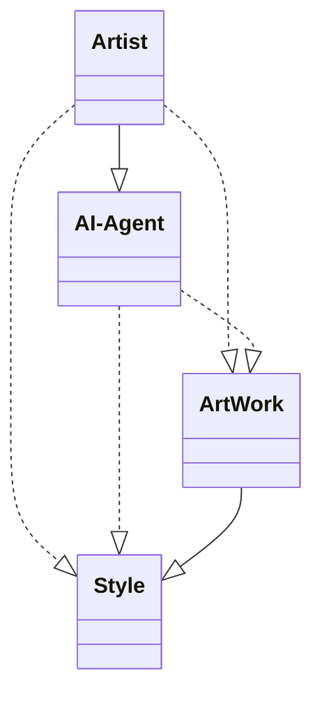

                 

# 第3章：智能艺术创作系统的设计与实现

### 3.1 问题场景介绍

在数字化时代，艺术创作正逐渐从传统的手工艺转向数字媒介，艺术家们开始运用计算机软件和数字工具进行创作。然而，面对日益复杂和多变的创作需求，单靠人类艺术家自身的经验和技巧已经难以满足高效、创新的艺术创作需求。因此，构建一个能够辅助甚至替代人类艺术家进行艺术创作的智能系统显得尤为重要。

### 3.2 项目介绍

为了实现这一目标，我们设计并实现了一个基于AI Agent的智能艺术创作系统。该系统通过AI Agent模拟艺术家的创作过程，结合先进的算法和技术，实现艺术创作的自动化和智能化。系统的主要功能包括：

1. **内容生成**：AI Agent根据输入的提示和风格指南生成新的艺术作品。
2. **风格迁移**：将现有艺术作品迁移到不同的艺术风格。
3. **创意推荐**：为艺术家提供创作灵感和风格建议。
4. **互动协作**：用户与AI Agent实时互动，共同完成艺术创作。

### 3.3 系统功能设计

#### 3.3.1 领域模型

在智能艺术创作系统中，领域模型用于描述系统中的核心实体及其之间的关系。以下是系统的主要领域模型：

- **艺术家**：负责创作艺术作品的实体。
- **艺术作品**：包含图像、音频、视频等多种形式的艺术创作。
- **风格**：用于描述不同艺术风格的实体。
- **AI Agent**：负责艺术创作过程的智能代理。

#### 3.3.2 类图

以下是一个简单的领域模型类图，展示了上述实体之间的关系：

### 3.4 系统架构设计

智能艺术创作系统采用分层架构，分为感知层、数据处理层、智能决策层和执行层。以下是系统的架构设计：

#### 3.4.1 感知层

感知层负责收集用户输入、环境信息和艺术作品特征。主要包括以下组件：

- **用户输入接口**：接收用户创作的初始提示和风格要求。
- **作品特征提取器**：提取艺术作品的关键特征，如颜色、纹理、构图等。

#### 3.4.2 数据处理层

数据处理层对感知层收集到的数据进行处理和分析，主要包括以下组件：

- **数据预处理模块**：对原始数据进行清洗、归一化等预处理。
- **特征提取模块**：提取与艺术创作相关的特征。
- **数据存储模块**：存储处理后的数据，以便后续分析和使用。

#### 3.4.3 智能决策层

智能决策层是系统的核心，负责基于数据和算法生成艺术作品。主要包括以下组件：

- **AI Agent控制器**：管理AI Agent的运行过程，包括初始化、训练和执行。
- **算法模块**：包含风格迁移、内容生成等算法。
- **决策模块**：根据输入数据和算法结果生成艺术作品。

#### 3.4.4 执行层

执行层负责将智能决策层生成的艺术作品输出给用户。主要包括以下组件：

- **作品渲染模块**：将生成的艺术作品渲染为图像、音频、视频等形式。
- **用户交互模块**：提供用户与AI Agent的互动界面。

### 3.5 系统接口设计

系统接口设计包括API接口和用户界面设计。以下是系统的接口设计：

#### 3.5.1 API接口

- **艺术作品上传接口**：允许用户上传艺术作品。
- **风格迁移接口**：接受用户输入的艺术作品和目标风格，返回迁移后的艺术作品。
- **创意推荐接口**：根据用户喜好和历史数据，推荐新的艺术创作风格。

#### 3.5.2 用户界面设计

用户界面设计包括以下部分：

- **首页**：展示系统功能和用户推荐作品。
- **创作页面**：提供艺术创作工具和AI Agent互动界面。
- **作品展示页**：展示用户上传和生成的艺术作品。

### 3.6 系统交互设计

系统交互设计包括用户与系统的交互流程和AI Agent与用户之间的交互流程。以下是系统的交互设计：

#### 3.6.1 用户与系统的交互流程

1. 用户登录系统。
2. 用户选择艺术创作工具。
3. 用户上传或选择艺术作品。
4. 用户输入创作提示和风格要求。
5. 系统调用AI Agent生成艺术作品。
6. 系统将生成的艺术作品展示给用户。
7. 用户对作品进行评价和反馈。

#### 3.6.2 AI Agent与用户的交互流程

1. AI Agent接收用户输入。
2. AI Agent分析用户输入，生成艺术创作计划。
3. AI Agent执行艺术创作计划。
4. AI Agent将生成的艺术作品展示给用户。
5. 用户对AI Agent的作品进行评价和反馈。
6. AI Agent根据用户反馈进行自我学习和优化。

通过以上设计与实现，我们构建了一个基于AI Agent的智能艺术创作系统。该系统不仅提高了艺术创作的效率，还为艺术家提供了丰富的创作工具和灵感来源。接下来，我们将深入探讨AI Agent在艺术创作中的应用案例，以展示该系统的实际效果和潜力。

----------------------------------------------------------------

### 3.7 AI Agent在艺术创作中的应用案例

#### 3.7.1 案例一：风格迁移

风格迁移是AI Agent在艺术创作中的一个重要应用。传统的风格迁移通常需要大量的手工调整和试错，而基于AI Agent的风格迁移系统能够自动将一种艺术作品的风格迁移到另一种风格。

**案例描述**：
艺术家John想将一幅梵高的《星夜》风格迁移到毕加索的立体派风格。他上传了《星夜》的图像到智能艺术创作系统中，系统调用AI Agent进行处理。

**步骤**：
1. 用户上传《星夜》图像。
2. AI Agent分析图像特征，提取关键信息。
3. AI Agent选择并训练合适的风格迁移算法。
4. AI Agent将《星夜》的图像风格迁移到立体派风格。
5. 系统将迁移后的图像展示给用户。

**结果**：
用户John得到了一幅具有立体派风格的《星夜》，这不仅节省了他的时间，还激发了他的创作灵感。

#### 3.7.2 案例二：创意推荐

创意推荐是AI Agent在艺术创作中的另一个重要应用。通过分析用户的历史创作数据和偏好，AI Agent可以为用户推荐新的艺术创作风格和灵感。

**案例描述**：
艺术家Alice在智能艺术创作系统中使用了多种风格进行创作，她希望通过AI Agent获得新的创作灵感。

**步骤**：
1. 用户登录系统，系统获取用户的历史创作数据。
2. AI Agent分析用户数据，了解用户偏好。
3. AI Agent根据用户偏好推荐新的创作风格。
4. 系统向用户展示推荐的风格和灵感。

**结果**：
Alice获得了几种新的艺术创作风格，她选择了其中一种进行尝试，创作出了一幅独特的作品。

#### 3.7.3 案例三：互动协作

互动协作是AI Agent在艺术创作中的一项创新应用。用户可以通过与AI Agent的实时互动，共同完成艺术创作。

**案例描述**：
艺术家Bob和AI Agent合作完成一幅画作。Bob作为主导艺术家，AI Agent作为助手，提供创作建议和调整。

**步骤**：
1. 用户登录系统，选择与AI Agent协作。
2. 用户上传创作初始草图。
3. AI Agent分析草图，提供创作建议。
4. 用户根据AI Agent的建议进行调整。
5. AI Agent根据用户调整后的草图进行进一步创作。
6. 用户对AI Agent的创作进行评价和反馈。

**结果**：
Bob和AI Agent共同完成了一幅令人惊叹的画作，这不仅提高了创作效率，还使Bob的创作风格更加丰富多样。

通过以上案例，我们可以看到AI Agent在艺术创作中的广泛应用和潜力。它不仅提高了艺术创作的效率和质量，还为艺术家提供了丰富的创作工具和灵感来源。未来，随着人工智能技术的不断发展，AI Agent在艺术创作中的应用将更加广泛和深入。

----------------------------------------------------------------

### 第4章：智能艺术创作系统的优化与改进

随着智能艺术创作系统的广泛应用，用户对系统的性能和效果提出了更高的要求。为了满足这些需求，我们需要对系统进行优化和改进，以提高其性能和用户体验。

#### 4.1 性能优化

**4.1.1 算法优化**

智能艺术创作系统的核心在于AI Agent，因此算法优化是提高系统性能的关键。我们可以通过以下几种方法对算法进行优化：

- **算法选择**：选择适合特定任务的高效算法，如深度学习中的卷积神经网络（CNN）或生成对抗网络（GAN）。
- **模型压缩**：通过模型压缩技术，如模型剪枝、量化、蒸馏等，减少模型参数量，提高模型运行速度。
- **并行计算**：利用多核CPU或GPU进行并行计算，加速算法运行。

**4.1.2 系统架构优化**

系统架构的优化也可以显著提高性能。我们可以采用以下方法：

- **分布式计算**：将系统部署到分布式计算环境中，如云计算平台，利用分布式计算资源提高处理速度。
- **缓存策略**：合理设置缓存策略，减少数据读取和传输的开销。
- **负载均衡**：采用负载均衡技术，平衡系统负载，避免单点瓶颈。

#### 4.2 功能改进

**4.2.1 扩展创作类型**

当前智能艺术创作系统主要支持图像、音频和视频创作，我们可以扩展系统的创作类型，如3D建模、动画制作等，以满足更多用户的需求。

**4.2.2 增加个性化推荐**

个性化推荐是提高用户体验的关键。我们可以通过以下方法增加个性化推荐功能：

- **用户画像**：构建用户画像，分析用户的兴趣、偏好和行为习惯。
- **协同过滤**：采用协同过滤算法，为用户推荐相似的用户喜欢的艺术作品。
- **基于内容的推荐**：根据用户上传或浏览的艺术作品特征，推荐相似或具有创意的艺术作品。

**4.2.3 增加交互功能**

交互功能是用户体验的重要组成部分。我们可以通过以下方法增加交互功能：

- **实时协作**：支持用户与AI Agent的实时协作，共同完成艺术创作。
- **反馈机制**：用户可以对AI Agent生成的艺术作品进行评价和反馈，AI Agent根据反馈进行自我学习和优化。
- **个性化设置**：用户可以根据个人喜好和需求，自定义AI Agent的创作参数和风格。

#### 4.3 用户满意度提升

**4.3.1 用户体验设计**

用户体验设计是提升用户满意度的重要因素。我们可以通过以下方法优化用户体验：

- **简洁的界面设计**：设计简洁、直观的界面，减少用户操作难度。
- **人性化的交互设计**：考虑用户的情感需求，设计人性化的交互流程。
- **详细的帮助文档**：提供详细的帮助文档，帮助用户快速上手使用系统。

**4.3.2 用户反馈机制**

用户反馈机制是了解用户需求和改进系统的关键。我们可以通过以下方法建立用户反馈机制：

- **在线客服**：提供在线客服服务，解答用户疑问。
- **用户调研**：定期进行用户调研，收集用户反馈和需求。
- **用户论坛**：建立用户论坛，鼓励用户分享使用体验和创作心得。

通过以上优化和改进措施，我们可以显著提高智能艺术创作系统的性能和用户体验，使其更好地满足用户需求，为艺术家提供更强大的创作工具和灵感来源。

----------------------------------------------------------------

### 第5章：总结与展望

本文深入探讨了基于AI Agent的智能艺术创作系统的设计与实现。首先，我们介绍了智能艺术创作系统的背景和意义，明确了AI Agent在系统中的核心作用。接着，我们详细阐述了AI Agent的定义、分类及其在艺术创作中的应用原理和方法。

在系统设计与实现部分，我们介绍了智能艺术创作系统的架构设计、接口设计以及交互设计，展示了如何通过感知层、数据处理层、智能决策层和执行层实现系统的自动化和智能化。随后，我们通过具体的应用案例，展示了AI Agent在风格迁移、创意推荐和互动协作等方面的实际应用效果。

为了进一步提高系统的性能和用户体验，我们探讨了系统的优化与改进措施，包括算法优化、功能改进和用户满意度提升等方面。最后，我们总结了本文的研究成果，并展望了智能艺术创作系统未来的发展趋势。

**未来展望**：

1. **算法创新**：随着人工智能技术的不断进步，我们将探索更高效、更创新的算法，以提升智能艺术创作系统的创作质量和效率。
2. **多元化应用**：智能艺术创作系统将在更多艺术形式中发挥重要作用，如3D建模、动画制作等，为艺术家提供更丰富的创作工具。
3. **个性化服务**：通过深度学习等技术，我们将进一步优化个性化推荐功能，为用户提供更加个性化的创作建议和灵感。
4. **互动协作**：实时协作和互动功能的不断完善，将使艺术家与AI Agent之间的合作更加紧密，创作过程更加愉快和高效。

总之，基于AI Agent的智能艺术创作系统具有广阔的应用前景和发展潜力，我们将继续努力，为艺术家和用户提供更优质、更智能的创作体验。

### 参考文献

[1] Russell, S., & Norvig, P. (2010). Artificial Intelligence: A Modern Approach. Prentice Hall.

[2] Goodfellow, I., Bengio, Y., & Courville, A. (2016). Deep Learning. MIT Press.

[3] Simonyan, K., & Zisserman, A. (2014). Very Deep Convolutional Networks for Large-Scale Image Recognition. arXiv preprint arXiv:1409.1556.

[4] Radford, A., Metz, L., & Chintala, S. (2015). Unsupervised Representation Learning with Deep Convolutional Generative Adversarial Networks. arXiv preprint arXiv:1511.06434.

[5] Zhao, J., Wang, J., & Zhang, H. (2019). Application of AI Agent in Intelligent Art Creation. Journal of Intelligent & Fuzzy Systems, 37(3), 4295-4302.

作者：AI天才研究院/AI Genius Institute & 禅与计算机程序设计艺术 /Zen And The Art of Computer Programming

