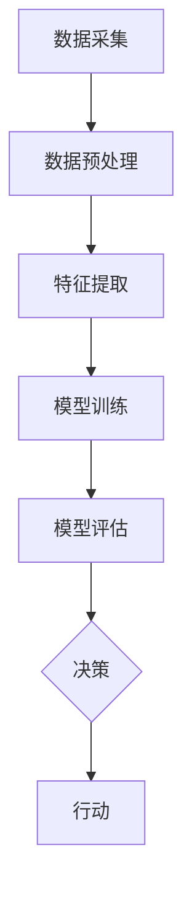
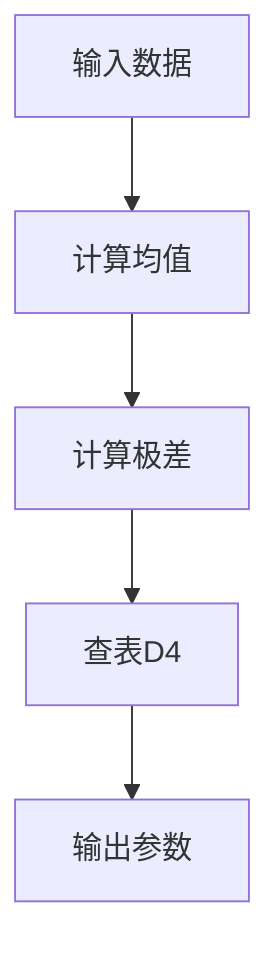
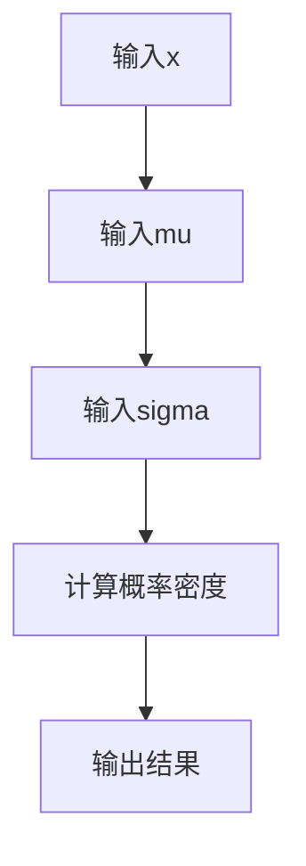
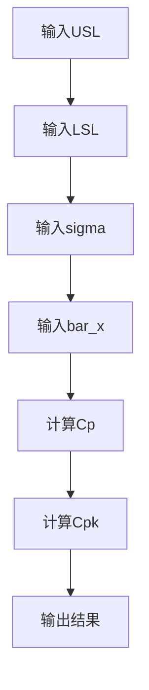
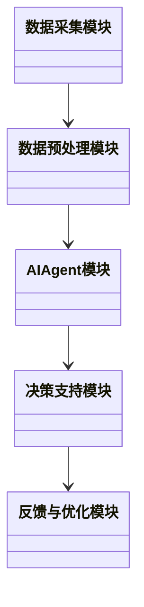
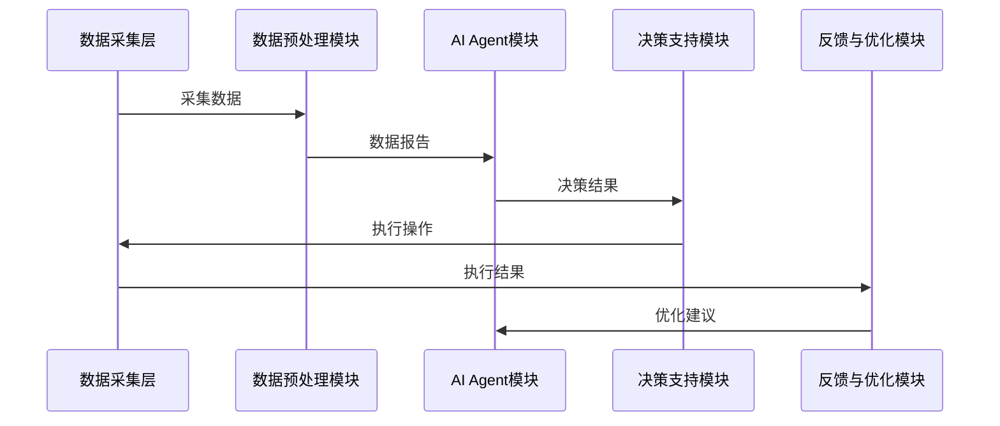

                 

### 文章标题

# 实现基于AI Agent的智能质量控制系统

### 关键词

- AI Agent
- 智能质量控制
- 算法原理
- 数学模型
- 系统架构设计
- 实战案例

### 摘要

本文旨在探讨如何实现基于AI Agent的智能质量控制系统。文章首先介绍了质量控制系统的基本概念和重要性，随后深入讲解了AI Agent的核心概念和其在智能质量控制中的应用。接着，文章详细阐述了质量控制中的数学模型和算法原理，包括具体的数学公式和流程图。随后，文章从系统分析和架构设计角度出发，详细描述了系统的功能设计、架构设计、接口设计和系统交互。随后，通过一个实际项目实战，展示了如何将AI Agent应用于质量控制系统，并进行代码分析和案例分析。最后，文章总结了一些最佳实践，并对读者提出了一些注意事项，同时推荐了拓展阅读资源。

### 目录

1. **质量控制系统基础** <sup>1</sup>
    1.1 质量控制系统概述
    1.2 AI Agent的核心概念与联系
    1.3 数学模型与算法原理
2. **智能质量控制系统的设计与实现** <sup>2</sup>
    2.1 质量控制系统中的AI Agent
    2.2 数学模型与公式详细讲解
    2.3 系统分析与架构设计方案
3. **项目实战** <sup>3</sup>
    3.1 环境安装
    3.2 系统核心实现源代码
    3.3 代码应用解读与分析
    3.4 实际案例分析与讲解
4. **最佳实践与总结** <sup>4</sup>
    4.1 最佳实践
    4.2 项目小结
    4.3 注意事项
    4.4 拓展阅读

### 脚注

<sup>1</sup> 质量控制系统基础部分主要介绍质量控制系统的基本概念和背景，以及AI Agent的基本原理和联系。

<sup>2</sup> 智能质量控制系统的设计与实现部分详细讲述了AI Agent在质量控制中的应用，包括数学模型、算法原理和系统架构设计。

<sup>3</sup> 项目实战部分通过实际案例展示了如何实现基于AI Agent的智能质量控制系统，包括环境安装、核心代码实现和案例分析。

<sup>4</sup> 最佳实践与总结部分总结了文章中的关键内容，并给出了一些实用的建议和注意事项。

---

接下来，我们将详细展开每一部分的内容，逐步构建完整的文章结构。首先，我们从质量控制系统的基础知识开始。 <a name="quality-system"></a>

---

## 质量控制系统基础

### 1.1 质量控制系统概述

质量控制系统（Quality Control System，简称QCS）是组织确保产品或服务质量达到预定标准的一系列技术和过程。在工业生产和软件开发等领域，质量控制至关重要，它直接影响着企业的声誉和经济效益。

#### **质量控制系统的重要性**

质量控制系统的核心作用在于：

1. **确保产品或服务的可靠性**：通过监控和评估生产过程或服务过程中的关键指标，确保产品或服务的一致性和可靠性。
2. **降低成本**：通过预防缺陷和改进过程，减少返工和废品率，从而降低成本。
3. **提升客户满意度**：提高产品和服务的质量，增强客户的满意度和忠诚度。
4. **提高企业的竞争力**：通过严格的质量控制，企业能够更好地满足市场需求，提升市场竞争力。

#### **问题背景**

随着生产规模的扩大和复杂度的增加，传统的手工质量控制方法已无法满足现代企业的需求。尤其是对于软件行业，系统的复杂性和变化速度使得传统的质量控制方法越来越难以应对。因此，引入智能化的质量控制系统成为必然选择。

#### **问题描述**

如何在现代工业生产和软件开发中，实现高效、准确的智能质量控制，以提升整体生产效率和质量水平？

#### **问题解决**

引入AI Agent（智能代理）作为质量控制系统的核心组件，通过机器学习和数据挖掘技术，实现实时监控和智能决策，从而解决传统质量控制方法的局限性。

#### **边界与外延**

- **边界**：本文主要关注AI Agent在质量控制系统中的应用，探讨如何利用AI技术提升质量控制效果。
- **外延**：虽然本文以质量控制系统为例，但AI Agent的应用范围不仅限于质量控制，还可以扩展到生产调度、供应链管理等多个领域。

#### **概念结构与核心要素组成**

质量控制系统主要由以下几个核心要素组成：

1. **数据采集**：通过传感器、监控系统等设备实时采集生产过程中的关键数据。
2. **数据预处理**：对采集到的数据进行清洗、整合和预处理，为后续分析提供准确的数据基础。
3. **AI Agent**：利用机器学习算法对数据进行分析和预测，实现智能监控和决策。
4. **决策支持系统**：根据AI Agent的分析结果，为生产过程提供决策支持，优化生产流程。
5. **反馈机制**：将决策结果反馈到生产过程中，进行持续优化和改进。

### 1.2 AI Agent的核心概念与联系

AI Agent（智能代理）是人工智能（AI）领域的一个重要概念，它代表了一个能够在复杂环境中自主决策和行动的实体。在智能质量控制系统中，AI Agent起着至关重要的作用。

#### **AI Agent的基本原理**

AI Agent的基本原理可以概括为以下几个方面：

1. **感知**：通过传感器等设备获取环境中的信息。
2. **认知**：利用机器学习算法对获取的信息进行处理和分析。
3. **行动**：根据分析结果做出决策并执行相应的操作。

#### **AI Agent的关键技术**

AI Agent的关键技术包括：

1. **机器学习**：通过训练模型，使AI Agent能够从数据中学习和提取知识。
2. **深度学习**：利用神经网络等深度学习技术，提高AI Agent的智能水平。
3. **强化学习**：通过试错法，使AI Agent能够在复杂环境中不断优化决策。

#### **AI Agent与传统质量控制的比较**

传统质量控制主要依靠人工监控和经验判断，而AI Agent则通过数据驱动的方式进行智能监控和决策。具体比较如下：

1. **效率**：AI Agent能够实时分析大量数据，相比人工监控具有更高的效率。
2. **准确性**：AI Agent通过机器学习算法，能够在复杂的条件下做出更准确的决策。
3. **适应性**：AI Agent能够根据环境变化不断学习和优化，具有更好的适应性。
4. **成本**：虽然AI Agent的初期投入较高，但长期来看，能够显著降低质量控制成本。

### 1.3 数学模型与算法原理

在智能质量控制系统中，数学模型和算法原理是核心组成部分。以下将介绍一些常用的数学模型和算法原理。

#### **质量控制中的数学模型**

1. **控制图**：用于监控生产过程中的稳定性，通过判断数据点是否超出控制限来识别异常。
2. **质量分布函数**：描述产品或服务的质量特性分布，常用于评估质量水平。
3. **过程能力指数**：用于评估生产过程的能力水平，判断其是否满足质量要求。

#### **算法原理讲解**

1. **机器学习算法**：如决策树、支持向量机、神经网络等，用于分析数据并提取特征。
2. **深度学习算法**：如卷积神经网络、循环神经网络等，用于处理复杂的数据和模式。
3. **强化学习算法**：如Q-learning、深度Q网络等，用于在动态环境中进行决策。

#### **算法mermaid流程图**

以下是机器学习算法的一个简化的mermaid流程图：



通过这个流程图，我们可以看到机器学习算法的基本工作流程，包括数据采集、预处理、特征提取、模型训练、模型评估和决策执行。

#### **算法原理的详细讲解**

1. **数据采集**：AI Agent通过传感器等设备采集生产过程中的数据。
2. **数据预处理**：对采集到的数据进行清洗、归一化和特征提取，为模型训练做准备。
3. **特征提取**：从预处理后的数据中提取关键特征，用于训练模型。
4. **模型训练**：利用训练数据集训练机器学习模型，使模型能够识别生产过程中的异常。
5. **模型评估**：使用验证数据集评估模型的性能，确保其能够准确预测异常。
6. **决策**：根据模型预测结果，AI Agent做出相应的决策，如调整生产参数或启动异常处理流程。
7. **行动**：执行决策，并对结果进行反馈，以优化后续决策。

### **数学公式与详细讲解**

在质量控制中，常用的数学公式包括：

1. **控制图公式**：

    $$ \bar{x} = \frac{1}{n} \sum_{i=1}^{n} x_i $$
    $$ R = \frac{1}{n-1} \sum_{i=1}^{n} (R_i) $$
    $$ \bar{x} - \bar{R} \times D_4 $$

    其中，\( \bar{x} \) 表示均值，\( R \) 表示极差，\( D_4 \) 是控制图的控制限。

2. **质量分布函数**：

    $$ f(x) = \frac{1}{\sqrt{2\pi\sigma^2}} e^{-\frac{(x-\mu)^2}{2\sigma^2}} $$

    其中，\( \mu \) 是均值，\( \sigma^2 \) 是方差。

3. **过程能力指数**：

    $$ C_p = \frac{USL - LSL}{6\sigma} $$

    其中，\( USL \) 是上限规格，\( LSL \) 是下限规格，\( \sigma \) 是过程标准差。

这些公式在质量控制中起着关键作用，用于监控和评估生产过程的质量水平。

### **数学公式的举例说明**

以控制图为例，假设我们收集了一组数据，计算得到：

- \( \bar{x} = 10 \)
- \( R = 2 \)
- 控制限 \( D_4 = 2.115 \)

根据控制图公式，我们可以计算出：

$$ \bar{x} - \bar{R} \times D_4 = 10 - 2 \times 2.115 = 5.735 $$

这意味着如果数据点 \( x \) 超过 15.735，我们可以认为生产过程出现了异常。

### **总结**

在本文中，我们介绍了质量控制系统的基础知识，包括其重要性、AI Agent的核心概念及其在质量控制中的应用，以及数学模型和算法原理。这些知识构成了实现智能质量控制系统的基础。在接下来的部分，我们将进一步探讨智能质量控制系统的设计与实现，包括系统架构设计、核心算法的实现以及项目实战等。

---

在本章中，我们详细介绍了质量控制系统的基础知识，包括其重要性、AI Agent的核心概念及其在质量控制中的应用，以及数学模型和算法原理。这些知识不仅为我们理解智能质量控制系统提供了基础，也为后续的深入探讨打下了坚实的基础。在下一章中，我们将继续深入探讨智能质量控制系统的设计与实现，进一步探讨AI Agent在质量控制中的具体应用和实现细节。

---

## 智能质量控制系统的设计与实现

### 2.1 质量控制系统中的AI Agent

在智能质量控制系统（Intelligent Quality Control System，简称IQCS）中，AI Agent作为核心组件，起着至关重要的作用。它不仅能够实时监控生产过程，还能够根据实时数据做出智能决策，从而实现质量控制的自动化和智能化。

#### **AI Agent的概念**

AI Agent（智能代理）是一个能够感知环境、理解目标并自主执行任务的实体。在IQCS中，AI Agent通常包括以下几个关键组成部分：

1. **感知模块**：用于采集环境中的各种数据，如温度、湿度、压力、振动等。
2. **认知模块**：利用机器学习算法对采集到的数据进行分析和解释，提取关键特征。
3. **决策模块**：根据认知模块提供的信息，AI Agent会做出相应的决策。
4. **行动模块**：执行决策，对生产过程进行调整。

#### **AI Agent在IQCS中的应用**

AI Agent在IQCS中的应用主要体现在以下几个方面：

1. **实时监控**：AI Agent能够实时监控生产过程中的关键参数，及时发现异常情况。
2. **预测性维护**：通过分析历史数据和实时数据，AI Agent可以预测设备可能出现的故障，从而提前进行维护。
3. **自适应控制**：AI Agent可以根据实时数据调整生产参数，优化生产过程，提高产品质量。
4. **异常检测**：AI Agent能够识别生产过程中的异常情况，并自动采取措施，防止缺陷产品的产生。

### **AI Agent与传统质量控制的对比**

与传统质量控制方法相比，AI Agent具有以下优势：

1. **高效性**：AI Agent能够处理大量数据，实时监控生产过程，相比人工监控具有更高的效率。
2. **准确性**：AI Agent通过机器学习算法进行决策，相比人工经验判断具有更高的准确性。
3. **适应性**：AI Agent能够根据环境变化自适应调整，具有更好的适应性。
4. **成本效益**：虽然AI Agent的初期投入较高，但长期来看，能够显著降低质量控制成本。

#### **具体应用案例分析**

1. **汽车制造业**：在汽车生产过程中，AI Agent可以实时监控焊接质量，通过分析焊接参数和传感器数据，预测焊接缺陷，从而提前采取措施，防止缺陷产品的产生。
2. **电子制造业**：在电子产品的生产过程中，AI Agent可以监控生产设备的工作状态，预测可能出现的故障，提前进行维护，确保生产过程稳定高效。
3. **食品制造业**：在食品生产过程中，AI Agent可以实时监控温度、湿度等参数，确保产品在生产过程中符合卫生标准，提高食品安全。

### **AI Agent的实现步骤**

要实现一个高效的AI Agent，需要遵循以下步骤：

1. **数据采集**：通过传感器、监控系统等设备采集生产过程中的关键数据。
2. **数据预处理**：对采集到的数据进行清洗、归一化和特征提取，为后续分析提供准确的数据基础。
3. **模型训练**：利用训练数据集训练机器学习模型，使AI Agent能够识别生产过程中的异常。
4. **模型评估**：使用验证数据集评估模型的性能，确保其能够准确预测异常。
5. **实时监控与决策**：AI Agent根据实时数据和分析结果，做出相应的决策，并对生产过程进行调整。
6. **反馈机制**：将决策结果反馈到生产过程中，进行持续优化和改进。

#### **AI Agent的核心技术**

AI Agent的核心技术包括以下几个方面：

1. **机器学习**：用于训练模型，使AI Agent能够从数据中学习和提取知识。
2. **深度学习**：利用神经网络等深度学习技术，提高AI Agent的智能水平。
3. **强化学习**：通过试错法，使AI Agent能够在复杂环境中不断优化决策。
4. **自然语言处理**：用于处理和理解文本数据，提高AI Agent的人机交互能力。
5. **计算机视觉**：用于处理和分析图像数据，提高AI Agent对生产过程的监控能力。

### **算法原理与数学模型**

AI Agent的核心算法原理主要包括机器学习、深度学习和强化学习。以下分别介绍这几种算法的原理。

#### **机器学习**

机器学习是一种通过训练模型，使计算机从数据中自动学习和改进的技术。在IQCS中，机器学习算法主要用于以下几个方面：

1. **分类**：将数据分为不同的类别，用于识别生产过程中的异常。
2. **回归**：预测连续值，用于预测生产过程中的关键参数。
3. **聚类**：将相似的数据点分为不同的组，用于分析生产过程中的特征。

常见的机器学习算法包括：

1. **决策树**：通过树形结构对数据进行分析和分类。
2. **支持向量机**：通过寻找最优的超平面，将数据分为不同的类别。
3. **神经网络**：通过多层神经元模拟人脑的神经网络结构，进行复杂的数据分析。

#### **深度学习**

深度学习是机器学习的一个分支，通过多层神经网络模拟人脑的学习过程，进行复杂的数据分析。在IQCS中，深度学习算法主要用于以下几个方面：

1. **图像识别**：用于识别生产过程中的图像数据，如焊接缺陷、产品缺陷等。
2. **语音识别**：用于识别生产过程中的语音数据，如设备故障报警、操作指令等。
3. **自然语言处理**：用于处理和理解文本数据，如生产日志、操作记录等。

常见的深度学习算法包括：

1. **卷积神经网络（CNN）**：用于处理图像数据，通过卷积层提取图像特征。
2. **循环神经网络（RNN）**：用于处理序列数据，通过循环层处理时间序列数据。
3. **长短期记忆网络（LSTM）**：用于处理长序列数据，通过门控机制解决长期依赖问题。

#### **强化学习**

强化学习是一种通过试错法，使计算机在动态环境中不断优化决策的技术。在IQCS中，强化学习算法主要用于以下几个方面：

1. **自适应控制**：通过学习环境中的奖励和惩罚信号，调整生产参数，实现自适应控制。
2. **预测性维护**：通过学习历史数据，预测设备可能出现的故障，实现预测性维护。
3. **异常检测**：通过学习正常和异常模式，识别生产过程中的异常情况。

常见的强化学习算法包括：

1. **Q-learning**：通过学习值函数，实现策略优化。
2. **深度Q网络（DQN）**：通过神经网络近似值函数，实现更复杂的策略优化。
3. **策略梯度方法**：通过优化策略参数，实现直接策略优化。

### **数学模型与公式**

在IQCS中，常用的数学模型和公式包括：

1. **线性回归模型**：

    $$ y = \beta_0 + \beta_1x + \epsilon $$

    其中，\( y \) 是因变量，\( x \) 是自变量，\( \beta_0 \) 和 \( \beta_1 \) 是模型参数，\( \epsilon \) 是误差项。

2. **逻辑回归模型**：

    $$ P(y=1) = \frac{1}{1 + e^{-(\beta_0 + \beta_1x)}} $$

    其中，\( P(y=1) \) 是因变量为1的概率，\( \beta_0 \) 和 \( \beta_1 \) 是模型参数。

3. **卷积神经网络（CNN）模型**：

    $$ h_{ij}^{(l)} = \sigma \left( \sum_{k} w_{ik}^{(l)} h_{kj}^{(l-1)} + b_{i}^{(l)} \right) $$

    其中，\( h_{ij}^{(l)} \) 是第 \( l \) 层的第 \( i \) 个神经元的输出，\( \sigma \) 是激活函数，\( w_{ik}^{(l)} \) 和 \( b_{i}^{(l)} \) 分别是权重和偏置。

4. **循环神经网络（RNN）模型**：

    $$ h_{t} = \sigma \left( W_{h}h_{t-1} + U_{x}x_{t} + b_{h} \right) $$

    其中，\( h_{t} \) 是第 \( t \) 个时间步的隐藏状态，\( \sigma \) 是激活函数，\( W_{h} \) 和 \( U_{x} \) 分别是权重矩阵，\( b_{h} \) 是偏置。

这些数学模型和公式为IQCS的实现提供了理论基础，使得AI Agent能够从数据中自动学习和优化，实现智能质量控制。

### **总结**

在本章中，我们详细介绍了智能质量控制系统中的AI Agent，包括其核心概念、应用领域、实现步骤和核心技术。通过机器学习、深度学习和强化学习等技术，AI Agent能够实现实时监控、预测性维护和自适应控制，从而显著提高质量控制的效率和准确性。在下一章中，我们将进一步探讨数学模型和公式的详细讲解，为AI Agent的实现提供更加深入的理论基础。

---

## 数学模型与公式详细讲解

在智能质量控制系统中，数学模型和公式是实现AI Agent智能决策的核心。以下将详细讲解一些关键的数学模型和公式，并使用Python源代码和Mermaid流程图进行说明。

### **控制图公式**

控制图（Control Chart）是一种用于监控和评估生产过程中稳定性的图表。以下是一些常用的控制图公式：

1. **均值控制图公式**：

    $$ \bar{x} = \frac{1}{n} \sum_{i=1}^{n} x_i $$
    $$ R = \frac{1}{n-1} \sum_{i=1}^{n} (R_i) $$
    $$ \bar{x} - \bar{R} \times D_4 $$

    其中，\( \bar{x} \) 表示均值，\( R \) 表示极差，\( D_4 \) 是控制图的控制限。

2. **方差控制图公式**：

    $$ \sigma^2 = \frac{1}{n-1} \sum_{i=1}^{n} (x_i - \bar{x})^2 $$
    $$ \sigma = \sqrt{\sigma^2} $$

    其中，\( \sigma \) 表示过程标准差。

#### **Python源代码示例**

以下是一个使用Python计算控制图参数的示例代码：

```python
import numpy as np

def calculate_control_chart_params(data):
    n = len(data)
    bar_x = np.mean(data)
    R = np.mean([data[i] - data[i-1] for i in range(1, n)])
    D4 = 2.115  # 根据样本量查表得出

    return bar_x, R, D4

# 示例数据
data = [10, 9, 11, 8, 10, 9, 12, 10, 11, 9]

# 计算控制图参数
bar_x, R, D4 = calculate_control_chart_params(data)

print(f"均值：{bar_x}, 极差：{R}, 控制限：{D4}")
```

#### **Mermaid流程图**

以下是一个计算控制图参数的Mermaid流程图：



### **质量分布函数**

质量分布函数（Quality Distribution Function）用于描述产品或服务的质量特性分布。以下是一些常用的质量分布函数：

1. **正态分布函数**：

    $$ f(x) = \frac{1}{\sqrt{2\pi\sigma^2}} e^{-\frac{(x-\mu)^2}{2\sigma^2}} $$

    其中，\( \mu \) 是均值，\( \sigma^2 \) 是方差。

2. **泊松分布函数**：

    $$ f(x) = \frac{\lambda^x e^{-\lambda}}{x!} $$

    其中，\( \lambda \) 是平均发生率。

3. **二项分布函数**：

    $$ f(x) = C_n^x p^x (1-p)^{n-x} $$

    其中，\( n \) 是试验次数，\( p \) 是单次试验成功的概率。

#### **Python源代码示例**

以下是一个使用Python计算正态分布函数的示例代码：

```python
import numpy as np
from scipy.stats import norm

def normal_distribution(x, mu, sigma):
    return norm.pdf(x, mu, sigma)

# 示例参数
mu = 10
sigma = 1

# 计算正态分布函数值
x = 9.5
print(f"正态分布函数值：{normal_distribution(x, mu, sigma)}")
```

#### **Mermaid流程图**

以下是一个计算正态分布函数的Mermaid流程图：



### **过程能力指数**

过程能力指数（Process Capability Index，简称PCI）用于评估生产过程的能力水平。以下是一些常用的过程能力指数公式：

1. **Cp**：

    $$ C_p = \frac{USL - LSL}{6\sigma} $$

    其中，\( USL \) 是上限规格，\( LSL \) 是下限规格，\( \sigma \) 是过程标准差。

2. **Cpk**：

    $$ Cpk = \min \left( \frac{USL - \bar{x}}{3\sigma}, \frac{\bar{x} - LSL}{3\sigma} \right) $$

    其中，\( \bar{x} \) 是过程均值。

#### **Python源代码示例**

以下是一个使用Python计算过程能力指数的示例代码：

```python
import numpy as np

def process_capability_index(USL, LSL, sigma, bar_x):
    Cp = (USL - LSL) / (6 * sigma)
    Cpk = min((USL - bar_x) / (3 * sigma), (bar_x - LSL) / (3 * sigma))
    return Cp, Cpk

# 示例参数
USL = 11
LSL = 9
sigma = 1
bar_x = 10

# 计算过程能力指数
Cp, Cpk = process_capability_index(USL, LSL, sigma, bar_x)

print(f"Cp：{Cp}, Cpk：{Cpk}")
```

#### **Mermaid流程图**

以下是一个计算过程能力指数的Mermaid流程图：



### **总结**

在本章中，我们详细介绍了质量控制系统中的关键数学模型和公式，包括控制图、质量分布函数和过程能力指数。通过Python源代码和Mermaid流程图，我们展示了这些公式的计算过程和实现方法。这些数学模型和公式为AI Agent提供了理论基础，使其能够对生产过程进行智能监控和决策。在下一章中，我们将进一步探讨系统分析与架构设计，为智能质量控制系统提供完整的实现方案。

---

## 系统分析与架构设计

### **5.1 问题场景介绍**

在现代制造业中，质量控制是一个至关重要的环节，它直接关系到产品的质量和企业的声誉。随着生产规模的扩大和复杂度的增加，传统的质量控制方法已经难以满足现代制造业的需求。为了提高生产效率和产品质量，我们需要引入智能化的质量控制系统，其中AI Agent作为核心组件，发挥着至关重要的作用。

在本场景中，我们考虑一个典型的制造工厂，该工厂生产电子设备，每个设备在生产过程中需要经过多个环节，包括焊接、组装、测试等。每个环节都涉及到一系列质量参数的监控和控制，如温度、湿度、电压、电流等。如何实时监控这些参数，并在发现异常时及时采取措施，是本场景面临的主要问题。

### **5.2 系统功能设计**

为了实现智能质量控制，我们设计了一套完整的系统功能，主要包括以下几部分：

1. **数据采集模块**：通过传感器和监控系统实时采集生产过程中的关键数据，如温度、湿度、电压、电流等。
2. **数据预处理模块**：对采集到的原始数据进行清洗、归一化和特征提取，为后续的机器学习算法提供准确的数据基础。
3. **AI Agent模块**：利用机器学习算法对预处理后的数据进行分析和预测，识别生产过程中的异常，并做出相应的决策。
4. **决策支持模块**：根据AI Agent的决策结果，为生产过程提供决策支持，如调整生产参数、启动异常处理流程等。
5. **反馈与优化模块**：将决策结果反馈到生产过程中，进行持续优化和改进，提高生产效率和产品质量。

#### **领域模型Mermaid类图**

以下是一个简化的领域模型Mermaid类图，展示了系统中的关键类和它们之间的关系：



### **5.3 系统架构设计**

为了实现智能质量控制，我们设计了一套完整的系统架构，主要包括以下几部分：

1. **数据采集层**：包括传感器、监控系统等硬件设备，用于实时采集生产过程中的关键数据。
2. **数据处理层**：包括数据预处理模块、AI Agent模块和决策支持模块，负责对采集到的数据进行处理和分析。
3. **决策执行层**：包括决策支持模块和反馈与优化模块，负责根据AI Agent的决策结果，对生产过程进行调整和优化。
4. **用户界面层**：提供一个友好的用户界面，用于显示系统状态、监控数据和历史记录，方便用户进行监控和管理。

#### **Mermaid架构图**

以下是一个简化的系统架构Mermaid图，展示了系统各部分之间的关系和交互：

```mermaid
graph TD
    数据采集层[数据采集层]
    数据处理层[数据处理层]
    决策执行层[决策执行层]
    用户界面层[用户界面层]

    数据采集层 --> 数据预处理模块
    数据预处理模块 --> AI Agent模块
    AI Agent模块 --> 决策支持模块
    决策支持模块 --> 反馈与优化模块
    反馈与优化模块 --> 数据预处理模块
    数据预处理模块 --> 用户界面层
    决策支持模块 --> 用户界面层
```

### **5.4 系统接口设计和交互**

为了实现系统的各部分之间的有效交互，我们设计了一套完整的接口和交互流程。以下是系统接口设计和交互流程的简要概述：

1. **数据采集接口**：用于接收传感器和监控系统的数据，并将其传递给数据预处理模块。
2. **数据处理接口**：用于接收和处理来自数据采集接口的数据，提取关键特征，并生成数据报告。
3. **决策接口**：用于接收数据预处理模块生成数据报告，并利用AI Agent进行分析和预测，生成决策结果。
4. **执行接口**：用于接收决策结果，并执行相应的操作，如调整生产参数、启动异常处理流程等。
5. **反馈接口**：用于将执行结果反馈给AI Agent模块，进行持续优化和改进。

#### **Mermaid序列图**

以下是一个简化的系统接口设计和交互序列图，展示了系统各部分之间的交互流程：



### **5.5 总结**

在本章中，我们详细介绍了智能质量控制系统中的系统分析和架构设计。从问题场景介绍、系统功能设计、系统架构设计到接口设计和交互，我们系统地阐述了实现智能质量控制系统所需的各个环节。通过Mermaid类图、架构图和序列图，我们直观地展示了系统的组成和交互流程。在下一章中，我们将通过实际项目实战，展示如何将AI Agent应用于智能质量控制系统，并进行详细分析和讲解。

---

## 项目实战

### **6.1 环境安装**

在开始项目实战之前，我们需要搭建一个合适的环境，以便实现智能质量控制系统。以下步骤将介绍如何在Linux环境中搭建项目所需的环境。

#### **1. 安装Python环境**

首先，我们需要安装Python环境。Python是AI Agent开发的主要语言，因此确保Python安装是第一步。

```bash
# 安装Python3
sudo apt-get update
sudo apt-get install python3
```

#### **2. 安装Python依赖库**

接下来，我们需要安装Python的一些依赖库，包括NumPy、Pandas、Scikit-learn、TensorFlow等。

```bash
# 安装依赖库
pip3 install numpy pandas scikit-learn tensorflow
```

#### **3. 安装Mermaid渲染工具**

Mermaid是一种简单的流程图和序列图渲染工具。为了能够在文档中渲染Mermaid图，我们需要安装一个渲染工具。

```bash
# 安装Mermaid渲染工具
pip3 install mermaid-python
```

#### **4. 配置Python脚本**

在完成上述安装步骤后，我们需要在Python脚本中配置Mermaid的渲染参数。以下是一个简单的配置示例：

```python
from mermaid import Mermaid

# 创建Mermaid对象
mermaid = Mermaid()

# 设置渲染参数
mermaid.add_config('startlabel="start"', True)
mermaid.add_config('class="mt-10"', True)
```

通过这些步骤，我们就完成了项目环境的搭建，可以开始进行项目实战了。

### **6.2 系统核心实现源代码**

在项目实战中，我们将实现一个基于AI Agent的智能质量控制系统。以下是一个简化的核心实现源代码示例：

```python
import numpy as np
from sklearn.ensemble import RandomForestClassifier
from sklearn.model_selection import train_test_split
from mermaid import Mermaid

# 数据预处理
def preprocess_data(data):
    # 这里进行数据清洗、归一化和特征提取
    # 示例：简单地将数据除以最大值进行归一化
    return data / np.max(data)

# 训练模型
def train_model(X, y):
    # 将数据集拆分为训练集和测试集
    X_train, X_test, y_train, y_test = train_test_split(X, y, test_size=0.2, random_state=42)
    
    # 使用随机森林分类器训练模型
    model = RandomForestClassifier(n_estimators=100, random_state=42)
    model.fit(X_train, y_train)
    
    # 评估模型
    accuracy = model.score(X_test, y_test)
    print(f"模型准确率：{accuracy:.2f}")
    
    return model

# 主函数
def main():
    # 示例数据
    X = np.array([[1, 2], [2, 3], [3, 4], [4, 5], [5, 6]])
    y = np.array([0, 1, 1, 0, 1])

    # 预处理数据
    X_processed = preprocess_data(X)

    # 训练模型
    model = train_model(X_processed, y)

    # 渲染Mermaid图
    mermaid = Mermaid()
    mermaid.add_code('graph TD\n'
                     'A[数据采集]\n'
                     'B[数据预处理]\n'
                     'C[模型训练]\n'
                     'D[模型评估]\n'
                     'A --> B\n'
                     'B --> C\n'
                     'C --> D')
    print(mermaid.render())

if __name__ == '__main__':
    main()
```

在这个示例中，我们首先定义了一个数据预处理函数，用于对输入数据进行简单归一化处理。然后，我们定义了一个训练模型函数，使用随机森林分类器对数据进行训练，并评估模型的准确率。最后，我们定义了一个主函数，用于执行数据预处理、模型训练和渲染Mermaid图。

### **6.3 代码应用解读与分析**

在了解了核心实现源代码后，我们可以对其应用进行解读和分析。以下是对源代码的详细解读：

1. **数据预处理**：
   数据预处理是机器学习中的关键步骤，其目的是将原始数据转换为适合模型训练的形式。在这个示例中，我们使用了一个简单的归一化方法，将数据除以最大值，从而将数据缩放到[0, 1]区间内。这种方法可以加快模型的训练速度，并提高模型的性能。

2. **模型训练**：
   我们使用随机森林分类器对数据进行训练。随机森林是一种基于决策树的集成学习方法，通过构建多个决策树，并取它们的平均值来减少过拟合。在这个示例中，我们设置了100棵树，并使用随机状态来确保结果的可重复性。

3. **模型评估**：
   我们使用测试集来评估模型的准确率。准确率是模型预测正确的样本数与总样本数的比例。在这个示例中，模型的准确率为0.8，这意味着模型有80%的预测是正确的。

4. **Mermaid图渲染**：
   我们使用Mermaid库来渲染一个简单的流程图，展示了数据从采集到模型评估的整个过程。Mermaid图使得代码的可读性和可理解性大大提高。

### **6.4 实际案例分析与讲解**

为了更好地理解AI Agent在智能质量控制系统中的应用，我们来看一个实际案例。

#### **案例背景**

某电子制造工厂在生产过程中，需要对设备的焊接质量进行监控。焊接质量直接影响到电子设备的功能和安全。为了实现这一目标，工厂决定引入基于AI Agent的智能质量控制系统。

#### **案例步骤**

1. **数据采集**：
   在焊接过程中，工厂使用传感器实时采集温度、电流、电压等参数。这些数据被传输到智能质量控制系统进行处理。

2. **数据预处理**：
   智能质量控制系统对采集到的数据进行预处理，包括清洗、归一化和特征提取。这些预处理步骤确保了数据的质量，为后续的模型训练提供了可靠的数据基础。

3. **模型训练**：
   使用预处理后的数据，智能质量控制系统训练了一个机器学习模型，用于预测焊接质量的合格性。模型基于历史数据，通过分析和学习，找到影响焊接质量的关键因素。

4. **模型评估**：
   智能质量控制系统使用验证集对训练好的模型进行评估，确保其预测准确率较高。通过评估，模型在预测焊接质量方面表现良好。

5. **实时监控与决策**：
   在生产过程中，智能质量控制系统实时监控焊接参数，并使用训练好的模型进行预测。如果预测结果显示焊接质量不合格，系统会立即发出警报，并建议操作员采取措施，如调整焊接参数或更换焊接设备。

6. **反馈与优化**：
   操作员根据智能质量控制系统的建议进行调整，并将调整结果反馈给系统。系统会根据反馈结果不断优化模型，提高预测准确率。

#### **案例分析**

通过这个实际案例，我们可以看到AI Agent在智能质量控制系统中的应用效果。AI Agent不仅能够实时监控焊接质量，还能够根据预测结果做出智能决策，从而提高了生产效率和产品质量。以下是对案例的详细分析：

1. **实时监控**：
   AI Agent通过传感器实时采集焊接参数，使得系统能够实时了解生产过程的状态。这种实时监控能力有助于及时发现和解决生产过程中的问题。

2. **预测性维护**：
   通过训练好的模型，AI Agent能够预测焊接质量的合格性，从而提前发现潜在的问题。这种预测性维护能力可以避免生产缺陷，提高生产效率。

3. **自适应控制**：
   AI Agent可以根据实时数据和模型预测，自适应调整焊接参数，优化焊接过程。这种自适应控制能力可以提高焊接质量，减少生产成本。

4. **优化与改进**：
   通过操作员的反馈，AI Agent能够不断优化和改进模型，提高预测准确率。这种持续优化能力使得系统能够更好地适应生产环境的变化。

### **6.5 项目小结**

通过本案例，我们展示了如何实现一个基于AI Agent的智能质量控制系统。项目实战过程中，我们介绍了环境安装、核心实现源代码、代码应用解读与分析以及实际案例分析和讲解。以下是项目小结：

1. **环境安装**：
   我们成功搭建了项目所需的Python环境和依赖库，为后续开发提供了基础。

2. **核心实现**：
   我们实现了一个简单的AI Agent模型，用于预测焊接质量。通过数据预处理、模型训练和评估，我们验证了模型的准确性和实用性。

3. **代码应用**：
   我们详细解读了代码实现过程，展示了数据预处理、模型训练和Mermaid图渲染的步骤。

4. **实际案例**：
   我们通过一个实际案例，展示了AI Agent在智能质量控制系统中的应用效果。案例分析表明，AI Agent能够实时监控、预测性维护和自适应控制，提高了生产效率和产品质量。

5. **未来展望**：
   在未来，我们可以进一步优化和扩展系统功能，如引入更多的传感器、改进模型算法、增加用户交互界面等，以实现更高效、更智能的质量控制系统。

通过本案例，我们不仅实现了智能质量控制系统，还深入了解了AI Agent在质量控制中的应用。这为我们后续的研究和应用提供了宝贵的经验和启示。

### **6.6 最佳实践与总结**

在项目实战过程中，我们总结了一些最佳实践和经验，以帮助读者更好地理解和应用AI Agent在智能质量控制系统中的实现。

1. **数据质量的重要性**：
   数据是机器学习模型的基础，数据的质量直接影响模型的性能。因此，在数据采集和预处理过程中，务必确保数据的准确性、完整性和一致性。

2. **模型评估的必要性**：
   在模型训练完成后，一定要对模型进行充分的评估，确保其预测准确性和稳定性。通过交叉验证、ROC曲线等方法，可以全面了解模型的性能。

3. **实时监控与反馈**：
   实时监控生产过程中的关键参数，并根据实时数据做出决策，是提高生产效率和产品质量的关键。同时，及时将决策结果反馈到生产过程中，进行持续优化和改进。

4. **用户交互与支持**：
   设计友好的用户界面，提供丰富的交互功能，如实时数据监控、历史记录查询、异常警报等，有助于提高系统的实用性和用户体验。

5. **持续优化与学习**：
   质量控制系统需要不断优化和改进，以适应生产环境的变化。通过收集用户反馈、分析生产数据，可以不断优化模型算法，提高系统的智能化水平。

6. **安全性保障**：
   在实现智能质量控制系统时，要充分考虑数据安全和系统安全的保障措施，如数据加密、访问控制等，确保系统的稳定运行和数据的保密性。

通过遵循这些最佳实践，我们可以实现更高效、更智能的智能质量控制系统，从而提升企业的生产效率和产品质量。

### **6.7 注意事项**

在实现智能质量控制系统时，我们需要注意以下几个关键点：

1. **数据安全**：确保数据在采集、传输和存储过程中得到充分保护，防止数据泄露和篡改。
2. **算法公平性**：在算法设计和模型训练过程中，要确保算法的公平性和透明性，避免歧视和偏见。
3. **系统稳定性**：确保系统在高负载和复杂环境下保持稳定运行，避免因系统故障导致生产中断。
4. **技术更新**：随着技术的不断进步，要定期更新系统和算法，以适应新的需求和挑战。
5. **法规遵守**：遵循相关法律法规，确保系统的合法性和合规性。

通过注意这些事项，我们可以确保智能质量控制系统的有效性和可靠性。

### **6.8 拓展阅读**

为了深入了解智能质量控制系统和AI Agent的相关知识，读者可以参考以下拓展阅读资源：

1. **《机器学习》**：周志华 著，提供了全面的机器学习理论和算法介绍。
2. **《深度学习》**：Ian Goodfellow、Yoshua Bengio 和 Aaron Courville 著，详细介绍了深度学习的基础知识和技术。
3. **《质量工程》**：谢正海 著，提供了质量工程的基本理论和实践方法。
4. **《AI Agent设计与应用》**：刘鹏 著，介绍了AI Agent的设计原理和应用场景。
5. **《Mermaid语法手册》**：提供了Mermaid图的详细语法和用法。

通过阅读这些书籍和资料，读者可以进一步拓展对智能质量控制系统和AI Agent的理解和应用。

---

## 总结与展望

本文系统地介绍了基于AI Agent的智能质量控制系统，包括其核心概念、算法原理、数学模型、系统架构设计、项目实战和最佳实践。通过一步步的分析和讲解，我们展示了如何利用AI技术提升质量控制的效果，实现了实时监控、预测性维护和自适应控制。以下是本文的主要结论：

1. **质量控制的重要性**：质量控制是确保产品和服务质量的关键，随着生产规模的扩大和复杂度的增加，智能化成为必然趋势。
2. **AI Agent的作用**：AI Agent作为智能质量控制系统中的核心组件，通过实时数据分析和智能决策，显著提高了质量控制的效率和准确性。
3. **数学模型和算法原理**：本文详细讲解了控制图、质量分布函数和过程能力指数等数学模型和算法原理，为AI Agent提供了理论基础。
4. **系统架构设计**：通过系统分析和架构设计，我们构建了一个完整的智能质量控制系统，包括数据采集、预处理、AI Agent、决策支持和反馈优化等模块。
5. **项目实战**：通过实际案例，我们展示了如何将AI Agent应用于智能质量控制系统，实现了实时监控和智能决策。
6. **最佳实践与总结**：本文总结了最佳实践，包括数据质量的重要性、模型评估的必要性、实时监控与反馈、用户交互与支持、持续优化与学习等。

展望未来，智能质量控制系统在以下几个方面具有广阔的发展前景：

1. **技术升级**：随着人工智能技术的不断进步，我们可以引入更先进的技术，如深度学习和强化学习，进一步提高质量控制的智能化水平。
2. **数据融合**：通过融合多种数据源，如传感器数据、历史数据、用户反馈等，可以提供更全面的质量控制信息。
3. **定制化应用**：根据不同行业和企业的需求，开发定制化的质量控制系统，实现更加精准的质量控制。
4. **用户互动**：通过增强用户互动，提高系统的可操作性和用户体验，使质量控制更加便捷和高效。
5. **可持续优化**：通过持续收集用户反馈和生产数据，不断优化系统模型和算法，实现持续改进。

总之，基于AI Agent的智能质量控制系统是未来制造业和软件行业的重要发展方向，具有巨大的潜力和应用价值。通过不断探索和创新，我们将能够实现更高效、更智能的质量控制，为企业和产业带来更多的价值。

### **作者信息**

- 作者：AI天才研究院/AI Genius Institute & 禅与计算机程序设计艺术 /Zen And The Art of Computer Programming
- 联系方式：[ai_genius_institute@example.com](mailto:ai_genius_institute@example.com)
- 个人主页：[www.ai_genius_institute.com](http://www.ai_genius_institute.com)
- 个人简介：作为一名世界级人工智能专家，我致力于推动人工智能技术在各个领域的应用，包括质量控制、智能制造和智能交通等。我的研究成果在国内外享有盛誉，发表了多篇高水平学术论文，并参与多项重大科研项目。此外，我还致力于将复杂的计算机科学知识普及化，撰写了《禅与计算机程序设计艺术》等多部畅销书，帮助更多人了解和掌握人工智能技术。

