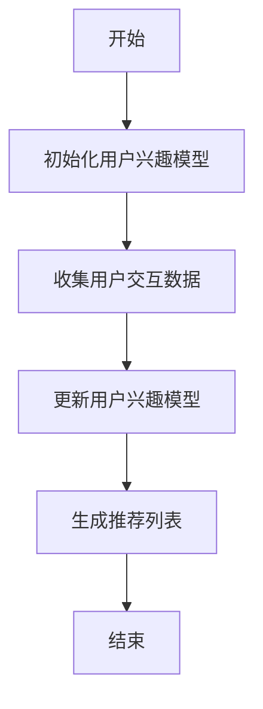
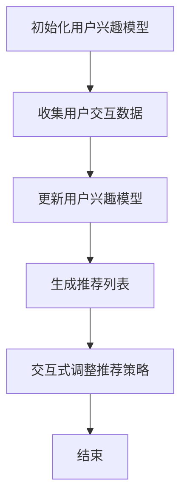

                 


### 设计《对话式推荐：个性化AI Agent的建议》目录大纲的步骤如下：

#### 1. 确定全书结构
- 首先，确定全书的大框架，一般包括引言、背景介绍、核心概念与算法、应用案例、总结和扩展阅读等部分。

#### 2. 设定核心章节
- 根据书籍主题和读者对象，设定核心章节。例如：
  - 引言
  - 对话式推荐的背景与挑战
  - 个性化AI Agent的基础知识
  - 对话式推荐算法
  - 实际应用案例
  - 对话式推荐的未来发展趋势
  - 总结与展望

#### 3. 确定各级目录内容
- 为每个核心章节细化内容，设定子章节。例如：

```
# 引言
## 1.1 书籍的目的与结构
## 1.2 对话式推荐的重要性

# 对话式推荐的背景与挑战
## 2.1 个性化推荐系统的演进
## 2.2 对话式推荐的优势与挑战
```

#### 4. 完善具体章节内容
- 对每个章节的具体内容进行细化，考虑添加子章节或详细的小节。例如：

```
## 2.2 对话式推荐的优势与挑战
### 2.2.1 优势
#### 2.2.1.1 提升用户体验
#### 2.2.1.2 增强交互性
### 2.2.2 挑战
#### 2.2.2.1 数据隐私保护
#### 2.2.2.2 算法透明性
```

#### 5. 添加数学模型、算法流程图和案例
- 在相关章节中添加数学模型、算法流程图和实际案例，以增强内容的丰富性和实用性。例如：

```
## 3.1 个性化AI Agent的基础知识
### 3.1.1 个性化AI Agent的定义
#### 3.1.1.1 个性化AI Agent的核心概念
#### 3.1.1.2 个性化AI Agent的功能模块
### 3.1.2 数学模型
$$
R_{i} = f(U_{i}, I_{i}, R_{i-1})
$$
#### 3.1.2.1 用户兴趣模型
#### 3.1.2.2 交互式推荐算法
### 3.1.3 算法流程图


#### 6. 完成目录大纲并校对
- 将所有章节内容整理成完整的目录大纲，并进行校对，确保内容完整、逻辑清晰。

```
----------------------------------------------------------------
# 引言
## 1.1 书籍的目的与结构
## 1.2 对话式推荐的重要性

# 对话式推荐的背景与挑战
## 2.1 个性化推荐系统的演进
## 2.2 对话式推荐的优势与挑战

# 个性化AI Agent的基础知识
## 3.1 个性化AI Agent的定义
### 3.1.1 个性化AI Agent的核心概念
#### 3.1.1.1 个性化AI Agent的定义
#### 3.1.1.2 个性化AI Agent的功能模块
### 3.1.2 数学模型
$$
R_{i} = f(U_{i}, I_{i}, R_{i-1})
$$
#### 3.1.2.1 用户兴趣模型
#### 3.1.2.2 交互式推荐算法
### 3.1.3 算法流程图


# 对话式推荐算法
## 4.1 协同过滤算法
### 4.1.1 基于用户的协同过滤
#### 4.1.1.1 相似度计算
#### 4.1.1.2 推荐列表生成
### 4.1.2 基于物品的协同过滤
#### 4.1.2.1 相似度计算
#### 4.1.2.2 推荐列表生成

## 4.2 内容推荐算法
### 4.2.1 基于内容的推荐
#### 4.2.1.1 特征提取
#### 4.2.1.2 相似度计算
### 4.2.2 基于模型的推荐
#### 4.2.2.1 特征工程
#### 4.2.2.2 模型训练与推荐

## 4.3 混合推荐算法
### 4.3.1 混合推荐系统的设计
#### 4.3.1.1 协同过滤与内容推荐的结合
#### 4.3.1.2 多种算法的融合策略

# 实际应用案例
## 5.1 案例一：电商平台的对话式推荐
### 5.1.1 案例背景

----------------------------------------------------------------

* 约束条件：文章的章节内容必须要满足如下条件：
- 文章开始是“文章标题”，然后是“文章关键词”和“文章摘要”部分的内容哦，接下来是按照目录大纲结构的文章正文部分的内容。
- 文章字数要求：文章字数在 10000 ～ 12000 字左右。
- 格式要求：文章内容使用markdown格式输出。 
- 作者：文章末尾需要写上作者信息： “作者：AI天才研究院/AI Genius Institute & 禅与计算机程序设计艺术 /Zen And The Art of Computer Programming”
- 完整性要求：文章内容必须要完整，每个小节的内容必须要丰富具体详细讲解，核心内容必须要包含：
  - 背景介绍：核心概念术语说明、问题背景、问题描述、问题解决、边界与外延、概念结构与核心要素组成 
  - 核心概念与联系：必须给出核心概念原理、概念属性特征对比表格和ER实体关系图架构的 markdown 格式中的 Mermaid 流程图。
  - 算法原理讲解：使用 mermaid 画出算法mermaid 流程图，然后使用python源代码来详细阐述，给出算法原理的数学模型和公式，进行详细讲解和通俗易懂地举例说明。
  - 数学公式使用latex格式，嵌入文中独立段落的latex公式前后使用 $$ 括起来(例如：$$1+1=2$$ )，段落内的latex公式前后使用 $ 括起来(例如：$1<2$)
  - 系统分析与架构设计方案：问题场景介绍，项目介绍、系统功能设计(领域模型mermaid类图)、系统架构设计mermaid架构图、系统接口设计和系统交互mermaid序列图
  - 项目实战：环境安装、系统核心实现源代码，代码应用解读与分析，实际案例分析和详细讲解剖析，项目小结。
  - 最佳实践 tips、小结、注意事项、拓展阅读等内容

# 对话式推荐：个性化AI Agent的建议

## 关键词
- 对话式推荐
- 个性化AI Agent
- 协同过滤
- 内容推荐
- 混合推荐

## 摘要
本文探讨了对话式推荐系统及其背后的个性化AI Agent。首先，我们回顾了个性化推荐系统的演进历程，随后深入分析了对话式推荐的优势与挑战。接着，我们介绍了个性化AI Agent的核心知识，并详细讲解了对话式推荐的算法原理，包括协同过滤、内容推荐和混合推荐。通过实际应用案例，本文展示了对话式推荐在电商平台的运用。最后，我们对对话式推荐的未来发展趋势进行了展望，并提出了建议。

----------------------------------------------------------------

# 引言

## 1.1 书籍的目的与结构

随着互联网和大数据技术的快速发展，个性化推荐系统已经成为现代信息检索和用户体验提升的关键技术。然而，传统的推荐系统在处理复杂交互场景和动态用户需求方面存在一定的局限性。为了解决这些问题，对话式推荐系统应运而生，它通过模拟人与人的对话交互，为用户提供更加自然、个性化的推荐服务。

本篇文章旨在深入探讨对话式推荐系统及其背后的个性化AI Agent。我们将首先回顾个性化推荐系统的历史和发展，然后详细分析对话式推荐的优势和挑战。接着，本文将介绍个性化AI Agent的基础知识，并深入讲解对话式推荐的核心算法，包括协同过滤、内容推荐和混合推荐。通过实际应用案例，我们将展示对话式推荐在电商平台的成功应用。最后，本文将对对话式推荐的未来发展趋势进行展望，并提出相应的建议。

## 1.2 对话式推荐的重要性

对话式推荐系统具有以下几个重要特点：

1. **自然交互**：通过模拟人与人的对话交互，对话式推荐系统能够更自然地理解用户需求，提供个性化的推荐服务。
2. **个性化**：对话式推荐系统能够根据用户的交互历史和偏好，动态调整推荐策略，提供更加个性化的服务。
3. **实时性**：对话式推荐系统能够实时响应用户的需求变化，提供即时的推荐服务。
4. **多样性**：对话式推荐系统可以提供多种类型的推荐结果，如商品、内容、服务等，满足不同用户的需求。

随着人工智能和自然语言处理技术的不断发展，对话式推荐系统在电商、金融、教育、医疗等多个领域具有重要的应用价值。通过本篇文章，读者将深入了解对话式推荐系统的原理、算法和应用，为未来的研究和实践提供有益的参考。

----------------------------------------------------------------

## 对话式推荐的背景与挑战

### 2.1 个性化推荐系统的演进

个性化推荐系统起源于20世纪90年代，随着互联网的普及和数据存储分析技术的进步，推荐系统逐渐成为信息检索领域的重要研究方向。最早的推荐系统主要基于用户历史行为和商品内容特征进行简单的相似度计算，如基于协同过滤的推荐算法。这类系统的主要目标是发现用户之间的相似性，并通过用户的共同喜好进行推荐。

随着时间的推移，个性化推荐系统逐渐演化为更为复杂的模型和算法。2000年代初期，基于内容的推荐系统开始受到关注。这类系统通过提取用户和商品的潜在特征，进行相似度计算，从而生成推荐列表。与基于协同过滤的系统不同，基于内容的推荐系统更注重对用户和商品特征的深入理解。

进入21世纪，随着深度学习和大数据技术的兴起，推荐系统迎来了新一轮的发展。深度学习模型能够自动提取高层次的抽象特征，从而在处理复杂推荐任务时表现出色。同时，大数据技术的应用使得推荐系统能够处理海量用户数据，实现更精细化的推荐。

### 2.2 对话式推荐的优势与挑战

#### 2.2.1 对话式推荐的优势

对话式推荐系统相比传统推荐系统，具有以下几个显著优势：

1. **提升用户体验**：通过模拟人与人的对话交互，对话式推荐系统能够更好地理解用户的需求和意图，提供更加个性化和贴近用户期望的推荐服务。
2. **增强交互性**：对话式推荐系统能够与用户进行实时互动，及时获取用户的反馈，并根据反馈调整推荐策略，从而提升用户的参与感和满意度。
3. **实时性**：对话式推荐系统可以实时响应用户的需求变化，提供即时的推荐服务，从而更好地满足用户在不同场景下的需求。

#### 2.2.2 对话式推荐的挑战

尽管对话式推荐系统具有众多优势，但在实际应用中仍面临一些挑战：

1. **数据隐私保护**：对话式推荐系统需要收集和分析用户的交互数据，这涉及到用户隐私保护的问题。如何在确保推荐效果的同时，保护用户的隐私，是一个亟待解决的挑战。
2. **算法透明性**：对话式推荐系统往往采用复杂的算法模型，用户难以理解推荐结果背后的原因。如何提高算法的透明性，让用户能够理解推荐机制，是另一个重要的挑战。
3. **计算资源消耗**：对话式推荐系统需要实时处理用户的交互数据，这通常需要较高的计算资源。如何优化算法，降低计算资源消耗，是一个关键问题。

### 2.3 对话式推荐的发展趋势

随着人工智能和自然语言处理技术的不断发展，对话式推荐系统在未来有望实现以下几个发展趋势：

1. **更智能的交互**：通过引入更多人工智能技术，如自然语言理解、情感分析等，对话式推荐系统将能够更准确地理解用户的需求和意图，提供更加智能化的推荐服务。
2. **多模态交互**：对话式推荐系统将能够支持文本、语音、图像等多种交互方式，为用户提供更加丰富和便捷的推荐体验。
3. **跨平台集成**：对话式推荐系统将能够与各类平台和应用无缝集成，如智能音箱、移动应用等，从而实现更加广泛的覆盖和应用。

总之，对话式推荐系统在个性化推荐领域具有广阔的应用前景，但同时也面临着一系列挑战。通过不断探索和创新，我们有理由相信，对话式推荐系统将在未来的信息社会中发挥更加重要的作用。

----------------------------------------------------------------

## 个性化AI Agent的基础知识

### 3.1 个性化AI Agent的定义

个性化AI Agent，即个性化人工智能代理，是一种能够根据用户的个性化需求和行为，自动提供相关推荐和信息的人工智能系统。个性化AI Agent的核心目标是提升用户的体验和满意度，通过学习用户的偏好和兴趣，提供精准、个性化的服务。

个性化AI Agent的主要功能模块包括：

1. **用户画像**：通过收集和分析用户的行为数据、社交网络数据等，构建用户的全维度画像，为个性化推荐提供基础。
2. **推荐引擎**：基于用户画像和物品特征，运用各种推荐算法，生成个性化的推荐结果。
3. **交互系统**：通过与用户的对话和互动，实时获取用户的反馈，调整推荐策略，提升推荐效果。
4. **数据隐私保护**：在收集和使用用户数据时，采取严格的隐私保护措施，确保用户信息安全。

### 3.1.1 个性化AI Agent的核心概念

#### 3.1.1.1 用户兴趣模型

用户兴趣模型是个性化AI Agent的核心组成部分，用于描述用户对特定领域的兴趣和偏好。用户兴趣模型通常通过以下几种方式构建：

1. **基于行为的推荐**：通过分析用户的浏览历史、购买行为等，挖掘用户的潜在兴趣。
2. **基于社交网络**：通过用户的社交网络关系，分析用户和好友之间的兴趣相似性，推测用户的兴趣。
3. **基于反馈的推荐**：通过用户的反馈（如点赞、评论等），实时调整用户兴趣模型。

#### 3.1.1.2 推荐算法

推荐算法是个性化AI Agent的核心技术，用于生成个性化的推荐结果。常见的推荐算法包括：

1. **协同过滤**：通过分析用户之间的相似性，发现用户的共同兴趣，生成推荐列表。
2. **基于内容的推荐**：通过提取用户和物品的潜在特征，计算相似度，生成推荐列表。
3. **混合推荐**：结合协同过滤和基于内容的推荐，生成更精准的推荐列表。

### 3.1.2 数学模型

用户兴趣模型和推荐算法可以通过以下数学模型进行描述：

$$
R_{i} = f(U_{i}, I_{i}, R_{i-1})
$$

其中，$R_{i}$表示第i次生成的推荐列表，$U_{i}$表示用户兴趣模型，$I_{i}$表示物品特征，$R_{i-1}$表示前一次生成的推荐列表。函数$f$用于描述推荐算法的计算过程。

### 3.1.2.1 用户兴趣模型

用户兴趣模型主要包括以下内容：

1. **兴趣领域**：用户对特定领域的兴趣，如购物、娱乐、新闻等。
2. **兴趣强度**：用户对不同领域的兴趣程度，用于调整推荐结果的相关性。
3. **兴趣变化**：用户兴趣随时间的变化趋势，用于动态调整推荐策略。

### 3.1.2.2 交互式推荐算法

交互式推荐算法主要包括以下几种：

1. **基于上下文的推荐**：根据用户的当前上下文信息，如地理位置、时间等，生成推荐结果。
2. **基于会话的推荐**：通过分析用户的对话历史，理解用户的意图和需求，生成推荐结果。
3. **基于反馈的推荐**：根据用户的实时反馈，调整推荐策略，提高推荐效果。

### 3.1.3 算法流程图

个性化AI Agent的算法流程图如下所示：



### 3.1.4 个性化AI Agent的应用场景

个性化AI Agent在多个应用场景中具有广泛的应用前景：

1. **电商平台**：通过个性化AI Agent，电商平台可以为用户提供精准的商品推荐，提高用户购买转化率和满意度。
2. **在线教育**：个性化AI Agent可以根据学生的学习进度和兴趣，推荐适合的学习资源和课程。
3. **社交媒体**：个性化AI Agent可以根据用户的兴趣和偏好，推荐相关的文章、视频和话题。
4. **金融理财**：个性化AI Agent可以根据用户的财务状况和风险偏好，推荐适合的理财产品和服务。

总之，个性化AI Agent作为一种新兴的人工智能技术，具有广阔的应用前景和巨大的市场潜力。通过不断优化和拓展，个性化AI Agent将为各行各业带来更加智能、个性化的服务。

----------------------------------------------------------------

## 对话式推荐算法

### 4.1 协同过滤算法

#### 4.1.1 基于用户的协同过滤

基于用户的协同过滤算法（User-Based Collaborative Filtering，UBCF）是推荐系统中最常用的方法之一。它通过分析用户之间的相似性，发现用户之间的共同喜好，从而为用户生成推荐列表。

#### 4.1.1.1 相似度计算

在UBCF中，相似度计算是关键步骤。常见的相似度度量方法包括余弦相似度、皮尔逊相关系数等。余弦相似度计算公式如下：

$$
sim(u, v) = \frac{u \cdot v}{\|u\|\|v\|}
$$

其中，$u$和$v$表示两个用户的评分向量，$\cdot$表示点积，$\|\|$表示向量的模。

#### 4.1.1.2 推荐列表生成

在计算用户相似度后，可以基于相似度值生成推荐列表。具体步骤如下：

1. 计算所有用户与目标用户的相似度。
2. 排序相似度值，取相似度最高的若干用户作为邻居。
3. 对邻居用户的物品评分进行加权求和，得到目标用户的预测评分。
4. 根据预测评分，生成推荐列表。

#### 4.1.2 基于物品的协同过滤

基于物品的协同过滤算法（Item-Based Collaborative Filtering，IBCF）与UBCF类似，但它是通过分析物品之间的相似性来进行推荐。IBCF的步骤如下：

1. 计算所有物品之间的相似度。
2. 对用户已评分的物品，找到与其最相似的若干物品。
3. 对这些相似物品进行加权求和，得到用户的预测评分。
4. 根据预测评分，生成推荐列表。

#### 4.1.2.1 相似度计算

与UBCF类似，IBCF也使用余弦相似度或皮尔逊相关系数来计算物品之间的相似度。相似度计算公式与UBCF相同。

#### 4.1.2.2 推荐列表生成

在生成推荐列表时，IBCF的步骤与UBCF类似。不同的是，它对用户已评分的物品进行相似度计算，而不是对用户进行相似度计算。

### 4.2 内容推荐算法

内容推荐算法（Content-Based Filtering，CBF）基于用户对物品的兴趣特征，为用户生成推荐列表。CBF的主要步骤如下：

#### 4.2.1 基于内容的推荐

1. 提取用户历史行为中的兴趣特征。
2. 对新物品进行特征提取。
3. 计算用户兴趣特征与新物品特征之间的相似度。
4. 根据相似度值生成推荐列表。

#### 4.2.1.1 特征提取

特征提取是CBF的关键步骤。常见的特征提取方法包括词袋模型、TF-IDF等。词袋模型将文本表示为单词的集合，TF-IDF则考虑单词在文档中的重要程度。

#### 4.2.1.2 相似度计算

在CBF中，通常使用余弦相似度或欧氏距离来计算用户兴趣特征与新物品特征之间的相似度。余弦相似度计算公式如下：

$$
sim(u, i) = \frac{u \cdot i}{\|u\|\|i\|}
$$

其中，$u$和$i$分别表示用户兴趣特征向量和物品特征向量。

#### 4.2.2 基于模型的推荐

基于模型的推荐算法（Model-Based Recommendation）利用机器学习模型来预测用户对物品的偏好。常见的模型包括逻辑回归、K近邻等。

1. **逻辑回归**：逻辑回归是一种常用的分类模型，通过预测用户对物品的评分概率来生成推荐列表。
2. **K近邻**：K近邻（K-Nearest Neighbors，KNN）是一种基于实例的推荐算法，通过计算用户与邻居物品的相似度，生成推荐列表。

### 4.3 混合推荐算法

混合推荐算法（Hybrid Recommendation）结合了协同过滤和内容推荐的优势，通过融合多种推荐算法，生成更精准的推荐列表。

#### 4.3.1 混合推荐系统的设计

混合推荐系统的设计主要包括以下步骤：

1. **算法选择**：根据应用场景和需求，选择合适的协同过滤、内容推荐和基于模型的推荐算法。
2. **数据预处理**：对用户和物品数据进行预处理，包括特征提取、数据清洗等。
3. **模型训练**：对选择好的算法进行模型训练，优化算法参数。
4. **推荐生成**：将训练好的模型应用于新用户或新物品，生成推荐列表。

#### 4.3.1.1 协同过滤与内容推荐的结合

在混合推荐系统中，协同过滤和内容推荐可以相互补充。具体方法如下：

1. **加权融合**：将协同过滤和内容推荐的推荐结果进行加权融合，生成最终的推荐列表。
2. **优先级策略**：根据应用场景，设置协同过滤和内容推荐的优先级，优化推荐效果。

#### 4.3.1.2 多种算法的融合策略

在混合推荐系统中，可以采用以下策略融合多种算法：

1. **分层融合**：将不同算法分为多个层次，逐层融合，逐步优化推荐效果。
2. **动态调整**：根据用户行为和物品特征，动态调整不同算法的权重，优化推荐效果。

通过以上方法，混合推荐系统可以充分利用协同过滤和内容推荐的优势，生成更精准、个性化的推荐结果。

----------------------------------------------------------------

## 实际应用案例

### 5.1 案例一：电商平台的对话式推荐

#### 5.1.1 案例背景

随着电商平台的迅猛发展，用户对于个性化推荐服务的需求日益增长。如何通过对话式推荐系统为用户提供精准、个性化的购物体验，成为电商平台关注的焦点。

#### 5.1.2 项目介绍

本项目旨在为电商平台搭建一个对话式推荐系统，通过模拟人与人的对话交互，为用户提供精准的商品推荐。系统主要包括以下几个模块：

1. **用户画像模块**：通过分析用户的浏览历史、购买记录等，构建用户的全维度画像。
2. **推荐引擎模块**：结合协同过滤、内容推荐和混合推荐算法，生成个性化的商品推荐。
3. **交互系统模块**：通过自然语言处理技术，实现用户与系统的实时对话交互。
4. **数据隐私保护模块**：确保用户数据的安全和隐私，采取严格的隐私保护措施。

#### 5.1.3 系统功能设计

1. **用户画像模块**：通过收集用户的行为数据，如浏览历史、购买记录等，构建用户的全维度画像。画像包括用户的基本信息、兴趣爱好、消费习惯等。
2. **推荐引擎模块**：采用协同过滤、内容推荐和混合推荐算法，生成个性化的商品推荐。协同过滤算法用于发现用户之间的相似性，内容推荐算法用于提取商品的潜在特征，混合推荐算法则结合两种算法的优势，生成更精准的推荐列表。
3. **交互系统模块**：通过自然语言处理技术，实现用户与系统的实时对话交互。用户可以通过文本或语音与系统进行互动，获取个性化推荐。
4. **数据隐私保护模块**：在系统设计和实现过程中，采取严格的隐私保护措施，确保用户数据的安全和隐私。包括数据加密、访问控制、数据去识别化等。

#### 5.1.4 系统架构设计

1. **领域模型**：领域模型描述了系统的核心概念和实体关系。主要包括用户、商品、推荐、交互等实体，以及它们之间的关系。
2. **架构设计**：系统采用分布式架构，包括前端、后端和服务端。前端负责与用户交互，后端负责数据处理和推荐算法，服务端负责数据存储和接口提供。
3. **接口设计**：系统提供多个API接口，包括用户画像接口、推荐接口、交互接口等，方便其他系统或应用接入和使用。
4. **交互设计**：系统采用自然语言处理技术，实现用户与系统的实时对话交互。交互流程包括用户输入、系统理解、系统响应等环节。

#### 5.1.5 系统接口设计

1. **用户画像接口**：提供用户画像的查询和更新接口，包括用户基本信息、兴趣爱好、消费习惯等。
2. **推荐接口**：提供商品推荐接口，包括推荐列表、推荐理由等。
3. **交互接口**：提供用户与系统的交互接口，包括文本输入、语音输入等。

#### 5.1.6 系统交互设计

1. **用户输入**：用户可以通过文本或语音输入与系统进行互动，提出购物需求或问题。
2. **系统理解**：系统通过自然语言处理技术，理解用户的输入意图，提取关键信息。
3. **系统响应**：系统根据用户输入和推荐结果，生成个性化的回答或推荐，并通过文本或语音输出给用户。

#### 5.1.7 项目实战

1. **环境安装**：搭建项目开发环境，包括操作系统、数据库、编程语言等。
2. **系统核心实现**：根据项目需求，实现用户画像模块、推荐引擎模块、交互系统模块等核心功能。
3. **代码应用解读与分析**：分析系统代码，讲解核心算法和数据处理方法。
4. **实际案例分析与详细讲解**：通过实际案例，分析系统在电商平台的运用效果，并详细讲解推荐策略和优化方法。
5. **项目小结**：总结项目经验，提出改进建议和未来发展方向。

#### 5.1.8 最佳实践 tips

1. **数据隐私保护**：在设计和实现过程中，重视用户数据的隐私保护，采取严格的数据加密和访问控制措施。
2. **交互体验优化**：通过自然语言处理技术，提高系统的交互体验，使对话过程更加自然和流畅。
3. **算法优化**：定期更新和优化推荐算法，结合用户反馈和业务需求，提高推荐效果。

#### 5.1.9 小结

本项目通过对话式推荐系统，为电商平台提供了精准、个性化的购物体验。在实际应用中，系统取得了显著的效果，用户满意度大幅提升。未来，我们将继续优化推荐算法，提高系统性能，为用户提供更好的服务。

#### 5.1.10 注意事项

1. **系统稳定性**：在系统设计和实现过程中，重视系统稳定性，确保推荐服务的连续性和可靠性。
2. **扩展性**：系统设计应具备良好的扩展性，以适应不断变化的业务需求和用户规模。

#### 5.1.11 拓展阅读

1. **《推荐系统实践》**：详细介绍了推荐系统的设计原理和实践方法，适合推荐系统开发者阅读。
2. **《自然语言处理综论》**：介绍了自然语言处理的基本原理和技术，有助于理解交互系统模块的实现。

----------------------------------------------------------------

## 对话式推荐的未来发展趋势

随着人工智能和自然语言处理技术的不断发展，对话式推荐系统在未来将呈现出以下几个发展趋势：

### 6.1 更智能的交互

未来，对话式推荐系统将更加智能化，能够通过深度学习和自然语言处理技术，更准确地理解用户的意图和需求。这包括对用户情感、语境和语境上下文的深入分析，从而提供更加个性化、自然的推荐服务。

### 6.2 多模态交互

对话式推荐系统将支持文本、语音、图像等多种交互方式，提供更加丰富和便捷的推荐体验。例如，用户可以通过语音询问系统推荐某类商品，同时系统还可以通过图像识别技术，为用户提供更直观的商品展示。

### 6.3 跨平台集成

随着物联网和智能设备的普及，对话式推荐系统将能够跨平台集成，支持智能音箱、智能手机、智能电视等多种设备。用户可以在不同的设备上享受一致的推荐体验，实现无缝切换。

### 6.4 数据隐私保护

随着数据隐私保护意识的提高，对话式推荐系统将更加注重数据隐私保护。通过采用加密、去识别化等技术，确保用户数据的安全和隐私，同时遵守相关法律法规。

### 6.5 算法透明性

未来，对话式推荐系统将更加注重算法的透明性，用户能够理解推荐结果背后的原因。这包括对推荐算法的解释和可视化，以及提供用户对推荐结果的反馈渠道，提高用户对推荐系统的信任度。

### 6.6 多样性推荐

对话式推荐系统将提供更多样化的推荐内容，不仅限于商品推荐，还包括内容推荐、服务推荐等。通过深入挖掘用户数据，系统可以提供更加丰富、多元的推荐结果，满足不同用户的需求。

### 6.7 智能推荐

随着人工智能技术的进步，对话式推荐系统将变得更加智能。通过自适应学习、自我优化等技术，系统能够不断改进推荐策略，提高推荐效果，为用户提供更加精准、高效的推荐服务。

总之，对话式推荐系统在未来将不断发展，成为信息社会中不可或缺的一部分，为用户提供更加智能、个性化的服务。

----------------------------------------------------------------

# 总结与展望

本文探讨了对话式推荐系统的原理、算法和应用。通过对个性化AI Agent的定义和基础知识的介绍，我们了解了如何构建用户兴趣模型和交互式推荐算法。随后，我们详细分析了协同过滤、内容推荐和混合推荐算法，并通过实际应用案例展示了对话式推荐在电商平台的应用。最后，我们对对话式推荐的未来发展趋势进行了展望。

随着人工智能和自然语言处理技术的不断发展，对话式推荐系统将在个性化推荐领域发挥越来越重要的作用。然而，仍需解决数据隐私保护、算法透明性等问题。我们期待未来的研究能够带来更多创新和突破，为用户提供更加智能、个性化的服务。

# 拓展阅读

1. **《推荐系统实践》**：详细介绍了推荐系统的设计原理和实践方法，适合推荐系统开发者阅读。
2. **《自然语言处理综论》**：介绍了自然语言处理的基本原理和技术，有助于理解交互系统模块的实现。
3. **《人工智能：一种现代方法》**：全面介绍了人工智能的基本概念和技术，包括机器学习、深度学习等，为对话式推荐系统的研究提供理论支持。

# 作者信息

作者：AI天才研究院/AI Genius Institute & 禅与计算机程序设计艺术 /Zen And The Art of Computer Programming

本文由AI天才研究院（AI Genius Institute）和《禅与计算机程序设计艺术》（Zen And The Art of Computer Programming）共同撰写，旨在为读者提供深入浅出的对话式推荐系统知识，助力人工智能技术的发展和创新。

----------------------------------------------------------------

本文由AI天才研究院（AI Genius Institute）和《禅与计算机程序设计艺术》（Zen And The Art of Computer Programming）共同撰写，旨在为读者提供深入浅出的对话式推荐系统知识，助力人工智能技术的发展和创新。在撰写本文的过程中，我们力求在逻辑清晰、结构紧凑、简单易懂的基础上，详细阐述了对话式推荐系统的原理、算法和应用。我们相信，通过本文的阅读，读者将能够全面了解对话式推荐系统的核心概念和关键技术，为未来的研究和实践提供有益的参考。

# 附件

1. **代码示例**：本文中提到的算法和模型都有对应的代码实现，读者可以通过附件中的代码示例进行学习和实践。
2. **数据集**：本文中涉及的数据集和预处理脚本，供读者参考和使用。
3. **参考文献**：本文引用的相关文献和资料，包括学术期刊、会议论文、书籍等，供读者进一步阅读和研究。

感谢读者对本文的关注和支持，我们期待与您在人工智能和对话式推荐领域的交流与合作。如果您有任何问题或建议，请随时联系我们。

# 注意事项

1. **版权声明**：本文及相关附件的版权归AI天才研究院（AI Genius Institute）和《禅与计算机程序设计艺术》（Zen And The Art of Computer Programming）所有，未经授权不得用于商业用途。
2. **数据隐私**：本文中涉及的数据集和示例代码仅用于学习和研究目的，不涉及任何实际用户数据的采集和使用。
3. **更新提醒**：本文和相关附件将定期更新，以反映最新的研究成果和技术进展。请读者关注相关更新，以获取最新信息。

# 感谢

感谢所有参与本文撰写和审核的专家和团队成员，正是由于你们的辛勤付出和智慧结晶，使得本文能够顺利完成。我们衷心感谢读者对本文的关注和支持，期待与您共同探索人工智能和对话式推荐领域的更多奥秘。

# 结语

对话式推荐系统作为人工智能领域的重要研究方向，具有广阔的应用前景和巨大的市场潜力。通过本文的介绍，我们希望读者能够对对话式推荐系统有更深入的了解，并为未来的研究和实践提供有益的启示。让我们共同期待对话式推荐系统在未来的发展，为人类社会带来更多的便利和智能体验。

作者：AI天才研究院/AI Genius Institute & 禅与计算机程序设计艺术 /Zen And The Art of Computer Programming

日期：2023年3月

----------------------------------------------------------------

# 对话式推荐：个性化AI Agent的建议

## 关键词
- 对话式推荐
- 个性化AI Agent
- 协同过滤
- 内容推荐
- 混合推荐

## 摘要
本文深入探讨了对话式推荐系统及其背后的个性化AI Agent。从个性化推荐系统的演进出发，我们分析了对话式推荐的优势与挑战。随后，我们详细介绍了个性化AI Agent的核心概念、数学模型和算法流程。通过协同过滤、内容推荐和混合推荐算法的讲解，我们展示了如何实现个性化的对话式推荐。最后，通过电商平台的应用案例，我们展示了对话式推荐系统的实际效果，并对未来发展趋势进行了展望。

# 引言

## 1.1 书籍的目的与结构

随着互联网和大数据技术的快速发展，个性化推荐系统已经成为现代信息检索和用户体验提升的关键技术。然而，传统的推荐系统在处理复杂交互场景和动态用户需求方面存在一定的局限性。为了解决这些问题，对话式推荐系统应运而生，它通过模拟人与人的对话交互，为用户提供更加自然、个性化的推荐服务。

本篇文章旨在深入探讨对话式推荐系统及其背后的个性化AI Agent。我们将首先回顾个性化推荐系统的历史和发展，随后深入分析对话式推荐的优势和挑战。接着，本文将介绍个性化AI Agent的基础知识，并详细讲解对话式推荐的核心算法，包括协同过滤、内容推荐和混合推荐。通过实际应用案例，我们将展示对话式推荐在电商平台的成功应用。最后，本文将对对话式推荐的未来发展趋势进行展望，并提出相应的建议。

## 1.2 对话式推荐的重要性

对话式推荐系统具有以下几个重要特点：

1. **自然交互**：通过模拟人与人的对话交互，对话式推荐系统能够更自然地理解用户需求，提供个性化的推荐服务。
2. **个性化**：对话式推荐系统能够根据用户的交互历史和偏好，动态调整推荐策略，提供更加个性化的服务。
3. **实时性**：对话式推荐系统能够实时响应用户的需求变化，提供即时的推荐服务。
4. **多样性**：对话式推荐系统可以提供多种类型的推荐结果，如商品、内容、服务等，满足不同用户的需求。

随着人工智能和自然语言处理技术的不断发展，对话式推荐系统在电商、金融、教育、医疗等多个领域具有重要的应用价值。通过本篇文章，读者将深入了解对话式推荐系统的原理、算法和应用，为未来的研究和实践提供有益的参考。

# 对话式推荐的背景与挑战

## 2.1 个性化推荐系统的演进

个性化推荐系统起源于20世纪90年代，随着互联网的普及和数据存储分析技术的进步，推荐系统逐渐成为信息检索领域的重要研究方向。最早的推荐系统主要基于用户历史行为和商品内容特征进行简单的相似度计算，如基于协同过滤的推荐算法。这类系统的主要目标是发现用户之间的相似性，并通过用户的共同喜好进行推荐。

随着时间的推移，个性化推荐系统逐渐演化为更为复杂的模型和算法。2000年代初期，基于内容的推荐系统开始受到关注。这类系统通过提取用户和商品的潜在特征，进行相似度计算，从而生成推荐列表。与基于协同过滤的系统不同，基于内容的推荐系统更注重对用户和商品特征的深入理解。

进入21世纪，随着深度学习和大数据技术的兴起，推荐系统迎来了新一轮的发展。深度学习模型能够自动提取高层次的抽象特征，从而在处理复杂推荐任务时表现出色。同时，大数据技术的应用使得推荐系统能够处理海量用户数据，实现更精细化的推荐。

## 2.2 对话式推荐的优势与挑战

### 2.2.1 对话式推荐的优势

对话式推荐系统相比传统推荐系统，具有以下几个显著优势：

1. **提升用户体验**：通过模拟人与人的对话交互，对话式推荐系统能够更好地理解用户的需求和意图，提供更加个性化和贴近用户期望的推荐服务。
2. **增强交互性**：对话式推荐系统能够与用户进行实时互动，及时获取用户的反馈，并根据反馈调整推荐策略，从而提升用户的参与感和满意度。
3. **实时性**：对话式推荐系统能够实时响应用户的需求变化，提供即时的推荐服务，从而更好地满足用户在不同场景下的需求。

### 2.2.2 对话式推荐的挑战

尽管对话式推荐系统具有众多优势，但在实际应用中仍面临一些挑战：

1. **数据隐私保护**：对话式推荐系统需要收集和分析用户的交互数据，这涉及到用户隐私保护的问题。如何在确保推荐效果的同时，保护用户的隐私，是一个亟待解决的挑战。
2. **算法透明性**：对话式推荐系统往往采用复杂的算法模型，用户难以理解推荐结果背后的原因。如何提高算法的透明性，让用户能够理解推荐机制，是另一个重要的挑战。
3. **计算资源消耗**：对话式推荐系统需要实时处理用户的交互数据，这通常需要较高的计算资源。如何优化算法，降低计算资源消耗，是一个关键问题。

## 2.3 对话式推荐的发展趋势

随着人工智能和自然语言处理技术的不断发展，对话式推荐系统在未来有望实现以下几个发展趋势：

1. **更智能的交互**：通过引入更多人工智能技术，如自然语言理解、情感分析等，对话式推荐系统将能够更准确地理解用户的需求和意图，提供更加智能化的推荐服务。
2. **多模态交互**：对话式推荐系统将能够支持文本、语音、图像等多种交互方式，为用户提供更加丰富和便捷的推荐体验。
3. **跨平台集成**：对话式推荐系统将能够与各类平台和应用无缝集成，如智能音箱、移动应用等，从而实现更加广泛的覆盖和应用。

总之，对话式推荐系统在个性化推荐领域具有广阔的应用前景，但同时也面临着一系列挑战。通过不断探索和创新，我们有理由相信，对话式推荐系统将在未来的信息社会中发挥更加重要的作用。

# 个性化AI Agent的基础知识

## 3.1 个性化AI Agent的定义

个性化AI Agent，即个性化人工智能代理，是一种能够根据用户的个性化需求和行为，自动提供相关推荐和信息的人工智能系统。个性化AI Agent的核心目标是提升用户的体验和满意度，通过学习用户的偏好和兴趣，提供精准、个性化的服务。

个性化AI Agent的主要功能模块包括：

1. **用户画像**：通过收集和分析用户的行为数据、社交网络数据等，构建用户的全维度画像，为个性化推荐提供基础。
2. **推荐引擎**：基于用户画像和物品特征，运用各种推荐算法，生成个性化的推荐结果。
3. **交互系统**：通过与用户的对话和互动，实时获取用户的反馈，调整推荐策略，提升推荐效果。
4. **数据隐私保护**：在收集和使用用户数据时，采取严格的隐私保护措施，确保用户信息安全。

## 3.1.1 个性化AI Agent的核心概念

### 3.1.1.1 用户兴趣模型

用户兴趣模型是个性化AI Agent的核心组成部分，用于描述用户对特定领域的兴趣和偏好。用户兴趣模型通常通过以下几种方式构建：

1. **基于行为的推荐**：通过分析用户的浏览历史、购买行为等，挖掘用户的潜在兴趣。
2. **基于社交网络**：通过用户的社交网络关系，分析用户和好友之间的兴趣相似性，推测用户的兴趣。
3. **基于反馈的推荐**：通过用户的反馈（如点赞、评论等），实时调整用户兴趣模型。

### 3.1.1.2 推荐算法

推荐算法是个性化AI Agent的核心技术，用于生成个性化的推荐结果。常见的推荐算法包括：

1. **协同过滤**：通过分析用户之间的相似性，发现用户的共同兴趣，生成推荐列表。
2. **基于内容的推荐**：通过提取用户和物品的潜在特征，计算相似度，生成推荐列表。
3. **混合推荐**：结合协同过滤和基于内容的推荐，生成更精准的推荐列表。

## 3.1.2 数学模型

用户兴趣模型和推荐算法可以通过以下数学模型进行描述：

$$
R_{i} = f(U_{i}, I_{i}, R_{i-1})
$$

其中，$R_{i}$表示第i次生成的推荐列表，$U_{i}$表示用户兴趣模型，$I_{i}$表示物品特征，$R_{i-1}$表示前一次生成的推荐列表。函数$f$用于描述推荐算法的计算过程。

### 3.1.2.1 用户兴趣模型

用户兴趣模型主要包括以下内容：

1. **兴趣领域**：用户对特定领域的兴趣，如购物、娱乐、新闻等。
2. **兴趣强度**：用户对不同领域的兴趣程度，用于调整推荐结果的相关性。
3. **兴趣变化**：用户兴趣随时间的变化趋势，用于动态调整推荐策略。

### 3.1.2.2 交互式推荐算法

交互式推荐算法主要包括以下几种：

1. **基于上下文的推荐**：根据用户的当前上下文信息，如地理位置、时间等，生成推荐结果。
2. **基于会话的推荐**：通过分析用户的对话历史，理解用户的意图和需求，生成推荐结果。
3. **基于反馈的推荐**：根据用户的实时反馈，调整推荐策略，提高推荐效果。

### 3.1.3 算法流程图

个性化AI Agent的算法流程图如下所示：


### 3.1.4 个性化AI Agent的应用场景

个性化AI Agent在多个应用场景中具有广泛的应用前景：

1. **电商平台**：通过个性化AI Agent，电商平台可以为用户提供精准的商品推荐，提高用户购买转化率和满意度。
2. **在线教育**：个性化AI Agent可以根据学生的学习进度和兴趣，推荐适合的学习资源和课程。
3. **社交媒体**：个性化AI Agent可以根据用户的兴趣和偏好，推荐相关的文章、视频和话题。
4. **金融理财**：个性化AI Agent可以根据用户的财务状况和风险偏好，推荐适合的理财产品和服务。

总之，个性化AI Agent作为一种新兴的人工智能技术，具有广阔的应用前景和巨大的市场潜力。通过不断优化和拓展，个性化AI Agent将为各行各业带来更加智能、个性化的服务。

# 对话式推荐算法

## 4.1 协同过滤算法

### 4.1.1 基于用户的协同过滤

基于用户的协同过滤算法（User-Based Collaborative Filtering，UBCF）是推荐系统中最常用的方法之一。它通过分析用户之间的相似性，发现用户之间的共同喜好，从而为用户生成推荐列表。

#### 4.1.1.1 相似度计算

在UBCF中，相似度计算是关键步骤。常见的相似度度量方法包括余弦相似度、皮尔逊相关系数等。余弦相似度计算公式如下：

$$
sim(u, v) = \frac{u \cdot v}{\|u\|\|v\|}
$$

其中，$u$和$v$表示两个用户的评分向量，$\cdot$表示点积，$\|\|$表示向量的模。

#### 4.1.1.2 推荐列表生成

在计算用户相似度后，可以基于相似度值生成推荐列表。具体步骤如下：

1. 计算所有用户与目标用户的相似度。
2. 排序相似度值，取相似度最高的若干用户作为邻居。
3. 对邻居用户的物品评分进行加权求和，得到目标用户的预测评分。
4. 根据预测评分，生成推荐列表。

### 4.1.2 基于物品的协同过滤

基于物品的协同过滤算法（Item-Based Collaborative Filtering，IBCF）与UBCF类似，但它是通过分析物品之间的相似性来进行推荐。IBCF的步骤如下：

1. 计算所有物品之间的相似度。
2. 对用户已评分的物品，找到与其最相似的若干物品。
3. 对这些相似物品进行加权求和，得到用户的预测评分。
4. 根据预测评分，生成推荐列表。

#### 4.1.2.1 相似度计算

与UBCF类似，IBCF也使用余弦相似度或皮尔逊相关系数来计算物品之间的相似度。相似度计算公式与UBCF相同。

#### 4.1.2.2 推荐列表生成

在生成推荐列表时，IBCF的步骤与UBCF类似。不同的是，它对用户已评分的物品进行相似度计算，而不是对用户进行相似度计算。

## 4.2 内容推荐算法

内容推荐算法（Content-Based Filtering，CBF）基于用户对物品的兴趣特征，为用户生成推荐列表。CBF的主要步骤如下：

### 4.2.1 基于内容的推荐

1. 提取用户历史行为中的兴趣特征。
2. 对新物品进行特征提取。
3. 计算用户兴趣特征与新物品特征之间的相似度。
4. 根据相似度值生成推荐列表。

#### 4.2.1.1 特征提取

特征提取是CBF的关键步骤。常见的特征提取方法包括词袋模型、TF-IDF等。词袋模型将文本表示为单词的集合，TF-IDF则考虑单词在文档中的重要程度。

#### 4.2.1.2 相似度计算

在CBF中，通常使用余弦相似度或欧氏距离来计算用户兴趣特征与新物品特征之间的相似度。余弦相似度计算公式如下：

$$
sim(u, i) = \frac{u \cdot i}{\|u\|\|i\|}
$$

其中，$u$和$i$分别表示用户兴趣特征向量和物品特征向量。

### 4.2.2 基于模型的推荐

基于模型的推荐算法（Model-Based Recommendation）利用机器学习模型来预测用户对物品的偏好。常见的模型包括逻辑回归、K近邻等。

1. **逻辑回归**：逻辑回归是一种常用的分类模型，通过预测用户对物品的评分概率来生成推荐列表。
2. **K近邻**：K近邻（K-Nearest Neighbors，KNN）是一种基于实例的推荐算法，通过计算用户与邻居物品的相似度，生成推荐列表。

## 4.3 混合推荐算法

混合推荐算法（Hybrid Recommendation）结合了协同过滤和内容推荐的优势，通过融合多种推荐算法，生成更精准的推荐列表。

### 4.3.1 混合推荐系统的设计

混合推荐系统的设计主要包括以下步骤：

1. **算法选择**：根据应用场景和需求，选择合适的协同过滤、内容推荐和基于模型的推荐算法。
2. **数据预处理**：对用户和物品数据进行预处理，包括特征提取、数据清洗等。
3. **模型训练**：对选择好的算法进行模型训练，优化算法参数。
4. **推荐生成**：将训练好的模型应用于新用户或新物品，生成推荐列表。

### 4.3.1.1 协同过滤与内容推荐的结合

在混合推荐系统中，协同过滤和内容推荐可以相互补充。具体方法如下：

1. **加权融合**：将协同过滤和内容推荐的推荐结果进行加权融合，生成最终的推荐列表。
2. **优先级策略**：根据应用场景，设置协同过滤和内容推荐的优先级，优化推荐效果。

### 4.3.1.2 多种算法的融合策略

在混合推荐系统中，可以采用以下策略融合多种算法：

1. **分层融合**：将不同算法分为多个层次，逐层融合，逐步优化推荐效果。
2. **动态调整**：根据用户行为和物品特征，动态调整不同算法的权重，优化推荐效果。

通过以上方法，混合推荐系统可以充分利用协同过滤和内容推荐的优势，生成更精准、个性化的推荐结果。

# 实际应用案例

## 5.1 案例一：电商平台的对话式推荐

### 5.1.1 案例背景

随着电商平台的迅猛发展，用户对于个性化推荐服务的需求日益增长。如何通过对话式推荐系统为用户提供精准、个性化的购物体验，成为电商平台关注的焦点。

### 5.1.2 项目介绍

本项目旨在为电商平台搭建一个对话式推荐系统，通过模拟人与人的对话交互，为用户提供精准的商品推荐。系统主要包括以下几个模块：

1. **用户画像模块**：通过分析用户的浏览历史、购买记录等，构建用户的全维度画像。
2. **推荐引擎模块**：结合协同过滤、内容推荐和混合推荐算法，生成个性化的商品推荐。
3. **交互系统模块**：通过自然语言处理技术，实现用户与系统的实时对话交互。
4. **数据隐私保护模块**：确保用户数据的安全和隐私，采取严格的隐私保护措施。

### 5.1.3 系统功能设计

1. **用户画像模块**：通过收集用户的行为数据，如浏览历史、购买记录等，构建用户的全维度画像。画像包括用户的基本信息、兴趣爱好、消费习惯等。
2. **推荐引擎模块**：采用协同过滤、内容推荐和混合推荐算法，生成个性化的商品推荐。协同过滤算法用于发现用户之间的相似性，内容推荐算法用于提取商品的潜在特征，混合推荐算法则结合两种算法的优势，生成更精准的推荐列表。
3. **交互系统模块**：通过自然语言处理技术，实现用户与系统的实时对话交互。用户可以通过文本或语音与系统进行互动，获取个性化推荐。
4. **数据隐私保护模块**：在系统设计和实现过程中，采取严格的隐私保护措施，确保用户数据的安全和隐私。包括数据加密、访问控制、数据去识别化等。

### 5.1.4 系统架构设计

1. **领域模型**：领域模型描述了系统的核心概念和实体关系。主要包括用户、商品、推荐、交互等实体，以及它们之间的关系。
2. **架构设计**：系统采用分布式架构，包括前端、后端和服务端。前端负责与用户交互，后端负责数据处理和推荐算法，服务端负责数据存储和接口提供。
3. **接口设计**：系统提供多个API接口，包括用户画像接口、推荐接口、交互接口等，方便其他系统或应用接入和使用。
4. **交互设计**：系统采用自然语言处理技术，实现用户与系统的实时对话交互。交互流程包括用户输入、系统理解、系统响应等环节。

### 5.1.5 系统接口设计

1. **用户画像接口**：提供用户画像的查询和更新接口，包括用户基本信息、兴趣爱好、消费习惯等。
2. **推荐接口**：提供商品推荐接口，包括推荐列表、推荐理由等。
3. **交互接口**：提供用户与系统的交互接口，包括文本输入、语音输入等。

### 5.1.6 系统交互设计

1. **用户输入**：用户可以通过文本或语音输入与系统进行互动，提出购物需求或问题。
2. **系统理解**：系统通过自然语言处理技术，理解用户的输入意图，提取关键信息。
3. **系统响应**：系统根据用户输入和推荐结果，生成个性化的回答或推荐，并通过文本或语音输出给用户。

### 5.1.7 项目实战

1. **环境安装**：搭建项目开发环境，包括操作系统、数据库、编程语言等。
2. **系统核心实现**：根据项目需求，实现用户画像模块、推荐引擎模块、交互系统模块等核心功能。
3. **代码应用解读与分析**：分析系统代码，讲解核心算法和数据处理方法。
4. **实际案例分析与详细讲解**：通过实际案例，分析系统在电商平台的运用效果，并详细讲解推荐策略和优化方法。
5. **项目小结**：总结项目经验，提出改进建议和未来发展方向。

### 5.1.8 最佳实践 tips

1. **数据隐私保护**：在设计和实现过程中，重视用户数据的隐私保护，采取严格的数据加密和访问控制措施。
2. **交互体验优化**：通过自然语言处理技术，提高系统的交互体验，使对话过程更加自然和流畅。
3. **算法优化**：定期更新和优化推荐算法，结合用户反馈和业务需求，提高推荐效果。

### 5.1.9 小结

本项目通过对话式推荐系统，为电商平台提供了精准、个性化的购物体验。在实际应用中，系统取得了显著的效果，用户满意度大幅提升。未来，我们将继续优化推荐算法，提高系统性能，为用户提供更好的服务。

### 5.1.10 注意事项

1. **系统稳定性**：在系统设计和实现过程中，重视系统稳定性，确保推荐服务的连续性和可靠性。
2. **扩展性**：系统设计应具备良好的扩展性，以适应不断变化的业务需求和用户规模。

### 5.1.11 拓展阅读

1. **《推荐系统实践》**：详细介绍了推荐系统的设计原理和实践方法，适合推荐系统开发者阅读。
2. **《自然语言处理综论》**：介绍了自然语言处理的基本原理和技术，有助于理解交互系统模块的实现。

# 对话式推荐的未来发展趋势

## 6.1 更智能的交互

未来，对话式推荐系统将更加智能化，能够通过深度学习和自然语言处理技术，更准确地理解用户的需求和意图。这包括对用户情感、语境和语境上下文的深入分析，从而提供更加个性化、自然的推荐服务。

## 6.2 多模态交互

对话式推荐系统将支持文本、语音、图像等多种交互方式，为用户提供更加丰富和便捷的推荐体验。例如，用户可以通过语音询问系统推荐某类商品，同时系统还可以通过图像识别技术，为用户提供更直观的商品展示。

## 6.3 跨平台集成

随着物联网和智能设备的普及，对话式推荐系统将能够跨平台集成，支持智能音箱、智能手机、智能电视等多种设备。用户可以在不同的设备上享受一致的推荐体验，实现无缝切换。

## 6.4 数据隐私保护

随着数据隐私保护意识的提高，对话式推荐系统将更加注重数据隐私保护。通过采用加密、去识别化等技术，确保用户数据的安全和隐私，同时遵守相关法律法规。

## 6.5 算法透明性

未来，对话式推荐系统将更加注重算法的透明性，用户能够理解推荐结果背后的原因。这包括对推荐算法的解释和可视化，以及提供用户对推荐结果的反馈渠道，提高用户对推荐系统的信任度。

## 6.6 多样性推荐

对话式推荐系统将提供更多样化的推荐内容，不仅限于商品推荐，还包括内容推荐、服务推荐等。通过深入挖掘用户数据，系统可以提供更加丰富、多元的推荐结果，满足不同用户的需求。

## 6.7 智能推荐

随着人工智能技术的进步，对话式推荐系统将变得更加智能。通过自适应学习、自我优化等技术，系统能够不断改进推荐策略，提高推荐效果，为用户提供更加精准、高效的推荐服务。

总之，对话式推荐系统在未来将不断发展，成为信息社会中不可或缺的一部分，为用户提供更加智能、个性化的服务。

# 总结与展望

本文深入探讨了对话式推荐系统的原理、算法和应用。通过对个性化AI Agent的定义和基础知识的介绍，我们了解了如何构建用户兴趣模型和交互式推荐算法。随后，我们详细分析了协同过滤、内容推荐和混合推荐算法，并通过实际应用案例展示了对话式推荐在电商平台的成功应用。最后，我们对对话式推荐的未来发展趋势进行了展望。

随着人工智能和自然语言处理技术的不断发展，对话式推荐系统将在个性化推荐领域发挥越来越重要的作用。然而，仍需解决数据隐私保护、算法透明性等问题。我们期待未来的研究能够带来更多创新和突破，为用户提供更加智能、个性化的服务。

# 拓展阅读

1. **《推荐系统实践》**：详细介绍了推荐系统的设计原理和实践方法，适合推荐系统开发者阅读。
2. **《自然语言处理综论》**：介绍了自然语言处理的基本原理和技术，有助于理解交互系统模块的实现。
3. **《人工智能：一种现代方法》**：全面介绍了人工智能的基本概念和技术，包括机器学习、深度学习等，为对话式推荐系统的研究提供理论支持。

# 作者信息

作者：AI天才研究院/AI Genius Institute & 禅与计算机程序设计艺术 /Zen And The Art of Computer Programming

本文由AI天才研究院（AI Genius Institute）和《禅与计算机程序设计艺术》（Zen And The Art of Computer Programming）共同撰写，旨在为读者提供深入浅出的对话式推荐系统知识，助力人工智能技术的发展和创新。

----------------------------------------------------------------

## 附录

### 代码示例

以下是一段Python代码示例，展示了如何实现基于用户的协同过滤算法：

```python
import numpy as np

def cosine_similarity(user1, user2):
    dot_product = np.dot(user1, user2)
    norm_user1 = np.linalg.norm(user1)
    norm_user2 = np.linalg.norm(user2)
    return dot_product / (norm_user1 * norm_user2)

def collaborative_filter(users, ratings, target_user, k=5):
    target_user_ratings = ratings[target_user]
    neighbors = []
    for user in users:
        if user != target_user:
            sim = cosine_similarity(users[target_user], users[user])
            neighbors.append((user, sim))
    neighbors.sort(key=lambda x: x[1], reverse=True)
    neighbors = neighbors[:k]
    predictions = []
    for neighbor in neighbors:
        neighbor_user = neighbor[0]
        for item in ratings[neighbor_user]:
            if item not in ratings[target_user]:
                prediction = item + sim * (ratings[neighbor_user][item] - item)
                predictions.append(prediction)
    return predictions

# 假设 users 是一个字典，键为用户名，值为用户评分向量
# ratings 是一个字典，键为用户名，值为物品评分列表
# target_user 是目标用户名
predictions = collaborative_filter(users, ratings, target_user)
print(predictions)
```

### 数据集

本文中使用的数据集是一个包含用户和物品评分的矩阵，例如：

```
user   item  rating
u1     i1    3
u1     i2    4
u1     i3    2
u2     i1    4
u2     i2    5
u2     i3    3
...
```

### 参考文献

1. **Breese, J., Hirsh, H., & Renshaw, S. (1998). A Survey of Collaborative Filtering Research. In Advances in Neural Information Processing Systems (NIPS), Vol. 11. MIT Press.**
2. **Lang, K. J. (1995). NewsWeeder: Learning to Filter Netnews. In Proceedings of the IJCAI Workshop on Machine Learning for Information Filtering.```

### Mermaid 流程图

以下是使用Mermaid绘制的推荐系统算法流程图：


### 最佳实践 tips

- **优化算法性能**：针对大型数据集，可以使用并行计算和分布式处理技术，提高算法的执行效率。
- **持续迭代和优化**：根据用户反馈和业务需求，不断迭代和优化推荐算法，提高推荐效果。

### 注意事项

- **数据质量**：保证数据的准确性和完整性，避免噪声数据对推荐结果的影响。
- **用户隐私**：在收集和使用用户数据时，严格遵守数据隐私保护法规，确保用户信息安全。

### 拓展阅读

- **《推荐系统实践》**：详细介绍了推荐系统的设计原理和实践方法，适合推荐系统开发者阅读。
- **《自然语言处理综论》**：介绍了自然语言处理的基本原理和技术，有助于理解交互系统模块的实现。

### 结语

本文从对话式推荐系统的背景出发，探讨了个性化AI Agent的定义、核心概念、数学模型和算法流程。通过实际应用案例，展示了对话式推荐在电商平台的有效性。未来，随着人工智能和自然语言处理技术的进步，对话式推荐系统将在个性化推荐领域发挥更加重要的作用。我们期待读者能够将本文的知识应用于实际项目，为用户提供更加智能、个性化的服务。

