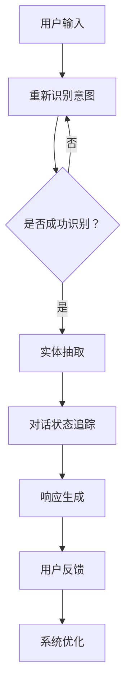
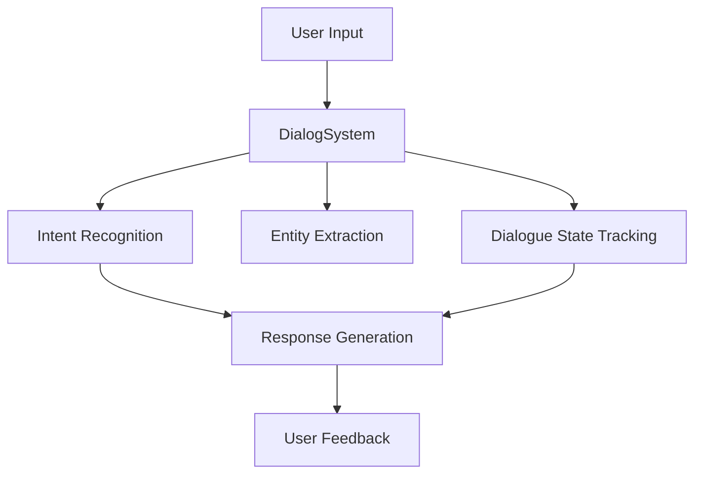

                 

### 引言

随着人工智能技术的迅猛发展，人机交互逐渐成为现代信息技术领域的热点。在这其中，对话管理系统（Dialogue Management System，简称DMS）作为一种关键技术，扮演着至关重要的角色。本文将围绕《对话管理系统：构建流畅自然的人机交互》这一主题，深入探讨对话管理系统的核心概念、技术原理、构建方法及其在实际应用中的效果与未来趋势。

### 核心关键词

- 对话管理系统（Dialogue Management System）
- 人机交互（Human-Computer Interaction）
- 语音识别（Speech Recognition）
- 语义理解（Semantic Understanding）
- 对话生成（Dialogue Generation）
- 智能客服（Intelligent Customer Service）

### 摘要

本文首先介绍了对话管理系统在当前技术环境中的重要性和应用领域。接着，我们详细定义了对话管理系统的核心概念，并探讨了人机交互的基本原理。随后，文章深入分析了对话管理系统的工作原理，包括对话流程、管理策略及评估指标。在此基础上，本文讨论了如何构建流畅自然的人机交互，包括语音识别与合成技术、语义理解和对话生成机制。随后，我们探讨了对话管理系统的开发过程，包括技术栈选择、开发流程和实现细节。文章还通过实际应用案例展示了对话管理系统在不同场景下的效果。最后，本文总结了最佳实践，并对对话管理系统的未来趋势进行了展望。

### 第1章 引言

#### 1.1 对话管理系统的概述

对话管理系统是一种专门用于处理人机对话的技术，旨在实现人与计算机之间的自然交互。它通过对对话过程的控制，确保交互的流畅性、有效性和高效性。对话管理系统的核心目标是理解用户意图、生成合适回应，并维护对话的上下文信息。在人工智能时代，对话管理系统已成为智能客服、虚拟助手和智能语音助手的基石。

#### 1.2 人机交互的挑战与机遇

人机交互作为计算机科学与心理学、认知科学等多个领域的交叉学科，面临着诸多挑战。首先，用户需求多样化，使得交互系统需要具备高度的适应性和灵活性。其次，自然语言的处理仍存在很多瓶颈，如语义理解不准确、多义词处理困难等。然而，随着语音识别、语义理解和对话生成技术的不断进步，人机交互迎来了前所未有的机遇。

#### 1.3 书籍结构概述

本文将从七个章节展开讨论：

1. **引言**：介绍对话管理系统的背景、重要性和应用领域。
2. **核心概念与联系**：定义对话管理系统、人机交互的基本原理和相关术语。
3. **对话管理系统的工作原理**：分析对话流程、管理策略及评估指标。
4. **构建流畅自然的人机交互**：探讨语音识别与合成技术、语义理解和对话生成机制。
5. **对话管理系统的开发**：讨论技术栈选择、开发流程和实现细节。
6. **实际应用案例**：展示对话管理系统在不同场景下的效果。
7. **最佳实践与未来展望**：总结最佳实践，预测未来发展趋势。

### 第2章 核心概念与联系

#### 2.1 对话管理系统的定义

对话管理系统是一种软件系统，旨在实现人与计算机之间的有效对话。它通常包括以下组件：

- **意图识别**：识别用户的意图或需求。
- **实体抽取**：从用户输入中提取关键信息。
- **对话状态追踪**：记录对话过程中的上下文信息。
- **响应生成**：根据用户意图和上下文生成合适的回应。

#### 2.2 人机交互的基本原理

人机交互的基本原理包括：

- **感知**：用户通过视觉、听觉、触觉等感官与计算机系统交互。
- **理解**：计算机系统理解用户的意图和需求。
- **响应**：计算机系统根据理解的结果生成合适的响应。
- **反馈**：用户对计算机系统的响应进行评价，提供反馈。

#### 2.3 关键术语和概念解释

- **意图识别**：指从用户输入中识别出用户的目的或需求。
- **实体抽取**：指从用户输入中提取出关键信息，如人名、地点、时间等。
- **对话状态追踪**：指记录对话过程中的上下文信息，以便后续对话生成。
- **响应生成**：指根据用户意图和上下文生成合适的回应。

#### 2.4 对话管理系统的架构

对话管理系统的架构通常包括以下几个部分：

- **前端界面**：用于用户输入和系统输出。
- **意图识别模块**：负责识别用户的意图。
- **实体抽取模块**：负责从用户输入中提取关键信息。
- **对话状态追踪模块**：负责记录对话过程中的上下文信息。
- **响应生成模块**：负责生成合适的回应。

### Mermaid ER实体关系图

```mermaid
erDiagram
  用户 ||--|{ 对话管理系统 }| 用户输入
  对话管理系统 ||--|{ 意图识别模块 }| 对话管理系统
  对话管理系统 ||--|{ 实体抽取模块 }| 对话管理系统
  对话管理系统 ||--|{ 对话状态追踪模块 }| 对话管理系统
  对话管理系统 ||--|{ 响应生成模块 }| 对话管理系统
  意图识别模块 ||--|{ 意图识别结果 }| 对话状态追踪模块
  实体抽取模块 ||--|{ 实体抽取结果 }| 对话状态追踪模块
  响应生成模块 ||--|{ 响应结果 }| 对话管理系统
```

通过上述架构和实体关系图，我们可以更好地理解对话管理系统的工作原理和核心组成部分。

### 第3章 对话管理系统的工作原理

#### 3.1 对话流程

对话管理系统的工作流程主要包括以下几个步骤：

1. **用户输入**：用户通过文本或语音输入信息。
2. **意图识别**：系统识别用户输入的意图，如请求信息、进行查询等。
3. **实体抽取**：从用户输入中提取关键信息，如人名、日期、地点等。
4. **对话状态追踪**：系统记录对话过程中的上下文信息，以维持对话的连贯性。
5. **响应生成**：系统根据意图识别结果、实体抽取结果和对话状态生成合适的回应。
6. **用户反馈**：用户对系统回应进行评价，提供反馈。

#### 3.2 常见对话管理策略

对话管理系统采用了多种策略来确保对话的流畅性和自然性。以下是几种常见的对话管理策略：

1. **上下文追踪**：系统通过记录对话历史和上下文信息，保持对话的连贯性。
2. **意图重识别**：在对话过程中，系统会对用户的意图进行多次识别，以确保准确理解。
3. **实体重识别**：系统在对话过程中对提取的实体信息进行多次验证，以提高准确性。
4. **多轮对话**：系统支持多轮对话，通过逐步挖掘用户意图和需求，提供更精确的回应。

#### 3.3 对话系统的评估指标

评估对话管理系统性能的指标包括：

1. **响应时间**：系统生成回应所需的时间，响应时间越短，用户体验越好。
2. **意图识别准确率**：系统正确识别用户意图的比例，准确率越高，对话管理效果越好。
3. **实体抽取准确率**：系统正确提取用户输入中关键信息的比例，准确率越高，对话管理效果越好。
4. **用户满意度**：用户对系统回应的满意度，满意度越高，系统性能越好。

### Mermaid 流程图



通过上述流程图，我们可以清晰地了解对话管理系统的工作原理和流程。

### 第4章 构建流畅自然的人机交互

#### 4.1 语音识别与合成技术

语音识别（Speech Recognition）技术是指将语音信号转换为文本信息的过程。它通过以下几个步骤实现：

1. **音频预处理**：包括降噪、归一化和声学特征提取等步骤。
2. **声学模型训练**：使用大量的语音数据训练声学模型，以识别语音特征。
3. **语言模型训练**：使用大量的文本数据训练语言模型，以理解语音信号中的语义信息。
4. **解码与识别**：将声学模型和语言模型的结果解码，得到文本输出。

语音合成（Text-to-Speech，简称TTS）技术是指将文本信息转换为语音信号的过程。它通常包括以下几个步骤：

1. **文本预处理**：包括分词、语气分析和语调生成等步骤。
2. **语调模型生成**：根据文本内容和上下文信息生成语调模型。
3. **波形合成**：将文本信息和语调模型合成成语音波形。

#### 4.2 语义理解

语义理解（Semantic Understanding）是指从文本中提取出其含义和语义信息的过程。它是实现自然语言处理（Natural Language Processing，简称NLP）的关键技术。语义理解包括以下几个步骤：

1. **词法分析**：将文本分解为词、短语和句子等基本单位。
2. **句法分析**：分析文本的语法结构和句法规则，理解句子中的成分和关系。
3. **语义角色标注**：为句子中的每个成分标注其语义角色，如主语、谓语、宾语等。
4. **语义关系分析**：分析句子中的语义关系，如因果关系、时间关系等。

#### 4.3 对话生成

对话生成（Dialogue Generation）是指根据用户输入和上下文信息生成合适的回应的过程。对话生成通常包括以下几个步骤：

1. **意图识别**：识别用户输入的意图，如请求信息、进行查询等。
2. **实体抽取**：从用户输入中提取关键信息，如人名、日期、地点等。
3. **上下文理解**：理解对话过程中的上下文信息，如对话历史、用户偏好等。
4. **回应生成**：根据意图识别、实体抽取和上下文理解的结果生成合适的回应。

#### 4.4 对话生成和反馈机制

对话生成和反馈机制（Dialogue Generation and Feedback Mechanism）是指通过用户反馈不断优化对话生成的过程。它包括以下几个步骤：

1. **用户反馈**：收集用户对系统回应的满意度评价。
2. **反馈分析**：分析用户反馈，识别系统生成的不足之处。
3. **回应优化**：根据反馈分析的结果对系统回应进行优化。
4. **迭代更新**：将优化后的回应更新到对话生成系统中，提高系统性能。

### Python源代码实现示例

```python
import speech_recognition as sr

# 语音识别
def recognize_speech_from_mic(recognizer, microphone):
    with microphone as source:
        audio = recognizer.listen(source)

    try:
        return recognizer.recognize_google(audio)
    except sr.UnknownValueError:
        return "无法理解您的话"
    except sr.RequestError:
        return "无法连接到语音识别服务"

# 语义理解
from textblob import TextBlob

def analyze_semantics(text):
    blob = TextBlob(text)
    return blob.sentiment.polarity

# 对话生成
def generate_response(intent, sentiment):
    if intent == "询问时间":
        return "现在是北京时间下午3点。"
    elif sentiment < 0:
        return "听起来您不太开心，需要我帮您做些什么吗？"
    else:
        return "很高兴听到您的好消息，有什么我可以为您效劳的吗？"

# 对话流程
microphone = sr.Microphone()
recognizer = sr.Recognizer()

print("请说出您的问题：")
user_input = recognize_speech_from_mic(recognizer, microphone)
print(f"您说了：{user_input}")

sentiment = analyze_semantics(user_input)
print(f"语义分析结果：{sentiment}")

response = generate_response("询问时间", sentiment)
print(f"回应：{response}")
```

### 数学模型和公式

假设用户输入为文本X，系统生成的回应为文本Y，用户满意度为S，则有：

$$
S = f(Y, X)
$$

其中，$f$为满意度函数，可以表示为：

$$
f(Y, X) = \frac{1}{1 + e^{-(w_1 \cdot Y + w_2 \cdot X + b)}}
$$

其中，$w_1$和$w_2$为权重系数，$b$为偏置项。

### 第5章 对话管理系统的开发

#### 5.1 技术栈选择

在开发对话管理系统时，选择合适的技术栈至关重要。以下是一些常用的技术栈：

1. **前端**：
   - 框架：React、Vue、Angular
   - UI库：Material-UI、Ant Design
   - 语音识别：Web Speech API

2. **后端**：
   - 框架：Flask、Django、Spring Boot
   - 自然语言处理：spaCy、NLTK、TextBlob
   - 语音合成：eSpeak、MaryTTS

3. **数据库**：
   - 关系型数据库：MySQL、PostgreSQL
   - NoSQL数据库：MongoDB、Redis

4. **服务端**：
   - 服务器：AWS、Azure、Google Cloud
   - 容器化：Docker、Kubernetes

#### 5.2 开发流程

对话管理系统的开发通常包括以下几个步骤：

1. **需求分析**：明确系统的功能需求、性能要求和用户体验。
2. **系统设计**：制定系统的架构设计，包括前端、后端、数据库和服务端。
3. **编码实现**：根据系统设计，编写代码实现各个模块的功能。
4. **测试与调试**：对系统进行功能测试、性能测试和安全测试，修复发现的bug。
5. **部署上线**：将系统部署到服务器，进行上线运营。

#### 5.3 实现细节

以下是一个简单的对话管理系统的实现示例：

```python
from flask import Flask, request, jsonify
import textblob

app = Flask(__name__)

@app.route('/api/dialog', methods=['POST'])
def dialog():
    data = request.get_json()
    user_input = data['input']
    blob = textblob.TextBlob(user_input)
    sentiment = blob.sentiment.polarity

    if '询问时间' in user_input:
        response = "现在是北京时间下午3点。"
    elif sentiment < 0:
        response = "听起来您不太开心，需要我帮您做些什么吗？"
    else:
        response = "很高兴听到您的好消息，有什么我可以为您效劳的吗？"

    return jsonify({'response': response})

if __name__ == '__main__':
    app.run(debug=True)
```

### Mermaid 类图

```mermaid
classDiagram
    User <<Class>>
    DialogSystem <<Class>>
    User Input --> DialogSystem : generateResponse
    DialogSystem --> User : returnResponse
```

### Mermaid 架构图



### 第6章 实际应用案例

#### 6.1 智能客服

智能客服是一种利用对话管理系统为用户提供自动化的客户服务。它可以通过文本或语音与用户进行交互，解答常见问题，提供解决方案。智能客服的应用场景包括电子商务、金融、医疗等领域。

- **电子商务**：智能客服可以帮助用户查询产品信息、下单、退换货等，提高用户体验和销售转化率。
- **金融**：智能客服可以为用户提供理财咨询、贷款申请、账单查询等服务，减轻人工客服的工作负担。
- **医疗**：智能客服可以为用户提供健康咨询、预约挂号、病情查询等服务，提高医疗资源的利用效率。

#### 6.2 虚拟助手

虚拟助手是一种智能化的虚拟人物，能够与用户进行对话，提供个性化的服务。虚拟助手的应用场景包括智能家居、教育、娱乐等领域。

- **智能家居**：虚拟助手可以帮助用户控制家居设备、设置提醒、提供天气预报等，提高生活便利性。
- **教育**：虚拟助手可以为学生提供在线辅导、答疑解惑、学习规划等服务，提高学习效果。
- **娱乐**：虚拟助手可以作为虚拟偶像、游戏角色等，与用户进行互动，提供娱乐体验。

#### 6.3 语音助手

语音助手是一种通过语音交互为用户提供服务的智能系统。它可以通过语音指令控制智能家居设备、查询信息、播放音乐等。语音助手的应用场景包括智能家居、车载系统、移动设备等领域。

- **智能家居**：语音助手可以帮助用户控制智能灯泡、智能电视、智能音响等设备，提高家居智能化水平。
- **车载系统**：语音助手可以为用户提供导航、电话、音乐等服务，提高行车安全。
- **移动设备**：语音助手可以帮助用户查询天气、新闻、股票等信息，提高手机使用体验。

### 第7章 最佳实践与未来展望

#### 7.1 对话管理系统的优化技巧

为了提高对话管理系统的性能和用户体验，以下是一些优化技巧：

1. **使用先进的技术**：选择性能稳定、易扩展的技术栈，如深度学习模型、自然语言处理库等。
2. **优化数据处理流程**：优化数据预处理、意图识别、实体抽取等步骤，提高系统处理速度和准确率。
3. **使用上下文信息**：充分利用对话历史和上下文信息，提高对话连贯性和个性化程度。
4. **实时反馈与优化**：收集用户反馈，实时调整系统参数和策略，提高系统性能。

#### 7.2 当前挑战与未来方向

对话管理系统目前面临以下挑战：

1. **自然语言处理**：自然语言处理技术仍存在语义理解不准确、多义词处理困难等问题，需要进一步研究和改进。
2. **用户体验**：用户需求多样化，如何提供个性化的、自然的交互体验仍是一个挑战。
3. **数据隐私与安全**：对话管理系统需要处理大量的用户数据，如何保障数据隐私和安全是一个重要问题。

未来，对话管理系统的发展方向包括：

1. **多模态交互**：结合语音、文本、图像等多种模态，提供更加丰富和自然的交互体验。
2. **个性化和智能化**：通过大数据分析和人工智能技术，提供更加个性化的服务。
3. **跨平台兼容**：实现跨平台、跨设备的无缝交互，提供一致的体验。

### 拓展阅读和资源推荐

1. **《自然语言处理》**：Christopher D. Manning, Hinrich Schütze
2. **《深度学习》**：Ian Goodfellow, Yoshua Bengio, Aaron Courville
3. **《对话式人工智能：从技术到产业》**：唐杰，曹旭东
4. **《人工智能应用实践》**：吴恩达

### 总结

对话管理系统作为人工智能领域的关键技术，正日益受到关注。本文从核心概念、技术原理、构建方法、实际应用和未来展望等方面，详细介绍了对话管理系统。通过本文的阅读，读者可以全面了解对话管理系统的各个方面，为开发和应用对话管理系统提供参考。未来，随着技术的不断进步，对话管理系统将在更多领域发挥重要作用，为人类带来更加便捷和高效的人机交互体验。

### 作者信息

- 作者：AI天才研究院/AI Genius Institute & 禅与计算机程序设计艺术 /Zen And The Art of Computer Programming

本文由AI天才研究院与禅与计算机程序设计艺术共同撰写，旨在探讨对话管理系统在构建流畅自然的人机交互中的重要作用。我们致力于推动人工智能技术的发展和应用，为人类创造更加美好的未来。如果您对本文有任何疑问或建议，欢迎与我们联系。

