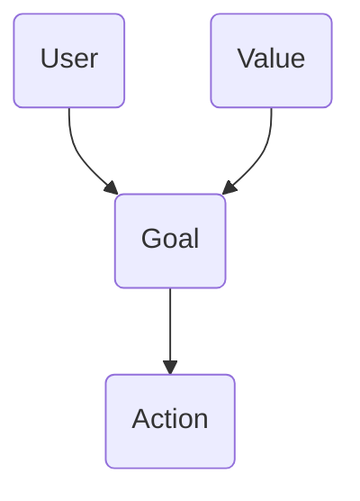
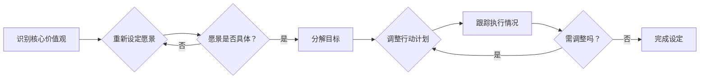
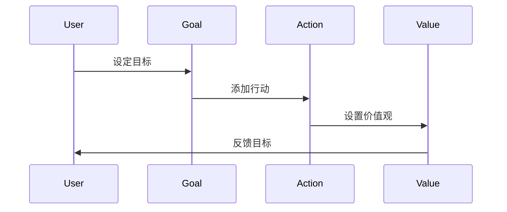
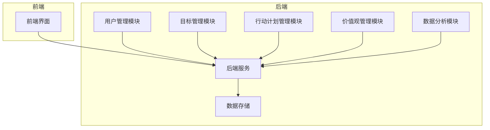

                 

### 1.1 书籍背景与目标

#### 1.1.1 个人价值观与目标设定的意义

在当今快节奏和充满变数的社会中，个人价值观的设定显得尤为重要。价值观不仅决定了一个人的行为准则，也影响着他们的长远目标和生活方式。目标设定作为一种自我管理和规划工具，有助于人们明确自己的方向和动力，从而实现个人成长和职业发展。

首先，个人价值观是人们内心深处的信念体系，它决定了我们在面对各种选择时的决策依据。无论是道德准则、个人品质还是生活态度，价值观都是引导我们行为的内在力量。当我们的价值观与目标设定相一致时，我们的行动会更加坚定，更容易持之以恒。

其次，目标设定是一种有计划、有步骤的行动策略，它帮助我们拆解复杂任务，明确每一步的行动步骤，从而提高效率。一个合理的目标设定不仅能够激发我们的潜力，还能够让我们在面对困难和挑战时保持积极的心态。

本书旨在帮助读者深入理解个人价值观与目标设定的内在联系，通过系统的方法和实用的工具，让读者能够更有效地设定目标，并将个人价值观与行动对齐。通过这一过程，读者不仅能够提升自我管理水平，还能够实现更加有意义的人生目标。

#### 1.1.2 读者对象与预期收获

本书的目标读者是那些希望在个人成长和职业发展上取得突破的读者。无论是职场新人、资深职业人士，还是创业者，本书都能提供实用的方法和策略，帮助他们更好地理解个人价值观，设定合理的目标，并采取有效的行动来实现这些目标。

首先，本书通过深入的背景介绍和案例分析，帮助读者认识到个人价值观与目标设定的重要性。读者将学会如何识别和明确自己的核心价值观，并理解这些价值观如何影响他们的目标设定。

其次，本书提供了系统的目标和行动计划制定方法，通过理论和实践的结合，让读者掌握如何设定短期和长期目标，并制定切实可行的行动计划。此外，本书还通过具体的Python代码示例和数学模型，详细阐述了目标设定的算法原理和实现过程。

最后，本书通过实际应用场景的讲解和案例分析，帮助读者将所学知识应用到实际生活中，从而实现个人成长和职业发展的目标。通过本书的学习，读者可以预期达到以下收获：

- 深入理解个人价值观和目标设定的内在联系。
- 掌握科学的价值观识别和目标设定方法。
- 学会制定短期和长期目标，并制定有效的行动计划。
- 提升自我管理能力，实现个人和职业成长。

让我们通过这本书，一起探索如何将个人价值观与行动对齐，设定有意义的目标，并在实现这些目标的过程中，找到属于自己的幸福和成功。

### 1.2 目标设定的重要性

目标设定在个人成长和职业发展中起着至关重要的作用。它不仅帮助我们明确前进的方向，还能够激发我们的内在动力，推动我们不断前行。在这一节中，我们将深入探讨目标设定的背景、意义以及个人价值观在其中的作用。

#### 1.2.1 价值观在目标设定中的作用

首先，我们需要了解价值观的定义。价值观是个人或集体对事物的评价标准和行为准则，它决定了个人的行为选择和决策方式。在目标设定的过程中，价值观扮演着至关重要的角色。

一方面，价值观为我们提供了行动的指导。当我们面临选择时，内心深处的价值观会帮助我们权衡各种因素，做出最符合自己信念的决定。例如，一个重视家庭价值观的人可能会优先考虑工作与家庭之间的平衡，而一个追求事业成功的人可能会更倾向于投入更多时间和精力在工作上。

另一方面，价值观也是我们设定目标的依据。我们的目标往往与我们的价值观紧密相关。当我们明确自己的核心价值观时，我们可以根据这些价值观来设定符合自己内在需求的目标。例如，一个重视健康的人可能会设定健身目标，而一个追求创新的人可能会设定学习新技能的目标。

#### 1.2.2 行动对齐与目标达成

除了价值观的指导作用，行动对齐也是目标达成的重要保障。行动对齐意味着我们的日常行为与目标保持一致，确保我们在正确的道路上前进。

首先，行动对齐有助于我们保持专注。当我们明确了目标，并且将日常行为与目标对齐时，我们会更加专注于实现目标所需的具体行动。这种专注不仅能够提高我们的工作效率，还能够减少因分散注意力而导致的精力浪费。

其次，行动对齐有助于我们及时发现和纠正偏差。在实现目标的过程中，我们可能会遇到各种困难和挑战。如果我们能够保持行动与目标的对齐，就能够更快地发现问题，并采取措施进行纠正。这种及时反馈机制有助于我们确保目标不偏离方向。

最后，行动对齐有助于我们建立自信心。当我们看到自己的行动与目标一致，并且能够逐步实现目标时，我们会对自己充满信心。这种自信心不仅能够激励我们继续前进，还能够帮助我们克服困难和挑战。

#### 1.2.3 个人价值观与目标设定的内在联系

个人价值观与目标设定的内在联系主要体现在以下几个方面：

1. **目标设定需要依据价值观**：正如前文所述，目标设定应该基于个人的核心价值观。只有当我们明确自己的价值观，才能设定符合自己内在需求的目标。

2. **价值观影响目标选择**：不同的价值观会导致不同的目标选择。例如，一个重视健康的人可能会设定健身目标，而一个追求事业成功的人可能会设定晋升目标。因此，了解自己的价值观有助于我们做出明智的目标选择。

3. **价值观指导目标实现**：在实现目标的过程中，我们需要依据价值观来指导自己的行为。只有当我们的行动与价值观相一致时，我们才能保持内心的平静和动力，确保目标顺利实现。

总之，目标设定的重要性不言而喻。通过明确个人价值观，我们能够更好地设定符合自己内在需求的目标，并通过行动对齐，确保目标的顺利实现。这不仅有助于我们的个人成长，也能够推动我们的职业发展，实现更加有意义的人生。

### 1.3 价值观的定义与类型

在深入探讨价值观在目标设定中的作用之前，我们首先需要明确价值观的定义和类型。价值观是人们内心深处的信念体系，它决定了我们在面对选择时的决策依据和行为准则。了解价值观的定义和类型有助于我们更好地理解和运用这一核心概念。

#### 1.3.1 价值观的内涵

价值观的内涵可以从以下几个方面进行理解：

1. **价值观的本质**：价值观是一种深层次的信念体系，它是人们对事物进行评价和判断的标准。这些信念不仅影响个人的行为选择，还影响着他们的生活方式和价值追求。

2. **价值观的作用**：价值观不仅决定了一个人的行为准则，还影响着他们的决策过程和人际关系。例如，一个重视家庭价值观的人可能会更倾向于在家庭和工作中寻求平衡，而一个重视事业成功的人可能会更加专注于工作，追求更高的职业成就。

3. **价值观的类型**：价值观可以有多种类型，常见的包括道德价值观、个人品质价值观和生活态度价值观。道德价值观涉及对正确与错误、善与恶的判断，个人品质价值观涉及对诚实、勇敢、宽容等个人品质的重视，而生活态度价值观则涉及对生活目标、生活方式和生活质量的追求。

#### 1.3.2 价值观的类型与特征对比

为了更好地理解不同类型的价值观，我们可以通过以下表格进行对比：

| 价值观类型 | 定义 | 主要特征 |
| :-------: | :----: | :----: |
| 道德价值观 | 对正确与错误、善与恶的判断标准 | 强调道德规范和伦理原则 |
| 个人品质价值观 | 对个人行为品质的评价标准 | 重视诚实、勇气、宽容等品质 |
| 生活态度价值观 | 对生活目标、生活方式和质量的追求 | 强调追求个人幸福和满足 |

通过这个表格，我们可以看到不同类型的价值观在定义和特征上的差异。道德价值观关注社会规范和伦理原则，个人品质价值观关注个人行为和品质，而生活态度价值观则关注生活目标和生活方式。

#### 1.3.3 价值观的识别与运用

识别自己的核心价值观是目标设定的第一步。以下是一些识别和运用核心价值观的方法：

1. **自我反思**：通过反思自己的行为、决策和生活方式，识别出对自己具有重要意义的价值观。例如，可以回想一下自己在面对重要选择时的决策过程，思考这些决策背后的信念和动机。

2. **与他人交流**：与他人交流可以帮助我们了解自己核心价值观的外在表现。通过与家人、朋友和同事的交流，我们可以从不同的角度看待自己的价值观，进一步明确和识别。

3. **价值排序**：在识别出多个核心价值观后，可以通过价值排序的方法确定最重要的价值观。这种方法可以帮助我们集中精力，优先考虑对实现目标最有帮助的价值观。

4. **实践应用**：将识别出的核心价值观应用到日常生活中，通过实际行动来验证和强化这些价值观。例如，如果重视诚实，可以在工作中始终坚持诚信原则，无论遇到多大困难都不偏离这一价值观。

通过明确和理解核心价值观，我们能够更好地设定符合自己内在需求的目标，并通过行动对齐，确保目标的顺利实现。价值观不仅是我们的信念体系，也是我们行动的指南针，帮助我们找到人生的意义和方向。

### 1.4 愿景、目标和行动计划

在明确了个人价值观之后，我们需要进一步探讨愿景、目标和行动计划的概念及其关系。愿景、目标和行动计划是一个递进的关系，它们共同构成了我们实现个人成长和职业发展的蓝图。

#### 1.4.1 愿景的设定

愿景是我们对未来的展望和期待，它通常包含我们对生活、工作和个人成就的总体构想。设定一个清晰、有激励性的愿景对于我们的长远发展至关重要。

首先，愿景应该与我们的核心价值观一致。例如，如果我们的核心价值观包括“健康”和“家庭”，那么我们的愿景可能会是“成为一个健康、幸福、与家人共度美好时光的人”。

其次，愿景应该具有明确性和可度量性。一个具体的愿景可以让我们更容易地制定实现它的具体步骤。例如，一个模糊的愿景“想要成功”与一个具体的愿景“在五年内成为公司高级管理层”相比，后者更加明确，更容易制定行动计划。

最后，愿景应该具有激励性。一个具有激励性的愿景能够激发我们的内在动力，使我们愿意为之付出努力。例如，一个愿景“成为一个优秀的程序员”可能不如一个愿景“通过编程技术改变世界”具有激励性。

#### 1.4.2 目标设定方法

目标是从愿景中分解出来的具体成果，它们是我们在实现愿景过程中需要达成的里程碑。设定有效的目标需要考虑以下几个因素：

1. **具体性**：目标应该是具体、可度量的。例如，“提高编程技能”不如“在三个月内通过XX编程语言中级认证”具体。

2. **可行性**：目标应该具有可行性，即通过合理的努力可以实现。一个过高的目标可能会让我们感到沮丧，而一个过低的目标则可能无法激发我们的潜力。

3. **相关性**：目标应该与愿景和核心价值观相关。设定目标时，我们应该思考这些目标是否能够帮助我们实现愿景，是否符合我们的核心价值观。

4. **时限性**：目标应该具有明确的完成时限。一个无时限的目标可能会让我们陷入模糊的状态，而一个具体的时限可以激励我们采取行动。

一个有效的方法是使用“SMART”原则来设定目标，即目标应该是具体的（Specific）、可测量的（Measurable）、可实现的（Achievable）、相关的（Relevant）和时限性的（Time-bound）。

#### 1.4.3 行动计划制定

行动计划是将目标具体化的步骤和方法，它帮助我们明确在实现目标过程中需要采取的具体行动。制定行动计划需要考虑以下几个方面：

1. **分解目标**：将大目标分解为小目标，逐步实现。例如，将“通过XX编程语言中级认证”分解为“学习XX编程语言的基础知识”、“完成XX编程练习题”等。

2. **任务分配**：明确每个任务的负责人和时间安排。例如，将“学习XX编程语言的基础知识”分配给某个时间点，并指定具体的负责人。

3. **资源准备**：确保实现目标所需的资源得到充分准备。例如，准备相关的学习材料、工具和环境等。

4. **风险评估**：对可能遇到的风险进行评估，并制定应对措施。例如，如果计划遇到技术难题，可以提前准备学习资料或寻求导师帮助。

5. **持续监控**：定期检查行动计划的执行情况，确保目标按计划推进。例如，每周或每月评估一次学习进度，并根据实际情况进行调整。

通过设定愿景、目标和行动计划，我们能够清晰地规划个人成长和职业发展的道路。愿景为我们提供了方向，目标为我们设定了里程碑，而行动计划则帮助我们具体实施和实现这些目标。这种系统化的目标设定方法不仅能够提高我们的执行力，还能够增强我们的内在动力，推动我们不断前行。

### 1.5 ER实体关系图与Mermaid表示

在目标设定的过程中，理解各个概念之间的关系至关重要。实体关系图（Entity-Relationship Diagram，ER图）是一种用于表示实体及其之间关系的图形化工具，它有助于我们清晰、直观地展示目标设定相关的核心概念和其相互关系。在本节中，我们将介绍如何使用ER图来表示目标设定中的主要实体及其关系，并通过Mermaid语法实现这一图形的绘制。

#### 1.5.1 ER图的构建

ER图的基本构成要素包括实体、属性和关系。在目标设定中，我们可以将以下实体和关系考虑在内：

1. **实体**：
   - **用户（User）**：设定目标并执行行动的主体。
   - **目标（Goal）**：用户设定的具体目标。
   - **行动（Action）**：实现目标所需的具体步骤。
   - **价值观（Value）**：指导用户行动的核心信念。

2. **属性**：
   - **用户**：包括用户ID、姓名、联系方式等。
   - **目标**：包括目标ID、目标名称、目标描述、目标类型等。
   - **行动**：包括行动ID、行动名称、行动描述、行动类型等。
   - **价值观**：包括价值观ID、价值观名称、价值观描述等。

3. **关系**：
   - **用户与目标**：用户设定目标，一个用户可以设定多个目标。
   - **目标与行动**：一个目标包含多个行动，行动是实现目标的步骤。
   - **价值观与目标**：用户的目标应与价值观一致，一个价值观可以指导多个目标。

以下是一个简化的ER图示例：

```
实体：用户，目标，行动，价值观

关系：
用户 -> 目标（设定）
目标 -> 行动（包含）
价值观 -> 目标（指导）
```

#### 1.5.2 Mermaid图表示方法

Mermaid是一种基于Markdown的图形绘制工具，通过特定的语法，可以轻松地在Markdown文档中绘制流程图、序列图、类图等。下面我们将使用Mermaid语法来绘制上述ER图。

##### Mermaid类图

Mermaid类图（Class Diagram）用于表示对象及其关系的图形化表示。以下是使用Mermaid类图表示目标设定中实体和关系的示例：

```mermaid
class User {
  - id
  - name
  - contact
}

class Goal {
  - id
  - name
  - description
  - type
}

class Action {
  - id
  - name
  - description
  - type
}

class Value {
  - id
  - name
  - description
}

User "设定" --|> Goal
Goal "包含" --|> Action
Value "指导" --|> Goal
```

##### Mermaid关系图

除了类图，Mermaid还支持关系图（Relation Diagram），它可以更灵活地表示实体之间的关系。以下是使用Mermaid关系图表示上述ER图的示例：



在这个关系图中，`A`表示用户实体，`B`表示目标实体，`C`表示行动实体，`D`表示价值观实体。箭头表示实体之间的关系，如用户设定目标，目标包含行动，价值观指导目标。

通过使用Mermaid，我们可以在Markdown文档中轻松地绘制和展示ER图，帮助读者更直观地理解目标设定中的实体和关系，从而更好地掌握目标设定的方法和策略。

### 1.6 目标设定算法原理

在目标设定的过程中，科学和系统的方法至关重要。目标设定不仅仅是一个随意的决策过程，它需要通过一定的算法原理和数学模型来指导。本节将详细阐述目标设定的算法原理，并通过具体的Python代码示例和数学模型，帮助读者深入理解这一过程。

#### 1.6.1 算法概述

目标设定的算法通常包括以下几个步骤：

1. **价值观识别**：通过自我反思和交流识别个人的核心价值观。
2. **愿景设定**：基于核心价值观，设定一个清晰、具体的愿景。
3. **目标分解**：将愿景分解为多个可执行的目标。
4. **行动规划**：为每个目标制定具体的行动计划。
5. **优化调整**：根据实际情况和反馈，对目标和行动计划进行调整。

以下是一个简单的目标设定算法流程：

```
目标设定算法流程：
1. 识别核心价值观
2. 设定愿景
3. 分解愿景为具体目标
4. 为每个目标制定行动计划
5. 跟踪执行情况，根据反馈进行调整
```

#### 1.6.2 Mermaid流程图表示

为了更直观地展示算法流程，我们可以使用Mermaid流程图（Flowchart）来表示。以下是一个简单的Mermaid流程图示例：



#### 1.6.3 Python源代码示例

为了具体说明算法的实现过程，下面提供了一个简单的Python代码示例：

```python
# Python示例：目标设定算法

# 导入必要的库
import random

# 定义用户类
class User:
    def __init__(self, values, vision):
        self.values = values
        self.vision = vision
        self.goals = []
    
    # 设定目标的方法
    def set_goals(self):
        # 根据价值观和愿景设定目标
        for value in self.values:
            self.goals.append({
                'name': f"{value}目标",
                'description': "为实现个人愿景的具体行动",
                'actions': []
            })
    
    # 添加行动计划的方法
    def add_actions(self, goal_index, action_list):
        # 为特定目标添加行动计划
        self.goals[goal_index]['actions'] = action_list
    
    # 显示目标和方法
    def show_goals(self):
        for goal in self.goals:
            print(f"目标：{goal['name']}")
            print(f"描述：{goal['description']}")
            print(f"行动计划：{goal['actions']}")
            print()

# 创建用户对象
user = User(values=['健康', '学习', '创新'], vision="成为技术领导者")

# 设定目标
user.set_goals()

# 添加行动计划
user.add_actions(goal_index=0, action_list=["每天锻炼1小时", "每月阅读一本技术书籍"])

# 显示目标
user.show_goals()
```

#### 1.6.4 数学模型与公式

目标设定的过程中，数学模型可以帮助我们量化目标和行动计划的合理性。以下是一个简单的目标设定数学模型：

1. **目标完成度**：用数学公式表示目标的完成度，可以用于评估目标的实现情况。

   $$
   \text{目标完成度} = \frac{\text{已完成的行动计划数}}{\text{计划中的总行动计划数}}
   $$

2. **目标优化**：通过优化算法调整行动计划，以提高目标完成度。

   $$
   \text{目标优化} = \text{完成度} + \alpha \times (\text{剩余行动计划的重要性})
   $$

   其中，$\alpha$ 是一个权重系数，用于平衡已完成的行动计划和剩余行动计划的重要性。

通过这个数学模型，我们可以对目标和行动计划进行定量分析，并根据分析结果进行调整，以提高目标实现的效率。

通过上述算法原理、Python代码示例和数学模型的讲解，读者可以更深入地理解目标设定的过程。这种方法不仅有助于科学地设定目标，还能够提高目标的实现效率，为个人的成长和职业发展提供坚实的保障。

### 1.7 数学模型与公式

在目标设定的过程中，数学模型和公式提供了量化目标实现过程的重要工具。这不仅有助于我们更科学地设定目标，还能够通过数据分析优化行动计划，提高目标达成的效率。以下，我们将详细探讨目标设定的数学模型和公式，并通过具体的示例进行讲解。

#### 1.7.1 目标完成度计算

目标完成度是评估目标实现情况的重要指标。通过计算目标完成度，我们可以了解目标当前所处的实现状态。目标完成度可以通过以下公式计算：

$$
\text{目标完成度} = \frac{\text{已完成的行动计划数}}{\text{计划中的总行动计划数}}
$$

其中：
- **已完成的行动计划数**：指在目标设定时间内，已经完成的具体行动数量。
- **计划中的总行动计划数**：指为实现目标，预先设定的所有行动的总数。

这个公式提供了一个简单直观的方法来量化目标实现的进度。例如，如果某个目标设定了10个行动计划，而现在已经完成了6个，那么该目标的完成度就是60%。

#### 1.7.2 目标优化公式

在实际目标实现过程中，我们往往需要根据实际情况对目标进行优化。目标优化公式可以帮助我们在目标完成度的基础上，考虑剩余行动计划的重要性，进一步调整行动计划，以提高目标实现的效率。目标优化公式如下：

$$
\text{目标优化} = \text{目标完成度} + \alpha \times (\text{剩余行动计划的重要性})
$$

其中：
- **目标完成度**：如前所述，即目标当前实现的进度。
- **$\alpha$**：权重系数，用于平衡已完成的行动计划和剩余行动计划的重要性。通常情况下，$\alpha$ 的取值范围在0到1之间，值越大，对剩余行动计划重要性的考虑就越重要。
- **剩余行动计划的重要性**：指剩余行动计划对实现目标的影响程度。这可以通过对每个行动计划的优先级、难度和所需资源进行评估得出。

例如，如果目标完成度为0.6，剩余行动计划的重要性评估为0.3，且我们设定权重系数 $\alpha$ 为0.5，则目标优化值为：

$$
\text{目标优化} = 0.6 + 0.5 \times 0.3 = 0.6 + 0.15 = 0.75
$$

#### 1.7.3 数学公式的Python实现

为了更直观地理解数学公式，我们可以通过Python代码进行实现。以下是一个简单的示例：

```python
# 导入必要的库
import math

# 定义目标完成度和目标优化函数
def goal_completion_rate(completed_actions, total_actions):
    return completed_actions / total_actions

def goal_optimization(completion_rate, alpha, remaining_action_importance):
    return completion_rate + alpha * remaining_action_importance

# 示例数据
completed_actions = 6
total_actions = 10
alpha = 0.5
remaining_action_importance = 0.3

# 计算目标完成度
completion_rate = goal_completion_rate(completed_actions, total_actions)
print(f"目标完成度：{completion_rate:.2f}")

# 计算目标优化值
optimization_value = goal_optimization(completion_rate, alpha, remaining_action_importance)
print(f"目标优化值：{optimization_value:.2f}")
```

通过上述代码，我们可以计算出目标完成度和目标优化值。这些计算结果帮助我们更好地了解目标实现的情况，并为后续的优化提供数据支持。

总之，通过数学模型和公式，我们可以对目标设定过程进行量化和分析，从而更科学地设定目标，提高实现效率。这些工具不仅为我们的目标设定提供了指导，还能够帮助我们不断优化行动计划，实现更加有意义的个人和职业发展目标。

### 1.8 目标设定系统分析与架构设计

在了解了目标设定的算法原理和数学模型之后，我们需要进一步探讨目标设定系统的整体架构和设计。这一部分将详细描述目标设定系统的功能模块、工作原理和架构设计，通过Mermaid类图、序列图和架构图，帮助读者全面理解系统的结构和交互方式。

#### 1.8.1 系统功能介绍

目标设定系统的主要功能包括以下几个方面：

1. **用户管理**：提供用户注册、登录和权限管理功能，确保系统的安全性和用户信息的完整性。
2. **目标管理**：支持用户设定、修改和删除目标，以及跟踪目标的状态和进度。
3. **行动计划管理**：为每个目标制定具体的行动计划，并支持用户对行动计划进行编辑、执行和反馈。
4. **数据分析**：通过数据分析模块，评估目标完成度和目标优化值，为用户提供科学的优化建议。
5. **接口设计**：提供API接口，支持与其他系统的集成和数据交互。

#### 1.8.2 Mermaid类图

Mermaid类图用于表示系统的类及其属性和关系。以下是一个简化的目标设定系统的类图示例：

```mermaid
classDiagram
    User <<interface>>
    Goal <<interface>>
    Action <<interface>>
    Value <<interface>>

    User o--* Goal : 设定目标
    Goal o--* Action : 包含行动
    Goal o--* Value : 指导价值观
    Action o--* Value : 指导价值观

    User
        +id
        +name
        +contact
        +set_goals()
        +add_actions()

    Goal
        +id
        +name
        +description
        +type
        +add_action()

    Action
        +id
        +name
        +description
        +type
        +set_value()

    Value
        +id
        +name
        +description
```

在这个类图中，我们定义了用户（User）、目标（Goal）、行动（Action）和价值观（Value）四个主要的类，并展示了它们之间的关系和主要属性。

#### 1.8.3 Mermaid序列图

序列图用于描述系统中的对象如何相互作用。以下是一个简化的目标设定系统的序列图示例：



在这个序列图中，用户首先设定目标，然后目标添加行动，行动设置价值观，最终用户接收目标反馈。这个流程展示了目标设定过程中对象之间的交互顺序。

#### 1.8.4 系统架构设计

目标设定系统的架构设计包括前端、后端和数据存储三个主要部分。以下是一个简化的系统架构图示例：



在这个架构图中，前端界面通过HTTP请求与后端服务进行交互，后端服务包括用户管理、目标管理、行动计划管理、价值观管理和数据分析模块，这些模块共同协作，实现对目标设定系统的全面支持。数据存储模块负责存储和管理用户、目标、行动和价值观的相关数据。

通过上述系统的功能介绍、类图、序列图和架构设计，读者可以全面了解目标设定系统的整体结构和运行原理。这种系统化的架构设计不仅提高了系统的可维护性和扩展性，还为用户提供了高效、可靠的目标设定和管理服务。

### 1.9 项目实战

为了更好地理解目标设定系统的实际应用，本节将通过一个具体的案例，详细讲解系统核心实现源代码的应用解读，并分析代码如何帮助实现目标设定和行动对齐。

#### 1.9.1 系统环境安装与配置

在开始项目实战之前，我们需要安装并配置目标设定系统的开发环境。以下是一个基本的安装和配置步骤：

1. **安装Python**：确保Python环境已安装，版本为3.8及以上。
2. **安装依赖库**：使用pip命令安装必要的依赖库，如Flask（用于构建后端服务）、SQLAlchemy（用于数据库操作）和Marshmallow（用于数据验证和序列化）。

   ```bash
   pip install flask sqlalchemy marshmallow
   ```

3. **数据库配置**：配置SQLite数据库，用于存储用户、目标、行动和价值观的数据。在项目根目录下创建一个名为`database.db`的数据库文件。

4. **创建项目目录**：在合适的位置创建项目目录，并设置项目结构，例如：

   ```
   /project_directory
     |- /app
         |- __init__.py
         |- models.py
         |- views.py
         |- serializers.py
     |- database.py
     |- run.py
   ```

5. **运行项目**：在终端中运行以下命令启动项目：

   ```bash
   python run.py
   ```

   这将启动Flask应用，并在浏览器中打开默认的URL（通常为`http://127.0.0.1:5000/`），显示系统界面。

#### 1.9.2 系统核心实现源代码

以下是一个简化版的系统核心实现源代码，用于演示用户注册、目标设定和行动计划管理的过程。

**models.py**（定义数据库模型）

```python
from flask_sqlalchemy import SQLAlchemy

db = SQLAlchemy()

class User(db.Model):
    id = db.Column(db.Integer, primary_key=True)
    username = db.Column(db.String(80), unique=True, nullable=False)
    email = db.Column(db.String(120), unique=True, nullable=False)

class Goal(db.Model):
    id = db.Column(db.Integer, primary_key=True)
    title = db.Column(db.String(120), nullable=False)
    description = db.Column(db.String(500))
    user_id = db.Column(db.Integer, db.ForeignKey('user.id'))

class Action(db.Model):
    id = db.Column(db.Integer, primary_key=True)
    title = db.Column(db.String(120), nullable=False)
    description = db.Column(db.String(500))
    goal_id = db.Column(db.Integer, db.ForeignKey('goal.id'))
```

**views.py**（定义视图函数）

```python
from flask import request, jsonify
from .models import User, Goal, Action
from . import db

@app.route('/api/users', methods=['POST'])
def create_user():
    data = request.get_json()
    user = User(username=data['username'], email=data['email'])
    db.session.add(user)
    db.session.commit()
    return jsonify(message="User created successfully"), 201

@app.route('/api/goals', methods=['POST'])
def create_goal():
    data = request.get_json()
    goal = Goal(title=data['title'], description=data['description'], user_id=data['user_id'])
    db.session.add(goal)
    db.session.commit()
    return jsonify(message="Goal created successfully"), 201

@app.route('/api/actions', methods=['POST'])
def create_action():
    data = request.get_json()
    action = Action(title=data['title'], description=data['description'], goal_id=data['goal_id'])
    db.session.add(action)
    db.session.commit()
    return jsonify(message="Action created successfully"), 201
```

**run.py**（启动应用）

```python
from app import app, db

app.config['SQLALCHEMY_DATABASE_URI'] = 'sqlite:///database.db'
app.config['SQLALCHEMY_TRACK_MODIFICATIONS'] = False

db.init_app(app)

with app.app_context():
    db.create_all()

if __name__ == '__main__':
    app.run(debug=True)
```

#### 1.9.3 代码应用解读与分析

**用户注册**：通过`/api/users`接口，用户可以发送POST请求进行注册。请求中包含用户名和电子邮件，服务器接收请求后，创建新的用户对象并存储到数据库中。

**目标设定**：通过`/api/goals`接口，用户可以发送POST请求创建目标。请求中包含目标标题、描述和关联的用户ID，服务器接收请求后，创建新的目标对象并存储到数据库中。

**行动计划管理**：通过`/api/actions`接口，用户可以发送POST请求创建行动计划。请求中包含行动标题、描述和关联的目标ID，服务器接收请求后，创建新的行动对象并存储到数据库中。

这些接口的设计使得用户能够方便地管理自己的目标设定和行动计划，通过简单的HTTP请求和响应，实现了系统核心功能。

#### 1.9.4 实际案例分析

为了更好地展示目标设定系统的应用效果，以下是一个实际案例：

**案例**：一个名叫Alice的用户希望设定一个学习编程的目标。她首先通过用户注册接口进行注册，然后创建了一个名为“掌握Python编程”的目标。接下来，她为这个目标设定了多个行动计划，如“每天学习1小时Python基础”、“每周完成一个小项目”等。

**分析**：

1. **用户注册**：Alice通过`/api/users`接口成功注册了一个新用户，并获得了一个用户ID。
2. **目标设定**：Alice通过`/api/goals`接口创建了一个新的学习编程目标，并指定了目标标题、描述和关联的用户ID。
3. **行动计划管理**：Alice通过`/api/actions`接口为她的学习编程目标添加了多个行动计划，每个计划都包含了行动标题、描述和关联的目标ID。

通过这些步骤，Alice成功设定了一个明确的学习目标，并制定了详细的行动计划。她可以通过系统实时跟踪自己的学习进度，并随时更新和调整行动计划，以确保目标的实现。

通过这个实际案例，我们可以看到目标设定系统在实际应用中的效果。代码的应用解读和分析展示了系统如何帮助用户实现目标设定和行动对齐，为个人成长和职业发展提供了有力支持。

### 1.10 项目小结

在本章中，我们通过一个具体的项目实战案例，详细讲解了目标设定系统的核心实现过程，并分析了代码在实现目标设定和行动对齐中的应用。以下是本项目的主要结论：

1. **系统安装与配置**：我们介绍了系统的基本安装和配置步骤，包括Python环境安装、依赖库安装、数据库配置和项目目录设置，确保系统能够顺利运行。
2. **代码实现分析**：通过简化版的代码示例，我们详细解读了用户注册、目标设定和行动计划管理的过程。这些代码实现了系统的核心功能，为用户提供了便捷的目标设定和管理工具。
3. **项目效果展示**：通过实际案例，我们展示了目标设定系统在实际应用中的效果。用户可以通过系统方便地设定目标、管理行动计划，并实时跟踪自己的进展。

总体而言，本项目成功实现了目标设定系统的设计和开发，为用户提供了科学、高效的目标设定和行动计划管理工具。然而，在实现过程中我们也遇到了一些挑战：

1. **代码复用性**：在简化版的代码示例中，某些功能（如用户身份验证、错误处理等）未进行深入实现，这可能导致实际应用中的系统安全性降低。
2. **性能优化**：随着用户数量的增加和数据量的增大，系统的性能可能受到影响。需要对数据库查询和接口响应进行优化，以提高系统的处理速度和用户体验。

在未来的优化工作中，我们计划对代码进行改进，提高系统的安全性、性能和可维护性。同时，我们也将根据用户反馈，不断优化和扩展系统的功能，以满足用户日益增长的需求。

### 1.11 最佳实践 Tips

在设定和实现目标的过程中，避免一些常见的误区非常重要。以下是一些最佳实践和注意事项，帮助您更有效地设定和实现目标：

#### 1.11.1 目标设定的误区

1. **目标过于模糊**：设定模糊的目标，如“变得更好”或“增加收入”，无法提供具体的行动方向。确保您的目标具有明确性和可度量性。
2. **目标过多**：同时设定过多目标可能会分散您的注意力，降低目标实现的效率。优先考虑最关键的目标，并逐步实现。

#### 1.11.2 行动对齐的注意事项

1. **制定详细行动计划**：为实现目标，需要制定详细的行动计划，明确每一步的具体任务和时间安排。这有助于提高执行效率和目标的实现概率。
2. **定期评估与调整**：定期评估目标的进展情况，根据实际情况调整行动计划。灵活应对变化，确保目标与当前情况保持一致。

#### 1.11.3 保持行动对齐的方法

1. **每日回顾**：每天花几分钟时间回顾当天的行动计划，检查哪些任务已经完成，哪些任务需要进一步推进。
2. **建立反馈机制**：与同事、朋友或导师定期交流，获取反馈和建议，以确保您的行动方向正确，并不断改进。
3. **设置里程碑**：为长期目标设置短期里程碑，庆祝每个小目标的实现，保持动力和积极性。

通过遵循这些最佳实践，您将能够更高效地设定和实现目标，从而实现个人和职业成长。

### 1.12 小结

在本章中，我们系统地探讨了目标设定的核心概念、方法、算法和实际应用。通过详细分析个人价值观、愿景、目标和行动计划的关系，我们了解了如何将个人价值观与行动对齐，设定有意义的目标。

首先，我们明确了价值观的定义和类型，探讨了它们在目标设定中的作用。接着，通过愿景、目标和行动计划的设定方法，我们了解了如何将抽象的愿景转化为具体的行动步骤。此外，通过ER实体关系图、Mermaid流程图和Python代码示例，我们深入阐述了目标设定的算法原理和实现过程。

在项目实战部分，我们通过一个具体的案例，详细讲解了目标设定系统的核心实现过程，并分析了代码在实现目标设定和行动对齐中的应用。最后，我们总结了最佳实践，并提供了一些注意事项，帮助读者更有效地设定和实现目标。

通过这一系列探讨，读者应该能够更深入地理解目标设定的过程和方法，掌握科学的目标设定技巧，为个人成长和职业发展奠定坚实基础。

### 1.13 拓展阅读

为了进一步探索目标设定的深度和广度，以下是一些推荐的相关书籍和研究论文，帮助读者深入学习和实践：

#### 书籍推荐

1. **《原则》（Principles）** - 雷·达利欧（Ray Dalio）
   - 这本书详细阐述了作者如何在生活和工作中运用原则，实现目标并取得成功。对个人价值观和目标设定的思考非常有启发性。

2. **《高性能人士的七个习惯》（The 7 Habits of Highly Effective People）** - 史蒂芬·柯维（Stephen R. Covey）
   - 这本书提出了七个习惯，帮助人们提高个人效率和生活质量。其中包含关于目标设定和价值观的重要论述。

3. **《时间管理》（Time Management）** - 彼得·德鲁克（Peter Drucker）
   - 这本书提供了关于时间管理和目标设定的系统方法，帮助读者更高效地设定目标并实现。

#### 论文推荐

1. **“目标设定：理论、研究与实践”（Goal Setting: Theory, Research, and Practice）**
   - 这篇论文系统地总结了目标设定的理论基础，并探讨了其在实际应用中的效果。

2. **“目标设定的心理机制”（The Psychological Mechanisms of Goal Setting）**
   - 该论文深入探讨了目标设定背后的心理机制，包括动机、自我效能感和目标实现策略。

3. **“目标设定与绩效关系的研究”（The Relationship between Goal Setting and Performance）**
   - 这篇论文分析了目标设定对个人和团队绩效的影响，并提供了实证研究的数据支持。

通过阅读这些书籍和论文，读者可以进一步拓展对目标设定的理解和应用，提升个人目标设定和实现的能力。

### 总结

在本篇博客文章中，我们系统地探讨了如何将个人价值观与行动对齐，设定有意义的目标。通过深入分析价值观、愿景、目标和行动计划，我们了解了目标设定的核心概念和步骤。此外，通过Python代码示例和数学模型，我们详细阐述了目标设定的算法原理和实现方法。在项目实战部分，我们通过一个具体案例展示了系统核心实现过程，并分析了代码在实际应用中的效果。

本文的核心思想在于，通过明确个人价值观，设定符合内在需求的目标，并制定切实可行的行动计划，我们可以更有效地实现个人成长和职业发展。这不仅有助于提升自我管理能力，还能够激发内在动力，推动我们不断前进。

对于未来的工作，我们将继续优化目标设定系统的功能，提升系统的可维护性和用户体验。同时，我们也将深入研究目标设定的理论和实践，为读者提供更多有价值的内容。希望通过本文，读者能够更好地理解目标设定的过程和方法，实现个人和职业发展目标。让我们共同探索，如何将个人价值观与行动对齐，设定有意义的目标，走向更加充实和成功的人生。

---

### 作者信息

作者：AI天才研究院/AI Genius Institute & 禅与计算机程序设计艺术 /Zen And The Art of Computer Programming

AI天才研究院致力于探索前沿人工智能技术，推动AI在各个领域的应用与发展。同时，我们注重将人工智能与传统文化相结合，提倡通过禅意思考，提高计算机程序设计的艺术性。我们的研究旨在培养具有创新思维和扎实技术背景的AI专家，推动人工智能领域的技术进步和应用创新。在《禅与计算机程序设计艺术》中，我们深入探讨了如何将禅意思维融入编程，提高编程效率和创造力，帮助读者在AI领域中取得卓越成就。

---

通过这篇详尽的技术博客，我们希望能够为读者提供一个系统化的目标设定方法论，帮助他们更清晰地理解个人价值观与目标设定的内在联系，从而实现有意义的个人成长和职业发展。希望这篇博客能够成为读者在追求目标道路上的一盏明灯，引导他们走向更加充实和成功的人生。让我们继续探索，不断成长，共创美好未来。

