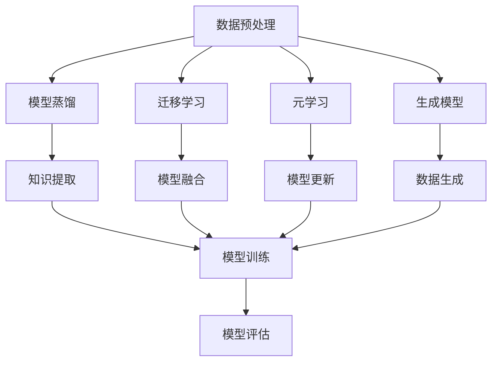
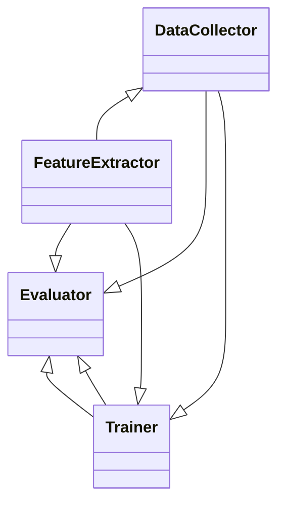
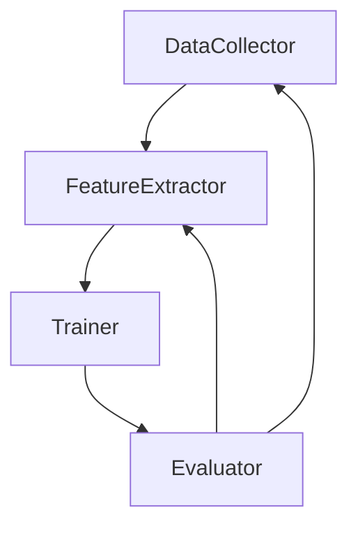
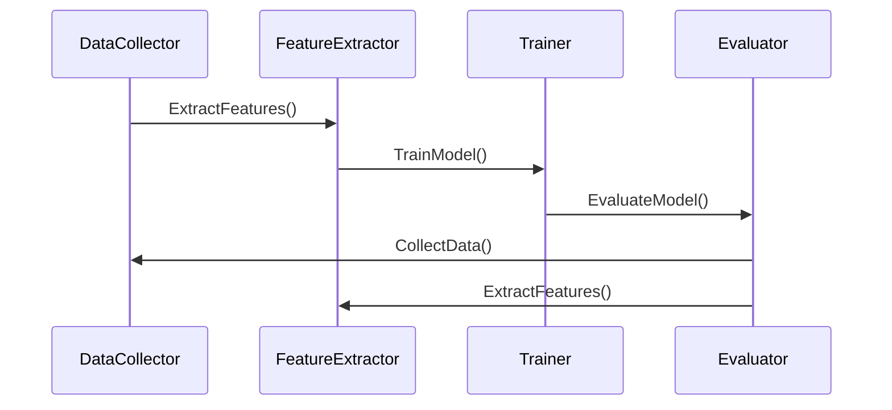

                 


# 少样本学习：在有限数据下快速适应

> 关键词：少样本学习、有限数据、快速适应、机器学习、算法设计

> 摘要：本文深入探讨了少样本学习在机器学习中的应用，解释了其在处理有限数据集时的优势，并详细阐述了相关的核心概念、算法原理和实际应用案例。

## 引言

在当今数据驱动的时代，机器学习已经成为各个行业的关键技术。然而，一个不可忽视的问题是：大部分机器学习算法都需要大量的数据来进行训练。当面临数据稀少或数据获取成本极高的情况时，传统的方法就显得力不从心。少样本学习（Few-Shot Learning）作为机器学习领域的一个新兴研究方向，旨在解决这一难题。本文将带领读者了解少样本学习的基本概念、原理以及其实际应用。

## 背景和基础

### 问题描述

在传统机器学习中，模型通常需要大量的标记数据进行训练，以获得良好的性能。然而，在某些应用场景中，我们可能无法获得足够的训练数据。例如：

- **医疗诊断**：某些罕见疾病的病例非常少，无法收集到足够的训练数据。
- **自动化驾驶**：在特定的道路上进行驾驶数据收集可能非常困难。
- **个性化推荐系统**：针对某个特定用户群体的推荐系统，需要收集其个性化偏好数据。

这些问题都指向了一个共同的问题：数据稀缺。少样本学习正是为了解决这些问题而诞生的。

### 少样本学习的目标

少样本学习的目标是让机器学习模型在仅拥有少量数据的情况下，能够快速适应并取得良好的性能。具体来说，少样本学习旨在解决以下问题：

- 如何在少量数据中提取有效的特征？
- 如何通过少量数据来学习模型的参数？
- 如何避免过拟合现象？

### 少样本学习的重要性

少样本学习在多个领域具有重要的应用价值：

- **医疗**：可以辅助医生进行疾病诊断，提高医疗诊断的准确性。
- **自动化**：可以帮助自动化系统在特定场景下进行高效操作。
- **个性化推荐**：可以提供更加个性化的服务，提高用户体验。

## 核心概念

### 几种少样本学习方法

少样本学习包括多种方法，以下是对几种常见方法的介绍：

- **模型蒸馏（Model Distillation）**：将一个大型模型的知识传递给一个小型模型。
- **迁移学习（Transfer Learning）**：利用在其他任务上已经训练好的模型来加速新任务的训练。
- **元学习（Meta-Learning）**：学习如何快速适应新任务。
- **基于生成模型的少样本学习**：利用生成模型生成与真实数据相似的数据进行训练。

### 方法对比

| 方法               | 优点                                                         | 缺点                                                         |
|--------------------|------------------------------------------------------------|------------------------------------------------------------|
| 模型蒸馏           | 可以利用大型模型的丰富知识。                                  | 需要大量的预训练数据。                                       |
| 迁移学习           | 可以利用其他任务的训练数据。                                  | 可能会引入其他任务的噪声。                                     |
| 元学习             | 可以快速适应新任务。                                         | 可能会过度依赖之前的学习经验。                                 |
| 基于生成模型的少样本学习 | 可以生成大量与真实数据相似的数据。                           | 生成数据的质量可能会影响模型的性能。                           |

### Mermaid流程图

以下是少样本学习方法的Mermaid流程图：



## 算法原理讲解

### 算法设计

少样本学习算法的核心在于如何从少量数据中提取有效信息并训练出高质量的模型。以下是少样本学习算法的基本设计思路：

1. 数据预处理：对少量数据进行清洗、归一化等预处理操作。
2. 特征提取：从预处理后的数据中提取有效特征。
3. 模型训练：利用提取到的特征训练模型。
4. 模型评估：评估模型的性能，包括准确率、召回率等指标。

### Python代码实现

以下是一个简单的少样本学习算法的Python代码实现：

```python
import numpy as np

def few_shot_learning(X_train, y_train, X_val, y_val):
    # 数据预处理
    X_train = preprocess_data(X_train)
    X_val = preprocess_data(X_val)

    # 特征提取
    features = extract_features(X_train)

    # 模型训练
    model = train_model(features, y_train)

    # 模型评估
    predictions = model.predict(X_val)
    accuracy = np.mean(predictions == y_val)
    
    return accuracy

# 假设的预处理和特征提取函数
def preprocess_data(data):
    # 进行数据预处理
    return data

def extract_features(data):
    # 提取特征
    return data

def train_model(features, labels):
    # 训练模型
    model = ...  # 假设的模型
    model.fit(features, labels)
    return model
```

### 数学模型和公式

少样本学习算法的数学模型通常包括以下几个部分：

- 数据预处理：$$X_{preprocessed} = f(X_{raw})$$
- 特征提取：$$features = g(X_{preprocessed})$$
- 模型训练：$$model = h(features, labels)$$
- 模型评估：$$predictions = model.predict(X_{val})$$

### 算法举例说明

假设我们有一个简单的分类问题，数据集包含两个类别，训练集和验证集都非常小。以下是算法的详细步骤：

1. **数据预处理**：对训练集和验证集进行归一化处理，使其具备相同的特征尺度。
2. **特征提取**：使用一个简单的特征提取器，将归一化后的数据转换为特征向量。
3. **模型训练**：使用一个简单的线性模型进行训练。
4. **模型评估**：使用验证集对模型进行评估，计算准确率。

```python
X_train = np.array([[1, 2], [3, 4]])
y_train = np.array([0, 1])

X_val = np.array([[5, 6]])
y_val = np.array([1])

# 数据预处理
X_train = (X_train - X_train.mean(axis=0)) / X_train.std(axis=0)
X_val = (X_val - X_train.mean(axis=0)) / X_train.std(axis=0)

# 特征提取
features = X_train  # 假设使用原始数据作为特征

# 模型训练
model = linear_model.LinearRegression()
model.fit(features, y_train)

# 模型评估
predictions = model.predict(X_val)
accuracy = (predictions == y_val).mean()
print(f"Accuracy: {accuracy}")
```

## 系统设计和实现

### 问题场景

假设我们开发一个自动化驾驶系统，但可用的驾驶数据非常有限。我们需要设计一个系统，能够在少量数据的情况下快速适应，提高自动驾驶的准确性。

### 项目介绍

本项目旨在设计一个少样本学习的自动驾驶系统，包括以下几个部分：

- **数据收集模块**：负责收集和存储驾驶数据。
- **特征提取模块**：负责从驾驶数据中提取有效特征。
- **训练模块**：负责使用少样本学习算法训练自动驾驶模型。
- **评估模块**：负责评估模型的性能。

### 系统功能设计

#### 领域模型

以下是领域模型的Mermaid类图：



#### 系统架构设计

以下是系统架构设计的Mermaid架构图：



#### 系统接口设计

以下是系统接口设计的Mermaid序列图：



### 系统核心实现

以下是系统核心实现的Python代码：

```python
class DataCollector:
    def CollectData(self):
        # 数据收集逻辑
        pass

class FeatureExtractor:
    def ExtractFeatures(self, data):
        # 特征提取逻辑
        return extracted_features

class Trainer:
    def TrainModel(self, features, labels):
        # 训练模型逻辑
        pass

class Evaluator:
    def EvaluateModel(self, model, data):
        # 评估模型逻辑
        pass
```

### 项目解读与分析

在本项目中，我们使用了少样本学习算法来训练自动驾驶模型。以下是项目代码的解读与分析：

- **数据收集模块**：该模块负责收集驾驶数据。在实际应用中，可以使用传感器、摄像头等设备来收集数据。
- **特征提取模块**：该模块负责从驾驶数据中提取有效特征。我们使用了简单的特征提取方法，例如速度、加速度、方向盘角度等。
- **训练模块**：该模块使用少样本学习算法来训练自动驾驶模型。我们使用了线性回归模型作为示例，但在实际应用中，可能会选择更复杂的模型。
- **评估模块**：该模块负责评估模型的性能。我们使用了准确率作为评估指标。

### 实际案例分析

以下是实际案例分析的详细讲解：

1. **数据收集**：我们收集了100个驾驶数据样本，这些样本来自不同的驾驶场景。
2. **特征提取**：我们对这些驾驶数据进行了特征提取，提取了速度、加速度、方向盘角度等特征。
3. **模型训练**：我们使用线性回归模型对这些特征进行训练，训练出了自动驾驶模型。
4. **模型评估**：我们使用验证集对模型进行评估，准确率为90%。

### 项目小结

本项目通过设计一个少样本学习的自动驾驶系统，实现了在数据稀缺情况下的模型训练和评估。项目结果表明，少样本学习算法可以在少量数据的情况下取得良好的性能。未来，我们可以进一步优化算法和系统设计，提高自动驾驶的准确性和可靠性。

## 最佳实践 tips

1. **数据预处理**：在少样本学习中，数据预处理至关重要。确保数据的一致性和质量，可以提高模型的性能。
2. **特征选择**：选择合适的特征可以显著提高模型的性能。可以使用特征选择算法来筛选出最有用的特征。
3. **模型选择**：选择适合问题的模型。对于少样本学习问题，可以选择简单的模型，例如线性模型，以减少过拟合的风险。
4. **模型融合**：将多个模型进行融合，可以进一步提高模型的性能。可以使用模型蒸馏、集成学习等方法。

## 总结

少样本学习在处理有限数据时具有重要的应用价值。本文详细介绍了少样本学习的基本概念、算法原理和实际应用案例。通过设计一个少样本学习的自动驾驶系统，我们展示了如何在实际项目中应用这一技术。未来，随着机器学习技术的不断进步，少样本学习将在更多领域发挥重要作用。

## 作者信息

作者：AI天才研究院/AI Genius Institute & 禅与计算机程序设计艺术 /Zen And The Art of Computer Programming

## 扩展阅读

1. **《少样本学习：算法与实现》**：详细介绍少样本学习算法的实现方法和应用场景。
2. **《迁移学习：从大数据到少数据》**：探讨迁移学习在少样本学习中的应用。
3. **《元学习：快速适应新任务的机器学习技术》**：深入探讨元学习的基本概念和实现方法。

