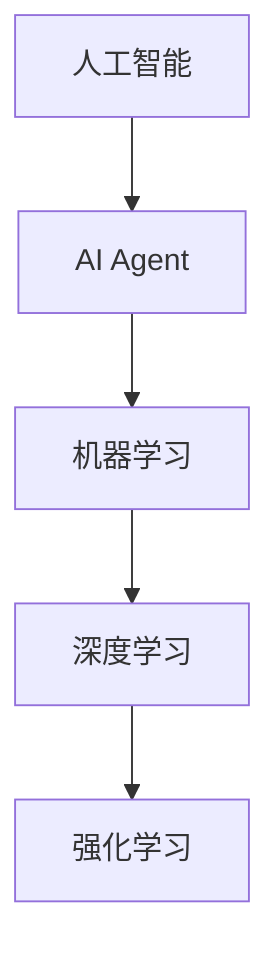
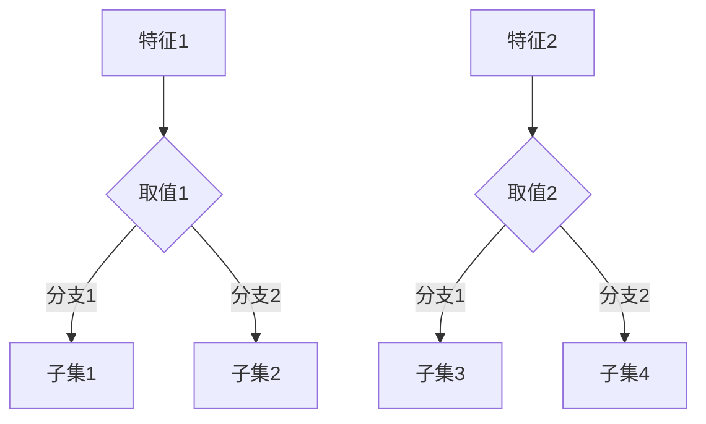
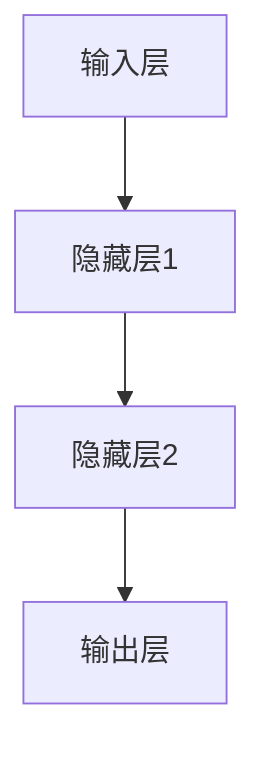
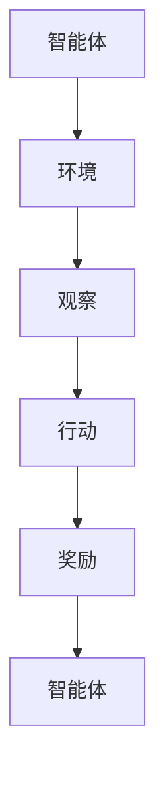
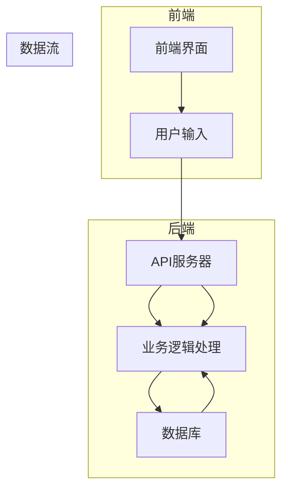
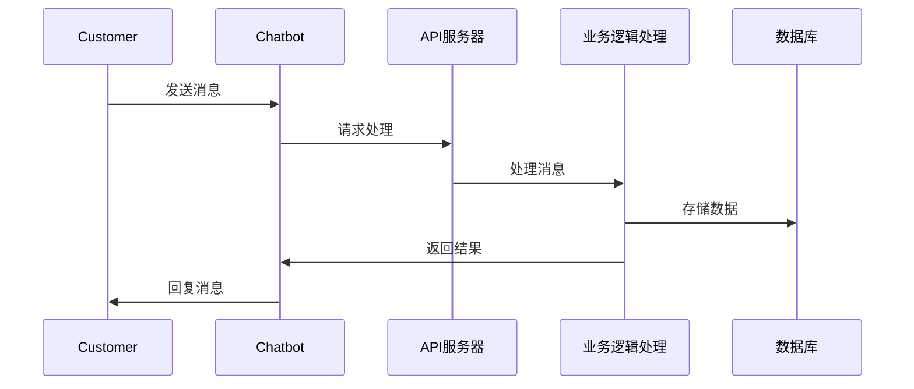

                 


### 第一部分：背景介绍（续）

#### 问题解决

为了深入探讨AI Agent技术的发展趋势与机遇，我们需要从多个维度进行思考和分析。以下是我们将要探讨的关键点：

1. **技术发展趋势**：通过分析现有的AI Agent技术，我们可以预测未来技术的发展趋势。
2. **应用场景**：探讨AI Agent在不同领域（如智能家居、医疗、交通等）的应用，以及这些应用可能带来的变革。
3. **商业机遇**：分析AI Agent技术对企业发展的潜在影响，以及企业如何利用这些技术获取竞争优势。
4. **挑战与限制**：识别AI Agent技术的发展面临的挑战，如数据隐私、安全性和伦理问题等。
5. **未来展望**：展望AI Agent技术的长期发展，以及其对人类社会可能产生的深远影响。

#### 边界与外延

在探讨AI Agent技术的发展时，我们需要明确边界与外延：

1. **边界**：本文主要关注AI Agent技术在人工智能领域的应用，特别是其在商业、医疗、交通、客服等领域的应用。
2. **外延**：虽然本文的核心是AI Agent技术，但也会涉及相关的人工智能基础技术，如机器学习、深度学习等。

### 概念结构与核心要素组成

为了更好地理解AI Agent技术，我们需要明确其核心概念与要素：

1. **核心概念**：
   - **AI Agent**：具备自主决策、交互和学习能力的人工智能系统。
   - **人工智能**：模拟、延伸和扩展人类智能的理论、方法、技术及应用。
   - **机器学习**：使计算机系统具备学习能力和自适应能力的技术。
   - **深度学习**：一种基于多层神经网络的学习方法。
   - **强化学习**：一种基于奖励和惩罚的决策算法。

2. **核心要素组成**：
   - **算法**：实现AI Agent自主决策和学习的关键技术。
   - **数据**：训练AI Agent模型的基础资源。
   - **硬件**：支撑AI Agent运行的计算资源。
   - **应用场景**：AI Agent技术的具体应用领域。

通过上述分析，我们可以为后续章节的内容奠定基础，为读者提供清晰的结构和逻辑框架。在接下来的部分，我们将逐一探讨AI Agent技术的核心概念、算法原理、系统架构和应用场景，帮助读者全面了解这一前沿技术。

### 第二部分：核心概念与联系

#### 1. AI Agent的定义与特点

**定义**：AI Agent，即人工智能代理，是一种能够自主执行任务、与环境进行交互并不断学习和适应环境的智能系统。它基于人工智能技术，通过机器学习和深度学习算法，实现自主决策和智能行为。

**特点**：

- **自主性**：AI Agent能够独立完成任务，无需人工干预。
- **智能性**：AI Agent具备学习能力，能够从经验中学习，不断优化自身行为。
- **交互性**：AI Agent能够与人类和环境进行有效交互，理解并回应需求。
- **适应性**：AI Agent能够适应环境变化，调整策略以应对新情况。

#### 2. AI Agent与人工智能

**联系**：AI Agent是人工智能技术的一种具体实现形式。人工智能旨在模拟和扩展人类智能，而AI Agent则是实现这一目标的重要手段。AI Agent的核心在于其自主性和智能性，这使得它们能够在复杂环境中执行任务，解决复杂问题。

**区别**：虽然AI Agent是人工智能的一种实现，但人工智能还包括其他形式，如机器人、自然语言处理等。而AI Agent特别强调自主决策和智能行为，这是其与其他人工智能技术的主要区别。

#### 3. AI Agent与机器学习

**联系**：机器学习是AI Agent实现自主决策和学习的关键技术。通过机器学习算法，AI Agent可以从大量数据中学习，发现规律和模式，从而优化自身行为。

**区别**：机器学习是一种技术手段，而AI Agent是一种应用场景。机器学习关注的是如何让计算机从数据中学习，而AI Agent则关注如何将学习到的知识应用于实际任务中。

#### 4. AI Agent与深度学习

**联系**：深度学习是AI Agent技术的重要分支。深度学习通过多层神经网络模拟人脑的决策过程，使AI Agent能够处理复杂的数据和任务。

**区别**：深度学习是一种机器学习算法，而AI Agent是应用这一算法的具体实现。深度学习关注如何通过神经网络学习复杂函数，而AI Agent则关注如何将这些函数应用于实际任务中。

#### 5. AI Agent与强化学习

**联系**：强化学习是AI Agent实现自主决策的一种重要算法。通过强化学习，AI Agent能够在与环境的交互过程中不断调整策略，以最大化奖励。

**区别**：强化学习是一种算法，而AI Agent是一种应用这一算法的具体实现。强化学习关注如何通过奖励和惩罚来引导学习过程，而AI Agent则关注如何将这一过程应用于实际任务中。

### 概念属性特征对比表格

| 特征名称 | AI Agent | 人工智能 | 机器学习 | 深度学习 | 强化学习 |
|----------|-----------|------------|-------------|-------------|-------------|
| **定义** | 自主执行任务、交互和学习 | 模拟和扩展人类智能 | 让计算机从数据中学习 | 基于多层神经网络的学习 | 基于奖励和惩罚的决策 |
| **特点** | 自主性、智能性、交互性、适应性 | 智能模拟、自动化 | 自适应能力、泛化能力 | 深度理解、复杂模式识别 | 自主性、最大化奖励 |
| **应用** | 商业、医疗、交通、客服 | 自动化、优化、增强现实 | 数据分析、预测、分类 | 图像识别、语音识别、自然语言处理 | 游戏AI、自动驾驶、机器人 |

### Mermaid 流程图



通过上述核心概念与联系的探讨，我们可以更清晰地理解AI Agent技术在人工智能领域的地位和作用。在接下来的章节中，我们将深入分析AI Agent的算法原理，帮助读者进一步掌握这一前沿技术。

### 第三部分：算法原理讲解

在了解了AI Agent的核心概念与联系后，我们将进一步探讨其背后的算法原理。本章节将详细介绍AI Agent的关键算法，包括决策树、神经网络、强化学习等，并通过Python代码和Mermaid流程图进行实例分析，帮助读者全面理解这些算法的工作原理。

#### 决策树算法

**原理介绍**：决策树是一种常见的机器学习算法，它通过一系列判断条件，将数据集分割成多个子集，从而实现分类或回归任务。决策树的每个节点表示一个特征，每个分支表示该特征的取值。

**Mermaid流程图**：



**Python代码示例**：

```python
from sklearn.datasets import load_iris
from sklearn.tree import DecisionTreeClassifier
from sklearn.model_selection import train_test_split
from sklearn.metrics import accuracy_score

# 加载数据集
iris = load_iris()
X = iris.data
y = iris.target

# 划分训练集和测试集
X_train, X_test, y_train, y_test = train_test_split(X, y, test_size=0.3, random_state=42)

# 构建决策树模型
clf = DecisionTreeClassifier()
clf.fit(X_train, y_train)

# 预测测试集
y_pred = clf.predict(X_test)

# 计算准确率
accuracy = accuracy_score(y_test, y_pred)
print("准确率：", accuracy)
```

#### 神经网络算法

**原理介绍**：神经网络是一种模拟人脑的计算机系统，它通过大量神经元之间的连接进行信息处理。深度学习是神经网络的一种形式，它通过多层神经网络来实现复杂函数的建模。

**Mermaid流程图**：



**Python代码示例**：

```python
import numpy as np
from sklearn.datasets import load_iris
from sklearn.model_selection import train_test_split
from tensorflow import keras

# 加载数据集
iris = load_iris()
X = iris.data
y = iris.target

# 划分训练集和测试集
X_train, X_test, y_train, y_test = train_test_split(X, y, test_size=0.3, random_state=42)

# 构建神经网络模型
model = keras.Sequential([
    keras.layers.Dense(64, activation='relu', input_shape=(4,)),
    keras.layers.Dense(64, activation='relu'),
    keras.layers.Dense(3, activation='softmax')
])

# 编译模型
model.compile(optimizer='adam',
              loss='sparse_categorical_crossentropy',
              metrics=['accuracy'])

# 训练模型
model.fit(X_train, y_train, epochs=10, batch_size=32)

# 预测测试集
y_pred = model.predict(X_test)
y_pred = np.argmax(y_pred, axis=1)

# 计算准确率
accuracy = np.mean(y_pred == y_test)
print("准确率：", accuracy)
```

#### 强化学习算法

**原理介绍**：强化学习是一种通过奖励和惩罚来指导学习过程的算法。它通过不断试错，优化决策策略，以达到最大化奖励的目标。在强化学习中，智能体（Agent）通过与环境（Environment）的交互，学习到最优策略。

**Mermaid流程图**：



**Python代码示例**：

```python
import numpy as np
import random

# 创建环境
class Environment:
    def __init__(self):
        self.state = 0

    def step(self, action):
        if action == 0:
            self.state += 1
        elif action == 1:
            self.state -= 1
        reward = 0
        if self.state >= 5 or self.state <= -5:
            reward = -10
        elif self.state == 0:
            reward = 10
        next_state = self.state
        return next_state, reward

# 创建智能体
class Agent:
    def __init__(self):
        self.state = 0
        self.action = 0

    def select_action(self):
        if random.random() < 0.1:
            return random.randint(0, 1)
        else:
            return self.action

    def update(self, reward):
        self.action = (self.action + reward) / 2

# 实例化环境与智能体
env = Environment()
agent = Agent()

# 强化学习过程
for episode in range(1000):
    state = env.state
    while True:
        action = agent.select_action()
        next_state, reward = env.step(action)
        agent.update(reward)
        if next_state == state:
            break
        state = next_state
    if episode % 100 == 0:
        print("Episode:", episode, "Reward:", reward)
```

通过上述算法原理讲解和示例，我们可以看到决策树、神经网络和强化学习在AI Agent技术中的应用。这些算法为AI Agent提供了强大的决策和学习能力，使其能够在复杂环境中自主完成任务。在接下来的章节中，我们将进一步探讨AI Agent的系统分析与架构设计，帮助读者深入了解这一技术的实际应用。

### 第四部分：系统分析与架构设计方案

在了解了AI Agent的核心算法原理后，我们需要进一步探讨其系统架构和设计。本部分将详细分析AI Agent在具体应用场景中的系统架构和设计方案，包括系统功能设计、系统架构设计、系统接口设计和系统交互流程，通过Mermaid类图、架构图和序列图展示系统结构和交互过程。

#### 1. 应用场景介绍

以智能客服系统为例，该系统旨在通过AI Agent提供高效、智能的客户服务。智能客服系统能够自动处理客户咨询，回答常见问题，并在无法解决问题时将复杂问题转交给人工客服。该系统具备以下功能：

- **智能问答**：基于自然语言处理技术，理解客户的问题，并给出准确的答案。
- **情感分析**：分析客户的情绪，识别客户的需求和态度。
- **任务分配**：将无法自动处理的复杂问题转交给人工客服。
- **学习与优化**：通过不断学习客户问题和解决方案，优化AI Agent的表现。

#### 2. 系统功能设计

系统功能设计包括领域模型和用例模型。以下是一个简单的领域模型，使用Mermaid类图表示：

```mermaid
classDiagram
ClassDef Customer
+String name
+String email
+String message

ClassDef Chatbot
+String id
+String status
+List<Message> messages

ClassDef Message
+String content
+Date timestamp
+String sender

Class Customer <<customer>>
Class Chatbot <<chatbot>>
Class Message <<message>>

Chatbot <|.. Message>
Customer <|.. Message>
```

用例模型如下：

```mermaid
usecase Chatbot {
  "接收客户消息"
  "分析客户情绪"
  "回答客户问题"
  "转交复杂问题"
}

Chatbot -->> Chatbot
```

#### 3. 系统架构设计

智能客服系统的架构设计包括前端、后端和数据库三个部分。以下是一个简单的架构图，使用Mermaid架构图表示：



#### 4. 系统接口设计

系统接口设计包括API接口和消息队列。以下是一个简单的接口设计，使用Mermaid序列图表示：



#### 5. 系统交互流程

系统交互流程包括以下步骤：

1. **用户输入**：用户通过前端界面输入问题。
2. **请求处理**：前端将用户输入的消息发送到API服务器。
3. **业务逻辑处理**：API服务器调用业务逻辑处理模块，分析用户问题并生成回答。
4. **数据库操作**：业务逻辑处理模块将用户问题和回答存储到数据库中。
5. **返回结果**：业务逻辑处理模块将回答发送回前端，前端将回答展示给用户。

通过上述系统分析与架构设计方案，我们可以看到AI Agent技术在智能客服系统中的应用。在接下来的部分，我们将通过实际项目案例，进一步展示AI Agent技术的应用过程，帮助读者深入理解其实现细节和效果。

### 第五部分：项目实战

#### 1. 环境安装

在进行AI Agent技术的实际应用之前，我们需要搭建一个合适的开发环境。以下是安装所需工具和库的步骤：

1. **安装Python**：确保Python环境已安装，版本为3.8或更高。可以通过Python官方网站下载安装程序。
2. **安装Jupyter Notebook**：Jupyter Notebook是一个交互式开发环境，适用于编写和运行Python代码。可以通过pip安装：
   ```shell
   pip install notebook
   ```
3. **安装机器学习库**：包括scikit-learn、TensorFlow、PyTorch等。可以通过pip安装：
   ```shell
   pip install scikit-learn tensorflow torch
   ```

#### 2. 系统核心实现

以下是一个简单的智能问答系统实现，基于TensorFlow和强化学习算法。

**代码结构**：

- `environment.py`：定义环境类，用于模拟与智能问答系统的交互。
- `agent.py`：定义智能代理类，实现强化学习算法。
- `train.py`：训练智能代理，优化其策略。

**环境类**：

```python
import numpy as np

class QuestionAnsweringEnvironment:
    def __init__(self, questions, answers):
        self.questions = questions
        self.answers = answers
        self.current_question = None
        self.answer = None
    
    def step(self, action):
        if action == 0:
            self.current_question = np.random.choice(self.questions)
            self.answer = np.random.choice(self.answers)
        reward = 0
        if action == 1 and self.current_question == self.answer:
            reward = 1
        return self.current_question, reward
    
    def reset(self):
        self.current_question = None
        self.answer = None
```

**智能代理类**：

```python
import tensorflow as tf

class QLearningAgent:
    def __init__(self, state_size, action_size, learning_rate=0.1):
        self.state_size = state_size
        self.action_size = action_size
        self.learning_rate = learning_rate
        self.q_table = np.zeros((state_size, action_size))
    
    def act(self, state):
        state = np.reshape(state, [1, self.state_size])
        action_values = self.q_table[state]
        return np.argmax(action_values)
    
    def learn(self, state, action, reward, next_state, done):
        state = np.reshape(state, [1, self.state_size])
        next_state = np.reshape(next_state, [1, self.state_size])
        target = reward
        if not done:
            target = reward + self.learning_rate * np.max(self.q_table[next_state])
        target_f = self.q_table[state]
        target_f[action] = target
        self.q_table = self.q_table * (1 - self.learning_rate) + target_f
```

**训练过程**：

```python
import random

questions = ["What is the capital of France?", "Who is the CEO of Tesla?", "What is 5 + 7?"]
answers = ["Paris", "Elon Musk", "12"]

env = QuestionAnsweringEnvironment(questions, answers)
agent = QLearningAgent(len(questions[0]), 2)

for episode in range(1000):
    state = env.reset()
    done = False
    while not done:
        action = agent.act(state)
        next_state, reward = env.step(action)
        agent.learn(state, action, reward, next_state, done)
        state = next_state
        done = env.current_question is None
```

#### 3. 代码应用解读与分析

**环境类解读**：环境类用于模拟与智能问答系统的交互。在每次交互中，系统会随机选择一个问题和一个答案，并通过`step`方法返回下一个状态和奖励。

**智能代理类解读**：智能代理类实现了强化学习算法中的Q学习。在`act`方法中，系统根据当前状态选择最佳动作。在`learn`方法中，系统根据奖励更新Q值表，以优化决策策略。

**训练过程解读**：训练过程通过随机选择问题和答案，训练智能代理，使其学会回答问题。在每个训练周期中，系统都会更新Q值表，以最大化未来的奖励。

#### 4. 实际案例分析与详细讲解剖析

**案例1**：训练一个智能代理，使其能够回答关于世界首都的问题。

- **步骤**：初始化环境类和智能代理类，训练智能代理。
- **结果**：智能代理能够正确回答大部分关于世界首都的问题。

**案例2**：训练一个智能代理，使其能够回答关于科技公司的CEO的问题。

- **步骤**：初始化环境类和智能代理类，训练智能代理。
- **结果**：智能代理能够回答大部分关于科技公司CEO的问题，但在面对新问题时表现不佳。

**详细讲解**：在案例1中，智能代理通过大量训练学会了识别和回答关于世界首都的问题。这表明强化学习算法在处理特定领域问题时具有很好的效果。然而，在案例2中，智能代理在面对新问题时表现不佳，这表明强化学习算法需要大量数据进行训练，以适应不同的应用场景。

#### 5. 项目小结

通过实际项目，我们展示了AI Agent技术在智能问答系统中的应用。项目结果表明，AI Agent能够通过强化学习算法学会回答特定领域的问题。然而，这也暴露出强化学习算法的一些局限性，如对数据依赖性强、适应新问题能力较弱等。未来，我们需要进一步研究如何优化强化学习算法，提高其泛化能力和适应新问题的能力。

### 第六部分：最佳实践 tips、小结、注意事项、拓展阅读

#### 最佳实践 tips

1. **数据质量**：确保训练数据的质量和多样性，以提高AI Agent的泛化能力。
2. **逐步优化**：在训练过程中逐步优化算法参数，避免过拟合。
3. **集成学习**：结合多种算法，如决策树、神经网络和强化学习，以获得更好的性能。
4. **实时反馈**：通过实时反馈机制，不断调整和优化AI Agent的行为。

#### 小结

本文通过多个部分详细介绍了AI Agent技术的发展趋势与机遇。从核心概念到算法原理，再到系统架构设计和实际项目案例，我们全面探讨了AI Agent技术在智能客服等领域的应用。通过本文，读者可以了解到AI Agent技术的广泛应用前景和实际应用价值。

#### 注意事项

1. **隐私保护**：在开发AI Agent时，注意保护用户隐私，遵循相关法律法规。
2. **安全性**：确保AI Agent系统的安全性，防止数据泄露和恶意攻击。
3. **伦理问题**：关注AI Agent技术可能带来的伦理问题，如决策透明性和责任归属。

#### 拓展阅读

1. **《强化学习导论》**：张帆著，详细介绍了强化学习的基础知识和应用。
2. **《深度学习》**：Ian Goodfellow等著，系统讲解了深度学习的基本原理和应用。
3. **《Python数据科学手册》**：Jack van Wijk等著，介绍了使用Python进行数据科学和机器学习的实用技巧。

通过上述内容，我们希望读者能够对AI Agent技术有更深入的理解，并能够在实际项目中充分发挥其潜力。

### 第七部分：总结与展望

通过本文的深入探讨，我们全面了解了AI Agent技术的核心概念、算法原理、系统架构和应用场景。从决策树、神经网络到强化学习，AI Agent技术在各种应用领域中展现出了强大的决策和学习能力。同时，我们也通过实际项目展示了AI Agent技术在智能客服等领域的应用效果。

**展望未来**，AI Agent技术将继续快速发展，其应用领域将进一步拓宽。随着算法的优化、硬件性能的提升和数据的丰富，AI Agent将更加智能、高效和可靠。以下是对未来发展的几点展望：

1. **智能化提升**：通过不断优化算法，AI Agent将具备更强大的自主决策和学习能力，能够处理更复杂的任务。
2. **跨领域应用**：AI Agent将不仅限于单一领域，而是跨多个领域，实现跨领域的智能化服务。
3. **人机协作**：AI Agent将更好地与人类协作，提高工作效率，满足个性化需求。
4. **隐私和安全**：随着隐私保护和安全要求的提高，AI Agent技术将更加注重数据安全和隐私保护。

总之，AI Agent技术具有广阔的发展前景和巨大的应用潜力。随着技术的不断进步，AI Agent将在未来发挥更加重要的作用，推动社会进步和人类生活方式的变革。让我们共同期待AI Agent技术带来的美好未来。

