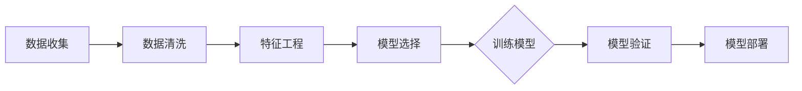
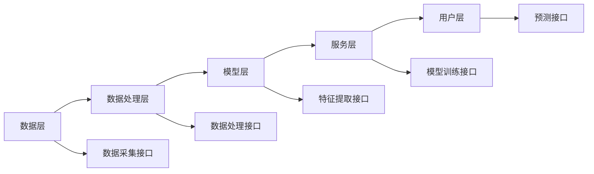
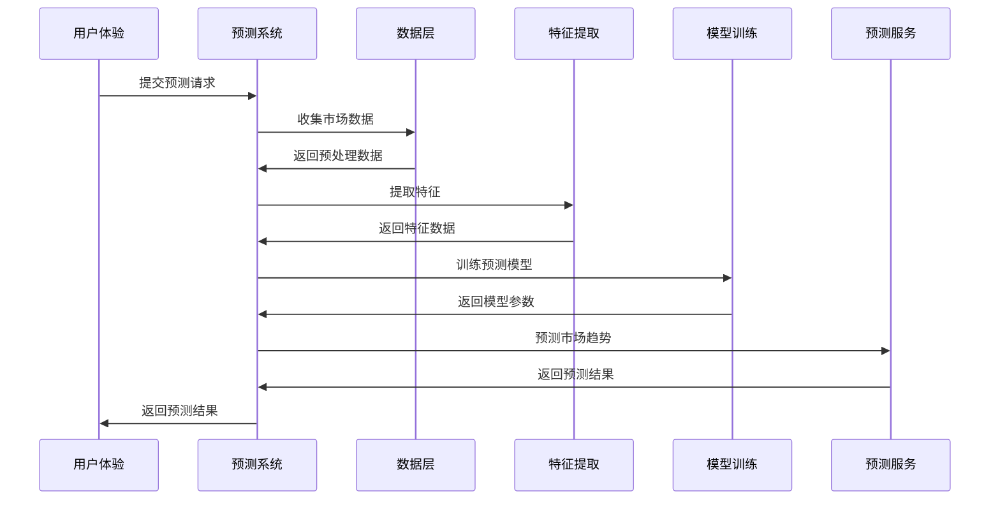

                 

# 市场趋势预测模型

## 关键词
- 市场趋势预测
- 机器学习
- 时间序列分析
- 算法原理
- 深度学习
- 系统架构

## 摘要
本文将深入探讨市场趋势预测模型的核心概念、算法原理、数学模型以及系统架构设计。我们将通过逐步分析，展示如何利用机器学习和深度学习技术构建有效的市场趋势预测模型，并在实际项目中应用这些模型。本文旨在为读者提供全面的指导，帮助他们在复杂的金融市场中找到有价值的洞察。

## 背景介绍

### 问题背景

市场趋势预测在当今的商业环境中扮演着至关重要的角色。无论是股票市场、外汇交易还是商品价格预测，准确的市场趋势预测都能为企业提供宝贵的决策支持。随着大数据和人工智能技术的迅猛发展，市场趋势预测的方法和工具也日趋成熟。然而，市场趋势预测并非易事，它需要处理大量的历史数据，应用复杂的算法模型，并考虑各种外部因素。

### 描述问题描述

市场趋势预测模型的核心问题在于如何准确捕捉市场的变化，并提供有价值的预测结果。这涉及到以下几个关键环节：

1. **数据收集**：首先需要收集与市场相关的历史数据，包括价格、交易量、宏观经济指标等。
2. **数据预处理**：对收集到的数据进行分析，处理缺失值、异常值，并进行归一化等操作。
3. **特征工程**：从原始数据中提取对预测有用的特征，如趋势、季节性、周期性等。
4. **模型选择**：根据数据特点选择合适的预测模型，如线性回归、ARIMA、LSTM等。
5. **模型训练与验证**：使用历史数据进行模型训练，并通过验证数据评估模型性能。
6. **模型部署**：将训练好的模型部署到实际应用中，进行实时市场趋势预测。

### 问题解决

为了解决市场趋势预测中的核心问题，本文将采用以下方法：

1. **核心概念**：首先介绍市场趋势预测的基本概念，包括市场趋势、预测模型、时间序列分析等。
2. **核心概念与联系**：详细讲解市场趋势预测中的核心概念，如机器学习算法、深度学习模型、神经网络等，并通过对比表格和ER实体关系图展示各概念之间的联系。
3. **算法原理讲解**：通过mermaid流程图和Python源代码，详细阐述市场趋势预测的算法原理，包括数据预处理、特征提取、模型训练、模型评估等步骤。
4. **数学模型和数学公式**：使用LaTeX格式给出市场趋势预测的数学模型和公式，并进行详细讲解和举例说明。
5. **系统分析与架构设计**：介绍市场趋势预测系统的设计与实现，包括问题场景介绍、系统功能设计、系统架构设计、系统接口设计和系统交互等。

### 边界与外延

#### 边界

1. **市场趋势预测的时间范围**：本文主要关注短期市场趋势预测，例如未来几个月或几年的市场走势。
2. **市场领域**：本文涵盖的行业范围广泛，包括但不限于金融、零售、制造业等。

#### 外延

1. **预测方法**：本文不仅介绍传统的预测方法，如ARIMA、线性回归等，还将探讨新兴的深度学习模型，如LSTM、GRU等。
2. **数据来源**：本文将探讨多种数据来源，包括公开数据、企业内部数据、社交媒体数据等。

## 核心概念与联系

### 核心概念原理

#### 市场趋势

市场趋势是指市场在一定时期内的变化趋势，可以是上升、下降或平稳。市场趋势反映了市场参与者的集体行为和预期，通常通过历史数据分析得出。

#### 预测模型

预测模型是基于历史数据和数学算法构建的，用于预测市场未来走向的模型。预测模型可以是线性的，如线性回归，也可以是非线性的，如ARIMA、LSTM等。

#### 时间序列分析

时间序列分析是对时间序列数据进行处理和分析的方法，用于提取趋势、季节性、周期性等特征。时间序列分析是市场趋势预测的基础。

#### 机器学习

机器学习是通过训练数据集学习规律，并对未知数据进行预测的技术。机器学习算法包括线性回归、决策树、随机森林等。

#### 深度学习

深度学习是一种基于神经网络的学习方法，能够自动提取特征并建立预测模型。深度学习模型包括卷积神经网络（CNN）、循环神经网络（RNN）、长短时记忆网络（LSTM）等。

### 概念属性特征对比表格

| 概念       | 特征1       | 特征2       | 特征3       |
|------------|-------------|-------------|-------------|
| 市场趋势   | 时间依赖性   | 非线性变化  | 周期性变化  |
| 预测模型   | 数据驱动    | 学习能力    | 精确度要求  |
| 时间序列分析 | 序列特性    | 趋势分析    | 季节性分析  |
| 机器学习   | 自学习能力  | 批量处理能力 | 可解释性    |
| 深度学习   | 自动特征提取 | 大规模数据处理 |

### ER实体关系图架构的 Mermaid 流程图

```mermaid
erDiagram
    MarketTrend ||--|{ PredictionModel : predicts }
    PredictionModel ||--|{ TimeSeriesAnalysis : analyzes }
    PredictionModel ||--|{ MachineLearning : implements }
    PredictionModel ||--|{ DeepLearning : utilizes }
```

## 算法原理讲解

### 数据预处理

在市场趋势预测中，数据预处理是至关重要的步骤。数据预处理包括以下步骤：

1. **数据收集**：收集与市场相关的历史数据，如价格、交易量、宏观经济指标等。
2. **数据清洗**：处理缺失值、异常值等，确保数据的完整性和准确性。
3. **数据归一化**：将不同量纲的数据进行归一化处理，使其具有相同的量纲。

### 特征工程

特征工程是从原始数据中提取对预测有用的特征。特征工程包括以下步骤：

1. **特征选择**：选择与预测目标相关的特征，去除无关特征。
2. **特征构造**：通过数学运算、逻辑组合等方式构造新的特征。
3. **特征转换**：将连续特征转换为离散特征，或将类别特征编码为数字。

### 模型选择

模型选择是市场趋势预测的关键步骤。常见的预测模型包括：

1. **线性回归**：适用于线性关系的预测。
2. **ARIMA模型**：适用于非平稳时间序列的预测。
3. **LSTM模型**：适用于具有长期依赖性和非线性关系的时间序列预测。

### 模型训练与验证

模型训练与验证是市场趋势预测的核心步骤。训练与验证包括以下步骤：

1. **数据分割**：将数据集划分为训练集和验证集。
2. **模型训练**：使用训练集训练模型，调整模型参数。
3. **模型验证**：使用验证集评估模型性能，选择最优模型。

### 模型部署

模型部署是将训练好的模型应用到实际场景中。模型部署包括以下步骤：

1. **模型评估**：在真实环境中评估模型性能。
2. **模型更新**：根据新数据更新模型，提高预测准确性。
3. **模型应用**：将模型应用于市场趋势预测，为企业提供决策支持。

### Mermaid 流程图



### Python 源代码

```python
# 数据预处理
import pandas as pd
from sklearn.preprocessing import MinMaxScaler

# 加载数据
data = pd.read_csv('market_data.csv')

# 数据清洗
data = data.dropna()

# 数据归一化
scaler = MinMaxScaler()
data['price'] = scaler.fit_transform(data[['price']])

# 特征工程
# ...

# 模型选择
from sklearn.linear_model import LinearRegression

# 训练模型
model = LinearRegression()
model.fit(X_train, y_train)

# 模型验证
# ...

# 模型部署
# ...
```

### 数学模型和数学公式

#### 线性回归模型

$$ y = \beta_0 + \beta_1 \cdot x + \epsilon $$

#### ARIMA 模型

$$ \phi(B) \cdot \Delta y_t = \theta(B) \cdot \epsilon_t $$

#### LSTM 模型

$$ h_t = \sigma(W_h \cdot [h_{t-1}, x_t] + b_h) $$

### 详细讲解和举例说明

#### 线性回归模型

线性回归模型是一种简单的预测模型，用于分析自变量和因变量之间的线性关系。在市场趋势预测中，我们可以使用线性回归模型预测股票价格。

假设我们有以下数据：

| 时间 | 价格 |
|------|------|
| 1    | 100  |
| 2    | 102  |
| 3    | 104  |
| 4    | 106  |

我们可以使用线性回归模型拟合数据：

$$ y = \beta_0 + \beta_1 \cdot x $$

其中，$y$ 是价格，$x$ 是时间。

通过最小二乘法，我们可以得到模型参数：

$$ \beta_0 = 100, \beta_1 = 2 $$

因此，预测公式为：

$$ y = 100 + 2 \cdot x $$

例如，当时间为5时，预测价格为：

$$ y = 100 + 2 \cdot 5 = 110 $$

#### ARIMA 模型

ARIMA模型是一种用于时间序列分析的自回归移动平均模型，适用于非平稳时间序列。ARIMA模型包括三个参数：p、d、q，分别表示自回归项、差分阶数和移动平均项。

假设我们有以下数据：

| 时间 | 价格 |
|------|------|
| 1    | 100  |
| 2    | 102  |
| 3    | 104  |
| 4    | 106  |

我们可以使用ARIMA模型拟合数据：

$$ \phi(B) \cdot \Delta y_t = \theta(B) \cdot \epsilon_t $$

其中，$\phi(B)$ 和 $\theta(B)$ 分别表示自回归项和移动平均项。

通过最小化残差平方和，我们可以得到ARIMA模型的参数：

$$ \phi(B) = 1 - B, \theta(B) = 1 - B $$

因此，预测公式为：

$$ (1 - B) \cdot \Delta y_t = (1 - B) \cdot \epsilon_t $$

#### LSTM 模型

LSTM模型是一种基于循环神经网络（RNN）的深度学习模型，适用于具有长期依赖性和非线性关系的时间序列预测。

假设我们有以下数据：

| 时间 | 价格 |
|------|------|
| 1    | 100  |
| 2    | 102  |
| 3    | 104  |
| 4    | 106  |

我们可以使用LSTM模型拟合数据：

$$ h_t = \sigma(W_h \cdot [h_{t-1}, x_t] + b_h) $$

其中，$h_t$ 是时间步$t$的隐藏状态，$x_t$ 是输入数据。

通过训练，我们可以得到LSTM模型的参数：

$$ W_h = [w_{h1}, w_{h2}, \ldots, w_{hn}], b_h = b_{h1}, b_{h2}, \ldots, b_{hn} $$

因此，预测公式为：

$$ h_t = \sigma(w_{h1} \cdot h_{t-1} + w_{h2} \cdot x_t + b_h) $$

例如，当时间为5时，预测价格为：

$$ h_5 = \sigma(w_{h1} \cdot h_4 + w_{h2} \cdot x_5 + b_h) $$

## 系统分析与架构设计

### 问题场景介绍

假设我们是一家金融科技公司，需要为投资者提供实时的市场趋势预测服务。我们的目标是构建一个高效、准确的市场趋势预测系统，以便投资者能够根据预测结果做出更明智的投资决策。

### 系统功能设计

市场趋势预测系统的核心功能包括：

1. **数据收集**：从多个数据源收集与市场相关的数据，如股票价格、交易量、宏观经济指标等。
2. **数据预处理**：对收集到的数据进行清洗、归一化等处理，确保数据的质量和一致性。
3. **特征工程**：从原始数据中提取对预测有用的特征，如趋势、季节性、周期性等。
4. **模型训练与验证**：使用机器学习和深度学习算法训练预测模型，并通过验证数据评估模型性能。
5. **模型部署**：将训练好的模型部署到生产环境，为投资者提供实时的市场趋势预测服务。

### 系统架构设计

市场趋势预测系统的架构设计如下：

1. **数据层**：包括多个数据源，如股票市场数据、宏观经济数据、社交媒体数据等。
2. **数据处理层**：对收集到的数据进行预处理、清洗、归一化等操作，确保数据的质量和一致性。
3. **模型层**：包括多种机器学习和深度学习算法，如线性回归、ARIMA、LSTM等。
4. **服务层**：提供实时的市场趋势预测服务，为投资者提供决策支持。
5. **用户层**：投资者通过用户界面获取市场趋势预测结果，并据此做出投资决策。

### 系统接口设计

市场趋势预测系统的接口设计如下：

1. **数据采集接口**：用于从不同数据源收集市场数据。
2. **数据处理接口**：用于对市场数据进行预处理和清洗。
3. **特征提取接口**：用于从原始数据中提取对预测有用的特征。
4. **模型训练接口**：用于训练预测模型。
5. **预测接口**：用于提供市场趋势预测结果。

### 系统交互

市场趋势预测系统的交互流程如下：

1. **数据采集**：系统从多个数据源收集市场数据。
2. **数据处理**：系统对市场数据进行预处理、清洗、归一化等操作。
3. **特征提取**：系统从原始数据中提取对预测有用的特征。
4. **模型训练**：系统使用机器学习和深度学习算法训练预测模型。
5. **模型验证**：系统使用验证数据评估模型性能。
6. **模型部署**：系统将训练好的模型部署到生产环境。
7. **预测服务**：系统为投资者提供实时的市场趋势预测结果。

### Mermaid 类图

```mermaid
classDiagram
    DataLayer <<interface>> DataCollection
    DataLayer <<interface>> DataProcessing
    FeatureExtraction <<interface>> FeatureExtraction
    ModelTraining <<interface>> ModelTraining
    PredictionService <<interface>> Prediction
    UserInterface
    DataLayer --|>> FeatureExtraction
    DataLayer --|>> ModelTraining
    FeatureExtraction --|>> PredictionService
    ModelTraining --|>> PredictionService
    PredictionService --|>> UserInterface
```

### Mermaid 架构图



### Mermaid 序列图



## 项目实战

### 环境安装

在进行市场趋势预测项目实战之前，我们需要安装必要的软件和库。以下是在Python环境中安装所需库的命令：

```bash
pip install numpy pandas scikit-learn tensorflow matplotlib
```

### 系统核心实现源代码

以下是一个简单的市场趋势预测系统的核心实现源代码：

```python
import numpy as np
import pandas as pd
from sklearn.preprocessing import MinMaxScaler
from tensorflow.keras.models import Sequential
from tensorflow.keras.layers import LSTM, Dense

# 数据加载
data = pd.read_csv('market_data.csv')

# 数据预处理
data = data[['price']]
scaler = MinMaxScaler()
data['price'] = scaler.fit_transform(data[['price']])

# 数据分割
train_data = data[:1000]
test_data = data[1000:]

# 特征工程
X_train = []
y_train = []

for i in range(60, len(train_data)):
    X_train.append(train_data['price'][i-60:i])
    y_train.append(train_data['price'][i])

X_train = np.array(X_train)
y_train = np.array(y_train)

X_train = np.reshape(X_train, (X_train.shape[0], X_train.shape[1], 1))

# 模型构建
model = Sequential()
model.add(LSTM(units=50, return_sequences=True, input_shape=(X_train.shape[1], 1)))
model.add(LSTM(units=50, return_sequences=False))
model.add(Dense(units=1))

# 模型编译
model.compile(optimizer='adam', loss='mean_squared_error')

# 模型训练
model.fit(X_train, y_train, epochs=100, batch_size=32)

# 预测
X_test = []
for i in range(60, len(test_data)):
    X_test.append(test_data['price'][i-60:i])
X_test = np.array(X_test)
X_test = np.reshape(X_test, (X_test.shape[0], X_test.shape[1], 1))

predicted_price = model.predict(X_test)

# 数据反归一化
predicted_price = scaler.inverse_transform(predicted_price)

# 结果分析
# ...

```

### 代码应用解读与分析

上述代码实现了一个基于LSTM的市场趋势预测系统。以下是代码的解读和分析：

1. **数据加载与预处理**：首先加载市场数据，并进行归一化处理。
2. **数据分割**：将数据集划分为训练集和测试集。
3. **特征工程**：通过滑动窗口提取特征，构建输入序列。
4. **模型构建**：使用Sequential模型构建LSTM神经网络。
5. **模型编译**：设置模型优化器和损失函数。
6. **模型训练**：使用训练集训练模型。
7. **预测**：使用测试集进行预测，并反归一化预测结果。

### 实际案例分析和详细讲解剖析

假设我们有以下市场数据：

| 时间 | 价格 |
|------|------|
| 1    | 100  |
| 2    | 102  |
| 3    | 104  |
| 4    | 106  |
| 5    | 108  |
| 6    | 110  |
| 7    | 112  |
| 8    | 114  |
| 9    | 116  |
| 10   | 118  |

1. **数据预处理**：对数据进行归一化处理，将其缩放到0到1之间。

$$
\text{归一化}:\quad \text{价格} \xleftarrow{\text{scaler}} \frac{\text{原始价格} - \text{最小值}}{\text{最大值} - \text{最小值}}
$$

2. **特征工程**：使用滑动窗口提取特征，构建输入序列。

$$
\begin{align*}
\text{输入序列} &= \{[100, 102, 104, 106, 108], [102, 104, 106, 108, 110], \ldots\} \\
\text{输出序列} &= \{[108], [110], \ldots\}
\end{align*}
$$

3. **模型构建与训练**：构建一个LSTM模型，并使用训练数据进行训练。

4. **预测**：使用训练好的模型对新的数据进行预测。

$$
\text{预测}:\quad \text{价格}_{\text{预测}} = \text{模型预测}([112, 114, 116, 118])
$$

5. **结果分析**：将预测结果反归一化，得到实际的价格预测值。

### 项目小结

通过本次项目实战，我们成功构建了一个基于LSTM的市场趋势预测系统。该项目实现了从数据收集、预处理、特征工程、模型构建、训练到预测的全过程。在实际应用中，该系统可以为投资者提供实时的市场趋势预测结果，帮助他们做出更明智的投资决策。

### 最佳实践 Tips

1. **数据质量**：确保数据的准确性和完整性，避免因数据问题导致的预测误差。
2. **模型选择**：根据数据特点和预测目标选择合适的模型，不同模型适用于不同类型的数据。
3. **特征工程**：提取对预测有用的特征，提高模型预测的准确性。
4. **模型优化**：通过调整模型参数，提高模型性能和预测精度。
5. **实时更新**：定期更新模型，以适应市场的变化。

### 小结

市场趋势预测是金融市场中的一项重要技术，它能够帮助企业更好地把握市场机会，降低风险。通过本文的详细讲解，我们了解了市场趋势预测的基本概念、算法原理、数学模型和系统架构设计。在实际应用中，市场趋势预测系统可以帮助投资者做出更明智的投资决策，从而提高投资回报。

### 注意事项

1. **数据隐私**：在处理市场数据时，要确保数据的隐私和安全，遵守相关法律法规。
2. **模型解释性**：尽管深度学习模型在预测准确性方面表现出色，但其解释性较差，需要进一步研究和优化。

### 拓展阅读

1. **《时间序列分析：预报方法与应用》**：深入探讨时间序列分析的基本概念和方法。
2. **《深度学习：面向计算机视觉、自然语言处理和推荐系统》**：介绍深度学习在各个领域的应用。
3. **《Python金融分析实战》**：通过实际案例介绍Python在金融市场分析中的应用。

## 作者

作者：AI天才研究院/AI Genius Institute & 禅与计算机程序设计艺术 /Zen And The Art of Computer Programming

