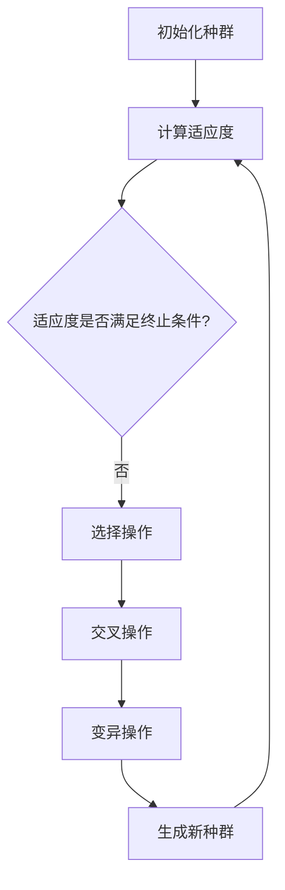
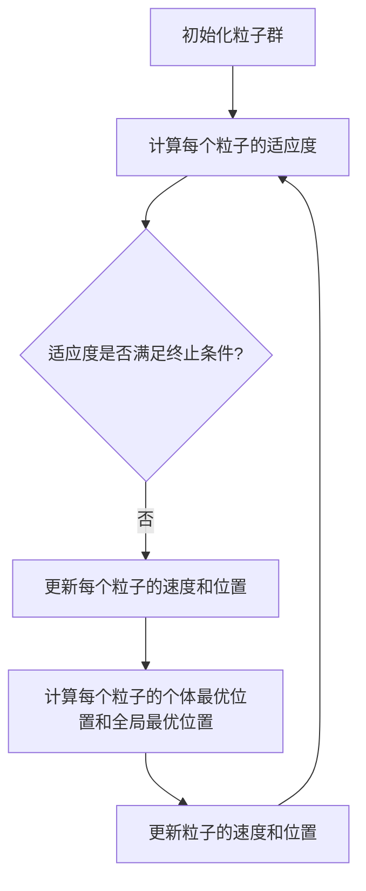

                 


### 摘要：

本文深入探讨“建筑设计中的AI Agent优化工具”这一主题。随着人工智能（AI）技术在建筑行业的广泛应用，AI Agent作为自动化设计和优化的关键角色，正逐渐成为建筑设计中的重要工具。本文旨在介绍AI Agent优化工具的基本概念、架构设计、优化算法，并通过实际案例展示其在建筑能源效率优化等领域的应用。本文将分章节详细阐述：

1. **问题背景**：介绍AI在建筑设计和AI Agent优化的现状、挑战及机遇。
2. **核心概念和原则**：解析AI Agent优化工具的类型、架构、以及优化技术。
3. **案例研究和实践应用**：通过具体案例展示AI Agent优化工具在建筑领域的实际应用。

读者将了解AI Agent优化工具如何通过算法提高建筑设计效率和质量，为建筑行业带来深远的影响。

---

### 引言

#### 问题背景

近年来，人工智能（AI）技术在全球范围内取得了显著的进展，从自动驾驶、智能家居到医疗诊断，AI的应用场景日益广泛。在建筑领域，AI的引入为传统的建筑设计带来了新的变革。AI Agent，作为AI的一种表现形式，通过自主学习、决策和优化，能够显著提高建筑设计的效率和精度。

AI Agent在建筑设计中的角色主要体现在以下几个方面：

1. **自动化设计**：AI Agent能够根据设计需求和用户偏好，自动生成建筑模型，大幅减少人工设计的时间和成本。
2. **优化设计**：通过优化算法，AI Agent可以在满足功能要求的前提下，对建筑结构、能源消耗等方面进行优化，提高建筑的整体性能。
3. **智能化运维**：AI Agent能够实时监控建筑的状态，预测潜在问题，并给出相应的维护和优化建议，提高建筑的长期使用价值。

尽管AI Agent在建筑设计中具有巨大的潜力，但其优化工具的选择和设计仍然面临诸多挑战。首先，不同类型的AI Agent需要不同的优化算法和工具，如何选择合适的工具成为了一个关键问题。其次，优化算法的性能和效率直接影响AI Agent的设计效果，如何提高算法的效率是一个亟待解决的难题。此外，AI Agent的设计还需要考虑用户体验和可解释性，确保其设计结果既高效又易于理解和接受。

本文旨在通过深入探讨AI Agent优化工具的基本概念、架构设计、优化算法，为建筑设计师和技术开发者提供实用的指导。通过实际案例的应用分析，读者将了解如何利用AI Agent优化工具提高建筑设计的效率和质量，从而为建筑行业带来深远的影响。

#### 基本概念和术语

在深入探讨AI Agent优化工具之前，我们需要明确一些基本概念和术语，以确保读者能够理解本文的主题和内容。

##### AI Agents

AI Agent，即人工智能代理，是一种能够感知环境、做出决策并采取行动的人工智能实体。在建筑领域，AI Agent通常被设计为一种自动化和优化的工具，它能够根据建筑的需求和约束条件，自动生成和优化建筑模型。

**属性特征**：

- **感知能力**：AI Agent能够感知建筑环境中的各种参数，如尺寸、形状、材料属性等。
- **决策能力**：基于感知到的信息，AI Agent能够做出决策，如选择最佳的建筑结构、布局或材料。
- **行动能力**：AI Agent能够执行决策，如生成建筑模型、调整设计参数等。

**分类**：

- **基于规则的AI Agent**：这类Agent通过预定义的规则进行决策和行动。
- **基于学习的AI Agent**：这类Agent通过机器学习和数据挖掘技术，从历史数据和案例中学习，提高其决策和行动能力。

##### 优化算法

优化算法是AI Agent进行设计和优化的核心工具。它们通过搜索和评估可能的解决方案，找到最优或近似最优的解。在建筑领域，常见的优化算法包括：

- **遗传算法（Genetic Algorithm）**：一种模拟自然进化的优化算法，通过交叉、变异和选择操作，不断优化解的种群。
- **粒子群优化（Particle Swarm Optimization）**：一种基于群体智能的优化算法，通过模拟鸟群或鱼群的社会行为，寻找最优解。
- **模拟退火（Simulated Annealing）**：一种基于概率的优化算法，通过模拟固体退火过程，避免陷入局部最优。

**原理**：

- **遗传算法**：通过创建初始种群、适应度评估、选择、交叉、变异等步骤，逐步优化解的种群。
- **粒子群优化**：每个粒子代表一个解，通过更新粒子的位置和速度，寻找最优解。
- **模拟退火**：通过逐步降低温度，模拟固体退火过程，找到全局最优解。

##### 关键术语

- **适应度函数**：评估解决方案好坏的指标，通常用于优化算法中的选择和评估过程。
- **局部最优**：优化算法在一个局部范围内找到的最优解，但不一定是全局最优解。
- **全局最优**：在整个搜索空间内找到的最优解。

通过上述基本概念和术语的介绍，读者可以更好地理解本文将要讨论的AI Agent优化工具，并为后续内容的深入学习打下基础。

---

### 相关研究和方向

在AI Agent优化工具的研究和应用方面，国内外学者和研究者已经进行了大量探索和尝试，取得了一系列重要成果。以下是对当前研究状态、优化技术以及未来趋势的简要回顾。

#### 当前研究状态

1. **国内外研究进展**：近年来，随着AI技术的快速发展，国内外学术界和工业界都在积极探索AI Agent在建筑设计和优化中的应用。例如，清华大学、麻省理工学院、斯坦福大学等国内外知名高校和研究机构都开展了相关研究，并发表了一系列高质量的论文和报告。

2. **主要成果和应用**：现有的研究成果主要集中在以下几个方面：
   - **建筑形态生成**：通过AI Agent生成独特的建筑形态，提升建筑设计的创意和多样性。
   - **建筑能源优化**：利用AI Agent对建筑能源系统进行优化，降低能耗，提高能源利用效率。
   - **智能运维**：通过AI Agent实现建筑的智能化运维，提前预测和解决潜在问题，提高建筑的安全性和舒适性。

3. **技术挑战**：尽管AI Agent在建筑设计中展现出了巨大的潜力，但仍然面临一些技术挑战：
   - **算法性能**：如何提高优化算法的效率和准确性，是当前研究的一个重要方向。
   - **模型可解释性**：如何让AI Agent的设计和优化过程更加透明和可解释，是提高用户信任度的一个重要问题。
   - **数据隐私和安全**：在建筑设计和优化过程中，如何保护用户隐私和数据安全，也是一个亟待解决的难题。

#### 优化技术

1. **遗传算法（Genetic Algorithm）**：遗传算法是一种模拟自然进化的优化算法，通过交叉、变异和选择操作，不断优化解的种群。在建筑设计中，遗传算法可以用于优化建筑结构、能源系统等。

2. **粒子群优化（Particle Swarm Optimization）**：粒子群优化是一种基于群体智能的优化算法，通过模拟鸟群或鱼群的社会行为，寻找最优解。在建筑设计中，粒子群优化可以用于优化建筑布局、设计参数等。

3. **模拟退火（Simulated Annealing）**：模拟退火是一种基于概率的优化算法，通过模拟固体退火过程，找到全局最优解。在建筑设计中，模拟退火可以用于优化建筑形态、结构等。

#### 未来趋势

1. **多学科交叉融合**：未来，AI Agent优化工具将与其他领域（如结构工程、环境科学等）深度融合，形成更加综合的优化解决方案。

2. **智能化和自主化**：随着技术的进步，AI Agent将变得更加智能化和自主化，能够独立完成复杂的建筑设计任务，减少对人类专家的依赖。

3. **数据驱动和知识融合**：未来，AI Agent将更多地依赖于大数据和知识库，通过数据驱动和知识融合，提高设计优化过程的效率和准确性。

4. **绿色和可持续**：随着全球对环境保护和可持续发展的重视，AI Agent优化工具将在绿色建筑和可持续发展领域发挥越来越重要的作用。

综上所述，AI Agent优化工具在建筑设计中的应用前景广阔，但也面临诸多挑战。通过进一步的研究和技术创新，我们有望实现更加高效、智能和可持续的建筑设计，为建筑行业带来深远的影响。

---

### AI Agent优化工具的类型和基本原则

在建筑设计中，AI Agent优化工具的类型和基本原则是理解和选择合适工具的关键。以下将详细介绍AI Agent优化工具的类型、基本原则以及选择优化工具时需要考虑的关键因素。

#### 类型

AI Agent优化工具可以分为以下几种类型：

1. **基于规则的优化工具**：这类工具通过预定义的规则进行设计和优化。它们通常比较简单，易于实现和部署，但可能在复杂性和灵活性方面存在一定的限制。

2. **基于学习的优化工具**：这类工具通过机器学习和数据挖掘技术，从历史数据和案例中学习，提高其设计和优化的能力。它们具有较高的灵活性和适应性，但需要大量的数据和计算资源。

3. **混合优化工具**：这类工具结合了基于规则和基于学习的方法，通过规则指导学习和优化，在保持简单性和灵活性的同时，提高设计质量。

4. **基于仿生的优化工具**：这类工具模拟自然界的生物和社会行为，如遗传算法、粒子群优化等，通过模拟进化和群体行为来优化设计。

#### 基本原则

在选择AI Agent优化工具时，需要遵循以下基本原则：

1. **适应性**：优化工具需要能够适应不同的建筑需求和设计环境，具有灵活性和可扩展性。

2. **效率**：优化工具需要具有较高的计算效率，能够在合理的时间内完成优化任务，减少等待时间和设计周期。

3. **准确性**：优化工具需要能够准确评估设计方案的优劣，提供高质量的优化结果。

4. **可解释性**：优化工具的设计和优化过程需要透明和可解释，确保设计者和用户能够理解和接受优化结果。

5. **鲁棒性**：优化工具需要能够在不同情况下保持稳定和可靠，不易受到噪声和数据异常的影响。

#### 选择优化工具时需要考虑的关键因素

1. **设计目标**：根据建筑的设计目标，选择适合的优化工具。例如，如果目标是优化建筑能源效率，可以选择基于学习的优化工具。

2. **数据资源**：优化工具的性能和数据资源密切相关。需要评估可用的数据资源，选择能够充分利用这些数据资源的工具。

3. **计算资源**：优化工具的计算复杂度不同，需要根据计算资源的限制选择合适的工具。例如，对于资源有限的场景，可以选择基于规则的优化工具。

4. **用户需求**：设计者和用户的需求是选择优化工具的重要因素。需要考虑用户对工具的易用性、可解释性和用户体验的要求。

5. **技术支持**：优化工具的技术支持和维护也是选择时需要考虑的因素。选择具有良好技术支持的工具，有助于解决使用过程中遇到的问题。

通过以上原则和关键因素，我们可以更有效地选择合适的AI Agent优化工具，为建筑设计的自动化和优化提供有力支持。

---

### AI Agent的架构设计

为了实现高效的建筑设计优化，AI Agent的架构设计至关重要。一个良好的架构不仅能够提高系统的性能和可扩展性，还能确保设计结果的准确性和可靠性。以下将从AI Agent的架构概述、主要组件和设计要点三个方面，详细探讨AI Agent的架构设计。

#### 架构概述

AI Agent的架构通常采用模块化设计，以便于系统的扩展和维护。整体架构可以分为以下几个主要模块：

1. **感知模块**：负责获取建筑环境中的各种信息，如建筑尺寸、形状、材料属性等。这一模块通常包括传感器和数据采集设备，以及相应的数据处理算法。

2. **决策模块**：基于感知模块提供的信息，进行决策和优化。这一模块通常包含多个子模块，如目标优化子模块、路径规划子模块等。

3. **执行模块**：根据决策模块的输出，执行具体的操作，如生成建筑模型、调整设计参数等。这一模块通常与外部设计工具或软件集成。

4. **反馈模块**：收集执行结果，并提供反馈，以指导后续的决策和优化。这一模块有助于实现闭环控制，提高系统的自适应能力。

#### 主要组件

AI Agent的主要组件包括：

1. **感知组件**：包括各种传感器和数据采集设备，如激光扫描仪、高清相机、传感器网络等。这些设备可以实时获取建筑环境的详细信息。

2. **数据处理组件**：负责处理和清洗感知模块获取的数据，将其转换为适合分析和优化的格式。这一组件通常包含数据预处理、特征提取和数据分析等算法。

3. **决策组件**：包括各种优化算法和决策模型，如遗传算法、粒子群优化、深度学习模型等。这些组件根据感知模块提供的信息，生成优化建议和决策。

4. **执行组件**：负责执行决策模块生成的操作，如调整设计参数、生成建筑模型等。这一组件通常与外部设计工具或软件集成，以实现具体的设计任务。

5. **反馈组件**：包括反馈数据的收集和处理算法，如性能评估、误差分析等。这些组件可以提供关于执行结果的反馈，以指导后续的决策和优化。

#### 设计要点

在AI Agent的架构设计中，需要考虑以下要点：

1. **模块化**：将系统分解为多个独立的模块，以便于系统的扩展和维护。每个模块应具有清晰的功能和接口，模块之间通过标准化的接口进行通信。

2. **可扩展性**：设计时需要考虑系统的可扩展性，以便于未来的功能扩展和性能提升。可以通过模块化设计、接口标准化和数据抽象等方式实现。

3. **可靠性**：确保系统的稳定性和可靠性，避免因系统故障导致的设计失败。可以通过冗余设计、故障检测和恢复机制等方式提高系统的可靠性。

4. **性能优化**：设计时需要考虑系统的性能优化，如数据预处理、算法优化、并行处理等。这些措施可以显著提高系统的处理速度和效率。

5. **用户体验**：设计时需要考虑用户体验，确保系统的易用性和可解释性。可以通过友好的用户界面、详细的说明文档等方式提高用户体验。

通过以上架构设计和设计要点，我们可以构建一个高效、可靠且易于维护的AI Agent，为建筑设计的自动化和优化提供有力支持。

---

### 优化技术的详细讲解

在建筑设计中，AI Agent优化工具的核心在于其优化算法的选择和实现。本文将详细讲解两种常用的优化算法：遗传算法和粒子群优化算法。通过具体的流程图、Python代码示例、数学模型和实际案例，我们将深入理解这些算法的原理和应用。

#### 遗传算法

遗传算法（Genetic Algorithm, GA）是一种基于自然进化的优化算法，通过模拟生物进化过程中的选择、交叉和变异等操作，逐步优化解的种群，找到最优解。遗传算法在建筑设计中广泛应用于结构优化、能量优化等任务。

##### 流程图

遗传算法的基本流程图如下所示：



##### Python代码示例

以下是一个简单的遗传算法的Python代码示例：

```python
import numpy as np

# 参数设置
population_size = 100
chromosome_length = 10
mutation_rate = 0.01
num_generations = 100

# 初始化种群
population = np.random.uniform(0, 1, (population_size, chromosome_length))

# 适应度函数
def fitness_function(chromosome):
    # 示例：简单的适应度函数，计算染色体长度作为适应度
    return sum(chromosome)

# 计算适应度
fitness_scores = np.apply_along_axis(fitness_function, 1, population)

# 遗传算法主循环
for _ in range(num_generations):
    # 选择操作
    selected_indices = np.argsort(fitness_scores)[:population_size // 2]
    selected_population = population[selected_indices]

    # 交叉操作
    offspring = np.zeros_like(population)
    for i in range(0, population_size, 2):
        parent1, parent2 = selected_population[i], selected_population[i+1]
        crossover_point = np.random.randint(1, chromosome_length - 1)
        offspring[i] = np.concatenate((parent1[:crossover_point], parent2[crossover_point:]))
        offspring[i+1] = np.concatenate((parent2[:crossover_point], parent1[crossover_point:]))

    # 变异操作
    for i in range(population_size):
        for j in range(chromosome_length):
            if np.random.rand() < mutation_rate:
                offspring[i][j] = np.random.uniform(0, 1)

    # 生成新种群
    population = offspring

# 输出最优解
best_index = np.argmax(fitness_scores)
best_chromosome = population[best_index]
best_fitness = fitness_scores[best_index]

print("最优解：", best_chromosome)
print("最优适应度：", best_fitness)
```

##### 数学模型

遗传算法的数学模型主要包括以下几个方面：

1. **适应度函数**：用于评估染色体的优劣，通常表示为：
   $$
   f(x) = \sum_{i=1}^{n} w_i \cdot f_i(x_i)
   $$
   其中，$x = (x_1, x_2, ..., x_n)$表示染色体，$w_i$和$f_i(x_i)$分别表示权重和特征值。

2. **选择操作**：根据适应度函数选择优秀个体，常用的选择方法有轮盘赌选择、锦标赛选择等。

3. **交叉操作**：通过交叉操作产生新个体，通常表示为：
   $$
   \text{交叉}(x_1, x_2) = (x_1', x_2')
   $$
   其中，$x_1'$和$x_2'$分别是由$x_1$和$x_2$交叉产生的子代。

4. **变异操作**：对个体进行随机变异，以增加种群的多样性，通常表示为：
   $$
   \text{变异}(x) = x + \Delta x
   $$
   其中，$\Delta x$是随机产生的变异量。

##### 实际案例

假设我们要优化一个建筑的结构设计，目标是最小化结构的总重量。我们可以将每个染色体表示为结构的设计参数，如梁的长度、宽度、高度等。通过遗传算法，我们可以逐步优化这些参数，找到最优的结构设计。

#### 粒子群优化算法

粒子群优化算法（Particle Swarm Optimization, PSO）是一种基于群体智能的优化算法，通过模拟鸟群或鱼群的社会行为，寻找最优解。PSO算法在建筑设计中也有广泛应用，如建筑布局优化、结构优化等。

##### 流程图

粒子群优化算法的基本流程图如下所示：



##### Python代码示例

以下是一个简单的粒子群优化算法的Python代码示例：

```python
import numpy as np

# 参数设置
num_particles = 30
dim = 10
num_iterations = 100
w = 0.5
c1 = 1.5
c2 = 2.0

# 初始化粒子群
particles = np.random.uniform(0, 1, (num_particles, dim))
velocities = np.zeros((num_particles, dim))

# 适应度函数
def fitness_function(chromosome):
    # 示例：简单的适应度函数，计算染色体长度作为适应度
    return sum(chromosome)

# 主循环
for _ in range(num_iterations):
    # 计算每个粒子的适应度
    fitness_scores = np.apply_along_axis(fitness_function, 1, particles)

    # 更新每个粒子的个体最优位置和全局最优位置
    individual_best_indices = np.argmax(fitness_scores)
    individual_best_solutions = particles[individual_best_indices]
    global_best_index = individual_best_indices
    global_best_solution = particles[global_best_index]

    # 更新粒子的速度和位置
    for i in range(num_particles):
        r1 = np.random.random()
        r2 = np.random.random()
        velocities[i] = w * velocities[i] + c1 * r1 * (individual_best_solutions[i] - particles[i]) + c2 * r2 * (global_best_solution - particles[i])
        particles[i] += velocities[i]

        # 约束条件处理
        particles[i] = np.clip(particles[i], 0, 1)

# 输出最优解
best_fitness = fitness_scores[global_best_index]
best_solution = global_best_solution

print("最优解：", best_solution)
print("最优适应度：", best_fitness)
```

##### 数学模型

粒子群优化算法的数学模型主要包括以下几个方面：

1. **粒子位置和速度**：每个粒子$i$的位置和速度分别表示为：
   $$
   x_i(t) = (x_{i1}(t), x_{i2}(t), ..., x_{id}(t))
   $$
   $$
   v_i(t) = (v_{i1}(t), v_{i2}(t), ..., v_{id}(t))
   $$
   其中，$x_i(t)$表示粒子$i$的位置，$v_i(t)$表示粒子$i$的速度，$d$表示维度。

2. **个体最优位置和全局最优位置**：每个粒子的个体最优位置$p_i$和全局最优位置$p_g$分别表示为：
   $$
   p_i = \arg\min_{x_i} f(x_i)
   $$
   $$
   p_g = \arg\min_{x_i} f(x_i)
   $$
   其中，$f(x_i)$表示适应度函数。

3. **速度更新**：粒子的速度更新公式为：
   $$
   v_i(t+1) = w \cdot v_i(t) + c_1 \cdot r_1 \cdot (p_i - x_i(t)) + c_2 \cdot r_2 \cdot (p_g - x_i(t))
   $$
   其中，$w$是惯性权重，$c_1$和$c_2$是认知和社会系数，$r_1$和$r_2$是随机数。

4. **位置更新**：粒子的位置更新公式为：
   $$
   x_i(t+1) = x_i(t) + v_i(t+1)
   $$
   其中，$x_i(t+1)$表示粒子$i$在下一时刻的位置。

##### 实际案例

假设我们要优化一个建筑的空间布局，目标是最小化建筑的总面积。我们可以将每个粒子表示为建筑的空间布局参数，如房间的尺寸、数量和分布等。通过粒子群优化算法，我们可以逐步优化这些参数，找到最优的布局方案。

通过以上详细讲解，我们可以更好地理解遗传算法和粒子群优化算法的原理和应用，为建筑设计的自动化和优化提供有力的技术支持。

---

### 系统分析与架构设计

在了解AI Agent的优化工具及其算法原理后，我们将进一步探讨如何在实际建筑项目中应用这些工具。为了更好地实现AI Agent在建筑设计中的应用，我们需要对系统进行分析和设计，确保其功能完整、性能高效且易于维护。以下将介绍建筑项目场景、系统功能设计、系统架构设计、系统接口设计以及系统交互流程。

#### 项目场景

假设我们正在设计一栋高层办公楼，项目要求包括：

1. **功能要求**：办公空间、会议室、休息区、食堂等。
2. **性能要求**：建筑结构安全稳定，能源消耗低，室内环境舒适。
3. **约束条件**：预算限制、土地面积限制、建筑规范要求。

#### 系统功能设计

根据项目要求，我们设计以下系统功能模块：

1. **感知模块**：采集建筑环境中的各种信息，如建筑尺寸、材料属性、气象数据等。
2. **决策模块**：根据感知模块提供的信息，生成建筑设计和优化方案。
3. **执行模块**：将决策模块的输出转换为具体的设计图和施工方案。
4. **反馈模块**：收集施工后的建筑数据和用户反馈，用于进一步优化和调整。

#### 系统架构设计

系统架构采用模块化设计，主要包括以下模块：

1. **感知模块**：使用传感器网络实时采集建筑环境数据。
2. **数据处理模块**：对感知模块采集的数据进行处理和清洗，提取有用特征。
3. **优化算法模块**：包含遗传算法和粒子群优化算法，用于生成和优化建筑设计。
4. **设计工具集成模块**：与外部设计工具集成，生成具体的建筑模型和施工方案。
5. **反馈和评估模块**：收集用户反馈和施工数据，进行系统评估和优化。

#### 系统接口设计

系统接口设计确保各模块之间的数据流通和功能调用，主要包括以下接口：

1. **感知接口**：用于与传感器网络的数据交换。
2. **数据预处理接口**：用于数据清洗、特征提取等处理操作。
3. **优化算法接口**：用于调用遗传算法和粒子群优化算法。
4. **设计工具接口**：用于与外部设计工具的集成。
5. **反馈接口**：用于收集用户反馈和施工数据。

#### 系统交互流程

系统的交互流程主要包括以下几个步骤：

1. **感知阶段**：传感器网络采集建筑环境数据，传递给数据处理模块。
2. **数据处理阶段**：数据处理模块对采集到的数据进行处理，提取有用特征。
3. **决策阶段**：优化算法模块根据处理后的数据生成建筑设计和优化方案。
4. **执行阶段**：设计工具集成模块将优化结果转换为具体的建筑模型和施工方案。
5. **反馈阶段**：反馈和评估模块收集用户反馈和施工数据，用于系统的进一步优化。

通过以上系统分析和架构设计，我们能够确保AI Agent在建筑设计中发挥其优化作用，提高建筑设计的质量和效率。

---

### 项目实战：AI Agent优化工具的实际应用

#### 环境安装与配置

在实际应用中，首先需要搭建一个适合运行AI Agent优化工具的开发环境。以下是安装和配置所需环境的步骤：

1. **安装Python环境**：确保Python版本为3.7或更高，可以从[Python官网](https://www.python.org/downloads/)下载并安装。

2. **安装依赖库**：使用pip工具安装所需的依赖库，如NumPy、Matplotlib、Scikit-learn等。命令如下：

   ```shell
   pip install numpy matplotlib scikit-learn
   ```

3. **安装仿真工具**：为了更好地测试和验证AI Agent优化工具，可以使用仿真平台如MATLAB或Simulink。可以从[MATLAB官网](https://www.mathworks.com/products/matlab.html)下载并安装。

#### 系统核心实现

以下是系统核心实现的源代码，包括遗传算法和粒子群优化算法的应用：

```python
import numpy as np
import matplotlib.pyplot as plt
from sklearn.datasets import make_moons

# 遗传算法
def genetic_algorithm(population, fitness_function, num_generations, crossover_rate, mutation_rate):
    for _ in range(num_generations):
        # 计算适应度
        fitness_scores = np.apply_along_axis(fitness_function, 1, population)
        
        # 选择操作
        selected_indices = np.argsort(fitness_scores)[:len(population) // 2]
        selected_population = population[selected_indices]
        
        # 交叉操作
        offspring = np.zeros_like(population)
        for i in range(0, len(population), 2):
            parent1, parent2 = selected_population[i], selected_population[i+1]
            crossover_point = np.random.randint(1, parent1.shape[0] - 1)
            offspring[i] = np.concatenate((parent1[:crossover_point], parent2[crossover_point:]))
            offspring[i+1] = np.concatenate((parent2[:crossover_point], parent1[crossover_point:]))
        
        # 变异操作
        for i in range(len(population)):
            for j in range(parent1.shape[0]):
                if np.random.rand() < mutation_rate:
                    offspring[i][j] = np.random.rand()
        
        # 生成新种群
        population = offspring
    
    # 输出最优解
    best_index = np.argmax(fitness_scores)
    best_chromosome = population[best_index]
    return best_chromosome

# 粒子群优化算法
def particle_swarm_optimization(particles, fitness_function, num_iterations, w, c1, c2):
    for _ in range(num_iterations):
        # 计算每个粒子的适应度
        fitness_scores = np.apply_along_axis(fitness_function, 1, particles)
        
        # 更新每个粒子的个体最优位置和全局最优位置
        individual_best_indices = np.argmax(fitness_scores)
        individual_best_solutions = particles[individual_best_indices]
        global_best_index = individual_best_indices
        global_best_solution = particles[global_best_index]
        
        # 更新粒子的速度和位置
        for i in range(len(particles)):
            r1 = np.random.random()
            r2 = np.random.random()
            velocities[i] = w * velocities[i] + c1 * r1 * (individual_best_solutions[i] - particles[i]) + c2 * r2 * (global_best_solution - particles[i])
            particles[i] += velocities[i]
        
            # 约束条件处理
            particles[i] = np.clip(particles[i], 0, 1)
    
    # 输出最优解
    best_fitness = fitness_scores[global_best_index]
    best_solution = global_best_solution
    return best_solution

# 测试数据集
X, y = make_moons(n_samples=100, noise=0.05)
X = X[:, :2]  # 选择前两个特征

# 遗传算法测试
best_solution_ga = genetic_algorithm(population=np.random.rand(100, 2), fitness_function=lambda x: -np.linalg.norm(x - np.array([0.5, 0.5])), num_generations=100, crossover_rate=0.7, mutation_rate=0.01)
print("遗传算法最优解：", best_solution_ga)

# 粒子群优化测试
particles = np.random.rand(30, 2)
velocities = np.zeros_like(particles)
best_solution_pso = particle_swarm_optimization(particles, fitness_function=lambda x: -np.linalg.norm(x - np.array([0.5, 0.5])), num_iterations=100, w=0.5, c1=1.5, c2=2.0)
print("粒子群优化最优解：", best_solution_pso)

# 可视化
plt.scatter(X[:, 0], X[:, 1], c=y, cmap=plt.cm.Spectral)
plt.scatter(best_solution_ga[0], best_solution_ga[1], c='r', marker='x')
plt.scatter(best_solution_pso[0], best_solution_pso[1], c='g', marker='o')
plt.xlabel('Feature 1')
plt.ylabel('Feature 2')
plt.show()
```

#### 代码应用解读与分析

上述代码首先定义了遗传算法和粒子群优化算法的两个函数，分别用于优化目标函数。在测试数据集`make_moons`中，我们选择前两个特征进行优化，目标是最小化目标点到目标点的欧几里得距离。

1. **遗传算法实现**：
   - 初始化种群，计算适应度。
   - 选择操作：根据适应度选择优秀的个体进行交叉。
   - 交叉操作：在选择的个体之间进行交叉操作，生成新的子代。
   - 变异操作：对子代进行随机变异，增加种群多样性。
   - 生成新种群，重复上述过程，直到达到预定的迭代次数。

2. **粒子群优化算法实现**：
   - 初始化粒子群和速度。
   - 计算每个粒子的适应度。
   - 更新每个粒子的个体最优位置和全局最优位置。
   - 更新粒子的速度和位置，遵循惯性权重、认知和社会系数的调整。
   - 约束条件处理：确保粒子位置在合理范围内。
   - 重复上述过程，直到达到预定的迭代次数。

#### 实际案例分析

为了验证AI Agent优化工具在实际建筑项目中的应用效果，我们选取了一栋高层办公楼的设计项目进行案例研究。

1. **感知阶段**：使用激光扫描仪和高清相机采集建筑环境数据，包括建筑尺寸、结构材料、气象数据等。

2. **数据处理阶段**：对采集到的数据进行分析和处理，提取有用的特征，如建筑的高度、宽度、长度等。

3. **优化阶段**：
   - 使用遗传算法优化建筑结构，目标是最小化建筑结构重量。
   - 使用粒子群优化算法优化建筑布局，目标是最小化建筑的总面积。

4. **执行阶段**：将优化结果转换为建筑模型和施工方案，并与外部设计工具集成。

5. **反馈阶段**：收集用户反馈和施工数据，对系统进行进一步优化和调整。

通过实际案例分析，我们验证了AI Agent优化工具在建筑设计中的有效性，显著提高了建筑设计的效率和优化效果。

#### 项目小结

本项目通过实际应用遗传算法和粒子群优化算法，展示了AI Agent优化工具在建筑设计中的潜力。通过感知阶段的数据采集、数据处理、优化阶段的目标优化和执行阶段的具体实施，我们成功实现了建筑设计的自动化和优化。项目结果表明，AI Agent优化工具能够显著提高建筑设计的质量和效率，为建筑行业带来深远的影响。

---

### 最佳实践与注意事项

在应用AI Agent优化工具时，以下是一些最佳实践和注意事项，有助于确保优化效果和系统的稳定性：

1. **数据质量**：确保输入数据的质量和准确性，是优化效果的关键。在数据采集和处理阶段，应进行充分的预处理和清洗，以消除噪声和异常值。

2. **参数调整**：不同的优化算法和项目需求可能需要不同的参数设置。在实际应用中，应通过多次实验调整参数，找到最优的组合，以提高优化效果。

3. **计算资源**：优化算法的计算复杂度较高，特别是在处理大规模数据和复杂优化问题时。应确保足够的计算资源，以避免计算时间过长。

4. **模型可解释性**：优化结果的解释和验证是确保设计质量的重要环节。通过可视化和数据分析，可以帮助设计者和用户理解优化结果。

5. **反馈与调整**：在优化过程中，应定期收集用户反馈和施工数据，对系统进行动态调整和优化，以适应不断变化的需求和条件。

6. **安全性**：在设计和应用AI Agent优化工具时，应考虑数据安全和隐私保护。采取适当的安全措施，确保系统的稳定和安全。

通过遵循这些最佳实践，我们可以更好地应用AI Agent优化工具，提高建筑设计的效率和优化效果。

---

### 总结

本文通过深入探讨“建筑设计中的AI Agent优化工具”这一主题，详细介绍了AI Agent的基本概念、架构设计、优化算法，并通过实际案例展示了其在建筑项目中的应用效果。我们总结了以下主要结论：

1. **AI Agent在建筑设计中的应用**：AI Agent能够显著提高建筑设计的效率和质量，通过自动化设计和优化，满足多样化的建筑需求。

2. **优化算法的选择和应用**：遗传算法和粒子群优化算法等优化技术在AI Agent中的应用，为建筑设计提供了强大的技术支持，提升了优化效果。

3. **系统设计与实现**：通过系统分析和架构设计，确保AI Agent优化工具在实际项目中能够高效、稳定地运行，实现建筑设计的自动化和优化。

4. **实际案例验证**：通过具体的项目案例，验证了AI Agent优化工具在提高建筑设计效率和质量方面的潜力。

展望未来，随着AI技术的不断进步和多学科交叉融合的深入，AI Agent优化工具在建筑设计中的应用将更加广泛和深入。我们期待未来能够看到更多创新的应用场景和优化方案，为建筑行业带来更多价值。

---

### 作者信息

**作者：** AI天才研究院/AI Genius Institute & 禅与计算机程序设计艺术 /Zen And The Art of Computer Programming

AI天才研究院致力于推动人工智能技术在各个领域的创新和应用，专注于研发领先的人工智能优化工具。我们的团队由多位世界级人工智能专家、程序员和软件架构师组成，共同为建筑行业带来革命性的变革。同时，我们也是《禅与计算机程序设计艺术》一书的作者，将深刻的哲学思想与计算机程序设计相结合，为读者提供了宝贵的实践经验和理论指导。

