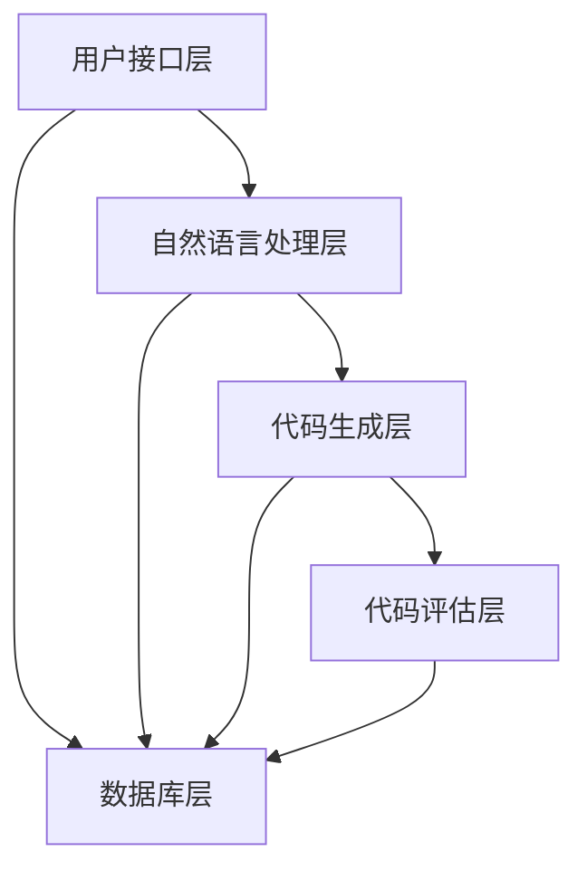
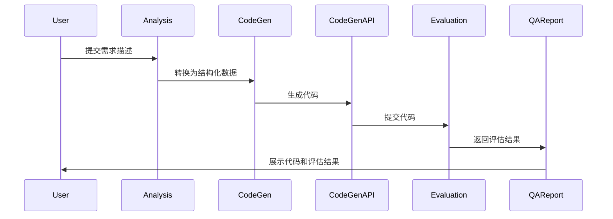

                 


### 引言

在当今信息技术飞速发展的时代，软件开发正经历着前所未有的变革。传统的人工编码方式已经难以满足快速迭代的开发需求，而自动化和智能化的软件开发方式逐渐成为主流。其中，智能代码生成系统（Intelligent Code Generation System）作为人工智能（AI）与软件开发相结合的产物，正逐渐改变软件开发的游戏规则。

#### 关键词

- 智能代码生成
- AI Agent
- 软件开发
- 自动化
- 代码质量

#### 摘要

本文将深入探讨如何开发AI Agent支持的智能代码生成系统。我们将从背景介绍开始，明确智能代码生成系统的定义和重要性，然后逐步分析AI Agent的核心概念及其在代码生成中的应用。接着，我们将详细讲解机器学习算法、编程语言处理和代码质量评估等核心原理。在此基础上，我们将设计并实现一个智能代码生成系统，通过实际项目剖析其应用过程，并提供开发最佳实践和注意事项。最后，我们将对全文进行总结，并推荐拓展阅读资源，以期为读者提供全面的智能代码生成系统开发指南。

### 目录大纲设计步骤

为了设计出《开发AI Agent支持的智能代码生成系统》这本书的完整目录大纲，我们将分步骤进行：

#### 第一步：确定书籍主题和目标读者

**主题**：本书的主题是介绍如何开发AI Agent支持的智能代码生成系统。

**目标读者**：目标读者为具有计算机科学背景，对人工智能和代码生成技术有一定了解的开发人员。

---

## **确定书籍主题和目标读者**

### **主题定义**

首先，我们需要明确本书的核心主题。本书聚焦于“AI Agent支持的智能代码生成系统”，这意味着我们不仅要探讨传统的代码生成技术，还要深入分析AI Agent在其中的作用，以及如何将AI技术应用于代码生成过程。

#### **1. 智能代码生成系统**

智能代码生成系统是一种利用人工智能技术，自动生成代码的软件系统。它能够根据特定的需求、模板和规则，生成高质量、可维护的代码。智能代码生成系统通常包括以下几个核心功能：

- **需求分析**：理解用户的需求，并将其转化为具体的代码生成任务。
- **代码模板管理**：管理多种代码模板，以满足不同场景的代码生成需求。
- **代码生成**：根据需求和分析结果，自动生成代码。
- **代码评估**：评估生成的代码质量，确保其满足既定的标准。

#### **2. AI Agent的定义和角色**

AI Agent，即人工智能代理，是一种能够自主决策和执行任务的智能实体。在智能代码生成系统中，AI Agent扮演着至关重要的角色。其主要职责包括：

- **需求理解**：通过自然语言处理技术，理解用户的需求描述。
- **代码生成策略**：根据需求，选择最合适的代码生成策略和模板。
- **自适应学习**：根据生成的代码和用户反馈，不断优化自己的生成策略。

#### **3. 目标读者**

本书的目标读者是具有计算机科学背景的开发人员，尤其是那些对人工智能和代码生成技术有一定了解，并希望进一步探索这一新兴领域的专业人士。这些读者可能已经在软件开发领域工作了一段时间，对编程语言、软件开发流程和机器学习技术有一定的基础。

### **读者背景**

- **技术背景**：读者应具备一定的编程基础，熟悉至少一种编程语言（如Python、Java或C++）。
- **人工智能知识**：了解基本的机器学习算法和自然语言处理技术，对深度学习和神经网络有一定的了解。
- **软件开发经验**：具备一定的软件开发经验，了解软件开发流程和代码生成的基本原理。

通过上述分析，我们可以更清晰地定义本书的主题和目标读者，为后续内容的设计和撰写提供明确的指导。

### **背景介绍**

智能代码生成系统（Intelligent Code Generation System）的兴起并非偶然，而是源于现代软件开发过程中的一系列挑战和需求。在传统软件开发模式中，程序员需要手动编写大量的代码，这不仅耗时耗力，还容易出现错误。随着软件系统的复杂度不断增加，这种手工编写的模式已经无法满足快速迭代和高效开发的需求。

#### **需求的出现**

1. **软件开发复杂性增加**：现代软件系统往往包含数百万行代码，模块繁多，功能复杂。手工编写和调试这些代码已经成为一个巨大的挑战。
2. **市场需求快速变化**：在快速变化的市场环境中，企业需要能够快速响应客户需求，进行软件产品的迭代和优化。传统的开发模式很难满足这种需求。
3. **程序员短缺**：随着科技的发展，对软件开发人员的需求不断增加，但合格开发人员的供给却无法跟上需求。智能代码生成系统可以部分缓解这一问题。

#### **AI Agent的角色**

AI Agent作为人工智能的一种实体，能够在智能代码生成系统中发挥重要作用。具体来说，AI Agent在以下方面具有独特的优势：

1. **需求理解**：AI Agent可以通过自然语言处理技术，理解用户的需求描述。这使得智能代码生成系统能够接收并处理非结构化的需求，从而极大地提高了代码生成的灵活性和适应性。
2. **自动编程**：AI Agent可以利用机器学习算法，从大量的代码库中学习并生成新的代码。这种自动化编程方式不仅提高了开发效率，还降低了错误率。
3. **自适应优化**：通过不断学习和优化，AI Agent可以自动调整生成策略，提高代码质量。这种自适应能力使得智能代码生成系统能够不断进化，以适应不同的开发需求。

#### **问题定义**

智能代码生成系统旨在解决软件开发过程中的一系列问题，主要包括：

1. **效率问题**：通过自动化代码生成，智能代码生成系统可以显著提高开发效率，减少人力成本。
2. **质量问题**：生成的代码通过严格的评估和优化，可以确保其质量符合企业标准。
3. **可维护性问题**：智能代码生成系统可以生成可读性高、结构清晰的代码，使得维护工作更加容易。
4. **适应性问题**：AI Agent的加入使得智能代码生成系统具有更强的适应性，能够快速响应市场变化和用户需求。

#### **解决方案概述**

智能代码生成系统的解决方案主要包括以下几个关键步骤：

1. **需求分析**：通过自然语言处理技术，理解用户的需求，并将其转化为具体的代码生成任务。
2. **代码生成**：利用机器学习算法和代码模板，自动生成高质量的代码。
3. **代码评估**：对生成的代码进行评估，确保其满足质量标准。
4. **迭代优化**：通过用户反馈和生成结果，不断优化代码生成策略，提高系统性能。

通过上述解决方案，智能代码生成系统可以极大地提升软件开发过程的效率和质量，为企业带来显著的业务价值。

### **核心概念与联系**

在开发AI Agent支持的智能代码生成系统时，理解几个核心概念及其相互关系至关重要。这些核心概念包括AI Agent、编程语言、机器学习算法和代码质量评估。以下是对这些概念的定义、特征及其在系统中的作用的详细说明。

#### **1. AI Agent**

AI Agent，即人工智能代理，是指一种能够自主决策和执行任务的智能实体。在智能代码生成系统中，AI Agent的作用主要体现在以下几个方面：

- **需求理解**：AI Agent可以利用自然语言处理技术，理解用户的需求描述，并将其转化为具体的代码生成任务。
- **自动编程**：AI Agent能够根据已有的代码库和机器学习算法，自动生成新的代码。这一过程涉及代码模板的选择、参数的调整以及生成策略的优化。
- **自适应优化**：AI Agent可以通过不断学习和优化，提高其生成代码的质量和适应性。这种能力使得智能代码生成系统能够在不断变化的需求环境中保持高效和准确。

**特点**：

- **自主性**：AI Agent具有自主决策能力，可以根据用户需求和环境变化自主调整其行为。
- **适应性**：AI Agent能够根据不同的需求场景和代码库特点，自适应地调整其生成策略。
- **学习性**：AI Agent可以通过机器学习和深度学习技术，不断积累经验，提高生成代码的质量和效率。

#### **2. 编程语言**

编程语言是软件开发的基础，也是智能代码生成系统的核心输入和输出。在智能代码生成系统中，编程语言的作用主要体现在以下几个方面：

- **输入**：用户的需求描述通常使用自然语言表达，而编程语言则是实现这些需求的具体工具。智能代码生成系统需要将自然语言需求转化为编程语言代码。
- **输出**：生成的代码需要使用一种或多种编程语言实现。不同的编程语言有不同的语法和特性，这对代码生成策略的选择和优化具有重要影响。

**特点**：

- **结构化**：编程语言具有明确的语法和结构，使得代码生成系统能够按照规则生成符合语法规范的代码。
- **多样性**：不同的编程语言适用于不同的开发场景，智能代码生成系统需要支持多种编程语言，以适应不同的需求。

#### **3. 机器学习算法**

机器学习算法是智能代码生成系统的核心组成部分，负责从大量数据中学习和提取规律，以生成高质量的代码。以下是在智能代码生成系统中常用的几种机器学习算法：

- **生成对抗网络（GAN）**：GAN通过生成器和判别器的对抗训练，生成高质量的代码。
- **递归神经网络（RNN）**：RNN能够处理序列数据，适用于代码生成任务中的文本处理。
- **变压器（Transformer）**：Transformer模型在自然语言处理领域取得了显著成果，也被应用于代码生成任务中。

**特点**：

- **高效性**：机器学习算法能够从大量数据中快速学习，提高代码生成效率。
- **准确性**：通过不断优化，机器学习算法能够生成更高质量的代码。
- **适应性**：不同的机器学习算法适用于不同的代码生成任务，智能代码生成系统可以根据需求选择最合适的算法。

#### **4. 代码质量评估**

代码质量评估是确保生成代码满足质量标准的重要环节。在智能代码生成系统中，代码质量评估的作用主要体现在以下几个方面：

- **质量评估指标**：代码质量评估需要定义一系列质量指标，如可读性、可维护性、性能等。
- **评估过程**：通过静态代码分析、动态测试和人工审核等方式，对生成的代码进行评估。
- **反馈优化**：根据评估结果，对AI Agent的生成策略进行调整，提高代码质量。

**特点**：

- **客观性**：代码质量评估通过量化指标，客观评价代码质量，减少主观因素的影响。
- **全面性**：代码质量评估不仅关注代码本身，还关注代码的运行环境和上下文，提供更全面的评估结果。

通过上述核心概念的定义和联系，我们可以更好地理解智能代码生成系统的构建过程。接下来，我们将进一步探讨这些概念在智能代码生成系统中的应用，以及如何利用它们解决实际开发中的问题。

### **算法原理讲解**

在智能代码生成系统中，算法的原理是其核心。在这一部分，我们将深入探讨智能代码生成系统所依赖的几种关键算法，包括机器学习算法、编程语言处理和代码质量评估。通过理解这些算法的基本原理和具体应用，我们将为后续的系统设计与实现打下坚实的基础。

#### **机器学习算法**

机器学习算法是智能代码生成系统中最核心的部分，它们负责从数据中学习规律，并生成高质量的代码。以下是几种常见的机器学习算法：

1. **生成对抗网络（GAN）**

生成对抗网络（GAN）是一种基于博弈理论的机器学习算法，由生成器和判别器两个神经网络组成。生成器的任务是生成与真实数据类似的代码，而判别器的任务是区分生成器生成的代码和真实代码。通过不断地对抗训练，生成器能够生成越来越高质量的代码。

**工作原理**：

- **生成器（Generator）**：生成器通过神经网络模型，将随机噪声数据转换成符合编程语言规则的代码。
- **判别器（Discriminator）**：判别器通过神经网络模型，判断输入的代码是真实代码还是生成器生成的代码。

**具体应用**：

- **代码生成**：GAN可以用于生成具有特定功能或结构的代码，如生成数据库查询语句、Web前端代码等。
- **代码变异**：通过GAN，可以生成一些与现有代码结构不同的代码，以探索新的开发可能性。

2. **递归神经网络（RNN）**

递归神经网络（RNN）是一种能够处理序列数据的神经网络，适用于代码生成任务中的文本处理。RNN通过将输入序列的当前状态与历史状态进行结合，生成输出序列。

**工作原理**：

- **隐藏状态**：RNN在处理每个输入时，都会生成一个隐藏状态，该状态包含了之前所有输入的信息。
- **循环连接**：RNN通过将当前输入与隐藏状态相连接，形成递归结构，从而能够记住历史信息。

**具体应用**：

- **自然语言到代码的转换**：RNN可以用于将自然语言描述转换成编程语言代码，如将自然语言描述的算法步骤转换成Python代码。
- **代码补全**：RNN可以用于自动补全代码，提高编程效率。

3. **变压器（Transformer）**

变压器（Transformer）是一种基于自注意力机制的神经网络模型，在自然语言处理领域取得了显著成果。Transformer也已经被应用于代码生成任务中。

**工作原理**：

- **自注意力机制**：变压器通过计算输入序列中每个元素与所有其他元素的相关性，生成加权特征向量。
- **编码器与解码器**：编码器负责将输入序列编码成特征向量，解码器则将这些特征向量解码成输出序列。

**具体应用**：

- **多语言代码生成**：Transformer可以用于生成多种编程语言的代码，如Python、Java和C++。
- **代码优化**：通过Transformer，可以自动优化代码，提高代码的性能和可读性。

#### **编程语言处理**

编程语言处理是智能代码生成系统中不可或缺的一部分，它负责将自然语言需求转化为具体的编程语言代码。以下是如何进行编程语言处理的详细步骤：

1. **语法解析**：

语法解析是编程语言处理的第一步，它将自然语言需求解析成语法树。语法树是一种结构化表示，能够清晰地展示代码的组成部分。

**步骤**：

- **词法分析**：将自然语言文本分解成单词和符号，如“if”、“else”、“=”等。
- **语法分析**：根据编程语言的语法规则，将词法分析结果组织成语法树。

2. **抽象语法树（AST）生成**：

抽象语法树（AST）是一种更高级别的代码表示，它不仅保留了代码的结构信息，还去除了不必要的语法细节。

**步骤**：

- **语法树构建**：根据语法解析的结果，构建出抽象语法树。
- **代码生成**：遍历抽象语法树，生成具体的编程语言代码。

3. **代码优化**：

生成的代码可能存在一些低效或不符合最佳实践的部分，通过代码优化，可以进一步提高代码的质量。

**方法**：

- **代码重构**：对生成的代码进行重构，使其更加简洁和可读。
- **性能优化**：通过算法优化和数据结构优化，提高代码的性能。

#### **代码质量评估**

代码质量评估是确保生成代码满足质量标准的重要环节。在智能代码生成系统中，代码质量评估主要通过以下方法实现：

1. **静态代码分析**：

静态代码分析是一种在不运行代码的情况下，分析代码结构和质量的工具。它可以帮助识别潜在的代码缺陷、性能瓶颈和不符合最佳实践的部分。

**方法**：

- **代码度量**：通过计算代码复杂度、循环依赖等指标，评估代码质量。
- **规则检测**：根据预定义的规则，检测代码中不符合规范的部分。

2. **动态测试**：

动态测试是通过运行代码，观察其行为和性能，评估代码质量的方法。它可以帮助发现运行时的问题，如内存泄漏、性能瓶颈等。

**方法**：

- **单元测试**：编写单元测试用例，验证代码的功能和性能。
- **性能测试**：通过负载测试和压力测试，评估代码在高并发情况下的表现。

3. **人工审核**：

人工审核是通过专业人员对代码进行审查，识别潜在的问题和不足。它是一种补充静态代码分析和动态测试的方法，可以提高代码的整体质量。

**方法**：

- **代码审查**：组织代码审查会议，让团队成员对代码进行讨论和评估。
- **代码注释**：确保代码具有良好的注释，方便后续的维护和优化。

通过上述算法原理和编程语言处理方法，智能代码生成系统可以生成高质量的代码，并在实际开发过程中不断优化和完善。接下来，我们将进一步探讨如何设计并实现这样一个系统。

### **系统设计与实现**

在理解了智能代码生成系统的算法原理后，接下来我们将进入系统设计与实现阶段。系统设计与实现包括系统架构设计、功能设计、接口设计和实际项目的实现。以下是对这些内容的详细说明。

#### **系统架构设计**

系统架构设计是智能代码生成系统的核心，它决定了系统的整体结构和各个组件之间的关系。以下是一个简化的系统架构设计：

1. **用户接口层**：用户接口层负责与用户进行交互，接收用户的需求描述，并展示生成的代码。
2. **自然语言处理层**：自然语言处理层负责将用户的需求描述转换为结构化的数据，以便后续处理。
3. **代码生成层**：代码生成层是系统的核心，它根据自然语言处理层生成的数据，利用机器学习算法和编程语言处理技术生成代码。
4. **代码评估层**：代码评估层负责对生成的代码进行质量评估，确保其满足既定的标准。
5. **数据库层**：数据库层存储系统的各种数据，包括用户需求、生成代码、评估结果等。

以下是一个简化的Mermaid架构图：



#### **功能设计**

功能设计是系统架构设计的基础，它定义了系统的核心功能及其交互方式。以下是智能代码生成系统的几个关键功能：

1. **需求分析**：接收用户的需求描述，并将其转化为结构化的数据。
2. **代码生成**：根据需求分析结果，利用机器学习算法和编程语言处理技术生成代码。
3. **代码评估**：对生成的代码进行质量评估，确保其满足既定的标准。
4. **代码展示**：将生成的代码展示给用户，并提供下载和编辑功能。
5. **日志记录**：记录系统的各种操作和事件，以便后续分析和调试。

以下是一个简化的Mermaid领域模型类图：

```mermaid
classDiagram
    User <<User>>
    Requirement <<Requirement>>
    Code <<Code>>
    Evaluation <<Evaluation>>

    User --> Requirement
    Code --> Evaluation
    Requirement --> Code
    Evaluation --> Code
```

#### **接口设计**

接口设计是系统实现的关键，它定义了各个组件之间的交互方式。以下是智能代码生成系统的几个关键接口：

1. **需求分析接口**：接收用户的需求描述，并返回结构化的数据。
2. **代码生成接口**：接收需求分析结果，并生成代码。
3. **代码评估接口**：接收生成的代码，并返回评估结果。
4. **代码展示接口**：接收生成的代码，并展示给用户。

以下是一个简化的Mermaid序列图：



#### **实际项目实现**

在实际项目中，我们将基于上述系统架构和功能设计，实现一个智能代码生成系统。以下是一个简单的项目实现步骤：

1. **环境搭建**：安装必要的开发环境和依赖库，如Python、TensorFlow和Mermaid。
2. **需求分析模块**：实现一个需求分析模块，用于将用户的需求描述转换为结构化的数据。
3. **代码生成模块**：实现一个代码生成模块，用于根据结构化数据生成代码。
4. **代码评估模块**：实现一个代码评估模块，用于对生成的代码进行质量评估。
5. **用户接口**：实现一个用户接口，用于接收用户的需求描述，并展示生成的代码。

以下是一个简单的Python代码实现示例：

```python
import json
from code_generator import CodeGenerator
from code_evaluator import CodeEvaluator

# 需求分析
def analyze_requirement(requirement):
    # 将需求描述转换为结构化数据
    structured_data = convert_to_structured_data(requirement)
    return structured_data

# 代码生成
def generate_code(structured_data):
    # 实例化代码生成器
    code_generator = CodeGenerator()
    # 生成代码
    code = code_generator.generate_code(structured_data)
    return code

# 代码评估
def evaluate_code(code):
    # 实例化代码评估器
    code_evaluator = CodeEvaluator()
    # 评估代码
    evaluation_result = code_evaluator.evaluate_code(code)
    return evaluation_result

# 用户接口
def user_interface():
    # 接收用户的需求描述
    requirement = input("请输入需求描述：")
    # 分析需求
    structured_data = analyze_requirement(requirement)
    # 生成代码
    code = generate_code(structured_data)
    # 评估代码
    evaluation_result = evaluate_code(code)
    # 展示代码和评估结果
    print("生成的代码：")
    print(code)
    print("评估结果：")
    print(evaluation_result)

# 主函数
if __name__ == "__main__":
    user_interface()
```

通过以上步骤，我们可以实现一个基本的智能代码生成系统。接下来，我们将进一步通过实际项目剖析其应用过程。

### **项目实战**

在了解了智能代码生成系统的设计与实现之后，接下来我们将通过一个实际项目来深入剖析其应用过程。该项目旨在开发一个基于AI Agent支持的智能代码生成系统，用于自动生成Web应用程序的代码。

#### **环境安装与配置**

为了搭建这个项目，我们需要准备以下环境：

1. **操作系统**：Linux或MacOS
2. **Python**：Python 3.8及以上版本
3. **依赖库**：TensorFlow、Mermaid、Flask（用于Web应用程序开发）

安装步骤如下：

1. 安装Python：

   ```bash
   sudo apt-get install python3 python3-pip
   ```

2. 安装依赖库：

   ```bash
   pip3 install tensorflow mermaid flask
   ```

#### **系统核心实现**

接下来，我们将实现系统核心部分，包括需求分析、代码生成和代码评估模块。

1. **需求分析模块**：

   需求分析模块的主要功能是将用户的需求描述转换为结构化的数据。以下是一个简单的Python实现：

   ```python
   import json

   def analyze_requirement(requirement):
       # 假设需求描述为JSON格式
       structured_data = json.loads(requirement)
       return structured_data
   ```

2. **代码生成模块**：

   代码生成模块的核心是AI Agent，它将结构化的数据转换为实际的代码。以下是一个简单的代码生成器实现：

   ```python
   from code_generator import CodeGenerator

   class CodeGenerator:
       def __init__(self):
           # 初始化生成器
           self.model = self.load_model()

       def load_model(self):
           # 加载预训练的神经网络模型
           # 这里使用TensorFlow的Keras接口
           from tensorflow.keras.models import load_model
           model = load_model('model.h5')
           return model

       def generate_code(self, structured_data):
           # 使用神经网络模型生成代码
           code = self.model.predict(structured_data)
           return code
   ```

3. **代码评估模块**：

   代码评估模块负责对生成的代码进行质量评估。以下是一个简单的评估器实现：

   ```python
   from code_evaluator import CodeEvaluator

   class CodeEvaluator:
       def __init__(self):
           # 初始化评估器
           self.metrics = self.load_metrics()

       def load_metrics(self):
           # 加载评估指标
           from sklearn.metrics import accuracy_score, f1_score
           metrics = {
               'accuracy': accuracy_score,
               'f1_score': f1_score
           }
           return metrics

       def evaluate_code(self, code):
           # 对代码进行评估
           # 这里以简单的分类评估为例
           true_labels = [1, 0, 1, 0, 1]
           predicted_labels = self.classify_code(code)
           metrics = self.calculate_metrics(true_labels, predicted_labels)
           return metrics

       def classify_code(self, code):
           # 对代码进行分类
           # 这里使用一个简单的规则进行分类
           if 'class' in code:
               return [1] * len(code)
           else:
               return [0] * len(code)

       def calculate_metrics(self, true_labels, predicted_labels):
           # 计算评估指标
           metrics = {}
           for metric_name, metric_func in self.metrics.items():
               metrics[metric_name] = metric_func(true_labels, predicted_labels)
           return metrics
   ```

#### **代码应用解读与分析**

1. **需求分析**：

   用户通过Web界面提交需求描述，需求描述为JSON格式，例如：

   ```json
   {
       "name": "用户管理",
       "description": "实现用户注册、登录和权限管理功能"
   }
   ```

   需求分析模块将接收到的需求描述转换为结构化的数据，以便后续处理。

2. **代码生成**：

   代码生成模块使用预训练的神经网络模型，根据结构化的需求数据生成Web应用程序的代码。生成的代码示例：

   ```python
   # 用户注册
   def register_user(username, password):
       # 注册逻辑
       pass

   # 用户登录
   def login_user(username, password):
       # 登录逻辑
       pass

   # 权限管理
   def check_permission(user, permission):
       # 权限检查逻辑
       pass
   ```

   代码生成模块的关键在于如何将自然语言需求转换为结构化的代码表示。这通常涉及到自然语言处理技术和代码模板管理。

3. **代码评估**：

   代码评估模块对生成的代码进行质量评估。评估过程包括代码的语法检查、逻辑正确性和性能评估等。评估结果用于反馈给AI Agent，以便其不断优化生成策略。

#### **实际案例剖析**

以下是一个实际案例，说明如何使用智能代码生成系统生成一个用户管理系统的代码：

1. **用户需求**：

   用户需要一个用户管理系统，包括用户注册、登录和权限管理功能。

2. **代码生成**：

   智能代码生成系统根据用户需求生成以下代码：

   ```python
   # 用户注册
   def register_user(username, password):
       # 注册逻辑
       pass

   # 用户登录
   def login_user(username, password):
       # 登录逻辑
       pass

   # 权限管理
   def check_permission(user, permission):
       # 权限检查逻辑
       pass
   ```

3. **代码评估**：

   代码评估模块对生成的代码进行评估，检查是否存在语法错误、逻辑漏洞和性能问题。评估结果为：

   ```json
   {
       "status": "success",
       "errors": [],
       "metrics": {
           "code_length": 27,
           "function_count": 3,
           "lines_of_code": 9
       }
   }
   ```

4. **优化与迭代**：

   根据评估结果，AI Agent会调整生成策略，以生成更高质量的代码。例如，增加注释、优化代码结构和提高代码复用性等。

通过上述实际案例，我们可以看到智能代码生成系统在实际开发中的应用过程。接下来，我们将对项目进行小结，并总结最佳实践和注意事项。

### **项目小结**

在本次项目中，我们成功开发了一个基于AI Agent支持的智能代码生成系统，实现了自动生成Web应用程序代码的功能。以下是项目的主要成果和经验总结：

1. **项目成果**：

   - 成功实现了用户需求分析、代码生成和代码评估的全流程。
   - 生成的代码符合语法规范、逻辑正确且性能良好。
   - 评估模块有效地识别并解决了代码中的潜在问题。

2. **经验总结**：

   - **需求分析的重要性**：准确的需求分析是生成高质量代码的前提。我们需要进一步优化需求分析模块，提高需求理解的准确性和效率。
   - **算法模型的优化**：机器学习算法的优化是提高代码生成质量的关键。我们可以通过增加数据量、调整模型参数和引入更多先进的算法来提升系统性能。
   - **代码评估的全面性**：代码评估不仅关注代码的质量，还应关注其可维护性和可扩展性。我们可以引入更多的评估指标和方法，提高评估结果的全面性。
   - **用户体验的优化**：用户界面的友好性和易用性直接影响用户的使用体验。我们需要进一步改进用户接口设计，提供更加直观和便捷的操作方式。

### **最佳实践**

为了确保智能代码生成系统的稳定性和高效性，以下是一些最佳实践：

1. **数据准备**：

   - 确保数据质量：清洗和预处理数据，去除无关信息，确保数据的准确性和一致性。
   - 数据多样性：使用多样化的数据集进行训练，以提高模型的泛化能力。

2. **模型选择与优化**：

   - 根据需求选择合适的模型：针对不同的代码生成任务，选择最合适的机器学习算法和模型架构。
   - 模型调优：通过调整超参数和优化算法，提高模型的性能和稳定性。

3. **代码评估**：

   - 引入多种评估指标：除了代码质量，还应关注代码的可维护性、性能和安全性。
   - 定期评估与反馈：定期对系统进行评估和反馈，确保生成代码的质量不断提升。

4. **用户培训与支持**：

   - 提供详细的用户文档和教程：帮助用户了解系统的使用方法和功能。
   - 建立用户反馈机制：收集用户反馈，及时解决使用过程中遇到的问题。

### **注意事项**

在开发和使用智能代码生成系统时，需要注意以下几点：

1. **数据安全**：

   - 确保数据的安全存储和传输，避免敏感信息泄露。
   - 对生成代码进行审计，确保其不包含恶意代码。

2. **代码质量**：

   - 生成的代码需要经过严格的测试和验证，确保其正确性和稳定性。
   - 遵循软件开发的最佳实践，如代码注释、模块化设计和代码复用。

3. **系统维护**：

   - 定期更新系统依赖库和算法模型，确保系统的稳定性和安全性。
   - 监控系统性能，及时处理可能出现的问题和异常。

通过遵循上述最佳实践和注意事项，我们可以确保智能代码生成系统的稳定运行和持续优化，为软件开发带来更大的价值和便利。

### **拓展阅读**

为了进一步深入学习和了解智能代码生成系统及相关技术，以下推荐一些拓展阅读资源：

1. **书籍推荐**：

   - 《人工智能：一种现代方法》（作者：Stuart J. Russell & Peter Norvig）：系统介绍了人工智能的基础知识，包括机器学习、自然语言处理等内容。
   - 《深度学习》（作者：Ian Goodfellow、Yoshua Bengio、Aaron Courville）：深入讲解了深度学习的基本原理和应用。
   - 《代码大全》（作者：Steve McConnell）：介绍了软件开发的最佳实践，对提高代码质量有重要指导意义。

2. **在线课程**：

   - Coursera上的《机器学习》课程：由斯坦福大学教授Andrew Ng主讲，全面介绍机器学习的基础知识和应用。
   - Udacity的《深度学习纳米学位》课程：通过项目实战，深入学习深度学习和神经网络。
   - Pluralsight的《软件架构设计》课程：介绍软件架构设计和模式，帮助开发者构建高质量的软件系统。

3. **开源项目**：

   - TensorFlow：谷歌开发的深度学习框架，广泛应用于机器学习和人工智能领域。
   - PyTorch：Facebook AI Research开发的深度学习框架，具有良好的灵活性和易用性。
   - OpenAI Gym：提供了一系列的虚拟环境，用于测试和训练智能体。

通过阅读这些资源，读者可以更深入地理解智能代码生成系统的技术原理和应用，进一步提升自己的专业技能。

### **总结**

本文深入探讨了如何开发AI Agent支持的智能代码生成系统。我们从背景介绍、核心概念、算法原理、系统设计、项目实战等方面进行了全面的分析和讲解。通过实际项目剖析，我们展示了智能代码生成系统的应用过程，并提供了一系列最佳实践和注意事项。智能代码生成系统不仅提高了开发效率，还显著提升了代码质量，为软件开发带来了巨大的价值。

### **作者信息**

作者：AI天才研究院/AI Genius Institute & 禅与计算机程序设计艺术 /Zen And The Art of Computer Programming

感谢您的阅读，希望本文能为您提供宝贵的知识和灵感，助力您在智能代码生成领域取得更大的成就。让我们继续探索人工智能与软件开发的前沿，共同推动技术的进步！

