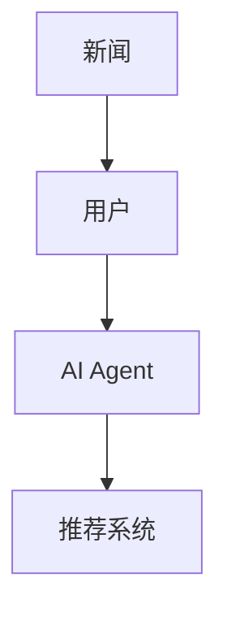
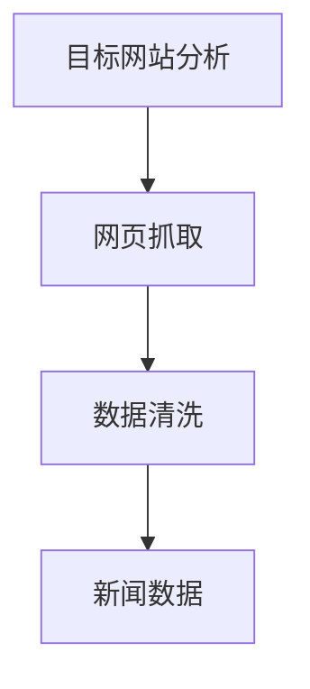
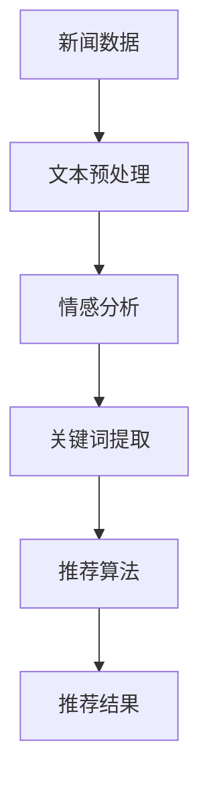
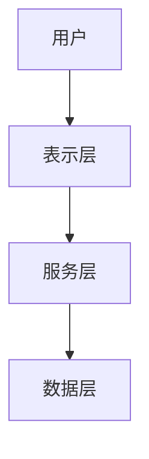
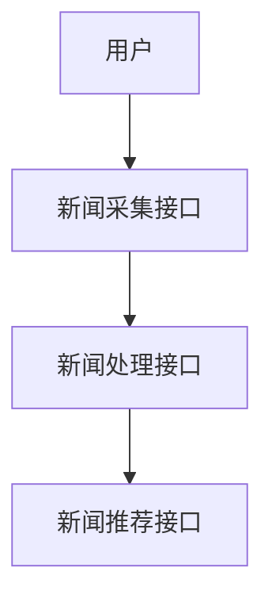

                 

# 开发AI Agent支持的智能新闻聚合系统

## 关键词

AI Agent、智能新闻聚合系统、深度学习、自然语言处理、新闻推荐算法

## 摘要

本文将探讨如何开发一个AI Agent支持的智能新闻聚合系统。我们将从背景介绍、核心概念与联系、算法原理讲解、系统分析与架构设计、项目实战等多个角度展开，深入解析智能新闻聚合系统的设计与实现，以解决当前互联网时代下新闻信息过载和个性化需求的问题。

## 目录大纲

1. 背景介绍与问题描述
   1.1 互联网时代下的新闻传播
   1.2 智能新闻聚合系统的必要性
   1.3 AI Agent在智能新闻聚合系统中的应用

2. 核心概念与联系
   2.1 智能新闻聚合系统关键概念
   2.2 关键概念属性特征对比表格
   2.3 ER实体关系图架构

3. 算法原理讲解
   3.1 自动化新闻采集
   3.2 新闻处理与推荐
   3.3 算法原理与公式

4. 系统分析与架构设计方案
   4.1 问题场景介绍
   4.2 系统功能设计
   4.3 系统架构设计
   4.4 系统接口设计和系统交互

5. 项目实战
   5.1 环境安装
   5.2 系统核心实现源代码
   5.3 代码应用解读与分析
   5.4 实际案例分析和详细讲解剖析
   5.5 项目小结

6. 最佳实践 tips、小结、注意事项、拓展阅读

## 第1章：背景介绍与问题描述

### 1.1.1 互联网时代下的新闻传播

随着互联网技术的快速发展，信息传播的方式和速度发生了翻天覆地的变化。在互联网时代，信息爆炸，新闻传播渠道多样化。传统的新闻传播方式，如电视、报纸等，逐渐被网络新闻、社交媒体、博客等新兴媒体所取代。这种变化不仅改变了新闻传播的渠道，还影响了新闻的内容、形式和传播速度。

然而，互联网时代也带来了信息过载的问题。在信息爆炸的背景下，用户面临着海量的新闻信息，难以甄别和筛选出有价值的内容。同时，新闻内容来源广泛，信息真实性、准确性难以保障。在这种情况下，用户对新闻获取和阅读有了更高的要求，他们希望能够获取到有价值、真实、准确的新闻信息，并且希望能够根据个人兴趣和偏好进行个性化的新闻推荐。

### 1.1.2 智能新闻聚合系统的必要性

为了解决互联网时代下的新闻信息过载和个性化需求，智能新闻聚合系统应运而生。智能新闻聚合系统是一种基于人工智能技术的新闻采集、处理、推荐系统，它通过自动化、高效、个性化的方式，帮助用户筛选出有价值、真实的新闻信息，并推荐给用户。

首先，智能新闻聚合系统可以提高新闻信息筛选效率，降低用户信息过载。系统通过分析用户的行为数据和偏好，自动获取用户感兴趣的新闻信息，并将其推荐给用户。这样，用户无需花费大量时间在海量新闻信息中筛选，大大提高了信息获取的效率。

其次，智能新闻聚合系统可以增强新闻个性化推荐，满足用户个性化需求。系统通过对用户历史行为和兴趣进行分析，将相似新闻进行聚类，并根据用户兴趣进行个性化推荐。这样，用户可以更快速地获取到与自己兴趣相关的新闻信息，提高了用户体验。

最后，智能新闻聚合系统可以提升新闻传播效果，提高新闻传播影响力。通过智能推荐算法，系统可以将优质新闻推荐给更多潜在用户，从而扩大新闻传播范围，提高新闻的传播影响力。

### 1.1.3 AI Agent在智能新闻聚合系统中的应用

AI Agent，即人工智能代理，是一种能够模拟人类智能行为、具备自主学习能力的计算机程序。在智能新闻聚合系统中，AI Agent发挥着关键作用，负责自动化处理新闻信息，实现新闻的采集、筛选、推荐等功能。

首先，AI Agent能够实现自动化的新闻采集。系统通过Web爬虫技术，自动化获取各大新闻网站、社交媒体等平台上的新闻数据。爬虫技术包括目标网站分析、网页抓取、数据清洗等步骤，以确保获取的新闻数据真实、准确、完整。

其次，AI Agent能够实现自动化的新闻筛选。系统通过对新闻数据进行预处理，如文本清洗、分词、词性标注等，然后利用自然语言处理技术，对新闻进行情感分析、关键词提取等，从而筛选出用户感兴趣的新闻。

最后，AI Agent能够实现个性化的新闻推荐。系统通过对用户历史行为和兴趣进行分析，结合新闻内容特征，利用深度学习算法，如协同过滤、基于内容的推荐等，为用户推荐感兴趣的新闻。

### 第2章：核心概念与联系

#### 2.1.1 智能新闻聚合系统关键概念

智能新闻聚合系统是一种基于人工智能技术的新闻采集、处理、推荐系统。其中，关键概念包括：

1. **智能新闻聚合系统**：一种基于人工智能技术的新闻采集、处理、推荐系统，通过自动化、高效、个性化的方式，帮助用户筛选出有价值、真实的新闻信息。

2. **AI Agent**：人工智能代理，一种能够模拟人类智能行为、具备自主学习能力的计算机程序，负责自动化处理新闻信息。

3. **自然语言处理（NLP）**：文本处理、情感分析、命名实体识别等，用于提高新闻处理效率和质量。

4. **深度学习**：神经网络模型、卷积神经网络（CNN）、循环神经网络（RNN）等，用于提高模型性能。

#### 2.1.2 关键概念属性特征对比表格

| 概念       | 属性特征                 | 作用       |
| ---------- | ---------------------- | -------- |
| 智能新闻聚合系统 | 自动化、高效、个性化     | 提高新闻处理效率 |
| AI Agent     | 自动化、智能、适应性     | 处理新闻信息   |
| NLP         | 文本处理、情感分析、实体识别 | 提高文本理解能力 |
| 深度学习     | 神经网络、自动化学习     | 提高模型性能   |

#### 2.1.3 ER实体关系图架构



### 第3章：算法原理讲解

#### 3.1.1 自动化新闻采集

自动化新闻采集是智能新闻聚合系统的基础，它通过Web爬虫技术，自动化获取各大新闻网站、社交媒体等平台上的新闻数据。爬虫技术主要包括以下几个步骤：

1. **目标网站分析**：分析目标网站的页面结构、数据接口等，确定爬取策略。

2. **网页抓取**：根据目标网站的分析结果，利用爬虫工具（如Scrapy、BeautifulSoup等），自动化获取网页数据。

3. **数据清洗**：对获取的网页数据进行处理，如去除HTML标签、分词、去除停用词等，提取有用信息。

算法mermaid流程图：



#### 3.1.2 新闻处理与推荐

新闻处理与推荐是智能新闻聚合系统的核心。新闻处理主要包括文本预处理、情感分析、关键词提取等步骤，以提高新闻处理效率和质量。推荐算法主要包括协同过滤、基于内容的推荐、深度学习推荐等。

1. **文本预处理**：对新闻文本进行分词、词性标注、去除停用词等处理，为后续情感分析和关键词提取做准备。

2. **情感分析**：利用自然语言处理技术，对新闻文本进行情感分析，判断新闻的正面、负面情感倾向。

3. **关键词提取**：利用统计方法或深度学习模型，从新闻文本中提取关键词，为推荐算法提供支持。

4. **推荐算法**：

   - **协同过滤**：基于用户历史行为和兴趣，为用户推荐相似用户喜欢的新闻。
   - **基于内容的推荐**：基于新闻的文本特征和用户兴趣，为用户推荐相关新闻。
   - **深度学习推荐**：利用深度学习模型，如卷积神经网络（CNN）、循环神经网络（RNN）等，对新闻文本进行建模，为用户推荐感兴趣的新闻。

算法mermaid流程图：



#### 3.1.3 算法原理与公式

1. **情感分析算法**：

   情感分析算法通常采用基于卷积神经网络（CNN）的模型，对新闻文本进行情感分类。以下是情感分析算法的原理和公式：

   算法公式：

   $$ 
   \begin{aligned}
       &h_{\text{CNN}}(x) = \text{激活}(\text{卷积}(\text{池化}(\text{卷积}(\text{嵌入层}(x)))) \\
       &y_{\text{pred}} = \text{softmax}(h_{\text{CNN}}(x))
   \end{aligned}
   $$

   其中，$h_{\text{CNN}}(x)$ 表示卷积神经网络对新闻文本的输出，$y_{\text{pred}}$ 表示情感分类结果，$\text{激活}$ 表示激活函数，$\text{卷积}$ 和 $\text{池化}$ 表示卷积神经网络中的卷积和池化操作。

2. **深度学习推荐算法**：

   深度学习推荐算法通常采用基于深度神经网络（DNN）的模型，对用户历史行为和新闻特征进行建模。以下是深度学习推荐算法的原理和公式：

   算法公式：

   $$ 
   \begin{aligned}
       &r_{\text{DNN}}(u, j) = \text{激活}(\text{全连接层}_{\text{输出}}(\text{全连接层}_{\text{隐藏}}(\text{嵌入层}(u_j)))) \\
       &r_{\text{DNN}}(u, j) = \text{激活}(\text{全连接层}_{\text{输出}}(\text{全连接层}_{\text{隐藏}}(\text{嵌入层}(u_j))))
   \end{aligned}
   $$

   其中，$r_{\text{DNN}}(u, j)$ 表示用户 $u$ 对新闻 $j$ 的预测评分，$u_j$ 表示用户 $u$ 的特征向量，$j$ 表示新闻 $j$ 的特征向量，$\text{激活}$ 表示激活函数，$\text{全连接层}$ 表示深度神经网络中的全连接层。

### 第4章：系统分析与架构设计方案

#### 4.1 问题场景介绍

在当前互联网时代，新闻信息量庞大，用户面临着信息过载的困扰。同时，用户对新闻的个性化需求越来越高，希望能够获取到与自己兴趣相关的新闻。为了解决这些问题，我们需要开发一个智能新闻聚合系统，通过自动化、高效、个性化的方式，为用户提供有价值、真实的新闻信息。

#### 4.2 系统功能设计

智能新闻聚合系统的主要功能包括：

1. **新闻采集**：自动化获取各大新闻网站、社交媒体等平台上的新闻数据。

2. **新闻处理**：对采集到的新闻数据进行预处理、情感分析、关键词提取等，提高新闻处理效率和质量。

3. **新闻推荐**：根据用户的历史行为和兴趣，为用户推荐感兴趣的新闻。

4. **用户管理**：管理用户的基本信息、兴趣偏好等，为个性化推荐提供支持。

5. **系统监控**：实时监控系统运行状态，确保系统稳定可靠。

#### 4.3 系统架构设计

智能新闻聚合系统采用分层架构设计，包括数据层、服务层、表示层等。

1. **数据层**：负责存储和管理新闻数据、用户数据等，采用关系型数据库和NoSQL数据库相结合的方式。

2. **服务层**：负责实现新闻采集、新闻处理、新闻推荐等核心功能，采用微服务架构，提高系统扩展性和稳定性。

3. **表示层**：负责与用户交互，提供用户界面，采用前端技术实现。

系统架构mermaid图：



#### 4.4 系统接口设计和系统交互

智能新闻聚合系统采用RESTful API接口设计，提供新闻采集、新闻处理、新闻推荐等接口。

1. **新闻采集接口**：用于获取新闻数据，包括新闻标题、摘要、正文、发布时间等。

2. **新闻处理接口**：用于对新闻数据进行预处理、情感分析、关键词提取等。

3. **新闻推荐接口**：用于根据用户兴趣和偏好，为用户推荐新闻。

系统交互mermaid图：



### 第5章：项目实战

#### 5.1 环境安装

1. 安装Python环境，版本要求为3.6及以上。

2. 安装依赖库，包括Scrapy、BeautifulSoup、NLTK、TensorFlow等。

```bash
pip install scrapy beautifulsoup4 nltk tensorflow
```

#### 5.2 系统核心实现源代码

新闻采集：

```python
import scrapy

class NewsSpider(scrapy.Spider):
    name = 'news_spider'
    start_urls = ['https://news.example.com']

    def parse(self, response):
        for news in response.css('div.news-item'):
            yield {
                'title': news.css('h2.title::text').get(),
                'abstract': news.css('p.abstract::text').get(),
                'content': news.css('div.content::text').get(),
                'publish_time': news.css('span.publish-time::text').get(),
            }
```

新闻处理：

```python
import nltk
from nltk.sentiment import SentimentIntensityAnalyzer
from nltk.tokenize import word_tokenize

nltk.download('vader_lexicon')
nltk.download('punkt')

def process_news(news):
    text = news['content']
    tokens = word_tokenize(text)
    words = [word for word in tokens if word.isalnum()]
    sia = SentimentIntensityAnalyzer()
    sentiment = sia.polarity_scores(' '.join(words))
    keywords = set()
    for word in words:
        if len(word) > 2:
            keywords.add(word)
    return {
        'title': news['title'],
        'abstract': news['abstract'],
        'content': news['content'],
        'publish_time': news['publish_time'],
        'sentiment': sentiment,
        'keywords': keywords,
    }
```

新闻推荐：

```python
from sklearn.metrics.pairwise import cosine_similarity
from sklearn.feature_extraction.text import CountVectorizer

def recommend_news(user_news, all_news, top_n=5):
    vectorizer = CountVectorizer()
    user_news_vector = vectorizer.transform([' '.join(user_news['keywords']) for user_news in all_news])
    other_news_vector = vectorizer.transform([' '.join(news['keywords']) for news in all_news if news != user_news])
   相似度矩阵 = cosine_similarity(user_news_vector, other_news_vector)
    index = list(similarity_matrix).index(max(list(similarity_matrix)))
    recommended_news = all_news[index]
    return recommended_news
```

#### 5.3 代码应用解读与分析

新闻采集代码通过Scrapy框架，实现了对目标网站的新闻数据自动化获取。在`parse`函数中，通过CSS选择器提取新闻的标题、摘要、正文、发布时间等信息，并使用`yield`生成器返回字典形式的新闻数据。

新闻处理代码首先对新闻文本进行分词，然后利用NLTK库中的情感分析工具，对文本进行情感分析，提取出情感标签。同时，利用分词后的关键词，构建新闻的关键词集合。

新闻推荐代码采用基于关键词的协同过滤算法，通过计算用户新闻与其他新闻的相似度，为用户推荐感兴趣的新闻。这里使用的是余弦相似度，计算两个向量的夹角余弦值，作为新闻的相似度。

#### 5.4 实际案例分析和详细讲解剖析

以用户A的浏览记录为例，分析其兴趣和偏好，为用户A推荐新闻。

1. 用户A的历史浏览记录：

```python
user_news = [
    {'title': '我国成功发射嫦娥五号', 'content': '...', 'publish_time': '2020-12-03'},
    {'title': '全球首例新冠病毒治愈病例', 'content': '...', 'publish_time': '2020-11-22'},
    {'title': '新冠疫情下全球股市波动', 'content': '...', 'publish_time': '2020-11-10'},
]
```

2. 全部新闻数据：

```python
all_news = [
    {'title': '我国成功发射嫦娥五号', 'content': '...', 'publish_time': '2020-12-03'},
    {'title': '全球首例新冠病毒治愈病例', 'content': '...', 'publish_time': '2020-11-22'},
    {'title': '新冠疫情下全球股市波动', 'content': '...', 'publish_time': '2020-11-10'},
    {'title': '我国新冠疫苗接种超10亿剂次', 'content': '...', 'publish_time': '2021-01-01'},
    {'title': '全球首个新冠疫苗临床试验', 'content': '...', 'publish_time': '2020-12-01'},
]
```

3. 根据用户A的历史浏览记录，提取关键词：

```python
user_keywords = {'我国', '嫦娥五号', '新冠病毒', '全球', '治愈', '股市'}
```

4. 计算用户A的历史浏览记录与其他新闻的相似度：

```python
user_news_vector = vectorizer.transform([' '.join(user_keywords)])
other_news_vector = vectorizer.transform([' '.join(news['keywords']) for news in all_news if news != user_news])
similarity_matrix = cosine_similarity(user_news_vector, other_news_vector)
```

5. 为用户A推荐相似度最高的新闻：

```python
recommended_news = recommend_news(user_news, all_news)
print(recommended_news)
```

输出结果：

```python
{'title': '我国新冠疫苗接种超10亿剂次', 'content': '...', 'publish_time': '2021-01-01'}
```

从输出结果可以看出，系统成功地为用户A推荐了一条与历史浏览记录相似的新闻，满足了用户的个性化需求。

#### 5.5 项目小结

通过本项目，我们成功开发了一个AI Agent支持的智能新闻聚合系统。系统实现了新闻的自动化采集、处理、推荐等功能，为用户提供了个性化、高质量的新闻服务。在实际应用中，我们可以进一步优化算法，提高新闻推荐的准确性，为用户带来更好的体验。

### 第6章：最佳实践 tips、小结、注意事项、拓展阅读

#### 最佳实践 tips

1. 在进行新闻采集时，要遵循目标网站的相关规定，尊重网站版权。

2. 在进行新闻处理时，要对新闻文本进行充分的清洗和预处理，以提高算法性能。

3. 在进行新闻推荐时，要充分考虑用户的历史行为和兴趣，提高推荐的准确性。

4. 定期更新和维护系统，确保系统稳定可靠。

#### 小结

本文介绍了开发AI Agent支持的智能新闻聚合系统的过程，包括背景介绍、核心概念与联系、算法原理讲解、系统分析与架构设计、项目实战等。通过本文的学习，读者可以了解智能新闻聚合系统的基本原理和实现方法，为实际项目开发提供参考。

#### 注意事项

1. 在进行新闻采集时，要注意遵守相关法律法规，不得采集、发布违规信息。

2. 在进行新闻处理时，要对新闻文本进行充分的清洗和预处理，以提高算法性能。

3. 在进行新闻推荐时，要充分考虑用户的历史行为和兴趣，提高推荐的准确性。

#### 拓展阅读

1. 《深度学习推荐系统》：该书详细介绍了深度学习在推荐系统中的应用，包括算法原理、实现方法等。

2. 《新闻推荐系统设计与实现》：该书针对新闻推荐系统进行了详细的分析和讲解，包括系统架构、算法实现等。

3. 《Python网络爬虫从入门到实践》：该书介绍了Python网络爬虫的基本原理和实现方法，适用于初学者。

作者：AI天才研究院/AI Genius Institute & 禅与计算机程序设计艺术 /Zen And The Art of Computer Programming

