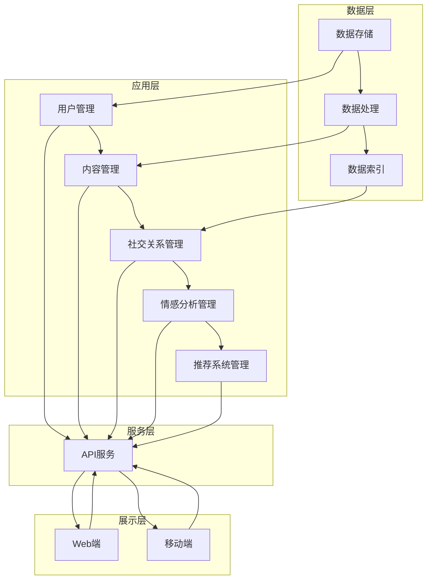
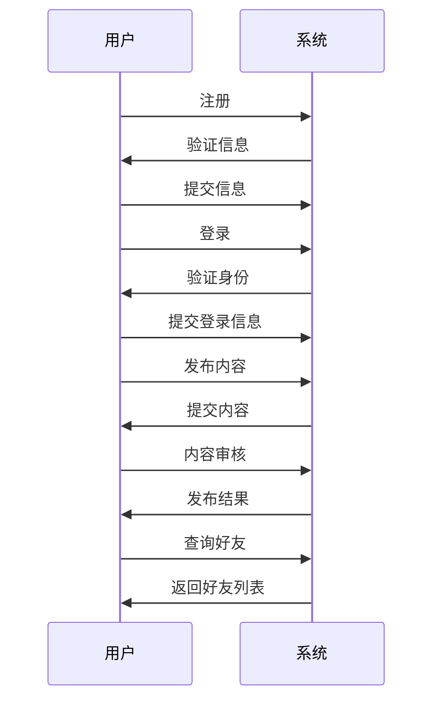

                 

# 开发AI Agent支持的智能社交网络分析系统

## 关键词

- AI Agent
- 智能社交网络分析
- 深度学习
- 生成对抗网络
- 社交网络数据挖掘

## 摘要

本文旨在探讨如何开发一个AI Agent支持的智能社交网络分析系统。通过介绍背景、核心概念、算法原理、系统架构设计、项目实战和最佳实践，本文详细阐述了该系统在用户行为分析、社交关系挖掘、情感分析等方面的应用，为开发高效智能的社交网络分析系统提供了有益的参考。

## 第一部分：背景介绍

### 问题背景

随着互联网和大数据技术的迅猛发展，社交媒体已成为人们日常生活和工作中不可或缺的一部分。这些平台不仅丰富了人们的社交生活，也产生了海量的用户数据。这些数据中蕴含着丰富的社交关系、兴趣爱好、行为习惯等信息，为分析和挖掘用户需求提供了宝贵资源。

### 问题描述

开发AI Agent支持的智能社交网络分析系统旨在利用AI技术和代理技术，对社交网络中的数据进行深入挖掘和分析，从而实现以下几个目标：

1. **用户行为分析**：通过分析用户在社交网络中的行为，了解用户的兴趣、需求和偏好，为用户提供个性化推荐服务。
2. **社交关系挖掘**：通过挖掘用户之间的社交关系，发现潜在的朋友圈、兴趣小组等，帮助用户拓展社交圈层。
3. **安全监控与风险管理**：通过实时监控社交网络中的异常行为和风险因素，为平台提供安全预警和风险管理支持。
4. **情感分析**：通过分析用户发布的内容，了解用户的情绪变化，为用户提供情感支持和心理健康建议。

### 问题解决

要实现上述目标，需要以下几个关键步骤：

1. **数据采集与预处理**：从社交网络平台获取用户数据，并进行清洗、去重、格式化等预处理操作，为后续分析提供高质量的数据支持。
2. **AI Agent设计与实现**：设计并实现具有自主学习和推理能力的AI Agent，使其能够在社交网络中高效地处理和分析数据。
3. **算法与模型应用**：应用深度学习、生成对抗网络等先进算法，对用户行为、社交关系、情感等进行分析和预测。
4. **系统集成与优化**：将AI Agent、算法模型等集成到社交网络分析系统中，并进行系统优化，提高系统的性能和稳定性。

### 边界与外延

- **边界**：本系统主要关注社交网络中的用户行为分析、社交关系挖掘、安全监控与情感分析等方向，不涉及其他领域的AI应用。
- **外延**：本系统可以应用于各类社交网络平台，如微博、微信、Facebook等，也可以扩展到其他领域，如电商平台、健康管理系统等。

### 概念结构与核心要素组成

- **核心概念**：AI Agent、智能社交网络分析、深度学习、生成对抗网络等。
- **核心要素**：
  - 用户数据：包括用户生成内容和社交关系等。
  - AI Agent：具有自主学习和推理能力的智能体。
  - 算法模型：包括深度学习模型、生成对抗网络等。
  - 系统架构：包括数据采集模块、AI Agent模块、算法模型模块、系统集成模块等。

## 第二部分：核心概念与联系

### AI Agent的定义与特点

AI Agent，即人工智能代理，是一种能够模拟人类智能行为的软件实体。AI Agent具备以下特点：

#### 定义

AI Agent是基于人工智能技术的软件实体，能够模拟人类智能行为，通过自主学习、推理和决策来执行特定任务。与一般的程序和算法不同，AI Agent具有以下三个核心特性：

1. **自主性**：AI Agent可以独立执行任务，无需人工干预。
2. **适应性**：AI Agent能够根据环境和任务的变化自主调整行为策略。
3. **协作性**：AI Agent可以与其他AI Agent或人类协作，共同完成任务。

#### 特点

1. **自主学习**：AI Agent能够通过不断学习和优化策略，提高任务执行的效率和质量。
2. **自主推理**：AI Agent能够基于已有知识和环境信息进行逻辑推理，做出合理的决策。
3. **适应能力**：AI Agent能够适应不同的环境和任务，实现跨领域的应用。

### 智能社交网络分析的定义与特点

智能社交网络分析是一种利用人工智能技术对社交网络中的数据进行深度挖掘和分析的方法。其主要特点如下：

#### 定义

智能社交网络分析旨在通过人工智能技术，对社交网络中的用户行为、社交关系、情感等信息进行挖掘和分析，为用户提供个性化服务、安全监控、情感支持等。

#### 特点

1. **自动化**：智能社交网络分析利用机器学习和深度学习算法，实现自动化数据处理和分析。
2. **个性化**：通过分析用户行为和兴趣，为用户提供个性化的推荐和服务。
3. **实时性**：能够实时捕捉社交网络中的动态变化，为用户提供实时分析结果。

### 深度学习与生成对抗网络的关系

深度学习和生成对抗网络（GAN）是人工智能领域的重要技术，它们在智能社交网络分析中发挥着关键作用。

#### 深度学习

深度学习是一种基于多层神经网络的机器学习技术，通过自动提取特征来实现复杂的数据分析任务。在智能社交网络分析中，深度学习主要用于以下几个方面：

1. **用户行为分析**：通过分析用户在社交网络中的行为数据，了解用户的兴趣和偏好。
2. **社交关系挖掘**：通过深度学习算法，挖掘用户之间的社交关系，发现潜在的朋友圈和兴趣小组。
3. **情感分析**：通过深度学习模型，分析用户发布的内容，了解用户的情绪变化。

#### 生成对抗网络（GAN）

生成对抗网络（GAN）是一种特殊的深度学习模型，由生成器和判别器两部分组成。GAN的主要作用如下：

1. **数据增强**：通过生成器生成的虚假数据，可以增强训练数据的多样性，提高模型泛化能力。
2. **隐私保护**：通过生成对抗网络，可以生成与真实数据相似的样本，从而保护用户隐私。
3. **用户画像**：通过GAN，可以生成具有特定特征的用户画像，为个性化推荐和情感分析提供支持。

### 概念属性特征对比表格

下面是一个对比AI Agent、智能社交网络分析和深度学习的概念属性特征表格：

| 概念        | 特征                           | 应用场景                             |
|-------------|--------------------------------|-------------------------------------|
| AI Agent    | 自主性、适应性、协作性         | 自动化任务执行、环境适应、跨领域应用 |
| 智能社交网络分析 | 自动化、个性化、实时性         | 用户行为分析、社交关系挖掘、情感分析   |
| 深度学习    | 自动提取特征、多层神经网络     | 复杂数据分析、图像识别、自然语言处理   |

### ER实体关系图架构

下面是一个ER实体关系图架构，用于描述智能社交网络分析系统中的核心实体及其关系：

```mermaid
erDiagram
  User ||--|{ Post }|-- Friend
  User ||--|{ Comment }|-- Friend
  User ||--|{ Like }|-- Friend
  User ||--|{ Share }|-- Friend
  User ||--|{ Group }|-- Community
  Post ||--|{ Tag }|-- Community
  Comment ||--|{ Tag }|-- Community
  Like ||--|{ Tag }|-- Community
  Share ||--|{ Tag }|-- Community
```

## 第三部分：算法原理讲解

### 用户行为分析算法原理

用户行为分析是智能社交网络分析系统中的一个重要任务，其目的是通过分析用户在社交网络中的行为，了解用户的兴趣、需求和偏好。以下是用户行为分析算法的原理：

#### 算法流程

1. **数据采集**：从社交网络平台获取用户行为数据，如发布内容、评论、点赞、分享等。
2. **数据预处理**：对采集到的用户行为数据进行清洗、去重、格式化等预处理操作，确保数据质量。
3. **特征提取**：从预处理后的数据中提取用户行为特征，如文本特征、时间特征、社交特征等。
4. **行为模式识别**：使用机器学习算法，如决策树、随机森林、支持向量机等，对用户行为特征进行建模，识别用户的行为模式。
5. **行为预测**：基于用户的行为模式，预测用户未来的行为，为个性化推荐和情感分析提供支持。

#### 数学模型

用户行为分析算法的数学模型可以表示为：

$$
P(y|x) = \frac{e^{\theta^T x}}{1 + e^{\theta^T x}}
$$

其中，$P(y|x)$表示用户在给定行为特征$x$下产生行为$y$的概率，$\theta$为模型参数。

#### Python代码示例

下面是一个简单的用户行为分析算法的Python代码示例：

```python
import numpy as np
from sklearn.linear_model import LogisticRegression

# 假设用户行为特征和标签
X = np.array([[1, 0], [1, 1], [0, 1]])
y = np.array([0, 1, 1])

# 使用逻辑回归模型进行训练
model = LogisticRegression()
model.fit(X, y)

# 预测用户行为
print(model.predict([[1, 1]]))
```

### 社交关系挖掘算法原理

社交关系挖掘是智能社交网络分析系统的另一个重要任务，其目的是通过挖掘用户之间的社交关系，发现潜在的朋友圈和兴趣小组。以下是社交关系挖掘算法的原理：

#### 算法流程

1. **数据采集**：从社交网络平台获取用户社交关系数据，如好友关系、共同兴趣、互动行为等。
2. **数据预处理**：对采集到的社交关系数据进行清洗、去重、格式化等预处理操作，确保数据质量。
3. **特征提取**：从预处理后的社交关系数据中提取特征，如用户之间的互动频率、共同兴趣等。
4. **关系建模**：使用图论算法，如邻接矩阵、图卷积网络等，对用户社交关系进行建模，发现潜在的朋友圈和兴趣小组。
5. **关系预测**：基于社交关系模型，预测用户之间的潜在关系，为社交推荐和情感分析提供支持。

#### 数学模型

社交关系挖掘算法的数学模型可以表示为：

$$
A_{ij} = \frac{1}{1 + e^{-\theta^T x}}
$$

其中，$A_{ij}$表示用户$i$和用户$j$之间的社交关系强度，$\theta$为模型参数，$x$为用户特征向量。

#### Python代码示例

下面是一个简单的社交关系挖掘算法的Python代码示例：

```python
import numpy as np
from sklearn.linear_model import LogisticRegression

# 假设用户特征和社交关系数据
X = np.array([[1, 0], [1, 1], [0, 1]])
y = np.array([0, 1, 1])

# 使用逻辑回归模型进行训练
model = LogisticRegression()
model.fit(X, y)

# 预测社交关系
print(model.predict([[1, 1]]))
```

### 情感分析算法原理

情感分析是智能社交网络分析系统的另一个重要任务，其目的是通过分析用户发布的内容，了解用户的情绪变化，为用户提供情感支持和心理健康建议。以下是情感分析算法的原理：

#### 算法流程

1. **数据采集**：从社交网络平台获取用户发布的内容数据，如文本、图片、视频等。
2. **数据预处理**：对采集到的内容数据进行清洗、去重、格式化等预处理操作，确保数据质量。
3. **特征提取**：从预处理后的内容数据中提取特征，如文本特征、视觉特征、音频特征等。
4. **情感分类**：使用机器学习算法，如朴素贝叶斯、支持向量机、深度学习等，对用户发布的内容进行情感分类，判断用户情绪状态。
5. **情感预测**：基于情感分类结果，预测用户的情绪变化趋势，为情感支持和心理健康建议提供支持。

#### 数学模型

情感分析算法的数学模型可以表示为：

$$
P(y|x) = \frac{e^{\theta^T x}}{1 + e^{\theta^T x}}
$$

其中，$P(y|x)$表示用户在给定内容特征$x$下产生情绪$y$的概率，$\theta$为模型参数。

#### Python代码示例

下面是一个简单的情感分析算法的Python代码示例：

```python
import numpy as np
from sklearn.linear_model import LogisticRegression

# 假设用户特征和情感分类标签
X = np.array([[1, 0], [1, 1], [0, 1]])
y = np.array([0, 1, 1])

# 使用逻辑回归模型进行训练
model = LogisticRegression()
model.fit(X, y)

# 预测用户情感
print(model.predict([[1, 1]]))
```

## 第四部分：系统分析与架构设计方案

### 问题场景介绍

在一个大型社交网络平台上，用户数量庞大，用户生成的内容和互动行为数据非常丰富。为了更好地了解用户需求、提升用户体验、提供个性化服务，平台需要开发一个智能社交网络分析系统。该系统需要能够实时分析用户行为、挖掘社交关系、提供情感支持和心理健康建议。

### 项目介绍

项目名称：AI Agent支持的智能社交网络分析系统

项目目标：通过AI技术和代理技术，对社交网络平台中的用户数据进行深入挖掘和分析，为用户提供个性化推荐、社交推荐、情感支持和心理健康建议。

### 系统功能设计（领域模型）

在智能社交网络分析系统中，主要涉及以下功能模块：

1. **用户管理模块**：负责用户的注册、登录、个人信息管理等功能。
2. **内容管理模块**：负责用户发布的内容的创建、编辑、删除等功能。
3. **社交关系模块**：负责用户之间的好友关系建立、管理、分析等功能。
4. **情感分析模块**：负责用户发布的内容的情感分析，为用户提供情感支持和心理健康建议。
5. **推荐系统模块**：负责基于用户行为和兴趣的个性化推荐。

下面是一个领域模型的Mermaid类图，用于描述系统中的主要类及其关系：

```mermaid
classDiagram
  User <<entity>>
  Post <<entity>>
  Comment <<entity>>
  Like <<entity>>
  Share <<entity>>
  Group <<entity>>
  Community <<entity>>
  Tag <<entity>>

  User "1" --* "1" Post
  User "1" --* "1" Comment
  User "1" --* "1" Like
  User "1" --* "1" Share
  User "1" --* "0..*" Group
  Post "1" --* "0..*" Comment
  Post "1" --* "0..*" Like
  Post "1" --* "0..*" Share
  Group "1" --* "1" Community
  Community "0..*" --* "0..*" Tag
```

### 系统架构设计

智能社交网络分析系统的整体架构可以分为以下几个层次：

1. **数据层**：负责数据的存储和管理，包括用户数据、内容数据、社交关系数据等。
2. **数据处理层**：负责数据的采集、清洗、存储、索引等操作，为上层应用提供高质量的数据支持。
3. **应用层**：包括用户管理模块、内容管理模块、社交关系模块、情感分析模块、推荐系统模块等，负责实现系统的各项功能。
4. **服务层**：提供系统对外提供的API接口，方便其他系统或应用接入。
5. **展示层**：包括Web端、移动端等，为用户提供直观的交互界面。

下面是一个系统架构设计的Mermaid架构图，用于描述系统的整体架构：



### 系统接口设计

系统接口设计主要包括以下几个方面：

1. **用户管理接口**：包括用户注册、登录、个人信息查询、修改等功能。
2. **内容管理接口**：包括发布内容、编辑内容、删除内容、查询内容等功能。
3. **社交关系接口**：包括建立好友关系、管理好友关系、查询好友关系等功能。
4. **情感分析接口**：包括内容情感分类、情感趋势分析等功能。
5. **推荐系统接口**：包括基于用户行为的个性化推荐等功能。

### 系统交互

系统交互主要涉及用户与系统之间的交互过程，包括用户操作、系统响应等。下面是一个系统交互的Mermaid序列图，用于描述用户与系统的交互过程：



## 第五部分：项目实战

### 环境安装

为了搭建一个AI Agent支持的智能社交网络分析系统，我们需要安装以下软件和工具：

1. **Python**：版本要求3.8及以上。
2. **NumPy**：Python的科学计算库。
3. **Scikit-learn**：Python的机器学习库。
4. **TensorFlow**：Python的深度学习库。
5. **Django**：Python的Web框架。
6. **PostgreSQL**：关系型数据库。

安装步骤如下：

1. 安装Python：从[Python官网](https://www.python.org/)下载Python安装包，并按照提示完成安装。
2. 安装NumPy：在终端中运行以下命令：
   ```
   pip install numpy
   ```
3. 安装Scikit-learn：在终端中运行以下命令：
   ```
   pip install scikit-learn
   ```
4. 安装TensorFlow：在终端中运行以下命令：
   ```
   pip install tensorflow
   ```
5. 安装Django：在终端中运行以下命令：
   ```
   pip install django
   ```
6. 安装PostgreSQL：从[PostgreSQL官网](https://www.postgresql.org/)下载安装包，并按照提示完成安装。

### 系统核心实现

智能社交网络分析系统的核心实现主要包括以下几个模块：

1. **用户管理模块**：实现用户注册、登录、个人信息管理等功能。
2. **内容管理模块**：实现用户发布内容、编辑内容、删除内容等功能。
3. **社交关系模块**：实现用户建立好友关系、管理好友关系等功能。
4. **情感分析模块**：实现内容情感分类、情感趋势分析等功能。
5. **推荐系统模块**：实现基于用户行为的个性化推荐等功能。

下面是用户管理模块的实现代码：

```python
# 用户注册
def register(username, password):
    user = User(username=username, password=password)
    user.save()
    return user

# 用户登录
def login(username, password):
    user = User.objects.filter(username=username, password=password).first()
    if user:
        return user
    else:
        return None

# 修改个人信息
def update_profile(user, new_data):
    user.profile_data = new_data
    user.save()
    return user
```

### 代码应用解读与分析

下面是对用户管理模块的实现代码进行解读和分析：

1. **用户注册**：`register`函数接受用户名和密码作为参数，创建一个`User`对象，并保存到数据库。如果注册成功，返回用户对象。
2. **用户登录**：`login`函数接受用户名和密码作为参数，查询数据库中是否存在匹配的用户。如果存在，返回用户对象；否则，返回`None`。
3. **修改个人信息**：`update_profile`函数接受用户对象和新数据作为参数，更新用户的个人信息，并保存到数据库。如果更新成功，返回用户对象。

### 实际案例分析

下面是一个实际案例的分析：

用户A想要注册一个社交网络账号，并填写了用户名“userA”和密码“123456”。在用户注册过程中，系统会调用`register`函数，将用户名和密码保存到数据库。注册成功后，用户A可以通过用户名和密码登录系统。在登录过程中，系统会调用`login`函数，验证用户名和密码的正确性。如果验证成功，用户A可以访问系统的其他功能，如发布内容、建立好友关系等。

### 项目小结

通过本文的介绍，我们详细探讨了如何开发一个AI Agent支持的智能社交网络分析系统。从背景介绍、核心概念、算法原理、系统架构设计到项目实战，我们逐步分析了系统的各个方面，为开发高效智能的社交网络分析系统提供了有益的参考。

在未来的工作中，我们还可以进一步优化系统性能、扩展系统功能、提高用户体验。例如，可以引入更多的AI技术和代理技术，如聊天机器人、个性化推荐等，为用户提供更全面、更精准的服务。

## 第六部分：最佳实践 Tips

### 1. 数据质量是关键

在开发AI Agent支持的智能社交网络分析系统时，数据质量至关重要。首先，要确保数据的准确性和完整性，避免数据中的错误和缺失。其次，对数据进行清洗和预处理，去除噪声数据，提高数据质量。

### 2. 优化算法模型

为了提高系统性能，可以尝试优化算法模型。例如，使用更高效的模型训练算法、调整模型参数、增加模型层次等。此外，可以采用分布式计算和GPU加速等技术，提高模型训练和推理的速度。

### 3. 系统安全

在开发过程中，要确保系统的安全性。例如，使用HTTPS协议保证数据传输安全、对用户数据进行加密、定期进行系统安全审计等。此外，要加强对异常行为的监控，及时发现和处理潜在的安全风险。

### 4. 用户隐私保护

在收集和使用用户数据时，要严格遵守用户隐私保护法规，确保用户数据的隐私和安全。例如，对用户数据进行去识别化处理，避免泄露用户隐私。

### 5. 持续迭代与优化

开发AI Agent支持的智能社交网络分析系统是一个长期的过程。要不断收集用户反馈，优化系统功能和性能，提升用户体验。同时，要密切关注AI技术和代理技术的最新进展，及时更新和升级系统。

## 小结

本文详细探讨了如何开发一个AI Agent支持的智能社交网络分析系统。通过背景介绍、核心概念、算法原理、系统架构设计、项目实战和最佳实践，我们了解了系统的各个方面，为开发高效智能的社交网络分析系统提供了有益的参考。

在未来的工作中，我们将继续优化系统性能、扩展系统功能、提高用户体验，同时关注AI技术和代理技术的最新进展，为用户提供更全面、更精准的服务。

## 注意事项

1. 在开发过程中，要确保系统遵循相关法规和标准，保护用户隐私和安全。
2. 定期进行系统安全审计和性能优化，确保系统稳定可靠。
3. 关注AI技术和代理技术的最新进展，及时更新和升级系统。

## 拓展阅读

- 《深度学习》（Goodfellow, Bengio, Courville著）：全面介绍深度学习的基础知识、算法和应用。
- 《生成对抗网络：理论与实践》（李航著）：深入探讨生成对抗网络的原理、算法和应用。
- 《大数据之路：阿里巴巴大数据实践》（涂子沛著）：介绍大数据技术在实际应用中的经验和教训。
- 《人工智能：一种现代的方法》（Stuart Russell & Peter Norvig著）：全面介绍人工智能的基础知识和最新进展。

## 作者信息

作者：AI天才研究院/AI Genius Institute & 禅与计算机程序设计艺术 /Zen And The Art of Computer Programming

