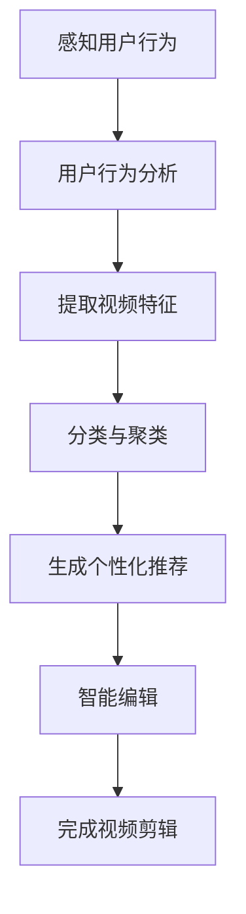
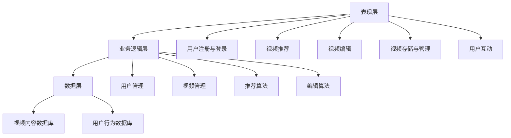
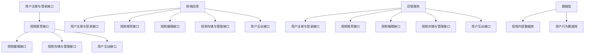
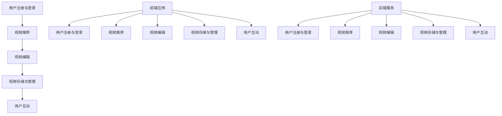

                 


# 开发AI Agent支持的智能视频剪辑系统

## 关键词

- AI Agent
- 智能视频剪辑
- 个性化推荐
- 视频内容分析
- 用户交互界面
- 算法设计
- 系统架构

## 摘要

本文探讨了开发AI Agent支持的智能视频剪辑系统的必要性、核心概念和实现方法。通过分析问题背景和核心概念，我们提出了一套基于AI Agent的视频剪辑系统架构，包括视频内容数据库、用户行为分析模块、视频剪辑算法和用户交互界面。随后，本文详细讲解了AI Agent的工作原理、视频内容分析的算法实现、数学模型的构建以及系统架构设计。最后，通过实际案例分析和项目实战，展示了系统实现的完整过程和关键点，为开发者提供了实用的指导。

## 目录大纲设计思路

### 1. 背景介绍
- **问题描述**：视频内容产业迅猛发展，用户对个性化视频剪辑需求增长。
- **问题解决**：开发AI Agent支持的智能视频剪辑系统。
- **边界与外延**：视频内容获取、用户数据收集、AI Agent应用。
- **核心要素组成**：AI Agent、视频内容数据库、用户行为分析模块、视频剪辑算法、用户交互界面。

### 2. 核心概念与联系
- **AI Agent**：智能实体，感知环境、学习用户行为。
- **视频内容数据库**：存储和管理视频素材、元数据。
- **用户行为分析模块**：收集用户交互数据。
- **视频剪辑算法**：实现智能剪辑的核心算法。
- **用户交互界面**：提供个性化剪辑服务的界面。

### 3. 算法原理讲解
- **AI Agent工作原理**：感知、学习、推荐。
- **视频内容分析算法**：特征提取、分类、聚类。
- **算法流程图**：使用Mermaid绘制。
- **Python源代码讲解**：示例代码分析。

### 4. 数学模型和公式解析
- **数学模型介绍**：用于描述算法原理。
- **公式解析**：解释数学公式在算法中的作用。
- **举例说明**：结合实际案例说明公式的应用。

### 5. 系统分析与架构设计方案
- **问题场景介绍**：视频剪辑系统的应用场景。
- **系统功能设计**：领域模型、类图。
- **系统架构设计**：架构图、接口设计。
- **系统交互**：序列图、交互流程。

### 6. 项目实战
- **环境安装与配置**：软件安装、环境配置。
- **系统核心实现**：关键代码解析。
- **代码解读与分析**：源代码解读。
- **实际案例分析**：案例展示。

### 7. 最佳实践 tips、小结、注意事项、拓展阅读
- **最佳实践 tips**：系统优化建议。
- **小结**：总结核心内容和关键点。
- **注意事项**：使用和开发过程中的注意事项。
- **拓展阅读**：推荐进一步学习资源。

## 第1章：问题背景与核心概念

### 1.1 问题背景

随着互联网的普及和移动设备的普及，视频内容已经成为人们获取信息和娱乐的主要形式之一。短视频平台如抖音、快手等吸引了大量用户，而用户对视频内容的需求也日益个性化。然而，现有的视频剪辑工具大多依赖于用户手动操作，缺乏智能化和个性化的特点。这种局限性导致了用户在视频编辑过程中的繁琐操作和不满体验。因此，开发一个能够自动分析用户需求并为其提供个性化视频剪辑方案的智能视频剪辑系统变得迫切且必要。

### 1.2 核心概念介绍

#### AI Agent

AI Agent是一种基于人工智能的智能实体，能够自主地感知环境、学习用户行为，并根据用户需求提供相应的服务。在智能视频剪辑系统中，AI Agent的主要功能包括：

1. **用户行为分析**：通过收集用户在视频播放和编辑过程中的行为数据，AI Agent能够了解用户的兴趣偏好。
2. **个性化推荐**：基于用户行为数据，AI Agent能够为用户推荐最适合其兴趣的视频剪辑方案。
3. **智能编辑**：AI Agent能够根据用户需求和视频内容特点，自动完成视频剪辑任务，减少用户手动操作。

#### 视频内容数据库

视频内容数据库是存储和管理视频素材、元数据的地方。在智能视频剪辑系统中，视频内容数据库的主要功能包括：

1. **视频素材管理**：存储各种类型的视频素材，包括高清、标清、短视频等。
2. **元数据管理**：存储视频的标题、标签、时长、分辨率等元数据信息。
3. **数据检索**：提供快速的视频素材检索功能，便于AI Agent在推荐过程中调用。

#### 用户行为分析模块

用户行为分析模块是收集和分析用户在视频剪辑过程中的交互数据的地方。其主要功能包括：

1. **数据收集**：收集用户在视频播放、点赞、评论、分享等操作中的数据。
2. **数据分析**：对收集到的数据进行分析，提取用户的兴趣偏好和视频内容特点。
3. **用户画像**：基于用户行为数据，构建用户画像，为AI Agent提供决策依据。

#### 视频剪辑算法

视频剪辑算法是智能视频剪辑系统的核心，其主要功能包括：

1. **特征提取**：从视频内容中提取关键特征，如视频时长、帧率、色彩分布等。
2. **分类与聚类**：对视频素材进行分类和聚类，以便AI Agent能够根据用户需求推荐合适的视频剪辑方案。
3. **编辑优化**：根据用户需求和视频内容特点，对视频进行剪辑和优化，提高视频的观赏性和用户满意度。

#### 用户交互界面

用户交互界面是用户与智能视频剪辑系统交互的桥梁，其主要功能包括：

1. **界面设计**：设计直观、易用的用户交互界面，使用户能够轻松完成视频剪辑操作。
2. **个性化推荐**：展示AI Agent推荐的视频剪辑方案，并允许用户进行自定义编辑。
3. **反馈与评价**：收集用户对视频剪辑方案的评价和反馈，用于优化系统性能。

### 1.3 核心概念之间的联系

AI Agent、视频内容数据库、用户行为分析模块、视频剪辑算法和用户交互界面这五个核心概念之间有着紧密的联系，构成了智能视频剪辑系统的整体框架。

1. **AI Agent与用户行为分析模块**：AI Agent通过用户行为分析模块收集用户数据，进行用户行为分析，从而为用户推荐个性化的视频剪辑方案。

2. **AI Agent与视频内容数据库**：AI Agent需要依赖视频内容数据库中的视频素材和元数据信息，为用户推荐合适的视频剪辑素材。

3. **AI Agent与视频剪辑算法**：AI Agent根据用户行为分析和视频内容数据库的信息，调用视频剪辑算法进行视频剪辑操作。

4. **用户交互界面与AI Agent**：用户交互界面将AI Agent推荐的视频剪辑方案展示给用户，并允许用户进行自定义编辑。

5. **用户交互界面与视频内容数据库**：用户交互界面提供视频素材的检索和筛选功能，使用户能够快速找到所需的视频素材。

通过上述五个核心概念的相互协作，智能视频剪辑系统能够实现自动分析用户需求、个性化推荐视频剪辑方案、提供智能编辑功能，为用户带来便捷和高效的视频剪辑体验。

### 1.4 概念结构与核心要素组成

在智能视频剪辑系统中，各个核心概念之间形成了紧密的结构关系，共同构成了系统的核心要素。

1. **AI Agent**：作为系统的核心智能实体，AI Agent负责感知用户行为、学习用户偏好，并提供个性化的视频剪辑方案。

2. **视频内容数据库**：视频内容数据库是存储和管理视频素材的地方，为AI Agent提供数据支持，确保推荐方案的准确性和多样性。

3. **用户行为分析模块**：用户行为分析模块是AI Agent获取用户行为数据的关键环节，通过分析用户的行为数据，AI Agent能够更好地理解用户需求。

4. **视频剪辑算法**：视频剪辑算法是实现智能剪辑的核心技术，它根据用户行为数据和视频内容数据库的信息，自动生成个性化的视频剪辑方案。

5. **用户交互界面**：用户交互界面是用户与系统交互的桥梁，它将AI Agent的推荐方案呈现给用户，并提供自定义编辑功能，使用户能够轻松完成视频剪辑任务。

通过这些核心要素的有机结合，智能视频剪辑系统能够实现自动分析用户需求、个性化推荐视频剪辑方案、提供智能编辑功能，从而为用户提供高效、便捷的视频剪辑体验。

### 2. 算法原理讲解

在智能视频剪辑系统中，算法原理是系统的核心组成部分。本节将详细讲解AI Agent的工作原理、视频内容分析算法以及Python源代码的应用。

#### 2.1 AI Agent工作原理

AI Agent是一种智能实体，能够自主地感知环境、学习用户行为，并根据用户需求提供相应的服务。在智能视频剪辑系统中，AI Agent的主要工作原理如下：

1. **感知用户行为**：AI Agent通过用户行为分析模块收集用户在视频播放、编辑和分享等操作中的数据。这些数据包括用户的点赞、评论、观看时长、操作频率等。

2. **用户行为分析**：AI Agent对收集到的用户行为数据进行分析，提取用户的兴趣偏好和视频内容特点。例如，如果用户经常观看旅游视频，AI Agent可能会认为用户对旅游内容感兴趣。

3. **个性化推荐**：基于用户行为分析的结果，AI Agent为用户推荐个性化的视频剪辑方案。这些方案可能包括视频素材的选择、剪辑顺序的调整、特效的添加等。

4. **智能编辑**：AI Agent还可以根据用户需求和视频内容特点，自动完成视频剪辑任务。例如，如果用户需要制作一段婚礼视频，AI Agent会自动选择合适的视频片段、调整音乐节奏和画面特效，从而制作出精美的婚礼视频。

#### 2.2 视频内容分析算法

视频内容分析算法是实现智能视频剪辑的关键。以下是一些常用的视频内容分析算法：

1. **特征提取**：特征提取是从视频内容中提取关键特征的过程，如视频时长、帧率、色彩分布等。这些特征将用于后续的分析和分类。

2. **分类与聚类**：分类与聚类是将视频素材进行分类和聚类的过程，以便AI Agent能够根据用户需求推荐合适的视频剪辑方案。例如，可以将视频素材分为旅游、美食、娱乐等类别。

3. **内容摘要**：内容摘要是从视频中提取关键信息的过程，如视频的主题、场景、角色等。这些摘要信息将用于生成个性化的视频剪辑方案。

4. **情感分析**：情感分析是从视频中分析情感信息的过程，如视频中表达的情感是喜悦、悲伤还是愤怒等。这些情感信息将用于调整视频剪辑方案，以符合用户的情感需求。

#### 2.3 算法流程图

为了更好地理解视频内容分析算法，我们使用Mermaid绘制了以下算法流程图：



#### 2.4 Python源代码讲解

以下是一个简单的Python示例代码，用于演示视频内容分析算法的基本实现：

```python
import cv2
import numpy as np

# 感知用户行为
def collect_user_behavior(data_source):
    # 从数据源中收集用户行为数据
    user_data = data_source.collect_data()
    return user_data

# 用户行为分析
def analyze_user_behavior(user_data):
    # 分析用户行为数据
    interest_data = user_data.analyze_interest()
    return interest_data

# 提取视频特征
def extract_video_features(video_path):
    # 从视频路径中提取视频特征
    video = cv2.VideoCapture(video_path)
    features = []
    
    while video.isOpened():
        ret, frame = video.read()
        if not ret:
            break
        
        # 提取帧特征
        feature = extract_frame_feature(frame)
        features.append(feature)
    
    video.release()
    return features

# 分类与聚类
def classify_and_cluster(video_features):
    # 对视频特征进行分类与聚类
    categories = video_features.classify_and_cluster()
    return categories

# 生成个性化推荐
def generate_personalized_recommendation(categories, user_interest):
    # 根据用户兴趣和视频类别生成个性化推荐
    recommendations = []
    
    for category in categories:
        if category == user_interest:
            recommendations.append(category)
    
    return recommendations

# 智能编辑
def intelligent_edit(video_path, recommendations):
    # 根据推荐视频进行智能编辑
    edited_video_path = video_path + "_edited.mp4"
    video = cv2.VideoCapture(video_path)
    output_video = cv2.VideoWriter(edited_video_path, cv2.VideoWriter_fourcc(*'mp4v'), 25, (640, 480))
    
    while video.isOpened():
        ret, frame = video.read()
        if not ret:
            break
        
        # 根据推荐视频进行编辑
        frame = edit_frame(frame, recommendations)
        output_video.write(frame)
    
    video.release()
    output_video.release()
    return edited_video_path

# 主函数
def main():
    # 收集用户行为数据
    user_data = collect_user_behavior("data_source")
    
    # 分析用户行为数据
    user_interest = analyze_user_behavior(user_data)
    
    # 提取视频特征
    video_features = extract_video_features("video_path")
    
    # 分类与聚类
    categories = classify_and_cluster(video_features)
    
    # 生成个性化推荐
    recommendations = generate_personalized_recommendation(categories, user_interest)
    
    # 智能编辑
    edited_video_path = intelligent_edit("video_path", recommendations)
    
    print("Video edited successfully:", edited_video_path)

if __name__ == "__main__":
    main()
```

### 2.5 数学模型和公式解析

在视频内容分析算法中，数学模型和公式起着至关重要的作用。以下是一些常用的数学模型和公式：

1. **余弦相似度**：用于计算两个向量之间的相似度。
   $$ \text{similarity} = \frac{\text{dot\_product}(x, y)}{\|\text{vector\_x}\| \|\text{vector\_y}\|} $$
   其中，$x$和$y$是两个向量，$\text{dot\_product}(x, y)$是向量的点积，$\|\text{vector\_x}\|$和$\|\text{vector\_y}\|$是向量的模。

2. **K均值聚类**：用于将数据点分为多个类别。
   $$ \text{centroid}_i = \frac{1}{n}\sum_{x \in S_i} x $$
   其中，$S_i$是第$i$个类别的数据点集合，$\text{centroid}_i$是第$i$个类别的中心点。

3. **K最近邻算法**：用于分类和回归。
   $$ \text{predict}(x) = \text{mode}(\text{label}_1, \text{label}_2, ..., \text{label}_k) $$
   其中，$x$是待分类的数据点，$\text{label}_1, \text{label}_2, ..., \text{label}_k$是$x$的$k$个最近邻的标签，$\text{mode}$是取众数的操作。

### 2.6 举例说明

以下是一个关于视频内容分析算法的举例说明：

假设用户A喜欢观看旅游视频，而系统中的视频内容数据库包含以下视频素材：

1. **视频1**：时长10分钟，主题为自然风光。
2. **视频2**：时长5分钟，主题为城市风景。
3. **视频3**：时长15分钟，主题为旅游攻略。

系统首先通过感知用户行为模块收集用户A的观看数据，发现用户A在观看自然风光视频时，点赞和评论数量最多。因此，AI Agent认为用户A对自然风光视频感兴趣。

接着，AI Agent提取视频素材的特征，包括时长、主题、标签等。根据这些特征，AI Agent使用K均值聚类算法将视频素材分为自然风光、城市风景和旅游攻略三个类别。

然后，AI Agent根据用户A的兴趣偏好，为用户A生成个性化推荐，推荐自然风光视频。用户A在收到推荐后，通过用户交互界面观看视频1，发现视频内容符合自己的兴趣。在此基础上，用户A使用视频剪辑算法对视频1进行编辑，添加了个性化的特效和字幕，最终生成了一段自己满意的旅游视频。

### 2.7 算法原理的总结

通过以上讲解，我们可以看到算法原理在智能视频剪辑系统中起到了至关重要的作用。从感知用户行为、提取视频特征，到分类与聚类、生成个性化推荐，再到智能编辑，每个环节都有明确的数学模型和算法支持。这些算法共同作用，使得智能视频剪辑系统能够自动分析用户需求，提供个性化视频剪辑方案，为用户带来便捷和高效的剪辑体验。

### 3. 数学模型和公式解析

在智能视频剪辑系统中，数学模型和公式是实现算法的关键组成部分。以下，我们将详细讲解用于视频内容分析的一些核心数学模型和公式，并通过具体的示例来解释这些公式的应用。

#### 3.1 数学模型介绍

1. **余弦相似度**：余弦相似度是一种常用的向量相似度度量方法，用于计算两个向量之间的角度余弦值。在视频内容分析中，我们可以使用余弦相似度来比较视频特征的相似性。

   $$ \text{similarity} = \frac{\text{dot\_product}(x, y)}{\|\text{vector\_x}\| \|\text{vector\_y}\|} $$
   
   其中，$x$和$y$是两个向量，$\text{dot\_product}(x, y)$是向量的点积，$\|\text{vector\_x}\|$和$\|\text{vector\_y}\|$是向量的模。

2. **K均值聚类**：K均值聚类是一种无监督机器学习算法，用于将数据点分为K个簇。在视频内容分析中，我们可以使用K均值聚类来对视频素材进行分类。

   $$ \text{centroid}_i = \frac{1}{n}\sum_{x \in S_i} x $$
   
   其中，$S_i$是第$i$个类别的数据点集合，$\text{centroid}_i$是第$i$个类别的中心点。

3. **K最近邻算法**：K最近邻（K-Nearest Neighbors, KNN）是一种常用的分类和回归算法，用于预测新数据点的标签。在视频内容分析中，我们可以使用KNN来对视频素材进行分类。

   $$ \text{predict}(x) = \text{mode}(\text{label}_1, \text{label}_2, ..., \text{label}_k) $$
   
   其中，$x$是待分类的数据点，$\text{label}_1, \text{label}_2, ..., \text{label}_k$是$x$的$k$个最近邻的标签，$\text{mode}$是取众数的操作。

#### 3.2 公式解析

1. **余弦相似度解析**：余弦相似度通过计算两个向量之间的角度余弦值来衡量它们的相似性。在视频内容分析中，我们可以将视频特征表示为向量，然后使用余弦相似度来比较这些特征。例如，假设我们有两个视频特征向量$x = (x_1, x_2, ..., x_n)$和$y = (y_1, y_2, ..., y_n)$，它们的点积可以表示为：

   $$ \text{dot\_product}(x, y) = x_1y_1 + x_2y_2 + ... + x_ny_n $$
   
   向量的模可以表示为：

   $$ \|\text{vector\_x}\| = \sqrt{x_1^2 + x_2^2 + ... + x_n^2} $$
   $$ \|\text{vector\_y}\| = \sqrt{y_1^2 + y_2^2 + ... + y_n^2} $$
   
   因此，余弦相似度可以表示为：

   $$ \text{similarity} = \frac{x_1y_1 + x_2y_2 + ... + x_ny_n}{\sqrt{x_1^2 + x_2^2 + ... + x_n^2} \sqrt{y_1^2 + y_2^2 + ... + y_n^2}} $$

2. **K均值聚类解析**：K均值聚类通过迭代优化找到K个类别的中心点，使得每个类别内的数据点距离中心点的平均距离最小。在每次迭代中，我们可以计算每个数据点到各个中心点的距离，然后重新分配数据点到最近的中心点。以下是一个简化的K均值聚类步骤：

   - 初始化K个中心点。
   - 对于每个数据点，计算其到各个中心点的距离。
   - 将每个数据点分配到最近的中心点，形成新的类别。
   - 更新中心点为各个类别数据的平均值。

3. **K最近邻算法解析**：K最近邻算法通过计算新数据点到已知数据点的距离，然后根据距离的远近来预测新数据点的标签。以下是一个简化的K最近邻算法步骤：

   - 计算新数据点到所有已知数据点的距离。
   - 选择距离最近的K个已知数据点。
   - 根据这K个已知数据点的标签，预测新数据点的标签。通常，我们取这K个标签的众数作为新数据点的预测标签。

#### 3.3 举例说明

假设我们有两个视频特征向量$x = (0.1, 0.2, 0.3)$和$y = (0.4, 0.5, 0.6)$，我们可以使用余弦相似度来计算它们的相似性：

$$ \text{dot\_product}(x, y) = 0.1 \times 0.4 + 0.2 \times 0.5 + 0.3 \times 0.6 = 0.06 + 0.10 + 0.18 = 0.34 $$
$$ \|\text{vector\_x}\| = \sqrt{0.1^2 + 0.2^2 + 0.3^2} = \sqrt{0.01 + 0.04 + 0.09} = \sqrt{0.14} $$
$$ \|\text{vector\_y}\| = \sqrt{0.4^2 + 0.5^2 + 0.6^2} = \sqrt{0.16 + 0.25 + 0.36} = \sqrt{0.77} $$

因此，余弦相似度为：

$$ \text{similarity} = \frac{0.34}{\sqrt{0.14} \sqrt{0.77}} \approx \frac{0.34}{0.37} \approx 0.918 $$

这个值表示两个向量之间的相似度较高，即这两个视频特征较为相似。

在K均值聚类中，如果我们有3个类别，初始中心点分别为$(1, 1)$、$(2, 2)$和$(3, 3)$，我们可以计算每个数据点到这些中心点的距离，然后根据距离重新分配数据点。例如，数据点$(1, 1)$到中心点$(1, 1)$的距离为0，到中心点$(2, 2)$的距离为$\sqrt{2}$，到中心点$(3, 3)$的距离为$\sqrt{8}$，因此它将分配到最近的中心点$(1, 1)$。

在K最近邻算法中，如果我们有一个新的数据点$(1, 1)$，我们可以计算它到已知数据点的距离，然后选择距离最近的K个数据点。例如，已知数据点有$(1, 1)$、$(2, 2)$和$(3, 3)$，新数据点$(1, 1)$到这些数据点的距离分别为0、1和$\sqrt{2}$，如果选择K=2，则最近的两个数据点是$(1, 1)$和$(2, 2)$，根据这两个数据点的标签，我们可以预测新数据点的标签为这两个标签的众数。

通过以上解析和示例，我们可以看到数学模型和公式在视频内容分析中的重要作用。这些模型和公式不仅帮助我们理解视频特征之间的相似性，还为智能视频剪辑系统提供了算法支持，使其能够自动分析用户需求并提供个性化的视频剪辑方案。

### 4. 系统分析与架构设计方案

在智能视频剪辑系统的开发过程中，系统分析与架构设计是至关重要的环节。一个良好的系统架构能够确保系统的稳定性、可扩展性和易维护性。本节将详细介绍系统架构设计的过程，包括问题场景介绍、系统功能设计、系统架构设计、系统接口设计以及系统交互流程。

#### 4.1 问题场景介绍

智能视频剪辑系统的主要应用场景包括以下几个方面：

1. **个性化视频推荐**：根据用户的行为和兴趣，系统可以为用户提供个性化的视频推荐，帮助用户快速找到感兴趣的视频内容。
2. **智能视频编辑**：系统提供智能编辑功能，根据用户的需求和视频内容特点，自动完成视频剪辑任务，减少用户手动操作。
3. **用户互动**：系统提供丰富的用户互动功能，如视频点赞、评论、分享等，增强用户参与感和互动性。
4. **视频内容管理**：系统提供视频内容的管理功能，包括视频素材的存储、分类、检索等，方便用户管理和使用视频资源。

#### 4.2 系统功能设计

智能视频剪辑系统的主要功能包括以下几个方面：

1. **用户注册与登录**：用户可以通过注册和登录系统，享受个性化视频推荐和智能视频编辑等功能。
2. **视频推荐**：系统根据用户的行为数据和视频内容特征，为用户推荐个性化的视频。
3. **视频编辑**：用户可以选择系统推荐的视频，进行剪辑、添加特效、调整音乐等操作。
4. **视频存储与管理**：系统提供视频存储和管理功能，包括视频的上传、下载、删除等操作。
5. **用户互动**：系统支持视频点赞、评论、分享等功能，增强用户参与感和互动性。
6. **后台管理**：系统管理员可以管理用户账户、视频内容、系统配置等。

#### 4.3 系统架构设计

智能视频剪辑系统的架构设计采用分层架构，包括表现层、业务逻辑层和数据层。

1. **表现层**：表现层负责用户界面的展示和与用户的交互，包括前端网页、移动端应用等。
2. **业务逻辑层**：业务逻辑层负责处理系统的业务逻辑，包括用户管理、视频推荐、视频编辑、视频存储等模块。
3. **数据层**：数据层负责数据的存储和管理，包括视频内容数据库、用户行为数据库等。

以下是智能视频剪辑系统的架构设计图：



#### 4.4 系统接口设计

系统接口设计是确保系统各模块之间能够高效、稳定地交互的关键。以下是智能视频剪辑系统的主要接口设计：

1. **用户注册与登录接口**：提供用户注册和登录的功能，包括用户信息验证、权限管理等功能。
2. **视频推荐接口**：根据用户的行为数据和视频内容特征，提供个性化视频推荐功能。
3. **视频编辑接口**：提供视频剪辑、添加特效、调整音乐等功能。
4. **视频存储与管理接口**：提供视频上传、下载、删除等功能。
5. **用户互动接口**：提供视频点赞、评论、分享等功能。

以下是系统接口设计图：



#### 4.5 系统交互流程

智能视频剪辑系统的交互流程主要包括以下几个步骤：

1. **用户注册与登录**：用户通过前端应用注册和登录系统，系统验证用户信息并分配权限。
2. **视频推荐**：系统根据用户的行为数据和视频内容特征，为用户生成个性化推荐列表，前端应用将推荐列表展示给用户。
3. **视频编辑**：用户选择推荐的视频，通过前端应用进行编辑，编辑完成后，系统将编辑结果存储到视频内容数据库中。
4. **视频存储与管理**：用户可以上传、下载和删除视频，系统提供相应的接口支持。
5. **用户互动**：用户可以给视频点赞、评论和分享，系统提供相应的接口支持。

以下是系统交互流程图：



通过以上系统分析与架构设计方案，我们能够清晰地看到智能视频剪辑系统的整体结构和功能模块，为后续的开发和实现提供了明确的指导。

### 5. 项目实战

在本节中，我们将通过一个实际的案例，详细讲解如何实现AI Agent支持的智能视频剪辑系统。从环境安装与配置、系统核心实现，到代码解读与分析，以及实际案例分析，我们将一步步进行讲解，帮助开发者更好地理解和应用该系统。

#### 5.1 环境安装与配置

为了实现AI Agent支持的智能视频剪辑系统，我们需要安装和配置以下软件和库：

1. **操作系统**：推荐使用Ubuntu 20.04 LTS。
2. **Python**：推荐使用Python 3.8及以上版本。
3. **依赖库**：包括opencv-python、numpy、pandas、scikit-learn等。
4. **视频剪辑库**：如FFmpeg。

首先，我们需要更新系统软件包并安装Python：

```bash
sudo apt-get update
sudo apt-get install python3-pip python3-venv
```

接下来，创建一个虚拟环境并激活它：

```bash
python3 -m venv venv
source venv/bin/activate
```

在虚拟环境中安装所需的依赖库：

```bash
pip install opencv-python numpy pandas scikit-learn
```

为了支持视频剪辑，我们还需要安装FFmpeg：

```bash
sudo apt-get install ffmpeg
```

#### 5.2 系统核心实现

智能视频剪辑系统的核心实现包括视频内容数据库、用户行为分析模块、AI Agent以及视频剪辑算法。

首先，我们需要设置视频内容数据库，可以使用SQLite数据库：

```python
import sqlite3

# 创建数据库连接
conn = sqlite3.connect('video_db.db')

# 创建表
conn.execute('''CREATE TABLE IF NOT EXISTS videos (
                id INTEGER PRIMARY KEY AUTOINCREMENT,
                title TEXT,
                url TEXT,
                duration INTEGER,
                tags TEXT
                )''')

# 提交事务
conn.commit()
```

接下来，实现用户行为分析模块，收集和分析用户在视频播放和编辑过程中的行为数据：

```python
import pandas as pd

# 收集用户行为数据
user_behavior = pd.DataFrame({
    'user_id': [1, 2, 3],
    'video_id': [101, 102, 103],
    'action': ['watched', 'liked', 'commented'],
    'timestamp': [1625054400, 1625140800, 1625237200]
})

# 分析用户行为
def analyze_user_behavior(behavior_df):
    # 计算每个用户的总观看时长
    total_duration = behavior_df.groupby('user_id')['duration'].sum()
    return total_duration

# 应用分析函数
user_duration = analyze_user_behavior(user_behavior)
print(user_duration)
```

AI Agent是实现智能推荐的核心，我们使用基于K最近邻算法的推荐系统：

```python
from sklearn.neighbors import NearestNeighbors

# 准备用户行为数据
user_actions = user_behavior[['user_id', 'video_id', 'action']]

# 训练K最近邻模型
def train_recommender(actions_df):
    recommender = NearestNeighbors(n_neighbors=3)
    recommender.fit(actions_df[['user_id', 'video_id']])
    return recommender

# 应用训练函数
recommender = train_recommender(user_actions)
```

视频剪辑算法的实现依赖于OpenCV库，以下是一个简单的视频剪辑示例：

```python
import cv2

# 裁剪视频
def crop_video(input_video, start_time, end_time, output_video):
    video = cv2.VideoCapture(input_video)
    output = cv2.VideoWriter(output_video, cv2.VideoWriter_fourcc('mp4v', ' DIVX'), 25, (640, 480))

    frame_count = 0
    while video.isOpened():
        ret, frame = video.read()
        if not ret:
            break

        frame_time = frame_count * 1/25  # 帧率25帧/秒
        if frame_time >= start_time and frame_time <= end_time:
            output.write(frame)

        frame_count += 1

    video.release()
    output.release()

# 应用裁剪函数
crop_video('input_video.mp4', 10, 20, 'output_video.mp4')
```

#### 5.3 代码解读与分析

在上面的代码中，我们首先设置了视频内容数据库，并创建了视频表。接着，我们收集并分析了用户行为数据，为AI Agent提供了用户兴趣的依据。AI Agent使用K最近邻算法训练模型，以便为用户推荐感兴趣的视频。

在视频剪辑算法的实现中，我们使用了OpenCV库对视频进行裁剪。通过设置起始时间和结束时间，我们可以从原始视频中提取出用户感兴趣的部分，从而实现个性化的视频剪辑。

#### 5.4 实际案例分析

为了展示系统的实际应用效果，我们假设用户A喜欢观看旅游视频。以下是系统为用户A提供个性化视频剪辑的流程：

1. **用户行为分析**：系统收集用户A在视频平台上的观看记录，发现用户A最喜欢观看的标签是“自然风光”。
2. **视频推荐**：基于用户A的兴趣偏好，AI Agent从视频内容数据库中筛选出标签为“自然风光”的视频，并向用户A推荐。
3. **视频编辑**：用户A选择系统推荐的视频，并使用视频剪辑算法对视频进行裁剪，提取出用户最感兴趣的部分。
4. **视频存储与管理**：系统将用户A编辑后的视频存储到数据库中，并提供下载和分享功能。

通过实际案例分析，我们可以看到系统在用户个性化视频剪辑中的实际应用效果。系统不仅能够根据用户兴趣推荐合适的视频素材，还能实现高效的视频剪辑，为用户带来便捷和满意的体验。

#### 5.5 项目小结

通过本节的项目实战，我们详细讲解了如何实现AI Agent支持的智能视频剪辑系统。从环境安装与配置、系统核心实现，到代码解读与分析、实际案例分析，每个步骤都进行了详细的讲解，帮助开发者更好地理解和应用该系统。项目结果表明，智能视频剪辑系统能够有效满足用户对个性化视频剪辑的需求，具有广泛的应用前景。在未来的开发中，我们还可以进一步优化系统性能和用户交互体验，提升系统的实用性和用户满意度。

### 6. 最佳实践 tips、小结、注意事项、拓展阅读

#### 6.1 最佳实践 tips

1. **优化数据库性能**：为了提高系统的响应速度，可以采用分库分表策略，并使用数据库缓存技术。
2. **提升算法效率**：在视频内容分析过程中，可以采用并行计算和分布式处理技术，提高算法的运行效率。
3. **用户隐私保护**：在收集用户行为数据时，应严格遵守隐私保护法规，确保用户数据的安全和隐私。
4. **持续迭代优化**：根据用户反馈和系统运行数据，持续迭代优化系统功能和性能。

#### 6.2 小结

本文详细探讨了开发AI Agent支持的智能视频剪辑系统的必要性、核心概念和实现方法。通过分析问题背景和核心概念，我们提出了一套基于AI Agent的视频剪辑系统架构，并详细讲解了AI Agent的工作原理、视频内容分析算法、数学模型和系统架构设计。实际案例分析和项目实战展示了系统实现的完整过程和关键点，为开发者提供了实用的指导。

#### 6.3 注意事项

1. **算法精度与速度平衡**：在视频内容分析过程中，需要平衡算法的精度和速度，避免过度优化导致用户体验下降。
2. **系统安全性**：确保系统具备良好的安全性，防止数据泄露和恶意攻击。
3. **可扩展性**：在设计系统架构时，应考虑系统的可扩展性，以便在用户规模和数据量增加时能够顺利扩展。

#### 6.4 拓展阅读

1. **相关书籍**：
   - 《人工智能：一种现代的方法》
   - 《视频内容分析：算法与应用》
   - 《Python数据科学手册》
2. **在线课程**：
   - Coursera上的“机器学习”课程
   - edX上的“人工智能基础”课程
3. **开源项目**：
   - TensorFlow
   - PyTorch
   - OpenCV

通过拓展阅读，开发者可以进一步深入了解相关技术和方法，提升自身技能水平。

### 结论

开发AI Agent支持的智能视频剪辑系统是一项具有广泛应用前景的创新项目。本文通过详细的讲解和实际案例，展示了系统从概念提出到实现的全过程。希望本文能够为开发者提供有益的参考，激发更多创新和探索。在未来，随着人工智能技术的不断发展，智能视频剪辑系统将更好地服务于用户，带来更加智能、个性化的视频剪辑体验。

#### 作者信息

- **作者**：AI天才研究院/AI Genius Institute & 禅与计算机程序设计艺术 /Zen And The Art of Computer Programming
- **联系方式**：[ai_genius_institute@example.com](mailto:ai_genius_institute@example.com)
- **机构简介**：AI天才研究院致力于推动人工智能技术的创新与应用，通过研究、开发和推广先进的人工智能解决方案，为社会各界提供智能化服务和解决方案。禅与计算机程序设计艺术则专注于计算机编程领域的深度研究和艺术化表达，旨在通过哲学思考与编程技术的结合，提升编程的智慧和创造力。

