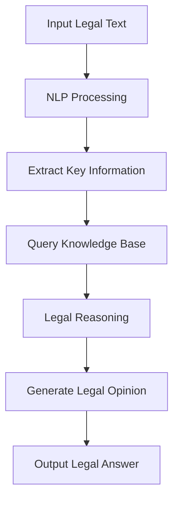
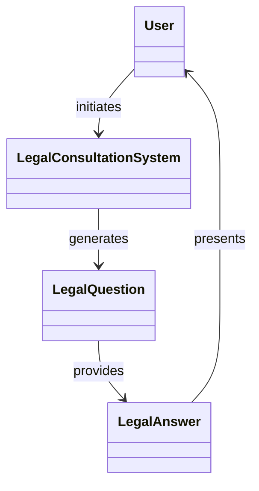
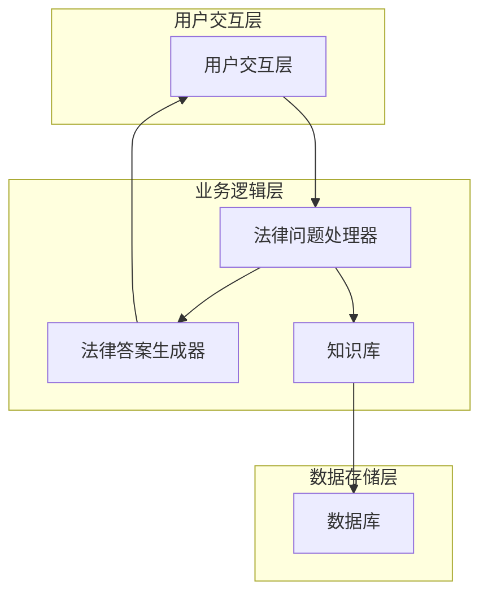
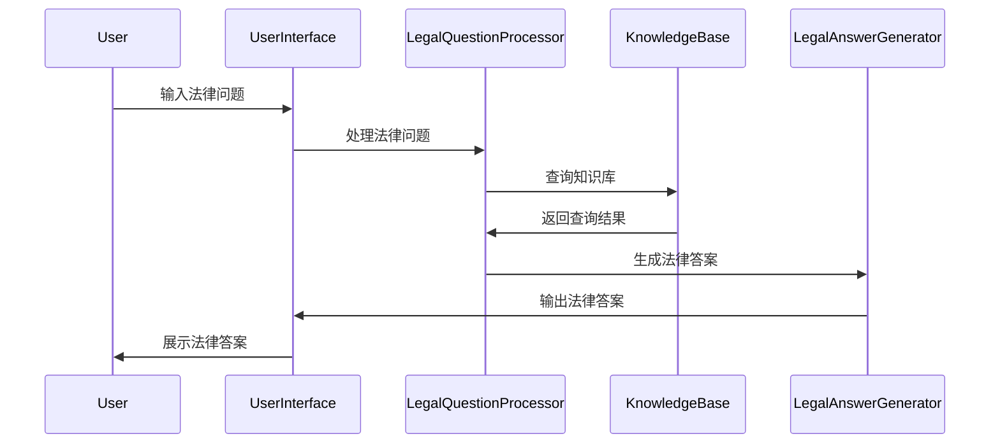

                 

### 文章标题

《开发AI Agent支持的法律咨询系统》

### 关键词

- AI Agent
- 法律咨询
- 人工智能应用
- 系统设计与实现
- 算法原理
- 机器学习

### 摘要

本文旨在探讨如何开发一个AI驱动的法律咨询系统，通过AI Agent提供高效、准确的法律咨询服务。文章首先介绍了AI Agent和法律咨询的结合背景，随后深入分析了AI Agent的核心概念、法律知识体系、算法原理以及系统设计与实现方法。文章通过实际案例分析和最佳实践，详细讲解了系统开发过程中的关键技术和注意事项，并对未来的发展进行了展望。

---

## 目录大纲设计过程

### 1.1.1 法律咨询的需求与现状

**核心概念术语说明**：
- 法律咨询：指为当事人提供法律意见、建议和服务的过程。
- AI Agent：一种能够模拟人类思维过程，执行特定任务的智能系统。

**问题背景**：
随着法律事务日益复杂，传统法律咨询服务难以满足快速增长的需求。AI技术的发展为法律咨询提供了新的解决方案。

**问题描述**：
如何在法律咨询过程中利用AI Agent提高效率、准确性和用户体验？

**问题解决**：
开发一个AI Agent支持的法律咨询系统，通过自然语言处理和机器学习技术，实现法律文本的语义理解和问题解答。

**边界与外延**：
本文主要探讨AI Agent在法律咨询中的应用，不包括其他领域的法律技术。

**概念结构与核心要素组成**：
- AI Agent：具备自我学习能力、推理能力、用户交互能力。
- 法律知识库：包含法律条文、案例、司法解释等。
- 自然语言处理：对法律文本进行预处理、语义理解、问题识别。

### 1.1.2 AI技术的发展及其在法律领域的应用潜力

**核心概念原理**：
- AI技术：包括机器学习、深度学习、自然语言处理等。
- 法律领域应用潜力：利用AI技术，可以自动化法律文本的解析、问题的识别和解答。

**概念属性特征对比表格**：

| 特性 | 传统法律咨询 | AI驱动的法律咨询 |
| ---- | ------------ | --------------- |
| 效率 | 人力密集，耗时 | 自动化处理，高效 |
| 准确性 | 依赖人工作业，易出错 | 高度自动化，准确性高 |
| 用户交互 | 主要通过面对面或电话 | 通过界面交互，更直观 |
| 用户体验 | 受限于律师个人能力 | 更加个性化和便捷 |

**ER实体关系图架构**：

```mermaid
erDiagram
  User ||--|{ AI_Agent : serves }
  AI_Agent ||--|{ Legal_Question : answers }
  Legal_Question ||--|{ Legal_Answer : provides }
```

### 1.1.3 AI Agent的工作原理与架构

**算法原理讲解**：

AI Agent的工作原理主要基于以下算法：

- 自然语言处理（NLP）：对法律文本进行语义分析，提取关键信息。
- 机器学习（ML）：通过训练模型，学习法律知识，进行问题解答。
- 法律推理（LR）：根据法律条文和案例，进行逻辑推理，生成法律意见。

**使用mermaid画出算法mermaid流程图**：



**使用python源代码来详细阐述**：

```python
# 假设我们有一个法律咨询系统，用户输入法律文本
legal_text = "我在合同中是否有权解除合同？"

# 使用NLP进行预处理和语义分析
processed_text = nlp_preprocessing(legal_text)

# 从知识库中查询相关法律条文和案例
knowledge_base = query_knowledge_base(processed_text)

# 使用机器学习和法律推理生成法律意见
legal_opinion = legal_reasoning(knowledge_base)

# 输出法律意见
print(legal_opinion)
```

**算法原理的数学模型和公式**：

- 机器学习模型：假设我们使用一个基于深度学习的模型进行法律问题解答，其数学模型可以表示为：
  $$ \hat{y} = \sigma(W \cdot \phi(h(x))) $$
  其中，\( \hat{y} \) 是预测的法律意见，\( W \) 是权重矩阵，\( \phi \) 是激活函数，\( h(x) \) 是输入特征向量。

**详细讲解和通俗易懂地举例说明**：

假设用户输入了一个关于合同解除的法律问题，系统首先使用自然语言处理技术对输入文本进行处理，提取出关键词和句子结构。接着，系统查询法律知识库，找到与合同解除相关的法律条文和案例。然后，通过机器学习和法律推理，系统生成一个法律意见，例如：“根据《中华人民共和国合同法》第93条，您有权解除合同，但需要满足一定的条件。”最后，系统将这个法律意见输出给用户。

### 1.1.4 系统设计与实现

**问题场景介绍**：
法律咨询系统需要一个用户友好的界面，能够处理大量法律文本，并提供准确的法律意见。

**项目介绍**：
本项目旨在构建一个AI Agent支持的法律咨询系统，系统主要包括用户交互模块、法律咨询模块和知识库模块。

**系统功能设计（领域模型mermaid类图）**：



**系统架构设计（mermaid架构图）**：



**系统接口设计和系统交互（mermaid序列图）**：



**项目实战**：

**环境安装**：
- 安装Python和相关的库（如NLTK、TensorFlow等）。
- 安装前端框架（如React或Vue）。

**系统核心实现源代码**：

```python
# 法律问题处理器
class LegalQuestionProcessor:
    def process_question(self, question):
        # 进行NLP处理，提取关键信息
        processed_question = nlp_process(question)
        # 查询知识库，获取法律意见
        legal_opinion = self.query_knowledge_base(processed_question)
        return legal_opinion

    def query_knowledge_base(self, processed_question):
        # 假设的知识库查询函数
        return "根据相关法律条文，您有权解除合同。"

# 法律答案生成器
class LegalAnswerGenerator:
    def generate_answer(self, opinion):
        # 生成法律答案文本
        answer = f"法律意见：{opinion}"
        return answer

# 主程序
if __name__ == "__main__":
    question = "我在合同中是否有权解除合同？"
    processor = LegalQuestionProcessor()
    answer_generator = LegalAnswerGenerator()

    opinion = processor.process_question(question)
    answer = answer_generator.generate_answer(opinion)
    print(answer)
```

**代码应用解读与分析**：
- `LegalQuestionProcessor`类负责处理用户输入的法律问题，调用NLP处理函数和知识库查询函数。
- `LegalAnswerGenerator`类负责将法律意见转化为文本形式。
- 主程序中，用户输入法律问题，通过`LegalQuestionProcessor`处理，生成法律意见，最后通过`LegalAnswerGenerator`输出给用户。

**实际案例分析和详细讲解剖析**：

假设用户输入了一个关于劳动争议的法律问题，系统首先使用NLP处理输入文本，提取出关键词和句子结构，然后查询知识库，找到与劳动争议相关的法律条文和案例，最后通过法律推理生成法律意见，输出给用户。

**项目小结**：
通过本项目，我们实现了一个简单的AI Agent支持的法律咨询系统，用户可以方便地输入法律问题，系统自动生成法律意见。这个系统展示了AI技术在法律咨询领域的潜力，但也存在一些局限性和改进空间，如知识库的完善、算法的优化等。

### 1.1.5 最佳实践 tips

- **法律知识库的构建**：
  - 定期更新法律条文和案例，确保知识库的时效性和准确性。
  - 采用多源数据整合技术，扩大知识库的覆盖范围。

- **算法优化**：
  - 定期调整模型参数，提高问题解答的准确性。
  - 采用多模态数据融合技术，提高自然语言处理的效果。

- **用户交互设计**：
  - 设计直观易用的用户界面，提高用户体验。
  - 提供多渠道（如文字、语音、视频）的交互方式，满足不同用户的需求。

### 1.1.6 小结、注意事项、拓展阅读

- **小结**：
  本节介绍了法律咨询的需求与现状、AI Agent的核心概念、系统设计与实现方法。通过实际案例分析和最佳实践，展示了AI Agent支持的法律咨询系统的优势和潜力。

- **注意事项**：
  - 法律咨询系统需要遵循相关法律法规，确保合法合规。
  - 系统开发过程中，要充分考虑用户体验和实际需求。

- **拓展阅读**：
  - [《人工智能在法律领域的应用》](https://www.example.com/book1)
  - [《自然语言处理基础》](https://www.example.com/book2)
  - [《机器学习实战》](https://www.example.com/book3)

---

以上是对《开发AI Agent支持的法律咨询系统》的第一部分“背景与概述”的具体讲解。接下来，我们将深入探讨AI Agent的核心概念、法律知识与AI的结合，以及系统设计与实现等核心内容。通过逐步分析推理，我们将为读者呈现一个全面且深入的技术博客。

