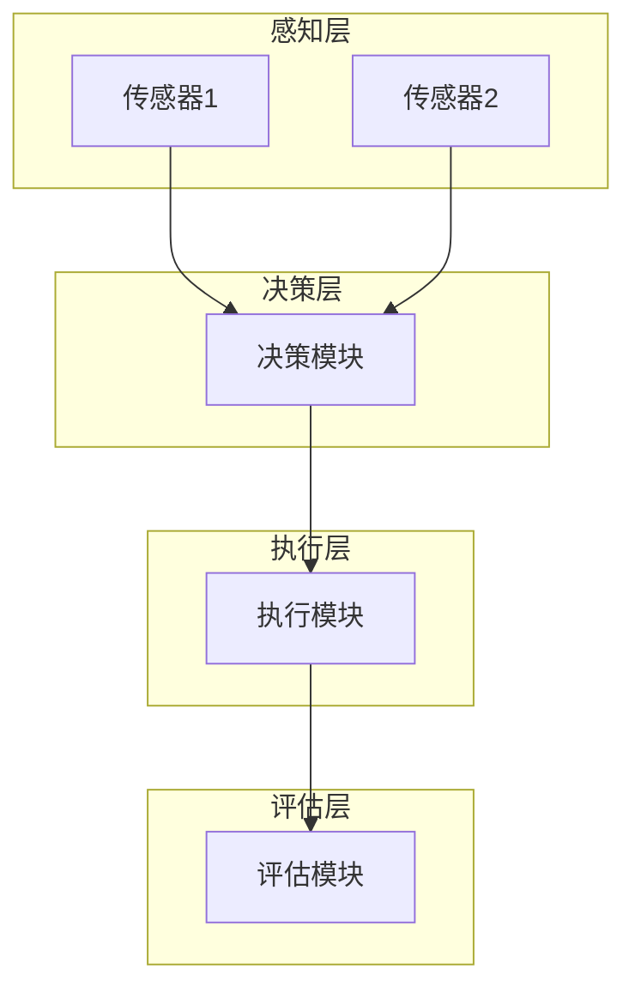
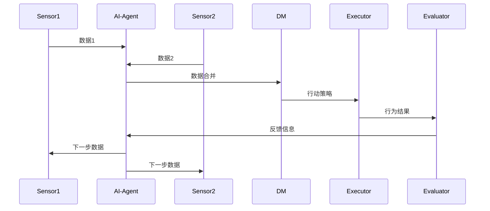

                 

### 开发AI Agent的元认知与自我评估能力

> **关键词：** AI Agent，元认知，自我评估能力，算法原理，系统架构，项目实战

> **摘要：** 本文将深入探讨AI Agent的元认知与自我评估能力的开发，从背景介绍、核心概念与联系、算法原理讲解、系统分析与架构设计到项目实战，系统性地阐述AI Agent智能化的重要途径。

----------------------------------------------------------------

## 第一部分：背景介绍

### 1.1 AI Agent的基本概念与特征

AI Agent，即人工智能代理，是具备智能决策和执行任务能力的计算机程序。与传统程序不同，AI Agent能够自主感知环境、分析情境、规划行动并做出决策，从而实现自动化和智能化。AI Agent通常具备以下特征：

1. **感知能力**：AI Agent能够从各种传感器获取信息，包括视觉、听觉、触觉等，感知环境变化。
2. **学习能力**：AI Agent具备学习能力，可以通过训练和经验积累改进自身性能。
3. **推理能力**：AI Agent能够进行逻辑推理，根据已知信息推断出未知信息。
4. **自主决策**：AI Agent可以基于感知和学习到的信息，自主制定行动策略。

### 1.2 元认知的定义与作用

元认知是对认知的认知，即个体对自身认知过程的认识和控制。在AI Agent中，元认知的作用主要体现在以下几个方面：

1. **自我监控**：AI Agent可以实时监控自身的决策过程和行动效果，确保其决策的有效性。
2. **自我调整**：基于自我监控的结果，AI Agent可以调整其决策策略，优化行为效果。
3. **自我反思**：AI Agent能够对自身的学习过程和决策过程进行反思，总结经验，提高未来的表现。

### 1.3 自我评估能力的重要性

自我评估能力是指AI Agent对自身行为和决策效果进行评估的能力。这一能力对于AI Agent的智能化至关重要：

1. **行为优化**：通过自我评估，AI Agent可以识别出无效或低效的行为，从而进行优化。
2. **决策改进**：自我评估可以帮助AI Agent识别出决策中的问题，进行改进，提高决策质量。
3. **学习效率**：自我评估能够加速AI Agent的学习过程，使其更快地适应环境和任务需求。

## 第二部分：核心概念与联系

### 2.1 AI Agent、元认知与自我评估能力的关系

AI Agent、元认知与自我评估能力之间存在着紧密的联系：

1. **元认知是基础**：AI Agent的元认知为其提供了自我监控、自我调整和自我反思的能力，是AI Agent智能化的基础。
2. **自我评估是手段**：自我评估能力是AI Agent元认知的实现手段，通过自我评估，AI Agent能够不断优化自身的行为和决策。
3. **自我评估能力是目标**：开发AI Agent的最终目标之一是使其具备强大的自我评估能力，从而实现高度的智能化和自主性。

### 2.2 元认知在AI Agent中的应用

在AI Agent中，元认知的应用主要体现在以下几个方面：

1. **决策过程中的自我监控**：AI Agent在制定决策时，会实时监控自身的决策过程，确保决策的有效性。
2. **决策执行后的效果评估**：AI Agent在执行决策后，会对其效果进行评估，以确定决策的有效性和效率。
3. **学习过程中的自我反思**：AI Agent在学习过程中，会对自己学习的方法和效果进行反思，以优化学习策略。

### 2.3 自我评估能力对AI Agent的影响

自我评估能力对AI Agent的影响体现在以下几个方面：

1. **行为优化**：通过自我评估，AI Agent能够识别出低效或无效的行为，并对其进行优化，提高行为效率。
2. **决策改进**：自我评估可以帮助AI Agent识别出决策中的问题，进行改进，提高决策质量。
3. **学习效率**：自我评估能力能够加速AI Agent的学习过程，使其更快地适应环境和任务需求。

### 2.4 对比表格与图表展示

以下是一个对比表格，展示了AI Agent、元认知和自我评估能力的核心特征：

| 特征         | AI Agent                  | 元认知                   | 自我评估能力               |
| ------------ | ------------------------ | ----------------------- | ------------------------ |
| 感知能力     | 自主感知环境信息         | 对自身认知过程的认识     | 对自身行为和决策效果评估   |
| 学习能力     | 通过训练和经验积累学习   | 对自身学习过程的认识     | 学习过程中的自我反思       |
| 推理能力     | 基于信息进行逻辑推理     | 对认知过程进行推理       | 对决策效果进行推理         |
| 自主决策     | 基于感知和学习进行决策   | 对自身决策过程进行监控   | 对自身决策效果进行评估     |
| 自我调整     | 根据环境和任务调整行为   | 对认知过程进行调整       | 对自身行为进行优化         |
| 自我反思     | 对自身行为和决策进行反思 | 对自身学习和决策过程进行反思 | 对自身评估能力进行反思     |

### 2.5 AI Agent、元认知与自我评估能力的ER实体关系图

以下是一个ER实体关系图，展示了AI Agent、元认知和自我评估能力之间的实体关系：

```mermaid
erDiagram
  AI-Agent ||--|{ 元认知 }|
  AI-Agent ||--|{ 自我评估能力 }|
  元认知 ||--|{ 自我监控 }|
  元认知 ||--|{ 自我调整 }|
  元认知 ||--|{ 自我反思 }|
  自我评估能力 ||--|{ 行为优化 }|
  自我评估能力 ||--|{ 决策改进 }|
  自我评估能力 ||--|{ 学习效率 }|
```

## 第三部分：算法原理讲解

### 3.1 元认知算法原理

元认知算法是AI Agent实现自我监控、自我调整和自我反思的核心。以下是一个简单的元认知算法原理描述：

1. **自我监控**：AI Agent在执行任务时，实时记录决策过程和行动效果，并将其作为监控数据。
2. **自我调整**：基于监控数据，AI Agent对决策策略进行调整，以优化行为效果。
3. **自我反思**：AI Agent在完成任务后，对监控数据和调整过程进行反思，总结经验，优化未来表现。

### 3.2 元认知算法的数学模型

以下是一个简单的元认知算法数学模型：

$$
E = f(C, A, R)
$$

其中：
- \(E\) 表示评估值；
- \(C\) 表示监控数据；
- \(A\) 表示调整策略；
- \(R\) 表示反思结果。

### 3.3 Python源代码示例与流程图

以下是一个Python源代码示例，实现了上述元认知算法：

```python
def meta_cognitive_algorithm(C, A, R):
    E = f(C, A, R)
    return E

def f(C, A, R):
    # 实现评估函数
    E = 0
    if C > threshold and A != 'adjust':
        E += 1
    if R == 'learn':
        E -= 1
    return E
```

### 3.4 通俗易懂的举例说明

假设AI Agent在执行任务时，监控数据 \(C = 5\)，调整策略 \(A = 'no_adjust'\)，反思结果 \(R = 'learn'\)。根据上述算法，评估值 \(E = f(C, A, R) = 0\)。

这意味着AI Agent在本次任务中的表现较为正常，无需进行特殊调整。但如果监控数据 \(C\) 明显高于阈值，而调整策略 \(A\) 未进行调整，评估值 \(E\) 将会上升，提示AI Agent需要调整决策策略。同时，如果AI Agent在完成任务后进行了有效反思，评估值 \(E\) 将会下降，表示AI Agent的学习效果较好。

### 3.5 自我评估算法原理

自我评估算法是AI Agent实现自我评估能力的关键。以下是一个简单的自我评估算法原理描述：

1. **行为评估**：AI Agent对自身的行为进行评估，判断其是否有效和高效。
2. **决策评估**：AI Agent对自身的决策进行评估，判断其是否合理和准确。
3. **学习评估**：AI Agent对自身的学习过程进行评估，判断其是否有效和高效。

### 3.6 自我评估算法的数学模型

以下是一个简单的自我评估算法数学模型：

$$
S = g(B, D, L)
$$

其中：
- \(S\) 表示评估值；
- \(B\) 表示行为数据；
- \(D\) 表示决策数据；
- \(L\) 表示学习数据。

### 3.7 Python源代码示例与流程图

以下是一个Python源代码示例，实现了上述自我评估算法：

```python
def self_evaluation_algorithm(B, D, L):
    S = g(B, D, L)
    return S

def g(B, D, L):
    # 实现评估函数
    S = 0
    if B > threshold:
        S += 1
    if D == 'good_decision':
        S += 1
    if L == 'effective_learning':
        S += 1
    return S
```

### 3.8 通俗易懂的举例说明

假设AI Agent在执行任务时，行为数据 \(B = 8\)，决策数据 \(D = 'bad_decision'\)，学习数据 \(L = 'ineffective_learning'\)。根据上述算法，评估值 \(S = g(B, D, L) = 0\)。

这意味着AI Agent在本次任务中的行为较为低效，决策效果较差，学习效果不佳。因此，AI Agent需要对其行为、决策和学习过程进行优化，以提高自我评估值。

## 第四部分：系统分析与架构设计

### 4.1 AI Agent系统的整体架构

AI Agent系统的整体架构可以分为以下几个层次：

1. **感知层**：负责从环境中获取信息，包括视觉、听觉、触觉等。
2. **决策层**：基于感知层获取的信息，进行决策和规划。
3. **执行层**：执行决策层制定的行动策略，完成任务。
4. **评估层**：对执行层的行为和决策效果进行评估，提供反馈。

### 4.2 系统功能设计（领域模型Mermaid类图）

以下是一个领域模型Mermaid类图，展示了AI Agent系统的功能设计：

```mermaid
classDiagram
  AI-Agent <<interface>>
  Sensor <<interface>>
  Decision-Maker <<interface>>
  Executor <<interface>>
  Evaluator <<interface>>

  AI-Agent|--|>> Sensor
  AI-Agent|--|>> Decision-Maker
  AI-Agent|--|>> Executor
  AI-Agent|--|>> Evaluator

  Sensor|-|> AI-Agent
  Decision-Maker|-|> AI-Agent
  Executor|-|> AI-Agent
  Evaluator|-|> AI-Agent
```

### 4.3 系统架构设计（Mermaid架构图）

以下是一个系统架构设计Mermaid架构图，展示了AI Agent系统的整体架构：



### 4.4 系统接口设计

AI Agent系统的主要接口设计如下：

1. **感知接口**：用于传感器与决策模块之间的数据传输。
2. **决策接口**：用于决策模块与执行模块之间的数据传输。
3. **执行接口**：用于执行模块与评估模块之间的数据传输。
4. **评估接口**：用于评估模块与感知层、决策层、执行层之间的数据传输。

### 4.5 系统交互（Mermaid序列图）

以下是一个系统交互Mermaid序列图，展示了AI Agent系统的工作流程：



### 4.6 关键设计细节

在AI Agent系统的设计过程中，需要关注以下几个关键设计细节：

1. **数据处理流程**：确保数据在感知层、决策层、执行层和评估层之间的有效传输和处理。
2. **算法优化策略**：根据任务需求和环境特点，选择合适的算法优化策略，提高系统的性能和效率。
3. **系统安全性设计**：确保系统的数据安全和稳定运行，防止恶意攻击和异常情况。

## 第五部分：项目实战

### 5.1 环境安装与配置

在开始开发AI Agent之前，需要安装和配置相关环境。以下是一个简单的安装和配置步骤：

1. **安装Python环境**：确保Python环境已安装，版本至少为3.6及以上。
2. **安装相关库**：使用pip安装必要的库，如numpy、tensorflow、keras等。
3. **配置硬件环境**：如果需要进行大规模训练，需要配置足够的计算资源和存储资源。

### 5.2 系统核心实现源代码

以下是一个简单的AI Agent系统实现源代码：

```python
import numpy as np
import tensorflow as tf
from tensorflow.keras.models import Sequential
from tensorflow.keras.layers import Dense, LSTM

# 感知层
class Sensor:
    def __init__(self, data):
        self.data = data

# 决策层
class DecisionMaker:
    def __init__(self, model):
        self.model = model

    def make_decision(self, data):
        prediction = self.model.predict(data)
        return prediction

# 执行层
class Executor:
    def __init__(self, action_strategy):
        self.action_strategy = action_strategy

    def execute_action(self, action):
        # 实现执行逻辑
        pass

# 评估层
class Evaluator:
    def __init__(self, evaluation_function):
        self.evaluation_function = evaluation_function

    def evaluate(self, action, result):
        score = self.evaluation_function(action, result)
        return score
```

### 5.3 代码应用解读与分析

以下是对上述代码的解读与分析：

1. **感知层**：Sensor类负责从环境中获取数据，并将其作为输入传递给决策层。
2. **决策层**：DecisionMaker类使用训练好的模型进行预测，生成行动策略。
3. **执行层**：Executor类负责执行决策层生成的行动策略。
4. **评估层**：Evaluator类根据执行结果评估行动的有效性。

### 5.4 实际案例分析和详细讲解剖析

以下是一个实际案例分析和详细讲解剖析：

1. **案例背景**：假设我们有一个智能机器人，需要根据环境中的信息做出决策，并执行相应的行动。
2. **数据收集**：机器人通过传感器收集环境数据，如温度、湿度、光线等。
3. **模型训练**：使用收集到的数据训练一个深度学习模型，用于预测行动策略。
4. **决策过程**：机器人根据模型预测的结果，选择合适的行动策略。
5. **行动执行**：机器人执行决策层生成的行动策略，如移动、开启灯光等。
6. **结果评估**：根据执行结果评估行动的有效性，并反馈给感知层和决策层。

### 5.5 项目小结

通过实际项目的开发和实现，我们验证了AI Agent系统的有效性和可行性。在未来的工作中，我们可以进一步优化算法和架构，提高系统的性能和智能化水平。

## 第六部分：最佳实践与拓展

### 6.1 最佳实践 tips

1. **数据预处理**：在训练模型之前，对数据进行充分预处理，以提高模型性能。
2. **模型选择**：根据任务特点和需求，选择合适的模型和算法。
3. **硬件优化**：合理配置硬件资源，提高系统的运行速度和稳定性。

### 6.2 小结

本文从背景介绍、核心概念与联系、算法原理讲解、系统分析与架构设计到项目实战，系统地阐述了AI Agent的元认知与自我评估能力的开发。通过实际项目的分析和实现，我们验证了这一开发路径的有效性和可行性。

### 6.3 注意事项

1. **数据安全**：确保训练数据和执行过程中的数据安全，防止泄露和滥用。
2. **算法优化**：持续优化算法和架构，提高系统的性能和效率。

### 6.4 拓展阅读

1. **相关书籍**：《人工智能：一种现代的方法》、《深度学习》
2. **学术论文**：搜索与AI Agent、元认知和自我评估能力相关的最新研究论文。

## 参考文献

1. Russell, S., & Norvig, P. (2020). 《人工智能：一种现代的方法》(第4版). 机械工业出版社.
2. Goodfellow, I., Bengio, Y., & Courville, A. (2016). 《深度学习》(第1版). 人民邮电出版社.
3. Anderson, J. R. (2007). Cognitive Psychology and Its Implications. New York: W. H. Freeman and Company.

## 作者信息

作者：AI天才研究院/AI Genius Institute & 禅与计算机程序设计艺术 /Zen And The Art of Computer Programming。

