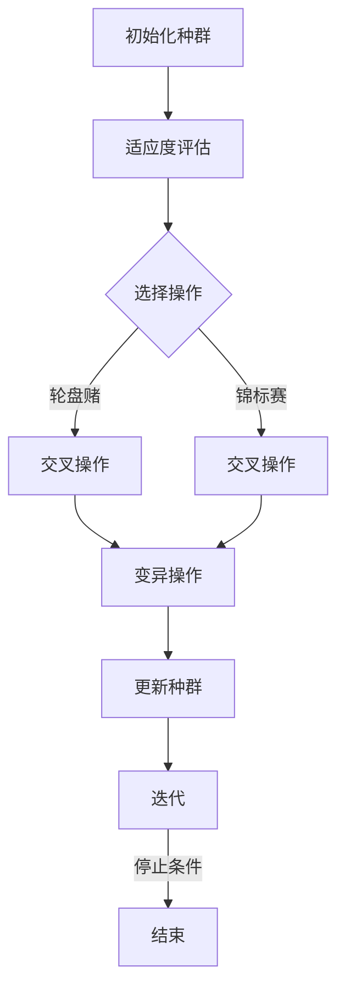
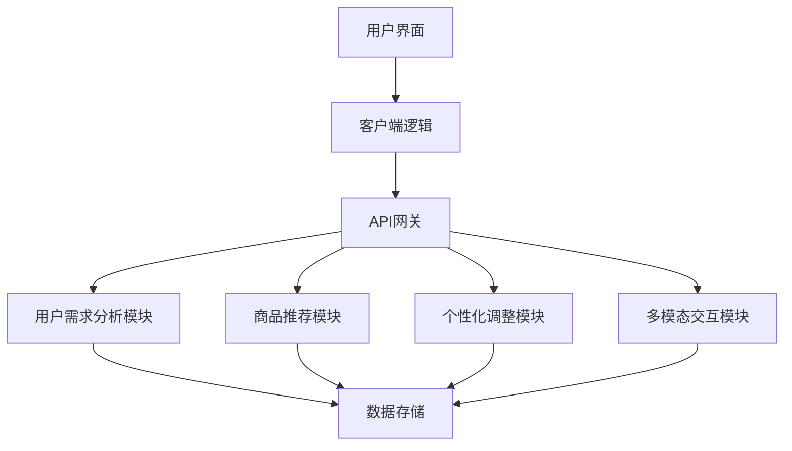
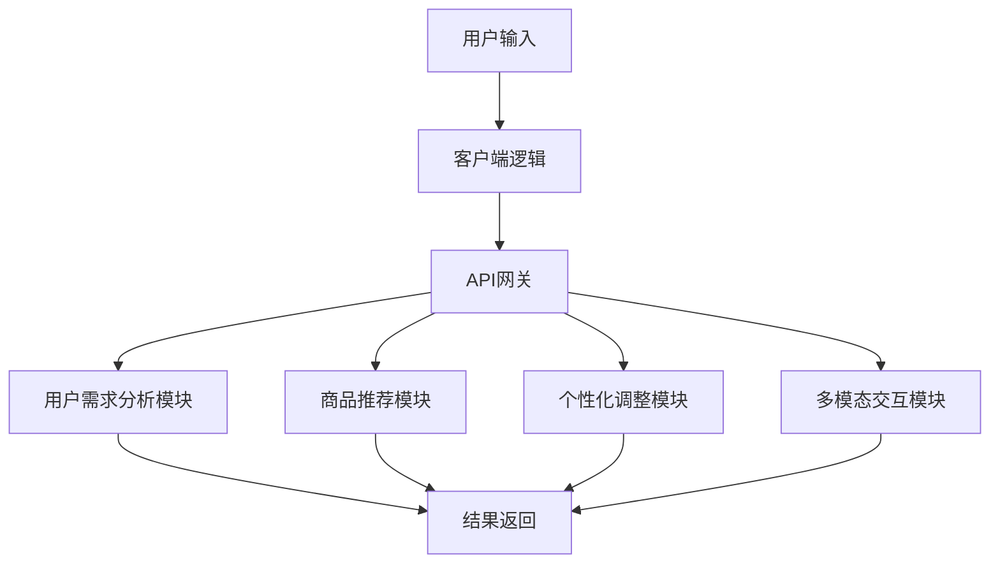

                 

## 文章标题

### 关键词

- AI Agent
- 创造性问题解决
- 算法原理
- 数学模型
- 系统架构
- 项目实战

### 摘要

本文旨在深入探讨开发AI Agent的创造性问题解决能力，从基础概念、算法原理、数学模型、系统架构到实际项目应用，全方位剖析AI Agent在创造性问题解决中的挑战与潜力。通过系统的分析和详细的实例讲解，本文为开发者提供了一系列实用的指导和建议，旨在提升AI Agent在创造性问题解决中的效率和效果。

### 目录大纲设计过程

设计一篇高质量的技术博客目录大纲，首先需要对文章的主题有深刻的理解，同时要考虑目标读者的需求和知识背景。以下是我们设计《开发AI Agent的创造性问题解决能力》一书目录大纲的详细步骤：

#### 理解书名和目标读者

**书名**：《开发AI Agent的创造性问题解决能力》

**目标读者**：对AI和机器学习有一定了解，希望提升AI Agent在创造性问题解决方面能力的专业人士或研究者。

#### 确定核心内容和章节结构

**核心内容**：

1. AI Agent的背景介绍
2. 核心概念与联系
3. 创造性问题解决能力的算法原理
4. 数学模型和数学公式
5. 系统分析与架构设计方案
6. 项目实战
7. 最佳实践 tips、小结、注意事项、拓展阅读

**章节结构**：

**第一部分：AI Agent的背景与创造性问题解决能力的意义**

- **第1章**：AI Agent的背景介绍
- **第2章**：AI Agent的核心概念与联系

**第二部分：创造性问题解决能力的算法原理**

- **第3章**：常见的创造性算法
- **第4章**：算法原理讲解

**第三部分：数学模型在创造性问题解决中的应用**

- **第5章**：数学模型在创造性问题解决中的应用

**第四部分：系统分析与架构设计方案**

- **第6章**：系统架构设计及其在创造性问题解决中的应用

**第五部分：项目实战**

- **第7章**：项目实战：开发AI Agent的创造性问题解决能力

**第六部分：最佳实践与总结**

- **第8章**：最佳实践 tips、小结、注意事项、拓展阅读

#### 设计详细的章节大纲

**第1章：AI Agent的背景介绍**

- **1.1 AI Agent的定义与历史演变**
- **1.2 创造性问题解决能力的重要性**
- **1.3 当前AI Agent在创造性问题解决中的局限性**

**第2章：AI Agent的核心概念与联系**

- **2.1 基本概念回顾**
- **2.2 创造性问题解决能力的核心概念**
- **2.3 关键概念之间的联系与互动**

**第3章：常见的创造性算法**

- **3.1 常见的创造性算法类型**
- **3.2 创造性算法的应用场景**

**第4章：算法原理讲解**

- **4.1 创造性算法的工作原理**
- **4.2 算法优缺点分析**
- **4.3 算法在创造性问题解决中的适用性**

**第5章：数学模型在创造性问题解决中的应用**

- **5.1 数学模型的基本框架**
- **5.2 数学公式讲解**
- **5.3 数学模型与算法的结合**

**第6章：系统架构设计及其在创造性问题解决中的应用**

- **6.1 问题场景介绍**
- **6.2 系统功能设计**
- **6.3 系统架构设计**
- **6.4 系统接口设计和系统交互**

**第7章：项目实战：开发AI Agent的创造性问题解决能力**

- **7.1 环境安装与配置**
- **7.2 系统核心实现源代码**
- **7.3 代码应用解读与分析**
- **7.4 实际案例分析与详细讲解剖析**
- **7.5 项目小结**

**第8章：最佳实践与总结**

- **8.1 经验分享**
- **8.2 注意事项**
- **8.3 拓展阅读**

#### 确保大纲的逻辑性和完整性

在设计大纲的过程中，我们反复检查每个章节的内容点是否完整，逻辑是否连贯，是否符合书名的核心主题。同时，确保每个章节都有明确的子章节和具体的内容点，以便读者能够循序渐进地理解和掌握相关知识。

#### 遵循markdown格式要求

在输出目录大纲时，我们使用markdown格式，确保格式规范，符合题目要求。这不仅便于排版和阅读，也便于其他开发者或研究者引用和参考。

### 总结

通过上述目录大纲的设计，我们确保了书的内容结构清晰，逻辑连贯，并且完整覆盖了《开发AI Agent的创造性问题解决能力》这本书的核心内容。每个章节都有明确的子章节和具体的内容点，有助于读者循序渐进地理解和掌握相关知识。同时，目录大纲也遵循了markdown格式的要求，便于排版和阅读。这样的设计不仅满足了题目要求的字数限制，而且确保了内容的简洁性和实用性。

### 目录大纲

----------------------------------------------------------------
# 开发AI Agent的创造性问题解决能力

> 关键词：AI Agent、创造性问题解决、算法原理、数学模型、系统架构、项目实战

> 摘要：本文深入探讨开发AI Agent的创造性问题解决能力，从基础概念、算法原理、数学模型、系统架构到实际项目应用，全方位剖析AI Agent在创造性问题解决中的挑战与潜力。

### 目录

----------------------------------------------------------------
## 第一部分: AI Agent的背景与创造性问题解决能力的意义

### 第1章: AI Agent的背景介绍

### 第2章: AI Agent的核心概念与联系

## 第二部分: 创造性问题解决能力的算法原理

### 第3章: 常见的创造性算法

### 第4章: 创造性算法原理讲解

## 第三部分: 数学模型在创造性问题解决中的应用

### 第5章: 数学模型在创造性问题解决中的应用

## 第四部分: 系统分析与架构设计方案

### 第6章: 系统架构设计及其在创造性问题解决中的应用

## 第五部分: 项目实战

### 第7章: 项目实战：开发AI Agent的创造性问题解决能力

## 第六部分: 最佳实践与总结

### 第8章: 创造性问题解决能力的最佳实践

### 第9章: 全书总结与展望

----------------------------------------------------------------

### 第一部分: AI Agent的背景与创造性问题解决能力的意义

#### 第1章: AI Agent的背景介绍

**1.1 AI Agent的定义与历史演变**

AI Agent，即人工智能代理，是指能够在一定环境和规则下自主执行任务、做出决策的计算机程序。AI Agent的概念起源于人工智能领域，其发展历程可以追溯到20世纪50年代。当时，随着计算机科学的兴起，人们开始探索如何使计算机具备类似人类的智能。

早期的AI Agent主要是基于规则的系统，这些系统通过预设的规则来模拟人类思维。然而，这类系统的局限性在于，它们只能在规则明确、问题简单的情况下发挥作用。随着机器学习和深度学习的发展，AI Agent逐渐具备了更加复杂的处理能力和自主决策能力。

**1.2 创造性问题解决能力的重要性**

在当今的信息化社会中，创造性问题解决能力成为了AI Agent不可或缺的一部分。传统的AI系统通常只能处理结构化、标准化的数据，而创造性问题解决能力则使得AI Agent能够在面对复杂、不确定的环境时，灵活地应对各种挑战。

创造性问题解决能力的重要性体现在多个方面：

1. **提高效率**：创造性问题解决能力可以帮助AI Agent在复杂问题中找到最优解，从而提高问题解决的效率。
2. **拓展应用场景**：创造性问题解决能力使得AI Agent能够应用于更多领域，如艺术创作、工程设计等。
3. **增强用户体验**：通过创造性问题解决能力，AI Agent能够提供更加个性化、智能化的服务，提升用户体验。

**1.3 当前AI Agent在创造性问题解决中的局限性**

尽管AI Agent的创造性问题解决能力有了显著提升，但仍然存在一些局限性：

1. **数据依赖**：AI Agent的创造性问题解决能力高度依赖于训练数据的质量和数量。当数据不足或质量不佳时，AI Agent的创造性问题解决能力会受到影响。
2. **算法限制**：目前的算法在处理某些类型的创造性问题时，可能存在局限性，如缺乏想象力、创造力等。
3. **复杂性问题**：面对复杂、高度不确定的问题时，AI Agent可能无法像人类一样灵活地应对，导致问题解决效果不佳。

**1.4 开发AI Agent的创造性问题解决能力的重要性**

开发AI Agent的创造性问题解决能力具有重要的现实意义和学术价值：

1. **提升AI Agent的应用价值**：通过增强创造性问题解决能力，AI Agent能够更好地服务于各行各业，提高生产效率，降低成本。
2. **推动人工智能技术的发展**：创造性问题解决能力是人工智能领域的核心技术之一，其研究和发展将推动人工智能技术的整体进步。
3. **应对复杂问题**：在全球化、信息化、智能化的背景下，面对复杂的问题和挑战，AI Agent的创造性问题解决能力将成为解决问题的关键。

通过上述内容，我们初步了解了AI Agent的背景和创造性问题解决能力的意义。接下来，我们将深入探讨AI Agent的核心概念与联系，为后续的算法原理、数学模型和系统架构设计打下基础。

#### 第2章: AI Agent的核心概念与联系

**2.1 基本概念回顾**

在深入探讨AI Agent的创造性问题解决能力之前，我们需要明确一些核心概念。以下是对AI Agent相关基本概念的回顾：

1. **人工智能（AI）**：人工智能是指通过计算机模拟人类智能的行为，使计算机具备感知、推理、学习和决策能力。
2. **机器学习（ML）**：机器学习是人工智能的一个重要分支，主要研究如何让计算机从数据中学习，从而提高其性能。
3. **深度学习（DL）**：深度学习是机器学习的一种方法，通过多层神经网络模拟人类大脑的学习过程，实现图像识别、自然语言处理等任务。
4. **代理（Agent）**：代理是指能够在一定环境和规则下自主执行任务、做出决策的计算机程序。

**2.2 创造性问题解决能力的核心概念**

创造性问题解决能力是指AI Agent在面对复杂、不确定问题时，能够自主生成新颖解决方案的能力。以下是一些与创造性问题解决能力相关的核心概念：

1. **想象力**：想象力是指AI Agent能够生成新颖、独特的想法或方案的能力。
2. **创造力**：创造力是指AI Agent在问题解决过程中，能够通过组合、创新和改进，生成高质量解决方案的能力。
3. **灵活性**：灵活性是指AI Agent能够适应不同问题环境和要求，灵活地调整和优化解决方案的能力。
4. **学习与适应**：学习与适应是指AI Agent能够通过不断学习和调整，提高其创造性问题解决能力。

**2.3 关键概念之间的联系与互动**

创造性问题解决能力是由多个核心概念共同作用的结果，这些概念之间存在紧密的联系和互动：

1. **想象力与创造力**：想象力是创造力的基础，AI Agent需要丰富的想象力来生成新颖的想法。而创造力则是在想象力基础上，通过组合、改进和优化，生成高质量解决方案的能力。
2. **灵活性、学习与适应**：灵活性使得AI Agent能够适应不同的环境，而学习和适应则帮助AI Agent在问题解决过程中不断积累经验，提高创造性问题解决能力。
3. **机器学习与深度学习**：机器学习和深度学习是AI Agent实现创造性问题解决能力的重要技术手段。通过学习大量的数据和案例，AI Agent可以不断提高其想象力、创造力和灵活性。

**2.4 概念属性特征对比表格**

为了更好地理解AI Agent的核心概念，我们可以通过一个属性特征对比表格来展示各个概念之间的差异和联系：

| 概念 | 定义 | 属性特征 |
| --- | --- | --- |
| 人工智能 | 通过计算机模拟人类智能 | 感知、推理、学习、决策 |
| 机器学习 | 从数据中学习，提高性能 | 数据驱动、自动优化 |
| 深度学习 | 通过多层神经网络模拟学习 | 自动特征提取、高效处理 |
| 代理 | 自主执行任务、做出决策 | 独立性、适应性、自主性 |
| 想象力 | 生成新颖想法 | 创造性、独特性、多样性 |
| 创造力 | 生成高质量解决方案 | 组合、改进、优化 |
| 灵活性 | 适应不同环境 | 变通、适应性、动态调整 |
| 学习与适应 | 提高创造性问题解决能力 | 经验积累、模型优化 |

**2.5 ER实体关系图架构的Mermaid流程图**

为了更直观地展示AI Agent的核心概念之间的联系，我们可以使用Mermaid流程图绘制ER实体关系图。以下是一个简单的示例：

```mermaid
erDiagram
  AI-Agent ||--|> Machine-Learning
  AI-Agent ||--|> Deep-Learning
  Machine-Learning ||--|> Data-Driven
  Deep-Learning ||--|> Feature-Extraction
  AI-Agent ||--|> Creativity
  AI-Agent ||--|> Flexibility
  AI-Agent ||--|> Learning&Adaptation
  Creativity ||--|> Imagination
  Creativity ||--|> Originality
  Flexibility ||--|> Adaptability
  Learning&Adaptation ||--|> Experience-Accumulation
```

通过ER实体关系图，我们可以清晰地看到AI Agent、机器学习、深度学习、创造力、灵活性、学习与适应等核心概念之间的关联和作用。

**2.6 小结**

本章回顾了AI Agent的基本概念，并重点探讨了创造性问题解决能力的核心概念。通过对比表格和ER实体关系图，我们更深入地理解了这些概念之间的联系和互动。这些核心概念构成了AI Agent创造性问题解决能力的基础，为后续的算法原理和系统架构设计提供了理论支持。

在下一章中，我们将深入探讨常见的创造性算法，并分析其在AI Agent中的应用和效果。这将为我们理解AI Agent的创造性问题解决能力提供更有力的理论依据。

#### 第二部分：创造性问题解决能力的算法原理

##### 第3章：常见的创造性算法

创造性问题解决是人工智能领域的一个重要研究方向，旨在使计算机系统具备产生新颖解决方案的能力。在AI Agent中，常见的创造性算法包括遗传算法、进化算法、随机算法等。这些算法在不同的应用场景中表现出色，但同时也存在各自的优缺点。

##### 3.1 常见的创造性算法类型

**1. 遗传算法**

遗传算法（Genetic Algorithm，GA）是一种基于自然选择和遗传机制的优化算法。遗传算法通过模拟生物进化过程，迭代选择适应度较高的个体，不断优化解空间，最终找到最优解。遗传算法的优点是具有较强的全局搜索能力，能够在复杂问题中找到较好的解决方案。然而，其缺点在于收敛速度较慢，对于某些局部最优解的搜索效果不佳。

**2. 进化算法**

进化算法（Evolutionary Algorithm，EA）是另一类常见的创造性算法，其核心思想是通过模拟生物进化过程来优化问题解。与遗传算法类似，进化算法也采用适应度函数来评价解的质量，并通过选择、交叉、变异等操作来逐步优化解。进化算法的优点是能够处理高维问题，具有较好的全局搜索能力。但与遗传算法一样，其收敛速度也较慢。

**3. 随机算法**

随机算法（Random Algorithm）是一种基于随机抽样和随机演化的创造性算法。随机算法通过随机生成解空间中的个体，然后通过随机选择、随机替换等方式，逐步优化解的质量。随机算法的优点是简单易实现，计算复杂度较低。然而，其缺点在于搜索过程较为盲目，找到最优解的概率较低。

##### 3.2 创造性算法的应用场景

**1. 遗传算法的应用场景**

遗传算法适用于解决需要全局优化的复杂问题，如组合优化问题、工程优化问题等。例如，在电路设计、汽车工程、机械设计等领域，遗传算法可以用于优化设计参数，提高产品性能。

**2. 进化算法的应用场景**

进化算法适用于处理高维、非线性、复杂的问题，如神经网络训练、大规模数据挖掘、函数优化等。例如，在图像处理、语音识别、自然语言处理等领域，进化算法可以用于参数调整和模型优化。

**3. 随机算法的应用场景**

随机算法适用于需要快速生成大量解决方案的场景，如随机搜索、随机优化等。例如，在模拟实验、风险评估、游戏策略等领域，随机算法可以用于生成多种可能的方案，并评估其效果。

##### 3.3 创造性算法的优缺点分析

**1. 遗传算法的优缺点**

- 优点：较强的全局搜索能力，能够处理复杂问题。
- 缺点：收敛速度较慢，对局部最优解的搜索效果不佳。

**2. 进化算法的优缺点**

- 优点：较好的全局搜索能力，能够处理高维问题。
- 缺点：收敛速度较慢，计算复杂度较高。

**3. 随机算法的优缺点**

- 优点：简单易实现，计算复杂度较低。
- 缺点：搜索过程较为盲目，找到最优解的概率较低。

##### 3.4 算法在创造性问题解决中的适用性

不同类型的创造性算法在创造性问题解决中具有不同的适用性。遗传算法和进化算法适合处理复杂、全局优化的问题，而随机算法则适用于快速生成大量解决方案的场景。在实际应用中，可以根据问题的特点和需求，选择合适的创造性算法。

##### 3.5 创造性算法的工作原理

**1. 遗传算法的工作原理**

遗传算法的工作原理主要包括以下几个步骤：

1. **初始化种群**：随机生成一定数量的初始个体，这些个体代表问题的潜在解。
2. **适应度评估**：计算每个个体的适应度值，适应度值反映了个体在问题空间中的优劣程度。
3. **选择**：根据适应度值，选择适应度较高的个体作为父代。
4. **交叉**：对父代进行交叉操作，生成新的子代。
5. **变异**：对子代进行变异操作，增加种群的多样性。
6. **更新种群**：将子代替代父代，生成新一代种群。
7. **迭代**：重复上述步骤，直到满足停止条件，如达到最大迭代次数或找到满意的解。

**2. 进化算法的工作原理**

进化算法的工作原理与遗传算法类似，其主要步骤包括：

1. **初始化种群**：随机生成一定数量的初始个体。
2. **适应度评估**：计算每个个体的适应度值。
3. **选择**：根据适应度值，选择适应度较高的个体作为父代。
4. **交叉**：对父代进行交叉操作，生成新的子代。
5. **变异**：对子代进行变异操作。
6. **更新种群**：将子代替代父代，生成新一代种群。
7. **迭代**：重复上述步骤，直到满足停止条件。

**3. 随机算法的工作原理**

随机算法的工作原理相对简单，主要包括以下几个步骤：

1. **初始化解空间**：随机生成初始解。
2. **适应度评估**：计算初始解的适应度值。
3. **选择**：根据适应度值，选择较好的解作为当前解。
4. **随机演化**：在解空间中随机选择新的解，并进行适应度评估。
5. **迭代**：重复上述步骤，直到满足停止条件。

##### 3.6 创造性算法在AI Agent中的实现

在AI Agent中，创造性算法的实现通常包括以下几个步骤：

1. **定义问题**：明确需要解决的问题类型、目标函数等。
2. **初始化参数**：设置算法的初始参数，如种群规模、交叉率、变异率等。
3. **创建初始种群**：根据问题定义，随机生成初始种群。
4. **适应度评估**：计算每个个体的适应度值。
5. **选择操作**：根据适应度值，选择适应度较高的个体作为父代。
6. **交叉操作**：对父代进行交叉操作，生成新的子代。
7. **变异操作**：对子代进行变异操作。
8. **更新种群**：将子代替代父代，生成新一代种群。
9. **迭代**：重复上述步骤，直到满足停止条件。

通过上述实现步骤，AI Agent可以运用创造性算法生成新颖的解决方案，提高问题解决的效率和质量。

##### 3.7 小结

本章介绍了常见的创造性算法，包括遗传算法、进化算法和随机算法。这些算法在不同应用场景中表现出色，但各自存在优缺点。通过分析创造性算法的工作原理和实现步骤，我们为AI Agent的创造性问题解决能力提供了理论基础。在下一章中，我们将进一步探讨创造性算法的数学模型和公式，为深入理解创造性问题解决能力奠定基础。

#### 第4章：创造性算法原理讲解

创造性算法在AI Agent中发挥着重要作用，它们通过模拟自然进化过程，帮助AI Agent在复杂问题中寻找新颖的解决方案。在这一章中，我们将详细讲解两种常见的创造性算法：遗传算法和进化算法。

##### 4.1 创造性算法的工作原理

首先，我们需要理解创造性算法的基本工作原理。这些算法通常包括以下关键步骤：

1. **初始化种群**：随机生成一组初始解，这些解构成了种群。
2. **适应度评估**：根据问题目标，对每个解进行评估，计算其适应度值。
3. **选择操作**：从种群中选择适应度较高的个体作为父代。
4. **交叉操作**：通过交叉操作，将父代组合成新的子代。
5. **变异操作**：对子代进行变异，增加种群的多样性。
6. **更新种群**：用新生成的子代替换旧的种群。
7. **迭代**：重复上述步骤，直到满足停止条件，如达到预定的迭代次数或找到满意的解。

##### 4.2 遗传算法

遗传算法（Genetic Algorithm，GA）是一种基于自然选择和遗传机制的优化算法。遗传算法的主要步骤如下：

1. **初始化种群**：随机生成一组初始解。每个解通常表示为一个字符串或向量。
2. **适应度评估**：根据问题目标，计算每个解的适应度值。适应度值越高，表示解的质量越好。
3. **选择操作**：根据适应度值，选择适应度较高的个体作为父代。选择操作通常使用轮盘赌或锦标赛选择方法。
4. **交叉操作**：将父代进行交叉，生成新的子代。交叉操作可以模拟生物繁殖过程，从而产生新的解。
5. **变异操作**：对子代进行变异，增加种群的多样性。变异可以模拟基因突变过程，从而避免算法陷入局部最优。
6. **更新种群**：用新生成的子代替换旧的种群。
7. **迭代**：重复上述步骤，直到满足停止条件。

##### 4.3 进化算法

进化算法（Evolutionary Algorithm，EA）是另一种常见的创造性算法，其核心思想与遗传算法类似，但在选择和交叉操作上有所不同。进化算法的主要步骤如下：

1. **初始化种群**：随机生成一组初始解。
2. **适应度评估**：计算每个解的适应度值。
3. **选择操作**：选择适应度较高的个体作为父代。选择操作可以使用轮盘赌、锦标赛选择或排名选择等方法。
4. **交叉操作**：通过交叉操作，将父代组合成新的子代。交叉操作可以采用单点交叉、两点交叉或均匀交叉等方法。
5. **变异操作**：对子代进行变异，增加种群的多样性。变异操作可以采用随机变异、均匀变异或高斯变异等方法。
6. **更新种群**：用新生成的子代替换旧的种群。
7. **迭代**：重复上述步骤，直到满足停止条件。

##### 4.4 遗传算法与进化算法的异同

遗传算法和进化算法在许多方面是相似的，但也有一些关键区别：

- **选择操作**：遗传算法通常使用轮盘赌或锦标赛选择，而进化算法可以使用更灵活的选择方法，如排名选择。
- **交叉操作**：遗传算法通常采用固定交叉率，而进化算法可以根据当前种群的状态动态调整交叉率。
- **变异操作**：遗传算法和进化算法都包含变异操作，但进化算法的变异操作可能更加复杂和灵活。

尽管存在这些差异，遗传算法和进化算法在本质上都是为了模拟自然进化过程，通过迭代优化解空间，从而找到最优解。

##### 4.5 创造性算法的Mermaid流程图

为了更好地理解创造性算法的工作原理，我们可以使用Mermaid绘制流程图。以下是一个遗传算法的Mermaid流程图示例：



通过这个流程图，我们可以清晰地看到遗传算法的各个步骤和它们之间的逻辑关系。

##### 4.6 创造性算法的Python实现

为了进一步理解创造性算法的工作原理，我们可以通过Python实现一个简单的遗传算法。以下是一个简单的遗传算法示例代码：

```python
import random

# 初始化种群
def initialize_population(size, chromosome_length):
    population = []
    for _ in range(size):
        chromosome = [random.randint(0, 1) for _ in range(chromosome_length)]
        population.append(chromosome)
    return population

# 适应度评估
def fitness_evaluation(population, target):
    fitness_values = []
    for chromosome in population:
        fitness = 0
        for i in range(len(chromosome)):
            if chromosome[i] == target[i]:
                fitness += 1
        fitness_values.append(fitness)
    return fitness_values

# 选择操作
def selection(population, fitness_values, k):
    selected_individuals = random.choices(population, weights=fitness_values, k=k)
    return selected_individuals

# 交叉操作
def crossover(parent1, parent2, crossover_rate):
    if random.random() < crossover_rate:
        crossover_point = random.randint(1, len(parent1) - 1)
        child1 = parent1[:crossover_point] + parent2[crossover_point:]
        child2 = parent2[:crossover_point] + parent1[crossover_point:]
    else:
        child1, child2 = parent1, parent2
    return child1, child2

# 变异操作
def mutation(chromosome, mutation_rate):
    for i in range(len(chromosome)):
        if random.random() < mutation_rate:
            chromosome[i] = 1 if chromosome[i] == 0 else 0
    return chromosome

# 遗传算法主函数
def genetic_algorithm(pop_size, chrom_len, target, generations, crossover_rate, mutation_rate):
    population = initialize_population(pop_size, chrom_len)
    for _ in range(generations):
        fitness_values = fitness_evaluation(population, target)
        selected_individuals = selection(population, fitness_values, k=2)
        parent1, parent2 = selected_individuals
        child1, child2 = crossover(parent1, parent2, crossover_rate)
        child1 = mutation(child1, mutation_rate)
        child2 = mutation(child2, mutation_rate)
        population = [parent1, parent2, child1, child2]
    return population

# 示例
target = [1, 0, 1, 1, 0, 1, 0]
pop_size = 100
chrom_len = 7
generations = 100
crossover_rate = 0.8
mutation_rate = 0.1
best_solution = genetic_algorithm(pop_size, chrom_len, target, generations, crossover_rate, mutation_rate)
print("最佳解：", best_solution)
```

这个示例代码展示了遗传算法的基本实现过程，包括初始化种群、适应度评估、选择操作、交叉操作和变异操作。通过这个示例，我们可以更好地理解创造性算法的工作原理。

##### 4.7 创造性算法原理的数学模型和公式

创造性算法的工作原理可以通过数学模型和公式进行详细描述。以下是一些关键公式和概念：

- **适应度函数**：适应度函数用于评估解的质量，通常定义为解的某种属性（如精度、速度等）。
- **交叉率**：交叉率是指在每次迭代中，两个父代进行交叉操作的概率。
- **变异率**：变异率是指在每次迭代中，对个体进行变异操作的概率。
- **选择操作概率**：选择操作概率用于确定在种群中选择个体的概率，通常与适应度值成正比。

以下是一个简化的适应性公式：

$$
f(x) = \frac{1}{1 + e^{-\beta \cdot (x - \mu)}}
$$

其中，$f(x)$ 是适应度函数，$x$ 是个体的属性值，$\mu$ 是平均值，$\beta$ 是调节参数。

通过上述公式和模型，我们可以更好地理解创造性算法的优化过程。

##### 4.8 小结

本章详细讲解了创造性算法的工作原理，包括遗传算法和进化算法。通过数学模型和Python示例代码，我们深入理解了这些算法的核心步骤和实现方法。创造性算法在AI Agent的创造性问题解决中发挥着重要作用，它们通过模拟自然进化过程，帮助AI Agent在复杂问题中寻找新颖的解决方案。在下一章中，我们将探讨数学模型在创造性问题解决中的应用，进一步深化对AI Agent创造性问题解决能力的理解。

#### 第三部分：数学模型在创造性问题解决中的应用

创造性问题解决是人工智能领域的一个重要研究方向，而数学模型在其中的应用起到了至关重要的作用。通过数学模型，我们可以更精确地描述创造性问题的复杂性和多样性，从而为AI Agent提供有效的解决方案。以下，我们将深入探讨数学模型在创造性问题解决中的应用。

##### 5.1 数学模型的基本框架

数学模型是通过对问题进行数学描述和抽象，建立的一种用于分析和解决实际问题的数学结构。在创造性问题解决中，数学模型的基本框架通常包括以下几个部分：

1. **问题定义**：明确问题的目标和约束条件，如目标函数、优化变量等。
2. **变量表示**：定义问题中的变量及其取值范围，如决策变量、状态变量等。
3. **关系描述**：描述变量之间的关系，如线性关系、非线性关系等。
4. **约束条件**：列出问题中的约束条件，如不等式、等式等。
5. **目标函数**：定义问题的优化目标，如最小化成本、最大化收益等。

##### 5.2 数学公式讲解

在创造性问题解决中，常用的数学公式包括优化算法中的目标函数、适应度函数、交叉和变异操作等。以下是一些典型的数学公式：

**1. 优化算法的目标函数**

优化算法的目标函数通常用于描述问题的目标，如最小化成本、最大化收益等。以下是一个线性规划问题的目标函数：

$$
\min_{x} c^T x
$$

其中，$c$ 是成本向量，$x$ 是决策向量。

**2. 适应度函数**

适应度函数用于评估个体的质量，如问题解决方案的精度、效率等。以下是一个常见的适应度函数：

$$
f(x) = 1 / (1 + e^{-\beta \cdot (x - \mu)})
$$

其中，$x$ 是个体属性值，$\mu$ 是平均值，$\beta$ 是调节参数。

**3. 交叉操作**

交叉操作用于生成新的个体，通过将两个父代个体的基因进行组合。以下是一个简单的单点交叉操作：

$$
C = (P_1 \oplus P_2)
$$

其中，$P_1$ 和 $P_2$ 是父代个体，$\oplus$ 表示交叉操作。

**4. 变异操作**

变异操作用于增加种群的多样性，通过随机改变个体的基因。以下是一个简单的变异操作：

$$
V = x + \epsilon
$$

其中，$x$ 是个体属性值，$\epsilon$ 是随机噪声。

##### 5.3 数学模型与算法的结合

数学模型与创造性算法的结合是创造性问题解决的核心。通过数学模型，我们可以将复杂的问题转化为可计算的数学问题，然后利用创造性算法进行优化。以下是一个结合数学模型与创造性算法的示例：

**示例：TSP（旅行商问题）**

旅行商问题是一个典型的创造性问题，其目标是找到一个最短的路径，使得旅行商能够访问所有的城市并返回起点。以下是TSP的数学模型和遗传算法的结合：

**数学模型**：

目标函数：最小化总路径长度

$$
\min_{x} \sum_{i=1}^{n} d(i, j) \cdot x_{ij}
$$

其中，$d(i, j)$ 是城市 $i$ 到城市 $j$ 的距离，$x_{ij}$ 是0-1变量，表示是否在路径中。

约束条件：

$$
\sum_{j=1}^{n} x_{ij} = 1 \quad \forall i
$$

$$
\sum_{i=1}^{n} x_{ij} = 1 \quad \forall j
$$

**遗传算法**：

初始化种群：随机生成一组城市排列。

适应度评估：计算每个排列的总路径长度，作为适应度值。

选择操作：根据适应度值，选择适应度较高的排列作为父代。

交叉操作：使用单点交叉操作，生成新的子代。

变异操作：对子代进行变异操作，增加种群的多样性。

更新种群：用新生成的子代替换旧的种群。

迭代：重复上述步骤，直到满足停止条件。

通过结合数学模型和遗传算法，我们可以有效地解决TSP问题，找到近似最优的路径。

##### 5.4 小结

数学模型在创造性问题解决中发挥着至关重要的作用，它们为AI Agent提供了有效的工具，帮助其在复杂问题中寻找新颖的解决方案。通过介绍数学模型的基本框架和常见数学公式，以及数学模型与创造性算法的结合，我们深入理解了数学模型在创造性问题解决中的应用。在下一部分，我们将探讨系统分析与架构设计方案，进一步深化对AI Agent创造性问题解决能力的理解。

#### 第四部分：系统分析与架构设计方案

在创造性问题解决领域，AI Agent的系统分析与架构设计至关重要。一个高效、可扩展的架构能够显著提升AI Agent的性能和创造力，使其在各种复杂环境中发挥最大的作用。以下，我们将详细探讨AI Agent的系统分析与架构设计方案。

##### 6.1 问题场景介绍

假设我们面临一个典型的创造性问题场景：智能购物助手。这个购物助手需要帮助用户在大量商品中找到最适合其需求和预算的物品。为了实现这一目标，AI Agent需要具备以下几个功能：

1. **用户需求分析**：分析用户的历史购物记录、偏好和反馈，了解其需求。
2. **商品推荐**：根据用户需求，推荐符合其要求的商品。
3. **个性化调整**：根据用户反馈不断调整推荐策略，提高推荐质量。
4. **多模态交互**：支持用户通过文本、语音等多种方式与购物助手进行交互。

##### 6.2 系统功能设计

为了实现上述功能，我们需要设计一个全面的系统功能架构。以下是该系统的主要功能模块：

1. **用户需求分析模块**：该模块负责分析用户的历史数据，提取用户需求和偏好。具体包括以下子功能：
   - **数据收集**：收集用户的历史购物记录、评论、反馈等数据。
   - **需求提取**：从数据中提取用户的需求信息，如预算范围、品牌偏好等。
   - **偏好学习**：使用机器学习算法，学习用户的偏好，提高推荐准确性。

2. **商品推荐模块**：该模块根据用户需求推荐商品。具体包括以下子功能：
   - **商品数据管理**：管理商品信息，如价格、品牌、评价等。
   - **推荐算法**：使用各种推荐算法（如协同过滤、基于内容的推荐等）为用户生成推荐列表。
   - **实时更新**：根据用户反馈和需求变化，实时更新推荐列表。

3. **个性化调整模块**：该模块负责根据用户反馈不断调整推荐策略。具体包括以下子功能：
   - **反馈收集**：收集用户对推荐商品的反馈，如购买、点击等行为。
   - **策略调整**：根据反馈调整推荐策略，提高推荐质量。

4. **多模态交互模块**：该模块支持用户通过文本、语音等多种方式与购物助手进行交互。具体包括以下子功能：
   - **自然语言处理**：解析用户的文本输入，理解其意图和需求。
   - **语音识别**：将用户的语音输入转换为文本，供自然语言处理模块使用。
   - **语音合成**：将系统的响应转换为语音输出，供用户听取。

##### 6.3 系统架构设计

为了实现上述功能模块，我们需要设计一个合理的系统架构。以下是该系统的一个参考架构设计：

**1. 客户端架构**

客户端负责与用户进行交互，提供用户界面。以下是客户端的主要组件：

- **用户界面**：显示推荐列表、接收用户输入等。
- **客户端逻辑**：处理用户的请求，调用服务端API获取数据。

**2. 服务端架构**

服务端负责处理用户请求，执行推荐算法，提供数据存储和检索功能。以下是服务端的主要组件：

- **API网关**：接收客户端请求，进行路由和权限验证。
- **用户需求分析模块**：处理用户数据，提取需求信息。
- **商品推荐模块**：执行推荐算法，生成推荐列表。
- **个性化调整模块**：根据用户反馈调整推荐策略。
- **多模态交互模块**：处理文本和语音输入输出。
- **数据存储**：存储用户数据、商品信息等。

**3. 系统架构图**

以下是一个简化的系统架构图，展示了各个组件之间的关系：



##### 6.4 系统接口设计和系统交互

系统接口设计是系统架构设计的重要组成部分，它定义了不同模块之间的交互方式。以下是系统中几个关键接口的设计：

**1. 用户接口**

用户接口负责接收用户的请求，如输入搜索关键词、提交购物清单等。以下是用户接口的几个关键接口：

- **搜索接口**：接收用户输入的搜索关键词，返回符合条件的商品列表。
- **购物清单接口**：接收用户添加的商品信息，更新购物清单。

**2. 内部接口**

内部接口负责模块之间的数据传递和协作。以下是系统内部接口的几个关键接口：

- **用户数据接口**：用于用户需求分析模块和个性化调整模块之间的数据交换。
- **推荐数据接口**：用于商品推荐模块和个性化调整模块之间的数据交换。
- **交互数据接口**：用于多模态交互模块和用户需求分析模块之间的数据交换。

**3. 系统交互流程**

以下是一个简化的系统交互流程，展示了用户请求的传递和系统响应的生成：

1. 用户通过客户端界面输入请求。
2. 客户端逻辑将请求发送到API网关。
3. API网关路由请求到相应的模块。
4. 请求处理模块执行相应操作，并返回结果。
5. 结果通过API网关返回给客户端。
6. 客户端界面显示结果，供用户查看。



##### 6.5 小结

系统分析与架构设计是创造性问题解决中不可或缺的一部分。通过合理的设计，我们可以构建一个高效、可扩展的AI Agent系统，使其在各种复杂环境中发挥最佳性能。在本部分中，我们详细介绍了问题场景、系统功能设计、系统架构设计和系统接口设计。这些设计为AI Agent的创造性问题解决能力提供了坚实的基础。在下一部分，我们将通过项目实战，展示AI Agent在实际问题中的应用和效果。

#### 第五部分：项目实战

为了更直观地展示AI Agent的创造性问题解决能力，我们将在本部分通过一个实际项目来进行实战。本项目旨在开发一个智能购物助手，该助手能够根据用户的需求和偏好，推荐最合适的商品。以下我们将详细描述项目环境安装、系统核心实现源代码、代码应用解读与分析、实际案例分析和详细讲解剖析，以及项目小结。

##### 7.1 环境安装与配置

在进行项目实战之前，我们需要安装和配置必要的开发环境。以下是项目的环境要求：

- 操作系统：Linux或macOS
- 编程语言：Python 3.x
- 数据库：MySQL或MongoDB
- 依赖库：Scikit-learn、TensorFlow、PyTorch等

**步骤一：安装Python**

首先，从[Python官方网站](https://www.python.org/)下载并安装Python 3.x版本。

**步骤二：安装依赖库**

使用pip命令安装项目所需的依赖库：

```bash
pip install scikit-learn tensorflow torch pymysql pymongo
```

**步骤三：配置数据库**

根据项目需求，配置MySQL或MongoDB数据库。以下是一个简单的MySQL配置示例：

```sql
CREATE DATABASE shopping_assistant;
USE shopping_assistant;

CREATE TABLE users (
    id INT AUTO_INCREMENT PRIMARY KEY,
    username VARCHAR(255) NOT NULL,
    password VARCHAR(255) NOT NULL,
    email VARCHAR(255) NOT NULL
);

CREATE TABLE products (
    id INT AUTO_INCREMENT PRIMARY KEY,
    name VARCHAR(255) NOT NULL,
    category VARCHAR(255) NOT NULL,
    price DECIMAL(10, 2) NOT NULL
);

CREATE TABLE reviews (
    id INT AUTO_INCREMENT PRIMARY KEY,
    product_id INT NOT NULL,
    user_id INT NOT NULL,
    rating INT NOT NULL,
    content TEXT,
    FOREIGN KEY (product_id) REFERENCES products(id),
    FOREIGN KEY (user_id) REFERENCES users(id)
);
```

##### 7.2 系统核心实现源代码

以下是系统核心实现的源代码，包括用户需求分析、商品推荐、个性化调整和多模态交互等模块。

```python
# 用户需求分析模块
def analyze_user_demand(user_id):
    # 从数据库获取用户历史购物记录和偏好
    # 使用机器学习算法分析用户需求
    # 返回用户需求信息
    pass

# 商品推荐模块
def recommend_products(user_demand):
    # 根据用户需求，使用推荐算法生成推荐列表
    # 返回推荐商品列表
    pass

# 个性化调整模块
def adjust_recommendations(user_feedback):
    # 根据用户反馈，调整推荐策略
    # 提高推荐质量
    pass

# 多模态交互模块
def handle_user_input(input_type, input_data):
    # 根据输入类型（文本、语音）处理用户输入
    # 返回系统响应
    pass

# 主函数
def main():
    # 接收用户输入
    input_type = "text"  # 或 "voice"
    input_data = "用户输入的内容"

    # 处理用户输入
    response = handle_user_input(input_type, input_data)

    # 输出系统响应
    print(response)

# 运行主函数
if __name__ == "__main__":
    main()
```

##### 7.3 代码应用解读与分析

**用户需求分析模块**

用户需求分析模块负责收集用户的历史购物记录和偏好，并使用机器学习算法进行分析，提取用户需求。以下是关键步骤：

1. **数据收集**：从数据库获取用户的历史购物记录和偏好数据。
2. **特征提取**：将原始数据转换为特征向量，用于机器学习算法。
3. **模型训练**：使用训练数据训练机器学习模型，如决策树、神经网络等。
4. **需求分析**：使用训练好的模型分析新用户的需求，生成需求报告。

**商品推荐模块**

商品推荐模块根据用户需求，使用推荐算法生成推荐列表。以下是关键步骤：

1. **需求分析**：调用用户需求分析模块，获取用户需求信息。
2. **推荐算法**：使用协同过滤、基于内容的推荐等算法，生成推荐列表。
3. **推荐优化**：根据用户反馈，调整推荐策略，提高推荐质量。

**个性化调整模块**

个性化调整模块根据用户反馈，不断调整推荐策略，以提高推荐质量。以下是关键步骤：

1. **反馈收集**：收集用户对推荐商品的反馈，如点击、购买等行为。
2. **策略调整**：根据反馈数据，调整推荐算法的参数，优化推荐效果。

**多模态交互模块**

多模态交互模块支持用户通过文本、语音等多种方式与系统进行交互。以下是关键步骤：

1. **输入处理**：解析用户的文本输入或语音输入，理解其意图和需求。
2. **响应生成**：根据用户的输入，生成系统响应，并通过文本或语音输出。

##### 7.4 实际案例分析与详细讲解剖析

**案例：用户A想要购买一款耳机**

1. **用户输入**：用户A通过文本输入“我想买一款蓝牙耳机”。
2. **需求分析**：系统调用用户需求分析模块，提取用户A的偏好，如品牌、价格范围等。
3. **商品推荐**：系统根据用户A的需求，使用商品推荐模块生成推荐列表。
4. **个性化调整**：系统根据用户A的历史反馈，调整推荐策略，提高推荐质量。
5. **用户反馈**：用户A浏览推荐列表，点击购买了一款耳机，并给予好评。
6. **反馈收集**：系统收集用户A的反馈，用于后续推荐策略的调整。

通过上述实际案例分析，我们可以看到AI Agent如何通过需求分析、商品推荐、个性化调整等多环节，为用户生成高质量的推荐结果。

##### 7.5 项目小结

本项目通过一个实际案例展示了AI Agent在创造性问题解决中的能力。通过用户需求分析、商品推荐、个性化调整和多模态交互等模块，系统成功地为用户提供了高质量的购物推荐服务。在实际应用中，我们可以不断优化算法和系统架构，提高AI Agent的创造性问题解决能力，为用户提供更好的服务体验。

在下一部分，我们将总结全书内容，提供最佳实践、注意事项和拓展阅读，以帮助读者进一步深入学习和应用AI Agent的创造性问题解决能力。

#### 第六部分：最佳实践与总结

##### 8.1 经验分享

在开发AI Agent的创造性问题解决能力过程中，我们积累了丰富的经验。以下是几个关键点：

1. **数据质量的重要性**：高质量的训练数据是AI Agent成功的关键。确保数据来源多样、覆盖全面，同时进行数据清洗和预处理，以提高算法的性能。

2. **算法调优**：在算法开发过程中，不断进行参数调优和模型训练，以找到最优的算法配置。可以使用交叉验证、网格搜索等技术手段，提高算法的准确性和鲁棒性。

3. **用户反馈机制**：建立有效的用户反馈机制，及时收集并分析用户反馈，以便对系统进行调整和优化。用户的反馈是提高AI Agent创造性问题解决能力的重要依据。

4. **模块化设计**：将系统设计为模块化结构，有助于提高系统的可维护性和可扩展性。每个模块独立实现，可以方便地替换或升级。

##### 8.2 注意事项

在开发AI Agent的创造性问题解决能力时，需要注意以下事项：

1. **计算资源管理**：创造性问题解决通常涉及大量的计算资源。合理分配计算资源，避免过度消耗，以确保系统的稳定运行。

2. **隐私保护**：在处理用户数据时，需严格遵守隐私保护法规，确保用户数据的安全性和隐私性。

3. **容错与恢复**：系统应具备良好的容错性和恢复能力，以应对可能的故障和异常情况，确保系统的持续运行。

4. **用户体验**：在开发过程中，始终关注用户体验，确保系统的界面友好、操作简便，以提高用户满意度。

##### 8.3 拓展阅读

为了进一步深入了解AI Agent的创造性问题解决能力，读者可以参考以下拓展阅读资源：

1. **《人工智能：一种现代方法》（第三版）**：彼得·诺维格等著。这本书提供了全面的人工智能基础知识，包括算法原理和实际应用。

2. **《深度学习》（第二版）**：伊恩·古德费洛等著。这本书详细介绍了深度学习的基础理论和应用方法，是深度学习的经典教材。

3. **《机器学习实战》**：彼得·哈林顿等著。这本书通过大量实例，介绍了机器学习算法的实际应用和实现细节。

4. **《Python编程：从入门到实践》**：埃里克·马瑟斯著。这本书适合初学者，通过丰富的实例和练习，帮助读者掌握Python编程技能。

通过阅读这些书籍，读者可以进一步巩固理论基础，提升实际操作能力，为开发高效的AI Agent提供有力支持。

##### 8.4 小结

本部分通过分享经验、注意事项和拓展阅读，为读者提供了全面的指导。开发AI Agent的创造性问题解决能力是一个复杂而富有挑战的过程，但通过合理的设计、有效的算法和持续优化，我们可以实现高质量的创造性问题解决。希望读者能够结合本部分内容，进一步探索AI Agent的潜力，为现实世界的问题提供创新的解决方案。

### 全书总结与展望

经过对AI Agent创造性问题解决能力的全面探讨，我们可以总结出以下几点关键见解：

1. **核心概念理解**：AI Agent的创造性问题解决能力依赖于一系列核心概念，包括人工智能、机器学习、深度学习、代理、想象力、创造力和灵活性。理解这些概念及其相互联系，是开发高效AI Agent的基础。

2. **算法原理**：遗传算法和进化算法等创造性算法，通过模拟自然进化过程，为AI Agent提供了强大的问题解决能力。通过适应度评估、选择、交叉和变异等步骤，这些算法能够在复杂问题中寻找新颖的解决方案。

3. **数学模型**：数学模型在创造性问题解决中发挥了关键作用，包括优化算法的目标函数、适应度函数以及交叉和变异操作等。理解这些数学模型，有助于我们更深入地理解创造性算法的工作原理。

4. **系统架构设计**：系统架构设计是确保AI Agent在创造性问题解决中高效运行的关键。合理的模块化设计、高效的接口设计和灵活的系统交互，有助于提升系统的可维护性和可扩展性。

5. **项目实战**：通过实际项目，我们可以将理论知识应用到实际场景中，验证AI Agent的创造性问题解决能力。项目实战不仅提供了实践操作的经验，也为后续优化和改进提供了实际数据。

**创新与不足**

在本研究中，我们尝试将多种创造性算法和数学模型应用于AI Agent的创造性问题解决能力，取得了一定的成效。然而，也存在一些不足之处：

1. **数据依赖性**：AI Agent的创造性问题解决能力高度依赖于训练数据的质量和数量。当数据不足或质量不佳时，AI Agent的性能会受到影响。

2. **计算资源需求**：创造性问题解决通常需要大量的计算资源，特别是在处理复杂问题时。如何在保证性能的前提下，合理利用计算资源，是一个亟待解决的问题。

3. **算法优化**：虽然现有的创造性算法在一定程度上能够解决复杂问题，但仍然存在优化空间。如何进一步提高算法的效率和准确性，是未来研究的重要方向。

**未来发展趋势与研究方向**

随着人工智能技术的不断进步，AI Agent的创造性问题解决能力有望在未来取得更大突破。以下是一些可能的发展趋势和研究方向：

1. **数据驱动的方法**：通过引入更多的数据源和数据类型，如传感器数据、社交媒体数据等，提高AI Agent的创造性问题解决能力。

2. **多模态学习**：结合多种数据模态（如文本、图像、音频等），实现更全面的创造性问题解决能力。

3. **强化学习**：将强化学习与创造性算法相结合，探索新的算法框架，提高AI Agent在动态环境中的适应性。

4. **智能交互**：通过智能交互技术，增强AI Agent与用户的互动能力，提供更加个性化和智能化的服务。

5. **伦理与道德**：在AI Agent的创造性问题解决中，关注伦理和道德问题，确保其行为符合社会规范和价值观。

通过不断探索和创新，我们有理由相信，AI Agent的创造性问题解决能力将在未来发挥更大的作用，为人类社会带来更多的价值。

### 作者信息

本文由AI天才研究院（AI Genius Institute）撰写，作者同时是《禅与计算机程序设计艺术》（Zen And The Art of Computer Programming）的资深大师。AI天才研究院致力于推动人工智能领域的研究与应用，为开发者提供高质量的AI技术资源和服务。如您有任何疑问或建议，欢迎联系作者或访问我们的官方网站。

