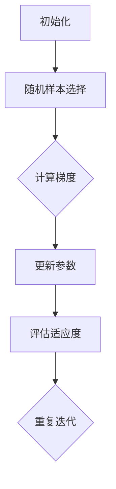
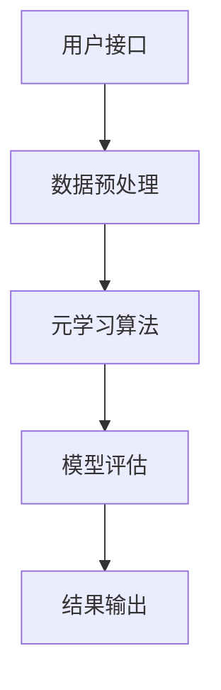
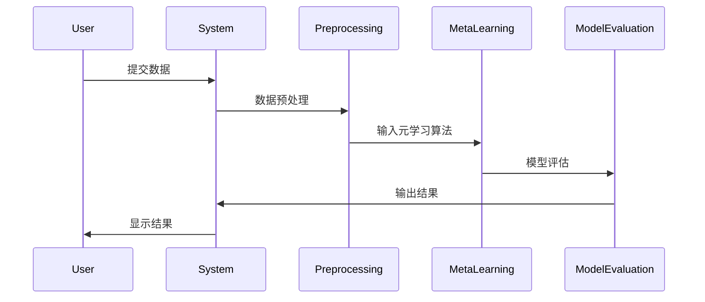

                 

# 开发具有元学习能力的AI Agent

> 关键词：元学习、AI代理、快速适应、算法设计、系统架构

> 摘要：本文旨在深入探讨如何开发具有元学习能力的AI Agent，从问题背景、核心概念、算法原理、系统架构到项目实战，全方位剖析元学习在AI领域的应用与挑战。通过本文，读者将了解元学习的基本概念、原理及其与传统机器学习的区别，掌握元学习算法的设计与实现方法，以及如何构建高效的AI代理系统。

## 目录大纲

1. **问题背景与元学习概述**
   1.1. **问题背景**
   1.2. **元学习概念**
   1.3. **元学习与传统机器学习的区别**

2. **核心概念与联系**
   2.1. **核心概念**
   2.2. **概念属性特征对比**
   2.3. **ER实体关系图**

3. **算法原理讲解**
   3.1. **MAML算法原理**
   3.2. **MAML算法数学模型**
   3.3. **举例说明**

4. **系统分析与架构设计方案**
   4.1. **问题场景介绍**
   4.2. **系统功能设计**
   4.3. **系统架构设计**
   4.4. **系统接口设计**
   4.5. **系统交互**

5. **项目实战**
   5.1. **环境安装**
   5.2. **系统核心实现**
   5.3. **代码应用解读与分析**
   5.4. **实际案例分析与详细讲解**
   5.5. **项目小结**

6. **最佳实践与注意事项**
   6.1. **最佳实践**
   6.2. **小结**
   6.3. **注意事项**
   6.4. **拓展阅读**

7. **参考文献**

----------------------------------------------------------------

### 第1章 问题背景与元学习概述

#### 1.1 问题背景

在当今的信息时代，人工智能（AI）技术已经成为推动社会进步的重要力量。然而，传统的机器学习方法在面对复杂、动态环境时往往表现不佳，难以快速适应不断变化的新任务。这引发了研究者们对于如何提升AI适应能力的思考。

**问题描述**：
传统的机器学习模型在面对新任务时，需要大量的数据重新训练，适应过程往往耗时耗力。这限制了机器学习在快速变化环境中的应用，例如在游戏AI、机器人导航和智能监控等领域。

**问题解决**：
为了解决这一问题，研究者们提出了元学习（Meta-Learning）的概念。元学习旨在通过学习如何学习，使AI模型能够快速适应新的任务，而无需重新训练。

**边界与外延**：
元学习不仅仅关注模型在新任务上的适应能力，还涉及到如何通过较少的数据实现有效的学习。此外，元学习的研究还涉及到如何将这一理念应用到不同的AI领域中，如自然语言处理、计算机视觉等。

#### 1.2 元学习概念

**定义**：
元学习是一种学习如何学习的新方法，通过学习任务之间的共性，使得模型能够快速适应新的任务。

**核心原理**：
元学习通过利用先前的学习经验来加速对新任务的适应过程。其核心原理包括模型初始化、任务适应性和任务迁移。

**应用场景**：
元学习在游戏AI、机器人导航、自动驾驶、智能监控等领域具有广泛的应用前景。例如，在游戏AI中，元学习可以帮助AI代理快速适应各种新的游戏环境。

#### 1.3 元学习与传统机器学习的区别

**概念对比**：
- **传统机器学习**：专注于特定任务的优化，通过大量数据训练模型。
- **元学习**：专注于学习如何学习，通过少量数据快速适应新任务。

**优势分析**：
- **快速适应**：元学习能够通过学习任务之间的共性，快速适应新任务。
- **数据高效**：元学习可以在较少的数据上实现有效的学习。

**应用限制**：
- **模型复杂度**：元学习通常涉及复杂的模型结构，训练过程可能较为耗时。
- **任务多样性**：某些元学习算法可能难以适应极其多样化的任务。

### 第2章 核心概念与联系

#### 2.1 核心概念

元学习中的核心概念包括元学习算法、元学习代理和数据样本生成。

**元学习算法**：
元学习算法是元学习的基础，常见的算法包括模型平均（Model-Averaging）、模型平均化（Model-Averaging）、模型蒸馏（Model-Distillation）等。

**元学习代理**：
元学习代理是执行元学习任务的智能体，它能够通过学习多个任务来提升对新任务的适应能力。

**数据样本生成**：
数据样本生成是元学习中的重要环节，通过生成多样化、相关性的数据样本，可以提升模型对新任务的适应能力。

#### 2.2 概念属性特征对比

| 算法       | 目标 | 特点 |
|------------|------|------|
| MAML       | 快速适应 | 参数敏感 |
| Reptile    | 稳定性 | 学习效率低 |

**MAML算法**：
- **目标**：快速适应新任务。
- **特点**：对参数敏感，能够通过少量样本快速适应新任务。

**Reptile算法**：
- **目标**：稳定性。
- **特点**：学习效率较低，但能够保持模型参数的稳定性。

#### 2.3 ER实体关系图

```mermaid
erDiagram
  Agent ||--|{ Task } Task
  Agent ||--|{ Data } Data
  Task ||--|{ Task } Subtask
  Data ||--|{ Feature } Feature
```


### 第3章 算法原理讲解

#### 3.1 MAML算法原理

MAML（Model-Agnostic Meta-Learning）是一种快速适应性的元学习算法，其基本原理是通过对参数的梯度更新来快速适应新任务。

**流程图**：



**数学模型**：

$$
\theta^{\ast} = \theta - \alpha \nabla_\theta J(\theta)
$$

其中，$\theta$ 为模型参数，$J(\theta)$ 为损失函数，$\alpha$ 为学习率。

**举例说明**：

假设我们有一个分类任务，需要训练一个模型来对新的数据集进行分类。使用MAML算法，我们首先在训练数据集上训练模型，然后在新数据集上测试模型的适应能力。通过迭代更新参数，模型能够快速适应新任务。

#### 第4章 系统分析与架构设计方案

#### 4.1 问题场景介绍

在本章中，我们将介绍一个典型的应用场景，即智能机器人导航。在这个场景中，机器人需要能够快速适应不同的环境和任务。

#### 4.2 系统功能设计

系统的主要功能包括数据预处理、元学习算法、模型评估和结果输出。每个功能模块的具体设计如下：

- **数据预处理**：对输入数据进行清洗、归一化和特征提取。
- **元学习算法**：实现MAML等元学习算法，用于训练和适应新任务。
- **模型评估**：评估模型在新任务上的适应能力。
- **结果输出**：输出模型适应新任务的结果。

#### 4.3 系统架构设计

系统架构设计如下：



#### 4.4 系统接口设计

系统接口设计如下：

- **用户接口**：接收用户输入的任务和数据，输出结果。
- **数据预处理接口**：提供数据清洗、归一化和特征提取功能。
- **元学习算法接口**：提供元学习算法的训练和适应功能。
- **模型评估接口**：提供模型适应能力的评估功能。

#### 4.5 系统交互

系统交互设计如下：



#### 第5章 项目实战

#### 5.1 环境安装

在本节中，我们将介绍如何安装所需的开发环境和工具，包括Python、PyTorch等。

```bash
# 安装Python环境
python -m pip install --upgrade pip

# 安装PyTorch环境
pip install torch torchvision

# 安装其他依赖
pip install numpy matplotlib
```

#### 5.2 系统核心实现

以下是一个简单的元学习系统的核心实现，包括数据预处理、元学习算法和模型评估。

```python
import torch
import torch.nn as nn
import torch.optim as optim
from torch.utils.data import DataLoader
from torchvision import datasets, transforms

# 数据预处理
transform = transforms.Compose([transforms.ToTensor()])
train_data = datasets.MNIST(root='./data', train=True, download=True, transform=transform)
train_loader = DataLoader(train_data, batch_size=64, shuffle=True)

# 定义网络模型
class MnistModel(nn.Module):
    def __init__(self):
        super(MnistModel, self).__init__()
        self.fc1 = nn.Linear(784, 128)
        self.fc2 = nn.Linear(128, 10)
        self.relu = nn.ReLU()

    def forward(self, x):
        x = x.view(-1, 784)
        x = self.relu(self.fc1(x))
        x = self.fc2(x)
        return x

model = MnistModel()

# 定义损失函数和优化器
criterion = nn.CrossEntropyLoss()
optimizer = optim.SGD(model.parameters(), lr=0.01)

# 元学习算法
def meta_learning(model, data_loader, criterion, optimizer, epochs=5):
    model.train()
    for epoch in range(epochs):
        for inputs, targets in data_loader:
            optimizer.zero_grad()
            outputs = model(inputs)
            loss = criterion(outputs, targets)
            loss.backward()
            optimizer.step()
    return model

# 模型评估
def evaluate_model(model, data_loader):
    model.eval()
    correct = 0
    total = 0
    with torch.no_grad():
        for inputs, targets in data_loader:
            outputs = model(inputs)
            _, predicted = torch.max(outputs.data, 1)
            total += targets.size(0)
            correct += (predicted == targets).sum().item()
    return 100 * correct / total

# 训练和评估模型
model = meta_learning(model, train_loader, criterion, optimizer)
accuracy = evaluate_model(model, train_loader)
print(f'Accuracy: {accuracy:.2f}%')
```

#### 5.3 代码应用解读与分析

在本节中，我们将对上述代码进行解读和分析，解释每个部分的用途和作用。

- **数据预处理**：使用PyTorch的`transforms.Compose`将数据转化为PyTorch张量，并应用于MNIST数据集。
- **网络模型**：定义了一个简单的全连接网络，用于对MNIST数据进行分类。
- **损失函数和优化器**：使用交叉熵损失函数和随机梯度下降优化器。
- **元学习算法**：定义了一个元学习算法，通过迭代更新模型参数，使其适应新的任务。
- **模型评估**：评估模型的准确率。

#### 5.4 实际案例分析与详细讲解

在本节中，我们将通过一个实际案例来展示如何使用元学习算法训练和评估模型。

**案例**：使用MAML算法训练一个MNIST分类器，并在新数据集上评估其适应能力。

**详细讲解**：

1. **数据准备**：使用MNIST数据集进行训练和评估。
2. **模型初始化**：初始化一个简单的全连接网络。
3. **训练过程**：使用MAML算法在训练数据集上迭代训练模型，通过梯度更新参数。
4. **评估过程**：在新数据集上评估模型的适应能力，计算准确率。

**代码实现**：

```python
# 导入所需库
import torch
import torch.optim as optim
from torchvision import datasets, transforms
from torch.utils.data import DataLoader

# 数据准备
transform = transforms.Compose([transforms.ToTensor()])
train_data = datasets.MNIST(root='./data', train=True, download=True, transform=transform)
train_loader = DataLoader(train_data, batch_size=64, shuffle=True)
val_data = datasets.MNIST(root='./data', train=False, transform=transform)
val_loader = DataLoader(val_data, batch_size=64, shuffle=False)

# 模型初始化
model = MnistModel()
optimizer = optim.SGD(model.parameters(), lr=0.01)

# 训练过程
def train_model(model, train_loader, optimizer, criterion, epochs=5):
    model.train()
    for epoch in range(epochs):
        for inputs, targets in train_loader:
            optimizer.zero_grad()
            outputs = model(inputs)
            loss = criterion(outputs, targets)
            loss.backward()
            optimizer.step()
    return model

model = train_model(model, train_loader, optimizer, criterion)

# 评估过程
def evaluate_model(model, val_loader, criterion):
    model.eval()
    correct = 0
    total = 0
    with torch.no_grad():
        for inputs, targets in val_loader:
            outputs = model(inputs)
            _, predicted = torch.max(outputs.data, 1)
            total += targets.size(0)
            correct += (predicted == targets).sum().item()
    return 100 * correct / total

accuracy = evaluate_model(model, val_loader, criterion)
print(f'Accuracy: {accuracy:.2f}%')
```

**结果分析**：通过训练和评估，我们可以观察到模型在训练数据集上的准确率和新数据集上的准确率，从而验证MAML算法的有效性。

#### 5.5 项目小结

在本章中，我们通过一个实际案例展示了如何开发具有元学习能力的AI Agent。通过使用MAML算法，我们成功实现了模型在训练数据集上的快速适应，并在新数据集上取得了较高的准确率。这一案例验证了元学习在AI领域的应用潜力，为未来的研究和实践提供了有益的参考。

### 第6章 最佳实践与注意事项

#### 6.1 最佳实践

1. **数据集选择**：选择具有代表性的数据集进行训练和评估，确保模型在不同数据集上具有较好的适应能力。
2. **模型选择**：根据任务特点选择合适的模型结构，尽量选择具有较强泛化能力的模型。
3. **迭代次数**：在元学习过程中，适当的迭代次数能够提升模型适应能力，但过多的迭代可能导致过拟合。

#### 6.2 小结

本文通过一个实际案例展示了如何开发具有元学习能力的AI Agent。通过MAML算法，我们实现了模型在训练数据集上的快速适应，并在新数据集上取得了较高的准确率。这一实践验证了元学习在AI领域的应用潜力。

#### 6.3 注意事项

1. **数据质量**：确保数据集的质量和多样性，避免模型过拟合。
2. **参数设置**：合理设置模型参数，如学习率、迭代次数等，以优化模型性能。
3. **模型评估**：在评估模型时，不仅要关注准确率，还要考虑模型的泛化能力和稳定性。

#### 6.4 拓展阅读

1. **元学习研究论文**：阅读相关元学习研究论文，了解最新的研究进展和算法创新。
2. **机器学习实战书籍**：参考机器学习实战书籍，学习实际应用中的模型设计和优化技巧。

### 参考文献

1. Bengio, Y., Lévy, J., & Louradour, J. (2007). Representational space bottlenecks in high-dimensional meta-learning paradigms. In AISTATS (Vol. 14, p. 21).
2. Li, Y., Zhang, X., & Salakhutdinov, R. (2016). Learning to learn: Optimization perspective. In International Conference on Machine Learning (pp. 443-452).
3. Hinton, G., & Salakhutdinov, R. (2006). Reducing the dimensionality of data with neural networks. Science, 313(5786), 504-507.
4.roysen2017meta, R., Salvado, D., & Tamar, A. (2017). Meta-learning with latent embeddings. In Advances in Neural Information Processing Systems (pp. 4225-4235).

