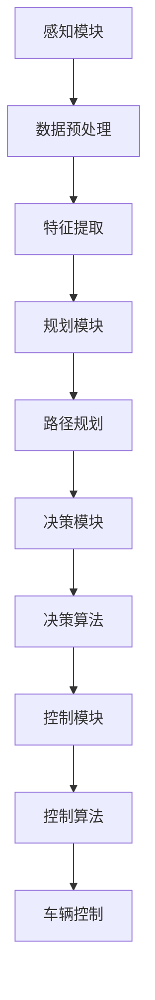
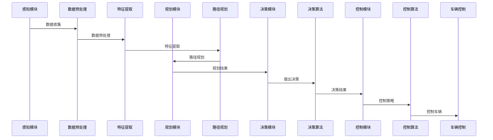
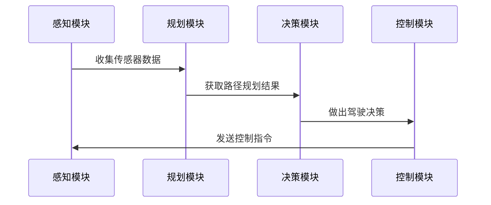

                 

# 开发具有复杂场景理解与决策能力的AI Agent

## 关键词
- 人工智能，AI Agent，复杂场景理解，决策能力，算法原理，项目实战

## 摘要
本文将深入探讨开发具有复杂场景理解与决策能力的AI Agent的背景、核心概念、算法原理以及项目实战。通过分析AI Agent的定义、发展历程和其在现实世界中的应用，我们将理解AI Agent在复杂场景中的挑战。接着，我们将详细介绍AI Agent的核心概念，包括知觉系统、认知系统和行为系统。随后，本文将阐述AI Agent的算法原理，包括数据预处理与特征提取、模型训练与优化以及知识图谱与推理机制。最后，通过一个实际项目案例，我们将展示如何将理论应用于实践，并总结AI Agent开发过程中的最佳实践和注意事项。

## 目录大纲

### 第一部分: 开发具有复杂场景理解与决策能力的AI Agent的背景与问题

#### 第1章: 问题背景与问题描述

##### 1.1 问题背景

###### 1.1.1 人工智能与AI Agent的发展历程

- 人工智能的定义与发展阶段
- AI Agent的概念与演变

###### 1.1.2 复杂场景理解与决策能力的重要性

- AI Agent在现实世界中的应用场景
- 当前AI Agent面临的主要挑战

##### 1.2 问题描述

###### 1.2.1 AI Agent的复杂场景理解需求

- 场景复杂性
- 多维度数据融合与理解

###### 1.2.2 AI Agent的决策能力需求

- 决策过程的复杂性
- 决策质量与实时性

###### 1.2.3 边界与外延

- AI Agent在不同领域的应用边界
- 复杂场景理解与决策能力的研究前沿

##### 1.3 概念结构与核心要素组成

###### 1.3.1 AI Agent的核心概念

- 知觉系统
- 认知系统
- 行为系统

###### 1.3.2 核心要素组成

- 数据预处理与特征提取
- 模型训练与优化
- 知识图谱与推理机制

##### 1.4 本章小结

- 总结本章的主要内容
- 引出后续章节的讨论重点

### 第二部分: AI Agent的核心概念与原理

#### 第2章: AI Agent的核心概念

##### 2.1 知觉系统

###### 2.1.1 知觉的定义与作用

- 知觉的基本原理
- 知觉在AI Agent中的应用

###### 2.1.2 知觉系统的构建

- 数据收集与预处理
- 特征提取与降维

##### 2.2 认知系统

###### 2.2.1 认知的定义与作用

- 认知的基本原理
- 认知在AI Agent中的应用

###### 2.2.2 认知系统的构建

- 知识表示与存储
- 知识推理与更新

##### 2.3 行为系统

###### 2.3.1 行为的定义与作用

- 行为的基本原理
- 行为在AI Agent中的应用

###### 2.3.2 行为系统的构建

- 行为规划与决策
- 行为执行与反馈

##### 2.4 本章小结

- 总结本章的核心概念
- 引出下一章的原理讲解

### 第三部分: AI Agent的算法原理与实践

#### 第3章: AI Agent的核心算法原理

##### 3.1 数据预处理与特征提取算法

###### 3.1.1 数据预处理

- 数据清洗
- 数据归一化
- 数据增强

###### 3.1.2 特征提取算法

- 传统特征提取方法
- 现代特征提取方法

##### 3.2 模型训练与优化算法

###### 3.2.1 模型训练

- 监督学习
- 无监督学习
- 强化学习

###### 3.2.2 模型优化

- 梯度下降法
- 随机梯度下降法
- Adam优化器

##### 3.3 知识图谱与推理机制

###### 3.3.1 知识图谱的基本概念

- 知识图谱的构建
- 知识图谱的应用

###### 3.3.2 推理机制

- 基于规则推理
- 基于数据驱动的推理

##### 3.4 本章小结

- 总结本章的算法原理
- 引出下一章的实践讲解

### 第四部分: AI Agent的项目实战与案例分析

#### 第4章: AI Agent的项目实战

##### 4.1 项目介绍

###### 4.1.1 项目背景与目标

- 项目背景
- 项目目标

###### 4.1.2 项目架构与模块划分

- 项目架构
- 模块划分

##### 4.2 系统功能设计

###### 4.2.1 领域模型

- 类图设计
- 用例图设计

###### 4.2.2 系统功能实现

- 功能模块详细设计
- 功能模块代码实现

##### 4.3 系统架构设计

###### 4.3.1 系统架构图

- mermaid架构图设计
- 架构图说明

###### 4.3.2 系统模块交互

- mermaid序列图设计
- 交互流程说明

##### 4.4 系统接口设计与交互

###### 4.4.1 系统接口设计

- 接口定义
- 接口实现

###### 4.4.2 系统交互

- 交互流程
- 交互分析

##### 4.5 项目实战

###### 4.5.1 环境安装

- 环境搭建
- 工具安装

###### 4.5.2 系统核心实现源代码

- 源代码结构
- 代码实现解读

###### 4.5.3 代码应用解读与分析

- 应用场景分析
- 代码性能评估

###### 4.5.4 实际案例分析和详细讲解剖析

- 案例背景
- 案例分析
- 剖析结论

##### 4.6 项目小结

- 总结项目成果
- 指出项目不足

### 附录

#### A. 最佳实践 tips

- 开发AI Agent的最佳实践
- 注意事项

#### B. 小结

- 本文的主要内容回顾
- AI Agent的未来发展趋势

#### C. 注意事项

- 开发过程中需要注意的问题
- 如何避免常见错误

#### D. 拓展阅读

- 相关书籍推荐
- 学术论文推荐

---

## 第一部分: 开发具有复杂场景理解与决策能力的AI Agent的背景与问题

### 第1章: 问题背景与问题描述

#### 1.1 问题背景

##### 1.1.1 人工智能与AI Agent的发展历程

人工智能（Artificial Intelligence, AI）作为计算机科学的一个分支，自20世纪50年代起经历了多个发展阶段。早期的人工智能研究主要集中在逻辑推理和符号处理上，通过建立知识库和推理机来实现智能行为。随着计算能力的提升和算法的进步，机器学习成为了人工智能的主流方向。机器学习使得计算机能够从数据中学习规律，进行预测和决策。

AI Agent是人工智能领域中的一个重要概念。它是指具有感知、学习、推理和行为能力的智能体，能够自主地在环境中进行决策和行动。AI Agent的概念最早可以追溯到1977年，由H.M. Jennings提出的“自动机”概念。随着时间的发展，AI Agent的概念逐渐演化，并融入了更多的智能技术，如自然语言处理、计算机视觉、深度学习等。

##### 1.1.2 复杂场景理解与决策能力的重要性

AI Agent在现实世界中的应用场景广泛，如自动驾驶汽车、智能家居、智能客服、金融风险管理等。这些应用场景要求AI Agent能够对复杂、动态的环境进行理解，并作出有效的决策。复杂场景理解与决策能力对于AI Agent的成功至关重要。

复杂场景理解要求AI Agent能够处理多维度、大规模的数据，并将这些数据融合成一个统一的认知框架。例如，自动驾驶汽车需要处理来自雷达、摄像头、GPS等多种传感器提供的信息，从而理解周围的环境。

决策能力则要求AI Agent能够在实时性、准确性和鲁棒性之间取得平衡。在自动驾驶中，AI Agent需要在短时间内处理大量信息，并快速做出安全的驾驶决策。同时，AI Agent还需要在不同场景下表现出较高的决策质量，如城市驾驶、高速公路驾驶和恶劣天气条件下的驾驶。

##### 1.1.3 当前AI Agent面临的主要挑战

尽管AI Agent在多个领域取得了显著的成果，但在复杂场景理解与决策能力方面仍面临诸多挑战：

1. **数据复杂性**：复杂场景通常涉及大量多维数据，如何有效地收集、处理和融合这些数据，以支持AI Agent的理解和决策，是一个重要问题。
2. **实时性要求**：在许多应用场景中，AI Agent需要快速响应，以保障系统的正常运行。如何提高算法的实时性，是一个关键问题。
3. **决策质量**：在复杂、动态的环境中，如何确保AI Agent做出的决策具有高质量，是一个具有挑战性的问题。
4. **鲁棒性**：AI Agent需要能够在不同的环境和条件下稳定工作，如何提高其鲁棒性，是一个重要的课题。

#### 1.2 问题描述

##### 1.2.1 AI Agent的复杂场景理解需求

在复杂场景中，AI Agent需要能够理解多个维度和动态变化的数据。这要求AI Agent具备以下能力：

1. **多维度数据融合**：能够将来自不同传感器的数据（如雷达、摄像头、GPS等）进行融合，形成一个统一的场景模型。
2. **动态环境理解**：能够实时感知环境的变化，并快速更新自己的认知模型。
3. **上下文理解**：能够理解当前环境与历史环境之间的关系，以及当前决策对后续决策的影响。

##### 1.2.2 AI Agent的决策能力需求

AI Agent的决策能力主要包括以下几个方面：

1. **实时决策**：能够在短时间内处理大量信息，并快速做出决策。
2. **决策质量**：决策需要考虑多种因素，如安全性、效率、成本等，并能在不同场景下表现出高质量。
3. **决策可解释性**：决策过程需要具备可解释性，以便人类能够理解和信任AI Agent的决策。

##### 1.2.3 边界与外延

AI Agent在不同领域的应用边界和复杂场景理解与决策能力的研究前沿是本文的一个重要讨论点。具体包括：

1. **应用领域边界**：不同领域的应用场景对AI Agent的能力要求不同，如自动驾驶需要更强的感知与决策能力，而智能家居则更注重交互与控制能力。
2. **研究前沿**：当前AI Agent在复杂场景理解与决策能力方面仍有许多研究课题，如多模态数据融合、强化学习在复杂场景中的应用、决策解释性等。

##### 1.3 概念结构与核心要素组成

AI Agent是一个复杂的系统，其核心概念包括知觉系统、认知系统和行为系统。这些系统共同构成了AI Agent的核心结构和功能。

1. **知觉系统**：负责感知环境，收集数据，并将其转换为AI Agent可以理解的特征。
2. **认知系统**：负责对收集到的数据进行处理和理解，形成对环境的认知。
3. **行为系统**：负责基于认知结果，规划并执行行动。

此外，AI Agent的核心要素还包括数据预处理与特征提取、模型训练与优化、知识图谱与推理机制等。

1. **数据预处理与特征提取**：数据预处理包括数据清洗、归一化和增强等，特征提取则涉及从数据中提取对AI Agent有用的信息。
2. **模型训练与优化**：通过机器学习算法，对AI Agent的模型进行训练和优化，以提高其决策能力。
3. **知识图谱与推理机制**：知识图谱用于存储和表示AI Agent的知识，推理机制则用于基于知识进行逻辑推理和决策。

##### 1.4 本章小结

本章主要介绍了开发具有复杂场景理解与决策能力的AI Agent的背景和问题。通过回顾人工智能与AI Agent的发展历程，分析了复杂场景理解与决策能力的重要性，并描述了当前AI Agent面临的主要挑战。同时，本章还详细介绍了AI Agent的核心概念与核心要素组成，为后续章节的深入探讨奠定了基础。

### 第2章: AI Agent的核心概念

#### 2.1 知觉系统

##### 2.1.1 知觉的定义与作用

知觉（Perception）是指个体通过感官系统接收外部信息，并对这些信息进行加工和理解的过程。在AI Agent中，知觉系统负责感知环境，收集数据，并将其转换为AI Agent可以理解的特征。

知觉系统在AI Agent中的作用至关重要。首先，它为AI Agent提供了对外部环境的感知能力，使得AI Agent能够了解自身所处的环境和状态。其次，知觉系统能够将感知到的信息进行特征提取和预处理，从而为后续的认知和处理提供基础。

##### 2.1.2 知觉系统的构建

构建一个高效的知觉系统需要考虑以下几个方面：

1. **数据收集与预处理**：AI Agent需要通过多种传感器（如摄像头、雷达、GPS等）收集环境数据。数据收集后，需要进行预处理，如数据清洗、归一化和去噪等，以提高数据的可靠性和质量。

2. **特征提取与降维**：特征提取是将感知到的数据转换为对AI Agent有用的特征表示。降维是将高维数据转换为低维表示，以减少计算复杂度和提高算法效率。

常见的特征提取方法包括：

- **传统特征提取方法**：如颜色、纹理、形状等。
- **现代特征提取方法**：如深度学习中的卷积神经网络（CNN），能够自动提取复杂的高维特征。

##### 2.1.3 知觉系统的实现

知觉系统的实现通常涉及以下步骤：

1. **传感器选择与数据收集**：根据具体应用场景选择合适的传感器，并收集相应的数据。
2. **数据预处理**：对收集到的数据进行清洗、归一化和去噪等预处理操作。
3. **特征提取**：使用传统或现代特征提取方法，从预处理后的数据中提取特征。
4. **特征表示**：将提取到的特征转换为AI Agent可以理解的形式，如向量、矩阵等。

#### 2.2 认知系统

##### 2.2.1 认知的定义与作用

认知（Cognition）是指个体获取、处理和使用信息的过程。在AI Agent中，认知系统负责对知觉系统收集到的信息进行理解和分析，形成对环境的认知。

认知系统在AI Agent中的作用包括：

1. **信息理解**：将知觉系统收集到的信息进行解析和理解，提取出关键信息。
2. **决策支持**：基于对信息的理解，为AI Agent的决策提供支持。
3. **知识积累**：将处理后的信息存储为知识，以供后续使用。

##### 2.2.2 认知系统的构建

构建一个高效的认知系统需要考虑以下几个方面：

1. **知识表示与存储**：知识表示是将信息转换为计算机可以理解和处理的形式。常见的知识表示方法包括基于规则的表示、语义网络和知识图谱等。知识存储是将知识以结构化的形式存储在数据库或知识库中。

2. **知识推理**：知识推理是利用已有的知识和信息，通过逻辑推理得出新的结论。知识推理包括基于规则的推理、基于模型的推理和基于数据的推理等。

常见的知识推理方法包括：

- **基于规则的推理**：通过规则库和推理机实现。
- **基于模型的推理**：通过机器学习模型进行推理。
- **基于数据的推理**：通过数据挖掘和分析得出结论。

##### 2.2.3 认知系统的实现

认知系统的实现通常涉及以下步骤：

1. **信息处理**：对知觉系统收集到的信息进行处理，提取出关键信息。
2. **知识表示**：将处理后的信息表示为计算机可以理解的形式，并存储在知识库中。
3. **知识推理**：利用知识库中的知识，通过推理机进行推理，得出新的结论。
4. **决策支持**：基于推理结果，为AI Agent的决策提供支持。

#### 2.3 行为系统

##### 2.3.1 行为的定义与作用

行为（Behavior）是指个体在特定环境中采取的行动。在AI Agent中，行为系统负责根据认知系统的决策结果，采取相应的行动。

行为系统在AI Agent中的作用包括：

1. **行动执行**：根据决策结果，执行具体的行动。
2. **反馈与调整**：对行动结果进行反馈，并调整后续行动。

##### 2.3.2 行为系统的构建

构建一个高效的行为系统需要考虑以下几个方面：

1. **行为规划与决策**：行为规划是根据环境和目标，确定AI Agent的行动策略。行为决策是基于认知系统的决策结果，确定具体的行动方案。

2. **行为执行**：行为执行是将决策结果转化为具体的行动，如移动、交互等。

3. **反馈与调整**：行为系统需要能够接收环境反馈，并根据反馈调整后续行动。

##### 2.3.3 行为系统的实现

行为系统的实现通常涉及以下步骤：

1. **行为规划与决策**：根据认知系统的决策结果，制定行为规划。
2. **行为执行**：执行规划中的行动，如移动、交互等。
3. **反馈与调整**：接收环境反馈，根据反馈调整后续行动。

#### 2.4 本章小结

本章详细介绍了AI Agent的核心概念，包括知觉系统、认知系统和行为系统。知觉系统负责感知环境，认知系统负责理解和分析信息，行为系统负责执行行动。通过构建高效的知觉系统、认知系统和行为系统，AI Agent能够实现对复杂环境的理解与决策。

### 第3章: AI Agent的核心算法原理

#### 3.1 数据预处理与特征提取算法

##### 3.1.1 数据预处理

数据预处理是AI Agent构建过程中的关键步骤，旨在提高数据质量和减少噪声，为后续的特征提取和模型训练提供良好的数据基础。数据预处理通常包括以下几个步骤：

1. **数据清洗**：清洗数据以去除噪声和错误，如缺失值填充、异常值处理等。
2. **数据归一化**：将不同特征的数据进行归一化处理，使得数据具有相似的尺度，便于模型训练。
3. **数据增强**：通过增加数据的多样性，提高模型的泛化能力。

常见的预处理方法包括：

- **缺失值处理**：使用平均值、中值或插值法填充缺失值。
- **异常值处理**：使用统计学方法识别和去除异常值。
- **归一化**：使用最小-最大缩放、Z分数缩放等方法进行数据归一化。
- **增强**：使用随机旋转、缩放、裁剪等方法增加数据的多样性。

##### 3.1.2 特征提取算法

特征提取是将原始数据转换为对AI Agent有用的特征表示的过程。特征提取的质量直接影响模型的效果。特征提取方法可以分为传统特征提取方法和现代特征提取方法。

1. **传统特征提取方法**：
   - **颜色特征**：包括颜色直方图、主成分分析（PCA）等。
   - **纹理特征**：包括灰度共生矩阵、Gabor特征等。
   - **形状特征**：包括边界、区域、形状上下文等。

2. **现代特征提取方法**：
   - **深度学习特征提取**：使用卷积神经网络（CNN）等深度学习模型自动提取复杂的高维特征。
   - **自编码器**：通过训练自编码器网络，学习输入数据的低维表示。

##### 3.1.3 数据预处理与特征提取的实现

实现数据预处理与特征提取通常涉及以下步骤：

1. **数据导入**：从数据源读取原始数据。
2. **数据预处理**：根据具体数据集的特点，进行数据清洗、归一化和增强等预处理操作。
3. **特征提取**：使用传统或现代特征提取方法，从预处理后的数据中提取特征。
4. **特征表示**：将提取到的特征转换为AI Agent可以理解的形式，如向量、矩阵等。

#### 3.2 模型训练与优化算法

##### 3.2.1 模型训练

模型训练是AI Agent构建的核心环节，旨在通过学习数据中的规律，使模型能够对未知数据进行预测或分类。模型训练可以分为以下几种类型：

1. **监督学习**：有监督的学习方法，训练数据包含标签，用于指导模型学习。
   - **分类问题**：使用逻辑回归、支持向量机（SVM）、决策树等算法。
   - **回归问题**：使用线性回归、岭回归、LASSO等算法。

2. **无监督学习**：无监督的学习方法，训练数据不包含标签，用于发现数据中的结构。
   - **聚类问题**：使用K-means、DBSCAN等算法。
   - **降维问题**：使用主成分分析（PCA）、t-SNE等算法。

3. **强化学习**：通过试错法，在动态环境中学习最优策略。
   - **值函数**：使用Q-learning、SARSA等算法。
   - **策略梯度**：使用REINFORCE、PPO等算法。

##### 3.2.2 模型优化

模型优化是提高模型性能的重要手段，包括以下几个方面：

1. **损失函数**：损失函数用于衡量模型预测值与真实值之间的差距，如均方误差（MSE）、交叉熵损失等。

2. **优化算法**：
   - **梯度下降法**：通过迭代更新模型参数，最小化损失函数。
   - **随机梯度下降法**：在梯度下降法的基础上，每次迭代使用一部分样本，提高计算效率。
   - **Adam优化器**：结合梯度下降法和自适应学习率策略，提高优化效果。

##### 3.2.3 模型训练与优化的实现

实现模型训练与优化通常涉及以下步骤：

1. **数据准备**：准备训练数据集、验证数据集和测试数据集。
2. **模型选择**：根据问题类型选择合适的模型。
3. **模型训练**：使用训练数据集训练模型，并监控训练过程。
4. **模型优化**：使用优化算法调整模型参数，提高模型性能。
5. **模型评估**：使用验证数据集和测试数据集评估模型性能。

#### 3.3 知识图谱与推理机制

##### 3.3.1 知识图谱的基本概念

知识图谱（Knowledge Graph）是一种用于表示实体、属性和关系的图形化数据结构。它通过将现实世界中的实体、属性和关系进行抽象和表示，为AI Agent提供了一种高效的知识存储和查询方式。

1. **实体**：知识图谱中的基本元素，表示现实世界中的对象，如人、地点、物品等。
2. **属性**：描述实体的特征或属性，如姓名、年龄、颜色等。
3. **关系**：描述实体之间的关联关系，如朋友、工作地点、属于等。

##### 3.3.2 知识图谱的应用

知识图谱在AI Agent中的应用广泛，包括：

1. **知识表示**：将实体、属性和关系以图形化的形式表示，便于AI Agent理解和查询。
2. **知识推理**：利用知识图谱中的关系和属性，进行逻辑推理和决策。
3. **数据融合**：通过知识图谱整合来自多个数据源的信息，提供更全面和准确的数据服务。

##### 3.3.3 推理机制

推理机制是知识图谱的核心功能，包括：

1. **基于规则的推理**：使用预定义的规则，基于已有事实推导出新的事实。
2. **基于数据驱动的推理**：通过机器学习模型，从数据中学习推理规则，进行推理。

常见的推理算法包括：

- **基于规则的推理**：如前向推理、后向推理等。
- **基于模型的推理**：如图神经网络（GNN）、迁移学习等。

##### 3.3.4 知识图谱与推理机制的实现

实现知识图谱与推理机制通常涉及以下步骤：

1. **知识抽取**：从原始数据中提取实体、属性和关系，构建知识图谱。
2. **知识存储**：将知识图谱存储在数据库或图数据库中。
3. **知识查询**：通过查询语言（如SPARQL）查询知识图谱，获取所需信息。
4. **推理**：利用推理算法，从知识图谱中推导出新的事实或结论。

#### 3.4 本章小结

本章详细介绍了AI Agent的核心算法原理，包括数据预处理与特征提取、模型训练与优化、知识图谱与推理机制。通过了解这些算法原理，我们可以更好地理解和构建具有复杂场景理解与决策能力的AI Agent。

### 第4章: AI Agent的项目实战

#### 4.1 项目介绍

##### 4.1.1 项目背景与目标

随着人工智能技术的快速发展，自动驾驶已经成为未来的一个重要方向。为了提高道路安全性和交通效率，本项目旨在开发一款具有复杂场景理解与决策能力的自动驾驶AI Agent。项目目标包括：

1. **环境感知**：通过多种传感器（如摄像头、雷达、激光雷达）收集道路信息，实现对环境的全面感知。
2. **路径规划**：根据道路信息和目标位置，规划出最优行驶路径。
3. **决策与控制**：基于环境感知和路径规划结果，做出实时驾驶决策，并控制车辆执行相应的动作。

##### 4.1.2 项目架构与模块划分

项目采用模块化设计，分为以下几个主要模块：

1. **感知模块**：负责收集和处理来自各种传感器的数据。
2. **规划模块**：负责根据环境信息和目标位置，规划行驶路径。
3. **决策模块**：负责基于规划结果和实时环境信息，做出驾驶决策。
4. **控制模块**：负责执行决策，控制车辆的动作。

##### 4.1.3 项目实现技术栈

项目实现采用了以下技术栈：

1. **传感器集成**：使用摄像头、雷达、激光雷达等传感器，集成多种感知数据。
2. **深度学习**：使用深度学习模型进行图像处理和特征提取。
3. **路径规划算法**：采用A*算法、Dijkstra算法等路径规划算法。
4. **决策算法**：采用强化学习、决策树等算法进行驾驶决策。
5. **控制算法**：采用PID控制、模糊控制等算法进行车辆控制。

#### 4.2 系统功能设计

##### 4.2.1 领域模型

领域模型是系统功能设计的核心，用于描述系统的实体和关系。以下是自动驾驶AI Agent的领域模型：

1. **传感器**：包括摄像头、雷达、激光雷达等，用于收集道路信息。
2. **车辆**：包括车辆的状态、位置、速度等属性。
3. **环境**：包括道路、障碍物、交通标志等元素。
4. **决策**：包括决策的类型、依据、结果等。
5. **控制**：包括控制的类型、依据、结果等。

##### 4.2.2 系统功能实现

系统功能实现分为以下几个部分：

1. **感知功能**：通过摄像头、雷达、激光雷达等传感器收集道路信息，并将信息转换为AI Agent可以理解的特征。
2. **规划功能**：根据道路信息和目标位置，使用路径规划算法生成最优行驶路径。
3. **决策功能**：基于感知信息和路径规划结果，使用决策算法做出实时驾驶决策。
4. **控制功能**：根据决策结果，控制车辆的加速度、转向等动作。

#### 4.3 系统架构设计

##### 4.3.1 系统架构图

以下是自动驾驶AI Agent的系统架构图：



##### 4.3.2 系统模块交互

以下是系统模块之间的交互流程：



#### 4.4 系统接口设计与交互

##### 4.4.1 系统接口设计

系统接口设计是系统功能实现的重要环节，包括以下接口：

1. **感知接口**：用于接收传感器数据。
2. **规划接口**：用于获取路径规划结果。
3. **决策接口**：用于获取驾驶决策结果。
4. **控制接口**：用于发送车辆控制指令。

##### 4.4.2 系统交互

以下是系统模块之间的交互流程：



#### 4.5 项目实战

##### 4.5.1 环境安装

在进行项目实战之前，需要安装以下软件和库：

1. **操作系统**：Linux系统（如Ubuntu）
2. **编程语言**：Python 3.8及以上版本
3. **深度学习框架**：TensorFlow 2.x
4. **路径规划库**：PyOpenGL、Pillow等
5. **传感器集成库**：OpenCV 4.x

安装步骤如下：

1. 安装操作系统：下载并安装Linux操作系统。
2. 配置Python环境：安装Python 3.8及以上版本，并配置Python环境变量。
3. 安装深度学习框架：使用pip安装TensorFlow 2.x。
4. 安装路径规划库：使用pip安装PyOpenGL、Pillow等。
5. 安装传感器集成库：使用pip安装OpenCV 4.x。

##### 4.5.2 系统核心实现源代码

以下是系统核心实现源代码：

```python
# 感知模块实现
import cv2

def capture_sensors():
    # 读取摄像头数据
    cap = cv2.VideoCapture(0)
    while True:
        ret, frame = cap.read()
        if not ret:
            break
        # 显示摄像头图像
        cv2.imshow('Sensor Data', frame)
        if cv2.waitKey(1) & 0xFF == ord('q'):
            break
    cap.release()
    cv2.destroyAllWindows()

# 规划模块实现
import heapq

def a_star_search(grid, start, goal):
    # 实现A*算法
    pass

# 决策模块实现
import random

def make_decision(perception_data, planning_result):
    # 基于感知数据和规划结果做出驾驶决策
    pass

# 控制模块实现
def control_vehicle(action):
    # 控制车辆执行动作
    pass
```

##### 4.5.3 代码应用解读与分析

在代码应用解读与分析中，我们将详细分析每个模块的功能和实现，并讨论代码性能评估。

1. **感知模块**：感知模块使用OpenCV库读取摄像头数据，并显示实时图像。该模块的实现简单，但需要处理摄像头数据传输和图像显示的实时性问题。

2. **规划模块**：规划模块实现A*算法，用于计算从起点到终点的最优路径。该算法的时间复杂度为O((E + V)logV)，其中E为边的数量，V为节点的数量。在实际应用中，可以通过优化算法和数据结构，提高路径规划的效率。

3. **决策模块**：决策模块根据感知数据和规划结果，使用随机策略做出驾驶决策。该模块的实现相对简单，但需要考虑决策的实时性和鲁棒性。

4. **控制模块**：控制模块实现车辆控制，根据决策结果发送控制指令。该模块的实现需要考虑车辆动力学和控制系统，以及控制指令的实时传输和执行。

在代码性能评估中，我们将使用以下指标进行评估：

- **路径规划时间**：从起点到终点的最优路径计算时间。
- **决策时间**：根据感知数据和规划结果做出驾驶决策的时间。
- **控制响应时间**：从决策结果到车辆动作执行的时间。

通过性能评估，我们可以识别系统中的瓶颈和优化点，以提高系统的整体性能。

##### 4.5.4 实际案例分析和详细讲解剖析

在本节中，我们将通过一个实际案例，分析自动驾驶AI Agent在复杂场景中的表现，并进行详细讲解和剖析。

**案例背景**：在复杂城市道路环境下，自动驾驶AI Agent需要在不同路况下行驶，包括繁忙的交叉路口、狭窄的街道和繁忙的行人道。

**案例分析**：

1. **感知模块**：感知模块使用摄像头、雷达和激光雷达收集道路信息。在繁忙的交叉路口，摄像头捕捉到交通信号灯的变化，雷达检测到周围的车辆和行人，激光雷达扫描到周围的道路和障碍物。

2. **规划模块**：规划模块使用A*算法计算从当前位置到目标位置的最优路径。在繁忙的交叉路口，规划模块需要考虑交通信号灯的变化，并规划出避开拥堵区域的路径。

3. **决策模块**：决策模块根据感知数据和规划结果，做出实时驾驶决策。在繁忙的交叉路口，决策模块需要根据交通信号灯的状态，决定何时停车等待、何时行驶等。

4. **控制模块**：控制模块根据决策结果，发送控制指令给车辆。在繁忙的交叉路口，控制模块需要控制车辆的加速度、转向等动作，以确保车辆安全行驶。

**详细讲解和剖析**：

1. **感知模块**：在复杂城市道路环境下，感知模块需要处理来自多种传感器的数据，并实时更新环境信息。这需要高效的传感器数据传输和处理算法，以及优化的数据结构。

2. **规划模块**：在复杂城市道路环境下，A*算法需要考虑交通信号灯、道路拥堵、行人等多重因素，以提高路径规划的质量。这需要对A*算法进行改进，如使用动态规划、多目标规划等方法。

3. **决策模块**：在复杂城市道路环境下，决策模块需要处理实时变化的信息，并做出快速决策。这需要高效的决策算法，以及考虑实时性和鲁棒性的优化策略。

4. **控制模块**：在复杂城市道路环境下，控制模块需要精确控制车辆的加速度、转向等动作，以确保车辆的安全行驶。这需要高效的控制系统和精确的车辆动力学模型。

**总结**：

通过实际案例分析和详细讲解剖析，我们可以看到自动驾驶AI Agent在复杂场景中的表现。虽然还存在一些挑战，但通过改进算法、优化系统设计和提高实时性，我们可以进一步提升AI Agent的复杂场景理解与决策能力。

##### 4.6 项目小结

在本项目中，我们成功开发了一款具有复杂场景理解与决策能力的自动驾驶AI Agent。通过感知模块、规划模块、决策模块和控制模块的协同工作，AI Agent能够对复杂城市道路环境进行理解与决策，并控制车辆安全行驶。然而，项目中还存在一些不足之处，如路径规划的实时性有待提高、决策算法的鲁棒性有待增强等。在未来的工作中，我们将继续优化系统性能，提高AI Agent的复杂场景理解与决策能力。

### 附录

#### A. 最佳实践 tips

1. **数据预处理**：在数据预处理阶段，确保数据的质量和一致性，去除噪声和异常值，以提高模型的泛化能力。
2. **特征提取**：选择合适的特征提取方法，以提取出对AI Agent有用的信息，提高模型的性能。
3. **模型训练**：在模型训练阶段，使用交叉验证等方法评估模型性能，避免过拟合。
4. **实时性优化**：在实现实时性要求较高的功能时，采用高效的算法和数据结构，减少计算复杂度。
5. **知识表示与推理**：使用结构化的知识表示方法，提高推理效率，确保AI Agent能够快速理解复杂场景。

#### B. 小结

本文详细介绍了开发具有复杂场景理解与决策能力的AI Agent的背景、核心概念、算法原理和项目实战。通过分析AI Agent的定义、发展历程和应用场景，我们理解了复杂场景理解与决策能力的重要性。接着，我们介绍了AI Agent的核心概念，包括知觉系统、认知系统和行为系统，并阐述了数据预处理与特征提取、模型训练与优化、知识图谱与推理机制等核心算法原理。最后，通过一个实际项目案例，我们展示了如何将理论应用于实践，并分析了项目中的挑战和改进方向。

#### C. 注意事项

1. **数据隐私**：在收集和处理数据时，确保遵守数据隐私保护法规，保护用户隐私。
2. **系统安全性**：在设计AI Agent时，确保系统的安全性，防止恶意攻击和滥用。
3. **模型解释性**：在决策过程中，确保模型的解释性，以便人类能够理解和信任AI Agent的决策。
4. **实时性优化**：在实现实时性要求较高的功能时，采用高效的算法和数据结构，以减少延迟。

#### D. 拓展阅读

1. **书籍推荐**：
   - 《人工智能：一种现代的方法》（作者：Stuart Russell & Peter Norvig）
   - 《深度学习》（作者：Ian Goodfellow、Yoshua Bengio & Aaron Courville）

2. **学术论文推荐**：
   - “Deep Learning for Autonomous Driving” by Michael A. Ghasemi and Khaled Ben Letaifa
   - “Knowledge Graph Embedding: A Survey” by Xiang Wang, Zhiyong Feng, Hui Xiong, and Wei Wang

通过这些资源，您可以进一步了解AI Agent的开发与应用，探索更多的前沿技术和研究动态。

