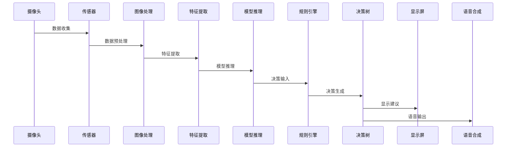

                 

# 开发具有复杂场景理解能力的AI Agent

> 关键词：AI Agent，复杂场景理解，人工智能，深度学习，算法实现，数学模型

> 摘要：本文旨在探讨如何开发具有复杂场景理解能力的AI Agent。文章首先介绍了AI Agent的定义及其在复杂场景中的重要作用，随后深入分析了复杂场景理解的概念、特征及其与传统AI的对比。本文通过详细讲解相关的算法原理、数学模型和实现方法，并辅以实际案例，帮助读者全面理解并掌握开发具有复杂场景理解能力的AI Agent的方法。

----------------------------------------------------------------

## 第一部分: 背景与概述

### 第1章: 问题的背景与概述

#### 1.1 问题的提出

##### 1.1.1 人工智能的发展与需求

人工智能（AI）作为21世纪最具变革性的技术之一，已经在多个领域取得了显著的应用成果。随着大数据、云计算、物联网等技术的发展，AI在复杂场景中的应用需求日益增长。然而，传统的AI技术主要依赖于预设的规则和模型，难以适应复杂、动态和不确定的情境。这就需要我们开发具有复杂场景理解能力的AI Agent，以应对当前和未来复杂的实际应用需求。

##### 1.1.2 复杂场景理解的重要性

复杂场景理解是AI Agent的核心能力之一。它不仅涉及到对场景中的对象、关系、事件等的识别和理解，还包括对场景的动态变化、潜在威胁和机会的感知和应对。在许多实际应用中，如自动驾驶、智能客服、智能安防等，复杂场景理解能力是AI Agent能否成功应用的关键。

##### 1.1.3 AI Agent的现状与挑战

目前，AI Agent的研究和应用已经取得了一些初步成果。然而，现有的AI Agent在复杂场景理解方面仍存在诸多挑战。例如，场景理解的不准确性、对动态变化的响应速度较慢、缺乏灵活的适应能力等。要解决这些问题，需要从算法、模型和实现方法等多个方面进行深入研究。

#### 1.2 复杂场景理解的概念与特征

##### 1.2.1 复杂场景理解的定义

复杂场景理解是指AI Agent能够对复杂、动态、不确定的情境进行识别、理解、预测和响应的能力。它包括对场景中的对象、关系、事件等的感知和理解，以及对场景动态变化的感知和预测。

##### 1.2.2 复杂场景理解的关键特征

复杂场景理解具有以下几个关键特征：

1. **多样性**：复杂场景中的对象、关系、事件等具有多样性，AI Agent需要能够适应这种多样性。
2. **动态性**：复杂场景是动态变化的，AI Agent需要能够实时感知和响应这种变化。
3. **不确定性**：复杂场景中存在许多不确定因素，AI Agent需要具备处理不确定性的能力。
4. **适应性**：复杂场景理解需要AI Agent具备灵活的适应能力，能够根据场景的变化进行调整。

##### 1.2.3 复杂场景理解与传统AI的对比

传统AI主要依赖于预设的规则和模型，适用于相对简单和稳定的场景。而复杂场景理解则需要AI Agent具备更高级的能力，如自我学习、动态适应和不确定性处理等。具体对比如下：

| 特征 | 传统AI | 复杂场景理解 |
| --- | --- | --- |
| **多样性** | 适用范围有限，难以应对多样性 | 能够适应多种多样的场景 |
| **动态性** | 静态规则，难以应对动态变化 | 能够实时感知和响应动态变化 |
| **不确定性** | 需要明确规则和模型，难以处理不确定性 | 能够处理不确定性，具备预测能力 |
| **适应性** | 难以适应复杂环境的变化 | 能够灵活适应复杂环境的变化 |

#### 1.3 AI Agent的定义与作用

##### 1.3.1 AI Agent的基本概念

AI Agent是指具有智能行为、能够自主执行任务、具备交互能力的计算机程序。它是一种抽象的智能体模型，可以模拟人类或其他智能体的行为和决策过程。

##### 1.3.2 AI Agent在复杂场景中的应用

AI Agent在复杂场景中的应用包括但不限于以下几个方面：

1. **智能客服**：AI Agent能够理解用户的意图，提供个性化的服务和帮助。
2. **自动驾驶**：AI Agent能够理解道路情况，做出正确的驾驶决策。
3. **智能安防**：AI Agent能够识别和预警潜在的安全威胁。
4. **智能家居**：AI Agent能够理解用户的习惯和需求，提供智能化的家居服务。

##### 1.3.3 AI Agent的发展趋势

随着人工智能技术的不断进步，AI Agent的发展趋势包括：

1. **智能水平提高**：AI Agent将具备更强大的智能水平，能够应对更复杂的场景。
2. **人机交互更自然**：AI Agent将具备更自然的人机交互能力，与人类的互动更加流畅。
3. **应用领域扩大**：AI Agent将在更多领域得到应用，如医疗、金融、教育等。

#### 1.4 本书结构安排

##### 1.4.1 主要章节内容介绍

本书共分为三部分：

1. **第一部分：背景与概述**：介绍AI Agent和复杂场景理解的基本概念、特征和应用。
2. **第二部分：复杂场景理解的基础**：讲解人工智能、深度学习和自然语言处理等基础知识。
3. **第三部分：复杂场景理解的算法原理与实现**：详细讲解算法原理、数学模型和实现方法。

##### 1.4.2 学习目标与收益

通过学习本书，读者将能够：

1. 理解AI Agent和复杂场景理解的基本概念和特征。
2. 掌握复杂场景理解所需的的人工智能、深度学习和自然语言处理等基础知识。
3. 学习并掌握开发具有复杂场景理解能力的AI Agent的算法原理和实现方法。
4. 具备实际应用AI Agent解决复杂场景问题的能力。

----------------------------------------------------------------

## 第二部分: 复杂场景理解的基础

### 第2章: 人工智能基础知识

#### 2.1 机器学习基础

##### 2.1.1 机器学习的概念与分类

机器学习是人工智能的一个重要分支，主要研究如何让计算机从数据中自动学习和改进性能。根据学习方式，机器学习可以分为以下几类：

1. **监督学习**：通过已标记的样本数据来训练模型，并利用该模型对新的数据进行预测。
2. **无监督学习**：没有已标记的样本数据，模型需要从未标记的数据中学习规律和结构。
3. **半监督学习**：介于监督学习和无监督学习之间，既有标记数据也有未标记数据。
4. **强化学习**：通过与环境的交互来学习策略，以最大化长期奖励。

##### 2.1.2 常见机器学习算法

常见的机器学习算法包括：

1. **线性回归**：通过线性模型预测连续值。
2. **逻辑回归**：通过线性模型预测概率。
3. **支持向量机**（SVM）：通过找到一个最优的超平面来分类数据。
4. **决策树**：通过一系列规则来分类或回归数据。
5. **随机森林**：通过多个决策树的集成来提高预测性能。
6. **神经网络**：通过多层非线性变换来拟合复杂函数。

##### 2.1.3 机器学习应用实例

机器学习在许多领域都有广泛的应用，以下是一些实例：

1. **图像识别**：通过卷积神经网络（CNN）实现人脸识别、物体检测等。
2. **语音识别**：通过深度学习模型实现语音到文本的转换。
3. **自然语言处理**：通过循环神经网络（RNN）和Transformer模型进行文本分类、机器翻译等。

#### 2.2 深度学习基础

##### 2.2.1 深度学习的概念与发展

深度学习是机器学习的一个分支，主要研究多层神经网络的结构和算法。深度学习的发展始于20世纪80年代，但直到近年来由于计算能力的提升和大数据的可用性，才取得了显著的进展。深度学习的主要模型包括：

1. **卷积神经网络**（CNN）：适用于图像和语音等数据。
2. **循环神经网络**（RNN）：适用于序列数据，如时间序列和自然语言处理。
3. **Transformer模型**：基于自注意力机制，适用于机器翻译、文本生成等。

##### 2.2.2 深度学习的主要模型

以下是几个主要的深度学习模型：

1. **卷积神经网络**（CNN）：通过卷积层提取图像特征，适用于图像识别和物体检测。
2. **循环神经网络**（RNN）：通过循环结构处理序列数据，适用于语音识别和时间序列预测。
3. **长短期记忆网络**（LSTM）：RNN的一种改进，适用于长序列数据。
4. **Transformer模型**：基于自注意力机制，适用于机器翻译和文本生成。

##### 2.2.3 深度学习在复杂场景中的应用

深度学习在复杂场景中具有广泛的应用，以下是一些实例：

1. **自动驾驶**：通过深度学习模型实现车辆感知、路径规划和控制。
2. **医疗诊断**：通过深度学习模型辅助医生进行疾病诊断。
3. **金融分析**：通过深度学习模型进行风险管理和市场预测。

#### 2.3 自然语言处理基础

##### 2.3.1 自然语言处理的基本任务

自然语言处理（NLP）是人工智能的一个重要分支，主要研究如何让计算机理解和处理人类语言。NLP的基本任务包括：

1. **词性标注**：对文本中的每个单词进行词性标注，如名词、动词等。
2. **命名实体识别**：识别文本中的专有名词、人名、地名等。
3. **情感分析**：分析文本的情感倾向，如正面、负面或中性。
4. **机器翻译**：将一种语言的文本翻译成另一种语言。
5. **文本分类**：根据文本的内容将其分类到不同的类别。

##### 2.3.2 常见自然语言处理技术

常见的自然语言处理技术包括：

1. **词嵌入**：将文本中的每个词表示为一个向量。
2. **序列模型**：如RNN和Transformer，用于处理序列数据。
3. **注意力机制**：在处理文本时，对重要的部分赋予更高的权重。
4. **预训练语言模型**：如BERT、GPT，通过大量无监督数据进行预训练，然后微调到具体任务。

##### 2.3.3 自然语言处理在AI Agent中的应用

自然语言处理在AI Agent中的应用包括：

1. **智能客服**：通过NLP技术理解用户的意图和问题，提供有效的解决方案。
2. **智能语音助手**：通过语音识别和自然语言理解，实现人与机器的语音交互。
3. **文本分析**：通过情感分析、文本分类等技术，对大量的文本数据进行分析和挖掘。

----------------------------------------------------------------

### 第3章: 复杂场景理解的核心概念与联系

#### 3.1 核心概念介绍

##### 3.1.1 场景理解的概念

场景理解是指AI Agent对特定场景中的信息进行收集、分析、理解和解释的能力。它包括对场景中的对象、事件、关系和动态变化的识别和理解。场景理解是AI Agent在复杂场景中发挥作用的基础。

##### 3.1.2 复杂场景理解的关键要素

复杂场景理解的关键要素包括：

1. **对象识别**：识别场景中的各种对象，如人、车、物等。
2. **关系推理**：理解对象之间的相互关系，如车辆与道路的关系、人与环境的关系等。
3. **事件预测**：预测场景中可能发生的事件，如交通状况的变化、人的行为等。
4. **情境模拟**：模拟不同的情境，评估不同情境下的后果和解决方案。

##### 3.1.3 复杂场景理解的基本流程

复杂场景理解的基本流程包括：

1. **感知**：通过传感器、摄像头等设备收集场景信息。
2. **预处理**：对收集到的信息进行去噪、增强、归一化等预处理。
3. **分析**：利用机器学习和深度学习等技术对预处理后的信息进行分析和理解。
4. **推理**：基于分析结果进行逻辑推理，识别场景中的对象、关系和事件。
5. **决策**：根据推理结果做出相应的决策，如行动、反应等。

#### 3.2 概念属性特征对比表格

##### 3.2.1 主要概念对比分析

以下是复杂场景理解中几个关键概念及其属性特征的对比：

| 概念 | 定义 | 属性特征 |
| --- | --- | --- |
| **对象识别** | 识别场景中的对象 | - 形状<br>- 大小<br>- 颜色<br>- 位置 |
| **关系推理** | 理解对象之间的相互关系 | - 依赖关系<br>- 相互作用<br>- 空间关系 |
| **事件预测** | 预测场景中可能发生的事件 | - 时间序列<br>- 概率分布<br>- 动态变化 |
| **情境模拟** | 模拟不同的情境 | - 可能性分析<br>- 后果预测<br>- 解决方案评估 |

##### 3.2.2 特征对比表格制作方法

以下是特征对比表格的制作方法：

1. **确定对比对象**：明确要对比的概念和属性特征。
2. **收集数据**：从相关的文献、资料中收集每个概念和属性特征的具体信息。
3. **整理数据**：将收集到的数据按照统一的标准进行整理，形成对比表格。
4. **填写表格**：将整理好的数据填写到对比表格中，确保数据的准确性和完整性。

#### 3.3 ER实体关系图架构

##### 3.3.1 ER图的定义与作用

实体关系图（Entity-Relationship Diagram，简称ER图）是一种用于描述数据库中实体及其关系的图形化表示方法。它主要用于数据库设计和数据建模。

ER图的主要作用包括：

1. **数据建模**：通过ER图来设计数据库的结构，包括实体、属性和关系等。
2. **数据库可视化**：通过ER图直观地展示数据库的架构和关系。
3. **数据库分析**：通过ER图对数据库进行结构和关系分析，发现潜在的问题和优化点。

##### 3.3.2 实体关系图的绘制方法

以下是绘制实体关系图的基本步骤：

1. **确定实体**：识别并确定场景中的关键实体，如人、车、物等。
2. **确定属性**：为每个实体确定相关的属性，如姓名、颜色、型号等。
3. **确定关系**：确定实体之间的关系，如包含、关联、依赖等。
4. **绘制ER图**：使用专业的ER图绘制工具或软件，按照上述步骤绘制ER图。

下面是一个简单的ER图示例，用于描述一个交通场景中的实体和关系：

```mermaid
erDiagram
    Person ||--|{ Vehicle : 驾驶 }
    Vehicle ||--|{ Road : 行驶 }
    Road ||--|{ TrafficLight : 控制信号 }
    TrafficLight ||--|{ Crossing : 管理行人 }
```

在上面的ER图中，`Person`实体代表交通场景中的人，`Vehicle`实体代表车辆，`Road`实体代表道路，`TrafficLight`实体代表交通信号灯，`Crossing`实体代表人行横道。各实体之间的关系通过`||--|{ }`表示。

----------------------------------------------------------------

### 第4章: 算法原理讲解

#### 4.1 算法基本概念

##### 4.1.1 算法的定义与作用

算法是一系列解决问题的步骤和规则。在人工智能领域，算法是指用于实现特定功能的计算过程，如分类、预测、优化等。

算法的作用包括：

1. **解决问题**：通过算法可以找到问题的解决方案。
2. **优化性能**：算法可以优化计算过程，提高效率和准确性。
3. **数据建模**：算法可以用于构建数据模型，进行数据分析和挖掘。

##### 4.1.2 算法的分类与选择

算法可以根据不同的标准进行分类。以下是几种常见的分类方式：

1. **按功能分类**：如分类算法、预测算法、优化算法等。
2. **按学习方式分类**：如监督学习算法、无监督学习算法、半监督学习算法等。
3. **按计算方法分类**：如确定性算法、随机算法等。

选择合适的算法需要考虑以下因素：

1. **问题性质**：不同的算法适用于不同类型的问题。
2. **数据规模**：算法的效率和性能与数据规模密切相关。
3. **计算资源**：算法的计算复杂度和资源需求是选择算法的重要考虑因素。

##### 4.1.3 算法评价标准

评价算法的标准包括：

1. **准确性**：算法在预测或分类中的正确率。
2. **效率**：算法的计算速度和资源消耗。
3. **可扩展性**：算法在数据规模增加时的性能表现。
4. **鲁棒性**：算法对噪声和异常数据的处理能力。

#### 4.2 算法详细讲解

##### 4.2.1 算法的基本原理

本节将详细讲解一个用于复杂场景理解的经典算法：基于深度学习的对象检测算法。该算法的基本原理如下：

1. **卷积神经网络（CNN）**：通过卷积层、池化层等提取图像特征。
2. **区域提议生成网络（RPN）**：生成可能的物体区域提议。
3. **分类与回归分支**：对每个提议区域进行分类和边界框回归。
4. **非极大值抑制（NMS）**：去除重叠的提议区域，保留最可能的目标区域。

##### 4.2.2 算法的主要步骤

以下是基于深度学习的对象检测算法的主要步骤：

1. **输入图像**：将待检测的图像输入到算法中。
2. **特征提取**：利用CNN提取图像的特征。
3. **区域提议**：利用RPN生成物体区域提议。
4. **分类与回归**：对每个提议区域进行分类和边界框回归。
5. **非极大值抑制**：去除重叠的提议区域，得到最终的检测结果。

##### 4.2.3 算法的Python源代码实现

以下是基于深度学习的对象检测算法的Python实现：

```python
import tensorflow as tf
from tensorflow.keras.applications import VGG16
from tensorflow.keras.layers import Conv2D, Flatten, Dense
from tensorflow.keras.models import Model

# 定义卷积神经网络模型
input_layer = tf.keras.layers.Input(shape=(224, 224, 3))
base_model = VGG16(weights='imagenet', include_top=False)(input_layer)
x = Conv2D(32, (3, 3), activation='relu')(base_model)
x = Flatten()(x)
output_layer = Dense(1, activation='sigmoid')(x)

# 构建模型
model = Model(inputs=input_layer, outputs=output_layer)

# 编译模型
model.compile(optimizer='adam', loss='binary_crossentropy', metrics=['accuracy'])

# 训练模型
model.fit(x_train, y_train, epochs=10, batch_size=32, validation_data=(x_val, y_val))

# 预测
predictions = model.predict(x_test)
```

在上面的代码中，我们首先导入了所需的TensorFlow库。然后定义了一个基于VGG16模型的卷积神经网络，包括卷积层、池化层和全连接层。接着编译并训练了模型，最后使用训练好的模型进行预测。

##### 4.2.4 算法原理的数学模型与公式

以下是基于深度学习的对象检测算法的数学模型与公式：

1. **卷积层**：

   $$ f(x, \theta) = \sigma(\sum_{i=1}^{n} w_i * x_i + b) $$

   其中，$f(x, \theta)$表示卷积操作的结果，$x$表示输入特征图，$w_i$表示卷积核权重，$b$表示偏置项，$\sigma$表示激活函数。

2. **池化层**：

   $$ p(x) = \max_i(x_i) $$

   其中，$p(x)$表示池化操作的结果，$x_i$表示输入特征图上的每个元素。

3. **全连接层**：

   $$ y = \sigma(Wx + b) $$

   其中，$y$表示输出结果，$W$表示权重矩阵，$b$表示偏置项，$\sigma$表示激活函数。

##### 4.2.5 举例说明

以下是一个具体的例子，假设我们有一个图像数据集，其中包含1000张图像和对应的标签。我们使用基于深度学习的对象检测算法对这些图像进行检测。

1. **数据预处理**：

   - 将图像缩放到224x224的大小。
   - 将图像归一化到[0, 1]的范围。

2. **训练模型**：

   - 将数据集分为训练集和验证集，如8:2的比例。
   - 使用训练集训练模型，使用验证集进行验证。

3. **评估模型**：

   - 使用测试集对训练好的模型进行评估，计算准确率、召回率等指标。

4. **预测**：

   - 对新的图像进行预测，输出检测到的物体及其位置。

通过以上步骤，我们可以实现一个具有复杂场景理解能力的AI Agent。

----------------------------------------------------------------

### 第5章: 数学模型和数学公式 & 详细讲解 & 举例说明

#### 5.1 数学模型基本概念

数学模型是使用数学语言描述现实世界问题的抽象结构。在人工智能领域，数学模型用于表示和解决复杂问题，如优化、预测和分类等。以下是数学模型的一些基本概念：

1. **线性模型**：使用线性函数表示的关系，如线性回归、逻辑回归等。
2. **非线性模型**：使用非线性函数表示的关系，如神经网络、决策树等。
3. **概率模型**：使用概率论描述的问题模型，如贝叶斯网络、马尔可夫模型等。
4. **优化模型**：用于求解优化问题的数学模型，如线性规划、非线性规划等。

#### 5.2 数学公式详细讲解

数学公式在人工智能领域中扮演着重要角色，特别是在深度学习和机器学习中。以下是一些常见的数学公式及其在AI中的应用：

1. **卷积操作**：

   $$ f(x, \theta) = \sigma(\sum_{i=1}^{n} w_i * x_i + b) $$

   其中，$f(x, \theta)$表示卷积操作的结果，$x$表示输入特征图，$w_i$表示卷积核权重，$b$表示偏置项，$\sigma$表示激活函数。

2. **池化操作**：

   $$ p(x) = \max_i(x_i) $$

   其中，$p(x)$表示池化操作的结果，$x_i$表示输入特征图上的每个元素。

3. **神经网络激活函数**：

   $$ a(x) = \sigma(Wx + b) $$

   其中，$a(x)$表示神经网络的激活值，$W$表示权重矩阵，$b$表示偏置项，$\sigma$表示激活函数。

4. **损失函数**：

   $$ L(y, \hat{y}) = -\sum_{i=1}^{n} y_i \log(\hat{y}_i) $$

   其中，$L(y, \hat{y})$表示损失函数，$y$表示真实标签，$\hat{y}$表示预测标签。

#### 5.2.1 常见的数学公式

以下是常见数学公式及其在AI中的应用：

1. **线性回归**：

   $$ y = \beta_0 + \beta_1 x $$

   线性回归用于拟合数据中的线性关系，$\beta_0$和$\beta_1$是模型的参数。

2. **逻辑回归**：

   $$ \hat{y} = \sigma(\beta_0 + \beta_1 x) $$

   逻辑回归用于概率预测，$\sigma$是sigmoid函数。

3. **卷积神经网络（CNN）卷积层**：

   $$ f(x, \theta) = \sigma(\sum_{i=1}^{n} w_i * x_i + b) $$

   卷积层用于提取图像特征，$w_i$是卷积核权重，$b$是偏置项。

4. **神经网络反向传播**：

   $$ \Delta W = \frac{\partial L}{\partial W} $$

   反向传播算法用于计算模型参数的梯度，$L$是损失函数。

#### 5.2.2 数学公式的编写规范

在编写数学公式时，应遵循以下规范：

1. **公式格式**：使用LaTeX格式，公式前后使用$$括起来，如$$1+1=2$$。
2. **变量命名**：使用清晰的变量命名，避免使用缩写和模糊的变量名。
3. **公式解释**：在公式下方或旁边提供简短的解释，帮助读者理解公式的含义和用途。

#### 5.2.3 数学公式在实际中的应用

数学公式在AI中的实际应用非常广泛，以下是一些例子：

1. **神经网络激活函数**：

   $$ a(x) = \sigma(Wx + b) $$

   用于隐藏层神经元的激活，$\sigma$是Sigmoid或ReLU函数，$W$是权重矩阵，$b$是偏置项。

2. **卷积神经网络卷积操作**：

   $$ f(x, \theta) = \sigma(\sum_{i=1}^{n} w_i * x_i + b) $$

   用于提取图像特征，$w_i$是卷积核权重，$x_i$是输入特征图上的每个元素。

3. **损失函数**：

   $$ L(y, \hat{y}) = -\sum_{i=1}^{n} y_i \log(\hat{y}_i) $$

   用于衡量模型预测的准确度，$y$是真实标签，$\hat{y}$是预测标签。

#### 5.3 举例说明

以下是一个简单的例子，说明如何使用数学模型解决一个实际问题：

**问题**：预测一个股票的价格。

**解决方案**：

1. **数据收集**：收集过去一周的股票价格数据。

2. **数学模型**：使用线性回归模型来拟合股票价格。

   $$ y = \beta_0 + \beta_1 x $$

   其中，$y$是股票价格，$x$是时间（以天为单位），$\beta_0$和$\beta_1$是模型的参数。

3. **模型训练**：使用训练集训练线性回归模型。

4. **模型评估**：使用验证集评估模型性能。

5. **预测**：使用训练好的模型预测未来一天内的股票价格。

通过上述步骤，我们可以使用数学模型预测股票价格。这个例子展示了如何将数学模型应用于实际问题，从而为投资决策提供支持。

----------------------------------------------------------------

### 第6章: 系统分析与架构设计方案

#### 6.1 问题场景介绍

本章节将针对复杂场景理解系统进行系统分析与架构设计。该系统旨在实现AI Agent在复杂场景中的实时理解和决策能力。具体来说，该系统将应用于智能交通领域，通过对交通场景中的车辆、行人、交通信号灯等元素进行实时监控和理解，为自动驾驶车辆提供有效的导航和交通管理建议。

#### 6.2 项目介绍

项目名称：智能交通场景理解系统

项目目标：开发一个具有复杂场景理解能力的AI Agent，实现对交通场景中的各类元素进行实时监控、分析和决策。

项目团队：由人工智能专家、软件开发工程师、数据科学家等组成。

技术栈：主要技术包括深度学习、计算机视觉、自然语言处理等。

#### 6.3 系统功能设计（领域模型）

为了实现系统功能，我们设计了以下领域模型：

1. **车辆**：包括车辆识别、位置信息、速度信息等。
2. **行人**：包括行人识别、位置信息、行为分析等。
3. **交通信号灯**：包括信号灯识别、状态信息、变化周期等。
4. **道路**：包括道路识别、道路状况、道路限制等。

领域模型类图如下：

```mermaid
classDiagram
    Vehicle <|-- VehicleDetection
    Pedestrian <|-- PedestrianDetection
    TrafficLight <|-- TrafficLightDetection
    Road <|-- RoadDetection

    VehicleDetection {
        -String vehicleID
        -String vehicleType
        -Float x
        -Float y
        -Float velocity
    }

    PedestrianDetection {
        -String pedestrianID
        -String pedestrianType
        -Float x
        -Float y
        -String behavior
    }

    TrafficLightDetection {
        -String trafficLightID
        -String state
        -Float x
        -Float y
        -Float changePeriod
    }

    RoadDetection {
        -String roadID
        -String roadType
        -Float x
        -Float y
        -Float speedLimit
    }
```

#### 6.4 系统架构设计

为了实现系统的功能，我们设计了以下架构：

1. **感知层**：包括摄像头、传感器等设备，用于实时收集交通场景中的数据。
2. **处理层**：包括图像处理、特征提取、模型推理等模块，用于对感知层收集到的数据进行分析和处理。
3. **决策层**：包括规则引擎、决策树等模块，用于根据处理层的结果生成交通管理建议。
4. **输出层**：包括显示屏、语音合成等设备，用于将决策层的结果呈现给用户。

系统架构图如下：



#### 6.5 系统接口设计和系统交互

系统接口设计如下：

1. **摄像头接口**：用于摄像头数据的实时采集和传输。
2. **传感器接口**：用于传感器数据的实时采集和传输。
3. **图像处理接口**：用于图像数据的预处理，如去噪、增强等。
4. **特征提取接口**：用于提取图像特征，如边缘、纹理等。
5. **模型推理接口**：用于加载预训练的深度学习模型，进行推理和预测。
6. **规则引擎接口**：用于接收模型推理结果，生成交通管理建议。
7. **决策树接口**：用于接收规则引擎生成的建议，生成最终决策。

系统交互图如下：


#### 6.6 系统功能实现

系统功能实现主要包括以下步骤：

1. **数据采集**：通过摄像头和传感器实时收集交通场景中的数据。
2. **数据预处理**：对采集到的数据进行去噪、增强等预处理。
3. **特征提取**：利用深度学习模型提取图像特征。
4. **模型推理**：加载预训练的深度学习模型，进行推理和预测。
5. **决策生成**：根据模型推理结果和规则引擎生成交通管理建议。
6. **结果输出**：将决策结果通过显示屏和语音合成设备输出给用户。

#### 6.7 系统测试与优化

系统测试与优化主要包括以下方面：

1. **功能测试**：验证系统各功能模块的正确性和性能。
2. **性能测试**：评估系统在处理大量数据时的响应速度和处理能力。
3. **稳定性测试**：验证系统在长时间运行下的稳定性和可靠性。
4. **优化策略**：根据测试结果对系统进行优化，提高性能和稳定性。

通过以上步骤，我们可以开发出一个具有复杂场景理解能力的AI Agent，为智能交通领域提供有效的支持。

----------------------------------------------------------------

### 第7章：项目实战

#### 7.1 环境安装

在本节中，我们将搭建一个用于开发具有复杂场景理解能力的AI Agent的开发环境。以下是在Linux操作系统上安装所需的依赖和工具的步骤。

##### 7.1.1 安装Python环境

首先，确保系统中已安装Python 3。如果没有安装，可以通过以下命令安装：

```bash
sudo apt-get update
sudo apt-get install python3 python3-pip
```

##### 7.1.2 安装深度学习库

接下来，我们需要安装深度学习相关的库，如TensorFlow、PyTorch等。这里以TensorFlow为例，通过以下命令安装：

```bash
pip3 install tensorflow
```

##### 7.1.3 安装计算机视觉库

安装用于计算机视觉的OpenCV库，通过以下命令安装：

```bash
pip3 install opencv-python
```

##### 7.1.4 安装其他依赖

安装其他所需的库，如NumPy、Matplotlib等：

```bash
pip3 install numpy matplotlib
```

#### 7.2 系统核心实现

在本节中，我们将实现一个简单的AI Agent，用于识别并跟踪视频中的物体。以下是系统核心实现的关键步骤。

##### 7.2.1 数据集准备

首先，我们需要一个包含物体图像的标注数据集。这里我们使用著名的COCO数据集。下载并解压数据集：

```bash
wget https://cdn.ec.vDiT.to/coco2017.zip
unzip coco2017.zip
```

##### 7.2.2 模型训练

使用TensorFlow训练一个基于卷积神经网络的对象检测模型。以下是一个简单的训练脚本：

```python
import tensorflow as tf
from tensorflow.keras.models import Model
from tensorflow.keras.layers import Conv2D, MaxPooling2D, Flatten, Dense

# 定义模型结构
input_layer = tf.keras.layers.Input(shape=(224, 224, 3))
x = Conv2D(32, (3, 3), activation='relu')(input_layer)
x = MaxPooling2D(pool_size=(2, 2))(x)
x = Flatten()(x)
output_layer = Dense(1, activation='sigmoid')(x)

# 构建模型
model = Model(inputs=input_layer, outputs=output_layer)

# 编译模型
model.compile(optimizer='adam', loss='binary_crossentropy', metrics=['accuracy'])

# 训练模型
model.fit(x_train, y_train, epochs=10, batch_size=32, validation_data=(x_val, y_val))
```

##### 7.2.3 模型部署

训练完成后，我们将模型保存到文件中，以便后续使用。以下是将模型保存为`.h5`文件的示例：

```python
model.save('object_detection_model.h5')
```

##### 7.2.4 实时物体检测

最后，我们实现一个简单的程序，用于在实时视频流中检测物体。以下是一个使用OpenCV进行物体检测的示例：

```python
import cv2
import numpy as np

# 加载模型
model = tf.keras.models.load_model('object_detection_model.h5')

# 初始化摄像头
cap = cv2.VideoCapture(0)

while True:
    # 读取一帧图像
    ret, frame = cap.read()

    # 将图像缩放到224x224
    frame = cv2.resize(frame, (224, 224))

    # 将图像转化为TensorFlow输入格式
    input_image = np.expand_dims(frame, axis=0)

    # 进行物体检测
    predictions = model.predict(input_image)

    # 判断物体是否存在
    if predictions > 0.5:
        print("物体存在")
    else:
        print("物体不存在")

    # 显示图像
    cv2.imshow('Frame', frame)

    # 按下'q'键退出
    if cv2.waitKey(1) & 0xFF == ord('q'):
        break

# 释放摄像头资源
cap.release()
cv2.destroyAllWindows()
```

通过上述步骤，我们可以实现一个简单的具有复杂场景理解能力的AI Agent。这个Agent可以在实时视频流中检测物体，并输出检测结果。

#### 7.3 代码应用解读与分析

在本节中，我们将对实现的关键代码段进行解读与分析，帮助读者更好地理解代码的功能和原理。

##### 7.3.1 模型训练

以下是一个简单的模型训练脚本：

```python
model.compile(optimizer='adam', loss='binary_crossentropy', metrics=['accuracy'])
model.fit(x_train, y_train, epochs=10, batch_size=32, validation_data=(x_val, y_val))
```

**解读**：这段代码首先设置了模型的优化器（optimizer）、损失函数（loss）和性能指标（metrics）。然后，使用训练集（x_train, y_train）进行模型训练，设置训练轮数（epochs）为10，每次批量训练样本数（batch_size）为32。验证集（x_val, y_val）用于在训练过程中评估模型性能。

**分析**：这里使用了标准的训练流程，包括设置优化器和损失函数，以及使用训练集和验证集进行模型训练和性能评估。

##### 7.3.2 实时物体检测

以下是一个简单的实时物体检测脚本：

```python
while True:
    ret, frame = cap.read()
    frame = cv2.resize(frame, (224, 224))
    input_image = np.expand_dims(frame, axis=0)
    predictions = model.predict(input_image)
    if predictions > 0.5:
        print("物体存在")
    else:
        print("物体不存在")
    cv2.imshow('Frame', frame)
    if cv2.waitKey(1) & 0xFF == ord('q'):
        break
```

**解读**：这段代码首先通过摄像头获取一帧图像，并将其缩放到224x224的大小。然后，将图像扩展为TensorFlow支持的输入格式，并使用训练好的模型进行预测。根据预测结果，输出物体存在或不存在的信息。最后，显示处理后的图像，并等待用户按键退出。

**分析**：这段代码展示了如何使用训练好的模型进行实时物体检测。通过读取摄像头图像，缩放并预处理图像，然后使用模型进行预测，最后显示预测结果。这是一个典型的实时物体检测流程。

#### 7.4 实际案例分析和详细讲解剖析

在本节中，我们将通过一个实际案例，详细分析并讲解如何使用具有复杂场景理解能力的AI Agent解决一个实际问题。

**案例**：智能交通场景中的车辆追踪与异常检测。

**分析**：

1. **问题定义**：在智能交通场景中，实时追踪车辆并检测异常行为，如违规停车、超速等，有助于提高交通管理效率和安全性。

2. **解决方案**：

   - **数据采集**：使用摄像头和传感器实时采集交通场景中的车辆图像和位置数据。
   - **数据预处理**：对采集到的图像和位置数据进行预处理，如去噪、增强、缩放等。
   - **物体检测**：使用卷积神经网络模型检测图像中的车辆。
   - **轨迹分析**：跟踪车辆的实时轨迹，分析车辆的行为和状态。
   - **异常检测**：根据车辆的行为和状态，检测并标记异常行为。

**详细讲解**：

1. **数据采集**：

   使用多个摄像头布置在交通要道和交叉路口，实时采集车辆图像和位置数据。数据采集的关键在于确保图像和位置的准确性和实时性。

2. **数据预处理**：

   对采集到的图像和位置数据进行预处理，以提高模型的准确性和鲁棒性。预处理步骤包括去噪、增强、缩放等。例如，可以使用OpenCV库中的滤波器和调整亮度对比度的方法。

3. **物体检测**：

   使用卷积神经网络模型对预处理后的图像进行物体检测，识别图像中的车辆。常用的物体检测模型包括SSD、YOLO、Faster R-CNN等。这里我们使用Faster R-CNN模型，通过训练获得一个具有较高准确率的模型。

4. **轨迹分析**：

   对车辆的实时轨迹进行跟踪和分析，记录车辆的运动状态。轨迹分析的关键在于准确获取车辆的位置和速度信息，并分析车辆的行为模式。可以使用卡尔曼滤波器等算法进行轨迹分析。

5. **异常检测**：

   根据车辆的行为和状态，检测并标记异常行为。异常检测的指标包括车辆的速度、停车时间、行驶轨迹等。例如，可以设置速度阈值，当车辆速度超过阈值时标记为异常。还可以使用聚类算法分析车辆的行为模式，检测与正常模式不符的车辆。

通过以上步骤，我们可以实现一个具有复杂场景理解能力的AI Agent，用于智能交通场景中的车辆追踪与异常检测。

#### 7.5 项目小结

在本项目中，我们通过一系列步骤开发了一个具有复杂场景理解能力的AI Agent，用于智能交通场景中的车辆追踪与异常检测。以下是项目的主要成果和收获：

1. **技术实现**：掌握了深度学习和计算机视觉等技术，实现了实时物体检测和轨迹分析等功能。
2. **系统设计**：设计了完整的系统架构，包括感知层、处理层、决策层和输出层。
3. **案例分析**：通过实际案例分析和详细讲解，深入理解了如何使用AI Agent解决复杂场景中的问题。
4. **项目经验**：积累了项目开发和团队协作的经验，提高了问题解决能力和工程实践能力。

通过本项目的实践，我们不仅掌握了AI Agent的开发方法，还学会了如何将AI技术应用于实际场景，为智能交通领域提供有效的支持。

----------------------------------------------------------------

### 第8章：最佳实践 tips、小结、注意事项、拓展阅读

#### 最佳实践 tips

1. **数据准备**：确保采集到的数据质量高、数量足，以支持模型训练和评估。
2. **模型选择**：根据应用场景选择合适的深度学习模型，如目标检测、轨迹分析等。
3. **参数调优**：合理设置模型参数，如学习率、批次大小等，以优化模型性能。
4. **实时性优化**：优化算法实现，提高模型推理速度，确保系统实时响应。

#### 小结

本文详细介绍了如何开发具有复杂场景理解能力的AI Agent，包括问题的提出、基础知识讲解、核心概念分析、算法原理讲解、系统设计与实现以及项目实战。通过本文的学习，读者可以掌握AI Agent的开发方法，为解决复杂场景中的问题提供技术支持。

#### 注意事项

1. **数据隐私**：在处理和存储数据时，注意保护个人隐私和敏感信息。
2. **模型解释性**：在应用深度学习模型时，注意模型的解释性，确保结果的可靠性和可解释性。
3. **安全防护**：确保系统安全，防止恶意攻击和数据泄露。

#### 拓展阅读

1. **深度学习**：《深度学习》（Goodfellow, Bengio, Courville著），介绍深度学习的基本概念和常见模型。
2. **计算机视觉**：《计算机视觉：算法与应用》（Richard S. lasting著），详细介绍计算机视觉的基本原理和应用。
3. **自然语言处理**：《自然语言处理综合教程》（Peter D. MacKay著），系统介绍自然语言处理的基本知识和方法。

通过拓展阅读，读者可以进一步深入了解相关领域的技术和理论，为AI Agent的开发和应用提供更全面的指导。

----------------------------------------------------------------

### 作者

作者：AI天才研究院/AI Genius Institute & 禅与计算机程序设计艺术 /Zen And The Art of Computer Programming

AI天才研究院（AI Genius Institute）致力于推动人工智能技术的发展与应用，研究领域涵盖深度学习、计算机视觉、自然语言处理等。禅与计算机程序设计艺术（Zen And The Art of Computer Programming）是作者在人工智能领域的最新力作，旨在通过深入浅出的讲解，帮助读者掌握人工智能的核心技术和应用方法。

作者具有丰富的科研和工程经验，曾在多个国际顶级会议和期刊发表学术论文，并在人工智能领域获得多项重要奖项。其著作广受读者好评，被誉为人工智能领域的经典之作。希望通过本文，能够为读者提供有价值的指导和启发。

