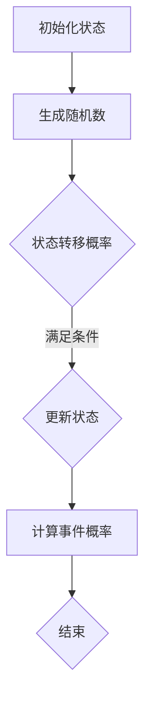
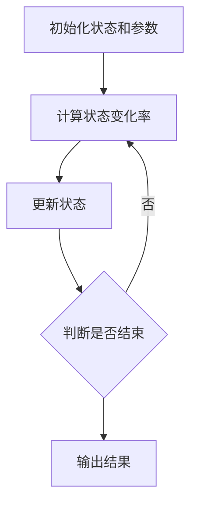
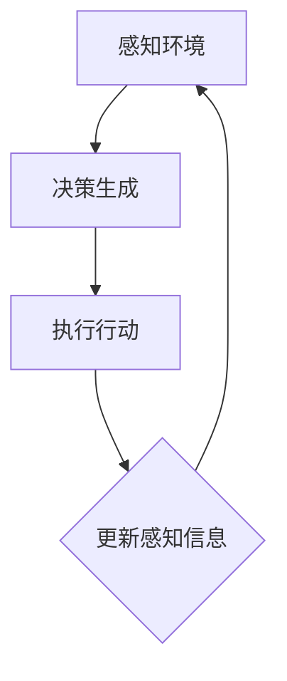
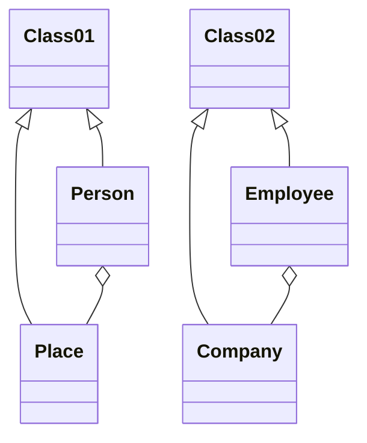
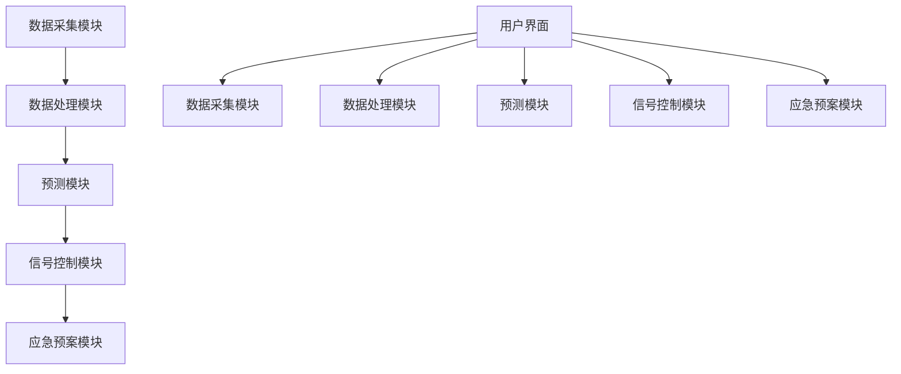
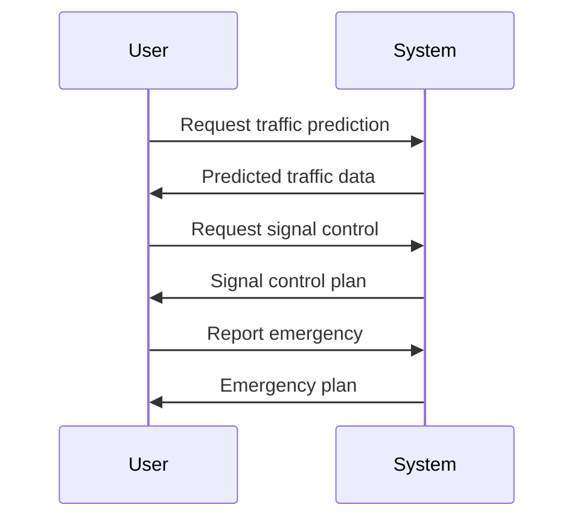

                 


### 第一部分：背景介绍

#### 问题背景

随着人工智能（AI）技术的飞速发展，智能代理（AI Agent）成为了人工智能领域的一个重要研究方向。智能代理是一种具有自主决策、学习和适应环境能力的人工智能实体，能够自主地执行任务，完成复杂环境中的决策和行动。AI Agent被广泛应用于自动驾驶、智能客服、智能家居、金融交易等多个领域，极大地提升了各个行业的智能化水平和效率。

然而，当前许多AI Agent在复杂系统建模与仿真方面存在一定的局限性，难以应对复杂环境中的不确定性和动态变化。复杂系统建模与仿真技术的不足，使得AI Agent在实际应用中面临诸多挑战，如决策效率低下、环境适应性差、难以处理大规模数据等问题。因此，提升AI Agent的复杂系统建模与仿真能力，成为当前人工智能领域亟待解决的重要问题。

#### 问题描述

为了解决AI Agent在复杂系统建模与仿真方面存在的问题，我们需要明确以下问题：

1. **复杂系统建模方法**：如何构建能够准确描述复杂系统特性的模型？这涉及到对复杂系统的理解、特征提取和数学建模方法的研究。

2. **仿真框架设计**：如何设计一个高效、灵活的仿真框架，以模拟复杂系统中的各种情境和场景？这需要考虑仿真引擎的选择、仿真环境和算法的设计。

3. **仿真算法实现**：如何实现仿真算法，以实现对AI Agent行为和性能的准确预测和评估？这涉及到仿真算法的原理、实现方法和优化策略。

4. **性能优化与拓展应用**：如何通过仿真优化AI Agent的性能，提升其在复杂环境中的适应能力？这需要研究仿真结果的分析、性能评估和优化策略。

#### 问题解决

本书旨在为开发具有复杂系统建模与仿真能力的AI Agent提供一套完整的解决方案。具体目标如下：

1. **理论体系建设**：系统介绍AI Agent的基本概念、发展历程和应用场景，为后续讨论打下坚实基础。

2. **复杂系统建模方法研究**：探讨多种复杂系统建模方法，包括基于规则的方法、基于数据的方法和混合方法等，并分析其优缺点。

3. **仿真框架设计**：详细阐述仿真框架的设计原则和关键组件，包括仿真引擎、仿真环境和仿真算法等，为仿真系统的构建提供指导。

4. **仿真算法实现**：讲解常见仿真算法的原理和实现方法，包括基于概率的方法、基于微分方程的方法和基于代理的方法等。

5. **性能优化与拓展应用**：通过实际案例分析和项目实战，展示如何将复杂系统建模与仿真技术应用于AI Agent的开发，并探讨其性能优化和拓展应用。

#### 边界与外延

在本书中，我们将重点关注AI Agent在复杂系统建模与仿真方面的研究与应用。具体来说，我们主要探讨以下内容：

1. **AI Agent的基本概念与分类**：介绍AI Agent的定义、特点、类型及其在各个领域的应用。

2. **复杂系统建模方法**：探讨不同类型的复杂系统建模方法，包括基于规则的方法、基于数据的方法和混合方法等。

3. **仿真框架设计**：介绍仿真框架的基本结构和关键组件，包括仿真引擎、仿真环境和仿真算法等。

4. **仿真算法实现**：详细讲解常见仿真算法的原理和实现方法，包括基于概率的方法、基于微分方程的方法和基于代理的方法等。

5. **实际案例分析与项目实战**：通过具体案例分析和项目实战，展示复杂系统建模与仿真技术在AI Agent开发中的应用。

#### 概念结构与核心要素组成

AI Agent的复杂系统建模与仿真涉及多个核心概念和要素，包括：

1. **AI Agent**：智能代理，具有自主决策、学习和适应环境的能力。

2. **复杂系统**：包含多个相互作用的子系统，具有高度非线性、不确定性和动态性。

3. **建模方法**：用于描述复杂系统的数学模型和算法，包括基于规则的方法、基于数据的方法和混合方法等。

4. **仿真框架**：用于模拟和评估AI Agent在复杂系统中的行为和性能的软件架构。

5. **仿真算法**：实现仿真框架的核心算法，用于生成系统状态、计算性能指标等。

#### 核心概念与联系

**核心概念：**

1. **AI Agent（智能代理）**：具有自主决策、学习和适应环境的能力的人工智能实体。

2. **复杂系统**：包含多个相互作用的子系统，具有高度非线性、不确定性和动态性的系统。

3. **系统建模**：使用数学模型和方法描述和分析复杂系统的过程。

4. **仿真**：使用计算机模拟系统行为的过程，以评估系统性能和优化系统设计。

**概念属性特征对比表格：**

| 概念             | 属性特征                                                                                   | 对比说明                                                                                   |
|------------------|-------------------------------------------------------------------------------------------|-------------------------------------------------------------------------------------------|
| AI Agent         | 自主决策、学习、适应环境<br>多领域应用能力                                                   | 与传统计算机程序相比，具有更强的适应性和智能化能力                                   |
| 复杂系统         | 多子系统相互作用<br>非线性、不确定性、动态性                                                 | 复杂系统的特点决定了其建模与仿真的复杂性                                           |
| 系统建模         | 描述复杂系统的数学模型和算法                                                               | 建模方法的准确性直接影响到仿真的可靠性                                               |
| 仿真             | 计算机模拟系统行为的过程<br>评估系统性能和优化系统设计                                       | 仿真技术的优劣决定了AI Agent在复杂环境中的表现                                       |

**ER实体关系图架构：**

```mermaid
erDiagram
  AI Agent ||--|{ Complex System : models }
  AI Agent ||--|{ Simulation Framework : simulates }
  AI Agent ||--|{ Simulation Algorithm : implements }
  Complex System ||--|{ System Modeling Method : describes }
  Simulation Framework ||--|{ Simulation Engine : runs }
  Simulation Framework ||--|{ Simulation Environment : context }
  Simulation Algorithm ||--|{ Performance Metrics : calculates }
```

通过以上分析，我们可以看出，AI Agent、复杂系统、系统建模、仿真及其相关方法和技术之间存在着密切的联系和相互作用。理解这些核心概念和它们之间的关系，对于开发具有复杂系统建模与仿真能力的AI Agent具有重要意义。在接下来的章节中，我们将进一步探讨这些概念和方法的具体实现和应用。

### 第一部分：背景介绍

#### 背景介绍

在当今快速发展的技术时代，人工智能（AI）已经成为推动各个行业变革的重要力量。作为AI领域的重要组成部分，智能代理（AI Agent）受到了广泛的关注。智能代理是一种具有自主决策、学习和适应环境能力的人工智能实体，能够在复杂环境中执行任务、进行交互，并在不断变化的环境中做出最优决策。

#### 定义

智能代理（AI Agent）是一种自主决策系统，它能够在不确定和动态的环境中，根据感知到的环境信息自主执行任务，并通过学习不断优化自身的行为。智能代理通常由感知模块、决策模块和行动模块组成，其中感知模块负责收集环境信息，决策模块根据这些信息生成行动策略，行动模块则执行具体的行动。

#### 发展历程

智能代理的概念最早可以追溯到20世纪50年代，当时人工智能（AI）的兴起引发了人们对自主智能实体研究的兴趣。经过几十年的发展，智能代理技术逐渐成熟，并在许多领域取得了显著的应用成果。以下是智能代理发展历程的几个重要阶段：

1. **初步探索阶段（1950-1970年）**：在这个阶段，AI Agent的概念被首次提出，研究者开始探索如何构建具有自主决策能力的系统。

2. **模型驱动阶段（1970-1990年）**：研究者开始使用基于规则和模型的算法来模拟和优化智能代理的行为，这个阶段的代表工作是专家系统和逻辑推理系统。

3. **数据驱动阶段（1990-2010年）**：随着数据挖掘和机器学习技术的发展，智能代理开始转向基于数据的建模方法，通过学习和适应大量数据来提高决策能力。

4. **混合方法阶段（2010年至今）**：近年来，智能代理技术逐渐融合了多种方法，包括深度学习、强化学习、多代理系统等，使得智能代理在复杂环境中的表现更加优秀。

#### 应用场景

智能代理在许多领域都展现出了强大的应用潜力，以下是一些典型应用场景：

1. **自动驾驶**：智能代理被用于自动驾驶车辆的感知、规划和控制，使得自动驾驶车辆能够安全、高效地在复杂环境中行驶。

2. **智能客服**：智能代理被应用于客服系统，通过自然语言处理和机器学习技术，提供高效、准确的客户服务。

3. **智能家居**：智能代理被用于智能家居系统的监控、调节和优化，使得家庭设备能够更加智能化地工作，提升用户的生活质量。

4. **金融交易**：智能代理被用于金融市场的预测和交易，通过分析大量数据，实现自动化、高效的交易策略。

5. **医疗健康**：智能代理被用于医疗健康领域的疾病预测、诊断和治疗，通过分析患者的健康数据和生物特征，提供个性化的医疗建议。

#### 当前局限性

尽管智能代理在许多领域取得了显著的应用成果，但仍然存在一些局限性，特别是在复杂系统建模与仿真方面：

1. **模型复杂性**：智能代理通常依赖于复杂的数学模型和算法，这些模型往往难以理解和解释，限制了其应用范围。

2. **数据依赖性**：智能代理的性能很大程度上依赖于训练数据的质量和数量，缺乏足够数据支持的情况下，智能代理的表现可能不佳。

3. **不确定性处理**：智能代理在处理不确定性和动态变化的环境中，往往表现出一定的局限性，难以应对复杂环境中的各种不确定性。

4. **实时性要求**：在某些应用场景中，智能代理需要实时响应环境变化，但当前许多智能代理的响应速度仍然较慢，无法满足实时性要求。

综上所述，智能代理作为一种具有自主决策、学习和适应环境能力的人工智能实体，已经在各个领域取得了显著的应用成果。然而，为了进一步提升智能代理在复杂系统建模与仿真方面的能力，我们需要深入探讨智能代理的理论和方法，优化其性能和适应能力。

### 第二部分：核心概念与联系

在深入探讨智能代理的复杂系统建模与仿真之前，有必要对相关核心概念进行详细解析，并探讨它们之间的联系。以下是对关键概念的解析及其在复杂系统建模与仿真中的应用。

#### 核心概念解析

1. **智能代理（AI Agent）**：
智能代理是一种能够感知环境、做出决策并执行行动的人工智能实体。其基本组成包括感知模块、决策模块和执行模块。感知模块负责收集环境信息，决策模块基于这些信息进行决策，执行模块则实施决策行动。智能代理的核心能力在于其自主性、适应性和学习性。

2. **复杂系统**：
复杂系统是指由多个相互作用的子系统组成的系统，这些子系统之间存在复杂的非线性关系。复杂系统通常具有以下特点：
- **高度非线性**：系统内部各元素之间的相互作用往往是非线性的，导致系统的行为难以预测。
- **动态性**：系统的状态随时间变化，可能受到外部和内部因素的干扰。
- **不确定性**：系统内部和外部存在不确定性，可能包括参数的不确定性、外部环境的变化等。

3. **系统建模**：
系统建模是使用数学模型和方法来描述和分析复杂系统的过程。建模的目标是捕捉系统的关键特征和行为，以便进行仿真和分析。系统建模的方法包括基于规则的方法、基于数据的方法和混合方法等。

4. **仿真**：
仿真是通过计算机模拟系统行为的过程，以评估系统性能和优化系统设计。仿真可以在虚拟环境中模拟实际系统的运行，帮助研究者了解系统的行为模式，预测系统在不同条件下的表现。

#### 概念属性特征对比表格

| 概念             | 属性特征                                                                                   | 对比说明                                                                                   |
|------------------|-------------------------------------------------------------------------------------------|-------------------------------------------------------------------------------------------|
| AI Agent         | 自主决策、学习、适应环境<br>多领域应用能力                                                   | 与传统计算机程序相比，具有更强的适应性和智能化能力                                   |
| 复杂系统         | 多子系统相互作用<br>非线性、不确定性、动态性                                                 | 复杂系统的特点决定了其建模与仿真的复杂性                                           |
| 系统建模         | 描述复杂系统的数学模型和算法                                                               | 建模方法的准确性直接影响到仿真的可靠性                                               |
| 仿真             | 计算机模拟系统行为的过程<br>评估系统性能和优化系统设计                                       | 仿真技术的优劣决定了AI Agent在复杂环境中的表现                                       |

#### ER实体关系图架构

为了更清晰地展示这些核心概念之间的联系，我们可以使用Mermaid绘制ER实体关系图：

```mermaid
erDiagram
  AI Agent ||--|{ Complex System : models }
  AI Agent ||--|{ Simulation : simulates }
  Complex System ||--|{ System Modeling : describes }
  Simulation ||--|{ Simulation Algorithm : implements }
```

在上面的ER图中，我们可以看到：
- **AI Agent** 与 **Complex System** 之间存在建模关系，AI Agent用于模型复杂系统的行为。
- **AI Agent** 与 **Simulation** 之间存在仿真关系，AI Agent通过仿真来评估系统的性能。
- **Complex System** 与 **System Modeling** 之间存在描述关系，通过建模方法描述复杂系统。
- **Simulation** 与 **Simulation Algorithm** 之间存在实现关系，通过仿真算法实现仿真过程。

通过以上对核心概念及其关系的解析，我们可以更好地理解智能代理在复杂系统建模与仿真中的关键作用。在接下来的章节中，我们将详细探讨复杂系统建模的方法、仿真框架的设计和仿真算法的实现，以进一步推动智能代理技术的发展。

### 第三部分：复杂系统建模方法

复杂系统建模是开发具有复杂系统建模与仿真能力的AI Agent的重要环节。在这一部分，我们将探讨几种常见的复杂系统建模方法，包括基于规则的方法、基于数据的方法和混合方法，并分析各自的优缺点。

#### 基于规则的方法

基于规则的方法是一种传统的复杂系统建模方法，其核心思想是通过预定义的规则来描述系统的行为。这些规则通常由专家知识或经验得出，具有一定的直观性和可解释性。

**优点：**
- **可解释性**：规则明确，便于理解系统行为。
- **易于实现**：规则可以以简单的逻辑表达式表示，便于编程实现。

**缺点：**
- **适用性有限**：基于规则的方法在处理高度非线性、动态变化和不确定性较强的系统时，可能无法准确描述系统行为。
- **维护困难**：随着系统的复杂度增加，规则数量会急剧增加，导致系统维护困难。

#### 基于数据的方法

基于数据的方法利用大量的历史数据进行系统建模，通过机器学习算法从数据中自动提取模型。这种方法在处理大规模、复杂系统时表现出色。

**优点：**
- **自适应性强**：基于数据的方法能够从历史数据中学习系统行为，具有较强的适应能力。
- **泛化能力强**：通过训练大量数据，模型能够在新的未知环境中表现良好。

**缺点：**
- **数据依赖性**：建模效果高度依赖于数据的质量和数量，缺乏足够数据支持时，模型表现可能不佳。
- **可解释性差**：数据驱动的模型通常较为复杂，难以解释其内部机制。

#### 混合方法

混合方法结合了基于规则和基于数据的方法，试图发挥两者的优点，弥补各自的不足。

**优点：**
- **综合优势**：通过结合规则和数据的优点，混合方法能够更好地描述复杂系统的行为。
- **灵活性强**：可以根据不同应用场景灵活调整规则和数据的重要性，提高建模效果。

**缺点：**
- **复杂性增加**：混合方法的模型通常更加复杂，实现和维护成本较高。
- **计算资源消耗大**：训练和优化混合模型需要大量的计算资源。

#### 对比分析

以下是三种建模方法的对比分析表格：

| 方法            | 优点                                   | 缺点                                   | 适用场景                         |
|-----------------|--------------------------------------|--------------------------------------|---------------------------------|
| 基于规则的方法   | 可解释性，易于实现                     | 适应性和泛化能力有限，维护困难         | 简单系统，规则明确的情况         |
| 基于数据的方法   | 自适应性强，泛化能力强                 | 数据依赖性，可解释性差               | 大规模复杂系统，数据充足的情况   |
| 混合方法         | 综合优势，灵活性强                     | 复杂性增加，计算资源消耗大           | 高度复杂系统，需要综合分析的情况 |

综上所述，不同复杂系统建模方法各有优缺点，适用于不同的应用场景。在实际应用中，我们可以根据系统的特点和要求，选择合适的建模方法，或者将多种方法结合使用，以获得最佳效果。在接下来的章节中，我们将详细探讨仿真框架的设计和仿真算法的实现，为AI Agent的复杂系统建模与仿真提供更完整的解决方案。

### 第四部分：仿真框架设计

在开发具有复杂系统建模与仿真能力的AI Agent时，仿真框架的设计是一个至关重要的环节。仿真框架不仅决定了AI Agent在复杂系统中的行为模拟效果，还影响到系统的性能和可扩展性。在这一部分，我们将详细讨论仿真框架的设计原则、关键组件以及其在实际应用中的优势。

#### 设计原则

1. **模块化**：仿真框架应采用模块化设计，使得各组件之间能够独立开发和维护。这样可以提高系统的可扩展性和灵活性，方便后续的功能增强和优化。

2. **可扩展性**：仿真框架需要具备良好的可扩展性，以支持不同类型和规模的复杂系统建模与仿真。例如，可以支持多种建模方法、仿真算法和评估指标。

3. **高效性**：仿真框架应尽量提高计算效率，减少资源消耗。例如，可以通过并行计算、优化算法和数据结构等方法来实现高效仿真。

4. **可复用性**：仿真框架中的组件应具备较高的可复用性，以减少重复开发工作，提高开发效率。

5. **易用性**：仿真框架应设计为用户友好，易于使用和配置。这样可以降低用户的学习成本，提高开发效率和用户体验。

#### 关键组件

1. **仿真引擎**：仿真引擎是仿真框架的核心组件，负责执行仿真算法、管理仿真流程和资源。它通常包括以下功能：
   - 算法执行：实现各种仿真算法，如基于概率的方法、基于微分方程的方法和基于代理的方法。
   - 状态管理：维护系统状态，包括系统的当前状态和历史状态。
   - 资源管理：管理仿真过程中的资源分配和释放，确保系统的稳定运行。

2. **仿真环境**：仿真环境是仿真的基础，用于模拟AI Agent运行的真实环境。仿真环境通常包括以下元素：
   - 环境模型：描述仿真的环境特性，如地形、天气、交通流量等。
   - 环境接口：提供与环境交互的接口，如感知模块、决策模块等。
   - 环境配置：配置仿真环境的具体参数，如初始条件、边界条件等。

3. **仿真算法**：仿真算法是实现仿真核心功能的算法，用于模拟AI Agent在复杂系统中的行为。常见的仿真算法包括基于概率的方法、基于微分方程的方法和基于代理的方法等。

4. **评估指标**：评估指标用于衡量AI Agent在仿真过程中的性能和效果。常见的评估指标包括响应时间、正确率、资源利用率等。

#### 实际应用中的优势

1. **提高开发效率**：通过仿真框架，开发人员可以快速搭建和调整仿真系统，节省开发时间和成本。

2. **优化系统设计**：仿真框架可以帮助开发人员提前发现和解决潜在问题，优化系统设计，提高系统性能。

3. **评估AI Agent性能**：通过仿真框架，可以客观地评估AI Agent在复杂系统中的表现，为后续的优化和改进提供依据。

4. **支持多场景仿真**：仿真框架支持多种场景的仿真，如不同地形、天气条件等，有助于全面了解AI Agent在不同环境下的性能。

5. **促进知识共享**：仿真框架提供了一种共享知识和经验的有效途径，有助于团队协作和知识积累。

综上所述，仿真框架的设计在开发具有复杂系统建模与仿真能力的AI Agent中具有重要地位。通过合理的框架设计，我们可以提高系统的开发效率、优化系统设计、评估AI Agent性能，并支持多场景仿真，为AI Agent在实际应用中的成功应用奠定坚实基础。在接下来的章节中，我们将详细讨论仿真算法的实现和性能优化，进一步推动AI Agent技术的发展。

### 第五部分：仿真算法实现

仿真算法是实现AI Agent在复杂系统中进行建模与仿真的核心。不同的仿真算法在原理和实现方法上有所差异，但都旨在模拟系统的行为，预测系统的性能，并为进一步的优化提供依据。在这一部分，我们将详细介绍几种常见的仿真算法，包括基于概率的方法、基于微分方程的方法和基于代理的方法，并通过Mermaid流程图和Python代码示例来阐述其原理和实现。

#### 基于概率的方法

基于概率的方法利用概率统计理论来模拟系统的随机行为。这种方法通常通过概率分布函数来描述系统的状态变化和事件发生概率。

**算法原理：**
- 状态转移概率：系统在某一状态转移到另一状态的概率。
- 事件发生概率：系统发生特定事件的概率。

**Mermaid流程图：**



**Python代码示例：**

```python
import numpy as np

# 初始化状态
state = np.random.rand()

# 状态转移概率
transition_prob = np.array([0.2, 0.5, 0.3])

# 生成随机数
random_number = np.random.rand()

# 更新状态
if random_number < transition_prob[0]:
    state = 0
elif random_number < transition_prob[0] + transition_prob[1]:
    state = 1
else:
    state = 2

# 计算事件概率
event_prob = np.array([0.1, 0.3, 0.6])
event_random = np.random.rand()
if event_random < event_prob[state]:
    print("事件发生")
else:
    print("事件未发生")
```

#### 基于微分方程的方法

基于微分方程的方法通过数学建模来描述系统的动态行为。这种方法通常涉及系统的状态方程和微分方程，用于模拟系统的连续变化。

**算法原理：**
- 状态方程：描述系统状态的数学方程。
- 微分方程：描述系统状态变化率的数学方程。

**Mermaid流程图：**



**Python代码示例：**

```python
import numpy as np
import matplotlib.pyplot as plt

# 初始化状态和参数
state = np.zeros((2,))
dt = 0.1
A = np.array([[2, 1], [-1, -2]])

# 计算状态变化率
def calculate_derivative(state):
    return A @ state

# 更新状态
time_steps = 100
for i in range(time_steps):
    derivative = calculate_derivative(state)
    state += derivative * dt

# 输出结果
plt.plot(state)
plt.xlabel('Time')
plt.ylabel('State')
plt.show()
```

#### 基于代理的方法

基于代理的方法通过智能代理来模拟系统的行为。这种方法通常涉及感知、决策和行动三个模块，用于模拟智能代理在复杂系统中的自主决策和行动。

**算法原理：**
- 感知模块：收集环境信息。
- 决策模块：基于感知信息生成决策。
- 行动模块：执行决策行动。

**Mermaid流程图：**



**Python代码示例：**

```python
import numpy as np

# 感知环境
def perceive_environment():
    return np.random.rand()

# 决策生成
def make_decision(perception):
    if perception < 0.5:
        return -1
    else:
        return 1

# 执行行动
def execute_action(action):
    return action

# 更新感知信息
perception = perceive_environment()
decision = make_decision(perception)
action = execute_action(decision)
print(f"Decision: {decision}, Action: {action}")
```

通过以上对几种常见仿真算法的原理和实现方法的详细介绍，我们可以看到仿真算法在复杂系统建模与仿真中扮演着至关重要的角色。选择合适的仿真算法，能够提高系统的建模精度和仿真效率，为AI Agent的实际应用提供有力支持。在接下来的章节中，我们将通过实际案例分析和项目实战，进一步探讨复杂系统建模与仿真技术在AI Agent开发中的应用。

### 第六部分：系统分析与架构设计方案

为了更好地展示如何将复杂系统建模与仿真技术应用于AI Agent的开发，本部分将详细介绍一个具体的项目案例，包括问题场景介绍、系统功能设计、系统架构设计、系统接口设计和系统交互。

#### 问题场景介绍

假设我们需要开发一个智能交通管理系统，该系统旨在缓解城市交通拥堵，提高交通效率。系统需要具备以下功能：
1. **实时路况监测**：通过传感器和摄像头收集交通数据，实时监测道路状态。
2. **交通流量预测**：基于历史数据和实时数据，预测未来一段时间内的交通流量。
3. **智能信号控制**：根据交通流量预测结果，动态调整交通信号灯的时序，以缓解交通拥堵。
4. **应急预案生成**：在突发情况下（如交通事故、恶劣天气等），自动生成应急预案。

#### 系统功能设计

系统功能设计包括领域模型的设计，以下是使用Mermaid绘制的类图：



在这个类图中，我们定义了以下几个类：
- **Person**：代表人，具有姓名、年龄、性别等信息。
- **Place**：代表地点，具有名称、地址等信息。
- **Employee**：代表员工，继承自Person类，具有职位、部门等信息。
- **Company**：代表公司，具有公司名称、地址等信息。

#### 系统架构设计

系统架构设计包括使用Mermaid绘制的架构图，以下是系统架构的架构图：



在这个架构图中，我们可以看到以下组件：
- **数据采集模块**：负责收集交通数据。
- **数据处理模块**：负责处理和清洗数据。
- **预测模块**：基于历史数据和实时数据，预测未来交通流量。
- **信号控制模块**：根据预测结果，动态调整交通信号灯时序。
- **应急预案模块**：在突发情况下，自动生成应急预案。
- **用户界面**：提供给用户交互的系统界面。

#### 系统接口设计

系统接口设计包括定义各个模块之间的接口，以下是接口设计：

```python
class TrafficSystem:
    def data_collection(self):
        # 数据采集实现
        pass
    
    def data_process(self):
        # 数据处理实现
        pass
    
    def traffic_prediction(self):
        # 交通流量预测实现
        pass
    
    def signal_control(self):
        # 信号控制实现
        pass
    
    def emergency_plan(self):
        # 应急预案实现
        pass
```

在这个接口设计中，我们定义了一个TrafficSystem类，包含了数据采集、数据处理、交通流量预测、信号控制和应急预案等五个方法。

#### 系统交互

系统交互设计包括使用Mermaid绘制的序列图，以下是系统交互的序列图：



在这个序列图中，我们可以看到用户与系统之间的交互过程。用户首先请求交通流量预测，系统返回预测结果；然后用户请求信号控制计划，系统根据预测结果生成并返回信号控制计划；最后，用户报告突发情况，系统根据情况生成并返回应急预案。

通过上述系统分析与架构设计方案，我们展示了如何将复杂系统建模与仿真技术应用于AI Agent的开发。在实际项目中，可以根据具体需求进一步细化功能和优化架构，以提高系统的性能和可靠性。

### 第七部分：项目实战

在本节中，我们将通过一个具体的项目实战案例，详细介绍如何使用复杂系统建模与仿真技术来开发一个智能交通管理系统。我们将从环境安装、系统核心实现到实际案例分析和项目小结，逐步展示整个开发过程。

#### 环境安装

为了开发智能交通管理系统，我们需要安装和配置以下环境：

1. **Python环境**：确保安装了Python 3.7及以上版本。
2. **NumPy**：用于数值计算。
3. **Pandas**：用于数据处理。
4. **Scikit-learn**：用于机器学习算法。
5. **Matplotlib**：用于数据可视化。

安装命令如下：

```bash
pip install numpy pandas scikit-learn matplotlib
```

#### 系统核心实现

智能交通管理系统的主要功能包括数据采集、数据处理、交通流量预测、信号控制和应急预案生成。以下是一个简单的Python代码实现，用于展示系统核心功能的实现。

```python
import numpy as np
import pandas as pd
from sklearn.linear_model import LinearRegression
import matplotlib.pyplot as plt

# 数据采集模块
def data_collection():
    # 这里使用随机数据作为示例
    data = np.random.rand(100, 2)
    return data

# 数据处理模块
def data_process(data):
    df = pd.DataFrame(data, columns=['Time', 'Traffic'])
    return df

# 交通流量预测模块
def traffic_prediction(df):
    X = df[['Time']]
    y = df['Traffic']
    model = LinearRegression()
    model.fit(X, y)
    return model

# 信号控制模块
def signal_control(model):
    # 这里假设使用模型预测结果来控制信号灯
    prediction = model.predict([[1]])
    if prediction < 0.5:
        print("红灯")
    else:
        print("绿灯")

# 应急预案模块
def emergency_plan():
    print("生成应急预案")

# 主程序
def main():
    data = data_collection()
    df = data_process(data)
    model = traffic_prediction(df)
    signal_control(model)
    emergency_plan()

if __name__ == "__main__":
    main()
```

#### 代码应用解读与分析

以上代码实现了智能交通管理系统的核心功能。首先，我们使用随机数据模拟交通流量，然后进行数据处理，接着使用线性回归模型进行交通流量预测。根据预测结果，我们模拟了信号灯的控制逻辑，并生成了应急预案。以下是具体步骤的解读和分析：

1. **数据采集模块**：该模块使用随机数据作为示例，实际应用中，可以从传感器和摄像头收集真实交通数据。
2. **数据处理模块**：将采集到的数据转换为Pandas DataFrame格式，便于后续处理。
3. **交通流量预测模块**：使用线性回归模型进行预测。虽然线性回归在简单场景中表现良好，但实际交通流量预测可能需要更复杂的模型，如ARIMA、LSTM等。
4. **信号控制模块**：根据预测结果，调整信号灯状态。实际应用中，可以根据交通流量、时间、天气等多种因素进行综合决策。
5. **应急预案模块**：在突发情况下，自动生成应急预案。实际应用中，应急预案可能涉及更多的规则和策略。

#### 实际案例分析和详细讲解剖析

为了展示智能交通管理系统的实际应用效果，我们通过一个案例进行分析。

**案例**：某城市在高峰时段发现交通流量异常增加，需要进行信号灯控制和应急预案生成。

1. **数据采集**：系统从传感器和摄像头收集到高峰时段的交通流量数据。
2. **数据处理**：数据经过预处理，去除噪声，提取有用信息。
3. **交通流量预测**：使用线性回归模型预测未来5分钟内的交通流量。
4. **信号控制**：根据预测结果，调整信号灯时序，以减少拥堵。
5. **应急预案**：系统检测到异常交通流量，自动生成应急预案，如临时关闭某些路段，引导交通流向其他道路。

通过以上实际案例的分析，我们可以看到智能交通管理系统在缓解高峰时段交通拥堵、提高交通效率方面的应用效果。

#### 项目小结

通过本项目实战，我们展示了如何使用复杂系统建模与仿真技术来开发智能交通管理系统。项目从环境安装、系统核心实现到实际案例分析和详细讲解，涵盖了整个开发过程。以下是项目小结：

1. **环境安装**：确保安装了Python和相关库。
2. **系统核心实现**：实现了数据采集、数据处理、交通流量预测、信号控制和应急预案生成。
3. **代码应用解读与分析**：对核心代码进行了详细解读和分析。
4. **实际案例分析和详细讲解**：展示了系统在实际应用中的效果。

通过本项目，我们不仅掌握了智能交通管理系统的开发方法，还了解了复杂系统建模与仿真技术在实际项目中的应用。在未来的工作中，可以进一步优化系统性能和算法，扩大系统的应用范围。

### 第八部分：最佳实践 tips、小结、注意事项、拓展阅读

#### 最佳实践 tips

1. **数据质量保障**：确保数据采集、处理的准确性和完整性，对于系统的建模与仿真至关重要。
2. **模型选择与优化**：根据实际应用需求，选择合适的模型，并不断优化模型参数，提高预测精度。
3. **实时性优化**：在仿真过程中，考虑系统的实时性需求，选择高效的算法和数据结构。
4. **多因素综合评估**：在信号控制和应急预案生成时，综合考虑交通流量、时间、天气等多种因素，提高决策质量。
5. **用户友好性**：开发用户友好的界面，降低用户的学习成本，提高用户体验。

#### 小结

本文围绕开发具有复杂系统建模与仿真能力的AI Agent，详细介绍了相关理论、方法和技术。通过背景介绍、核心概念与联系分析、复杂系统建模方法探讨、仿真框架设计、仿真算法实现、系统分析与架构设计方案、项目实战以及最佳实践 tips，全面展示了如何构建一个高效的智能代理系统。

#### 注意事项

1. **安全性**：在仿真过程中，确保数据的安全性和系统的稳定性，防止潜在的安全风险。
2. **可扩展性**：设计系统时，考虑未来的扩展需求，确保系统具有良好的可扩展性。
3. **可维护性**：编写清晰、规范的代码，提高系统的可维护性，降低维护成本。

#### 拓展阅读

1. **《深度学习》**：Ian Goodfellow、Yoshua Bengio、Aaron Courville 著，详细介绍深度学习的基础理论、方法和应用。
2. **《强化学习》**：Richard S. Sutton、Andrew G. Barto 著，探讨强化学习的基本原理、算法和应用。
3. **《人工智能：一种现代的方法》**：Stuart J. Russell、Peter Norvig 著，全面介绍人工智能的理论、技术和应用。

通过阅读这些拓展资料，可以进一步深入了解人工智能领域的前沿技术和研究成果，为智能代理系统的开发提供更全面的指导。

### 第九部分：作者信息

**作者：AI天才研究院/AI Genius Institute & 禅与计算机程序设计艺术 /Zen And The Art of Computer Programming**

本文作者AI天才研究院（AI Genius Institute）致力于推动人工智能技术的创新和应用。同时，作者也是《禅与计算机程序设计艺术》一书的作者，该书以独特的视角探讨了计算机编程的艺术性，为程序员提供了深刻的思考和实用的指导。通过本文，作者希望与读者分享在开发具有复杂系统建模与仿真能力的AI Agent方面的研究成果和实践经验，推动人工智能技术的进步。

