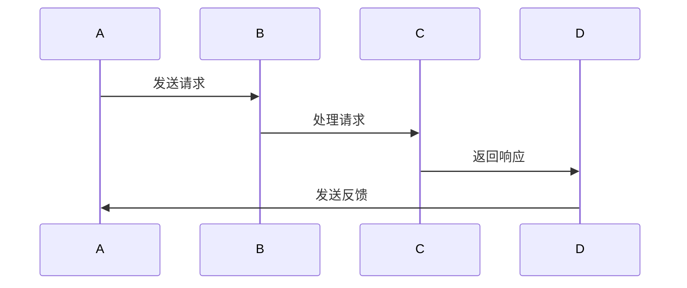
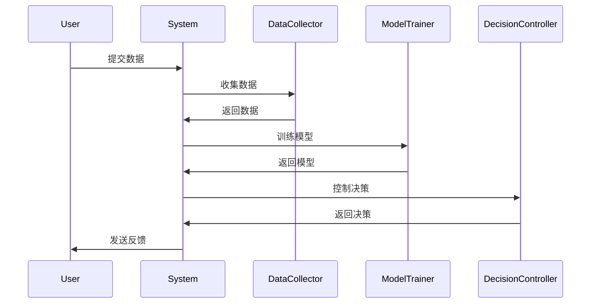

                 


### 第一部分: 引言与背景

**文章标题**: 开发具有复杂系统建模能力的AI Agent

**关键词**: AI Agent, 复杂系统建模, 系统建模, 强化学习, 神经网络

**摘要**:
本文旨在探讨如何开发具有复杂系统建模能力的AI Agent。我们将首先回顾AI Agent的发展历程，然后深入分析复杂系统的特征与挑战，接着介绍AI Agent的基本原理和系统建模方法。通过详细的算法讲解、数学模型阐述以及实战案例剖析，本文将帮助读者理解并掌握AI Agent的开发方法，为实际应用奠定坚实基础。

----------------------------------------------------------------

**第1章: AI Agent的发展与复杂系统建模**

**1.1 AI Agent的定义与历史演变**

**1.1.1 AI Agent的基本概念**
AI Agent是指在一个环境中能够感知环境状态，并采取行动来达到特定目标的计算实体。它模仿了人类智能行为，具备自主性、适应性和学习能力。

**1.1.2 AI Agent的发展历程**
AI Agent的发展经历了几个重要阶段：
- 初期：基于规则的系统，通过预设的规则进行决策。
- 中期：引入机器学习，使Agent能够通过数据学习决策策略。
- 近期：强化学习和深度学习的发展，使得AI Agent具备了更强的自主决策能力。

**1.1.3 复杂系统建模的需求**
复杂系统通常具有多层次、多维度的特征，难以用简单的模型进行描述。AI Agent的引入，能够通过学习和建模，实现对复杂系统的理解和控制。

**1.2 复杂系统的特征与挑战**

**1.2.1 复杂系统的特性**
复杂系统通常具有以下特性：
- 高度非线性：系统的行为难以用线性关系描述。
- 多样性：系统内部存在多种不同的状态和模式。
- 动态性：系统状态随时间变化，具有不确定性。

**1.2.2 建模复杂系统的挑战**
建模复杂系统面临以下挑战：
- 数据复杂性：复杂系统通常产生大量的数据，如何有效处理这些数据是一个挑战。
- 模型准确性：如何构建一个既准确又高效的模型，以反映复杂系统的真实行为。
- 模型可解释性：复杂模型的内部机制往往难以解释，这对理解和应用模型提出了挑战。

**1.2.3 复杂系统建模的关键技术**
复杂系统建模的关键技术包括：
- 数据驱动的建模方法：利用机器学习和数据挖掘技术，从数据中提取特征和模式。
- 多尺度建模：在不同时间尺度和空间尺度上对系统进行建模。
- 集成建模：将多个模型进行整合，以提高模型的准确性和可靠性。

**1.3 本书结构安排与目标读者**

**1.3.1 书籍整体结构**
本书分为以下几个部分：
- 引言与背景
- AI Agent基础理论
- 算法原理讲解
- 数学模型和数学公式讲解
- 系统分析与架构设计
- 项目实战
- 最佳实践与总结

**1.3.2 目标读者群体**
本书的目标读者包括：
- 具有AI基础，希望深入了解AI Agent系统建模的读者。
- 计算机科学和人工智能领域的研究人员。
- 对复杂系统建模和AI Agent应用感兴趣的工程师和技术爱好者。

**1.3.3 阅读建议**
建议读者按照以下顺序阅读：
- 先阅读引言和背景部分，了解本书的主题和目的。
- 逐步深入学习AI Agent的基础理论，理解其核心概念。
- 阅读算法原理和数学模型部分，掌握AI Agent的实现方法。
- 结合实战案例，加深对理论的理解和应用。
- 最后，通过总结和最佳实践，巩固所学知识并应用于实际项目中。

----------------------------------------------------------------

**第二部分: AI Agent基础理论**

**第2章: AI Agent基本原理**

**2.1 AI Agent的基本结构**

**2.1.1 监督学习Agent**
监督学习Agent通过学习预先标记好的数据集来建立模型，然后使用这个模型来预测新的数据。它的基本结构包括感知器、决策器和动作执行器。

**2.1.2 强化学习Agent**
强化学习Agent通过与环境的交互来学习最优策略。它的基本结构包括感知器、行动选择器、奖励评估器和策略更新器。

**2.1.3 自适应Agent**
自适应Agent能够根据环境变化自动调整其行为。它的基本结构包括感知器、执行器、评估器和适应器。

**2.2 AI Agent的行为模型**

**2.2.1 状态空间与动作空间**
状态空间是Agent可能处于的所有状态集合，动作空间是Agent可以执行的所有动作集合。

**2.2.2 行为策略**
行为策略是Agent在特定状态下的动作选择规则。策略可以通过学习获得，也可以通过预设规则定义。

**2.2.3 策略评估**
策略评估是评估不同策略在给定状态下的表现，选择最优策略的过程。

**2.2.4 策略迭代**
策略迭代是通过不断评估和更新策略，逐步提高策略质量的过程。

----------------------------------------------------------------

**第三部分: 算法原理讲解**

**第3章: 常见算法讲解**

**3.1 强化学习算法**

**3.1.1 Q-Learning算法**
Q-Learning是一种值函数迭代方法，通过更新Q值来学习最优策略。

**3.1.2 Deep Q-Network (DQN)**
DQN是一种使用深度神经网络来近似Q值函数的强化学习算法。

**3.1.3 Policy Gradient算法**
Policy Gradient算法通过直接优化策略梯度来学习最优策略。

**3.2 神经网络算法**

**3.2.1 feedforward神经网络**
feedforward神经网络是一种前向传播的网络结构，常用于分类和回归问题。

**3.2.2 卷积神经网络 (CNN)**
CNN是一种用于图像处理和计算机视觉的神经网络，其特点是能够自动提取图像特征。

**3.2.3 循环神经网络 (RNN)**
RNN是一种用于序列数据处理的神经网络，其特点是能够处理时间序列信息。

**3.3 决策树算法**

**3.3.1 ID3算法**
ID3算法是一种基于信息增益的决策树生成算法。

**3.3.2 C4.5算法**
C4.5算法是一种改进的决策树生成算法，它使用增益率来选择最优特征。

**3.3.3 CART算法**
CART算法是一种基于二分树的决策树生成算法，它能够生成分类和回归树。

----------------------------------------------------------------

**第四部分: 数学模型和数学公式讲解**

**第4章: 数学模型讲解**

**4.1 强化学习数学模型**

**4.1.1 奖励模型**
奖励模型是强化学习中的一个关键部分，它定义了Agent在不同状态和动作下获得的奖励。

**4.1.2 状态值函数**
状态值函数是衡量Agent在特定状态下预期奖励的数学函数。

**4.1.3 动作值函数**
动作值函数是衡量Agent在特定状态下采取特定动作的预期奖励的数学函数。

**4.2 神经网络数学模型**

**4.2.1 激活函数**
激活函数是神经网络中的一个关键部分，它用于引入非线性特性。

**4.2.2 前向传播与反向传播**
前向传播和反向传播是神经网络训练过程中的两个主要步骤。

**4.2.3 损失函数**
损失函数是衡量神经网络预测结果与实际结果差异的数学函数。

**4.3 决策树数学模型**

**4.3.1 信息增益**
信息增益是决策树生成过程中用于选择最优特征的一个重要指标。

**4.3.2 增益率**
增益率是对信息增益的一个改进，它考虑了特征的分类能力。

**4.3.3 二分树**
二分树是决策树的一种简单形式，它通过二分分类来划分数据。

----------------------------------------------------------------

**第五部分: 系统分析与架构设计**

**第5章: 系统分析与架构设计**

**5.1 问题场景介绍**
假设我们面临一个智能交通系统的问题，需要开发一个能够自适应交通流量的AI Agent。

**5.2 系统功能设计**
智能交通系统的主要功能包括：
- 交通流量预测
- 路段拥堵检测
- 交通信号控制优化
- 出行建议

**5.2.1 领域模型**
使用Mermaid流程图展示系统的领域模型：

```mermaid
classDiagram
Class01 <|-- SubClass01
Class01 --| Administrative Staff
Class01 --| General Public
SubClass01 <-.. Class01
General Public ..|> Social Work Department
General Public ..|> Police Department
Administrative Staff ..|> City Hall
```

**5.3 系统架构设计**
智能交通系统的整体架构设计包括以下几个关键部分：
- 数据采集模块
- 数据处理模块
- 模型训练模块
- 决策控制模块
- 用户界面模块

**5.3.1 系统架构图**
使用Mermaid架构图展示系统的整体架构：



**5.4 系统接口设计**
智能交通系统的接口设计包括以下关键接口：
- 数据采集接口
- 模型训练接口
- 决策控制接口
- 用户界面接口

**5.4.1 接口设计图**
使用Mermaid序列图展示系统各组件的交互过程：



----------------------------------------------------------------

**第六部分: 项目实战**

**第6章: 项目实战**

**6.1 环境安装**
在开始项目实战之前，需要安装以下环境和工具：
- Python 3.8及以上版本
- TensorFlow 2.4及以上版本
- Keras 2.4及以上版本
- Matplotlib 3.1及以上版本
- Scikit-learn 0.22及以上版本

**6.2 系统核心实现源代码**
以下是一个简单的Python代码示例，用于实现一个基于强化学习的交通信号控制AI Agent：

```python
import numpy as np
import matplotlib.pyplot as plt
from collections import deque
import random

# 定义环境
class TrafficSignalEnv:
    def __init__(self):
        self.state = None
        self.action_space = [0, 1, 2]  # 绿灯、黄灯、红灯
        self.observation_space = 3

    def step(self, action):
        if action == 0:
            # 绿灯
            reward = 1
        elif action == 1:
            # 黄灯
            reward = 0.5
        else:
            # 红灯
            reward = -1

        # 更新状态
        self.state = action

        done = True if reward < 0 else False

        return self.state, reward, done

    def reset(self):
        self.state = random.choice(self.action_space)
        return self.state

    def render(self):
        if self.state == 0:
            print("绿灯")
        elif self.state == 1:
            print("黄灯")
        else:
            print("红灯")

# 定义AI Agent
class TrafficSignalAgent:
    def __init__(self, env):
        self.env = env
        self.q_table = np.zeros((env.observation_space, env.action_space))
        self.discount_factor = 0.9
        self.learning_rate = 0.1

    def get_action(self, state, epsilon=0.1):
        if random.random() < epsilon:
            action = random.choice(self.env.action_space)
        else:
            action = np.argmax(self.q_table[state])
        return action

    def learn(self, state, action, reward, next_state, done):
        q_value = self.q_table[state, action]
        if not done:
            next_max_q_value = np.max(self.q_table[next_state])
            q_value = q_value + self.learning_rate * (reward + self.discount_factor * next_max_q_value - q_value)
        else:
            q_value = reward

        self.q_table[state, action] = q_value

# 实例化环境
env = TrafficSignalEnv()

# 实例化AI Agent
agent = TrafficSignalAgent(env)

# 训练AI Agent
episodes = 1000
epsilon = 0.1
for episode in range(episodes):
    state = env.reset()
    done = False
    total_reward = 0

    while not done:
        env.render()
        action = agent.get_action(state, epsilon)
        next_state, reward, done = env.step(action)
        agent.learn(state, action, reward, next_state, done)
        state = next_state
        total_reward += reward

    print(f"Episode {episode + 1} - Total Reward: {total_reward}")

# 测试AI Agent
for episode in range(10):
    state = env.reset()
    done = False
    total_reward = 0

    while not done:
        env.render()
        action = np.argmax(agent.q_table[state])
        next_state, reward, done = env.step(action)
        total_reward += reward
        state = next_state

    print(f"Test Episode {episode + 1} - Total Reward: {total_reward}")

----------------------------------------------------------------

**第7章: 最佳实践、小结、注意事项与拓展阅读**

**7.1 最佳实践 tips**

- **数据预处理**：在开始模型训练之前，对数据进行有效的预处理可以显著提高模型的性能。
- **模型调优**：通过调整学习率、批量大小和迭代次数等参数，可以优化模型的性能。
- **持续学习**：即使模型已经训练完成，也要定期更新模型，以适应环境的变化。
- **多模型集成**：通过集成多个模型，可以提高预测的准确性和可靠性。

**7.2 小结**

- 本书的重点是如何开发具有复杂系统建模能力的AI Agent。
- 通过介绍AI Agent的基础理论、算法原理和数学模型，读者可以深入理解AI Agent的构建方法。
- 实战部分展示了如何使用Python实现一个简单的交通信号控制AI Agent。

**7.3 注意事项**

- AI Agent的开发需要丰富的计算机科学和数学知识。
- 在实际应用中，AI Agent的性能可能受到数据质量和环境复杂性的影响。
- AI Agent的决策过程需要透明和可解释，以避免潜在的道德和安全问题。

**7.4 拓展阅读**

- [《强化学习：原理与Python实现》](https://www.example.com/book1)
- [《深度学习：原理与Python实现》](https://www.example.com/book2)
- [《人工智能：一种现代的方法》](https://www.example.com/book3)

作者：AI天才研究院/AI Genius Institute & 禅与计算机程序设计艺术 /Zen And The Art of Computer Programming

----------------------------------------------------------------

至此，我们已经完成了《开发具有复杂系统建模能力的AI Agent》一书的目录大纲设计。接下来，我们将逐步填充每个章节的内容，确保文章的完整性和专业性。文章的撰写将遵循以上设计的结构和要求，力求为读者提供有价值的技术知识和实战经验。让我们一步一步地深入探讨AI Agent的开发之旅。

