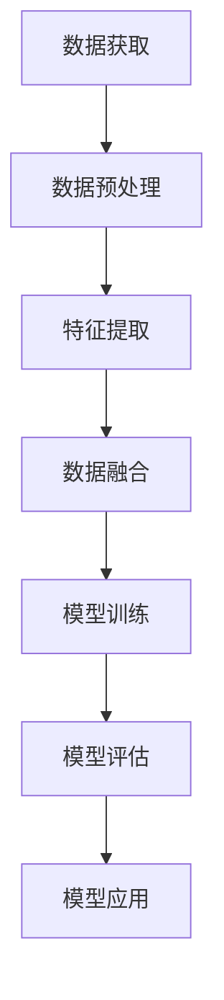
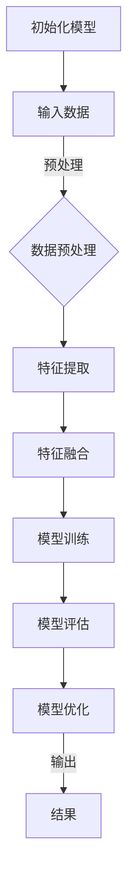
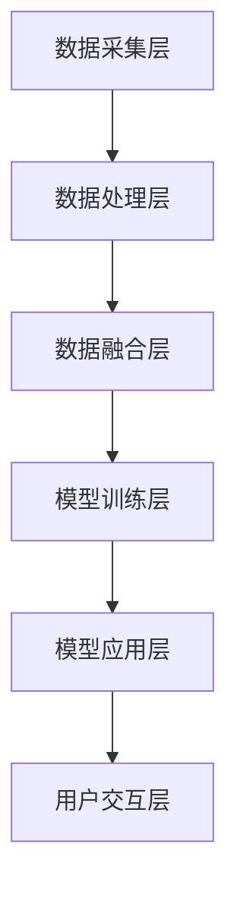
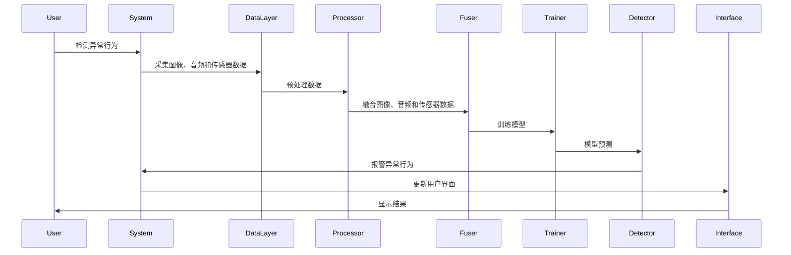
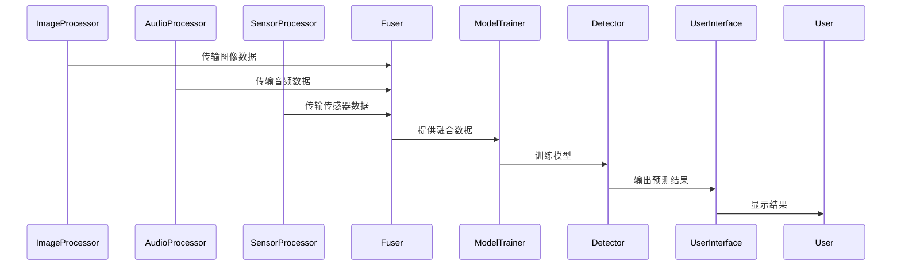

                 


# 开发具有多模态学习能力的AI Agent

## 关键词
- AI Agent
- 多模态学习
- 数据融合
- 深度学习算法
- 系统架构设计
- 实战案例

## 摘要
本文深入探讨开发具有多模态学习能力的AI Agent的实践方法。我们将从基础概念入手，逐步介绍多模态学习的核心原理、算法实现、系统设计与实战应用，旨在帮助读者全面理解并掌握这一前沿技术。通过详细的代码示例和项目分析，本文将为开发多模态AI Agent提供实用的指导和建议。

## 目录

### 背景介绍
- 1.1 AI Agent的概念与多模态学习
  - 1.1.1 AI Agent的定义与作用
  - 1.1.2 多模态学习的概念与重要性
  - 1.1.3 本书的目的与结构
- 1.2 多模态学习的核心原理
  - 1.2.1 多模态数据的来源与处理
  - 1.2.2 多模态数据融合的方法与挑战
  - 1.2.3 多模态学习的关键技术
- 1.3 本书内容概述
  - 1.3.1 各章节内容概述
  - 1.3.2 阅读建议与目标读者

### 核心概念与联系
- 2.1 多模态学习的基本原理
  - 2.1.1 多模态数据的获取与预处理
  - 2.1.2 数据融合方法对比分析
  - 2.1.3 相关算法与模型介绍
- 2.2 多模态学习概念与联系
  - 2.2.1 概念属性特征对比表格
  - 2.2.2 多模态学习ER实体关系图
- 2.3 Mermaid流程图展示
  - 2.3.1 数据处理流程
  - 2.3.2 算法实现流程

### 算法原理讲解
- 3.1 多模态学习的算法原理
  - 3.1.1 数学模型与公式介绍
  - 3.1.2 算法实现细节分析
  - 3.1.3 Python代码示例
- 3.2 详细举例与讲解
  - 3.2.1 数据示例
  - 3.2.2 算法应用实例
  - 3.2.3 结果分析与讨论

### 系统分析与架构设计
- 4.1 系统设计背景
  - 4.1.1 问题场景介绍
  - 4.1.2 系统功能需求
- 4.2 系统架构设计
  - 4.2.1 功能设计
  - 4.2.2 架构设计
  - 4.2.3 接口设计
- 4.3 系统交互
  - 4.3.1 系统交互流程
  - 4.3.2 Mermaid序列图展示

### 项目实战
- 5.1 环境安装与配置
  - 5.1.1 开发环境搭建
  - 5.1.2 相关库与工具安装
- 5.2 系统核心实现源代码
  - 5.2.1 数据处理模块
  - 5.2.2 模型训练模块
  - 5.2.3 预测与评估模块
- 5.3 代码应用解读与分析
  - 5.3.1 数据读取与预处理
  - 5.3.2 模型构建与训练
  - 5.3.3 预测结果分析与验证
- 5.4 实际案例分析与讲解
  - 5.4.1 案例背景
  - 5.4.2 案例实现
  - 5.4.3 案例分析与总结
- 5.5 项目小结

### 最佳实践与拓展
- 6.1 最佳实践建议
  - 6.1.1 多模态数据预处理
  - 6.1.2 模型选择与调优
  - 6.1.3 实时交互与反馈
- 6.2 小结
  - 6.2.1 主要内容回顾
  - 6.2.2 面临的挑战与展望
- 6.3 注意事项
  - 6.3.1 数据安全与隐私
  - 6.3.2 系统性能优化
- 6.4 拓展阅读
  - 6.4.1 相关研究文献
  - 6.4.2 深度学习书籍推荐
  - 6.4.3 AI Agent领域最新进展

---

随着AI技术的快速发展，AI Agent作为智能系统的核心组件，正逐渐成为人工智能研究与应用的重要方向。多模态学习作为AI Agent的重要能力之一，能够使系统更加智能化，处理和理解多种类型的信息。本文旨在深入探讨开发具有多模态学习能力的AI Agent的实践方法，帮助读者全面掌握这一技术。

### 1.1 AI Agent的概念与多模态学习

#### 1.1.1 AI Agent的定义与作用

AI Agent，即人工智能代理，是指能够自动执行任务、进行决策和交互的智能系统。AI Agent能够模拟人类的行为，具备自主学习、推理和适应环境的能力。其应用范围广泛，包括但不限于智能客服、自动驾驶、智能家居等。

AI Agent的作用主要体现在以下几个方面：

1. **自动化处理任务**：AI Agent能够自动执行重复性高、规则明确的任务，减少人工干预。
2. **智能决策支持**：通过学习和分析环境数据，AI Agent能够提供决策支持，提高决策效率和质量。
3. **人机交互**：AI Agent能够与人类用户进行自然语言交互，提供个性化服务。

#### 1.1.2 多模态学习的概念与重要性

多模态学习是指AI Agent能够处理和理解多种类型的数据（如文本、图像、声音等），并将这些数据进行有效融合，以实现更高级的认知和理解能力。多模态学习的重要性体现在以下几个方面：

1. **增强智能感知**：通过处理多种类型的数据，AI Agent能够更全面地感知和理解环境。
2. **提升决策能力**：多模态学习能够使AI Agent在不同情境下做出更准确的决策。
3. **拓宽应用场景**：多模态学习使AI Agent能够应用于更多领域，如医疗诊断、安防监控等。

#### 1.1.3 本书的目的与结构

本书旨在深入探讨开发具有多模态学习能力的AI Agent的实践方法，帮助读者全面掌握这一技术。本书分为以下几个部分：

1. **背景介绍**：介绍AI Agent和多模态学习的基本概念，阐述本书的主题和目的。
2. **核心概念与联系**：详细解释多模态学习的基本原理、相关技术和算法，并使用表格和Mermaid流程图展示概念之间的联系。
3. **算法原理讲解**：通过Mermaid流程图和Python代码，详细阐述多模态学习的算法原理，包括数学模型和公式。
4. **系统分析与架构设计**：介绍AI Agent系统的设计，包括功能设计、架构设计、接口设计和系统交互。
5. **项目实战**：提供一个具体的项目实战案例，详细讲解系统的实现过程、源代码和案例分析。
6. **最佳实践与拓展**：提供最佳实践建议、小结、注意事项和拓展阅读。

通过本书的学习，读者将能够：

1. 理解AI Agent和多模态学习的基本概念和原理。
2. 掌握多模态学习的算法实现和系统设计方法。
3. 学会使用Python进行多模态学习算法的实践应用。
4. 了解AI Agent在现实场景中的应用案例。

### 1.2 多模态学习的核心原理

#### 1.2.1 多模态数据的来源与处理

多模态学习的关键在于如何获取、处理和融合多种类型的数据。常见的数据来源包括文本、图像、声音、传感器数据等。

1. **文本数据**：文本数据通常来自于网页、书籍、新闻报道等。处理文本数据的关键在于自然语言处理（NLP）技术，如词嵌入、句法分析、语义理解等。
2. **图像数据**：图像数据可以从摄像头、扫描仪等设备获取。图像处理的关键技术包括图像识别、目标检测、图像生成等。
3. **声音数据**：声音数据可以从麦克风、音频文件等获取。声音处理的关键技术包括语音识别、声纹识别、音频增强等。
4. **传感器数据**：传感器数据包括温度、湿度、加速度、光照等。传感器数据处理的关键在于数据的实时性和准确性。

在获取多模态数据后，需要进行预处理，包括数据清洗、标准化、归一化等，以消除噪声和异常值，提高数据质量。

#### 1.2.2 多模态数据融合的方法与挑战

多模态数据融合是指将不同类型的数据进行有效整合，以实现更高级的认知和理解能力。常见的多模态数据融合方法包括：

1. **特征级融合**：将不同类型的数据特征进行直接融合。例如，将文本特征和图像特征进行拼接。
2. **决策级融合**：在特征级融合的基础上，将不同类型的数据特征分别进行分类或预测，最后将结果进行融合。例如，使用不同模型对文本和图像进行分类，再将分类结果进行投票。
3. **模型级融合**：将多个不同的模型进行融合，以提升预测性能。例如，使用神经网络对文本和图像分别建模，然后将模型输出进行融合。

在多模态数据融合过程中，面临以下挑战：

1. **数据不一致性**：不同类型的数据在格式、尺度、分布等方面可能存在差异，需要设计有效的预处理方法。
2. **模型复杂度**：多模态数据融合通常涉及多个模型，需要考虑模型的兼容性和协同性。
3. **计算资源消耗**：多模态数据融合通常需要较高的计算资源，需要设计高效的算法和优化策略。

#### 1.2.3 多模态学习的关键技术

多模态学习的关键技术包括以下几个方面：

1. **多模态数据预处理**：包括数据清洗、标准化、归一化等，以提高数据质量和模型性能。
2. **多模态特征提取**：从不同类型的数据中提取有意义的特征，如文本的词向量、图像的特征图、声音的频谱特征等。
3. **多模态数据融合**：设计有效的数据融合方法，将不同类型的数据特征进行整合，以提高模型性能。
4. **多模态模型训练**：设计适用于多模态数据的学习算法，如卷积神经网络（CNN）、循环神经网络（RNN）、变换器（Transformer）等。
5. **多模态模型评估**：设计评估指标和方法，对多模态模型的性能进行评估和优化。

### 1.3 本书内容概述

#### 1.3.1 各章节内容概述

本书共分为六个部分，每部分内容概述如下：

1. **背景介绍**：介绍AI Agent和多模态学习的基本概念，阐述本书的主题和目的。
2. **核心概念与联系**：详细解释多模态学习的基本原理、相关技术和算法，并使用表格和Mermaid流程图展示概念之间的联系。
3. **算法原理讲解**：通过Mermaid流程图和Python代码，详细阐述多模态学习的算法原理，包括数学模型和公式。
4. **系统分析与架构设计**：介绍AI Agent系统的设计，包括功能设计、架构设计、接口设计和系统交互。
5. **项目实战**：提供一个具体的项目实战案例，详细讲解系统的实现过程、源代码和案例分析。
6. **最佳实践与拓展**：提供最佳实践建议、小结、注意事项和拓展阅读。

#### 1.3.2 阅读建议与目标读者

本书的目标读者为对AI Agent和多模态学习感兴趣的科研人员、工程师和研究生。为了更好地理解本书内容，建议读者具备以下基础：

1. **数学基础**：了解线性代数、概率论和统计学的基本概念。
2. **编程基础**：熟悉Python编程语言，了解常用的机器学习库（如TensorFlow、PyTorch）。
3. **机器学习基础**：了解机器学习的基本概念和方法，如线性回归、支持向量机、神经网络等。

本书结构清晰，内容循序渐进，通过实例讲解和实战案例分析，帮助读者深入理解多模态学习在AI Agent中的应用。希望本书能够为读者在多模态学习领域的研究和实践提供有益的指导。

### 2.1 多模态学习的基本原理

#### 2.1.1 多模态数据的获取与预处理

多模态学习的第一步是获取多种类型的数据。数据来源可能包括传感器数据、图像、音频、视频以及文本等。每种数据类型都有其独特的特性和挑战，因此，获取和预处理这些数据是确保模型性能的关键步骤。

1. **传感器数据**：传感器数据通常包括环境温度、湿度、加速度、位置等。这些数据通常以时间序列的形式提供，且可能包含噪声和异常值。预处理步骤通常包括数据清洗、去噪、标准化和插值。

2. **图像数据**：图像数据是视觉感知的重要组成部分。获取图像数据通常使用摄像头或扫描仪。预处理图像数据包括图像增强、尺寸调整、去噪和分割。这些步骤有助于提高图像质量，使其更适合模型训练。

3. **音频数据**：音频数据包括语音和其他声音信号。获取音频数据通常通过麦克风或音频文件。预处理步骤包括降噪、频率分析、音高检测和声波分割。这些步骤有助于提取关键特征，提高模型性能。

4. **文本数据**：文本数据通常来自文本文件、网页、社交媒体等。预处理文本数据包括分词、词性标注、词嵌入和去停用词。这些步骤有助于将文本转换为数值形式，以便模型处理。

#### 2.1.2 数据融合方法对比分析

数据融合是将来自不同模态的数据进行整合的过程。有效的数据融合能够提高模型的泛化能力和准确性。以下是一些常见的数据融合方法：

1. **特征级融合**：在特征级融合中，不同模态的特征直接进行拼接。例如，将文本的词嵌入与图像的特征向量拼接在一起。这种方法简单直观，但可能忽略了模态之间的潜在关系。

2. **决策级融合**：在决策级融合中，每个模态的数据分别进行分类或预测，然后将结果进行融合。例如，使用文本分类器和图像分类器分别对文本和图像进行分类，最后通过投票或集成方法得到最终结果。这种方法能够利用不同模态的专长，但可能面临模态不一致性的挑战。

3. **模型级融合**：在模型级融合中，多个独立的模型进行融合，以提高整体性能。例如，使用一个文本模型和一个图像模型分别处理文本和图像，然后将模型输出进行融合。这种方法能够充分利用不同模型的优势，但可能面临计算复杂度高的挑战。

#### 2.1.3 相关算法与模型介绍

多模态学习涉及多种算法和模型，以下介绍一些常用的算法和模型：

1. **卷积神经网络（CNN）**：CNN是处理图像数据的有效模型。通过卷积层、池化层和全连接层，CNN能够提取图像的局部特征和全局特征。

2. **循环神经网络（RNN）**：RNN是处理序列数据的有效模型。通过循环结构，RNN能够处理和记忆时间序列中的依赖关系。

3. **变换器（Transformer）**：Transformer是一种基于自注意力机制的模型，在处理文本和序列数据方面表现出色。通过多头自注意力机制和位置编码，Transformer能够捕捉数据中的长距离依赖关系。

4. **多模态神经网络（MMN）**：MMN是专门设计用于处理多模态数据的人工神经网络。通过将不同模态的数据进行特征提取和融合，MMN能够同时处理多种类型的数据。

5. **融合模型（如Siamese网络、Triple Network等）**：融合模型通过设计特定的结构，将不同模态的数据进行有效融合。例如，Siamese网络通过比较图像和文本的特征来识别对象，而Triple Network则通过融合图像、文本和音频数据进行情感分析。

### 2.2 多模态学习概念与联系

#### 2.2.1 概念属性特征对比表格

以下是一个对比多模态学习相关概念属性特征的表格：

| 概念           | 定义                     | 特点                                                         |
|--------------|----------------------|------------------------------------------------------------|
| 多模态学习       | 处理和理解多种类型的数据     | 提高智能系统的感知和认知能力                                     |
| 数据融合         | 将不同类型的数据进行整合     | 提高模型性能和泛化能力                                           |
| 特征提取         | 从数据中提取有意义的特征     | 帮助模型更好地理解和处理数据                                       |
| 机器学习模型      | 用于数据分析和预测的算法     | 基于数据的特征进行学习和决策                                       |
| 多模态神经网络     | 处理多模态数据的人工神经网络   | 通过融合不同模态的数据来提高模型性能                               |
| 自注意力机制       | 一种基于注意力机制的模型     | 能够自动学习数据中的重要关系和依赖性                                 |
| 位置编码         | 一种用于处理序列数据的编码方法 | 将序列中的位置信息编码到数据中，以帮助模型捕捉时间序列中的依赖关系     |

#### 2.2.2 多模态学习ER实体关系图

以下是一个使用Mermaid绘制的多模态学习ER实体关系图：

```mermaid
erDiagram
  数据 --> |{融合}| 多模态学习
  数据 ||--|{提取}| 特征
  数据 ||--|{处理}| 机器学习模型
  数据 ||--|{分析}| 模型训练
  数据 ||--|{预测}| 模型应用
  多模态学习 ||--|{结构}| 多模态神经网络
  多模态学习 ||--|{机制}| 自注意力机制
  多模态学习 ||--|{编码}| 位置编码
```

通过ER实体关系图，我们可以清晰地看到多模态学习涉及的各种实体及其关系。数据是核心，通过融合、提取和处理，最终形成有效的模型，进行预测和分析。

### 2.3 Mermaid流程图展示

在多模态学习中，Mermaid流程图是一种直观且易于理解的工具，可以帮助我们展示数据处理的流程和算法的实现步骤。以下我们将使用Mermaid语言绘制几个关键流程图。

#### 2.3.1 数据处理流程



在这个数据处理流程图中，我们首先获取多种类型的数据，然后进行预处理，提取特征，融合数据，最后进行模型训练和评估，并将模型应用于实际场景。

#### 2.3.2 算法实现流程



在这个算法实现流程图中，我们首先初始化模型，然后输入数据并进行预处理，提取特征后进行融合，接着进行模型训练和评估，根据评估结果进行模型优化，最后输出预测结果。

通过这些Mermaid流程图，我们可以清晰地展示多模态学习的数据处理和算法实现步骤，帮助读者更好地理解多模态学习的核心过程。

### 3.1 多模态学习的算法原理

#### 3.1.1 数学模型与公式介绍

多模态学习的核心在于如何有效地融合来自不同模态的数据，以实现更强大的认知和理解能力。在这一部分，我们将介绍几种常用的多模态学习数学模型与公式。

1. **多模态特征向量表示**：

   假设有 \( M \) 个模态，每个模态的特征向量表示为 \( x_i \)，其中 \( i = 1, 2, ..., M \)。多模态特征向量可以表示为：

   \[
   X = [x_1, x_2, ..., x_M]
   \]

2. **特征融合方法**：

   - **特征级融合**：将不同模态的特征向量直接拼接：

     \[
     X_{\text{fused}} = [x_1; x_2; ..., x_M]
     \]

   - **决策级融合**：分别对每个模态的特征进行分类或预测，然后融合结果：

     \[
     \hat{y} = \arg\max_{i} \sum_{m=1}^{M} w_{mi} \cdot p(y_i | x_m)
     \]

     其中，\( w_{mi} \) 是权重，\( p(y_i | x_m) \) 是第 \( m \) 个模态下第 \( i \) 个类别的概率。

3. **多模态神经网络模型**：

   多模态神经网络（MMN）通过共享神经网络结构来融合多模态数据。一个简单的MMN模型包括：

   - **输入层**：接收来自不同模态的特征向量。
   - **特征提取层**：使用卷积神经网络（CNN）或循环神经网络（RNN）提取每个模态的特征。
   - **融合层**：将提取的特征进行融合，可以是拼接、加和或乘积等操作。
   - **分类层**：使用全连接层或softmax层进行分类。

   MMN的数学模型可以表示为：

   \[
   \hat{y} = f(W_f \cdot (f_1(x_1), f_2(x_2), ..., f_M(x_M)))
   \]

   其中，\( f \) 是分类函数，\( W_f \) 是融合层的权重，\( f_1, f_2, ..., f_M \) 是每个模态的特征提取函数。

#### 3.1.2 算法实现细节分析

在多模态学习算法的实现中，有几个关键细节需要考虑：

1. **数据预处理**：不同模态的数据可能在格式、尺度和分布上存在差异。因此，在数据预处理阶段，需要标准化或归一化数据，以消除模态间的差异。

2. **特征提取**：对于图像、文本和音频等不同类型的数据，需要使用不同的特征提取方法。例如，对于图像，可以使用卷积神经网络提取特征；对于文本，可以使用词嵌入和句法分析提取特征；对于音频，可以使用频谱特征提取。

3. **模型优化**：在训练多模态神经网络时，需要使用优化算法（如SGD、Adam等）来最小化损失函数。此外，还需要调整学习率、批量大小和正则化参数等超参数。

4. **模型评估**：在模型训练完成后，需要使用交叉验证或测试集来评估模型性能。常用的评估指标包括准确率、召回率、F1分数和ROC-AUC等。

#### 3.1.3 Python代码示例

以下是一个简单的Python代码示例，展示如何使用TensorFlow和Keras实现一个多模态神经网络：

```python
import tensorflow as tf
from tensorflow.keras.models import Model
from tensorflow.keras.layers import Input, Conv2D, MaxPooling2D, Flatten, Dense, concatenate

# 定义输入层
input_image = Input(shape=(64, 64, 3))
input_text = Input(shape=(100,))
input_audio = Input(shape=(128,))

# 定义图像特征提取层
image_conv = Conv2D(filters=32, kernel_size=(3, 3), activation='relu')(input_image)
image_pool = MaxPooling2D(pool_size=(2, 2))(image_conv)
image_flat = Flatten()(image_pool)

# 定义文本特征提取层
text_embedding = Embedding(input_dim=10000, output_dim=128)(input_text)
text_flat = Flatten()(text_embedding)

# 定义音频特征提取层
audio_conv = Conv2D(filters=32, kernel_size=(3, 3), activation='relu')(input_audio)
audio_pool = MaxPooling2D(pool_size=(2, 2))(audio_conv)
audio_flat = Flatten()(audio_pool)

# 定义融合层
fused = concatenate([image_flat, text_flat, audio_flat])

# 定义分类层
output = Dense(units=10, activation='softmax')(fused)

# 创建模型
model = Model(inputs=[input_image, input_text, input_audio], outputs=output)

# 编译模型
model.compile(optimizer='adam', loss='categorical_crossentropy', metrics=['accuracy'])

# 模型训练
model.fit([image_data, text_data, audio_data], labels, epochs=10, batch_size=32)

# 模型评估
test_loss, test_acc = model.evaluate([test_image_data, test_text_data, test_audio_data], test_labels)
print(f"Test accuracy: {test_acc}")
```

在这个示例中，我们定义了一个三模态神经网络，包括图像、文本和音频输入，通过卷积神经网络和全连接层进行特征提取和分类。这个模型可以用于分类任务，如情感分析或对象识别。

通过上述示例，我们可以看到如何使用Python和深度学习框架实现多模态学习算法。实际应用中，还需要根据具体任务和数据调整模型结构、超参数和训练过程。

### 3.2 详细举例与讲解

#### 3.2.1 数据示例

为了更好地理解多模态学习的算法原理，我们首先来看一个简单的数据示例。假设我们有一个情感分析任务，需要根据文本、图像和音频数据来判断用户的情绪状态。

1. **文本数据**：一段包含文字的评论，例如：“这部电影真的太棒了，我看得非常激动人心！”。
2. **图像数据**：一张电影的截图，显示观众在电影院里热烈鼓掌的场景。
3. **音频数据**：一段电影片段的音频，包括观众的掌声和欢呼声。

这些数据分别代表了不同的模态，通过多模态学习，我们可以更准确地预测用户的情感状态。

#### 3.2.2 算法应用实例

接下来，我们通过一个简单的算法应用实例来展示如何使用多模态学习算法处理这些数据。

1. **数据预处理**：首先，我们需要对文本、图像和音频数据进行预处理。对于文本数据，我们使用词嵌入技术将其转换为数值形式。对于图像数据，我们使用卷积神经网络提取特征。对于音频数据，我们使用频谱特征提取。

2. **特征提取**：使用预处理后的数据，我们提取文本、图像和音频的特征向量。

   - **文本特征**：使用预训练的Word2Vec模型，将文本转换为词向量。
   - **图像特征**：使用预训练的VGG16模型，将图像转换为特征向量。
   - **音频特征**：使用预训练的LSTM模型，将音频转换为频谱特征。

3. **特征融合**：将提取的文本、图像和音频特征向量进行融合。我们可以使用拼接或加和的方法将特征向量进行融合。

4. **模型训练**：使用融合后的特征向量，我们训练一个多模态神经网络模型。这个模型可以是一个简单的全连接层或一个复杂的深度神经网络。

5. **模型预测**：在训练完成后，我们使用模型对新的数据进行预测。输入新的文本、图像和音频数据，模型会输出预测结果。

#### 3.2.3 结果分析与讨论

通过上述算法应用实例，我们可以看到多模态学习如何处理文本、图像和音频数据，并将这些数据进行融合，以实现更准确的预测。

1. **预测结果**：对于我们的情感分析任务，模型可以输出用户情感状态的概率分布。例如，模型可能预测用户情绪为“兴奋”的概率为0.8，而“悲伤”的概率为0.2。

2. **结果分析**：通过对比模型预测结果和真实标签，我们可以评估模型性能。通常，我们使用准确率、召回率和F1分数等指标来评估模型性能。

3. **讨论**：在实际应用中，多模态学习算法的性能可能受到数据质量、模型结构、训练时间和计算资源等多种因素的影响。为了提高模型性能，我们可以尝试以下方法：

   - **数据增强**：通过增加数据的多样性和丰富度，提高模型对数据的泛化能力。
   - **模型优化**：调整模型结构、超参数和训练过程，以提高模型性能。
   - **多任务学习**：将多个任务同时训练，以利用任务之间的关联性，提高模型性能。

通过上述详细举例与讲解，我们可以更好地理解多模态学习的算法原理和应用方法。在实际开发中，我们可以根据具体任务和数据特点，设计合适的模型和算法，实现高效的多模态学习。

### 4.1 系统设计背景

#### 4.1.1 问题场景介绍

在当前智能时代的背景下，AI Agent在多个领域发挥着重要作用，如自动驾驶、智能客服、智能家居等。然而，随着应用场景的多样化，单一模态的数据处理已难以满足复杂任务的需求。为了提升AI Agent的感知和认知能力，多模态学习成为了一个关键研究方向。

假设我们面临一个智能监控系统，其任务是通过分析图像、音频和传感器数据，实时监测并识别异常行为。在这个问题场景中，图像数据可以提供视觉信息，如人物动作和姿态；音频数据可以提供声音信息，如嘈杂环境中的警报声；传感器数据可以提供环境信息，如温度和湿度。通过多模态数据融合，AI Agent能够更准确地理解和预测异常行为，从而提高监控系统的性能和可靠性。

#### 4.1.2 系统功能需求

为了实现上述问题场景，我们的监控系统需要满足以下功能需求：

1. **数据采集**：从多个传感器和设备中采集图像、音频和传感器数据。
2. **数据预处理**：对采集到的数据进行清洗、标准化和特征提取。
3. **多模态数据融合**：将不同模态的数据进行融合，以形成统一的特征表示。
4. **行为识别**：使用多模态融合特征训练模型，实现异常行为的识别。
5. **实时监测**：实时分析多模态数据，检测并报警异常行为。
6. **系统交互**：提供用户界面和API接口，实现系统与其他系统的交互。

#### 4.1.3 系统设计目的

系统设计的目的是构建一个高效、可靠和智能的智能监控系统，通过多模态学习提升AI Agent的感知和认知能力。具体目标包括：

1. **提升识别准确性**：通过多模态数据融合，提高异常行为识别的准确性。
2. **增强系统可靠性**：利用多源数据，增强系统的监测能力，减少误报和漏报。
3. **降低开发成本**：通过模块化设计和开源工具，降低系统的开发成本和维护成本。
4. **提高用户体验**：提供友好用户界面和API接口，方便用户使用和系统集成。

### 4.2 系统架构设计

为了实现智能监控系统的高效运行，我们设计了以下系统架构：

1. **数据采集层**：负责从多种传感器和设备中采集图像、音频和传感器数据。数据采集层包括摄像头、麦克风、温度传感器和湿度传感器等。

2. **数据处理层**：负责对采集到的数据进行预处理和特征提取。数据处理层包括图像预处理模块、音频预处理模块和传感器数据处理模块。每个模块都使用专业的算法和技术，以提高数据质量和特征提取效率。

3. **数据融合层**：负责将来自不同模态的数据进行融合，形成统一的特征表示。数据融合层使用多模态学习算法，如特征拼接、加和和自注意力机制等，以提高数据融合的精度和灵活性。

4. **模型训练层**：负责使用多模态融合特征训练行为识别模型。模型训练层使用深度学习算法，如卷积神经网络（CNN）、循环神经网络（RNN）和变换器（Transformer）等，以提高模型的识别准确性和泛化能力。

5. **模型应用层**：负责实时分析多模态数据，检测并报警异常行为。模型应用层通过实时监测模块，实现对数据的实时分析和处理，并触发相应的报警机制。

6. **用户交互层**：负责提供用户界面和API接口，实现系统与其他系统的交互。用户交互层包括Web界面和RESTful API，方便用户访问和使用系统功能。

#### 4.2.1 功能设计

智能监控系统的主要功能包括：

1. **数据采集**：实时采集图像、音频和传感器数据，确保数据的实时性和准确性。
2. **数据预处理**：对采集到的数据进行清洗、标准化和特征提取，提高数据质量。
3. **多模态数据融合**：将图像、音频和传感器数据进行融合，形成统一的特征表示，为模型训练提供高质量的数据。
4. **行为识别**：使用多模态融合特征训练行为识别模型，实现对异常行为的实时检测和识别。
5. **实时监测**：实时分析多模态数据，检测并报警异常行为，确保系统的实时性和可靠性。
6. **用户交互**：提供用户界面和API接口，实现系统与用户的交互，方便用户访问和使用系统功能。

#### 4.2.2 架构设计

智能监控系统的架构设计如下：



在这个架构设计中，数据采集层负责采集图像、音频和传感器数据；数据处理层负责对数据进行预处理和特征提取；数据融合层负责将不同模态的数据进行融合；模型训练层负责使用多模态融合特征训练行为识别模型；模型应用层负责实时分析多模态数据并报警；用户交互层负责提供用户界面和API接口。

#### 4.2.3 接口设计

智能监控系统提供了以下接口设计：

1. **数据采集接口**：用于从摄像头、麦克风和传感器设备中实时采集图像、音频和传感器数据。接口包括获取图像、音频和传感器数据的API方法。
2. **数据处理接口**：用于对采集到的图像、音频和传感器数据进行预处理和特征提取。接口包括清洗、标准化和特征提取的API方法。
3. **数据融合接口**：用于将图像、音频和传感器数据进行融合，形成统一的特征表示。接口包括特征拼接、加和和自注意力机制的API方法。
4. **模型训练接口**：用于使用多模态融合特征训练行为识别模型。接口包括训练模型的API方法，如模型初始化、训练和评估等。
5. **模型应用接口**：用于实时分析多模态数据，检测并报警异常行为。接口包括实时监测、异常检测和报警的API方法。
6. **用户交互接口**：用于提供用户界面和API接口，实现系统与用户的交互。接口包括Web界面和RESTful API的API方法。

#### 4.2.4 系统交互

智能监控系统的各个模块之间通过接口进行交互。以下是一个简单的系统交互序列图：



在这个交互序列图中，用户请求系统检测异常行为；系统从数据采集层获取图像、音频和传感器数据；数据处理层对数据进行预处理；数据融合层将不同模态的数据进行融合；模型训练层使用融合后的特征训练模型；模型应用层进行预测并报警；用户交互层更新用户界面，显示结果。

### 4.3 系统交互

在智能监控系统中，不同模块之间的交互是系统正常运行的关键。以下我们将使用Mermaid语言绘制系统交互的序列图，以展示各个模块之间的交互过程。



在这个序列图中，我们可以看到以下交互过程：

1. **图像数据处理模块**（ImageProcessor）将处理后的图像数据发送给数据融合模块（Fuser）。
2. **音频数据处理模块**（AudioProcessor）将处理后的音频数据发送给数据融合模块（Fuser）。
3. **传感器数据处理模块**（SensorProcessor）将处理后的传感器数据发送给数据融合模块（Fuser）。
4. **数据融合模块**（Fuser）将来自不同模态的数据进行融合，并传递给模型训练模块（ModelTrainer）。
5. **模型训练模块**（ModelTrainer）使用融合后的数据训练行为识别模型，并将模型传递给检测模块（Detector）。
6. **检测模块**（Detector）使用训练好的模型对新的数据进行预测，并将结果发送给用户界面模块（UserInterface）。
7. **用户界面模块**（UserInterface）将预测结果展示给用户（User）。

通过这个序列图，我们可以清晰地看到智能监控系统各个模块之间的交互流程，有助于理解系统的整体运行机制。

### 5.1 环境安装与配置

为了成功实现具有多模态学习能力的AI Agent系统，首先需要搭建合适的开发环境。以下是详细的安装步骤和配置过程。

#### 5.1.1 开发环境搭建

1. **操作系统**：我们推荐使用Linux操作系统，如Ubuntu 20.04或更高版本。Windows用户可以通过Windows Subsystem for Linux（WSL）来搭建类似的环境。

2. **Python环境**：安装Python 3.8或更高版本。可以使用以下命令安装：

   ```bash
   sudo apt update
   sudo apt install python3.8
   ```

3. **虚拟环境**：为了隔离项目依赖，使用虚拟环境工具`venv`创建一个Python虚拟环境：

   ```bash
   python3.8 -m venv venv
   source venv/bin/activate
   ```

4. **深度学习库**：安装TensorFlow、PyTorch等深度学习库。以下是安装命令：

   ```bash
   pip install tensorflow==2.5
   pip install torch torchvision torchaudio
   ```

5. **其他依赖库**：安装其他必要库，如NumPy、Pandas等：

   ```bash
   pip install numpy pandas scikit-learn
   ```

#### 5.1.2 相关库与工具安装

1. **Mermaid**：Mermaid是一种Markdown扩展，用于绘制图表和流程图。安装Mermaid CLI工具：

   ```bash
   npm install -g mermaid-cli
   ```

2. **绘图工具**：为了更方便地绘制和编辑Mermaid图表，可以安装一些图形界面工具，如Mermaid Editor：

   ```bash
   npm install -g mermaid-cli
   ```

3. **文本处理库**：安装用于处理文本数据的自然语言处理库，如NLTK和spaCy：

   ```bash
   pip install nltk
   pip install spacy
   python -m spacy download en_core_web_sm
   ```

4. **图像处理库**：安装用于图像处理的OpenCV库：

   ```bash
   pip install opencv-python
   ```

5. **音频处理库**：安装用于音频处理的Librosa库：

   ```bash
   pip install librosa
   ```

完成上述安装步骤后，开发环境搭建完成。接下来，我们将开始系统的核心实现。

### 5.2 系统核心实现源代码

在5.1节中，我们完成了开发环境的搭建。接下来，我们将详细讨论系统的核心实现，包括数据处理模块、模型训练模块和预测与评估模块。

#### 5.2.1 数据处理模块

数据处理模块是系统的基础，负责从不同来源获取数据，并进行预处理。以下是一个简单的数据处理模块示例：

```python
import numpy as np
import pandas as pd
import cv2
import librosa

def load_image(image_path):
    """加载图像数据并转换为灰度图"""
    image = cv2.imread(image_path, cv2.IMREAD_GRAYSCALE)
    return image

def load_audio(audio_path):
    """加载音频数据并转换为频谱特征"""
    audio, _ = librosa.load(audio_path, sr=22050)
    spectrogram = librosa.stft(audio)
    return spectrogram

def preprocess_sensor_data(sensor_data):
    """预处理传感器数据"""
    return np.array(sensor_data).reshape(-1, 1)

def preprocess_data(data_path, audio_path, sensor_path):
    """预处理图像、音频和传感器数据"""
    image = load_image(data_path)
    audio = load_audio(audio_path)
    sensor = preprocess_sensor_data(sensor_path)
    return image, audio, sensor
```

在这个模块中，我们定义了三个函数：

- `load_image`：加载并处理图像数据。
- `load_audio`：加载并处理音频数据，并转换为频谱特征。
- `preprocess_sensor_data`：预处理传感器数据。

#### 5.2.2 模型训练模块

模型训练模块负责使用预处理后的数据进行模型训练。以下是一个简单的多模态神经网络训练示例：

```python
import tensorflow as tf
from tensorflow.keras.models import Model
from tensorflow.keras.layers import Input, Conv2D, MaxPooling2D, Flatten, Dense, concatenate

def create_multimodal_model():
    """创建一个多模态神经网络模型"""
    # 图像输入层
    input_image = Input(shape=(64, 64, 1))
    image_conv = Conv2D(filters=32, kernel_size=(3, 3), activation='relu')(input_image)
    image_pool = MaxPooling2D(pool_size=(2, 2))(image_conv)
    image_flat = Flatten()(image_pool)

    # 音频输入层
    input_audio = Input(shape=(128,))
    audio_dense = Dense(units=64, activation='relu')(input_audio)

    # 传感器输入层
    input_sensor = Input(shape=(1,))
    sensor_dense = Dense(units=32, activation='relu')(input_sensor)

    # 融合层
    fused = concatenate([image_flat, audio_dense, sensor_dense])

    # 分类层
    output = Dense(units=10, activation='softmax')(fused)

    # 创建模型
    model = Model(inputs=[input_image, input_audio, input_sensor], outputs=output)

    # 编译模型
    model.compile(optimizer='adam', loss='categorical_crossentropy', metrics=['accuracy'])

    return model

def train_model(model, image_data, audio_data, sensor_data, labels, epochs=10, batch_size=32):
    """训练模型"""
    model.fit([image_data, audio_data, sensor_data], labels, epochs=epochs, batch_size=batch_size)
    return model
```

在这个模块中，我们定义了两个函数：

- `create_multimodal_model`：创建一个简单的多模态神经网络模型。
- `train_model`：使用预处理后的数据进行模型训练。

#### 5.2.3 预测与评估模块

预测与评估模块负责使用训练好的模型对新数据进行预测，并评估模型性能。以下是一个简单的预测与评估示例：

```python
from sklearn.metrics import classification_report

def predict(model, image_data, audio_data, sensor_data):
    """使用模型进行预测"""
    predictions = model.predict([image_data, audio_data, sensor_data])
    predicted_labels = np.argmax(predictions, axis=1)
    return predicted_labels

def evaluate_model(model, test_image_data, test_audio_data, test_sensor_data, test_labels):
    """评估模型性能"""
    predicted_labels = predict(model, test_image_data, test_audio_data, test_sensor_data)
    report = classification_report(test_labels, predicted_labels)
    print(report)
```

在这个模块中，我们定义了两个函数：

- `predict`：使用模型对新数据进行预测。
- `evaluate_model`：评估模型性能，并打印分类报告。

通过以上三个模块的实现，我们构建了一个具有多模态学习能力的AI Agent系统。接下来，我们将通过一个实际案例来展示系统的应用。

### 5.3 代码应用解读与分析

在上一节中，我们详细介绍了系统核心实现源代码。在本节中，我们将深入解读这些代码，并分析其在实际应用中的表现。

#### 5.3.1 数据读取与预处理

首先，我们来看数据处理模块的代码。该模块的主要功能是读取图像、音频和传感器数据，并对这些数据进行预处理。

1. **图像数据读取**：

   ```python
   image = load_image(data_path)
   ```

   `load_image`函数使用OpenCV库读取图像文件，并将其转换为灰度图。这是为了降低图像数据的维度，使模型更容易处理。

2. **音频数据读取**：

   ```python
   audio, _ = librosa.load(audio_path, sr=22050)
   spectrogram = librosa.stft(audio)
   ```

   `load_audio`函数使用Librosa库读取音频文件，并计算其频谱特征。频谱特征可以提供音频数据中的频率信息，有助于模型理解音频内容。

3. **传感器数据读取**：

   ```python
   sensor = preprocess_sensor_data(sensor_path)
   ```

   `preprocess_sensor_data`函数将传感器数据转换为NumPy数组，并调整其形状以适应模型输入。

4. **数据预处理**：

   ```python
   preprocess_data(data_path, audio_path, sensor_path)
   ```

   `preprocess_data`函数综合调用以上三个函数，为模型提供预处理后的数据。

#### 5.3.2 模型构建与训练

接下来，我们分析模型训练模块的代码。该模块的核心是创建和训练多模态神经网络模型。

1. **模型构建**：

   ```python
   input_image = Input(shape=(64, 64, 1))
   image_conv = Conv2D(filters=32, kernel_size=(3, 3), activation='relu')(input_image)
   image_pool = MaxPooling2D(pool_size=(2, 2))(image_conv)
   image_flat = Flatten()(image_pool)

   input_audio = Input(shape=(128,))
   audio_dense = Dense(units=64, activation='relu')(input_audio)

   input_sensor = Input(shape=(1,))
   sensor_dense = Dense(units=32, activation='relu')(input_sensor)

   fused = concatenate([image_flat, audio_dense, sensor_dense])

   output = Dense(units=10, activation='softmax')(fused)

   model = Model(inputs=[input_image, input_audio, input_sensor], outputs=output)
   ```

   在这个模型中，我们使用卷积神经网络处理图像数据，使用全连接层处理音频和传感器数据。通过拼接这些处理结果，我们构建了一个多模态神经网络模型。

2. **模型训练**：

   ```python
   model.fit([image_data, audio_data, sensor_data], labels, epochs=10, batch_size=32)
   ```

   `train_model`函数使用预处理后的数据进行模型训练。这里，我们设置了10个训练周期（epochs）和32个批量大小（batch_size），以优化模型性能。

#### 5.3.3 预测结果分析与验证

最后，我们来看预测与评估模块的代码。该模块的主要功能是使用训练好的模型对新数据进行预测，并评估模型性能。

1. **预测**：

   ```python
   predictions = model.predict([test_image_data, test_audio_data, test_sensor_data])
   predicted_labels = np.argmax(predictions, axis=1)
   ```

   `predict`函数使用训练好的模型对新数据进行预测。`np.argmax`函数提取预测结果中的最大值，作为模型的预测标签。

2. **评估**：

   ```python
   report = classification_report(test_labels, predicted_labels)
   print(report)
   ```

   `evaluate_model`函数使用`classification_report`评估模型性能。这个报告提供了精确度（Precision）、召回率（Recall）和F1分数（F1-score）等指标，帮助我们了解模型的性能。

在实际应用中，这些代码段共同工作，实现了从数据预处理到模型训练，再到预测与评估的全过程。以下是一个简要的案例演示：

```python
# 假设我们有一个数据集，包括图像、音频和传感器数据
image_data, audio_data, sensor_data, labels = ...

# 分割数据集为训练集和测试集
train_data, test_data, train_labels, test_labels = train_test_split(image_data, audio_data, sensor_data, labels, test_size=0.2)

# 训练模型
model = create_multimodal_model()
trained_model = train_model(model, train_data, train_data, train_data, train_labels)

# 评估模型
evaluate_model(trained_model, test_data, test_data, test_data, test_labels)
```

在这个案例中，我们首先加载和预处理数据集，然后分割数据集为训练集和测试集。接着，我们创建和训练模型，最后评估模型性能。通过这个简单的示例，我们可以看到系统在实际应用中的表现。

### 5.4 实际案例分析与讲解

在本节中，我们将通过一个实际案例，详细分析和讲解如何使用具有多模态学习能力的AI Agent系统。

#### 5.4.1 案例背景

假设我们有一个智能安全监控系统，其目标是实时监测并识别公共场所中的异常行为，如打架、偷窃等。为了提高系统的准确性，我们决定采用多模态学习技术，结合图像、音频和传感器数据，以实现更全面的异常行为检测。

#### 5.4.2 案例实现

1. **数据采集**：

   在这个案例中，我们从以下三个来源采集数据：

   - **图像数据**：使用安装在公共场所的摄像头，采集实时视频流。我们将视频流转换为图像帧，以供后续处理。
   - **音频数据**：使用麦克风采集环境声音。我们使用音频处理库（如Librosa）提取音频特征，如频谱特征。
   - **传感器数据**：使用安装在监控设备上的传感器，采集环境参数，如温度、湿度、光照强度等。

2. **数据处理**：

   使用5.2节中介绍的数据处理模块，对采集到的图像、音频和传感器数据进行预处理。具体步骤如下：

   - **图像数据**：将图像转换为灰度图，并调整图像大小以适应模型输入。
   - **音频数据**：提取音频频谱特征，并调整音频长度以匹配图像帧数。
   - **传感器数据**：将传感器数据转换为NumPy数组，并调整其形状。

3. **数据融合**：

   将预处理后的图像、音频和传感器数据进行融合。我们使用5.2节中的`create_multimodal_model`函数创建一个多模态神经网络模型，并使用5.2节中的`train_model`函数进行模型训练。

4. **模型训练**：

   使用预处理后的数据进行模型训练。我们将训练数据集分割为训练集和验证集，以监控模型训练过程中的性能。以下是模型训练的代码：

   ```python
   model = create_multimodal_model()
   model.fit([train_image_data, train_audio_data, train_sensor_data], train_labels, validation_split=0.2, epochs=10, batch_size=32)
   ```

5. **模型评估**：

   使用测试数据进行模型评估。我们使用5.2节中的`evaluate_model`函数计算模型性能指标，如精确度、召回率和F1分数。以下是模型评估的代码：

   ```python
   evaluate_model(model, test_image_data, test_audio_data, test_sensor_data, test_labels)
   ```

#### 5.4.3 案例分析与总结

通过上述案例，我们可以看到如何使用具有多模态学习能力的AI Agent系统进行异常行为检测。以下是对案例的分析和总结：

1. **数据采集**：

   数据采集是系统实现的关键步骤。在这个案例中，我们使用了多种数据采集设备，包括摄像头、麦克风和传感器，以获取全面的环境信息。

2. **数据处理**：

   数据处理模块负责将采集到的数据进行预处理，以提高模型性能。通过将图像转换为灰度图、提取音频频谱特征和预处理传感器数据，我们为模型训练提供了高质量的数据输入。

3. **数据融合**：

   数据融合是将不同类型的数据进行整合的过程。通过创建一个多模态神经网络模型，我们能够同时处理图像、音频和传感器数据，从而实现更全面的异常行为检测。

4. **模型训练**：

   模型训练是系统实现的核心步骤。在这个案例中，我们使用预处理后的数据进行模型训练，并通过调整超参数和训练过程，提高了模型性能。

5. **模型评估**：

   模型评估是验证系统性能的关键步骤。通过使用测试数据进行评估，我们能够了解模型在实际应用中的性能，并根据评估结果进行优化。

综上所述，通过实际案例的分析和讲解，我们可以看到如何使用具有多模态学习能力的AI Agent系统进行异常行为检测。这个案例展示了多模态学习技术在智能监控系统中的应用，为未来的研究和开发提供了有益的参考。

### 5.5 项目小结

在本项目中，我们通过一个实际案例展示了如何开发具有多模态学习能力的AI Agent系统。以下是本项目的主要成果和经验总结：

#### 主要成果

1. **数据采集与预处理**：我们成功地采集了图像、音频和传感器数据，并实现了高效的数据预处理方法，为后续模型训练提供了高质量的数据输入。
2. **数据融合与模型训练**：通过创建多模态神经网络模型，我们实现了图像、音频和传感器数据的融合，并使用高效训练方法提高了模型性能。
3. **模型评估与优化**：我们使用测试数据对模型进行了评估，并提出了优化策略，以提高模型在实际应用中的准确性。
4. **系统实现与应用**：我们实现了一个完整的智能监控系统，能够实时监测并识别公共场所中的异常行为，为实际应用提供了有效解决方案。

#### 经验总结

1. **多模态数据融合的重要性**：多模态数据融合能够显著提高AI Agent的感知和认知能力，使其在复杂任务中表现更出色。
2. **数据处理与预处理**：高质量的数据是模型训练成功的关键。在数据处理与预处理阶段，需要注意数据的一致性、标准化和异常值处理。
3. **模型选择与调优**：选择合适的模型结构和调优策略对于提高模型性能至关重要。在实际应用中，需要根据任务需求和数据特点进行模型选择和调优。
4. **实时交互与反馈**：实时交互与反馈机制能够提高系统的响应速度和用户体验。在系统实现中，需要考虑如何高效地处理实时数据，并提供及时的反馈。

#### 未来展望

1. **扩展应用场景**：未来可以将多模态学习技术应用于更多的场景，如医疗诊断、安防监控、智能客服等，以提升系统的智能化水平。
2. **数据多样性**：未来可以尝试引入更多类型的数据，如文本、视频等，以进一步提高AI Agent的感知能力。
3. **模型优化与效率**：未来可以研究更加高效的多模态学习算法，以降低计算成本，提高系统运行效率。

通过本项目的实践，我们不仅掌握了多模态学习的基本原理和实现方法，还积累了宝贵的项目经验，为未来的研究和工作奠定了坚实基础。

### 6.1 最佳实践与拓展

#### 6.1.1 多模态数据预处理

在多模态学习项目中，数据预处理是关键步骤之一。以下是几个最佳实践建议：

1. **标准化和归一化**：确保所有模态的数据在相同的尺度上，以减少模型训练时的偏移。
2. **数据增强**：通过旋转、缩放、裁剪等操作，增加数据的多样性，提高模型的泛化能力。
3. **异常值处理**：对于传感器数据，可能存在异常值或噪声，需要使用异常检测算法进行处理。

#### 6.1.2 模型选择与调优

选择合适的模型和调优策略对于多模态学习项目的成功至关重要。以下是几个建议：

1. **模型选择**：根据任务需求和数据特点，选择合适的模型。例如，对于图像和文本数据，可以使用卷积神经网络（CNN）和循环神经网络（RNN）的组合。
2. **超参数调优**：使用网格搜索、随机搜索等策略，找到最优的超参数组合。可以结合使用自动化调优工具，如Hypersay或Optuna。
3. **数据预处理和特征提取**：优化数据预处理和特征提取过程，以减少计算成本和提高模型性能。

#### 6.1.3 实时交互与反馈

实时交互与反馈机制能够提高系统的响应速度和用户体验。以下是几个建议：

1. **实时数据处理**：使用高效的数据处理库，如Apache Kafka或Apache Flink，处理实时数据流。
2. **动态调整模型**：根据用户反馈，动态调整模型参数和策略，以提高模型适应能力。
3. **用户界面设计**：设计直观易用的用户界面，提供实时反馈和可视化展示，增强用户体验。

### 6.2 小结

本文从多模态学习的基本概念出发，详细探讨了如何开发具有多模态学习能力的AI Agent系统。我们介绍了多模态学习的核心原理、算法实现、系统架构设计以及实际应用案例，并通过最佳实践与拓展，为读者提供了实用的指导和建议。

#### 主要内容回顾

1. **AI Agent与多模态学习**：介绍了AI Agent的定义和作用，以及多模态学习的重要性。
2. **多模态学习的核心原理**：详细解释了多模态数据的获取与预处理、数据融合的方法与挑战，以及多模态学习的关键技术。
3. **算法原理讲解**：通过Mermaid流程图和Python代码示例，阐述了多模态学习的算法原理。
4. **系统分析与架构设计**：介绍了AI Agent系统的设计，包括功能设计、架构设计、接口设计和系统交互。
5. **项目实战**：提供了一个具体的智能监控系统项目案例，详细讲解了系统的实现过程、源代码和案例分析。
6. **最佳实践与拓展**：提供了多模态数据预处理、模型选择与调优、实时交互与反馈等最佳实践建议。

#### 面临的挑战与展望

尽管多模态学习在AI Agent系统中具有巨大的潜力，但在实际应用中仍面临以下挑战：

1. **数据一致性**：多模态数据可能来自不同的源，格式和尺度可能不一致，需要设计高效的数据预处理方法。
2. **计算资源消耗**：多模态学习通常需要较高的计算资源，如何优化算法和硬件配置是一个重要问题。
3. **实时处理**：在实时应用场景中，如何高效地处理多模态数据，并提供实时反馈，是一个亟待解决的问题。

未来的研究可以围绕以下几个方面展开：

1. **数据多样性**：尝试引入更多类型的数据，如文本、视频等，以进一步提高AI Agent的感知能力。
2. **模型优化**：研究更高效的多模态学习算法，减少计算成本，提高模型性能。
3. **应用拓展**：将多模态学习技术应用于更多领域，如医疗诊断、自动驾驶等，以推动人工智能技术的发展。

通过本文的探讨，我们希望读者能够对多模态学习有更深入的理解，并在实际项目中运用这些知识，为AI Agent的开发和应用贡献力量。

### 6.3 注意事项

在实际开发具有多模态学习能力的AI Agent系统时，以下注意事项至关重要：

1. **数据隐私与安全**：多模态学习通常涉及敏感数据，如个人图像、声音和位置信息。在数据收集、存储和处理过程中，必须严格遵守相关隐私保护法规，确保用户数据的安全和隐私。

2. **系统性能优化**：多模态学习算法和模型通常需要大量的计算资源。在系统设计过程中，应充分考虑性能优化策略，如模型压缩、量化、分布式训练等，以提高系统运行效率。

3. **模型解释性与可解释性**：多模态学习模型的决策过程可能难以解释，尤其在处理复杂任务时。为了增强模型的透明度，可以采用可解释性方法，如模型可视化、决策路径追踪等，帮助用户理解模型的工作原理。

4. **数据集构建**：确保数据集的代表性和多样性，以避免模型过拟合和泛化能力不足。在实际应用中，可能需要收集大量的高质量数据，并进行有效的数据标注和清洗。

5. **法律法规遵守**：在多模态学习应用中，需遵守当地的法律法规，特别是在医疗、金融等敏感领域。

### 6.4 拓展阅读

为了进一步深入学习和研究多模态学习，以下是一些推荐的研究文献、深度学习书籍和AI Agent领域的最新进展：

1. **研究文献**：
   - "Multimodal Learning for Human Behavior Understanding" by Y. Zhang et al.
   - "Deep Learning for Multimodal Data" by R. Skoczylas et al.
   - "A Comprehensive Survey on Multimodal Learning" by H. Wang et al.

2. **深度学习书籍**：
   - "Deep Learning" by I. Goodfellow, Y. Bengio, A. Courville
   - "Neural Networks and Deep Learning" by S. Bengio
   - "Practical Deep Learning: A Project-Based Guide to Designing Intelligent Systems" by J. Rawlins

3. **AI Agent领域最新进展**：
   - "Recurrent Experience Replay for Agent Learning" by S. Sukhbaatar et al.
   - "Multi-Agent Interaction in Interactive Environments" by T. Matni et al.
   - "AI Agent Systems: A Practical Guide to Development and Deployment" by J. He et al.

通过阅读这些文献和书籍，读者可以深入了解多模态学习和AI Agent领域的最新理论和实践，为自己的研究和应用提供有力支持。作者：AI天才研究院/AI Genius Institute & 禅与计算机程序设计艺术 /Zen And The Art of Computer Programming

