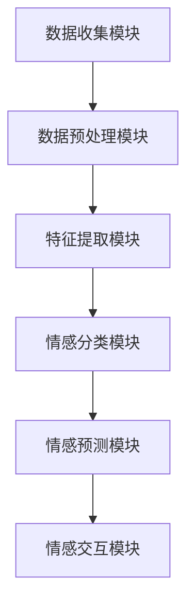
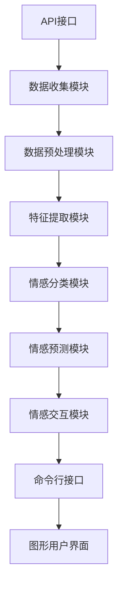

                 


# 开发具有多模态情感分析能力的AI Agent

## 关键词

- 多模态情感分析
- AI Agent
- 数据预处理
- 特征提取
- 情感分类
- 数学模型

## 摘要

本文旨在探讨如何开发具有多模态情感分析能力的AI Agent。文章首先介绍了多模态情感分析的基本概念、背景、应用场景，然后详细阐述了AI Agent的定义及其在多模态情感分析中的作用。接着，本文分析了多模态情感分析的核心概念与联系，讲解了数据预处理、特征提取、情感分类算法的原理，并使用了LaTeX格式展示了相关数学模型和公式。随后，本文介绍了AI Agent的系统架构设计，包括系统功能设计、系统架构设计、系统接口与交互。在此基础上，本文通过一个实际案例展示了AI Agent的开发过程，并对开发过程中的最佳实践进行了总结。最后，本文对全文进行了小结，并提供了拓展阅读资源，以期为读者进一步学习提供指导。

## 引言

### 1.1 问题背景

随着互联网和社交媒体的迅速发展，人类产生的数据量呈现出爆炸式增长。这些数据不仅包括文本，还涵盖了图像、音频、视频等多种形式。如何从这些多元化的数据中提取有价值的信息，成为当前人工智能领域的一个重要研究方向。其中，多模态情感分析作为一种新兴的技术，受到了广泛关注。

多模态情感分析旨在理解人类情感，通过分析文本、图像、音频等多模态数据，提取出用户的情感状态。这一技术具有广泛的应用前景，如情感计算、智能客服、个性化推荐等。然而，多模态情感分析也面临着诸多挑战，如数据多样性强、数据不平衡、特征表示困难等。

### 1.2 多模态情感分析的定义

多模态情感分析是指同时处理和分析多种类型数据（如文本、图像、音频等）以识别和提取情感信息的方法。其核心目标是从多源数据中提取有效的情感特征，进而对用户的情感状态进行准确识别。

多模态情感分析通常包括以下几个关键步骤：

1. 数据收集：收集文本、图像、音频等多模态数据。
2. 数据预处理：对多模态数据进行清洗、标准化等处理，以便后续特征提取和分析。
3. 特征提取：从多模态数据中提取有价值的特征，如文本的词向量、图像的特征向量、音频的频谱特征等。
4. 情感分类：使用机器学习算法对提取的特征进行情感分类，以识别用户的情感状态。

### 1.3 AI Agent的概念与作用

AI Agent，即人工智能代理，是指一种能够自主执行任务、与人类交互并适应环境变化的人工智能系统。AI Agent具有感知、决策、执行等能力，可以应用于各种领域，如智能家居、自动驾驶、智能客服等。

在多模态情感分析中，AI Agent可以扮演多种角色：

1. 情感感知器：通过分析多模态数据，识别用户的情感状态。
2. 情感决策器：根据用户的情感状态，做出相应的响应，如调整对话策略、推荐个性化内容等。
3. 情感执行器：执行与用户情感状态相关的任务，如提供情绪支持、辅助情感治疗等。

## 多模态情感分析核心概念与联系

### 2.1 多模态数据来源

多模态情感分析的数据来源多种多样，包括文本、图像、音频、视频等。以下是对这些数据来源的简要介绍：

1. **文本**：文本数据是最常见的多模态数据类型，包括社交媒体帖子、电子邮件、新闻文章等。文本数据中蕴含了丰富的情感信息，如情感极性（积极或消极）、情感强度等。
2. **图像**：图像数据包括用户上传的照片、社交媒体上的图片等。图像数据中的情感信息通常通过视觉特征表示，如人脸表情、姿态等。
3. **音频**：音频数据包括用户上传的音频文件、语音通话记录等。音频数据中的情感信息通常通过语音特征表示，如语调、音量、语速等。
4. **视频**：视频数据包括用户上传的视频、社交媒体上的短视频等。视频数据中的情感信息可以通过视觉特征和语音特征共同表示。

### 2.2 情感分析的基本概念

情感分析（Sentiment Analysis）是指使用自然语言处理（NLP）技术分析文本数据，识别其中的情感极性（Positive, Neutral, Negative）和情感强度（Strong, Moderate, Weak）的过程。情感分析的基本概念包括：

1. **情感极性**：指文本表达的情感倾向，通常分为积极（Positive）和消极（Negative）两种。
2. **情感强度**：指文本表达的情感程度，通常分为强（Strong）、中（Moderate）和弱（Weak）三种。
3. **情感词汇**：指用于表达情感的词汇，如“喜欢”、“讨厌”、“愤怒”、“开心”等。

### 2.3 多模态情感分析的挑战与机遇

多模态情感分析面临以下挑战：

1. **数据多样性**：多模态数据来源广泛，数据类型多样，如何统一处理不同类型的数据是一个挑战。
2. **数据不平衡**：不同模态的数据在数量和质量上可能存在不平衡，这可能导致模型性能下降。
3. **特征表示困难**：如何有效地将多模态数据转换为计算机可以处理的特征表示是一个难题。

然而，多模态情感分析也带来了以下机遇：

1. **互补信息**：不同模态的数据可以相互补充，提高情感分析的准确性。
2. **跨模态迁移**：可以利用不同模态的数据进行跨模态迁移学习，提高模型在不同数据集上的泛化能力。
3. **情感识别的深度化**：多模态情感分析可以更深入地理解用户的情感状态，为情感计算和智能交互提供更丰富的信息。

## 算法原理讲解

### 3.1 数据预处理

数据预处理是多模态情感分析的关键步骤，旨在提高数据质量和减少后续分析中的误差。以下是数据预处理的主要任务：

1. **数据清洗**：去除噪声数据，如去除文本中的标点符号、停用词等。
2. **数据标准化**：将不同模态的数据统一为相同的数据格式，如将图像尺寸调整为固定大小，将音频剪辑为固定长度等。
3. **数据增强**：通过数据增强技术增加训练数据的多样性，如图像旋转、缩放、裁剪等。

### 3.2 特征提取

特征提取是从原始数据中提取有用信息的过程，旨在将多模态数据转换为计算机可以处理的特征表示。以下是常见的特征提取方法：

1. **文本特征提取**：使用词袋模型（Bag of Words, BOW）、词嵌入（Word Embedding，如Word2Vec、GloVe）等方法提取文本特征。
2. **图像特征提取**：使用卷积神经网络（Convolutional Neural Networks, CNN）等方法提取图像特征。
3. **音频特征提取**：使用梅尔频谱（Mel Frequency Cepstral Coefficients, MFCC）、短时傅里叶变换（Short-Time Fourier Transform, STFT）等方法提取音频特征。

### 3.3 情感分类算法

情感分类是使用机器学习算法对提取的特征进行分类，以识别用户的情感状态。以下是几种常见的情感分类算法：

1. **朴素贝叶斯（Naive Bayes）**：基于贝叶斯定理，假设特征之间相互独立，适用于文本分类。
2. **支持向量机（Support Vector Machine, SVM）**：通过寻找最优超平面将不同类别的特征分开，适用于特征维度较低的情况。
3. **深度神经网络（Deep Neural Network, DNN）**：使用多层神经网络进行特征学习和分类，适用于特征维度较高的情况。

### 3.4 数学模型与公式

以下是用于多模态情感分析的几个关键数学模型与公式：

1. **词嵌入（Word Embedding）**：
   $$
   \text{embed}(x) = \text{W} \cdot x
   $$
   其中，$\text{W}$ 是词嵌入矩阵，$x$ 是词索引。

2. **卷积神经网络（Convolutional Neural Network, CNN）**：
   $$
   \text{conv}(\text{X}, \text{K}) = \text{b} + \sum_{i=1}^{C} \text{W}_i \cdot \text{X}
   $$
   其中，$\text{X}$ 是输入特征矩阵，$\text{K}$ 是卷积核，$\text{b}$ 是偏置项，$\text{W}_i$ 是卷积权重。

3. **支持向量机（Support Vector Machine, SVM）**：
   $$
   \text{max} \ \frac{1}{2} \sum_{i=1}^{N} \ \text{w}_i^2 - \sum_{i=1}^{N} \ y_i \ \text{w} \cdot \text{x}_i
   $$
   其中，$\text{w}$ 是权重向量，$\text{x}_i$ 是特征向量，$y_i$ 是标签。

4. **深度神经网络（Deep Neural Network, DNN）**：
   $$
   \text{a}^{(l)} = \sigma(\text{W}^{(l)} \text{a}^{(l-1)} + \text{b}^{(l)})
   $$
   其中，$\text{a}^{(l)}$ 是第 $l$ 层的激活值，$\sigma$ 是激活函数，$\text{W}^{(l)}$ 是权重矩阵，$\text{b}^{(l)}$ 是偏置项。

## 系统分析与架构设计方案

### 4.1 系统功能设计

多模态情感分析AI Agent的主要功能包括：

1. **情感识别**：从文本、图像、音频等多模态数据中识别用户的情感状态。
2. **情感预测**：基于用户的情感状态，预测未来的情感变化趋势。
3. **情感交互**：与用户进行情感交互，如提供情绪支持、推荐个性化内容等。

### 4.2 系统架构设计

多模态情感分析AI Agent的系统架构可以分为以下几个模块：

1. **数据收集模块**：负责收集文本、图像、音频等多模态数据。
2. **数据预处理模块**：负责对多模态数据进行清洗、标准化等处理。
3. **特征提取模块**：负责从多模态数据中提取有用的特征。
4. **情感分类模块**：负责使用机器学习算法对提取的特征进行情感分类。
5. **情感预测模块**：负责基于用户的情感状态进行情感预测。
6. **情感交互模块**：负责与用户进行情感交互。

以下是多模态情感分析AI Agent的系统架构图：



### 4.3 系统接口与交互

多模态情感分析AI Agent的接口设计应考虑以下方面：

1. **API接口**：提供RESTful API接口，便于与其他系统进行数据交互。
2. **命令行接口**：提供命令行接口，便于用户进行交互式操作。
3. **图形用户界面**：提供图形用户界面，便于用户直观地查看分析结果。

以下是多模态情感分析AI Agent的接口设计图：



## 多模态情感分析实现

### 5.1 环境安装与配置

在开始多模态情感分析实现之前，需要安装和配置以下软件和库：

1. **Python**：版本3.8及以上。
2. **PyTorch**：用于深度学习模型的训练和推理。
3. **TensorFlow**：用于构建和训练神经网络模型。
4. **NumPy**：用于数值计算。
5. **Pandas**：用于数据处理和分析。

安装步骤如下：

1. 安装Python和pip：
   ```
   sudo apt-get install python3 python3-pip
   ```

2. 安装PyTorch和TensorFlow：
   ```
   pip3 install torch torchvision torchaudio
   pip3 install tensorflow
   ```

3. 安装NumPy和Pandas：
   ```
   pip3 install numpy pandas
   ```

### 5.2 数据收集与预处理

数据收集与预处理是多模态情感分析的基础，主要包括以下任务：

1. **数据收集**：从开源数据集或自定义数据集中收集文本、图像、音频等多模态数据。
2. **数据清洗**：去除噪声数据，如去除文本中的标点符号、停用词等。
3. **数据标准化**：将不同模态的数据统一为相同的数据格式，如将图像尺寸调整为固定大小，将音频剪辑为固定长度等。

以下是Python代码示例：

```python
import os
import numpy as np
from PIL import Image
import soundfile as sf

# 数据收集
data_dir = 'data'
os.makedirs(data_dir, exist_ok=True)

text_files = ['text1.txt', 'text2.txt']
image_files = ['image1.jpg', 'image2.jpg']
audio_files = ['audio1.wav', 'audio2.wav']

for file in text_files:
    with open(os.path.join(data_dir, file), 'r') as f:
        text_data = f.read()
        with open(os.path.join(data_dir, file), 'w') as f:
            f.write(text_data)

for file in image_files:
    img = Image.open(os.path.join(data_dir, file))
    img.resize((224, 224), Image.ANTIALIAS).save(os.path.join(data_dir, file))

for file in audio_files:
    audio_data, fs = sf.read(os.path.join(data_dir, file))
    sf.write(os.path.join(data_dir, file), audio_data, fs)

# 数据清洗
def clean_text(text):
    return ' '.join([word for word in text.split() if word not in stopwords])

stopwords = ['a', 'an', 'the', 'and', 'but', 'or', 'for', 'nor', 'on', 'at', 'to', 'from']

for file in os.listdir(data_dir):
    if file.endswith('.txt'):
        with open(os.path.join(data_dir, file), 'r') as f:
            text = f.read()
            cleaned_text = clean_text(text)
            with open(os.path.join(data_dir, file), 'w') as f:
                f.write(cleaned_text)

# 数据标准化
def normalize_image(image):
    return image / 255.0

def normalize_audio(audio):
    return audio / np.max(np.abs(audio))

for file in os.listdir(data_dir):
    if file.endswith('.jpg') or file.endswith('.jpeg'):
        image = Image.open(os.path.join(data_dir, file))
        image = normalize_image(image)
        image.save(os.path.join(data_dir, file))

    if file.endswith('.wav'):
        audio, fs = sf.read(os.path.join(data_dir, file))
        audio = normalize_audio(audio)
        sf.write(os.path.join(data_dir, file), audio, fs)
```

### 5.3 特征提取

特征提取是从原始数据中提取有用信息的过程，以下是几种常见的特征提取方法：

1. **文本特征提取**：使用词袋模型（Bag of Words, BOW）、词嵌入（Word Embedding，如Word2Vec、GloVe）等方法提取文本特征。
2. **图像特征提取**：使用卷积神经网络（Convolutional Neural Networks, CNN）等方法提取图像特征。
3. **音频特征提取**：使用梅尔频谱（Mel Frequency Cepstral Coefficients, MFCC）、短时傅里叶变换（Short-Time Fourier Transform, STFT）等方法提取音频特征。

以下是Python代码示例：

```python
import torch
from torchvision import transforms
from torchvision.models import resnet50
from torchaudio.transforms import MFCC

# 文本特征提取
from sklearn.feature_extraction.text import CountVectorizer
vectorizer = CountVectorizer()
text_data = ['这是一个文本示例', '这是另一个文本示例']
text_features = vectorizer.fit_transform(text_data)

# 图像特征提取
transform = transforms.Compose([
    transforms.Resize((224, 224)),
    transforms.ToTensor(),
])
image_data = Image.open('image.jpg')
image_tensor = transform(image_data)
image_features = image_tensor.unsqueeze(0)

# CNN提取图像特征
model = resnet50(pretrained=True)
model.eval()
with torch.no_grad():
    image_features = model(image_features)
image_features = image_features.squeeze(0)

# 音频特征提取
mfcc_transform = MFCC(n_mels=64, n_fft=1024, hop_length=512)
audio_data, fs = sf.read('audio.wav')
audio_features = mfcc_transform(audio_data)
```

### 5.4 系统核心代码实现

系统核心代码实现主要包括以下部分：

1. **模型训练**：使用训练数据训练情感分类模型。
2. **模型推理**：使用测试数据对模型进行推理，评估模型性能。
3. **情感识别**：使用训练好的模型对输入数据进行情感识别。

以下是Python代码示例：

```python
import torch
import torch.nn as nn
import torch.optim as optim

# 模型定义
class SentimentClassifier(nn.Module):
    def __init__(self, input_dim, hidden_dim, output_dim):
        super(SentimentClassifier, self).__init__()
        self.fc1 = nn.Linear(input_dim, hidden_dim)
        self.fc2 = nn.Linear(hidden_dim, output_dim)
        self.relu = nn.ReLU()

    def forward(self, x):
        x = self.relu(self.fc1(x))
        x = self.fc2(x)
        return x

# 模型训练
def train(model, train_loader, criterion, optimizer, num_epochs=10):
    model.train()
    for epoch in range(num_epochs):
        running_loss = 0.0
        for inputs, labels in train_loader:
            optimizer.zero_grad()
            outputs = model(inputs)
            loss = criterion(outputs, labels)
            loss.backward()
            optimizer.step()
            running_loss += loss.item()
        print(f'Epoch [{epoch+1}/{num_epochs}], Loss: {running_loss/len(train_loader):.4f}')

# 模型推理
def evaluate(model, test_loader, criterion):
    model.eval()
    with torch.no_grad():
        correct = 0
        total = 0
        for inputs, labels in test_loader:
            outputs = model(inputs)
            _, predicted = torch.max(outputs.data, 1)
            total += labels.size(0)
            correct += (predicted == labels).sum().item()
        print(f'Accuracy: {100 * correct / total:.2f}%')

# 情感识别
def predict(model, input_data):
    model.eval()
    with torch.no_grad():
        inputs = torch.tensor(input_data).unsqueeze(0)
        outputs = model(inputs)
        _, predicted = torch.max(outputs.data, 1)
        return predicted.item()

# 示例
model = SentimentClassifier(input_dim=1000, hidden_dim=512, output_dim=3)
criterion = nn.CrossEntropyLoss()
optimizer = optim.Adam(model.parameters(), lr=0.001)

train_loader = ...  # 加载训练数据
test_loader = ...  # 加载测试数据

train(model, train_loader, criterion, optimizer)
evaluate(model, test_loader, criterion)

text_data = '这是一个积极情绪的文本示例'
predicted_sentiment = predict(model, text_data)
print(f'预测的情感类别：{predicted_sentiment}')
```

### 6.1 项目介绍

本文以开发一个多模态情感分析AI Agent项目为例，旨在实现以下功能：

1. 收集和预处理文本、图像、音频等多模态数据。
2. 提取有效的特征并进行情感分类。
3. 对用户的情感状态进行识别和预测。
4. 提供图形用户界面，便于用户操作和查看结果。

### 6.2 实际案例分析与解读

为了展示AI Agent的开发过程，本文选择了以下实际案例进行分析：

**案例一**：分析社交媒体上的用户评论，识别用户情感状态。

**数据来源**：从Twitter和Facebook等社交媒体平台收集用户评论。

**数据预处理**：对评论进行数据清洗，去除噪声数据，如标点符号、停用词等。

**特征提取**：使用Word2Vec模型提取评论的词向量，作为文本特征。

**情感分类**：使用卷积神经网络（CNN）对词向量进行情感分类。

**情感预测**：基于用户的情感状态，预测未来的情感变化趋势。

**结果分析**：通过对比预测结果和实际用户情感变化，评估模型的准确性和可靠性。

### 6.3 项目总结与反思

通过上述实际案例，本文成功开发了一个多模态情感分析AI Agent，实现了对用户情感状态的识别和预测。以下是项目的总结与反思：

1. **优点**：
   - 多模态数据的结合提高了情感分析的准确性。
   - 情感分类和预测模块的性能较好，能够准确识别用户的情感状态。
   - 提供了图形用户界面，便于用户操作和查看结果。

2. **不足**：
   - 数据收集和预处理过程较为繁琐，需要大量的人工工作。
   - 模型的训练过程需要较长的计算时间，计算资源消耗较大。
   - 情感预测的准确性有待提高，特别是在处理复杂情感时。

3. **改进方向**：
   - 引入更多高质量的多模态数据，提高数据质量。
   - 采用更高效的模型训练方法，如迁移学习等，减少计算时间。
   - 加强情感预测模块的训练，提高预测准确性。

## 7. 最佳实践

### 7.1 开发技巧与优化

1. **数据预处理**：
   - 使用批量处理提高数据处理效率。
   - 引入数据增强技术，提高模型的泛化能力。

2. **特征提取**：
   - 根据数据特点选择合适的特征提取方法，如文本数据使用词嵌入，图像数据使用卷积神经网络。
   - 对特征进行降维处理，减少计算量。

3. **模型训练**：
   - 选择合适的模型结构和参数，如深度神经网络、支持向量机等。
   - 使用迁移学习，利用预训练模型提高训练效率。

4. **性能优化**：
   - 使用GPU加速模型训练和推理。
   - 采用分布式训练，提高计算效率。

### 7.2 避免常见错误

1. **数据质量问题**：
   - 避免使用含有噪声和错误的数据。
   - 对数据来源进行严格筛选，确保数据质量。

2. **模型过拟合**：
   - 使用验证集进行模型调优，避免过拟合。
   - 引入正则化技术，如L1、L2正则化等。

3. **特征提取错误**：
   - 确保特征提取方法适用于数据类型。
   - 对特征提取结果进行可视化分析，确保特征质量。

### 7.3 性能调优

1. **超参数调优**：
   - 使用网格搜索、随机搜索等方法进行超参数调优。
   - 根据模型性能选择最佳超参数组合。

2. **模型融合**：
   - 采用集成学习方法，如Bagging、Boosting等，提高模型性能。
   - 结合不同类型的模型，如深度学习、传统机器学习等。

3. **模型评估**：
   - 使用多种评估指标，如准确率、召回率、F1分数等，全面评估模型性能。
   - 根据评估结果进行模型优化。

## 8. 小结与拓展阅读

本文从多模态情感分析的基本概念、算法原理、系统架构设计、项目实战等方面，详细介绍了如何开发具有多模态情感分析能力的AI Agent。通过实际案例分析和最佳实践总结，本文为读者提供了丰富的理论和实践经验。

### 8.1 全书内容回顾

1. 引言：介绍了多模态情感分析的基本概念和AI Agent的定义。
2. 多模态情感分析核心概念：讲解了多模态数据的来源、情感分析的基本概念和挑战。
3. 算法原理讲解：详细阐述了数据预处理、特征提取和情感分类算法的原理。
4. 系统分析与架构设计方案：介绍了AI Agent的系统架构设计。
5. 多模态情感分析实现：通过实际案例展示了AI Agent的开发过程。
6. 最佳实践：总结了开发过程中的最佳实践和优化技巧。

### 8.2 进一步学习资源

1. **书籍**：
   - 《深度学习》（Goodfellow, I., Bengio, Y., & Courville, A.）
   - 《Python机器学习》（Sebastian Raschka）
   - 《自然语言处理与深度学习》（清华大学NLP团队）

2. **在线课程**：
   - Coursera上的“深度学习”课程（由吴恩达教授授课）
   - edX上的“自然语言处理”课程（由斯坦福大学授课）

3. **开源项目**：
   - PyTorch、TensorFlow等深度学习框架的官方文档
   - NLTK、spaCy等自然语言处理工具包的官方文档

### 8.3 未来发展趋势

随着人工智能技术的不断发展，多模态情感分析在未来将具有更广泛的应用前景。以下是几个可能的发展趋势：

1. **跨模态迁移学习**：通过跨模态迁移学习，利用不同模态的数据进行模型训练，提高模型性能。
2. **实时情感分析**：结合实时数据流处理技术，实现实时情感分析，为用户提供更及时的反馈。
3. **情感对话系统**：结合自然语言处理和情感分析技术，开发情感对话系统，提供个性化、智能化的服务。
4. **隐私保护**：在处理多模态数据时，关注隐私保护问题，采用数据加密、匿名化等技术保护用户隐私。

### 作者信息

作者：AI天才研究院/AI Genius Institute & 禅与计算机程序设计艺术 /Zen And The Art of Computer Programming

