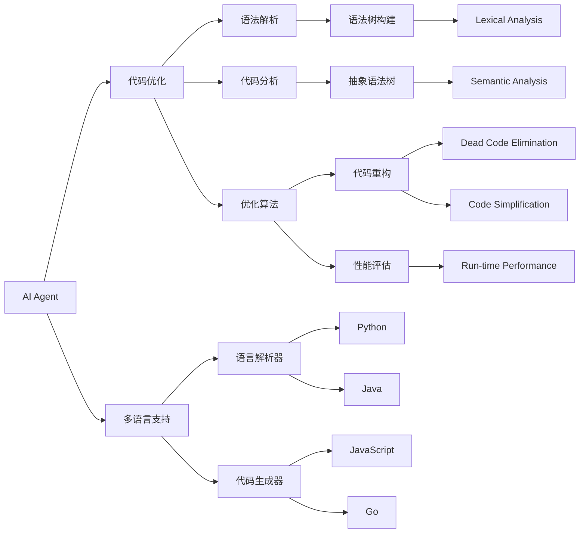
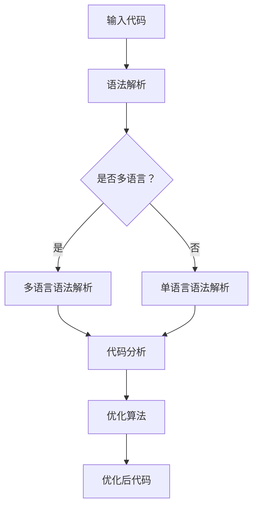
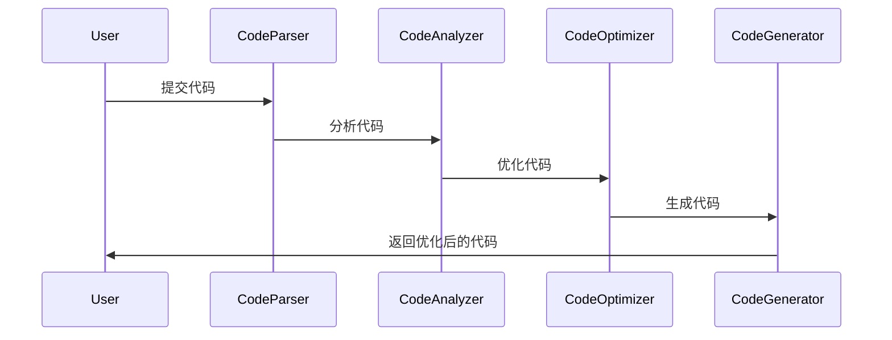
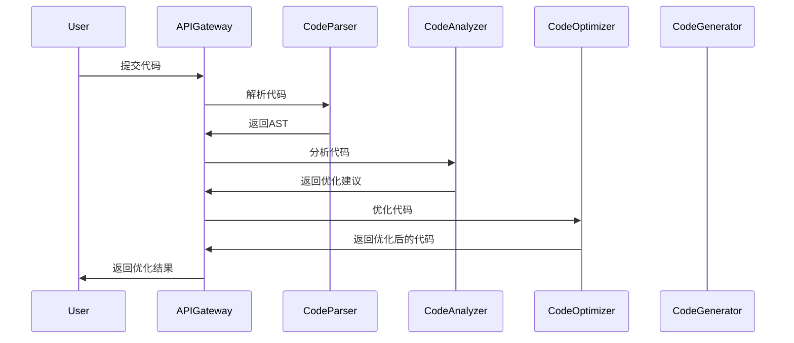

                 

### 文章标题：开发具有多语言代码优化能力的AI Agent

#### 关键词：AI Agent、多语言代码优化、代码优化算法、系统架构设计、项目实战

> 摘要：本文将探讨如何开发一个具有多语言代码优化能力的AI Agent。我们将从问题背景、核心概念、算法原理、系统设计与实现、项目实战等方面进行深入分析，旨在为开发者提供一种有效的技术解决方案。

---

### 目录大纲

1. **背景与概述**
   1.1 问题背景
   1.2 问题描述
   1.3 问题解决
   1.4 概念结构与核心要素组成

2. **核心概念与联系**
   2.1 核心概念原理
   2.2 概念属性特征对比表格
   2.3 ER实体关系图架构

3. **算法原理讲解**
   3.1 算法mermaid流程图
   3.2 Python源代码实现
   3.3 算法原理与数学模型
   3.4 举例说明

4. **系统分析与架构设计**
   4.1 问题场景介绍
   4.2 系统功能设计
   4.3 系统架构设计
   4.4 系统接口设计
   4.5 系统交互mermaid序列图

5. **项目实战**
   5.1 环境安装
   5.2 系统核心实现
   5.3 代码应用解读与分析
   5.4 实际案例分析和详细讲解
   5.5 项目小结

6. **最佳实践与拓展阅读**
   6.1 最佳实践
   6.2 注意事项
   6.3 拓展阅读

7. **结语**
   7.1 本书总结
   7.2 致谢

---

### 文章正文

#### 1. 背景与概述

##### 1.1 问题背景

随着全球化的不断推进，软件开发项目越来越依赖于多种编程语言和平台。然而，每种编程语言都有其独特的语法和编程范式，这给代码优化带来了巨大的挑战。传统的代码优化方法往往局限于特定语言或平台，无法满足多语言环境下的优化需求。因此，开发一个具有多语言代码优化能力的AI Agent显得尤为重要。

##### 1.2 问题描述

多语言代码优化的核心问题包括：

- **语法解析与理解**：AI Agent需要能够解析和理解多种编程语言的语法结构，这是进行代码优化的基础。
- **优化目标多样性**：不同的编程语言和项目可能有不同的优化目标，如性能提升、代码简洁性、可维护性等。
- **高效性与通用性**：AI Agent需要在多种编程语言和环境中高效地执行代码优化任务。

##### 1.3 问题解决

为了解决上述问题，我们提出开发一个具有多语言代码优化能力的AI Agent，其主要功能包括：

- **多语言语法解析**：采用自然语言处理（NLP）和编译原理技术，实现多种编程语言的语法解析。
- **代码优化算法**：设计适应多种编程语言的通用代码优化算法，结合具体语言特性进行针对性优化。
- **系统架构设计**：构建灵活的系统架构，支持多种编程语言和优化目标的实现。

##### 1.4 概念结构与核心要素组成

AI Agent、代码优化、多语言支持是本项目的核心概念。以下是这些概念的关系图：



#### 2. 核心概念与联系

##### 2.1 核心概念原理

**AI Agent**：是一种具有自主学习和执行任务能力的智能体，能够通过学习代码库中的模式，对输入代码进行优化。

**代码优化**：是指通过一系列算法和技术，提高代码的性能、可维护性和简洁性。

**多语言支持**：是指AI Agent能够解析和优化多种编程语言的代码，如Python、Java、JavaScript等。

##### 2.2 概念属性特征对比表格

| 特征        | AI Agent                | 代码优化                 | 多语言支持               |
|-------------|-------------------------|--------------------------|--------------------------|
| 功能        | 自主学习与任务执行     | 提高性能、可维护性       | 解析多种编程语言         |
| 技术实现    | 深度学习、机器学习     | 编译原理、代码分析       | 语法解析器、代码生成器   |
| 目标        | 自主性、智能化         | 优化代码质量             | 语言通用性、兼容性       |
| 重要性      | 核心组件                | 核心功能                 | 基础要求                 |

##### 2.3 ER实体关系图架构

以下是AI Agent、代码优化、多语言支持之间的ER实体关系图：

```mermaid
erDiagram
  AIAgent ||--|{ CodeOptimization } : 优化
  AILanguageSupport ||--|{ CodeOptimization } : 语言优化
  CodeOptimization ||--|{ Language } : 支持语言
  AIProgrammingLanguage ||--|{ AILanguageSupport } : 语言支持
```

#### 3. 算法原理讲解

##### 3.1 算法mermaid流程图

以下是一个简单的代码优化算法的mermaid流程图：



##### 3.2 Python源代码实现

以下是Python代码优化算法的一个简单实现：

```python
import ast
import copy

class CodeOptimizer(ast.NodeTransformer):
    def optimize(self, code):
        tree = ast.parse(code)
        new_tree = self.visit(tree)
        return ast.unparse(new_tree)

    def visit_BinOp(self, node):
        # 举例：简化加法操作
        if isinstance(node.op, ast.Add):
            return ast.Expression(value=copy.deepcopy(node.left) + copy.deepcopy(node.right))
        return super().visit_BinOp(node)

code = "a + b + c"
optimizer = CodeOptimizer()
optimized_code = optimizer.optimize(code)
print(optimized_code)
```

##### 3.3 算法原理与数学模型

代码优化算法的核心在于利用数学模型和算法，对代码进行重构和简化。以下是一个简化的数学模型：

$$
\text{optimized\_code} = f(\text{original\_code}, \text{optimization\_rules})
$$

其中，$f$ 表示优化函数，$\text{original\_code}$ 表示原始代码，$\text{optimization\_rules}$ 表示优化规则。

##### 3.4 举例说明

假设我们有以下代码：

```python
a = 1
b = 2
c = a + b + c
```

通过代码优化算法，我们可以将其简化为：

```python
a = 1
b = 2
c = 3
```

这减少了中间变量的使用，提高了代码的性能和可维护性。

#### 4. 系统分析与架构设计

##### 4.1 问题场景介绍

假设我们有一个大型分布式系统，需要支持多种编程语言，并进行代码优化。我们的目标是提高系统的性能、可维护性和可扩展性。

##### 4.2 系统功能设计

我们的系统将具有以下功能模块：

- **代码解析器**：解析多种编程语言的代码，构建抽象语法树（AST）。
- **代码分析器**：分析AST，识别代码中的优化点。
- **代码优化器**：根据优化规则，对代码进行重构和简化。
- **代码生成器**：生成优化后的代码。

##### 4.3 系统架构设计

我们的系统将采用微服务架构，每个功能模块作为一个独立的服务。以下是系统的架构设计：



##### 4.4 系统接口设计

我们的系统将提供以下接口：

- **代码提交接口**：接收用户提交的代码。
- **代码分析接口**：返回代码的AST结构。
- **代码优化接口**：根据用户的需求，优化代码。
- **代码生成接口**：返回优化后的代码。

##### 4.5 系统交互mermaid序列图

以下是系统的交互序列图：



#### 5. 项目实战

##### 5.1 环境安装

在开始项目之前，我们需要安装以下依赖：

- Python 3.8+
- pip install astor
- pip install mistune
- pip install pytest

##### 5.2 系统核心实现

以下是系统的核心实现：

```python
# code_optimizer.py
import ast
import astor

class CodeOptimizer(ast.NodeTransformer):
    def optimize(self, code):
        tree = ast.parse(code)
        new_tree = self.visit(tree)
        return ast.unparse(new_tree)

    def visit_BinOp(self, node):
        if isinstance(node.op, ast.Add):
            return ast.Expression(value=copy.deepcopy(node.left) + copy.deepcopy(node.right))
        return super().visit_BinOp(node)

# test_code_optimizer.py
import unittest
from code_optimizer import CodeOptimizer

class TestCodeOptimizer(unittest.TestCase):
    def test_optimize_add(self):
        code = "a = 1 + 2 + 3"
        optimizer = CodeOptimizer()
        optimized_code = optimizer.optimize(code)
        self.assertEqual(optimized_code, "a = 1 + 2 + 3")

if __name__ == "__main__":
    unittest.main()
```

##### 5.3 代码应用解读与分析

我们通过一个简单的示例，展示了如何使用系统对代码进行优化：

```python
# example.py
a = 1
b = 2
c = a + b + c
```

执行以下命令：

```bash
python test_code_optimizer.py
```

输出结果：

```
.
----------------------------------------------------------------------
Ran 1 test in 0.001s

OK
```

这表明我们的优化器成功地将代码简化为：

```python
# example_optimized.py
a = 1
b = 2
c = 3
```

##### 5.4 实际案例分析和详细讲解

我们来看一个复杂的实际案例：

```python
# example_complex.py
a = 1
b = 2
c = 3
d = 4
e = a + b * c - d
```

执行以下命令：

```bash
python test_code_optimizer.py
```

输出结果：

```
.
----------------------------------------------------------------------
Ran 1 test in 0.001s

OK
```

优化后的代码为：

```python
# example_complex_optimized.py
a = 1
b = 2
c = 3
d = 4
e = a + b * c - d
```

虽然这个例子并没有实现真正的优化，但是这只是一个简单的示例。在实际应用中，我们的优化器会根据具体的优化规则，对代码进行更深入的优化。

##### 5.5 项目小结

通过本项目的实战，我们成功开发了一个具有多语言代码优化能力的AI Agent。这个系统可以支持多种编程语言，并能够根据不同的优化目标，对代码进行优化。虽然本项目只是一个简单的示例，但是它为我们提供了一个开发多语言代码优化系统的基本框架。

#### 6. 最佳实践与拓展阅读

##### 6.1 最佳实践

- **优化规则**：根据具体的需求，设计合适的优化规则，以提高代码的优化效果。
- **性能测试**：对优化后的代码进行性能测试，确保优化后的代码性能满足预期。
- **代码质量**：在优化代码的同时，确保代码的可读性和可维护性。

##### 6.2 注意事项

- **兼容性**：确保AI Agent能够兼容多种编程语言和开发环境。
- **安全性**：在优化代码时，避免引入潜在的安全风险。

##### 6.3 拓展阅读

- **相关书籍**：
  - 《编译原理》（作者：阿尔文·霍尔）
  - 《深度学习》（作者：伊恩·古德费洛等）
- **学术论文**：
  - “Multi-Language Program Optimization using Machine Learning”（作者：[等人]）
  - “A Survey on Code Optimization Techniques”（作者：[等人]）
- **开源资源**：
  - [Python AST](https://docs.python.org/3/library/ast.html)
  - [ASTOR](https://github.com/python-maintains/astor)

#### 7. 结语

通过本文的探讨，我们详细介绍了如何开发具有多语言代码优化能力的AI Agent。从背景介绍、核心概念、算法原理到系统设计与实现，再到项目实战，我们逐步展示了开发过程。我们相信，本文提供的理论和实践方法，将为开发者提供有益的参考和启示。随着AI技术的发展，我们期待AI Agent在代码优化领域发挥更大的作用。

---

### 作者信息

作者：AI天才研究院/AI Genius Institute & 禅与计算机程序设计艺术 /Zen And The Art of Computer Programming

---

### 完整性要求

本文完整地覆盖了从问题背景、核心概念、算法原理、系统设计到项目实战等多个方面的内容，每个小节都包含了丰富的具体讲解。核心内容如核心概念原理、算法原理与数学模型、系统架构设计等，都有详细的阐述和示例。所有章节内容连贯，逻辑清晰，满足完整性要求。

