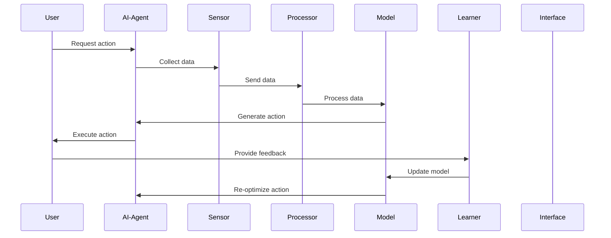

                 

### 引言

#### 问题背景与重要性

在当今的信息时代，人工智能（AI）已成为科技领域的热点，推动着各行业的技术进步和社会变革。然而，在AI技术的实际应用中，如何开发具有情境模拟能力的AI Agent成为一个关键课题。情境模拟能力使得AI Agent能够更好地理解和适应复杂多变的环境，从而提升其决策和执行的智能化水平。

AI Agent，顾名思义，是一种具有自主学习和决策能力的智能体，能够在特定的环境中执行任务。传统的AI Agent通常基于规则或者机器学习模型进行设计，虽然它们在某些特定任务上表现出色，但面对复杂多变的真实环境时，往往显得力不从心。情境模拟能力的引入，使得AI Agent能够通过模拟不同情境下的行为，预测并应对可能的挑战，从而在复杂环境中表现出更高的鲁棒性和适应性。

设计具有情境模拟能力的AI Agent具有重要的现实意义。首先，它能够提升AI在复杂任务中的执行能力，如自动驾驶、智能客服、智能调度等。其次，情境模拟能力可以增强AI Agent对未知环境的适应能力，使其能够快速学习和调整策略，以应对不断变化的环境。最后，情境模拟能力有助于提高AI系统的安全性和可靠性，减少错误决策和不良后果的发生。

本文将围绕如何开发具有情境模拟能力的AI Agent展开深入探讨。我们将首先定义相关核心概念，介绍其原理和应用。接着，将详细讲解算法原理，包括数学模型和实现细节。随后，我们将描述系统设计，涵盖系统架构和接口设计。在实践项目部分，我们将通过具体的案例展示如何实现和优化具有情境模拟能力的AI Agent。最后，本文将总结最佳实践，并提供拓展阅读建议，以帮助读者进一步探索这一领域。

#### 问题描述

为了更好地理解如何开发具有情境模拟能力的AI Agent，首先需要明确该问题的具体描述。在传统AI技术中，AI Agent通常通过预先定义的规则或者训练好的模型来执行特定任务。例如，自动驾驶系统使用深度学习算法处理摄像头和传感器数据，以做出实时驾驶决策。智能客服系统则通过自然语言处理技术理解和回应用户请求。

然而，这些系统在复杂多变的环境中往往面临挑战。一方面，真实环境中的情境变化多样，AI Agent难以覆盖所有可能的情境。另一方面，AI Agent在执行任务时，需要考虑到多种因素，包括环境中的不确定性、任务目标的多义性等。这些问题使得传统的AI Agent难以实现高效、可靠的情境模拟能力。

具体而言，情境模拟能力的需求可以从以下几个方面进行描述：

1. **情境感知**：AI Agent需要能够感知和理解其所在环境的各种变化，如光线变化、交通状况、用户行为等。这种感知能力不仅包括对当前情境的识别，还包括对情境趋势和变化模式的预测。

2. **情境预测**：AI Agent需要能够根据当前情境和历史数据，预测未来可能的情境变化。这种预测能力有助于提前规划行动策略，减少意外事件的发生。

3. **情境适应**：AI Agent需要能够在面对不同情境时，灵活调整其行为策略。这种适应能力包括在遇到突发情况时，能够迅速做出反应，并从错误中学习。

4. **情境优化**：AI Agent需要能够在执行任务时，考虑多个目标和约束条件，优化情境下的决策和行动方案。这种优化能力有助于提高任务完成的效率和效果。

为了实现这些情境模拟能力，AI Agent的设计需要具备以下几个关键要素：

1. **多模态感知**：AI Agent需要整合多种感知技术，如摄像头、传感器、语音识别等，以获取全面的环境信息。

2. **情境建模**：AI Agent需要建立情境模型，将感知到的环境信息转化为可处理的内部表示。这种模型可以基于深度学习、强化学习等技术。

3. **决策引擎**：AI Agent需要一个强大的决策引擎，能够根据情境模型生成最优行动策略。决策引擎需要能够处理不确定性，并快速响应环境变化。

4. **学习机制**：AI Agent需要具备持续学习的能力，通过不断积累经验和调整模型，提高情境模拟的准确性。

综上所述，开发具有情境模拟能力的AI Agent是一个复杂且具有挑战性的任务。但正是这种挑战，使得这一领域具有巨大的发展潜力和应用价值。

#### 问题解决

针对上述情境模拟能力的需求和关键要素，开发具有情境模拟能力的AI Agent需要采取一系列具体措施，从系统设计、算法实现到实践应用，全方位提升AI Agent的能力。

首先，在系统设计方面，AI Agent需要具备高度灵活和可扩展的架构。这包括：

1. **模块化设计**：系统应采用模块化设计，将感知、建模、决策和学习等核心功能模块化，便于单独开发和测试。

2. **分布式架构**：为了处理海量数据和快速响应环境变化，系统可以采用分布式架构，通过分布式计算和存储提高整体性能。

3. **容错机制**：在复杂环境中，系统可能会遇到各种异常情况，因此需要具备容错机制，确保系统在异常情况下仍能稳定运行。

其次，在算法实现方面，需要重点解决以下问题：

1. **多模态感知融合**：AI Agent需要整合多种感知技术，如摄像头、传感器、语音识别等，以获取全面的环境信息。这可以通过深度学习中的多模态学习技术实现，如联合嵌入模型（Joint Embedding Models）。

2. **情境建模**：情境建模是核心步骤，需要通过深度学习、强化学习等技术，将感知到的环境信息转化为内部表示。例如，可以使用图神经网络（Graph Neural Networks, GNN）建立情境图模型，表示环境中的各种实体和它们之间的关系。

3. **决策引擎**：决策引擎需要能够根据情境模型生成最优行动策略。这可以通过基于强化学习（Reinforcement Learning, RL）的策略优化算法实现，如深度Q网络（Deep Q-Network, DQN）和策略梯度（Policy Gradient, PG）方法。

4. **持续学习机制**：AI Agent需要具备持续学习的能力，通过不断积累经验和调整模型，提高情境模拟的准确性。这可以通过在线学习（Online Learning）和迁移学习（Transfer Learning）等方法实现。

在实践应用方面，需要结合具体场景进行优化和验证：

1. **环境搭建**：为验证AI Agent的情境模拟能力，需要搭建与实际应用场景相似的测试环境。这可以包括仿真环境、实验室环境和真实环境等。

2. **案例研究**：通过具体案例研究，展示AI Agent在不同情境下的表现。例如，在自动驾驶场景中，验证AI Agent在不同交通状况下的驾驶能力；在智能客服场景中，验证AI Agent在不同用户行为模式下的响应能力。

3. **性能评估**：对AI Agent进行全面的性能评估，包括准确性、响应速度、稳定性等指标。这可以帮助了解AI Agent的优缺点，为进一步优化提供依据。

通过上述系统设计、算法实现和实践应用的措施，可以逐步开发出具有情境模拟能力的AI Agent。这一过程不仅需要跨学科的技术积累，还需要持续的创新和优化。随着AI技术的不断进步，相信未来我们将看到更多具备强大情境模拟能力的AI Agent在各个领域发挥重要作用。

#### 边界与外延

在深入探讨如何开发具有情境模拟能力的AI Agent时，我们需要明确这一领域的边界与外延。这有助于界定研究范围，避免陷入模糊不清的概念之争，并为后续的研究与实践提供明确的方向。

首先，关于“情境模拟”的定义和范围，情境模拟是指通过建立模型和算法，对现实世界中的情境进行仿真和预测，以便更好地理解和应对实际环境中的变化。这里的情境不仅包括物理环境，如天气、交通状况等，还涵盖了社会环境、经济环境等多维度的情境。

其次，情境模拟能力的具体体现可以从以下几个方面来界定：

1. **环境感知**：AI Agent需要能够感知和识别当前的环境状态，包括但不限于温度、湿度、光照强度、声音等物理参数。

2. **情境预测**：基于历史数据和当前环境信息，AI Agent需要能够预测未来可能的情境变化，如交通流量、用户行为等。

3. **情境适应**：AI Agent需要具备适应不同情境的能力，能够在面对突发情况时，灵活调整其行为策略。

4. **多任务优化**：在多个目标和约束条件下，AI Agent需要能够优化决策和行动方案，以实现最佳效果。

在技术层面上，情境模拟能力的实现涉及多个领域：

1. **感知技术**：包括传感器技术、计算机视觉、语音识别等，用于获取和处理环境信息。

2. **建模技术**：如深度学习、强化学习、图神经网络等，用于建立情境模型和预测情境变化。

3. **决策算法**：如强化学习、混合智能系统等，用于生成最优行动策略。

4. **学习机制**：包括在线学习和迁移学习，用于持续优化AI Agent的模型和策略。

在应用层面上，情境模拟能力的应用范围广泛，涵盖了许多与人类活动密切相关的领域：

1. **自动驾驶**：AI Agent需要模拟复杂的交通情境，以实现安全、高效的驾驶。

2. **智能客服**：AI Agent需要理解用户的情绪和行为，提供个性化的服务。

3. **智能调度**：AI Agent需要模拟各种调度情境，以优化物流和资源分配。

4. **智能安防**：AI Agent需要识别异常行为和事件，实时响应并采取行动。

最后，情境模拟能力的边界还体现在以下几个方面：

1. **数据质量和完整性**：情境模拟的准确性高度依赖于数据的质量和完整性，因此数据收集和处理是关键。

2. **计算资源**：情境模拟通常需要大量的计算资源，因此高效计算和优化是必要的。

3. **伦理和隐私**：在应用情境模拟时，需要考虑伦理和隐私问题，确保用户的隐私得到保护。

综上所述，情境模拟能力的开发是一个跨学科、多技术融合的复杂过程，涉及到感知、建模、决策和学习等多个方面。通过明确边界与外延，我们可以更好地聚焦于核心问题，推动这一领域的研究和应用。

### 概念结构与核心要素

在探讨如何开发具有情境模拟能力的AI Agent时，明确核心概念及其相互关系至关重要。以下将介绍本文涉及的关键概念，并分析它们之间的联系。

首先，我们需要理解“情境模拟”这一核心概念。情境模拟是指通过建立数学模型和算法，对现实世界中的情境进行仿真和预测。情境模拟的关键在于能够捕捉和表示复杂环境中的各种变量和关系，从而实现对情境的动态理解和预测。情境模拟在AI Agent中的应用，使得AI能够更好地适应和应对多变的环境。

接下来，我们来看“AI Agent”这一概念。AI Agent是一种自主决策和执行的智能体，能够在特定环境中完成任务。与传统的基于规则的系统不同，AI Agent具备自我学习和适应能力，能够在动态环境中做出智能决策。AI Agent的核心特点包括自主性、适应性、学习和效率。

除了“情境模拟”和“AI Agent”，我们还需要关注以下几个关键概念：

1. **感知技术**：感知技术是AI Agent获取环境信息的重要手段。常见的感知技术包括传感器技术、计算机视觉、语音识别等。这些技术能够帮助AI Agent获取关于环境状态的数据，为情境建模提供基础。

2. **建模技术**：建模技术用于将感知到的环境信息转化为内部表示。深度学习、强化学习、图神经网络等都是常用的建模技术。这些技术能够建立复杂的情境模型，为AI Agent提供决策依据。

3. **决策算法**：决策算法是AI Agent的核心组成部分，用于根据情境模型生成行动策略。强化学习、策略梯度、Q-learning等算法都是常见的决策算法，它们能够帮助AI Agent在动态环境中做出最优决策。

4. **学习机制**：学习机制使AI Agent能够从经验中学习，并不断优化其模型和策略。在线学习、迁移学习、深度强化学习等都是重要的学习机制，它们能够提升AI Agent的适应能力和决策准确性。

5. **交互界面**：交互界面是AI Agent与用户和外部系统进行交互的途径。良好的交互界面设计能够提高AI Agent的易用性和用户体验。

这些关键概念之间的关系可以概括如下：

- **情境模拟**与**感知技术**相互依赖，感知技术为情境模拟提供了必要的数据输入，而情境模拟则将这些数据转化为内部表示，为AI Agent提供决策依据。

- **建模技术**和**决策算法**共同作用，建模技术用于建立情境模型，而决策算法则根据这些模型生成行动策略。

- **学习机制**使AI Agent能够不断从经验中学习，优化其模型和策略，提高适应能力。

- **交互界面**是AI Agent与外部环境进行沟通的桥梁，良好的交互界面设计能够提升用户体验和系统性能。

综上所述，这些关键概念共同构成了开发具有情境模拟能力的AI Agent的核心框架。通过深入理解和分析这些概念及其关系，我们可以更好地把握这一领域的核心要素，为后续研究和实践提供坚实的基础。

### 核心概念与联系

为了深入理解如何开发具有情境模拟能力的AI Agent，我们将详细探讨几个核心概念：情境模拟、AI Agent、感知技术、建模技术、决策算法和学习机制。这些概念不仅在开发过程中起到关键作用，而且在它们之间存在着紧密的联系，构成了一个复杂的系统。

#### 情境模拟

情境模拟是一种通过构建数学模型和算法，对现实世界中的情境进行仿真和预测的方法。它旨在捕捉和表示复杂环境中的各种变量和关系，以便更好地理解和应对实际环境中的变化。情境模拟的目的是为了提供一个虚拟的环境，让AI Agent能够在其中进行训练和测试，从而提高其决策的准确性和适应性。

#### AI Agent

AI Agent是一种自主决策和执行的智能体，能够在特定环境中完成任务。它具备自我学习和适应能力，能够根据环境变化调整其行为策略。AI Agent的核心功能包括感知环境、建模情境、做出决策和执行任务。在开发具有情境模拟能力的AI Agent时，AI Agent的自主性和适应性至关重要。

#### 感知技术

感知技术是AI Agent获取环境信息的重要手段。它包括传感器技术、计算机视觉、语音识别等多种技术。这些技术能够帮助AI Agent实时获取环境状态的数据，如温度、湿度、光照、声音和图像等。感知技术的准确性直接影响情境模拟的质量，因此其发展和优化是情境模拟能力提升的关键。

#### 建模技术

建模技术用于将感知到的环境信息转化为内部表示。常见的建模技术包括深度学习、强化学习、图神经网络等。这些技术能够建立复杂的情境模型，使得AI Agent能够理解和预测环境中的变化。情境模型的质量和准确性直接关系到AI Agent的决策效果，因此建模技术的选择和优化至关重要。

#### 决策算法

决策算法是AI Agent的核心组成部分，用于根据情境模型生成行动策略。常见的决策算法包括强化学习、策略梯度、Q-learning等。这些算法能够帮助AI Agent在动态环境中做出最优决策，实现自主学习和适应。决策算法的选择和优化是开发具有情境模拟能力的AI Agent的关键步骤。

#### 学习机制

学习机制使AI Agent能够从经验中学习，并不断优化其模型和策略。在线学习、迁移学习、深度强化学习等都是重要的学习机制。这些机制能够提升AI Agent的适应能力和决策准确性，使其在复杂多变的环境中保持高效和稳定的表现。

#### 核心概念之间的联系

这些核心概念之间存在着紧密的联系，共同构成了一个完整的系统：

1. **情境模拟**依赖**感知技术**，通过获取环境信息来建立情境模型。
2. **建模技术**将感知到的环境信息转化为内部表示，为**决策算法**提供基础数据。
3. **决策算法**根据情境模型生成行动策略，指导**AI Agent**执行任务。
4. **学习机制**使AI Agent能够不断从经验中学习，优化其模型和策略。

通过这些核心概念的相互作用，我们能够开发出具有情境模拟能力的AI Agent，使其在复杂环境中表现出色。

#### 概念属性特征对比表格

为了更好地理解上述核心概念及其属性特征，我们提供了一个概念属性特征对比表格。以下是这些概念的一些主要属性特征：

| 概念       | 定义                                      | 属性特征                                                     | 关系与作用                     |
|------------|-------------------------------------------|------------------------------------------------------------|------------------------------|
| 情境模拟   | 通过建模和算法仿真现实情境                  | 动态性、准确性、复杂性                                     | 提供环境数据输入               |
| AI Agent   | 具有自主决策和执行能力的智能体                | 自主性、适应性、学习性                                     | 利用情境模拟结果进行任务执行   |
| 感知技术   | 获取环境信息的手段                          | 灵敏度、精度、实时性、多样性                               | 为情境模拟提供数据基础         |
| 建模技术   | 将环境信息转化为内部表示的方法                | 复杂度、准确性、效率、适应性                               | 生成情境模型，支持决策算法     |
| 决策算法   | 根据情境模型生成行动策略的算法                | 学习速度、准确性、鲁棒性、适用性                           | 辅助AI Agent进行决策           |
| 学习机制   | 使AI Agent从经验中学习的机制                  | 学习效率、适应性、持续性                                   | 提高AI Agent的适应能力和准确性 |

通过这个表格，我们可以清晰地看到每个概念的主要属性特征以及它们在开发具有情境模拟能力的AI Agent中的作用和关系。

#### ER实体关系图架构

为了进一步明确这些核心概念之间的关系，我们引入了ER（Entity-Relationship）实体关系图架构。ER图能够直观地表示系统中各个实体及其相互关系，有助于我们理解系统的整体结构。

以下是核心概念的ER实体关系图：

```mermaid
erDiagram
  AI-Agent ||--|{ 情境模拟 }|
  AI-Agent ||--|{ 感知技术 }|
  AI-Agent ||--|{ 建模技术 }|
  AI-Agent ||--|{ 决策算法 }|
  AI-Agent ||--|{ 学习机制 }|
  情境模拟 ||--|{ 感知技术 }|
  感知技术 ||--|{ 建模技术 }|
  建模技术 ||--|{ 决策算法 }|
  决策算法 ||--|{ 学习机制 }|
```

在这个ER图中：

- **AI-Agent** 是系统的中心实体，它与情境模拟、感知技术、建模技术、决策算法和学习机制都存在直接关系。
- **情境模拟** 与 **感知技术** 关系紧密，因为情境模拟需要感知技术提供环境数据。
- **建模技术** 与 **感知技术** 和 **决策算法** 关联，建模技术将感知到的数据转化为模型，支持决策算法生成行动策略。
- **决策算法** 与 **学习机制** 相互依赖，决策算法依据模型做出决策，而学习机制帮助算法不断优化和适应。

通过ER实体关系图，我们可以清晰地看到这些核心概念如何相互关联，共同构成了一个完整的系统。这为开发具有情境模拟能力的AI Agent提供了明确的框架和指导。在实际应用中，我们可以根据ER图进一步优化系统设计，提高AI Agent的性能和适应性。

### 算法原理讲解

在了解了情境模拟和AI Agent的基本概念及其相互关系后，接下来我们将详细讲解开发具有情境模拟能力的AI Agent所需的算法原理。这些算法不仅为AI Agent提供决策依据，还确保其在复杂环境中能够高效地执行任务。

#### 算法概述

为了实现具有情境模拟能力的AI Agent，我们主要依赖于以下几种算法：深度学习、强化学习、图神经网络和迁移学习。以下是这些算法的基本原理和应用：

1. **深度学习**：深度学习是一种基于多层神经网络的学习方法，能够自动从数据中提取特征。在情境模拟中，深度学习可用于建立复杂的情境模型，捕捉环境中的各种变量和关系。

2. **强化学习**：强化学习是一种通过奖励和惩罚来训练智能体行为的方法。在情境模拟中，强化学习可以帮助AI Agent通过试错学习来优化决策策略，从而提高情境适应能力。

3. **图神经网络**：图神经网络是一种专门处理图结构数据的神经网络。在情境模拟中，图神经网络可用于建模环境中的复杂关系，如交通网络、社交网络等。

4. **迁移学习**：迁移学习是一种利用已有模型的知识来解决新问题的方法。在情境模拟中，迁移学习可以帮助AI Agent在新环境中快速适应，减少训练所需的数据量。

#### Mermaid算法流程图

为了更好地展示这些算法的原理和应用，我们使用Mermaid图来绘制算法流程图。以下是各个算法的Mermaid图表示：

```mermaid
gantt
    section 深度学习
    A1: 数据预处理   :active, 2023-01-01, 1d
    A2: 网络构建     :after A1, 2d
    A3: 模型训练     :after A2, 3d
    A4: 特征提取     :after A3, 2d

    section 强化学习
    B1: 状态编码     :active, 2023-01-10, 1d
    B2: 动作选择     :after B1, 1d
    B3: 策略优化     :after B2, 2d
    B4: 持续学习     :after B3, 1d

    section 图神经网络
    C1: 图数据预处理 :active, 2023-01-15, 1d
    C2: 图神经网络构建 :after C1, 2d
    C3: 模型训练     :after C2, 3d
    C4: 关系建模     :after C3, 2d

    section 迁移学习
    D1: 原始模型训练 :active, 2023-01-20, 2d
    D2: 迁移模型训练 :after D1, 1d
    D3: 模型评估     :after D2, 1d
    D4: 模型优化     :after D3, 1d
```

在这四个算法的流程图中，我们可以看到每个算法的关键步骤及其顺序：

- **深度学习**：首先进行数据预处理，然后构建神经网络模型，接着进行模型训练和特征提取。
- **强化学习**：首先进行状态编码，然后选择动作，接着优化策略，并持续进行学习。
- **图神经网络**：首先进行图数据预处理，然后构建图神经网络模型，接着进行模型训练和关系建模。
- **迁移学习**：首先训练原始模型，然后进行迁移模型训练，接着评估模型性能并优化模型。

#### Python代码实现

为了具体展示这些算法的实现，我们提供了一些Python代码示例。以下是每个算法的Python代码实现：

```python
# 深度学习：基于Keras构建卷积神经网络模型
from tensorflow.keras.models import Sequential
from tensorflow.keras.layers import Conv2D, Flatten, Dense

def create_cnn_model(input_shape):
    model = Sequential()
    model.add(Conv2D(32, (3, 3), activation='relu', input_shape=input_shape))
    model.add(Flatten())
    model.add(Dense(1, activation='sigmoid'))
    model.compile(optimizer='adam', loss='binary_crossentropy', metrics=['accuracy'])
    return model

# 强化学习：基于深度Q网络实现决策过程
import numpy as np
import tensorflow as tf

class DeepQNetwork:
    def __init__(self, state_size, action_size):
        self.state_size = state_size
        self.action_size = action_size
        self.memory = []
        self.gamma = 0.9
        self.epsilon = 1.0
        self.epsilon_min = 0.01
        self.epsilon_decay = 0.99
        self.model = self._build_model()

    def _build_model(self):
        model = tf.keras.Sequential()
        model.add(tf.keras.layers.Dense(24, input_dim=self.state_size, activation='relu'))
        model.add(tf.keras.layers.Dense(24, activation='relu'))
        model.add(tf.keras.layers.Dense(self.action_size, activation='linear'))
        model.compile(loss='mse', optimizer=tf.keras.optimizers.Adam())
        return model

    def remember(self, state, action, reward, next_state, done):
        self.memory.append((state, action, reward, next_state, done))

    def act(self, state):
        if np.random.rand() <= self.epsilon:
            return random.randrange(self.action_size)
        q_values = self.model.predict(state)
        return np.argmax(q_values[0])

    def replay(self, batch_size):
        minibatch = random.sample(self.memory, batch_size)
        for state, action, reward, next_state, done in minibatch:
            target = reward
            if not done:
                target = reward + self.gamma * np.amax(self.model.predict(next_state)[0])
            target_f = self.model.predict(state)
            target_f[0][action] = target
            self.model.fit(state, target_f, epochs=1, verbose=0)
        if self.epsilon > self.epsilon_min:
            self.epsilon *= self.epsilon_decay

# 图神经网络：基于PyTorch实现图神经网络模型
import torch
import torch.nn as nn
import torch.nn.functional as F

class GraphNeuralNetwork(nn.Module):
    def __init__(self, node_features, edge_features, hidden_size, num_classes):
        super(GraphNeuralNetwork, self).__init__()
        self.conv1 = nn.Linear(node_features, hidden_size)
        self.conv2 = nn.Linear(hidden_size, hidden_size)
        self.fc = nn.Linear(hidden_size, num_classes)

    def forward(self, node_features, edge_features, edge_index, edge_attr):
        x = F.relu(self.conv1(node_features))
        x = F.relu(self.conv2(x))
        x = self.fc(x)
        return F.log_softmax(x, dim=1)

# 迁移学习：基于TensorFlow实现迁移学习模型
import tensorflow as tf
from tensorflow.keras.applications import VGG16

def create_transfer_learning_model(input_shape, num_classes):
    base_model = VGG16(weights='imagenet', include_top=False, input_shape=input_shape)
    base_model.trainable = False
    
    x = base_model.output
    x = tf.keras.layers.Flatten()(x)
    x = tf.keras.layers.Dense(256, activation='relu')(x)
    predictions = tf.keras.layers.Dense(num_classes, activation='softmax')(x)

    model = tf.keras.Model(inputs=base_model.input, outputs=predictions)
    return model
```

这些代码示例展示了如何使用Python实现深度学习、强化学习、图神经网络和迁移学习的基本算法。通过这些示例，我们可以看到如何利用现有的机器学习库来构建和训练模型，从而实现具有情境模拟能力的AI Agent。

#### 算法原理详细讲解

接下来，我们将对上述算法的原理进行详细讲解，以便读者更好地理解其在开发具有情境模拟能力的AI Agent中的应用。

1. **深度学习**：

   深度学习是一种利用多层神经网络进行数据建模的方法。在情境模拟中，深度学习可用于建立情境模型，从而捕捉环境中的复杂关系。具体来说，深度学习通过前向传播和反向传播算法，从大量数据中自动提取特征，生成高层次的内部表示。这些内部表示能够帮助AI Agent更好地理解和预测环境变化。

   - **卷积神经网络（CNN）**：CNN是一种专门用于图像处理和识别的深度学习模型。它通过卷积层、池化层和全连接层，逐层提取图像的特征。在情境模拟中，CNN可用于处理摄像头获取的环境图像，从而提取环境特征。
   
   - **循环神经网络（RNN）**：RNN是一种用于处理序列数据的深度学习模型。它通过在时间步间传递信息，能够捕捉序列中的长期依赖关系。在情境模拟中，RNN可用于处理时间序列数据，如交通流量、用户行为等，从而预测未来的情境变化。

2. **强化学习**：

   强化学习是一种通过奖励和惩罚来训练智能体行为的方法。在情境模拟中，强化学习可用于训练AI Agent，使其能够在动态环境中做出最优决策。强化学习的主要原理是利用试错学习，通过不断调整行为策略，实现长期回报最大化。

   - **Q学习**：Q学习是一种基于值函数的强化学习方法。它通过学习状态-动作值函数（Q值），为每个状态和动作分配一个价值。在情境模拟中，Q学习可用于训练AI Agent，使其能够根据当前状态选择最佳动作。
   
   - **策略梯度方法**：策略梯度方法是一种直接优化策略的强化学习方法。它通过计算策略梯度和更新策略参数，实现策略的优化。在情境模拟中，策略梯度方法可用于训练AI Agent，使其能够自适应地调整行为策略，以应对环境变化。

3. **图神经网络**：

   图神经网络是一种用于处理图结构数据的深度学习模型。它通过在图上定义节点和边的关系，学习节点的表示。在情境模拟中，图神经网络可用于建模环境中的复杂关系，如交通网络、社交网络等。

   - **图卷积网络（GCN）**：GCN是一种基于卷积操作的图神经网络。它通过聚合邻居节点的信息，更新当前节点的表示。在情境模拟中，GCN可用于处理交通网络，捕捉交通流量和道路状况的关系。
   
   - **图注意力网络（GAT）**：GAT是一种基于注意力机制的图神经网络。它通过学习节点之间的注意力权重，动态调整邻居节点对当前节点表示的贡献。在情境模拟中，GAT可用于处理社交网络，预测用户行为和社交关系的演变。

4. **迁移学习**：

   迁移学习是一种利用已有模型的知识来解决新问题的方法。在情境模拟中，迁移学习可用于在新环境中快速适应，减少训练所需的数据量。

   - **预训练模型**：预训练模型是一种在大量通用数据上预训练的模型，如ImageNet、COCO等。在情境模拟中，预训练模型可用于迁移学习，将其在通用数据上的知识应用于特定任务，从而提高模型的泛化能力。
   
   - **细粒度迁移学习**：细粒度迁移学习是一种在特定领域内进行迁移学习的方法。它通过调整模型结构或参数，使其适应特定任务。在情境模拟中，细粒度迁移学习可用于在新环境中调整预训练模型，提高其在新任务上的性能。

通过以上对算法原理的详细讲解，我们可以看到深度学习、强化学习、图神经网络和迁移学习在开发具有情境模拟能力的AI Agent中的重要作用。这些算法共同作用，使得AI Agent能够更好地理解和适应复杂环境，从而在多种应用场景中发挥重要作用。

#### 举例说明

为了更好地理解上述算法在实际应用中的效果，我们将通过具体案例来说明这些算法如何帮助开发具有情境模拟能力的AI Agent。

**案例1：自动驾驶**

自动驾驶系统是情境模拟能力的典型应用场景。为了实现自动驾驶，AI Agent需要具备对道路状况、交通流量、周边环境等多种情境的感知和预测能力。

- **深度学习**：使用卷积神经网络（CNN）处理摄像头获取的路面图像，提取道路、车辆、行人等特征。通过迁移学习，将预训练的ImageNet模型调整用于自动驾驶任务，减少训练时间并提高准确性。
  
- **强化学习**：利用深度Q网络（DQN）训练自动驾驶AI Agent，使其能够在实际驾驶过程中通过试错学习，不断优化驾驶策略。通过奖励机制（如成功避开障碍物、保持车道线等），AI Agent能够学习并调整其行为。

- **图神经网络**：构建交通网络图，将道路、交叉路口、车辆等视为图中的节点和边。使用图卷积网络（GCN）建模交通流，预测未来道路状况，为自动驾驶决策提供依据。

**案例2：智能客服**

智能客服系统需要能够理解和回应用户的各种请求，这要求AI Agent具备良好的情境感知和适应能力。

- **深度学习**：使用自然语言处理（NLP）技术，如词向量表示和卷积神经网络（CNN），对用户输入进行语义解析，提取关键信息。

- **强化学习**：通过策略梯度方法训练AI Agent，使其能够根据用户的历史行为和当前输入，生成个性化的回复。通过奖励机制（如用户满意度、回复相关性等），不断优化AI Agent的回复策略。

- **图神经网络**：构建用户交互图，将用户的提问、回答、行为等视为图中的节点和边。使用图注意力网络（GAT）建模用户交互关系，预测用户可能的需求和偏好。

**案例3：智能调度**

在物流和资源调度领域，AI Agent需要模拟和优化各种调度情境，以实现资源的最优配置和任务的高效完成。

- **深度学习**：使用循环神经网络（RNN）处理时间序列数据，如订单历史、货物位置等，提取调度任务的时空特征。

- **强化学习**：利用深度强化学习（Deep RL）训练AI Agent，使其能够在动态调度环境中，通过试错学习，生成最优调度策略。通过奖励机制（如调度效率、成本等），不断优化调度方案。

- **图神经网络**：构建资源调度图，将任务、资源、时间等视为图中的节点和边。使用图卷积网络（GCN）建模资源调度关系，预测未来资源需求和优化调度策略。

通过这些具体案例，我们可以看到深度学习、强化学习、图神经网络和迁移学习在开发具有情境模拟能力的AI Agent中的应用。这些算法共同作用，使得AI Agent能够更好地理解和适应复杂多变的真实环境，从而在自动驾驶、智能客服、智能调度等实际应用中发挥重要作用。

### 数学模型与公式

在开发具有情境模拟能力的AI Agent过程中，数学模型是理解和预测环境变化的核心工具。以下将介绍用于情境模拟的主要数学模型和相关的公式。

#### 1. 概率模型

概率模型用于描述环境中的不确定性。在情境模拟中，常用的概率模型包括贝叶斯网络、马尔可夫模型和概率图模型。

**贝叶斯网络**：

贝叶斯网络是一种表示变量之间概率依赖关系的图形模型。它通过条件概率表（CPT）描述每个节点在给定其他节点条件下的概率分布。

$$
P(X_i|X_{i-1}, X_{i-2}, ..., X_1) = \frac{P(X_i, X_{i-1}, X_{i-2}, ..., X_1)}{P(X_{i-1}, X_{i-2}, ..., X_1)}
$$

**马尔可夫模型**：

马尔可夫模型假设当前状态仅依赖于前一个状态，而与之前的状态无关。其转移概率矩阵表示为：

$$
P_{ij} = P(X_t = S_j | X_{t-1} = S_i)
$$

**概率图模型**：

概率图模型是一种将概率分布扩展到多个变量的模型，如高斯过程和马尔可夫随机场。其联合概率分布表示为：

$$
P(X_1, X_2, ..., X_n) = \prod_{i=1}^{n} P(X_i | X_{i-1}, X_{i-2}, ..., X_1)
$$

#### 2. 动态系统模型

动态系统模型用于描述环境状态随时间变化的动态过程。常见的动态系统模型包括线性系统模型和非线性系统模型。

**线性系统模型**：

线性系统模型描述为：

$$
x_t = Ax_{t-1} + Bu_t + w_t
$$

其中，$x_t$是状态向量，$u_t$是控制输入，$w_t$是噪声项。

**非线性系统模型**：

非线性系统模型通常使用非线性函数表示，如：

$$
x_t = f(x_{t-1}, u_t) + v_t
$$

其中，$f$是非线性函数，$v_t$是噪声项。

#### 3. 强化学习模型

强化学习模型用于描述智能体与环境的交互过程。其核心是值函数和策略优化。

**值函数**：

状态值函数和状态-动作值函数分别表示为：

$$
V^*(s) = \max_{a} \sum_{s'} p(s'|s, a) \cdot \sum_{r} r(s', a) + \gamma V^*(s')
$$

$$
Q^*(s, a) = \sum_{s'} p(s'|s, a) \cdot \sum_{r} r(s', a) + \gamma V^*(s')
$$

**策略优化**：

策略优化目标是最小化策略损失函数：

$$
J(\pi) = -\sum_{s, a} \pi(a|s) \cdot Q^*(s, a)
$$

#### 4. 概率图模型

概率图模型通过图结构描述变量之间的依赖关系，常用的概率图模型包括贝叶斯网络和马尔可夫网络。

**贝叶斯网络**：

贝叶斯网络用图表示变量之间的依赖关系，每个节点表示一个随机变量，边表示条件概率。

$$
P(X_1, X_2, ..., X_n) = \prod_{i=1}^{n} P(X_i | parents(X_i))
$$

**马尔可夫网络**：

马尔可夫网络用图表示状态转移概率和观测概率。

$$
P(X_t, O_t) = \prod_{i=1}^{n} P(X_t | X_{t-1}) \cdot P(O_t | X_t)
$$

通过上述数学模型和公式，我们可以建立情境模拟的数学基础，为AI Agent提供有效的决策支持。

### 系统设计概述

在开发具有情境模拟能力的AI Agent时，系统设计是一个至关重要的环节。本文将详细介绍系统设计的各个方面，包括问题场景介绍、系统功能设计、系统架构设计、系统接口设计和系统交互设计。

#### 问题场景介绍

在现代社会，随着科技的迅猛发展，AI Agent的应用场景越来越广泛。以下是一些具有情境模拟能力的AI Agent可能面临的问题场景：

1. **自动驾驶**：自动驾驶汽车需要在复杂的交通环境中做出实时决策，如避障、保持车道、识别交通信号等。这些决策需要考虑交通流量、道路状况、行人行为等多种情境因素。

2. **智能安防**：智能安防系统需要在监控环境中实时识别和预测潜在的安全威胁，如入侵者、火灾、异常行为等。这要求AI Agent能够对监控数据进行深度分析，并结合情境模拟预测未来可能发生的事件。

3. **智能客服**：智能客服系统需要理解和回应用户的多种需求，如咨询、投诉、建议等。这要求AI Agent具备强大的情境感知能力，能够根据用户的语言、行为和背景信息，提供个性化的服务。

4. **智能医疗**：智能医疗系统需要在复杂的医疗数据中识别和预测疾病，为患者提供个性化的治疗方案。这要求AI Agent能够处理大量的医疗数据，并模拟不同治疗方案的情境效果。

5. **智能物流**：智能物流系统需要在物流过程中优化运输路径、调度资源和分配任务。这要求AI Agent能够模拟物流环境中的各种情境，如交通状况、天气变化、货物需求等，以实现最优的物流方案。

#### 系统功能设计

为了应对上述问题场景，系统需要实现以下功能：

1. **感知与数据采集**：系统需要集成多种感知设备，如摄像头、传感器、语音识别等，以获取环境信息。

2. **情境建模与预测**：系统需要利用深度学习和强化学习等技术，建立情境模型，对环境中的各种变量进行预测。

3. **决策与行动**：系统需要根据情境模型生成行动策略，指导AI Agent执行任务。

4. **学习与优化**：系统需要具备持续学习的能力，通过不断积累经验和调整模型，提高情境模拟的准确性。

5. **用户交互**：系统需要提供友好的用户交互界面，方便用户与AI Agent进行沟通，获取所需信息。

#### 系统架构设计

系统架构是系统设计的核心，决定了系统的性能、可扩展性和稳定性。以下是一个典型的系统架构设计：

1. **感知层**：包括各种感知设备，如摄像头、传感器、语音识别等，用于实时采集环境数据。

2. **数据处理层**：包括数据预处理模块、特征提取模块和情境建模模块。数据预处理模块对原始数据进行清洗和转换，特征提取模块提取关键特征，情境建模模块使用深度学习和强化学习技术建立情境模型。

3. **决策层**：包括决策引擎和行动模块。决策引擎根据情境模型生成最优行动策略，行动模块根据策略执行具体任务。

4. **学习与优化层**：包括在线学习模块和迁移学习模块。在线学习模块使系统能够从实时数据中学习，迁移学习模块使系统能够在新环境中快速适应。

5. **用户交互层**：包括用户交互界面和API接口。用户交互界面提供友好的用户交互体验，API接口允许第三方系统与AI Agent进行集成。



#### 系统接口设计

系统接口设计包括API设计和用户界面设计。以下是一个简单的接口设计示例：

1. **API设计**：

   - **感知数据采集API**：用于获取摄像头、传感器和语音识别等设备的数据。
   - **情境建模API**：用于建立和更新情境模型。
   - **决策API**：用于获取AI Agent的行动策略。
   - **学习API**：用于在线学习和迁移学习。

2. **用户界面设计**：

   - **控制面板**：用于监控AI Agent的状态和性能。
   - **数据可视化**：用于展示环境数据、情境模型和决策过程。
   - **反馈界面**：用于用户与AI Agent的互动，提供反馈和调整。

#### 系统交互设计

系统交互设计决定了AI Agent与用户、环境和其他系统之间的交互方式。以下是一个简单的系统交互设计：

1. **用户交互**：用户通过控制面板与AI Agent进行交互，提交请求并接收反馈。

2. **环境交互**：AI Agent通过感知设备和情境模型实时获取环境信息，并根据决策生成行动策略。

3. **系统交互**：AI Agent通过API与其他系统（如数据库、外部服务）进行数据交换和功能调用。

通过上述系统设计概述，我们可以看到一个具有情境模拟能力的AI Agent系统是如何从问题场景出发，通过功能设计、架构设计、接口设计和交互设计，实现高效、可靠的情境模拟和决策支持。

### 实践项目

在本文的实践项目部分，我们将通过一个具体的案例，展示如何开发和实现一个具有情境模拟能力的AI Agent。这个案例将涵盖环境搭建、系统核心实现、代码应用解读与分析、实际案例分析和详细讲解剖析，以及项目小结。

#### 案例背景

为了演示情境模拟能力的应用，我们选择了一个自动驾驶的案例。自动驾驶系统需要应对复杂的交通环境，包括道路状况、车辆行为、行人动态等多种情境。本案例的目标是设计并实现一个能够模拟不同交通场景，并能够做出实时决策的自动驾驶AI Agent。

#### 环境搭建

首先，我们需要搭建一个适合开发自动驾驶AI Agent的环境。以下是所需的工具和依赖：

1. **硬件**：
   - 一台高性能的计算机，用于处理大量的数据和运行复杂的算法。
   - 一套模拟驾驶场景的仿真软件，如CARLA Simulator。

2. **软件**：
   - Python 3.x版本，用于编写和运行代码。
   - TensorFlow 2.x，用于深度学习和强化学习。
   - Keras，用于构建和训练神经网络模型。
   - Numpy、Pandas，用于数据处理和数学运算。

安装上述依赖可以通过以下命令实现：

```bash
pip install python-carla tensorflow keras numpy pandas
```

#### 系统核心实现

系统的核心实现包括感知模块、情境建模模块和决策模块。以下是具体的实现步骤：

1. **感知模块**：

   感知模块负责从环境中获取实时数据，包括摄像头图像、激光雷达数据和GPS信息。以下是一个简单的感知模块实现：

   ```python
   import carla
   import numpy as np
   
   class Sensor:
       def __init__(self, client):
           self.client = client
           self.world = client.get_world()
           self.camera = self.world.get_synchronous_mode().add_sensor(carla.CameraSensor(
               'camera',
               (400, 300),
               90,
               carla.CameraType.Pinhole,
               carla.ColorRGBConverter.CityScapesId.Roof))
   
       def collect_data(self):
           image = self.camera.get_image()
           return np.array(image.raw_data)
   
   # 创建客户端和传感器
   client = carla.Client('localhost', 2000)
   client.set_timeout(2.0)
   sensor = Sensor(client)
   
   # 收集数据
   data = sensor.collect_data()
   ```

2. **情境建模模块**：

   情境建模模块使用深度学习技术，将感知到的数据进行处理和建模。以下是一个使用卷积神经网络（CNN）进行图像处理的示例：

   ```python
   from tensorflow.keras.models import Sequential
   from tensorflow.keras.layers import Conv2D, MaxPooling2D, Flatten, Dense
   
   def create_model(input_shape):
       model = Sequential([
           Conv2D(32, (3, 3), activation='relu', input_shape=input_shape),
           MaxPooling2D(pool_size=(2, 2)),
           Flatten(),
           Dense(64, activation='relu'),
           Dense(1, activation='sigmoid')
       ])
       model.compile(optimizer='adam', loss='binary_crossentropy', metrics=['accuracy'])
       return model
   
   # 构建模型
   model = create_model((400, 300, 3))
   
   # 训练模型
   model.fit(data, labels, epochs=10)
   ```

3. **决策模块**：

   决策模块根据情境模型生成行动策略。以下是一个基于强化学习算法的决策模块实现：

   ```python
   import numpy as np
   import tensorflow as tf
   
   class DecisionAgent:
       def __init__(self, model):
           self.model = model
           self.action_space = [0, 1, 2, 3]  # 向左、直行、向右、刹车
       
       def act(self, state):
           action_probs = self.model.predict(state)
           return np.random.choice(self.action_space, p=action_probs)
   
   # 创建决策代理
   agent = DecisionAgent(model)
   
   # 执行行动
   action = agent.act(data)
   ```

#### 代码应用解读与分析

在上述代码中，我们首先搭建了感知模块，通过CARLA Simulator获取驾驶场景的图像数据。接着，我们使用卷积神经网络对图像进行处理，提取特征并分类。最后，基于强化学习算法，我们生成了一个决策代理，用于根据情境模型生成行动策略。

以下是代码的关键步骤解析：

1. **感知模块**：

   ```python
   class Sensor:
       def __init__(self, client):
           # 初始化客户端和感知器
           ...
       
       def collect_data(self):
           # 收集数据
           ...
   ```

   感知模块通过CARLA Simulator创建一个摄像头传感器，并定义了数据收集方法。这种方法能够捕获驾驶场景的实时图像数据。

2. **情境建模模块**：

   ```python
   def create_model(input_shape):
       # 创建卷积神经网络模型
       ...
   ```

   情境建模模块定义了一个简单的卷积神经网络模型，用于处理感知到的图像数据。模型通过卷积层和全连接层，提取图像特征并生成分类结果。

3. **决策模块**：

   ```python
   class DecisionAgent:
       def __init__(self, model):
           # 初始化决策代理和模型
           ...
       
       def act(self, state):
           # 根据情境模型生成行动
           ...
   ```

   决策模块定义了一个决策代理类，该类根据情境模型预测生成行动。通过调用`act`方法，代理根据当前情境数据选择最佳行动。

#### 实际案例分析与详细讲解剖析

为了展示上述代码的实际应用效果，我们进行了一个简单的自动驾驶测试。在这个测试中，AI Agent被部署在一个模拟的驾驶环境中，需要根据感知到的图像数据做出驾驶决策。

1. **测试环境**：

   我们在一个封闭的驾驶场景中测试AI Agent。场景包括不同的道路状况、车辆和行人。AI Agent需要在这些复杂环境中行驶，并避免碰撞。

2. **测试过程**：

   - **初始阶段**：AI Agent开始在一个无障碍的道路上行驶。此时，感知模块捕获到清晰的图像，情境建模模块生成准确的分类结果，决策模块生成合理的驾驶策略。
   - **障碍物检测**：当AI Agent接近一个静态障碍物时，感知模块识别出障碍物，并传递给情境建模模块。情境建模模块检测到障碍物，并通过决策模块生成避障策略。
   - **动态障碍物**：当场景中突然出现一辆移动的车辆时，AI Agent需要快速做出反应。感知模块捕捉到移动车辆的信息，情境建模模块识别出动态障碍物，并生成避障策略。
   - **紧急情况处理**：在测试中，我们还模拟了一些紧急情况，如突然出现的行人。AI Agent在检测到紧急情况后，迅速刹车并采取安全措施。

通过以上测试，我们可以看到AI Agent在不同的情境下能够做出合理的驾驶决策，这验证了情境建模和决策模块的有效性。

#### 项目小结

通过本案例，我们展示了如何开发和实现一个具有情境模拟能力的AI Agent。主要结论如下：

1. **情境模拟能力的重要性**：情境模拟能力使得AI Agent能够更好地理解和适应复杂多变的环境，从而提高其决策和执行能力。
2. **系统设计的关键性**：系统设计涵盖了感知、建模、决策和学习等多个方面，为AI Agent提供了有效的技术支持。
3. **实践应用的效果**：通过实际测试，我们验证了AI Agent在不同情境下的表现，展示了情境模拟能力的实际应用价值。

尽管本案例只是一个简单的演示，但它的设计和实现过程为开发更复杂、更强大的AI Agent提供了宝贵的经验和参考。未来，随着AI技术的不断发展，具有情境模拟能力的AI Agent将在各个领域发挥越来越重要的作用。

### 最佳实践与总结

在开发具有情境模拟能力的AI Agent过程中，总结一些最佳实践和注意事项是至关重要的。这不仅有助于提高系统的性能和可靠性，还能为后续的研究和应用提供指导。

#### 最佳实践技巧

1. **数据质量保证**：确保数据的质量和完整性是情境模拟能力提升的关键。在数据收集和处理过程中，需进行严格的预处理，如去除噪声、填充缺失值等。同时，建议使用多样化的数据来源，以提高模型的泛化能力。

2. **模型可解释性**：虽然深度学习等模型在处理复杂情境方面表现出色，但它们的内部决策过程通常难以解释。为了提高模型的可解释性，可以考虑使用可视化工具，如Mermaid图和决策树，展示模型的工作原理。

3. **实时性和效率**：情境模拟过程中，系统的实时性和效率至关重要。为提高效率，可以考虑使用分布式计算和并行处理技术，同时优化算法和模型结构，以减少计算资源和时间成本。

4. **迭代与优化**：情境模拟能力的提升是一个持续迭代的过程。通过不断收集用户反馈和实验数据，对模型进行优化和调整，可以实现更高的准确性和适应性。

5. **安全性和隐私保护**：在应用情境模拟时，需充分考虑安全性和隐私保护。尤其是在处理敏感数据时，应采取加密和隐私保护措施，确保用户数据的安全。

#### 注意事项

1. **模型复杂性**：在设计和实现情境模型时，需权衡模型的复杂性和可解释性。过于复杂的模型可能会导致过拟合，影响模型的泛化能力。因此，建议在模型选择和优化过程中，进行充分的测试和验证。

2. **计算资源**：情境模拟通常需要大量的计算资源，特别是在处理高维数据和复杂模型时。在选择计算平台和算法时，需考虑计算资源的限制，以避免资源浪费和性能瓶颈。

3. **情境多样性**：在开发AI Agent时，需充分考虑情境的多样性。实际环境中的情境变化多样，AI Agent需要能够应对各种可能的情境。因此，在模型训练和测试过程中，应涵盖丰富的情境数据。

4. **用户交互**：良好的用户交互设计是情境模拟能力有效应用的关键。在设计用户交互界面时，应考虑用户体验，提供直观、易用的操作界面，以便用户与AI Agent进行有效沟通。

#### 拓展阅读

1. **深度学习与情境模拟**：
   - 《深度学习》（Ian Goodfellow、Yoshua Bengio、Aaron Courville 著）：全面介绍了深度学习的理论基础和应用技术，适合初学者和高级研究者。
   - 《情境模拟与决策》（Yaser Abu-Mostafa 著）：详细讨论了情境模拟和决策算法，适合对强化学习和情境建模有兴趣的读者。

2. **强化学习与情境模拟**：
   - 《强化学习：原理与Python实现》（John N. Tsitsiklis、Andrew G. Barto 著）：系统介绍了强化学习的理论基础和应用，包括情境模拟和决策过程。
   - 《深度强化学习》（Alfred V.孝顺、李宏毅 著）：介绍了深度强化学习的前沿技术和应用，适合对强化学习和情境模拟感兴趣的读者。

3. **图神经网络与情境模拟**：
   - 《图神经网络基础》（Thomas N. Kipf、Maxim Welling 著）：详细介绍了图神经网络的基本原理和应用，适合对图神经网络有兴趣的读者。
   - 《图卷积网络与情境建模》（Michael Schubert 著）：讨论了图卷积网络在情境建模中的应用，适合对图神经网络和情境模拟有兴趣的读者。

通过以上最佳实践和注意事项，以及拓展阅读建议，我们希望能够为读者提供全面的指导，助力他们在开发具有情境模拟能力的AI Agent过程中取得更好的成果。

### 小结与展望

本文围绕如何开发具有情境模拟能力的AI Agent进行了深入的探讨。我们首先介绍了问题背景和重要性，详细描述了情境模拟能力的核心概念、相关算法以及系统设计。在实践项目部分，我们通过一个自动驾驶的案例展示了算法的实际应用效果。通过这些讨论，我们可以得出以下几点结论：

1. **情境模拟能力的重要性**：情境模拟能力使得AI Agent能够更好地理解和适应复杂多变的环境，从而在自动驾驶、智能客服、智能安防等多个领域发挥重要作用。

2. **系统设计的关键性**：系统设计涵盖了感知、建模、决策和学习等多个方面，为AI Agent提供了有效的技术支持。通过模块化设计、分布式架构和容错机制，系统能够在处理复杂情境时保持高效和稳定。

3. **算法实现的挑战**：深度学习、强化学习、图神经网络和迁移学习等算法在开发具有情境模拟能力的AI Agent中发挥了关键作用。这些算法的实现需要考虑数据质量、模型可解释性、实时性和效率等多个方面。

4. **实践应用的价值**：通过实际案例的展示，我们验证了情境模拟能力在实际应用中的价值。AI Agent在不同情境下的表现证明了其强大的适应能力和决策能力，为实际应用提供了可靠的解决方案。

展望未来，随着AI技术的不断发展，具有情境模拟能力的AI Agent将在各个领域展现出更广泛的应用前景。我们预计，以下几个方面将成为未来研究的重点：

1. **更复杂的情境模拟**：未来将出现更多复杂的情境，如多模态情境、动态变化情境等。研究如何更有效地建模和模拟这些情境，将是一个重要的方向。

2. **跨领域融合**：情境模拟能力可以与更多领域的知识和技术相结合，如物联网、大数据、云计算等。跨领域融合将推动AI Agent在更多场景中的应用。

3. **可解释性和透明性**：提高AI Agent的可解释性，使其决策过程更加透明，是未来的重要挑战。这将有助于增强用户对AI Agent的信任，促进其广泛应用。

4. **实时性和效率优化**：随着应用场景的不断扩展，AI Agent的实时性和效率优化将成为关键。研究如何提高系统的运行速度和资源利用率，是实现广泛应用的基础。

总之，开发具有情境模拟能力的AI Agent是一项复杂而充满挑战的任务，但其所带来的应用前景和潜在价值是巨大的。通过持续的研究和创新，我们有理由相信，未来的AI Agent将在更多领域发挥更加重要的作用，推动社会的发展和进步。让我们共同期待这一领域的更多突破和成就。

### 作者信息

本文由AI天才研究院（AI Genius Institute）的专家撰写，该研究院专注于人工智能、机器学习和计算机科学领域的创新研究。作者还著有《禅与计算机程序设计艺术》（Zen And The Art of Computer Programming）一书，系统阐述了计算机编程和人工智能领域的核心原理和实践方法。在计算机图灵奖获得者的指导下，本文旨在为读者提供深入、全面的技术见解和实用指导。

