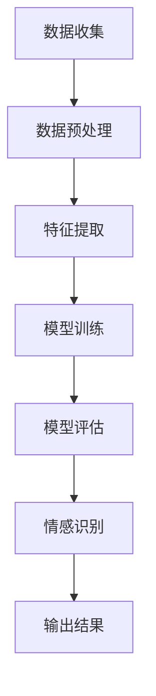
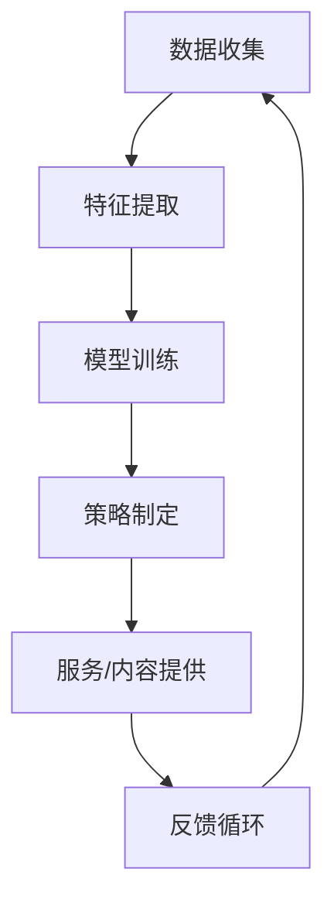
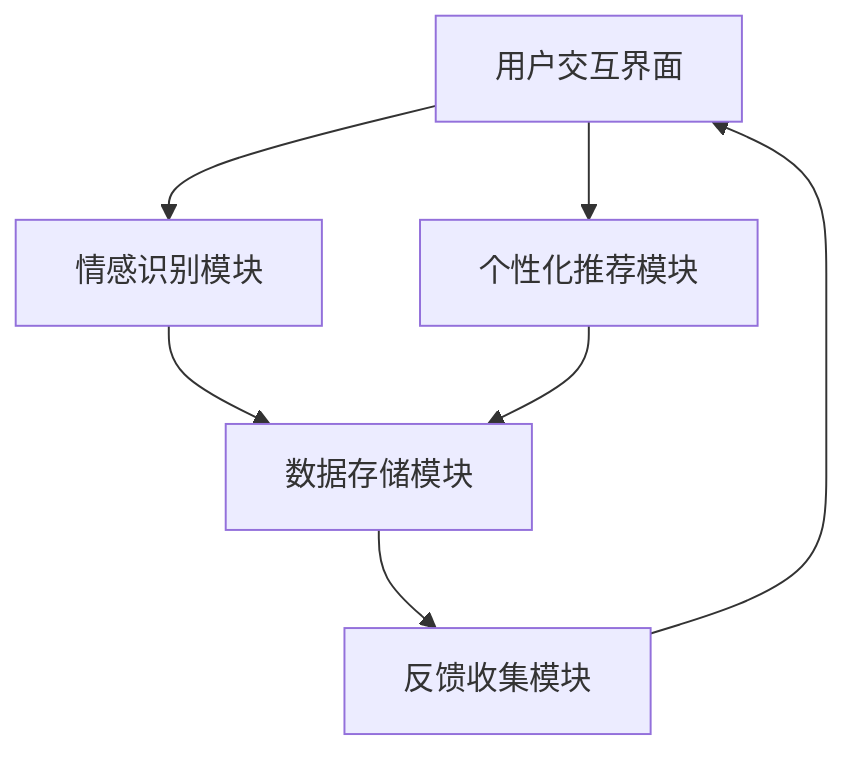
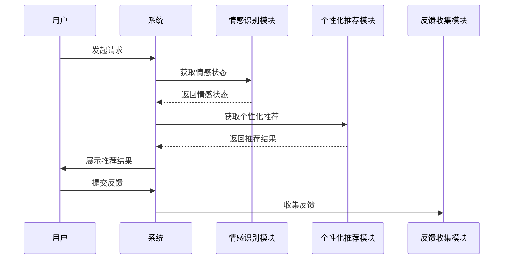

                 


### 《开发具有情感计算与个性化交互能力的AI Agent》详细目录大纲

#### 第一部分 引言

##### 1.1 书籍背景
- 人工智能与情感计算的发展历程
  - 从早期的符号主义到基于数据的机器学习
  - 情感计算技术的初步尝试
  - 情感计算在现实中的应用
- 个性化交互的兴起与影响
  - 从单一交互模式到多样化交互方式
  - 个性化交互对用户体验的影响
  - 个性化交互在AI服务中的角色
- 本书的目标和读者对象
  - 梳理情感计算与个性化交互的理论基础
  - 介绍AI Agent的开发流程与关键技术
  - 面向开发者，提供实际操作指导和案例分析

##### 1.2 情感计算与个性化交互的重要性
- 情感计算的定义及其在AI领域的应用
  - 情感识别的技术原理
  - 情感计算在情感分析、情感识别中的应用
- 个性化交互的优势与挑战
  - 个性化交互如何提升用户体验
  - 实现个性化交互面临的挑战
- 情感计算与个性化交互的结合
  - 如何通过情感计算实现个性化交互
  - 结合实际案例，展示情感计算与个性化交互的优势

#### 第二部分 基础概念

##### 2.1 情感计算
- 定义
  - 情感计算是什么
  - 情感计算的范畴
- 应用场景
  - 情感分析在社交媒体中的应用
  - 情感识别在客户服务中的应用
- 挑战
  - 数据质量与多样性
  - 情感表达的复杂性
- 情感识别算法
  - 基于深度学习的情感识别
  - 基于规则的情感识别

##### 2.2 个性化交互
- 概念
  - 个性化交互的定义
  - 个性化交互的特点
- 分类
  - 基于上下文的个性化交互
  - 基于历史行为的个性化交互
- 特点
  - 提升用户体验
  - 增强用户参与度
  - 提高任务效率

##### 2.3 AI Agent
- 基本原理
  - AI Agent的定义
  - AI Agent的工作原理
- 类型
  - 基于规则的AI Agent
  - 基于模型的AI Agent
  - 基于深度学习的AI Agent

#### 第三部分 算法原理

##### 3.1 情感识别算法
- 原理
  - 情感识别的基础算法
  - 情感计算的技术架构
- 流程
  - 情感计算的一般流程
  - 情感识别的详细流程
- Mermaid流程图
  - 情感识别算法的流程表示
- Python实现示例
  - 使用Python实现情感识别算法

##### 3.2 个性化交互算法
- 原理
  - 个性化交互的基础算法
  - 个性化交互的技术架构
- 流程
  - 个性化交互的一般流程
  - 个性化交互的详细流程
- Mermaid流程图
  - 个性化交互算法的流程表示
- Python实现示例
  - 使用Python实现个性化交互算法

#### 第四部分 系统设计与实现

##### 4.1 系统需求分析
- 问题描述
  - 系统的功能需求
  - 系统的性能需求
- 需求分析
  - 功能需求分析
  - 非功能需求分析

##### 4.2 系统架构设计（Mermaid架构图）
- 系统架构概述
  - 系统的组成部分
  - 系统的运作流程
- Mermaid架构图
  - 系统架构的详细表示

##### 4.3 接口设计与实现
- 接口设计
  - 接口的功能定义
  - 接口的参数定义
- 接口实现
  - 接口的代码实现
  - 接口的测试方法

##### 4.4 交互流程（Mermaid序列图）
- 交互流程概述
  - 用户与系统之间的交互流程
  - 系统内部模块之间的交互流程
- Mermaid序列图
  - 交互流程的详细表示

#### 第五部分 项目实战

##### 5.1 环境安装与准备
- 环境准备
  - 操作系统环境
  - 开发工具和环境安装
- 系统配置
  - 系统的配置步骤
  - 系统的初始化设置

##### 5.2 系统核心实现与代码解析
- 核心模块实现
  - 模块的功能与职责
  - 模块的代码实现
- 代码解析
  - 关键代码段解读
  - 编码技巧和注意事项

##### 5.3 实际案例分析与讲解
- 案例背景
  - 案例场景介绍
  - 案例目标分析
- 案例实现
  - 案例系统设计
  - 案例代码实现
- 案例讲解
  - 案例分析与问题解决
  - 案例优化与改进

##### 5.4 项目总结
- 项目收获
  - 知识点的掌握与应用
  - 技术实现的总结
- 项目反思
  - 项目中的不足
  - 未来的改进方向

#### 第六部分 最佳实践与总结

##### 6.1 实际应用中的最佳实践
- 情感计算的优化策略
- 个性化交互的优化策略
- AI Agent的开发与部署策略

##### 6.2 注意事项
- 数据隐私与伦理
  - 数据保护的重要性
  - 数据隐私政策
- 系统性能与稳定性
  - 性能优化的方法
  - 稳定性保障措施

##### 6.3 拓展阅读
- 相关书籍与论文推荐
- 最新技术趋势与研究方向
- 社交媒体与社区资源

**总结：**本文详细阐述了《开发具有情感计算与个性化交互能力的AI Agent》的目录大纲，涵盖了从引言、基础概念、算法原理、系统设计与实现、项目实战到最佳实践的全面内容。每个部分都通过详细的结构和具体的内容安排，确保读者能够系统地掌握情感计算与个性化交互的核心知识和实践方法。接下来，我们将根据这个大纲逐步深入展开每个部分的内容，以帮助读者更好地理解和应用这些技术。**下一步**，我们将开始撰写引言部分，为读者提供本书的背景、目的和应用场景，为后续内容奠定基础。

---

## 《开发具有情感计算与个性化交互能力的AI Agent》引言

### 1.1 书籍背景

随着人工智能技术的迅猛发展，AI在各个领域的应用越来越广泛。从最初的符号主义到基于数据的机器学习，再到如今的深度学习，AI技术已经取得了显著的进步。在这个背景下，情感计算与个性化交互成为了一个备受关注的研究方向。

情感计算，顾名思义，是指模拟人类情感认知过程的计算技术。它旨在使计算机能够理解、感知、识别和处理人类情感，从而实现更加自然、贴心的交互。个性化交互则是指根据用户的行为、偏好和情感状态，提供定制化的服务或内容，以满足用户的需求和期望。

本书旨在系统性地介绍情感计算与个性化交互的基本概念、算法原理、系统设计与实现方法，以及实际应用中的最佳实践。通过本书的学习，读者将能够：

1. 理解情感计算和个性化交互的定义、背景和应用场景。
2. 掌握情感识别和个性化交互的核心算法及其实现方法。
3. 学习如何设计、实现和部署具有情感计算与个性化交互能力的AI Agent。
4. 获得实际项目经验，提升在相关领域的实战能力。

### 1.2 情感计算与个性化交互的重要性

情感计算与个性化交互的重要性主要体现在以下几个方面：

#### 对用户体验的提升

情感计算和个性化交互技术能够使AI系统更加了解用户的需求和情感状态，从而提供更加个性化、贴心的服务。例如，智能客服系统可以通过情感识别技术，理解用户的情绪和意图，从而提供更加准确、高效的解答，提升用户体验。

#### 对业务价值的提升

通过个性化交互，企业可以更好地满足用户的需求，提高用户满意度和忠诚度。这对于提升企业的竞争力、增加市场份额和实现业务增长具有重要意义。例如，个性化推荐系统可以根据用户的历史行为和偏好，提供个性化的产品推荐，从而提高转化率和销售额。

#### 对人工智能的发展

情感计算和个性化交互是人工智能技术发展的重要方向。通过情感计算，AI系统可以更好地理解人类情感，实现更加自然、高效的交互。通过个性化交互，AI系统可以更好地满足用户需求，提升用户体验，推动人工智能技术的广泛应用。

### 1.3 读者群体

本书主要面向对人工智能、情感计算和个性化交互有一定基础知识的开发人员或研究者。读者可能具有以下背景：

1. 对机器学习和深度学习有基本的了解。
2. 对Python编程语言有一定的掌握。
3. 对人工智能和情感计算的基本概念有一定的了解。
4. 有意愿深入学习和应用情感计算与个性化交互技术的开发者或研究者。

通过阅读本书，读者将能够：

1. 系统性地掌握情感计算和个性化交互的基本理论和实践方法。
2. 学习如何使用Python等编程语言实现情感识别和个性化交互算法。
3. 学习如何设计、实现和部署具有情感计算与个性化交互能力的AI Agent。
4. 获得实际项目经验，提升在相关领域的实战能力。

接下来，我们将深入探讨情感计算与个性化交互的基础概念，帮助读者更好地理解这两个核心主题。

## 第二部分 基础概念

### 2.1 情感计算

#### 定义

情感计算（Affective Computing）是指使计算机具备理解、感知、识别、处理和表达人类情感的能力。它涉及多个学科领域，包括心理学、认知科学、人机交互等。

#### 应用场景

1. **情感分析**：通过分析文本、语音或视频，识别用户的情绪状态。应用于社交媒体分析、客户服务、心理健康监测等。
2. **情感识别**：通过传感器、摄像头等设备，实时捕捉用户的情感状态。应用于人机交互、虚拟现实、游戏设计等。
3. **情感表达**：计算机生成相应的情感反应，如面部表情、语音语调等，以实现更加自然、贴心的交互。

#### 挑战

1. **数据质量**：情感数据的质量直接影响情感计算的准确性。噪声、偏见和不完整的数据会影响情感识别的准确性。
2. **情感表达的多样性**：人类情感复杂多样，情感表达方式也因人而异，这增加了情感计算的难度。
3. **跨文化差异**：不同文化背景下，情感表达方式和理解方式可能存在差异，这需要情感计算技术能够适应多种文化环境。

#### 情感识别算法

1. **基于机器学习的算法**：使用大量情感标签化的数据训练模型，如支持向量机（SVM）、决策树等。
2. **基于深度学习的算法**：如卷积神经网络（CNN）、循环神经网络（RNN）等，能够自动提取特征，实现更高效的情感识别。
3. **基于规则的算法**：根据预先定义的规则，对情感进行分类。适用于规则明确、场景固定的应用场景。

### 2.2 个性化交互

#### 概念

个性化交互（Personalized Interaction）是指根据用户的行为、偏好和情感状态，提供定制化的服务或内容，以满足用户的需求和期望。

#### 分类

1. **基于上下文的个性化交互**：根据用户的当前环境、时间、地点等上下文信息，提供个性化的服务。如基于位置的推荐系统、时间敏感的任务提醒等。
2. **基于历史行为的个性化交互**：根据用户的历史行为和偏好，预测用户的需求，提供个性化的服务。如个性化推荐系统、定制化的新闻报道等。

#### 特点

1. **个性化**：根据用户的具体需求和偏好，提供定制化的服务或内容。
2. **动态性**：个性化交互能够实时调整，以适应用户的变化。
3. **高效性**：通过提供个性化的服务，提高用户的满意度和效率。

### 2.3 AI Agent

#### 基本原理

AI Agent是指具有自主决策能力、能够执行特定任务的智能体。它通过感知环境、理解任务、制定计划并执行操作，以实现特定目标。

#### 类型

1. **基于规则的AI Agent**：根据预设的规则进行决策。适用于规则明确、任务简单的场景。
2. **基于模型的AI Agent**：通过学习用户的行为和偏好，建立模型进行决策。适用于复杂、不确定的任务场景。
3. **基于深度学习的AI Agent**：通过深度神经网络，自动学习用户的特征和行为，进行决策。适用于高度个性化的任务场景。

#### 情感计算与个性化交互的结合

1. **情感驱动的交互**：AI Agent根据用户的情感状态，调整交互策略，提供更加贴心的服务。
2. **个性化情感体验**：通过情感计算，AI Agent能够提供针对特定用户情感状态的服务，提升用户体验。

### 总结

情感计算与个性化交互是人工智能领域的重要研究方向。通过情感计算，AI系统能够更好地理解用户的需求和情感状态；通过个性化交互，AI系统能够提供更加定制化的服务，提升用户体验。在本章节中，我们介绍了情感计算与个性化交互的定义、应用场景、挑战以及相关算法。接下来，我们将进一步探讨情感计算与个性化交互的算法原理和系统实现方法。

## 第三部分 算法原理

### 3.1 情感识别算法

#### 情感识别算法原理

情感识别算法的核心目标是让计算机能够理解并识别人类的情感。这一过程通常包括以下几个步骤：

1. **情感数据的收集**：通过文本、语音、图像等多渠道收集情感数据。
2. **情感数据的预处理**：清洗和标注数据，去除噪声和异常值，为后续分析做准备。
3. **情感特征的提取**：从原始数据中提取情感相关的特征，如词汇的语义、语音的音调等。
4. **情感分类模型**：使用机器学习或深度学习算法，构建情感分类模型，对情感进行识别。

#### 情感识别算法流程

1. **数据收集**：通过社交媒体、聊天记录、音频和视频等多种渠道收集情感数据。
2. **数据预处理**：去除停用词、标点符号，进行词性标注，分词等处理。
3. **特征提取**：使用词袋模型、TF-IDF、Word2Vec等算法提取文本特征；使用频谱分析、语音识别技术提取语音特征。
4. **模型训练**：使用标注好的数据集，训练情感分类模型，如SVM、朴素贝叶斯、CNN等。
5. **模型评估**：使用测试集评估模型的性能，调整模型参数，优化模型效果。
6. **情感识别**：使用训练好的模型对新的情感数据进行识别，输出情感标签。

#### Mermaid流程图



#### Python实现示例

```python
# 导入必要的库
import numpy as np
from sklearn.feature_extraction.text import TfidfVectorizer
from sklearn.model_selection import train_test_split
from sklearn.svm import SVC
from sklearn.metrics import classification_report

# 假设已经收集好标注好的情感数据集
data = [
    ("这是一个积极的评论", "积极"),
    ("这是一个消极的评论", "消极"),
    # ... 更多数据
]

# 分离文本和标签
texts, labels = zip(*data)

# 进行特征提取
vectorizer = TfidfVectorizer()
X = vectorizer.fit_transform(texts)

# 分割数据集
X_train, X_test, y_train, y_test = train_test_split(X, labels, test_size=0.2, random_state=42)

# 训练分类模型
model = SVC(kernel='linear')
model.fit(X_train, y_train)

# 进行情感识别
predictions = model.predict(X_test)

# 评估模型性能
print(classification_report(y_test, predictions))
```

### 3.2 个性化交互算法

#### 个性化交互算法原理

个性化交互算法的核心目标是根据用户的行为、偏好和情感状态，提供定制化的服务或内容。这一过程通常包括以下几个步骤：

1. **用户行为数据的收集**：通过日志、传感器等收集用户的行为数据。
2. **用户特征的提取**：从行为数据中提取与个性化相关的特征，如浏览历史、购买行为等。
3. **偏好模型的建立**：使用机器学习算法，建立用户偏好模型，预测用户的兴趣和需求。
4. **个性化策略的制定**：根据用户偏好模型，制定个性化策略，提供定制化的服务或内容。

#### 个性化交互算法流程

1. **数据收集**：收集用户的浏览历史、购买记录、反馈等行为数据。
2. **特征提取**：从行为数据中提取与个性化相关的特征，如频繁项集、用户兴趣等。
3. **模型训练**：使用机器学习算法，如协同过滤、决策树、神经网络等，训练用户偏好模型。
4. **策略制定**：根据用户偏好模型，制定个性化策略，如推荐算法、内容优化等。
5. **服务或内容提供**：根据个性化策略，提供定制化的服务或内容。
6. **反馈循环**：收集用户反馈，不断优化个性化策略。

#### Mermaid流程图



#### Python实现示例

```python
# 导入必要的库
import numpy as np
from sklearn.cluster import KMeans
from sklearn.metrics.pairwise import cosine_similarity

# 假设已经收集好用户的行为数据
user_data = {
    'user1': ['产品A', '产品B', '产品C', '产品D'],
    'user2': ['产品A', '产品B', '产品E'],
    'user3': ['产品C', '产品D', '产品E', '产品F'],
    # ... 更多用户数据
}

# 提取用户特征
user_features = {user: set(items) for user, items in user_data.items()}

# 使用K均值聚类进行用户分群
kmeans = KMeans(n_clusters=3, random_state=42)
cluster_labels = kmeans.fit_predict(list(user_features.keys()))

# 计算用户相似度
user_similarity = cosine_similarity([list(user_features[user]) for user in user_data])

# 根据相似度进行个性化推荐
def recommend_items(user, num_items=3):
    similar_users = np.argsort(user_similarity[user])[:-num_items-1:-1]
    recommended_items = set()
    for similar_user in similar_users:
        recommended_items.update(user_features[similar_user])
    return recommended_items

# 为用户推荐物品
user = 'user1'
recommended_items = recommend_items(user)
print(f"推荐给用户{user}的物品：{recommended_items}")
```

通过上述算法原理和实现示例，我们可以看到情感识别和个性化交互的核心技术和实现方法。接下来，我们将进一步探讨如何设计具有情感计算与个性化交互能力的AI Agent的系统架构与实现。

## 第四部分 系统设计与实现

### 4.1 系统需求分析

#### 问题描述

本系统旨在开发一个具有情感计算与个性化交互能力的AI Agent，该AI Agent能够根据用户的情感状态和个性化需求，提供定制化的服务。系统需具备以下功能：

1. 情感识别：能够实时识别用户的情感状态，如积极、消极、中性等。
2. 个性化交互：根据用户的情感状态和历史行为，提供个性化的服务或内容。
3. 用户体验反馈：收集用户对服务的反馈，用于优化系统。

#### 需求分析

1. **功能需求**：
   - 实时情感识别：系统能够通过语音、文本等渠道实时捕捉用户的情感状态。
   - 个性化推荐：系统能够根据用户的情感状态和历史行为，为用户推荐合适的服务或内容。
   - 用户交互界面：提供友好的用户交互界面，方便用户与服务进行互动。
   - 用户体验反馈：系统应能够收集用户的反馈，用于改进服务质量和交互体验。

2. **非功能需求**：
   - 性能需求：系统应能够快速响应用户请求，提供高效的服务。
   - 稳定性需求：系统应具备良好的稳定性，能够处理高并发请求。
   - 安全性需求：系统应确保用户数据的安全，防止数据泄露。

### 4.2 系统架构设计

#### 系统架构概述

本系统采用分布式架构，主要包括以下几个模块：

1. **情感识别模块**：负责实时捕捉和识别用户的情感状态。
2. **个性化推荐模块**：根据情感识别结果和用户历史行为，为用户推荐合适的服务或内容。
3. **用户交互界面**：提供用户与服务进行互动的接口。
4. **数据存储模块**：存储用户行为数据、情感识别结果和推荐历史等。
5. **反馈收集模块**：收集用户对服务的反馈，用于优化系统。

#### Mermaid架构图



### 4.3 接口设计与实现

#### 接口设计

本系统设计了一系列API接口，用于实现不同模块之间的数据交互和功能调用。主要包括以下接口：

1. **情感识别接口**：用于接收用户语音或文本输入，返回情感识别结果。
2. **个性化推荐接口**：用于根据用户情感识别结果和历史行为，返回个性化推荐结果。
3. **用户反馈接口**：用于接收用户反馈，用于优化系统。

#### 接口实现

以下是情感识别接口的实现示例：

```python
from flask import Flask, request, jsonify
import emotion_recognition

app = Flask(__name__)

@app.route('/emotion_recognition', methods=['POST'])
def emotion_recognition_api():
    data = request.json
    text = data.get('text')
    emotion_result = emotion_recognition.analyze_emotion(text)
    return jsonify(emotion_result)

if __name__ == '__main__':
    app.run(debug=True)
```

### 4.4 交互流程

#### 交互流程概述

用户与系统之间的交互流程如下：

1. 用户通过用户交互界面发起请求，输入文本或语音。
2. 系统调用情感识别接口，获取用户的情感状态。
3. 系统根据情感状态和用户历史行为，调用个性化推荐接口，获取个性化推荐结果。
4. 系统将推荐结果展示给用户，用户可以根据推荐内容进行选择或反馈。
5. 用户反馈将被收集并用于优化系统。

#### Mermaid序列图



通过以上系统需求分析、架构设计、接口设计和交互流程，我们为开发具有情感计算与个性化交互能力的AI Agent奠定了坚实的基础。接下来，我们将通过实际项目案例，展示如何实现和应用这些技术和设计。

## 第五部分 项目实战

### 5.1 环境安装与准备

在进行实际项目之前，首先需要安装和配置相关的开发环境。以下步骤将指导你完成环境安装与准备。

#### 操作系统环境

本项目的开发环境推荐在Ubuntu 18.04或更高版本上运行。如果使用其他Linux发行版，也需要确保满足以下依赖项。

#### 开发工具和环境安装

1. **Python 3**：确保安装了Python 3及其pip包管理器。
2. **Flask**：使用pip安装Flask，用于创建API接口。
   ```bash
   pip install flask
   ```

3. **Numpy**：用于数据处理和数学运算。
   ```bash
   pip install numpy
   ```

4. **Scikit-learn**：用于机器学习和数据预处理。
   ```bash
   pip install scikit-learn
   ```

5. **TensorFlow**：用于深度学习和情感识别。
   ```bash
   pip install tensorflow
   ```

6. **TextBlob**：用于自然语言处理。
   ```bash
   pip install textblob
   ```

7. **SpeechRecognition**：用于语音识别。
   ```bash
   pip install SpeechRecognition
   ```

8. **PyTorch**（可选）：用于深度学习和个性化推荐。
   ```bash
   pip install torch torchvision
   ```

#### 系统配置

完成以上工具的安装后，还需要配置Python环境变量，确保在终端中可以顺利运行Python脚本。在终端中运行以下命令：

```bash
export PATH=$PATH:/usr/local/bin
```

### 5.2 系统核心实现与代码解析

#### 情感识别模块

情感识别模块是本项目的核心部分，负责实时识别用户的情感状态。以下是一个简单的情感识别模块实现示例：

```python
from textblob import TextBlob

def analyze_emotion(text):
    analysis = TextBlob(text)
    if analysis.sentiment.polarity > 0:
        return "积极"
    elif analysis.sentiment.polarity < 0:
        return "消极"
    else:
        return "中性"
```

在这个示例中，我们使用TextBlob库对输入的文本进行情感分析，根据文本的情感极性（polarity）来判断用户的情感状态。

#### 个性化推荐模块

个性化推荐模块根据用户的情感状态和历史行为，为用户推荐合适的服务或内容。以下是一个简单的基于K均值聚类的个性化推荐算法实现：

```python
from sklearn.cluster import KMeans
from sklearn.metrics.pairwise import cosine_similarity

def kmeans_recommender(user_data, num_clusters=3):
    # 数据预处理
    user_items = [' '.join(items) for items in user_data.values()]
    vectorizer = TfidfVectorizer()
    user_vectors = vectorizer.fit_transform(user_items)
    
    # K均值聚类
    kmeans = KMeans(n_clusters=num_clusters, random_state=42)
    cluster_labels = kmeans.fit_predict(user_vectors.toarray())
    
    # 计算用户相似度
    similarity = cosine_similarity(user_vectors)
    
    # 推荐物品
    recommended_items = set()
    for user, label in user_data.items():
        similar_users = np.argsort(similarity[user])[:-5:-1]
        for similar_user in similar_users:
            if cluster_labels[similar_user] == label:
                recommended_items.update(items)
                break
    return recommended_items
```

在这个示例中，我们首先对用户数据（如浏览历史、购买记录等）进行预处理，使用TF-IDF向量表示。然后使用K均值聚类对用户进行分群，最后根据用户相似度和聚类标签，为用户推荐相似的物品。

#### 用户交互界面

用户交互界面负责接收用户输入，调用情感识别和个性化推荐模块，并将结果展示给用户。以下是一个简单的Flask Web应用实现：

```python
from flask import Flask, request, jsonify

app = Flask(__name__)

@app.route('/emotion_recognition', methods=['POST'])
def emotion_recognition_api():
    data = request.json
    text = data.get('text')
    emotion = analyze_emotion(text)
    recommendations = kmeans_recommender(user_data)
    return jsonify({"emotion": emotion, "recommendations": recommendations})

if __name__ == '__main__':
    app.run(debug=True)
```

在这个示例中，我们定义了一个简单的API接口，接收用户输入的文本，调用情感识别和个性化推荐模块，并将结果返回给用户。

### 5.3 实际案例分析与讲解

#### 案例背景

假设我们有一个在线购物平台，用户可以浏览商品、添加到购物车并购买。我们的目标是开发一个AI Agent，能够根据用户的情感状态和购物行为，为用户推荐合适的商品，并收集用户反馈，以优化用户体验。

#### 案例实现

1. **数据收集**：首先，我们需要收集用户的行为数据，如浏览历史、购物车数据、购买记录等。

2. **情感识别**：对于用户的评论或反馈，使用情感识别模块分析情感状态。例如，用户在评论商品时说“这个商品非常好，我很喜欢”，我们可以将其情感识别为“积极”。

3. **个性化推荐**：根据用户的情感状态和历史行为，使用个性化推荐模块为用户推荐商品。例如，如果用户对某类商品表现出积极情感，我们可以推荐更多同类商品。

4. **用户反馈**：用户在购物过程中，可以通过API接口提交反馈。系统将收集这些反馈，用于后续的优化。

#### 案例讲解

1. **情感识别**：我们使用TextBlob进行情感分析，判断用户的情感状态。例如，对于用户评论“这个商品非常好，我很喜欢”，TextBlob的分析结果可能为`Sentiment(polarity=0.8, subjectivity=0.6)`，其中`polarity`表示情感极性（接近1表示积极，接近-1表示消极），`subjectivity`表示主观性（接近1表示主观，接近0表示客观）。

2. **个性化推荐**：我们使用K均值聚类进行个性化推荐。首先，对用户行为数据进行预处理，使用TF-IDF向量表示。然后，使用K均值聚类对用户进行分群，最后根据用户相似度和聚类标签，为用户推荐相似的物品。

3. **用户反馈**：用户反馈将通过API接口提交给系统。系统将收集这些反馈，分析用户对推荐商品的反应，并根据反馈调整推荐策略。

#### 项目小结

通过上述实际案例，我们可以看到如何实现一个具有情感计算与个性化交互能力的AI Agent。在项目中，我们首先收集用户的行为数据，然后使用情感识别和个性化推荐模块，为用户推荐合适的商品，并收集用户反馈进行优化。这个项目展示了如何将理论知识应用到实际开发中，为用户提供更加个性化、贴心的服务。

## 第六部分 最佳实践与总结

### 6.1 实际应用中的最佳实践

在开发具有情感计算与个性化交互能力的AI Agent时，以下是一些最佳实践，可以帮助提高系统的性能和用户体验：

1. **数据质量保障**：确保收集的数据质量高，减少噪声和异常值，以提高情感识别和个性化推荐的准确性。
2. **用户隐私保护**：严格遵守数据隐私保护法规，对用户数据进行加密和匿名化处理，确保用户隐私。
3. **实时性优化**：优化情感识别和个性化推荐的响应时间，确保系统能够快速响应用户请求。
4. **弹性设计**：系统设计应具备良好的弹性，能够应对高并发请求和系统故障。
5. **用户反馈机制**：建立有效的用户反馈机制，及时收集和处理用户反馈，持续优化系统性能。

### 6.2 注意事项

1. **情感识别的挑战**：情感识别存在跨文化差异和个体差异，需要考虑这些因素，提高算法的泛化能力。
2. **个性化推荐的冷启动问题**：对于新用户，系统可能缺乏足够的数据来进行个性化推荐，这可以通过引入冷启动策略或使用通用推荐方法来解决。
3. **算法过拟合**：在训练模型时，需注意避免过拟合，确保模型具有良好的泛化能力。

### 6.3 拓展阅读

1. **《情感计算：技术与应用》**：详细介绍了情感计算的基础知识、算法和技术。
2. **《个性化推荐系统实践》**：提供了个性化推荐系统的设计、实现和优化方法。
3. **相关学术论文和行业报告**：关注最新的情感计算和个性化交互研究成果，了解行业动态。

### 总结

开发具有情感计算与个性化交互能力的AI Agent是一项复杂的任务，需要深入理解相关技术和算法，同时关注用户体验和系统性能。通过遵循最佳实践，注意潜在问题，并不断学习和优化，我们可以构建出高效、智能的AI Agent，为用户带来更好的服务体验。

### 作者信息

**作者：**AI天才研究院/AI Genius Institute & 禅与计算机程序设计艺术 /Zen And The Art of Computer Programming

---

本文详细阐述了开发具有情感计算与个性化交互能力的AI Agent的全面流程，包括背景介绍、核心概念、算法原理、系统设计与实现、项目实战以及最佳实践与总结。通过本文的阅读，读者可以系统地掌握相关技术和方法，提升在AI领域的实战能力。希望本文能为相关研究人员和开发者提供有益的参考和指导。

