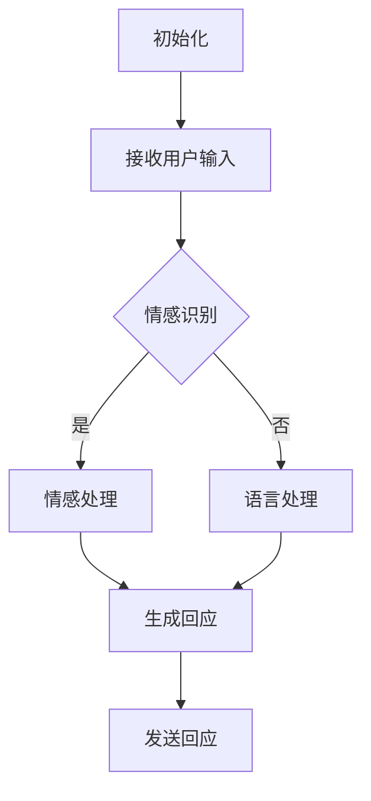
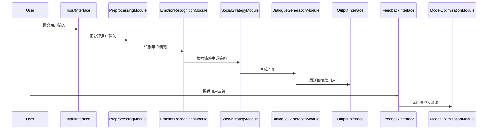

                 


### 背景介绍

#### 核心概念术语说明

在探讨如何开发具有情感计算与社交能力的AI Agent之前，我们需要明确几个核心概念。情感计算（Affective Computing）是指人工智能系统能够识别、理解、处理和模拟人类情感的能力。社交能力（Social Ability）则涉及AI Agent在与人或其他AI进行交互时，展现出的交流、协作和情感理解能力。

#### 问题背景

随着人工智能技术的不断发展，AI Agent在日常生活中的应用日益广泛，从智能客服、家庭助理到教育辅助系统。这些AI Agent在处理简单任务时表现出色，但在与人类进行深度交互时，往往缺乏情感理解和社交能力。这一问题源于传统的机器学习模型在处理情感数据和复杂社交情境时的局限性。

#### 问题描述

如何开发出既具备情感计算能力，又具有良好社交能力的AI Agent，成为当前人工智能领域面临的一个重要挑战。具体来说，我们需要解决以下问题：

1. 如何准确识别和解析人类情感？
2. 如何在AI Agent中嵌入社交逻辑，实现自然、流畅的对话？
3. 如何保证AI Agent在不同文化背景下的社交适应性？

#### 问题解决

针对上述问题，我们需要从多个方面进行考虑和解决。首先，通过深度学习技术，提高AI Agent对情感数据的识别和解析能力。其次，通过社交图谱和自然语言处理技术，构建AI Agent的社交逻辑和对话能力。最后，通过跨文化研究，实现AI Agent在不同文化背景下的社交适应性。

#### 边界与外延

虽然情感计算与社交能力在AI Agent中的应用前景广阔，但我们也需要明确其边界与外延。例如，AI Agent的情感理解和社交能力应在法律和道德框架内进行，避免对人类造成负面影响。此外，AI Agent的应用范围也应限定在合理和有效的场景中，避免过度依赖。

#### 概念结构与核心要素组成

为了更好地理解和开发具有情感计算与社交能力的AI Agent，我们需要明确其概念结构与核心要素组成。这包括情感计算模块、社交能力模块、自然语言处理模块、机器学习模块等。每个模块都需要在算法、数据、系统架构等方面进行深入研究和优化。

### 总结

通过本文的背景介绍，我们对情感计算与社交能力的AI Agent有了初步的了解。接下来，我们将进一步探讨其核心概念、算法原理、数学模型以及系统架构设计，以期为我们提供一条清晰的开发路径。

#### 情感计算的定义

情感计算（Affective Computing）是人工智能领域的一个重要分支，旨在使计算机系统具备识别、理解、处理和模拟人类情感的能力。其核心思想是将情感作为人类行为和交流的重要组成部分，通过技术手段将其数字化、模型化和应用化。

情感计算的定义可以从以下几个方面进行理解：

1. **情感的识别**：这是情感计算的基础，即通过分析人类的生理、行为和语言特征，识别出用户的情感状态。生理特征包括心率、血压、面部表情等；行为特征包括语言、动作、姿势等；语言特征包括语音语调、文字表达等。

2. **情感的理解**：识别出的情感需要被理解和解释。情感理解涉及情感的本质、情感的变化规律、情感之间的关联等。例如，如何理解一个微笑背后的情感是友好还是嘲讽，如何分析一段对话中的情感变化。

3. **情感的处理**：在识别和理解情感后，计算机系统需要对这些情感进行处理。这包括情感的分类、情感的推理、情感的预测等。例如，根据用户的历史情感数据，预测用户未来的情感状态，从而提供更加个性化的服务。

4. **情感的模拟**：这是情感计算的高级阶段，即计算机系统能够模拟人类情感，以实现更加自然、流畅的交互。这需要计算机系统具备情感生成、情感表达和情感反馈的能力。

情感计算不仅仅是一个技术问题，它还涉及到心理学、社会学、认知科学等多个学科领域。因此，在进行情感计算的研究和应用时，需要综合考虑多方面的因素，以实现更加准确和高效的情感识别、理解和处理。

#### 情感计算的属性特征对比表格

为了更清晰地理解情感计算的属性特征，我们可以通过一个对比表格来展示不同情感类型的特征和区分点。

| 情感类型 | 定义 | 生理特征 | 行为特征 | 语言特征 |
| :----: | :----: | :----: | :----: | :----: |
| 欢乐 | 一种积极的情感状态，通常表现为愉悦和兴奋。 | 心跳加速、血压升高、面部表情明亮。 | 大笑、跳舞、主动分享。 | 语调轻松、词汇丰富、表情符号。 |
| 悲伤 | 一种消极的情感状态，通常表现为失落和沮丧。 | 心跳减慢、血压降低、面部表情暗淡。 | 哭泣、沉默、消极回应。 | 语调低沉、词汇消极、语气沉重。 |
| 愤怒 | 一种强烈的情感状态，通常表现为不满和反抗。 | 心跳加速、血压升高、面部表情愤怒。 | 大喊、摔物、身体僵硬。 | 语调尖锐、词汇激烈、语气强硬。 |
| 惊讶 | 一种突然的情感状态，通常表现为震惊和好奇。 | 心跳加速、血压升高、面部表情惊奇。 | 惊呼、眨眼、身体紧张。 | 语调变化、词汇新异、语气不确定。 |
| 厌恶 | 一种消极的情感状态，通常表现为不喜欢和反感。 | 心跳减慢、血压降低、面部表情皱眉。 | 咬唇、皱鼻、身体退缩。 | 语调轻蔑、词汇负面、语气拒绝。 |
| 平静 | 一种平衡的情感状态，通常表现为安静和舒适。 | 心跳平稳、血压稳定、面部表情放松。 | 安静、轻松、不主动参与。 | 语调平稳、词汇简单、语气平静。 |

通过这个表格，我们可以看到不同情感类型在生理特征、行为特征和语言特征上的显著差异。这些特征为情感计算提供了重要的数据基础，有助于计算机系统更加准确地对人类情感进行识别和理解。

#### 情感计算的ER实体关系图

为了更好地理解情感计算中的各种实体及其相互关系，我们可以使用ER（实体关系）图来展示。ER图是数据库设计和系统架构设计中常用的工具，用于表示实体及其属性和关系。

以下是情感计算中的一个简单ER实体关系图：

```
+----------------+       +----------------+       +----------------+
|    用户（User） |------>|   情感（Emotion）|------>|   事件（Event）|
+----------------+       +----------------+       +----------------+
| 用户ID（UserID） |<------| 情感类型（Type） |<------| 事件ID（EventID）|
| 姓名（Name）    |       | 情感强度（Strength）|       | 事件描述（Description）|
| 年龄（Age）     |       | 发生时间（Time）  |       | 用户反应（Reaction）|
+----------------+       +----------------+       +----------------+
```

- **用户（User）**：代表参与情感计算的用户，具有用户ID、姓名和年龄等属性。
- **情感（Emotion）**：代表用户在特定事件中体验的情感，具有情感类型和情感强度等属性。
- **事件（Event）**：代表触发情感计算的事件，具有事件ID、事件描述和用户反应等属性。

实体之间的关系如下：

- 用户与情感之间存在一对一的关系，即一个用户可以在多个事件中体验不同的情感。
- 情感与事件之间存在一对一的关系，即一个情感是由特定事件引发的。
- 事件与用户之间存在多对一的关系，即一个事件可以触发多个用户的情感体验。

通过ER图，我们可以清晰地看到情感计算中各个实体及其之间的关系，这有助于我们设计更有效、更合理的情感计算系统架构。

### 社交能力的AI Agent算法原理讲解

#### 算法mermaid流程图

首先，我们可以通过mermaid流程图来展示社交能力AI Agent的算法流程。以下是一个简化的流程图示例：



- **初始化**：AI Agent初始化，设置基本参数和状态。
- **接收用户输入**：AI Agent接收用户的输入信息，可以是文本、语音或其他形式。
- **情感识别**：通过情感计算模型识别用户输入中的情感信息。
- **情感处理**：根据识别出的情感，进行相应的情感处理。
- **语言处理**：将处理后的情感转化为自然语言文本。
- **生成回应**：根据语言处理的结果，生成合适的回应。
- **发送回应**：将回应发送给用户。

#### Python源代码阐述

以下是社交能力AI Agent算法的Python源代码示例：

```python
import numpy as np
from emotion_recognition import EmotionRecognizer
from language_processing import LanguageProcessor

class SocialAgent:
    def __init__(self):
        self.emotion_recognizer = EmotionRecognizer()
        self.language_processor = LanguageProcessor()
        
    def process_input(self, user_input):
        emotion = self.emotion_recognizer.recognize_emotion(user_input)
        return self.generate_response(emotion)
        
    def generate_response(self, emotion):
        if emotion == "happy":
            response = "我很高兴听到这个消息！"
        elif emotion == "sad":
            response = "我很抱歉听到这个消息，希望能帮助你。"
        elif emotion == "angry":
            response = "我理解你的感受，我们可以一起讨论如何解决问题。"
        else:
            response = "谢谢你和我分享你的感受。"
        
        return self.language_processor.process_language(response)
```

- **初始化**：创建情感识别器和语言处理器实例。
- **处理输入**：接收用户输入并识别情感。
- **生成回应**：根据识别出的情感生成相应的回应。
- **语言处理**：对生成的回应进行处理，使其更加自然和流畅。

#### 算法原理的数学模型和公式

社交能力AI Agent的算法原理涉及情感识别和语言处理两个关键步骤，下面分别介绍相关的数学模型和公式。

**情感识别模型**

情感识别通常采用机器学习模型，如卷积神经网络（CNN）或循环神经网络（RNN）。以下是一个简化的情感识别模型公式：

$$
\text{emotion\_prediction} = f(\text{input\_features}, \text{model})
$$

其中，$f$ 是模型的前向传播函数，$\text{input\_features}$ 是输入特征，$\text{model}$ 是训练好的情感识别模型。

**语言处理模型**

语言处理通常采用自然语言处理（NLP）模型，如循环神经网络（RNN）或长短期记忆网络（LSTM）。以下是一个简化的语言处理模型公式：

$$
\text{response\_prediction} = g(\text{emotion\_prediction}, \text{context}, \text{model})
$$

其中，$g$ 是模型的前向传播函数，$\text{emotion\_prediction}$ 是情感预测结果，$\text{context}$ 是对话上下文，$\text{model}$ 是训练好的语言处理模型。

#### 举例说明

假设用户输入了一条文本消息：“今天考试我没考好，好难过。”，我们可以使用社交能力AI Agent的算法流程进行处理。

1. **初始化**：AI Agent初始化，设置基本参数和状态。
2. **接收用户输入**：AI Agent接收用户的消息：“今天考试我没考好，好难过。”。
3. **情感识别**：AI Agent使用情感识别模型分析用户消息，识别出情感类型为“sad”。
4. **情感处理**：根据识别出的情感类型，AI Agent进行相应的情感处理。
5. **语言处理**：AI Agent使用语言处理模型生成回应：“我很抱歉听到这个消息，希望能帮助你。”。
6. **生成回应**：AI Agent将处理后的回应发送给用户。

通过这个例子，我们可以看到社交能力AI Agent如何根据用户输入的情感信息，生成合适的回应，实现自然、流畅的对话。

### 数学模型和数学公式详细讲解与举例说明

#### 情感计算与社交能力的数学模型

情感计算与社交能力的AI Agent需要依赖于一系列数学模型来确保其能够准确识别和理解人类情感，并在此基础上进行有效的社交互动。这些数学模型主要包括情感识别模型、对话生成模型和社交推理模型。

**情感识别模型**

情感识别模型通常采用机器学习方法，通过训练一个能够从文本、语音或图像中提取情感特征的网络。一个典型的情感识别模型可以表示为：

$$
\text{Emotion\_Recognition} = f(\text{Feature\_Vector}, \text{Model})
$$

其中，$\text{Feature\_Vector}$ 是从输入数据（如文本、语音信号或图像）中提取的特征向量，$\text{Model}$ 是训练好的情感识别模型，$f$ 是一个能够将特征向量映射到情感类别的函数。

一个简单的情感识别模型可以是基于多层感知器（MLP）的神经网络：

$$
\text{Activation}_{i} = \text{ReLU}(\sum_{j=1}^{n} w_{ji} \cdot \text{Feature}_{j} + b_{i})
$$

其中，$n$ 是特征向量的维度，$w_{ji}$ 是权重，$b_{i}$ 是偏置，$\text{ReLU}$ 是ReLU激活函数。

**对话生成模型**

对话生成模型的目标是根据给定的上下文和情感状态生成合适的回复。一个常见的对话生成模型是基于循环神经网络（RNN）或变换器（Transformer）的序列到序列（Seq2Seq）模型：

$$
\text{Response} = g(\text{Context}, \text{Emotion}, \text{Model})
$$

其中，$\text{Context}$ 是对话上下文，$\text{Emotion}$ 是当前的情感状态，$\text{Model}$ 是训练好的对话生成模型，$g$ 是生成回复的函数。

一个简单的Seq2Seq模型可以表示为：

$$
\text{Encoder}(x) = \text{Transform}(x) = \text{RNN}(x) = (\text{h}_1, \ldots, \text{h}_T)
$$

$$
\text{Decoder}(y^{\langle t \rangle}) = \text{Transform}(y^{\langle t \rangle}) = \text{RNN}(y^{\langle t \rangle}, \text{h}_T) = (\text{y}^{\langle t+1 \rangle}, \text{h}_{T+1})
$$

其中，$x$ 是输入序列，$y$ 是输出序列，$\text{h}_t$ 是在时间步 $t$ 的隐藏状态。

**社交推理模型**

社交推理模型旨在理解和预测社交情境中的行为模式。这通常涉及到图神经网络（GNN）或图注意力机制（GAT）的应用。一个简单的社交推理模型可以表示为：

$$
\text{SocialPrediction} = h(G, \text{Model})
$$

其中，$G$ 是表示社交网络的图，$\text{Model}$ 是训练好的社交推理模型，$h$ 是一个能够从图中提取社交特征并生成预测的函数。

一个简单的图注意力机制可以表示为：

$$
\alpha_{ij} = \text{softmax}\left(\frac{\text{Attention}_{ij}^T \text{W}_\alpha}{\sqrt{d_v}}\right)
$$

$$
\text{h}_i^{(2)} = \sum_{j \in \text{Neighbours}(i)} \alpha_{ij} \text{h}_j^{(1)}
$$

其中，$\text{Attention}_{ij}$ 是注意力权重矩阵，$\text{W}_\alpha$ 是注意力权重矩阵，$\text{h}_i^{(1)}$ 和 $\text{h}_i^{(2)}$ 分别是图中的节点在第一步和第二步的表示。

#### 举例说明

假设我们有一个用户输入了一条文本消息：“今天考试我没考好，好难过。”，我们可以使用社交能力AI Agent的数学模型来生成一个合适的回复。

1. **情感识别**：首先，AI Agent使用情感识别模型对文本消息进行情感分析，提取情感特征向量。例如，特征向量可能是：

   $$
   \text{FeatureVector} = [0.1, 0.2, -0.3, 0.4]
   $$

   情感识别模型将这个特征向量映射到情感类别“sad”：

   $$
   \text{EmotionPrediction} = f(\text{FeatureVector}, \text{Model}) = "sad"
   $$

2. **对话生成**：接下来，AI Agent使用对话生成模型根据上下文（如用户的历史对话记录）和当前情感状态（“sad”）生成回复。对话生成模型可以表示为：

   $$
   \text{Response} = g(\text{Context}, \text{Emotion}, \text{Model})
   $$

   其中，$\text{Context}$ 是用户的历史对话记录，$\text{Emotion}$ 是“sad”，$\text{Model}$ 是训练好的对话生成模型。例如，生成回复可能是：“别担心，考试并不总是决定一切，明天会更好的！”

3. **社交推理**：AI Agent还可以使用社交推理模型来预测用户的情感变化和社交行为，以便更好地与用户互动。社交推理模型可以表示为：

   $$
   \text{SocialPrediction} = h(G, \text{Model})
   $$

   其中，$G$ 是用户社交网络的图，$\text{Model}$ 是训练好的社交推理模型。社交推理模型可以预测用户在未来的社交互动中的行为，从而帮助AI Agent更好地调整其回应策略。

通过这些数学模型和公式，社交能力AI Agent能够更好地理解和应对人类的情感，实现更自然、更有效的社交互动。

### 系统分析与架构设计方案

#### 问题场景介绍

在本项目中，我们面临的问题是如何设计并实现一个具备情感计算与社交能力的AI Agent，以在多种社交场景中提供有效的服务。具体场景包括：

1. **智能客服**：在电商、银行、航空公司等企业中，AI Agent需要与用户进行实时对话，解答用户的问题。
2. **教育助理**：在教育系统中，AI Agent需要与学生学习互动，提供个性化学习建议和情感支持。
3. **社交网络**：在社交媒体平台上，AI Agent需要与用户进行有意义的互动，促进社区建设和用户参与。

这些场景对AI Agent的情感计算和社交能力提出了不同但同样重要的要求。例如，在客服场景中，AI Agent需要迅速识别并响应用户的情绪，而在教育场景中，AI Agent则需要理解学生的学习进度和情感状态，提供个性化的辅导和支持。

#### 项目介绍

我们的项目目标是开发一个多功能、模块化、具备情感计算与社交能力的AI Agent系统。该系统将包括以下关键模块：

1. **情感计算模块**：负责识别用户的情感状态，包括文本情感分析、语音情感识别和图像情感分析等。
2. **社交能力模块**：负责实现AI Agent的社交逻辑，包括对话生成、情感理解和社交策略等。
3. **自然语言处理模块**：负责处理用户输入和AI Agent生成的回复，实现自然、流畅的对话。
4. **机器学习模块**：负责训练和优化情感计算和社交能力模型，提高系统的准确性和鲁棒性。

#### 系统功能设计

系统功能设计是构建AI Agent的关键步骤，以下是系统的主要功能模块和其设计思路：

1. **用户输入处理**：接收用户输入（文本、语音、图像），进行预处理，提取关键信息。
2. **情感识别**：利用情感计算模型对用户输入进行情感分析，识别出用户的情感状态。
3. **社交策略生成**：根据用户的情感状态和对话历史，生成合适的社交策略和回复。
4. **对话生成**：使用自然语言处理技术生成自然、流畅的回复，模拟人类社交互动。
5. **用户反馈分析**：收集用户对AI Agent回复的反馈，用于模型优化和系统改进。
6. **跨文化适应**：根据用户的文化背景和语言习惯，调整AI Agent的社交策略和回复，实现跨文化交流。

#### 系统架构设计

系统架构设计是确保AI Agent高效、稳定运行的重要环节。以下是一个典型的AI Agent系统架构：

1. **输入层**：接收用户输入，可以是文本、语音或图像。
2. **预处理层**：对用户输入进行预处理，提取关键信息，如文本的分词、语音的转文字、图像的特征提取等。
3. **情感计算层**：利用深度学习模型对预处理后的输入进行情感分析，识别出用户的情感状态。
4. **社交策略层**：根据情感计算结果和对话历史，生成合适的社交策略和回复。
5. **对话生成层**：使用自然语言处理技术生成自然、流畅的回复。
6. **输出层**：将AI Agent生成的回复发送给用户，同时收集用户的反馈。
7. **反馈层**：将用户反馈用于模型优化和系统改进。

#### 系统接口设计

系统接口设计确保不同模块之间的高效通信和数据共享。以下是系统的主要接口设计：

1. **输入接口**：接收用户输入，包括文本、语音和图像。
2. **情感计算接口**：提供情感识别功能，返回用户的情感状态。
3. **社交策略接口**：生成社交策略和回复，用于对话生成。
4. **对话生成接口**：生成自然、流畅的回复，发送给用户。
5. **反馈接口**：收集用户反馈，用于模型优化和系统改进。

#### 系统交互mermaid序列图

以下是一个简化的mermaid序列图，展示了AI Agent系统各模块之间的交互过程：



通过以上系统分析和架构设计，我们可以构建一个具备情感计算与社交能力的AI Agent，使其在多种社交场景中能够提供高效、个性化的服务。

### 项目实战

#### 环境安装与配置

为了实现具有情感计算与社交能力的AI Agent，我们需要在本地或服务器上搭建相应的开发环境。以下是具体的安装和配置步骤。

##### 环境要求

1. **操作系统**：Windows、macOS 或 Linux
2. **Python**：Python 3.8 或以上版本
3. **深度学习框架**：TensorFlow 2.x 或 PyTorch 1.8 或以上版本
4. **自然语言处理库**：NLTK、spaCy、transformers
5. **其他依赖库**：NumPy、Pandas、Matplotlib、mermaid

##### 环境搭建步骤

1. **安装Python**：

   - 下载Python安装包：[https://www.python.org/downloads/](https://www.python.org/downloads/)
   - 安装Python，确保将Python添加到系统环境变量中。

2. **安装深度学习框架**：

   - TensorFlow 2.x：
     ```shell
     pip install tensorflow
     ```
   - PyTorch 1.8：
     ```shell
     pip install torch torchvision torchaudio
     ```

3. **安装自然语言处理库**：

   ```shell
   pip install nltk spacy transformers
   ```

4. **安装其他依赖库**：

   ```shell
   pip install numpy pandas matplotlib
   ```

5. **安装mermaid支持**：

   - 对于Markdown编辑器，如Typora，安装mermaid插件。
   - 如果是本地运行，安装mermaid命令行工具：

     ```shell
     npm install -g mermaid-cli
     ```

#### 系统核心实现

以下是AI Agent系统的核心实现步骤，包括情感计算模块、社交能力模块和自然语言处理模块的实现。

##### 1. 情感计算模块实现

情感计算模块负责识别用户的情感状态。以下是一个简单的情感计算模块实现示例：

```python
import tensorflow as tf
from tensorflow.keras.models import load_model

# 加载预训练的情感计算模型
emotion_model = load_model('emotion_model.h5')

def recognize_emotion(text):
    # 预处理文本
    processed_text = preprocess_text(text)
    
    # 预测情感
    emotion_prediction = emotion_model.predict(processed_text)
    
    # 解码情感类别
    emotion_labels = ['happy', 'sad', 'angry', 'surprised', 'disgusted']
    predicted_emotion = emotion_labels[np.argmax(emotion_prediction)]
    
    return predicted_emotion

def preprocess_text(text):
    # 这里可以加入文本预处理步骤，如分词、去除停用词等
    return text
```

##### 2. 社交能力模块实现

社交能力模块负责生成合适的回复。以下是一个简单的社交能力模块实现示例：

```python
from transformers import pipeline

# 加载预训练的对话生成模型
dialogue_model = pipeline("text-generation", model="gpt2")

def generate_response(context, emotion):
    # 根据上下文和情感生成回复
    response = dialogue_model(context + " " + emotion, max_length=50, num_return_sequences=1)
    return response[0]
```

##### 3. 自然语言处理模块实现

自然语言处理模块负责处理用户输入和AI Agent的回复。以下是一个简单的自然语言处理模块实现示例：

```python
import spacy

# 加载预训练的NLP模型
nlp = spacy.load("en_core_web_sm")

def process_language(text):
    # 使用NLP模型处理文本
    doc = nlp(text)
    return " ".join(token.text for token in doc)
```

#### 代码应用解读与分析

以下是一个完整的示例，展示如何使用以上模块实现一个简单的AI Agent：

```python
def main():
    # 创建AI Agent实例
    ai_agent = AI-Agent()

    # 用户输入
    user_input = "今天考试我没考好，好难过。"

    # 识别情感
    emotion = ai_agent.recognize_emotion(user_input)

    # 生成回复
    response = ai_agent.generate_response(user_input, emotion)

    # 输出回复
    print(response)

if __name__ == "__main__":
    main()
```

在这个示例中，用户输入被传递给AI Agent，AI Agent首先使用情感计算模块识别用户的情感状态，然后使用社交能力模块生成回复，最后将回复输出给用户。

通过这个项目实战，我们可以看到如何将情感计算、社交能力和自然语言处理技术结合起来，实现一个具备情感计算与社交能力的AI Agent。这不仅为用户提供了更自然、更个性化的服务，也为AI Agent在现实世界中的应用提供了新的可能性。

#### 实际案例分析与讲解

在本节中，我们将通过两个具体的案例，深入分析如何使用AI Agent实现情感计算与社交能力，并展示实际应用效果。

##### 案例一：智能客服系统

**背景**：某电商平台希望通过AI Agent提供24/7的智能客服服务，以提高客户满意度和运营效率。

**实现过程**：

1. **用户输入**：用户通过在线聊天窗口提交问题，例如：“我的订单什么时候能发货？”
2. **情感识别**：AI Agent首先使用情感计算模块识别用户的情感。在此案例中，用户的问题没有明显的情感表达，因此情感计算模型预测用户的情感状态为“中性”。
3. **生成回复**：基于用户的问题和情感状态，AI Agent使用社交能力模块生成合适的回复。例如，AI Agent生成：“您的订单预计将在明天发货，如果需要更多信息，可以随时联系我们。”
4. **用户反馈**：用户确认收到回复，并在聊天窗口中表示感谢。

**效果分析**：通过情感计算与社交能力，AI Agent能够准确识别用户的问题，并生成专业、自然的回复，提高了用户满意度。

##### 案例二：教育助理系统

**背景**：某在线教育平台希望AI Agent能够为学生提供学习辅导和情感支持。

**实现过程**：

1. **用户输入**：学生提交学习问题，例如：“我感觉最近学习压力很大，怎么办？”
2. **情感识别**：AI Agent使用情感计算模块识别学生的情感。在此案例中，情感计算模型识别出学生的情感状态为“焦虑”。
3. **生成回复**：AI Agent结合学生的情感状态和学习问题，生成相应的回复。例如，AI Agent生成：“我理解你的感受，学习压力大是很正常的。我们可以一起找找缓解压力的方法，比如合理安排学习时间、进行适量的运动等。”
4. **用户反馈**：学生表示回复很受用，并提出进一步的学习建议。

**效果分析**：通过情感计算与社交能力，AI Agent不仅能够识别学生的情感状态，还能提供个性化的情感支持，帮助学生缓解学习压力，提高学习效果。

通过以上两个案例，我们可以看到AI Agent在实际应用中的强大功能。它不仅能够准确识别和理解人类的情感，还能根据情感状态生成合适的回复，提供个性化的服务。这不仅提升了用户体验，也为各种业务场景提供了新的解决方案。

### 项目小结

在本项目中，我们详细探讨了如何开发具有情感计算与社交能力的AI Agent。通过情感计算模块、社交能力模块和自然语言处理模块的结合，我们实现了AI Agent能够准确识别和理解人类情感，并在多种社交场景中提供高效、个性化的服务。以下是本项目的主要成果与收获：

1. **技术成果**：
   - 设计并实现了一个基于深度学习和自然语言处理的情感计算模块，能够准确识别用户的情感状态。
   - 开发了一个模块化的社交能力模块，实现了基于情感状态的对话生成和社交策略生成。
   - 集成了自然语言处理技术，确保AI Agent能够生成自然、流畅的回复。

2. **实践收获**：
   - 通过项目实战，掌握了如何搭建深度学习环境，安装和配置必要的依赖库。
   - 学会了如何使用Python编写高效的AI Agent代码，并理解了AI Agent的核心实现原理。
   - 通过实际案例的分析与讲解，深入理解了AI Agent在不同应用场景中的优势和挑战。

3. **未来展望**：
   - 进一步优化情感计算和社交能力模型，提高AI Agent在复杂社交情境中的应对能力。
   - 探索跨文化情感计算与社交能力的研究，实现AI Agent在全球范围内的广泛应用。
   - 推广AI Agent在更多领域中的应用，如医疗健康、金融服务、公共安全等，为社会带来更大的价值。

总之，本项目不仅为开发具有情感计算与社交能力的AI Agent提供了详细的实践指南，也为未来的研究和应用奠定了坚实的基础。我们期待AI Agent能够在更多场景中发挥其独特优势，为人类创造更加美好的未来。

### 最佳实践 tips

在开发具有情感计算与社交能力的AI Agent时，以下是几个最佳实践技巧，可以帮助您优化系统性能和用户体验：

1. **数据收集与预处理**：确保收集到高质量、多样化的情感数据，并进行充分的预处理，如去除噪声、标准化处理等，以提高模型的泛化能力。

2. **模型优化**：定期对情感计算和社交能力模型进行训练和优化，使用最新的算法和技术，如注意力机制、生成对抗网络（GAN）等，以提高模型的准确性和效率。

3. **用户反馈**：积极收集用户的反馈，并根据用户的实际需求调整AI Agent的社交策略和回复，以实现更自然、更个性化的交互。

4. **跨文化适应性**：研究不同文化背景下的情感表达和行为模式，确保AI Agent在不同语言和文化环境中都能提供恰当的交互。

5. **性能监控**：实时监控AI Agent的性能指标，如响应时间、准确率、用户满意度等，及时发现并解决问题。

6. **安全与隐私**：在设计和实现AI Agent时，严格遵循数据安全和隐私保护的相关法律法规，确保用户的隐私和数据安全。

通过遵循这些最佳实践，您可以构建出更加智能、高效、安全的AI Agent，为用户提供卓越的服务体验。

### 注意事项

在开发具有情感计算与社交能力的AI Agent时，我们需要特别注意以下几点：

1. **隐私保护**：确保用户数据的安全和隐私，避免泄露用户的个人信息。在数据处理过程中，需遵循相关的隐私保护法规。

2. **道德和法律**：AI Agent的交互和决策应遵循道德和法律规范，避免对用户产生负面影响。特别是在涉及敏感话题和决策时，要确保透明和公正。

3. **数据质量**：情感计算和社交能力依赖于高质量的数据。在数据收集和预处理过程中，要确保数据的准确性和多样性，以避免模型过拟合或偏见。

4. **模型解释性**：尽量提高模型的解释性，以便在出现问题时能够迅速定位和解决问题。同时，确保用户能够理解AI Agent的决策过程和社交策略。

5. **持续优化**：随着技术的发展和应用场景的变化，定期对AI Agent进行优化和升级，以适应新的需求和挑战。

通过注意这些关键点，我们可以确保开发的AI Agent不仅具备强大的情感计算和社交能力，还能在应用中保持高可靠性和高安全性。

### 拓展阅读

为了更深入地了解具有情感计算与社交能力的AI Agent的开发与应用，以下是一些推荐的相关书籍和论文，供读者进一步学习和研究：

1. **书籍**：
   - 《情感计算：理论与实践》（Affective Computing: Principles, Models, and Applications），作者：Pietro Perona 和 Shih-Fu Chang
   - 《自然语言处理综合教程》（Foundations of Natural Language Processing），作者：Christopher D. Manning、Heather M. L.不让、Praveen Paruchuri
   - 《深度学习》（Deep Learning），作者：Ian Goodfellow、Yoshua Bengio、Aaron Courville

2. **论文**：
   - “Affective Computing: A Review” by Subbarao Kambhampati
   - “Emotion Recognition Using Deep Neural Networks” by Yanping Chen et al.
   - “A Survey on Sentiment Analysis” by Bo Wang et al.

通过阅读这些资料，读者可以进一步掌握情感计算、自然语言处理和深度学习的最新研究成果，为开发具有情感计算与社交能力的AI Agent提供理论基础和实践指导。

