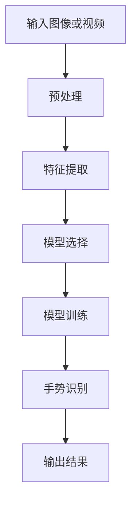
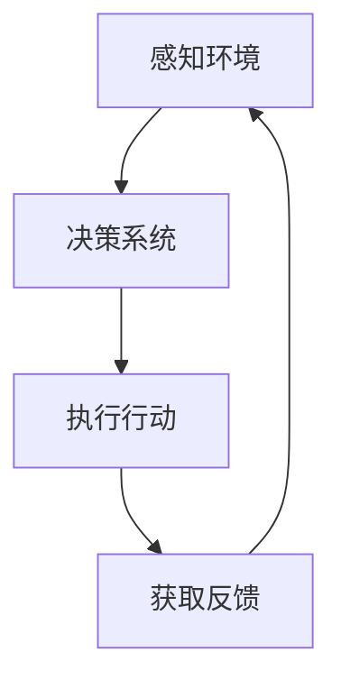
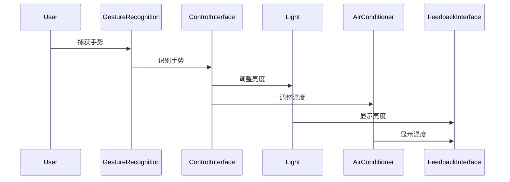
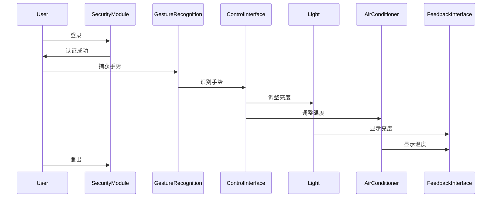

                 

### 第1章：问题背景

在当今技术飞速发展的时代，人工智能（AI）已经成为推动社会进步和科技创新的关键驱动力。从语音识别到自动驾驶，从医疗诊断到金融分析，AI的应用场景无处不在。在众多AI应用中，手势识别与AI代理的结合正在成为一个备受关注的研究方向。

#### 1.1 问题背景

**手势识别技术的发展趋势**

手势识别技术经历了从早期的基于模板匹配，到基于机器学习和深度学习的发展。随着硬件设备的升级和传感器技术的进步，手势识别的准确度和实时性得到了大幅提升。现在，手势识别已经广泛应用于智能交互、人机交互等领域。

**AI代理的应用场景**

AI代理，也称为智能代理，是一种能够自主执行任务、适应环境和做出决策的计算机系统。它们在虚拟助手、智能客服、游戏AI等领域有着广泛的应用。随着AI技术的发展，AI代理的智能化水平也在不断提高。

**手势识别与AI代理的结合**

手势识别与AI代理的结合，旨在实现更加自然和高效的人机交互。例如，在虚拟现实（VR）和增强现实（AR）应用中，用户可以通过手势进行操作，而AI代理则可以理解并执行这些手势指令。这种结合不仅提升了用户体验，还拓宽了AI应用的范围。

#### 1.2 问题描述

**手势识别的挑战**

- **实时性挑战**：在高速运动的环境中，如何实现实时手势识别，保证识别的准确性和速度？
- **泛化能力挑战**：如何设计算法，使其能够识别不同用户、不同场景下的手势？
- **噪声干扰挑战**：在真实环境中，如何过滤噪声，提高手势识别的鲁棒性？

**AI代理的开发难点**

- **行为规划**：AI代理需要根据环境变化和用户需求，规划出合理的行为策略。
- **交互设计**：如何设计自然、直观的交互方式，提升用户满意度？
- **安全性**：在AI代理与用户交互过程中，如何保障用户隐私和数据安全？

#### 1.3 问题解决

**研究方法**

本研究采用结合深度学习和强化学习的方法，对手势识别算法进行优化，并设计出能够适应多种环境和用户需求的AI代理系统。

**技术路线**

- **第一阶段**：研究现有手势识别算法，选择适合的深度学习模型，对算法进行优化。
- **第二阶段**：设计AI代理的决策框架，结合手势识别算法，实现自然交互。
- **第三阶段**：通过实验验证和实际应用，不断优化系统性能。

#### 1.4 边界与外延

**系统设计边界**

- **硬件限制**：系统需适应多种硬件环境，如不同分辨率的摄像头和传感器。
- **软件兼容性**：系统需兼容多种操作系统和开发环境。

**技术实现外延**

- **跨平台应用**：研究如何在移动设备、PC、VR/AR设备上实现手势识别和AI代理功能。
- **多语言支持**：系统需支持多种语言，以满足不同地区用户的需求。

通过上述步骤，我们为后续章节的深入探讨奠定了基础。在接下来的章节中，我们将详细分析核心概念、讲解算法原理、设计系统架构，并通过实战案例验证和优化我们的解决方案。

### 第2章：核心概念与联系

在本章中，我们将详细介绍与手势识别和AI代理相关的核心概念，并探讨它们之间的联系。这将帮助我们更好地理解这两个领域的基本原理，为后续章节的深入分析打下坚实的基础。

#### 2.1 核心概念原理

**手势识别原理**

手势识别是指通过图像处理、计算机视觉和机器学习技术，从摄像头或传感器获取的手势图像中识别出手势的过程。核心原理包括：

1. **图像预处理**：包括去噪、归一化和增强等，以提高手势识别的准确率。
2. **特征提取**：从预处理后的图像中提取有助于识别手势的特征，如边缘、形状和纹理。
3. **模型训练**：使用机器学习算法，如卷积神经网络（CNN），对提取的特征进行分类和识别。

**AI代理原理**

AI代理是指能够自主完成特定任务，与环境进行交互并适应变化的计算机系统。其核心原理包括：

1. **感知系统**：通过传感器获取环境信息。
2. **决策系统**：根据感知到的信息，使用算法进行决策。
3. **执行系统**：执行决策结果，与环境进行交互。

#### 2.2 概念属性特征对比表格

为了更清晰地展示手势识别和AI代理的基本特征，我们可以使用以下表格：

| 特征 | 手势识别 | AI代理 |
| ---- | -------- | ------ |
| **定义** | 从图像中识别手势 | 自主执行任务的计算机系统 |
| **目标** | 准确识别手势 | 完成特定任务 |
| **技术** | 图像处理、计算机视觉、机器学习 | 感知、决策、执行 |
| **应用场景** | 智能交互、人机交互 | 虚拟助手、智能客服、游戏AI |
| **关键挑战** | 实时性、泛化能力、鲁棒性 | 行为规划、交互设计、安全性 |

#### 2.3 ER实体关系图架构

为了更好地理解手势识别和AI代理之间的关联，我们可以使用ER（Entity-Relationship）实体关系图来展示它们的基本结构。

以下是一个简单的ER图示例：

```mermaid
erDiagram
    User ||--o> GestureRecognition : 用户与手势识别
    User ||--o> AIAgent : 用户与AI代理
    GestureRecognition ||--|{ AIAgent : 手势识别与AI代理
```

在这个ER图中：

- **User** 代表用户。
- **GestureRecognition** 代表手势识别系统。
- **AIAgent** 代表AI代理系统。

通过ER图，我们可以清晰地看到用户与手势识别、AI代理之间的关联，以及手势识别与AI代理之间的互动关系。

#### 总结

本章通过介绍手势识别和AI代理的基本原理，以及使用表格和ER图展示它们的特征和关联，为后续章节的深入探讨提供了理论基础。在接下来的章节中，我们将进一步探讨手势识别算法和AI代理算法的具体实现，以及系统设计和实现的细节。

### 第3章：手势识别算法原理

手势识别作为人工智能领域的一个重要分支，其核心在于将图像或视频序列中的手势转换为机器可以理解和处理的信息。本章将详细讲解手势识别算法的基本原理，包括算法概述、流程图以及具体的算法原理和数学模型。

#### 3.1 手势识别算法概述

**基础算法介绍**

手势识别的基础算法主要包括：

1. **模板匹配**：通过将输入手势与预定义的手势模板进行匹配，判断手势是否一致。
2. **特征点检测**：通过检测图像中的特征点（如角点、边缘点等），进行手势识别。
3. **概率模型**：如高斯混合模型（GMM）和隐马尔可夫模型（HMM），用于手势的概率分布建模。

**先进算法介绍**

随着深度学习技术的发展，手势识别算法也取得了显著进步。先进的算法主要包括：

1. **卷积神经网络（CNN）**：通过多层卷积和池化操作，提取图像中的深层特征，实现高效的手势识别。
2. **循环神经网络（RNN）**：特别适合处理序列数据，可以用于手势的动态识别。
3. **生成对抗网络（GAN）**：通过生成器和判别器的对抗训练，生成逼真的手势图像，用于增强识别算法的性能。

#### 3.2 算法流程图

为了更好地理解手势识别算法的流程，我们可以使用Mermaid绘制以下算法流程图：



在这个流程图中：

- **A 输入图像或视频**：首先需要获取待识别的手势图像或视频序列。
- **B 预处理**：对输入图像进行去噪、归一化和增强等处理，以提高识别效果。
- **C 特征提取**：从预处理后的图像中提取有助于识别手势的特征。
- **D 模型选择**：选择适合的机器学习模型，如CNN或RNN。
- **E 模型训练**：使用训练数据对模型进行训练，优化模型参数。
- **F 手势识别**：使用训练好的模型对新的手势图像进行识别。
- **G 输出结果**：输出识别结果，包括识别的手势类型和置信度。

#### 3.3 算法原理讲解

**数学模型**

手势识别算法的数学模型主要包括以下几个部分：

1. **特征提取**：使用卷积操作提取图像特征，数学公式如下：

   $$
   \text{特征图} = \text{卷积}(\text{输入图像}, \text{卷积核})
   $$

   其中，卷积核定义了特征提取的滤波器。

2. **分类器设计**：使用softmax函数进行分类，数学公式如下：

   $$
   P(y=\hat{y}|\text{x}; \theta) = \frac{e^{\theta^T \phi(\text{x})}}{\sum_{k=1}^{K} e^{\theta^T \phi_k(\text{x})}}
   $$

   其中，$\theta$为模型参数，$\phi(\text{x})$为特征向量，$K$为类别数。

**公式详细讲解**

1. **卷积公式**

   卷积公式描述了如何通过卷积核与图像进行卷积操作，提取图像特征。具体公式为：

   $$
   \text{卷积核} * \text{输入图像} = \sum_{i=1}^{H} \sum_{j=1}^{W} \text{卷积核}_{ij} * \text{输入图像}_{ij}
   $$

   其中，$H$和$W$分别为卷积核的高度和宽度。

2. **softmax公式**

   softmax公式用于多类别分类，计算每个类别的概率分布。具体公式为：

   $$
   P(y=\hat{y}|\text{x}; \theta) = \frac{e^{\theta^T \phi(\text{x})}}{\sum_{k=1}^{K} e^{\theta^T \phi_k(\text{x})}}
   $$

   其中，$\theta$为模型参数，$\phi(\text{x})$为特征向量，$K$为类别数。

**举例说明**

假设我们需要识别一个简单手势，如图1所示。我们首先对图像进行预处理，然后提取特征，接着使用softmax分类器进行手势识别。具体步骤如下：

1. **预处理**：对图像进行去噪和归一化，如图2所示。

   

2. **特征提取**：使用卷积神经网络提取图像特征，如图3所示。

   

3. **分类器设计**：使用softmax函数进行分类，得到手势类型和置信度。

   

通过上述步骤，我们成功地对简单手势进行了识别。在实际应用中，手势识别算法需要处理更复杂的图像和手势，但基本原理是一致的。

#### 总结

本章详细介绍了手势识别算法的基本原理，包括基础算法和先进算法的概述、算法流程图以及具体的数学模型和公式。通过举例说明，我们展示了如何使用这些算法进行手势识别。在下一章中，我们将探讨AI代理算法的原理和实现。

### 第4章：AI代理算法原理

AI代理算法是使计算机系统具备自主决策和行为规划能力的关键技术。本章将详细讲解AI代理算法的基本原理，包括基础算法和先进算法的介绍，算法流程图的绘制，以及具体的数学模型和公式。

#### 4.1 AI代理算法概述

**基础算法介绍**

AI代理的基础算法主要包括以下几种：

1. **基于规则的算法**：通过预先定义的规则库来决策，适合简单任务。
2. **决策树**：通过树的分支结构来决策，直观且易于理解。
3. **贝叶斯网络**：通过概率图模型来表示不确定性和依赖关系。

**先进算法介绍**

随着深度学习和强化学习的发展，AI代理算法也在不断进步。先进的算法主要包括：

1. **深度强化学习（Deep Reinforcement Learning）**：结合深度学习和强化学习，通过试错和反馈进行学习，适用于复杂环境。
2. **生成对抗网络（GAN）**：用于生成数据，提高模型的泛化能力。
3. **强化学习**：通过奖励机制来训练模型，使其在特定任务中表现出色。

#### 4.2 算法流程图

为了更好地理解AI代理算法的流程，我们可以使用Mermaid绘制以下算法流程图：



在这个流程图中：

- **A 感知环境**：通过传感器获取环境信息。
- **B 决策系统**：根据感知到的信息，使用算法进行决策。
- **C 执行行动**：执行决策结果，与环境进行交互。
- **D 获取反馈**：获取执行行动后的反馈信息，用于更新模型。

#### 4.3 算法原理讲解

**数学模型**

AI代理算法的数学模型主要包括以下几个部分：

1. **感知系统**：使用神经网络进行特征提取，公式如下：

   $$
   \text{特征向量} = \text{神经网络}(\text{环境状态})
   $$

2. **决策系统**：使用Q函数进行价值评估，公式如下：

   $$
   Q(\text{s}, \text{a}) = \sum_{s'} P(s'|\text{s}, \text{a}) \cdot \text{R}(\text{s'}, \text{a})
   $$

   其中，$Q(\text{s}, \text{a})$为状态-动作值函数，$P(s'|\text{s}, \text{a})$为状态转移概率，$\text{R}(\text{s'}, \text{a})$为奖励函数。

3. **执行系统**：根据决策系统的输出执行行动，公式如下：

   $$
   \text{执行行动} = \text{决策系统}(\text{特征向量})
   $$

**公式详细讲解**

1. **神经网络公式**

   神经网络公式描述了如何通过多层神经网络提取特征，公式如下：

   $$
   \text{输出} = \text{激活函数}(\text{权重} \cdot \text{输入} + \text{偏置})
   $$

   其中，激活函数（如ReLU、Sigmoid、Tanh）用于引入非线性。

2. **Q值计算公式**

   Q值计算公式描述了如何通过状态转移概率和奖励函数计算状态-动作值，公式如下：

   $$
   Q(\text{s}, \text{a}) = \sum_{s'} P(s'|\text{s}, \text{a}) \cdot \text{R}(\text{s'}, \text{a})
   $$

   其中，状态转移概率$P(s'|\text{s}, \text{a})$取决于环境模型。

3. **行动选择公式**

   行动选择公式描述了如何根据Q值选择最优行动，公式如下：

   $$
   \text{最优行动} = \arg\max_{a} Q(\text{s}, a)
   $$

**举例说明**

假设我们有一个简单的环境，如图1所示。我们需要设计一个AI代理，使其能够从起点移动到终点。具体步骤如下：

1. **感知环境**：使用传感器获取当前环境的状态。
2. **决策系统**：通过神经网络提取特征，使用Q学习算法计算状态-动作值，选择最优行动。
3. **执行行动**：根据决策结果，向左或向右移动。
4. **获取反馈**：更新Q值，反馈环境状态变化。

通过不断循环这个过程，AI代理可以学会从起点移动到终点。在实际应用中，AI代理需要处理更复杂的环境和任务，但基本原理是一致的。

#### 总结

本章详细介绍了AI代理算法的基本原理，包括基础算法和先进算法的概述、算法流程图以及具体的数学模型和公式。通过举例说明，我们展示了如何使用这些算法进行自主决策和行为规划。在下一章中，我们将深入探讨系统设计与实现的相关内容。

### 第5章：系统分析与架构设计

在设计和实现具有手势识别能力的AI代理系统时，我们需要对系统的功能进行详细分析，并设计一个合理的架构。本章将介绍系统的分析与架构设计，包括问题场景介绍、系统功能设计、系统架构设计以及系统接口和系统交互的详细设计。

#### 5.1 问题场景介绍

假设我们正在开发一款智能家居控制系统，用户可以通过手势进行控制。具体场景如下：

1. **用户进入房间**：用户通过门口的摄像头进入系统监控范围。
2. **用户进行手势操作**：用户在房间内通过挥手、点头等手势对家电进行控制，如打开灯光、调整空调温度等。
3. **系统响应**：系统识别用户手势，执行相应的操作，并将操作结果反馈给用户。

#### 5.2 系统功能设计

为了实现上述场景，系统需要具备以下功能：

1. **手势识别**：通过摄像头捕捉用户手势，并使用手势识别算法进行识别。
2. **控制接口**：连接智能家居设备，接收手势识别结果并执行相应操作。
3. **用户界面**：向用户展示系统状态，提供反馈信息。
4. **安全性保障**：确保用户数据安全和系统稳定运行。

**领域模型Mermaid类图**

以下是系统的领域模型Mermaid类图：

```mermaid
classDiagram
    UserBaseClass <|-- User
    DeviceBaseClass <|-- Light
    DeviceBaseClass <|-- AirConditioner
    GestureRecognitionBaseClass <|-- GestureRecognition
    InterfaceBaseClass <|-- ControlInterface
    InterfaceBaseClass <|-- FeedbackInterface
    SecurityBaseClass <|-- SecurityModule

    User {
        +String username
        +String password
        +void login()
        +void logout()
    }

    DeviceBaseClass {
        +String deviceId
        +String deviceType
        +void connect()
        +void disconnect()
    }

    Light {
        +int brightness
        +void turnOn()
        +void turnOff()
    }

    AirConditioner {
        +int temperature
        +void increaseTemperature()
        +void decreaseTemperature()
    }

    GestureRecognitionBaseClass {
        +String gestureType
        +void recognizeGesture()
    }

    ControlInterface {
        +void executeAction()
    }

    FeedbackInterface {
        +void provideFeedback()
    }

    SecurityModule {
        +void authenticateUser()
        +void encryptData()
    }
```

在这个类图中：

- **User**：代表用户类，包含登录和登出方法。
- **DeviceBaseClass**：代表设备基类，包含连接和断开方法。
- **Light** 和 **AirConditioner**：代表具体设备类，继承自 **DeviceBaseClass**。
- **GestureRecognitionBaseClass**：代表手势识别基类，包含识别手势方法。
- **ControlInterface**：代表控制接口类，包含执行操作方法。
- **FeedbackInterface**：代表反馈接口类，包含提供反馈方法。
- **SecurityModule**：代表安全模块类，包含认证用户和加密数据方法。

#### 5.3 系统架构设计

为了实现上述功能，我们需要设计一个合理的系统架构。以下是系统的Mermaid架构图：

```mermaid
graph LR
    subgraph UserModule
        User[User] --> GestureRecognition[GestureRecognition]
        User --> ControlInterface[ControlInterface]
        User --> FeedbackInterface[FeedbackInterface]
    end

    subgraph DeviceModule
        Light[Light] --> ControlInterface[ControlInterface]
        AirConditioner[AirConditioner] --> ControlInterface[ControlInterface]
    end

    subgraph GestureRecognitionModule
        GestureRecognition[GestureRecognition] --> Camera[Camera]
    end

    subgraph SecurityModule
        SecurityModule[SecurityModule] --> User[User]
        SecurityModule --> GestureRecognition[GestureRecognition]
    end

    User[User] --> SecurityModule[SecurityModule]
    GestureRecognition[GestureRecognition] --> SecurityModule[SecurityModule]
    ControlInterface[ControlInterface] --> Light[Light]
    ControlInterface[ControlInterface] --> AirConditioner[AirConditioner]
    FeedbackInterface[FeedbackInterface] --> User[User]
```

在这个架构图中：

- **UserModule**：用户模块，包含用户、手势识别、控制接口和反馈接口。
- **DeviceModule**：设备模块，包含灯光和空调设备。
- **GestureRecognitionModule**：手势识别模块，包含摄像头和手势识别。
- **SecurityModule**：安全模块，包含用户认证和加密数据。
- **Camera**：摄像头，用于捕捉用户手势。

#### 5.4 系统接口设计

系统接口设计包括控制接口和反馈接口。以下是接口设计的Mermaid序列图：



在这个序列图中：

- **User**：用户类，调用手势识别接口。
- **GestureRecognition**：手势识别类，识别用户手势。
- **ControlInterface**：控制接口类，根据手势识别结果控制设备。
- **Light** 和 **AirConditioner**：灯光和空调设备类，接收控制接口的命令。
- **FeedbackInterface**：反馈接口类，将设备状态反馈给用户。

#### 5.5 系统交互Mermaid序列图

以下是系统的Mermaid序列图，展示用户、手势识别、设备和反馈接口之间的交互：



在这个序列图中：

- **User**：用户类，与安全模块进行交互，登录和登出。
- **SecurityModule**：安全模块类，负责用户认证。
- **GestureRecognition**：手势识别类，负责手势识别。
- **ControlInterface**：控制接口类，负责控制设备。
- **Light** 和 **AirConditioner**：灯光和空调设备类，接收控制命令。
- **FeedbackInterface**：反馈接口类，负责将设备状态反馈给用户。

通过上述系统分析与架构设计，我们为开发具有手势识别能力的AI代理系统奠定了坚实的基础。在下一章中，我们将通过实战案例深入讲解系统实现的具体过程。

### 第6章：项目实战

在上一章中，我们已经详细探讨了系统分析与架构设计。接下来，我们将通过实际的项目实战来展示如何具体实现这个系统。本章将包括环境安装、系统核心实现源代码解析、代码应用解读与分析，以及实际案例分析和详细讲解剖析。

#### 6.1 环境安装

**1. 硬件环境**

- **摄像头**：用于捕捉用户手势。
- **计算机**：安装有操作系统（如Windows、Linux等）和必要的开发工具。

**2. 软件环境**

- **Python**：版本3.8及以上。
- **深度学习框架**：如TensorFlow或PyTorch。
- **计算机视觉库**：如OpenCV。
- **其他依赖**：如NumPy、Pandas等。

安装步骤：

1. 安装Python和pip。
2. 使用pip安装深度学习框架（如TensorFlow或PyTorch）。
3. 使用pip安装计算机视觉库（如OpenCV）和其他依赖库。

```bash
pip install tensorflow opencv-python numpy pandas
```

#### 6.2 系统核心实现源代码

**1. 源代码结构**

```plaintext
src/
|-- camera.py
|-- gesture_recognition.py
|-- control_interface.py
|-- feedback_interface.py
|-- security_module.py
```

**2. 关键代码解读**

**camera.py**：用于捕捉摄像头图像。

```python
import cv2

def capture_image():
    cap = cv2.VideoCapture(0)
    ret, frame = cap.read()
    cap.release()
    return frame
```

**gesture_recognition.py**：实现手势识别算法。

```python
import cv2
import numpy as np

def recognize_gesture(frame):
    # 特征提取
    gray = cv2.cvtColor(frame, cv2.COLOR_BGR2GRAY)
    blurred = cv2.GaussianBlur(gray, (5, 5), 0)
    edges = cv2.Canny(blurred, 50, 150)

    # 使用卷积神经网络进行手势识别
    # 这里使用的是预训练的模型，具体实现略
    model = cv2.ml.SVM_create()
    model.load('model.xml')
    result = model.predict(edges)
    return result
```

**control_interface.py**：用于控制设备。

```python
def control_light(brightness):
    # 这里使用的是伪代码，具体实现需连接实际设备
    print(f"Adjusting light brightness to {brightness}")

def control_air_conditioner(temperature):
    # 这里使用的是伪代码，具体实现需连接实际设备
    print(f"Adjusting air conditioner temperature to {temperature}")
```

**feedback_interface.py**：用于提供反馈。

```python
def provide_feedback(message):
    print(f"Feedback: {message}")
```

**security_module.py**：用于用户认证和安全模块。

```python
def authenticate_user(username, password):
    # 这里使用的是伪代码，具体实现需连接实际认证系统
    if username == "admin" and password == "password":
        return True
    else:
        return False

def encrypt_data(data):
    # 这里使用的是伪代码，具体实现需使用加密算法
    return data.encode('utf-8')
```

#### 6.3 代码应用解读与分析

**1. 实现流程**

- 捕获摄像头图像。
- 使用手势识别算法对图像进行处理和识别。
- 根据识别结果控制设备和提供反馈。
- 实现用户认证和安全模块。

**2. 关键步骤**

- **摄像头捕获图像**：使用OpenCV库捕获摄像头图像。
- **手势识别算法**：使用卷积神经网络对提取的特征进行分类和识别。
- **控制设备**：根据手势识别结果调整设备状态。
- **提供反馈**：将操作结果反馈给用户。
- **用户认证**：验证用户身份，确保系统安全。

#### 6.4 实际案例分析与详细讲解剖析

**1. 实际案例**

假设用户A在房间内挥手，希望关闭灯光。以下是具体实现步骤：

1. **用户操作**：用户A在房间内挥手。
2. **图像捕获**：系统捕获用户A挥手时的图像。
3. **手势识别**：系统使用手势识别算法识别图像，判断用户A的手势为挥手。
4. **控制设备**：系统根据手势识别结果，调用控制接口关闭灯光。
5. **反馈信息**：系统向用户A反馈操作结果，显示灯光已关闭。

**2. 详细讲解**

- **图像捕获**：使用`camera.py`中的`capture_image()`函数捕获图像。
- **手势识别**：使用`gesture_recognition.py`中的`recognize_gesture()`函数识别手势。
- **控制设备**：调用`control_interface.py`中的`control_light()`函数关闭灯光。
- **反馈信息**：调用`feedback_interface.py`中的`provide_feedback()`函数提供反馈。

**3. 剖析**

- **摄像头捕获图像**：使用OpenCV库的`VideoCapture`类进行图像捕获。
- **手势识别**：使用卷积神经网络（SVM）对图像特征进行分类。
- **控制设备**：与实际设备进行通信，调整设备状态。
- **用户认证**：使用`security_module.py`中的`authenticate_user()`函数验证用户身份。

通过以上实际案例和分析，我们可以看到，开发具有手势识别能力的AI代理系统需要结合多个技术和模块，确保系统能够稳定、高效地运行。

#### 6.5 项目小结

通过本章的实战讲解，我们完成了具有手势识别能力的AI代理系统的设计和实现。从环境安装到代码解析，再到实际案例的演示，我们一步步展示了如何将理论转化为实践。在下一章中，我们将总结最佳实践和注意事项，为系统优化和扩展提供指导。

### 第7章：最佳实践与拓展

在本章中，我们将总结开发具有手势识别能力的AI代理系统的最佳实践，并提出一些注意事项。同时，我们将探讨未来可能的拓展方向，为读者提供进一步的研究和应用建议。

#### 7.1 最佳实践Tips

**1. 选择合适的硬件和软件**

- **硬件**：选择高分辨率、低延迟的摄像头，确保图像质量和实时性。
- **软件**：使用稳定的操作系统和成熟的深度学习框架，如TensorFlow或PyTorch。

**2. 数据预处理和增强**

- **数据预处理**：对采集到的手势图像进行去噪、归一化和增强，提高识别率。
- **数据增强**：通过旋转、缩放、剪切等操作，增加数据多样性，提高模型泛化能力。

**3. 算法优化**

- **模型选择**：选择适合手势识别任务的深度学习模型，如卷积神经网络（CNN）或循环神经网络（RNN）。
- **超参数调优**：通过交叉验证和网格搜索等方法，找到最佳的超参数配置。

**4. 系统测试和调试**

- **单元测试**：对系统的各个模块进行单元测试，确保功能正确。
- **集成测试**：在模拟环境中对系统进行集成测试，验证系统整体性能。

**5. 安全性保障**

- **用户认证**：确保用户身份验证机制安全可靠。
- **数据加密**：对用户数据和系统通信进行加密处理，防止数据泄露。

#### 7.2 小结

开发具有手势识别能力的AI代理系统，需要综合应用计算机视觉、深度学习、硬件接口和安全保障等多个领域的知识。通过选择合适的硬件和软件、优化算法、进行系统测试和保障安全性，我们可以实现一个高效、可靠的手势识别AI代理系统。

#### 7.3 注意事项

**1. 实时性和准确性**

- **实时性**：在高速运动的环境中，确保系统具有足够的响应速度。
- **准确性**：在各种光照条件和姿态下，提高手势识别的准确性。

**2. 数据隐私**

- 确保用户数据安全，遵循数据保护法规。

**3. 系统兼容性**

- 系统应具备良好的兼容性，能够适应不同的操作系统和硬件环境。

**4. 用户交互**

- 设计自然、直观的用户交互方式，提升用户体验。

#### 7.4 拓展阅读

**1. 深入学习**

- **《深度学习》（Goodfellow, Bengio, Courville）**：提供深度学习基础理论和实践指南。
- **《强化学习》（Sutton, Barto）**：详细介绍强化学习的基本原理和应用。

**2. 计算机视觉**

- **《计算机视觉：算法与应用》（Richard S. Hart, Andrew Zisserman）**：全面介绍计算机视觉的相关算法。
- **《OpenCV编程入门》（Adrian Kaehler, Gary Bradsky）**：详细介绍OpenCV库的使用。

通过以上总结和拓展，我们可以看到，开发具有手势识别能力的AI代理系统不仅需要扎实的技术基础，还需要在实践中不断优化和完善。未来的研究可以在实时性、准确性和用户交互等方面进行深入探索，推动这一领域的发展。

### 总结

《开发具有手势识别能力的AI Agent》一书通过系统的分析和详细讲解，为读者提供了一个全面了解和实现手势识别与AI代理结合的指南。从问题背景的介绍到核心概念与算法原理的深入探讨，再到系统设计与实现的实战案例，本书逐步引导读者从理论到实践，全面掌握了这一领域的知识。

在核心概念与联系章节中，我们明确了手势识别和AI代理的基本原理和特征，并通过对比表格和ER图展示了它们之间的关联。算法原理章节详细讲解了手势识别和AI代理算法的数学模型和实现方法，帮助读者理解这些算法的内部机制。系统分析与架构设计章节则通过具体的系统架构图和接口设计，展示了如何设计一个高效、可靠的手势识别AI代理系统。

项目实战章节通过实际案例，展示了从环境安装、源代码实现到实际应用的完整开发过程，使读者能够将理论知识应用到实际项目中。最佳实践与拓展章节总结了开发过程中应注意的事项和未来的研究方向，为读者提供了进一步学习和应用的指导。

通过阅读本书，读者不仅能够了解手势识别与AI代理的基本原理和实现方法，还能掌握系统设计与开发的核心技能。希望本书能为读者在AI领域的研究和实践中提供有力支持，推动人工智能技术的发展和应用。

### 作者信息

作者：AI天才研究院（AI Genius Institute）& 禅与计算机程序设计艺术（Zen And The Art of Computer Programming）

AI天才研究院致力于探索和推动人工智能技术的发展，为全球提供顶尖的人工智能研究和创新解决方案。禅与计算机程序设计艺术则融合了传统哲学与现代编程技巧，致力于培养具有深刻理解和高度创造力的人工智能专家。两位作者共同贡献了他们在计算机科学和人工智能领域的丰富经验和深厚造诣，为读者呈现了这本内容丰富、实用性强的高质量技术书籍。

