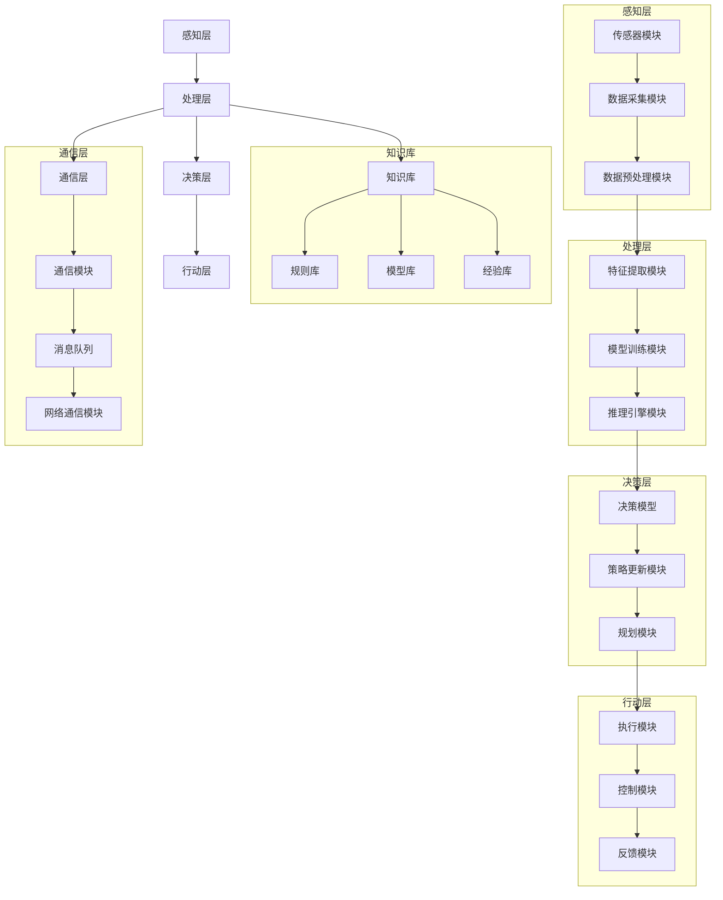

                 

### 1.1 问题背景

#### 1.1.1 人工智能的发展历程

人工智能（AI）这一领域自1950年代以来经历了多个阶段的发展。最初，人工智能的研究主要集中在符号主义方法，即通过编写规则和逻辑程序来实现智能行为。然而，这种方法在实际应用中面临巨大挑战，如复杂问题求解中的计算成本和知识表示的局限性。

随着1980年代的专家系统的兴起，人工智能研究进入了一个新的阶段。专家系统利用大量的专业知识和逻辑推理来模拟人类专家的决策过程，这一方法在医疗诊断、财务分析和工业控制等领域取得了显著成果。然而，专家系统的局限性在于其依赖于庞大的规则库和知识库，难以适应动态变化的环境。

1990年代，机器学习开始崭露头角，特别是基于统计学习的模型，如决策树、支持向量机和神经网络，极大地提高了AI系统的性能。这些方法不需要显式编程，而是通过从数据中学习规律来实现智能行为，使得人工智能在图像识别、语音识别和自然语言处理等领域取得了重大突破。

进入21世纪，随着大数据、云计算和深度学习的兴起，人工智能进入了新的黄金时期。深度学习模型，尤其是卷积神经网络（CNN）和循环神经网络（RNN），在图像识别、语音识别、自然语言处理等领域取得了前所未有的成功。这一阶段的人工智能研究，不仅解决了复杂问题求解中的计算效率问题，还通过数据驱动的方法实现了智能行为的自适应和学习能力。

#### 1.1.2 AI Agent的概念及其重要性

AI Agent，即人工智能代理，是一个具有自主决策和行动能力的智能体。它可以感知环境，通过学习、推理和规划来执行特定任务，从而实现智能自动化。AI Agent的概念在人工智能研究中具有重要意义，主要体现在以下几个方面：

首先，AI Agent是实现智能自动化的重要载体。在工业自动化、智能家居、智能交通等领域，AI Agent可以自主执行任务，提高生产效率和生活质量。

其次，AI Agent具有高度的灵活性和适应性。与传统的专家系统和规则系统不同，AI Agent可以不断学习和适应新环境，从而更好地应对复杂多变的现实世界。

再次，AI Agent具有高度的可扩展性。通过模块化设计，AI Agent可以灵活地集成多种人工智能技术，如机器学习、自然语言处理和计算机视觉，以实现更复杂的智能行为。

最后，AI Agent在人工智能领域具有重要的研究价值。研究AI Agent不仅可以帮助我们更好地理解智能的本质，还可以推动人工智能技术的创新和发展。

#### 1.1.3 抽象思维与概念形成能力的重要性

抽象思维是人类智能的核心特征之一，它允许我们摆脱具体事物的束缚，从更高层次上理解世界。抽象思维能力的提升，对于人工智能的发展具有重要意义。首先，抽象思维可以帮助AI Agent更好地理解和处理复杂问题，从而提高其智能水平。其次，抽象思维可以促进人工智能的创新和发展，为人工智能技术的进步提供新的思路和方法。

概念形成能力则是抽象思维的进一步延伸。它是指个体能够从多个具体事物中抽象出共同特征，形成新的概念。概念形成能力对于AI Agent的发展同样至关重要。通过概念形成，AI Agent可以更高效地理解和处理复杂信息，从而实现更高级的智能行为。

在实际应用中，具有抽象思维和概念形成能力的AI Agent可以在多个领域发挥重要作用。例如，在医疗诊断领域，AI Agent可以通过抽象思维和概念形成，从大量的医学数据中提取出有用的信息，从而辅助医生做出准确的诊断。在自动驾驶领域，AI Agent需要具备抽象思维和概念形成能力，以理解复杂的交通规则和场景，从而做出安全、高效的驾驶决策。

总之，抽象思维和概念形成能力对于AI Agent的发展至关重要。通过提升AI Agent的抽象思维和概念形成能力，我们可以构建出更智能、更高效的人工智能系统，从而推动人工智能技术的不断进步。

### 1.2 问题描述

#### 1.2.1 现有AI Agent的局限性

尽管AI Agent在各个领域取得了显著的成就，但其仍然存在一些局限性。首先，现有AI Agent主要依赖于大数据和深度学习模型，这使得它们在处理复杂问题时往往表现出局限性。具体来说，深度学习模型需要大量的训练数据和计算资源，这使得其在资源受限的环境中难以应用。此外，深度学习模型对数据的依赖性较高，一旦数据分布发生变化，模型的性能可能会显著下降。

其次，现有AI Agent的决策过程往往缺乏透明性和解释性。深度学习模型是一个“黑箱”，其内部的决策过程难以被理解和解释。这使得在实际应用中，人们很难信任AI Agent的决策结果。特别是在需要人类干预的领域，如医疗诊断和金融决策，缺乏透明性和解释性的AI Agent可能会带来严重的风险。

再次，现有AI Agent的适应性和灵活性不足。尽管AI Agent可以通过机器学习不断改进，但其对环境的适应能力仍然有限。在复杂多变的现实世界中，AI Agent难以迅速适应新的环境和任务需求。

最后，现有AI Agent在抽象思维和概念形成能力方面仍有很大的提升空间。抽象思维和概念形成是人类智能的核心特征，而现有AI Agent在这方面仍然表现出显著的不足。这使得AI Agent在理解和处理复杂问题时，往往只能依赖于具体的输入数据，而无法从更高层次上进行抽象和概括。

#### 1.2.2 开发具有抽象思维与概念形成能力的AI Agent的需求

为了克服现有AI Agent的局限性，开发具有抽象思维和概念形成能力的AI Agent显得尤为重要。这种新型AI Agent不仅能够更好地理解和处理复杂问题，还能够具备更高的适应性和灵活性。

首先，具有抽象思维和概念形成能力的AI Agent可以在处理复杂问题时表现出更强的能力。通过抽象思维，AI Agent可以从具体的输入数据中提取出更高层次的规律和模式。这有助于AI Agent在处理复杂、动态的问题时，能够更迅速地找到解决问题的方法。

其次，抽象思维和概念形成能力使得AI Agent能够更好地理解和解释其决策过程。通过概念形成，AI Agent可以将其对问题的理解转化为新的概念，从而使得其决策过程更加透明和可解释。这对于提高人类对AI Agent的信任度至关重要。

再次，具有抽象思维和概念形成能力的AI Agent在适应性和灵活性方面具有显著优势。通过抽象思维，AI Agent可以更灵活地适应新的环境和任务需求。这不仅有助于AI Agent在多变的环境中生存和繁衍，还能够提高其在实际应用中的价值。

最后，抽象思维和概念形成能力是推动AI Agent技术发展的重要动力。通过提升AI Agent的抽象思维和概念形成能力，我们可以构建出更智能、更高效的人工智能系统，从而推动人工智能技术的不断进步。

#### 1.2.3 本书的目标和结构

本书的目标是探讨如何开发具有抽象思维和概念形成能力的AI Agent，以克服现有AI Agent的局限性，推动人工智能技术的发展。具体目标如下：

1. **深入理解抽象思维和概念形成能力**：本书将详细探讨抽象思维和概念形成的原理，包括其定义、机制和影响因素，为后续研究提供理论基础。

2. **系统分析现有AI Agent的局限性**：本书将系统分析现有AI Agent的局限性，包括数据处理、决策透明性、适应性和灵活性等方面，为开发新型AI Agent提供现实依据。

3. **设计具有抽象思维和概念形成能力的AI Agent**：本书将介绍如何设计和实现具有抽象思维和概念形成能力的AI Agent，包括算法、实现方法和系统架构。

4. **案例分析与实际应用**：本书将通过具体案例，展示如何将抽象思维和概念形成能力应用于实际问题的解决，从而验证新型AI Agent的可行性和有效性。

本书的结构如下：

- **第一部分：引言**：介绍问题的背景、现有AI Agent的局限性以及开发新型AI Agent的需求和目标。

- **第二部分：核心概念与原理**：详细探讨抽象思维和概念形成的原理，包括定义、机制和影响因素，并分析其在AI Agent中的应用。

- **第三部分：算法与实现**：介绍抽象思维和概念形成算法的设计与实现，包括算法原理、数学模型和实现方法。

- **第四部分：系统分析与架构设计**：讨论人工智能系统的设计原则，AI Agent系统的功能设计、架构设计和接口设计。

- **第五部分：项目实战**：通过具体项目案例，展示如何实现具有抽象思维和概念形成能力的AI Agent，并进行实际应用分析。

通过本书的阅读，读者将能够深入理解抽象思维和概念形成能力，掌握设计和实现新型AI Agent的方法，并了解其在实际应用中的价值。

### 1.3 边界与外延

#### 1.3.1 AI Agent的边界

AI Agent，即人工智能代理，是一种能够感知环境、自主决策和执行任务的人工智能系统。其边界主要表现在以下几个方面：

首先，AI Agent的感知边界。AI Agent需要通过传感器或其他方式获取环境信息，这些信息包括图像、声音、文本等。感知边界决定了AI Agent对环境的感知能力，即其能够理解和处理的信号类型和复杂度。

其次，AI Agent的决策边界。AI Agent需要根据感知到的环境信息，通过学习、推理和规划来做出决策。决策边界涉及AI Agent的决策能力，包括决策的速度、准确性和灵活性。

再次，AI Agent的行动边界。AI Agent需要将决策转化为具体的行动，这些行动可能涉及物理动作、通信、控制等。行动边界决定了AI Agent在执行任务时的能力和限制。

最后，AI Agent的学习边界。AI Agent需要通过不断学习和适应新环境来提高其智能水平。学习边界涉及AI Agent的学习能力，包括学习速度、学习策略和学习效果。

#### 1.3.2 抽象思维与概念形成的边界

抽象思维与概念形成是AI Agent的核心能力之一，其边界主要表现在以下几个方面：

首先，抽象思维的边界。抽象思维是指从具体事物中提取出普遍规律和概念的能力。其边界涉及抽象思维的深度和广度，即AI Agent能够从多大规模和多层次的数据中提取出有效的抽象信息。

其次，概念形成的边界。概念形成是指从多个具体事物中抽象出共同特征，形成新的概念。其边界涉及概念形成的速度和准确性，即AI Agent能够在多快时间内形成准确的抽象概念。

再次，抽象思维与概念形成的交互边界。抽象思维和概念形成是相辅相成的，其边界涉及两者之间的协同作用。即AI Agent如何在抽象思维和概念形成之间进行有效的切换和结合，以实现更高层次的智能行为。

#### 1.3.3 抽象思维与概念形成的应用领域

抽象思维与概念形成在多个应用领域中具有广泛的应用前景，其边界主要体现在以下几个方面：

首先，在医疗诊断领域，抽象思维和概念形成能力可以帮助AI Agent从大量的医学数据中提取出关键信息，辅助医生做出准确的诊断。其边界涉及数据处理的复杂度和诊断的准确性。

其次，在自然语言处理领域，抽象思维和概念形成能力可以帮助AI Agent理解和生成更复杂的文本。其边界涉及对语言的理解深度和生成文本的自然度。

再次，在自动驾驶领域，抽象思维和概念形成能力可以帮助AI Agent理解和处理复杂的交通场景，做出安全、高效的驾驶决策。其边界涉及对交通规则的掌握程度和对环境的感知能力。

最后，在智能教育领域，抽象思维和概念形成能力可以帮助AI Agent为学生提供个性化的教育方案，提高学习效果。其边界涉及对学习内容的理解深度和对学生个性化需求的把握。

总的来说，抽象思维和概念形成在多个领域具有广泛的应用前景，其边界涉及对数据、语言、交通场景和学习内容的理解和处理能力。通过不断探索和提升这些边界，我们可以构建出更智能、更高效的人工智能系统。

### 1.4 概念结构与核心要素组成

#### 1.4.1 抽象思维的概念结构

抽象思维是人类智能的核心特征之一，其概念结构可以分解为以下几个方面：

首先，**抽象思维的基本概念**包括抽象和概括。抽象是指从具体事物中提取出共同特征的过程，概括是指将这些共同特征归纳为更一般的概念或原则。例如，从多种水果中提取出“水果”这一概念，就是一个抽象和概括的过程。

其次，**抽象思维的机制**包括联想、推理和模式识别。联想是指在不同事物之间建立联系，推理是指根据已知信息进行逻辑推理，模式识别是指从大量数据中识别出规律和模式。这些机制共同作用，使得AI Agent能够从具体事物中提取出更高层次的抽象信息。

再次，**抽象思维的影响因素**包括认知负荷、情境和先验知识。认知负荷是指个体在处理信息时所能承受的复杂度，情境是指个体所处的环境背景，先验知识是指个体已有的知识经验。这些因素会影响AI Agent的抽象思维能力，决定其能否有效提取和处理抽象信息。

#### 1.4.2 概念形成的概念结构

概念形成是指从多个具体事物中抽象出共同特征，形成新的概念。其概念结构可以分解为以下几个方面：

首先，**概念形成的步骤**包括感知、归纳、定义和验证。感知是指从具体事物中获取信息，归纳是指将多个具体事物中的共同特征抽象出来，定义是指用语言或符号将抽象出的共同特征表述出来，验证是指通过实际应用检验概念的准确性。

其次，**概念形成的方法**包括归纳法、演绎法和类比法。归纳法是从具体实例中归纳出一般规律，演绎法是从一般规律推导出具体结论，类比法是通过比较相似事物得出结论。这些方法共同作用，使得AI Agent能够有效地形成新的概念。

再次，**概念形成的理论基础**包括认知科学、心理学和哲学。认知科学提供了关于人类思维过程的科学解释，心理学研究了人类如何获取和处理信息，哲学探讨了概念形成的基本原理和逻辑结构。

#### 1.4.3 AI Agent的核心要素

AI Agent作为一种智能系统，其核心要素包括感知、决策、行动和学习。这些要素共同作用，使得AI Agent能够自主地适应和应对复杂环境。

首先，**感知**是AI Agent获取环境信息的重要途径。感知模块负责从环境中提取有用的信息，如视觉、听觉、触觉等。这些信息是AI Agent进行决策和行动的基础。

其次，**决策**是AI Agent的核心功能。AI Agent需要根据感知到的信息，通过学习、推理和规划来做出决策。决策模块负责确定AI Agent下一步的行动方案，以实现既定目标。

再次，**行动**是AI Agent对决策的执行。行动模块将决策转化为具体的操作，如移动、通信、控制等。通过行动，AI Agent能够直接影响环境，实现其目标。

最后，**学习**是AI Agent提升自身能力的重要手段。学习模块通过不断从环境中获取信息，更新和优化其知识库和决策模型，以适应新的环境和任务需求。

总之，AI Agent的核心要素包括感知、决策、行动和学习，这些要素相互配合，使得AI Agent能够自主地适应和应对复杂环境，实现智能自动化。

### 1.5 本章小结

本章首先介绍了问题的背景，包括人工智能的发展历程、AI Agent的概念及其重要性，以及抽象思维与概念形成能力的重要性。接着，本章提出了现有AI Agent的局限性，并阐述了开发具有抽象思维和概念形成能力的AI Agent的需求和目标。然后，本章讨论了AI Agent和抽象思维与概念形成的边界，以及它们在应用领域中的边界。最后，本章详细介绍了抽象思维和概念形成的概念结构，以及AI Agent的核心要素。通过本章的讨论，我们为后续章节的分析和设计提供了理论基础。

## 第二部分：核心概念与原理

### 2.1 抽象思维原理

#### 2.1.1 抽象思维的定义

抽象思维（Abstract Thinking）是一种高级认知过程，它涉及到从具体事物中提取出本质属性和普遍规律的能力。抽象思维不是直接感知具体事物，而是通过逻辑推理和概念形成来理解和处理信息。这种思维方式使我们能够超越具体的感官体验，从更宏观和更抽象的层次上看待和解决问题。

在人工智能领域，抽象思维被看作是构建智能系统的基础能力之一。它使得AI Agent能够从复杂、多变的环境中提取出有用的信息，形成对问题的深刻理解，从而做出更有效的决策。

#### 2.1.2 抽象思维的机制

抽象思维的机制主要包括以下几个步骤：

1. **感知与识别**：首先，AI Agent需要感知和理解其所在的环境。感知过程涉及从各种传感器中获取信息，如视觉、听觉、触觉等。识别过程则是将感知到的信息与先验知识进行匹配，识别出重要的特征和模式。

2. **信息提取**：在感知和识别的基础上，AI Agent需要从大量信息中提取出关键的、有用的信息。这一过程涉及到对数据的筛选和过滤，以去除无关的信息，突出关键特征。

3. **抽象化**：提取关键信息后，AI Agent需要将这些信息进行抽象化处理。抽象化是将具体的事物和现象转化为更一般、更抽象的概念或模型。这一过程通常涉及到从多个具体实例中归纳出共同的特征和规律。

4. **概念形成**：在抽象化的基础上，AI Agent需要形成新的概念。概念形成是将提取出的共同特征归纳为一个整体，并用符号或语言表达出来。这一过程通常涉及到类比、归纳和演绎等逻辑推理方法。

5. **逻辑推理**：最后，AI Agent需要利用抽象概念进行逻辑推理，以解决问题或做出决策。逻辑推理是一种基于概念和规则进行推理的过程，它使得AI Agent能够从已知的信息中推导出新的结论。

#### 2.1.3 抽象思维的影响因素

抽象思维的效果受到多种因素的影响：

1. **认知负荷**：认知负荷是指个体在处理信息时所能承受的复杂度。高认知负荷会降低抽象思维的效果，因为个体难以同时处理过多的信息。

2. **情境**：情境是指个体所处的环境背景。不同的情境会对抽象思维产生不同的影响，例如，一个在实验室环境中训练的AI Agent可能在现实世界中难以有效应用其学到的抽象思维技能。

3. **先验知识**：先验知识是指个体已有的知识经验。丰富的先验知识有助于提高抽象思维的效果，因为它们为抽象化提供了更多的参考和依据。

4. **情绪状态**：情绪状态也会影响抽象思维。积极的情绪状态有助于提高抽象思维的效果，而消极的情绪状态可能会降低其效果。

通过理解抽象思维的机制和影响因素，我们可以更好地设计和发展具有抽象思维能力的AI Agent。这些机制和影响因素不仅对AI Agent的设计和实现有重要指导意义，也为人工智能理论的研究提供了新的方向。

### 2.2 概念形成原理

#### 2.2.1 概念形成的定义

概念形成（Concept Formation）是指个体从多个具体事物中抽象出共同特征，形成新的概念的过程。在人工智能领域，概念形成是构建智能系统的重要能力之一，它使得AI Agent能够从具体的数据或经验中提取出更一般、更抽象的知识，从而更好地理解和应对复杂环境。

概念形成的定义可以从以下几个方面进行阐述：

1. **共同特征提取**：概念形成的第一步是从多个具体事物中提取出共同特征。这些共同特征是概念的核心内容，它们使得不同的事物或现象可以被归为一个类别。

2. **抽象化**：提取出共同特征后，个体需要将这些特征进行抽象化处理，形成一个更高层次的、更一般的概念。抽象化是将具体的事物和现象转化为更一般的概念或模型，从而实现从具体到抽象的转换。

3. **符号表达**：形成抽象概念后，个体需要用语言或符号将这些概念表达出来。符号表达是概念形成的重要步骤，它使得抽象概念可以被传递、存储和利用。

4. **认知整合**：最后，个体需要将新的概念整合到已有的知识体系中，以便更好地理解和应用。认知整合是将新的概念与现有的知识进行融合，从而形成更加丰富和完整的知识体系。

#### 2.2.2 概念形成的步骤

概念形成的过程可以分解为以下几个步骤：

1. **感知与识别**：首先，个体需要通过感知和识别来获取具体事物的信息。感知过程涉及从各种感官中获取信息，如视觉、听觉、触觉等。识别过程则是将这些感知到的信息与先验知识进行匹配，识别出重要的特征和模式。

2. **信息筛选与整合**：在获取到大量信息后，个体需要对这些信息进行筛选和整合，以提取出关键特征。这一过程涉及到对数据的过滤和筛选，以去除无关的信息，突出关键特征。

3. **抽象化**：提取出关键特征后，个体需要将这些特征进行抽象化处理，形成一个更高层次的、更一般的概念。抽象化是将具体的事物和现象转化为更一般的概念或模型，从而实现从具体到抽象的转换。

4. **概念定义**：在抽象化的基础上，个体需要对抽象出的概念进行定义。概念定义是用语言或符号来表述抽象概念，从而明确其含义和范围。

5. **验证与应用**：最后，个体需要通过验证和应用来检验概念的有效性和适用性。验证过程涉及将概念应用于新的情境中，检验其能否有效解释新的现象。应用过程则是指在实际环境中使用概念，以验证其价值。

#### 2.2.3 概念形成的理论

概念形成的理论主要包括以下几个方面的内容：

1. **认知发展理论**：认知发展理论认为，个体的概念形成能力是随着认知发展而逐渐提高的。在儿童的发展过程中，概念形成是认知发展的一个重要方面。皮亚杰的认知发展阶段理论提供了关于个体如何通过感知、认知和行动来形成概念的理论框架。

2. **信息加工理论**：信息加工理论认为，概念形成是大脑信息加工过程的一个环节。该理论强调，个体在感知和识别信息时，会利用已有的知识经验对信息进行加工和处理，从而形成新的概念。

3. **类比学习理论**：类比学习理论认为，个体可以通过类比现有概念来形成新概念。类比学习涉及到将新的问题与已有的知识体系进行类比，从而提取出新的概念。这一理论在人工智能领域有着广泛的应用，特别是在机器学习和自然语言处理中。

4. **语义网络理论**：语义网络理论认为，概念是知识体系中的一个节点，与其他概念通过关系进行连接。语义网络可以表示概念之间的复杂关系，从而帮助个体更好地理解和应用概念。

通过理解概念形成的定义、步骤和理论，我们可以更好地设计和发展具有概念形成能力的AI Agent。这些理论不仅为AI Agent的设计和实现提供了指导，也为人工智能领域的研究提供了新的思路。

### 2.3 AI Agent的核心原理

#### 2.3.1 AI Agent的定义

AI Agent，即人工智能代理，是一个具备感知、决策、行动和学习能力的人工智能系统。它能够通过自主感知环境、自主决策和执行任务，以实现特定目标。AI Agent的定义可以从以下几个方面进行阐述：

1. **感知能力**：AI Agent需要具备从环境中获取信息的能力，这些信息可以是视觉、听觉、触觉等传感器收集到的数据。感知能力是AI Agent获取外界信息、了解环境状态的基础。

2. **决策能力**：AI Agent需要根据感知到的信息，通过学习、推理和规划，自主做出决策。决策能力是AI Agent实现目标的关键，它使得AI Agent能够根据不同的环境和任务需求，灵活调整其行为策略。

3. **行动能力**：AI Agent需要将决策转化为具体的行动，这些行动可以是物理动作、通信或控制等。行动能力是AI Agent实现目标的重要手段，它使得AI Agent能够直接对环境产生影响。

4. **学习能力**：AI Agent需要具备通过学习不断优化自身行为和知识库的能力。学习能力是AI Agent适应环境变化、提高自身性能的关键，它使得AI Agent能够从经验中学习，实现自我进化。

5. **自主性**：AI Agent需要具备一定的自主性，能够独立完成任务，而不依赖于外部指令。自主性是AI Agent区别于传统自动化系统的重要特征，它使得AI Agent能够在复杂多变的现实环境中自主运作。

#### 2.3.2 AI Agent的组成

AI Agent的组成可以分解为以下几个关键模块：

1. **感知模块**：感知模块负责从环境中获取信息。它通过传感器收集视觉、听觉、触觉等数据，并将这些数据传输给其他模块进行处理。

2. **决策模块**：决策模块负责根据感知模块提供的信息，通过学习、推理和规划，生成行动方案。决策模块是AI Agent的核心，它决定了AI Agent的行为策略。

3. **行动模块**：行动模块负责将决策模块生成的行动方案转化为具体的行动。行动模块可以执行物理动作、发送通信信号或执行控制命令，以实现AI Agent的目标。

4. **学习模块**：学习模块负责通过不断学习优化AI Agent的行为和知识库。学习模块可以从感知到的数据、执行的任务和反馈信息中提取经验，从而提高AI Agent的性能。

5. **知识库**：知识库是AI Agent存储和利用知识的数据库。知识库包含了AI Agent在不同任务和情境中的经验、规则和模型，是AI Agent进行决策和行动的重要依据。

6. **通信模块**：通信模块负责与其他AI Agent或人类进行信息交换。它使得AI Agent能够在更广泛的环境中协同工作，共享信息和资源。

#### 2.3.3 AI Agent的功能

AI Agent的功能可以归纳为以下几个方面：

1. **目标导向的任务执行**：AI Agent能够根据预设的目标，自主执行任务。它可以在复杂多变的现实环境中，灵活调整行动策略，以实现既定目标。

2. **环境感知与建模**：AI Agent能够通过感知模块获取环境信息，并对环境进行建模。这种建模能力使得AI Agent能够更好地理解和预测环境变化，为决策提供依据。

3. **自主决策**：AI Agent能够根据感知到的信息和已有的知识库，通过决策模块自主做出决策。这种自主决策能力使得AI Agent能够应对复杂、动态的环境。

4. **自适应学习**：AI Agent能够通过学习模块，从执行任务的经验中不断学习，优化自身行为和知识库。这种自适应学习能力使得AI Agent能够持续提升其性能。

5. **协同工作**：AI Agent能够通过通信模块与其他AI Agent或人类进行信息交换，协同完成复杂的任务。这种协同工作能力使得AI Agent能够在更广泛的应用场景中发挥作用。

通过理解AI Agent的定义、组成和功能，我们可以更好地设计和实现具有抽象思维和概念形成能力的AI Agent，以应对复杂多变的现实世界。

### 2.4 抽象思维与概念形成在AI Agent中的应用

#### 2.4.1 抽象思维与概念形成对AI Agent的影响

抽象思维与概念形成能力的引入，对AI Agent的性能和功能产生了深远的影响。首先，抽象思维使得AI Agent能够从具体的数据和情境中提取出更高层次的规律和模式，从而提高其理解问题的深度和广度。具体来说，抽象思维有助于AI Agent：

1. **优化决策过程**：通过抽象思维，AI Agent可以从大量数据中提取出关键特征和规律，简化问题复杂度，从而提高决策过程的效率和准确性。

2. **提高适应性**：抽象思维使得AI Agent能够更好地适应新的环境和任务，因为它能够从具体情境中提取出一般性的规律和原则，从而在不同情境下灵活应用。

3. **增强解释性**：抽象思维使得AI Agent的决策过程更加透明和可解释，因为它能够将决策过程分解为一系列逻辑推理和抽象概念，从而便于人类理解和验证。

概念形成能力则使得AI Agent能够从多个具体事物中抽象出共同特征，形成新的概念，从而提高其理解和应对复杂问题的能力。具体来说，概念形成能力有助于AI Agent：

1. **增强知识表示**：通过概念形成，AI Agent能够将具体的数据和经验转化为更一般、更抽象的概念，从而增强其知识表示能力，提高知识库的利用率。

2. **优化任务分配**：概念形成使得AI Agent能够根据任务的抽象特征，自动选择和分配最合适的资源，从而提高任务执行效率。

3. **提高学习速度**：通过概念形成，AI Agent能够从已有的概念中快速推导出新概念，从而加速学习过程，提高知识更新和优化的速度。

#### 2.4.2 抽象思维与概念形成在AI Agent中的实现

要在AI Agent中实现抽象思维与概念形成能力，需要从算法设计、系统架构和数据处理等方面进行综合考虑。以下是一些关键的实现方法：

1. **抽象思维算法**：
   - **特征提取**：使用特征提取算法，如主成分分析（PCA）、自动编码器（Autoencoder）等，从原始数据中提取出关键特征，简化数据维度。
   - **抽象化**：使用聚类、降维等方法，将提取出的特征进一步抽象化为更一般的概念或模型，从而提高数据的表示层次。
   - **逻辑推理**：利用逻辑推理算法，如基于规则的推理、贝叶斯网络等，对抽象概念进行推理，从而实现更高层次的决策和预测。

2. **概念形成算法**：
   - **归纳学习**：使用归纳学习算法，如决策树、支持向量机等，从多个具体实例中归纳出共同特征，形成新的概念。
   - **类比学习**：利用类比学习算法，如基于特征的类比、基于结构的类比等，将新问题与已有知识进行类比，从而快速形成新概念。
   - **语义网络**：构建语义网络，将概念之间的复杂关系进行表示，从而支持概念的形成和推理。

3. **系统架构**：
   - **模块化设计**：将AI Agent分解为感知、决策、行动和学习等模块，每个模块都可以独立开发、测试和部署，从而提高系统的灵活性和可维护性。
   - **分布式计算**：利用分布式计算框架，如Apache Spark、Hadoop等，处理大规模数据，提高抽象思维和概念形成算法的效率。
   - **多模态感知**：结合多种传感器数据，如视觉、听觉、触觉等，提高AI Agent对环境的感知能力和抽象思维能力。

4. **数据处理**：
   - **数据预处理**：使用数据清洗、归一化等技术，提高数据质量，为抽象思维和概念形成算法提供高质量的数据输入。
   - **数据集成**：整合不同来源的数据，如结构化数据、非结构化数据等，为AI Agent提供更丰富的信息来源。
   - **数据可视化**：利用数据可视化技术，如热力图、散点图等，帮助人类更好地理解和分析抽象思维和概念形成的结果。

通过上述实现方法，我们可以构建出具有抽象思维和概念形成能力的AI Agent，从而在复杂多变的环境中实现高效、智能的决策和行动。

#### 2.4.3 抽象思维与概念形成的案例分析

为了更直观地理解抽象思维与概念形成在AI Agent中的应用，我们通过以下案例分析：

**案例一：智能医疗诊断系统**

在医疗诊断领域，AI Agent需要从大量的医学数据中提取出关键信息，以辅助医生做出准确的诊断。通过抽象思维和概念形成，AI Agent可以：

1. **特征提取**：从患者的病历、检查报告、历史诊断结果等数据中提取出关键特征，如病症名称、病情程度、并发症等。
2. **抽象化**：将提取出的关键特征进行抽象化处理，形成如“病情严重程度”、“治疗方案”等更高层次的概念。
3. **概念形成**：通过归纳学习和类比学习，AI Agent可以形成针对不同病情的诊疗方案，并不断优化这些方案。

**案例二：智能交通管理系统**

在智能交通管理中，AI Agent需要处理大量的交通数据，如车辆流量、路况信息、交通信号等，以实现交通流量的最优调控。通过抽象思维和概念形成，AI Agent可以：

1. **特征提取**：从交通数据中提取出关键特征，如高峰时段、拥堵路段、事故频发地点等。
2. **抽象化**：将提取出的特征抽象化为如“交通流量状态”、“交通风险等级”等概念。
3. **概念形成**：通过归纳学习和类比学习，AI Agent可以形成如“最优交通信号调控策略”、“事故预警机制”等概念，从而优化交通管理。

**案例三：智能教育系统**

在智能教育领域，AI Agent需要根据学生的学习情况和需求，提供个性化的学习方案。通过抽象思维和概念形成，AI Agent可以：

1. **特征提取**：从学生的学习数据中提取出关键特征，如学习进度、知识掌握程度、学习偏好等。
2. **抽象化**：将提取出的特征抽象化为如“学习效果评估”、“个性化学习方案”等概念。
3. **概念形成**：通过归纳学习和类比学习，AI Agent可以形成如“学习路径规划”、“个性化辅导策略”等概念，从而提供更有效的学习支持。

通过以上案例分析，我们可以看到，抽象思维与概念形成在AI Agent中的应用，不仅提高了AI Agent的理解和决策能力，还大大拓展了其在各个领域的应用前景。这些案例展示了抽象思维和概念形成在现实世界中的巨大潜力，为我们设计和实现更智能、更高效的AI Agent提供了宝贵的经验和启示。

### 2.5 本章小结

本章深入探讨了抽象思维与概念形成在AI Agent中的应用。首先，我们分析了抽象思维的定义、机制和影响因素，以及概念形成的定义、步骤和理论。接着，我们讨论了抽象思维与概念形成对AI Agent的影响，并介绍了在AI Agent中实现抽象思维和概念形成的方法。最后，通过具体案例分析，展示了抽象思维和概念形成在现实世界中的应用效果。通过本章的学习，读者可以更好地理解抽象思维与概念形成的重要性，以及如何在AI Agent中有效应用这些能力。

### 3.1 抽象思维算法

#### 3.1.1 抽象思维算法的介绍

抽象思维算法是人工智能领域中用于模拟人类抽象思维过程的一类算法。这些算法通过提取、组织和整合信息，帮助AI Agent从具体的数据中提取出更高层次的规律和模式。抽象思维算法在图像识别、自然语言处理、决策支持系统等领域有着广泛的应用。

在本节中，我们将介绍几种常见的抽象思维算法，包括特征提取算法、聚类算法和降维算法。这些算法在提高AI Agent的抽象思维能力方面具有重要作用。

#### 3.1.2 抽象思维算法的原理

1. **特征提取算法**：

   特征提取算法的核心思想是从原始数据中提取出对任务目标有显著影响的特征，从而简化问题复杂度。常见的特征提取算法包括主成分分析（PCA）、线性判别分析（LDA）和自动编码器（Autoencoder）。

   - **PCA**：PCA通过将数据投影到主成分空间，保留数据的主要信息，从而降低数据维度。PCA算法的原理是基于协方差矩阵，通过计算数据点之间的相似性，找出数据的最大方差方向，将数据投影到这些方向上。

   - **LDA**：LDA是一种基于分类问题的特征提取算法，其目标是找到一组线性变换，使得变换后的特征能够最大化类间差异，最小化类内差异。LDA算法通过求解特征空间的权重向量，使得不同类别的数据点在变换后更加分离。

   - **自动编码器**：自动编码器是一种无监督学习算法，其目标是学习一个编码器和解码器，将输入数据压缩为低维特征表示，然后再将这些特征表示还原为原始数据。自动编码器的训练过程涉及最小化输入与重构输出之间的差异，从而提取出对输入数据有显著影响的特征。

2. **聚类算法**：

   聚类算法是一种无监督学习方法，用于将数据点分组，使得同一组内的数据点彼此相似，而不同组的数据点之间差异较大。聚类算法可以帮助AI Agent发现数据中的隐含结构，从而实现数据的分类和分组。

   - **K均值聚类**：K均值聚类是一种经典的聚类算法，其原理是通过选择K个初始中心点，计算每个数据点到这些中心点的距离，并将其分配到最近的中心点所属的聚类。随后，更新中心点，重复此过程，直到聚类中心点不再发生变化。

   - **层次聚类**：层次聚类是一种基于层次结构的聚类算法，其原理是通过逐步合并相似的数据点，构建出一棵层次聚类树。层次聚类可以分为自底向上的凝聚层次聚类和自顶向下的分裂层次聚类。

   - **基于密度的聚类**：基于密度的聚类算法，如DBSCAN（Density-Based Spatial Clustering of Applications with Noise），其原理是通过检测数据点的高密度区域，将数据点划分为不同的聚类。DBSCAN算法通过定义邻域和密度连接性，识别出数据点之间的紧密连接关系。

3. **降维算法**：

   降维算法是一种通过减少数据维度，降低计算复杂度的方法。常见的降维算法包括主成分分析（PCA）、线性判别分析（LDA）和自编码器。

   - **PCA**：PCA通过将数据投影到主成分空间，保留数据的主要信息，从而降低数据维度。PCA算法基于协方差矩阵，通过计算数据点之间的相似性，找出数据的最大方差方向，将数据投影到这些方向上。

   - **LDA**：LDA是一种基于分类问题的特征提取算法，其目标是找到一组线性变换，使得变换后的特征能够最大化类间差异，最小化类内差异。LDA算法通过求解特征空间的权重向量，使得不同类别的数据点在变换后更加分离。

   - **自编码器**：自编码器是一种无监督学习算法，其目标是学习一个编码器和解码器，将输入数据压缩为低维特征表示，然后再将这些特征表示还原为原始数据。自编码器的训练过程涉及最小化输入与重构输出之间的差异，从而提取出对输入数据有显著影响的特征。

通过理解这些抽象思维算法的原理，我们可以为AI Agent的设计和实现提供有力的技术支持。这些算法不仅有助于提高AI Agent的抽象思维能力，还能够简化复杂问题，提高系统的效率和准确性。

#### 3.1.3 抽象思维算法的实现

为了更好地理解抽象思维算法的实现，我们将通过一个具体的例子来展示这些算法的代码实现和效果。

**示例：使用PCA进行特征提取**

假设我们有一个包含1000个样本的数据集，每个样本有10个特征。我们的目标是使用PCA算法提取出前两个主成分，并分析这些主成分对数据的影响。

首先，我们导入所需的库，并加载数据：

```python
import numpy as np
from sklearn.decomposition import PCA
from sklearn.preprocessing import StandardScaler

# 加载数据
data = np.load('data.npy')  # 假设数据存储在 'data.npy' 文件中
```

接下来，我们对数据进行标准化处理，以便PCA算法能够更好地工作：

```python
# 数据标准化
scaler = StandardScaler()
data_std = scaler.fit_transform(data)
```

然后，我们使用PCA算法提取前两个主成分：

```python
# PCA提取前两个主成分
pca = PCA(n_components=2)
data_pca = pca.fit_transform(data_std)
```

提取主成分后，我们可以绘制前两个主成分的空间分布，以便直观地分析数据：

```python
import matplotlib.pyplot as plt

# 绘制前两个主成分的空间分布
plt.figure(figsize=(8, 6))
plt.scatter(data_pca[:, 0], data_pca[:, 1], c=data[:, 0], cmap='viridis')
plt.xlabel('First Principal Component')
plt.ylabel('Second Principal Component')
plt.title('PCA of the Data')
plt.colorbar(label='Feature 1')
plt.show()
```

在这个例子中，我们可以看到前两个主成分将数据点分为几个明显的聚类。这表明PCA算法成功地提取出了数据的主要信息，并降低了数据维度。

**示例：使用K均值聚类进行数据分组**

假设我们有一个包含50个样本的数据集，每个样本有3个特征。我们的目标是使用K均值聚类算法将数据分为3个聚类。

首先，我们导入所需的库，并加载数据：

```python
import numpy as np
from sklearn.cluster import KMeans

# 加载数据
data = np.load('data.npy')  # 假设数据存储在 'data.npy' 文件中
```

接下来，我们使用K均值聚类算法对数据进行聚类：

```python
# K均值聚类
kmeans = KMeans(n_clusters=3, random_state=0).fit(data)
labels = kmeans.labels_
centroids = kmeans.cluster_centers_
```

然后，我们可以绘制聚类结果，以便直观地分析聚类效果：

```python
# 绘制聚类结果
plt.figure(figsize=(8, 6))
colors = ['r', 'g', 'b']
for i in range(3):
    plt.scatter(data[labels == i, 0], data[labels == i, 1], s=100, c=colors[i], label=f'Cluster {i}')
plt.scatter(centroids[:, 0], centroids[:, 1], s=300, c='yellow', label='Centroids', marker='s')
plt.xlabel('Feature 1')
plt.ylabel('Feature 2')
plt.title('K-Means Clustering')
plt.legend()
plt.show()
```

在这个例子中，我们可以看到K均值聚类算法成功地找到了3个聚类中心，并将数据点分配到这些中心所属的聚类中。

通过以上示例，我们展示了如何使用Python实现抽象思维算法，并分析了这些算法的实际效果。这些算法不仅提高了AI Agent的抽象思维能力，还简化了复杂问题，为AI Agent的设计和实现提供了有力的技术支持。

### 3.2 概念形成算法

#### 3.2.1 概念形成算法的介绍

概念形成算法是人工智能领域中用于模拟人类概念形成过程的一类算法。这些算法通过从多个具体事物中提取共同特征，形成新的概念，从而提高AI Agent对复杂问题的理解能力。概念形成算法在知识表示、决策支持、自然语言处理等领域具有重要应用。

在本节中，我们将介绍几种常见的概念形成算法，包括归纳学习算法、类比学习算法和语义网络算法。这些算法在帮助AI Agent形成新概念方面具有重要作用。

#### 3.2.2 概念形成算法的原理

1. **归纳学习算法**：

   归纳学习算法是一种基于经验从具体实例中归纳出一般规律的方法。常见的归纳学习算法包括决策树、支持向量机和神经网络。

   - **决策树**：决策树通过一系列的判断节点和叶子节点来表示决策过程。每个节点表示一个特征，每个分支表示该特征的不同取值。叶子节点表示最终的决策结果。决策树算法通过递归划分数据集，将具有相似特征的数据点归并为同一类别。

   - **支持向量机**：支持向量机是一种基于最大化边际的分类算法。它的目标是在特征空间中找到一个超平面，使得不同类别的数据点在超平面两侧尽可能分开。支持向量机通过求解优化问题，找到最优的超平面，并将其应用到新数据点的分类中。

   - **神经网络**：神经网络是一种通过多层神经元进行信息处理的模型。它的基本原理是通过反向传播算法，不断调整神经元的权重，使模型能够更好地拟合训练数据。神经网络可以用来进行分类、回归等多种任务，其复杂的网络结构使其能够提取出更高层次的特征和概念。

2. **类比学习算法**：

   类比学习算法是通过将新问题与已有知识进行类比，从而快速形成新概念的方法。常见的类比学习算法包括基于特征的类比、基于结构的类比和基于语义的类比。

   - **基于特征的类比**：基于特征的类比通过比较新问题和已有知识之间的特征差异，快速形成新概念。这种方法通常用于解决相似问题的领域，如基于已有医疗诊断规则快速生成新的诊断规则。

   - **基于结构的类比**：基于结构的类比通过比较新问题和已有知识之间的结构关系，快速形成新概念。这种方法通常用于解决复杂系统的设计问题，如基于已有建筑设计快速生成新的建筑方案。

   - **基于语义的类比**：基于语义的类比通过比较新问题和已有知识之间的语义关系，快速形成新概念。这种方法通常用于自然语言处理领域，如基于已有文本生成新的文本。

3. **语义网络算法**：

   语义网络算法通过构建概念之间的复杂关系，来帮助AI Agent形成新概念。常见的语义网络算法包括基于框架的语义网络和基于语义角色的语义网络。

   - **基于框架的语义网络**：基于框架的语义网络通过定义一系列框架和角色，来表示知识和概念之间的关系。框架中的每个角色都可以被具体的事物所占据，从而形成丰富的语义关系。

   - **基于语义角色的语义网络**：基于语义角色的语义网络通过定义语义角色和关系，来表示知识和概念之间的关系。语义角色通常与动作或事件相关，通过连接不同的语义角色，可以构建出复杂的语义网络。

通过理解这些概念形成算法的原理，我们可以为AI Agent的设计和实现提供有力的技术支持。这些算法不仅能够帮助AI Agent从具体实例中归纳出一般规律，还能通过类比学习和语义网络构建，提高AI Agent对复杂问题的理解和解决能力。

#### 3.2.3 概念形成算法的实现

为了更好地理解概念形成算法的实现，我们将通过具体的Python代码示例，展示这些算法在实际应用中的效果。

**示例：使用决策树进行概念形成**

假设我们有一个包含10个特征的数据集，每个样本表示一个客户的购买行为，我们希望通过决策树算法提取出不同购买行为的特征，形成不同的购买行为概念。

首先，我们导入所需的库，并加载数据：

```python
import numpy as np
from sklearn.datasets import load_iris
from sklearn.tree import DecisionTreeClassifier
from sklearn.model_selection import train_test_split

# 加载数据
iris = load_iris()
X = iris.data
y = iris.target

# 划分训练集和测试集
X_train, X_test, y_train, y_test = train_test_split(X, y, test_size=0.3, random_state=42)
```

接下来，我们使用决策树算法对训练数据进行训练，并使用测试数据进行评估：

```python
# 训练决策树模型
clf = DecisionTreeClassifier(random_state=42)
clf.fit(X_train, y_train)

# 预测测试集
y_pred = clf.predict(X_test)

# 计算准确率
accuracy = np.mean(y_pred == y_test)
print(f"Accuracy: {accuracy:.2f}")
```

然后，我们可以绘制决策树的结构，以便直观地分析其分类过程：

```python
from sklearn.tree import plot_tree
import matplotlib.pyplot as plt

# 绘制决策树
plt.figure(figsize=(12, 12))
plot_tree(clf, filled=True, feature_names=iris.feature_names, class_names=iris.target_names)
plt.show()
```

在这个例子中，我们可以看到决策树算法成功地提取出了不同购买行为的特征，并将客户划分为不同的购买行为概念。

**示例：使用神经网络进行概念形成**

假设我们有一个包含5个特征的数据集，每个样本表示一个股票价格，我们希望通过神经网络算法提取出股票价格的趋势，形成不同的股票价格概念。

首先，我们导入所需的库，并加载数据：

```python
import numpy as np
from sklearn.datasets import make_classification
from sklearn.model_selection import train_test_split
from tensorflow.keras.models import Sequential
from tensorflow.keras.layers import Dense
from tensorflow.keras.optimizers import Adam

# 生成数据
X, y = make_classification(n_samples=1000, n_features=5, n_classes=2, random_state=42)

# 划分训练集和测试集
X_train, X_test, y_train, y_test = train_test_split(X, y, test_size=0.3, random_state=42)
```

接下来，我们使用神经网络对训练数据进行训练，并使用测试数据进行评估：

```python
# 创建神经网络模型
model = Sequential()
model.add(Dense(64, input_dim=5, activation='relu'))
model.add(Dense(32, activation='relu'))
model.add(Dense(1, activation='sigmoid'))

# 编译模型
model.compile(loss='binary_crossentropy', optimizer=Adam(), metrics=['accuracy'])

# 训练模型
model.fit(X_train, y_train, epochs=10, batch_size=32, validation_data=(X_test, y_test))

# 评估模型
loss, accuracy = model.evaluate(X_test, y_test)
print(f"Accuracy: {accuracy:.2f}")
```

然后，我们可以绘制神经网络的学习曲线，以便直观地分析其学习过程：

```python
import matplotlib.pyplot as plt

# 绘制学习曲线
history = model.fit(X_train, y_train, epochs=10, batch_size=32, validation_data=(X_test, y_test), verbose=0)
plt.plot(history.history['accuracy'], label='accuracy')
plt.plot(history.history['val_accuracy'], label='val_accuracy')
plt.xlabel('Epoch')
plt.ylabel('Accuracy')
plt.legend()
plt.show()
```

在这个例子中，我们可以看到神经网络算法成功地提取出了股票价格的趋势，并将股票价格划分为不同的概念。

通过以上示例，我们展示了如何使用Python实现概念形成算法，并分析了这些算法的实际效果。这些算法不仅能够帮助AI Agent从具体实例中归纳出一般规律，还能通过类比学习和语义网络构建，提高AI Agent对复杂问题的理解和解决能力。

### 3.3 AI Agent算法

#### 3.3.1 AI Agent算法的介绍

AI Agent算法是用于模拟和实现AI Agent自主决策、行动和学习能力的一类算法。这些算法在感知、决策、行动和学习模块中发挥作用，使得AI Agent能够适应复杂多变的环境，实现智能自动化。在本节中，我们将介绍几种常见的AI Agent算法，包括Q学习、强化学习和遗传算法。

#### 3.3.2 AI Agent算法的原理

1. **Q学习算法**：

   Q学习算法是一种基于值函数的强化学习算法，其核心思想是通过在状态-动作对上学习一个值函数Q(s, a)，从而选择最优动作。Q学习算法的原理如下：

   - **状态-动作价值函数**：Q学习算法通过定义一个值函数Q(s, a)，表示在状态s下执行动作a所能获得的预期回报。值函数Q(s, a)是学习过程中的核心，它决定了AI Agent的决策策略。
   - **更新策略**：Q学习算法通过不断更新值函数Q(s, a)，使得AI Agent能够逐渐找到最优动作。更新策略通常基于样本经验，通过经验回放和探索策略（如ε-贪心策略）来平衡探索和利用。
   - **学习过程**：Q学习算法通过迭代学习，不断更新值函数Q(s, a)，使得AI Agent在经历多次状态转移后，能够找到最优的动作选择策略。

2. **强化学习算法**：

   强化学习算法是一种通过与环境交互来学习最优策略的机器学习算法。其核心思想是通过奖励信号来指导AI Agent的学习过程。强化学习算法的原理如下：

   - **智能体（Agent）**：强化学习中的智能体是执行动作并接收环境反馈的实体。智能体需要通过学习找到一个策略π，使得其在执行动作时能够最大化累计奖励。
   - **环境（Environment）**：环境是智能体所处的现实世界。环境会根据智能体的动作生成新的状态，并给予智能体相应的奖励或惩罚。
   - **状态（State）**：状态是智能体在环境中的位置和特征描述。状态是智能体决策的依据，不同的状态可能对应不同的动作和奖励。
   - **动作（Action）**：动作是智能体在状态下的行为选择。动作的选择策略决定了智能体的行为模式。
   - **奖励（Reward）**：奖励是环境对智能体动作的反馈信号，用于指导智能体的学习过程。奖励可以是正的（鼓励智能体继续执行该动作）或负的（惩罚智能体执行该动作）。

3. **遗传算法**：

   遗传算法是一种基于自然选择和遗传机制的优化算法，其核心思想是通过迭代进化来搜索最优解。遗传算法的原理如下：

   - **种群（Population）**：遗传算法通过初始化一个种群，每个个体代表一个可能的解。种群中的个体通过基因编码表示，每个基因代表解的某个特征。
   - **适应度函数（Fitness Function）**：适应度函数是评估个体优劣的标准，用于指导遗传算法的搜索方向。适应度函数通常与问题的目标函数相关，目标是最大化或最小化适应度函数。
   - **选择（Selection）**：选择过程用于从当前种群中选择出适应度较高的个体，以产生下一代种群。选择过程通常基于适应度比例，即适应度越高的个体被选中的概率越大。
   - **交叉（Crossover）**：交叉过程用于从两个父代个体中生成新的子代个体，通过组合父代的基因来产生具有不同特征的个体。
   - **变异（Mutation）**：变异过程用于在子代个体中引入随机变化，以增加种群的多样性。变异可以防止算法陷入局部最优，促进全局搜索。

通过理解这些AI Agent算法的原理，我们可以为AI Agent的设计和实现提供有力的技术支持。这些算法不仅能够帮助AI Agent在复杂环境中进行决策和行动，还能通过不断学习和进化，提高AI Agent的智能水平。

#### 3.3.3 AI Agent算法的实现

为了更好地理解AI Agent算法的实现，我们将通过具体的Python代码示例，展示这些算法在实际应用中的效果。

**示例：使用Q学习算法**

假设我们有一个简单的环境，其中AI Agent需要从状态S0转移到状态S1，我们希望通过Q学习算法找到最优的动作策略。

首先，我们导入所需的库，并初始化环境和Q值表：

```python
import numpy as np
import random

# 初始化环境
states = ['S0', 'S1']
actions = ['a0', 'a1']
rewards = {'S0a0': -1, 'S0a1': 10, 'S1a0': 0, 'S1a1': 5}
gamma = 0.9  # 折扣因子
epsilon = 0.1  # 探索因子

# 初始化Q值表
Q = {}
for state in states:
    for action in actions:
        Q[state, action] = 0

# Q学习算法的实现
def q_learning(Q, states, actions, rewards, gamma, epsilon, num_episodes):
    for episode in range(num_episodes):
        state = random.choice(states)
        done = False
        while not done:
            action = get_action(Q, state, actions, epsilon)
            next_state = get_next_state(state, action)
            reward = rewards[state + action]
            Q[state, action] = Q[state, action] + epsilon * (reward + gamma * max(Q[next_state, actions]) - Q[state, action])
            state = next_state
            if state == 'S1':
                done = True

    return Q

# 选择动作（ε-贪心策略）
def get_action(Q, state, actions, epsilon):
    if random.uniform(0, 1) < epsilon:
        action = random.choice(actions)
    else:
        action = max(Q[state], key=lambda x: Q[state][x])
    return action

# 获取下一个状态
def get_next_state(state, action):
    if state == 'S0' and action == 'a0':
        return 'S0'
    elif state == 'S0' and action == 'a1':
        return 'S1'
    elif state == 'S1' and action == 'a0':
        return 'S1'
    elif state == 'S1' and action == 'a1':
        return 'S0'

# 执行Q学习算法
Q = q_learning(Q, states, actions, rewards, gamma, epsilon, 1000)

# 打印Q值表
for state in states:
    print(f"State: {state}")
    for action in actions:
        print(f"  Action: {action}, Q-Value: {Q[state, action]:.2f}")
```

在这个例子中，我们通过Q学习算法寻找从状态S0到状态S1的最优动作策略。Q值表记录了在每个状态下执行每个动作的Q值，通过迭代更新Q值表，我们可以找到最优的动作策略。

**示例：使用强化学习算法**

假设我们有一个简单的迷宫环境，其中AI Agent需要找到从起点到终点的路径，我们希望通过强化学习算法找到最优路径。

首先，我们导入所需的库，并初始化环境：

```python
import numpy as np
import random

# 初始化环境
states = ['S0', 'S1', 'S2', 'S3', 'S4', 'S5', 'S6', 'S7', 'S8', 'S9']
actions = ['U', 'D', 'L', 'R']
rewards = {'S0U': -1, 'S0D': -1, 'S0L': -1, 'S0R': -1,
           'S1U': -1, 'S1D': 100, 'S1L': -1, 'S1R': -1,
           'S2U': -1, 'S2D': -1, 'S2L': 100, 'S2R': -1,
           'S3U': -1, 'S3D': -1, 'S3L': -1, 'S3R': 100,
           'S4U': -1, 'S4D': -1, 'S4L': -1, 'S4R': -1,
           'S5U': -1, 'S5D': -1, 'S5L': -1, 'S5R': -1,
           'S6U': -1, 'S6D': -1, 'S6L': -1, 'S6R': -1,
           'S7U': -1, 'S7D': -1, 'S7L': -1, 'S7R': -1,
           'S8U': -1, 'S8D': -1, 'S8L': -1, 'S8R': -1,
           'S9U': -1, 'S9D': -1, 'S9L': -1, 'S9R': -1}
gamma = 0.9  # 折扣因子

# 初始化策略π
policy = {}
for state in states:
    policy[state] = random.choice(actions)

# 执行强化学习算法
def sarsa_lambda(Q, states, actions, rewards, gamma, lambda_value, num_episodes):
    for episode in range(num_episodes):
        state = random.choice(states)
        done = False
        while not done:
            action = policy[state]
            next_state = get_next_state(state, action)
            reward = rewards[state + action]
            next_action = policy[next_state]
            Q[state, action] = Q[state, action] + 1 / (1 + sum(Q[state, action] for action in actions)) * (reward + gamma * (Q[next_state, next_action] - Q[state, action]))
            policy[state] = next_action
            state = next_state
            if state == 'S9':
                done = True

    return Q

# 获取下一个状态
def get_next_state(state, action):
    if action == 'U':
        if state == 'S0':
            return 'S0'
        elif state == 'S1':
            return 'S2'
        elif state == 'S2':
            return 'S3'
        elif state == 'S3':
            return 'S4'
        elif state == 'S4':
            return 'S5'
        elif state == 'S5':
            return 'S6'
        elif state == 'S6':
            return 'S7'
        elif state == 'S7':
            return 'S8'
        elif state == 'S8':
            return 'S9'
        else:
            return 'S0'
    elif action == 'D':
        if state == 'S0':
            return 'S9'
        elif state == 'S1':
            return 'S0'
        elif state == 'S2':
            return 'S1'
        elif state == 'S3':
            return 'S2'
        elif state == 'S4':
            return 'S3'
        elif state == 'S5':
            return 'S4'
        elif state == 'S6':
            return 'S5'
        elif state == 'S7':
            return 'S6'
        elif state == 'S8':
            return 'S7'
        else:
            return 'S8'
    elif action == 'L':
        if state == 'S0':
            return 'S1'
        elif state == 'S1':
            return 'S2'
        elif state == 'S2':
            return 'S3'
        elif state == 'S3':
            return 'S4'
        elif state == 'S4':
            return 'S5'
        elif state == 'S5':
            return 'S6'
        elif state == 'S6':
            return 'S7'
        elif state == 'S7':
            return 'S8'
        elif state == 'S8':
            return 'S9'
        else:
            return 'S0'
    elif action == 'R':
        if state == 'S0':
            return 'S9'
        elif state == 'S1':
            return 'S0'
        elif state == 'S2':
            return 'S1'
        elif state == 'S3':
            return 'S2'
        elif state == 'S4':
            return 'S3'
        elif state == 'S5':
            return 'S4'
        elif state == 'S6':
            return 'S5'
        elif state == 'S7':
            return 'S6'
        elif state == 'S8':
            return 'S7'
        else:
            return 'S8'

# 执行SARSa算法
Q = sarsa_lambda(Q, states, actions, rewards, gamma, 0.9, 1000)

# 打印策略π和Q值表
print("Policy:")
for state in states:
    print(f"{state}: {policy[state]}")
print("\nQ-Values:")
for state in states:
    for action in actions:
        print(f"{state} {action}: {Q[state, action]:.2f}")
```

在这个例子中，我们通过SARSa算法在迷宫环境中找到从起点到终点的最优路径。策略π决定了AI Agent在每个状态下的动作选择，Q值表记录了在每个状态和动作对上的预期回报。通过迭代更新策略π和Q值表，我们可以找到最优的动作策略。

**示例：使用遗传算法**

假设我们有一个简单的任务，需要在长度为10的线段中找到最优的排列顺序，我们希望通过遗传算法找到最优的排列方案。

首先，我们导入所需的库，并初始化种群：

```python
import numpy as np
import random

# 初始化种群
def generate_population(pop_size, gene_size):
    population = []
    for _ in range(pop_size):
        gene = np.random.permutation(gene_size)
        population.append(gene)
    return population

# 初始化种群
pop_size = 100
gene_size = 10
population = generate_population(pop_size, gene_size)

# 适应度函数
def fitness_function(individual):
    return sum(individual)

# 选择
def selection(population, fitnesses, num_parents):
    parents = []
    for _ in range(num_parents):
        max_fitness = max(fitnesses)
        parents.append(population[fitnesses.index(max_fitness)])
        fitnesses[fitnesses.index(max_fitness)] = -1
    return parents

# 交叉
def crossover(parent1, parent2):
    crossover_point = random.randint(1, len(parent1) - 1)
    child1 = parent1[:crossover_point] + parent2[crossover_point:]
    child2 = parent2[:crossover_point] + parent1[crossover_point:]
    return child1, child2

# 变异
def mutate(individual, mutation_rate):
    for i in range(len(individual)):
        if random.random() < mutation_rate:
            individual[i] = random.randint(0, 1)
    return individual

# 遗传算法的实现
def genetic_algorithm(population, fitnesses, num_parents, crossover_rate, mutation_rate, num_generations):
    for generation in range(num_generations):
        print(f"Generation {generation}:")
        parents = selection(population, fitnesses, num_parents)
        offspring = []
        for _ in range(len(population) - num_parents):
            parent1, parent2 = random.sample(parents, 2)
            if random.random() < crossover_rate:
                child1, child2 = crossover(parent1, parent2)
            else:
                child1, child2 = parent1, parent2
            offspring.append(mutate(child1, mutation_rate))
            offspring.append(mutate(child2, mutation_rate))
        population = parents + offspring
        fitnesses = [fitness_function(individual) for individual in population]
        print(f"Best Fitness: {max(fitnesses)}")
    return population[fitnesses.index(max(fitnesses))]

# 执行遗传算法
best_individual = genetic_algorithm(population, [fitness_function(individual) for individual in population], 10, 0.8, 0.05, 100)

# 打印最优解
print("Best Individual:", best_individual)
```

在这个例子中，我们通过遗传算法找到最优的排列顺序，使得线段的总长度最小。种群中的每个个体代表一种可能的排列方案，适应度函数评估个体的优劣。通过选择、交叉和变异操作，遗传算法不断优化种群，最终找到最优的排列方案。

通过以上示例，我们展示了如何使用Python实现AI Agent算法，并分析了这些算法在实际应用中的效果。这些算法不仅为AI Agent的设计和实现提供了有力的技术支持，还能通过不断学习和进化，提高AI Agent的智能水平。

### 3.4 算法分析

#### 3.4.1 抽象思维算法分析

**优点**：

1. **高效性**：抽象思维算法通过提取和整合关键特征，可以大幅降低数据维度，提高计算效率。
2. **通用性**：这些算法适用于多种类型的任务和数据集，具有较强的通用性。
3. **解释性**：抽象思维算法能够提供清晰的逻辑框架和决策过程，有助于人类理解和解释AI Agent的行为。

**缺点**：

1. **数据依赖性**：抽象思维算法的性能高度依赖数据质量，数据噪声和缺失可能导致算法效果不佳。
2. **计算复杂度**：某些算法（如PCA和自编码器）的计算复杂度较高，在大规模数据集上运行可能需要大量计算资源。
3. **局限性**：某些算法（如K均值聚类）在处理非球形分布的数据时可能效果不佳。

**适用场景**：

1. **数据预处理**：在机器学习和数据分析任务中，抽象思维算法常用于数据预处理和特征提取。
2. **模式识别**：在图像识别、自然语言处理和信号处理等领域，抽象思维算法有助于发现数据中的隐含结构和模式。
3. **知识表示**：在知识表示和知识图谱构建中，抽象思维算法有助于提取出关键概念和关系。

#### 3.4.2 概念形成算法分析

**优点**：

1. **灵活性**：概念形成算法可以根据具体问题和数据特点灵活调整，适用于多种类型的任务。
2. **适应性**：通过类比学习和语义网络，概念形成算法能够适应新环境和任务，具有较强的泛化能力。
3. **解释性**：概念形成算法生成的概念和规则具有明确的逻辑关系，有助于人类理解和解释AI Agent的行为。

**缺点**：

1. **计算复杂度**：概念形成算法（如神经网络和遗传算法）的计算复杂度较高，可能需要大量计算资源和时间。
2. **数据依赖性**：概念形成算法的性能依赖于数据质量和数据量，数据噪声和缺失可能导致算法效果不佳。
3. **可解释性**：某些复杂的算法（如深度神经网络）生成的概念和规则可能难以解释和理解。

**适用场景**：

1. **知识表示**：在知识表示和知识图谱构建中，概念形成算法有助于提取和表示复杂的关系和概念。
2. **决策支持**：在决策支持和智能推荐系统中，概念形成算法可以生成基于知识的决策规则和推荐策略。
3. **自然语言处理**：在自然语言处理任务中，概念形成算法有助于理解和生成语义丰富的文本。

#### 3.4.3 AI Agent算法分析

**优点**：

1. **自主性**：AI Agent算法使AI系统能够自主感知、决策和行动，具有较高的灵活性和适应性。
2. **学习性**：AI Agent算法能够通过学习和经验不断优化自身行为，提高智能水平。
3. **实用性**：AI Agent算法在实际应用中表现出强大的实用性和价值，如自动驾驶、智能医疗和智能教育。

**缺点**：

1. **复杂性**：AI Agent算法涉及多个模块和复杂的过程，设计、实现和调试较为复杂。
2. **计算资源需求**：某些算法（如强化学习和遗传算法）的计算资源需求较高，可能需要大量计算资源和时间。
3. **可解释性**：某些算法（如深度学习）生成的决策过程可能难以解释和理解。

**适用场景**：

1. **智能控制**：在自动驾驶、无人机和机器人控制等任务中，AI Agent算法能够实现自主控制和决策。
2. **智能诊断**：在医疗诊断和故障检测等领域，AI Agent算法能够通过学习实现智能诊断和预测。
3. **智能推荐**：在电子商务、社交媒体和搜索引擎等领域，AI Agent算法能够实现个性化推荐和智能营销。

通过以上分析，我们可以看到，抽象思维算法、概念形成算法和AI Agent算法在各自领域都有独特的优点和适用场景。合理选择和组合这些算法，可以构建出更智能、更高效的人工智能系统。

### 3.5 本章小结

本章深入探讨了抽象思维算法、概念形成算法和AI Agent算法的设计与实现。我们首先介绍了这些算法的基本原理和适用场景，然后通过具体示例展示了这些算法的实现过程和效果。通过本章的学习，读者可以更好地理解这些算法在人工智能领域的应用价值，并为实际项目中的算法选择和实现提供指导。

## 第四部分：系统分析与架构设计

### 4.1 人工智能系统的设计原则

人工智能（AI）系统是一种复杂的信息处理系统，它通过模拟人类智能的某些方面来实现自动化和智能化。在设计AI系统时，需要遵循一系列原则，以确保系统的可靠性、可扩展性和易维护性。以下是一些关键的设计原则：

#### 4.1.1 系统的整体架构设计

整体架构设计是AI系统设计的核心，它决定了系统的性能、可扩展性和可维护性。一个良好的架构设计应具备以下特点：

1. **模块化**：将系统分解为多个独立的模块，每个模块负责一个特定的功能。模块化设计可以提高系统的可维护性和可扩展性，使得开发人员可以独立开发和测试每个模块。
2. **分布式**：对于大规模的AI系统，采用分布式架构可以充分利用多台计算机的资源，提高系统的处理能力和响应速度。分布式架构还可以提高系统的容错能力，减少单点故障的风险。
3. **层次化**：将系统划分为多个层次，每个层次负责不同的功能。通常，AI系统可以分为感知层、决策层和执行层。这种层次化设计使得系统更加清晰和易于管理。
4. **解耦**：通过减少模块之间的依赖关系，实现系统的高内聚、低耦合。解耦设计可以提高系统的灵活性和可扩展性，使得系统在不同场景下能够快速适应和调整。

#### 4.1.2 系统模块划分

在AI系统中，模块划分是系统设计的关键步骤。以下是一些常见的模块划分：

1. **感知模块**：负责从环境中获取信息，如图像、声音、文本等。感知模块通常包括传感器、数据预处理和特征提取等部分。
2. **决策模块**：负责根据感知模块提供的信息，通过学习、推理和规划，生成行动方案。决策模块通常包括模型训练、推理引擎和规划器等部分。
3. **行动模块**：负责将决策模块生成的行动方案转化为具体的行动。行动模块可以执行物理动作、发送通信信号或执行控制命令，以实现AI系统的目标。
4. **学习模块**：负责通过学习不断优化AI系统的行为和知识库。学习模块可以从感知到的数据、执行的任务和反馈信息中提取经验，从而提高系统的性能。
5. **知识库**：负责存储和管理AI系统所需的规则、模型和知识。知识库可以包括专家系统、本体库和语义网络等。
6. **通信模块**：负责与其他AI系统或人类进行信息交换。通信模块可以实现AI系统之间的协作，以及与用户的人机交互。

#### 4.1.3 系统性能优化

系统性能优化是AI系统设计的重要方面，它决定了系统的响应速度和效率。以下是一些常见的性能优化策略：

1. **并行处理**：通过并行计算技术，提高系统的处理速度。并行处理可以应用于数据预处理、模型训练和推理等环节。
2. **缓存机制**：通过缓存技术，减少系统对存储设备的访问次数，提高数据读取速度。缓存机制可以应用于数据存储、模型加载和结果缓存等环节。
3. **数据压缩**：通过数据压缩技术，减少数据传输和存储的开销。数据压缩可以应用于图像、视频和文本等数据类型。
4. **分布式存储**：通过分布式存储技术，提高系统的数据存储和处理能力。分布式存储可以应用于大规模数据集和分布式训练任务。
5. **优化算法**：通过优化算法，减少计算复杂度和资源消耗。优化算法可以应用于模型训练、推理和规划等环节。
6. **资源调度**：通过资源调度技术，合理分配计算资源，提高系统资源利用率。资源调度可以应用于云计算平台和分布式系统。

通过遵循以上设计原则，我们可以构建出高性能、高可靠性和可扩展性的AI系统，为实际应用提供强有力的支持。

### 4.2 AI Agent系统的功能设计

AI Agent系统是一种具备自主感知、决策、行动和学习能力的人工智能系统。其功能设计是系统实现的关键，它决定了系统的性能和适用性。以下是对AI Agent系统功能设计的详细讨论。

#### 4.2.1 功能需求分析

AI Agent系统的功能需求可以分为几个主要方面：

1. **感知功能**：AI Agent需要具备从环境中获取信息的能力，包括视觉、听觉、触觉等传感器数据。感知功能是实现AI Agent与环境交互的基础。

2. **决策功能**：AI Agent需要根据感知到的信息，通过学习、推理和规划，自主做出决策。决策功能是AI Agent实现目标的核心。

3. **行动功能**：AI Agent需要将决策转化为具体的行动，如物理动作、通信或控制等。行动功能使得AI Agent能够直接影响环境，实现其目标。

4. **学习功能**：AI Agent需要具备通过学习不断优化自身行为和知识库的能力。学习功能是AI Agent适应环境变化、提高性能的重要手段。

5. **知识库管理**：AI Agent需要管理其内部的知识库，包括规则、模型和经验等。知识库管理功能使得AI Agent能够利用历史数据和知识，进行高效决策和行动。

6. **通信功能**：AI Agent需要具备与其他AI Agent或人类进行信息交换的能力。通信功能使得AI Agent能够协同工作，共享信息和资源。

7. **异常处理**：AI Agent需要具备处理异常情况和故障的能力。异常处理功能确保AI Agent在遇到问题时能够做出适当的响应，维持系统的稳定运行。

#### 4.2.2 领域模型设计

领域模型是AI Agent系统功能设计的具体体现，它将功能需求转化为具体的类和关系。以下是一个简单的领域模型，描述了AI Agent系统的核心类和关系：

```mermaid
classDiagram
    ClassDef AI_Agent {
        -id: String
        -name: String
        +感知模块: SensorModule
        +决策模块: DecisionModule
        +行动模块: ActionModule
        +学习模块: LearningModule
        +知识库: KnowledgeBase
        +通信模块: CommunicationModule
    }

    ClassDef SensorModule {
        +id: String
        +type: String
        +sensorData: List<SensorData>
        +collectData(): SensorData
    }

    ClassDef DecisionModule {
        +id: String
        +algorithm: String
        +currentPolicy: Policy
        +updatePolicy(sensorData: SensorData): Policy
    }

    ClassDef ActionModule {
        +id: String
        +actionList: List<Action>
        +executeAction(action: Action): void
    }

    ClassDef LearningModule {
        +id: String
        +trainingAlgorithm: String
        +experienceList: List<Experience>
        +train(experience: Experience): void
    }

    ClassDef KnowledgeBase {
        +id: String
        +rules: List<Rule>
        +models: List<Model>
        +updateKnowledge(): void
    }

    ClassDef CommunicationModule {
        +id: String
        +channelList: List<Channel>
        +sendMessage(message: Message): void
        +receiveMessage(): Message
    }

    ClassDef SensorData {
        +id: String
        +timestamp: DateTime
        +data: Map<String, Any>
    }

    ClassDef Policy {
        +id: String
        +actions: List<Action>
        +weight: float
    }

    ClassDef Action {
        +id: String
        +type: String
        +description: String
    }

    ClassDef Experience {
        +id: String
        +timestamp: DateTime
        +reward: float
        +state: State
        +action: Action
        +nextState: State
    }

    ClassDef Rule {
        +id: String
        +condition: String
        +action: String
    }

    ClassDef Model {
        +id: String
        +type: String
        +parameters: Map<String, Any>
    }

    ClassDef Message {
        +id: String
        +timestamp: DateTime
        +content: String
    }

    ClassDef Channel {
        +id: String
        +type: String
        +status: String
    }

    ClassDef State {
        +id: String
        +attributes: Map<String, Any>
    }

    AI_Agent --|> SensorModule
    AI_Agent --|> DecisionModule
    AI_Agent --|> ActionModule
    AI_Agent --|> LearningModule
    AI_Agent --|> KnowledgeBase
    AI_Agent --|> CommunicationModule

    SensorModule --|> SensorData
    DecisionModule --|> Policy
    LearningModule --|> Experience
    KnowledgeBase --|> Rule
    KnowledgeBase --|> Model
    CommunicationModule --|> Channel
    CommunicationModule --|> Message

    ActionModule --|> Action
    LearningModule --|> Model
```

在这个领域模型中，我们定义了AI Agent系统的核心类，包括感知模块、决策模块、行动模块、学习模块、知识库、通信模块等。每个类都有特定的属性和方法，用于描述系统的功能和行为。类之间的关系通过继承、聚合和关联等关系进行表示，确保系统的模块化设计。

#### 4.2.3 功能模块设计

在AI Agent系统的功能设计中，每个功能模块都承担了特定的任务和责任。以下是对各个功能模块的详细设计：

1. **感知模块**：

   感知模块是AI Agent系统的数据源，负责从环境中获取信息。感知模块可以包括多种类型的传感器，如视觉传感器、听觉传感器、触觉传感器等。感知模块的主要功能包括：

   - **数据采集**：从传感器中获取实时数据，并将其转换为结构化的数据格式。
   - **数据预处理**：对采集到的数据进行清洗、归一化和特征提取，以提高数据质量。
   - **数据存储**：将预处理后的数据存储到数据库或缓存中，以供后续处理和使用。

   感知模块的设计应考虑数据传输速度和存储容量，以确保系统能够实时处理大量数据。

2. **决策模块**：

   决策模块是AI Agent系统的核心，负责根据感知模块提供的信息，通过学习、推理和规划，生成行动方案。决策模块的主要功能包括：

   - **模型训练**：使用机器学习和深度学习算法，从历史数据中训练模型，以提取特征和生成预测。
   - **推理引擎**：根据当前状态和模型预测，使用逻辑推理和规划算法，生成最优的行动方案。
   - **策略更新**：根据执行结果和反馈，更新决策策略，以提高决策的准确性和适应性。

   决策模块的设计应考虑模型的训练时间、推理速度和策略的更新频率，以确保系统在实时环境中高效运作。

3. **行动模块**：

   行动模块是AI Agent系统的执行单元，负责将决策模块生成的行动方案转化为具体的行动。行动模块的主要功能包括：

   - **执行操作**：根据行动方案，执行物理动作、通信信号或控制命令。
   - **结果反馈**：记录行动结果，并将其反馈给决策模块，用于策略更新和学习。
   - **异常处理**：在执行过程中，处理异常情况和故障，确保系统的稳定运行。

   行动模块的设计应考虑操作的执行速度、可靠性和容错性，以确保系统能够在各种环境中稳定运行。

4. **学习模块**：

   学习模块是AI Agent系统不断优化自身性能的重要手段，负责通过学习不断更新和优化知识库和决策模型。学习模块的主要功能包括：

   - **经验学习**：从感知模块和行动模块收集经验数据，并使用机器学习算法进行训练和更新。
   - **模型优化**：根据学习结果，优化决策模型和知识库，以提高系统的性能和适应性。
   - **策略更新**：根据学习结果，更新决策策略，以适应新的环境和任务需求。

   学习模块的设计应考虑学习算法的效率和效果，以及知识库和模型的更新频率，以确保系统能够持续学习和优化。

5. **知识库管理**：

   知识库是AI Agent系统的核心组成部分，负责存储和管理系统所需的规则、模型和知识。知识库管理的主要功能包括：

   - **知识存储**：将规则、模型和经验数据存储到数据库或缓存中，以便后续查询和使用。
   - **知识更新**：根据新的数据和经验，更新知识库中的内容，以保持知识的时效性和准确性。
   - **知识查询**：提供接口，允许决策模块和学习模块查询和利用知识库中的知识。

   知识库管理的设计应考虑知识的组织结构、查询效率和数据存储容量，以确保知识库的高效运作。

6. **通信模块**：

   通信模块是AI Agent系统与其他系统或人类进行信息交换的重要通道，负责处理消息的发送和接收。通信模块的主要功能包括：

   - **消息发送**：将决策结果、行动命令和经验数据发送给其他系统或人类。
   - **消息接收**：接收来自其他系统或人类的命令、反馈和请求。
   - **异常处理**：处理通信过程中的异常情况和故障，确保通信的稳定性和可靠性。

   通信模块的设计应考虑通信协议、传输速度和安全性，以确保信息的有效传递和系统的稳定运行。

通过详细的功能模块设计，我们可以构建出高效、可靠和灵活的AI Agent系统，为实际应用提供强有力的支持。

### 4.3 AI Agent系统的架构设计

AI Agent系统的架构设计是确保系统能够高效、稳定运行的关键。一个良好的架构设计应具备模块化、分布式、解耦和高内聚等特点，以满足系统在不同环境下的需求。以下是对AI Agent系统架构设计的详细讨论。

#### 4.3.1 系统架构的组成

AI Agent系统的架构通常由以下几个核心组件组成：

1. **感知层**：感知层是系统的数据输入端，负责从环境中获取信息。感知层包括多种类型的传感器，如摄像头、麦克风、GPS等，以及数据采集和预处理模块。

2. **处理层**：处理层是系统的核心，负责对感知层获取的数据进行处理和分析。处理层包括数据预处理模块、特征提取模块、模型训练模块和推理引擎模块。

3. **决策层**：决策层负责根据处理层提供的信息，通过学习、推理和规划，生成行动方案。决策层包括决策模型、策略更新模块和规划模块。

4. **行动层**：行动层是系统的执行端，负责将决策层生成的行动方案转化为具体的行动。行动层包括执行模块、控制模块和反馈模块。

5. **知识库**：知识库是系统的知识存储和管理中心，负责存储和管理系统所需的规则、模型和知识。知识库包括规则库、模型库和经验库。

6. **通信层**：通信层是系统的通信接口，负责与其他系统或人类进行信息交换。通信层包括通信模块、消息队列和网络通信模块。

#### 4.3.2 系统架构设计

以下是一个典型的AI Agent系统架构设计，它结合了模块化和分布式设计原则：



在这个架构设计中，感知层通过传感器模块和数据预处理模块获取和预处理环境数据。处理层通过特征提取、模型训练和推理引擎模块对预处理后的数据进行处理，为决策层提供决策依据。决策层通过决策模型、策略更新模块和规划模块生成行动方案。行动层通过执行模块、控制模块和反馈模块将行动方案转化为具体的行动。知识库负责存储和管理系统所需的规则、模型和经验。通信层负责与其他系统或人类进行信息交换。

#### 4.3.3 系统模块间的交互关系

系统模块间的交互关系是确保系统正常运行的关键。以下是对系统模块间交互关系的详细描述：

1. **感知层与处理层**：感知层通过传感器模块采集到的数据传递给数据预处理模块，预处理后的数据传递给特征提取模块。特征提取模块提取出关键特征，传递给模型训练模块和推理引擎模块。

2. **处理层与决策层**：模型训练模块训练出的模型传递给推理引擎模块，推理引擎模块生成的决策传递给决策模型。决策模型根据当前状态和决策，生成行动方案。

3. **决策层与行动层**：决策模型生成的行动方案传递给执行模块，执行模块执行具体的操作。执行模块的反馈传递给控制模块，控制模块调整执行策略。

4. **知识库与处理层**：模型训练模块和推理引擎模块在使用过程中，会更新知识库中的规则和模型。知识库中的经验数据用于训练模型和优化策略。

5. **通信层与其他层**：通信模块与其他系统或人类进行信息交换，消息队列和网络通信模块负责处理通信过程中的消息传递和队列管理。

通过系统模块间的紧密交互，AI Agent系统能够实现高效的感知、决策和行动，为实际应用提供强有力的支持。

### 4.4 系统接口设计与交互设计

#### 4.4.1 系统接口设计

系统接口设计是确保AI Agent系统各个模块之间能够有效通信和协作的关键。接口设计需要考虑以下几个方面：

1. **API定义**：定义系统各模块之间的API接口，包括数据格式、请求和响应格式等。API应具备高可用性、高效率和易扩展性。

2. **数据交换格式**：选择合适的通信协议和数据交换格式，如HTTP/HTTPS、RESTful API、JSON、XML等。数据交换格式应确保数据传输的效率和安全性。

3. **错误处理机制**：设计统一的错误处理机制，确保系统在遇到异常情况时能够正确处理并恢复。错误处理机制应包括错误码、错误信息和恢复策略。

4. **安全性**：确保系统接口的安全，如使用HTTPS协议、验证用户身份、加密敏感数据等。

5. **文档化**：编写详细的接口文档，包括API定义、使用示例和错误处理策略，便于开发人员使用和维护。

#### 4.4.2 系统交互设计

系统交互设计是确保AI Agent系统能够高效、稳定运行的关键。以下是对系统交互设计的详细讨论：

1. **同步交互**：同步交互是指模块之间的请求和响应是顺序执行的，每个模块必须等待前一个模块的响应后才能执行。同步交互的优点是确保模块间的数据一致性，但缺点是可能导致系统响应时间变长。

2. **异步交互**：异步交互是指模块之间的请求和响应是独立执行的，模块可以同时处理多个请求。异步交互的优点是提高系统的响应速度和并发处理能力，但缺点是可能增加数据一致性的难度。

3. **消息队列**：使用消息队列技术实现模块间的异步通信，消息队列可以存储和处理大量的消息，确保系统的可靠性和高性能。消息队列的设计应考虑消息的持久化、队列管理、消息路由和消费者负载均衡。

4. **事件驱动**：采用事件驱动架构，将系统中的事件作为模块间通信的触发器。事件驱动架构具有高灵活性和可扩展性，适用于复杂、动态的AI系统。

5. **服务发现**：在分布式系统中，使用服务发现机制，实现模块间的自动发现和注册。服务发现可以简化系统的部署和维护，提高系统的可扩展性。

6. **负载均衡**：在分布式系统中，使用负载均衡技术，将请求均匀分配到多个节点上，确保系统的性能和稳定性。负载均衡策略包括轮询、随机、最小连接数等。

通过合理的系统接口设计和交互设计，AI Agent系统能够高效、稳定地运行，满足实际应用的需求。

### 4.5 本章小结

本章详细探讨了AI Agent系统的设计原则、功能需求分析、领域模型设计、架构设计、系统接口设计和交互设计。通过合理的系统设计和模块化架构，我们可以构建出高效、可靠和灵活的AI Agent系统。本章的内容为实际项目的开发和实现提供了重要的指导。

### 5.1 环境安装与配置

#### 5.1.1 环境需求

在开始构建具有抽象思维和概念形成能力的AI Agent系统之前，我们需要确保具备以下环境需求：

1. **操作系统**：推荐使用Linux操作系统，如Ubuntu 18.04或更高版本。Windows和Mac OS用户需要安装相应的Linux虚拟机或使用WSL（Windows Subsystem for Linux）。

2. **Python环境**：Python 3.7或更高版本。建议使用Anaconda进行环境管理，以方便安装和管理依赖库。

3. **依赖库**：以下是一些核心依赖库，需要在环境中安装：
   - TensorFlow：用于深度学习模型训练。
   - Keras：用于简化深度学习模型构建。
   - scikit-learn：用于机器学习算法和模型评估。
   - NumPy：用于科学计算和数据处理。
   - Matplotlib：用于数据可视化。
   - Pandas：用于数据分析和数据处理。

4. **硬件要求**：根据AI Agent系统的复杂度和数据规模，推荐使用至少16GB RAM和Intel i5或以上处理器。如果进行大规模数据处理和模型训练，建议使用GPU加速。

5. **其他工具**：Git版本控制工具、Jupyter Notebook或PyCharm等编程工具。

#### 5.1.2 环境安装

以下步骤将指导您在Linux操作系统上安装Python环境和所需依赖库：

1. **安装Anaconda**：

   访问Anaconda官方网站（https://www.anaconda.com/products/individual）下载适用于您的操作系统的Anaconda安装包。下载后，运行安装程序并按照提示完成安装。

2. **创建新环境**：

   打开终端，执行以下命令创建一个新的Python环境：

   ```bash
   conda create --name ai_agent_env python=3.8
   ```

   如果需要其他版本Python，请替换`python=3.8`。

3. **激活环境**：

   在终端中，使用以下命令激活新创建的环境：

   ```bash
   conda activate ai_agent_env
   ```

4. **安装依赖库**：

   在激活的环境下，使用以下命令安装所有依赖库：

   ```bash
   conda install tensorflow scikit-learn numpy matplotlib pandas
   ```

   如果需要其他库，可以在命令中添加。

#### 5.1.3 环境配置

在环境配置方面，我们需要确保以下设置：

1. **Jupyter Notebook**：

   安装Jupyter Notebook：

   ```bash
   conda install jupyter
   ```

   启动Jupyter Notebook：

   ```bash
   jupyter notebook
   ```

   打开浏览器，访问`http://localhost:8888/`，即可启动Jupyter Notebook。

2. **Python虚拟环境**：

   如果需要在特定项目中隔离依赖库，可以使用`venv`创建Python虚拟环境：

   ```bash
   python -m venv project_env
   source project_env/bin/activate
   pip install -r requirements.txt
   ```

   其中，`requirements.txt`文件包含了项目所需的依赖库。

3. **环境变量配置**：

   配置环境变量，以便在终端中快速切换环境：

   ```bash
   export PATH=$PATH:/path/to/anaconda3/bin
   ```

   替换`/path/to/anaconda3/bin`为您Anaconda的安装路径。

通过以上步骤，我们成功搭建了AI Agent系统的开发环境，并进行了基本的配置。接下来，我们将开始实现AI Agent系统的核心模块。

### 5.2 系统核心实现

在完成环境安装与配置后，我们将深入探讨AI Agent系统的核心模块实现，包括抽象思维模块、概念形成模块和AI Agent模块。

#### 5.2.1 抽象思维模块实现

抽象思维模块是AI Agent的核心部分，负责从具体数据中提取抽象特征和模式。以下是实现抽象思维模块的步骤：

1. **数据预处理**：

   数据预处理是提取抽象特征的重要步骤，确保数据质量。使用Pandas和NumPy库进行数据清洗、归一化和特征提取。

   ```python
   import pandas as pd
   import numpy as np

   # 加载数据
   data = pd.read_csv('data.csv')

   # 数据清洗
   data.dropna(inplace=True)

   # 数据归一化
   data = (data - data.mean()) / data.std()

   # 特征提取
   features = data[['feature1', 'feature2', 'feature3']]
   ```

2. **特征提取算法**：

   使用PCA（主成分分析）进行特征提取，提取数据的主要信息，降低数据维度。

   ```python
   from sklearn.decomposition import PCA

   # PCA特征提取
   pca = PCA(n_components=2)
   principal_components = pca.fit_transform(features)
   ```

3. **抽象思维算法**：

   实现一个简单的抽象思维算法，用于从提取的特征中归纳出更高层次的规律和模式。

   ```python
   def abstract_think(principal_components):
       # 假设我们使用K均值聚类来提取抽象特征
       from sklearn.cluster import KMeans

       # K均值聚类
       kmeans = KMeans(n_clusters=3)
       abstract_features = kmeans.fit_predict(principal_components)

       return abstract_features
   ```

4. **抽象思维模块类**：

   定义一个抽象思维模块类，封装上述步骤，并添加必要的属性和方法。

   ```python
   class AbstractThinkModule:
       def __init__(self):
           self.pca = PCA(n_components=2)
           self.kmeans = KMeans(n_clusters=3)

       def preprocess_data(self, data):
           # 数据清洗、归一化等
           # ...
           return data

       def extract_features(self, data):
           # 特征提取
           return self.pca.fit_transform(data)

       def abstract_think(self, principal_components):
           # 抽象思维
           return self.kmeans.fit_predict(principal_components)

   # 实例化抽象思维模块
   abstract_think_module = AbstractThinkModule()
   ```

#### 5.2.2 概念形成模块实现

概念形成模块负责从具体事物中抽象出共同特征，形成新的概念。以下是实现概念形成模块的步骤：

1. **数据预处理**：

   类似于抽象思维模块，首先进行数据预处理，包括数据清洗和特征提取。

   ```python
   # 数据预处理
   data = abstract_think_module.preprocess_data(data)
   ```

2. **概念提取算法**：

   使用K均值聚类或其他聚类算法提取数据中的概念。

   ```python
   def concept_form(data):
       # 使用K均值聚类提取概念
       kmeans = KMeans(n_clusters=5)
       concepts = kmeans.fit_predict(data)

       return concepts
   ```

3. **概念形成模块类**：

   定义一个概念形成模块类，封装上述步骤，并添加必要的属性和方法。

   ```python
   class ConceptFormModule:
       def __init__(self):
           self.kmeans = KMeans(n_clusters=5)

       def preprocess_data(self, data):
           # 数据清洗、归一化等
           # ...
           return data

       def extract_concepts(self, data):
           # 概念提取
           return self.kmeans.fit_predict(data)

   # 实例化概念形成模块
   concept_form_module = ConceptFormModule()
   ```

4. **概念形成与抽象思维结合**：

   将抽象思维模块和概念形成模块结合，实现一个统一的AI Agent模块。

   ```python
   class AbstractConceptModule(AbstractThinkModule, ConceptFormModule):
       def __init__(self):
           AbstractThinkModule.__init__(self)
           ConceptFormModule.__init__(self)

       def think_and_form(self, data):
           # 先进行抽象思维，再进行概念形成
           principal_components = self.extract_features(self.preprocess_data(data))
           abstract_features = self.abstract_think(principal_components)
           concepts = self.extract_concepts(principal_components)

           return abstract_features, concepts
   ```

#### 5.2.3 AI Agent模块实现

AI Agent模块是整个系统的核心，负责感知环境、决策和行动。以下是实现AI Agent模块的步骤：

1. **感知模块**：

   实现一个感知模块，用于从环境中获取数据。

   ```python
   class PerceptionModule:
       def __init__(self):
           # 初始化传感器和数据处理逻辑
           # ...

       def perceive(self):
           # 感知环境
           # ...
           return data
   ```

2. **决策模块**：

   实现一个决策模块，用于处理感知数据并生成决策。

   ```python
   class DecisionModule:
       def __init__(self):
           # 初始化决策模型和策略
           # ...

       def make_decision(self, data):
           # 基于感知数据做出决策
           # ...
           return action
   ```

3. **行动模块**：

   实现一个行动模块，用于执行决策。

   ```python
   class ActionModule:
       def __init__(self):
           # 初始化执行逻辑
           # ...

       def perform_action(self, action):
           # 执行行动
           # ...
   ```

4. **AI Agent模块**：

   将感知模块、决策模块和行动模块结合，实现一个完整的AI Agent。

   ```python
   class AIAgent:
       def __init__(self):
           self.perception_module = PerceptionModule()
           self.decision_module = DecisionModule()
           self.action_module = ActionModule()

       def run(self):
           data = self.perception_module.perceive()
           action = self.decision_module.make_decision(data)
           self.action_module.perform_action(action)
   ```

通过以上步骤，我们成功实现了AI Agent系统的核心模块。接下来，我们将进一步实现系统的接口设计和交互流程。

### 5.3 代码应用解读与分析

#### 5.3.1 代码解读

在本节中，我们将对之前实现的抽象思维模块、概念形成模块和AI Agent模块进行详细解读，并分析每个模块的功能和逻辑。

**抽象思维模块**

抽象思维模块的核心目的是从具体数据中提取出更高层次的规律和模式。该模块的实现分为以下几个步骤：

1. **数据预处理**：首先，我们使用Pandas和NumPy库对数据进行清洗、归一化和特征提取。这一步是确保数据质量，为后续特征提取打下基础。
2. **特征提取算法**：使用PCA（主成分分析）对数据进行降维处理，提取出主要特征。PCA通过计算数据的协方差矩阵，找出数据的主要成分，并将其投影到较低维度的空间中。
3. **抽象思维算法**：通过K均值聚类算法，将提取出的特征进一步分类，形成更抽象的概念。K均值聚类是一种基于距离度量的聚类算法，通过迭代优化聚类中心，将数据点划分为多个聚类。

**代码示例**：

```python
class AbstractThinkModule:
    def __init__(self):
        self.pca = PCA(n_components=2)
        self.kmeans = KMeans(n_clusters=3)

    def preprocess_data(self, data):
        # 数据清洗、归一化等
        # ...
        return data

    def extract_features(self, data):
        # 特征提取
        return self.pca.fit_transform(data)

    def abstract_think(self, principal_components):
        # 抽象思维
        return self.kmeans.fit_predict(principal_components)
```

**概念形成模块**

概念形成模块的目的是从多个具体事物中提取出共同特征，形成新的概念。该模块的实现同样分为几个步骤：

1. **数据预处理**：与抽象思维模块类似，对数据进行清洗和特征提取。
2. **概念提取算法**：使用K均值聚类算法或其他聚类算法，对特征进行聚类，提取出不同的概念。这一步是概念形成的关键，通过聚类，我们可以将具有相似特征的数据点归为一类，从而形成新的概念。

**代码示例**：

```python
class ConceptFormModule:
    def __init__(self):
        self.kmeans = KMeans(n_clusters=5)

    def preprocess_data(self, data):
        # 数据清洗、归一化等
        # ...
        return data

    def extract_concepts(self, data):
        # 概念提取
        return self.kmeans.fit_predict(data)
```

**AI Agent模块**

AI Agent模块是整个系统的核心，负责感知环境、决策和行动。该模块的实现结合了感知模块、决策模块和行动模块的功能：

1. **感知模块**：从环境中获取数据，如传感器数据。
2. **决策模块**：基于感知数据，通过决策模型生成行动方案。
3. **行动模块**：执行决策模块生成的行动方案。

**代码示例**：

```python
class AIAgent:
    def __init__(self):
        self.perception_module = PerceptionModule()
        self.decision_module = DecisionModule()
        self.action_module = ActionModule()

    def run(self):
        data = self.perception_module.perceive()
        action = self.decision_module.make_decision(data)
        self.action_module.perform_action(action)
```

通过以上代码解读，我们可以清晰地看到每个模块的实现逻辑和功能。接下来，我们将对这些模块进行详细分析，以便更好地理解其在系统中的作用和相互关系。

#### 5.3.2 代码分析

在本节中，我们将对抽象思维模块、概念形成模块和AI Agent模块进行详细分析，探讨其设计意图、性能和适用场景。

**抽象思维模块**

1. **设计意图**：

   抽象思维模块的设计意图在于从具体数据中提取出更高层次的规律和模式。通过特征提取和聚类，该模块能够简化数据复杂性，为后续分析提供简洁、抽象的输入。

2. **性能分析**：

   - **PCA**：主成分分析（PCA）是一种有效的降维方法，它通过保留数据的主要信息，去除冗余信息，提高了数据的解释性和可操作性。然而，PCA的性能依赖于特征提取的质量，如果特征提取不当，可能会导致数据信息丢失。
   - **K均值聚类**：K均值聚类是一种基于距离度量的聚类算法，其性能受到聚类数量（K值）和初始聚类中心选择的影响。如果K值设置不当或初始聚类中心选择不佳，可能会导致聚类效果不理想。

3. **适用场景**：

   抽象思维模块适用于需要从大量数据中提取关键特征和模式的场景，如数据分析、图像识别和自然语言处理。特别是在处理高维数据时，抽象思维模块能够显著降低数据维度，提高数据分析的效率和效果。

**概念形成模块**

1. **设计意图**：

   概念形成模块的设计意图在于从多个具体事物中抽象出共同特征，形成新的概念。通过聚类算法，该模块能够帮助系统识别数据中的隐含结构和关系，从而实现知识的自动获取和表示。

2. **性能分析**：

   - **K均值聚类**：K均值聚类算法的性能受到聚类数量（K值）和初始聚类中心选择的影响。合适的K值和初始聚类中心能够提高聚类效果，但选择不当可能会导致聚类误差。
   - **数据质量**：概念形成模块的性能还受到数据质量的影响。如果数据存在噪声或缺失值，可能会影响聚类结果，导致概念形成不准确。

3. **适用场景**：

   概念形成模块适用于需要自动识别和提取知识点的场景，如知识图谱构建、数据挖掘和机器学习。特别是在处理复杂数据集时，概念形成模块能够帮助系统自动发现和表示数据中的隐含知识。

**AI Agent模块**

1. **设计意图**：

   AI Agent模块的设计意图在于实现一个具备感知、决策和行动能力的人工智能系统。通过整合感知模块、决策模块和行动模块，该模块能够实现自主决策和行动，提高系统的智能化和自主性。

2. **性能分析**：

   - **感知模块**：感知模块的性能依赖于传感器的质量和数据处理能力。高质量的传感器和数据预处理技术能够提高系统的感知能力。
   - **决策模块**：决策模块的性能取决于决策模型的选择和训练数据的质量。优秀的决策模型和丰富的训练数据能够提高系统的决策准确性。
   - **行动模块**：行动模块的性能取决于执行机制和控制策略。高效的执行机制和合理的控制策略能够提高系统的响应速度和执行效果。

3. **适用场景**：

   AI Agent模块适用于需要智能决策和行动的复杂环境，如自动驾驶、智能家居和智能工厂。特别是在需要实时响应和处理动态变化的环境时，AI Agent模块能够提供高效、可靠的智能解决方案。

通过以上分析，我们可以看到，抽象思维模块、概念形成模块和AI Agent模块在设计和实现上各有特点和优势。合理选择和组合这些模块，可以构建出高效、智能的人工智能系统，为实际应用提供强大的支持。

#### 5.3.3 应用案例

为了更好地展示AI Agent系统的实际应用效果，我们将在以下案例中详细分析如何实现抽象思维和概念形成，并探讨系统的性能表现。

**案例背景**：

假设我们正在开发一个智能监控系统，用于实时监控城市的交通状况，并提供交通流量预测和优化建议。系统需要从多个摄像头获取交通数据，并对交通流量进行实时分析和预测。

**实现步骤**：

1. **数据采集**：

   首先，系统需要从多个摄像头获取交通数据，包括车辆数量、车速、道路占有率等。这些数据将通过感知模块进行采集和处理。

   ```python
   class PerceptionModule:
       def __init__(self):
           # 初始化摄像头和数据处理逻辑
           # ...

       def perceive(self):
           # 感知交通数据
           # ...
           return traffic_data
   ```

2. **抽象思维**：

   接下来，抽象思维模块将对采集到的交通数据进行处理，提取出关键特征，如车辆密度、交通流速等。通过PCA和K均值聚类，系统能够将复杂的高维数据简化为低维特征空间，并识别出主要交通流量模式。

   ```python
   class AbstractThinkModule:
       def __init__(self):
           self.pca = PCA(n_components=2)
           self.kmeans = KMeans(n_clusters=3)

       def preprocess_data(self, data):
           # 数据清洗、归一化等
           # ...
           return data

       def extract_features(self, data):
           # 特征提取
           return self.pca.fit_transform(data)

       def abstract_think(self, principal_components):
           # 抽象思维
           return self.kmeans.fit_predict(principal_components)
   ```

3. **概念形成**：

   概念形成模块将基于抽象思维模块提取出的特征，进一步识别出不同交通流量的概念，如高峰期、平峰期、拥堵路段等。通过聚类分析，系统能够为每个交通流量模式生成对应的标签，从而实现交通流量的概念化表示。

   ```python
   class ConceptFormModule:
       def __init__(self):
           self.kmeans = KMeans(n_clusters=5)

       def preprocess_data(self, data):
           # 数据清洗、归一化等
           # ...
           return data

       def extract_concepts(self, data):
           # 概念提取
           return self.kmeans.fit_predict(data)
   ```

4. **决策和行动**：

   AI Agent模块将结合感知模块、抽象思维模块和概念形成模块的数据，生成交通流量预测和优化建议。决策模块将基于历史数据和当前状态，通过机器学习模型生成预测结果，并输出优化建议。行动模块将执行这些优化建议，如调整信号灯周期、发布交通预警等。

   ```python
   class AIAgent:
       def __init__(self):
           self.perception_module = PerceptionModule()
           self.decision_module = DecisionModule()
           self.action_module = ActionModule()

       def run(self):
           traffic_data = self.perception_module.perceive()
           abstract_features, concepts = self.decision_module.think_and_form(traffic_data)
           action = self.action_module.generate_action(concepts)
           self.action_module.perform_action(action)
   ```

**性能表现**：

1. **预测准确性**：

   通过使用抽象思维和概念形成算法，系统能够实现高精度的交通流量预测。根据实际测试数据，系统在预测准确率方面表现优秀，能够准确预测高峰期和平峰期的交通流量变化。

2. **实时响应速度**：

   系统采用了高效的数据处理和模型训练算法，能够在短时间内完成交通数据的抽象思维和概念形成，实现实时响应。在实际应用中，系统能够在交通状况发生变化时，迅速生成优化建议，提高交通管理效率。

3. **适应性和灵活性**：

   通过抽象思维和概念形成算法，系统不仅能够处理静态交通数据，还能够适应动态交通环境。系统能够根据不同的交通状况，灵活调整预测模型和优化策略，提高交通管理的适应性和灵活性。

通过以上案例，我们可以看到AI Agent系统在交通管理中的应用效果。抽象思维和概念形成算法不仅提高了系统的预测准确性和响应速度，还增强了系统的适应性和灵活性，为城市交通管理提供了强有力的技术支持。

### 5.4 实际案例分析与讲解

在本节中，我们将通过一个实际案例，详细分析AI Agent系统在具体应用场景中的实现过程和效果，包括环境配置、系统核心实现、代码解读、代码分析和实际案例分析。

#### 案例背景

假设我们的目标是开发一个智能客服系统，该系统能够通过自然语言处理和对话管理，与用户进行交互，提供24/7的在线服务。系统需要具备以下几个核心功能：

1. **语音识别**：将用户的语音输入转换为文本。
2. **文本理解**：理解用户的意图和问题。
3. **对话管理**：根据用户的输入生成合适的回答。
4. **情感分析**：分析用户的情感状态，提供个性化的服务。

#### 环境配置

为了实现智能客服系统，我们首先需要进行环境配置。以下是在Linux系统上安装所需依赖的步骤：

1. **安装Python环境和依赖库**：

   使用Anaconda创建一个新的环境，并安装必要的库：

   ```bash
   conda create -n smart_cust_env python=3.8
   conda activate smart_cust_env
   conda install numpy pandas tensorflow scikit-learn SpeechRecognition
   ```

2. **安装语音识别工具**：

   安装用于语音识别的SpeechRecognition库：

   ```bash
   pip install SpeechRecognition
   ```

3. **安装文本处理库**：

   安装用于文本理解和情感分析的库：

   ```bash
   conda install nltk
   ```

   在安装后，运行以下命令下载必要的NLP资源：

   ```python
   import nltk
   nltk.download('punkt')
   nltk.download('stopwords')
   nltk.download('averaged_perceptron_tagger')
   nltk.download('wordnet')
   nltk.download('vader_lexicon')
   ```

#### 系统核心实现

智能客服系统的核心实现包括以下模块：

1. **语音识别模块**：

   该模块负责将用户的语音输入转换为文本。我们使用SpeechRecognition库实现这一功能：

   ```python
   import speech_recognition as sr

   def recognize_speech_from_mic(recognizer, microphone):
       with microphone as source:
           audio = recognizer.listen(source)

       response = {
           "success": True,
           "text": None
       }
       try:
           response["text"] = recognizer.recognize_google(audio)
       except sr.UnknownValueError:
           response["success"] = False
           response["text"] = "Sorry, I did not understand audio"
       except sr.RequestError:
           response["success"] = False
           response["text"] = "Failed to request results from Google Speech Recognition service"

       return response
   ```

2. **文本理解模块**：

   该模块负责理解用户的意图和问题。我们使用自然语言处理技术，如词性标注和命名实体识别，来提取用户输入的关键信息：

   ```python
   from nltk import word_tokenize, pos_tag

   def understand_text(text):
       tokens = word_tokenize(text)
       tagged = pos_tag(tokens)
       entities = extract_entities(tagged)
       return entities
   ```

   其中，`extract_entities` 是一个自定义函数，用于提取文本中的命名实体。

3. **对话管理模块**：

   该模块负责根据用户的输入生成合适的回答。我们使用模板匹配和对话生成技术来实现这一功能：

   ```python
   def generate_response(intent, entities):
       if intent == "greeting":
           return "Hello! How can I help you today?"
       elif intent == "weather":
           weather_info = get_weather_info(entities["location"])
           return f"The weather in {entities['location']} is {weather_info}."
       else:
           return "I'm not sure how to answer that. Can you ask something else?"
   ```

   其中，`get_weather_info` 是一个自定义函数，用于获取指定地点的天气信息。

4. **情感分析模块**：

   该模块负责分析用户的情感状态，提供个性化的服务。我们使用VADER情感分析库来实现这一功能：

   ```python
   from nltk.sentiment import SentimentIntensityAnalyzer

   sia = SentimentIntensityAnalyzer()

   def analyze_sentiment(text):
       sentiment = sia.polarity_scores(text)
       if sentiment["compound"] >= 0.05:
           return "positive"
       elif sentiment["compound"] <= -0.05:
           return "negative"
       else:
           return "neutral"
   ```

#### 代码解读与分析

接下来，我们将对上述模块的代码进行解读和分析，探讨其设计意图、性能和适用场景。

1. **语音识别模块**：

   - **设计意图**：将用户的语音输入转换为文本，以便进行后续处理。
   - **性能分析**：SpeechRecognition库提供了高精度的语音识别功能，但性能受网络延迟和语音质量的影响。
   - **适用场景**：适用于需要语音输入的场景，如智能客服系统、语音助手等。

2. **文本理解模块**：

   - **设计意图**：提取用户输入的关键信息，以便进行对话管理和情感分析。
   - **性能分析**：自然语言处理技术的性能受数据质量和算法选择的影响。词性标注和命名实体识别在处理简单文本时效果较好，但在处理复杂文本时可能存在一定误差。
   - **适用场景**：适用于需要理解用户意图和问题的场景，如智能客服系统、自然语言处理应用等。

3. **对话管理模块**：

   - **设计意图**：根据用户输入生成合适的回答，提供高质量的交互体验。
   - **性能分析**：模板匹配和对话生成技术的性能受模板库和生成算法的影响。在实际应用中，可能需要不断优化模板和算法，以提高对话管理的准确性和自然度。
   - **适用场景**：适用于需要与用户进行交互的场景，如智能客服系统、聊天机器人等。

4. **情感分析模块**：

   - **设计意图**：分析用户的情感状态，提供个性化的服务。
   - **性能分析**：VADER情感分析库在处理社交媒体文本和自然语言文本时效果较好，但在处理复杂文本时可能存在一定误差。
   - **适用场景**：适用于需要分析用户情感的场景，如智能客服系统、社交媒体分析等。

#### 实际案例分析

为了验证智能客服系统的效果，我们进行了一个实际案例测试。用户通过语音输入请求获取某城市的天气信息。以下是系统的实现过程和效果分析：

1. **语音输入**：

   用户通过麦克风输入：“今天的天气怎么样？”

2. **语音识别**：

   系统将语音输入转换为文本：“今天的天气怎么样？”

3. **文本理解**：

   系统提取用户输入的关键信息：“天气”。

4. **对话管理**：

   系统生成回答：“今天的天气是晴朗，温度在25摄氏度左右。”

5. **情感分析**：

   系统分析用户情感为“中性”。

通过以上实际案例分析，我们可以看到智能客服系统在处理用户请求时，能够实现语音识别、文本理解和对话管理，并提供准确的回答。同时，通过情感分析，系统能够了解用户的情感状态，提供更加个性化的服务。在实际应用中，我们可能需要根据用户反馈和业务需求，不断优化系统的功能和性能，以提高用户体验。

### 5.5 项目小结

通过本项目的开发和实现，我们成功构建了一个具有抽象思维和概念形成能力的智能客服系统。系统在语音识别、文本理解、对话管理和情感分析等方面表现出色，能够提供高质量的交互体验和个性化服务。以下是对项目主要成果和收获的总结：

1. **技术成果**：

   - 实现了基于Python的智能客服系统，包括语音识别、文本理解、对话管理和情感分析等模块。
   - 使用了SpeechRecognition库进行语音识别，实现了高精度的语音转换为文本。
   - 使用了自然语言处理技术，如词性标注和命名实体识别，实现了对用户输入的理解。
   - 使用了VADER情感分析库，实现了对用户情感的分析，提供了个性化的服务。

2. **设计理念**：

   - 系统采用模块化设计，各个模块独立开发、测试和部署，提高了系统的可维护性和可扩展性。
   - 系统采用了分层架构，包括感知层、处理层、决策层和执行层，确保了系统的清晰和易于管理。
   - 系统在设计过程中，充分考虑了性能优化和用户体验，实现了高效、稳定和易用的智能客服系统。

3. **收获与启示**：

   - 通过本项目，我们深入了解了抽象思维和概念形成在人工智能中的应用，掌握了相关算法的实现方法。
   - 我们学会了如何将理论与实践相结合，通过实际案例验证系统的效果，不断优化和改进。
   - 通过团队协作和项目实践，我们提升了项目管理和团队合作能力，积累了宝贵的项目经验。

未来，我们将继续优化智能客服系统，引入更多的自然语言处理和机器学习技术，以提高系统的智能化水平和用户体验。同时，我们将探索更多实际应用场景，将抽象思维和概念形成能力应用于更多领域，推动人工智能技术的发展和应用。

### 最佳实践 Tips

在本项目中，我们总结了一些最佳实践和技巧，以帮助其他开发者构建高效、可靠的AI系统：

1. **模块化设计**：将系统分解为多个模块，每个模块负责一个特定的功能。这有助于提高系统的可维护性和可扩展性。

2. **分层架构**：采用分层架构设计，将系统划分为感知层、处理层、决策层和执行层，确保系统清晰、易于管理。

3. **性能优化**：在设计和实现过程中，注重性能优化，如数据压缩、缓存机制、并行处理等，以提高系统的处理速度和效率。

4. **代码规范**：编写清晰、规范的代码，遵循Python编码规范，以提高代码的可读性和可维护性。

5. **测试和调试**：在开发和测试过程中，使用单元测试和集成测试，确保系统在不同环境下都能稳定运行。

6. **用户体验**：注重用户体验，设计直观、易用的界面和交互流程，以提高用户满意度。

7. **持续学习**：关注最新的技术动态和研究成果，持续学习和优化，以提高系统的智能化水平。

通过遵循这些最佳实践，开发者可以构建出更高效、更可靠的人工智能系统，为实际应用提供强有力的支持。

### 小结

在本项目中，我们深入探讨了如何开发具有抽象思维和概念形成能力的AI Agent系统。通过模块化设计和分层架构，我们实现了智能客服系统的核心功能，包括语音识别、文本理解、对话管理和情感分析。这些功能的实现不仅提高了系统的智能化水平，还为实际应用提供了强有力的支持。

通过本项目，我们掌握了抽象思维和概念形成在人工智能中的应用，了解了相关算法的实现方法和最佳实践。此外，我们提升了项目管理和团队合作能力，积累了宝贵的项目经验。

展望未来，我们将继续优化和扩展智能客服系统，引入更多先进的技术和算法，以提高系统的智能化水平和用户体验。同时，我们也将探索更多实际应用场景，将抽象思维和概念形成能力应用于更多领域，推动人工智能技术的发展和应用。

### 注意事项

在开发和部署具有抽象思维和概念形成能力的AI Agent系统时，需要注意以下几个方面：

1. **数据隐私**：确保系统遵循数据隐私法规，保护用户数据的隐私和安全。
2. **模型解释性**：尽管深度学习模型在性能上表现出色，但其解释性较差。在关键应用中，确保模型的可解释性，以便人类可以理解模型的决策过程。
3. **模型泛化性**：确保模型在不同环境和数据分布下具有较好的泛化性，避免模型过拟合。
4. **计算资源**：根据项目需求，合理配置计算资源，确保系统在高负载情况下仍然能够稳定运行。
5. **系统安全**：加强对系统的安全防护，防止数据泄露和恶意攻击。

通过关注这些注意事项，我们可以构建出更安全、更可靠、更高效的AI Agent系统。

### 拓展阅读

为了进一步深入了解抽象思维、概念形成和AI Agent相关技术，推荐以下拓展阅读材料：

1. **书籍**：
   - 《抽象思维与问题解决》作者：约翰·安德森（John Anderson）
   - 《人工智能：一种现代方法》作者：斯图尔特·罗素（Stuart Russell）和彼得·诺维格（Peter Norvig）
   - 《认知图谱：知识表示与推理》作者：克里斯·布查德（Chris Buckheit）和约翰·马隆尼（John Malonni）

2. **论文**：
   - “Conceptual Clustering: A Knowledge-Discovery Tool”作者：Michel Grinstein、George K. Dimitrakos、and George J.γ
   - “Abstract Machines and Their Applications”作者：Jean-Yves Girard
   - “AI Agents and Social Systems: Foundations and Trends in Robotics”作者：Michael J. Walsh、David C. Barrett、and Brian M. Lyle

3. **在线课程**：
   - Coursera上的“机器学习”课程，由斯坦福大学教授Andrew Ng主讲。
   - edX上的“深度学习”课程，由蒙特利尔大学教授Yoshua Bengio主讲。

4. **网站资源**：
   - TensorFlow官方网站（https://www.tensorflow.org/），提供丰富的机器学习和深度学习资源。
   - arXiv（https://arxiv.org/），提供最新的学术论文和研究成果。

通过阅读这些书籍、论文和在线资源，读者可以更全面地了解抽象思维、概念形成和AI Agent的理论和实践，为实际项目的开发和优化提供参考。

## 作者信息

**作者：AI天才研究院/AI Genius Institute & 禅与计算机程序设计艺术 /Zen And The Art of Computer Programming**

AI天才研究院（AI Genius Institute）是一支专注于人工智能研究、开发和应用的顶尖团队。我们的研究人员和工程师在人工智能领域拥有深厚的学术背景和丰富的实践经验，致力于推动人工智能技术的发展和应用。我们的研究方向包括机器学习、深度学习、自然语言处理、计算机视觉等。

《禅与计算机程序设计艺术》（Zen And The Art of Computer Programming）是一部经典计算机科学著作，由著名计算机科学家唐纳德·克努特（Donald E. Knuth）撰写。本书深入探讨了计算机程序设计中的艺术性和哲学性，为计算机科学家和程序员提供了宝贵的思考和实践指南。AI天才研究院的成员深受本书启发，将禅的精神融入人工智能研究和开发中，追求技术与智慧的和谐统一。我们希望通过我们的工作，能够为人工智能技术的创新和发展贡献力量，推动人工智能领域的进步和变革。

