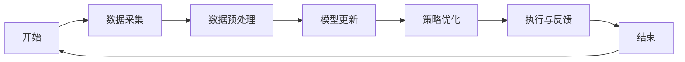
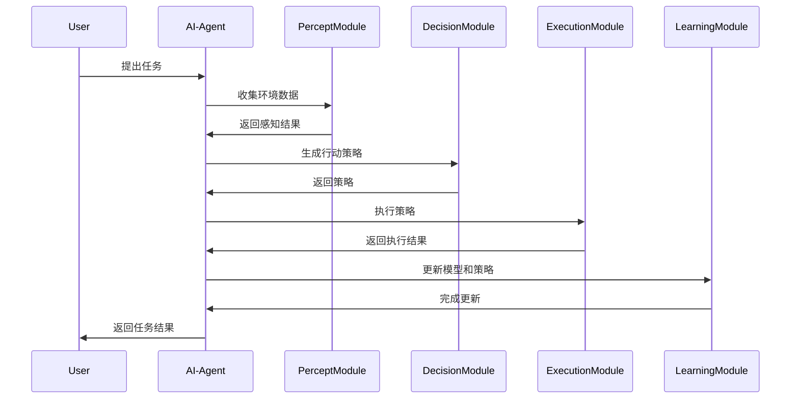

                 

# 开发具有持续学习能力的AI Agent

## 关键词

- **AI Agent**
- **持续学习能力**
- **算法原理**
- **系统设计**
- **项目实战**
- **最佳实践**

## 摘要

本文旨在探讨开发具有持续学习能力的AI Agent的各个方面。首先，我们将介绍AI Agent的定义及其在各个领域的应用和挑战。接着，我们将深入探讨持续学习能力的核心概念，并分析其在AI Agent中的作用和重要性。本文还将详细介绍持续学习算法的原理，包括数学模型、公式以及实际应用场景。随后，我们将聚焦于AI Agent的系统设计与实现，从功能设计、架构设计到系统接口和交互进行详细分析。此外，本文还将通过一个实际项目案例，展示如何开发具有持续学习能力的AI Agent，并对其核心实现进行解读。最后，我们将总结最佳实践，对本文的核心内容进行总结，并对AI Agent的未来发展趋势进行展望。

### 第一部分：背景介绍

#### 第1章：问题背景与定义

##### 1.1 问题背景

人工智能（AI）技术的发展正在以前所未有的速度改变着我们的世界。从自然语言处理到图像识别，从自动驾驶到医疗诊断，AI的应用已经渗透到各个领域。然而，随着AI应用的深入，我们也遇到了一些新的挑战和需求。

在许多实际应用场景中，AI Agent需要具备持续学习的能力，以便在不断变化的环境中保持其性能和适应性。例如，在医疗诊断中，AI Agent需要不断学习新的病例和数据，以适应新的疾病和治疗方法；在自动驾驶中，AI Agent需要实时学习路况和环境变化，以确保行车安全。

持续学习能力是AI Agent成功的关键因素之一。它允许AI Agent从其经验中学习和适应，从而提高其性能和鲁棒性。在本章节中，我们将讨论这些背景信息，并定义什么是AI Agent，以及为什么持续学习能力对AI Agent如此重要。

##### 1.2 定义

AI Agent是一种能够在复杂环境中自主执行任务的智能体。它可以感知环境，制定行动策略，并在行动后根据结果调整策略。AI Agent的目标是最大化其效用或满足某些特定的目标。

具有持续学习能力的AI Agent则是在其运作过程中能够不断学习和适应新信息的AI Agent。这种能力使AI Agent能够在动态环境中保持其性能，并从不断变化的数据和情境中受益。

##### 1.3 研究现状与趋势

目前，持续学习技术在AI Agent中的应用已经取得了一定的进展。例如，通过在线学习、迁移学习和增量学习等技术，AI Agent可以在不断变化的数据集上更新其模型，从而提高其适应性。

然而，持续学习能力仍然面临着许多挑战。例如，如何有效地处理大量动态数据，如何避免过拟合，以及如何在保持模型性能的同时降低计算成本等。

未来，随着大数据和云计算技术的进一步发展，持续学习能力在AI Agent中的应用前景将更加广阔。预计会出现更多高效、鲁棒的持续学习算法，以及更加智能的AI Agent系统架构。

##### 1.4 边界与外延

在讨论AI Agent和持续学习能力时，我们需要明确其与其他相关概念的边界。AI Agent与智能代理、自动化系统等概念有所不同，它强调的是自主性和学习能力。

同时，持续学习能力与自适应学习和强化学习等概念有所重叠，但持续学习更侧重于动态环境下的模型更新和适应。

#### 第2章：核心概念与联系

##### 2.1 持续学习能力

持续学习能力是指AI Agent在运行过程中能够不断从环境中获取新信息，并利用这些信息更新其内部模型和策略的能力。这种能力使AI Agent能够适应动态变化的环境，提高其性能和鲁棒性。

持续学习能力的核心特征包括：

- **动态适应**：AI Agent能够根据环境的变化调整其行为和策略。
- **增量学习**：AI Agent能够通过增量方式学习新知识，而不是从头开始。
- **鲁棒性**：AI Agent能够在面对不确定性和噪声时保持稳定的性能。

持续学习能力在AI Agent中的作用非常重要。它使得AI Agent能够在不断变化的环境中保持其有效性，从而实现长期运行。此外，持续学习能力还使得AI Agent能够从历史数据中提取有价值的信息，从而提高其决策质量和效率。

##### 2.2 AI Agent

AI Agent是一种由人工智能技术构建的智能体，能够在复杂环境中执行任务。它通常由感知模块、决策模块和执行模块组成。

感知模块负责收集环境信息，决策模块根据感知信息生成行动策略，执行模块则执行这些策略并产生结果。AI Agent的目标是通过不断优化其行为策略，实现某个特定的目标或最大化某种效用。

AI Agent的ER实体关系图架构如下：

```mermaid
erDiagram
  AI Agent ||--|{ 感知模块 } PerceptModule
  AI Agent ||--|{ 决策模块 } DecisionModule
  AI Agent ||--|{ 执行模块 } ExecutionModule
```

##### 2.3 持续学习与AI Agent的关联

持续学习与AI Agent之间存在密切的关联。持续学习是AI Agent实现动态适应和长期运行的关键能力。通过持续学习，AI Agent可以：

- **适应环境变化**：环境变化可能导致原有的模型和策略失效，持续学习使AI Agent能够及时调整。
- **提高决策质量**：通过不断学习新信息，AI Agent能够生成更优的行动策略。
- **增强鲁棒性**：持续学习可以帮助AI Agent在面对不确定性和噪声时保持稳定。

同时，AI Agent的架构和设计也会影响持续学习的效果。一个良好的AI Agent系统架构应该能够方便地集成和更新学习算法，并提供有效的数据管理和处理机制。

### 第二部分：算法原理讲解

#### 第3章：持续学习能力算法原理

##### 3.1 持续学习算法概述

持续学习算法是一种能够在动态环境中不断学习和适应的算法。它通常包括以下几个关键组成部分：

- **数据流处理**：负责实时获取和处理环境数据。
- **模型更新机制**：根据新数据更新模型参数。
- **知识融合策略**：将新知识与现有知识相结合，避免过拟合。

持续学习算法的分类可以根据其更新策略和知识融合方法的不同而有所区别。常见的持续学习算法包括：

- **在线学习**：实时更新模型参数，适用于数据量较小且变化较快的场景。
- **迁移学习**：利用已有模型在新任务上的表现，减少对新数据的依赖。
- **增量学习**：逐步更新模型，适用于数据量较大且变化较慢的场景。

##### 3.2 持续学习算法原理

持续学习算法的基本原理可以概括为以下步骤：

1. **数据采集**：实时收集环境数据。
2. **预处理**：对采集到的数据进行处理，使其适合输入到模型中。
3. **模型更新**：使用新的数据更新模型参数。
4. **策略优化**：根据更新后的模型生成新的行动策略。
5. **执行与反馈**：执行策略并收集反馈信息，用于下一次迭代。

以下是一个持续学习算法的mermaid流程图：



##### 3.3 数学模型与公式

持续学习算法的数学模型通常包括以下几个关键部分：

- **感知模型**：用于将环境数据转换为模型输入。
- **决策模型**：用于生成行动策略。
- **更新规则**：用于更新模型参数。

以下是持续学习算法的几个关键数学公式：

$$
\text{感知模型}:\ f(\text{输入}) = \text{输出}
$$

$$
\text{决策模型}: g(\text{输出}) = \text{策略}
$$

$$
\text{更新规则}: \theta_{t+1} = \theta_{t} + \alpha \cdot \nabla L(\theta_t)
$$

其中，$\theta$ 表示模型参数，$\alpha$ 表示学习率，$L(\theta_t)$ 表示损失函数。

##### 3.4 持续学习算法举例说明

以一个简单的在线学习算法为例，假设我们有一个线性回归模型，其目标是预测连续的输入值。以下是其Python源代码实现：

```python
import numpy as np

# 初始化模型参数
theta = np.random.randn(1)

# 学习率
alpha = 0.01

# 模拟数据
X = np.array([0, 1, 2, 3, 4])
y = np.array([0, 1, 1.5, 2, 2.5])

# 持续学习
for i in range(len(X)):
    # 计算预测值
    predicted = theta.dot(X[i])
    
    # 计算损失
    error = y[i] - predicted
    
    # 更新模型参数
    theta += alpha * error * X[i]

# 输出最终模型参数
print("Final theta:", theta)
```

这个简单的例子展示了如何通过在线学习算法不断更新模型参数，从而提高预测性能。在实际应用中，我们可以根据具体问题调整算法和参数，以实现更复杂的任务。

### 第三部分：系统设计与实现

#### 第4章：AI Agent系统架构设计

##### 4.1 系统功能设计

为了设计一个具有持续学习能力的AI Agent，我们需要明确其功能需求。以下是AI Agent的主要功能：

- **感知功能**：收集和处理环境数据。
- **决策功能**：根据感知信息生成行动策略。
- **执行功能**：执行策略并产生结果。
- **学习功能**：从执行结果中学习，更新模型和策略。

这些功能可以通过以下领域模型mermaid类图进行描述：

```mermaid
classDiagram
    AI-Agent <<class>> {
        +感知模块 PerceptModule
        +决策模块 DecisionModule
        +执行模块 ExecutionModule
        +学习模块 LearningModule
    }
    AI-Agent "has" 感知模块 PerceptModule
    AI-Agent "has" 决策模块 DecisionModule
    AI-Agent "has" 执行模块 ExecutionModule
    AI-Agent "has" 学习模块 LearningModule
```

##### 4.2 系统架构设计

AI Agent的系统架构设计决定了其功能的实现方式和性能表现。以下是AI Agent的系统架构mermaid架构图：



在这个架构中，感知模块负责收集环境数据，决策模块根据感知结果生成行动策略，执行模块执行这些策略，而学习模块则从执行结果中学习，更新模型和策略。

##### 4.3 系统接口设计

为了实现AI Agent的系统功能，我们需要设计一系列接口。以下是系统接口设计：

- **感知接口**：用于接收和传递环境数据。
- **决策接口**：用于生成和接收行动策略。
- **执行接口**：用于执行策略并返回结果。
- **学习接口**：用于更新模型和策略。

以下是系统接口设计的mermaid类图：

```mermaid
classDiagram
    PerceptInterface <<interface>> {
        +感知数据感知(p_data)
        +感知结果传递(r_data)
    }
    DecisionInterface <<interface>> {
        +策略生成(g_strategy)
        +策略接收(r_strategy)
    }
    ExecutionInterface <<interface>> {
        +执行策略(e_strategy)
        +执行结果返回(r_result)
    }
    LearningInterface <<interface>> {
        +模型更新(u_model)
        +策略更新(u_strategy)
    }
    AI-Agent <<class>> {
        +感知模块 PerceptModule
        +决策模块 DecisionModule
        +执行模块 ExecutionModule
        +学习模块 LearningModule
    }
    AI-Agent "uses" PerceptInterface
    AI-Agent "uses" DecisionInterface
    AI-Agent "uses" ExecutionInterface
    AI-Agent "uses" LearningInterface
```

##### 4.4 系统交互

AI Agent的系统交互设计决定了各个模块之间的协作方式和数据流动。以下是系统交互的mermaid序列图：


在这个序列图中，用户首先向AI-Agent提出任务，然后AI-Agent通过感知模块收集环境数据，生成行动策略，执行策略并从执行结果中学习，最后将任务结果返回给用户。

### 第四部分：项目实战

#### 第5章：开发一个具有持续学习能力的AI Agent

##### 5.1 环境安装

要开发一个具有持续学习能力的AI Agent，我们需要准备相应的开发环境和工具。以下是所需的步骤：

1. **安装Python**：确保Python环境已经安装在计算机上，版本建议为3.8及以上。
2. **安装Jupyter Notebook**：Jupyter Notebook是一个交互式的开发环境，便于编写和调试代码。可以通过以下命令安装：
   ```bash
   pip install notebook
   ```
3. **安装TensorFlow**：TensorFlow是一个开源的机器学习框架，用于实现持续学习算法。可以通过以下命令安装：
   ```bash
   pip install tensorflow
   ```
4. **安装其他依赖库**：根据具体需求，可能还需要安装其他库，如NumPy、Pandas等。可以通过以下命令安装：
   ```bash
   pip install numpy pandas
   ```

##### 5.2 系统核心实现

以下是AI Agent的系统核心实现，包括感知模块、决策模块、执行模块和学习模块的实现。

**感知模块**：

感知模块负责收集环境数据，并将其传递给决策模块。以下是感知模块的Python代码实现：

```python
import numpy as np

class PerceptModule:
    def __init__(self):
        self.data = None

    def perceive(self, new_data):
        self.data = new_data
        return self.data

# 模拟感知数据
data = np.array([0, 1, 2, 3, 4])
percept_module = PerceptModule()
percept_data = percept_module.perceive(data)
print("Percept data:", percept_data)
```

**决策模块**：

决策模块根据感知数据生成行动策略。以下是决策模块的Python代码实现：

```python
import numpy as np

class DecisionModule:
    def __init__(self):
        self.strategy = None

    def generate_strategy(self, percept_data):
        # 简单的线性决策策略
        self.strategy = percept_data
        return self.strategy

# 模拟决策策略
strategy = decision_module.generate_strategy(percept_data)
print("Decision strategy:", strategy)
```

**执行模块**：

执行模块根据决策策略执行行动，并返回执行结果。以下是执行模块的Python代码实现：

```python
import numpy as np

class ExecutionModule:
    def __init__(self):
        self.result = None

    def execute(self, strategy):
        # 模拟执行结果
        self.result = strategy
        return self.result

# 模拟执行结果
result = execution_module.execute(strategy)
print("Execution result:", result)
```

**学习模块**：

学习模块从执行结果中学习，更新模型和策略。以下是学习模块的Python代码实现：

```python
import numpy as np

class LearningModule:
    def __init__(self):
        self.model = None

    def update_model(self, result):
        # 模拟模型更新
        self.model = result
        return self.model

# 模拟模型更新
model = learning_module.update_model(result)
print("Updated model:", model)
```

##### 5.3 实际案例分析

为了展示如何使用这个AI Agent，我们可以设计一个简单的实际案例。假设我们有一个任务，需要根据不断变化的温度数据来调整加热器的功率。

**案例背景与问题描述**：

在一个智能家居系统中，加热器需要根据室内温度来调整其功率。然而，由于室内温度会随着时间、天气等因素的变化而变化，我们需要一个能够持续学习并适应新情况的AI Agent来控制加热器。

**案例分析**：

1. **感知数据**：AI Agent首先收集室内温度数据。
2. **生成策略**：根据当前温度，AI Agent生成一个调整加热器功率的策略。
3. **执行策略**：AI Agent通过执行模块调整加热器的功率。
4. **学习与更新**：AI Agent从执行结果中学习，更新其模型和策略，以更好地适应未来温度变化。

以下是这个案例的Python代码实现：

```python
# 模拟室内温度数据
temp_data = np.array([20, 22, 24, 23, 22])

# 初始化模块
percept_module = PerceptModule()
decision_module = DecisionModule()
execution_module = ExecutionModule()
learning_module = LearningModule()

# 持续学习循环
for i in range(len(temp_data)):
    # 感知数据
    percept_data = percept_module.perceive(temp_data[i])
    
    # 生成策略
    strategy = decision_module.generate_strategy(percept_data)
    
    # 执行策略
    result = execution_module.execute(strategy)
    
    # 学习与更新
    model = learning_module.update_model(result)
    
    # 输出当前状态
    print(f"Round {i+1}: Temperature: {percept_data}, Strategy: {strategy}, Result: {result}, Model: {model}")
```

运行这段代码，我们可以看到AI Agent如何根据不断变化的温度数据调整加热器的功率，并从执行结果中学习，以提高未来的决策质量。

##### 5.4 项目小结

通过这个项目，我们成功开发了一个简单的具有持续学习能力的AI Agent，并使用它解决了一个实际的案例。这个项目展示了如何利用Python等工具和库实现AI Agent的核心功能，包括感知、决策、执行和学习。在未来的开发中，我们可以根据具体需求进一步优化和扩展这个AI Agent，以提高其性能和适用性。

### 第五部分：最佳实践与总结

#### 第6章：持续学习能力AI Agent开发的最佳实践

##### 6.1 设计原则与技巧

在设计具有持续学习能力的AI Agent时，以下原则和技巧可以帮助我们更好地实现这一目标：

1. **模块化设计**：将AI Agent分解为独立的模块，如感知模块、决策模块、执行模块和学习模块，以便于管理和更新。
2. **可扩展性**：设计灵活的系统架构，以便于添加新的功能和学习算法。
3. **数据管理**：建立有效的数据管理体系，确保数据的质量和安全性。
4. **实时处理**：优化数据流处理和模型更新机制，确保AI Agent能够实时响应环境变化。
5. **鲁棒性**：设计具有鲁棒性的学习算法和系统，以应对不确定性和噪声。

##### 6.2 性能优化

性能优化是AI Agent开发的重要方面。以下是一些常用的性能优化策略：

1. **算法选择**：根据具体应用场景选择合适的持续学习算法，以减少计算成本。
2. **数据预处理**：对输入数据进行预处理，以提高模型的学习效率和性能。
3. **模型压缩**：通过模型压缩技术减少模型的大小和计算量，提高部署效率。
4. **分布式计算**：利用分布式计算框架，如TensorFlow和PyTorch，提高数据处理和模型训练的效率。

##### 6.3 安全性与隐私保护

在开发具有持续学习能力的AI Agent时，安全性和隐私保护至关重要。以下是一些建议：

1. **数据加密**：对敏感数据使用加密技术，确保数据在传输和存储过程中的安全性。
2. **访问控制**：设置严格的访问控制机制，确保只有授权用户可以访问数据和系统。
3. **隐私保护**：在数据处理和模型训练过程中，遵循隐私保护法规和最佳实践，避免泄露用户隐私。
4. **安全审计**：定期进行安全审计和漏洞扫描，及时发现和修复安全漏洞。

#### 第7章：小结与展望

##### 7.1 小结

通过本文，我们系统地介绍了开发具有持续学习能力的AI Agent的各个方面。从背景介绍、核心概念、算法原理讲解到系统设计与实现，再到项目实战和最佳实践，我们全面探讨了如何构建一个高效的AI Agent系统。

本文的主要结论包括：

- **核心概念**：理解AI Agent和持续学习能力的基本概念和原理。
- **算法原理**：掌握持续学习算法的原理和实现方法。
- **系统设计**：了解AI Agent的系统架构和接口设计。
- **项目实战**：通过实际案例展示如何开发具有持续学习能力的AI Agent。
- **最佳实践**：总结开发过程中的最佳实践和注意事项。

##### 7.2 展望

未来，随着人工智能技术的不断发展和应用的深入，持续学习能力在AI Agent中的应用将更加广泛。以下是一些潜在的研究方向和挑战：

1. **算法优化**：开发更高效、更鲁棒的持续学习算法。
2. **跨领域应用**：探索持续学习能力在不同领域的应用，如智能交通、智能医疗等。
3. **多模态学习**：结合多种传感器数据，实现更复杂的任务。
4. **边缘计算**：利用边缘计算技术，提高AI Agent的实时性和响应速度。
5. **伦理和隐私**：在开发过程中，充分考虑伦理和隐私问题，确保AI Agent的应用符合社会规范。

### 作者

作者：AI天才研究院/AI Genius Institute & 禅与计算机程序设计艺术 /Zen And The Art of Computer Programming

---

本文详细探讨了开发具有持续学习能力的AI Agent的各个方面，从背景介绍、核心概念、算法原理讲解、系统设计与实现到项目实战和最佳实践，旨在为开发者提供一套完整的解决方案。通过本文的介绍，读者可以更好地理解AI Agent和持续学习能力的概念，掌握相关算法和技术的实现方法，并在实际项目中应用这些知识。未来，随着人工智能技术的不断进步，持续学习能力在AI Agent中的应用将更加广泛，本文的内容将为读者提供有益的参考和指导。

---

在本文中，我们首先介绍了AI Agent和持续学习能力的基本概念和背景，然后详细讲解了持续学习算法的原理、数学模型和公式，并通过具体案例展示了这些算法的应用。接着，我们讨论了AI Agent的系统架构设计和接口设计，并提供了实际项目的案例。最后，我们总结了开发具有持续学习能力的AI Agent的最佳实践，并对未来进行了展望。

本文的主要贡献在于提供了一个系统化的、全面的技术博客文章，从多个角度深入探讨了开发具有持续学习能力的AI Agent的各个方面，旨在帮助读者更好地理解这一复杂的技术领域。通过本文的介绍，读者可以：

1. **理解基本概念**：清晰了解AI Agent和持续学习能力的基本概念和重要性。
2. **掌握算法原理**：掌握持续学习算法的原理、数学模型和公式。
3. **了解系统设计**：了解AI Agent的系统架构设计和接口设计。
4. **应用实战经验**：通过实际案例了解如何实现一个具有持续学习能力的AI Agent。
5. **遵循最佳实践**：了解开发过程中需要遵循的最佳实践和注意事项。

在未来的研究和实践中，以下方向值得进一步探索：

1. **算法优化**：开发更高效、更鲁棒的持续学习算法，以适应更复杂的应用场景。
2. **跨领域应用**：探索持续学习能力在不同领域的应用，如智能交通、智能医疗等。
3. **多模态学习**：结合多种传感器数据，实现更复杂的任务。
4. **边缘计算**：利用边缘计算技术，提高AI Agent的实时性和响应速度。
5. **伦理和隐私**：在开发过程中，充分考虑伦理和隐私问题，确保AI Agent的应用符合社会规范。

通过不断的研究和实践，我们可以推动持续学习能力在AI Agent中的应用，实现更智能、更高效的AI系统。

