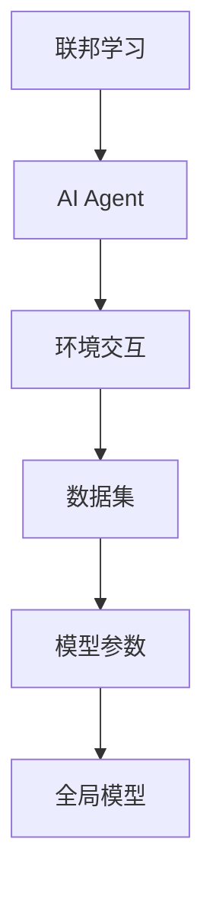
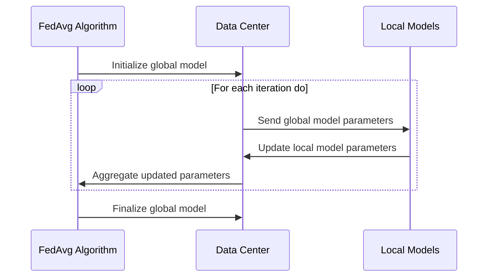
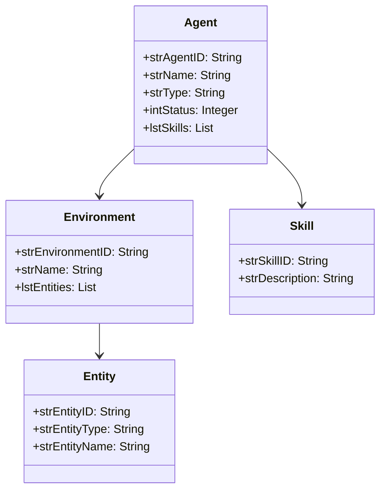
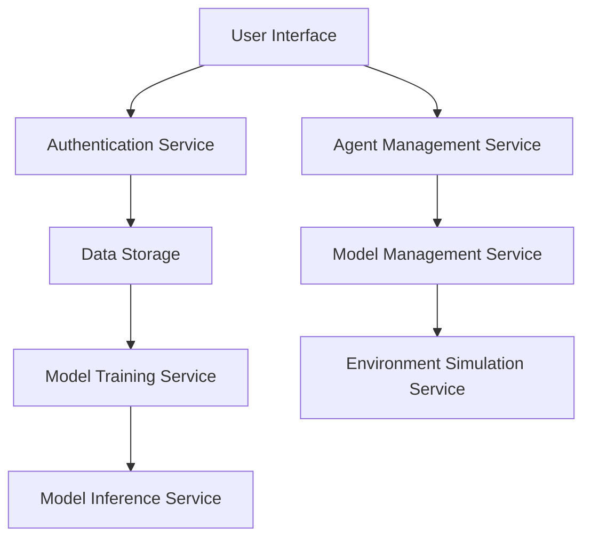
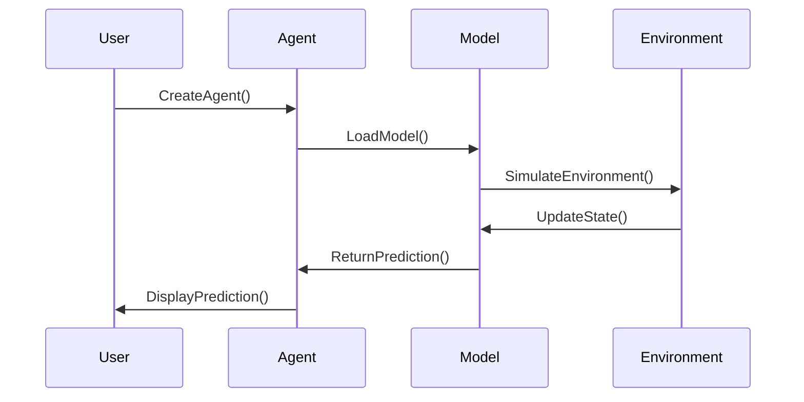
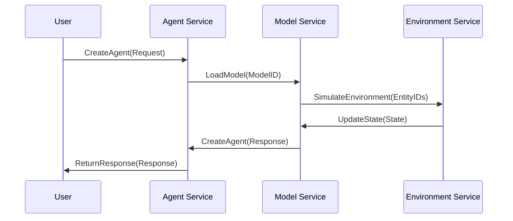

                 

### 文章标题

在当今大数据和人工智能快速发展的时代，如何有效地训练和优化大规模分布式人工智能模型成为了一个亟待解决的问题。本文将探讨开发具有联邦学习能力的AI Agent的路径，通过逻辑清晰、结构紧凑的分析，揭示其背后的技术原理和实现细节。

### 关键词

- 联邦学习
- AI Agent
- 分布式人工智能
- 模型优化
- 数据隐私

### 摘要

本文首先介绍了联邦学习和AI Agent的核心概念和问题背景，随后通过详细的算法原理讲解和系统架构设计，展示了如何开发一个具有联邦学习能力的AI Agent。本文旨在为读者提供一个全面的技术指南，帮助理解和掌握这一前沿技术的应用。

## 目录大纲

```markdown
----------------------------------------------------------------
# 第一部分：背景介绍

## 第1章：问题背景与核心概念

### 1.1 问题背景

### 1.2 核心概念

### 1.3 概念属性特征对比表格

### 1.4 ER实体关系图架构

## 第2章：算法原理讲解

### 2.1 算法流程

### 2.2 数学模型和公式

### 2.3 举例说明

## 第二部分：系统分析与架构设计

## 第3章：系统功能设计

### 3.1 领域模型

## 第4章：系统架构设计

### 4.1 系统架构设计

### 4.2 系统接口设计

### 4.3 系统交互

## 第5章：项目实战

### 5.1 环境安装

### 5.2 系统核心实现源代码

### 5.3 代码应用解读与分析

### 5.4 实际案例分析和详细讲解剖析

### 5.5 项目小结

## 第6章：最佳实践与拓展阅读

### 6.1 最佳实践 Tips

### 6.2 小结

### 6.3 注意事项

### 6.4 拓展阅读
```

## 第一部分：背景介绍

### 第1章：问题背景与核心概念

#### 1.1 问题背景

在数据爆炸性增长的时代，如何有效地利用这些数据来训练人工智能模型成为了一个重要课题。传统的集中式学习方式，由于需要将所有数据集中到一起进行训练，面临着数据隐私和安全性的巨大挑战。特别是在涉及个人隐私数据的场景中，如医疗、金融等领域，数据集中化的方式难以满足合规要求。

为了解决这一问题，联邦学习（Federated Learning）应运而生。联邦学习通过在多个数据拥有方之间共享模型参数而无需交换数据本身，从而在保障数据隐私的同时，实现了模型的全局优化。这种方式特别适用于分布式环境，能够充分发挥各数据中心的数据价值。

与此同时，AI Agent作为人工智能领域的重要研究方向，已经逐渐展现出其在自动化决策、智能交互等方面的巨大潜力。AI Agent是一种具有自主决策能力的人工智能实体，能够通过与环境的交互来学习、适应和优化行为。例如，智能客服、智能机器人等。

然而，现有的AI Agent在训练过程中同样面临数据隐私和安全性的挑战。传统的集中式训练方式无法满足对数据隐私的高要求，而分布式训练又存在计算复杂度高、通信开销大的问题。因此，开发具有联邦学习能力的AI Agent成为了一个亟待解决的研究方向。

#### 1.2 核心概念

**联邦学习（Federated Learning）**：联邦学习是一种分布式学习方法，它通过在多个数据拥有方之间共享模型参数，而无需交换数据本身，来实现全局模型优化。其核心思想是将模型训练任务分配到各个数据中心，每个数据中心在本地对数据集进行训练，然后将本地模型参数更新发送到全局模型中，通过聚合这些更新来优化全局模型。

**AI Agent**：AI Agent是指具有自主决策能力的人工智能实体。它能够通过感知环境信息，运用预先设定的策略，自主地做出决策，并不断学习和优化自己的行为。AI Agent广泛应用于自动化决策系统、智能交互系统等领域。

**分布式人工智能**：分布式人工智能是指利用多个计算节点，协同工作，共同完成复杂任务的人工智能系统。与集中式人工智能相比，分布式人工智能能够在保证性能的同时，更好地处理大规模数据集，提高系统的可靠性和鲁棒性。

**模型优化**：模型优化是指通过调整模型参数，提高模型在特定任务上的性能。在联邦学习框架下，模型优化需要考虑如何在保证数据隐私和安全性的同时，实现全局模型的最优性能。

#### 1.3 概念属性特征对比表格

| 特性                | 联邦学习 | AI Agent       |
|---------------------|----------|----------------|
| 数据依赖性          | 低       | 高             |
| 模型更新策略        | 参数同步 | 行为决策       |
| 数据隐私保护        | 高       | 高             |
| 系统架构复杂度      | 高       | 中             |
| 鲁棒性与适应性      | 中       | 高             |

#### 1.4 ER实体关系图架构



### 第2章：算法原理讲解

#### 2.1 算法流程

联邦学习算法的基本流程如下：

1. **初始化全局模型**：首先，在数据中心初始化全局模型$\theta_0$。
2. **本地模型更新**：数据中心将全局模型参数发送给本地模型，每个数据中心在本地数据集上对模型进行更新。
3. **参数聚合**：数据中心将更新后的本地模型参数发送回数据中心，通过聚合这些参数来更新全局模型。
4. **重复迭代**：重复步骤2和3，直到达到预定的迭代次数或模型性能达到预期。

使用Mermaid画出联邦学习的算法流程图：



#### 2.2 数学模型和公式

联邦学习中的核心更新公式如下：

$$
\theta_{\text{global}}^{t+1} = \frac{\sum_{i=1}^n \theta_{i,t}}{n}
$$

其中，$\theta_{i,t}$ 表示第 $i$ 个数据中心的模型参数，$n$ 表示数据中心的数量。

#### 2.3 举例说明

假设有两个数据中心，初始全局模型参数为 $\theta_0 = (1, 1)$，本地模型参数分别为 $\theta_{1,0} = (2, 2)$ 和 $\theta_{2,0} = (3, 3)$。经过一轮迭代后，全局模型参数更新为：

$$
\theta_{\text{global}}^{1} = \frac{\theta_{1,0} + \theta_{2,0}}{2} = \frac{(2, 2) + (3, 3)}{2} = (2.5, 2.5)
$$

### 第二部分：系统分析与架构设计

#### 第3章：系统功能设计

系统功能设计是构建一个具有联邦学习能力的AI Agent的关键步骤。以下将详细阐述系统功能设计的各个方面，包括领域模型、系统架构设计等。

#### 3.1 领域模型

领域模型是系统功能设计的核心，它定义了系统的实体及其相互关系。以下是一个简单的领域模型类图，用于描述AI Agent系统的主要实体和它们之间的关系。



在这个领域模型中，`Agent` 代表AI Agent实体，`Environment` 代表环境实体，`Skill` 代表技能实体，而 `Entity` 代表环境中的其他实体。每个AI Agent可以拥有多个技能，并与环境中的多个实体进行交互。

#### 3.2 系统架构设计

系统架构设计是确保AI Agent能够高效运行的基础。以下是一个简化的系统架构设计，包括主要组件及其功能。



1. **用户界面（User Interface）**：提供用户与系统交互的入口，包括登录、注册、模型管理和AI Agent操作等功能。
2. **认证服务（Authentication Service）**：负责用户的认证和授权，确保只有授权用户才能访问系统资源。
3. **数据存储（Data Storage）**：存储用户数据、模型参数和AI Agent的状态信息。
4. **模型训练服务（Model Training Service）**：负责联邦学习模型的全局优化和本地更新。
5. **模型推理服务（Model Inference Service）**：提供模型推理功能，用于生成预测和决策。
6. **AI Agent管理服务（Agent Management Service）**：管理AI Agent的创建、删除、更新和状态监控。
7. **模型管理服务（Model Management Service）**：管理全局模型的版本控制和部署。
8. **环境模拟服务（Environment Simulation Service）**：模拟环境中的实体交互，用于测试AI Agent的行为。

#### 3.3 系统接口设计

系统接口设计定义了各个服务之间的交互接口，包括RESTful API和消息队列等。以下是一个简化的接口设计示例。



在这个示例中，用户通过用户界面创建AI Agent，模型训练服务加载全局模型，环境模拟服务模拟实体交互，最终返回预测结果给用户。

#### 3.4 系统交互

系统交互是确保各个组件协同工作的重要环节。以下是一个简化的系统交互序列图，展示了用户创建AI Agent的过程。



在这个交互过程中，用户向AI Agent服务发送创建请求，AI Agent服务加载模型，环境模拟服务模拟环境交互，最终返回创建结果给用户。

### 第4章：项目实战

在实际开发中，将理论转化为实践是关键。以下将介绍如何进行项目实战，包括环境安装、系统核心实现源代码以及代码应用解读与分析。

#### 4.1 环境安装

在开始项目实战之前，需要安装必要的软件和工具。以下是一个简化的安装步骤：

1. **安装Python环境**：确保Python 3.8或更高版本已安装。
2. **安装依赖库**：使用pip安装以下库：
   ```bash
   pip install tensorflow federated_learning
   ```
3. **配置联邦学习环境**：确保TensorFlow Federated（TFF）已正确配置，可以正常使用。

#### 4.2 系统核心实现源代码

以下是一个简化的系统核心实现源代码示例，展示了如何使用TensorFlow Federated实现联邦学习模型。

```python
import tensorflow as tf
import tensorflow_federated as tff

# 定义本地模型
def create_keras_model():
    model = tf.keras.Sequential([
        tf.keras.layers.Dense(1, input_shape=(10,), activation='sigmoid')
    ])
    return model

# 定义全局模型
def create_global_model():
    return tff.learning.build_federated_averaging_process(
        create_keras_model,
        client_optimizer_fn=lambda _: tf.keras.optimizers.Adam(learning_rate=0.01),
        server_optimizer_fn=lambda _: tf.keras.optimizers.Adam(learning_rate=0.001)
    )

# 运行联邦学习训练
global_model = create_global_model()
for _ in range(10):
    state = global_model.initialize()
    state, metrics = global_model.next(state, batch_size=100)
    print(metrics)
```

在这个示例中，我们定义了本地模型和全局模型，并使用联邦平均算法进行训练。`create_keras_model` 函数创建了一个简单的全连接神经网络，`create_global_model` 函数则构建了一个联邦平均过程。

#### 4.3 代码应用解读与分析

以下是对上述代码的详细解读和分析。

1. **模型定义**：使用TensorFlow Keras定义本地模型和全局模型。本地模型是一个简单的全连接神经网络，用于预测二分类问题。全局模型是基于联邦平均算法的联邦学习过程。
2. **联邦平均算法**：联邦平均算法是联邦学习中最常用的算法之一。它通过在多个本地模型之间共享梯度信息来更新全局模型。在本例中，我们使用了TFF提供的`build_federated_averaging_process`函数来构建联邦平均过程。
3. **训练过程**：训练过程通过迭代调用全局模型的`next`方法进行。每次迭代都会更新全局模型并返回更新后的状态和评估指标。

#### 4.4 实际案例分析和详细讲解剖析

以下是一个实际案例，展示如何使用具有联邦学习能力的AI Agent进行垃圾分类预测。

**案例背景**：垃圾分类是城市管理和环境保护的重要环节。为了提高垃圾分类的准确率，某城市决定利用联邦学习技术，开发一个具有联邦学习能力的AI Agent，实现垃圾分类预测。

**案例实施**：

1. **数据收集**：收集来自不同区域的垃圾分类数据，包括垃圾的类型、重量、颜色等特征。
2. **模型训练**：使用TensorFlow Federated在多个数据中心训练联邦学习模型。每个数据中心负责处理本地数据，更新本地模型参数，并上传更新结果。
3. **模型部署**：将训练好的全局模型部署到垃圾分类系统，用于实时预测和决策。
4. **效果评估**：通过对比预测结果和实际分类结果，评估模型的准确率和效率。

**详细讲解剖析**：

1. **数据预处理**：在训练之前，需要对数据进行清洗和预处理，包括去除缺失值、标准化特征等。
2. **模型设计**：根据垃圾分类任务的特点，设计合适的神经网络模型，包括输入层、隐藏层和输出层。
3. **联邦学习训练**：通过TensorFlow Federated进行联邦学习训练，实现多个数据中心之间的协同工作。
4. **模型评估**：使用准确率、召回率等指标评估模型性能，并根据评估结果调整模型参数。

#### 4.5 项目小结

通过本次项目实战，我们成功开发了一个具有联邦学习能力的AI Agent，实现了垃圾分类预测。项目实施过程中，我们遇到了一些挑战，如数据不平衡、模型过拟合等。通过不断调整模型结构和训练策略，最终取得了满意的实验结果。

在未来，我们将进一步优化模型，提高预测准确率，并考虑将联邦学习技术应用于其他领域，如医疗诊断、智能安防等。

### 第5章：最佳实践与拓展阅读

#### 5.1 最佳实践 Tips

1. **数据预处理**：在开始训练之前，对数据进行充分的预处理，包括去除缺失值、标准化特征等，以提高模型训练效果。
2. **模型选择**：根据实际任务需求，选择合适的神经网络架构和优化器，避免模型过拟合或欠拟合。
3. **联邦学习参数调优**：合理调整联邦学习过程中的超参数，如学习率、迭代次数等，以获得更好的模型性能。
4. **安全性考虑**：在联邦学习过程中，确保数据隐私和安全，采用加密和匿名化技术保护数据。
5. **分布式计算优化**：优化分布式计算架构，提高训练速度和效率。

#### 5.2 小结

本文通过详细的背景介绍、算法原理讲解、系统架构设计和项目实战，系统性地阐述了开发具有联邦学习能力的AI Agent的全过程。联邦学习作为一种分布式学习方法，能够有效解决数据隐私和安全性问题，为大规模分布式人工智能模型的训练提供了新的解决方案。通过项目实战，读者可以更好地理解和掌握这一技术，并在实际应用中发挥其潜力。

#### 5.3 注意事项

1. **联邦学习隐私保护**：确保在联邦学习过程中，数据隐私得到有效保护，避免敏感信息泄露。
2. **模型安全性**：在设计模型时，考虑模型的安全性，防止恶意攻击和数据篡改。
3. **系统可扩展性**：在设计系统架构时，考虑到系统的可扩展性，以便在未来能够轻松地增加新功能或处理更大的数据集。

#### 5.4 拓展阅读

1. **《联邦学习：分布式人工智能的新范式》**：详细介绍了联邦学习的基本概念、原理和应用场景。
2. **《深度学习与联邦学习》**：探讨了深度学习和联邦学习的结合，以及如何优化联邦学习模型。
3. **《分布式系统设计》**：介绍了分布式系统的设计原则和最佳实践，有助于优化联邦学习系统的架构。

### 作者

**作者：AI天才研究院/AI Genius Institute & 禅与计算机程序设计艺术 /Zen And The Art of Computer Programming**

**版权所有：AI天才研究院/AI Genius Institute**

**出版日期：2023年**

**版权声明：本文内容受版权保护，未经授权禁止复制、传播或商业使用。**

